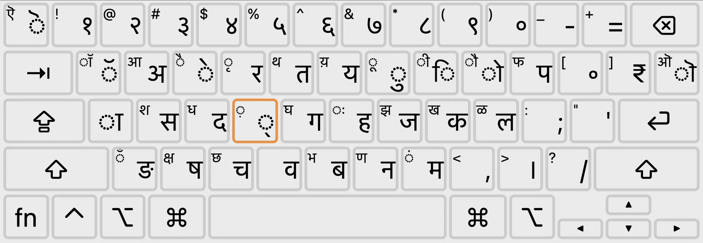
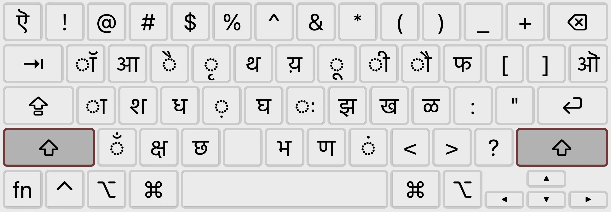
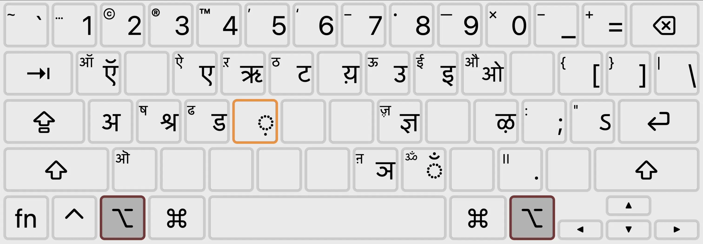
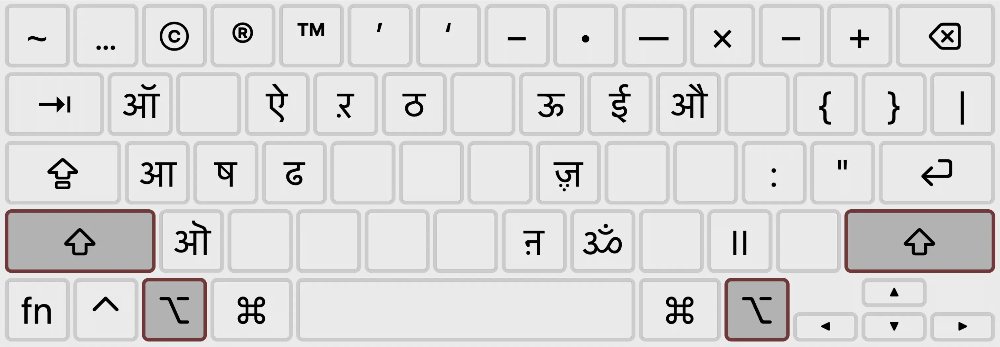
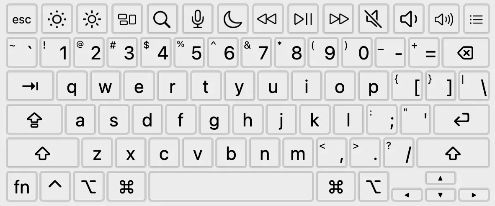
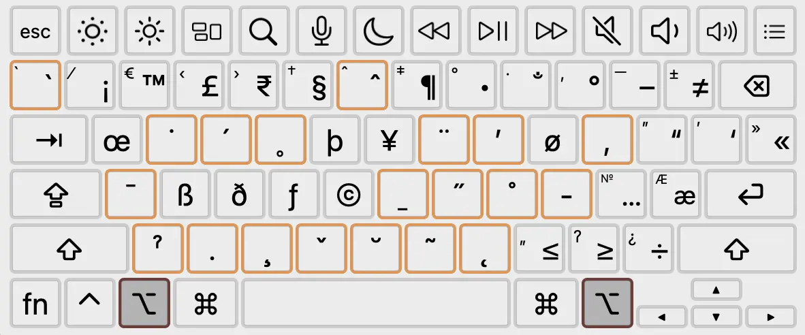

# Cách viết chữ Thiên Thành

Bộ gõ **Devanāgarī-QWERTY** trên MacOS[^1] được thiết kế sao cho những người đã quen với bố cục bàn phím theo bảng chữ cái Latin QWERTY có thể dễ dàng sử dụng. Phần lớn các chữ cái **Thiên Thành** (*Devanāgarī*) được sắp xếp tương ứng với các chữ cái trên bàn phím Latin. Bố cục này khá đơn giản và nhất quán, với chỉ một số ít những ngoại lệ.

[^1]:

    Bộ gõ đã có sẵn trong MacOS. Khi thêm bộ gõ mới, tìm kiếm từ khoá “devagari”, chọn bộ gõ **Hindi** > **Devanagari – QWERTY**

=== "Devanāgarī"
    
    

=== "++shift++"
    
    

=== "++option++"
    
    

=== "++shift+option++"
    
    

**Font chữ tham khảo**: **Sanskrit Text** (*Sanskr.ttf*) (dùng trong bản hướng dẫn này), **Sanskrit 2003** (*Sanskrit2003.ttf*), [Adishila](https://adishila.com/fonts/), [Tiro Devanagari Sanskrit](https://fonts.google.com/specimen/Tiro+Devanagari+Sanskrit). So sánh font chữ: [pdf](../assets/docs/Sanskrit-font-test.pdf), [docx](../assets/docs/Sanskrit-font-test.docx).

**Tham khảo thêm**: [Cài bộ gõ khác cho MacOS](https://support.apple.com/vi-vn/guide/mac-help/mchlp1406/mac), [Sử dụng trình xem bàn phím](https://support.apple.com/vi-vn/guide/mac-help/mchlp1406/mac), [Hướng dẫn cài đặt font cho MacOS](https://maconline.vn/cai-font-cho-mac).

## Nguyên âm (*Vowels*)

Viết nguyên âm tự nhiên theo bố cục phím QWERTY (trừ âm “a”), kết hợp với phím ++shift++ và ++option++. Trường hợp đặc biệt: <a class="sk">ॠ</a> (ṝ) và <a class="sk">ॡ</a> (ḹ) đòi hỏi giữ (tổ hợp) phím lâu hơn một chút để hiện ra các lựa chọn rồi nhấn số để hoàn thành.

=== "Nguyên âm đơn" 

    | Nguyên âm ngắn                                 |               Nguyên âm dài                           |
    | -----------------------------------------------| ---------------------------------------------------- |
    |  ++w++ &#10551; <a class="sk">अ</a> (a)       |  ++shift+w++ &#10551; <a class="sk">आ</a> (ā)       |
    |  ++shift+i++ &#10551; <a class="sk">इ</a> (i) | ++shift+option+i++ &#10551; <a class="sk">ई</a> (ī) |
    |  ++option+u++ &#10551; <a class="sk">उ</a> (u) | ++shift+option+u++ &#10551; <a class="sk">ऊ</a> (ū) |
    |  ++option+r++ &#10551; <a class="sk">ऋ</a> (ṛ)  | ++option+r+1++ &#10551; <a class="sk">ॠ</a> (ṝ) |
    |  ++l++ &#10551; <a class="sk">ल</a> (l)       | ++l+4++ &#10551; <a class="sk">ॡ</a> (ḹ) |

=== "Phức âm" 

    - ++option+e++ &#10551; <a class="sk">ए</a> (e)

    - ++shift+option+e++ &#10551; <a class="sk">ऐ</a> (ai)

    - ++option+o++ &#10551; <a class="sk">ओ</a> (o)

    - ++shift+option+o++ &#10551; <a class="sk">औ</a> (au)

## Phụ âm (*Consonants*)

Hầu hết các lần nhấn phím (*keystrokes*) phụ âm đều viết ra một âm tiết (*syllable*) đầy đủ (theo kèm với nguyên âm “a” vốn có).

Phím ++shift++ thường được nhấn kèm để viết âm tống khí (*aspiration*) hoặc các âm mũi (*nasals)*/âm xuýt (*sibilants*).
     
Tổ hợp phím ++shift+option++ cho phép viết các phụ âm cong lưỡi (*retroflex*), cũng như các âm mũi/âm xuýt bổ sung. 

<!-- https://www.toptal.com/designers/htmlarrows/arrows/ -->

=== "Thanh âm"

    | Không tống khí                                  |               Tống khí                               |
    | ----------------------------------------------- | ---------------------------------------------------- |
    |  ++k++ &#10551; <a class="sk">क</a> (ka)        | ++shift+k++ &#10551; <a class="sk">ख</a> (kha)       |
    |  ++c++ &#10551; <a class="sk">च</a> (ca)        | ++shift+c++ &#10551; <a class="sk">छ</a> (cha)       |
    |  ++option+t++ &#10551; <a class="sk">ट</a> (ṭa) | ++shift+option+t++ &#10551; <a class="sk">ठ</a> (ṭha) |
    |  ++t++ &#10551; <a class="sk">त</a> (ta)        | ++shift+t++ &#10551; <a class="sk">थ</a> (tha)        |
    |  ++p++ &#10551; <a class="sk">प</a> (pa)        | ++shift+p++ &#10551; <a class="sk">फ</a> (pha)        |

=== "Trọc âm"

    | Không tống khí                                  |               Tống khí                               |
    | ----------------------------------------------- | ---------------------------------------------------- |
    |  ++g++ &#10551; <a class="sk">ग</a> (ga)        | ++shift+g++ &#10551; <a class="sk">घ</a> (gha)       |
    |  ++j++ &#10551; <a class="sk">ज</a> (ja)        | ++shift+j++ &#10551; <a class="sk">झ</a> (jha)       |
    |  ++option+d++ &#10551; <a class="sk">ड</a> (ḍa) | ++shift+option+d++ &#10551; <a class="sk">ढ</a> (ḍha) |
    |  ++d++ &#10551; <a class="sk">द</a> (da)        | ++shift+d++ &#10551; <a class="sk">ध</a> (dha)        |
    |  ++b++ &#10551; <a class="sk">ब</a> (ba)       | ++shift+b++ &#10551; <a class="sk">भ</a> (bha)        |

=== "Âm mũi"

    - ++z++ &#10551; <a class="sk">ङ</a> (ṅa)

    - ++option+n++ &#10551; <a class="sk">ञ</a> (ña)

    - ++shift+n++ &#10551; <a class="sk">ण</a> (ṇa)

    - ++n++ &#10551; <a class="sk">न</a> (na)

    - ++m++ &#10551; <a class="sk">म</a> (ma)

=== "Bán nguyên âm"

    - ++y++ &#10551; <a class="sk">य</a> (ya)

    - ++r++ &#10551; <a class="sk">र</a> (ra)

    - ++l++ &#10551; <a class="sk">ल</a> (la)

    - ++v++ &#10551; <a class="sk">व</a> (va)

=== "Âm xuýt"

    - ++shift+s++ &#10551; <a class="sk">श</a> (śa)

    - ++shift+option++ &#10551; <a class="sk">ष</a> (ṣa)

    - ++s++ &#10551; <a class="sk">स</a> (sa)

=== "Khí âm"

    - ++h++ &#10551; <a class="sk">ह</a> (ha)

## Phụ âm kết hợp với nguyên âm

Để viết nguyên âm dài, thường nhấn thêm phím ++shift++ cùng với nguyên âm ngắn (trừ âm “ā”)

=== "ā"

    Vì mỗi phụ âm ở dạng căn bản đã chứa âm “a” đi kèm, nên khi viết ā chỉ cần thêm một âm <a class="sk">ा</a> (a) nữa (một dấu gạch đứng bên cạnh phụ âm liền trước).
    
    ++n+a+m++ &#10551; <a class="sk">न</a> + <a class="sk">ा</a> + <a class="sk">म</a> &#10551; <a class="sk">नाम</a> (nāma)

=== "i & ī"

    Nhận diện <a class="sk">ि</a> (i) và <a class="sk">ी</a> (ī)

    ++t+i++ &#10551; <a class="sk">त</a> + <a class="sk">ि</a> &#10551; <a class="sk">ति</a> (ti)

    ++d+shift+i++ &#10551; <a class="sk">द</a> + <a class="sk">ी</a> &#10551; <a class="sk">दी</a> (dī)

=== "u & ū"

    Nhận diện <a class="sk">ु</a> (u) và <a class="sk">ू</a> (ū), các dấu móc này đặt ngay dưới phụ âm liền trước.

    ++a+n+u++ &#10551; <a class="sk">अ</a> + <a class="sk">न</a> + <a class="sk">ु</a> &#10551; <a class="sk">अनु</a> (anu)

    ++shift+b+shift+u++ &#10551; <a class="sk">भ</a> + <a class="sk">ू</a> &#10551; <a class="sk">भू</a> (bhū)

=== "e & ai"

    Nhận diện <a class="sk">े</a> (e) và <a class="sk">ै</a> (ai). Dấu gạch chéo nằm ngay trên đầu phụ âm liền trước.

    ++k+e++ &#10551; <a class="sk">क</a> + <a class="sk">े</a> &#10551; <a class="sk">के</a> (ke)

    ++d+shift+e+v++ &#10551; <a class="sk">द</a> + <a class="sk">ै</a> + <a class="sk">व</a> &#10551; <a class="sk">दैव</a> (daiva)

=== "o & au"

    Nhận diện <a class="sk">ो</a> (o) và <a class="sk">ौ</a> (au). Dấu gạch đứng và gạch chéo nằm ngay bên cạnh phụ âm liền trước.

    ++g+u+r+o++ &#10551; <a class="sk">ग</a> + <a class="sk">ु</a> + <a class="sk">र</a> + <a class="sk">ो</a>&#10551; <a class="sk">गुरो</a> (guro)

    ++k+shift+o+l++ &#10551; <a class="sk">क</a> + <a class="sk">ौ</a> + <a class="sk">ल</a> &#10551; <a class="sk">कौल</a> (kaula)

=== "ṛ"

    <a class="sk">ऋ</a> (ṛ) đứng trước phụ âm: viết như bình thường 

    ++option+r+t++ &#10551; <a class="sk">ऋ</a> + <a class="sk">त</a> &#10551; <a class="sk">ऋत</a> (ṛta)
    
    <a class="sk">ऋ</a> (ṛ) đứng sau phụ âm: thường được kí hiệu bởi dấu <a class="sk">ृ</a> ngay dưới phụ âm liền trước (tham khảo cách viết Liên tự phần dưới).

    ++d+shift+r+shift+s+f++ &#10551; <a class="sk">द</a> + <a class="sk">ृ</a> + <a class="sk">श</a> + <a class="sk">्</a> &#10551; <a class="sk">दृश्</a> (dṛś)

    **Lưu ý:** phân biệt với <a class="sk">र</a> (ra) là một phụ âm, khi đi trước một phụ âm khác được kí hiệu bằng dấu móc đặt ngay trên phụ âm tiếp đó trong liên tự.
    
    ++r+f+k++ &#10551; <a class="sk">र</a> + <a class="sk">्</a> + <a class="sk">क</a> &#10551; <a class="sk">र्क</a> (rka)

## Các kí tự đặc biệt

=== "Tuỳ âm"

    | Phân loại                                       |  Ví dụ                                          |
    | ----------------------------------------------- | ---------------------------------------------------- |
    | Âm mũi **Anusvāra** <a class="sk">ं</a> (ṃ) | ++s+shift+m+g+m++ &#10551; <a class="sk">स</a> + <a class="sk">ं</a> + <a class="sk">ग</a> + <a class="sk">म</a> &#10551; <a class="sk">संगम</a> (saṃgama) |
    |  Phóng xuất **Visarga** <a class="sk">ः</a> (ḥ) | ++b+l+shift+h++ &#10551; <a class="sk">ब</a> + <a class="sk">ल</a> + <a class="sk">ः</a> &#10551; <a class="sk">बलः</a> (balaḥ) |

=== "Liên tự"

    **Virāma** <a class="sk">्</a>, thường được viết bởi phím ++f++, trước hết lược bỏ nguyên âm “a” luôn đi kèm với phụ âm.

    ++g+m+f++ &#10551; <a class="sk">ग</a> + <a class="sk">म</a> + <a class="sk">्</a>  &#10551; <a class="sk">गम्</a> (gam)

    Từ đó nối các phụ âm trong liên tự từ bằng phím ++f++ 

    ++option+n+f+c++ &#10551; <a class="sk">ञ</a> + <a class="sk">्</a> + <a class="sk">च</a>  &#10551; <a class="sk">ञ्च</a> (ñca)

    ++g+f+shift+d+f+v++ &#10551; <a class="sk">ग</a> + <a class="sk">्</a> + <a class="sk">ध</a> + <a class="sk">्</a> + <a class="sk">च</a> &#10551; <a class="sk">ग्ध्व</a> (gdhva)

    <!-- Chú ý trường hợp r đứng trước phụ âm (Phần VIII, Liên tự, Phụ lục Giáo trình Phạn Văn) र् -->         

    **Avagraha**: ++option+single-quote++ &#10551; <a class="sk">ऽ</a>

=== "Dấu ngắt"

    **Daṇḍa**: dùng để ngắt câu kệ hay đoạn văn. 
    
    ++period++ &#10551; <a class="sk">।</a> 
    
    ++shift+option+period++ &#10551; <a class="sk">॥</a>

=== "Viết tắt"
    
    Nhiều kí tự và liên tự quen thuộc có thể được viết tắt.

    ++x++ &#10551; <a class="sk">ष</a> (ṣ)

    ++z++ &#10551; <a class="sk">ङ</a> (ñ)

    ++shift+x++ &#10551; <a class="sk">क्ष</a> (kṣ)

    ++option+s++ &#10551; <a class="sk">श्र</a> (śr)

    ++option+j++ &#10551; <a class="sk">ज्ञ</a> (jñ)

    Chữ cái trong bảng Latin cũng có thể được viết bằng cách nhấn ++caps-lock++ thay vì chuyển bộ gõ.

## Cách viết kí tự IAST

Sử dụng bộ gõ **English ABC-India** (được cài đặt trong sẵn trong MacOS)[^2] để nhập kí tự Latin theo [hệ thống IAST](https://vi.wikipedia.org/wiki/IAST) (Bảng chữ cái chuẩn quốc tế kí âm Latin Phạn ngữ). 

[^2]:

    Khi thêm bộ gõ mới, tìm kiếm từ khoá “english”, chọn bộ gõ **English** > **ABC – India**

=== "QWERTY"
    
    

=== "++option++"
    
    

Cách sử tổ hợp phím để tạo kí tự IAST như sau:

=== "Nguyên âm dài"

    Nhấn tổ hợp ++option+a++ kèm nguyên âm.

    ++option+a+a++ &#10551; **ā** | ++option+a+i++ &#10551; **ī**

    ++option+a+u++ &#10551; **ū** | ++option+a+r++ &#10551; **ṝ**

=== "Âm mũi"

    Nhấn tổ hợp ++option+x++ kèm âm tiết cho dấu chấm dưới:

    ++option+x+t++ &#10551; **ṭ**  | ++option+x+n++ &#10551; **ṇ**

    ++option+x+r++ &#10551; **ṛ** | ++option+x+l++ &#10551; **ḷ**

    ++option+x+r++ &#10551; **ṃ** | ++option+x+l++ &#10551; **ṣ**

=== "Kí tự khác"

    Dấu sắc trên: ++option+e+s++ &#10551; **ś**

    Dấu ngã trên: ++option+n+n++ &#10551; **ñ**