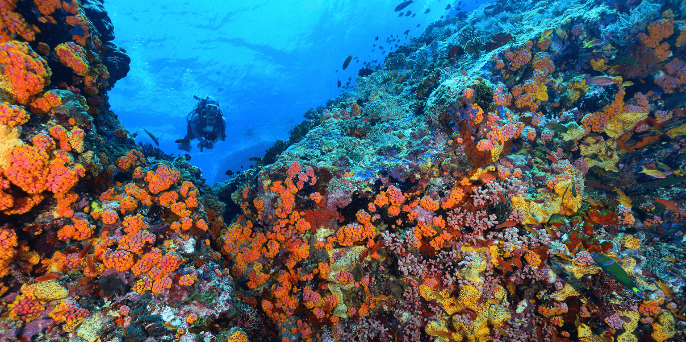

# Sáng kiến 30 × 30

Thiên nhiên đang trong tình trạng sụp đổ. Một triệu loài trên toàn thế giới đang đối mặt với nguy cơ tuyệt chủng. Nhưng chúng ta có những công cụ để tạo ra một tương lai tốt đẹp hơn, lành mạnh hơn cho hành tinh&mdash;và cho chính con người&mdash;nếu chúng ta hành động ngay bây giờ. Năm 2016, nhà sinh vật học và nhà tự nhiên học hai lần đoạt giải Pulitzer người Mỹ, E.O. Wilson, đã xuất bản cuốn sách **“Nửa Trái đất: Cuộc chiến vì sự sống của hành tinh chúng”**. Trong đó, ông đưa ra trường hợp khoa học về giải pháp cho cuộc khủng hoảng đa dạng sinh học: dành toàn bộ một nửa bề mặt Trái đất cho thiên nhiên. Một bước quan trọng để đạt được mục tiêu đó là bảo vệ 30% đất và nước toàn cầu và 30% diện tích đại dương vào năm 2030 (Sáng kiến 30 × 30).

Các ấn phẩm khoa học dưới đây cho thấy sự cần thiết và giá trị của việc bảo vệ đất, nước và đại dương nhằm: 

- **Ngăn chặn sự tuyệt chủng hàng loạt và thúc đẩy đa dạng sinh học toàn cầu**; 

- **Chống lại tác động của biến đổi khí hậu** bằng cách giữ nguyên các khu vực như rừng, rừng ngập mặn, vùng đất ngập nước và đồng cỏ hấp thụ lượng lớn các-bon; 

- **Tạo điều kiện thuận lợi cho việc thích nghi với khí hậu** bằng cách cung cấp nơi trú ẩn an toàn nơi động vật hoang dã có thể phát triển mạnh mà không gặp áp lực nào khác;

- **Đảm bảo rằng các hệ thống tự nhiên** mà chúng ta phụ thuộc vào để có được thực phẩm, ôxy và các dịch vụ thiết yếu khác được duy trì.

## Hai tài liệu khoa học cơ bản hỗ trợ sáng kiến 30 × 30:

[Báo cáo đánh giá toàn cầu về đa dạng sinh học và dịch vụ hệ sinh thái](https://ipbes.net/sites/default/files/2020-02/ipbes_global_assessment_report_summary_for_policymakers_en.pdf): Tóm tắt dành cho các nhà hoạch định chính sách**, tác giả S. Diaz, et al. (2019), xuất bản trên *​Nền tảng chính sách-khoa học liên chính phủ về Đa dạng sinh học và Dịch vụ hệ sinh thái (IPBES)*. Một đánh giá quan trọng về tình trạng và xu hướng của thế giới tự nhiên cho thấy một triệu loài đang bị đe dọa tuyệt chủng, nhiều loài trong vòng vài thập kỷ, đồng thời vạch ra những tác động xã hội của những xu hướng này trong bối cảnh chúng ta phụ thuộc như thế nào vào hệ sinh thái và đa dạng sinh học thịnh vượng và phong phú. Báo cáo xác định các nguyên nhân lớn nhất gây tuyệt chủng: những thay đổi trong việc sử dụng đất và biển, khai thác trực tiếp các sinh vật, biến đổi khí hậu, ô nhiễm và sự xâm lấn của các loài ngoại lai cũng như các hành động có thể được thực hiện để xoa dịu sự sụp đổ của thiên nhiên. Báo cáo kết luận rằng việc mở rộng và quản lý hiệu quả các khu vực được bảo vệ, bao gồm các khu vực trên cạn, nước ngọt và biển, là rất quan trọng để bảo vệ đa dạng sinh học và các hệ thống tự nhiên mà chúng ta phụ thuộc vào để có nguồn thực phẩm dồi dào, nước sạch và các dịch vụ khác. Các khu vực được bảo vệ phải là mạng lưới đại diện về mặt sinh thái của các khu vực được kết nối với nhau bao gồm các điểm nóng đa dạng sinh học quan trọng được bảo vệ trong tương lai bằng cách tăng cường giám sát, thực thi và hợp tác giữa các bên liên quan.

[Thỏa thuận toàn cầu về thiên nhiên: Các nguyên tắc hướng dẫn, các cột mốc quan trọng và mục tiêu​](https://advances.sciencemag.org/content/5/4/eaaw2869), tác giả E. Dinerstein, et al. (2019), đăng trên *Tạp chí ​Tiến bộ khoa học​*. **Thỏa thuận toàn cầu về thiên nhiên (GDN)** kêu gọi 30% diện tích Trái đất phải được chính thức bảo vệ&mdash;và thêm 20% nữa được chỉ định là khu vực ổn định khí hậu&mdash;vào năm 2030 để cứu Trái đất đa dạng sinh học và bảo tồn các hệ sinh thái bản địa cần thiết để duy trì mức tăng nhiệt độ trung bình toàn cầu ở mức dưới 1,5°C. Báo cáo nhấn mạnh [việc dành] 67% vùng sinh thái trên cạn có thể giúp đáp ứng mục tiêu bảo vệ 30% dành riêng cho đất đai, xác định việc bảo vệ và khôi phục 30% vùng sinh thái nước ngọt trên thế giới là một “cột mốc quan trọng” và kêu gọi bảo vệ ít nhất 30% diện tích đại dương. Bài viết coi GDN là một hiệp ước đồng hành với Thỏa thuận Khí hậu Paris, giải quyết “hai thách thức lớn mà sinh quyển và tất cả các loài trong đó phải đối mặt và dẫn đến việc đưa nhân loại trở lại không gian hoạt động an toàn”.

## Các liệu và nghiên cứu bổ sung hỗ trợ Sáng kiến 30 × 30

### Tổng quan

[Đánh giá bằng chứng về các mục tiêu bảo tồn theo khu vực trong khuôn khổ đa dạng sinh học toàn cầu sau năm 2020](https://parksjournal.com/wp-content/uploads/2019/12/PARKS-25.2-10.2303-IUCN.CH_.2019.PARKS-25-2-low-resolution.pdf#page=31), tác giả S. Woodley và cộng sự (2019), đăng trên Tập san khoa học PARKS. Nghiên cứu xem xét bằng chứng khoa học về các mục tiêu bảo tồn theo tỷ lệ diện tích quy mô lớn và kết luận rằng các mục tiêu hiện tại là không đủ để bảo tồn đa dạng sinh học; các khu vực được bảo vệ cần phải có chất lượng cao, được quản lý tốt và quản lý hiệu quả; và việc bảo vệ toàn cầu tối thiểu 30% và lên tới 70% hoặc cao hơn đối với đất liền, vùng nước nội địa và biển trên Trái đất đã được nhiều nghiên cứu hỗ trợ.

### Đất

[Bảo tồn 30% diện tích đất và hành động vì khí hậu giúp giảm hơn 50% nguy cơ tuyệt chủng vùng nhiệt đới](https://onlinelibrary.wiley.com/doi/pdf/10.1111/ecog.05166), tác giả L. Hannah và cộng sự (2020), đăng trong Tập san khoa học ​Sinh thái​ 43: 1-11. Các tác giả đánh giá tác động tổng hợp đến nguy cơ tuyệt chủng của các loài từ việc hạn chế biến đổi khí hậu và tăng phạm vi các khu bảo tồn ở vùng nhiệt đới. Họ kết luận rằng bằng cách hạn chế biến đổi khí hậu ở mức 2°C và bảo vệ 30% diện tích trên cạn, chúng ta có thể giảm hơn 50% nguy cơ tuyệt chủng tổng cộng đối với gần 300.000 loài so với biến đổi khí hậu không được kiểm soát và không làm tăng số lượng các khu vực được bảo vệ. 

[Cần chú ý bảo tồn ít nhất trên 44% diện tích mặt đất để bảo vệ đa dạng sinh học](https://www.biorxiv.org/content/biorxiv/early/2019/11/12/839977.full.pdf)​, tác giả J. Allan, et al. (2019), tạp chí ​*bioRxiv*​ 339977. Các tác giả ước tính lượng diện tích đất tối thiểu cần thiết để đảm bảo các vị trí quan trọng cho đa dạng sinh học, các khu vực hoang dã còn lại và các khu vực đại diện cho sự phân bố loài và hệ sinh thái. Họ kết luận rằng ít nhất 43,6% diện tích đất liền cần được quan tâm bảo tồn thông qua việc chỉ định các khu vực được bảo vệ hoặc các chính sách sử dụng đất phù hợp. Các tác giả lưu ý rằng gần 2% diện tích quan trọng này dự kiến sẽ bị mất do sử dụng đất nhiều vào năm 2030 và do đó cần được bảo vệ ngay lập tức.

​[Mở rộng có mục đích các Khu bảo tồn để tối đa hóa sự tồn tại của các loài động vật có vú trên cạn​](https://www.biorxiv.org/content/10.1101/608992v1.full.pdf), tác giả S. Mogg và đồng sự (2019), tạp chí *​bioRxiv*​. Các tác giả nhận thấy rằng các mục tiêu bảo vệ hiện tại của cộng đồng toàn cầu (17% đất liền và 10% đại dương) có tác động sinh thái hạn chế vì chúng quá nhỏ và được thực thi kém. Để đánh giá những gì cần thiết trong tương lai, họ tập trung vào các loài động vật có vú trên cạn và thiết kế ngược các tiêu chí trong **Sách Đỏ** (của Liên minh Bảo tồn thế giới IUCN) để đưa ra các mục tiêu bảo tồn theo khu vực và các ưu tiên bảo tồn không gian nhằm giảm thiểu nguy cơ tuyệt chủng. Họ kết luận rằng cần có các biện pháp để bảo vệ khoảng 60% bề mặt đất ngoài Nam Cực trên Trái đất, và một mục tiêu thấp hơn sẽ không đủ để đảm bảo sự tồn tại của quần thể động vật có vú trên cạn hiện nay.

### Nước

[Lý thuyết và thực hành để bảo tồn đa dạng sinh học nước ngọt trong thế Nhân loại (*Anthropocene*)](https://onlinelibrary.wiley.com/doi/full/10.1002/aqc.3187)​, tác giả R. ​Flitcroft và đồng sự (2019), đăng trong tập san *Bảo tồn thủy sinh: Hệ sinh thái biển và nước ngọt*​ 29: 1013– 1021. Nước ngọt là điểm nóng về cả đa dạng sinh học và nguy cơ tuyệt chủng. Hệ sinh thái nước ngọt chiếm ít hơn 1% bề mặt Trái đất nhưng chứa tới 12% tổng số loài đã biết, bao gồm 1/3 tổng số loài có xương sống. Quần thể các loài nước ngọt được theo dõi đã giảm 83% trong giai đoạn 1970-2014. Các loài nước ngọt đặc biệt dễ bị tổn thương trước các tác nhân tiêu cực bao gồm chuyển dòng [nước], đập nước, ô nhiễm và những thay đổi về nhiệt độ và môi trường sống do biến đổi khí hậu. Chỉ dựa vào việc bảo vệ các khu vực đất liền là không hiệu quả, và những hành động tức thời ở vùng nước ngọt là cần thiết để ngăn chặn đà suy thoái hơn nữa và nạn tuyệt chủng.

[Các khu bảo tồn và đa dạng sinh học nước ngọt: Một đánh giá hệ thống mới rút ra được tám bài học về bảo tồn hiệu quả](https://conbio.onlinelibrary.wiley.com/doi/full/10.1111/conl.12684), tác giả M. Acreman và đồng sự (2020), đăng trong tập san *Conservation Letters*​. Một đánh giá có hệ thống gồm 75 nghiên cứu điển hình về tính hiệu quả của các khu bảo tồn trên cạn trong việc bảo tồn hoặc phục hồi đa dạng sinh học nước ngọt cho thấy, việc thiếu các biện pháp giải quyết cụ thể các tác nhân tiêu cực gây ra cho đa dạng sinh học nước ngọt (như đập nước, việc khai thác, làm suy thoái môi trường sống và các loài xâm lấn) thường thiếu hiệu quả. Có nhiều công cụ nhằm nâng cao hiệu quả của các khu bảo tồn, bao gồm việc mở rộng các khu bảo tồn để đảm bảo kết nối và các biện pháp đặc biệt nhằm mục tiêu bảo vệ đa dạng sinh học nước ngọt ở các khu vực được thiết kế để bảo vệ hệ sinh thái trên cạn và bảo vệ chế độ thủy văn, chất lượng nước và thảm thực vật ven sông.

[Dịch vụ hệ sinh thái của vùng đất ngập nước​](https://www.tandfonline.com/doi/full/10.1080/21513732.2015.1006250), tác giả W. Mitsch và đồng sự (2015), xuất bản trên *Tập san Quốc tế về Khoa học Đa dạng sinh học, Quản lý & Dịch vụ Hệ sinh thái*​. Các vùng đất ngập nước được công nhận là một trong những hệ sinh thái có giá trị nhất trên hành tinh. Các khu vực này giúp ổn định nguồn cung cấp nước, giảm thiểu lũ lụt và hạn hán. Các vùng đất ngập nước hỗ trợ chuỗi thức ăn và đa dạng sinh học phong phú, đồng thời đóng vai trò quan trọng trong cảnh quan bằng cách cung cấp môi trường sống độc đáo cho nhiều loại động thực vật. Tương tự như vậy, chúng là một trong những **bể chứa các-bon** (*carbon sink*) giúp ổn định khí hậu quan trọng nhất trên quy mô toàn cầu.

###  Đại dương

[Báo cáo đặc biệt của IPCC về đại dương và băng quyển trong điều kiện khí hậu đang thay đổi](https://www.ipcc.ch/srocc/)​, tác giả H. O. Pörtnervà đồng sự (2019). *Uỷ ban liên chính phủ về biến đổi khí hậu (IPCC)*​. Kể từ năm 1970, đại dương đã hấp thụ hơn 90% lượng nhiệt dư thừa trong hệ thống khí hậu và tốc độ nóng lên của đại dương đã tăng hơn gấp đôi kể từ những năm 1990. Những thay đổi mạnh mẽ của đại dương đang gây ra những thay đổi trên diện rộng về thành phần, phạm vi địa lý và sự phong phú các loài. Các mối đe dọa khí hậu đang kết hợp với các mối đe dọa hiện có của con người đối với sinh vật biển, chẳng hạn như đánh bắt cá. Báo cáo kêu gọi “hành động kịp thời, mạnh mẽ và phối hợp tốt” để giải quyết những thay đổi chưa từng có trên đại dương, bao gồm mạng lưới các khu bảo tồn biển hấp thụ và lưu trữ các-bon, đồng thời tạo điều kiện cho các loài sinh vật biển bị ảnh hưởng bởi các nhân tố tiêu cực thích nghi với môi trường thay đổi của chúng.

[Mục tiêu Bảo hiểm Hiệu quả để Bảo vệ Đại dương](https://conbio.onlinelibrary.wiley.com/doi/full/10.1111/conl.12247)​, tác giả B. C. O'Leary và đồng sự (2016), đăng trong tập san *Conservation Letters*. Các tác giả nhận thấy rằng khoa học ủng hộ mạnh mẽ việc đặt ra mục tiêu: ít nhất 30% diện tích đại dương và các [Khu bảo tồn biển, MPA](*Marine Protected Area*,) cần được bảo vệ nghiêm ngặt. Các MPA được bảo vệ ở mức độ cao mang lại nhiều lợi ích trên mỗi diện tích hơn các MPA được bảo vệ một phần, bao gồm cả lợi ích lớn hơn cho môi trường sống và các loài cần được bảo tồn. Các MPA cũng phải được chỉ định ở những khu vực có giá trị đa dạng sinh học cao và có sự quản lý và thực thi hiệu quả.

[Khu bảo tồn biển cấm đánh bắt là khu vực được bảo vệ hiệu quả nhất trên đại dương](https://conbio.onlinelibrary.wiley.com/doi/full/10.1111/conl.12247)​​, tác giả E. Sala và S. Giakoumi (2018), đăng trên *Tập san Khoa học Hàng hải*. Các tác giả nhận thấy rằng các khu bảo tồn biển không được phép khai thác cho đến nay là loại MPA hiệu quả nhất. Sinh khối cá ở các MPA không được phép khai thác cao hơn 670% so với các khu vực không được bảo vệ và cao hơn 343% so với các MPA được bảo vệ một phần. Các MPA không được phép khai thác giúp khôi phục toàn bộ hệ sinh thái thông qua một chuỗi các tác động tích cực do sự phục hồi của các loài. Các MPA hiệu quả cũng tạo ra lợi ích bên ngoài phạm vi của chúng và mang lại lợi ích về du lịch sinh thái, việc làm và nghề cá.

[Bằng chứng cho thấy tác động lan tỏa từ các Khu bảo tồn biển mang lại lợi ích cho nghề đánh bắt tôm hùm gai (Panulirus intertus) ở miền nam California](https://www.nature.com/articles/s41598-021-82371-5)​, tác giả H. S. Lenihan và đồng sự (2021), đăng trong tập san *​Báo cáo khoa học*​. Các tác giả nhận thấy lượng tôm hùm trong các MPA tập trung nhiều hơn so với các khu vực không được bảo vệ và tổng sản lượng đánh bắt tôm hùm ở các khu vực đánh bắt có chứa MPA tăng nhiều hơn so với những khu vực không có MPA. Kết quả cho thấy diện tích đánh bắt giảm 35% do chỉ định MPA đã được bù đắp bằng tổng sản lượng đánh bắt tăng 225% sau 6 năm, do đó cho thấy ở quy mô địa phương rằng việc đánh đổi ngư trường lấy các vùng cấm đánh bắt cá đã mang lại lợi ích cho nghề cá.

## Hiện trạng

30 x 30 đã trở thành một sáng kiến toàn cầu nhằm giúp các chính phủ chỉ định 30% diện tích đất và đại dương trên Trái đất là khu vực được bảo vệ vào năm 2030. Mục tiêu này đã được đề xuất trong một bài báo năm 2019 trên tập san Science Advances, “Thỏa thuận toàn cầu về thiên nhiên: Các nguyên tắc hướng dẫn, cột mốc và mục tiêu”, nhấn mạnh sự cần thiết phải mở rộng nỗ lực bảo tồn thiên nhiên để giảm thiểu biến đổi khí hậu. Được phát động bởi Liên minh khát vọng lơn vì thiên nhiên và con người vào năm 2020, hơn 50 quốc gia đã đồng ý thực hiện sáng kiến này trước tháng 1 năm 2021, con số này đã tăng lên hơn 100 quốc gia vào tháng 10 năm 2022.

5 tỷ USD tài trợ cho dự án có tên “Thử thách bảo vệ hành tinh của chúng ta” đã được công bố cho sáng kiến này vào tháng 9 năm 2021.

Vào tháng 12 năm 2022, sáng kiến 30 x 30 đã được thông qua tại cuộc họp COP15 của Công ước về Đa dạng sinh học và trở thành mục tiêu của Khung đa dạng sinh học toàn cầu Côn Minh-Montreal. Công ước này bao gồm các nước G7 và Liên minh châu Âu.

## Tranh cãi và phản ứng

Sáng kiến 30 x 30 đã bị cáo buộc công khai là một hình thức **chủ nghĩa thực dân xanh** (*green colonialism*) hay **chiếm đoạt xanh** (*green grabbing*)[^1].

[^1]:

    **Chiếm đoạt xanh** hay **chủ nghĩa thực dân xanh** là việc nước ngoài chiếm đất và chiếm đoạt tài nguyên vì mục đích môi trường, dẫn đến một mô hình phát triển bất công. Mục đích của việc chiếm đoạt xanh rất đa dạng; nó có thể được thực hiện cho mục đích du lịch sinh thái, bảo tồn đa dạng sinh học hoặc các dịch vụ hệ sinh thái, buôn bán khí thải các-bon hoặc sản xuất nhiên liệu sinh học. Nó liên quan đến các chính phủ, tổ chức phi chính phủ và các tập đoàn, thường làm việc trong các liên minh. Việc chiếm đoạt xanh có thể dẫn đến việc người dân địa phương phải di dời khỏi vùng đất nơi họ sinh sống hoặc kiếm kế sinh nhai. Nó được coi là một kiểu con của **chủ nghĩa đế quốc xanh** (*green imperialism*).

Vào ngày 30 tháng 11 năm 2022, một nhóm các tổ chức phi chính phủ bao gồm **Tổ chức Ân xá Quốc tế** (*Amnesty International*), **Nhóm Quyền lợi Người thiểu số Quốc tế** (*Minority Rights Group International*) và **Quỹ Rừng nhiệt đới Vương quốc Anh** (*Rainforest Foundation UK*) đã viết một bức thư ngỏ nêu lên những lo ngại về khả năng vi phạm nhân quyền và bản địa nếu kế hoạch 30 × 30 được áp dụng.

Nói rộng hơn, kế hoạch này đã bị chỉ trích vì chiếm đoạt đất đai của người bản địa dưới chiêu bài bảo tồn đa dạng sinh học. **Liên minh các thủ lĩnh người da đỏ ở British Columbia** (*The Union of British Columbia Indian Chiefs*) đã tuyên bố rằng kế hoạch này có “tất cả các đặc điểm nổi bật của chủ nghĩa thực dân xanh”, do nó không cân nhắc đến quyền và tư cách của người bản địa.

 

**Dự án Đại Dương** [The Ocean Project](https://theoceanproject.org/30x30/), [Wikipedia](https://en.wikipedia.org/wiki/30_by_30)