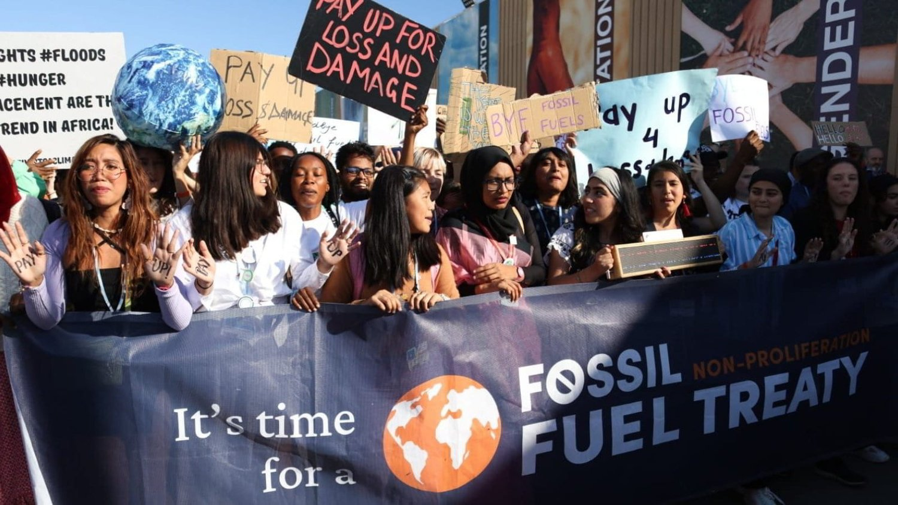
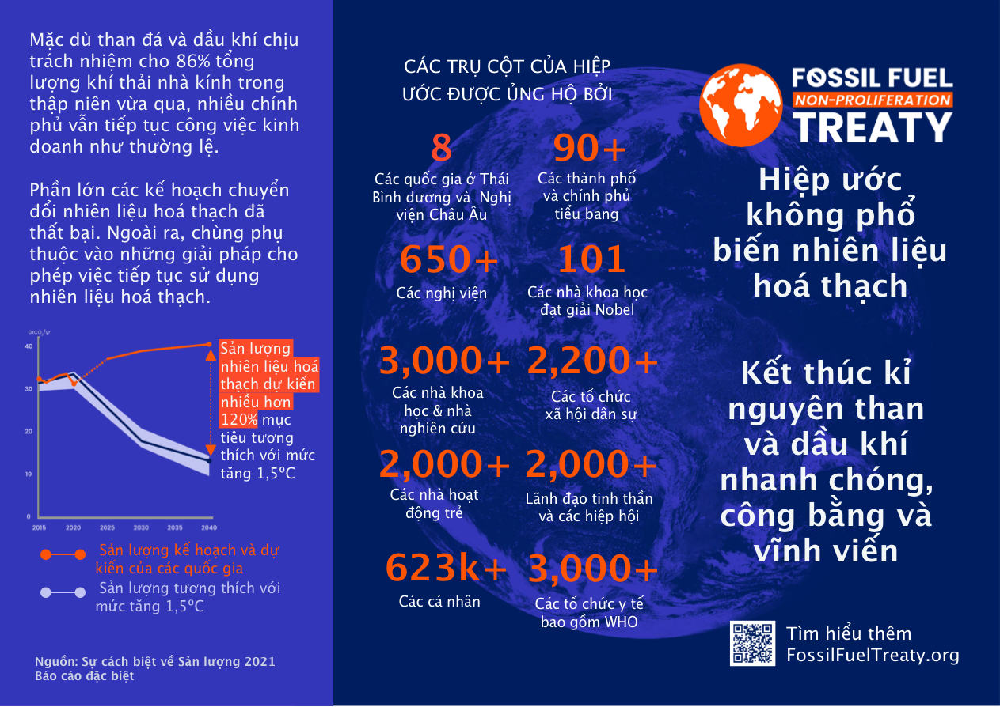
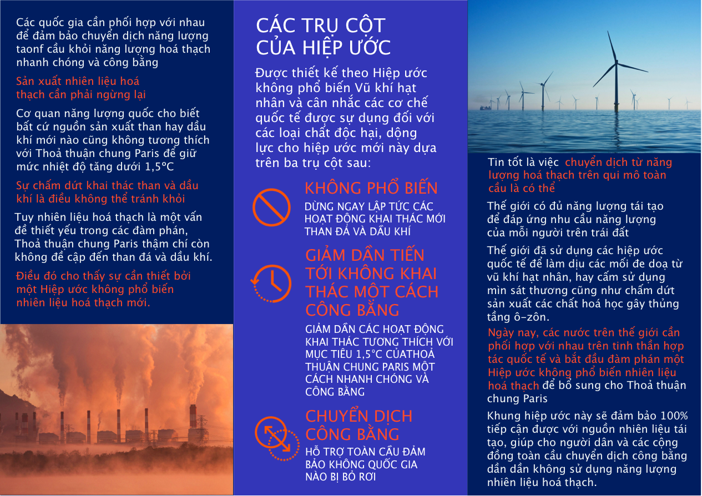

# Hiệp ước không phổ biến Nhiên liệu hoá thạch

Sáng kiến **Hiệp ước Không phổ biến Nhiên liệu Hóa thạch** (*The Fossil Fuel Non-Proliferation Treaty Initiative*) là một nỗ lực toàn cầu nhằm thúc đẩy hợp tác quốc tế nhằm đẩy nhanh quá trình chuyển đổi sang năng lượng sạch cho mọi người, chấm dứt việc mở rộng sử dụng than, dầu và khí đốt, đồng thời loại bỏ dần hoạt động sản xuất hiện tại một cách công bằng phù hợp với những gì khoa học cho thấy là cần thiết để giải quyết cuộc khủng hoảng khí hậu. Nó được xây dựng dựa trên nhiều thập kỷ kêu gọi và chiến dịch loại bỏ nhiên liệu hóa thạch và chuyển đổi năng lượng công bằng của chính phủ, xã hội dân sự, người bản địa, cơ sở và các nhà lãnh đạo khác&mdsah;đặc biệt là từ các nước nghèo (*Global South*) và nhằm mục đích bổ sung vào chiến lược của các phong trào khác như **thoái vốn** (*divestment*), **giảm nợ** (*debt relief*) và **lệnh cấm sử dụng nhiên liệu hóa thạch** (*fossil fuel bans*) cũng như công việc đang được thúc đẩy bởi [Liên minh Hậu Dầu khí](https://beyondoilandgasalliance.org) (*Beyond Oil and Gas Alliance*) và [Liên minh thay thế Than](https://poweringpastcoal.org)(*Powering Past Coal Alliance*).

!!! quote "Liên minh Hậu Dầu Khí"

    Vào năm 2030, các kế hoạch và dự báo sản xuất của các chính phủ sẽ dẫn đến lượng than tăng thêm khoảng 240%, lượng dầu nhiều hơn 57% và lượng khí đốt nhiều hơn 71% so với mức hạn chế sự nóng lên toàn cầu ở mức 1,5°C. Điều này cần phải thay đổi.

 
 

Trong khi Thỏa thuận chung Paris đặt ra mục tiêu quan trọng về khí hậu toàn cầu, nhiều chính phủ - bao gồm cả các nhà lãnh đạo khí hậu tự xưng&mdash;vẫn tiếp tục phê duyệt các dự án than, dầu và khí đốt mới mặc dù việc đốt cháy trữ lượng nhiên liệu hóa thạch hiện tại của thế giới sẽ dẫn đến lượng khí thải cao gấp 7 lần so mức giữ nhiệt độ tăng dưới 1,5°C.

Để đáp ứng các mục tiêu của Thỏa thuận chung Paris, chúng ta cần hợp tác quốc tế để ngăn chặn rõ ràng việc mở rộng nhiên liệu hóa thạch và quản lý quá trình chuyển đổi công bằng toàn cầu khỏi than, dầu và khí đốt theo cách vừa nhanh chóng vừa công bằng, để không có người lao động nào, cộng đồng hoặc quốc gia bị bỏ lại phía sau.

Đây là lý do tại sao động lực đáng kể đang được hình thành đằng sau đề xuất về **Hiệp ước không phổ biến Nhiên liệu hóa thạch**.

Hiệp ước không phổ biến nhiên liệu hóa thạch không phải là một tổ chức, mà là một ý tưởng&mdash;được hỗ trợ bởi mạng lưới toàn cầu đang phát triển gồm các chính phủ, tổ chức xã hội dân sự, học giả, nhà khoa học, nhà hoạt động thanh niên, chuyên gia y tế, tổ chức tín ngưỡng, người dân bản địa và hàng trăm ngàn công dân khác trên toàn cầu.

Họ đã cùng nhau tham gia vào một sáng kiến toàn cầu nhằm xây dựng động lực và hỗ trợ ngoại giao đằng sau ý tưởng lớn, táo bạo này tương xứng với quy mô của cuộc khủng hoảng mà chúng ta đang phải đối mặt.

## Lịch sử 

**Dầu, khí đốt và than đá là nguyên nhân sâu xa của cuộc khủng hoảng khí hậu. Bất chấp thực tế kinh hoàng của nhiên liệu hóa thạch cũng như những cảnh báo liên tục của cộng đồng khoa học, không có cơ chế ràng buộc nào để hạn chế sản xuất chúng.**

Thỏa thuận Paris, dù quan trọng đến đâu, cũng chưa một lần đề cập đến nhiên liệu hóa thạch và đã thất bại trong việc hạn chế sản xuất chúng. Cam kết của các quốc gia nhằm giảm tiêu thụ nhiên liệu hóa thạch là không thể thiếu, nhưng nếu nghĩ rằng những cam kết này sẽ dẫn đến giảm sản lượng là một sai lầm.

Vì vậy, cần có một thỏa thuận bổ sung. Giống như 50 năm trước, khi thế giới sử dụng các hiệp ước quốc tế để xoa dịu các mối đe dọa do vũ khí hạt nhân gây ra[^1], ngày nay, thế giới cần một Hiệp ước không phổ biến Nhiên liệu hoá thạch để loại bỏ dần nhiên liệu này, hỗ trợ các nền kinh tế phụ thuộc, người lao động và cộng đồng đa dạng hóa khỏi sự phổ biến nhiên liệu hoá thạch, đảm bảo 100% khả năng tiếp cận năng lượng tái tạo trên toàn cầu và thúc đẩy quá trình chuyển đổi công bằng không để ai bị bỏ lại phía sau.

[^1]:

    Xem thêm [Hiệp ước không phổ biến vũ khí hạt nhân](https://vi.wikipedia.org/wiki/Hiệp_ước_không_phổ_biến_vũ_kh%C3%AD_hạt_nhân)

### 2015: Các lãnh đạo Thái Bình Dương kêu gọi hiệu ước toàn cầu về nhiên liệu hoá thạch

Các cộng đồng ảnh hưởng trực tiếp, đặc biệt là những người đến từ miền Nam bán cầu đang phải trả giá cao nhất cho việc khai thác nhiên liệu hóa thạch và biến đổi khí hậu, nhưng lại là những người ít chịu trách nhiệm nhất. Trên toàn thế giới và trong nhiều thập kỷ, các cuộc đấu tranh ở tiền tuyến đã thể hiện vai trò lãnh đạo trong việc chống lại nạn cướp bóc lãnh thổ của họ. Ngày nay, đối với nhiều cộng đồng trên thế giới&mdash;và đối với một số quốc gia&mdash;việc tiếp tục khai thác nhiên liệu hóa thạch và biến đổi khí hậu là một cuộc khủng hoảng hiện hữu.

**Để đối phó với cuộc khủng hoảng này, các quan chức và lãnh đạo xã hội dân sự ở Thái Bình Dương đã đưa ra đề xuất ban đầu về việc tạm dừng và ràng buộc các cơ chế quốc tế dành riêng cho việc loại bỏ nhiên liệu hóa thạch ở Thái Bình Dương.** Năm 2015, trong [Tuyên bố Suva về Biến đổi Khí hậu](https://d3n8a8pro7vhmx.cloudfront.net/theausinstitute/pages/231/attachments/original/1441668038/PACIFIC_ISLAND_DEVELOPMENT_FORUM_SUVA_DECLARATION_ON_CLIMATE_CHANGE.v2.pdf?1441668038), được ban hành từ Hội nghị thượng đỉnh thường niên lần thứ ba của Diễn đàn Phát triển Quần đảo Thái Bình Dương được tổ chức tại Suva, Fiji, những người ra quyết định đã kêu gọi:

!!! quote "Tuyên bố Suva"
    
    “một cuộc đối thoại toàn cầu mới về việc thực hiện lệnh cấm quốc tế về phát triển và mở rộng các ngành công nghiệp khai thác nhiên liệu hóa thạch, đặc biệt là xây dựng các mỏ than mới, như một bước khẩn cấp hướng tới việc khử cacbon cho nền kinh tế toàn cầu”.

Năm 2016, sau hội nghị thượng đỉnh ở Quần đảo Solomon, [14 quốc đảo Thái Bình Dương](https://www.theguardian.com/world/2016/jul/14/pacific-islands-nations-consider-worlds-first-treaty-to-ban-fossil-fuels) đã thảo luận về hiệp ước đầu tiên trên thế giới cấm khai thác than mới và thực hiện mục tiêu 1,5°C đặt ra tại cuộc đàm phán về khí hậu ở Paris.

### 2017: Các quốc gia kém phát triển nhất kêu gọi xoá bỏ dần việc sử dụng nhiên liệu hoá thạch

Một bước quan trọng khác là lời kêu gọi của các nước kém phát triển nhất về việc loại bỏ nhiên liệu hóa thạch.

Năm 2017, nhóm các nước kém phát triển nhất (LDC) đã đưa ra tuyên bố chung bế mạc tại COP23, do Fiji chủ trì và tổ chức tại Bonn.

!!! quote "Ở COP23, họ nhấn mạnh sự cần thiết của"

    “sự gia tăng tham vọng của tất cả các quốc gia nhằm đưa chúng ta đi đúng hướng nhằm hạn chế mức tăng nhiệt độ toàn cầu ở mức 1,5°C bằng cách tăng cường đóng góp quốc gia, quản lý việc loại bỏ nhiên liệu hóa thạch, thúc đẩy năng lượng tái tạo và thực hiện hành động khí hậu đầy tham vọng nhất”.

### 2017: Xã hội dân sự kêu gọi chấm dứt phát triển nhiên liệu hoá thạch

Ở cấp độ quốc tế, các chủ thể **xã hội dân sự** (*civil society*) cũng tích cực huy động để loại bỏ dần dần trên toàn cầu. Điều này dẫn đến [Tuyên bố Lofoten](http://www.lofotendeclaration.org/), được viết vào năm 2017 tại một cuộc họp mặt ở Quần đảo Lofoten, Na Uy, với các học giả, nhà phân tích và nhà hoạt động.

Tuyên bố thừa nhận tình trạng khẩn cấp cần ngăn chặn việc mở rộng ngành dầu khí nhằm đạt được các mục tiêu về khí hậu ở Paris. Nó cũng kêu gọi các quốc gia được hưởng lợi nhiều nhất từ việc khai thác nhiên liệu hóa thạch phải hành động trước tiên, do đó phải chịu trách nhiệm lịch sử về cuộc khủng hoảng khí hậu, nhưng cũng là quốc gia có vị thế tốt nhất về năng lực thực hiện hành động cụ thể về khí hậu cho quá trình chuyển đổi công bằng toàn cầu. tránh xa việc sản xuất nhiên liệu hóa thạch. 

!!! quote "Tuyên bố nêu rõ:"

    “Trách nhiệm cấp bách và nghĩa vụ đạo đức của các nhà sản xuất nhiên liệu hóa thạch giàu có là phải dẫn đầu trong việc chấm dứt sự phát triển nhiên liệu hóa thạch và quản lý sự giảm dần sản lượng hiện tại”.

## Nhiên liệu hóa thạch là vũ khí hủy diệt hàng loạt

Trong các cuộc thảo luận xung quanh Tuyên bố Lofoten, những điểm tương đồng với các hiệp ước vũ khí đã được đưa vào vì các hiệp ước cấm bom mìn và hạt nhân là những nguồn cảm hứng quan trọng.

Không chỉ vì những kết quả đạt được mà còn vì cách vận động của các phong trào hòa bình và giải trừ quân bị, đặc biệt là **Chiến dịch quốc tế xóa bỏ vũ khí hạt nhân** [ICAN](https://www.icanw.org/). Nó tập hợp các nỗ lực của xã hội dân sự và cơ sở từ khắp nơi trên thế giới nhằm cấm và loại bỏ phổ biến vũ khí hạt nhân.

Sự tương tự về việc coi nhiên liệu hóa thạch là vũ khí hạt nhân đã được củng cố bởi các học giả nổi tiếng, nổi bật nhất là Peter Newell và Andrew Simms, trong một [bài báo xuất bản năm 2019](https://www.tandfonline.com/doi/full/10.1080/14693062.2019.1636759) trên tạp chí Chính sách khí hậu.

!!! quote "Hướng tới một hiệp ước không phổ biến vũ khí hạt nhân: Những hiểu biết chính sách quan trọng"

    - Phía cung cấp nhiên liệu hóa thạch phải chiếm vị trí trung tâm trong nỗ lực chung nhằm giải quyết vấn đề biến đổi khí hậu.

    - Hiệp ước không phổ biến nhiên liệu hóa thạch (FF-NPT) mới được đề xuất có thể giúp lưu giữ một lượng lớn nhiên liệu hóa thạch trong lòng đất một cách hiệu quả và công bằng.

    - Quá trình hướng tới mục tiêu này có thể bắt đầu bằng việc đánh giá trữ lượng hiện có, cũng như thỏa thuận về các nguyên tắc sắp xếp các mục tiêu giảm dần sản xuất ở các quốc gia và loại nhiên liệu, với mục đích điều chỉnh việc sử dụng nhiên liệu hóa thạch phù hợp với mục tiêu 1,5°C của Thỏa thuận chung Paris.

    - Các chiến lược nhằm thúc đẩy FF-NPT được đề xuất sẽ phải nhận diện việc khai thác trữ lượng nhiên liệu hóa thạch hiện tại và lịch sử, cung cấp các phương pháp thay thế để đáp ứng nhu cầu phát triển của các nước nghèo nhất không có nhiên liệu hóa thạch và bao gồm các hệ thống giám sát và tuân thủ đáng tin cậy để tạo dựng niềm tin và hợp tác.

## Hiện tại&mdash;Tạo đà cho Hiệp ước về nhiên liệu hoá thạch

Dựa trên những thực tiễn tốt nhất của các chiến dịch vận động hiệp ước trong quá khứ và các cuộc đấu tranh hiện do các cộng đồng chịu ảnh hưởng trực tiếp lãnh đạo, Sáng kiến **Hiệp ước Không phổ biến Nhiên liệu hóa thạch** đã bắt đầu vào năm 2019 thông qua giải thưởng Đột phá về Khí hậu.

Ngày nay, nó được thực hiện bởi một [Ban chỉ đạo bao gồm nhiều thành phần](http://fossilfueltreaty.org/people), một nhóm hỗ trợ quốc tế và được hỗ trợ bởi các tổ chức xã hội dân sự, nhà khoa học, học giả, nghị sĩ, nhà hoạt động thanh niên, lãnh đạo tôn giáo cấp cao, phong trào Bản địa, tổ chức y tế và những người đoạt giải Nobel trên toàn cầu.

Đề xuất này hiện đã được Tổ chức Y tế Thế giới, Nghị viện Châu Âu cũng như [Vanuatu kêu gọi tại Đại hội đồng Liên Hợp Quốc](https://fossilfueltreaty.org/vanuatu).

Cập nhật [danh sách](https://fossilfueltreaty.org/endorsements) những nước và tổ chức gọi Hiệp ước không phổ biến Nhiên liệu hóa thạch: Vanuatu, Tuvalu, Fiji, Quốc đảo Solomon, Tonga, Niue, Đông Timo, Antigua và Barbuda, Nghị viện Châu Âu, Tổ chức Y tế Thế giới và hàng trăm các tổ chức quốc tế, hội đồng tỉnh, thành phố, và các nghị sĩ, v.v.

Một điệp khúc đang vang lên khắp nơi để kêu gọi Hiệp ước không phổ biến nhiên liệu hóa thạch, nhằm loại bỏ dần nhiên liệu hóa thạch và xây dựng một quá trình chuyển đổi công bằng toàn cầu cho mọi người lao động, cộng đồng và quốc gia.

**Nguồn:** [Hiệp ước không phổ biến Nhiên liệu hoá thạch](https://fossilfueltreaty.org/history)

