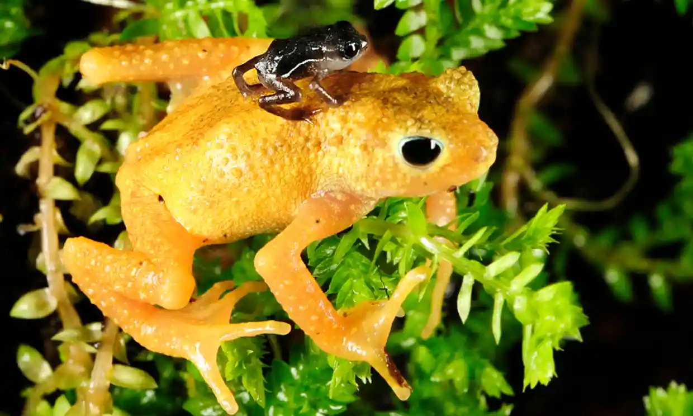
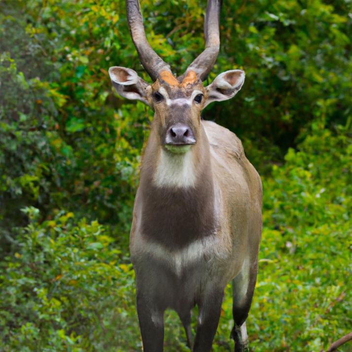

# Nửa Trái đất

!!! quote ""

    Một con cóc Kihansi mới sinh trèo lên lưng của cá thể mẹ ở Vườn thú Bronx ở New York. Loài cóc này được thấy lần cuối nơi hoang dã vào năm 2004. Ảnh: Julie Larsen Maher/AP

## Dự án nửa trái đất là gì?

Sứ mệnh của Quỹ Đa dạng sinh học E.O. Wilson là hình dung lại cách chúng ta chăm sóc hành tinh của mình. Chương trình cốt lõi của tổ chức, Dự án Nửa Trái đất, truyền cảm hứng cho hành động tập thể có hiểu biết để cứu sinh quyển, đất và nước mà đa dạng sinh học toàn cầu phụ thuộc vào.

Sự tuyệt chủng hàng loạt đang diễn ra của thế giới tự nhiên cùng với các đại dịch, chiến tranh thế giới và biến đổi khí hậu là một trong những mối đe dọa lớn nhất mà nhân loại đã tự đặt ra cho mình. Mất đa dạng sinh học được xếp hạng là mối đe dọa nghiêm trọng thứ ba mà nhân loại sẽ phải đối mặt trong 10 năm tới trong **Báo cáo Rủi ro Toàn cầu năm 2022** của **Diễn đàn Kinh tế Thế giới**. Mất đi quá nhiều đa dạng sinh học trên Trái đất vừa phá hủy di sản sống của chúng ta vừa gây nguy hiểm cho sự ổn định của hệ sinh thái. hành tinh hôm nay và cho mọi thế hệ tương lai.

Để bảo vệ đủ số lượng loài nhằm bảo vệ đa dạng sinh học toàn cầu, bao gồm cả loài người, nhà sinh vật học quá cố người Mỹ, E.O. Wilson và một thế hệ mới gồm các nhà khoa học, nhà sinh thái học và nhà bảo tồn đã kết luận rằng chúng ta phải dành khoảng một nửa diện tích đất và biển trên Trái đất cho thiên nhiên, được gọi là nguyên tắc “Nửa Trái đất”.

Quỹ Đa dạng sinh học E.O. Wilson hỗ trợ mục tiêu bảo vệ một nửa đất liền và biển nhằm quản lý đủ môi trường sống và đảo ngược cuộc khủng hoảng tuyệt chủng loài, đảm bảo sức khỏe lâu dài cho hành tinh của chúng ta. Dự án Nửa Trái đất đang hiện thực hóa mục tiêu này. 

## Khủng hoảng tuyệt chủng

Năm 2019, một báo cáo của Liên Hợp Quốc cho thấy khoảng 1 triệu loài thực vật và động vật hiện đang bị đe dọa tuyệt chủng, nhiều loài trong vòng vài thập kỷ tới do hoạt động của con người. Xét duyệt giá có hệ thống của **Nền tảng chính sách khoa học liên chính phủ về đa dạng sinh học và dịch vụ hệ sinh thái (IPBES)** về khoảng 15.000 nghiên cứu khoa học và của chính phủ cùng với kiến thức bản địa và địa phương là phân tích toàn diện nhất từng được hoàn thành. Báo cáo tiết lộ rằng nhiều yếu tố trực tiếp và gián tiếp góp phần gây ra cuộc khủng hoảng này, bao gồm: **biến đổi khí hậu** (*climate change*), **mất môi trường sống** (*habitat loss*), **ô nhiễm** (*pollution*), **quá tải dân số** (*overpopulation*), **các loài xâm lấn** (*invasive species*) và **khai thác các loài sinh vật** (*exploitation of creatures*). Trong số này, mối đe dọa lớn nhất đối với các loài là mất môi trường sống. Và quan trọng là, mặc dù khí hậu nóng lên và thời tiết không ổn định đe dọa các loài, nhưng việc bảo vệ môi trường sống cho các loài sẽ giúp giảm thiểu biến đổi khí hậu thông qua việc điều tiết khí thải các-bon và các lợi ích khác.

Diễn đàn Kinh tế Thế giới báo cáo những rủi ro sau:

- Từ năm 1970, sản xuất nông nghiệp, thu hoạch cá, sản xuất năng lượng sinh học và thu hoạch nguyên liệu đã tăng lên để đáp ứng sự gia tăng dân số, nhu cầu ngày càng cao và phát triển công nghệ. Sự phân bố không đồng đều của các xu hướng này giữa các quốc gia góp phần dẫn đến sự phân bố mất loài không đồng đều.

- Sự phong phú của các loài bản địa ở hầu hết các môi trường sống chính trên đất liền đã giảm ít nhất 20%, chủ yếu kể từ năm 1900.

- Số lượng các loài ngoại lai xâm lấn ở mỗi quốc gia đã tăng khoảng 70% kể từ năm 1970 tại 21 quốc gia có hồ sơ đầy đủ chi tiết.

Báo cáo nêu rõ nếu không có các biện pháp ngăn chặn và đảo ngược sự mất mát của thiên nhiên thì tốc độ tuyệt chủng các loài trên toàn cầu sẽ tăng cao hơn nữa, cao hơn ít nhất hàng chục đến hàng trăm lần so với mức trung bình trong 10 triệu năm qua.

Tốc độ tuyệt chủng đang tăng tốc với tốc độ nhanh nhất trong lịch sử Trái đất. Nếu chúng ta tiếp tục đánh mất sự đa dạng của cuộc sống, tất cả các loài, bao gồm cả loài của chúng ta, sẽ gặp nguy hiểm.

Chúng ta cần sự hiểu biết đầy đủ hơn về tất cả các loài trên hành tinh của chúng ta, bao gồm cả vị trí và mối liên hệ của chúng. Bằng cách xác định đầy đủ hơn với tất cả sự sống và với nhau, chúng ta có thể hỗ trợ một nền đạo đức lâu dài hơn để chăm sóc hành tinh của chúng ta. 

## Tại sao lại là một nửa? 

Vào năm 2016, E.O. Wilson đã viết một cuốn sách có tên **Nửa Trái đất: Cuộc chiến vì sự sống của hành tinh chúng** (*Half-Earth: Our Planet's Fight for Life*). Trong cuốn sách đó có một lời hứa: nếu chúng ta bảo vệ một nửa đất liền và biển của Trái đất và quản lý đủ môi trường sống để bảo vệ phần lớn đa dạng sinh học, thì Trái đất còn sống có thể tiếp tục thở. **Nửa Trái đất** nhằm mục đích giải quyết một vấn đề mà E.O. Wilson gọi là “điều lớn lao tiếp theo”. Vấn đề chúng ta cần hướng sự chú ý của mình ra ngoài vấn đề khí hậu đang thay đổi là sự mất đi cấu trúc của hành tinh chúng ta, sự mất đi sự đa dạng sinh học.

Với **Nửa Trái Đất**, ý định của E.O. Wilson là tạo ra một mục tiêu “bay lên mặt trăng”, một nỗ lực của con người nhằm đảm bảo chúng ta sẽ không bỏ sót loài nào. Điều này không chỉ quan trọng về mặt khái niệm mà còn quan trọng về mặt truyền cảm hứng. Nếu bạn nhìn vào lịch sử, đây là loại mục tiêu đầy tham vọng thúc đẩy sự thay đổi.

Kích thước môi trường sống và số lượng loài mà nó có thể hỗ trợ bền vững có liên quan về mặt toán học, không phải theo hàm tuyến tính mà theo hàm số mũ căn bậc 4. Diện tích đất và biển được bảo vệ toàn cầu hiện nay (khoảng 15%) là không đủ. Các dự đoán toán học hiện tại ước tính chúng ta sẽ mất đi một nửa số loài trước cuối thế kỷ này. **Nửa Trái đất** là một cách tiếp cận toàn cầu, bởi vì khoa học chứng minh rằng bằng cách bảo vệ một nửa số loài tổng thể, đủ số loài sẽ tồn tại để đảm bảo nhu cầu của chúng ta được nguyên vẹn. Là một giải pháp, nó cũng có sự kết hợp phù hợp giữa tính đơn giản và sức mạnh tiềm ẩn để thể hiện hy vọng và kích hoạt sự tham gia. Khi xem xét chi tiết, bất kỳ khu vực nào trên hành tinh đều có đóng góp đặc biệt cho mục tiêu chung là một nửa.

Bởi vì đa dạng sinh học không được phân bố đồng đều nên không phải nơi nào cũng đóng góp quan trọng như nhau cho mục tiêu Nửa Trái đất. Một số nơi có rất nhiều loài, bao gồm cả những loài quý hiếm và độc nhất, đáng được quan tâm đặc biệt. Tuy nhiên, mọi nơi trên hành tinh đều có thể đóng góp và có khả năng có những loài độc nhất cần bảo vệ ngay cả khi nơi đó không phải là điểm nóng đa dạng sinh học từ góc độ toàn cầu.

**Dự án Nửa Trái đất** của Quỹ Đa dạng sinh học E.O. Wilson đang lập bản đồ vị trí không gian địa lý của tất cả các loài trên Trái đất với độ phân giải cao nhằm thay đổi hiểu biết của chúng ta về thế giới và thông báo những địa điểm nào đưa ra con đường hiệu quả nhất để bảo vệ các loài và hệ sinh thái có nguy cơ tuyệt chủng.

!!! quote "Walter Jetz, chủ nhiệm khoa học của Quỹ Đa dạng sinh học E.O. Wilson"

    “Có rất nhiều chiến thắng dành cho Thiên nhiên ở đây, được cung cấp bởi nền khoa học tốt nhất hiện có. Giờ đây, chúng tôi có cơ hội tốt hơn để thực hiện khuôn khổ với các cam kết tài trợ, tuyên bố tôn trọng quyền của Người dân bản địa và cộng đồng địa phương, đồng thời đồng ý rằng các khu vực chúng tôi bảo vệ mang tính đại diện về mặt sinh thái. Chúng tôi không chỉ bảo vệ đất, nước ngọt, đại dương&mdash;chúng tôi đang hành động để bảo vệ các loài.”

Những nơi có mức độ ưu tiên cao cho việc bảo tồn, chúng tôi gọi là Địa điểm cho Tương lai Nửa Trái đất. Những nơi này có sự phong phú và quý hiếm về loài đặc biệt mà hiện không được bảo vệ.

Để giúp xác định những địa điểm này, nhóm của chúng tôi đã hỗ trợ tạo ra các thước đo mới về mức độ thành công trong bảo tồn, bao gồm Chỉ số Môi trường sống của Loài (SHI), Chỉ số Bảo vệ Loài (SPI) và Chỉ số Thông tin về Loài (SII).

!!! quote "[SPI ở Việt Nam](https://eowilsonfoundation.org/national-report-card/vietnam/)"

    Việt Nam bao gồm bờ biển phía đông của Bán đảo Đông Dương ở Đông Nam Á. Đường bở biển chính giáp biển Đông và bờ biển phía tây nam giáp Vịnh Thái Lan. Đồng bằng sông Cửu Long chảy ra Thái Bình Dương ở bờ biển phía Nam Việt Nam. Vùng đất thấp tiến lên vùng Tây Nguyên và vùng núi phía Bắc. Phần lớn diện tích đất liền được sử dụng cho các hoạt động của con người, phần lớn dành cho nông nghiệp và tưới tiêu nhờ mưa. Việt Nam có mức độ đa dạng sinh học cao quý hiếm của các loài động vật có xương sống trên cạn ở quy mô toàn cầu. Khi phân tích dưới dạng đơn vị phân loại, độ hiếm của động vật lưỡng cư, chim, động vật có vú và bò sát cũng rất cao. Độ hiếm của cá biển và động vật có vú cũng rất cao. Những thách thức đối với đa dạng sinh học bao gồm: nạn phá rừng, thoái hóa đất, ô nhiễm nước và đánh bắt quá mức, ô nhiễm không khí và di cư đô thị.

    Ở Việt Nam, Saola là loài nổi bật được quan tâm bảo tồn

    

{ .off-glb }
{ .off-glb }

Người dùng có thể xem Thẻ Báo cáo Quốc gia SPI về các địa điểm được bảo vệ được xác định ở mọi quốc gia trên Trái đất, bao gồm cả các khu bảo tồn biển. Điểm SPI dao động từ 0-100 thể hiện số lượng loài động vật có xương sống được đại diện đầy đủ trong các khu bảo tồn của một quốc gia và mức độ trách nhiệm toàn cầu đối với loài mà một quốc gia nắm giữ. Thẻ báo cáo hiển thị các khu vực bổ sung cần được ưu tiên để bảo vệ tốt nhất các loài mà khu vực đó đóng góp duy nhất cho đa dạng sinh học toàn cầu.

Khoa học của **Dự án Nửa Trái đất** có **truy cập mở** (*open access*), dân chủ hóa thông tin này trao quyền cho mọi người cũng như cung cấp thông tin để biết cần phải làm gì và ở đâu. Khi chúng tôi tiếp tục xây dựng điều này, chúng tôi mong muốn thu hút không chỉ những người có quyền ra quyết định mà tất cả mọi người ở khắp mọi nơi có thể cùng nhau tưởng tượng xem việc này sẽ trông như thế nào và cách họ có thể tham gia trong suốt cuộc đời và sự nghiệp của mình vào việc quản lý hành tinh của chúng ta.

Chúng ta cần sự hiểu biết đầy đủ hơn về tất cả các loài trên hành tinh của chúng ta, bao gồm cả vị trí và mối liên hệ của chúng. Bằng cách xác định đầy đủ hơn với tất cả sự sống và với nhau, chúng ta có thể hỗ trợ một nền đạo đức lâu dài hơn để chăm sóc hành tinh của chúng ta.

Truy cập vào [Bản đồ của dự án Nửa Trái đất](https://map.half-earthproject.org/)

[Trò chơi Chính sách](https://play.half.earth) với dự án Nửa Trái đất

**Nguồn:** [Quỹ Đa dạng sinh học E.O. Wilson](https://eowilsonfoundation.org)

