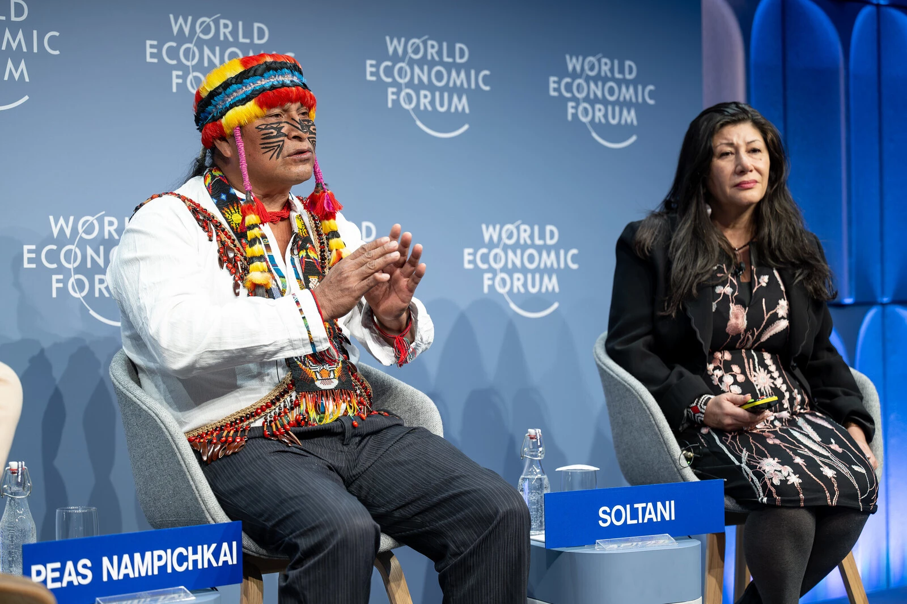

# Bài học từ những nhà lãnh đạo bản địa để bảo vệ rừng nhiệt đới Amazon

!!! quote ""

    **Người dân bản địa** (*Indigenous Peoples*) chỉ chiếm hơn 6% dân số toàn cầu trong khi họ trông coi việc bảo tồn 80% đa dạng sinh học còn lại của thế giới.

Nghiên cứu đã chỉ ra rằng ít nhất 25% lượng các-bon được lưu trữ trong những cánh rừng nhiệt và cận nhiệt đới trên toàn cầu đều nằm dưới sự quản lí của người bản địa. Điều quan trọng là người dân bản địa của cũng sở hữu những kiến thức và chuyên môn thiết yếu được truyền từ đời này sang đời khác về cách thích ứng, giảm thiểu, cắt giảm rủi ro về khí hậu và thiên tai.

Các nhà lãnh đạo bản địa từ khắp các vùng ở Amazon đã tham dự Hội nghị thường niên của Diễn đàn kinh tế thế giới tại Davos, Thụy Sĩ. Họ đã chia sẻ quan điểm của mình về cách xây dựng một nền kinh tế hài hòa với tự nhiên, bảo vệ đa dạng sinh học và các hệ sinh thái mà tự nhiên duy trì, đồng thời thúc đẩy **kiến thức bản địa** (*indigenous knowledge*) có thể giúp thế giới đạt được các **Mục tiêu phát triển bền vững** (*Sustainable Development Goals*).

Fany Kuiru, người phụ nữ đầu tiên được bổ nhiệm làm Tổng điều phối viên của Cơ quan điều phối các tổ chức bản địa lưu vực sông Amazon (COICA), đại diện cho 511 cộng đồng bản địa ở 9 quốc gia trong khu vực, nhấn mạnh sự cần thiết phải đảm bảo người dân bản địa được ngồi vào bàn đàm phán. Trong một phiên họp ở Davos, bà nhấn mạnh rằng thế giới cần phải đảm bảo “sự tham gia đầy đủ và hiệu quả [của tất cả các bên] vào việc ra quyết định” liên quan đến các chính sách có ảnh hưởng đến khu vực.

Kuiru kêu gọi các nhà lãnh đạo áp dụng cách tiếp cận toàn diện có tính đến sự đa dạng về tự nhiên và văn hóa cũng như cách tiếp cận của người bản địa đối với nền kinh tế bền vững và quản lý tài nguyên. Bà nói, **người dân bản địa là “những người bảo vệ tốt nhất của Amazon”** và đại diện cho sự đa dạng phong phú về quan điểm thế giới, với hệ thống tổ chức chính phủ, hệ thống kiến thức truyền thống và hơn 300 ngôn ngữ. Do đó, việc đảm bảo an ninh pháp lý và khả năng kinh tế cho các vùng lãnh thổ bản địa để có thể bảo tồn môi trường là điều cấp thiết.

!!! quote "Fany Kuiru:"
     
    “Các lãnh thổ của người bản địa được bảo tồn tốt nhất ở Amazon vì chúng tôi sử dụng lãnh thổ và tài nguyên thiên nhiên một cách tôn trọng”.

## Giá trị của rừng còn sống (*standing forest*)

Trong một phiên họp riêng của Hội nghị thường niên, các tham luận viên đã tham gia thảo luận về các chiến lược nhằm **gán giá trị cho các khu rừng** (*assign value to standing forests*). Điều này xảy ra vào thời điểm các dữ liệu thực tế ngày càng khẳng định lợi ích kinh tế liên quan đến việc bảo tồn đa dạng sinh học.

Ngoài câu hỏi về giá trị kinh tế, Uyunkar Domingo Peas, Chủ tịch Hội đồng quản trị, Liên minh các nguồn nước linh thiêng Amazon (Cuencas Sagradas Amazónicas), nhắc nhở những người tham dự rằng, đối với Người dân bản địa, cuộc tranh luận về việc bảo tồn rừng Amazon mang tính bản thể sâu sắc. Nhận xét về “cách định giá thiên nhiên”, ông cho biết **rừng là “vô giá” đối với người dân bản địa** và chia sẻ cái sơ lược về mối liên hệ sâu sắc giữa **thế giới quan bản địa** (*indigenous cosmology*) với rừng, vốn được coi là một thực thể sống mang lại sự sống cho toàn nhân loại”.

!!! quote "Uyunkar Domingo Peas Nampichkai"

    “Trong khi các công ty lớn nói về trị giá, thì đối với chúng tôi, toàn bộ hệ sinh thái đó&mdash;một thực thể sống&mdash;là vô giá”.

Ông Uyunkar Domingo Peas kêu gọi các nhà lãnh đạo tại Davos liên kết khái niệm bản địa về thế giới tự nhiên như nó hiện có hỗ trợ cho sự sống, với các **hoạt động kinh tế** (*economic pratices*) **thu hoạch bền vững** (*sustainable havesting*), **“được thực hiện bằng sự quan tâm và tình thương yêu”**, ông nói. Ông nhắc nhở người nghe rằng tất cả các hoạt động độc canh đều có hại cho môi trường, đồng thời nhấn mạnh nền văn hóa truyền thống của ông tập trung vào việc đa dạng sản vật cây trồng, một lý do chính khiến rừng vẫn đứng vững.

Ông nói: “Một trong những sản phẩm của chúng tôi đang tiến tới thị trường toàn cầu là Vanilla”. Tuy nhiên, người dân bản địa gặp khó khăn trong việc tiếp cận các ngân hàng và cơ chế tài chính quốc tế cho phép họ tham gia vào nền kinh tế.

Domingo nhấn mạnh rằng người dân bản địa “làm việc miễn phí vì thiên nhiên mang lại cho chúng tôi mọi thứ”, nhưng không được tiếp cận với các dịch vụ cơ bản như y tế và giáo dục&mdash;những hoạt động đòi hỏi nguồn đầu tư đáng kể mà cộng đồng bản địa hiếm khi có thể tiếp cận. 

!!! quote "Uyunkar Domingo Peas Nampichkai"

    “Tôi kêu gọi các tổ chức tài chính tạo điều kiện thuận lợi cho việc tiếp cận để giúp chúng tôi giáo dục người dân và giúp chúng tôi tiếp tục duy trì các khu rừng của mình vì lợi ích của nhân loại”.

## Sự kết nối tâm linh với thiên nhiên

Quan điểm tương tự cũng được lặp lại bởi tộc trưởng Nixiwaka Yawanawá và Putany Yawanawá, các nhà lãnh đạo của người Yawanawá sinh sống ở vùng biên giới Brazil tiếp giáp với với Peru. Trong một phiên thảo luận về nghệ thuật và tâm linh, họ kêu gọi nhân loại khơi dậy mối liên hệ tâm linh với thiên nhiên, nhấn mạnh vai trò của thiên nhiên trong việc vạch ra một tương lai bền vững cho hành tinh. Tộc trưởng Nixiwaka nói: “Chúng tôi [người dân bản địa] là những đứa trẻ không bao giờ rời bỏ quê hương, ngôi nhà của Đấng Tạo Hóa thần thánh”.

!!! quote "Tù trưởng Nixiwaka Yawanawá" 

    Chúng tôi là những người duy nhất trên hành tinh này vẫn còn nói ngôn ngữ của nước, đất, không khí, các vì sao, động vật, rừng rậm và  tất cả các tạo vật trên hành tinh này. Chúng tôi không chỉ bảo vệ thiên nhiên; chúng tôi chính là thiên nhiên.

## Hỗ trợ toàn cầu để giúp cộng đồng bản địa phát triển mạnh mẽ

Marina Silva, Bộ trưởng Bộ Môi trường và Biến đổi Khí hậu Brazil, kêu gọi các nhà lãnh đạo lắng nghe người dân bản địa và cộng đồng địa phương và hưởng lợi từ sự khôn ngoan của “những người có kiến thức hàng nghìn năm liên quan đến các nguồn tài nguyên này”.

Brazil đã thành lập một lực lượng đặc nhiệm để phát triển các cơ chế trả tiền cho cộng đồng để hỗ trợ các dịch vụ hệ sinh thái. Silva minh họa điều này bằng ví dụ về nước. **“Amazon sản xuất 20 tỷ tấn nước mỗi ngày. Năm mươi phần trăm lượng nước này được rừng sử dụng và 50% còn lại được phân tán vào khí quyển, nơi chịu trách nhiệm về chế độ mưa của con người, liên quan đến 75% GDP của Nam Mỹ. Chúng được gọi là những dòng sông bay”**, bà nói.

“Để bơm lượng nước này, chúng ta sẽ cần tới 50.000 Itaipus, nhà máy thủy điện lớn của hai quốc gia [nằm ở giữa Brazil và Paraguay]. Có ai có thể tưởng tượng được một khoản đầu tư như vậy, 50.000 Itaipus bơm nước không ngừng để cung cấp cho chế độ thủy văn của chúng ta không?”

“Nhưng thiên nhiên làm điều đó, chỉ sử dụng đất, chất dinh dưỡng, rừng, nắng và gió. Đó là một dịch vụ hệ sinh thái không thể tính toán được”.

Gretchen Daily, Giáo sư Bing về Khoa học Môi trường tại Đại học Stanford, nhấn mạnh thành công ban đầu của việc định lượng thiên nhiên bằng cách sử dụng thước đo được phát triển với sự liên kết với các cộng đồng địa phương được gọi là **Tổng sản phẩm hệ sinh thái** (*Gross Ecosystem Product, GEP*), tập trung vào những đóng góp của thiên nhiên cho con người và toàn bộ nền kinh tế, tạo ra một thông số thực tiễn qua đó sẽ tác động đến việc đưa ra quyết định. Một loạt chính sách đổi mới dựa trên GEP đã được thiết kế và triển khai ở Trung Quốc, nơi có “51% đất đai hiện được quy hoạch để tái sinh và khoảng 200 triệu người đang được trả tiền để tái tạo thiên nhiên theo cách phù hợp với quan điểm của người bản địa. cộng đồng trên toàn thế giới và nhiều cộng đồng địa phương khác”, bà nói. Một số quốc gia khác bao gồm Colombia, Sri Lanka và Thụy Điển cũng đang bắt đầu áp dụng việc tính toán GEP.

!!! quote "Marina Silva, Bộ trưởng Bộ Môi trường và Biến đổi Khí hậu của Brazil"

    Thiên nhiên có những giá trị mà chúng ta thường chưa khám phá vào giai đoạn này [của nền văn minh]. Và sau đó chúng ta sẽ biết được những giá trị đó và thậm chí có thể theo những cách có thể định giá được.

Đầu tư vào nền “kinh tế dựa trên sinh học” (*bioeconomy*) của Amazon là một trong những mục tiêu của **Amazonia Forever**, một chương trình tổng thể nhằm phát triển bền vững do Ngân hàng Phát triển Liên Mỹ tạo ra, nhằm mục đích tập hợp lĩnh vực công và tư nhân để nâng cao nguồn tài chính trong khu vực, tăng cường việc quy hoạch và thực hiện các dự án để tạo ra ảnh hưởng. Fany Kuiru đã chỉ ra vai trò của cộng đồng Bản địa trong việc đồng sáng tạo và quản lý các sáng kiến ​​như vậy nhằm đảm bảo cuộc sống xứng đáng cho người dân bản địa bằng cách cung cấp cho họ **các giải pháp thay thế về kinh tế** (*economic alternatives*).

Các cộng đồng bản địa đã tham gia các cuộc thảo luận khu vực và toàn cầu về thiên nhiên và khí hậu tại Davos 2024. Thông điệp của họ rất rõ ràng: **Nhân loại cần quay trở lại với nền tâm linh cốt lõi của mình, cần nhớ rằng các khu rừng vẫn còn sống và cần hội nhập sự thịnh vượng toàn cầu với cách tiếp cận nhân đạo với thiên nhiên.**

Tại Davos 2024, Diễn đàn Kinh tế Thế giới đã ra mắt Mạng lưới Lãnh đạo và Tri thức của Người bản địa, một sáng kiến nhằm thu hút các nhà lãnh đạo và chuyên gia bản địa nổi bật nhất trên 10 Trung tâm của diễn đàn để thúc đẩy hợp tác công-tư lớn hơn thông qua kiến thức bản địa truyền thống và sáng tạo.

**Nguồn:** [Diễn đàn Kinh tế thế giới](https://www.weforum.org/agenda/2024/01/lessons-from-indigenous-leaders-to-protect-the-amazon-rainforest/)

<!-- “Chúng ta cần nói chuyện bằng tình yêu thương... [với những người dân bản địa] đã cố gắng bảo tồn 35 triệu héc-ta rừng [Amazon]. Tôi muốn nói bằng sự tôn trọng. Trước hết, chúng ta đều là con của Mẹ Trái đất. Chúng ta đều là anh chị em về mặt tâm linh. Chính vì thế chúng ta cần nói chuyện với nhau một cách chân thành và tạo lập sự tin tưởng. Nói về Mẹ Trái đất và hệ sinh thái, trong khi các công ty lớn [chỉ] nhắc đến **trị giá** (*value*) [có thể khai thác sử dụng], đối với chúng tôi đây là một hệ sinh thái thiêng liêng. Trị giá của nó không thể đo đếm được, nó là vô giá. Với sự ban phước của Mẹ Trái đất, ví dụ nếu giờ tôi hỏi, tôi muốn mua người mẹ của bạn, trị giá của mẹ bạn sẽ là bao nhiêu? Sẽ chẳng có trị giá nào [xứng đáng với mẹ bạn] cả. Tôi muốn bạn lắng nghe, với tất cả sự tôn trọng. Với chúng tôi, hệ sinh thái là một thực thể sống. Sẽ không có trị giá nào có thể được gán cho nó...Có lẽ chúng ta cần phải phối hợp với nhau và tạo ra một hệ thống mới để bảo tồn sự hoà hợp và hạnh phúc cho mọi loài. Đó là lí do vì sao tôi muốn nói rằng, không có trị giá nào có thể được gán cho tự nhiên vì nó vô giá. Tôi muốn mời các bạn suy nghĩ cách kết hợp tư duy bản địa này&mdash;với khái niệm về thế giới và các thực thể tự nhiên&mdash;để cùng nhau bảo tồn, sử dụng tự nhiên bằng tình thương yêu, giống như chúng tôi đã chăm sóc mẹ Trái đất vậy.   -->

<!-- Đối với chúng tôi, những người bản địa, tất cả sản phẩm độc canh qui mô lớn đều có hại. Ví dụ như cà phê và đậu nành. Chúng ta cũng có thể nói về dầu dừa, ca cao và nhiều sản phẩm khác, được sản xuất với số lượng rất lớn... và tất cả đều có hại. Xin lỗi ngài bộ trưởng, với văn hoá bản địa, điều tệ hại nhất là độc canh, và quan trọng nhất là tôi đa dạng hoá cây trồng của mình... giáo dục... -->
