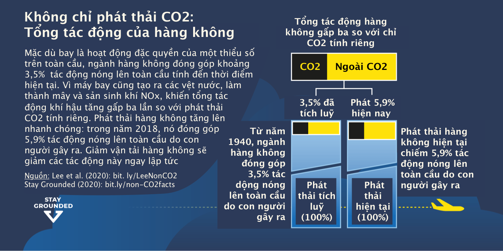

# Phong trào không sử dụng máy bay (*Stay Grounded*)

## Tác động khí hậu của hàng không là gì?

Ngăn chặn khủng hoảng khí hậu là thách thức lớn nhất mà nhân loại từng phải đối mặt. Nếu chúng ta muốn đảm bảo một tương lai có thể sống được cho tất cả mọi người trên hành tinh, chúng ta phải giữ mức nhiệt độ toàn cầu ở mức thấp nhất có thể và tránh **các điểm tới hạn** (*tipping points*) nguy hiểm. Điều này đòi hỏi những nỗ lực to lớn và cấp bách. Chúng ta phải ngừng đốt nhiên liệu hóa thạch và thay đổi các quy tắc của hệ thống. Mặc dù vậy, hiện tại chúng ta đang trên đà hướng tới sự suy thoái khí hậu.

Hàng không là phương thức vận tải gây hại cho khí hậu nhất. Năm 2018, sự đóng góp của giao thông hàng không vào tổng lượng phát thải khí nhà kính hàng năm do con người gây ra đạt khoảng [6%](https://stay-grounded.org/wp-content/uploads/2020/10/SG_Factsheet_Non-CO2_2020.pdf). Ở các nước châu Âu, nơi có nhiều người bay thường xuyên, tỷ lệ này thậm chí còn lớn hơn. Tuy nhiên, ngành hàng không muốn chúng ta tin rằng hàng không chỉ chiếm 2% lượng khí thải toàn cầu. Nhưng đó không phải là toàn bộ bức tranh: tác động của ngành hàng không đến khí hậu không chỉ giới hạn ở CO2. Do lượng khí thải khác nhau ngoài lượng CO2 diễn ra ở độ cao, nên tác động tổng thể đến khí hậu của các chuyến bay trung bình gấp 3 lần tác động của riêng lượng CO2 thải ra.

!!! quote "Không chỉ là khí CO~2~"

    [Tổng đóng góp của hàng không gây ra nóng lên toàn cầu khoảng 6%] là rất lớn, đặc biệt khi tính đến việc tác động này là do một phần rất nhỏ những người thực sự đi máy bay gây ra: hơn 80% dân số toàn cầu chưa bao giờ đi máy bay trong khi 10% người có thu nhập cao nhất toàn cầu sử dụng 75% hàng không với nhiên liệu hoá thạch.

Trước Covid-19, ngành này dự kiến nhu cầu đi lại bằng đường hàng không sẽ [tăng gấp đôi](https://www.iata.org/contentassets/c81222d96c9a4e0bb4ff6ced0126f0bb/iata-annual-review-2019.pdf) trong 20 năm tới. Sự tăng trưởng nhanh chóng này có nghĩa là đến năm 2050, riêng ngành hàng không có thể sử dụng khoảng 15% tổng **ngân sách các-bon** (*carbon budget*) còn lại của thế giới, ngân sách giúp chúng ta có cơ hội tốt để hạn chế nhiệt độ toàn cầu tăng lên 1,5°C so với thời kì công nghiệp. Nếu chúng ta coi cuộc khủng hoảng khí hậu là nghiêm trọng, thì không có cách nào khác ngoài việc dừng các kế hoạch tăng trưởng và bắt đầu giảm lượng lưu lượng hàng không.

## Du lịch bằng hàng không bay gây ra lượng khí thải carbon của bạn tệ đến mức nào?

Cứ mỗi tấn CO~2~ mà một người thải ra, [ba mét vuông](https://www.ucl.ac.uk/news/2016/nov/arctic-sea-ice-loss-linked-personal-co2-emissions) băng biển mùa hè ở Bắc Cực sẽ biến mất. Điều này có nghĩa là khi thực hiện chuyến bay xuyên Đại Tây Dương, một hành khách sẽ phải chịu trách nhiệm về việc mất ít nhất sáu mét vuông băng tan. Nhưng không chỉ có băng trên biển mà các sông băng trên đất liền cũng đang tan. Và với [mực nước biển dự kiến](https://www.theguardian.com/environment/2019/nov/06/sea-level-rise-centuries-climate-crisis) sẽ tăng hơn một mét vào cuối thế kỷ này, mỗi mét băng đều có giá trị… không chỉ đối với [chim cánh cụt](https://www.cbsnews.com/news/nasa-satellite-images-dramatic-melting-antarctica-record-heat-wave/), nơi môi trường sống và dân số của chúng đang suy giảm nhanh chóng.

Thực hiện một chuyến bay đường dài tạo ra lượng khí thải carbon nhiều hơn lượng khí thải cácbon mà [nhiều người](https://stay-grounded.org/get-information/#injustice) trên thế giới thải ra trong cả năm&mdash;và nhiều hơn lượng khí thải trung bình của một người châu Âu khi sưởi ấm và ăn uống. Sự khác biệt là trong hầu hết các trường hợp, sưởi ấm và ăn uống có lẽ quan trọng hơn việc đi nghỉ bằng máy bay. Để giải quyết cuộc khủng hoảng khí hậu, điều cấp thiết là phải thách thức cách sống của chúng ta trong mọi lĩnh vực&mdash;có thể là thực phẩm hoặc giao thông. Tin tốt là: Có những lựa chọn thay thế thân thiện với khí hậu cho việc đi máy bay. **Một chuyến tàu có thể thải ra lượng khí thải ít hơn từ 7 tới 70 lần so với một chuyến bay.[^1]**

[^1]:

    [Bộ Năng lượng, Chính Phủ Anh Quốc](https://ourworldindata.org/travel-carbon-footprint)

[Thay đổi hành vi du lịch](https://stay-grounded.org/lets-stay-grounded/travel-differently/) của một người là một bước quan trọng trong cuộc chiến chống khủng hoảng khí hậu. Bằng cách kể những câu chuyện thú vị về những trải nghiệm [du lịch “bằng đường bộ”](https://stay-grounded.org/lets-stay-grounded/travel-differently/), bạn có thể truyền cảm hứng cho gia đình và bạn bè của mình cũng làm như vậy. Và nếu chúng ta tạo ra [áp lực chính sách](https://stay-grounded.org/lets-stay-grounded/organise-actions/), chúng ta có thể thay đổi các quy tắc để việc đi lại trên mặt đất sẽ trở nên dễ dàng hơn cho tất cả mọi người, với các chuyến tàu và tàu chở khách thoải mái và giá cả phải chăng, hệ thống đặt chỗ dễ dàng và các lựa chọn “lưu trú” hấp dẫn.

## Hàng không bất công thế nào?

Một nghiên cứu khoa học gần đây cho thấy: “Thói quen đi máy bay phản lực của Bill Gates và Paris Hilton có nghĩa là họ tạo ra lượng khí thải các-bon từ việc bay cao gấp 10.000 lần so với một người bình thường”. Ai bay, ai không&mdash;và ai không thể bay?

Tính trung bình toàn cầu, để giữ mức tăng nhiệt độ ở mức dưới 1,5°C, mọi người sẽ phải [cắt giảm lượng khí thải nhà kính dựa trên tiêu dùng](https://www.aalto.fi/en/department-of-design/15-degree-lifestyles) xuống 2,5 tấn CO~2~ tương đương vào năm 2030, xuống còn 1,4 tấn CO~2~ vào năm 2040 và 0,7 tấn CO~2~ vào năm 2050. Chỉ riêng một chuyến bay đường dài đã vượt quá ngân sách này.

Giao thông hàng không là một trở ngại lớn cho **công lý khí hậu** (*climate justice*). Trong khi đối với người Tây Âu, việc đi máy bay có vẻ bình thường, thì “sự bình thường” này mới chỉ tồn tại trong những thập kỷ gần đây và vẫn còn hiếm trên phạm vi toàn cầu. Thật khó để tìm ra con số chính xác, nhưng ước tính cho thấy khoảng [10%](https://stay-grounded.org/position-paper/), hoặc [từ 5 đến 20%](https://ieep.eu/news/linking-aviation-emissions-to-climate-justice) dân số toàn cầu đã từng đi máy bay. Rất nhiều người không đủ khả năng đi máy bay hoặc không thể làm như vậy vì các chính sách hạn chế di cư.

Trong số ít phần trăm dân số thế giới đã từng đi máy bay, một tỷ lệ còn nhỏ hơn nữa là bay thường xuyên. Các con số ở Anh cho thấy trong một năm nhất định, 10% cư dân thực hiện hơn một nửa số chuyến bay ra nước ngoài. Số liệu thống kê tương tự cũng tồn tại ở các quốc gia khác.

Một số ít những người bay thường xuyên làm nóng hành tinh&mdash;và gây thiệt hại cho những người khác: cư dân tiếp xúc với tiếng ồn và ô nhiễm bụi mịn từ máy bay, hệ sinh thái địa phương chịu ảnh hưởng, các thế hệ tương lai và những người ở miền Nam bán cầu, những người đã phải gánh chịu gánh nặng của việc trái đất nóng lên.

Cũng có sự khác biệt lớn giữa lý do đi máy bay. Vậy liệu một doanh nhân trên các chuyến bay hàng tháng đến biệt thự Tuscan của mình có nên được đối xử giống như một người bay hai năm một lần để thăm gia đình thân thiết ở lục địa khác không? Có những giải pháp cho vấn đề bất công này&mdash;chúng ta tìm hiểu thêm về thuế dành cho khách hàng thường xuyên và các biện pháp khác các phần bên dưới.

## Tại sao không đền bù lượng khí thải chuyến bay của bạn?

“Đi máy bay không phải là vấn đề nếu bạn trả nhiều hơn một chút để **đền bù các-bon** (*carbon offset*) lượng khí thải”. Đó là thông điệp mà các hãng hàng không gửi đến khách hàng. Nhiều tổ chức đang cố gắng thực hiện các chính sách du lịch bền vững hơn lại phụ thuộc vào việc đền bù. Nhưng đó không phải là tất cả: thỏa thuận quốc tế duy nhất hiện có về lượng khí thải CO2 của ngành hàng không, được gọi là CORSIA, được xây dựng dựa trên việc đền bù đắp. Điều gì đằng sau những sự bù đắp này?

### Sự đền bù các-bon là gì?

Các dự án đền bù hầu hết nằm ở các quốc gia phía Nam bán cầu. Nhiều trong số đó là các dự án thủy điện, tuyên bố ngăn chặn việc sản xuất năng lượng từ nhiên liệu hóa thạch. Ngoài ra, các dự án bảo tồn rừng, người điều hành trồng cây hoặc tổ chức phân phối bếp nấu ăn thân thiện với khí hậu cho phụ nữ ở các vùng nông thôn cũng có thể bán tín dụng các-bon.

### Các vấn đề với việc đền bù các-bon là gì?

**1. Đền bù không làm giảm lượng khí thải**

Các nghiên cứu cho thấy phần lớn các dự án tính toán sai khoản tiết kiệm của họ. Öko-Institut đã điều tra tính hiệu quả của các dự án đền bù hiện có của Liên hợp quốc và kết luận rằng chỉ 2% dự án có khả năng cao dẫn đến giảm phát thải bổ sung. Bằng cách này, việc giảm phát thải cũng có thể xảy ra mà không phải trả khoản bù đắp, chẳng hạn vì dù sao thì một nhà máy thủy điện cũng đã được xây dựng. Đối với cây cối, chúng cần nhiều năm để phát triển đủ để hấp thụ lại lượng các-bon từ chuyến bay của bạn. Thật khó để đảm bảo rằng chúng sẽ đứng đủ lâu để đền bù cho chuyến bay của bạn.

**2. Việc đền bù thường dẫn đến các vấn đề về sinh thái và nhân quyền**

Vì đền bù đắp ở các quốc gia nghèo hay ở miền Nam bán cầu sẽ rẻ hơn nên đây là nơi tập trung hầu hết các dự án. Chúng thường dẫn đến xung đột địa phương hoặc chiếm đoạt đất đai. Điều này đặc biệt đúng với các dự án dựa vào đất hoặc rừng như REDD+ (Giảm phát thải từ mất rừng và suy thoái rừng). Thông thường, các chủ sở hữu nhỏ và người dân bản địa bị hạn chế sử dụng rừng theo cách tổ tiên của họ để lưu trữ lượng các-bon trong cây. Cuối cùng, việc đền bù bị nhiều nhóm bản địa coi là chủ nghĩa thực dân các-bon.
 
**3. Đền bù là một hình thức bán ân xá mới**

Việc bù đắp cho phép một phần nhỏ dân số thế giới bay vô thời hạn với ý thức bảo vệ môi trường được cho là trong sáng. Do đó, một số người so sánh việc buôn bán tín dụng các-bon với việc bán ân xá của nhà thờ Công giáo. Tiền có thể mua được sự xá tội&mdash;nhưng tất nhiên ngay từ đầu nó đã không ngăn chặn được tội lỗi. Số tiền này có thể được sử dụng để xây dựng thánh đường và duy trì hoạt động của Vatican. Đức Giáo hoàng Phanxicô hiện tại có cái nhìn sâu sắc hơn về việc đền bù các-bon ngày nay. Ông nói: “Máy bay gây ô nhiễm bầu không khí, nhưng với một phần nhỏ tiền vé, họ sẽ trồng cây để bù đắp một phần thiệt hại đã gây ra... Đây là đạo đức giả!”

4. Đền bù các-bon làm chuyển hướng sự chú ý công luận khỏi các giải pháp thực tế

Một số người lập luận rằng nếu chúng ta coi việc đền bù là ”biện pháp cuối cùng” và cố gắng bù đắp lượng khí thải tại địa phương thì điều này sẽ tốt hơn là không làm gì cả. Tuy nhiên, thực tế là việc đền bù sau đó sẽ trở thành giấy thông hành cho phép gây ô nhiễm và giúp duy trì tình trạng hiện nay. Bằng cách này, việc đền bù sẽ ngăn cản những [thay đổi cơ bản cần thiết](https://stay-grounded.org/get-information/#changes) của hệ thống vận tải của chúng ta.

Vì vậy, nếu bạn thực sự muốn quyên góp tiền, hãy ủng hộ chiến dịch này hơn là trả tiền cho các công ty đền bù.

## Hàng không xanh có khả thi không?

Đối mặt với sự chỉ trích ngày càng tăng và nhu cầu bảo vệ các kế hoạch tăng trưởng gây tổn hại đến khí hậu sau cuộc khủng hoảng COVID, ngành hàng không đang củng cố các câu chuyện của họ.. Trong các chiến dịch **tẩy xanh** (*greenwash*), họ công bố ý định biến ngành hàng không thành đạt mức “phát thải ròng bằng không” vào năm 2050. Hiệu quả công nghệ, nhiên liệu thay thế và đền bù các-bon đóng một vai trò lớn. **Vấn đề là: sự tăng trưởng của ngành hàng không thường không bị chất vấn và các giải pháp được đề xuất còn lâu mới giải quyết được vấn đề tác động lên khí hậu của hàng không.**

Vào tháng 2 năm 2020, hãng phát thải hàng không lớn nhất châu Âu, Ryanair, đã bị tòa án xử phạt vì tuyên bố sai lệch rằng đây là hãng hàng không xanh. Đây là một phán quyết rõ ràng&mdash;nhưng nếu không biết chi tiết thì thật khó để giải mã những huyền thoại và thông tin mập mờ trong ngành hàng không.

Trong Chuỗi tờ thông tin mới nhất về Greenwashing, chúng tôi đã vạch trần những lầm tưởng và quan niệm sai lầm phổ biến.
 
Hiệu quả năng lượng: Quá ít
Bằng cách sử dụng công nghệ tốt hơn trên máy bay mới, dường như có thể tăng hiệu suất khoảng 1,3% mỗi năm. Tuy nhiên, việc tăng hiệu quả thường làm cho việc bay trở nên rẻ hơn và do đó càng khuyến khích nhiều người đi máy bay hơn. Do tốc độ tăng trưởng hàng năm dự kiến của ngành hiện là 4% và gần đây tăng 7%, khoản tiết kiệm từ lợi ích hiệu quả hầu như không xuất hiện.
Để biết thêm thông tin, hãy xem Tờ thông tin về Cải thiện hiệu quả của chúng tôi
Nhiên liệu sinh học: Một giải pháp thay thế có vấn đề
Ngành công nghiệp này có kế hoạch thay thế một phần dầu hỏa hóa thạch bằng nhiên liệu sinh học. Việc mở rộng quy mô nhiên liệu sinh học đã được hứa hẹn trong hơn một thập kỷ nhưng điều này vẫn chưa thành hiện thực. Ngày nay, nhiên liệu sinh học chỉ chiếm chưa đến 0,01% tổng lượng nhiên liệu hàng không được sử dụng. Đây là một con số rất ít - có thể thực sự là một tin tốt. Mặc dù ngành này cho biết họ sẽ chỉ sử dụng nhiên liệu sinh học thế hệ thứ hai từ chất thải, nhiên liệu sinh học thế hệ đầu tiên làm từ cây trồng vẫn không bị loại trừ. Những điều này đã được chứng minh là gây ra những tác động rất nghiêm trọng đến môi trường và xã hội như mất đa dạng sinh học, tăng giá lương thực và khan hiếm nước. Dầu cọ sẽ là lựa chọn khả thi nhất, mặc dù một nghiên cứu của Ủy ban Châu Âu đã kết luận rằng nhiên liệu sinh học từ dầu cọ thải ra lượng khí thải nhà kính nhiều hơn ít nhất ba lần so với nhiên liệu hóa thạch mà chúng thay thế.
Mặt khác, nguyên liệu nhiên liệu sinh học thế hệ thứ hai chỉ có sẵn với số lượng hạn chế. Cuối cùng, nhiên liệu sinh học sẽ chỉ giảm một phần lượng khí thải không phải CO2, vốn chiếm phần lớn trong tác động đến khí hậu của ngành hàng không.

Chúng tôi đã vạch trần những lầm tưởng và quan niệm sai lầm phổ biến của ngành này:
 
**Hiệu quả năng lượng: Quá thấp**

Bằng cách sử dụng công nghệ tốt hơn trên máy bay mới, dường như có thể tăng hiệu suất khoảng 1,3% mỗi năm. Tuy nhiên, việc tăng hiệu suất thường làm cho việc bay trở nên rẻ hơn và do đó càng khuyến khích nhiều người đi máy bay hơn. Do tốc độ tăng trưởng hàng năm dự kiến của ngành hiện là 4% và gần đây tăng 7%, khoản tiết kiệm từ lợi ích hiệu quả hầu như không xuất hiện.

**Nhiên liệu sinh học: Một giải pháp thay thế có vấn đề**

Ngành công nghiệp này có kế hoạch thay thế một phần [dầu hóa thạch Kerosene](https://vi.wikipedia.org/wiki/Nhiên_liệu_phản_lực) (*fossil kerosene*) bằng nhiên liệu sinh học. Việc mở rộng quy mô nhiên liệu sinh học đã được hứa hẹn trong hơn một thập kỷ nhưng điều này vẫn chưa thành hiện thực. Ngày nay, nhiên liệu sinh học chỉ chiếm chưa đến 0,01% tổng lượng nhiên liệu được hàng không  sử dụng. Đây là một con số rất thấp&mdash;đây thể là một tin tốt. Mặc dù ngành này cho biết họ sẽ chỉ sử dụng nhiên liệu sinh học thế hệ thứ hai từ chất thải, nhiên liệu sinh học thế hệ đầu tiên làm từ cây trồng vẫn không bị loại trừ. Những điều này đã được chứng minh là gây ra những tác động rất nghiêm trọng đến môi trường và xã hội như mất đa dạng sinh học, tăng giá lương thực và khan hiếm nước. Dầu cọ sẽ là lựa chọn khả thi nhất, mặc dù một nghiên cứu của Ủy ban Châu Âu đã kết luận rằng nhiên liệu sinh học từ dầu cọ thải ra lượng khí thải nhà kính nhiều hơn ít nhất ba lần so với nhiên liệu hóa thạch mà chúng thay thế.

Mặt khác, nguyên liệu nhiên liệu sinh học thế hệ thứ hai chỉ có sẵn với số lượng hạn chế. Cuối cùng, nhiên liệu sinh học sẽ chỉ giảm một phần lượng khí thải không phải CO~2~, vốn chiếm phần lớn trong tác động đến khí hậu của ngành hàng không. 

**Máy bay điện: Quá nhỏ và tầm hoạt động quá ngắn**

Máy bay điện có khả năng được chứng nhận trong thập kỷ này sẽ rất nhỏ và chỉ phục vụ cho những chuyến bay rất ngắn. Nhưng những thứ đó có thể dễ dàng được thay thế bằng vận tải mặt đất trong hầu hết các trường hợp hiệu quả hơn.
 
** Nhiên liệu Hydro: Quá muộn và phát thải không phải bằng không**

Nhiên liệu Hydro sẽ không thể được sử dụng cho các chuyến bay tầm trung và dài trước năm 2050. Cho đến lúc đó, chỉ thị trường khu vực và những chặng bay ngắn mới có thể được chuyển đổi, trong phi phần lớn trong số đó có thể được thay thế bằng đường bộ hoặc đường sắt. **Nhưng trước khi máy bay nhiên hydro trở thành hiện thực, nhiều vấn đề phải được giải quyết, đặc biệt là trong lĩnh vực an toàn.**
 
**Nhiên liệu từ điện: Một hy vọng nguy hiểm**

Nhiên liệu tổng hợp tạo ra từ điện (*Power to Liquid*) khả thi về mặt kỹ thuật nhưng hầu như chưa có cơ sở sản xuất chúng. Sẽ cần phải đầu tư nhiều thập kỷ để mở rộng quy mô sản xuất. Và chuyển đổi điện thành nhiên liệu là một quá trình tốn nhiều năng lượng. Vấn đề là: chúng ta còn lâu mới sản xuất đủ năng lượng tái tạo chỉ cho các các ngành vận chuyển trên đất liền, hay chế biến, sản xuất nông nghiệp hoặc sưởi ấm. Nếu ngày nay tất cả các máy bay đều bay bằng nhiên liệu từ điện (năm 2019), điều này sẽ tiêu thụ khoảng 2,5 lần toàn bộ sản lượng điện tái tạo hiện có trên toàn cầu. Ngoài ra, hầu hết các tác động khí hậu ngoài khí CO~2~ của việc bay sẽ vẫn còn&mdash;và chúng hiện có tác động cao gấp khoảng hai lần so với khí thải CO~2~.

**Định tuyến lại các đường bay: giảm thiểu ảnh hưởng từ các vệt hơi nước** 

Một cách tiếp cận khá hứa hẹn là thay đổi lộ trình của một số chuyến bay đường dài: điều này có thể giảm thiểu tác động làm nóng khí hậu của các **vệt hơi nước** (*contrail*, vệt hơi nước sau đuôi máy bay khi máy bay đang bay có thể nhìn bằng mắt thường), vốn là những đám mây ti hình thành trong điều kiện khí quyển đặc biệt, tùy thuộc vào vị trí và thời gian. Nó chủ yếu ảnh hưởng đến các chuyến bay đêm xuyên Đại Tây Dương. Các vệt nước có tác động đến khí hậu tương tự như CO~2~&mdash;do đó việc hạn chế chúng là rất có ý nghĩa. Tuy nhiên, việc thay đổi lộ trình sẽ dẫn đến việc đốt cháy nhiều nhiên liệu hơn. Do đó, điều này cần phải đi cùng với việc giảm các chuyến bay.
 
**Đền bù lượng khí thải: chuyển đổi vấn đề thay vì giải quyết nó**

Trong bối cảnh chưa có giải pháp công nghệ trong thời gian tới, giải pháp được ngành hàng không đưa ra thường xuyên nhất là đền bù các-bon: bù đắp lượng khí thải thông qua mua tín dụng các-bon. (Xem thêm phần bù đắp các-bon ở trên)
 
## Tại sao tác động đến khí hậu của ngành hàng không không được quản lý đầy đủ?

So với các lĩnh vực khác, khí thải hàng không được quản lý đặc biệt kém. Ngành hàng không dường như được hưởng một vị thế đặc biệt, điều này không chỉ thể hiện ở những ưu đãi thuế khổng lồ.

Trong Thỏa thuận chung Paris, giống như Nghị định thư Kyoto trước đó, hàng không quốc tế&mdash;chiếm khoảng 65% lượng khí thải hàng không dân dụng&mdash;không được đề cập đến và hàng không nội địa cũng không được đề cập rõ ràng. Thay vào đó, cơ quan Liên Hợp Quốc ICAO (Tổ chức Hàng không Dân dụng Quốc tế) chịu trách nhiệm.

Vào năm 2016, 18 năm sau khi nhận được ủy quyền thực hiện điều này, ICAO đã trình bày kế hoạch khí hậu cho ngành hàng không, được gọi là CORSIA (Chương trình giảm thiểu và đền bù các-bon cho hàng không quốc tế). Chương trình CORSIA này được thiết kế để hạn chế lượng khí thải hàng không từ năm 2021 trở đi và cho phép “tăng trưởng các-bon trung tính”. Điều này đạt được chủ yếu thông qua việc đền bù các-bon, tức là bằng cách bù đắp lượng khí thải thông qua các dự án được cho là thân thiện với khí hậu

CORSIA liên quan đến một số vấn đề khác. Thứ nhất, chỉ một phần nhỏ khí thải được giải quyết. Những năm đầu tiên là tự nguyện và chỉ có 81 tiểu bang tham gia. Thứ hai, chương trình chỉ đề cập đến mức tăng phát thải từ năm 2021 trở đi (đến năm 2035), tức là lượng phát thải sẽ được bổ sung lên mức của năm 2020 hàng năm kể từ thời điểm đó trở đi. Nhưng hiện tại, lượng khí thải hàng không đã quá cao và cần phải giảm bớt. Thứ ba, các tác động ngoài CO~2~ của hàng không không được tính đến, nghĩa là ít nhất một nửa tác động đến khí hậu bị bỏ qua. Thứ tư, CORSIA không bao gồm lượng khí thải từ các chuyến bay nội địa. Thứ năm, CORSIA có thể cản trở các quy định hàng không quốc gia vốn chặt chẽ hơn về mặt pháp lý. Thậm chí còn có những sai sót, sơ hở và thiếu biện pháp bảo vệ dẫn đến nhiều nhóm xã hội dân sự yêu cầu ngăn chặn CORSIA.

Ở châu Âu, về mặt lý thuyết, các chuyến bay được áp dụng Hệ thống trao đổi tín dụng phát thải thương mại của EU. Tuy nhiên, chi phí quá thấp của việc mua bán một tấn CO~2~  trong hệ thống này khó tạo ra sự khác biệt thực sự. Ngoài ra, các hãng hàng không được phân bổ một tỷ lệ lớn quyền phát thải miễn phí. Và các chuyến bay quốc tế đến và đi EU hoàn toàn bị loại trừ.

Việc thiếu quy định trong lĩnh vực hàng không thường được giải thích bởi tầm quan trọng lịch sử của ngành hàng không đối với an ninh quốc gia. Doanh số bán thiết bị quân sự chiếm 20% doanh thu của hãng sản xuất máy bay Airbus và chiếm trọn 50% doanh thu của Boeing. Hai tập đoàn thống trị ngành chế tạo máy bay quốc tế và máy bay do họ chế tạo chịu trách nhiệm tới 92% lượng khí thải giao thông hàng không.
Nhiều quốc gia biện minh cho việc từ chối quản lý lĩnh vực hàng không của mình bằng cách chỉ ra rằng các mục tiêu giảm thiểu trong thỏa thuận khí hậu của Liên hợp quốc đề cập đến lượng khí thải thải ra trong biên giới của một quốc gia, **không bao gồm ngành hàng không**. Lập luận này không nhất quán: xét cho cùng, nhiều sản phẩm của một quốc gia được xuất khẩu và lượng khí thải của chúng vẫn được phân bổ cho quốc gia sản xuất. Dầu mỏ chứa trong một quốc gia có thể dễ dàng được đo lường và tính đến. Những hạn chế trong pháp luật là một trong những lý do khiến giá vé máy bay rẻ hơn nhiều so với các hình thức vận tải khác.

## Tại sao đi máy bay lại rẻ đến mức vô lý?

Bay với giá € 11,50 đến Palma de Mallorca (một hòn đảo ở Tây Ban Nha)!? Đi máy bay chưa bao giờ rẻ hơn thế. Một số vé máy bay có giá thấp hơn vé tàu tới thành phố tiếp theo. Nhưng sao điều đó có thể xảy ra? Thực ra, giá thành đi máy bay không hề rẻ như thế. Và cuối cùng, luôn sẽ có người phải trả tiền.

**Ưu đãi thuế của ngành hàng không**

Một lý do chính khiến giá vé thấp là tiền thuế góp phần làm cho việc bay trở nên rẻ. Tất cả mọi người&mdash;kể cả những người không bay&mdash;đều phải trả tiền cho một loạt **trợ cấp** (*subsidy*, như trong các hoạt động bay), **miễn thuế** (*tax exemption*, như thuế nhiên liệu, thuế GTGT) và **đầu tư công** (*public investments*, như việc xây sân bay) khó hiểu để phương thức vận tải gây ô nhiễm nhất vẫn rẻ.

Trong khi nhiên liệu ô tô hoặc dầu sưởi bị đánh thuế thì dầu hàng không lại không bị đánh thuế. Ở hầu hết các quốc gia, vé máy bay cũng được miễn thuế giá trị gia tăng&mdash;trong khi chúng ta phải trả thuế cho các sản phẩm thiết yếu như thực phẩm và thuốc men. Hơn nữa, hầu như không có sân bay nào trả thuế tài sản trên đất và cơ sở vật chất của họ. Hàng chục tỷ Euro bị mất ở Liên minh châu Âu, số tiền này có thể được sử dụng để thúc đẩy các lựa chọn du lịch thay thế. Trên hết, các nhà sản xuất máy bay được hưởng lợi từ trợ cấp của nhà nước, dẫn đến máy bay rẻ hơn. Trên thực tế, Mỹ cũng như một số nước EU đã cung cấp cho các nhà sản xuất máy bay tương ứng của họ&mdash;một bên là Boeing và bên kia là Airbus&mdash;hàng tỷ USD hỗ trợ bất hợp pháp của nhà nước và các khoản vay giá rẻ.

**Khai thác thuyền viên**

Trong khi ngành hàng không đang kiếm được lợi nhuận lớn hơn bao giờ hết thì áp lực lên nhân viên của ngành này ngày càng gia tăng. Chất lượng và an toàn ngày càng giảm, căng thẳng và kiệt sức ngày càng gia tăng. Nhân viên có trình độ ngày càng được thay thế bởi những người lao động bán thời gian thiếu kinh nghiệm, rẻ hơn. Đặc biệt ở các hãng hàng không giá rẻ, mô hình này gây thiệt hại cho nhân viên.

Do đó, hãng hàng không lớn nhất châu Âu hiện nay Ryanair đã phải đối mặt với sự phản đối của các công đoàn. Công ty tìm kiếm những hợp đồng lỏng lẻo nhất ở EU, thuê lao động bên ngoài thông qua các đại lý và các kế hoạch tự kinh doanh không có thật. Ryanair cũng sử dụng chiến lược triệt phá công đoàn và thù địch với quyền tổ chức, lên tiếng và tìm kiếm sự đại diện của người lao động mà không bị biến thành nạn nhân và trả thù. Sau một chiến dịch lớn, cuộc đấu tranh chống lại Ryanair đã thành công một phần.

## Chúng ta cần những thay đổi chính sách nào?

Không thể có sự tăng trưởng vô hạn trên một hành tinh hữu hạn. Thay vì phủ xanh sự phát triển của ngành hàng không, đã đến lúc giảm tốc độ giao thông hàng không. Chúng ta cần tàu hỏa chứ không phải máy bay. Hãy đi du lịch như thể còn có ngày mai và nuôi dưỡng những lựa chọn thay thế. Và chúng ta hãy ngừng đổ tiền thuế vào ngành hàng không.

Có rất nhiều cách để giải quyết vấn đề hàng không. Cần chú ý đến các biện pháp công tâm: Thật không công bằng nếu chỉ tăng giá vé máy bay, để chỉ cho người giàu đi máy bay. Làm thế nào để giảm bớt việc sử dụng máy bay một cách công bằng là chủ đề của hội nghị Stay Grounded được tổ chức vào tháng 7 năm 2019 tại Barcelona. Kết quả có thể được đọc trong báo cáo [Phản tăng trưởng trong ngành hàng không”](https://stay-grounded.org/report-degrowth-of-aviation/).

## Điều gì xảy ra khi số sân bay tăng lên?

Nó không chỉ là về khí hậu. Khi giao thông hàng không phát triển, điều này cũng gây ra nhiều hậu quả khác trên mặt đất.

Hàng trăm sân bay mới hoặc mở rộng sân bay được lên kế hoạch nhằm thúc đẩy sự tăng trưởng chóng mặt của ngành hàng không. Có 550 sân bay hoặc đường băng mới được lên kế hoạch hoặc xây dựng trên khắp thế giới, cộng với việc mở rộng đường băng, nhà ga mới, v.v., tổng cộng hơn 1.200 dự án cơ sở hạ tầng.

Hầu hết trong số chúng liên quan đến việc thu hồi đất mới, phá hủy hệ sinh thái, di dời người dân và các vấn đề ô nhiễm và sức khỏe địa phương. Tiếng ồn, bụi và bụi min là vấn đề lớn đối với cư dân sống gần sân bay. Ngày càng có nhiều sân bay, đặc biệt là ở miền Nam bán cầu, đang trở thành “Aerotropolis”, hay Thành phố sân bay, được bao quanh bởi sự phát triển thương mại và công nghiệp, khách sạn, trung tâm mua sắm, trung tâm hậu cần, đường sá hoặc kết nối với các đặc khu kinh tế. Những dự án đó thường liên quan đến vi phạm nhân quyền.

Các sân bay đại diện cho cơ sở hạ tầng chính cho **nền kinh tế tư bản toàn cầu hóa** (*globalised capitalist economy*), cần thiết cho **sản xuất và buôn bán hàng hóa kịp thời** (*just-in-time production and trade of goods*), đi **công tác** (*work travel*), **kinh doanh du lịch** (*tourism business*), cũng như trục xuất những “du khách” không mong muốn: những người di cư bất hợp pháp. Phản đối một cách hiệu quả các dự án sân bay có thể ngăn cản việc tồn tại của một hình thức di chuyển có tính hủy diệt và phát thải khí nhà kính lớn trong nhiều thập kỷ tới.

## Tác động của hàng không quân sự là gì?

Hàng không quân sự thải ra một lượng khí thải đáng kể trong quá trình sản xuất và vận hành. Do thiếu các nghiên cứu độc lập, công khai về mức tiêu thụ nhiên liệu quân sự nên khó có được con số chính xác. Người ta ước tính rằng hàng không quân sự chiếm từ 8% đến 15% trong tổng số này, với chi tiêu quân sự ngày càng tăng.

**Khí thải quân sự** (*military emission*) đã tránh được  sự kiểm điểm quan trọng trong Công ước khung của Liên hợp quốc về biến đổi khí hậu (UNFCCC) trong nhiều thập kỷ và trên thực tế tiếp tục được miễn các nghĩa vụ khí hậu quốc tế. Mặc dù hàng không quân sự có thể được cho là nằm trong **Đóng góp do quốc gia tự quyết định** (*NDC*), nhưng việc các quốc gia miễn cưỡng báo cáo việc sử dụng nhiên liệu trong các lĩnh vực này có nghĩa là lượng khí thải hàng không quân sự bị loại bỏ một cách hiệu quả.

Tuy nhiên, tác động của hàng không quân sự vượt xa tác động của nó đến khí hậu, với những tác động tàn khốc của chiến tranh đối với con người. Việc tính toán lượng khí thải của nó sẽ là một bước quan trọng. Tuy nhiên, vẫn còn rất xa so với mong muốn thực sự giảm bớt hoặc từ bỏ hàng không quân sự, vũ khí và chiến tranh để chống khủng hoảng khí hậu và xây dựng một thế giới hòa bình.

**Đọc thêm**

- Báo cáo của Stay Grounded (2017): [Ảo tưởng về chuyến bay xanh](https://stay-grounded.org/green-flying-report/)
- Báo Giao thông & Môi trường (2020): [Bù đắp hàng không là một sự xao lãng](https://www.transportenvironment.org/newsroom/blog/airline-offsetting-distraction-policies-can-actually-reduce-emissions)
- [Chiến dịch chống bù đắp hàng không của Fern](https://www.fern.org/climate/aviation/)
- Báo cáo của Liên minh Công lý Khí hậu (2017): [Định giá carbon. Một quan điểm quan trọng đối với sự phản kháng của cộng đồng](http://www.ienearth.org/wp-content/uploads/2017/11/Carbon-Pricing-A-Critical-Perspective-for-Community-Resistance-Online-Version.pdf)
- Nghiên cứu của Liên minh Rừng Toàn cầu (2021): [Nhà máy điện sinh khối Valdivia của Arauco: lượng khí thải các-bon và xung đột với các cộng đồng bản địa ở Chile](https://globalforestcoalition.org/wp-content/uploads/2021/12/Valdivia-CORSIA-case-study.pdf)
- Báo Giao thông & Môi trường (2020): Bù đắp hàng không là một sự xao lãng
Chiến dịch chống bù đắp hàng không của Fern: https://www.fern.org/climate/aviation/
- Bài báo khoa học (2016): [Những lầm tưởng về công nghệ có đang cản trở Chính sách Khí hậu Hàng không?](https://www.researchgate.net/publication/296632724_Are_technology_myths_stalling_aviation_climate_policy)
- Heinrich Böll Foundation (2018): [Ảo tưởng về chuyến bay xanh](https://www.boell.de/en/2018/09/21/illusion-green-flying)
- Giao thông & Môi trường (2016): [Khí thải hàng không và Thỏa thuận Paris](https://www.transportenvironment.org/sites/te/files/publications/Aviation%202030%20briefing.pdf)
- Theo dõi thị trường các-bon: [Hàng không](https://carbonmarketwatch.org/our-work/aviation-emissions/aviation/)
- Bài báo khoa học (2019): [Chính sách khí hậu quốc gia và quốc tế cho ngành hàng không](https://www.tandfonline.com/doi/full/10.1080/14693062.2018.1562871)
- Bài viết của Stay Grounded (2019): [Xóa bỏ miễn thuế](https://stay-grounded.org/eliminating-tax-exemptions/)
- Bài viết của Giao thông & Môi trường (2019): [Vé máy bay giá rẻ không từ trên trời rơi xuống](https://www.transportenvironment.org/news/cheap-airline-ticket-doesn’t-fall-sky)
- [Chiến dịch của Liên đoàn Công đoàn](https://www.cabincrewunited.org/)
- [Bản đồ](https://stay-grounded.org/get-information/#footprint) này tập hợp các nghiên cứu điển hình ghi lại sự đa dạng của những bất công liên quan đến các dự án sân bay trên khắp thế giới. Nó được phát triển với sự hợp tác giữa Bản đồ Công lý Môi trường và Giữ vững căn cứ. Để biết thêm thông tin hoặc trong trường hợp bạn muốn đóng góp thông tin về cuộc đấu tranh ở sân bay địa phương, vui lòng liên hệ: maps[at]stay-grounded[dot]org
- Bài viết của Stay Grounded: [Truyền thống ngụy trang [quân sự]](https://stay-grounded.org/military-aviation-in-climate-policies-a-tradition-of-camouflage/)
- Nghiên cứu của World Beyond War: [Phi quân sự hóa để khử cacbon sâu](https://www.worldbeyondwar.org/wp-content/uploads/2014/09/Green_Booklet_working_paper_17.09.2014.pdf)

**Tác giả:** [Phong trào không sử dụng máy bay](https://stay-grounded.org/)

