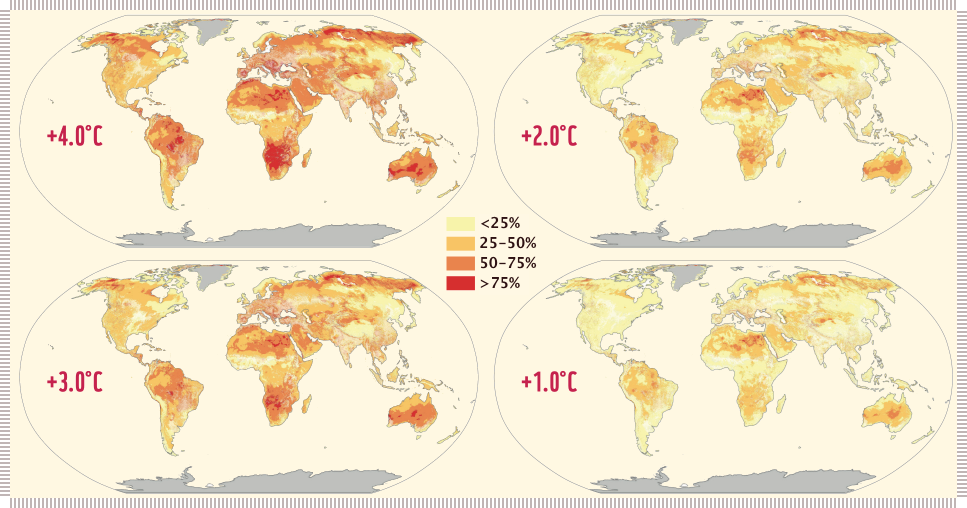
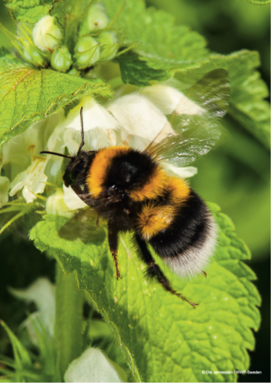
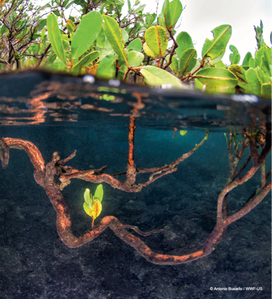
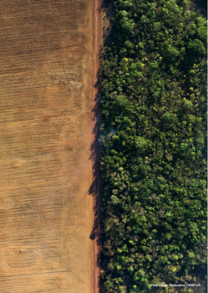

# Khủng hoảng Khí hậu & Đa dạng sinh học&mdash;Hai mặt của cùng một vấn đề

!!! quote "Lời dẫn"

    Ngày nay chúng ta phải đối mặt với tình trạng khẩn cấp liên quan chặt chẽ với nhau của biến đổi khí hậu do con người gây ra và mất đa dạng sinh học, đe dọa sự thịnh vượng của các thế hệ hiện tại và tương lai.

    **Báo cáo Hành tinh Sống 2022** là một nghiên cứu toàn diện về các xu hướng đa dạng sinh học toàn cầu và sức khỏe của hành tinh. Ấn phẩm hàng đầu này của Quĩ động vật hoang dã thế giới WWF cho thấy **mức suy giảm trung bình 69% quần thể các loài kể từ năm 1970**. Trong khi các nỗ lực bảo tồn đang tỏ ra hữu ích, chúng ta cần phải có hành động khẩn cấp nếu muốn đảo ngược tình trạng mất mát tự nhiên.

**Đa dạng sinh học** (*biodiversity*) là sự đa dạng của sự sống và sự tương tác giữa các sinh vật sống ở mọi cấp độ trên đất liền, dưới nước, trên biển và không khí&mdash;gien, quần thể, loài và hệ sinh thái. Các hệ sinh thái trên đất liền, hệ thống nước ngọt và biển&mdash;ví dụ như rừng, đồng cỏ, vùng đất ngập nước, đầm lầy ngập mặn và đại dương&mdash;cung cấp cho chúng ta các dịch vụ thiết yếu cho sức khỏe con người như thực phẩm và thức ăn chăn nuôi, thuốc men, năng lượng và vải sợi. Chúng điều hoà khí hậu, các mối nguy hiểm tự nhiên và các sự kiện cực đoan, chất lượng không khí, số lượng và chất lượng nước ngọt, sự thụ phấn và phát tán hạt giống, các loài sâu và bệnh tật, đất, sự axit hóa đại dương cũng như việc tạo ra và duy trì môi trường sống. Các hệ sinh thái này cũng cung cấp các trải nghiệm về thể chất và tâm lý, học tập và truyền cảm hứng, đồng thời hỗ trợ bản sắc và ý thức về địa phương. Mọi thứ cho phép chúng ta sống đều đến từ thiên nhiên. Các động lực chính trực tiếp dẫn đến sự xuống cấp của các hệ thống trên cạn, hệ thống nước ngọt và biển là những **thay đổi trong việc sử dụng đất và biển**, **khai thác quá mức thực vật và động vật**, **biến đổi khí hậu**, **ô nhiễm** và **các loài ngoại lai xâm lấn**. Những nguyên nhân trực tiếp dẫn đến mất đa dạng sinh học, suy thoái hệ sinh thái và các dịch vụ của chúng, xuất phát từ nhu cầu ngày càng tăng về năng lượng, thực phẩm và các nguyên liệu khác do tăng trưởng kinh tế nhanh, gia tăng dân số, thương mại quốc tế và lựa chọn công nghệ, đặc biệt là trong 50 năm qua.

Chúng ta đã khai thác các dịch vụ có giá trị thị trường&mdash;ví dụ như sản xuất thực phẩm, vải sợi, năng lượng và thuốc men&mdash;mà tàn phá của các dịch vụ [của tự nhiên và đa dạng sinh học] không có giá thị trường nhưng có giá trị kinh tế và xã hội rộng lớn hơn.

Một triệu loài thực vật và động vật đang bị đe dọa tuyệt chủng. 1% đến 2,5% các loài chim, động vật có vú, lưỡng cư, bò sát và cá đã bị tuyệt chủng; sự phong phú về quần thể và đa dạng di truyền đã suy giảm; và các loài đang mất đi môi trường sống thiết lập bởi nền khí hậu ổn định.

Trái đất đã nóng lên 1,2ºC kể từ thời kỳ tiền công nghiệp. Mặc dù biến đổi khí hậu cho đến nay vẫn chưa phải là nguyên nhân chính dẫn đến suy giảm đa dạng sinh học; trừ khi chúng ta hạn chế sự nóng lên ở mức dưới 2ºC và tốt nhất là 1,5ºC, biến đổi khí hậu có thể trở thành nguyên nhân chính gây mất đa dạng sinh học và suy thoái **các dịch vụ hệ sinh thái** (*ecosystem services*) ở những thập kỷ tới. Khoảng 50% san hô vùng nước ấm đã bị mất do nhiều nguyên nhân.

Nóng lên ở mức 1,5ºC sẽ làm mất 70-90% san hô vùng nước ấm và nóng lên ở mức 2ºC sẽ làm con số này gia tăng đến 99%. Chưa hết, tiến trình bảo tồn và phục hồi đa dạng sinh học phần lớn đã thất bại ở tất cả các quốc gia&mdash;không có mục tiêu nào trong số 20 mục tiêu đa dạng sinh học của Aichi cho năm 2020 được đáp ứng đầy đủ, và trong một số trường hợp, tình hình năm 2020 còn tồi tệ hơn năm 2010. Tương tự, chúng ta không đạt được Mục tiêu của Paris (của Thoả thuận chung Paris 2015) là dưới 2ºC (với nỗ lực giới hạn mức tăng ở mức 1,5ºC)&mdash;các cam kết hiện tại đưa chúng ta đến lộ trình đạt mức nóng lên 2 đến 3ºC và có thể cao hơn. Để đạt được mức 1,5ºC, lượng khí thải toàn cầu phải thấp hơn khoảng 50% so với lượng khí thải hiện tại vào năm 2030 và **phát thải ròng bằng không** (*net zero*) vào giữa thế kỷ này. Thật không may, chúng ta có khả năng vượt qua mục tiêu 1,5ºC trước năm 2040.

Biến đổi khí hậu và suy giảm đa dạng sinh học không chỉ là vấn đề môi trường mà còn là vấn đề kinh tế, phát triển, an ninh, xã hội, luân lí và đạo đức&mdash;do đó chúng phải được giải quyết cùng với **17 Mục tiêu Phát triển Bền vững của Liên hợp quốc** (*UN Sustainable Development Goals, SDGs*). Trong khi các nước công nghiệp phát triển phải chịu trách nhiệm cho phần lớn sự xuống cấp của môi trường, thì các nước nghèo và người nghèo lại là những người dễ bị tổn thương nhất. Trừ khi chúng ta bảo tồn và khôi phục đa dạng sinh học, đồng thời hạn chế biến đổi khí hậu do con người gây ra, hầu như không mục tiêu SDGs nào có thể đạt được&mdash;đặc biệt là an ninh lương thực và nước, sức khỏe tốt cho mọi người, xóa đói giảm nghèo và một thế giới công bằng hơn.

!!! quote "Lời dẫn"

    Mọi người đều có vai trò trong việc giải quyết những tình trạng khẩn cấp này; và hầu hết hiện nay đều thừa nhận rằng cần phải có những chuyển đổi. Sự thừa nhận này giờ đây cần phải được biến thành hành động.

## 1. Tác động của biến đổi khí hậu đối với con người và thiên nhiên

!!! quote "Lời dẫn"

    Sự nóng lên toàn cầu do con người gây ra đang làm thay đổi thế giới tự nhiên, thúc đẩy các sự kiện tử vong hàng loạt cũng như những cuộc tuyệt chủng đầu tiên của toàn bộ một loài. Mọi mức độ nóng lên dự kiến sẽ làm tăng những tổn thất này và tác động của chúng đối với con người.

Một tổng hợp cập nhật về tác động của biến đổi khí hậu đối với các loài hoang dã và hệ sinh thái mà chúng sinh sống đã được **Ủy ban liên chính phủ về biến đổi khí hậu** (*Intergovernmental Panel on Climate Change, IPCC*) xuất bản gần đây. **Báo cáo đánh giá lần thứ 6** (*IPCC 6^th^ assessment report*). Những tác động này bao gồm gia tăng các đợt nắng nóng và hạn hán đang dẫn đến hiện tượng cây cối, chim, dơi và cá chết hàng loạt. Một ngày nắng nóng duy nhất trong năm 2014 đã giết chết hơn 45.000 con dơi ‘cáo bay’ ở Úc. Biến đổi khí hậu cũng có liên quan đến việc mất đi toàn bộ quần thể của hơn 1.000 loài động thực vật.

Chúng ta cũng đang chứng kiến những sự tuyệt chủng đầu tiên của toàn bộ một loài. Cóc vàng đã tuyệt chủng vào năm 1989 do việc gia tăng nhiều hơn những ngày không có sương mù vốn diễn ra bình thường đối với các khu rừng trên mây ở Costa Rica. Bramble Cay melomys, một loài gặm nhấm nhỏ sống trên một hòn đảo nhỏ duy nhất giữa Úc và Papua New Guinea, đã bị tuyên bố tuyệt chủng vào năm 2016 sau khi mực nước biển dâng cao và một loạt cơn bão lớn tràn vào nhà của chúng, giết chết cây dùng làm lương thực và phá hủy các địa điểm làm tổ của chúng. Mọi mức độ nóng lên dự kiến sẽ làm gia tăng những thiệt hại này (**Hình 1**).

???+ note "**Hình 1**: Dự báo tổn thất về đa dạng sinh học trên cạn và vùng nước ngọt so với thời kỳ tiền công nghiệp"

    Mất đa dạng sinh học cùng với sự nóng lên toàn cầu ngày càng tăng. Tỷ lệ các loài dự kiến bị biến mất càng cao (do mất khí hậu phù hợp ở một khu vực nhất định), rủi ro đối với tính toàn vẹn, chức năng và khả năng phục hồi của hệ sinh thái đối với biến đổi khí hậu càng cao. Phần tô màu thể hiện tỷ lệ số loài trở nên không thích nghi được với nền khí hậu được dự báo đến mức trở nên **Nguy cấp** (*Endangered*) (theo Liên minh Quốc tế về Bảo tồn Thiên nhiên, IUCN) tại địa phương và có nguy cơ tuyệt chủng cục bộ cao trong một khu vực nhất định với mức độ nóng lên toàn cầu nhất định. Nguồn: In lại từ Hình 2.6 trong Parmesan et al. (2022), dựa trên dữ liệu của Warren và cộng sự (2018)

Không phải tất cả các loài đang bị biến đổi khí hậu hành hạ. Bọ cánh cứng và sâu bướm tấn công các khu rừng phía bắc sống sót tốt hơn trong mùa đông ấm hơn và sinh ra nhiều thế hệ hơn mỗi năm với mùa sinh trưởng dài hơn, gây ra hiện tượng cây chết hàng loạt ở các vùng ôn đới và phương bắc của Bắc Mỹ và Châu Âu. Nhiều loài côn trùng và sâu gây bệnh cho cả động vật hoang dã và con người đã di chuyển đến các khu vực mới và đang gây ra các bệnh mới xuất hiện ở vùng cao Bắc Cực và dãy núi Himalaya.

Sự nóng lên cũng đang thay đổi cách các hệ sinh thái hoạt động, khởi động các quá trình sinh thái mà theo thời gian, chính chúng sẽ gây ra sự nóng lên nhiều hơn: quá trình này được gọi là **“phản hồi khí hậu tích cực”** (*positive climate feedback*). Cháy rừng gia tăng, cây chết do hạn hán và côn trùng bùng phát, **đất than bùn khô** (*peatlands*) và **băng vĩnh cửu lãnh nguyên** (*tundra permafrost*) tan, tất cả đều thải ra nhiều khí CO~2~ khi xác thực vật bị phân hủy hoặc bị đốt cháy. Điều này đang bắt đầu biến đổi các hệ thống trước đây là **nguồn thu carbon** (*carbon sink*) rắn thành các **nguồn phát thải carbon** (*carbon source*) mới.

Một khi các quá trình sinh thái này đạt đến đỉnh điểm, chúng sẽ trở nên không thể đảo ngược và khiến hành tinh của chúng ta tiếp tục nóng lên với tốc độ rất cao. Đây là một trong những rủi ro lớn nhất từ việc **vượt quá”** (*overshoot*) các ngưỡng nhiệt độ có thể gây biến đổi khí hậu nguy hiểm đã được cộng đồng quốc tế đã thống nhất, (**vượt quá** ngưỡng nóng lên đã được xác định trong giai đoạn ít nhất một thập kỷ trở lên), và sẽ là một thảm họa cho xã hội cũng như cho thế giới và phần lớn động vật hoang dã trên hành tinh của chúng ta.

???+ note "Một con ong nghệ chúa (Bombus hortorum)"

    ...ghé thăm một cây tầm ma trắng (*album Lamium*) trong vườn. Ong nghệ là loài thụ phấn quan trọng cho cả thực vật hoang dã và nhiều loại cây trồng. Mặc dù có một số loài riêng lẻ được dự đoán sẽ được hưởng lợi từ biến đổi khí hậu, một nghiên cứu về 66 loài ong nghệ trên khắp Bắc Mỹ và Châu Âu đã phát hiện ra sự suy giảm ở hầu hết các loài ong tại hầu hết các địa điểm. Điều này có thể là do tác hại của thuốc trừ sâu và thuốc diệt cỏ vượt qua bất kỳ tác động tích cực tiềm ẩn nào của biến đổi khí hậu.

## 2. Mối liên hệ quan trọng giữa rừng, khí hậu, nước và thực phẩm

!!! quote "Lời dẫn"

    Rừng đóng vai trò quan trọng trong việc ổn định khí hậu của chúng ta, nhưng nạn phá rừng đe dọa đến chức năng quan trọng này cũng như các dịch vụ hệ sinh thái khác bao gồm vùng đệm chống lại tác động của **sóng nhiệt** (*heatwave*) và cung cấp nước ngọt cho các vùng đất nông nghiệp.

Rừng là nền tảng để điều hòa khí hậu Trái đất, trao đổi nhiều carbon, nước và năng lượng với khí quyển hơn bất kỳ hệ sinh thái trên cạn nào khác. Rừng cũng ảnh hưởng đến lượng mưa và mức độ nghiêm trọng của sóng nhiệt, tác động đến khả năng phục hồi của các hệ thống nông nghiệp và cộng đồng địa phương.

Rừng lưu trữ nhiều carbon hơn tất cả dầu, khí đốt và than đá có thể khai thác của Trái đất, và từ năm 2001 đến 2019 rừng đã hấp thụ 7,6 tỉ tấn CO~2~ từ bầu khí quyển mỗi năm, tương đương khoảng 18% tổng lượng khí thải carbon do con người gây ra.

Ngoài carbon, cấu trúc vật lý của rừng cũng ảnh hưởng đến cả khí hậu toàn cầu và địa phương.Rừng hấp thụ năng lượng từ mặt trời vì chúng tối. Năng lượng này được sử dụng để di chuyển một lượng lớn nước từ đất trở lại khí quyển, thông qua một quá trình gọi là **thoát hơi nước** (*evapotranspiration*), làm mát nhiệt độ bề mặt cục bộ và toàn cầu. Sự gồ ghề của tán rừng góp phần vào việc pha lẫn không khí ấm vào bầu khí quyển, tản nhiệt và phân phối lại độ ẩm cần thiết. Các quá trình lý sinh này giúp ổn định thời tiết cũng như khí hậu, hạn chế nhiệt độ tối đa hàng ngày xuống đến vài độ, giảm cường độ và thời gian của các đợt nắng nóng và hạn hán khắc nghiệt, đồng thời duy trì lượng mưa theo mùa. Tác động tổng hợp của rừng làm mát hành tinh khoảng 0,5ºC.

Tuy nhiên, mỗi năm chúng ta mất khoảng 10 triệu héc-ta rừng&mdash;diện tích tương đương với diện tích của Bồ Đào Nha. Phá rừng, đặc biệt là ở vùng nhiệt đới, gây ra khí thải carbon và dẫn đến khí hậu địa phương ấm hơn, khô hơn, hạn hán và hỏa hoạn gia tăng, tùy thuộc vào quy mô, giảm lượng mưa và thay đổi mô hình lượng mưa toàn cầu. Ví dụ, việc chặt phá rừng nhiệt đới ở Trung Phi hoặc Nam Mỹ có thể làm tăng nhiệt độ trung bình ban ngày lên 7-8ºC và giảm lượng mưa ở những khu vực đó khoảng 15%.

Nền nông nghiệp nhờ nước mưa sử dụng 80% diện tích đất canh tác toàn cầu và chịu trách nhiệm cung cấp 60% tổng lượng lương thực được sản xuất. Do đó, việc phá rừng có thể ảnh hưởng đến an ninh lương thực của hàng tỷ người, và gây rủi ro cho sinh kế của hàng triệu người. Nguy cơ này càng trầm trọng hơn do tác động của biến đổi khí hậu có thể khiến hạn hán xảy ra thường xuyên hơn và nghiêm trọng hơn, làm giảm năng suất lao động và sản xuất nông nghiệp. Do đó, **Mục tiêu Phát triển Bền vững Toàn cầu** (SDGs) là ngăn chặn nạn phá rừng, khôi phục và quản lý rừng bền vững đóng vai trò quan trọng trong việc bảo vệ đa dạng sinh học và hạn chế sự nóng lên toàn cầu, thích ứng với biến đổi khí hậu và cung cấp nguồn nước quý giá cho hệ thống lương thực của chúng ta.

???+ note "Nancy Rono, một nông dân"

    ...tại trang trại của cô ở hạt Bomet, lưu vực thượng lưu sông Mara, Kenya.

## 3. Sự kỳ diệu của rừng ngập mặn&mdash;một giải pháp quan trọng dựa vào thiên nhiên cho các cộng đồng ven biển

!!! quote "Lời dẫn"

    Rừng ngập mặn là một giải pháp nhiều bên cùng có lợi: cho đa dạng sinh học, khí hậu và con người, nếu chúng ta tiếp tục bảo tồn và phục hồi chúng.

Rừng ngập mặn là những rừng cây độc đáo nhất của biển. Chúng là nguồn dự trữ đa dạng sinh học quan trọng và hỗ trợ sinh kế của các cộng đồng ven biển bằng cách cung cấp các dịch vụ như thực phẩm và nhiên liệu, bằng cách nâng đỡ nghề cá vốn có tầm quan trọng về mặt kinh tế và thông qua các dịch vụ văn hóa như du lịch sinh thái, giáo dục và các giá trị tinh thần.

Rừng ngập mặn cũng là một giải pháp quan trọng dựa vào thiên nhiên để đối phó với biến đổi khí hậu. Chúng góp phần giảm thiểu tác động qua cô lập và thu giữ **“cacbon xanh”** (*blue carbon*) trong đất ngập nước của mình, với mật độ thu giữ vượt qua nhiều hệ sinh thái khác. Một số rừng ngập mặn giàu cacbon nhất được tìm thấy ở bờ biển Thái Bình Dương của Colombia&mdash;những rừng ngập mặn này có chiều cao vượt quá 50m. Ngoài ra, rừng ngập mặn giúp thích ứng với biến đổi khí hậu, vì rễ chằng chịt trên mặt đất là vùng đệm cho sóng và giữ lại trầm tích, cho phép một số rừng ngập mặn tăng bề mặt [tiếp xúc] và bắt kịp với mực nước biển dâng.

Bất chấp tầm quan trọng của chúng, rừng ngập mặn vẫn tiếp tục bị chặt phá bởi nuôi trồng thủy sản, nông nghiệp và phát triển ven biển, với tỷ lệ hiện tại là 0,13% mỗi năm. Nhiều rừng ngập mặn cũng bị suy thoái do khai thác quá mức và do ô nhiễm, bên cạnh các tác nhân gây áp lực (*stress*) tự nhiên như bão và xói lở bờ biển. Mất rừng ngập mặn là mất môi trường sống cho đa dạng sinh học và mất các dịch vụ hệ sinh thái của các cộng đồng ven biển, và ở một số nơi, chính vùng đất nơi các cộng đồng ven biển sinh sống bị mất đi. Ví dụ, 137 km^2^ rừng ngập mặn Sundarbans đã bị xói mòn từ năm 1985, làm giảm các dịch vụ đất đai và hệ sinh thái đối ở nhiều vùng nơi có 10 triệu người đang sống.

Tín hiệu đáng mừng là nạn phá rừng ngập mặn đã giảm đáng kể kể từ những năm 1980 và chúng ta hiện có những viễn cảnh trong đó diện tích rừng ngập mặn toàn cầu có thể ổn định hoặc thậm chí tăng lên vào năm 2070. Điều này đòi hỏi phải phục hồi rừng ngập mặn trên diện rộng. Nhưng những hành động như vậy, một khi thành công, có thể mang lại các dịch vụ hệ sinh thái có giá trị giúp cải thiện sinh kế và giảm thiểu biến đổi khí hậu.

Tuy nhiên, các điểm nóng về mất rừng ngập mặn vẫn còn, đặc biệt là ở Myanmar, và một số quốc gia đang phát triển các chính sách an ninh lương thực có thể dẫn đến việc chuyển đổi rừng ngập mặn lớn hơn nữa. Các mục tiêu khôi phục đầy tham vọng, mặc dù được hoan nghênh, nhưng thường tỏ ra khó thành công trên thực tế. Cần có thêm các nỗ lực bảo tồn và phục hồi để rừng ngập mặn tiếp tục cải thiện khí hậu, đa dạng sinh học và sinh kế trên toàn thế giới.

???+ note "Rừng ngập mặn" 

    ...ở Los Tuneles trên đảo Isabela, Galapagos, Ecuador.

## 4. Gốc rễ của một cuộc khủng hoảng đan xen

!!! quote "Lời dẫn"

    Vào năm 2021, lần đầu tiên các cơ quan về đa dạng sinh học và khí hậu của Liên Hợp Quốc&mdash;IPBES và IPCC&mdash;đã cùng nhau nêu bật mối liên hệ nhiều mặt giữa các cuộc khủng hoảng khí hậu và đa dạng sinh học, bao gồm cả nguồn gốc chung của chúng, đồng thời cảnh báo về những rủi ro mới về một tương lai không thể sống được.

Các báo cáo đánh giá gần đây từ IPBES, IPCCvà hội thảo chung IPBES-IPCC đã ghi lại một cách rõ ràng về biến đổi khí hậu và sự xuống cấp liên tục của đa dạng sinh học và những đóng góp của thiên nhiên đối với con người. Trong 50 năm qua, nhiệt độ trung bình toàn cầu và tần suất của các hiện tượng thời tiết cực đoan đã tăng lên, cũng như số lượng của các loài bị đe dọa tuyệt chủng.

Những xu hướng này là kết quả của các tác nhân trực tiếp của con người, chẳng hạn như **phát thải khí nhà kính** từ quá trình đốt cháy nhiên liệu hóa thạch, **chuyển đổi và suy thoái môi trường sống do thay đổi sử dụng đất**, ô nhiễm và thu hoạch không bền vững, và sự ra đời của các loài xâm lấn. Một số nguyên nhân trực tiếp như thay đổi sử dụng đất và ô nhiễm có thể gây ra cả biến đổi khí hậu và suy thoái đa dạng sinh học, trong khi những nguyên nhân khác chủ yếu thúc đẩy một trong hai: ví dụ, xâm lấn sinh học có tác động hạn chế đến khí hậu.

Các yếu tố thúc đẩy trực tiếp được củng cố bởi một loạt các yếu tố thúc đẩy gián tiếp hơn, chẳng hạn như sự gia tăng dân số và sự giàu có của con người, cũng như các yếu tố văn hóa xã hội, kinh tế, công nghệ, thể chế và quản trị, có liên quan đến các giá trị và hành vi trong 50 vừa qua.

Trong những năm qua, dân số loài người đã tăng gấp đôi, nền kinh tế toàn cầu đã tăng gần gấp bốn lần và thương mại toàn cầu đã tăng gấp mười lần, cùng với đó là sự gia tăng đáng kể nhu cầu về năng lượng và vật liệu. Các khuyến khích kinh tế thường ủng hộ việc mở rộng hoạt động kinh tế, thường gây hại cho môi trường, hơn là bảo tồn hoặc phục hồi.

???+ note "Phá rừng" 

    Nhìn từ trên không cánh đồng ngô và khu rừng đã thu hoạch dưới làn khói mù mịt từ các vụ cháy rừng không được kiểm soát ở Brazil.

## 5. Dấu chân sinh thái của nhân loại vượt quá khả năng sinh học của Trái đất

!!! quote "Lời dẫn"

    Con người sử dụng nhiều tài nguyên sinh thái như thể chúng ta sống trên gần hai Trái đất. Điều này làm xói mòn sức khỏe của hành tinh và triển vọng của nhân loại.

**Năng lực sinh học** (*biocapacity*) của hành tinh chúng ta là khả năng tái sinh của các hệ sinh thái. Nó là **đơn vị tiền tệ cơ bản** (*underlying currency*) của tất cả các hệ thống sống trên Trái đất. Ví dụ, năng lực sinh học cung cấp cho con người các **nguồn tài nguyên sinh học** (*biological resources*) và hấp thụ **chất thải** (*waste*) chúng ta tạo ra. Chúng ta có thể đo lường cả năng lực sinh học và nhu cầu của mọi người&mdash;nhu cầu mà chúng ta gọi là **Dấu chân sinh thái** (*ecological footprint*) của con người. Nó bao gồm tất cả các nhu cầu cạnh tranh đối với tự nhiên, từ sản xuất thực phẩm và chất xơ cho đến việc hấp thụ lượng khí thải carbon dư thừa. Tài khoản Dấu chân sinh thái ghi lại rằng loài người sử dụng quá mức hành tinh của chúng ta ít nhất 75%, tương đương với việc sinh sống trên 1,75 Trái đất. Sự quá tải này làm xói mòn sức khỏe của hành tinh và cùng với nó là triển vọng của nhân loại.

Nhu cầu của con người và tài nguyên thiên nhiên phân bố không đều trên Trái đất. Việc tiêu thụ các tài nguyên này khác nhau từ sự sẵn có của tài nguyên, vì tài nguyên có thể không được tiêu thụ tại nơi khai thác. Dấu chân sinh thái mỗi người cung cấp thông tin chi tiết về hiệu quả tài nguyên, rủi ro và cơ hội của các quốc gia. Các mức độ khác nhau của Dấu chân Sinh thái là do lối sống và mô hình tiêu dùng khác nhau, bao gồm lượng thực phẩm, hàng hóa và dịch vụ mà cư dân tiêu thụ, nguồn tài nguyên thiên nhiên mà họ sử dụng và lượng khí CO~2~ thải ra để cung cấp những hàng hóa và dịch vụ này.

???+ note "Hình 2: Dấu chân sinh thái toàn cầu và năng lực sinh học từ năm 1961 đến năm 2022 tính bằng héc-ta toàn cầu trên mỗi người"
    
    Đường màu xanh là tổng Dấu chân sinh thái trên mỗi người và đường màu hồng là Dấu chân carbon trên mỗi người (một tập hợp con của Dấu chân sinh thái). Các đường màu xanh lá cây cho thấy khả năng sinh học của mỗi người. Kết quả cho năm 2019-2022 là ước tính hiện tại; các điểm dữ liệu còn lại được lấy trực tiếp từ Tài khoản Dấu chân Quốc gia và Năng lực Sinh học, ấn bản năm 2022.

### Tìm hiểu về Dấu chân sinh thái

- **Dấu vết đất chăn thả** (*grazing land footprint*) đo lường nhu cầu về đất chăn thả để chăn nuôi gia súc lấy thịt, sữa, da và các sản phẩm len.

- **Dấu vết lâm sản** (*forest product footprint*) đo lường nhu cầu về rừng để cung cấp gỗ nhiên liệu, bột giấy và các sản phẩm từ gỗ.

- **Dấu vết ngư trường** (*fishing grounds footprint*) đo lường nhu cầu đối với các hệ sinh thái biển và nước nội địa cần thiết để bổ sung hải sản đã thu hoạch và hỗ trợ nuôi trồng thủy sản.

- **Dấu vết đất trồng trọt** (*cropland footprint*) đo lường nhu cầu về đất đai cho lương thực và chất xơ, thức ăn cho gia súc, cây lấy dầu và cao su.

- **Dấu vết đất xây dựng** (*build-up land footprint*) đo lường nhu cầu đối với các khu vực sản xuất sinh học được bao phủ bởi cơ sở hạ tầng, bao gồm đường xá, nhà ở và các công trình công nghiệp.

- **Dấu vết carbon** (*carbon footprint*) đo lường lượng khí thải carbon từ quá trình đốt nhiên liệu hóa thạch và sản xuất xi măng. Những khí thải này được chuyển đổi để tính ra số lượng rừng cần thiết để cô lập lượng khí thải không được hấp thụ bởi các đại dương. Nó giải thích cho các mức độ hấp thụ carbon khác nhau của rừng tùy thuộc vào mức độ quản lý của con người, loại và tuổi rừng, lượng khí thải từ các vụ cháy rừng và sự hình thành và mất mát của đất.

???+ note "Hình 13: Dấu chân sinh thái của nhân loại theo sử dụng đất và theo các hoạt động"

    Dấu chân sinh thái đo lường mức độ nhu cầu tiêu dùng của con người đối với sinh quyển và so sánh nó với những gì hệ sinh thái có thể tái tạo. Vào năm 2020, Dấu chân sinh thái trung bình trên thế giới lên tới 2,5 ha toàn cầu cho mỗi người, so với 1,6 ha năng lực sinh học toàn cầu. Dấu chân có thể được chia nhỏ theo loại khu vực (vòng tròn bên ngoài) hay, sử dụng Đánh giá Đầu vào-Đầu ra Đa vùng, theo lĩnh vực hoạt động (vòng tròn bên trong)

### Tiêu thụ trên toàn thế giới

Để sống trong khả năng của hành tinh chúng ta, Dấu chân Sinh thái của nhân loại sẽ cần phải
thấp hơn khả năng sinh học của hành tinh, hiện ở mức 1,6 ha toàn cầu cho mỗi người. Vì vậy, nếu Dấu chân sinh thái của một quốc gia là 6,4 ha toàn cầu cho mỗi người, nhu cầu của cư dân vào các sản phẩm tự nhiên từ thực phẩm, chất xơ, khu đô thị đến khả năng hấp thụ carbon sẽ cao gấp bốn lần so với những gì có sẵn trên hành tinh này cho mỗi người.

???+ note "Hình 14: Dấu chân sinh thái trên đầu người"

    Để biết thêm chi tiết về Dấu chân sinh thái, sự thiếu hụt/thừa dự trữ sinh thái, v.v., mời bạn tham khảo thêm trên trang web [data.footprintnetwork.org](https://data.footprintnetwork.org).

**Tác giả: WWF cộng tác với ZSL**  

**Quĩ động vật hoang dã thế giới WWF** (*World Wildlife Fund*) là một tổ chức bảo tồn độc lập, với hơn 35 triệu người theo dõi và một mạng lưới toàn cầu hoạt động thông qua lãnh đạo địa phương tại hơn 100 quốc gia. Nhiệm vụ của WWF là ngăn chặn sự xuống cấp của môi trường tự nhiên trên hành tinh và xây dựng một tương lai trong đó con người sống hài hòa với thiên nhiên, bằng cách bảo tồn sự đa dạng sinh học của thế giới, đảm bảo rằng việc sử dụng bền vững các nguồn tài nguyên thiên nhiên có thể tái tạo và thúc đẩy giảm thiểu ô nhiễm và tiêu dùng lãng phí.

**Hiệp hội Động vật học Luân Đôn ZSL** (*Zoological Society of London*) là một tổ chức bảo tồn do khoa học hàng đầu trên toàn cầu giúp con người và động vật hoang dã sống tốt hơn cùng nhau để khôi phục sự kỳ diệu và đa dạng của cuộc sống ở khắp mọi nơi. Đó là một phong trào mạnh mẽ của các nhà bảo tồn vì thế giới sống, làm việc cùng nhau để cứu các loài động vật đang trên bờ vực tuyệt chủng và những loài có nguy cơ tiếp theo. ZSL quản lý Chỉ số Hành tinh Sống trong quan hệ đối tác hợp tác với WWF.

[Báo cáo Hành tinh sống 2022](https://livingplanet.panda.org/en-US/)

