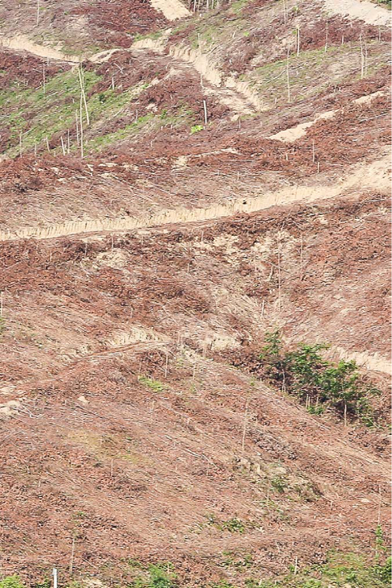

# Nương tựa vào thiên nhiên

<iframe style="display: block; margin: auto;" width="640" height="400" src="https://www.youtube.com/embed/FeSaf2GjpTo?hl=vi&cc_lang=vi&cc_lang_pref=vi&cc_load_policy=1" title="YouTube video player" frameborder="0" allow="accelerometer; autoplay; clipboard-write; encrypted-media; gyroscope; picture-in-picture; web-share" allowfullscreen></iframe>

!!! quote "Lời nói đầu"

    Bạn thân mến,

    Cuốn sách ảnh này là tập hợp những chia sẻ đến từ các hộ dân đang thực hành nông nghiệp sinh thái tại hai tỉnh miền Trung của Việt Nam là Hà Tĩnh và Quảng Bình. Áp dụng nguyên tắc nương tựa vào “Rừng - Rẫy - Ruộng”, họ đang góp phần duy trì và phát triển một phương thức canh tác sinh thái bền vững vốn dễ chịu tổn thương từ nền nông nghiệp độc canh và việc lạm dụng phân hóa học, thuốc trừ sâu và thuốc diệt cỏ tại hệ sinh thái đất dốc ở Việt Nam. Phương thức này cũng tạo ra tác động tích cực đến quá trình biến đổi khí hậu hiện nay.
    
    Những câu chuyện trong cuốn sách được tác giả ghi chép lại từ lời kể trực tiếp của nhân vật và từ những ngày quan sát thực tế tại địa phương. Thông qua từng câu chuyện, chúng tôi hi vọng mang lại một góc nhìn hoàn thiện hơn về nông nghiệp sinh thái, đồng thời giúp bạn tích lũy được những bài học kinh nghiệm thiết thực trên hành trình thực hành nông nghiệp của mình.

## Rừng (*The Forest*)

{align=right}
20 năm trước, nơi đây toàn là đất trống, đồi trọc. Rừng bị khai thác cạn kiệt và tan hoang. Đặc biệt năm 2002 có một trận lũ lớn nhất lịch sử. Kể từ lúc đó, chúng tôi tiến hành bảo vệ rừng, không cho người ngoài vào xâm hại rừng, giữ nguyên thảm thực vật của rừng để cho rừng tự nhiên tái sinh phục hồi. Còn vùng đất trống đồi trọc thì chúng tôi ươm và trồng phủ xanh bằng cây bản địa của núi rừng Hương Sơn này, đồng thời cung cấp nguồn giống cho bà con xung quanh. Ngoài ra, ở vùng đất bằng dưới các tán rừng, chúng tôi tạo ra các mô hình nông nghiệp sinh thái. Đây là các mô hình nông nghiệp sản xuất theo kiến thức bản địa của đồng bào tại địa phương, không sử dụng phân hóa học, không sử dụng thuốc trừ sâu và sử dụng cây bản địa theo truyền thống.

Từ đó là rừng phục hồi rất nhanh. Động thực vật ở dưới tán rừng chung sống hài hòa, không làm ảnh hưởng đến sự phát triển của rừng và người dân sống dưới rừng cũng có điều kiện để phát triển đời sống của mình mà không làm tổn hại đến cảnh quan và môi trường thiên nhiên.

!!! quote "Ông Trần Quốc Việt, nông dân ở huyện Huơng Sơn, tỉnh Hà Tĩnh"

    Nếu chúng ta quan tâm thực sự, đầu tư thực sự và yêu rừng thực sự thì chắc chắn rừng sẽ phát triển rất tốt.

## Ba giá trị cốt lõi (Three Core Values)

Nói đến quy hoạch nông nghiệp sinh thái, tức là nói đến quy hoạch hệ thống canh tác dựa vào ngôi nhà sinh thái. Khi đó, ta phải tập trung đến ba giá trị cốt lõi của một hệ thống. Đó là gì?

Trước hết, đó là **tính đặc thù tự nhiên của vùng, của khu vực** (*ecological landscape characteristic of an ecosystem*). Cái thứ hai là **sự đa dạng của hệ sinh thái** (*biodiversity*) đó. Và cái thứ ba là **tri thức bản địa** (*indigenous knowledge*) của các tộc người đang sinh sống trong khu vực đấy. Mình không phá vỡ bất cứ điều kiện nào của tự nhiên mà thay vào đó, dựa vào đó để quy hoạch. Với ba giá trị cốt lõi như thế, khi quy hoạch ta phải tiến hành quan sát từ tổng thể đến chi tiết, từ xa đến gần để nhận diện sự tương tác của mặt trời, nước và gió tại nơi đây. Sau đó là nhận diện những khó khăn, thách thức cùng những điều kiện thuận lợi và cơ hội để lựa chọn phương án quy hoạch cho phù hợp.

!!! quote "Ông Lê Văn Ka, nông dân ở huyện Hương Sơn, tỉnh Hà Tĩnh"

    Một hệ thống canh tác nông nghiệp sinh thái bắt buộc phải có rừng. Từ rừng, tất cả các chất mùn, chất dinh dưỡng được tích lũy ở trong rừng được chuyển dần xuống dưới nhờ các loài vi sinh vật và nguồn nước. Cái này là tri thức của bà con đấy.

## Nước (The Water)

Có nước từ rừng và nước mưa này thì mình ngăn dòng, tạo mương trên cao để đón dòng chảy ngăn xói mòn sạt lở và điều tiết nước chảy từ mương cao xuống mương thấp. Nước sẽ mang theo phân mùn và các vi sinh vật xuống dưới để chảy vào hệ thống mương đồng mức (các mương chứa nước được xây trên cùng một độ cao). Nước trong mương đồng mức lưu thông qua tất cả luống vườn, ngấm vào đất rồi lại tiếp tục chảy xuống phía dưới. Chất dinh dưỡng, chất mùn ở trên cao theo nước chảy xuống và lắng đọng trong mương thì sẽ tốt cho những luống rau và làm mát phần dưới của đất canh tác, của vườn đấy.

Sơ đồ thiết kế vườn với hệ thống mương đồng mức và hình ảnh trong thực tế:

!!! quote "Anh Trần Chí Kiên, nông dân ở huyện Hương Sơn, tỉnh Hà Tĩnh"

    Thế là mình tận dụng được tối đa cái lượng nước có sẵn của thiên nhiên ban tặng.

## Cây bản địa (*The Native Trees*)

Gió và mặt trời đều có sẵn trong tự nhiên, mình chỉ lợi dụng hướng của chúng thôi. Phải biết hướng ánh nắng mặt trời và hướng gió để phân bố cây trồng cho phù hợp, tránh được ánh nắng và gió không tốt cho cây trồng và vật nuôi. Thường trong một mô hình thì phía Tây để trồng cây lớn còn phía Đông là để trồng một số loại rau. Phía Tây trồng cây gỗ lớn để che ánh nắng về buổi chiều. Còn về phía Đông để trồng rau vì nắng của ban mai mà chiếu vô cây rau là tốt. Ở đó vườn rau gần chỗ nấu ăn nên sẽ tiết kiệm thời gian cho người phụ nữ hoặc người nấu ăn ra hái rau. Và cái tổ ong mà quay về hướng Tây thì tổ đó có rất ít ong, ảnh hưởng xấu đến lượng mật ong thu được.

Thời gian để mình trồng cây lâm nghiệp, làm vườn rừng rồi làm nông nghiệp sinh thái thì kéo rất dài (dẫn đến thời gian sinh lời lâu) nên mình nuôi ong vì con ong là sinh kế ngắn ngày. Trong sáu tháng là có thu nhập cho mô hình rồi. Thứ hai nữa là khi mình nuôi con ong thì biết được ong ăn gì. Ong cần đến hoa thì chúng ta phải trồng nhiều cây, nhiều loại hoa và tạo ra không gian cho ong nữa. Ong không ưa hóa chất mà ong ưa tự nhiên nên nếu muốn có ong tự nhiên mình không được dùng hóa chất, không được xịt thuốc. Nếu xịt là ong sẽ chết, ong sẽ đi. Muốn ong ở và ong về thì phải hoàn toàn giống tự nhiên.

!!! quote "Ông Nguyễn Đức Sự, nông dân ở huyện Tuyên Hóa, tỉnh Quảng Bình"

    Trước 2017, vườn của tôi là vườn keo, hoàn toàn keo. Sau này bị bão nên mất hết, tôi không trồng cây keo mà quyết định trồng cây bản địa. Bởi vì nếu cây bưởi nghiêng ngả thì còn có cây cam. Cây cam nghiêng thì còn cây chuối, cây thanh long. Chúng mà ngã tiếp thì còn cây dược liệu dưới tán rừng. Còn cây keo sập xuống thì mất hết vì nó là độc canh. Bão về là trắng tay. Cây bản địa thì mang lại giá trị về nhiều mặt. Nó chịu được nắng, mưa, gió và chống chọi được với côn trùng. Hơn nữa khi trồng cây dược liệu thì có sẵn thuốc Nam trong vườn mỗi khi đau ốm.

## Kiến thức và sự quyết tâm (*Knowledge and Determination*)

Ở vùng này thì rừng bị tàn phá hết, chỉ toàn là keo và bạch đàn thôi. Trồng keo thì gần như không trồng thêm được cái gì. Keo thì ảnh hưởng gây khô đất, khô nước; họ thu hoạch xong rồi cũng phá bỏ đi. Để làm thành cái vườn thì phải là một quá trình dài. Quan trọng là ở mình, là có kiến thức trong tư tưởng. Thứ hai nữa là cái quyết tâm chịu khó. Không quyết tâm thì cũng không thể làm được. Ngày nay chỉ cần tiền là sẽ có máy móc chứ trước đây có tiền thì máy cũng không có, mình phải làm thủ công hết.

Bác trồng chủ yếu là tiêu với mít thôi. Tiêu bám vào thân cây mít thì mình vừa thu hái được quả mít vừa thu hái được tiêu. Giữa các hàng, xen các bờ mương thì mình trồng xen dứa chẳng hạn, để còn có nguồn thu. Vùng nào mà cây mít chưa khép tán thì mình trồng cây cam, cây chanh, cây khoai,...

Nước đây, bác nhờ cái giếng khoan mới tồn tại được cái vườn, chứ không có giếng là mùa nắng cây cối chết hết, không còn cái gì. Phân thì bác đi nhặt. Có cái xe cái xẻng, thế là đi xúc lá xúc phân ngoài vườn ngoài chuồng của con cháu ngoài làng ấy mang về đây. Cây lạc ở đây người ta thu hoạch xong thì vất thân cây đi. Mình thì thu về để tấp ủ xung quanh các loại cây. Cây lạc là tốt cho đất lắm. Một ngày mình đi thu gần một chục gánh là đơn giản. Mình mang về cứ ủ dày ở đây, đến hết năm thì xong, hai năm sau lại ủ tiếp.

Tấp ủ là một khâu quan trọng. Thứ nhất là để giữ độ ẩm của đất, thứ hai là hạn chế cỏ dại, thứ ba là sau khi nó phân hủy nó là nguồn phân cung cấp cho đất nhiều chất dinh dưỡng rất quan trọng. Riêng vườn bác đây thì không bao giờ bác bỏ một tí lân hay đạm nào cả.

## Cân bằng và đa dạng (*Balance and Diversity*)

Vườn của mình là ngôi nhà của rất nhiều loài sinh sống trên này như cào cào này, ốc sên này, ếch nhái này. Có những loài như giun hay dế trong lúc đào hang chúng sẽ giúp cày xới, giúp cho mình đỡ việc hơn. Ban ngày thì chúng chui xuống dưới đất nhưng ban đêm chúng chui lên ăn uống đi lại, hoạt động rất thoải mái.

Các loại quả như cam, bưởi thì người ta hay bọc bằng túi nilon (để ngăn côn trùng ăn quả). Mỗi quả một túi nilon thì một cây 100 quả là 100 túi, một vườn 100 cây thì lượng rác rất là lớn. Riêng ở vườn của mình, khi đưa được vườn về cân bằng thì quả vẫn ra nhiều và đẹp, sâu ít đi và không cần phải bọc nilon nữa. Quả sẽ hưởng thụ đầy đủ năng lượng từ bên ngoài môi trường, tạo ra chất diệp lục để nuôi dưỡng quả. Còn nếu mình bọc quả bằng túi nilon thì các chất dinh dưỡng bị ngăn cản. Túi nilon còn rất là độc nữa. Trong vườn vẫn có một số quả bị ăn nhưng mình dùng quả đó nuôi vi sinh vật trong vườn.

Cân bằng trong vườn phải nhờ vào rất nhiều yếu tố. Thứ nhất là cây cối phải đa dạng, thậm chí là đa dạng các loại cỏ. Thứ hai là trong vườn mình tuyệt đối không dùng hóa chất. Khi mình dùng hóa chất thì mình lại giết chết các loại sinh vật và vi sinh vật. Mình diệt hết chúng đi thì không có hiện tượng con này ăn con kia, sự cân bằng trong vườn vì thế cũng mất theo.

!!! quote "Chị Mai Thị Thúy Huyền, nông dân ở huyện Tuyên Hóa, tỉnh Quảng Bình"

    Mình phải quan sát qua rất nhiều năm. Nếu không có thời gian để quan sát lâu dài cũng không thể hiểu hết được vườn của mình.

## Sản phẩm sinh thái (*Ecological Product*)

Ngoài quan sát sự đa dạng trong tự nhiên thì mình cũng phải suy nghĩ mình có thể làm gì nữa. Có thể là mình không hiện thực hóa được hoàn toàn những nghiên cứu nhưng mà mình cần phải thử nghiệm. Mình cần phải làm sao để chắc chắn rằng vòng tròn sản phẩm sinh thái của mình sẽ không tạo ra rác và thân thiện với mảnh vườn của mình.

Trong tự nhiên là không có gì thừa hết, ví dụ là loài hoa cứt lợn. Mọi người xem đó là cỏ dại nhưng qua cái lăng kính của sản phẩm sinh thái thì mình lại xem đó là một bài thuốc rất là quý và là nguồn nguyên liệu để mình thu hái. Mình có thể dùng cây cứt lợn chiết tinh dầu, sử dụng cho người viêm xoang rất tốt. Thứ hai là mình có thể sử dụng để làm dịch chiết cho dầu gội. Còn lại là cái bã của nó lại là một cái nguồn phân hữu cơ dồi dào cho đất. Mình có thể tấp ủ trực tiếp lên những luống đất để trồng trọt chẳng hạn. Sau một thời gian bã sẽ tự hoai mục và trở thành phân hữu cơ. Cái vòng tròn sản phẩm này không tạo ra rác, đầu vào nguyên liệu của sản phẩm này thì nó sẽ là đầu ra của cái quy trình trước.

!!! quote "Chị Lê Thị Hằng, nông dân ở huyện Huơng Sơn, tỉnh Hà Tĩnh"

    Trong một hệ sinh thái thì không có loài thừa, chỉ có cái con mắt nhìn của con người mới thừa thôi. Chỉ có cái tác ý của con người mới thừa thôi.

## Phụng dưỡng Thiên nhiên (*Nurturing The Nature*)

Tất nhiên khi làm công việc này thì mình phải thực sự là yêu thiên nhiên. Yêu thiên nhiên là yêu cái sự nông nghiệp sinh thái này và làm các sản phẩm sạch sẽ, trước hết là để cho mình sau đó chia sẻ với những người xung quanh. Có yêu thiên nhiên và yêu cuộc sống thì người ta mới làm được. Còn nếu như người ta không yêu thì người ta không có làm được đâu.

Nông nghiệp sinh thái, thực ra mà nói là mình giữ được cái sự bình thường của tự nhiên, của hệ sinh thái. Mà hệ sinh thái thì có rừng này, có các cái loại vi sinh vật, có muông thú và cây cỏ. Mình vừa làm nông nghiệp vừa nương tựa vào hệ sinh thái đó.

Nếu chúng ta yêu thiên nhiên, chúng ta phải có **tư duy làm việc một cách thận trọng để hạn chế tác động đến thiên nhiên**. Thứ hai nữa là **cung cấp những gì mà thiên nhiên cần**. Rừng thì cần cây, đất thì cần sạch sẽ, không bị hóa chất độc hại. Mình hạn chế tác động đến đất và rừng, trồng thêm cây và bón phân hữu cơ là mình đang phụng dưỡng đất, phụng dưỡng rừng. Thông qua phụng dưỡng đất và rừng thì mình đang phụng dưỡng không khí vì nguồn rừng giàu sẽ hấp thụ không khí độc hại và cho chúng ta nguồn không khí sạch sẽ. **Đất sạch, rừng sạch thì nguồn nước ngầm cũng sẽ sạch**. Chúng ta sẽ có nước sạch để sử dụng. Còn nếu như chúng ta đổ hóa chất, nước thải độc hại thì chúng ta đang làm chết cây cỏ, làm chết vi sinh vật và làm ô nhiễm nguồn nước. Sau này chúng ta lại dùng nguồn nước đó để uống là đang hại chính mình.

!!! quote "Anh Trần Đình Khánh, nông dân ở huyện Hương Sơn, tỉnh Hà Tĩnh"

    Vì vậy phụng dưỡng thiên nhiên chính là phụng dưỡng chính mình. Mình làm nông nghiệp sinh thái chính là mình đang phụng dưỡng thiên nhiên.

**Tác giả: Giang Phạm**, là một phóng viên ảnh đang sinh sống tại Thành phố Hồ Chí Minh, Việt Nam. Giang có bằng Cử nhân ngành Quan hệ Quốc tế và bằng Thạc sĩ ngành Báo chí, Truyền thông và Toàn cầu hóa tại Đan Mạch và Đức. Làm việc trong lĩnh vực ảnh tư liệu, báo chí và phát triển trên khắp Việt Nam và Châu Âu từ năm 2011, Giang tin vào tác động của hình ảnh trong việc gợi mở trong suy nghĩ và thay đổi nhận thức của người xem. Anh đề cao giá trị của hình ảnh như một phương tiện sáng tạo để kể chuyện. Những câu chuyện mà Giang Phạm đã kể bao gồm nhiều chủ đề từ phát triển giáo dục của thanh thiếu niên, nâng quyền cho phụ nữ đến những câu chuyện con người tại địa phương.

[Interdependence with Nature](https://www.rosalux.de/en/publication/id/49675/interdependence-with-nature)

