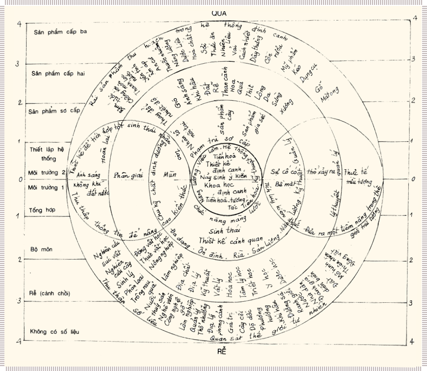

# Nông nghiệp bền vững (*Permaculture*)

Nông nghiệp bền vững là một hệ thống thiết kế để chọn môi trường bền vững cho sự sống của con người. Nông nghiệp bền vững liên quan đến nông nghiệp và cây trồng; cây trồng không thể tồn tại được nếu không dựa vào một nền nông nghiệp bền vững và đạo luật sử dụng đất đai. Một mặt, nông nghiệp bền vững liên quan đến cây trồng, vật nuôi, các công trình xây dựng và hạ tần cơ sở (nước, năng lượng, đường sá). Tuy vậy nông nghiệp bền vững không hẳn là những yếu tố đó, mà chính là mối liên quan giữa các yếu tố mà con người tạo ra qua xếp đặt phân bố chúng trong cảnh quan, trên mảnh đất.

Mục đích là xây dựng nên một hệ thống ổn định về mặt sinh thái, có tiềm lực về mặt kinh tế, có khả năng thoả mãn những nhu cầu của con người mà không bóc lột đất đai, ô nhiễm môi trường. Nông nghiệp bền vững sử dụng những đặc tính vốn có của cây trồng, vật nuôi kết hợp với đặt trưng của cảnh quan và cấu trúc, trên những diện tích đất sử dụng thấp.

Nông nghiệp bền vững dựa vào sự khảo sát các hệ thống tự nhiên, kinh nghiệm quí báu của các hệ thống canh tác truyền thống và kiến thức khoa học kỹ thuật hiện đại. Tuy dựa vào nền các mô hình sinh thái, nông nghiệp bền vững cũng tạo ra một hệ sinh thái canh tác kiến tạo nên để sản xuất ra nhiều lương thực hơn cho người và gia súc ở các hệ thống tự nhiên.

Fukuoka trong tác phẩm “Cuộc cách mạng với một cọng rơm”, có lẽ đã xác định rõ nét triết lý cơ bản của nông nghiệp bền vững. Tóm lại, đó là triết ly hoạt động với thiên nhiên mà không chống lại thiên nhiên; khảo sát suy nghĩ kỹ càng trước khi hành động chứ không hoạt động liều lĩnh bừa bãi; nắm được các chức năng của mỗi cây, mỗi con chứ không đối xử với chúng như là những nguyên tố của một hệ thống sản xuất đơn độc. Phương pháp tiếp cận kia dùng vũ lực, giáng vào thiên nhiên những đòn chí tử hoặc môi trường phải nộp sản lượng cao. Nhưng nếu chúng ta tấn công thiên nhiên, chính là chúng ta tự tấn công mình, và cuói cùng cũng sẽ tự huỷ diệt.

Tôi nghĩ rằng sống hoà hợp với thiên nhiên là điều có thể thực hiện được nếu con người từ bỏ ý thức tự coi mình là đứng trên thế giới tự nhiên. Levi-Strauss cho rằng sai lầm lớn nhất của loài người là tự cho mình là chúa tể của muôn loài, trị vì thiên nhiên. “Chúng ta không cao hơn các sinh vật khác; mọi sinh vật đều là biểu hiện của sự sống.” Nếu hiểu được chân lý đó chúng ta sẽ thấy rằng những hành động của con người đối xử với các dạng sinh vật chính là những hành động đối xử với bản thân con người. Một nền văn hoá thấm nhuần đạo đức đó không tiêu diệt bất cứ một sinh vật nào, nếu xét ra không tuyệt đối cần thiết.

Nông nghiệp bền vững là một hệ thống, nhờ đó, con người có thể tồn tại được, sử dụng nguồn lương thực và tài nguyên phong phú trong thiên nhiên mà không liên tục huỷ diệt sự sống trên trái đất. Các kỹ thuật bảo vệ và phục hồi trái đất đã được mọi người biết đến; nhưng điều hiển nhiên là không có quốc gia nào hoặc một cộng đồng lớn nào bắt tay vào việc phục hồi. Tuy vậy hàng triệu người dân thường đã bắt tay vào việc mà không có sự giúp đỡ của chính quyền.

Dù sống ở đâu, ta cũng phải bắt tay vào làm một việc gì. Ta có thể bắt đầu bằng giảm mức tiêu thụ năng lượng: thực ra chúng ta chỉ cần đến 40% mức năng lượng thường dùng mà không phải hy sinh một thứ gì cần thiết. Ta có thể xây cất sắp đặt lại nhà cửa để sử dụng năng lượng có hiệu quả hơn. Chúng ta có thể cắt bỏ xe riêng, dùng phương tiện giao thông công cộng, hoặc cùng bạn bè dùng chung một chiếc xe. Ta có thể hứng nước mưa ở mái nhà vào bể để dùng. Ta có thể dùng nước rác đổ vào hố xí, hoặc dùng để tưới rau trong vườn. Ta có thể tham gia sản xuất một phần lương thực dùng trong gia đình. Điều đó không có nghĩa là tất cả mọi người phải trồng cây khoai tây để ăn, những có nghĩa là chúng ta có thể trực tiếp mua khoai tây của người trồng khoai. Trong thực tế, chúng ta có thể tổ chức một nhóm người làm đại lý tiêu thụ khoai tây của người trồng khoai tây trong thôn xóm.

Trong nền nông nghiệp bền vững, hoặc trong các vùng canh tác bền vững, chính hệ thống sản xuất cung cấp năng lượng cần thiết. Nền sản xuất nông sản hàngh hoá hiện đại hoàn toàn phụ thuộc vào năng lượng nhập từ ngoài vào. Việc chuyển từ hệ thống sản xuất nông nghiệp bền vững sang một nền nông nghiệp hàng hoá, thương nghiệp, là chuyển một xã hội tiêu thụ ít năng lượng thành một xã hội tiêu thụ nhiều năng lượng, đất bị bóc lột và huỷ diệt, yêu cầu các nguồn năng lượng do thế giới thức ba cung cấp nhu nhiên liệu, phân bón, protein, lao động, kỹ năng. Nền nông nghiệp chính quy không nhận ra điều đó, và đã phải trả cái giá không tránh được: cây lương thực và cây hàng năm làm cạn độ phì của đất nông nghiệp, phải dùng các tài nguyên không tái sinh để tạo ra sản lượng, đất bị bào mòn do chăn thả quá mức và mở rộng diện tích cày bừa, đất và nước bị ô nhiễm hoá chất. Khi nhu cầu không được thoả mãn trong nội bộ hệ thống, ta phải trả giá năng lượng tiêu thụ và giá ô nhiễm môi trường. Chúng ta không thể tiếp tục trả cái thực giá của nền nông nghiệp hiện đại của chúng ta. Điều đó sẽ huỷ diệt thế giới và bản thân chúng ta.

Ngồi ở ngưỡng cửa sau nhà, mọi thứ chúng ta cần để sống một cuộc sống yên lành đều bày ra trước mắt chúng ta. Ánh sáng mặt trời, gió mát, dân làng, nhà cửa, sỏi đá, chim muông và cây cối quanh chúng ta. Hợp tác với những thức đó sẽ đem lại sự hoà hợp; đối đầu với chúng sẽ đem lại tai hoạ và hỗn loạn.

## Đạo đức Nông nghiệp bền vững

Đạo đức là đức tin và hành động đối với sự tồn tại của hành tinh chúng ta. Đạo đức nông nghiệp bền vững gồm 3 phạm trù: chăm sóc trái đất, chăm sóc con người và dành thời gian, tài lực, vật lực vào các mục tiêu đó.

Chăm sóc trái đất là chăm lo đến tất cả các sinh vật và phi sinh vật: đất, các loài và các giống, khí quyền, rừng, các tiểu môi sinh, súc vật và nước. Chăm sóc trái đất bao hàm các hoạt động phục hồi không gây hại, bảo vệ tích cực, tiết kiệm và khiêm nhượng trong việc sử dụng tài nguyên, và một “cuộg sống đúng mực”.

Chăm sóc trái đất bao hàm cả chăm sóc con người để thoả mãn những nhu cầu cơ bản về lương thực, nhà ở, học hành, công văn việc làm thoả đáng, và quan hệ chung sống tốt lành. Chăm sóc con người là việc quan trọng, vì mặc dù con người chỉ chiếm một bộ phận nhỏ trong các loài sinh vật nhưng con người có một tác động quyết định đến sự sống trên trái đất. Nếu những nhu cầu cơ bản nhất của con người được đáp ứng, thì chúng ta không cần tiến hành những biện pháp huỷ diệt trái đất trên quy mô lớn.

Hợp phần thứ ba của đạo đức cơ bản là dành thời gian, tiền của, năng lượng dư thừa vào mục đích chăm sóc con người. Điều đó có nghĩa là: sau khi đã đáp ứng những nhu cầu của bản thân và thiết lập cho mình một hệ thống hợp với khả năng và điều kiện cả mình, chúng ta phát huy ảnh hưởng, giúp đỡ người khác đạt những mục tiêu đó. Hệ thống nông nghiệp bền vững “đạo đức cơ bản đối với sự sống” công nhận giá trị nội tại của mọi sinh vật. Một cái cây tự nó có một giá trị mặc dù nó có thẻ không có giá trị kinh tế đối với chúng ta. Cây là một cơ thể sống, vận hành một chức năng, đó là điều quan trọng. Nó làm một phần việc trong thiên nhiên: tái sản xuất ra sinh khối, cũng cấp oxi và cacbon điôxit (CO~2~) trong vùng, là nơi cư trú cho động vật nhỏ hình thành nên đất, v.v.

Như vậy, ta thấy đạo đức nông nghiệp bền vững bao trùm mọi khía cạnh của môi trường, cộng đồng dân cư, và mọi hệ thống kinh tế. Hợp tác, không cạnh tranh, đó là chìa khoá.

Trong đời sống chúng ta, phương pháp thực thi đạo đức chăm sóc trái đất là như sau:

- Suy nghĩ về hậu quả lâu dài của hành động của mình. Xây dựng kế hoạch đảm bảo sự bền vững.

- Nên dùng những loài gốc địa phương, hoặc những loài nhập nội đã thuần hoá xét ra có lợi. Sự di thực những loài có tiềm lực xâm lấn có thể làm đảo lộn sự cân bằng tự nhiên ở địa phương.

- Tìm điều kiện canh tác trên một diện tích nhỏ nhất. Xây dựng kế hoạch quy mô nhỏ, hiệu quả năng lượng cao, thâm canh, không xây dựng những kế hoạch quy mô lớn, quảng canh, tiêu tốt năng lượng.

- Áp dụng một hệ thống canh tác phong phú đa canh (chống lại độc canh). Hệ thống này tạo ra thế ổn định và giúp ta dễ dàng chuyển hướng trước những biến động về môi trường và xã hội.

- Tăng tổng thu hoạch, tính tổng thu hoạch của cả hệ thống do cây lâu năm, cây hàng năm, cây thu hái quả, và súc vật cung cấp. Năng lượng tiết kiệm được cũng tính vào sản lượng.

- Sử dụng những hệ thống môi trường năng lượng thấp, như năng lượng mặt trời, gió, nước và các hệ thống sinh học như cây cối và súc vật, để bảo vệ và phát sinh ra năng lượng.

- Đưa công việc sản xuất nông nghiệp trở lại tỉnh thành và đô thị, là những nơi trước đây đã có truyền thống tự túc.

- Giúp đỡ những người muốn tự túc lương thực và thúc đẩy trách nhiệm của cộng đồng.

- Trồng rừng và phục hồi lại độ phì của đất.

- Sử dụng mọi sản vật tới mức tối ưu, và tái chu kỳ mọi chất phế thải.

- Tìm biện pháp giải quyết, không đứng lại trước khó khăn.

- Hoạt động bất cứ ở đâu có lợi (trồng một cây ở nơi nó có thể sống được, giúp đỡ người muốn học hỏi).

???+ note "Cây định canh"

    Luồng kiến thức chuyển vào sản xuất. Như một cây xanh, định canh là một tổng thể tập hợp các bộ môn khoa học kỹ thuất tạo ra sản phẩm và năng suất. Ai có thể khẳng định được rằng ý đồ của con người hay tiềm lực của môi trường đã khởi động hệ thống đó? Cái đó không thành vấn đề. Có vô vàn con đường và tiềm năng dẫn đến kết quả. Mọi việc đều liên hệ với nhau.