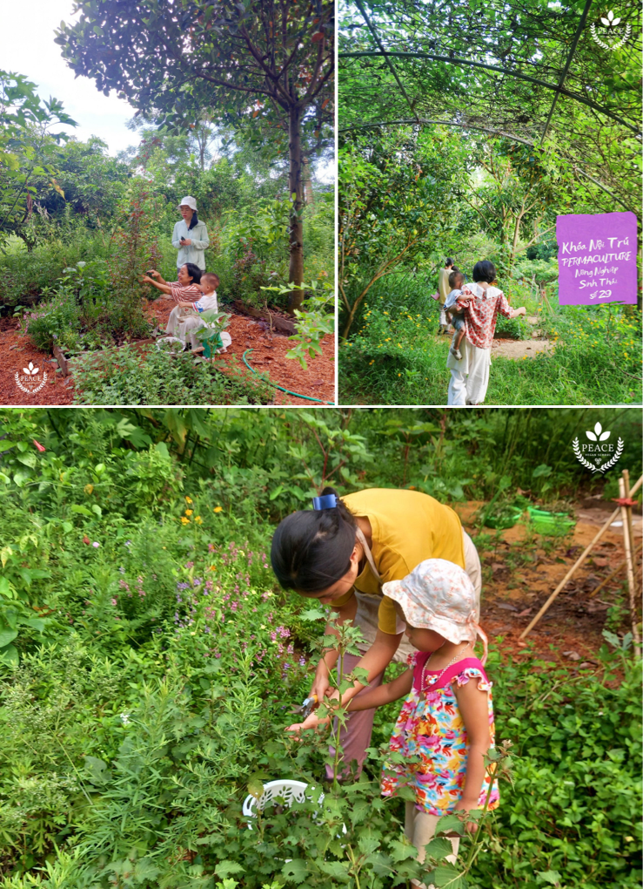
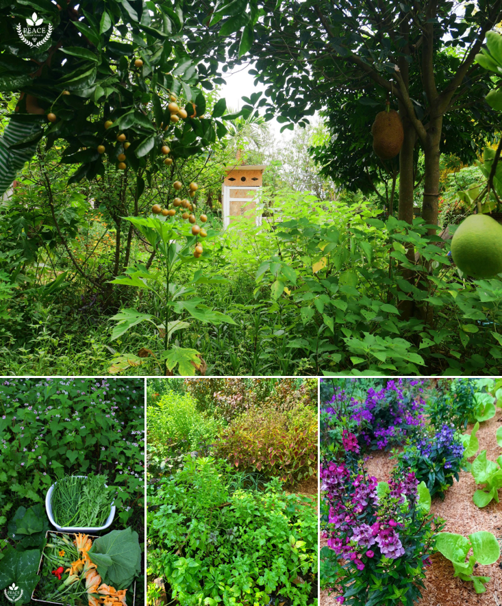
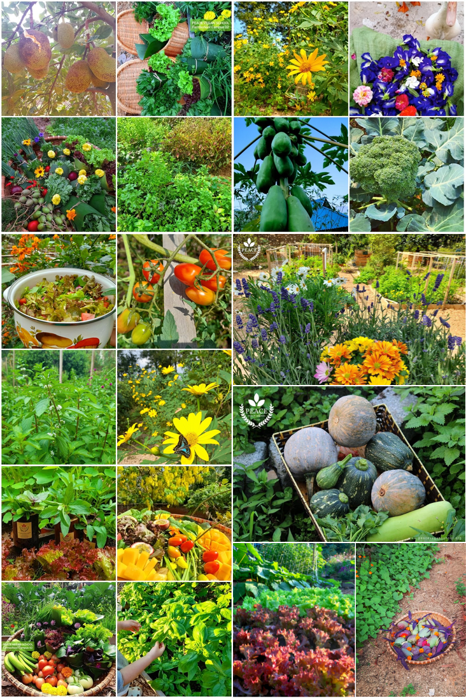
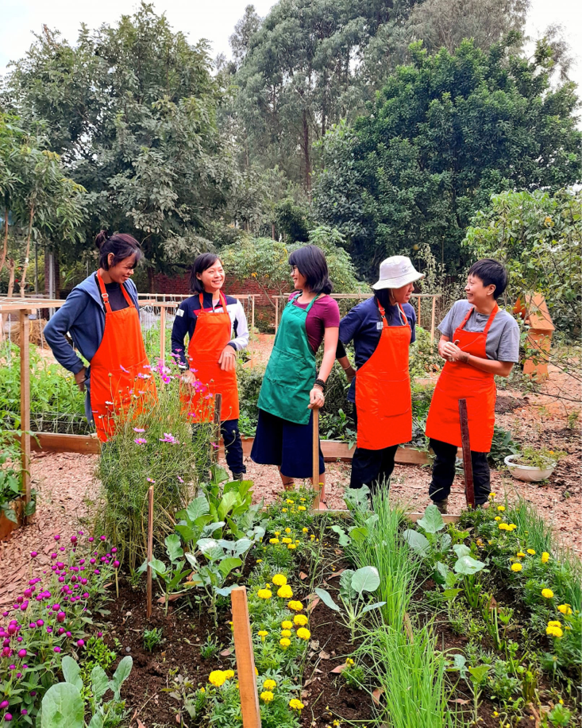
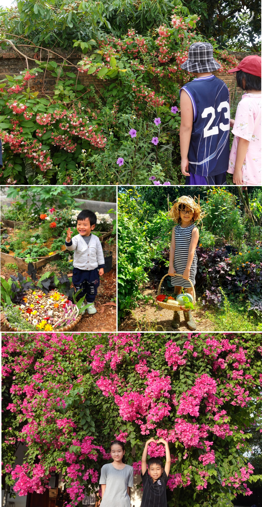
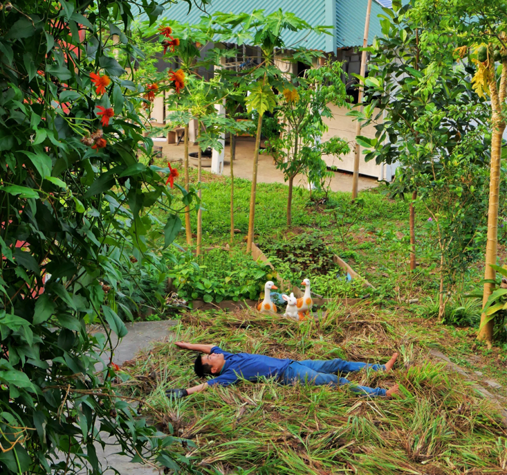
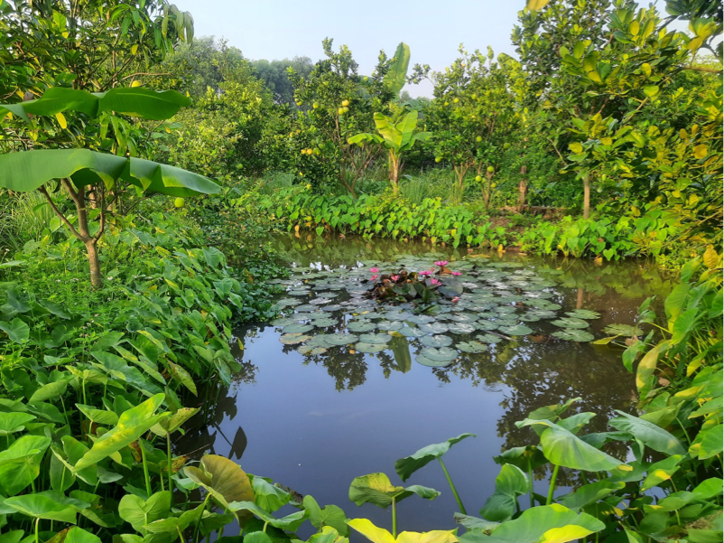
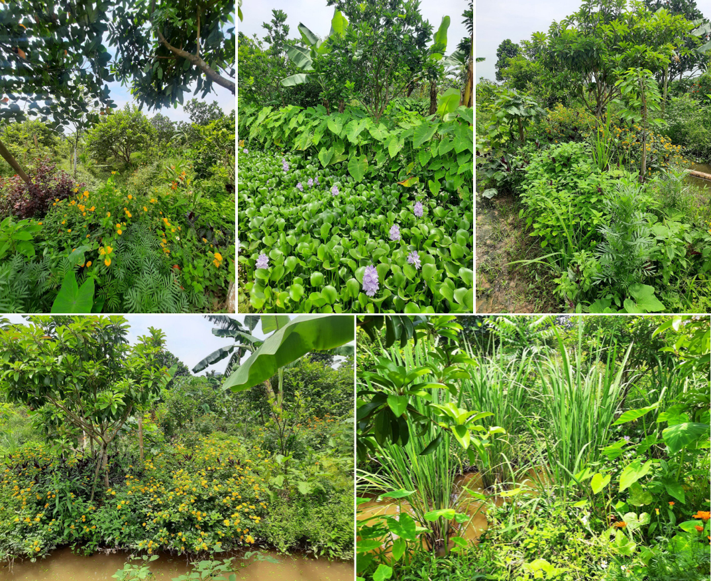
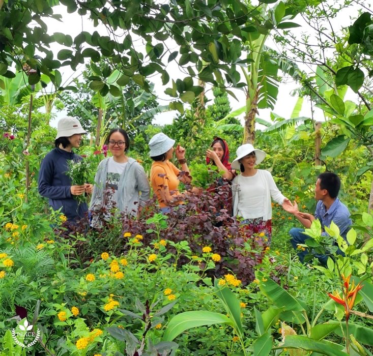
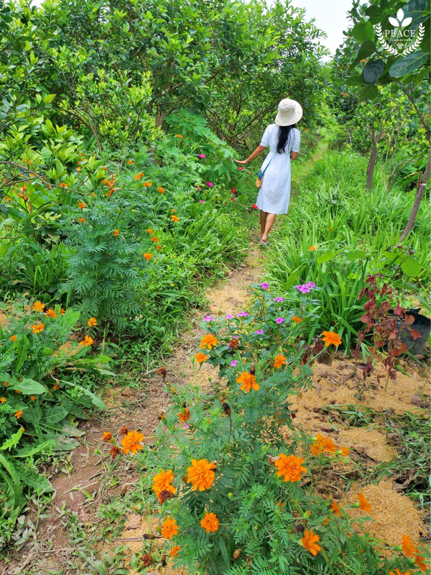

# Thực hành & Giảng dạy Nông nghiệp trường tồn

## Nông trại Trường Peace

Từ năm 2018, **Trường Peace** (*Peace Vegan School*) là cơ sở trường học nông trại kết hợp giảng dạy, trồng vườn rừng sinh thái, nông nghiệp trường tồn cũng như hướng dẫn áp dụng dinh dưỡng thuần thực vật vào đời sống&mdash;giúp góp phần bảo vệ muôn loài, nâng cao ý thức bảo vệ thiên nhiên, tạo ra môi trường trong đó con người có thể kết nối và chung sống hài hòa với thiên nhiên.

Với việc trồng xen đa dạng các loài cây bản địa, chọn lọc những giống cây phù hợp với thổ nhưỡng tự nhiên, áp dụng phương pháp không cày xới, không dùng phân bón thuốc trừ sâu, tích cực che phủ đất, dùng phân rác hữu cơ, từ một mảnh đất đồi khô cằn ở Bắc Giang đến cỏ cũng không mọc được với dư lượng phân bón đáng kể, sau ba năm cây trái đã cho quả trở lại và vườn rau đã cỏ đã cung cấp rau trái, củ quả và gia vị cũng như nguyên liệu hữu cơ cho các sản phẩm nông trại từ thực phẩm đến dược liệu tại **Trường Peace**

Trường Peace đã tổ chức nhiều khoá học thực hành Nông nghiệp bền vững vận dụng kiến thức sinh học tổng hợp và trải nghiệm thực tế trong nông trại.

!!! note ""

    Một khoá học về Nông nghiệp sinh thái thực hành tại nông trại: trồng cây xen canh, cách trồng kết hợp để tạo dinh dưỡng và hương vị thơm ngon hơn.

Nơi đây cũng đã có nhiều hoạt động ngoại khoá dành cho phụ huynh và trẻ em cùng học hỏi tìm hiểu và hoà mình vào với thiên nhiên, kết nối lại với thiên nhiên và tìm cách thực hành một lối sống canh gần gũi với tự nhiên, tạo ra thực phẩm sạch, lan toả lối sống bền vững đến cộng đồng.

Ngoài ra, trong suốt thời gian đại dịch COVID-19, **trường Peace** đã kiến tạo một không gian nông trại ở Hà Giang, mang lại những trải nghiệm sống đơn giản và hướng đi mới cho giới trẻ.

!!! note ""

    Nông trại trường Peace ở Hà Giang

[Thông tin thêm](https://www.facebook.com/vegan.for.nature)

## Nông trại Vườn của Mẹ (Mother's Farm)

Anh Hoàng, học viên và cộng sự lâu năm của trường Peace, kể về sự hình thành của Mother's Farm bắt đầu bởi những trăn trở về nên nông nghiệp Việt Nam. Dù được thiên nhiên ưu đãi rất nhiều điều kiện về tài nguyên, khí hậu, thổ nhưỡng thuận lợi cho việc phát triển nông nghiệp, nhưng hiện nay phần lớn những người nông dân lại đi tàn phá đất đai, môi trường hệ sinh thái và sức khoẻ của chính mình, người tiêu dùng bằng các loại hoá chất độc hại trong quá trình canh tác nông nghiệp. Rồi điệp khúc được mùa mất giá lặp đi lặp lại rất nhiều mà chưa có một cơ quan đơn vị nào đứng ra cùng tìm hiểu vấn đề gốc rễ là gì và tìm ra giải pháp giúp bà con nông dân thay đổi. Tháng 11/2018, Nông trại Mother's Farm được hình thành với mô hình nông nghiệp vườn rừng, ứng dụng các phương pháp của cha ông ta đã áp dụng từ ngày xưa để thể giải quyết các vấn đề nông nghiệp hiện đại như ô nhiễm môi trường, bảo vệ sức khoẻ của người tiêu dùng và sản xuất, giúp cân bằng lại hệ sinh thái và có thực phẩm tự cung tự cấp; ngoài ra được chế biến làm gia tăng gia tăng giá trị nông sản, đưa trực tiếp nông sản từ vườn, bếp ăn tới tận tay người tiêu dùng. 

Để giải quyết các vấn đề gặp phải trong lĩnh vực nông nghiệp hiện nay, các giải pháp sau đã được nông trại thực hiện:

1. Thay đổi phương thức canh tác nông nghiệp
2. Nghiên cứu, sáng tạo nâng cao giá trị nông sản.
3. Chế biến, sử dụng công nghệ đưa nông sản từ vườn tới người tiêu dùng (*Farm to table*).

Sau khoảng 3 năm, mô hình vườn rừng đã phát triển rất tốt, cây cối xanh tươi, khoẻ mạnh, môi trường sinh thái cân bằng trở lại. [Thông tin thêm](https://www.facebook.com/profile.php?id=100063696904798) và [website](https://sites.google.com/view/farmtotable-vn/)

!!! quote "Anh Tất Hoàng, nông trại Mother's Farm, Hưng Yên"

    “Một điều mà chính bố mẹ tôi đã phải thốt lên rằng không thể tin được năng suất, chất lượng nông sản, sự phát triển của cây cối tốt hơn nhiều so với cách làm cũ”

