# Mô hình thực tế áp dụng Nông nghiệp trường tồn

Nông nghiệp trường tồn có thể được áp dụng ở nhiều quy mô và bối cảnh khác nhau. Tài liệu này sẽ giới thiệu những mô hình phổ biến ở các nước thế giới và ở Việt Nam.

## Nông nghiệp trường tồn trong đô thị

Có rất nhiều những ví dụ của hệ thống nông nghiệp trường tồn ở quy mô đô thị đang lan rộng trên khắp thế giới. Trên ban công, sân thượng, vườn nhỏ và các không gian bỏ hoang, chúng ta có thể thấy những hệ thống được nuôi trồng triệt để và đạt năng suất cao. Thiết kế nông nghiệp trường tồn ở đô thị được sắp xếp rất chặt chẽ, tận dụng tối đa không gian hạn chế bằng những thiết kế phức tạp như sử dụng dòng nước mưa và nước thải, sản xuất thức ăn, ủ phân, tận dụng ánh mặt trời, môi trường cho các loài thụ phấn, là nơi sinh hoạt cộng đồng, và chính chất thải đô thị có thể là nguồn cung cấp những nguyên liệu giá rẻ hoặc miễn phí để xây dựng đất và kết cấu đất.

### Vườn nhà 

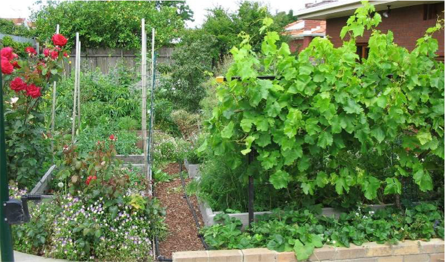

!!! quote ""

    Một khu vườn nông nghiệp trường tồn đô thị tại Melbourne, Úc @Deep Green Permaculture, 2009

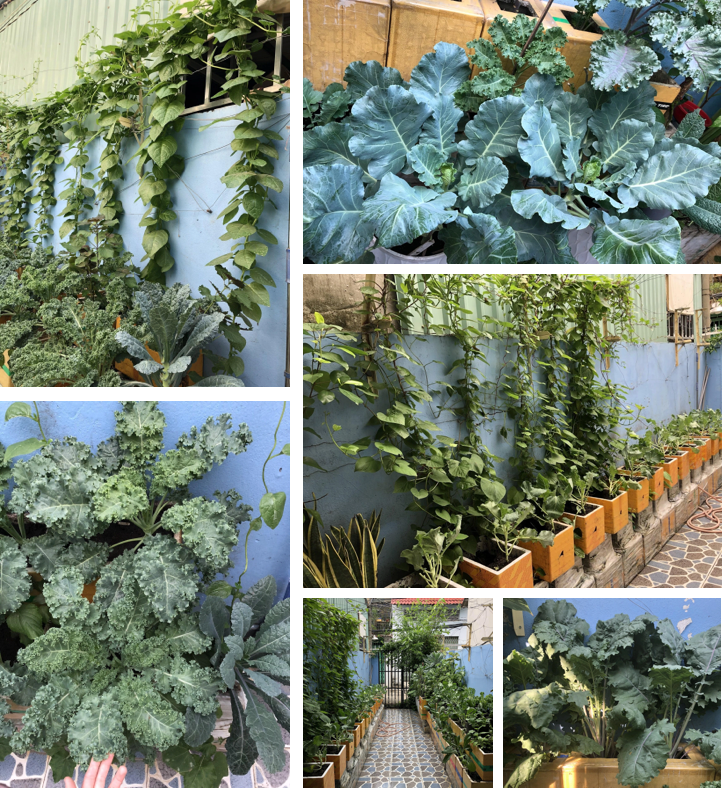

!!! note "Vườn rau xanh 4m^2^ của người phụ nữ ở Sài Gòn"

    [Khu vườn tại gia](https://dantri.com.vn/xa-hoi/cach-bien-4m2-thanh-vuon-rau-xanh-boi-thu-cua-nguoi-phu-nu-o-sai-gon-20210801074008276.htm) được chị Nguyễn Bội Như Ý thực hiện từ cuối năm 2019, ngay sau khi sinh con đầu lòng vài tháng. "Xuất phát từ nỗi lo của một người mẹ về nguồn rau sạch để nấu đồ ăn dặm cho con nên mình quyết tâm thực hiện vườn rau tại nhà"

<video id='farm-attic' src="http://cdn.baobacgiang.com.vn/video/2022/01/17/08/20220117084630-ong-bo-ha-noi-chi-200-trieu-dong-mang-10-tan-dat-lam-vuon-san-thuong-bao-dan-tri.mp4" width="640" height="480" controls>
</video>

!!! quote "Vườn sân thượng ở Hà Nội"

    Cách đây hơn chục năm, trào lưu trồng rau sân thượng chưa mấy nở rộ. Tuy nhiên, thời điểm ấy, do nhận thấy tình trạng lạm dụng thuốc kích thích tăng trưởng, thuốc trừ sâu để chăm bón rau quả ngày càng phức tạp, anh Nguyễn Đức Khải (Cổ Nhuế, Bắc Từ Liêm, Hà Nội) đã quyết định thiết kế [một vườn rau cho gia đình mình](http://baobacgiang.com.vn/bg/doi-song/375364/ong-bo-ha-noi-chi-200-trieu-dong-mang-10-tan-dat-lam-vuon-san-thuong.html).

    Từ ngày tự tay xới từng luống đất, đặt từng hạt giống, anh Khải cảm thấy mình được truyền thêm nhiều năng lượng tích cực, thay đổi lối sống lành mạnh hơn.

    Sống ở phố thị chật chội nên khu vườn còn là nơi hóng gió, thư giãn của vợ chồng anh Khải cùng các con. Đây cũng là nơi cho học sinh trong trường học của vợ anh trải nghiệm. Lượng rau trái thu về mỗi ngày khá nhiều. Anh Khải thường dành một ít để ăn, phần còn lại anh chủ yếu cho bếp ăn trường học của gia đình.

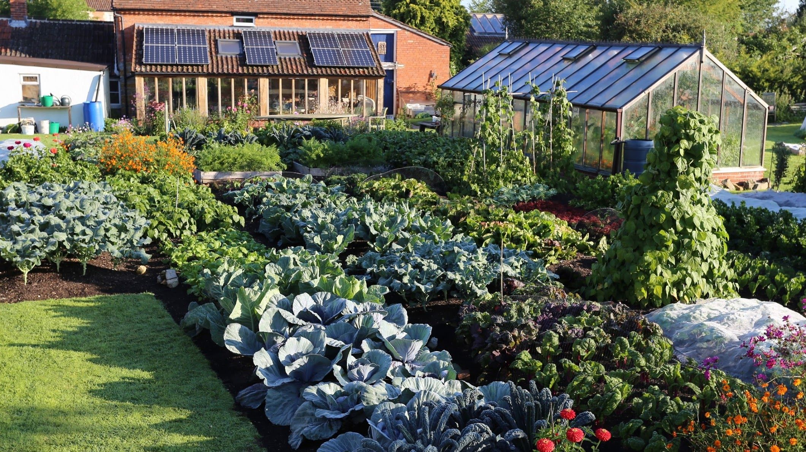

!!! quote "Vườn nhà của bác Charles Dowding ở Anh"

    Khu vườn theo nguyên tắc **không cày xới** (*no dig*)

### Vườn cộng đồng&mdash;Vườn Nông nghiệp trường tồn trên mái ở Garden Village

Garden Village là chung cư 77 căn dành cho sinh viên tại Berkeley, California được hoàn thành vào tháng 8 năm 2016. Trong khu phức hợp này, 18 khối nhà riêng biệt được trải ra trong một khu vườn và được liên kết bởi các lối đi bên ngoài trong một thiết kế liền mạch tích hợp vào khu vực xung quanh của cộng đồng. Cây cối được trồng trên sân thượng cần phải chịu được điều kiện đặc biệt khi trồng trên mái tòa nhà, tuy nhiên các yếu tố vô sinh như phơi nhiễm với nắng và gió có thể được giảm thiểu bằng nhiều cách. Hàng rào cây bản địa dọc theo viền các luống trồng không chỉ cung cấp nơi trú ẩn tránh gió mà còn là không gian sống tuyệt vời cho các loài thụ phấn địa phương. Vườn trên mái có nhiều khu tiểu khí hậu có thể đáp ứng nhu cầu của nhiều loại cây trồng. 18 loại cây khác nhau, bao gồm cây xô thơm, xà lách, rau diếp và củ cải được trồng và thường xuyên cho thu hoạch liên tục trong thời gian dài (Roth, 2018).

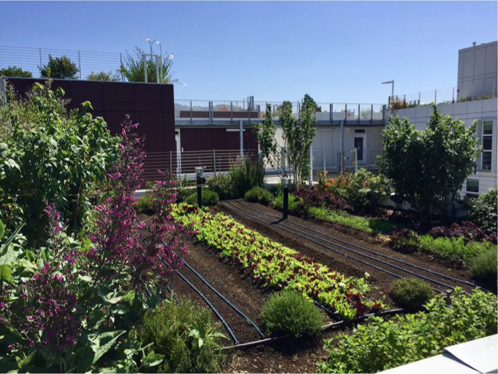

!!! quote ""

    Vườn trên mái ở Garden Village @Top Leaf Farms

### Vườn nông nghiệp trường tồn ở trường đại học&mdash;Umass Permaculture

Là hệ thống vườn trong khuôn viên trường, UMass Permaculture đóng vai trò là công cụ thực hành thực tế cho sinh viên để học về hệ thống thực phẩm địa phương an toàn và tốt cho sức khỏe. Vườn là nơi diễn ra các chương trình tập huấn lãnh đạo và giáo dục thực tế tạo động lực, kết nối cộng đồng, và cung cấp trực tiếp sản phẩm tươi hữu cơ tại địa phương cho ký túc xá UMass. Được thành lập năm 2010, sáng kiến này đã xây dựng và duy trì nhiều vườn cộng đồng năng suất cao ngay trong trường. Những khu vườn đều được thiết kế theo nguyên lý nông nghiệp trường tồn và được xây dựng bởi sinh viên, cán bộ và tình nguyện viên. UMass Permaculture đã trở thành một mô hình quốc tế tạo cảm hứng cho nhiều dự án nông nghiệp trường tồn trong trường học trên khắp thế giới. [Thông tin thêm](https://www.localumass.com/Permaculture.html)

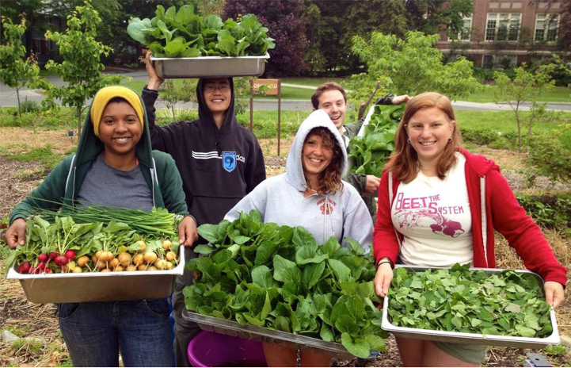

!!! quote ""

    Sinh viên thu hoạch rau củ tại vườn trường UMass @UMass, 2019

### Vườn nông nghiệp trường tồn ở ngoại ô

Khi chúng ta để ý, khắp nơi trên thế giới có thể thấy ngày càng nhiều những ví dụ về vùng ngoại ô được phủ xanh bởi những hệ thống nông nghiệp trường tồn hiệu suất cao. Mật độ dân cư thấp ở những vùng này đồng nghĩa với việc có rất nhiều không gian để thiết lập những khu vườn rộng hơn với động vật, cây lớn và phát triển sinh kế dựa vào đất đai.
  
‘Plummery’ là một hệ thống nông nghiệp trường tồn ở ngoại ô thành phố Melbourne, Úc trên diện tích 1/14 mẫu (280m^2^). Vào năm 2018, khu vườn đã sản xuất được 428kg rau củ, rau gia vị, hoa quả và trứng chỉ với bốn giờ làm việc mỗi tuần. Khu vực này gồm có một vườn rau xanh và rau gia vị, một vườn rừng ăn trái, khu nuôi chim cút, xưởng làm gốm nhỏ, một ngôi nhà nhỏ với bếp củi đốt chậm, nhà vệ sinh ủ phân, nhà kho chứa đồ ăn và rất nhiều điểm nhấn nhỏ để tạo sự thoải mái và tăng tính bền vững (Lavers, 2019). [Thông tin thêm](https://www.katlavers.com/the-plummery/)

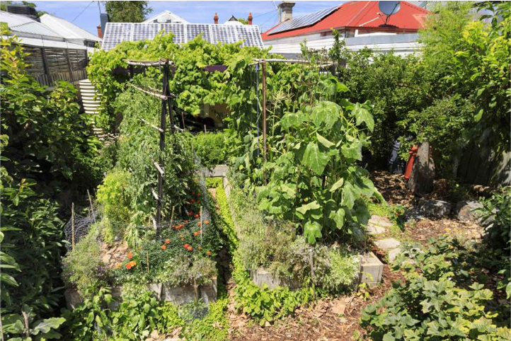

!!! quote ""

    Vườn nông nghiệp trường tồn đô thị Plummery @Kat Lover, 2018

### Vườn rừng ăn trái Beacon

Vườn rừng ăn trái Beacon thành lập từ năm 2009 như là một dự án kết thúc cho một khóa học thiết kế nông nghiệp trường tồn. Khu đất được chọn là một khu vực vốn chỉ toàn cỏ dại nằm ở sườn phía Tây của nơi mà mọi người nghĩ là công viên Jefferson nhưng thực ra được sở hữu bởi Trung tâm tiện ích công cộng Seattle. Thiết kế này đã được trình bày lên cho cộng đồng dân cư của khu Beacon Hill, Phòng quản lý cảnh quan và công viên Seattle cùng với Trung tâm tiện ích công cộng Seattle để tìm kiếm sự đồng thuận và hỗ trợ cho dự án. Sự hỗ trợ đến dưới dạng quỹ 22.000 Đô la Mỹ từ Phòng quản lý dân cư Seattle vào tháng 12 năm 2010 để thuê một chuyên gia tư vấn thiết kế và tạo nên một sơ đồ cho vườn rừng ăn trái.

Mục tiêu của vườn rừng ăn trái Beacon là thiết kế và trồng một khu vườn rừng đô thị với những loại cây ăn được và có thể tạo cảm hứng cho cộng đồng để đến gần nhau hơn, cùng trồng thực phẩm cho mình và phục hồi hệ sinh thái địa phương. [Thông tin thêm](https://www.beaconfoodforest.org)

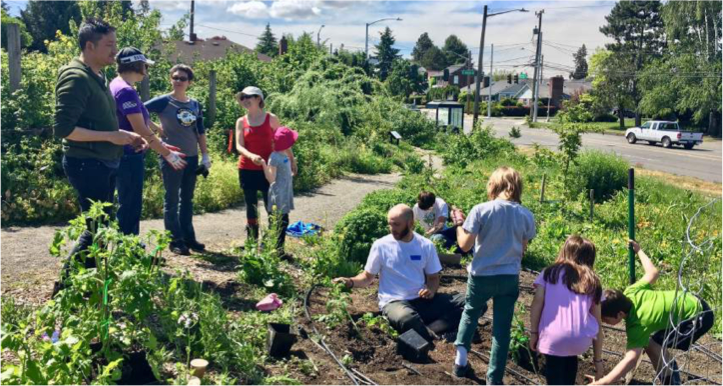

!!! quote ""

    Cộng đồng cùng làm vườn tại Beacon Hill @Beacon Food Forest, 2019

## Nông trại

Nông trại nông nghiệp trường tồn là những hệ thống nông nghiệp đa dạng được thiết kế với nhiều bên liên quan cùng làm việc với nhau để tạo nên môi trường kinh doanh có lợi và tốt cho cảnh quan. Kết cấu thiết kế của một nông trại kiểu này được ảnh hưởng bởi các yếu tố địa hình, để tối đa hóa sản xuất và tối thiểu hóa công sức khi phục hồi đất, làm lợi cho vòng tuần hoàn nước và cung cấp sản lượng dồi dào cũng như sự tự chủ về lâu dài cho nông dân. 

Nông trại nông nghiệp trường tồn nhìn sẽ khác hẳn so với nông trại truyền thống bởi ở đây người ta làm việc theo các khuôn mẫu của tự nhiên và tích hợp động vật, cây cối, dự trữ nước, tái tạo năng lượng và con người trong một hệ thống hiệu quả và hài hòa. Có rất nhiều nơi vừa là nông trại vừa là trung tâm giáo dục, nơi giao lưu cộng đồng hoặc nơi tổ chức các hoạt động nghỉ ngơi khám phá. Những khu vực thực hành nông nghiệp trường tồn thường tập trung vào việc đưa con người kết nối lại với hệ thống xung quanh để được học hỏi và tạo cảm hứng. Những khu vực này thường rất phong phú và đa dạng vì chúng được thiết kế để mọi người có thể tương tác và học hỏi. Nhiều nơi cung cấp các khóa học thiết kế nông nghiệp trường tồn (Permaculture Design Courses&mdash;PDC), bạn có thể thử tham gia các khóa học này khi có cơ hội. (Millison, 2016).

### Nông trại Zaytuna

Zaytuna Farm là một nông trại, nông trại đa chức năng, rất tích cực thực hành nông nghiệp trường tồn. Đây là nơi đã thành công trong việc áp dụng rất nhiều các nguyên lý của nông nghiệp trường tồn và sản xuất được nhiều loại thực phẩm với năng suất cao trong chính không gian sống của họ. Zaytuna là nông trại theo kiểu gia đình, được đặt trên một diện tích 66 mẫu (27 hec-ta) ở Terania Creek, đối diện làng Channon, nằm phía bắc New South Wales, Úc. Khu vực này có 800m lạch ở phía mặt tiền, nhiều hồ bơi và đời sống động thực vật hoang dã phong phú. Cảnh quan ở đây đa dạng, từ thung lũng trên cao, sườn đồi và đỉnh đồi trong đó có cả những bãi cỏ lớn và rừng. Nông trại này được phát triển liên tục và luôn thay đổi theo những thử nghiệm của vườn, công việc ở đây liên tục được làm mới để trở nên hiệu quả và năng suất hơn. Vườn Zaytuna chính là địa điểm cung cấp nhiều các khóa thiết kế nông nghiệp trường tồn ở Úc. [Thông tin thêm](https://zaytunafarm.com)

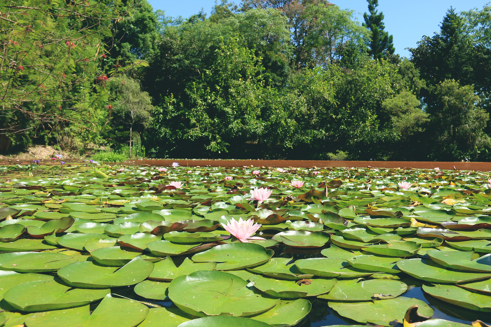

!!! quote "" 
    Học và thực hành tại vườn Zaytuna @Zaytuna Farm

### Nông trại Bec Hellouin

Trang trại Bec Hellouin được Perrine và Charles HERVE-GRUYER thành lập vào năm 2006.

Perrine và Charles điều hành **khu vườn-chợ nông sản** (*garden market*) này ở Normandy&mdash;Pháp, nhưng không phải khu vườn-chợ nông sản thông thường: họ bắt đầu dự án của mình với mục đích khám phá các phương pháp trồng trọt thực phẩm thân thiện với môi trường, mặc dù cả hai đều chưa có kinh nghiệm trồng trọt trước đó.

Không bị ảnh hưởng bởi kiến thức về các phương pháp thực hành thông thường của phương Tây, họ đã áp dụng các nguyên tắc nông nghiệp trường tồn dựa trên các nguồn đa dạng như thực tiễn của Người làm vườn ở chợ Paris thế kỷ 19, người dân bộ lạc Amazon và các thực hành liên quan đến Efficient Micro-Organisms (Vi sinh vật hiệu quả) của Châu Á.

Niềm tin vào các nguyên tắc đã giúp họ vượt qua những khó khăn không thể tránh khỏi của một dự án mới và đầy tham vọng, đồng thời vừa học hỏi vừa gặp phải nhiều vấn đề!

Trong 12 năm qua, họ đã thử nghiệm và phát triển các phương pháp cải tiến có vẻ đặc biệt hiệu quả. Quan tâm đến hiệu quả hoạt động của một trang trại nhỏ như vậy, INRA (Viện Nghiên cứu Nông nghiệp Quốc gia Pháp) và AgroParisTech (Viện Khoa học và Kỹ thuật lớn của Pháp) đã thực hiện từ năm 2011 đến năm 2015 một chương trình nghiên cứu có tựa đề “Trồng trọt hữu cơ trong nuôi trồng thủy sản và hiệu quả kinh tế” nhằm mục đích ghi lại và báo cáo các phương pháp và sản lượng tại trang trại này. Nghiên cứu này kết luận rằng canh tác quy mô nhỏ được thực hiện hoàn toàn bằng tay có hiệu quả và năng suất cao.

Trang trại cũng đã thu hút sự chú ý của các tổ chức khác, bao gồm cả các cơ quan châu Âu chịu trách nhiệm hoạch định chiến lược an ninh lương thực và nó đã thu hút sự quan tâm đáng kể đến Nông nghiệp trường tồn ở Pháp. Chúng tôi tiếp tục tổ chức các chương trình nghiên cứu liên quan đến đa dạng sinh học, thu hồi carbon và hệ thống vườn rừng.

Không chỉ sản lượng lương thực cực kỳ cao mà các khu vườn còn là nơi trú ẩn của đa dạng sinh học và là nơi có niềm vui và vẻ đẹp thực sự để sống và làm việc. Cuộc khám phá của chúng tôi đã dẫn đến một điều vô cùng quan trọng đối với nhân loại&mdash;nền nông nghiệp không chỉ bền vững mà còn có khả năng phục hồi. [Thông tin thêm](https://www.fermedubec.com/english/)

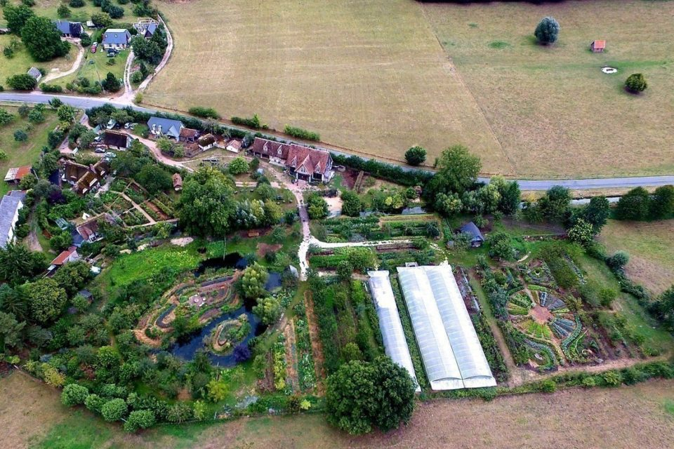

!!! quote "" 
    Toàn cảnh nông trại Bec Hellouin nhìn từ trên cao

## Làng sinh thái
Đôi khi những cộng đồng hoặc một ngôi làng thực hành nông nghiệp trường tồn còn được gọi là “ecovillage – làng sinh thái”. Có rất nhiều những ví dụ thú vị khắp nơi trên thế giới về việc thiết kế nông nghiệp trường tồn được áp dụng cho những cộng đồng này như thế nào, cũng như làm sao chuyển hóa những cộng đồng đang có với văn hóa truyền thống trên nền các quy hoạch định cư hiện tại. Thiết kế làng sinh thái là một lĩnh vực rộng và sâu, nơi mà các yếu tố như thức ăn, nước uống, năng lượng, nguyên liệu, sinh thái, nhà ở và lâm nghiệp được đan xen vào với kết cấu thể chế của cộng đồng, kinh tế, quy hoạch đô thị cùng với tất cả những thách thức và cơ hội của việc chia sẻ tài nguyên (Millison, 2016).

### Làng sinh thái Nông nghiệp trường tồn Crystal Waters

Nhận được giải thưởng Môi trường sống của UN năm 1996 cho những nỗ lực đi đầu trong việc thực thành lối sống mới bền vững và ít tác động, Crystal Waters được toàn cầu biết đến với hệ thống nông nghiệp trường tồn và các chương trình giáo dục của họ. Là một khu vực nông thôn có tiềm lực kinh tế và trách nhiệm xã hội cũng như môi trường cao, Crystal Waters được thiết kế bởi Max Lindegger, Robert Tap, Barry Goodman và Geoff Young vào năm 1987 ở phía bắc Brisbane (Úc). Hiện tại, làng sinh thái Crystal Waters đã trở thành một cộng đồng với 250 thành viên đủ mọi độ tuổi, với nhiều hình thức kinh doanh và sản xuất thực phẩm khác nhau trên cả đất cộng đồng và các khu vực sở hữu cá nhân. [Thông tin thêm](https://crystalwaters.org.au/)

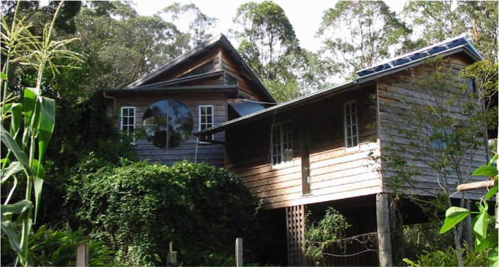

!!! quote "" 
    Một ngôi nhà sinh thái ở làng Crystal Waters, 2019

## Các mô hình tại Việt Nam

Mặc dù Nông nghiệp trường tồn còn khá non trẻ ở Việt Nam, đã có một số dự án, tổ chức và nông trại áp dụng mô hình này.

### HEPA&mdash;Hà Tĩnh

HEPA&mdash;Trường học nông dân sinh thái&mdash;được xây dựng từ năm 2002 theo Quyết định số 1230/QĐ-UB cấp giấy chứng nhận quyền sử dụng đất 50 năm với mục đích để bảo vệ rừng tự nhiên, phục hồi rừng ở những nơi đã bị can thiệp, đồng thời tạo ra một không gian nghiên cứu, học hỏi và thực hành phương thức canh tác sinh thái trong sự hài hòa giữa con người và thiên nhiên cho các bạn trẻ là con em các dân tộc thiểu số vùng Mekong. Hiện nay, việc phục hồi rừng đã cơ bản được hoàn thành, đặc biệt các mô hình thực hành mà các em đã xây dựng hiện đã trở thành những vườn sinh thái có giá trị sinh kế và được duy trì bền vững. Triết lý hoạt động của HEPA là Phụng dưỡng Thiên nhiên, thể hiện sự biết ơn tự nhiên qua việc thiết kế hệ thống nông nghiệp và quy hoạch sử dụng đất nương tựa vào các đặc tính cốt lõi của tự nhiên. [Thông tin thêm](https://www.facebook.com/hepaecofarm/) hoặc [website](http://ecofarmingschool.org/)

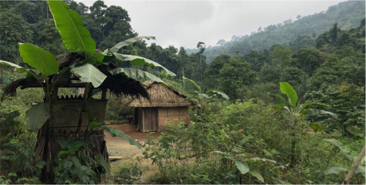

!!! quote "" 

    Cảnh sắc yên bình tại trung tâm giáo dục HEPA 

### Nông trại Dốc Mơ&mdash;Đồng Nai

Trang trại Dốc Mơ làm nông theo phương pháp thuận tự nhiên, thực nghiệm mô hình nuôi trồng kết hợp, từng bước tái lập cân bằng sinh thái đa loài cả động và thực vật. Với diện tích canh tác 10ha, Dốc Mơ đặt mục tiêu chuyển mình thành một khu vườn mẫu trong phong trào “biến vườn thành rừng”, từ đó tạo ra những nông sản tốt nhất, đồng thời trong môi trường đó, con người cũng sống chân thành và hiền lành nhất. [Thông tin thêm](https://www.facebook.com/docmofarm/)

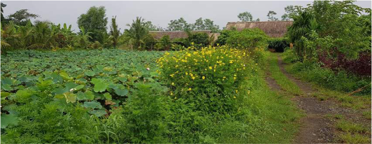

!!! quote "" 

    Khung cảnh xanh mát của nông trại khi đi từ cổng vào @Dốc Mơ, 2017

### Trang trại An nhiên&mdash;Hội An, Quảng Nam

Từ 2015, Trang trại An Nhiên là không gian sống và làm việc của một đội ngũ những người tiên phong trong việc tìm hiểu và thực hành một hệ thống các giải pháp hệ thống. Mục tiêu của họ là phục hồi và gây dựng một hệ sinh thái tự nhiên – con người. Những chủ đề chính tại An Nhiên bao gồm:

- Thiết lập và duy trì hệ sinh thái bờ sông hạn chế sạt lở
- Hình thành thảm thực vật đa loài và những thực hành nuôi dưỡng hệ sinh thái đất
- Bảo tồn tài nguyên thiên nhiên và văn hóa địa phương
- Lối sống cộng đồng có ý thức và thân thiện
- Giáo dục thái độ và kỹ năng sống bền vững cho thanh niên và trẻ em.

[Thông tin thêm](https://www.facebook.com/annhienfarm.hoian/)

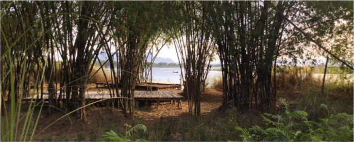

!!! quote "" 

    Rừng tre nằm trong trang trại An Nhiên, 2019

**Nguồn:** [Trung tâm Phát triển Sáng kiến Cộng đồng và Môi trường (C&E)](https://ce-center.org.vn/) và tổng hợp các nguồn khác từ báo chí, mạng xã hội.

Tài liệu thứ nhất được biên soạn và xuất bản dưới sự tài trợ của Quỹ Rosa Luxemburg Stiftung&mdash;Văn phòng Đông Nam Á

[Nông nghiệp trường tồn (Permaculture)](https://www.rosaluxhanoi.org/vi/publications/publication_details/528.html)

