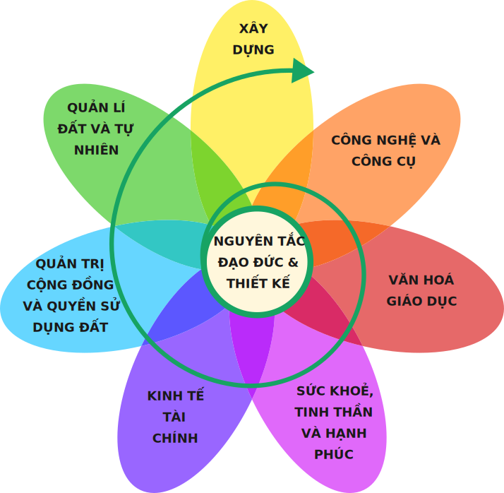

# Nông nghiệp trường tồn là gì?

## Định nghĩa Nông nghiệp trường tồn (Permaculture)

Ban đầu, **Permaculture** (*“nông nghiệp trường tồn”*, hay có tài liệu gọi là *“nông nghiệp vĩnh cửu”*) được tạo thành bởi việc ghép **“permanent”** (*mãi mãi, lâu bền*) và **“agriculture”** (*nông nghiệp*). Qua thời gian, những nguyên lý và yếu tố đạo đức cơ bản của nông nghiệp trường tồn đã được áp dụng vào nhiều lĩnh vực khác như sử dụng nước và năng lượng, xử lý rác hoặc, thiết kế sự kiện cho cộng đồng hay hệ thống kinh tế. Vì vậy, khái niệm này hiện nay cũng được hiểu là **“văn hóa xã hội trường tồn”** (*permanent culture*) (Hemenway, 2015).

!!! quote "(Mollison, 1988)"

    “Nông nghiệp trường tồn là việc thiết kế và duy trì có ý thức hệ sinh thái sản xuất nông nghiệp với đầy đủ sự đa dạng, sự ổn định và sức đề kháng của hệ sinh thái tự nhiên.”

Trong nông nghiệp trường tồn, con người chủ ý thiết kế cảnh quan mô phỏng theo những khuôn mẫu và mối quan hệ thấy được trong tự nhiên, cùng lúc đó đảm bảo sản lượng để có nguồn thức ăn, nguyên liệu xơ sợi và năng lượng dồi dào để đáp ứng nhu cầu tự thân (Holmgren, 2002). Thiết kế nông nghiệp trường tồn là một hệ thống quản lý cảnh quan có thể được áp dụng ở nhiều cấp độ từ quy mô vườn gia đình tới các tòa nhà trong thành phố, tới làng mạc và trang trại. Đó là một cách tiếp cận theo hệ thống tổng thể dựa trên các nguyên tắc đạo đức, sử dụng các khái niệm, nguyên lý và phương pháp được đúc rút từ hệ sinh thái tự nhiên, kiến thức bản địa và những thực hành được chứng minh qua thời gian để tạo nên những thể chế và nơi định cư bền vững cho con người (Millison, 2016). Phương pháp tổng hợp lại những ý tưởng, kỹ năng và lối sống đa dạng cần được khám phá lại và phát triển để tạo động lực cho chúng ta chuyển dịch từ những người tiêu dùng bị lệ thuộc trở thành những công dân có trách nhiệm và hiệu quả (Holmgren, 2002).

!!! quote "Mollison, 1988"

    “Triết lý đằng sau Nông nghiệp trường tồn là hợp tác thay vì chống lại tự nhiên; duy trì và quan sát thấu đáo thay vì tiếp tục hành động thiếu suy nghĩ; nhìn nhận hệ thống với đầy đủ các chức năng của nó thay vì chỉ đòi hỏi một chức năng sản xuất nào đó; và để hệ thống tiến hóa một cách tự nhiên”.

## Lược sử của Nông nghiệp trường tồn

Thuật ngữ và những thiết kế Nông nghiệp trường tồn đầu tiên được phát triển từ những năm 1970 bởi Bill Mollison, một giảng viên Tâm lý học môi trường tại Đại học Tasmania (Úc) cùng với học trò của mình là David Holmgren. Thuật ngữ **Nông nghiệp trường tồn** xuất hiện lần đầu tiên với thế giới vào năm 1976 trong một bài báo trên trang tin “Nông dân và người làm vườn hữu cơ ở Tasmania” xuất bản bởi Hiệp hội nông nghiêp và làm vườn hữu cơ Tasmania. Mollison và Holmgren xuất bản cuốn sách đầu tiên về nông nghiệp trường tồn vào năm 1978 với tựa đề “Nông nghiệp trường tồn 1&mdash;Trồng cây lâu năm để loài người an cư”. Cùng năm đó, tạp chí Nông nghiệp trường tồn đầu tiên được lập nên bởi biên tập viên Terry While, và khóa học nông nghiệp trường tồn đầu tiên được tổ chức tại Tasmania. Việc xuất bản tạp chí nông nghiệp trường tồn đóng vai trò then chốt trong sự nhân rộng của hệ thống thiết kế này; hình thành nên mạng lưới những người thực hành nông nghiệp trường tồn đang nở rộ rải rác ở khắp nơi, vai trò này sau đó được chuyển giao cho **Tạp chí Nông nghiệp trường tồn quốc tế** (*Permaculture International Journal - PIJ*).

Vào năm 1979, Mollison xuất bản “Nông nghiệp trường tồn 2” tập trung vào thiết kế, và tiếp nối bằng cuốn “Nông nghiệp trường tồn&mdash;Hướng dẫn dành cho người thiết kế” vào năm 1988. Năm 1981, vẫn trong thời điểm non trẻ của Nông nghiệp trường tồn, ông được sự công nhận rộng rãi trên thế giới với giải thưởng **Sinh kế bền vững** (*Right Livelihood Award*)&mdash;được coi là giải thay thế Nobel trong sinh kế.

Kế đến là sự xuất hiện của Rosemary Morrow, người đã có đóng góp to lớn vào việc thiết kế các khóa học về Nông nghiệp trường tồn và viết một số sách về chủ đề này, trong số đó phải kể đến cuốn “Hướng dẫn Nông nghiệp trường tồn cho những người gìn giữ Trái đất”. Bà cũng đã đưa ý tưởng này tới một số nước như Việt Nam, Campuchia và một số quốc gia khác.

Vào những năm 1980s, Nông nghiệp trường tồn mở rộng tới một số sự kiện như Hội nghị Kinh tế Kiểu mới&mdash;the Alternative Economics Summit và Diễn đàn Ngân hàng Trái đất&mdash;the Earthbank Conference. Hội nghị Nông nghiệp trường tồn quốc tế diễn ra lần đầu tiên tại Pappinbarra, Úc vào năm 1984, đánh dấu bước đầu mở rộng ra thế giới của phong trào này. Hội nghị quốc tế thứ 2 diễn ra tại Trường Cao đẳng bang Evergreen, Olympia, Washington (Mỹ) năm 1986 với sự tham gia của không chỉ Mollison mà cả người tiên phong trong phong trào nông nghiệp thuận tự nhiên tại Nhật, **Masanobu Fukuoka** (tác giả cuốn **“Cách mạng một cọng rơm”**) và **Wes Jackson**, người sáng lập **Viện Đất**&mdash;nơi nghiên cứu về cây nông nghiệp lâu năm tại Mỹ&mdash;vào năm 1976.

Nông nghiệp trường tồn vẫn chưa thực sự trở nên phổ biến, nhưng nó đã có được uy tín và sự kính trọng nhất định. Nông nghiệp trường tồn đã vượt ra khỏi biên giới nước Úc và lan rộng với những khóa học thiết kế nông nghiệp trường tồn được dạy tại các viện và tổ chức trên thế giới. Nhiều nước hiện nay có tổ chức và ấn bản Nông nghiệp trường tồn riêng của mình, trong số đó phải kể đến **Nhà hoạt động Nông nghiệp trường tồn** (*The Permaculture Activist*) ở Mỹ và Nông nghiệp trường tồn ở Anh Quốc. Mặc dù PIJ không còn xuất bản nữa nhưng tổ chức Nông nghiệp trường tồn Quốc Tế vẫn hoạt động, duy trì website và là điều phối toàn cầu của mạng lưới.

## Nông nghiệp trường tồn có thể áp dụng như thế nào?

Mặc dù được ươm mầm từ lĩnh vực làm vườn và nông nghiệp, thiết kế Nông nghiệp trường tồn có tính liên ngành, chạm tới rất nhiều chủ đề bao gồm hoạch định vùng, sinh thái, chăn nuôi, công nghệ phù hợp và phát triển quốc tế (Millison, 2016).

Đóa hoa Nông nghiệp trường tồn&mdash;một mô hình được đề xuất bởi Holmgren (**Hình 1**)&mdash;thể hiện các mảng chính cần thiết trong thiết kế nông nghiệp trường tồn để thành tạo một văn hóa bền vững. Trước đó, nông nghiệp trường tồn tập trung nhiều hơn vào việc quản lý đất và tự nhiên. Tuy nhiên hiện nay nông nghiệp trường tồn được áp dụng trong các mảng khác liên quan tới tài nguyên năng lượng và vật chất cũng như tổ chức con người (Holmgren, 2002).

!!! note ""

    **Hình 1:** Mô hình đóa hoa trong Nông nghiệp trường tồn (Holmgren, 2002)

Với bộ quy tắc đạo đức và nguyên lý cơ bản mang tính phổ quát toàn cầu và áp dụng được đa ngành, nông nghiệp trường tồn là khung thiết kế có thể áp dụng rộng rãi. Tài liệu này sẽ cung cấp các quy mô áp dụng khác nhau với các ví dụ thực tế để hỗ trợ những cá nhân, nhóm, tổ chức mong muốn thực hành nông nghiệp trường tồn.

!!! quote "Toby Hemenway (2015)"

    “...những người thực hành nông nghiệp trường tồn có thể đến từ nhiều hành trình khác nhau. Thời kỳ đầu, nông nghiệp trường tồn thu hút người làm vườn, nông dân, nhà thiết kế cảnh quan và những người dạy nông nghiệp trường tồn non trẻ. Tuy nhiên bởi khái niệm này có thể áp dụng rất rộng rãi, những người thực hành nông nghiệp trường tồn giờ đây bao gồm cả người thiết kế phần mềm; kỹ sư nước, rác thải và năng lượng; nhà hoạt động công lý xã hội; nhà giáo dục và nhà quản trị trường học từ mầm non tới cao học; người tổ chức cộng đồng và cán bộ nhà nước; nhà sinh thái; giáo viên dạy yoga, thể hình và các luyện tập tinh thần; túm lại, bất cứ ai”.

**Nguồn:** [Trung tâm Phát triển Sáng kiến Cộng đồng và Môi trường (C&E)](https://ce-center.org.vn/)

Tài liệu được biên soạn và xuất bản dưới sự tài trợ của Quỹ Rosa Luxemburg Stiftung&mdash;Văn phòng Đông Nam Á

[Nông nghiệp trường tồn (Permaculture)](https://www.rosaluxhanoi.org/vi/publications/publication_details/528.html)

