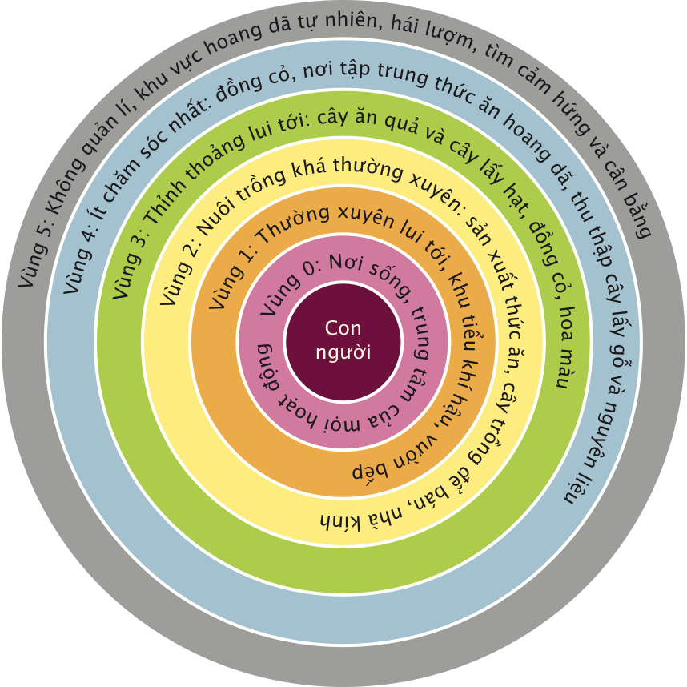

# Đạo đức và nguyên lí cơ bản của Nông nghiệp trường tồn

## Đạo đức trong nông nghiệp trường tồn
Ba nguyên tắc đạo đức cơ bản của nông nghiệp trường tồn (Mollison, 1988; Gaiacraft, 2012):

**1. CHĂM SÓC TRÁI ĐẤT**

Nuôi dưỡng để tất cả các hệ thống xoay quanh sự sống có thể duy trì và nhân lên trong đó bao gồm cả vật hữu sinh và vô sinh, cả động vật, thực vật, cũng như đất, nước và không khí. Thay đổi lối sống của mình và suy nghĩ lại về cách chúng ta tiếp cận các vấn đề phát triển cũng như khắc phục những thiệt hại đã gây ra.

Một ví dụ đơn giản là việc không sử dụng chất hóa học trên vườn rau nhưng lại lạm dụng hóa chất trong các hoạt động khác như lau rửa, vệ sinh, nấu nướng... Hóa chất sẽ nhiễm vào đất và nước, làm tổn hại tới sức khỏe của môi trường sống xung quanh bạn.

**2. CHĂM SÓC CON NGƯỜI**

Nuôi dưỡng để con người có thể tiếp cận với những tài nguyên cơ bản cho sự tồn tại của họ. Chăm lo cho sức khỏe và hạnh phúc của đại gia đình nhân loại, thúc đẩy sự tự lực và trách nhiệm đối với cộng đồng lớn.

Con người ở đây không chỉ là những người chúng ta quan hệ trực tiếp trong gia đình hay trong trang trại mà còn là những người sẽ sử dụng sản phẩm từ vườn của bạn, hay những người cung cấp nguyên liệu đầu vào cho mảnh đất của bạn.

**3. CÔNG BẰNG&mdash;TRẢ LẠI DƯ THỪA CHO TRÁI ĐẤT VÀ CON NGƯỜI**

Quản lý nhu cầu cá nhân, đặt ra ranh giới cho phát triển dân số và tiêu dùng.

Chia sẻ sự màu mỡ tài nguyên của Trái đất bình đẳng với mọi vật hữu sinh và vô sinh.

Nguyên tắc đạo đức này liên quan trực tiếp đến sự **“biết đủ”**. Khai thác khu vườn tới chừng nào là đủ? Liệu bạn có thể để lại một phần thành quả của mình cho tự nhiên được nuôi dưỡng và phục hồi hay không? Chúng ta được thừa hưởng sự hào phóng của tự nhiên, vậy cớ gì mà ta không thể hiện sự biết ơn bằng cách chia sẻ cho những người khác và chia sẻ lại với tự nhiên.

## Nguyên lý thiết kế

12 nguyên lý thiết kế trong Nông nghiệp trường tồn (Richard Telford & Oliver Holmgren, 2019)

**1. QUAN SÁT VÀ TƯƠNG TÁC**

{align=right}
***Vẻ đẹp nằm trong đôi mắt của kẻ ngắm nhìn***

Bằng việc dành thời gian hòa mình với thiên nhiên, chúng ta có thể tìm ra những giải pháp thực sự phù hợp với hoàn cảnh cụ thể của mình.

**2. THU THẬP VÀ LƯU GIỮ NĂNG LƯỢNG**

{align=right}
***Hãy phơi rơm khi trời nắng***

Bằng việc phát triển những hệ thống thu góp tài nguyên khi chúng còn dồi dào, chúng ta có thể sử dụng tài nguyên khi cần đến.

**3. THU ĐƯỢC SẢN LƯỢNG**

{align=right}
***Bạn không thể làm việc với cái bụng rỗng được***

Đảm bảo rằng bản thân bạn được hưởng thành quả thực sự hữu ích từ những gì mình đang làm.

**4. TỰ ĐIỀU CHỈNH VÀ CHẤP NHẬN PHẢN HỒI**

{align=right}
***Tội lỗi của ông cha sẽ để lại hậu quả tới con cháu bảy đời.***

Chúng ta cần phản đối những hành động không phù hợp để đảm bảo các hệ thống có thể tiếp tục vận hành tốt.

**5. SỬ DỤNG VÀ TRÂN TRỌNG TÀI NGUYÊN VÀ DỊCH VỤ TÁI TẠO ĐƯỢC**

{align=right}
***Hãy để tự nhiên làm việc của mình***

Hãy tận dụng tốt nhất sự dồi dào của tự nhiên để giảm tiêu thụ và giảm phụ thuộc vào các tài nguyên không tái tạo được như than đá, dầu mỏ, khí đốt.

**6. KHÔNG THẢI RÁC**

{align=right}
***Không lãng phí, không tham lam***

Bằng cách trân trọng và tận dụng tất cả tài nguyên được ban tặng, mọi thứ đều hữu ích.

**7. THIẾT KẾ TỪ KIỂU MẪU ĐẾN CHI TIẾT**

{align=right}
***Không thể chỉ nhìn cây để đánh giá cánh rừng***

Bằng cách lùi lại một bước, ta có thể quan sát những quy luật được lặp đi lặp lại trong tự nhiên và xã hội. Những kiểu mẫu này có thể tạo thành xương sống cho thiết kế của chúng ta, với những chi tiết được bồi đắp dần trong quá trình thực hiện.

**8. TÍCH HỢP THAY VÌ PHÂN TÁCH**

{align=right}
***Nhiều bàn tay góp sức giúp công việc nhẹ đi***

Đặt mọi thứ vào đúng chỗ, những mối quan hệ giữa chúng sẽ nảy nở và hỗ trợ lẫn nhau.

**9. SỬ DỤNG NHỮNG GIẢI PHÁP NHỎ VÀ TỪ TỪ**

{align=right}
***Chậm mà chắc, thắng cuộc đua***

Hệ thống nhỏ và chậm thì dễ bảo trì hơn hệ thống lớn, đồng thời tận dụng tài nguyên địa phương tốt hơn và sản xuất ra thành quả bền vững hơn.

**10. SỬ DỤNG VÀ TRÂN TRỌNG SỰ ĐA DẠNG**

{align=right}
***Đừng để hết trứng vào một giỏ***

Sự đa dạng làm giảm tính dễ tổn thương trước các nguy cơ khác nhau và tận dụng bản chất độc đáo của môi trường tự nhiên mà ta dựa vào.

**11. SỬ DỤNG CÁC VÙNG BIÊN VÀ TRÂN TRỌNG VÙNG CẬN BIÊN**

{align=right}
***Đừng nghĩ bạn đang đi đúng hướng chỉ vì con đường dễ đi***

Khoảng giao thoa giữa mọi vật là nơi nhiều sự kiện thú vị diễn ra. Đây thường là nơi chứa những yếu tố quý giá, đa dạng và năng suất nhất trong hệ thống.

**12. TẬN DỤNG VÀ PHẢN ỨNG VỚI THAY ĐỔI MỘT CÁCH SÁNG TẠO**

{align=right}
***Tầm nhìn không phải là nhìn mọi thứ như chúng là, mà như chúng sẽ trở thành***

Chúng ta có thể có tác động tích cực lên những thay đổi tất yếu bằng cách quan sát cẩn thận và sau đó can thiệp đúng thời điểm.

# Chia vùng trong nông nghiệp trường tồn

Có 6 vùng chính được quy hoạch trong thiết kế nông nghiệp trường tồn (đánh số từ 0 tới 5). Mỗi vùng được xác định bởi tần suất tiếp cận của con người và liên quan tới sử dụng hiệu quả năng lượng và tài nguyên. Tính hiệu quả bị chi phối bởi tần suất chúng ta sử dụng và quản lý những yếu tố trong vùng (Nông nghiệp trường tồn, 2019).

!!! note ""
    
    **Hình 2:** Phân vùng trong Nông nghiệp trường tồn - Mô hình nguyên tắc

**Vùng 0**: Ngôi nhà&mdash;nơi chúng ta sống, trung tâm của các hoạt động. Trong vùng này, chúng ta cần giảm nhu cầu tiêu dùng nước và năng lượng, thu nhận tài nguyên thiên nhiên như mưa, gió và nắng một cách hiệu quả; và tạo nên một môi trường bền vững hài hòa để sống, làm việc và nghỉ ngơi.

**Vùng 1**: Đây là khu vực gần nhà, được sử dụng và quản lý tập trung nhất. Ví dụ: vườn bếp, động vật nhỏ, kho dụng cụ, bể thu nước mưa. Các diện tích trồng cây ở khu vực 1 thường được che phủ hoàn toàn, sử dụng một hệ thống gồm lớp mùn tấp ủ, được tưới tiêu đầy đủ bằng các hệ thống như hệ thống tưới tiêu nhỏ giọt được đặt dưới lớp che phủ của vườn.

**Vùng 2**: Khu vực này được sử dụng khá thường xuyên, nhưng ít hơn vùng 1. Khu vực này chứa những yếu tố lớn hơn và ít khai thác đến hơn nhưng vẫn cần được chăm sóc thường xuyên như rau củ dài ngày và lâu năm, vườn cây ăn quả, khu vực ủ phân, tổ ong, ao hay chuồng gia súc gia cầm. Diện tích trồng trọt ở vùng 2 có thể được che phủ hoàn toàn bằng cách như dùng tấm che phủ; nhưng nếu khu vực này quá rộng thì không thực hiện được. Ta cũng có thể áp dụng che phủ điểm quanh cây và bảo vệ cây mới lớn bằng rào chắn. Khu vực này được tưới tiêu đầy đủ, bởi hệ thống như nhỏ giọt.

**Vùng 3**: Khu vực này về cơ bản là đất nông trại chỉ cần ít sự chăm sóc. Các yếu tố trong khu vực này bao gồm: cây lương thực chính, vườn cây ăn quả hoặc cây cao, đồng cỏ và vùng rìa để chăn thả gia súc lớn (bò, cừu), chuồng gia cầm bán tự nhiên, cây lớn làm thức ăn cho động vật, đập nhỏ để trữ nước và là nguồn nước cho động vật. Diện tích trồng trọt ở vùng này dùng thảm thực vật che phủ. Cây trồng ở đây không cần cắt tỉa và không phải cây nào cũng có hệ thống tưới tiêu tại chỗ.

**Vùng 4**: Đây là vùng tự nhiên để hoang không quản lý như là đồng cỏ bụi, rừng hoặc khu vực tự nhiên tương tự, không có sự can thiệp hay quản lý của con người. Đây là vùng hoang dã được bảo tồn và là không gian cho chúng ta cơ hội để tạm gác lại vai trò điều khiển tự nhiên và trở thành người chiêm ngưỡng tự nhiên trong dáng hình thuần khiết, nơi chúng ta chỉ cần quan sát những vòng tuần hoàn của tự nhiên và học hỏi từ đó.

**Vùng 5**: Đây là vùng tự nhiên để hoang không quản lý như là đồng cỏ bụi, rừng hoặc khu vực tự nhiên tương tự, không có sự can thiệp hay quản lý của con người. Đây là vùng hoang dã được bảo tồn và là không gian cho chúng ta cơ hội để tạm gác lại vai trò điều khiển tự nhiên và trở thành người chiêm ngưỡng tự nhiên trong dáng hình thuần khiết, nơi chúng ta chỉ cần quan sát những vòng tuần hoàn của tự nhiên và học hỏi từ đó.

**Lưu ý** rằng không phải dự án nông nghiệp trường tồn nào cũng có đủ 6 vùng này. Ví dụ ở đô thị thì một khu vực Nông nghiệp trường tồn có thể chỉ có tới vùng số 2. Việc thiết kế vùng có thể được tùy chỉnh để phù hợp với điều kiện cụ thể của từng nơi.

!!! quote "Nông nghiệp trường tồn liên quan tới cuộc sống mỗi cá nhân như thế nào? Graham Bell. (Bell, 1992)"

    “Nông nghiệp trường tồn là một lối sống cho chúng ta thấy cách để tận dụng tối đa tài nguyên là giảm thiểu rác thải và tối đa tiềm năng. Sống sinh thái không có nghĩa là rũ bỏ mọi thứ, mà là học lại về giá trị của tự nhiên và hiểu thêm những cách khác để có thể trở nên sung túc [...] chủ định thiết kế một lối sống vừa hiệu quả vừa không gây hại tới môi trường [...]. Bạn có thể thỏa mãn những nhu cầu cá nhân của mình mà không cần làm cuộc sống của bất cứ ai khác phải kém dễ chịu đi”
