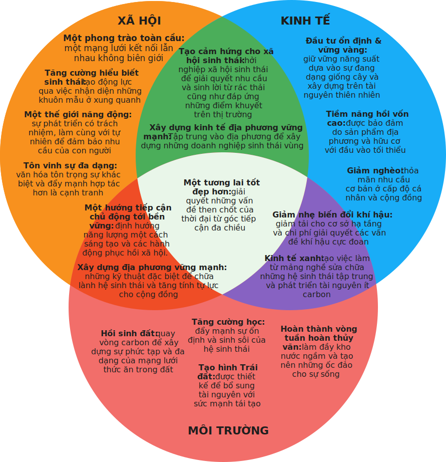

# Tại sao chúng ta nên chọn Nông nghiệp trường tồn

## Vai trò của nông nghiệp trường tồn trong việc giải quyết khủng hoảng khí hậu

Trái đất không thể duy trì lâu dài dưới sự tàn phá bởi nông nghiệp tập trung, lâm nghiệp độc canh, tiêu dùng tài nguyên thiên nhiên vô độ và thiết kế quy hoạch định cư thiếu suy nghĩ (Mollison, 1988). Chúng ta đang đòi hỏi quá nhiều từ Trái đất. Tính tới năm 2016, **86% dân số thế giới** sống ở những nước bị **thâm hụt sinh thái**, có nghĩa là nhu cầu của người dân nhiều hơn so với những gì hệ sinh thái tự nhiên của nước đó có thể phục hồi (Global Footprint Network&mdash;GFN, 2019).

Chúng ta đã và đang nhìn thấy hậu quả của ấm lên toàn cầu qua các hiện tượng thời tiết cực đoan, mực nước biển dâng và băng tan ở Bắc cực, cùng với nhiều thay đổi khác. **“Để hạn chế sự nóng lên toàn cầu dưới ngưỡng 1.5°C, loài người cần có những thay đổi nhanh chóng, rộng rãi và chưa hề có tiền lệ trong mọi mặt của cuộc sống”**&mdash;Tổ chức Intergovernmental Panel on Climate Change (IPCC) trình bày trong báo cáo năm 2018. Với những lợi ích rõ ràng cho cả hệ sinh thái và xã hội con người, việc đảm bảo nóng lên toàn cầu không vượt quá 1.5°C so với ngưỡng 2°C sẽ cần đi liền với đảm bảo một xã hội bền vững và công bằng hơn. Kiềm chế sự nóng lên toàn cầu cũng sẽ giúp con người và tự nhiên có thêm thời gian để thích nghi và duy trì được ở dưới ngưỡng đe dọa diệt vong (IPCC, 2018).

Tuy nhiên, khủng hoảng khí hậu sẽ có thể không tránh khỏi nếu chúng ta tiếp tục **nền tân chủ nghĩa kinh tế tự do** (*neoliberalism*) chỉ tập trung vào tăng trưởng như hiện nay. Theo Rob Hopkins, người sáng lập phong trào **Transition Town** (*Chuyển dịch trong phố*), chúng ta cần tập trung sức lực vào ba yếu tố quan trọng sau đây để có thể đảo ngược được khủng hoảng khí hậu hiện nay (Hopkins, 2018):

- **Hành động cụ thể:** đưa chính bản thân hành động của mình làm thông điệp, nói không với những thứ đang khiến chúng ta quá đà (vượt quá ngưỡng của tự nhiên), luôn nhận thức rằng việc hành động là quan trọng nhưng chỉ hành động thôi thì chưa đủ.

- **Thay đổi hệ thống:** chúng ta cần xây dựng một thế giới mới trong vỏ của hệ thống cũ đang mục ruỗng, tạo nên những hệ thống, nền kinh tế và mô hình mà chúng ta cần để chuyển đổi tới những điều tích cực và bền vững hơn.

- **Thay đổi căn bản về nhận thức:** những cố gắng bên trong là cần thiết để hai yếu tố phía trên có thể thành công, thay đổi hệ giá trị cũng như những câu chuyện chúng ta tin tưởng để tạo điều kiện cho những chuyển biến sâu xa hơn có thể diễn ra một cách bản năng.

Bằng cách nhắm đến các vấn đề then chốt của thời đại từ góc nhìn đa chiều phù hợp với ba cột trụ phía trên, nông nghiệp trường tồn trở thành một thành tố quan trọng trong việc giải quyết tình trạng khó khăn toàn cầu hiện nay.

Kiến thức nông nghiệp trường tồn giúp cho cả những cộng đồng nghèo nhất vực dậy và có cuộc sống tốt hơn. Ví dụ ở nông thôn thay vì sử dụng những vật liệu xây dựng đắt tiền, người dân được hướng dẫn để cách xây dựng thuận tự nhiên để làm nên ngôi nhà xinh xắn và kiên cố chỉ từ những gì có sẵn ở xung quanh. Xây dựng thuận tự nhiên không chỉ tốt hơn cho môi trường và cho sức khỏe của chủ nhà, nó còn làm giảm tác động lên môi trường bằng việc tiết kiệm năng lượng và nước, đồng thời giảm thiểu xáo trộn tới khu vực xung quanh. Một điều cũng cực kỳ quan trọng nhưng ít được để tâm đến, xây dựng thuận tự nhiên sẽ có tác động tích cực tới sức khỏe, an sinh và năng suất của con người.

## Tại sao cần lồng ghép chủ đề nông nghiệp trường tồn vào các hoạt động giáo dục?

Đáng lẽ chúng ta phải nhấn mạnh sự cấp bách của chuyển đổi mô hình từ lâu, điều mà thế giới đang khắc khoải trông chờ. Tuy vậy, vẫn có một khoảng cách lớn giữa điều Trái đất cần và sự chuyển biến trong hành động của chúng ta. Chúng ta cần có thật nhiều những hành động bền vững hơn ở mọi cấp độ, từ cá nhân tới tập thể, từ chính sách tới giáo dục. Với tài liệu hướng dẫn này, nhóm tác giả mong muốn đẩy mạnh giáo dục bền vững tới những người trẻ qua việc giúp các bạn hiểu hơn về nông nghiệp trường tồn. Với một hướng tiếp cận đa ngành, nông nghiệp trường tồn là mô hình hiệu quả bao hàm trọn vẹn sự tương thuộc giữa các mặt khác nhau của cuộc sống và có thể được áp dụng ở nhiều lĩnh vực khác nhau ngoài nông nghiệp. Quá trình thiết kế nông nghiệp trường tồn không chỉ cung cấp một góc nhìn toàn vẹn mà còn tạo không gian cho sáng tạo và làm chủ, thực sự phù hợp cho tinh thần của tuổi trẻ. Khi chúng ta hiểu các nguyên lý thiết kế cũng như tinh thần của nông nghiệp trường tồn thì không gian để khám phá và sáng tạo là vô tận. Mô hình này hỗ trợ rất tốt cho mảng giáo dục bền vững, một chủ đề thỉnh thoảng có thể bị cho là cứng nhắc và khuôn mẫu. **Hình 4** thể hiện một ví dụ của việc áp dụng nguyên tắc phân vùng của nông nghiệp trường tồn trong những lĩnh vực khác. Vì vậy, nông nghiệp trường tồn có thể được dùng trong cả phương pháp giáo dục và nội dung giảng dạy.

!!! note ""

    **Hình 4:** Phân vùng lối sống cá nhân theo thiết kế nông nghiệp trường tồn được xây dựng bởi Bart Anderson ( Hemenway, 2015)