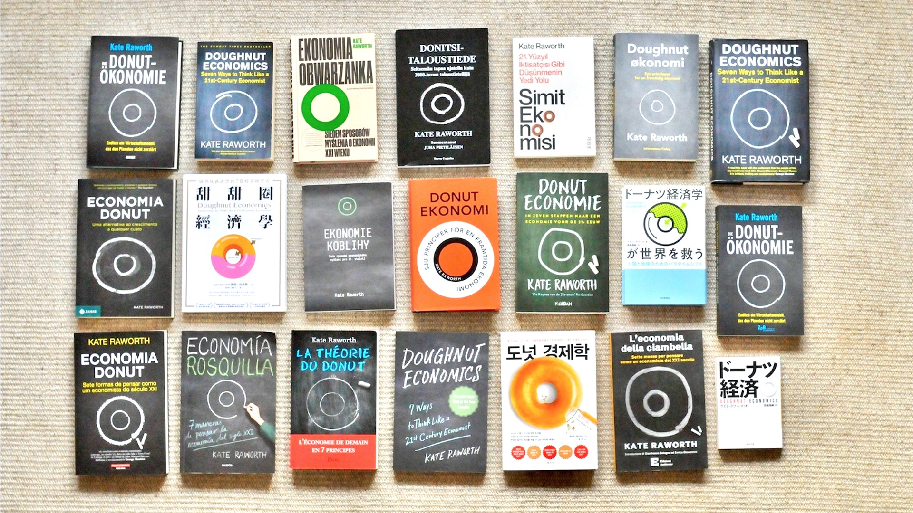

# Kinh tế học Hình khuyên (Doughnut Economics)

!!! quote "Lời dẫn"

    Vào năm 2017, Kate Raworth đã xuất bản cuốn sách **Kinh tế học Hình khuyên: Bảy cách suy nghĩ như một nhà kinh tế học thế kỷ 21**, và kể từ khi xuất bản, cuốn sách đã tiếp tục truyền cảm hứng cho một cộng đồng toàn cầu gồm những người thay đổi muốn biến ý tưởng của **Kinh tế học Hình khuyên** thành hành động.

## Giới thiệu

**Kinh tế học Hình khuyên** đưa ra tầm nhìn về ý nghĩa của việc nhân loại phát triển trong thế kỷ 21&mdash;nó khám phá tư duy và cách suy nghĩ cần thiết để đưa chúng ta đến đó.

Được xuất bản lần đầu tiên vào năm 2012 trong một [báo cáo của Oxfam](https://www-cdn.oxfam.org/s3fs-public/file_attachments/dp-a-safe-and-just-space-for-humanity-130212-en_5.pdf) bởi Kate Raworth, khái niệm về **Kinh tế học Hình khuyên** đã nhanh chóng thu hút được sự chú ý trên phạm vi quốc tế, từ Giáo hoàng và Đại hội đồng Liên hợp quốc cho đến tổ chức hoạt động chống biến đổi khí hậu Extinction Rebellion.

Cuốn sách năm 2017 của Kate, **Kinh tế học Hình khuyên: Bảy cách để suy nghĩ như một nhà kinh tế học thế kỷ 21**, khám phá sâu hơn tư duy kinh tế cần thiết để đưa nhân loại vào , cùng nhau rút ra những hiểu biết sâu sắc từ các quan điểm kinh tế đa dạng theo cách mà mọi người đều có thể hiểu được.

Bài nói chuyện TED năm 2018 (**Có phụ đề tiếng Việt**) này đưa ra bản tóm tắt các thông điệp cốt lõi của cuốn sách. Bạn cũng có thể đọc Chương Một tại đây[^1].

[^1]:

    [Chương 1](https://doughnuteconomics.org/rails/active_storage/blobs/redirect/eyJfcmFpbHMiOnsibWVzc2FnZSI6IkJBaHBBWXM9IiwiZXhwIjpudWxsLCJwdXIiOiJibG9iX2lkIn19--53a8f3094fa0866fa380ca1d99aeb79affea4e81/Doughnut%20Economics%20Chapter%20One.pdf), có tựa đề **Thay đổi mục tiêu: Từ GDP thành chiếc Hình khuyên**, trong đó Kate giới thiệu mô hình kinh tế học chính thống, bắt nguồn từ tăng trưởng và đưa ra bản thiết kế thay thế cho thế kỷ 21&mdash;chiếc Hình khuyên của ranh giới xã hội và hành tinh.

<iframe style="display: block; margin: auto;" width="560" height="315" src="https://www.youtube.com/embed/Rhcrbcg8HBw?cc_lang_pref=vi&cc_load_policy=1" title="YouTube video player" frameborder="0" allow="accelerometer; autoplay; clipboard-write; encrypted-media; gyroscope; picture-in-picture; web-share" allowfullscreen></iframe>

Cuốn sách nhanh chóng trở thành sách bán chạy quốc tế và hiện đã được xuất bản bằng hơn 20 ngôn ngữ, bao gồm tiếng Anh (Anh và Mỹ), tiếng Bồ Đào Nha của Brazil, tiếng Bulgary, tiếng Trung phức tạp, tiếng Séc, tiếng Đan Mạch, tiếng Hà Lan, tiếng Phần Lan, tiếng Đức, tiếng Ý, tiếng Nhật, tiếng Hàn, Ba Lan, Bồ Đào Nha, Tây Ban Nha, Thụy Điển và Thổ Nhĩ Kỳ.

!!! quote ""

    Phiên bản của cuốn sách với nhiều ngôn ngữ.

Phạm vi toàn diện và sự đơn giản về hình ảnh của **Kinh tế học Hình khuyên**, cùng với nền tảng khoa học của nó, đã biến nó thành một không gian tập trung cho các cuộc trò chuyện lớn về việc tưởng tượng lại và làm lại tương lai. Nó hiện đang được thảo luận, tranh luận và đưa vào thực hiện trong giáo dục và cộng đồng, trong kinh doanh và trong chính phủ, ở các thị trấn, thành phố và quốc gia trên toàn thế giới.

## Hình khuyên (Doughnut) là gì?

Hãy coi nó như một chiếc la bàn cho sự thịnh vượng của con người trong thế kỷ 21, với mục đích đáp ứng nhu cầu của tất cả mọi người trong khả năng của hành tinh đang sống.

Hình khuyên bao gồm hai vòng tròn đồng tâm: một là nền tảng xã hội, để đảm bảo rằng không ai bị thiếu hụt những thứ cần thiết cho cuộc sống, và một là mức trần sinh thái, để đảm bảo rằng nhân loại không cùng nhau vượt qua ranh giới hành tinh vốn bảo vệ các hệ thống hỗ trợ sự sống của Trái đất. Giữa hai tập hợp ranh giới này là một không gian Hình khuyên vừa an toàn về mặt sinh thái vừa công bằng về mặt xã hội: một không gian mà nhân loại có thể phát triển.

Hình khuyên là khái niệm cốt lõi ở trung tâm của Kinh tế học Doughnut.

## Kinh tế học Hình khuyên (Doughnut Economics) là gì?

Nếu mục tiêu của thế kỷ 21 là đáp ứng nhu cầu của tất cả mọi người sử dụng các phương tiện sống có thể trong phạm vi của hành tinh&mdash;nói cách khác, đi vào bên trong hình khuyên&mdash;thì làm thế nào nhân loại có thể đạt được điều đó? Chắc không phải là với tư duy kinh tế của thế kỷ trước.

Kinh tế học Doughnut đề xuất một tư duy kinh tế phù hợp với thời đại của chúng ta. Nó không phải là một tập hợp các chính sách và thể chế, mà là một cách tư duy làm sao để mang lại những động lực có **khả năng tái tạo** (*regenerative*) và **phân phối** (*distributive*) mà thế kỷ này đòi hỏi. Dựa trên những hiểu biết sâu sắc từ các trường phái tư duy kinh tế đa dạng&mdash;bao gồm **kinh tế học sinh thái** (*ecological*), **nữ quyền** (*feminist*), **thể chế** (*institutional*), **hành vi** (*behavioral*) và **phức hợp** (*complexity*)&mdash; cuốn sách đưa ra bảy cách suy nghĩ như một nhà kinh tế học thế kỷ 21 nhằm chuyển đổi nền kinh tế, từ địa phương sang toàn cầu.

Điểm khởi đầu của Kinh tế học Doughnut là thay đổi mục tiêu từ tăng trưởng GDP vô hạn sang sự phát triển thịnh vượng bên trong vòng xuyến. Đồng thời, nhìn thấy bức tranh toàn cảnh bằng cách nhận ra rằng nền kinh tế gắn liền với và phụ thuộc vào xã hội và thế giới sống. Kinh tế học Doughnut nhận ra rằng hành vi của con người có thể được nuôi dưỡng để trở nên hợp tác và quan tâm, cũng như nó có thể mang tính cạnh tranh và chủ nghĩa cá nhân.

Nó cũng thừa nhận rằng các nền kinh tế, xã hội và phần còn lại của thế giới sống là những hệ thống phức tạp, phụ thuộc lẫn nhau, được hiểu rõ nhất qua lăng kính của tư duy hệ thống. Và nó kêu gọi biến các nền kinh tế suy thoái ngày nay thành các nền kinh tế phục hồi và các nền kinh tế chia rẽ thành các nền kinh tế phân phối nhiều hơn. Cuối cùng, Kinh tế học Doughnut nhận ra rằng tăng trưởng có thể là một giai đoạn lành mạnh của cuộc đời, nhưng không có gì phát triển mãi mãi: những thứ thành công bằng việc tăng trưởng sẽ đến lúc phải trưởng thành lên và phát triển theo chiều hướng bền vững.

<!-- Tìm hiểu sâu hơn về bảy cách để suy nghĩ như một nhà kinh tế học thế kỷ 21 với loạt hoạt hình dài 90 giây của chúng tôi. -->

## Tại sao việc thiết kế lại quan trọng

Điều gì có thể giúp một tổ chức trở nên tái tạo và phân phối để đưa nhân loại phát triển trong phạm vi vòng xuyến? DEAL đã tổ chức các cuộc hội thảo với các doanh nghiệp, sở ban ngành thành phố, các quỹ và các loại tổ chức khác muốn khám phá câu hỏi này và những tác động mang tính chuyển đổi.

Trọng tâm của các hội thảo này là tập trung vào thiết kế: không phải thiết kế sản phẩm và dịch vụ của, hay thậm chí là tòa nhà văn phòng, mà là thiết kế của chính tổ chức. Theo mô tả của Marjorie Kelly, một nhà lý thuyết hàng đầu về thiết kế doanh nghiệp cho thế hệ tiếp theo, có năm lớp thiết kế định hình chủ yếu những gì một tổ chức có thể làm và tồn tại trên thế giới:

**Mục đích** (*Purpose*). **Mạng lưới** (*Networks*). **Quản trị** (*Governance*). **Quyền sở hữu** (*Ownership*). **Tài chính** (*Finance*).

Năm khía cạnh này của thiết kế cùng nhau định hình sâu sắc khả năng của bất kỳ tổ chức nào để trở nên có khả năng tái tạo và phân phối, từ đó giúp nhân loại đi vào trong vòng khuyên.

## Nguyên tắc thực hành của Kinh tế học Doughnut

Để đảm bảo tính toàn vẹn của các ý tưởng của Kinh tế học Donut, chúng tôi đòi hỏi bất kỳ sáng kiến nào đang thực hiện các ý tưởng của Kinh tế học Doughnut phải tuân thủ các nguyên tắc sau đây.

- **Đi theo các mục tiêu của thế kỷ 21**: Nhằm mục đích đáp ứng nhu cầu của tất cả mọi người trong khả năng của hành tinh. Tìm cách sắp xếp mục đích, mạng lưới, quản trị, quyền sở hữu và tài chính của tổ chức bạn với mục tiêu này.

- **Nhìn vào bức tranh toàn cảnh**: Nhận ra vai trò tiềm năng của hộ gia đình, tài sản chung, thị trường và nhà nước&mdash;cùng nhiều sức mạnh tổng hợp của họ&mdash;trong các nền kinh tế đang chuyển đổi. Đảm bảo rằng tài chính phục vụ công việc chứ không phải thúc đẩy nó.

- **Nuôi dưỡng bản chất con người**: Thúc đẩy sự đa dạng, sự tham gia, hợp tác và có đi có lại. Củng cố mạng lưới cộng đồng và làm việc với tinh thần tin cậy cao. Quan tâm đến phúc lợi của nhóm.

- **Tư duy mang tính hệ thống**: Thử nghiệm, học hỏi, thích nghi, phát triển và hướng tới cải tiến liên tục. Hãy cảnh giác với các hiệu ứng động, các vòng phản hồi và các điểm tới hạn.

- **Khả năng phân phối**: Làm việc trên tinh thần thiết kế mở và chia sẻ giá trị được tạo ra với tất cả những người đồng sáng tạo ra nó. Nhận thức được quyền lực và tìm cách phân phối lại nó để cải thiện sự công bằng giữa các bên liên quan.

- **Khả năng tự tái tạo**: Nhằm mục đích làm việc với và trong các chu kỳ của thế giới sống. Hãy là người chia sẻ, người sửa chữa, người tái tạo, người quản lý. Giảm thiểu việc đi lại, giảm thiểu các chuyến bay, thông minh về khí hậu và năng lượng

- **Nhằm mục tiêu thịnh vượng hơn là tăng trưởng**: Đừng để tăng trưởng trở thành một mục tiêu trong chính nó. Biết khi nào nên để công việc trải ra cho những người khác thay vì mở rộng quy mô.

- **Tư duy chiến lược trong thực tế**: Hành động theo nhiệt huyết&mdash;nhưng luôn suy ngẫm về những người có ít tiếng nói hơn trong cộng đồng. Cân bằng tính cởi mở với tính toàn vẹn để công việc được lan toả mà không bị bó buộc. Chia sẻ lại quá trình học tập và đổi mới để giải phóng sức mạnh của nguồn cảm hứng cộng đồng.

