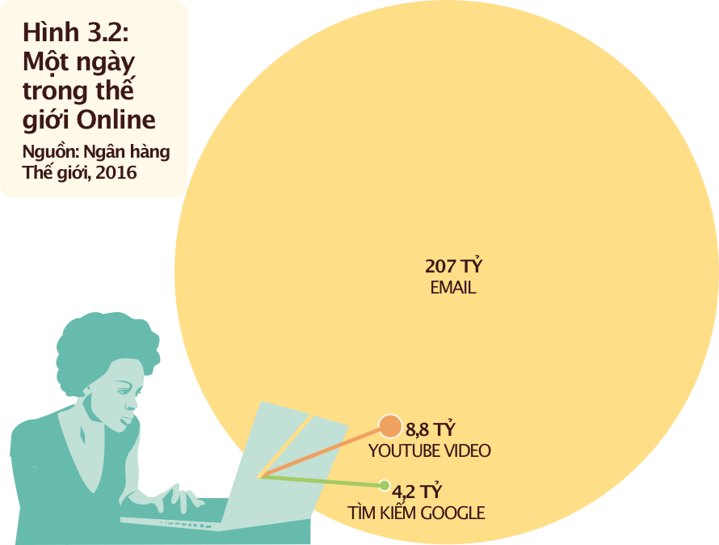
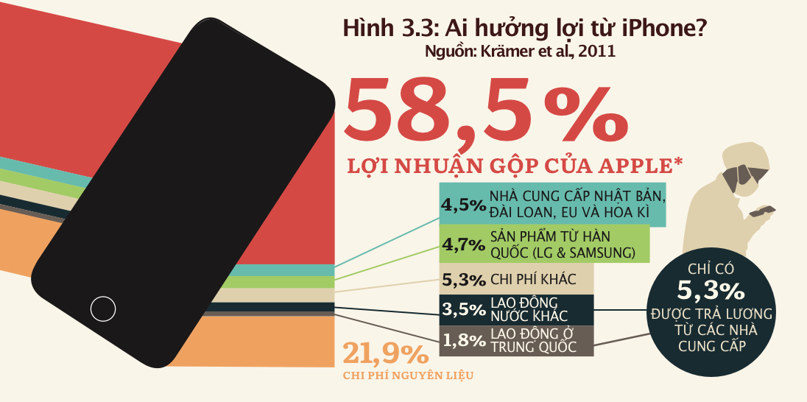

# Số hoá: Phòng thí nghiệm của giấc mơ và ác mộng

!!! quote "Lời dẫn"

    Mọi người đều biết cảm giác này. Đó là sự thôi thúc muốn ‘lên mạng’. Là mong muốn đi sâu vào thế giới số được cập nhật tức thời mà không muốn bỏ lỡ một điều gì. Hiện nay (theo Ngân hàng thế giới năm 2016—ND), cứ bốn người thì có một người có tài khoản Facebook. Skype quản lý 150 triệu cuộc gọi hàng ngày, Twitter với 800 triệu tweet và Google xử lý hơn 4 tỷ truy vấn tìm kiếm. #chào-mừng-bạn-đến-với-thế-giới-số.

**Số hóa** (*digitalisation*) là một xu thế lớn bắt đầu xuất hiện vào buổi bình minh của thế kỷ 21. Nó đã trở thành một từ thông dụng, và chúng ta ngày càng thấy sự thâm nhập của nó vào nhiều lĩnh vực khác nhau trong cuộc sống. “Kết nối toàn cầu” dường như sắp trở thành hiện thực. Nhiều người tin rằng **vạn vật kết nối** (*internet of things*) là tương lai: ngày càng có nhiều đồ vật&mdash;từ thiết bị điện tử đến quần áo&mdash;được trang bị cảm biến và kết nối qua Internet, tạo ra một môi trường kỹ thuật số mới. Chỉ với một cú nhấp chuột, chúng ta có thể điều khiển những ngôi nhà, nhà máy hay thậm chí toàn bộ thành phố ‘thông minh’ của mình. Đối với các hiệp hội doanh nghiệp (quốc tế) lớn và các tổ chức chính trị, trường hợp này có vẻ khá rõ ràng: số hóa không chỉ ‘thông minh’ mà còn hứa hẹn sự tiến bộ và thịnh vượng. Điều này được xây dựng dựa trên hy vọng rằng số hóa sẽ một lần nữa mang lại tốc độ tăng trưởng tương tự như trong những thập kỷ qua và chấm dứt tình trạng trì trệ kinh tế. Những con số cho thấy tiềm năng không thể phủ nhận của lĩnh vực kỹ thuật số. Đã qua rồi cái thời mà các tập đoàn kinh doanh nhiên liệu hóa thạch và ngân hàng là những công ty có giá trị nhất thế giới; chúng gần như đã được thay thế hoàn toàn bởi các tập đoàn công nghệ cao và các công ty internet (**Hình 3.1**). Đối với mọi người, số hóa hứa hẹn về một cuộc sống hướng tới lợi ích chung, đặt nhiều lĩnh vực nằm chắc chắn ngoài tầm với của thị trường thương mại. Những người quan sát bi quan hơn nhìn thấy sự xuất hiện của một “chế độ độc tài thông minh” có thể tận dụng tối đa các cơ hội giám sát và kiểm soát được cung cấp bởi mạng kỹ thuật số. Ngày nay, số hóa dường như là một phòng thí nghiệm của giấc mơ cũng như ác mộng. 
<!-- style="background: #FFF9EA; padding: 1rem" -->
<iframe allowtransparency="true";  title="Hình 3.1: Top các công ty công nghệ &amp;amp; Tỉ phú sở hữu" aria-label="Bullet Bars" id="datawrapper-chart-B5c4Z" src="https://datawrapper.dwcdn.net/B5c4Z/4/" scrolling="no" frameborder="0" style="border: none;" width="600" height="365" data-external="1"></iframe>

Sự hưng phấn mù quáng đối với tiến bộ kỹ thuật số, cũng như sự lên án gay gắt đối với tất cả những thứ kỹ thuật số cũng như các công nghệ giám sát có khả năng mang tính toàn trị, là chưa đủ trọn vẹn. Điều cần thiết là một phân tích khác biệt và nhận diện được đầy đủ các sắc thái. Đây chính là mục đích của chương này. Chúng ta bắt đầu bằng cách đặt vấn đề về sự bình thường mới này của thời đại kỹ thuật số đối với các đối tượng liên quan. Thứ hai, trong nỗ lực đưa ra phân tích về cơ sở nguyên vật liệu dùng sử dụng quá trình số hóa, chúng ta sẽ xem xét nguồn gốc của các linh kiện được dùng trong một thiết bị rất phổ biến: điện thoại thông minh. Nền kinh tế kỹ thuật số toàn cầu hoạt động như thế nào? Ai được lợi và ai bị thiệt? Trong phần thứ ba, chúng ta xem xét những câu hỏi này trước khi nhìn vào các cơ chế và cơ hội mà sự số hóa mang lại trong công cuộc chuyển đổi sinh thái-xã hội của xã hội. Chúng ta cũng sẽ thảo luận về cách thức sự số hóa đã ngăn chặn quá trình chuyển đổi như vậy từ trước đến giờ. Như chúng ta sẽ thấy, sự bất bình đẳng toàn cầu và sự mất cân bằng quyền lực gắn liền với lối sống và lối sản xuất đế quốc đã và đang thống trị. Chúng cũng là một trong những lý do cơ bản khiến chúng ta hiện đang phải trải qua những cuộc khủng hoảng ngày càng nghiêm trọng, mặc dù công nghệ kỹ thuật số mang đến cho chúng ta nhiều cơ hội để có một cuộc sống tốt đẹp hơn bao giờ hết.

!!! quote "Theo Statista, 2016e"

        Vào tháng 7 năm 2016, Apple bán ra chiếc iPhone thứ một tỷ của mình.

## Bình thường hoá công nghệ số

Chúng ta đang sống trong một thế giới mà công nghệ số đã xâm nhập vào nhiều khía cạnh của cuộc sống; chỉ cần nghĩ đến tác động của việc mất internet trong thời gian dài, chúng ta sẽ nhận ra được điều này. Các mạng lưới cung cấp nước và giao thông sẽ ngừng hoạt động, việc tương sẽ xảy ra với các hệ thống truyền thông, thanh toán và sản xuất. Tuy nhiên, công nghệ số cũng đã trở thành một phần không thể thiếu trong cuộc sống hàng ngày của chúng ta ở quy mô nhỏ hơn.

Ví dụ, cuộc sống mà không có điện thoại thông minh sẽ là điều không thể tưởng tượng được đối với phần lớn chúng ta. Nhưng những sản phẩm phổ biến mà trở nên gắn bó với chúng ta như iPhone chưa xuất hiện được lâu. Apple bắt đầu bán mẫu di động đầu tiên của mình vào năm 2007. Hiện nay, hai phần ba dân số Đức sở hữu một chiếc điện thoại thông minh, và tỷ lệ này lên tới hơn 90% đối với những người trẻ tuổi. Đối với thế hệ sử dụng điện thoại thông minh ngày nay, việc truy cập internet chủ yếu qua các thiết bị di động đã trở thành bản năng tự nhiên.

Điện thoại di động không chỉ là một biểu tượng của công nghệ hay đẳng cấp xã hội. Chúng là một công cụ thiết thực để kết nối với thế giới, là phương tiện truyền đạt trải nghiệm và định hình các quan điểm cũng như niềm tin của chúng ta. Điện thoại thông minh là cánh cổng kết nối với các mạng xã hội, nơi chúng ta thiết lập các mối liên hệ và giao tiếp với bạn bè, cũng như chia sẻ những tin tức mới nhất. Đối với nhiều người, chúng là yếu tố căn bản của cuộc sống hiện đại: một công cụ kỹ thuật số giúp con người kết nối và tổ chức cuộc sống. Điện thoại thông minh giúp chúng ta sắp xếp thời gian và không gian (lịch và hệ thống định vị GPS), cung cấp vô vàn cơ hội giải trí và tiêu dùng (từ nhắn tin tức thời đến dịch vụ giao hàng), và mang đến cho chúng ta kiến thức về thế giới (tin tức nóng hổi, cổng thông tin, Wikipedia và Google). Chúng ta giờ đây có thể truy cập hầu hết mọi dịch vụ “trực tuyến”. Tất cả những điều này có nghĩa là người dân ở Đức hiện nay thường lướt điện thoại thông minh, trung bình mỗi 10 đến 15 phút&mdsah;tương đương với 60 đến 90 lần mỗi ngày. Tuy nhiên, đây là hiện tượng "bình thường mới" của ai?

Trên toàn cầu, xu hướng kết nối số phát triển nhanh chóng không phải là một xu hướng đồng đều hay bao hàm mọi tầng lớp xã hội. Thực tế, thế giới số chủ yếu là sân chơi của các tầng lớp trung lưu và thượng lưu ở đô thị. Khoảng 60% dân số toàn cầu&mdash;đặc biệt là những người có thu nhập thấp và phụ nữ&mdash;không có quyền truy cập vào internet. Họ vẫn đang sống trong một “thế giới [analog](https://vi.wikipedia.org/wiki/T%C3%ADn_hi%E1%BB%87u_analog)”, chủ yếu ở các nước **miền Nam**. Và mặc dù bị loại khỏi thế giới số, họ vẫn bị ảnh hưởng bởi quá trình số hóa. Quá trình sản xuất điện thoại thông minh tiết lộ những liên kết phức tạp giữa thế giới analog và thế giới số, cũng như các phương thức sống và sản xuất. Những màn hình cảm ứng điện thoại thông minh thanh mảnh phản ánh lời hứa về sự tiến bộ thông qua công nghệ, và dường như đại diện cho chìa khóa mở ra một tương lai phi vật chất, nơi chỉ một cái vuốt tay có thể làm thay đổi thế giới và biến ước mơ thành hiện thực. Mặc dù chúng có thể rất đẹp, nhưng nếu “cào” bên dưới bề mặt kính hoàn hảo ấy, chúng ta sẽ thấy những chi phí xã hội và môi trường của thế giới ảo của điện thoại thông minh.

## Chi phí vật chất của quá trình số hóa: điện thoại thông minh

Thị trường điện thoại thông minh đang bùng nổ. Vào năm 2010, có 300 triệu chiếc được bán ra toàn cầu; chỉ năm năm sau, con số này đã tăng vọt lên 1,4 tỷ chiếc. Doanh thu hàng năm tạo ra một vòng quay lên đến 380 tỷ euro. Một số ít tập đoàn lớn, đặc biệt là Apple và Samsung, thống trị ngành kinh doanh đầy lợi nhuận này và nắm giữ 40% thị phần chung. Bằng cách đầu tư mạnh mẽ vào việc hoàn thiện hình ảnh công ty, Apple đã thu về hơn 90% lợi nhuận trong ngành vào đầu năm 2015[^1]. Điều này có nghĩa là công ty này có thể tính giá cao trong khi chi phí sản xuất tương đối thấp. Mặc dù một chiếc iPhone có giá vài trăm euro, Apple chỉ chi dưới một phần ba tổng chi phí vào sản xuất và lương, thu về gần 60% tỉ suất lợi nhuận gộp (trước chi phí tại Mỹ) trong khi 10% còn lại được chia cho các nhà cung cấp ở châu Á, châu Âu và Mỹ (**Hình 3.3**). Apple có thể làm điều ấy vì doanh nghiệp này không vận hành các nhà máy của riêng mình. Thay vào đó, doanh nghiệp tổ chức sản xuất iPhone thông qua một mạng lưới phức tạp của các chuỗi giá trị toàn cầu mà gần như không chú ý đến lời hứa của ngành công nghiệp công nghệ cao về việc mở ra một kỷ nguyên thịnh vượng và phát triển. Trái ngược với câu chuyện mà chúng ta được khuyến khích tin tưởng, động lực kinh tế thúc đẩy sự bùng nổ của điện thoại thông minh không chỉ được xây dựng từ những ý tưởng thông minh của các chuyên gia kinh doanh như Steve Jobs. Thực tế, điều này xuất phát từ việc sử dụng nguyên liệu thô khá rẻ (nếu xét đến giá bán lẻ) và mức lương thấp của công nhân nhà máy. Không đâu khác tính chất đế quốc của lối sống số được thể hiện rõ ràng hơn bằng những nguyên liệu cần thiết cho việc sản xuất điện thoại thông minh.

[^1]:

     Vào mùa thu năm 2016, fan của Apple xếp hàng trước các cửa hiệu ở London, Berlin và New York—căm trại bằng lều hoặc trả tiền để người khác xếp hàng thay mình—để trở thành người đầu tiên được có được điện thoại iPhone 7 mới nhất trước khi chính thức mở bán.

***Nguyên liệu thô cho một thế giới thông minh...***

Điện thoại thông minh đòi hỏi khoảng 60 nguyên tố khác nhau. Bên cạnh nhựa, thủy tinh và gốm, chúng còn bao gồm khoảng ba mươi kim loại khác nhau. Mặc dù màn hình cảm ứng, pin, bảng mạch và máy ảnh chỉ chứa một lượng nhỏ hầu hết các nguyên liệu này, nhưng mức sản xuất hiện tại khoảng 1,4 tỷ chiếc điện thoại mỗi năm đang tạo ra một gánh nặng lớn cho tài nguyên. Các thiết bị di động như điện thoại thông minh hoặc máy tính bảng có trọng lượng nhẹ và do đó có vẻ không cần một lượng lớn nguyên liệu để sản xuất. Tuy nhiên, 14 chiếc iPad chứa số lượng thiếc gần tương đương với số lượng thiếc trong một chiếc ô tô. Việc sản xuất các thiết bị di động hiện tại vì vậy yêu cầu một lượng thiếc lớn hơn nhiều so với ngành công nghiệp ô tô toàn cầu. Hơn nữa, tốc độ tăng trưởng của ngành này còn cao hơn đáng kể. Theo đó, thiếc chỉ là một ví dụ về tác động to lớn mà sự bình thường hóa công nghệ số của chúng ta đang gây ra đối với các cộng đồng có vẻ như không tham gia vào quá trình số hóa. Một phần ba số thiếc hiện có trên thị trường toàn cầu được khai thác từ các đảo Bangka và Belitung của Indonesia. Việc khai thác thiếc phá hủy sinh kế của người dân địa phương: rừng bị chặt phá, các chất thải độc hại làm ô nhiễm hệ sinh thái biển, và đất đai trở nên cằn cỗi. Tuy nhiên, thiếc không phải là ngành duy nhất chứng kiến sự gia tăng nhu cầu và, kèm theo đó, là các tác động xã hội và môi trường của việc khai thác[^2].

[^2]:

     Số hoá các ngành công nghiệp, được gọi là Công nghiệp 4.0, có kế hoạch làm gia tăng nhu cầu về *lithium*, **đất hiếm** (*rare earths*), kim loại Tantal và nhiều nguyên liệu thô khác.

Theo Chương trình Môi trường Liên Hợp Quốc, việc khai thác tài nguyên nguyên sinh đã tăng gấp ba lần trong 40 năm qua—mặc dù chúng ta đã biết rằng mức độ tiêu thụ gia tăng như vậy vượt xa các **giới hạn hành tinh** (*planetary boundaries*). 

***... và nền tảng dựa trên chủ nghĩa dân mới của chúng***

Nhưng ai được hưởng lợi từ sự bóc lột tàn nhẫn này? Hoạt động khai thác và buôn bán nguyên liệu thô phơi bày sự tiếp nối của các cấu trúc bóc lột toàn cầu đã phát triển từ di sản lịch sử 500 năm chủ nghĩa thực dân châu Âu. Trong khi một số khu vực, đặc biệt ở **miền Nam**, phụ thuộc vào xuất khẩu nguyên liệu thô cho thị trường toàn cầu, thì việc tiêu thụ các sản phẩm cao cấp lại tập trung chủ yếu ở **miền Bắc**. Tại các quốc gia giàu có ở châu Âu và Bắc Mỹ, mức tiêu thụ tài nguyên bình quân đầu người cao gấp mười lần so với các nước có sức mua thấp hơn. Trong điều kiện phân công lao động quốc tế hiện nay, các quốc gia như Cộng hòa Dân chủ Congo, Bolivia và Nam Phi bị giới hạn trong việc cung cấp nguyên liệu thô để duy trì công nghệ thông tin và truyền thông (ICT).

Là nhà nhập khẩu nguyên liệu thô lớn nhất thế giới, EU phải chịu trách nhiệm lớn cho tình hình hiện tại khi tổ chức này tích cực vận động cho lợi ích của các ngành công nghiệp châu Âu trong việc thu mua nguyên liệu thô từ các quốc gia **miền Nam** với giá thấp nhất. Để đạt mục tiêu này, cả chiến lược nguyên liệu thô của EU và chính phủ Đức đều tập trung vào việc kết hợp các hiệp định thương mại và sức ép kinh tế. Các ý kiến phê phán gọi đây là **chủ nghĩa thực dân mới** (*neocolonialist*) khi các quốc gia giàu có cố ý khai thác quyền lực để duy trì các mối quan hệ này. Đây không chỉ đơn thuần là việc tiếp cận với nguồn nguyên liệu thô giá rẻ để sản xuất các công nghệ số và máy móc.

!!! quote "Theo Johnna Wanka, Bộ trưởng Giáo dục và nghiên cứu Đức, năm 2016"

    Công nghệ mới và các sản phẩm kết hợp nguyên liệu thô theo cách hoàn toàn mới dẫn đến[...] sự gia tăng đáng kể nhu cầu về các nguyên liệu thô chiến lược không thể thiếu cho ngành công nghiệp công nghệ cao, như *iridium* cho màn hình phẳng, *lithium* cho pin hay *germani* cho cáp quang. 

Sự phân công lao động quốc tế hiện hữu cho thấy các ngành công nghiệp thâm dụng nguyên liệu thô và các quốc gia sở hữu chúng đang tích cực chuyển gánh nặng chi phí khổng lồ, bao gồm cả gánh nặng xã hội và môi trường, sang các khu vực và cộng đồng khác. Số lượng xung đột về các vấn đề xã hội và môi trường giữa các tập đoàn xuyên quốc gia và cộng đồng địa phương đã bùng nổ, đặc biệt ở các nước **miền Nam**. Những xung đột này thường phát sinh do các tập đoàn xuyên quốc gia và tầng lớp trung lưu/thượng lưu thế giới cố gắng thỏa mãn cơn khát nguyên liệu thô vô độ, trong khi người dân địa phương phải trả giá, đôi khi bằng cả sinh kế của họ. Điều này thường đi kèm với sự đàn áp bạo lực các cuộc biểu tình địa phương bởi “lực lượng an ninh” quốc gia hoặc dân quân bán vũ trang.

***Hiệu quả nhưng không hề bền vững***

Dù giới chính trị và doanh nghiệp luôn muốn mô tả ICT hiện đại như một phương tiện giảm tác động môi trường của xã hội, thực tế những công nghệ này đang thúc đẩy việc khai thác nguyên liệu thô bừa bãi và gây thiệt hại khủng khiếp cho cộng đồng cùng môi trường tự nhiên. Bức tranh cũng ảm đạm không kém về mặt tiêu thụ năng lượng và phát thải CO~2~. **Hiệu ứng phục hồi** (*rebound effects*, xem **Bảng thuật ngữ**) cũng tương tự. Mức tiêu thụ năng lượng Internet đang tăng nhanh và sẽ tiếp tục leo thang do những cải thiện về hiệu suất năng lượng không theo kịp tốc độ gia tăng nhu cầu dữ liệu. Internet tiêu thụ khoảng 5% tổng năng lượng toàn cầu, dù thực tế chưa đến một nửa dân số thế giới được tiếp cận với nó.  

Việc sản xuất và sử dụng thiết bị đầu cuối không phải yếu tố duy nhất thúc đẩy mức tăng năng lượng khổng lồ này. Các trung tâm dữ liệu và xử lý dữ liệu cũng góp phần vào vấn đề này. Do đó không có gì ngạc nhiên khi năm 2012 tổng lượng khí nhà kính từ Apple và Samsung vượt quá tổng phát thải của Slovakia. Chi phí môi trường bị bỏ qua vì các thỏa thuận quốc tế bảo vệ khí hậu vốn đã yếu ớt chỉ liên quan đến chính phủ và không áp dụng cho các tập đoàn xuyên quốc gia. Hơn nữa, các quốc gia trợ giá đáng kể để giảm chi phí năng lượng (xem chương **Di chuyển**).  

Theo ước tính, các ngành công nghiệp ICT đang mở rộng đã chịu trách nhiệm cho khoảng 3% lượng khí thải nhà kính toàn cầu. Bất chấp tác động môi trường, lĩnh vực này dự kiến sẽ tiếp tục tăng trưởng mạnh.  

***Những nô lệ iPhone trong các nhà máy vô hình***

Việc sản xuất điện thoại thông minh cũng minh họa làm thế nào mà việc số hóa đã đẩy nhanh các quá trình này trong nhiều lĩnh vực. Những năm gần đây, thời gian giao hàng và sản xuất thiết bị này đã giảm đáng kể (xem chương **Di chuyển**). Trong khi năm 2007 cần khoảng sáu tháng để sản xuất một chiếc iPhone, chỉ năm năm sau Apple đã rút ngắn thời gian này xuống dưới hai tuần. Điều này cho thấy áp lực khổng lồ mà Apple phải áp đặt lên chuỗi sản xuất—áp lực luôn đi kèm với vi phạm tiêu chuẩn lao động và nhân quyền.  

Ví dụ điển hình nhất là Foxconn, nhà cung cấp của Apple nổi tiếng sau hàng loạt vụ tự tử tại nhà máy năm 2010. Foxconn có hơn một triệu nhân viên và là công ty điện tử lớn nhất thế giới. Cùng với các công ty ít tên tuổi hơn như Pegatron, Flextronics, Jabil Circuit, Sanmina và Celestina, Foxconn kiểm soát khoảng 80% sản phẩm có thương hiệu trong ngành điện tử. Dù chính những công ty này sản xuất thiết bị điện tử của chúng ta, họ thường ẩn mình sau các thương hiệu bán sản phẩm. Chỉ sau khi truyền thông đưa tin về điều kiện làm việc tại Foxconn, xã hội dân sự mới bắt đầu lên tiếng, khiến các công ty này được biết đến rộng rãi hơn và buộc họ phải “cải thiện” điều kiện lao động ít nhất ở mức độ nào đó. Ví dụ, những năm gần đây mức lương cơ bản hàng tháng tại Foxconn đã tăng từ 135 lên 285 Euro (3,6 – 7,6 triệu đồng). Công ty này cũng đã áp dụng giới hạn làm việc 60 giờ/tuần, đồng thời các phòng ký túc xá tại nhà máy đã chuyển sang tiêu chuẩn phòng 8 giường. Tuy nhiên, chi phí lương và sản xuất tăng đã khiến Apple chuyển sang Pegatron—một đối thủ cạnh tranh với giá rẻ hơn. Một khảo sát năm 2015 tiết lộ việc làm quá 60 giờ/tuần là chuẩn mực tại Pegatron, với hơn một nửa số nhân viên tích lũy từ 90 giờ làm thêm trở lên mỗi tháng. Đa số nhân viên (phần lớn là phụ nữ) khẳng định họ “tự nguyện” làm thêm do mức lương cơ bản không đủ trang trải sinh hoạt phí địa phương.

Trong số hàng tỷ USD lợi nhuận của Apple, chưa đến 5% đến tay công nhân sản xuất sản phẩm. Dĩ nhiên Apple không phải công ty duy nhất vận hành theo cách này. Không có tập đoàn điện tử lớn nào (như Microsoft, Samsung hay Sony) đảm bảo mức lương đủ sống cho nhân viên xuyên suốt chuỗi giá trị. Nguyên nhân một phần do ngay cả khi các quyền lao động như tự do công đoàn và thương lượng tập thể tồn tại trên danh nghĩa, chúng vẫn bị các nhà cung ứng phớt lờ.

Đáng tiếc là tình trạng bóc lột lao động nghiêm trọng này không giới hạn ở ngành điện tử. Còn có báo cáo về các “mỏ vô hình” hay bãi rác thải điện tử nơi người lao động (nhiều trường hợp là trẻ em) làm việc trong điều kiện như nô lệ (**chế độ nô lệ hiện đại**, *modern slavery*, xem **Bảng thuật ngữ**), khai thác nguyên liệu thô hoặc tái chế từ phế phẩm. Do đó, thời đại số—vốn tưởng chừng phi vật chất—thực chất phụ thuộc vào việc tiếp cận nguyên liệu và nhân công thông qua bạo lực.

## Nền kinh tế số: Trận chiến giành miền đất trù phú?

Chỉ riêng mức tiêu thụ vật chất của nền kinh tế số đã thúc đẩy bóc lột. Ở cấp độ tổng thể, nó còn tạo điều kiện cho sự chiếm đoạt kiểu đế quốc đối với lao động và tài nguyên bên ngoài (kể cả dưới dạng dữ liệu)—những thứ luôn sẵn có mọi lúc mọi nơi, dần trở thành một phần trong chuẩn mực số của chúng ta. Nền kinh tế số mang đến những cơ hội mới đầy bất ngờ, đặc biệt nhờ vào logic độc đáo và các đặc trưng riêng biệt của chính nó. Khi trực tuyến, người dùng có thể sao chép và chuyển tiếp dữ liệu số như file nhạc, chương trình phần mềm hoặc hình ảnh vô hạn với chi phí gần như bằng không. Càng nhiều người sử dụng một ứng dụng số cụ thể, ứng dụng đó thường càng trở nên tốt hơn. Khác với điện thoại thông minh mà chỉ một số ít người có thể chia nhau sử dụng (nếu có), các ứng dụng như Google hay AirBnB có xu hướng trở nên tốt hơn và hấp dẫn hơn khi càng nhiều người sử dụng chúng. Hiện tượng này thường được mô tả là **hiệu ứng mạng** tích cực (*network effects*, xem **Bảng thuật ngữ**).  Từ góc độ kinh tế, nền kinh tế số là thiên đường nơi khan hiếm không còn đóng vai trò lớn và là nơi sung túc ngự trị. Đây là một trong những lý do khiến dịch vụ internet hấp dẫn hàng triệu người.  

Tuy nhiên, đối với các doanh nghiệp theo đuổi lợi nhuận, khả năng sao chép và chia sẻ dữ liệu và phần mềm không ngừng lại là vấn đề. Khi hàng hóa và dịch vụ số (về nguyên tắc) là sẵn có và miễn phí, cơ hội kiếm lời trở nên khan hiếm. Do đó, việc tiếp cận và sở hữu dữ liệu— “vàng của thời đại số”—trở thành chiến trường then chốt. Các tập đoàn lớn, ngân hàng và nhà đầu tư đã nhận ra điều này từ lâu.  

!!! quote "Theo Theodor Weimer, phát ngôn viên hội đồng quản trị Ngân hàng HypoVereinsbank:"
    
    “Tư bản tài chính theo bản năng hiểu rằn ‘dữ liệu’ mang lại cơ hội kiếm lượng tiền khổng lồ trong tương lai. Đây chính là lý do cho định giá thị trường cao ngất ngưởng của các tập đoàn như Google, Facebook, Apple, Amazon và những công ty khác."  

Lợi nhuận của các tập đoàn internet chủ yếu dựa trên khả năng thu thập lượng dữ liệu ngày càng tăng và “khai thác” (*data mining*, xem **Bảng thuật ngữ**) nguồn tài nguyên này để thu về thông tin giá trị ở quy mô lớn. Tuy nhiên, việc thu lợi từ dữ liệu phụ thuộc vào khả năng tạo ra sự khan hiếm nhân tạo, được thực hiện bằng việc tìm cách hạn chế tiếp cận thông tin, phần mềm, hay nói rộng hơn là việc sử dụng công nghệ số. 

***Sự thương mại hóa internet và kinh doanh với dữ liệu***

Thoạt nhìn, các dịch vụ như Facebook, Google hay Amazon có vẻ miễn phí. Tuy nhiên, người dùng thực chất đang “trả phí” thông qua dữ liệu họ tạo ra—thứ mà các dịch vụ này chuyển hóa thành lợi nhuận, ví dụ như tiếp thị sản phẩm hoặc bán dữ liệu cho bên thứ ba. Để giảm thiểu rủi ro (và cuối cùng là chi phí), các công ty bảo hiểm thèm khát mua dữ liệu nhạy cảm từ những doanh nghiệp bán thiết bị đầu cuối di động như điện thoại thông minh hay vòng theo dõi sức khỏe. Điều này cho phép họ điều chỉnh chính sách bảo hiểm sức khỏe ngày càng sát với hồ sơ rủi ro cá nhân của khách hàng. Với người bệnh và những ai có lối sống không đáp ứng yêu cầu của nhà bảo hiểm, việc tìm kiếm mức phí hợp lý trở nên khó khăn hoặc bất khả thi.  

Ví dụ này làm nổi bật mức độ mà các tập đoàn internet và ứng dụng số đang thâm nhập sâu rộng vào mọi mặt đời sống. Như phân tích về chi phí vật chất của số hóa đã chỉ ra, lối sống của tầng lớp trung lưu và thượng lưu thế giới dựa trên sự chiếm đoạt và bóc lột lao động và tài nguyên của người khác. Tuy nhiên, trong nền kinh tế số, chính những người được cho là “chiến thắng” này cũng đang chịu áp lực ngày càng lớn. Hơn thế, với tư cách là nguồn cung dữ liệu tiềm năng, họ cũng đang bị “khai thác”.  

Việc mọi người vẫn chưa nhận thức được hành vi chiếm đoạt dữ liệu cá nhân và sự xâm nhập số vào các lĩnh vực đời sống ngày càng rộng là vấn đề có liên hệ mật thiết với trụ cột khác trong mô hình kinh doanh của các tập đoàn internet: **quảng cáo** (*advertising*). Với những tập đoàn này, quảng cáo là nguồn thu chủ chốt. Do dữ liệu có thể sao chép vô hạn, internet giờ đây cho phép mở rộng phạm vi tiếp cận quảng cáo đáng kể. Thông qua phân tích dữ liệu lớn, các tập đoàn có thể điều chỉnh quảng cáo cho từng nhóm đối tượng với độ chính xác ngày càng cao, biến quảng cáo trực tuyến thành mô hình kinh doanh siêu lợi nhuận.  

Chỉ riêng quảng cáo trên mạng xã hội đã tạo ra doanh thu hàng tỷ Đô-la, với dự báo tăng trưởng hứa hẹn (**Hình 3.4**). Ngoài ra, quảng cáo tạo ra sự chấp thuận xã hội chủ động và thụ động đối với mô hình kinh tế số dựa trên sở hữu tư nhân và định hướng lợi nhuận hiện tại, khiến nó trông như lựa chọn duy nhất khả thi. Tuy nhiên, như phân tích về cái gọi là **nền kinh tế chia sẻ** (*sharing economy*, xem **Bảng thuật ngữ**) cho thấy, những giấc mơ và lời mời gọi hấp dẫn từ các tập đoàn internet thường thúc đẩy việc chiếm đoạt tài nguyên và lao động một chiều.

***Khía cạnh đế quốc của nền kinh tế chia sẻ***

Như tên gọi, lĩnh vực số hoá này được cho là tập trung vào việc chia sẻ. Người dùng các nền tảng internet để cung cấp dịch vụ đi chung xe hoặc chỗ ở. Hình thức chia sẻ cực kỳ phổ biến này mang lại cho nhiều người ý nghĩa và cảm giác cộng đồng. Rõ ràng, việc tổ chức chia sẻ và sử dụng hàng hóa hiệu quả thông qua nền tảng kỹ thuật số là hợp lý, đặc biệt từ góc độ môi trường. Tuy nhiên, nhiều nền tảng internet vì lợi nhuận cũng đã nhảy vào làn sóng và sử dụng luận điệu chia sẻ để thúc đẩy lợi ích kinh doanh vốn rất ít liên quan đến chia sẻ và hợp tác. Các nền tảng này tạo lợi nhuận từ phí vận hành, hoa hồng, cũng như bán quảng cáo và dữ liệu. So với nhà cung cấp dịch vụ không dùng internet, họ mang lại lợi thế đáng kể. Nhờ phạm vi toàn cầu, họ có thể thu lợi khắp thế giới và tận dụng hiệu ứng mạng đã đề cập. Những năm gần đây, chúng ta liên tục chứng kiến các nền tảng này đảo lộn toàn bộ ngành công nghiệp, ví dụ Airbnb và Uber lần lượt làm chấn động ngành du lịch và taxi.  

Vì không có cũng như không cần cơ sở hạ tầng vật chất lớn, họ có thể phản ứng linh hoạt với phát triển và điều kiện địa phương. Họ bán lại tài nguyên và dịch vụ mà người khác cung cấp—hầu hết miễn phí. Các công ty này sử dụng dữ liệu, xe hơi, căn hộ, lao động và đặc biệt là thời gian của chúng ta. Trong nền kinh tế chia sẻ ngày nay, việc chia sẻ thường chỉ là con đường một chiều, như nhà tiên phong internet Jaron Lanier đã rõ. Hơn nữa, những công ty này thường phát triển trong môi trường mới và do đó chưa được kiểm soát.  

!!! quote "Theo Jaron Lanier, người tiên phong trong lĩnh vực internet:"

        Ý tưởng rằng chúng ta tạo ra Nền kinh tế Chia sẻ nơi người bình thường phải chia sẻ còn vài tập đoàn trung tâm hưởng trọn lợi nhuận là không bền vững."  

Do đó, họ có thể né tránh và trốn luật chống phân biệt đối xử hay quy định bảo vệ quyền lao động, giúp các nền tảng nhanh chóng thống trị thị trường thậm chí trở thành độc quyền. Cá nhân và doanh nghiệp muốn bán sản phẩm qua internet bị áp lực lớn phải tham gia các nền tảng phổ biến nhất, điều này củng cố mạng lưới hiện có và thúc đẩy tăng trưởng. Người dùng, người tiêu dùng và nhà cung cấp cũng chịu áp lực hệ thống tương tự nếu muốn tận dụng cơ hội từ thế giới số.  

***Bóc lột thông minh và loại bỏ cạnh tranh?***

Ngoài nền kinh tế chia sẻ, các nền tảng internet nói chung ngày càng phổ biến dù là cho thực phẩm (Deliveroo), quần áo (Zalando) hay hàng tiêu dùng như điện thoại thông minh (Amazon) (Ở Việt Nam là các nền tảng như Shopee, Lazada, v.v...—ND). Với khách hàng, giao hàng tận nhà miễn phí nhanh chóng, tiện lợi và thường rẻ hơn. Hầu như không ai coi việc đặt hàng trực tuyến là hành vi có vấn đề hay hình thức chiếm đoạt kiểu đế quốc. Dù vậy, hiển nhiên là nếu các dịch vụ này quá rẻ, ắt có người phải trả phần chênh lệch. Sự ẩn danh điển tử giúp che giấu điều kiện cung cấp dịch vụ, sản xuất và vận chuyển sản phẩm.  

Người mua điện thoại hay áo phông 5 euro không thấy được điều kiện làm việc vô nhân đạo hay thiệt hại môi trường từ chuỗi cung ứng toàn cầu. Dù hàng hóa chỉ có thể giao miễn phí nhờ điều kiện làm việc tại trung tâm hậu cần Amazon và nhà cung cấp bưu kiện dựa trên hợp đồng tạm thời, bần cùng hóa lương và xã hội, người tiêu dùng không hề biết khi đặt hàng. Những điều kiện này phổ biến ở các “nền tảng thông minh” mới. Thường thì sự phát triển của chúng đi đôi với lan rộng điều kiện việc làm bấp bênh.  

Việc đề cập gần đây về “sự trở lại của người giúp việc” không hề ngẫu nhiên. Tiêu chuẩn xã hội quy định ngành khác thường không áp dụng cho công việc trên nền tảng, một phần do nhà làm luật luôn chạy theo doanh nghiệp và thực hành của họ.  

Tuy nhiên, cần lưu ý rằng hệ thống thông tin số cũng tạo điều kiện giám sát quy trình làm việc. Một công nhân Amazon đi bộ lâu hơn trong kho? Hay nhân viên dùng máy tính lâu hơn dự kiến vì trò chuyện với đồng nghiệp? Bằng hệ thống theo dõi thông minh, camera và microphone, công ty có thể giám sát nhân viên trực tiếp cả hình ảnh lẫn âm thanh. Mạng lưới số cho phép doanh nghiệp bóc lột lao động triệt để hơn và kiềm chế phản kháng hiệu quả hơn. Việc xác định và thay thế công nhân kém năng suất, hoặc đấu tranh cho điều kiện làm việc công bằng, chưa bao giờ dễ dàng đến thế.  

***Hậu quả của kinh tế số: nhiều người thắng, ít kẻ thua?***

Rõ ràng, sự phát triển của nền kinh tế số mới không chỉ dựa trên bóc lột và giám sát. Nó cũng không giới hạn ở doanh nghiệp kinh tế chia sẻ chủ yếu trong lĩnh vực dịch vụ và nền tảng internet. Hiệp hội công nghiệp và chính trị gia đang mơ về cuộc Cách mạng Công nghiệp mới. Chính phủ Đức thúc đẩy chương trình nghị sự mang tên Industrie 4.0 để chủ động tạo ra cuộc cách mạng như vậy. “Nhà máy thông minh” sẽ sản xuất xe tự lái hay tấm năng lượng mặt trời cho chuyển đổi năng lượng. **Hậu cần số** (*digital logistics*) đã là trái tim của chuỗi cung ứng và sản xuất toàn cầu. Giờ đây, dây chuyền sản xuất và hệ thống hậu cần được kết nối số có khả năng tự tổ chức không cần can thiệp con người. Việc tự động hóa và kết nối mạng mạnh mẽ hơn trong sản xuất công nghiệp chắc chắn tạo ra đột phá năng suất. Nhưng trong hệ thống kinh tế tập trung vào lao động tiền lương như của chúng ta, vẫn chưa rõ làm thế nào người dân có thể kiếm sống trong tương lai và phúc lợi được phân phối công bằng từ việc gia tăng năng suất nhờ số hóa sản xuất. Xã hội có thể đầu tư vào việc tăng thời gian giải trí hoặc cải thiện mức sống vật chất cho đại bộ phận dân chúng. Hiện tại, thành quả hiệu suất chủ yếu phục vụ việc tăng khai thác và giảm nhu cầu lao động con người, dường như nhằm đưa chi phí tiền lương về không. Những hình thức “sản xuất thông minh” này thúc đẩy việc tái phân phối lợi ích dành cho nhóm ngày càng nhỏ những người vốn đã kiếm được nhiều nhất. Điều này gây hậu quả nghiêm trọng không chỉ cho tương lai việc làm mà còn cho cơ hội tham gia xã hội. Thị trường lao động là nơi đối đầu của một nhóm nhỏ những người có thu nhập cao trình độ tốt với đông đảo lao động bấp bênh hoặc có kỹ năng thấp hoặc kĩ năng của nọ đã bị số hóa làm lỗi thời.

Ngay cả những người ủng hộ số hóa mạnh mẽ nhất cũng ước tính trong 10-20 năm tới, khoảng 50% việc làm ở các nước phát triển sẽ được tự động hóa ở các nước **miền Bắc** (**Hình 3.6**). Doanh nghiệp và chủ sở hữu vốn hoan nghênh điều này vì có thể cắt giảm nhân công và chi phí lao động, nhưng với đa số dân chúng, viễn cảnh hoàn toàn khác. Trong tương lai, có thể họ chỉ còn cách lựa chọn giữa công việc bấp bênh (như giao đồ ăn cho Deliveroo hay bưu kiện cho Amazon) hoặc thất nghiệp.

**Trốn thuế: toàn xã hội gánh hậu quả**  

Nhưng của cái do kinh tế số tạo ra sẽ đi đâu? Chúng ta biết một điều chắc chắn: nó không được đầu tư vào phúc lợi công. Với các công ty tiên phong trong cách mạng số hóa, “trốn thuế” đã thành chuẩn mực. Năm tập đoàn internet lớn của Hoa Kì đã cất giấu hơn 420 tỷ Euro tại các thiên đường thuế (**Hình 3.7**). Điều này không ngẫu nhiên: số hóa và kết nối toàn cầu - lĩnh vực cốt lõi của công nghệ - tạo tiềm năng lớn cho trốn thuế. Công ty có thể chuyển tiền khắp thế giới trong tích tắc, đăng ký tài khoản ở thiên đường thuế nhanh chóng, và khai báo lợi nhuận ở nước có thuế suất thấp nhất.

<iframe title="Hình 3.7: Tiền gửi ở thiên đường thuế của các công ty Công nghệ Hoa Kì " aria-label="Bar Chart" id="datawrapper-chart-n4GXA" src="https://datawrapper.dwcdn.net/n4GXA/2/" scrolling="no" frameborder="0" style="border: none;" width="600" height="272" data-external="1"></iframe>

***Một sự chuyển đổi sinh thái–xã hội trong thời đại số hóa?***

Việc thời đại số không thể hiện thực hóa đầy đủ tiềm năng của nó thực sự phi lý. Công nghệ số cung cấp cho xã hội các mặt hàng, dịch vụ và thông tin dồi dào. Những cơ hội hoàn toàn mới cũng đã nảy sinh, như khả năng giảm khối lượng công việc của nhân viên hay chia sẻ hàng hóa hiệu quả theo cách có lợi cho cộng đồng và môi trường. Tuy nhiên, xã hội không thể khai thác tiềm năng này, chủ yếu do một mạng lưới độc quyền, ngân hàng và chính phủ đang cố gắng kéo dài mô hình kinh tế hiện tại—dựa trên tăng trưởng và lợi nhuận tư nhân—vào thời đại số. Do đó, số hóa chỉ đơn thuần thúc đẩy tốc độ tập trung tư bản, dữ liệu và quyền lực vào tay một nhóm nhỏ. Thị trường tài chính cũng bổ sung động lực mới này để tạo ra các mối quan hệ sở hữu và phụ thuộc toàn cầu phục vụ thiểu số tinh hoa (xem chương **Tiền tệ và Tài chính**). Sự phát triển này gợi nhớ lại thời kỳ phong kiến, và vì thế còn được gọi là **tái phong kiến hóa** (*re-feudalisation*, xem **Bảng thuật ngữ**).  

**Quay lại thời tiền dân chủ bằng phương tiện hiện đại?**

Bất bình đẳng gia tăng đang gây căng thẳng xã hội và kinh tế leo thang trên khắp toàn cầu, dẫn đến bất ổn lớn hơn. Để duy trì các quan hệ sở hữu và quyền lực hiện tại có lợi cho mình, những người hưởng lợi từ hệ thống sẵn có ngày càng chuyển hướng sang “cấu trúc an ninh” kỹ thuật số. Bên cạnh các chương trình giám sát toàn diện, việc này bao gồm máy bay chiến đấu không người lái và robot điều khiển số, công trình bảo vệ biên giới tự động, cùng vũ khí mạng. Trong khi hậu quả của những phát triển này đối với xã hội dân chủ có vẻ ít vấn đề hơn lúc đầu, bức tranh lại khác trên phạm vi quốc tế, đặc biệt ở các chế độ độc tài và có xu hướng độc đoán.  

Liệu chúng ta có thể sử dụng tiềm năng số hóa cách khôn ngoan hơn hiện nay không? Được ràng buộc trong chuyển đổi sinh thái–xã hội rộng lớn, số hóa có thể có đóng góp chủ chốt cho một nền kinh tế và lối sống tương lai bền vững và đoàn kết. Để việc số hóa giải phóng toàn bộ tiềm năng tích cực, ba khía cạnh sau đây đặc biệt quan trọng:  

!!! success "i. Phát triển cách tiếp cận khác về lao động và sử dụng tài nguyên"

    Số hóa hiện không dẫn đến việc sử dụng tài nguyên bền vững. Thay vào đó, nó dẫn đến gia tăng tiêu thụ năng lượng và nguyên liệu thô. Về lâu dài, hệ sinh thái Trái đất không thể chịu đựng gánh nặng quá mức từ các quốc gia công nghiệp hóa; một thế giới nơi mọi quốc gia áp dụng lối sống giống các nước **miền Bắc** phải được ngăn chặn bằng mọi giá. Đứng trước bộ phận lớn dân số toàn cầu chưa được hưởng lợi từ số hóa nhưng sinh kế và lao động lại chịu ảnh hưởng nặng nề nhất, không có lý do gì biện minh cho việc tiêu thụ nguyên liệu thô quá mức như hiện tại. Một sự chuyển đổi sinh thái–xã hội sẽ đòi hỏi tìm ra phương tiện để giảm tiêu thụ nguyên liệu thô và năng lượng về mặt tuyệt đối. Đặc biệt, các quốc gia ở **miền Bắc** sẽ cần hành động. Chỉ tập trung vào các giải pháp công nghệ hoặc tăng hiệu quả sẽ không giải quyết được vấn đề. Các chiến lược kéo dài **tuổi thọ dịch vụ** (*service life*) hay **sử dụng chung** (*shared use*) (không chỉ đồ điện tử), cải thiện **khả năng sửa chữa** (*reparability*) và **tái chế** (*recyclability*), hoặc thậm chí **nền kinh tế tuần hoàn** (*circular economy*), chắc chắn là những yếu tố quan trọng của quá trình chuyển đổi. Công nghệ thông tin và truyền thông (ICT) đặc biệt có thể giúp phát triển và triển khai hiệu quả quá trình chuyển đổi như vậy. Việc tính toán thực tế hơn các chi phí môi trường và xã hội thực tế—và tăng giá năng lượng tương ứng chẳng hạn—cũng sẽ là một bước tiến quan trọng. Tuy nhiên, cuối cùng chúng ta sẽ phải từ bỏ mô hình tăng trưởng (xem **hiệu ứng phục hồi**, *rebound effect*), vì chỉ có như vậy mới cho phép sự thay đổi thực sự xảy ra. Khi các điều kiện sản xuất công nghiệp cần thay đổi thì các giá trị xã hội của chúng ta cũng vậy. Rõ ràng đã có đã sai lầm ở đâu đó khi hệ thống kinh tế của chúng ta tạo ra động lực sao cho thật nhiều người mua điện thoại thông minh mới càng thường xuyên càng tốt. 

    Các hình thức lao động cưỡng bức, bấp bênh và hạ thấp nhân phẩm—là đặc điểm vốn có của nền kinh tế toàn cầu (được số hóa) hiện nay—không có chỗ đứng trong nền kinh tế bền vững. Thật không thể chấp nhận khi phần lớn những người sản xuất hàng hóa và tạo ra giá trị chỉ nhận được một phần nhỏ lợi nhuận, trong khi các tập đoàn đa quốc gia và chủ sở hữu của họ kiếm được hàng tỷ đô la rồi gửi vào các thiên đường thuế. Xã hội (toàn cầu) cần phân phối lại lợi nhuận từ số hóa vì lợi ích của tất cả mọi người. Đánh thuế việc tự động hoá lao động có thể là một lựa chọn, cũng như việc đánh thuế nhất quán các tập đoàn đa quốc gia. Quan trọng là cần giảm sự phụ thuộc của con người vào việc làm công ăn lương (bấp bênh) và đánh giá cao hơn các hình thức hoạt động xã hội khác (xem chương **Chăm sóc sức khoẻ**). Những đột phá năng suất dựa trên số hóa có thể được sử dụng để giới thiệu [kế hoạch] tuần làm việc 20 giờ với mức lương đầy đủ hoặc tài trợ cho **chương trình thu nhập cơ bản** (*basic income*) vô điều kiện. 

!!! success "ii. Phát triển nền kinh tế chia sẻ"

    Trong cuộc chiến giành quyền kiểm soát vùng đất số hứa hẹn mới của thế giới, các tập đoàn lớn kiếm tiền từ dữ liệu bằng cách hạn chế một cách giả tạo quyền truy cập và cơ hội làm việc bằng các thông tin kỹ thuật số. Tuy nhiên, vẫn còn tiềm năng để tổ chức nền kinh tế số theo cách rất khác. Thay vì chấp nhận các quyền sử dụng và kiểm soát độc quyền được áp đặt bởi Microsoft và [hệ điều hành] Mac OS chẳng hạn, chúng ta có thể chọn hệ điều hành mã nguồn mở như Linux khuyến khích cộng đồng người dùng phát triển hệ thống này tốt hơn nữa. Ở đây mục tiêu không phải doanh số bán hàng mà là cải thiện khả năng sử dụng. Nhiều người chỉ sử dụng phần mềm một cách thụ động, nhưng có một số người tình nguyện và tích cực đóng góp cho sự phát triển của nó. Không giống như các công ty có hệ thống cấp bậc (kể cả công ty nhà nước), trong những thiết lập này, các quy tắc do người dùng tạo ra thay thế cho cấu trúc mệnh lệnh cứng nhắc. Nỗ lực không tập trung vào sản xuất hàng hóa và dịch vụ để tối đa hóa lợi nhuận, mà vào các đóng góp chung, sử dụng và tham gia.

    Đây là đặc điểm điển hình của **tài sản tập thể** (*commons*, xem **Bảng thuật ngữ**), một hình thức tổ chức và sản xuất phi thị trường và phi nhà nước. Nhưng những hình thức kinh tế như vậy hiện đã vượt xa các thí nghiệm quy mô nhỏ đơn giản: 90% trong số 500 siêu máy tính nhanh nhất hiện chạy trên hệ điều hành Linux miễn phí. Và các nguyên tắc của nền kinh tế vốn dựa trên tài sản tập thể không chỉ tồn tại trong hệ điều hành và phần mềm: cấu trúc sở hữu phi lợi nhuận, tổ chức và sản xuất hiện hữu ở nhiều lĩnh vực đời sống. Trong lĩnh vực thực phẩm, chẳng hạn, nông nghiệp do cộng đồng hỗ trợ đang hình thành (xem chương **Nông nghiệp và Thực phẩm**), và xe đạp chở hàng dùng chung xuất hiện ở các thành phố (xem chương **Di động**). Công nghệ số có thể tạo động lực quan trọng bằng cách kết nối và tổ chức các cách tiếp cận khác nhau này. Chúng thậm chí có tiềm năng sắp xếp việc phân phối hàng hóa và dịch vụ theo những cách hoàn toàn mới: có thể xác định, phối hợp và đáp ứng nhu cầu mà không cần thị trường thương mại. Số hóa có thể trở thành viên gạch xây dựng nền kinh tế vượt qua “logic tiền tệ và trao đổi”.

!!! success "iii. Dân chủ hóa số hóa"

    Xu hướng tập trung hóa thị trường, quyền lực và kiểm soát ngày càng gia tăng không tương thích với hiến pháp và các giá trị dân chủ. Việc chỉ ra các xu hướng độc tài của số hóa và chứng minh rằng chúng ta có thể phát triển cách tiếp cận dân chủ hơn với hiện tượng này là quan trọng. Kết nối với mọi người khắp thế giới đã khả thi qua internet. Trong nhiều năm, các nhóm cũng đang thử nghiệm và phát triển các hình thức ra quyết định và tổ chức trực tuyến mới, hy vọng tìm cách bổ sung cho các thể chế dân chủ. Vấn đề chúng ta cần giải quyết với số hóa do đó không phải công nghệ mà mang tính xã hội. Nếu ngày nay khoảng 70% người truy cập trang tin tức thông qua các tập đoàn độc quyền số như Facebook hay Google, điều này đe dọa nghiêm trọng nền dân chủ. Đặc biệt khi xét rằng hầu hết phương tiện truyền thông cung cấp thông tin ngày càng được tài trợ bởi quảng cáo. Điều kiện tiên quyết cho nền dân chủ vận hành tốt là khả năng thoát khỏi sự phụ thuộc này. Với đủ ý chí chính trị và áp lực xã hội, chúng ta có thể định nghĩa các dịch vụ số cốt lõi (mạng xã hội, công cụ tìm kiếm) như **dịch vụ công** (*public services*) và phát triển chúng một cách dân chủ. Facebook mới của chúng ta từ đó có thể không còn là tập đoàn vì lợi nhuận do một trong những người giàu nhất thế giới lãnh đạo, mà là tổ chức minh bạch nằm dưới luật công. Các cách tiếp cận hữu ích khác bao gồm việc kiểm soát thuật toán bởi ủy ban độc lập hoặc giới hạn quy mô tập đoàn (đa quốc gia).

Việc thảo luận và thực hiện các biện pháp này sẽ nhanh chóng vấp phải sự phản kháng từ những người hưởng lợi từ mô hình phát triển hiện tại. Tuy nhiên, việc số hóa có trở thành cơn ác mộng với phần đa dân số toàn cầu hay không phụ thuộc lớn vào cách xã hội chúng ta khai thác tiềm năng số hóa. Thời đại số chắc chắn mang lại cơ hội phát triển nền kinh tế chia sẻ dựa trên hợp tác thay vì cạnh tranh, sở hữu chung thay vì sở hữu tư nhân, và lợi ích công thay vì lợi nhuận.

**Tác giả: ILA Kollektiv**. [Tập thể I.L.A.](https://www.ilakollektiv.org/) là nơi quy tụ các nhà khoa học trẻ và nhà hoạt động xã hội nghiên cứu ở Đức về vấn đề lối sống đế quốc cùng những giải pháp thay thế mang tính đoàn kết. Mục tiêu chung: Cuộc sống tốt đẹp cho tất cả mọi người!

[At the Expense of Others](https://www.rosalux.de/en/publication/id/42603/at-the-expense-of-others)