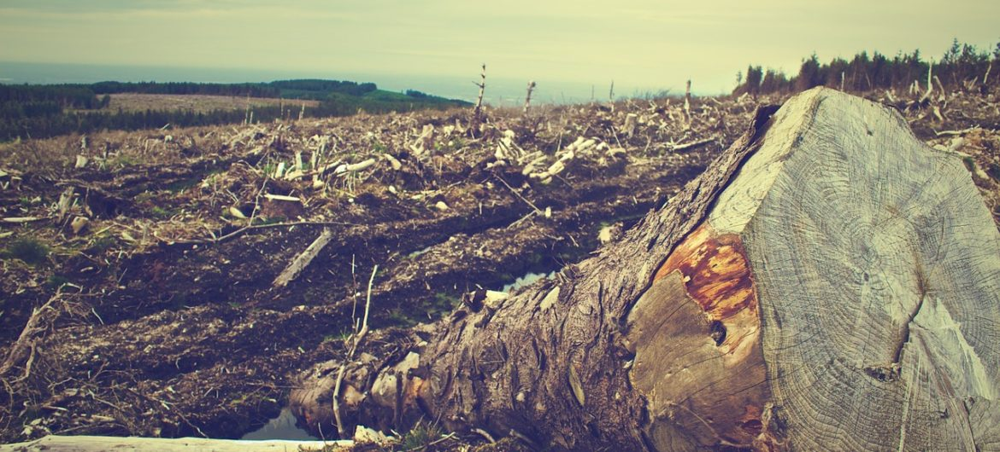

# Một thảm hoạ đang diễn ra hàng ngày

> <i>**Khai thác quá mức**. Ảnh: Selva</i>

Khi đọc báo phát hành buổi sáng, bạn thật khó tránh khỏi đắm chìm trong suy nghĩ tiêu cực như vậy. Chúng ta rõ ràng đang sống trong những thời kì khó khăn. Các tin xấu nối tiếp nhau: **khủng hoảng tài chính** (*financial crises*), **khủng hoảng đói nghèo** (*hunger crises*), hàng ngàn người chết ở Địa Trung Hải [khi vượt biên], biến đổi khí hậu và thiên tai, việc làm không ổn định và cắt giảm các dịch vụ xã hội, và sự trỗi dậy của các lực lượng phản động và cánh hữu ở Âu châu và Hoa Kì. Đồng thời, chúng ta đang chứng kiến bất bình đẳng tăng trưởng và chia rẽ ngày càng gia tăng trong xã hội. Mặc dù nền kinh tế toàn cầu đã tăng trưởng nhanh chóng trong những thập niên vừa qua, 766 triệu người vẫn sống trong cảnh **nghèo đói cùng cực** (*extreme porverty*). 

!!! quote ""

    **Trong khi vào năm 2010, sở hữu của 388 người nhiều bằng số tài sản của một nửa dân số toàn cầu nghèo nhất, thì đến năm 2017, con số này đã giảm xuống chỉ còn tám người.**

Những tin xấu xuất hiện như mưa dường như chẳng liên quan gì với nhau. Do đó bài viết này nhằm làm nổi bật và phân tích các mối liên hệ trong một tập hợp đa dạng những quan ngại và xu hướng đáng báo động. Hơn nữa, chúng ta muốn tìm hiểu xem mình có thể làm gì để chống lại những diễn biến đáng lo ngại này. Chúng ta cần gây áp lực ở đâu để đạt được cuộc sống tốt đẹp cho tất cả mọi người thay vì một cuốc sống tốt hơn chỉ dành cho một số ít? Và tại sao công cuộc đấu tranh chuyển hoá xã hội-sinh thái hướng tới một tương lai công bằng và bền vững gian lại tỏ ra gian nan đến vậy?

## Một cuốc sống đánh đổi bằng sự hi sinh của người khác

Sự trỗi dậy của các phong trào và đảng phái cánh hữu cho thấy nhiều công dân thuộc tất cả các tầng lớp xã hội đã mất niềm tin nơi nền **dân chủ nghị viện** (*parliamentary democracy*). Các **nhà dân tuý** (*populist*) cánh hữu trên toàn cầu đã lợi dụng nỗi hãi bị bỏ lại phía sau của người dân và kích động cảm giác bất an. Những biện pháp giản đơn cho các vấn đề phức tạp đang ngày càng nhận được nhiều sự quan tâm. Sự phục hưng của **chủ nghĩa dân tộc** (*nationalist*), việc kiểm soát biên giới nghiêm ngặt hơn và sự trục xuất người nhập cư nhanh chóng hơn được cho là sẽ mang lại an ninh và thịnh vượng.

Tuy nhiên, các biện pháp giản đơn này không tương xướng với sự phức tạp của vấn đề đặt ra. Nhưng một số lời giải thích được đưa ra từ bên cánh tả, những người thường chỉ đổ lỗi cho các nghiệp đoàn, ngân hàng và nhóm chóp bu “1%”, lại quá đơn giản. Thay vào đó, chúng ta cần phân tích kĩ lưỡng xem các mối quan tâm đa dạng này có chia sẻ nguyên nhân chung nào hay không và làm rõ những cấu trúc nào đã cung cấp nền tảng cho những bất công của hệ thống hiện tại. Phân tích của chúng tôi đã cho phép xác định được một nguyên nhân cấu trúc mang tính gốc rễ của những khủng hoảng liên thông và đa dạng: **lối sống đế quốc** (*imperial mode of living*). Theo Brand và Wissen, nói “đế quốc” bởi lối sống này bành trướng không ngừng, đàn áp tất cả các lối sống khác, khai thác kiệt quệ thiên nhiên và lao động con người, từ đó gây ra bất bình đẳng về cơ hội cũng như khả năng tiếp cận các nguồn tài nguyên thiên nhiên. Chúng ta đã chọn phương thức sinh sống ấy do hệ thống này đã hoàn toàn thấm nhuần vào đời sống thường nhật. Nó là một sợi chỉ chung xâu chuỗi các qui trình sản xuất, luật pháp, cơ sở hạ tầng, qui tắc ứng xử và cả trong các mô thức tư duy. Chúng ta mong đợi các siêu thị bán những trái cây ngoại nhập từ mùa xuân đến mùa đông và trên thực tế có thể nhận được bất kì sản phẩm nào được giao đến tận của nhà chỉ bằng một cú nhấn chuột nhờ có Amazon, Zalando, Foodora và các trang web khác. Chúng ta không cần phải lo nghĩ về nơi chốn sản xuất của các sản phẩm hay cách thức chúng được sản xuất. Chúng ta mong đợi một loại tiền tệ ổn định và thanh toán dễ dàng. Nhiều quốc gia và khu vực chỉ có thể duy trì điều kiện như vậy bằng cách thực thi những chính sách thắt lưng buộc bụng gắt gao do Ngân hàng Thế giới (*World Bank*) và quĩ tiền tệ quốc tế (IMF, International Monetary Fund) đặt ra. Chúng ta khó có thể mường tượng cuộc sống của mình thiếu điện thoại thông minh cho dù sản phẩm này thường được sản xuất tại những nơi lan tràn sự bóc lột và đàn áp của nhà nước. Chúng ta cũng mong đợi rằng ai đó sẽ chăm sóc những người thân lớn tuổi của mình. Tuy nhiên, công việc chăm sóc hầu như được thực hiện bởi người lao động nhập cư làm việc trong những điều kiện đáng sợ. Những người có cơ hội tiếp tục nhận được bằng cấp trong quá trình học tập suốt đời cho phép họ tích cực tham gia vào **xã hội định hướng nghề nghiệp** (*career-oriented society*) của chúng ta; họ hiếm khi đặt câu hỏi về nền tẳng cấu trúc xã hội. Những đặc tính cố hữu này trong cuộc sống thường nhật, là một phần của hệ thống kinh tế toàn cầu đã sản sinh ra sự bất công và tổn hại sinh thái. Nó dựa trên sự bóc lột thường xuyên: của con người đối với nhau cũng như của con người đối với tự nhiên.

## Lối sống đế quốc...

***... dựa trên dự phân phối tài nguyên không công bằng***

Người dân ở **miền Bắc** (**Global North**), những người sống trong các quốc gia công nghiệp hoá mạnh về kinh tế, tiêu thụ một phần lớn không cân xứng các tài nguyên toàn cầu.[^1] Phần còn lại của dân số thế giới chỉ tiếp cận được đất, nước, thực phẩm và nhiên liệu hoá thạch một cách hạn chế. Nhưng ngay trong lòng các xã hội, cả ở **miền Bắc** và **miền Nam**, chính mức tiêu thụ cao của người giàu và phần lớn tài nguyên kéo theo làm tăng **dấu chân sinh thái** của quốc gia họ, trong khi người dân nằm trong các nhóm thu nhập thấp đóng góp một phần nhỏ hơn nhiều. Vì thế chúng ta đang đề cập đến **tầng tiêu thụ xuyên quốc gia** (*transnational consumer class*), ví như một tầng lớp thượng lưu và trung lưu toàn cầu đã tiêu thụ quá chừng tài nguyên cũng bao gồm ngày càng đông những người ở **miền Nam**.

[^1]:

    Theo đó, cách phân chia **miền Bắc** và **miền Nam** không nhất thiết mang ý nghĩa địa lí, mà nhấn mạnh vào tính bất bình đẳng về tình trạng kinh tế, thu nhập, địa lí, lịch sử, v.v.

***...dựa vào việc làm vô nhân đạo***

Lối sống đế quốc của tầng lớp những người tiêu dùng này đã trực tiếp liên hệ tới lối sản xuất đế quốc và quan hệ lao động bị bóc lột. Những sản phẩm giá siêu rẻ không chỉ là do gia tăng hiệu suất công nghệ, mà chủ yếu là kết quả của sự mất cân bằng toàn cần và công việc nặng nhọc, được trả lương bèo bọt và bấp bênh. Ví dụ, những điều kiện khắc nghiệt này cũng phải hứng chịu bởi người lao động của Đức làm việc trong lò mổ hay nhà hàng. Ở Thổ Nhĩ Kì và Bangladesh, có những trường hợp toàn bộ hầm mỏ khai khác và nhà máy sụp đổ trong khi công nhận vẫn còn ở bên trong. Các tiêu chuẩn xã hội và môi trường thấp ở nhiều nơi đảm bảo việc hàng hoá tiêu dùng có giá phải chăng với tầng lớp trung lưu và thượng lưu đang ngày càng gia tăng trên toàn cầu. Công việc tương tự trả ít tiền hơn nhiều ở **miền Nam** so với **miền Bắc**. Người dân ở **miền Bắc** vì thế có cơ hội sử dụng số giờ làm việc nhiều hơn đáng kể&mdash;bằng hình thức [tiêu thụ] hàng hoá đã được sản xuất&mdash;so với người dân ở **miền Nam**: làm việc một giờ ở **miền Bắc** cho phép tôi mua một sản phẩm sẽ đòi hỏi tôi phải làm việc nhiều giờ hơn đáng kể ở **miền Nam**. Những công dân ở châu Âu và Bắc Mĩ từ đó điều hành được cả thế giới, và điều này cũng đúng khi nói về du lịch (như việc xin visa). Ngược lại, người dân ở **miền Nam** thường bị quây lại bởi các hàng rào biên giới (xem phần “Tự do di chuyển”).

!!! info "Bảng thông tin: Tổng quan lối sống đế quốc"

    Giả thiết của chúng tôi là một trong những nguyên nhân gốc rễ của các vấn đề hiện tại của chúng ta là sự bành trướng của mô hình kinh tế trọng tăng trưởng và lợi nhuận trên toàn cầu. Tuy nhiên, hệ thống kinh tế toàn cầu này không phải là một cấu trúc tách biệt, độc lập, tồn tại “ngoài kia”, nó gắn liền với đời sống con người.

    Lối sống đế quốc này được xây dựng trên lí tưởng về một đời sống hiện đại và thoải mái dựa trên sự sẵn có lâu dài của hàng hoá tiêu dùng. Để biến giấc mơ này thành hiện thực, con người trên thế giới cần phải làm việc chăm chỉ, khai thác tài nguyên thiên nhiên và giết động vật&mdash;và họ phải làm việc này trên một qui mô đẩy trái đất đến giới hạn sinh học và xã hội của nó. Các hệ quả đều được chuyển ra bên ngoài: đến các nước **miền Nam**, đến các thế hệ tương lai và các nhóm bên lề trong xã hội ở mọi nơi khác.

    Tuy nhiên, khát vọng và việc thực hiện lối sống này đang lan toả từ **miền Bắc** đến những phần rộng lớn hơn trên thế giới, cùng với các vấn đề cố hữu về sinh thái và bất công xã hội. Chúng ta xem lối sống đế quốc như một tiêu chuẩn. Nó được sinh ra từ các “khái niệm và ý tưởng” thâm căn cố đế về những gì đáng được khát khao (như việc “tăng trưởng” trở thành một mục tiêu cá nhân và chính sách kinh tế), từ cơ sở hạ tầng vật lí và vật chất (đường cao tốc, các nhà máy nhiệt điện) và các thể chế chính trị (Ngân hàng Trung Ương Châu Câu, Quĩ Tiền tệ Quốc tế hay các hiệp định tự do thương mại). Rõ ràng có nhiều yếu tố đã tham gia vào đây, đó chính là lí do chúng tôi gọi hiện tượng này là lối sống đế quốc (mà không phải là một thói quen tiêu thụ cá nhân hay các mối liên hệ tổng quát của sản suất).

    Sự đa tầng và đồng thuận ngấm ngầm nhưng chủ động của nhiều người củng cố lối sống đế quốc. Điều này tạo ra các biện phát sai lầm cho các vấn đề thực tế như biến đổi khí hậu (một ví dụ đó là sự gia tăng hiệu năng công nghệ; xem Hộp thông tin **Nền kinh tế Xanh**). Tuy nhiên, có nhiều tương tự các cách tiếp cận để hiện thực hoá công cuộc chuyển dịch sinh thái&ndash;xã hội. Con người ở khắp nơi làm chính trị trong đời sống hàng ngày bằng cách từ bỏ các thói quen tiêu thụ và đoàn kết trong các sáng kiến, công đoàn và hiệp hội để đấu tranh, làm dân chủ hoá các thể chế và các phương thức sản xuất.

!!! question "Các ý chính"

    Khái niệm lối sống đế quốc tạo ra một liên hệ giữa cá nhân, nền kinh tế và các vấn đề toàn cầu

    Lối sống đế quốc là đế quốc vì nó cho phép các nhóm nhất định sở hữu một phần mất cân xứng lao động của con người và của sinh quyển ở cấp độ toàn cầu cũng như đẩy hậu quả cho người khác gánh chịu.

    Lối sống đế quốc đang gia tăng trên toàn cầu.

    Sự đồng thuận của nhà nước, hệ thống kinh tế và xã hội củng cố lối sống đế quốc.

    Một sự chuyển dịch sinh thái&ndash;xã hội cần phải giải quyết lối sống đế quốc ở tất cả các cấp.

***...khai thác thiên nhiên***

Việc khai thác quá mức tài nguyên thiên nhiên góp phần vào sự bất công qua cách chúng ta đối xử với thế giới tự nhiên, tương tự như những gì chúng ta đã đối xử với đồng loại. “Thiên nhiên” có một giá trị nội tại và không chỉ đơn thuần là tài nguyên đáp ứng nhu cầu con người hay bể chứa rác thải. Lối sống và lối sản xuất của chúng ta, dựa trên tăng trưởng kinh tế vô hạn, rõ ràng không khả thi trên một hành tinh hữu hạn. Tốc độ tuyệt chủng đang ở mức khoảng 1000 lần cao hơn so với thời kì trước khi có sự can thiệp của con người, và số lượng các loài diệt vong đang ngày càng tăng. Từ năm 2000, một khu rừng mưa nhiệt đới có diện tích bằng nước Đức đã bị đốn hạ cứ sau 5 năm. Nhiều ước tính dự đoán vào năm 2050, khoảng 1 tỉ người có thể phải di dời do hậu quả trực tiếp của biến đổi khí hậu. Theo quan điểm lịch sử, biến đổi khí hậu do con người gây ra là sản phẩm của lối sống và phương thức sản xuất đế quốc của **miền Bắc**, một thực tế chúng ta sẽ xem xét kĩ hơn trong phần tiếp theo về tổng quan về lịch sử. Cách thức di chuyển trong các xã hội [ngày nay] tập trung chủ yếu vào xe hơi, mỗi hộ gia đình đều sử dụng các thiết bị tiêu tốn điện năng, và các ngành công nghiệp ngốn tài nguyên, như ngành sản xuất thép và ngành hàng không, đều được trợ cấp mạnh mẽ&mdash;tất cả những điều này đóng góp đáng kể vào hiện tượng nóng lên toàn cầu. Một phần đáng kể phát thải do các hoạt động này gây ra không còn được quy cho **miền Bắc**. Điều này chỉ ra không những lối sống đế quốc đang bành trướng, mà việc sản xuất hàng hoá giờ được thuê ngoài gia công ở các nước **miền Nam**, [hiện tượng này còn gọi là] **chuyển dịch phát thải** (*virtual emissions*).

***...và phân hoá xã hội***

Một số người bị ảnh hưởng không tương xứng bởi sự bất công này. Những người có ít tiền hay bị phân biệt đối xử dựa trên giới tính hay chủng tộc chịu gánh chịu nhiều hệ quả hơn từ điều kiện làm việc bất công, môi trường suy thoái và biến đổi khí hậu. Ở đây, đường phân chia không chỉ nằm giữa **miền Bắc** và **miền Nam** bị bóc lột: nó còn nằm ở trong chính các xã hội. Có những người trong các xã hội **miền Nam** cũng hưởng lợi nhiều từ toàn cầu hoá tương tự những người có địa vị thấp [trong xã hội] **miền Nam**. Nghèo đói và bất hạnh gây ra bởi áp lực phải lao động, các đòi hỏi di chuyển liên tục, hay ô nhiễm bụi mịn không phải là trường hợp hiếm gặp.

## Lối sống đế quốc thâm nhập vào bản chất đời sống chúng ta

Lối sống đế quốc không chỉ dừng lại ở ngưỡng cửa, nó lên đến đỉnh điểm trong khao khát liên tục tối ưu hoá chính mình của con người. Điều này không chỉ đúng với sự nghiệp của mọi người&mdash;kiếm nhiều tiền hơn và thăng tiến&mdash;mà còn trong việc nâng cao hiệu quả trong công việc và lúc rảnh rỗi như một mục đích tự thân. Niềm tin phổ biến rằng trách nhiệm hoàn toàn thuộc về cá nhân, chứ không phải là doanh nghiệp hay nhà nước, đã thúc đẩy xu hướng này. Ví dụ, những hình thức kinh doanh bất công có thể bị đổ lỗi cho các lựa chọn phi đạo đức của các cá nhân đưa ra khi họ đi mua sắm. Người ta không đau ốm vì mắc các bệnh nghề nghiệp (hay đơn giản là không may), mà là lỗi của chính họ bởi thứ thực phẩm họ ăn không đủ dưỡng chất, hay bởi họ không thiền hay không vận động đủ nhiều (để lấy lại sức sau giờ làm việc).

## Lối sống đề quốc là một nỗ lực giải thích

Khái niệm “lối sống đế quốc” có thể giúp giải thích tại sao, trong hoàn cảnh bất công gia tăng, các giải pháp thay thế tiến bộ khác cho đến này vẫn chưa thành công. Nó cố gắng lí giải tại sao sự **“chuyển đổi xã-hội sinh”** (*socio-ecological transformation*)&mdash;như một thay đổi nền tảng trong xã hội và kinh tế để đạt được cuộc sống tốt đẹp cho tất cả mọi người và các thế hệ tương lai&mdash;đang bị chặn lại. Khái niềm này được đặt gia vài năm trước bởi hai nhà xã hội học Markus Wissen và Ulrich Brand. Bài viết này nỗ lực minh họa xem khái niệm này ứng dụng vào các lĩnh vực khác nhau của đời sống thường nhật như thế nào: thực phẩm và giao thông, hệ thống giáo dục, tài chính các nhân, chăm sóc sức khoẻ, và thế giới số. Chúng tôi hỏi rằng lối sống đế quốc biểu hiện ra sao trong những lĩnh vực ấy và cố gắng xác định những yếu tố khiến nó ổn định là gì.

!!! info "Giấc mơ về một nền kinh tế xanh"

    **Nền kinh tế xanh** (*green economy*)hay **tăng trưởng xanh** (*green growth*) gợi ý rằng chúng ta chỉ cần làm “xanh” nền kinh tế là có thể giải quyết được các vấn đề môi trường; việc cắt giảm mức tiêu dùng là không cần thiết. Những người ủng hộ cách tiếp cận này thực chất đang ủng hộ cho chiều ngược lại, tuyên bố rằng điều này thúc đẩy tăng trưởng kinh tế. Để phá vỡ liên hệ giữa tăng trưởng kinh tế và tiêu thụ tài nguyên thiên nhiên, ngành công nghiệp dựa trên nhiên liệu hoá thạch của chúng ta cần phải được thay thế bởi các dạng sản xuất dựa trên nhiên liệu sinh học. Xăng sẽ bị thay thế bởi dầu sinh học (*agrofuel*) (xem Hộp thông tin về **Dầu sinh học**), than được thay thế bởi thuỷ điện, v.v. Các công cụ thị trường như mua bán phát thải là một yếu tốt cốt lõi trong khái niệm này (xem Hộp thông tin về **Mua bán khí thải và bù đắp**). Hơn nữa, các giải pháp dựa trên công nghẹ gây tranh cãi như **địa kĩ thuật** (*geoengineering*) và **thu giữ các-bon** (*carbon capture and storage*) sẽ “trung hoà” lượng phát thải không thể tránh khỏi. Nền kinh tế xanh được hỗ trợ bởi một liên minh quyền lực ác tổ chức như OECD (Tổ chức hợp tác và phát triển kinh tế), UNEP (Chương trình Môi trường Liên Hiệp Quốc), và Ngân hàng Thế giới, một số các tổ chức lớn về môi trường, các đảng xanh, cùng với nhiều tập đoàn và ngân hàng. Bằng cách đảm nhận vai trò “những nhà tiên phong trong công cuộc làm xanh nền kinh tế”, các doanh nghiệp ngày hi vọng sẽ gia tăng các cơ hội cạnh tranh của mình.

    Tuy nhiên, khó có thể thực hiện được nền kinh tế xanh như thế. Sự gia tăng hiệu năng cần thiết vượt xa khả năng và chúng ta khó có thể chứng kiến sự tiến bộ công nghệ nhanh chóng như vậy. Giả định về phi vật chất hoá, như tập trung vào một ngành dịch vụ nào đó được cho là không phát thải, đã lờ đi sự phụ thuộc của lĩnh vực này vào các nền tảng cơ sở hạ tầng vật lí và đòi hỏi về năng lượng. Dù sao đi nữa, những cải tiến về hiệu năng sẽ—theo lí quyết kinh tế học chủ đạo (kinh tế học tân cổ điển, *neoclassical*)—không chỉ làm giảm khí thải mà còn làm tăng mức tiêu thụ do giá sản phẩm thấp hơn (xem **hiệu ứng phục hồi**, *rebound effect* trong **Bảng thuật ngữ**).

## Thay đổi tầm nhìn?

Toàn cầu hoá theo định hướng lợi nhuận (*profit-oriented globalisation*) được thể hiện và duy trì trong đời sống thường nhật, trong công việc, thói quen tiêu dùng và trong các hoạt động cũng như cách tư duy“bình thường” của chúng ta. Chỉ khi nhận thức được vấn đề và nguyên nhân của chúng, chúng ta mới có thể thực hiện thay đổi thực sự. Đối với nhiều người cả ở **miền Bắc** và **miền Nam**, nhận thức của họ về những vấn đề trên ngày càng gia tăng. Tuy nhiên, chính những người ở tầng lớp có thu nhập cao và trình độ học vấn tốt nhất lại đóng góp nhiều nhất vào sự tàn phá sinh quyển và bóc lột con người. Mặc dù nhiều người trong nhóm này thường mua các sản phẩm thân thiện môi trường, mức thu nhập cao của họ đồng nghĩa với mức tiêu dùng của họ cũng cao hơn mức trung bình.

Chúng ta đang chứng kiến một sự gia tăng các thứ gọi là “giải pháp” dựa trên tiêu dùng. Một ví dụ là sự gia tăng đều đặn thị phần của các sản phẩm **thương mại công bằng** (*fair trade*). Hay khi người ta trả tiền bù đắp khí thải CO~2~ gây ra bởi các chuyến bay cũng như các chuyến xe buýt hay xe hơi của họ. Chỉ với vài Euro, công ty Atmosfair đã đề xuất các chuyến bay “trung hoà CO~2~”. Các nhà phát triển Fairphone nỗ lực sản xuất ra chiếc điện thoại “công bằng nhất có thể”, có nghĩa là tìm cách tránh càng xa càng tốt việc sử dụng các nguồn tài nguyên từ những khu vực khủng hoảng và không bóc lột nhân viên.

Tuy nhiên, những cách tiếp cận mà các giải pháp này dựa trên thường tập trung trong phạm vi hẹp vào lĩnh vực tiêu dùng và tầm ảnh hưởng của chúng bị hạn chế. Giờ đây người ta có thể quyết định mình sẽ mua một tách cà-phê được sản xuất từ những hoạt động bóc lột nhân công hay không, trong khi hoạt động bóc lột vẫn diễn ra như một thường lệ. Trong nhiều trường hợp, các giải pháp được đề xuất chỉ đơn giản tượng trưng cho các hình thức **tẩy xanh** (*greenwash*), như trong trường hợp chi trả bù đắp CO~2~ (xem thêm trong mục “Mua bán phát thải và bù đắp”). Ví dụ về một giả pháp giả tạo là nỗ lực của các nước phương Tây trong việc khắc phục các thiệt hại gây ra bởi chính sách nông nghiệp của chính họ bằng cách cung cấp viện trợ phát triển, như cứu trợ lương thực chẳng hạn. Chiến lược chính trị đằng sau tăng trưởng xanh (xem mục **Nền kinh tế xanh**) cũng có mục đích giảm thiểu tác động của hệ thống kinh tế mà không chịu thay đổi một nền tảng của bản thân hệ thống này. Các cơ cấu căn bản dọn đường hay khuyến khích sự bất công vẫn còn nguyên. Theo đó trong nhiều trường hợp, chính phủ và các tổ chức quốc tế chỉ đơn thuần điều trị triệu chứng hơn là nguyên nhân thực sự. Những chiến lược này đảm đảm bức màn che không bị vén lên và chúng ta cảm thấy an toàn. Sau cùng, một vài giải phát vẫn đang được tiến hành.

Có một sự mâu thuẫn rõ rệt giữa nhận thức ngày càng tăng về sự tồn tại của vấn đề và qui mô ngày càng tăng của chúng. Chúng ta ngờ ngợ rằng biến đổi khí hậu có thể đưa ra những thách thức nghiêm trọng và rằng những điều kiện bất công trong sản xuất khó có thể kéo dài&mdash;rằng cách thức sản xuất của chúng ta hiện nay đang có vấn đề. Tuy nhiên, nhận thức này không đưa đến cải cách chính sách mới hay những nỗ lực giảm thiểu hoặc thay đổi căn bản mức sống của chúng ta.

Vấn đề còn trở nên trầm trọng hơn với sự thành công của các quan điểm dẫn dắt (*narrative*) tuy đơn giản mà sai lầm và các dự án của bên cánh tả, cùng với đó là sự trỗi dậy của các lực lượng dân tuý cánh hữu. Có một giải thích cho rằng nhiều người nhận thức được các vấn đề mà chúng ta đang đối mặt cũng như cảm nhận được một mức độ không chắc chắn nhất định. Như một phần trong lối thuyết phụ của chủ nghĩa dân tộc tuý, những người theo đường lối dân tuý sử dụng khủng hoảng để khuyến khích chủ nghĩa biệt lập và củng cố lối sống đế quốc cho đất nước của chính mình. Các đảng phải chính thống ngày càng phản ứng lại bầu không khí xã hội ấy bằng cách gia tăng với xu hướng biệt lập. Trong lúc các đảng chính thức, liên minh và hiệp hội các ngành nói về sự thay đổi và bền vững, chính sách của họ lại được đặc trưng bởi sự tiếp diễn việc củng cố và leo thang các vấn đề sinh thái&ndash;xã hội. Sự thật này đã được phản ánh, như trong ví dụ về các biệt pháp thắt lưng buộc bụng mà EU áp đặt lên Hi Lạp (Xem chương Tiền và Tài chính).

Những dự án chuyển đổi sâu sắc và toàn diện hướng đến những biến chuyển xã hội và sinh thái công bằng cho đến này chưa giành được sự quan tâm của mọi người. Có một lí do: chúng thường sử dụng ngôn ngữ phức tạp và khó hiểu. Hơn nữa, chúng thường mơ hồ mặc dù phức tạp hơn nhiều những giải pháp giản đơn đưa ra bởi phe cánh hữu. Từ đó người ta không chắc chắn về việc làm cách nào chuyển đổi sinh thái&ndash;xã hội sẽ thay đổi đời sống của mình. Một sự chuyển biến nơi cấu trúc sản xuất và lối sống cũng có vẻ chưa cho thấy rõ ràng nó sẽ thành công trong thực tiễn ở cấp độ địa phương, khu vực và trên toàn thế giới.

Ấn phẩm này nhằm mục đích đề xuất một phân tích chi tiết hơn về lí do tại sao hầu như chẳng có gì đang thay đổi cũng như khám phá xem những cơ cấu và thành phần liên quan nào trong những khía cạnh nhất định của đời sống đã chắn ngang quá trình chuyển đổi hướng đến một xã hội dựa trên tinh thần đoàn kết. Tìm ra những câu trả lời cho câu hỏi nà là một bước đi cần thiết đầu tiên để vượt qua sự bất công. Từ đó chúng tôi sẽ cho thấy trong các phần sau bằng cách nào một sự chuyển đổi sinh thái&ndash;xã hội có thể được thúc đẩy. 

## Cách tiếp cận của chúng tôi: Tổng quan về ấn phẩm

Chương tiếp theo cũng cấp một tổng quan lịch sử về tình trạng hiện tại. Chúng tôi sẽ cho thấy cách hình thành lối sống đế quốc thông qua diễn biến kinh tế đa dạng và phát triển xã hội đã diễn từ thế kỉ 16 đến nay, cách thức chúng lan toả và tạo dựng chỗ đứng. Dựa trên sáu lĩnh vực có chủ đề, chúng tôi phân tích xem lối sống đế quốc đã lan tràn trong các phạm trù đời sống như thế nào và chỉ ra những cách thức nhân công lao động và môi trường đã bị khai thác trong các lĩnh vực ấy. Hơn nữa, chúng ta sẽ khám phá các bên liên quan và điều kiện giữ cho chúng ổn định.

Gần như tất cả chúng ta đều sở hữu một điện thoại di động và tham gia tích cực vào thế giới số. Chương ba về Số hoá sẽ tập trung vào cách thức tài nguyên từ các khu vực diễn ra xung đột và các quan hệ kinh tế theo kiểu thực dân mới cho phép chúng ta mua và sử dụng điện thoại thông minh; hay cách cuộc sống chúng ta trở ngày càng bị số hoá cũng như các hệ quả nó gây ra cho cơ cấu xã hội và nền kinh tế của chúng ta. Công việc chăm sóc sức khoẻ được thực hiện bởi những người chăm sóc cho người khác là nền tảng và làm sinh sôi cuộc sống của chúng ta. Sự tổ chức hiện nay việc chăm sóc trong các xã hội khiến ai phải trả giá và các bên liên quan nào đã giúp duy trì hệ thống này, là trọng tâm của **Chương 4**. Để duy trì đời sống, chúng ta cần tiền. Tiền và các tiêu chuẩn rõ ràng của nên kinh tế tài chính và tiền tệ liên hệ chúng ta như thế nào với bất công, việc mắc nợ, và bóc lột trên toàn cầu, đó là chủ đề của **Chương 5**. Chúng ta đều đã tận hưởng một mức độ giáo dục nào đó và đã hấp thụ tri thức. **Chương 6** phân tích bằng cách nào nền giáo dục đã khắc sâu lối sống đế quốc này vào mỗi chúng ta, đàn áp các dạng tri thức khác và việc sản sinh tri thức của phương Tây dẫn đến sự khai thác tài nguyên và các mặt nhận thức khác. Thực phẩm chúng ta ăn ảnh hưởng nặng nề đến con người và hệ thống sinh thái ở nơi khác. **Chương 7** làm nổi bật mối liên hệ tồn tại giữa **thực phẩm** chúng ta ăn và nạn đói toàn cầu, nền nông nghiệp gây phá huỷ khí hậu và quyền lực thị trường của các nghiệp đoàn thực phẩm. Một điều kiện tiên quyết quan trọng nữa của lối sống và lối sản xuất thực dân là **tính linh động** (*mobility*) của con người&mdash;tính bằng số km di chuyển trong các kì nghỉ hay quãng đường vận chuyển của chiếc áo phông trong tủ quần áo của chúng ta. Tác động và những mâu thuẫn của hệ thống vận tải dựa trên dầu mỏ đang gia tăng này là trọng tâm của **Chương 8**.

Những phạm trù đời sống hàng ngày là những ví dụ chọn lọc tiêu biểu cho nhưng hiện thực chủ yếu của một bộ phận lớn tầng lớp trung lưu và thượng lưu toàn cầu. Chúng cho phép chung ta trưng bày sống động cách lối sống đế quốc diễn ra trong các hoạt đồng thường nhật. Hơn nữa, phân tích của chúng tôi khám phá vì sao chẳng có gì đang thay đổi và phân vân những tư tưởng, chính sách, hạ tầng cơ sở cụ thể nào đang củng cố và làm ổn định hệ thống hiện tại. **Chương 9** cung cấp một toàn cảnh về các kết quả của phân tích phía trước và tìm hiểu các chiến lược hay điểm đòn bẩy có thể khắc phục lối sống đế quốc này. Mặc dù các giải pháp thay thế cho lối sống đế quốc đòi hỏi những chuyển dịch qui mô lớn về các phương thức sản xuất và đời sống hàng ngày, chúng không nhất thiết ám chỉ việc tổn thất chất lượng cuộc sống. Ngược lại: những hình thái sinh sống, làm việc, chăm sóc, doanh thương và chung sống dựa trên cộng đồng và cộng tác là khả dĩ và đã tồn tại. Chúng ta có thể mở rộng chúng, tạo ra các mạng lưới và biến chúng từ một ngoại lệ thành thường lệ.

**Tác giả: ILA Kollektiv**. [Tập thể I.L.A.](https://www.ilakollektiv.org/) là nơi quy tụ các nhà khoa học trẻ và nhà hoạt động xã hội nghiên cứu ở Đức về vấn đề lối sống đế quốc cùng những giải pháp thay thế mang tính đoàn kết. Mục tiêu chung: Cuộc sống tốt đẹp cho tất cả mọi người!

[At the Expense of Others](https://www.rosalux.de/en/publication/id/42603/at-the-expense-of-others)

