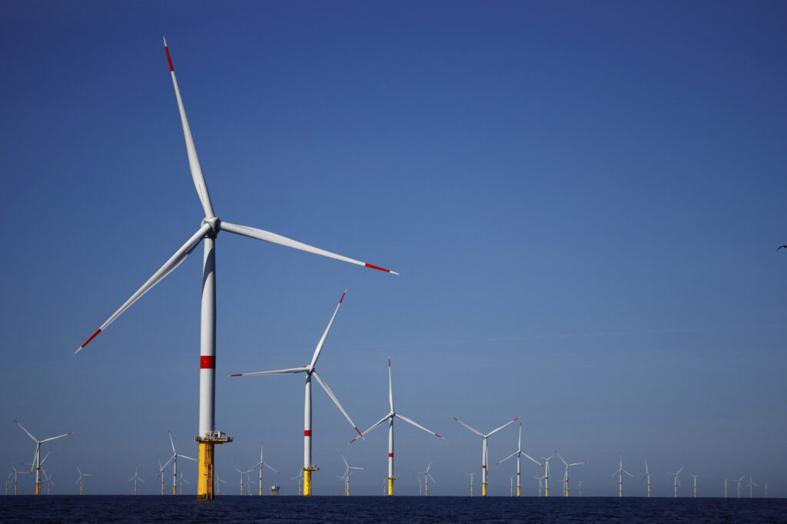
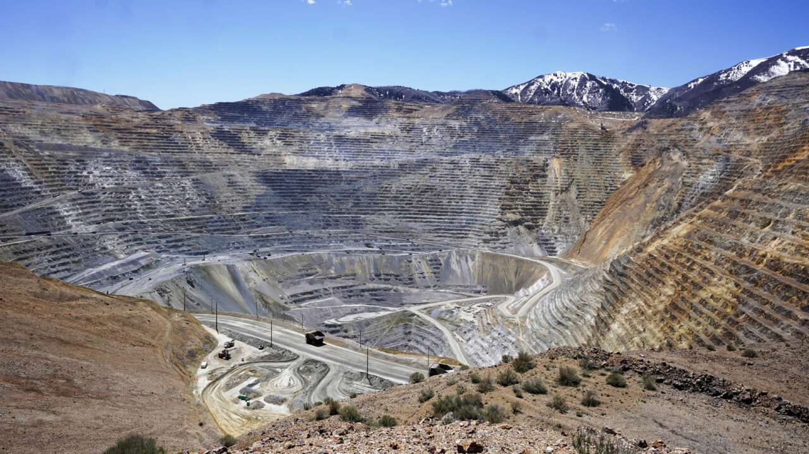
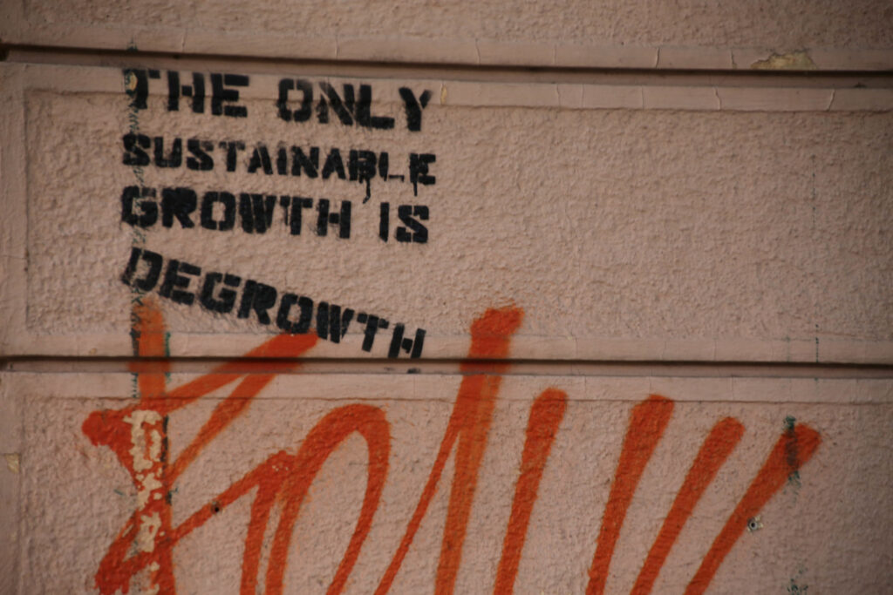

# Ảo tưởng về tăng trưởng xanh (*Green Growth*)

!!! quote "Lời dẫn"

    Những người ủng hộ **“Tăng trưởng xanh”** hứa hẹn một quá trình chuyển đổi dễ dàng sang một tương lai hậu các-bon. Nhưng nếu giới hạn của năng lượng tái tạo đòi hỏi phải hy sinh lối sống chuộng tiêu thụ thì sao?

??? note "Các tấm pin năng lượng mặt trời" 
    
    ... xung quanh một cái cây ở Los Arcos, Tây Ban Nha, ngày Feb. 24, 2023. (AP Photo/Alvaro Barrientos)

## Tăng trưởng xanh?

Trong biên niên sử của nền văn minh công nghiệp, **Thỏa thuận xanh mới** (*Green New Deal*)[^1] được coi là một trong những dự án đầy tham vọng. Quy mô của nó rất lớn, hứa hẹn sẽ cải cách mọi khía cạnh về việc cung cấp năng lượng cho máy móc, thắp sáng nhà cửa và cung cấp nhiên liệu cho ô tô. Vào thời điểm cuối cùng của cuộc khủng hoảng sinh thái và khí hậu, **Thỏa thuận mới xanh** cũng là một hành động tuyệt vọng. Nền văn hóa ngốn năng lượng của chúng ta không thể tiếp tục thải ra khí các-bon mà không phá hủy các hệ thống vốn là nền tảng của bất kỳ nền văn minh tiên tiến nào, chưa kể đến chính sự sống của loài người. Phải nhanh chóng làm một điều gì đó để giảm bớt áp lực lên khí quyển trong khi vẫn cung cấp năng lượng cho cỗ máy kinh tế.

[^1]: 

    Thỏa thuận mới xanh (GND) kêu gọi chính sách công giải quyết biến đổi khí hậu cùng với việc đạt được các mục tiêu xã hội khác như tạo ra việc làm, tăng trưởng kinh tế và giảm bất bình đẳng kinh tế.

Sự đồng thuận về nhu cầu mở rộng quy mô năng lượng tái tạo hiếm khi bị làm phiền bởi một khả năng đáng lo ngại: Điều gì sẽ xảy ra nếu **xã hội công nghiệp-kỹ thuật** (*techno-industrial society*) như hiện nay&mdash;dựa trên tăng trưởng GDP ngày càng tăng, thương mại và du lịch toàn cầu cũng như chuỗi sản xuất và phân phối toàn cầu phức tạp được thiết kế để đáp ứng nhu cầu khao khát không ngừng của thế giới giàu có đối với mọi thứ lớn hơn, nhanh hơn, nhiều hơn&mdash;điều gì sẽ xảy ra nếu tất cả những quá trình này không thể hoạt động nếu thiếu nhiên liệu hóa thạch có hàm lượng năng lượng rất cao? Điều gì sẽ xảy ra nếu, bất chấp những lời hứa của những người thúc đẩy **Thỏa thuận Mới Xanh**, không thể tạo ra sự bền vững cho hệ thống hiện tại đang cung cấp thức ăn, nơi ở, hàng hóa cho hàng tỷ người?

Khả năng này không được đề cập do sự lấn át của **“tăng trưởng xanh”** (*green growth*). Đây là ý tưởng cho rằng nguyên tắc tổ chức của nền văn minh của chúng ta&mdash;sự phát triển không ngừng của các nền kinh tế và dân số&mdash;có thể được **khử cacbon** (*decarbonization*) nhanh chóng theo cách không gây gián đoạn đáng kể cho đời sống. **Tăng trưởng xanh** đưa ra lời hứa chuyển đổi trực tiếp từ nhiên liệu hóa thạch sang một **viễn cảnh thân thiện với trái đất giống như không tưởng** (*earth-friendly utopia*) mà không gặp trở ngại và không có **sự hy sinh có ý nghĩa** (*meaningful sacrifice*). Đây là chiêu **chào hàng** (*sale pitch*) được cung cấp bởi những người theo đạo **Thoả thuận Mới Xanh** như Ezra Klein, người phụ trách chuyên mục và podcast[^2] của tờ New York Times, người mang đến sự lạc quan không ngừng cho niềm tin rằng năng lượng tái tạo có thể đảm bảo hoạt động **kinh doanh như bình thường** (*business-as-usual*)[^3].

[^2]:

    Podcast là một chương trình âm thanh hay chương trình radio với một hay nhiều chủ đề cụ thể bao gồm nhiều tập được xuất bản liên tục định kì, mà bạn có thể nghe trên các ứng dụng và có thể đăng ký và tải về.

[^3]:

    Hoạt động kinh doanh như bình thường (BAU): việc thực hiện bình thường các hoạt động chức năng tiêu chuẩn trong một tổ chức, có thể tương phản với các dự án hoặc chương trình dẫn đến thay đổi (như thay đổi mục tiêu tăng trưởng, những chuyển biến căn bản trong xã hội khử các-bon đòi hỏi các chính sách quyết liệt về môi sinh, v.v.)

??? note "Tua-bin gió"

    ... ở trại phát điện gió ngoài khơi Saint-Nazaire, ngoài khơi Pháp France, ngày Sept. 22, 2022. (Stephane Mahe/Pool photo via AP)

Trong một tập podcast năm 2019 của anh có tiêu đề “Cách giải quyết biến đổi khí hậu và làm cho cuộc sống trở nên tuyệt vời hơn”, Klein than thở rằng “các cuộc trò chuyện về biến đổi khí hậu khá ảm đạm [nhưng] khử cacbon không có nghĩa là chấp nhận một tương lai kém sung túc hơn&mdash;nó có là một tương lai tuyệt vời, nhân văn hơn, phong phú hơn về công nghệ và truyền cảm hứng xã hội hơn cho tất cả chúng ta”. Vị khách của anh, Saul Griffith, nhà phát minh và người ủng hộ năng lượng sạch, đồng ý rằng “Kích thước chiêhc ôtô của bạn có thể vẫn lớn như vậy, chỉ khác là nó chạy bằng điện. **Giấc mơ Mỹ** (*The American Dream*) có thể tuyệt vời hơn bao giờ hết.”

Tầm nhìn về một Giấc mơ Mỹ lớn hơn, xanh tươi hơn này được củng cố thêm bởi những nghiên cứu của một giáo sư kỹ thuật dân dụng Stanford tên là Mark Z. Jacobson. Trong một loạt các bài báo và nghiên cứu trên các tạp chí lớn, Jacobson đã tìm cách chứng minh rằng nền kinh tế thế giới hiện giờ có thể vận hành hoàn toàn nhờ sự kết hợp của năng lượng gió, nước, mặt trời và địa nhiệt. Ông đã nhận được những lời khen ngợi và vỗ tay nồng nhiệt từ nhiều người, đặc biệt là nữ nghị sĩ Đảng Dân chủ New York Alexandria Ocasio-Cortez, người đồng tài trợ cho nghị quyết **Thỏa thuận mới xanh** năm 2019 tại Quốc hội, người đã gắn kết các đề xuất của cô ấy với **“lộ trình”** (*roadmap*) của Jacobson tiến tới một xã hội không phát thải. Trong khi đó, các thượng nghị sĩ bang New York đã đưa ra một dự luật chuyển đổi năng lượng tái tạo được xây dựng công khai “dựa trên nghiên cứu về gió, nước và mặt trời của Jacobson”. Vào năm 2016, **một người rất có uy tín** (*guru*) về hành động chống biến đổi khí hậu Bill McKibben cho biết: “Tôi bị thuyết phục bởi nghiên cứu kĩ lưỡng của Mark Jacobson và những người khác rằng [100% năng lượng tái tạo] là điều có thể”. Gần đây hơn, trong số ra tháng 3 năm 2022 của The New Yorker, McKibben đã say mê về **“tin tốt lành”** (*good news*) đang diễn ra từ Jacobson và các chuyên gia công nghệ xanh có cùng chí hướng. McKibben hứa hẹn: “Chúng ta có công nghệ cần thiết để loại bỏ nhanh chóng nhiên liệu hóa thạch”.

Ít có khả năng xuất hiện trên các trang của các tạp chí hàng đầu là những tạp chí có quan điểm hoài nghi hơn về những đảm bảo của Jacobson về việc xây dựng các xã hội không có các-bon trong vòng vài thập kỷ. Nhưng đây không phải là những tiếng nói bên lề. Khi một nhóm các nhà khoa học viết cho Kỷ yếu của Viện Hàn lâm Khoa học Quốc gia xem xét kỹ kế hoạch năng lượng mặt trời-nước-gió của Jacobson vào năm 2017, họ nhận thấy nó dựa trên “nhiều **sai sót** (*errors*), **phương pháp không phù hợp** (*inappropriate methods*) và **các giả định không hợp lý** (*implausible assumptions*)”.

Tò mò về việc liệu năng lượng tái tạo có thể **“cung cấp năng lượng cho tương lai”** (*power the future*) hay không, các giáo sư về thiết kế và kỹ thuật cơ khí và hàng không vũ trụ tại Đại học Monash ở Úc đã kết luận trong một nghiên cứu năm 2016 rằng các ước tính về tiềm năng kỹ thuật của năng lượng tái tạo xuất hiện **khắp nơi** (*all over the map*). Các học giả, Patrick Moriarty và Damon Honery, lập luận rằng “[trong phạm vi tiềm năng về kĩ thuật], các giá trị ở mức thấp hơn cần phải được xem xét nghiêm túc… sản lượng [năng lượng tái tạo] trong tương lai có thể thấp hơn nhiều so với mức sử dụng năng lượng hiện tại”.

Moriarty và Honery đã xem xét lại vấn đề về tiềm năng năng lượng tái tạo trong một báo cáo năm 2020 được công bố trên tạp chí Năng lượng, lặp lại rằng “một thế giới trong tương lai được cung cấp hoàn toàn” bởi năng lượng tái tạo có thể trở thành “một thế giới sử dụng ít năng lượng hơn”. Moriarty sau đó đã hợp tác với bảy đồng tác giả&mdash;các nhà khoa học khí hậu, chuyên gia về tính bền vững và kỹ sư&mdash;để xem xét “sự suy giảm năng lượng tiêu thụ như một kịch bản chuyển đổi **hậu các-bon** (*post-carbon*)”. Nhóm nghiên cứu đã kết luận rằng “vẫn còn những điều không chắc chắn về việc liệu năng lượng tái tạo có thể duy trì, chứ đừng nói đến việc phát triển, phạm vi và quy mô của các dịch vụ năng lượng hiện được cung cấp bởi nhiên liệu hóa thạch”. Như Moriarty và Honery đã đưa ra trong bài báo năm 2016 của họ, **“kế hoạch triển khai thận trọng”** (*prudent course*) trong một tương lai chỉ sử dụng năng lượng tái tạo “sẽ liên quan đến việc cắt giảm lớn năng lượng sử dụng… chúng ta có thể sẽ [cần] đánh giá lại tất cả các công việc tiêu thụ nhiều năng lượng, và loại bỏ những tác vụ ít hơn quan trọng”.

Chúng ta sẽ phải giảm bao nhiêu nhu cầu trong thời kỳ hậu năng lượng các-bon, nơi năng lượng tái tạo cung cấp năng lượng cho nền văn minh? “Theo phỏng đoán sơ bộ”, Moriarty nói với tôi trong một email, “Tôi sẽ nói 50% hoặc hơn”. Ông tiếp cận vấn đề với tư duy thực tế được thấm nhuần từ hàng chục năm làm kỹ sư dân dụng. 

!!! quote "Giảm năng lượng tiêu thụ"

    Nếu phải cắt giảm một nửa mức sử dụng năng lượng hiện tại để đạt được sự bền vững thực sự, thì Moriarty gợi ý rằng một khởi đầu tốt là chấm dứt giao thông vận tải và thương mại toàn cầu như chúng ta biết. Nói cách khác, ông nói, “toàn cầu hóa sẽ phải chấm dứt”.

Ted Trainer, giảng viên tại Đại học New South Wales và là người sáng lập **Viện Đơn giản** (*The Simplicity Institute*), cũng đưa ra kết luận tương tự. Ông viết: “Các giới hạn đối với năng lượng tái tạo gần như hoàn toàn bị bỏ qua như một chủ đề nghiên cứu”. Một lần khác, Trainer lưu ý rằng chủ đề này đã bị bỏ qua với sự cổ vũ nhiệt thành của “những người... có trình độ kỹ thuật cao ủng hộ năng lượng xanh và trong đảng cánh tả”. Nhận định của Ezra Kleins đại diện cho những điều mà Trainer gọi là **“niềm tin vào công nghệ”** (*tech-fix faith*), được đánh dấu bằng giả định rằng “không cần phải thay đổi... lối sống và hệ thống sử dụng nhiều năng lượng và tài nguyên hiện tại, hay từ một nền kinh tế được thúc đẩy bởi thị trường lực lượng, động cơ lợi nhuận và tăng trưởng”.

Tiếp theo là một lý thuyết huyền thoại về hệ thống và năng lượng Vaclav Smil. Là một giáo sư danh dự tại Đại học Manitoba và là tác giả của hơn 40 cuốn sách về năng lượng, môi trường và công nghiệp, Smil đã tuyên bố “những câu chuyện về sự chuyển dịch với tốc độ nhanh chóng” trong lĩnh vực năng lượng tái tạo chứa đầy những **“giải pháp ma thuật”** (*magic prescription*) đến mức chúng “giống như khoa học viễn tưởng”.

“[Đó là] sự ảo tưởng nặng nề được trộn lẫn với một vài sự thật chắc chắn”, Smil viết trong cuốn sách xuất bản năm 2022 **“Thế giới thực sự vận hành như thế nào”** (*How the World Really Works*).

Để hiểu tại sao có sự lệch lạc về tư duy như thế, cần phải xem xét kỹ cách chúng ta sử dụng lượng năng lượng vô độ của mình. Một viễn cảnh rất khác hiện ra so với nhưng điều được tìm thấy trong các bài thuyết trình về **Thỏa thuận Mới Xanh** về các dự án đường sắt cao tốc và tuabin gió.

## Thực tế nền văn minh

Điện&mdash;để chiếu sáng, sưởi ấm, làm mát, thông gió, chạy các thiết bị gia dụng và điện tử, trong số các mục đích sử dụng khác&mdash;chỉ chiếm 20% tổng nhu cầu năng lượng toàn cầu. 80% còn lại dành cho hydrocarbon (nhiên liệu hoá thạch) được đốt cháy dành cho khai thác, khoan, các ngành công nghiệp, sản xuất và vận chuyển, cả hành khách và hàng hóa. Ngay từ những phân tích đầu tiên, thực tế đơn giản này gây ra vấn đề cho những người ủng hộ **Thỏa thuận Mới Xanh** cổ vũ “điện khí hóa mọi thứ”. Theo quan sát của Smil, những người này “không đưa ra lời giải thích nào về cách của bốn trụ cột vật chất của nền văn minh hiện đại”&mdash;xi măng, thép, nhựa và amoniac&mdash;sẽ được sản xuất bằng điện tái tạo như thế nào. Với các công nghệ hiện tại và trong tương lai gần, đơn giản là người ta không thể sản xuất xi măng, thép, nhựa hoặc amoniac mà không có nhiên liệu hóa thạch. Những người có tầm nhìn xa về **tăng trưởng xanh** cũng không đưa ra được lời giải thích khả thi nào về cách thức hoạt động của ngành hàng không, vận chuyển và vận tải đường bộ&mdash;những trái tim đang hoạt động của nền kinh tế tăng trưởng toàn cầu&mdash;có thể được cung cấp năng lượng mà không đốt cháy một lượng lớn các-bon. Smil viết: “Họ chỉ khẳng định rằng có thể như vậy.

Về điểm quan trọng này, trường hợp chương trình khử cacbon của Đức&mdash;Energiewende, hay **“sự quay vòng năng lượng”** (*energy turnaround*)&mdash;là một bài học hữu ích. Mặc dù nó đã thành công trong việc mở rộng công suất năng lượng gió và mặt trời để sản xuất nhiều hơn 40% sản lượng điện, nhưng nó đã thất bại trong việc giảm đáng kể sự phụ thuộc chung của đất nước này vào nhiên liệu hóa thạch. Sự quay vòng được ca ngợi này đã giảm tỷ lệ tiêu thụ nhiên liệu hoá thạch trong việc cung cấp năng lượng cho Đức từ 84% xuống 78%, một mức giảm khá nhỏ. Bàn rộng ra, Đánh giá thống kê của BP về Năng lượng Thế giới cho chúng ta biết rằng gió và mặt trời cung cấp dưới 5% năng lượng sơ cấp toàn cầu vào năm 2022. Nếu Nhiên liệu hóa thạch cung cấp năng lượng cho nền kinh tế tăng trưởng toàn cầu trong 300 ngày; gió và mặt trời chỉ làm được điều đó trong 18 ngày.

Khi tôi gửi email cho Smil để thảo luận về kinh tế năng lượng của **Thỏa thuận Mới Xanh**, ông đã từ chối. Ông giải thích: “Chúng tôi đang đối mặt với những người, mặc dù nhận được sự giáo dục thích hợp, nhưng từ chối thừa nhận các dữ kiện vật lý [và] toán học căn bản”. “Việc không thể khử cacbon toàn cầu vào năm 2030 hoặc 2040 là điều không còn gì phải tranh luận (*beyond any reasonable dispute*)”.

## Nhu cầu năng lượng

Smil đang nói ở đây về quá trình khử cacbon cho nhu cầu năng lượng *hiện có*. Ông thừa nhận rằng có thể khử cacbon nhanh chóng, nhưng chỉ khi chúng ta giảm đáng kể nhu cầu, một lộ trình sẽ kéo theo “sự cắt giảm đáng kể mức sống ở tất cả các quốc gia giàu có”.

!!! quote "Nút thắt"

    Chừng nào chủ đề này không thể chấp nhận được về mặt chính trị trong mọi nền kinh tế lớn, chừng đó Smil còn đồng ý với học giả về tính bền vững William Rees, người đã kết luận, “Điều có thể chấp nhận được về mặt chính trị là thảm họa về mặt sinh thái trong khi điều cần thiết về mặt sinh thái là không thể về mặt chính trị.”

Rees là một trong những người kỳ cựu và hùng hồn nhất trong số những người bất đồng chính kiến với niềm tin **tăng trưởng xanh**. Trong 45 năm làm việc tại Đại học British Columbia, nơi ông chủ nhiệm Trường Quy hoạch Vùng và Cộng đồng, Rees được biết đến với công trình nghiên cứu về kinh tế học sinh thái, thấu hiểu sự gắn bó của nền kinh tế đối với các quá trình sinh-lý và không thể hiểu được khi đặt bên ngoài các quá trình đó. Đối với những người theo **Thoả thuận Mới Xanh**, Rees chỉ là một học giả một hay lên tiếng bác bỏ ý tưởng vận hành nền văn minh công nghiệp hoá với năng lượng tái tái tạo, cho rằng đó chỉ “đơn giản là một ảo tưởng chung”.

Giống như Smil, Rees thu hút sự chú ý của chúng ta đến những lo ngại nghiêm trọng về các giới hạn sinh-ly đối với **tăng trưởng xanh**. Vào năm 2021, khi viết trên tờ Energies, Rees và đồng tác giả Megan Seibert, giám đốc điều hành của **Dự án Thỏa thuận Mới Xanh THỰC SỰ** (*REAL Green New Deal Project*), một tổ chức tư vấn, đã tuyên bố tư tưởng xanh chính thống “nhìn thế giới qua một lỗ khóa hẹp mà mù mờ trước vô số vấn đề kinh tế, sinh thái và chi phí xã hội” của quá trình chuyển đổi năng lượng tái tạo.

Họ đồng ý với Smil rằng **Thoả thuận Mới Xanh** “không đưa ra giải pháp khả thi nào [để] điện khí hóa nhiều quy trình sản xuất sử dụng nhiệt độ cao liên quan đến việc xây dựng các tua-bin gió và tấm pin mặt trời công nghệ cao” (bao gồm chủ yếu là sản xuất xi măng và thép). Các dòng chất thải do năng lượng tái tạo tạo ra khi kết thúc vòng đời hoạt động của chúng “hoặc bị bỏ qua hoặc bị lờ đi, cuối cùng sẽ được xử lý bằng các quy trình tái chế còn chưa tồn tại”. Họ cáo buộc các những người cổ vũ **Thoả thuận Mới Xanh** cũng “không giải quyết được việc làm thế nào mà hàng tỷ tấn... kim loại và khoáng chất cần thiết để xây dựng các công nghệ [năng lượng tái tạo] sẽ sẵn có sử dụng liên tục”.

!!! quote "Tầm nhìn **Tăng trưởng xanh**"

    Những người có tầm nhìn xa về **tăng trưởng xanh** cũng không đưa ra được lời giải thích khả thi nào về cách thức hoạt động của ngành hàng không, vận chuyển và vận tải đường bộ - những trái tim đang đập của nền kinh tế tăng trưởng toàn cầu - được cung cấp năng lượng mà không đốt cháy một lượng lớn các-bon.

Seibert và Rees lưu ý rằng việc chuyển đổi toàn bộ nguồn cung cấp điện của Hoa Kỳ từ nguồn nhiên liệu hóa thạch vào năm 2050 sẽ đòi hỏi tốc độ xây dựng lưới điện gia tăng đáng kinh ngạc, ước tính gấp 14 lần so với tốc độ trong nửa thế kỷ qua. Điều tương tự cũng xảy ra đối với việc xây dựng nhà máy năng lượng mặt trời và gió. Để đạt được 90% quá trinh **khử các-bon** (*decarbonization*) và điện khí hóa vào năm 2035, Hoa Kỳ “sẽ phải tăng gấp bốn lần công suất xây dựng tua-bin gió hàng năm (ước tính theo năm gần đây nhất) trong 15 năm tới và tăng gấp ba lần công suất xây dựng điện mặt trời hàng năm trong 15 năm tới”&mdash;và sau đó lặp lại nỗ lực sản xuất khổng lồ này vô thời hạn, vì các tấm pin mặt trời và tua-bin gió có tuổi thọ trung bình khoảng 15 đến 30 năm.

Tất nhiên, nhiên liệu hóa thạch là cần thiết ở mọi công đoạn trong quá trình sản xuất năng lượng tái tạo.

Seibert và Rees viết: “Các công nghệ này không phải là tái tạo được. “Việc sản xuất chúng&mdash;từ khai thác đến lắp đặt&mdash;sử dụng nhiều năng lượng hóa thạch, [và] việc chế tạo chúng&mdash;đặc biệt là từ khai thác kim loại và loại bỏ chất thải&mdash;gây ra những bất công xã hội và suy thoái sinh thái nghiêm trọng.”

## Dấu chân sinh thái & Dấu chân vật liệu

Để hiểu tại sao Rees và các đồng nghiệp của ông trong lĩnh vực kinh tế sinh thái lại có quan điểm hoài nghi về vị cứu tinh công nghệ xanh, trước tiên người ta cần hiểu tầm quan trọng của việc phân tích **dấu chân sinh thái** (*ecological footprint*). Dấu chân sinh thái không chỉ giới hạn ở lượng khí thải các-bon của một quốc gia&mdash;thói quen thiển cận của các nhà hoạt động và nhà khoa học khí hậu&mdash;mà bao gồm toàn bộ các yếu tố đầu vào hỗ trợ một lối sống nhất định, ví dụ: thực phẩm, nước, đất, kim loại, khoáng sản. Điều này bao gồm các vật liệu, chất thải và khí thải có trong hàng tiêu dùng, bao gồm cả những sản phẩm được sản xuất ở nước ngoài, do đó các tác động sinh thái của quá trình sản xuất được phân bổ cho quốc gia nơi sản phẩm cuối cùng được tiêu thụ. Dấu chân sinh thái cũng bao gồm tất cả chất thải tính theo bình quân đầu người, bao gồm chất thải thực phẩm, nhựa bỏ đi, ô nhiễm hóa chất gia dụng và các hoá chất độc hại khác, và tất cả các loại nước thải dạng lỏng&mdash;chẳng hạn như tính số lít nước cần thiết để hoà tan lượng chất bài tiết của một người bình thường.

Các nhà kinh tế sinh thái cũng sử dụng một chỉ số quan trọng khác, như **dấu chân vật chất** (*material footprint*), tập trung vào việc khai thác và sử dụng vật liệu trong nền kinh tế toàn cầu. **Dấu chân vật liệu** là nguyên nhân chính dẫn đến mất đa dạng sinh học và gây nhiều áp lực khác đối với hệ sinh thái. Tại Hoa Kỳ và các quốc gia có thu nhập cao khác, **dấu chân vật chất** bình quân đầu người đã tăng gần 50% từ năm 1990 đến 2008, được thúc đẩy bởi việc theo đuổi tăng trưởng, tích lũy vốn và chủ nghĩa tiêu dùng. Ngày nay, việc sử dụng vật liệu ở các quốc gia này đã vượt quá mức bền vững gấp bốn lần.

Tất cả tác động sinh thái này sẽ bị che lấp khi chúng ta chỉ tập trung vào lượng khí thải các-bon. Vâng, chúng ta cần giảm lượng phát thải một cách nhanh chóng. Nhưng chúng ta cũng cần chú ý đến những tác động nguy hiểm không kém khác, những tác động này *hoàn toàn không được giải quyết* bởi các **Thỏa thuận Xanh Mới”.

Cụ thể hơn, chúng ta cần chú ý đến **dấu chân vật chất**.

Tiêu thụ vật chất gia tăng là một tai họa toàn cầu. Theo **Uỷ ban Tài nguyên quốc tế** (*IRP, International Resource Panel*), một cơ quan nghiên cứu do Chương trình Môi trường Liên Hợp Quốc khởi xướng vào năm 2007, thế giới không những không trở nên hiệu quả hơn trong việc sử dụng các nguồn tài nguyên, mà còn kém đi rất nhiều. IRP phát hiện ra rằng mặc dù dân số thế giới đã tăng gấp đôi trong 50 năm qua, nhưng tổng khối lượng nguyên liệu được khai thác từ hành tinh để đáp ứng nhu cầu không ngừng của sự tăng trưởng tư bản chủ nghĩa đã tăng hơn gấp ba lần trong cùng thời kỳ.

Nền kinh tế toàn cầu ngày nay đã trở nên hoang toàng và lãng phí hơn, sử dụng ngày càng nhiều nguyên liệu trên một đơn vị GDP. Hãy xem xét những xu hướng này:

— Năm 2000, trung bình phải mất 1,2 kg vật liệu để tạo ra một Đô-la Mĩ GDP toàn cầu. Năm 2010 lên 1,4 kg.

— Khai thác nguyên liệu toàn cầu hàng năm vào năm 1970 là 27 tỷ tấn. Khối lượng này là 70 tỷ tấn vào năm 2010 và 92 tỷ tấn vào năm 2017.

— Sử dụng vật liệu toàn cầu bình quân đầu người đã tăng từ 7 tấn vào năm 1970 lên 12 tấn vào năm 2015.

Theo IRP, có “áp lực môi trường ngày càng tăng trên mỗi đơn vị hoạt động kinh tế” gây ra mâu thuẫn trực tiếp với tuyên bố **tăng trưởng xanh** vì hiệu quả của thị trường và công nghệ đã hợp lý hóa việc tàn phá trái đất.

Mô hình hóa một kịch bản trong tương lai giả định hoạt động **kinh doanh như bình thường**, IRP dự đoán rằng việc khai thác nguyên liệu sẽ đạt 190 tỷ tấn vào năm 2060, cao hơn gấp đôi so với tốc độ hiện tại và mức sử dụng nguyên liệu bình quân đầu người sẽ tăng lên mức đáng kinh ngạc là 18,5 tấn. “Trong trường hợp không có hành động khẩn cấp và phối hợp với nhau”, uỷ ban này cảnh báo (theo một cách nói giảm nói tránh), “tăng trưởng nhanh chóng và sử dụng tài nguyên thiên nhiên không hiệu quả sẽ tiếp tục tạo ra áp lực không bền vững đối với môi trường”. Sự cấp bách trong việc đối phó với khí nhà kính của các tổ chức và tư duy chính thống (mainstream) hoàn toàn trái ngược với sự im lặng trước việc khai thác và tàn phá nguyên liệu thô từ hành tinh này.

## Dự báo khai thác tài nguyên

**Dấu chân vật chất** của cuộc cách mạng công nghệ xanh sẽ là bao nhiêu? Điều gì sẽ xảy ra nếu chúng ta giải quyết vấn đề các-bon những đồng thời gia tăng tổng tác động sinh thái? Chúng ta chỉ có những phỏng đoán cho câu trả lời, với những giả định trên phạm vi rộng về lượng vật chất cần thiết và lượng chất thải được tạo ra để sản xuất từ thế hệ máy móc “xanh” này đến thế hệ khác, được hứa hẹn thay thế những phiên bản nhiên liệu hóa thạch.

Hãy xem xét các đánh giá nghiêm túc của ngành công nghiệp điện và khai thác mỏ cũng như các nhà phân tích thị trường này, những người đã nhấn mạnh tầm quan trọng của nó. Trong một tài liệu năm 2022, Viện Nghiên cứu Năng lượng Điện đã cảnh báo: “Việc đạt được mức tiêu thụ năng lượng kì vọng thông qua phát thải bằng 0 [của Hoa Kỳ] sẽ liên quan đến một quá trình chuyển đổi năng lượng chưa từng có về phạm vi và quy mô”. Sự gia tăng nhu cầu đối với các kim loại quan trọng để xây dựng công nghệ năng lượng tái tạo dự kiến sẽ dao động từ 700% đến con số đáng kinh nghạc 4.000%.

Bill Rees ước tính rằng trong 35 năm tới, với mức tăng gấp đôi của nền kinh tế thế giới, lượng **khoáng chất** (*minerals*) cần thiết cho quá trình chuyển đổi năng lượng được cho là sẽ bằng với tất cả lượng khoáng sản từng được tiêu thụ cho đến nay trong lịch sử loài người. Như Rees đã nói: “Chúng tôi dự đoán các tác động tiêu thụ và ô nhiễm trong 35 năm tới sẽ nhiều hơn so với 300.000 năm trước đó!”

“Nếu điều này có thể đạt được, đây sẽ là mức tăng cung và cầu kim loại lớn nhất trong lịch sử loài người”, nhà phân tích năng lượng Mark Mills, thành viên cao cấp tại Viện Manhattan và giảng viên tại Trường Kỹ thuật McCormick tại Đại học Tây Bắc cũng tán thành. “Điều này chưa bao giờ xảy ra.”

Theo Cơ quan Khảo sát Địa chất Phần Lan, trong 22 năm tới, nhân loại sẽ phải khai thác nhiều đồng hơn &mdash;khoảng 700 triệu tấn&mdash;so với lượng đồng đã được khai thác trong 4.000 năm qua, tương đương với toàn bộ khoảng thời gian loài người Homo sapiens đã đã khai thác kim loại này. S&P Global cho biết tình trạng thiếu đồng trong vòng một thập kỷ có thể “làm gián đoạn quá trình chuyển đổi năng lượng”. Hãng tư vấn khai thác, năng lượng và năng lượng tái tạo Wood Mackenzie báo cáo rằng “ngành khai thác mỏ cần cung cấp các dự án mới với tần suất và mức tài chính liên tục chưa từng được thấy”. Khai thác mỏ là một công việc cực kỳ khó khăn. Theo dữ liệu của ngành, cứ một nghìn mỏ được phát hiện thì chỉ có một hoặc hai mỏ được khai thác. Phải mất từ 16 đến 20 năm để phát triển một mỏ địa chất thành một mỏ khai khoáng và cứ mười mỏ đang được khai thác thì có đến ba mỏ thua lỗ và buộc phải đóng cửa.

Áp lực lạm phát đối với kim loại với nhu cầu gia tăng và nguồn cung hạn chế rất khó dự đoán, nhưng các nhà phân tích kỳ vọng rằng giá chắc chắn sẽ tăng. Trong thực tế, giá cả đã tăng rồi. Nhà kinh tế học khoáng sản Chris Clugston, tác giả cuốn “Đốm sáng: 300 năm nhân loại thực hiện thí nghiệm tự kết thúc với Công nghiệp hoá” (*Blip: Humanity's 300-year Self-terminating Experiment with Industrialism*”, đã xem xét xu hướng giá cả trong khoảng thời gian 120 năm&mdash;từ 1900 đến 2019&mdash;của 81 **nguồn tài nguyên thiên nhiên không tái tạo** (*NNR, non-renewable natural resources*) đóng vai trò then chốt trong việc duy trì của hệ thống công nghiệp. Ông nhận thấy “xu hướng tăng giá lâu dài” liên quan đến 61 trong số 81 NNR, bao gồm nhôm, crom, đất sét, than đá, quặng sắt, chì, mangan, khí tự nhiên, niken, dầu, đá phốt phát, kali, muối, thiếc và kẽm. Như Cơ quan Khảo sát Địa chất Hoa Kỳ giải thích, “giá cả dài hạn của một loại hàng hóa tăng lên cho thấy nguồn cung ngày càng khan hiếm so với nhu cầu. Đây là những gì chúng ta nên kì vọng vào khoáng sản khi sự cạn kiệt tiếp diễn”. Clugston cũng phát hiện ra rằng giá của 17 loại trong số 81 NNR đã giảm hiện đang bắt đầu tăng trở lại. Chúng bao gồm xi măng, đá dăm, thạch cao và lưu huỳnh. Clugston viết: “Sự đảo ngược chậm chạp từ giá giảm sang giá tăng ‘cho thấy quá trình chuyển đổi đang diễn ra từ sự giàu có khoáng sản sang tình trạng khan hiếm toàn cầu’”.

??? note "Mỏ khai thác đồng"  

    ... ở Kennecott Bingham Canyon, ngày May 11, 2022, Herriman, Utah. (AP Photo/Rick Bowmer)

Có rất nhiều lý do dẫn đến biến động giá trong ngắn hạn và trung hạn&mdash;chu kỳ kinh doanh, chiến tranh, các **liên hiệp xí nghiệp** (*cartel*), cấm vận, thuế quan, sự thay thế (nguyên vật liệu), lo ngại về môi trường và độc tính, v.v.&mdash;những yếu tố có thể gây ra ‘sự bất thường về giá’ chỉ trong vòng vài phút cho đến một vài thập kỷ. “Đó là lý do tại sao tôi tập trung vào các xu hướng giá NNR lâu dài trong các phân tích của mình, thường là 100 năm trở lên”, Clugston nói với tôi. “Tự nhiên đang siết chặt lại. Và chúng ta chẳng thể làm gì được”.

Một chủ đề liên quan chưa được thảo luận là tác động của cuộc tranh giành khai thác toàn cầu này đối với các hệ sinh thái ở các khu vực quan trọng và vốn đã gặp nguy hiểm.

Olivia Lazard, một thành viên tại Tổ chức Hòa bình Quốc tế Carnegie, người nghiên cứu về tình hình địa chính trị, cho biết: “Điểm mù lớn ở đây là chúng ta đang hướng tới một con đường khử cacbon có thể làm suy yếu tính toàn vẹn của hệ sinh thái”. Trong khi đó, Viện Tương lai Bền vững dự đoán một “**cơn sốt** (*gold rush*) toàn cầu về khoáng sản”, trong đó các chính phủ và tập đoàn sẽ xâm chiếm “các khu vực hoang dã xa xôi đã duy trì đa dạng sinh học cao vì chúng chưa bị khai thác”.

Lazard lo ngại rằng sự phát triển công nghệ xanh sẽ đẩy chúng ta vào thời kỳ các cuộc tấn công môi trường và sinh thái tăng cao đối với các hệ sinh thái trước đây chưa bị ảnh hưởng. Đổi lại, điều này sẽ “làm tăng nguy cơ xung đột và mất an ninh mà hậu quả của chúng sẽ gây tác động trên toàn thế giới”.

## Tách rời sự phụ thuộc vào tài nguyên

Theo Uỷ bạn Tài nguyên quốc tế (IRP), tính bền vững của nền văn minh công nghiệp kỹ thuật cuối cùng sẽ phụ thuộc vào một thứ gọi là **“tách rời”** (*decoupling*). Việc **tách rời** cho rằng với hiệu quả cao hơn trong khai thác, sản xuất và tiêu dùng công nghiệp, chúng ta sẽ không còn bị hạn chế bởi những giới hạn của các nguồn nguyên liệu từ trái đất, chúng ta cũng sẽ không phải đối mặt với các giới hạn về khả năng của đất, nước, không khí và khí quyển để hấp thụ các chất ô nhiễm của chúng ta. Chúng ta sẽ tiếp tục tăng trưởng **tập đoàn con người** (*human enterprise*) nhưng tách rời sự tăng trưởng đó khỏi các tác động có hại đến môi trường.

Có lẽ người phát ngôn được kính trọng nhất cho quan điểm này là cựu tổng thống Hoa Kỳ Barack Obama. Viết trong một bài báo nổi tiếng trên tờ Science năm 2017, Obama đã cho rằng bằng chứng về việc tách rời khí thải của ngành năng lượng và tăng trưởng kinh tế lớn đến mức “nên dập tắt lập luận rằng chống biến đổi khí hậu đòi hỏi phải chấp nhận tăng trưởng thấp hơn hoặc hạ thấp tiêu chuẩn sống". Obama tuyên bố sự **tách rời** này là "rõ ràng nhất" ở Hoa Kỳ.

Obama đã sử dụng cho tuyên bố này một thủ thuật kế toán các-bon xảo quyệt. Thoạt nhìn, **tách rời** có thể là một trong những thành tựu vĩ đại của Mỹ (mặc dù nó cũng được thể hiện ở các quốc gia phát triển cao khác trong số các quốc gia G20). Tuy nhiên, xem xét kỹ hơn sẽ thấy rằng phân tích tách rời chỉ bao gồm lượng khí thải sản xuất trong nước hoặc trong vùng “lãnh thổ” và bỏ qua hoàn toàn lượng khí thải tiêu thụ dựa trên lượng các-bon nhập khẩu từ thương mại hàng hóa và vật liệu ở nước ngoài. Enno Schroder và Servaas Storm, một nhà công nghệ và một nhà kinh tế tại Đại học Công nghệ Delft ở Hà Lan, xem xét các quốc gia phát triển thuộc nhóm OECD đã tiến hành quản trị ở một mức độ nào đó để tách hệ thống sản xuất của họ khỏi việc phát thải khí CO2. Họ viết, những quốc gia này đã làm vậy chỉ “bằng cách chuyển địa điểm và thuê ngoài các hoạt động sản xuất sử dụng nhiều các-bon [sang] các quốc gia có thu nhập thấp”.

Schroder và Storm đã tiến hành hạch toán đầy đủ cả lượng phát thải do sản xuất và tiêu thụ ở các quốc gia được cho là đã **tách rời** như Hoa Kỳ. Bằng ngôn ngữ sắc bén của họ: “Obama đã sai...không có bằng chứng nào về việc tách rời các-bon&mdash;và chẳng có thành tựu đáng kể nào cho việc giảm thiểu phát thải khí nhà kính trên đầu người bằng cách thuê ngoài các hoạt động sử dụng nhiều các-bon cho các quốc gia khác”. (Schroder và Storm mô tả sự mù quáng của Obama về các dữ kiện sinh thái với tiêu đề “Con đường đến viễn cảnh **‘Nhà kính Trái đất’** (*Hothouse Earth*) được lát bằng những ý định tốt”). Một nghiên cứu năm 2015 được xuất bản trong Kỷ yếu của Viện Hàn lâm Khoa học Quốc gia, phân tích “các **dấu chân vật chất** của các quốc gia”, hỗ trợ kết luận của họ.

Một nhóm các nhà kinh tế sinh thái đã đặt câu hỏi tương tự trong một nghiên cứu năm 2016 rằng liệu có thể tách rời tuyệt đối và lâu dài tăng trưởng GDP khỏi tác động môi trường hay không. Câu trả lời là không. 

!!! quote "Theo nghiên cứu này:"

    **Tách rời** tăng trưởng GDP khỏi sử dụng tài nguyên, dù là tương đối hay tuyệt đối, trong trường hợp tốt nhất chỉ diễn ra tạm thời. Việc tách rời vĩnh viễn (tuyệt đối hoặc tương đối (*absolute or relative*)) là không thể đối với các nguồn lực thiết yếu, không thể thay thế bởi vì hiệu quả đạt được cuối cùng bị chi phối bởi các giới hạn vật lý... [GDP] sau cùng không thể **tách rời** một cách hợp lý khỏi tăng trưởng khi sử dụng vật liệu và năng lượng, chứng minh rõ ràng rằng tăng trưởng GDP không thể bị duy trì vô thời hạn. [Thật là] sai lầm khi phát triển chính sách định hướng tăng trưởng xung quanh kỳ vọng rằng việc tách rời là khả thi...

Jason Hickel, giáo sư tại Viện Khoa học và Công nghệ Môi trường ở Barcelona và là tác giả của cuốn sách “Ít hơn là nhiều hơn: **Phản tăng trưởng** (*Degrowth*) sẽ cứu thế giới như thế nào”, đồng ý rằng những bằng chứng thực tiễn “không hỗ trợ lý thuyết **tăng trưởng xanh**” vì sự tăng trưởng như vậy “đòi hỏi chúng ta phải đạt được sự **tách rời** *tuyệt đối vĩnh viễn* việc sử dụng tài nguyên khỏi GDP”. Các **giới hạn hành tinh** (*planetary boundaries*)[^4] đòi hỏi sự sụt giảm đáng kể các hình thức hoạt động kinh tế ít cần thiết hơn ở các nước có thu nhập cao; “phản tăng trưởng” của các ngành được tổ chức chủ yếu xoay quanh tích lũy vốn và tiêu dùng của giới thượng lưu và ít liên quan hay không liên quan gì đến hạnh phúc của con người.

[^4]:

    Giới hạn hành tinh là một khuôn khổ mô tả các giới hạn đối với tác động của các hoạt động con người đối lên hệ thống Trái đất. Vượt quá những giới hạn này, môi trường có thể không tự điều chỉnh được nữa. Điều này có nghĩa là hệ Trái đất sẽ rời khỏi thời kỳ ổn định của thế Holocene, giai đoạn phát triển của xã hội loài người. Vượt qua một giới hạn hành tinh có nguy cơ thay đổi môi trường một cách đột ngột đột ngột. Khuôn khổ này dựa trên bằng chứng khoa học rằng các hành động của con người, đặc biệt là của các xã hội công nghiệp hóa kể từ cuộc Cách mạng Công nghiệp, đã trở thành động lực chính của sự thay đổi môi trường toàn cầu.

Hickel và những người theo chủ nghĩa phản tăng trưởng khác chỉ ra rằng cách duy nhất khả thi mà chúng ta có thể khử cacbon một cách đủ nhanh để đáp ứng các mục tiêu của Thỏa thuận Paris và giảm các áp lực sinh thái khác là thu hẹp quy mô các ngành và hoạt động rõ ràng không cần thiết: ôtô SUV, **máy bay phản lực tư nhân** (*private jets*), **du thuyền** (*yachts*), **thời trang nhanh** (*fast fashion*)[^5], **thịt bò công nghiệp** (*industrial beef*), **du lịch hàng không thương mại** (*commercial air travel*), **vũ khí** (*arms*), **quảng cáo** (*advertising*), v.v. Chúng ta không nên dành năng lượng và nguyên liệu để sản xuất những thứ này trong tình trạng khẩn cấp về khí hậu và sinh thái. Thay vào đó, chúng ta nên tập trung nền kinh tế vào những gì thực sự cần thiết để hỗ trợ cuộc sống tốt đẹp cho tất cả mọi người, phù hợp với những **giới hạn hành tinh**. Điều này đòi hỏi phải giảm đáng kể sức mua của người giàu và đảm bảo khả năng tiếp cận **sinh kế** (*livelihood*), nhà ở giá rẻ và các dịch vụ công cần thiết cho tất cả mọi người.

[^5]:

    thời trang nhanh được định nghĩa là những loại áo quần giá rẻ được may nhanh chóng bởi các nhãn hàng thời trang thông dụng dựa trên những ý tưởng, thiết kế từ các bộ trang phục trên sàn catwalk hay của các thương hiệu thời trang nổi tiếng nhằm đáp ứng kịp thời nhu cầu của người tiêu dùng.

??? note "Phản tăng trưởng" 

    “Cách tăng trưởng bền vững duy nhất là Phản tăng trưởng”&mdash;Nghệ thuật đường phố “Phản tăng trưởng”. Photo by Paul Sableman / CC by 2.0

Những người theo chủ nghĩa phản tăng trưởng chỉ ra rằng một tương lai đầy hy vọng hơn đòi hỏi nhiều hơn là sự phát triển vượt bậc của công nghệ xanh để thay thế nhiên liệu hóa thạch. Tương lai này không có chỗ cho sự duy trì tốc độ tăng trưởng GDP hay những cố gắng không ngừng gia tăng sự phức tạp của nền kinh tế. Nếu muốn tránh sự sụp đổ sinh thái, chúng ta phải đi theo con đường ngược lại, con đường thu hẹp và đơn giản hóa, thu hẹp quy mô nền kinh tế và dân số, để Homo sapiens có thể phát triển thịnh vượng với **khả năng tự tái tạo và đồng hóa của sinh quyển** (*regenerative and assimilative capacity of the biosphere*). Nói cách khác, chúng ta phải sống trong các giới hạn sinh-lý (biophysical limts) của hành tinh chúng ta.

Trong khi đó, những người cổ vũ **Thoả thuận Mới Xanh**, những người thúc đẩy một tương lai tăng trưởng, dường như có rất ít hiểu biết về thực tế sinh thái và sinh-lý cơ bản. Đối với những người này, cách tiếp cận duy nhất để đạt được sự bền vững&mdash;những cách tiếp cận theo tương đồng với mục tiêu của các chính phủ nằm trong mối quan hệ với các tập đoàn&mdash;là những cách cố gắng ngăn chặn lượng khí thải các-bon bằng cách đổi mới công nghệ và mở rộng nền kinh tế, với cả hai yếu tố này đêu tồn tại mãi mãi, và củng cố lẫn nhau. Hệ tư tưởng của Giấc mơ Mỹ là mang theo những hững quan niệm cố hữu đến nỗi các nhà chiến lược chính trị ở Hoa Kỳ đã xác định **“chứng sợ tăng trưởng”** (*growthphobia*) và **“chủ nghĩa bi quan về công nghệ”** (*tehcnopessimism*) là hai trong số những **“tội lỗi chết người”**  (*deadliest sins*) có thể khiến các quan chức dân cử phải đau đầu.

Nhà tư vấn có ảnh hưởng của Đảng Dân chủ Ruy Texeira cho biết, để giành chiến thắng trong các cuộc thăm dò, người ta phải luôn nhớ rằng “phản tăng trưởng có lẽ là ý tưởng tồi tệ nhất... kể từ chủ nghĩa cộng sản.” Các chính trị gia thành công phải đưa ra một chương trình lạc quan rằng “công nghệ có thể tạo ra một tương lai sung túc”, rằng “việc chuyển đổi sang nền kinh tế xanh chỉ thực sự có thể thực hiện được trong bối cảnh tăng trưởng cao”, với “sự đổi mới công nghệ và phát triển cơ sở hạ tầng đắt đỏ”&mdash; nghĩa là, khiến cho **mô hình kinh doanh tư bản như bình thường** (*capitalist business-as-usual*) trở thành giải pháp duy nhất.

Nhà kinh tế học sinh thái Julia Steinberger của Đại học Lausanne coi **tăng trưởng xanh** như một khái niệm **thây ma** (*zombie*). Nó đã bị tiêu diệt nhiều lần, “bị loại bỏ bởi nghiên cứu”, Steinberger đã nói như vậy trên nền tảng mạng xã hội Twitter. “Tôi không chắc diễn ngôn công khai của chúng ta trên phương tiện truyền thông & giảng dạy có *hoàn toàn* bắt kịp thực tế rằng **tăng trưởng xanh** là một điều hư cấu... [nó] đã chết, và đã biến mất”. Tại sao ý tưởng này lại tồn tại dai dẳng trong khí có quá ít bằng chứng thực tế hỗ trợ nó? Vì những lý do rõ ràng, như Steinberger giải thích: “tăng trưởng phù hợp với các lực lượng và cấu trúc đầy quyền lực hiện có trong nền kinh tế của chúng ta: các tập đoàn định hướng lợi nhuận, tích lũy của cải và quyền lực đi kèm với của cải.”

Thây ma này (**tăng trưởng xanh**) xuất hiện gần đây nhất trên tờ The New York Times vào tháng 2 với sự chứng thực nhiệt tình từ đồng nghiệp của Ezra Klein, Paul Krugman. Trong bài xã luận của mình, có tiêu đề “Tại sao có thể **tăng trưởng xanh**”, Krugman tuyên bố rằng “việc tách rời tăng trưởng khỏi tác động môi trường không chỉ khả thi về mặt lý thuyết mà còn là điều xảy ra rất nhiều trong thực tế”.

Tôi đã yêu cầu Hickel đánh giá về những tuyên bố của Krugman.

“Đơn giản là Krugman không biết ông ấy đang nói về cái gì”, anh nói.

“Có nhiều tài liệu khoa học về các vấn đề mà ông ấy đề cập đến, trong khi ông ấy không thực sự nghiên cứu chún. Nếu chúng ta muốn ngăn chặn sự sụp đổ khí hậu, chúng ta cần những thay đổi cách thức hoạt động của nền kinh tế của chúng ta một cách nhanh chóng, khẩn cấp và sâu rộng. Tuy nhiên, Krugman muốn chúng ta tin rằng mọi thứ ít nhiều đều tốt đẹp”.

Trong tương lai gần, chúng ta có thể nhìn lại chủ nghĩa **tăng trưởng xanh** đầy nắng của Krugman và Klein như một hình thức của **chủ nghĩa phủ nhận** (*denialism*)&mdash;một chủ nghĩa mà chúng ta không thể thu hết can đảm và trí tưởng tượng để đương đầu khi có cơ hội.

**Tác giả: Christopher Ketcham**. Viết cho Denatured, tổ chức phi lợi nhuận về báo chí của ông, đã giúp chu cấp kinh phí cho bài viết này. Ông là tác giả của sách **Vùng đất này: Những chàng cao bồi, Chủ nghĩa tư bản và Tham nhũng đang hủy hoại miền Tây nước Mỹ như thế nào**.

[The Green Growth Delusion](https://www.truthdig.com/dig-series/green-tinted-glasses/)

