# Nền kinh tế cho tương lai

Môi trường và nền kinh tế của chúng ta đang ở ngã ba đường. Bài viết này cố gắng tường thuật một cách mạch lạc về cách con người tiến hóa ở phương diện hành vi, tiền bạc, năng lượng, kinh tế và môi trường dung hoà với nhau. Con người cố gắng đạt được **trạng thái cảm xúc** (*emotional state*) giống như tổ tiên đã thành công của chúng ta. Trong một môi trường giàu tài nguyên, chúng ta phối hợp theo nhóm, tập đoàn và quốc gia, để tối đa hóa thặng dư tài chính, gắn liền với năng lượng và nhiên liệu hoá thạch. Ở quy mô toàn cầu, kết quả nổi bật của sự kết hợp này là một **xã hội hữu cơ siêu thực thể** (*superorganism*) tiêu thụ năng lượng vô độ và phát thải khí CO~2~ thiếu kiểm soát. Theo đà này, chúng ta hiện đang bị **‘giới hạn về tăng trưởng’** (*growth constrained*) và sẽ sử dụng mọi biện pháp có thể để tránh phải đối mặt với thực tế này. Chúng ta  càng phát triển thì khoảng cách giữa **thực tế tài chính** (*financial reality*) và **thực tế vật chất** (*physical reality*) của chúng ta càng lớn. Thời điểm hiệu chỉnh hay tái cân bằng diễn ra sẽ là một **bước ngoặt** (*watershed time*) cho nền văn hóa của chúng ta, nhưng cũng có thể là sự ra đời của một **‘nền kinh tế mang tính hệ thống’** (*systems economics*) mới, từ đó phát sinh ra là những cách sinh sống mới khác. 30 năm tới là thời gian để áp dụng tất cả những gì chúng ta đã học được trong suốt 30 năm qua. Chúng ta tiến tới việc thảo luận trên qui mô sự tồn vong của một giống loài (*species level conversation*).

!!! quote "Robert Costanza"

    “Kinh tế học sinh thái giải quyết các mối quan hệ giữa hệ sinh thái và hệ thống kinh tế theo nghĩa rộng nhất”&mdash;câu đầu tiên trong bài báo đầu tiên trong số đầu tiên của Kinh tế học sinh thái (*ecological economics*).

!!! quote "E.O. Wilson"

    “Vấn đề thực sự của nhân loại như sau: chúng ta có những cảm xúc cổ xưa, những thể chế thời trung cổ và công nghệ thần thánh”.
    
!!! quote "Jean Baudrillard"

    “Chúng ta sống trong một thế giới ngày càng có nhiều thông tin và ngày càng ít ý nghĩa hơn”.

!!! quote "James Baldwin"

    “Không phải mọi thứ phải đối mặt đều có thể được thay đổi, nhưng không có gì có thể thay đổi cho đến khi nó được đối mặt”.

## 1. Tổng quan

Bất chấp hàng thập kỷ cảnh báo, thỏa thuận, và **hoạt động phòng trào** (*activism*) tích cực, mức tiêu thụ năng lượng của con người, lượng khí thải và nồng độ CO~2~ trong khí quyển đều đạt kỷ lục mới vào năm 2018. Nếu nền kinh tế toàn cầu tiếp tục tăng trưởng ở mức khoảng 3% mỗi năm, chúng ta sẽ tiêu thụ nhiều năng lượng và vật liệu trong khoảng 30 năm tới tương đương những gì chúng ta đã tích lũy trong 10.000 năm qua. Một kịch bản như vậy có thể tránh khỏi hay không? Liệu một kịch bản như vậy có khả thi hay không?

Cùng lúc, chúng ta nhận được những lời nhắc nhở hàng ngày rằng nền kinh tế toàn cầu không còn hoạt động như trước đây, chẳng hạn như sự giàu có và bất bình đẳng thu nhập gia tăng, sự phụ thuộc lớn vào nợ và bảo lãnh của chính phủ, các **phong trào chính trị dân túy** (*populist political movements*), **sự thờ ơ** (*apathy*), **căng thẳng** (*tension*) và **bạo lực** (*violence*) gia tăng, và **suy thoái sinh thái** (*ecology decay*). Để tránh phải đối mặt với những hậu quả của **thực tế lý-sinh** (*biophysical reality*) của thế giới, chúng ta hiện đang tăng trưởng theo cách ngày càng không bền vững. Thế giới phát triển đang sử dụng tài chính cho phép khai thác và sản xuất những thứ mà chúng ta vốn không đủ khả năng chi trả để khai thác và tiêu thụ.

Với bối cảnh này, loại hệ thống kinh tế tương lai nào hiện sẽ khả thi? Kế hoạch nào sẽ cho phép chúng xuất hiện? Trong toàn bộ **thế Nhân loại** (*Anthropocene*&mdash;giai đoạn gần đây nhất trong lịch sử Trái Đất), một cái nhìn sâu sắc về mối quan hệ giữa các hệ sinh thái và hệ thống kinh tế theo nghĩa rộng nhất gợi ý điều gì về tương lai của cộng đồng con người? **Kinh tế học sinh thái** (*Ecological economics*) đã đi trước thời đại trong việc nhận ra tầm quan trọng căn bản của **các dịch vụ do tự nhiên cung cấp** (*nature’s service*) và nền tảng lý-sinh  của nền kinh tế con người. Liệu giờ đây nó có thể thu thập một kế hoạch chi tiết cho một cuộc ‘tái thiết’ để dẫn đường cho con người không?

Trước khi kê đơn, đầu tiên chúng ta cần chẩn đoán toàn diện về bệnh nhân. Vào năm 2019 (khi nghiên cứu này được viết), chúng ta cần đi xa hơn việc liệt kê từng mắt xích có vấn đề. Một mô tả mạch lạc về nền kinh tế toàn cầu đòi hỏi một cái nhìn hệ thống: mô tả các bộ phận, quy trình, cách các bộ phận và quy trình tương tác với nhau và những tương tác này ngụ ý gì về các khả năng trong tương lai. Bài viết này cung cấp một cái nhìn tổng quan ngắn gọn về mối quan hệ giữa hành vi của con người, nền kinh tế và môi trường Trái đất. Nó chỉ rõ cách xã hội tự tổ chức của một loài xung quanh thặng dư đã biến đổi cách nó vận hành thành một **“xã hội hữu cơ siêu thực thể”** (*superorganism*) duy nhất, vô tri và đói năng lượng. Cuối cùng, nó đưa ra đánh giá về những hạn chế và cơ hội của chúng ta, đồng thời gợi ý cách thức phát triển một hệ thống kinh tế thông thái hơn.

## 2. Giới thiệu

Phần lớn thời gian trong 300.000 năm qua, con người sống trong các nhóm di cư bền vững, bình đẳng, nơi mà khí hậu bất ổn và mức CO2 thấp khiến cho sự thành công trong nông nghiệp là điều khó xảy ra. Khoảng 11.000 năm trước, khí hậu bắt đầu ấm lên, cuối cùng ổn định ở mức ấm hơn so với 100.000 năm về trước (**Hình 1**). Sự ổn định này cho phép nông nghiệp phát triển ở ít nhất bảy địa điểm riêng biệt trên khắp thế giới. Lần đầu tiên, các nhóm người bắt đầu tổ chức xung quanh thặng dư vật chất&mdash;sản xuất vượt quá nhu cầu calo trước mắt của nhóm. Vì một số thành viên không còn phải dành thời gian cho việc săn bắn và hái lượm, nên thặng dư này cho phép phát triển các công việc mới, thêm hệ thống phân cấp và tính phức tạp (trong tổ chức xã hội). Động lực mới này đã dẫn đến nông nghiệp lan rộng và các xã hội nhà nước quy mô lớn trong vài nghìn năm tiếp theo.

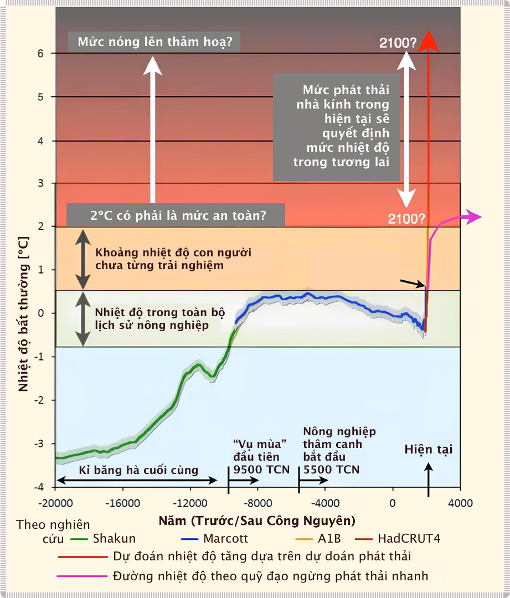

!!! quote ""

    **Hình 1**: Nhiệt độ trái đất trong 20.000 năm. Hình ảnh: [Jos Hagelaars/Max Edkins/World Bank](https://qz.com/154196/the-only-way-to-stop-climate-change-now-may-be-revolution)

Vào thế kỷ 19, quá trình này đã được đẩy nhanh nhờ việc phát hiện ra carbon hóa thạch trên quy mô lớn và việc phát minh ra các công nghệ sử dụng nó làm nhiên liệu. Carbon hóa thạch đã cung cấp cho con người một nguồn năng lượng cực kỳ hiệu quả (nhưng hữu hạn) có thể khai thác theo tốc độ chúng ta muốn, không giống như nguồn ánh sáng mặt trời ổn định và có độ khuếch tán lớn của các thời đại trước.

Nguồn năng lượng dồi dào này đã giúp thế kỷ 20 trở thành một thời kỳ độc nhất vô nhị trong lịch sử loài người: **1)** nhiều tài nguyên hơn (và rẻ hơn) dẫn đến năng suất tăng mạnh và tăng trưởng kinh tế chưa từng có, **2)** hệ thống tài chính dựa trên nợ không còn phụ thuộc vào vật chất cho phép mở rộng tín dụng và tăng tốc tiêu dùng liên quan, **3)** tất cả những điều này thúc đẩy thặng dư tài nguyên cho phép các xã hội trở nên đa dạng và phong phú hơn.

Thế kỷ 21 đang chuyển hướng khỏi quỹ đạo đó: **1)** năng lượng và tài nguyên một lần nữa trở thành yếu tố cản trở sự phát triển kinh tế và xã hội, **2)** mở rộng vật chất dựa trên tín dụng đang trở nên rủi ro hơn và cuối cùng sẽ đạt đến giới hạn, **3)** xã hội đang trở nên phân cực và mất niềm tin vào chính phủ, phương tiện truyền thông và khoa học, và **4)** các hệ sinh thái đang bị suy thoái khi chúng hấp thụ một lượng lớn năng lượng và chất thải vật chất từ các hệ thống của con người.

Từ đây chúng ta sẽ đi về đâu?

## 3. Hành vi của con người

Con người là loài độc nhất, nhưng theo một cách tương tự, ếch cây hay hà mã cũng là độc nhất. Chúng ta vẫn là động vật có vú, cụ thể là loài linh trưởng. Các đặc điểm thể chất của chúng ta (thuỷ tinh thể trong mắt, miệng nhỏ, không có răng nanh, v.v.) là sản phẩm quá trình lâu dài hình thành xã hội trong các nhóm nhỏ. Tuy nhiên, bộ não và hành vi của chúng ta cũng là sản phẩm của những gì đã hoạt động trong quá khứ. Chúng ta không sống để tối đa hóa khả năng thích nghi sinh học, mà thay vào đó đóng vai trò là **‘người kiểm nghiệm sự thích nghi’** (*adaptation executor*), tìm cách tái tạo các trạng thái cảm xúc hàng ngày của tổ tiên đã thành công của mình. Con người có khả năng ấn tượng trong việc xử lý thông tin, hợp tác và khám phá mọi thứ, đó là điều đã đưa chúng ta đến trạng thái có tổ chức và sự thịnh vượng được trải nghiệm ngày nay. Nhưng tâm trí thời kỳ đồ đá của chúng ta đang phản ứng lại với công nghệ hiện đại, với các nguồn tài nguyên phong phú, các nhóm hội lớn và linh hoạt theo những cách mới phát sinh. Những hành vi này&mdash;được tóm tắt dưới đây&mdash;góp phần củng cố thêm tình trạng hiện tại về văn hóa và tương lai của hành tinh.

### So sánh địa vị (*status*) và so sánh tương đối (*relative*)

Con người là một loài mang tính xã hội. Mỗi chúng ta đều đang cạnh tranh về địa vị và tài nguyên. Là những tổ chức sinh học, chúng ta quan tâm đến sự tương quan địa vị. Trong lịch sử, địa vị liên quan đến việc cung cấp tài nguyên cho bang hội,
lãnh đạo, sự tôn trọng, câu chuyện, đạo đức, sự chia sẻ và cộng đồng. Nhưng trong nền văn hóa hiện đại, chúng ta cạnh tranh để giành địa vị bằng những hàng hóa sử dụng nhiều tài nguyên (ô tô, nhà cửa, kỳ nghỉ, thiết bị), sử dụng tiền như một động lực trung gian. Mặc dù hầu hết 20% người nghèo nhất ở các nền kinh tế tiên tiến có cuộc sống giàu có hơn về mặt vật chất so với tầng lớp trung lưu trong những năm 1900, nhưng **thứ hạng** thu nhập của một người, trái ngược với thu nhập tuyệt đối, là thứ dự đoán mức độ hài lòng về cuộc sống. Đối với những người không ‘ở tầng lớp trên’, cảm giác không có địa vị dẫn đến trầm cảm, uống rượu, tàng trữ súng và các hành vi chống đối khác. **Khi các nhu cầu cơ bản được thỏa mãn, chúng ta thường hưởng ứng những sự so sánh (tương đối) giữa “tốt hơn và kém hơn”** (*better vs. worse*) **nhiều hơn so với “một chút” và “rất nhiều”** (*a little vs. a lot*).

### Siêu kích thích và chứng nghiện

Trong môi trường tổ tiên chúng ta, các quá trình sinh hoá tạo ra chất dẫn truyền thần kinh não bộ **dopamine mesolimbic** được liên kết với **động cơ** (*motivation*), **hành động** (*action*) và **sự hưng phấn** (*reward*) (về lượng calo hấp thụ). Công nghệ hiện đại và sự sung túc của đời sống có thể đã xâm chiếm và điều khiển quá trình này. Bộ não của một nhà giao dịch chứng khoán sáng lên trong máy chụp cộng hưởng từ fMRI khi người đó thực hiện được một giao dịch thắng lợi, giống như cách của loài tinh tinh (và có lẽ là tổ tiên xa xôi của chúng ta) làm khi tìm thấy một quả hạch hoặc quả mọng. Nhưng khi người ta giao dịch cổ phiếu, chơi trò chơi điện tử hoặc xây dựng trung tâm mua sắm, không có tín hiệu “đầy đủ” theo bản năng trong bộ não hiện đại&mdash;vì vậy chúng ta trở nên nghiện “sự hưng phấn bất ngờ” đến từ cuộc gặp gỡ, một tập phim hay một email tiếp theo với nhịp độ giữa các sự kiện ngày càng tăng. Bộ não của chúng ta đòi hòi các dòng chảy (cảm xúc) mà ngày nay chúng ta cần thỏa mãn chủ yếu bằng cách sử dụng các nguồn dự trữ không thể tái tạo. **Trong nền văn hóa giàu tài nguyên hiện đại, ‘mong muốn’** (*want*) **trở thành một cảm xúc mạnh mẽ hơn so với ‘sở hữu’** (*having*).

### Thành kiến nhận thức (*Cognitive biases*)

Chúng ta không tiến hóa để có cái nhìn xác thực hơn về thế giới của mình. Chúng ta suy nghĩ bằng từ ngữ và hình ảnh không có kết nối với thực tế vật chất. Thực tế tưởng tượng này thường có vẻ thực hơn khoa học, logic và những **niềm tin thông thường** (*common sense*). Niềm tin phát sinh từ giao diện ảo này trở thành tôn giáo, chủ nghĩa dân tộc hay các mục tiêu viển vông như cải tạo sao Hỏa. Trong phần lớn lịch sử, chúng ta duy trì các nhóm hội bằng cách chia sẻ những **huyền thoại xã hội** (*social myths*) như thế này. Việc không tin vào những huyền thoại đó đã dẫn đến sự tẩy chay và cái chết. Niềm tin thường đi trước những lý do mà chúng ta sử dụng để giải thích chúng, và do đó có sức mạnh hơn nhiều so với sự thật.

Các nhà tâm lý học đã xác định hàng trăm thành kiến nhận thức theo đó các hành vi thông thường của con người không tuân theo lý trí về kinh tế. Chúng bao gồm: **lý luận có động cơ** (*motivated reasoning*), **tư duy nhóm** (*groupthink*), **thiên vị về cá nhân** (*authority bias*), **hiệu ứng người ngoài cuộc** (*bystander effect*), v.v. **Tư duy bằng lí trí** (*rationality*) đến từ một phần mới hơn của bộ não nhưng vẫn bị chi phối bởi các cấu trúc não nguyên thủy, có khả năng trực giác và thiên về tính cảm xúc hơn hệ thống limbic. Kinh tế học hiện đại giả định rằng quyết định con người dựa trên lý trí, nhưng không phải vậy. Kết hợp với bản chất bộ lạc, **tư duy theo nhóm** (in-group nature), có thể lí giải được tại sao **tin tức giả** (*fake news*) lại tỏ ra hiệu quả và rằng mọi người thường có xu hướng chống lại những quan điểm không dễ chịu liên quan đến giới hạn đối với tăng trưởng, giảm tiêu thụ năng lượng và biến đổi khí hậu. Sự tiến hóa dựa trên lựa chọn lọc tự nhiên, không phải sự thật.

Chúng ta thường chỉ coi trọng sự thật nếu nó mang lại lợi ích cho mình trong thời gian ngắn. **Tư duy theo lý tính** (*rationality*) là ngoại lệ, không phải là quy tắc.

### Thành kiến về thời gian (giá trị hiện tại hơn tương lai)

Vì những lý do tiến hóa (tuổi thọ ngắn, nguy cơ cạn kiệt lương thực, môi trường không ổn định, v.v.), chúng ta quan tâm đến hiện tại nhiều hơn tương lai, được các nhà kinh tế đo lường thông qua **“tỷ lệ chiết khấu”** (*discount rate*&mdash;giống như trong lĩnh vực ngân hàng). Tỷ lệ chiết khấu lớn thì người đó càng **“nghiện hiện tại”**. Những người sử dụng ma túy và uống rượu, những người chấp nhận rủi ro, những người có IQ thấp, những người chịu sức ép nặng nề về tâm trí và nam giới (so với nữ giới) có xu hướng đánh giá thấp hơn các sự kiện hoặc vấn đề trong tương lai.

Thật không may, hầu hết những thách thức hiện đại của chúng ta “ở trong tương lai”. Nhận thức rằng tương lai tồn tại và chúng ta là một phần của nó bắt nguồn từ một cấu trúc não tương đối mới, hay **tân vỏ não** (*neocortex*). Nó không có kết nối trực tiếp với các **trung khu thúc đẩy động cơ** (*motivational centers*) nằm sâu trong não có tác dụng truyền đạt sự khẩn cấp. Khi được yêu cầu lên kế hoạch cho một bữa ăn nhẹ vào *tuần tới* lựa chọn giữa sô-cô-la hoặc trái cây, 75% người được hỏi đã chọn trái cây. Khi chọn một bữa ăn nhẹ cho ngày hôm nay, 70% chọn sô-cô-la. Khi chọn một bộ phim để xem vào tuần tới, 63% chọn phim tài liệu giáo dục nhưng khi chọn phim cho tối nay, 66% chọn phim hài hoặc khoa học viễn tưởng. Chúng ta có những dự định lớn cho tương lai, cho đến khi tương lai trở thành ngày hôm nay. Vỏ não mới của chúng ta có thể tưởng tượng ra tương lai, nhưng chúng ta lại mù quáng về mặt cảm xúc đối với các vấn đề dài hạn như biến đổi khí hậu hay cạn kiệt năng lượng. **Về mặt cảm xúc (*emotion*), tương lai không có thật**.

### Hợp tác và hành vi nhóm

Hành vi nhóm đã định hình chúng ta cũng nhiều như hành vi cá nhân. Con người có xu hướng tư duy “theo nhóm” mạnh mẽ, và trước khi nông nghiệp trở nên **quân bình** (*egalitarian*). Những bộ lạc trong lịch sử có thể hoạt động như một khối gắn kết khi đối mặt với mối đe dọa chung đã vượt qua các bộ lạc khác không có sự gắn kết xã hội như vậy. Do đó, ngày nay chúng ta dễ dàng và nhanh chóng hình thành sự phân chia **trong nhóm** (*ingroups*) và **ngoài nhóm** (*outgroups*) và cư xử thân thiện hay đối nghịch tương ứng. Chúng ta cũng sẵn sàng hợp tác trong nhóm mình cho dù đó là một doanh nghiệp nhỏ, tập đoàn lớn hay thậm chí là một quốc gia&mdash;để có được thặng dư tiền tệ (hoặc trong giai đoạn trước đó là vật chất). **Cái ta đặt lên trên cái chúng ta, chúng ta đặt lên trên bọn họ** (*Me over Us, Us over them*).

### Tiến hóa văn hóa, Tính siêu xã hội (*Ultrasociality*) và Xã hội hữu cơ (*Superorganism*)

!!! quote "Ronald Wright, Lịch sử ngắn về sự tiến bộ (2004, trang 50-51)"

    “Những gì diễn ra vào đầu những năm 1500 thực sự đặc biệt, điều chưa từng xảy ra trước đây và sẽ không bao giờ xảy ra nữa. Hai cuộc thử nghiệm của hai nền văn hoá độc lập đã phát triển trong 15.000 năm hoặc hơn, cuối cùng đã giáp mặt nhau. Thật ngạc nhiên, sau ngần ấy thời gian, mỗi bên đều có thể nhận ra các tổ chức của bên kia. Khi Cortés đến Mexico, ông đã thấy những con đường, kênh đào, thành phố, cung điện, trường học, tòa án, thị trường, công trình thủy lợi, vua, linh mục, đền thờ, nông dân, nghệ nhân, quân đội, nhà thiên văn, thương gia, thể thao, nhà hát, nghệ thuật, âm nhạc, và sách. Nền văn minh cao cấp, khác nhau về chi tiết nhưng giống nhau về bản chất, đã phát triển độc lập ở cả hai bên bờ đại dương trên trái đất.”

!!! quote "Campbell, 1974; Gowdy và Krall, 2013""

    “Tính siêu xã hội đề cập đến hình thái tổ chức xã hội cao nhất của động vật, với sự phân công lao động toàn thời gian, những cá thể chuyên biệt không làm ra thực phẩm mà được các cá thể khác cho ăn, với sự chia sẻ thông tin hiệu quả về nguồn thức ăn và mối nguy hiểm, nỗ lực hy sinh bản thân để bảo vệ tập thể”.

Con người là một trong số ít các loài mang tính xã hội cực kì cao. Về mặt kiểu hình, chúng ta là loài linh trưởng, nhưng về mặt hành vi, chúng ta giống với xã hội loài côn trùng hơn. Tính siêu xã hội  cho phép chúng ta hoạt động ở quy mô lớn hơn nhiều so với tư cách cá nhân. **Ở quy mô lớn nhất, tiến hóa văn hóa xảy ra nhanh hơn nhiều so với tiến hóa di truyền**. Thông qua quá trình phát triển văn hóa bắt đầu từ nông nghiệp, con người đã phát triển thành một nền văn minh kết nối toàn cầu, “vượt trội” so với các mô hình kinh tế nhân loại khác trên con đường trở thành một “xã hội hữu cơ siêu thực thể” thực thụ. Một xã hội hữu cơ có thể được định  nghĩa là “một tập hợp các tác nhân có thể phối hợp hành động để tạo ra các hiện tượng được điều khiển bởi tập thể”. Thông qua hợp tác (và phối hợp), sự thích nghi được chuyển giao từ cấp thấp hơn lên cấp tổ chức cao hơn. Nhu cầu của thực thể cấp cao hơn này (hiện tại đối với con người; hay nền kinh tế toàn cầu) hình thành nên hành vi, tổ chức và chức năng của các thực thể cấp thấp hơn (hành vi của từng cá nhân con người). Do đó, hành vi của con người bị hạn chế và sửa đổi bởi “quan hệ nhân quả đi xuống” từ cấp độ tổ chức cao hơn hiện có trong xã hội.

Tất cả những **“sự phi lí”** (*irrationalities*) được nêu ra ở trên đã giúp loài người chúng ta phát triển mạnh mẽ trong 300.000 năm. Điều đã thay đổi không phải là “chúng ta” mà là tổ chức kinh tế của các xã hội song song với công nghệ, quy mô và tác động của chúng. Kể từ thời kỳ đồ đá mới, xã hội loài người đã tổ chức xung quanh sự tăng trưởng của thặng dư, ban đầu được đo lường về mặt vật chất (ví dụ như ngũ cốc), giờ đây được đo lường bằng phương tiện kĩ thuật số đảm bảo về quyền đối với thặng dư vật chất (hay tiền). Các thuộc tính tích cực của con người như hợp tác đã được tập hợp lại và phối hợp để hướng tới sản xuất thặng dư. Dần dần, “mục đích” của con người hiện đại trong nền kinh tế toàn cầu mang tính siêu xã hội là đóng góp vào thặng dư cho thị trường (ví dụ: giá trị kinh tế của cuộc sống con người dựa trên **thu nhập cả đời được chiết khấu** (*discounted lifetime income*), lý thuyết năng suất cận biên của giá trị lao động, v.v.).

### Tóm tắt Hành vi con người

Tập hợp hành vi con người là rất lớn, nhưng đều mang tính hiểu biết và bị hạn chế bởi di sản từ hệ thống thần kinh và mức độ tổ chức cao hơn do hệ thống kinh tế của của chúng ta phô bày ra. Chúng ta được sinh ra với các mô-đun di truyền được chuẩn bị để phản ứng với bối cảnh theo những cách có thể dự đoán được. “Chúng ta là ai” với tư cách là một loài có liên quan rất lớn đến các vấn đề về **vượt ngưỡng sinh thái** (*ecological overshoot*), **tính bền vững** (*sustainability*) và các **phản ứng văn hóa** (*cultural responses*) liên quan.

## 4. Năng lượng

Kinh tế học sinh thái thừa nhận rằng các nền kinh tế thực sự hoàn toàn phụ thuộc vào năng lượng. Tuy nhiên, lý thuyết kinh tế chính thống vẫn mù quáng trước thực tế này. Kết quả là, các tổ chức và công dân của chúng ta cũng vậy. Sự mất kết nối có ý nghĩa to lớn đối với tương lai của chúng ta. Điều này quá quan trọng nên cần được nhắc lại nhiều lần.

### Năng lượng trong tự nhiên

**Năng lượng đang và sẽ luôn là tiền tệ của cuộc sống** (*currency of life*). Hiệu quả của việc **thu thập năng lượng** (*energy capture*) là trung tâm của các hệ thống sinh học. Bất kỳ chuyển động, hoạt động hoặc sự kiện nào trong tự nhiên đều cần năng lượng. Các **tổ chức sinh vật** (*biological organisms*) sử dụng các chiến lược tìm kiếm thức ăn để tối ưu hóa lượng năng lượng hấp thụ so với năng lượng tiêu hao được điều chỉnh theo thời gian và mức độ rủi ro. Theo cách này, chúng cũng là những nhà đầu tư. Thặng dư năng lượng lớn hơn mang lại cho chúng lợi thế cạnh tranh để tăng trưởng, sinh sản, phòng thủ, cạnh tranh, duy trì và sửa chữa. Do đó, **“năng lượng ròng”** (*net energy*), bằng tổng năng lượng thu được trừ đi chi phí năng lượng, là yếu tố thúc đẩy và dẫn dắt các hệ thống tự nhiên và hệ thống con người.

### Năng lượng và công suất

Hệ thống sinh học tối đa hóa công suất sử dụng. **Trao đổi chất** (*metabolism*) là tốc độ mà các tổ chức sinh vật thu nhận, biến đổi và tiêu hao năng lượng cũng như vật chất. **“Công suất” **(*power*) là năng lượng được tiếp cận/sử dụng trên một đơn vị thời gian. Các tổ chức sinh vật và hệ sinh thái tự cấu trúc một cách tự nhiên để tối đa hóa công suất thông qua việc tiếp cận các nguồn năng lượng. Cây sồi không mọc một lá (cho ra hiệu quả tối đa) hay 100 nghìn lá (để tổng năng lượng thu được tối đa), nhưng mọc một lượng lá vừa phải để tối đa hóa diện tích bề mặt của cây đối với mặt trời để quang hợp. Các hệ thống tối đa hóa việc sử dụng năng lượng hữu ích thường có sức sống vượt trội so với những hệ thống không làm điều đó.

### Lợi ích về năng lượng

Những chuyển đổi lớn trong xã hội loài người trong 10.000 năm qua có liên quan đến lợi ích từ các loại năng lượng khác nhau và sẵn có của chúng. Công nghiệp hóa đã thay đổi mối quan hệ lịch sử của con người trong việc thu nạp năng lượng từ việc sử dụng các dòng năng lượng tự nhiên hàng ngày sang sử dụng công nghệ được thúc đẩy bởi một lượng lớn năng lượng hóa thạch giá rẻ.

Một thùng dầu thô có thể thực hiện công việc tương đương khoảng 1700 kWh. Một người lao động có thể thực hiện khoảng 0,6 kWh trong một ngày làm việc. Tính toán đơn giản cho thấy phải mất hơn **11 năm lao động của con người** để tạo ra cùng một tiềm năng lao động có trong một thùng dầu. Ngay cả khi con người chuyển đổi năng lượng thành công việc lao động hiệu quả hơn gấp 2,5 lần, năng lượng trong một thùng dầu vẫn có thể thay thế khoảng 4,5 năm lao động thể chất của con người.

Mối quan hệ năng lượng/công việc này là nền tảng của cuộc cách mạng công nghiệp. Hầu hết các quy trình công nghệ đều cần hàng trăm đến hàng nghìn calo năng lượng hóa thạch để thay thế từng calo con người trước đây sử dụng để thực hiện các công việc tương tự theo cách thủ công. Hãy cùng xem xét việc vắt sữa bò bằng ba phương pháp (xem **Hình 2**): phương pháp thủ công (chỉ sử dụng sức người), máy vắt sữa bán tự động bằng điện (1100 kWh trên mỗi con bò mỗi năm) và vắt sữa hoàn toàn tự động (3000 kWh trên mỗi con bò một năm). Máy vắt sữa thủ công, khi làm việc một mình, cần 120 giờ lao động của con người mỗi năm cho mỗi con bò; máy bán tự động cần 27 giờ lao động; và máy tự động hóa hoàn toàn, trong 12 giờ. Chúng ta sẽ ước tính rằng người vắt sữa người tạo ra giá trị kinh tế là 5 Đô la Mĩ một giờ làm việc một mình. Sử dụng máy vắt sữa điện ở mức 0,05 USD/kWh, sản lượng tăng đáng kể&mdash;vì điện giá rẻ thay thế cho rất nhiều giờ lao động của con người&mdash;và doanh thu tăng lên 19 Đô la Mĩ/giờ với máy vắt sữa bán tự động và lên 25 Đô la Mĩ/giờ với công nghệ hoàn toàn tự động. (Lưu ý: lợi ích kinh tế lớn này có thể thuộc về chủ trang trại bò sữa, người lao động hay người tiêu dùng với sản phẩm sữa rẻ hơn&mdash;hay bất kỳ sự kết hợp nào giữa các đối tượng này). Nguyên tắc tương tự cũng áp dụng cho hầu hết các quy trình công nghiệp hiện đại: chúng ta tiết kiệm thời gian và sức lao động của con người bằng cách bổ sung một lượng lớn lao động hóa thạch giá rẻ.

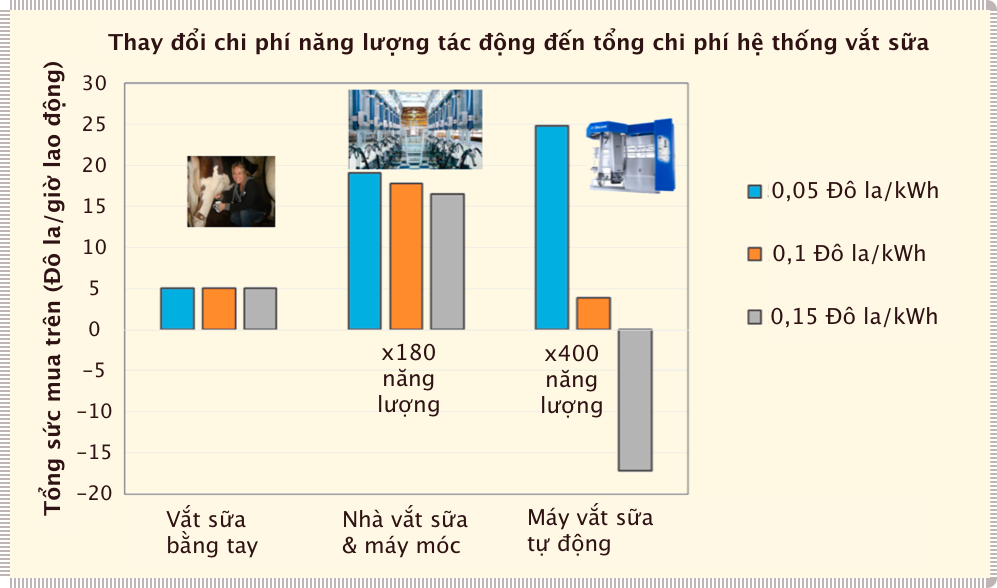

!!! quote "" 
    
    **Hình 2**. Tác động của công nghệ + năng lượng giá rẻ/đắt đối với tiền lương/lợi nhuận.

Mặc dù sản lượng công nghiệp hiện đại không hiệu quả về mặt năng lượng nhưng nó cực kỳ tiết kiệm chi phí vì năng lượng hóa thạch rẻ hơn nhiều so với năng lượng từ lao động của con người. Đây là **“trợ cấp hóa thạch”** (*fossil subsidy*), làm cho lợi nhuận, tiền lương và mức sống hiện đại cao hơn đáng kể so với các nền văn minh trước đây dựa trên các nguồn năng lượng tái tạo không tập trung khác. Một người bình thường vào năm 2015 đã tạo ra GDP gấp 14 lần so với một người vào năm 1800&mdash;và một người Mỹ bình thường gấp 49 lần! Người Mỹ hiện đại&mdash;thông qua trợ cấp năng lượng của mình&mdash;sở hữu lượng **trao đổi chất thể lí** (*physical metabolism*) tương đương với khối lượng các loài linh trưởng nặng hơn 30 tấn.

Tuy nhiên, việc sử dụng năng lượng hóa thạch đi kèm với một nhược điểm. Khả năng sinh lời của ngành công nghiệp trở nên dễ bị tổn thương khi giá năng lượng tăng. Như được biểu thị bằng các cột màu cam và xám trong **Hình 2**, chi phí năng lượng tăng gấp đôi hoặc gấp ba khiến các ngành vốn có lợi nhuận cao trước đây có đòi hỏi năng lượng đầu vào lớn làm cho các ngành công nghiệp có lợi nhuận cao trước đây với yêu cầu năng lượng đầu vào lớn trở nên không sinh lời (ví dụ: ngành hàng không, sản xuất xi măng, luyện nhôm, v.v.). Ngoài ra, việc giảm lợi nhuận do tăng giá năng lượng không thể được bù đắp hoàn toàn bằng những cải tiến về hiệu quả vì bản thân mô hình kinh doanh đã dựa trên một lượng lớn năng lượng giá rẻ. **“Lợi nhuận giảm”** (*reduced profit*) do tăng giá năng lượng là một hiện tượng trên toàn thế giới.

### Quy mô năng lượng

Năm 2018, nền kinh tế toàn cầu vận hành với mức sản lượng năng lượng không đổi là 17 nghìn tỷ Watt&mdash;đủ để cung cấp điện liên tục cho hơn 170 tỷ bóng đèn 100 Watt. Hơn 80% nguồn năng lượng này, như được trình bày trong **Hình 3**, là năng lượng hoá thạch tương đương với 110 tỷ thùng dầu chứa hydrocarbon hóa thạch cung cấp năng lượng (và cũng đùng để chế tạo) máy móc, phương tiện giao thông và cơ sở hạ tầng của con người. Ở mức 4,5 năm lao động sức người tương đương cho mỗi thùng, mức năng lượng hoá thạch tiêu thụ hiện giờ ngang bằng lượng lao động của hơn 500 tỷ công nhân là con người (so với khoảng 4 tỷ công nhân trên thực tế). Câu chuyện kinh tế của thế kỷ 20 thực chất là sự bổ sung năng suất mặt trời (năng lượng khai thác từ nhiên liệu hoá thạch) cổ đại từ dưới lòng đất vào năng suất nông nghiệp từ việc canh tác đất. Những “đội quân” hóa thạch này là nền tảng của nền kinh tế toàn cầu hiện đại và hoạt động không mệt mỏi trong hàng nghìn quy trình công nghiệp và phương tiện giao thông vận tải. Chúng ta không trả tiền cho việc thành lập những đội quân công nhân này, mà chỉ trả tiền cho sự giải phóng (khai thác và sử dụng) chúng. Chuyển sang những nguồn năng lượng khác, thông qua việc đánh thuế hay khai thác đến cạn kiệt, sẽ chắc chắn đi kèm với việc suy giảm “lợi ích”.

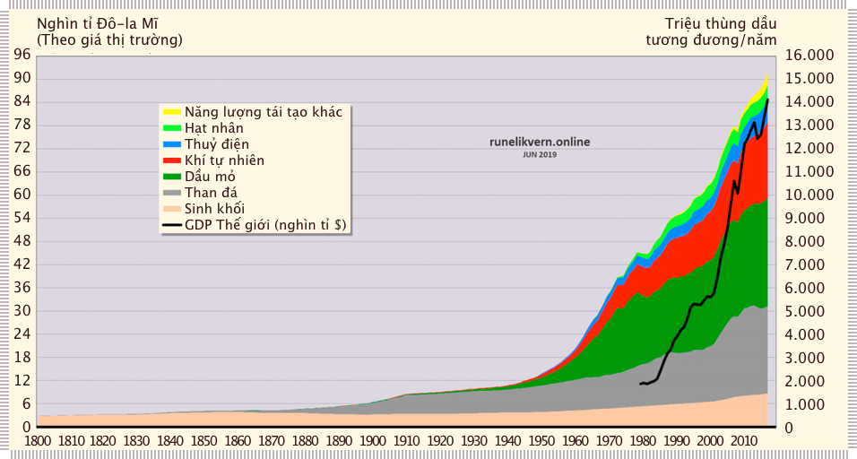

!!! quote ""

    **Hình 3**. Cơ cấu năng lượng toàn cầu 1800–2018 (Nguồn: BP, 2019, Likvern 2019). Tổng sản phẩm thế giới (hay GDP toàn cầu) 1980-2018 được lấy từ dữ liệu Quĩ tiền tệ Quốc tế IMF.

### Khả năng thay thế năng lượng

Lý thuyết kinh tế hiện đại xem xét tất cả các yếu tố đầu vào có thể thay thế được. Nếu giá của một đầu vào quá cao, thị trường sẽ phát minh ra một giải pháp thay thế. Tuy nhiên, năng lượng không tương thích với lý thuyết này vì các nguồn năng lượng khác nhau có những khác biệt lớn về **chất lượng** (*quality*), **mật độ** (*density*), **khả năng lưu trữ** (*storability*), **thặng dư** (*surplus*), **khả năng vận chuyển** (*transportability*), **tác động môi trường** (*environmental impact*) và các yếu tố khác. Ví dụ, có hàng trăm quy trình công nghiệp cần nhiệt độ trung bình và cao (dệt may, hóa chất, xi măng, thép, v.v.) sử dụng nhiên liệu hóa thạch mà không có giải pháp thay thế trong hiện tại (hay thậm chí đang được phát triển) sử dụng công nghệ carbon thấp. Năng lượng chỉ có thể được thay thế bằng một dạng năng lượng có hình thái và chất lượng tương tự.

### Tính Ưu việt của Năng lượng

Năng lượng là yếu tốc căn bản đến mức sự sẵn có của nó đặt ra các giới hạn vật lý cho quy mô xã hội của chúng ta. Tất cả sự sống, thương mại, công việc hay sự hình thành trật tự xã hội đều được phát triển và giới hạn bởi **năng lượng ròng sẵn có** (*available net energy*). Khi GDP tăng trên toàn cầu, năng lượng cần tăng theo tương ứng. Cho đến những năm 1970, năng lượng và GDP gần như tương quan hoàn hảo; GDP tăng 5% đòi hỏi mức tiêu thụ năng lượng tăng 5%. yêu cầu mức tiêu thụ năng lượng tăng 5%. Tiếp theo đó là **sự tách rời** (*decoupling*) giữa năng lượng/GDP trong ngắn hạn do những tiến bộ về hiệu quả có được từ cú sốc giá dầu mỏ và khí đốt tự nhiên ở Hoa Kỳ. Điều này tiếp tục dẫn đến sự chuyển đổi từ sử dụng dầu trong các nhà máy điện sang hạt nhân và khí đốt tự nhiên. Vào giữa những năm 1980, **nợ** (*debt*) và **toàn cầu hóa** (*globalization*) đã được sử dụng để tăng khả năng tiếp cận năng lượng cần thiết để giữ cho GDP tăng trưởng. Nhiều người đã đề cập đến sự suy giảm **cường độ sử dụng năng lượng** (*energy intensity*) (trên mỗi đơn vị GDP) trong dài hạn. Chẳng hạn, từ năm 1965 đến 2012, năng lượng (tính bằng MegaJoules) được sử dụng trên mỗi đô la GDP toàn cầu đã giảm từ 11 xuống 8, trên bề mặt điều đó có nghĩa là sự tách rời đang xảy ra. Tuy nhiên, tính trung bình hàng năm, trong những năm này, mối tương quan giữa năng lượng và GDP vẫn được duy trì chặt chẽ ở mức 99,4%.

Nhưng do những xu hướng này, cường độ năng lượng được cải thiện nhanh hơn tốc độ lịch sử trong hai thập kỷ cuối của thế kỷ 20. Các lý thuyết không chính thống liên kết năng suất với năng lượng đã bị gạt sang một bên để ủng hộ các học thuyết khác ít hạn chế hơn về sự thịnh vượng kinh tế của con người. Từ năm 2000–2012, tỷ lệ tách rời tương đối hàng năm giảm xuống 0,3% mỗi năm. Kể từ đó, dữ liệu không thống nhất do có nhiều thay đổi đối với phương pháp hạch toán GDP, nhưng nguyên tắc chung vẫn là: để có thêm hoạt động kinh tế, chúng ta cần nhiều năng lượng hơn.

Ngày nay, năng lượng vẫn chỉ được coi như là một yếu tố đầu vào khác trong hệ thống kinh tế của chúng ta&mdash;10 Đô la tiền xăng được coi là có đóng góp tương đương với sản lượng của con người như 10 Đô la thẻ mua Pokemon (một đồ chơi thông dụng). Điều này bất chấp thực tế: **a)** năng lượng là cần thiết để tạo ra và biến đổi tất cả các vật chất đầu vào và **b)** năng lượng chỉ có thể được thay thế bằng năng lượng khác.

Lý thuyết kinh tế chính thống quy tất cả năng suất kinh tế cho **lao động** (*labor*) và **vốn** (*capital*), và do đó giả định tầm quan trọng kinh tế của năng lượng bằng với phần chi phí của nó. Tuy nhiên, phân tích về mặt lý-sinh của tất cả các đầu vào sản xuất cho thấy tầm quan trọng kinh tế của năng lượng lớn hơn đáng kể so với tỷ trọng của năng lượng trong **tổng chi phí các yếu tố đầu vào** (*total factor cost*), và điều ngược lại cũng đúng đối với lao động. Điều này có nghĩa là năng lượng có vai trò lớn hơn đáng kể đối với sự thịnh vượng và năng suất của chúng ta so chi phí danh nghĩa của nó. Trong trường hợp của Nhật Bản và Đức, năng lượng đầu vào cấu thành hơn 60% năng suất kinh tế. Mối quan hệ này sẽ mạnh mẽ hơn đáng kể nếu được đo đạc kiểm chứng ở qui mô toàn cầu, bởi vì toàn cầu hóa cho phép chúng ta dịch chuyển việc sử dụng năng lượng và tài nguyên ra ngoài lãnh thổ các nền kinh tế tiên tiến. Các phương pháp đo lường khác nhấn mạnh rằng mức **tiêu thụ năng lượng sơ cấp** (*primary energy consumption*) gắn liền với sự giàu có toàn cầu được tích lũy thông qua hằng số năng lượng là 9,7 ± 0,3 mW (miliWatt) cho mỗi Đô-la Mĩ tạo ra năm 1990 tại Hoa Kỳ. Thay vì là một yếu tố không đáng kể trong năng suất, **năng lượng là yếu tố chính**.

Trước thời đại công nghiệp, tất cả các nhà kinh tế lý thuyết có liên quan (bao gồm Adam Smith, David Ricardo và những người khác) đã sử dụng đất đai và năng suất đất đai để mô tả hệ sinh thái con người. Khi nền kinh tế toàn cầu mở rộng với sự gia tăng trợ cấp từ năng lượng hóa thạch, năng suất đất đai và những hạn chế đầu vào vật chất được coi là không cần thiết và cuối cùng bị loại bỏ hoàn toàn khỏi lý thuyết kinh tế. Vào thời điểm xảy ra cuộc khủng hoảng năng lượng đầu tiên vào những năm 1970, các mô tả kinh tế vĩ mô đã được rút gọn thành lao động và vốn thông qua hàm Cobb-Douglas và **thặng dư Solow** (*Solow Residual*)&mdash;(hầu hết) vẫn còn được sử dụng cho đến ngày nay. Chúng ta đã tạo ra một mô hình tăng trưởng vô hạn trên một hành tinh hữu hạn.

Các nhà kinh tế coi vốn, lao động và sự sáng tạo của con người là yếu tố chính chính và năng lượng là thứ yếu hoặc không góp phần đáng kể. Trên thực tế, điều ngược lại mới đúng. Chúng ta đang mắc bệnh **mù năng lượng** (*energy blind*).

!!! note "Lưu ý"

    Một số nhà nghiên cứu lý-sinh  đã mở rộng vai trò của năng lượng trong hàm sản xuất quá xa&mdash;trở thành một **“lý thuyết năng lượng về giá trị”** (*energy theory of value*) hoàn chỉnh. Mặc dù vốn và lao động đều là những biến số *phụ thuộc* vào năng lượng, nhưng chúng đều cần thiết theo cách riêng của chúng. Nếu không có đủ vốn (ví dụ: nhà máy), người ta có thể đốt bao nhiêu dầu và than tùy ý nhưng đầu ra sẽ thiếu. Nếu không có lao động lành nghề để thực hiện công việc, người ta sẽ có **năng suất tài nguyên** (*resource productivity*) kém.

### Năng lượng và công nghệ

Hầu hết các tiến bộ công nghệ hiện đại không hoạt động độc lập mà được cung cấp bởi nhiên liệu lỏng hay điện. Về mặt lý-sinh học, nói chung có hai loại công nghệ. **Công nghệ Loại 1** tìm cách sử dụng năng lượng hiệu quả hơn (cải tiến nhà máy điện, tiết kiệm nhiên liệu để phương tiện giao thông vận hành tốt hơn) hoặc phát minh ra các nguồn năng lượng mới (năng lượng mặt trời hoặc địa nhiệt). **Công nghệ Loại 2** bao gồm các thiết bị thay thế sức lao động thủ công của con người (máy cưa, ô tô) hoặc những cách mới để con người sử dụng năng lượng (Facebook, Trò chơi Candycrush).

Hiện tại Loại 2 đang thống trị các phát minh công nghệ và làm tăng tổng nhu cầu năng lượng toàn cầu. Các công nghệ như (điện toán hay lưu trữ) **“đám mây”** (*cloud computing/storage*) không hẳn là **“ảo”** (*virtual*). Máy tính và điện thoại di động (bao gồm cả máy chủ và mạng), tiêu thụ hơn 15% điện năng của thế giới và con số này sẽ tăng lên cùng với sự ra đời của 5G.

Công nghệ là biểu hiện của nguồn năng lượng sẵn có mà chúng ta có thể khai thác. Những gì chúng ta gọi là “tiến bộ công nghệ” tại bất cứ thời điểm nào
chủ yếu là sự phát triển của **vốn cơ sở** (*capital base*) để hỗ trợ sự tiêu thụ năng lượng lớn hơn sẵn có vào thời điểm sau này. Với mục tiêu toàn cầu là tăng trưởng GDP, năng lượng bổ sung cho phép tạo ra nhiều phát minh hơn, từ đó làm cho nền kinh tế của chúng ta trở nên phức tạp hơn. Hơn nữa, bản thân độ phức tạp xã hội/công nghệ cao hơn đòi hỏi mức tiêu thụ năng lượng cao hơn&mdash;dẫn đến vòng xoáy của **sự phức tạp năng lượng** (*energy compexity*).

### Cạn kiệt năng lượng

Sử dụng quá trình quang hợp dưới dạng dòng điện tích nhỏ, các tổ chức sinh vật đã tạo nên **sinh khối** (*biomass*) qua hàng trăm triệu năm được lưu trữ dưới dạng hydrocacbon (nhiên liệu hoá thạch) như một nguồn pin của Trái đất. Chúng ta đang rút cạn nguồn pin carbon này nhanh hơn 10 triệu lần so với khi sạc. Các ước tính về lượng dầu và khí tự nhiên còn lại chênh lệch nhau khá nhiều, nhưng dầu mỏ chất lượng cao giá rẻ, phần lớn đã được tìm thấy và khai thác ở qui mô lớn.

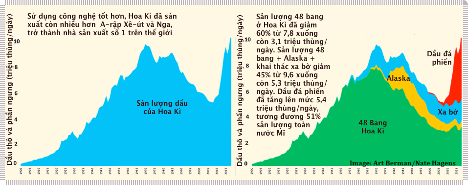

!!! quote ""

    **Hình 4**: Sản lượng dầu ở Hoa Kì (1900–2018). Nguồn: EIA, Drilling info & Labyrinth Consulting Services, Inc.

Phía bên trái của **Hình 4** truyền tải một thông điệp thường bị hiểu sai lệch nhưng phổ biến về sản lượng dầu hiện tại của Hoa Kỳ. Do những tiến bộ công nghệ, Hoa Kỳ đã trở thành nhà sản xuất dầu hàng đầu thế giới. Người ta có ấn tượng sai lầm rằng công nghệ đã chiến thắng sự cạn kiệt khiến dầu trở nên dồi dào và do đó không phải là rủi ro đối với tăng trưởng trong tương lai. Tuy nhiên, thực tế được mô tả chính xác hơn trong bảng bên phải: nói chung, các nguồn **dầu phi đá phiến** (*non-shale oil*) được chứng minh là đang suy giảm vĩnh viễn. Mức tăng trong tổng sản lượng là kết quả của việc [dầu đá phiến](https://vi.wikipedia.org/wiki/%C4%90%C3%A1_phi%E1%BA%BFn_d%E1%BA%A7u) (màu đỏ), gần đây đã chiếm 52% tổng sản lượng. Dầu đá phiến có trong **đá nguồn** (*source rock*) nơi bắt nguồn của tất cả các loại dầu khác. Dầu đá phiến gây tốn kém về mặt kinh tế và sinh thái, và nhanh chóng cạn kiệt (đến 90% trong 3 năm đầu tiên). Một giếng dầu khoan mới điển hình đòi hỏi các thiết bị phức tạp, 1.200 xe tải chở nước, 100 xe lửa chở cát và 8-10 triệu Đô-la Mĩ chi phí khoan và hoàn thiện. Điều này giải thích tại sao Chỉ số giá sản xuất giếng khoan dầu khí của Hoa Kỳ tăng 350% từ năm 2005 đến năm 2014 (Cục Thống kê Lao động Hoa Kỳ, 2018).

Trong thời gian này, giá dầu trên thị trường không theo kịp chi phí khai thác. Kể từ quý 3 năm 2014, chi phí vốn cho các hoạt động khai thác đá phiến đã vượt quá dòng tiền 19 quý liên tiếp. Do tốc độ suy giảm mạnh của các mỏ hiện có (đá phiến sét và mỏ thông thường), Cơ quan Năng lượng Quốc tế khẳng định rằng nếu không có hoạt động khoan mới, sản lượng dầu thế giới sẽ giảm một nửa vào năm 2025 và chỉ còn 15% sản lượng hiện nay vào năm 2040 (WEO 2018). Tất nhiên, chúng ta sẽ đầu tư vào các mỏ dầu mới&mdash;nhưng làm như vậy sẽ khiến cho giá dầu tăng cao hơn, điều này sẽ dẫn đến tăng trưởng kinh tế thấp hơn (xem **Hình 2**, các cột màu xám).

Tỷ trọng chi phí năng lượng trong nền kinh tế, sau 5 thế kỷ suy giảm, đã đạt mức thấp nhất vào năm 1999 và ngày càng tăng kể từ đó. Khi việc khai thác năng lượng đòi hỏi nhiều năng lượng, vật liệu và tiền bạc hơn, thì nền kinh tế bị ảnh hưởng do **tài sản tự do** (*discretionary wealth*) bị luân chuyển hay cạn kiệt khi đóng góp vào các hoạt động khai thác này. Dự trữ năng lượng địa chất chứa mật độ carbon cao của Trái đất không phải là vô hạn trong khi chúng ta đã phát hiện thấy và sử dụng nguồn nhiên liệu rẻ và dễ khai thác nhất. So với năm 2008, các cuộc tranh luận về sự khan hiếm dầu và **“đỉnh dầu”** (*peak oil*) (thời điểm sản lượng dầu thô toàn cầu sẽ đạt mức tối đa, sau đó sẽ bắt đầu giảm) đã chuyển thành **“đỉnh cầu”** (*peak demand*) và điện khí hóa giao thông chính là giải pháp. Tuy nhiên, năng lượng ròng của các nguồn dự trữ còn lại, khả năng chi trả của chúng và khả năng phân bổ vốn của xã hội để thu hồi chúng vẫn là những câu hỏi trọng tâm.

### Sự “xa cách” năng lượng (*Energetic remoteness*)

Rào cản về năng lượng, thời gian, vật liệu và sự phức tạp ngăn cách chúng ta với những thứ chúng ta muốn và cần. Những nguồn năng lượng đến từ tự nhiên như các mỏ quặng tập trung của chúng ta đang giảm sút cùng với năng lượng hóa thạch. Chúng ta chưa phải đối mặt với “sự kết thúc” của dầu, đồng và nước, nhưng chúng ta phải đối mặt với nỗ lực và chi phí ngày càng tăng để khai thác những tài nguyên này từ **chất lượng quặng thấp hơn** (*lower grade ores*). Điều này sẽ có tác động tương ứng về mặt ích lợi xã hội.

Năng lượng tham gia vào nền kinh tế toàn cầu thông qua thăm dò, khai thác, chuyển đổi tài nguyên thiên nhiên và vận tải. Từ đó năng lượng được đưa vào mọi quy trình công nghiệp, khoáng sản và vật liệu trong nền kinh tế. Nguyên liệu thô&mdash;chẳng hạn như đồng, phốt pho hay nhôm&mdash;dễ chiết xuất và tinh chế hơn khi chúng có hàm lượng cao. Khi năng lượng trở nên đắt đỏ hơn và chúng ta cạn kiệt các nguồn tài nguyên tập trung, dễ khai thác, nhiều **hàng hoá** (*commodities*) trở nên “xa vời” hơn vì chúng trở nên đắt đỏ hơn để tìm kiếm và khai thác.

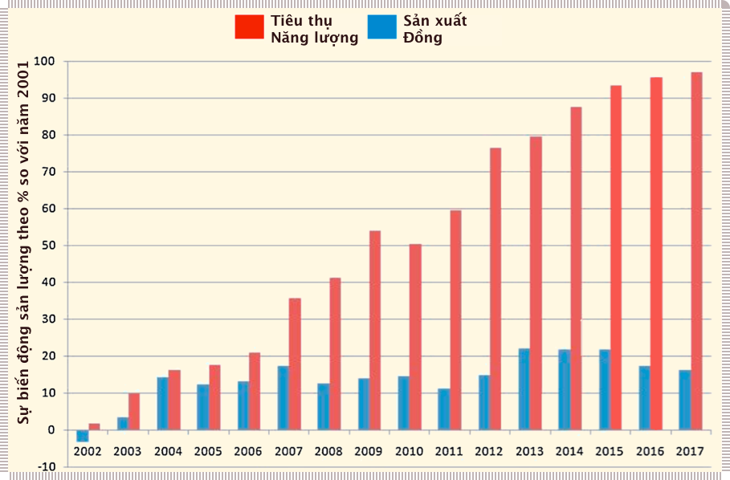

!!! quote ""

    **Hình 5**: Tiêu thụ năng lượng (màu đỏ) và sản xuất đồng (màu lam). Nguồn: Cochilco (Cơ sở dữ liệu hàng năm 1998-2007)

Đồng là một mặt hàng công nghiệp quan trọng để nhân rộng các công nghệ dựa trên năng lượng tái tạo như xe điện. **Hình 5** cho thấy sản lượng đồng hàng năm so với năm 2001 (màu xanh lam) ở Chile. Tổng năng lượng được sử dụng để xử lý quặng đồng và lượng tiêu thụ được thể hiện bằng màu đỏ. Các loại quặng chất lượng thấp hơn đòi hỏi phải tăng năng lượng (và nước) để khai thác, dẫn đến dự báo sẽ có ít đồng hơn trong thập kỷ tới (theo Ủy ban Đồng Chile, 2018) trong khi nhu cầu về đồng ngày càng tăng.

Chính “sự xa xôi năng lượng” này cũng áp dụng cho nhiều nguồn tài nguyên quan trọng, bao gồm nước, lithium và thực phẩm. Chúng ta sử dụng khoảng hai calo nhiên liệu hóa thạch để tạo ra một calo thực phẩm trong hệ thống nông nghiệp hiện đại của mình&mdash;nhưng chúng ta sử dụng thêm 8–12 calo nhiên liệu hóa thạch để chế biến, đóng gói, vận chuyển, bảo quản và nấu thực phẩm hiện đại. Trong thế giới tự nhiên, điều này là không bền vững. Các tổ chức sinh vật cần tiêu thụ nhiều năng lượng hơn để tìm thức ăn so với khối năng lượng cung cấp bởi thức ăn đó sẽ chết. Chúng ta chỉ có thể vượt qua điều này do thể chế và chính sách coi việc trợ cấp năng lượng từ nhiên liệu hóa thạch như **tiền lãi** (*interest*) chứ không phải **tiền vốn** (*principal*). Mọi thứ chúng ta làm sẽ trở nên đắt đỏ hơn nếu chúng ta không thể giảm mức tiêu thụ năng lượng của các quy trình công nghiệp nhanh hơn tốc độ tăng giá.

### Năng lượng và tiền bạc

Xã hội chạy bằng năng lượng và vật liệu, nhưng hầu hết mọi người nghĩ rằng nó chạy bằng tiền. Thật vậy, tiền là phần duy nhất trong nền kinh tế của chúng ta không tuân theo các định luật nhiệt động lực học trong vật lí bởi vì nó được tạo ra như một khoản nợ phải tuân theo các quy luật toán học của lãi kép. Các ngân hàng thương mại không phải là trung gian cho **vốn vay hiện có** (*existing captial*), mà **tạo ra tiền bằng cách cho vay** (*loaning it into existence*). Trái ngược với những gì được dạy trong sách giáo khoa kinh tế, tiền không được cho vay từ của cải hiện có mà nó được tạo ra. Số tiền mới này cuối cùng được chi cho một hàng hóa hay dịch vụ bao hàm trong nó nguồn năng lượng. Tiền đòi hỏi sự sẵn có của năng lượng (trong hàng hoá hay dịch vụ) nhưng việc tạo ra nó không bị ràng buộc bởi sự sẵn có hay chi phí năng lượng.

### Năng lượng và nợ

Vì tiền đòi hỏi sự sẵn có của năng lượng[^2], nên nợ là một đòi hỏi tiêu thụ năng lượng trong tương lai. Các trường kinh doanh dạy rằng nợ là trung tính đối với cấu trúc vốn, một “sự chuyển giao **sở thích tiêu dùng** giữa các thời điểm” (*intertemporal transfer of consumption preference*). Do đó, GDP được tạo ra bằng nợ hoặc bằng tiền mặt được coi là tương đương. Điều này có thể phù hợp trong một nền kinh tế có nhiều cơ hội **tăng trưởng vĩnh viễn** (*perpetual growth*). Tuy nhiên, trong mỗi năm kể từ năm 1965, cả Hoa Kỳ và Thế giới đều gia tăng nợ nhanh hơn GDP. Điều này làm cho nợ chính xác hơn là một “sự chuyển dịch **tiêu dùng** giữa các thời điểm”.

[^2]:

    Tiền đòi hỏi năng lượng, vật liệu và nhiều thứ khác (được khai thác và tiêu thụ). Nhưng mọi hàng hóa và dịch vụ tạo ra GDP đều có thể chuyển đổi thành năng lượng, do đó để sự đơn giản hóa chúng ta gọi: “tiền đòi hỏi sự sẵn có về năng lượng”.

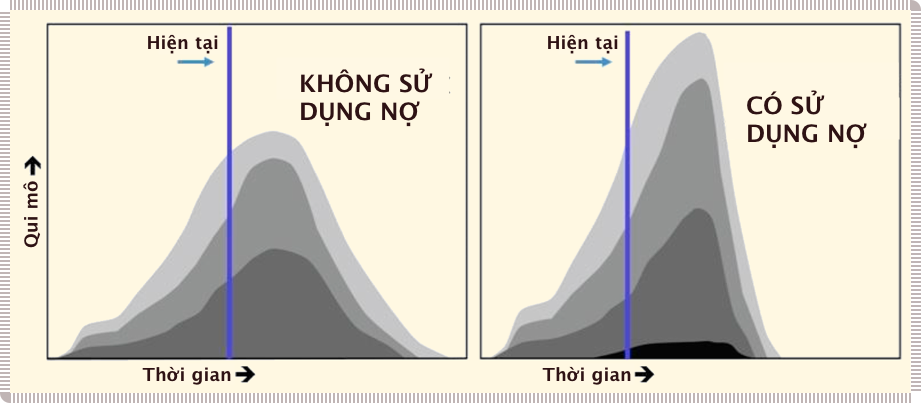

!!! quote ""

    **Hình 6**: Sản lượng khai thác các giếng dầu giả định với việc sử dụng/không sử dụng nợ

Nợ là một khái niệm được tạo ra từ xã hội con người nhưng đi kèm với những hệ quả liên quan đến thế giới vật chất. **Hình 6** minh họa cách nợ kéo các nguồn lực về phía trước theo thời gian. Ví dụ trong một khu mỏ dầu, giả sử các khu vực được tô đậm khác nhau thể hiện các chi phí khai thác từng lớp giếng dầu[^3]. Có được khả năng tiếp cận nguồn tài chính giá rẻ cho phép một công ty mở rộng hoạt động khoan ở những nơi ít có giá trị thương mại cận biên thấp miễn là các chủ nợ mới tin tưởng vào triển vọng trong tương lai. Nguồn vốn vay này cho phép công ty dầu mỏ “tạo ra ống hút dầu lớn hơn”, khai thác mới với chi phí cao hơn (màu đen đậm ở bảng bên phải) và nâng cao tổng sản lượng khai thác. Tuy nhiên, điều này dẫn đến sự sụt giảm mạnh hơn trong tương lai vì mức tăng tạm thời không thể duy trì: lớp giếng dầu tiếp theo được khai thác mang lại sản lượng kém hơn và hiệu quả tài chính thường đi kèm với tỷ lệ suy giảm cao và chất lượng dầu thấp hơn. Dầu và khí đốt phi truyền thống (như dầu đá phiến) là điển hình cho hiện tượng này.

[^3]:

    Theo định nghĩa, chúng ta không thể so sánh một khu mỏ thực tế được khai thác bằng cách sử dụng vay nợ (*debt financing*) với việc không sử dụng nợ. Nhưng sản xuất dầu phụ thuộc vào tỷ lệ vốn đầu vào. Ví dụ, vào năm 2019 mỏ Bakken hiện cần khoảng 750 giếng trị giá 7,5 triệu đô la để bù đắp mức sụt giảm 40,6% trong năm đầu tiên để giữ sản lượng ổn định ở mức hiện tại = 5,625 tỷ Đô-la mỗi năm (chỉ để khai thác và hoàn tất quá trình này). Sản lượng càng tăng thì càng phải khoan nhiều giếng hơn để bù đắp cho sự suy giảm. Rất khó có khả năng điều này có thể được thực hiện mà không có nợ và những rủi ro liên quan.

**Hình 6** không chỉ minh họa sản xuất dầu phản ứng với việc vay nợ thế nào, mà còn thể hiện mức tiêu dùng của toàn bộ nền kinh tế. Tài nguyên entropy thấp (độ tập trung cao, chất lượng cao) làm nền tảng cho năng suất của chúng ta. Do đó, nợ có thể được coi là một công cụ mà con người sử dụng để tiếp cận một nguồn năng lượng và tạo ra hàng hóa và dịch vụ. Nợ đã được gọi là **“năng lượng giả”** (*fake energy*). Chính xác hơn, nợ dịch chuyển năng lượng và tiêu dùng thực tế từ tương lai sang hiện tại một cách không bền vững. Nhưng nó là giả theo nghĩa để trả nợ, chúng ta cũng phải trả lại năng lượng. Người ta có thể nói lượng này (và mức tiêu thụ liên quan) là **năng lượng “vay mượn”** (*borrowed energy*).

### Năng lượng và hạnh phúc

Bất chấp niềm tin phổ biến rằng việc có nhiều tiền và năng lượng hơn sẽ khiến chúng ta hạnh phúc hơn, bằng chứng cho thấy điều này phần lớn là không đúng. Sau khi các nhu cầu cơ bản được đáp ứng, việc sử dụng năng lượng bổ sung sẽ khiến Chỉ số Phát triển Con người tăng chậm hơn. Mặc dù người Mỹ sử dụng năng lượng bình quân đầu người cao gấp 20 lần so với người Philippines, nhưng tỷ lệ công dân “rất hạnh phúc” vẫn ngang nhau (**Hình 7**).

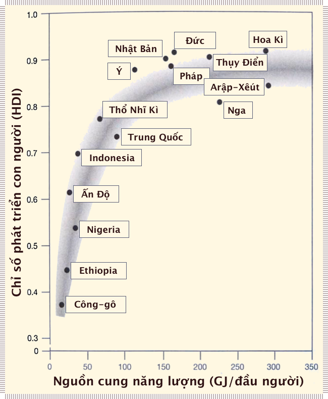

!!! quote ""
    
    **Hình 7**: Sử dụng năng lượng trên đầu người vs. Chỉ số phát triển con người

Các chỉ số sinh lý (và tâm lý) khác có thể theo dõi sức khỏe con người chặt chẽ hơn so với GDP và sử dụng năng lượng. Nếu chúng ta có các **cấu trúc hỗ trợ xã hội** (*social support structures*), nhiều thiếu thốn về thể chất có thể được khắc phục. Sau khi các nhu cầu cơ bản được đáp ứng, những điều tốt nhất trong cuộc sống thường miễn phí.

### “Tác động ngoại lai” (*Externalities*) và năng lượng

Xã hội có thể vẫn mù quáng về năng lượng, nhưng chúng ta đang nhanh chóng nhận thức được những hậu quả tiêu cực của những **hoạt động con người trên toàn cầu** (*global human enterprise*). Các tác động tiêu cực đối với con người bao gồm: **sự biến mất lớp đất bề mặt** (*topsoil loss*), nhưng **hóa chất gây rối loạn nội tiết** (*endocrine disrupting chemicals*) , giảm **số lượng tinh trùng** (*sperm counts*), **bất bình đẳng** (*inequality*) gia tăng, **thiếu nước** (*water shortage*), **thu nhập trung bình giảm** (*declining median incomes*) (ở các nước phát triển), **chủ nghĩa dân túy** (*populism*), **trầm cảm** (*depression*) lo lắng về tương lai và **rủi ro địa chính trị** (*geopolitical risks*). Các tác động tiêu cực đến thế giới tự nhiên bao gồm: rủi ro CO2 đối với khí hậu cho đến các hệ sinh thái, **axit hóa đại dương** (*ocean acidification*), **mất san hô** (*coral loss*) và các tác động khác đến đại dương, nạn **phá rừng** (*deforestation*), **suy giảm côn trùng** (*insect decline*), **suy giảm số lượng các loài chim** (*bird decline*), **sự tuyệt chủng của loài linh trưởng** (*extinction of primates*) sự suy giảm quần thể động vật có vú (hoang dã), **nhựa trong đại dương** (*plastics in oceans*), **vi hạt nhựa** (*microplastic*) và phthalate trong không khí, mất rừng và nguy cơ **tuyệt chủng hàng loạt lần thứ 6** (*6^th^ mass extinction*). Tất cả độc giả của bài viết này đều nhận thức được rằng các tác động xã hội và sinh thái của hoạt động kinh tế **“ngoại lai”** (*external*) đối với hệ thống định giá thị trường. Hầu hết các tác động ngoại lai này được kích hoạt và trở nên tồi tệ hơn bởi năng lượng giá rẻ, nhưng hoàn toàn thuộc về nội tại (chứ không phải ngoại lai) của nền kinh tế dựa trên nhiên liệu hóa thạch.

### Năng lượng&mdash;Tóm tắt

GDP tăng vọt trong thế kỷ 20 có mối liên hệ chặt chẽ với việc tăng vọt đốt cháy nhiên liệu hóa thạch tăng. Xã hội vẫn chưa nhận ra những liên hệ này bởi vì chúng ta kết hợp chi phí khai thác năng lượng tính bằng đồng Đô-la (rất nhỏ) với giá trị công việc (rất lớn). Năng lượng chỉ có thể được thay thế bằng năng lượng có chất lượng tương tự khác. Ngày càng nhiều những tiến bộ công nghệ đạt được **bằng việc sử dụng** năng lượng, và hầu hết các tiến bộ này đều làm tăng nhu cầu năng lượng trong tương lai. Chúng ta có thể (trong hiện tại) dễ dàng in ra tiền nhưng chúng ta không thể in ra năng lượng để mang lại giá trị cho nó. Chúng ta chỉ có thể phát triển các nguồn mới hoặc khai thác những gì hiện có nhanh hơn hay học cách sử dụng nó hiệu quả hơn. Chúng ta đã ghi lại những suy giảm rõ rệt về tốc độ tăng trưởng năng lượng và chất lượng tài nguyên bằng cách sử dụng **tín dụng** (*credit*) (như việc vay vốn) với khối lượng đáng kinh ngạc. Lý thuyết kinh tế hiện đại cũng như các thể chế, chính sách và kế hoạch của chúng ta đã bỏ qua hoặc rất ít chú ý đến hầu hết các điểm này. Trong tương lai, quy mô, chất lượng và chi phí năng lượng sẽ quyết định loại hệ thống xã hội nào con người có thể được vận hành. Chúng ta vẫn đang **mù năng lượng** (*energy blind*).

## 5. Tổng hợp

**Hình 8** khái quát hoá trong vài trăm năm qua và vài trăm năm tới (không theo tỷ lệ). Đường màu xanh lá cây biểu thị các nguồn năng lượng phi hoá thạch bền vững dành cho nhân loại đã đạt đến giới hạn địa lý và công nghệ trong thế kỷ 19. Đường màu đỏ biểu thị sự bùng nổ của tài nguyên thiên nhiê đầu vào không thể tái tạo cho nền kinh tế con người (dầu mỏ, khí đốt, đồng, v.v.). Đường màu đen biểu thị các dấu hiệu tài chính (tiền, tín dụng, v.v.) của vốn cơ bản.

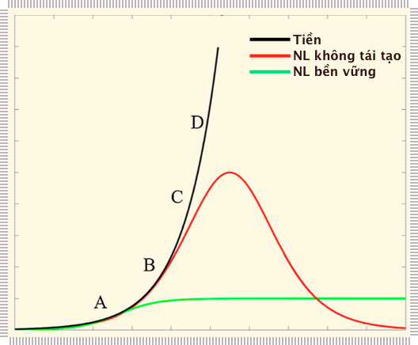{ width="100%" }

!!! quote ""

    **Hình 8**: Con người và khả năng tiếp cận năng lượng

Trong thời kỳ tiền công nghiệp cho đến **Điểm A**, loài người đã di cư khắp hành tinh để tiếp cận các nguồn năng lượng từ mặt trời bằng cách sử dụng công nghệ tương đối đơn giản như nông nghiệp, thuyền buồm, nô lệ và động vật sức kéo. Vào buổi bình minh của cuộc cách mạng công nghiệp, **Điểm B**, nhân loại đã bổ sung trữ lượng nhiên liệu hoá thạch vào nền kinh tế con người. Không có mô tả hợp lý nào về phần dư Solow (tức là phần tăng trưởng kinh tế không được giải thích bằng lao động hoặc vốn) trong thời gian này vì đường màu đen và đường màu đỏ không tách rời nhau.

**Giữa B và C**, chúng ta gặp phải một cuộc khủng hoảng năng lượng vào những năm 1970, mà chúng ta đã “giải quyết” bằng cách **1)** sử dụng nợ để thúc đẩy tiêu dùng kịp thời và **2)** toàn cầu hóa & gia công phần mềm ở các nơi chi phí sản xuất rẻ nhất. Những thay đổi này cho phép tăng trưởng kinh tế tiếp tục cho đến khi nó gặp rào cản với tài chính thông thường vào năm 2008 (**Điểm C**)&mdash;tại thời điểm đó, các ngân hàng trung ương và chính phủ toàn cầu buộc phải thiết kế lại toàn bộ hệ thống tài chính. Mô hình mới (vẫn đang hoạt động) này liên quan đến các biện pháp như bảo đảm cho các định chế doanh nghiệp “quá lớn để đổ vỡ” (*too-big-to-fail*), lãi suất thấp giả tạo (thậm chí là âm!) (Salmon, 2019), **nới lỏng định lượng** (*quantitative easing*), mở rộng bảng cân đối kế toán của ngân hàng trung ương và thay đổi điều luật để hỗ trợ tăng trưởng GDP. Việc tiếp tục tăng tín dụng toàn cầu cho phép tiếp cận với các lớp tài nguyên đắt đỏ hơn, nhiều chương trình xã hội hơn, tài trợ giá rẻ cho năng lượng tái tạo và quay trở lại mô hình tăng trưởng kinh tế kể từ năm 2009. Chúng ta hiện đang hướng tới **Điểm D**, nơi tiền tệ trên danh nghĩa đại diện cho thực tại nền kinh tế toàn cầu toàn cầu tiếp tục **tách rời** (*decoupling*) khỏi thực tế lý-sinh cơ bản (đường cong màu đỏ).

Kể từ năm 2007, chúng ta đã tăng nợ toàn cầu nhanh hơn 3,5 lần so với tốc độ tăng trưởng kinh tế của, đưa tỷ lệ nợ trên GDP toàn cầu lên hơn 300%. Hầu hết các chuyên gia đều biết về **Điểm D**, nhưng do văn hoá  mù năng lượng nên nhìn chung không nhận thức được điểm này liên quan đến đường đỏ, hoặc thậm chí hình dung sự có mặt là có đường màu đỏ. Sau cùng, chúng ta sẽ phát hiện ra rằng đường màu đen (tiền và tín dụng) cũng có giới hạn, những giới hạn này rút cục cũng bị ràng buộc với sự tăng trưởng vốn được hỗ trợ bởi sự sẵn có và chi phí của năng lượng và tài nguyên.

### Con người → Xã hội hữu cơ

Chúng ta sử dụng năng lượng để tạo ra công vì bộ não của chúng ta tìm kiếm những trạng thái cảm xúc tương tự như trạng thái cảm xúc của tổ tiên&mdash;**cân bằng nội môi về thể chất và cảm xúc** (*physical and emotional homeostatis*), **sự thoải mái** (*comfort*), **địa vị** (*status*), **sự phấn khích** (*excitement*), **thư giãn** (*relaxation*), v.v., tất cả đều được điều chỉnh bởi hormone, chất dẫn truyền thần kinh và tín hiệu nội tiết. Đối với một nhà sư Tây Tạng, **“trạng thái thoải mái”** (*state of comfort*) này có thể là việc ngồi yên lặng cả ngày trên một chiếc ghế gỗ, nhưng đối với hầu hết con người trong nền văn hóa tiêu dùng hiện đại, đạt được trạng thái cảm xúc này có nghĩa: ăn ở một nhà hàng tốt hơn, mua một chiếc xe hơi tốt hơn, có máy máy điều hoà nhiệt độ, internet tốc độ cao, di chuyển nhanh hơn, v.v. Đối với hầu hết mọi người, những sở thích này có mối tương quan chặt chẽ với các thiết bị và quy trình cần năng lượng. Tổ tiên của chúng ta không sống với Instagram, trò chơi Fortnight, xe Tesla, sushi hay Netflix. Cơn nghiện các kích thích hiện đại và sự thoải mái buộc chúng ta phải tiêu thụ tài nguyên.

Thêm nữa, chúng ta không chọn chờ đợi hoặc trì hoãn việc tiêu thụ và trải nghiệm. Thay vào đó, chúng ta rất ưa thích những **trải nghiệm tích cực** (*positive experiences*) trong thời điểm hiện tại. Ngay cả những người hiểu biết về sinh thái cũng sẽ tránh các phương pháp “bền vững” giúp đạt được các mục tiêu như nhau nhưng cần nhiều thời gian hơn. Vì tiêu dùng đòi hỏi năng lượng và chúng ta (thường) thích sự hài lòng ngay lập tức, nên chúng ta có thể hiểu hành vi của mình được liên kết như thế nào với sức mạnh (năng lượng/thời gian) trong thế giới thực. Việc tìm kiếm **“sức mạnh”** (*power*) này của các cá nhân, tổng hợp lại ở cấp độ nền kinh tế, cũng giải thích sự thúc ép của nợ, kéo theo mức tiêu thụ năng lượng và vật chất trong thời điểm hiện tại (thay vì tương lai).

### Xã hội hữu cơ: mù quáng, đói kém và trách nhiệm

Qua trình bắt đầu từ khoảng 11.000 năm trước khi những người săn bắn hái lượm hợp tác để thu được thặng dư vật chất từ ​​đất đai, đã biến thành một nền văn hóa nhân loại kết nối toàn cầu nhằm tối đa hóa các **đại diện tài chính** (*financial reprenstations*) của **thặng dư vật chất** (*physical surplus*). Để theo đuổi tăng trưởng kinh tế, văn hóa loài người hiện đại xuất hiện như một Xã hội hữu cơ tự tổ chức, không cần trí óc, theo đuổi năng lượng, hoạt động theo những cách tương tự như một con trùng biến hình [amip](https://vi.wikipedia.org/wiki/Amip) không não sử dụng các kích thích đơn giản để tồn tại. Nhưng lí do là gì và xã hội hữu cơ này đã phát triển như thế nào?

Trong tự nhiên, một cá thể sáo đá (*starling*) tuân theo ba quy tắc đơn giản như sau:

1. Làm những gì các cá thể bên cạnh làm 
2. Đừng bay quá gần nhau
3. Bay về phía trung tâm của đàn

Khi hàng chục ngàn con sáo đá tuân theo những quy tắc đơn giản này, chúng ta sẽ thấy một tiếng rì rào phức tạp, tuyệt hay trên bầu trời. Đây là một kết quả **đột sinh** (*emergent*) không thể dự đoán được từ cấu trúc sinh học và hành vi của từng con chim.

Theo những cách tương tự, thặng dư tạo ra “đòi hỏi” cho siêu tổ chức kinh tế toàn cầu dẫn đến các hành vi tương ứng như tính hám lợi, lòng tham muốn sở hữu và các **hành vi cá nhân được đơn giản hóa** (*simplified individual behaviors*). Ngày nay, hầu hết con người hiện đại&mdash;với tư cách cá nhân&mdash; đều tuân theo 3 quy tắc đơn giản sau:

1. Thực hiện các thuật toán tìm kiếm tối ưu bằng cách phối hợp với những người khác (gia đình, doanh nghiệp nhỏ, tập đoàn, quốc gia) để đạt được thặng dư tài chính
2. Theo đuổi các hành vi được chấp nhận về mặt văn hóa
3. Chi tiêu phần tài chính thặng dư cho những thứ hoặc trải nghiệm thoải mái, vui vẻ (miễn là được chấp nhận về mặt văn hóa)

Trong một nền văn hóa toàn cầu tối đa hóa giá trị thặng dư, do đó, bộ não con người liên quan đến việc sử dụng năng lượng thông qua việc **“theo đuổi sự thoải mái”** (*pursuit of comfort*) và **“tránh khổ đau”** (*avoidance of pain*). Tóm lại, nền kinh tế của con người cần có năng lượng giống như động vật ăn thức ăn, hay cây sồi mọc lá.. **Đặc tính mới đột sinh** (*emergent property*) của 7,7 tỷ người (năm 2019) trải qua cuộc sống hàng ngày tuân theo các quy tắc đơn giản như trên là một “Xã hội hữu cơ siêu thực thể” với chuyển hoá năng lượng ở mức 17 TW[^4].

[^4]:
 
    Các phong trào phản văn hóa liệu sẽ có tác động nào đối với Xã hội hữu cơ này? Cho đến nay, những người từ chối tiêu dùng (*reject consumption*) và thực hiện những hành vi thông thường thiếu suy nghĩ (*mindless conventional behavior*) chỉ có tác động không đáng kể đến việc sử dụng năng lượng toàn cầu và lượng khí thải carbon. Tuy nhiên, trong bối cảnh của bài viết này, hoạt động phản văn hóa cũng đang cho thấy sự phát sinh những kết quả mới và có thể được chứng minh là hiệu quả khi giúp chuyển hướng hay điều chỉnh Xã hội hữu cơ.

## 6. Những hệ quả (*Implications*)

Có nhiều hệ quả từ việc loài người hoạt động hiệu quả như một Xã hội hữu cơ.

### Tổng sản phẩm quốc nội (GDP) → tổng đốt cháy (năng lượng) thế giới (GWB)

Các quy luật mở rộng quy mô sinh học tuân theo sự phát triển tự nhiên, sự phát sinh của các mạng lưới&mdash;trong trường hợp của động vật, một mạng lưới tuần hoàn máu vận chuyển huyết sắc tố đi khắp “thể tích” của tổ chức sinh vật. **Định luật Klieber** quan sát thấy rằng quá trình chuyển hóa năng lượng của động vật tỷ lệ thuận với lũy thừa 3/4 khối lượng của chúng. Dòng năng lượng dầu mỏ lưu chuyển trong các nền kinh tế hiện đại có thể được ví như dòng máu ở động vật có vú với các tĩnh mạch và động mạch là các nút giao thông hàng không, đường biển và đường bộ toàn cầu của thế giới con người. Hầu như tất cả cơ sở hạ tầng của con người&mdash;trạm xăng, diện tích bề mặt đường xá, bệnh viện, v.v., đều được mở rộng quy mô bằng cách sử dụng các **mối quan hệ đối xứng sinh học tương tự** (*biological allometry relationships*). Các liên kết&mdash;như tĩnh mạch trong cơ thể, phương tiện truyền thông xã hội, điện thoại hay đường cao tốc, được nhân lên ở quy mô khoảng 1/2 bình phương số nút (0,5n^2^). Mỗi nút này cần năng lượng để duy trì và các nút mới cần năng lượng để kết nối. Do đó, xã hội loài người hiện đại có thể được xem như một xã hội hữu cơ siêu thực thể hay siêu tổ chức sinh vật, có mức chuyển hóa năng lượng gia tăng theo luỹ thừa 3/4 của quy mô GDP toàn cầu ở. Nhưng động vật lớn hơn&mdash;và các nền kinh tế lớn hơn hoạt động hiệu quả hơn, đó là lý do tại sao quy mô không gia tăng theo tỉ lệ 1:1.

Tăng trưởng kinh tế chỉ có thể trải qua tình trạng **“tách rời tuyệt đối”** (*absolute decoupling*) nếu chúng ta tăng GDP trong khi giảm mức tiêu thụ năng lượng sơ cấp. Sự tách rời tương đối xảy ra khi tổng năng lượng sơ cấp tăng nhưng với tốc độ nhỏ hơn mức tăng của GDP. Kể từ hai thống kê này bắt đầu được ghi chép vào năm 1965, không có sự tách rời tuyệt đối trên qui mô toàn cầu và sự tách rời tương đối xảy ra không đáng kể (0,5%). Từ năm 2012–2017, dường như có sự gia tăng trong việc tách rời tương đối nhưng điều này chủ yếu là do phần lớn GDP được cấu thành bởi sang **tài sản (ảo) tài chính** (*financial (virtual) assets*) , ngụ ý mối liên kết năng lượng/nền kinh tế thậm chí còn chặt chẽ hơn một khi hệ thống tài chính hiệu chỉnh lại. Việc chuyển dịch sang các nền kinh tế “dịch vụ” cũng không làm giảm mối liên hệ chặt chẽ giữa GDP vànăng lượng.

Mọi hàng hóa và dịch vụ trong nền kinh tế toàn cầu (hay của chính người đọc) đều bắt đầu từ đâu đó bằng một ngọn lửa nhỏ (ngụ ý việc đốt nhiên liệu). Chúng ta không thể tách rời mối quan hệ cơ bản này trên cơ sở tuyệt đối, và sự tách rời tương đối sẽ không đáng kể bất cứ khi nào là tăng trưởng GDP còn là mục tiêu của văn hóa con người. GDP là một thước đo nghèo nàn về sự tiến bộ về văn hóa và phúc lợi của chúng ta. Tuy nhiên, đây là một thước đo khá hợp lý tổng năng lượng mà con người đốt cháy: **GWB** (*Gross World Burning*)&mdash;Tổng lượng đốt cháy thế giới.

Về nguyên tắc, một siêu thực thể có thể trở nên siêu thông minh nhưng xã hội hữu cơ của chúng ta thì không. Vào những năm 1930, các nhà kinh tế đã chọn GDP làm thước đo để theo dõi hoạt động kinh tế chứ không phải là mục tiêu cuối cùng. Tuy nhiên, gần 100 năm sau, các nền kinh tế của chúng ta đã vô thức và không ngừng theo đuổi củ cà rốt GDP, thường hướng tới những nỗ lực phù phiếm hứa hẹn mang lại lợi nhuận tài chính lớn nhất trong thời gian ngắn nhất. Hiện tại, không có ai lèo lái chiếc xe buýt xã hội này, không phải tỷ phú, chính trị gia hay một nhóm bí mật nào. Tất cả chúng ta đều bị cuốn vào mệnh lệnh tăng trưởng toàn cầu, vốn không thể biết tự phê phán. Cũng giống như cách mà những con kiến theo đuổi các nhiệm vụ riêng lẻ vì sự phát triển của đàn, con người đã thuê ngoài những tác vụ cá nhân cho  (điện toán) “đám mây”, bản thân nó vốn không có bộ não thực sự. Càng nhiều người tham gia vào một quyết định/quy trình, thì các quyết định của chúng ta càng giống với xu hướng hành vi của vi khuẩn đơn giản, vô thức hướng tới việc **thu thập năng lượng** (*energy acquisition*). Ở cấp độ cao nhất, nền kinh tế toàn cầu đang vận động giống như tiếng chim sáo đá réo rắt tuân theo các **quy tắc đột sinh đơn giản** (*simple emergent rules*). Vào năm 2019 Sau Công Nguyên, kết quả nổi bật của hơn 7,7 tỷ vượn nhân sống cuộc sống hàng ngày của mình là một xã hội hội hữu cơ siêu thực thể mưa cầu năng lượng, vượt ngoài tầm kiểm soát của chính nó, nhưng vẫn đói khát. Xã hội hữu cơ siêu thực thể này không phải là con người. Nó là một tổ chức **sinh vật tự thân** (*thing-in-itself*) (*Ding an sich*) với bản năng sinh tồn của chính nó chi phối các cá nhân con người tạo nên nó.

### Biến đổi khí hậu và rủi ro từ đại dương&mdash;quá trình trao đổi chất của xã hội hữu cơ siêu thực thể

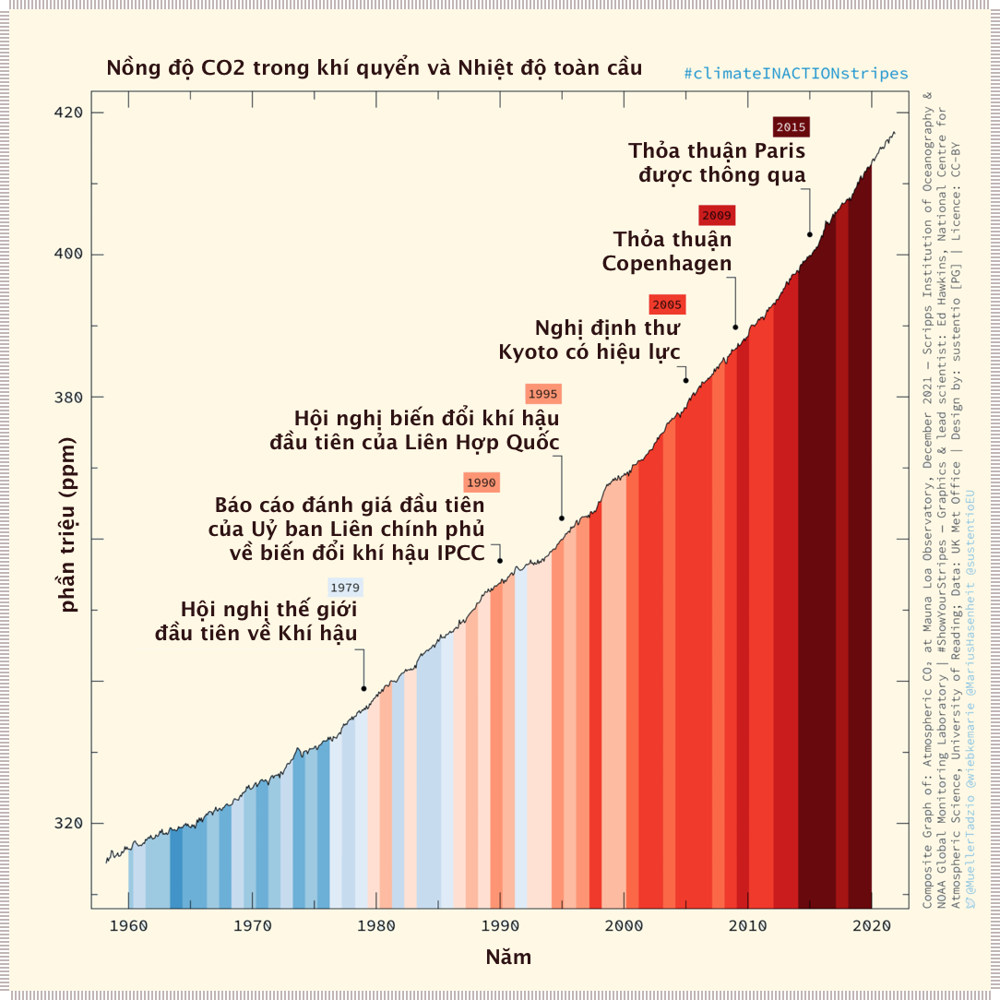

!!! quote ""

    **Hình 9**: Nồng độ CO~2~ trong khí quyển, nhiệt độ toàn cầu và các mốc sự kiện nổi bật

**Hình 9** mô tả nồng độ CO~2~ theo thời gian với nhưng nỗ lực chủ yếu để giảm lượng khí thải. Bất chấp những nỗ lực này, 2018 (năm bài này được viết) đánh dấu năm có nhiều năng lượng nhất từng bị đốt cháy, lượng CO~2~ do con người thải ra nhiều nhất và nồng độ khí quyển cao nhất trong hơn ba triệu năm qua. Do mối liên hệ trực tiếp giữa các nền kinh tế của con người với “lửa” và nhiệt lượng carbon, biến đổi khí hậu và axit hóa đại dương đang&mdash;và mối quan hệ này sẽ vẫn duy trì trong tương lai&mdash;liên quan trực tiếp đến quá trình trao đổi chất của các nền kinh tế con người. Một phát hiện chính trong đánh giá khí hậu AR5 là động lực phát thải lớn nhất trên toàn cầu là **tăng trưởng thu nhập** (*growth in income*). Từ mối quan hệ chặt chẽ bằng hàm số luỹ thừa được mô tả ở trên suy ra rằng mức tiêu thụ kinh tế hiện tại sẽ không khả thi nếu không có mức tiêu thụ nhiên liệu hoá thạch. Trong một hệ thống kinh tế phụ thuộc vào năng lượng để phát triển, việc thúc đẩy các cử tri lựa chọn việc giữ nhiên liệu hoá thạch trong lòng đất (thay vì khai thác và tiêu thụ) cũng giống như việc tranh cãi với một đám cháy rừng. **Do đó, biến đổi khí hậu và sự giảm thiểu các tác động của nó thực chất là hệ quả của xã hội hữu cơ siêu thực thể**[^5].

[^5]:

    Có một điều trớ trêu ở đây: sự ổn định khí hậu đã sinh ra nền nông nghiệp của con người, thứ đã sinh ra xã hội hữu cơ siêu thực thể thông qua công nghiệp hóa và nhiên liệu hoá thạch, giờ đây lại đang gây bất ổn cho khí hậu.

### Dân số

Dân số quá đông cũng là hệ quả của động lực tăng trưởng của xã hội hữu cơ siêu thực thể này. Nền kinh tế toàn cầu và các hệ thống tiền tệ đòi hỏi và phụ thuộc vào tăng trưởng. Tăng trưởng đòi hỏi tiêu dùng. Tiêu dùng đòi hỏi người tiêu dùng. Người tiêu muốn thêm nhiều em bé hơn. Ở các nước có dân số giảm (ví dụ: Đan Mạch), các chính phủ hiện trả tiền cho việc quảng cáo để các cặp đôi thực hiện các **“kỳ nghỉ gợi cảm”** (*sexy vacation*). Vì hệ thống kinh tế hiện tại đòi hỏi sự tăng trưởng, chúng ta cần ai đó để trả tiền mua đồ chơi, tã lót, giáo viên và lương hưu. Một **cuộc đình công không sinh con** (*baby strike, hay không sinh con*) (vốn khó xảy ra) sau cùng sẽ phá vỡ các **đòi hỏi tài chính** (*financial claim*) đối với **năng lượng trong tương lai** (*future energy*). Khí hậu và dân số quá đông là hệ quả về hành vi xuất phát từ văn hóa trọng GDP của nhân loại. Chúng ta có thể “giải quyết” những vấn đề này, nhưng phải đến khi xã hội hữu cơ siêu thực thể **a)** thu nhỏ lại **b)** chuyển hướng phát triển khác hay **c)** bị lật đổ.

### Năng lượng tái tạo

Ngoài sự tách rời năng lượng một cách tuyệt đối hoặc tương đối, còn có sự **tách rời carbon** (*carbon decoupling*)&mdash;cùng một mức GDP sử dụng ít carbon hơn. Các phương tiện truyền thông về môi trường đã phổ biến câu chuyện cho rằng chúng ta có thể **khử cacbon** (*decarbonization*) hoàn toàn cho nền kinh tế. Những người ủng hộ quan điểm này chỉ ra thực tế là kể từ năm 2003, hơn 20 quốc gia, bao gồm Hoa Kỳ và Vương quốc Anh, đã giảm phát thải khí nhà kính trong khi tăng trưởng phát triển nền kinh tế. Tuy nhiên, cách tính toán này bỏ qua việc các nền kinh tế này đã xuất khẩu hoạt động sản xuất sử dụng nhiều carbon của mình sang các nước có lao động giá rẻ. Chỉ riêng lĩnh vực công nghiệp của Trung Quốc đã sử dụng nhiều năng lượng gần bằng toàn bộ nền kinh tế Hoa Kỳ (Cục Thống kê Quốc gia, 2018) và Hoa Kỳ hiện nhập khẩu những gì nước này trước đây đã tự sản xuất.

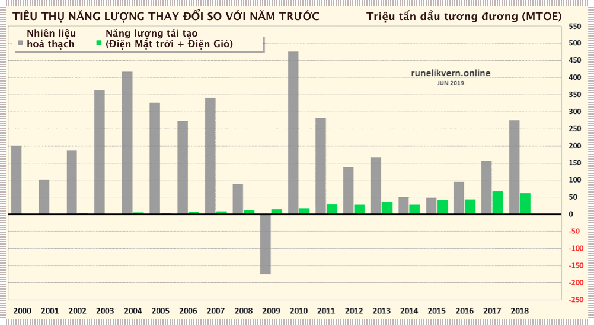

!!! quote ""

    **Hình 10**: Tiêu thụ năng lượng từ Nhiên liệu hoá thạch và năng lượng tái tạo

Lượng khí thải carbon và hoạt động kinh tế có thể được “tách rời” nếu chúng ta tăng sản xuất năng lượng phi hóa thạch nhanh hơn tốc độ tăng tiêu thụ năng lượng (về cơ bản: nhanh hơn tốc độ tăng trưởng kinh tế). Nhưng điều đó không xảy ra trên toàn cầu. **Hình 10** cho thấy sự gia tăng tiêu thụ nhiên liệu hoá thạch và năng lượng tái tạo trong thế kỷ này. Năm duy nhất mà mức tiêu thụ nhiên liệu hóa thạch giảm (hoặc tăng ít hơn năng lượng tái tạo) là trong giai đoạn cuộc khủng hoảng tài chính toàn cầu năm 2009. Trên thực tế, mức tăng nhu cầu điện toàn cầu chỉ trong năm 2018 nhiều hơn toàn bộ công suất lắp đặt trong lịch sử của điện mặt trời (theo BP, 2019). **Hình 10** cho thấy rằng các giải pháp thực chất duy nhất cho vấn đề **quá tải** (*overshoot*) (như mức tiêu thụ tài nguyên chẳng hạn) và phát thải khí nhà kính sẽ bao gồm việc thu hẹp qui mô kinh tế chứ không phải là tăng trưởng.

Xã hội hưu cơ siêu thực thể tăng trưởng, và không (tự nguyện) co lại. Theo logic này, chúng ta sẽ phải thay đổi các hệ thống kinh tế trước khi có thể khử cacbon một cách có ý nghĩa cho nền kinh tế. Ngay cả sự chuyển dịch từ việc dùng gỗ làm chất đốt sang than đá cũng không thực sự là một “sự chuyển đổi” mà chỉ là một phần bổ sung. Ngày nay, chúng ta đang tiêu thụ nhiều sinh khối rừng hơn trên toàn cầu so với thời kỳ đầu của cuộc cách mạng công nghiệp. Tương tự như vậy, năng lượng tái tạo đang bổ sung năng lượng chứ không phải thay thế nhiên liệu hoá thạch. Nếu điều này tiếp tục, **năng lượng tái tạo** (*renewables*)[^6] sẽ tiếp tục phát triển trên quy mô lớn hơn, nhưng cũng chỉ là một phần của cấu trúc tiêu thụ năng lượng và phát thải khí nhà nhiều hơn. Ngoài ra, từ năm 1970 đến năm 2010, ước tính tổng lượng khai thác tài nguyên thiên nhiên toàn cầu từ Trái đất (nhiên liệu, quặng, muối, sinh khối, v.v.) đã tăng gấp 3,2 lần từ 22 lên 70 tỷ tấn ([Bảng Tài nguyên Quốc tế của UNEP, 2016](http://refhub.elsevier.com/S0921-8009(19)31006-7/sbref0685)). Trong cùng khoảng thời gian này, quy mô của nền kinh tế thế giới, được điều chỉnh theo lạm phát, đã tăng gấp 3,4 lần từ 18,9 lên 65,6 nghìn tỷ Đô-la Mĩ. Để có thêm một đơn vị **Tổng sản phẩm quốc nội thế giới** (*Global World Product&mdash;GWP*), chúng ta cần thêm gần một đơn vị tài nguyên thiên nhiên. Nếu chúng ta duy trì tiêu thục ở mức 17 TerraWatt (nghìn tỷ Watt), cho dù sử dụng nhiều carbon hay trung hòa carbon trong sản phẩm dịch vụ, chúng ta vẫn sẽ cần khoản 1 kg khoáng chất và vật liệu cho mỗi 2 Đô-la Mĩ trong GDP toàn cầu. Vật lý gợi ý rằng điều này là không thể, và câu trả lời của chúng ta chủ yếu sẽ được tìm thấy thông qua những thay đổi xã hội liên quan đến sự thu nhỏ quy mô nền kinh tế, chứ không phải bằng các biện pháp kĩ thuật đổi mới dẫn đến tăng trưởng dài hạn.

[^6]: thực chất là **“có thể tái xây dựng”** (*rebuildable*) là về mặt kỹ thuật&mdash;cây sồi và ngỗng có thể tái tạo (thông qua quả sồi và trứng), nhưng năng lượng mặt trời, tua-bin gió, v.v. trong điều kiện tốt nhất “có thể tái xây dựng”, sử dụng cơ sở hạ tầng vật liệu phức tạp trong khi bản thân chúng là sản phẩm của **đội quân hóa thạch** (*fossil army*, hay tổng năng lượng thu được khi sử dụng nhiên liệu hoá thạch tương đương) 500 tỷ người lao động.

### Tín dụng và tài chính hóa

Mặc dù chúng ta hiện đang chứng kiến những tín hiệu đáng ghi nhận về sự bất công, bất bình đẳng giàu nghèo và biến đổi khí hậu là những vấn đề thực tế và cấp bách, nhưng dường như ít nhận thức được những hạn chế liên quan đến năng lượng và tài chính. Hệ thống hiện đại đã sử dụng tài chính để che đậy sự thật rằng chúng ta đã tiêu dùng vượt quá khả năng của mình trong ít nhất 50 năm qua. **Động lực năng lượng/tín dụng/tăng trưởng** (*energy/credit/growth dynamic*) là hiện tượng ít được hiểu nhất nhưng lại quan trọng nhất thúc đẩy tình hình kinh tế và sinh thái toàn cầu hiện nay.

Hãy coi tín dụng như một cây đũa thần, cho phép chúng ta chi tiêu nhiều hơn thu nhập của mình với lời hứa sẽ hoàn trả trong tương lai. Điều này chỉ hoạt động tốt khi nền kinh tế của chúng ta tăng trưởng và có đủ nguồn tài nguyên chưa được khai thác (ví dụ: quay lại năm 1950) cho phép tăng trưởng trong tương lai có thể trả các khoản nợ đó.

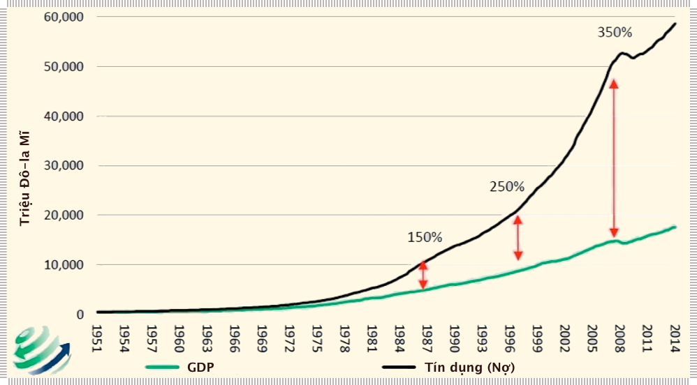

!!! quote ""

    **Hình 11**: GDP và Nợ Hoa Kì 1951-2014. Nguồn: Bloomberg, St. Louis Federal Reserve

**Hình 11** biểu thị nợ (màu đen) so với GDP (màu xanh lá cây) của Hoa Kỳ. Các biểu đồ về nợ/GDP của hầu hết các quốc gia phát triển khác cho thấy các mô hình tương tự. Nếu (chỉ tính riêng) nợ chính phủ không tăng lên, nền kinh tế của chúng ta đã ngừng tăng trưởng hơn một thập kỷ trước. Phần lớn tăng trưởng GDP gần đây của chúng ta chỉ là chi tiêu tiền vay. Trên toàn cầu, **“năng suất nợ”** (*debt productivity*) (bằng tỉ trọng tăng trưởng kinh tế so với tăng trưởng nợ) hiện giảm xuống còn khoảng 30 xu trên một Đô-la Mĩ. Nếu tỷ lệ này bằng 0, chúng ta sẽ thêm nợ chỉ để giữ cho nền kinh tế có cùng quy mô. Chúng ta đã gia tăng các nghĩa vụ trả nợ của mình nhanh hơn mức tăng trưởng của nền kinh tế vì đó là điều bắt buộc. Trên toàn cầu, việc sử dụng cây đũa phép tín dụng thần kỳ tỏ ra nguy hiểm và không bền vững, nhưng xã hội hữu cơ siêu thực thể đòi hỏi chúng ta tiếp tục làm như vậy.

Ví dụ, một lượng lớn tín dụng do Trung Quốc tạo ra kể từ cuộc Đại khủng hoảng tài chính đã làm tăng nhu cầu (và giá cả) đối với hàng hóa và năng lượng trên toàn cầu. Nền kinh tế Trung Quốc hiện nay rất lớn&mdash;xấp xỉ 13 nghìn tỷ Đô-la Mĩ&mdash;nhưng họ đã tạo ra khoảng 55 nghìn tỷ Đô-la Mĩ tín dụng để duy trì mức tiêu dùng hiện tại của mình. Khi tăng trưởng dừng lại&mdash;một điều không thể tránh khỏi&mdash;chỉ riêng Trung Quốc đã có hàng nghìn tỷ Đô-la Mĩ cho **các khoản vay không có tài sản đối ứng** (*unsupported loans*)&mdash;so với 800 tỷ Đô-la Mĩ trong Cuộc khủng hoảng tài chính toàn cầu vào năm 2008/2009.

Năm 2018, tăng trưởng tín dụng toàn cầu bắt đầu chậm lại. Cùng với tốc độ tăng trưởng kinh tế chậm lại, có những dấu hiệu về tác động giảm phát&mdash;bởi nhiều người không còn đủ khả năng chi trả cho những nhu yếu phẩm (lạm phát vẫn còn duy trì&mdash;nhưng chủ yếu trong lĩnh vực chăm sóc sức khỏe, giáo dục, tài sản thực và tài sản tài chính). Trái phiếu toàn cầu có lãi suất âm (một điều không thể tưởng tượng được trong quá khứ) đã đạt tổng trị giá 14 nghìn tỷ Đô-la Mĩ và đang tăng lên. Ở Scandinavia, thế chấp nhà hiện có thể có lãi suất dưới 0. Chi phí vốn thấp này đã khuyến khích các khoản vay mua nhà, nhưng cũng đang làm tê liệt tỷ lệ hoàn vốn đối với người gửi tiết kiệm và gây rủi ro đáng kể cho các quỹ hưu trí vốn phụ thuộc vào lợi nhuận hàng năm 7-8% một năm.

Chúng ta ngày càng nghe nhiều hơn về những rủi ro mà biến đổi khí hậu gây ra đối với bảo hiểm và tương lai tài chính. Người đứng đầu Ủy ban giao dịch hàng hóa tương lai (CFTC) gần đây đã tuyên bố: “Rõ ràng là biến đổi khí hậu gây ra rủi ro tài chính đối với sự ổn định của hệ thống tài chính”.

Điều mà ủy viên CFTC không nói là chính *tài chính* gây ra rủi ro tài chính đối với sự ổn định của hệ thống. Bất chấp việc bơm tín dụng ồ ạt, năng suất trên một đơn vị lao động kể từ năm 2011 đang ở mức thấp nhất trong 40 năm (Cục Thống kê Lao động Hoa Kỳ, 2018). Nếu cộng tất cả các khoản nợ không có tài sản đối ứng cùng với nợ của chính phủ và nợ tư nhân, thì Hoa Kỳ hiện có nghĩa vụ trả nợ tương đương 1200% GDP. Khi tỷ trọng nợ trên GDP tăng lên, **“hiệu suất nợ”** (*debt productivity*) trên mỗi Đô-la tăng thêm sẽ giảm, cuối cùng đạt đến một giới hạn nên đòi hỏi phải: **xóa sổ** (*write-offs*), **tịch thu tài sản thế chấp** (*foreclosures*), **giảm phát** (*deflation*) với hệ quả trong điều kiện tốt nhất là một nền kinh tế nhỏ hơn, và cải cách tiền tệ cùng với rủi ro hệ thống ở trong trường hợp tồi tệ nhất.

Về cốt lõi, nền văn hóa của chúng ta có một mô hình kinh tế vĩ mô sai lầm. Chúng ta đang dần hiểu ra mối quan hệ giữa năng lượng, công nghệ và nền kinh tế. Vẫn chưa biết liệu có tồn tại thứ gọi là **“sự tách rời tín dụng”** (*credit decoupling*) hay không (tăng trưởng tăng, trong khi tín dụng toàn cầu giảm), nhưng dựa trên mối tương quan trong 50 năm qua và mối liên hệ trực tiếp giữa việc tạo ra và chi tiêu tiền bạc, điều này có vẻ khó xảy ra. Các câu hỏi lớn tiếp theo xoay quanh vấn đề “tiền là gì”, và sau đó là đến “chúng ta có một mục đích nhất định nào không?”. Trong lúc này, điều cần quan tâm là chúng ta không thể giải quyết khủng hoảng tín dụng bằng cách sử dụng nhiều tín dụng hơn. Nhớ rằng nợ là một thế chấp về năng lượng. Nếu chúng ta muốn thanh toán các khoản nợ hiện tại của mình, lượng năng lượng cần thiết sẽ rất lớn. Nếu năng lượng không sẵn có và không ở mức giá rẻ, những khoản nợ đó sẽ không bao giờ được hoàn trả, một điều đã xảy ra trong lịch sử với các khoản nợ hết lần này đến lần khác.

## 7. Sự thu nhỏ vĩ đại (*The great simplification*)

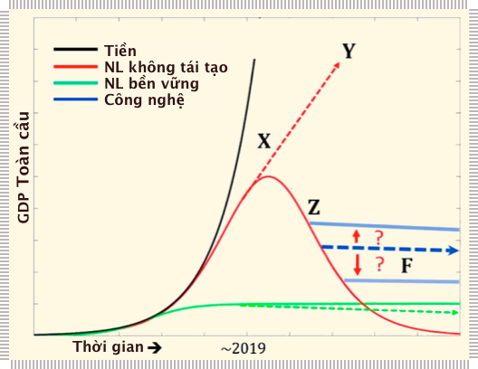{ width="100%" }

!!! quote ""

    **Hình 12**: Sự thu nhỏ vĩ đại (điểm ~Z)

**Hình 12** đưa chúng ta trở lại bức tranh tổng thể. Sau khi làm bất cứ điều gì để tiếp tục tăng trưởng, chúng ta hiện đang tiếp cận **Điểm X**, sử dụng đường màu đèn (tín dụng) để tăng tốc độ việc tiếp cận năng lượng hóa thạch và tài nguyên không thể tái tạo, từ đó tạo ra GDP toàn cầu. Tất cả các chính phủ và các tổ chức lớn trên danh nghĩa đều đang lập kế hoạch tăng trưởng (hướng tới **Điểm Y**). Chúng ta đang sử dụng đường màu đen (tài chính) và những câu chuyện cổ vũ nó để tạm thời kéo dài đường màu đỏ theo hướng đó. Hãy nhớ lại cách nợ kéo các nguồn lực tương lai để sử dụng trong hiện tại ở ví dụ về mỏ dầu. Toàn bộ nền kinh tế cũng không khác. Chúng ta nên lập kế hoạch cho mức năng lượng tiêu thụ xung quanh **Điểm F**, điều này sẽ định hướng một cách có ý thức năng lượng và vật liệu có entropy thấp còn lại của chúng ta để xây dựng cơ sở hạ tầng năng lượng tái tạo và một xã hội chủ yếu dựa vào các nguồn năng lượng của hệ sinh thái[^7]. Tuy nhiên, động lực thị trường của xã hội hữu cơ siêu thực thể chỉ có thể “thấy” và di chuyển về phía **Điểm Y**. Nó không thể nhìn thấy rủi ro của **Điểm Z** (điểm dừng khó khăn nếu chúng ta ngừng sử dụng tín dụng để thúc đẩy tăng trưởng), cũng như cách lập kế hoạch dài hạn cho sản lượng năng lượng ở lân cận **Điểm F**.

[^7]:

    Đường đứt nét màu xanh biểu thị ngưỡng chịu đựng (*carrying capacity*) trong tương lai của các nguồn năng lượng bền vững thấp hơn so với trước đây và giảm dần theo năm do ô nhiễm của con người và tác động đến các hệ thống tự nhiên

Theo phân tích này, việc giảm GDP ở các nền kinh tế tiên tiến hiện có khả năng xảy ra: **1)** khi chúng ta không còn có thể tiếp cận tiêu dùng thông qua việc bổ sung tín dụng, và **2)** với sự chuyển đổi sang năng lượng và tài nguyên chất lượng thấp hơn và tốn kém hơn. Thế kỷ 20 chứng kiến chất lượng năng lượng ngày càng tăng và giá năng lượng giảm. Thế kỷ 21 sẽ là câu chuyện về giảm chất lượng năng lượng và tăng chi phí năng lượng. Song song với việc sử dụng một phần tốt nhất của năng lượng hóa thạch còn lại, chúng ta chắc chắn có thể sử dụng năng lượng tái tạo không liên tục theo những cách có thể cung cấp năng lượng cho một nền văn minh vĩ đại của loài người&mdash;nhưng nó sẽ trông hoàn toàn khác so với nền văn minh chúng ta đang sống và đang lên kế hoạch. Thật không may, xã hội hữu cơ siêu thực thể không thể lập kế hoạch, chỉ tiến về phía trước để tìm kiếm thêm năng lượng và tăng trưởng.

## 8. Các cạm bẫy xã hội

Nhiều thách thức mà chúng ta đối mặt xuất hiện như những cái bẫy xã hội cổ điển, theo đó những áp lực xã hội ngắn hạn hướng dẫn hành vi của cá nhân đi ngược lại lợi ích lâu dài tốt nhất của cá nhân và xã hội đó. Về mặt nhận thức, những hệ quả được trình bày trong bài viết này có thể hiểu được đối với hầu hết những người thông thạo các vấn đề liên quan, nhưng về mặt hành vi, chúng hầu như vẫn là cơn cuồng phong đối với bộ não con người dẫn đến sự phớt lờ hay phủ nhận. Các vấn đề thường phức tạp, trừu tượng, xảy ra trong tương lai, đe dọa đến các chính trị gia và chủ doanh nghiệp, khó trả lời, phần lớn bị các nhà lãnh đạo phớt lờ và khiến người ta chán nản khi nghĩ đến. Thông thường, một mô tả về **thực tại lý-sinh** (*biophysical reality*) của đời sống con người thường gặp phải sự phủ nhận hay sự bài trừ như **chủ nghĩa hư vô** (*nihilism*).

Cả sự phủ nhận và chủ nghĩa hư vô đều giúp tâm trí loại bỏ **những mâu thuẫn nội tâm** (*dissonance*) và do đó ngăn chặn con người tự bào chữa về mặt cảm xúc cho mình khỏi việc bắt tay hành động và thực hiện những thay đổi (vốn không thoải mái) có thể cải thiện cơ hội sinh tồn của con người. Điều này và các cạm bẫy xã hội khác dường như đang ngăn chặn cũng **hành động có ý nghĩa** (*meaningful action*). Tính siêu xã hội dẫn đến việc chúng coi trọng **sự tuân thủ** (*conformity*) hơn **khoa học** (*science*) và coi trọng **sự công bằng của quy trình** (*fairness of process*) hơn **chất lượng của kết quả** (*quality of results*). Chúng ta cố gắng sử dụng các cơ chế phân loại xã hội (độ nổi tiếng/địa vị) để giải quyết các vấn đề phức tạp. Có lẽ cạm bẫy xã hội lớn nhất là việc chúng ta không thực sự cần tiêu thụ tất cả những loại năng lượng và vật chất này để hạnh phúc hay khỏe mạnh. Tuy nhiên, được dẫn dắt bởi **động lực bộc phát** (*emergent drive*) của Xã hội hữu cơ siêu sinh vât, chúng ta để cho các con số về **tiền bạc** (*pecuniary metrics*), sự **so sánh xã hội** (*social comparisons*) và **công nghệ mới** (*novel technology*) lôi kéo vào việc tiêu dùng lãng phí và không cần thiết.

## 9. Thảo luận

!!! quote "Gregory Bateson"

    “Những vấn đề lớn trên thế giới là kết quả của sự khác biệt giữa cách tự nhiên hoạt động và cách con người suy nghĩ”.

!!! quote "Ilya Prigogine"
    
    “Khi một hệ thống ở xa trạng thái cân bằng, những sự mạch lạc (*coherence*) nhỏ có khả năng dịch chuyển toàn bộ hệ thống”.

### Điều gì sẽ xảy ra tiếp theo? Dự đoán về xã hội hữu cơ siêu thực thể

Chúng ta không thể dự đoán chính xác tương lai, nhưng chúng ta ngày càng dám chắc vào những điều sẽ không xảy ra. Căn cứ vào các nền tảng sinh học và xã hội của sự tăng trưởng, chúng ta có thể đưa ra giả thuyết về những kịch bản khó xảy ra:

- Kinh tế toàn cầu tăng trưởng đồng thời giải quyết được vấn đề  biến đổi khí hậu (giảm khí CO~2~) hay ngăn ngừa sự tuyệt chủng hàng loạt lần thứ 6.
- Tăng trưởng kinh tế diễn ra cùng với việc thay thế nhiên liệu hoá thạch bởi các dạng năng lượng khác có hàm lượng khí thải carbon thấp
- Người dân bỏ phiếu hàng loạt ủng hộ việc giữ nhiên liệu hoá thạch còn lại trong lòng đất (mà không khai thác).
- Các nhà lãnh đạo chấp nhận hay chuẩn bị cho sự kết thúc tăng trưởng trước khi nó xảy ra.

Để tránh phải thanh toán hóa đơn những **khoản nợ xã hội** (*societal debt*) đã tích lũy trong nhiều thập kỷ qua, chúng ta có xu hướng tiếp tục đẩy nhanh tiến độ, với nhiều **đảm bảo tài chính** (*financial guarantees*), những câu chuyện và nhiều thay đổi về luật hơn&mdash;tất cả đều theo những cách ngày càng kém bền vững hơn. Trong bối cảnh Xã hội hữu cơ siêu thực thể, chúng ta có thể đưa ra một số dự đoán:

- Khi càng nhiều người nhận ra rằng năng lượng là nền tảng cho tương lai, chúng ta sẽ chứng kiến nhiều kế hoạch tập trung vào năng lượng thô thay vì đóng góp ròng của nó cho xã hội. Nhiều công nghệ sẽ được quảng bá là khả thi, nhưng **không thực tiễn** (*relevant*), không có **giá cả phải chăng** (*affordable*) hay không thể **nhân rộng** (*scalable*) được.

- Chúng ta sẽ tiếp tục tạo ra tiền và tín dụng với hy vọng sự dư dả của chúng sẽ vượt qua được các vấn đề của thế giới vật chất, cho đến khi chính chúng cũng đạt đến giới hạn (không có người vay có đủ điều kiện nào để cấp tín dụng, lãi suất quá cao so với % tăng trưởng, **bờ vực ngân sách** (*fiscal cliff*, sự chênh lệch quá lớn giữa ngân sách và nợ chính phủ), v.v.).

- Để tránh bất ổn xã hội, chúng ta sẽ khắc phục bất bình đẳng giàu nghèo thông qua các chương trình như **Thu nhập cơ bản phổ cập** (*Universal Basic Income*) (Nếu việc “chuyển giao tài sản” như thế này được tiến hành trực tiếp, chúng sẽ ổn định xã hội nhưng tiêu thụ nhiều năng lượng hơn vì chúng chỉ chuyển giao tiền tệ số ngân hàng sang việc tiêu thụ trực tiếp tài nguyên và năng lượng). (Việc này tốt cho người có thu nhập thấp, nhưng không tốt cho cá heo). (Những chuyển đổi này có thể là gián tiếp, ví dụ: việc phục hồi sinh thái, xây dựng cơ sở hạ tầng công cộng địa phương, v.v.).

- Trên khắp thế giới, khi triển vọng kinh tế xấu đi, mọi người sẽ thúc đẩy sự gắn kết nhóm bằng cách đổ lỗi các vấn đề của họ cho các **nhóm bên ngoài** (*outgroup*) và có xu hướng bỏ phiếu cho những nhà lãnh đạo hứa hẹn tương lai kinh tế tốt hơn hay làm cho mọi thứ giống với quá khứ hơn (liên hệ mật thiết với tăng trưởng kinh tế nhiều hơn, với năng lượng, với nhiên liệu hoá thạch). Trump, Bolsonaro, Matteo, LePen, Morrison, v.v. chỉ là những ví dụ gần đây. (Những **người theo phe bảo thủ** (*conservatives*) được liệt kê ở trên, nhưng hầu hết những **người theo phe tự do** (*liberals*) cũng hứa hẹn “tương lai kinh tế tốt hơn”).

- Như Hoa Kỳ và Brazil đã chứng thực, một trong số ít chính sách kinh tế tiêu cực còn lại đã được ban hành như bãi bỏ quy định và loại bỏ các điều luật bảo vệ môi trường. Khi nền kinh tế trở nên tồi tệ hơn, các sáng kiến môi trường (ví dụ như giảm thiểu tác động của biến đổi khí hậu) sẽ trở nên ít phổ biến hơn&mdash;không phải vì mọi người không tin tưởng hoặc ít quan tâm hơn mà vì họ sẽ có ít khả năng tài chính và cảm xúc để ủng hộ cho những giải pháp này.

- Là một hệ thống kinh tế được kết nối toàn cầu, chúng ta có thể sẽ làm bất cứ điều gì có thể để bảo vệ những gì đang có. Chúng ta bị cuốn vào vòng xoáy: tăng trưởng, có giới hạn đặt ra cho tăng trưởng, đối phó với các giới hạn này, tăng trưởng nhiều hơn, chạm nhiều giới hạn hơn, và nhiều đối phó hơn.

### Tiến hóa văn hóa và xã hội hữu cơ siêu thực thể

Chúng ta là thành viên của một loài mang tính xã hội cao hợp tác ở nhiều quy mô khác nhau để thực hiện các thuật toán tìm kiếm thức ăn tối ưu trong một môi trường mới lạ, giàu tài nguyên. Điều này dẫn đến việc theo đuổi tăng trưởng kinh tế một cách bền bỉ. Mệnh lệnh tăng trưởng này hiện được nhấn mạnh bởi:

- Tạo ra dòng tiền không bị ràng buộc với tài nguyên vật chất
- Không tạo ra **“lãi suất”** (*interest*) cần thiết khi tiền được tạo ra
- Ngày càng sử dụng các phương tiện tài chính để giải quyết các vấn đề do tài chính gây ra.

Con người, với tư cách là một loài, vào khoảng năm 2020 Sau Công Nguyên, đang hoạt động về mặt sinh thái như một cấu trúc tiêu thụ năng lượng không có trí tuệ. Chúng ta có thể thay đổi để trở nên tốt hơn hay không? Các sự kiện trong những thập kỷ tới sẽ mở ra cơ hội cho các nền văn hóa vốn bị đóng băng, nhưng sẽ diễn ra theo **từng bước** (*stepwise*). Có thể chúng ta sẽ không thể giải quyết các vấn đề môi trường của mình thông qua các quy tắc và **cơ cấu định giá mới** (*pricing structure*), trong khi đó cũng ngăn chặn được rủi ro tín dụng, đặt ra các giới hạn tăng trưởng, gia tăng sự gắn kết xã hội và giảm thiểu chủ nghĩa dân túy. Có khả năng chúng ta sẽ phải giải quyết các vấn đề xã hội và tài chính trước khi có thể đưa ra giải pháp tích hợp với các vấn đề dài hạn hơn liên quan đến hệ sinh thái và những khát vọng văn hóa tốt đẹp hơn.

Con người đã vô tình bị mắc kẹt trong **Bẫy Carbon** (*Carbon Trap*)&mdash;theo đó, để duy trì lối sống và sự tồn tại của mình, chúng ta phải tiếp tục đốt cháy lượng carbon cổ xưa (nhiên liệu hoá thạch) đang hủy hoại thế giới tự nhiên một cách không kiềm chế. Không ai phải nhận lỗi cho cái bẫy này nhưng tất cả chúng ta đều là đồng lõa. Chúng ta cần rút lui đội quân hoá thạch tương đương 500 tỷ người; nhưng nếu thực sự làm điều này, nó sẽ thay đổi lối sống của con người theo những cách mà chúng ta muốn chống lại.

Cấu trúc Xã hội hữu cơ siêu thực thể của loài người Homo sapiens nghe có vẻ không đẹp lắm, nhưng nó có thể trình bày thực tế một cách sáng suốt và đầy hy vọng. Hiểu rằng con người với số lượng lớn có thể **tự tổ chức một cách có thể dự đoán được** (*predictably self-organize*) bằng cách tuân theo các xu hướng điều chỉnh **quy mô năng lượng đơn giản** (*simple energy scaling tropism*) cho chúng ta cơ hội hình dung và chuẩn bị cho những gì có thể xảy ra (hiệu chỉnh lại tài chính, sử dụng ít năng lượng và nguyên vật liệu hơn, phát triển nhiều hơn nền kinh tế địa phương, sử dụng ít carbon hơn, v.v.). Nhận thức này **trao quyền** (*empower*) cho cá nhân và các nhóm nhỏ theo đuổi các con đường sáng tạo để **giảm nhẹ các tác động** (*mitigation)*  và **lập kế hoạch** (*planning*) trong tương lai bên ngoài&mdash;hay song song với&mdash;xã hội hữu cơ siêu thực thể của con người.

Sau cùng, ngay khi phát hiện ra rằng chúng ta đang sống trong một **thế giới nhật tâm** (*heliocentric*) và rằng chúng ta đã tiến hóa, giờ đây chúng ta bắt đầu nhận ra mình là một phần của xã hội hữu cơ siêu thực thể phát sinh một cách tự nhiên trên thực tế đang ăn mòn hành tinh này. Nếu chúng ta đã hiểu ra điều đó, những con đường mới nào có thể được mở ra? Chúng ta sẽ không thay đổi về mặt sinh học&mdash;nhưng văn hóa và hệ thống kinh tế của chúng ta thì có thể thay đổi. Chúng ta sẽ sử dụng việc hiệu chỉnh lại hệ thống tài chính/năng lượng sắp tới như thế nào để hướng tới một hệ thống chậm hơn, khôn ngoan hơn và ít gây thiệt hại hơn? Những loại giải pháp nào sẽ mang lại lợi ích? Những câu chuyện về văn hoá nào chúng ta sẽ cần?

Có một xu hướng gần đây trên các phương tiện truyền thông nói về môi trường khẳng định rằng biến đổi khí hậu là rủi ro hệ thống chính mà nền văn minh phải đối mặt. Một trong những điểm chính của bài báo này gợi ý rằng biến đổi khí hậu là một triệu chứng của sự rối loạn chức năng lớn hơn nhiều. Tất cả các rủi ro liên quan đến nhau đều cho thấy sự sụt giảm mang tính áp đặt sắp diễn ra của dòng lượng năng lượng/vật liệu khai thác trong những thập kỷ tới. Có 2 hệ quả chính của việc này:

1. Các xã hội cần chuẩn bị về thể chất và tâm lý cho các tình trạng sử dụng ít tín dụng hơn, ít tính phức tạp, ít năng lượng/vật chất hơn, và sẽ cần các **cấu trúc hỗ trợ xã hội** (*social support structures*) cho những người rơi ra khỏi guồng quay kinh tế hiện có, và

2. Chúng ta cần một kế hoạch chi tiết dựa trên khoa học mô tả cách một hệ thống nền kinh tế mới dựa trên thực tế lý-sinh có thể xuất hiện từ **sự thu nhỏ vĩ đại này** (*Great Simplification*)&mdash;ví dụ: đánh thuế đối với năng lượng không tái tạo (không chỉ carbon mà cả các nguồn tài nguyên đang cạn kiệt nhanh chóng khác), giảm vai trò của tài chính kiểu sòng bạc, đặt ra thu nhập tối thiểu và trần thu nhập, v.v., tất cả đều cần được hiểu ở cấp độ sinh tồn của loài người. Đây là vết nứt nhỏ trong bộ giáp của xã hội hữu cơ siêu thực thể. Chính tại đây, chúng ta nên ngắm bắn bằng mũi tên của những tư tưởng kinh tế không chính thống và chương trình nghiên cứu về Kinh tế học Sinh thái (mang tính hệ thống) trong 30 năm tới.

Khái niệm về sự **“sụp đổ” của xã hội** (*societal collapse*) hiện đã xuất hiện trên các phương tiện truyền thông chính thống. Từ “sụp đổ” thấm nhuần một mục đích cuối cùng. Nó nghe có vẻ nhị phân&mdash;có hoặc không. Tình trạng của chúng ta mang nhiều sắc thái hơn, phân tán về mặt địa lý và hành động vẫn có thể được thực hiện để mang lại kết quả. Bằng cách phát triển vô độ, giờ đây chúng ta phải đối mặt với một kịch bản về việc (nền văn minh) bị “bẻ cong” hoặc “phá vỡ”. Chúng ta phải đối mặt với một thách thức phức tạp để tránh bị “phá vỡ” bằng cách “bẻ cong”. Sự bẻ cong này sẽ bao gồm quá trình **“tái kết nối”** (*recoupling*) với thiên nhiên và với nhau, đồng thời sử dụng ít tài nguyên không thể tái tạo hơn. Về mặt vật lý, điều này là có thể. Ví dụ: GDP bình quân đầu người của Hoa Kỳ giảm 30% sẽ đưa quốc gia này trở lại mức GDP bình quân đầu người của những năm 1990 và GDP bình quân đầu người giảm 50% sẽ đưa Hoa Kỳ trở lại mức của năm 1973.

Thách thức thực sự sẽ bắt đầu khi tăng trưởng kết thúc. Sau cùng, chúng ta có thể phải đối mặt với một cuộc suy thoái toàn cầu và những chuyển biến đầy thách thức khác tách khỏi quỹ đạo phát triển gần đây của chúng ta. Những ai hiểu và quan tâm đến những điều này, những ai có **hỗ trợ về mặt xã hội** (*social support*), một chút nguồn lực và sức khỏe tâm lý, **đều cần phải hành động**. Đây không phải là lúc để giảm thiểu tác động cá nhân của chúng ta, điều này chỉ khiến chúng ta trở thành một phần nhỏ hơn của 1 phần 8 tỷ trong xã hội hữu cơ siêu thực thể này. Những người hiểu được vấn đề cần phải có hoạt động có hiệu quả ở quy mô lớn hơn. Chúng ta cần tối đa hóa tác động của mình trong không gian loài người Homo sapiens này. Các giải pháp giờ đây mang tính xã hội cũng nhiều như tính kỹ thuật.

## 10. Kết luận

!!! quote "Joanna Macy""

    “Hiện đã có một thứ khoa học đã sẵn sàng để xây dựng câu chuyện về cuộc hành trình mà chúng ta đã thực hiện trên Trái đất này, câu chuyện kết nối chúng ta với muôn loài. Ngay bây giờ chúng ta cần ghi nhớ câu chuyện này&mdash;để gặt hái (*havest*) và để thưởng thức (*taste*). Do chúng ta đang trong thời kỳ khó khăn. Và chính kiến thức về câu chuyện lớn hơn này sẽ đưa chúng ta vượt qua”. 

Một bầy vượn khá thông minh, có tính xã hội cao đã đột nhập vào một lọ bánh quy chứa năng lượng hóa thạch và tổ chức tiệc tùng trong 150 năm qua. Các điều kiện tại bữa tiệc không tương thích với thực tế lý-sinh của hành tinh. Bữa tiệc sắp kết thúc và khi trời sáng, những thay đổi căn bản sẽ áp đặt lên lối sống của chúng. Một số cá thể vượn cần phải tỉnh táo (trước khi trời sáng) và tạo ra một kế hoạch mà những cá thể còn lại tham gia bữa tiệc sẽ đồng ý. Nhưng loài vượn khá thông minh, có tính xã hội cao này không dễ dàng hay tự nguyện thực hiện những thay đổi triệt để đối với cách sống của chúng. Và vì vậy, cà phê và chất kích thích (tín dụng, v.v.) sẽ được tiêu thụ trong một bữa sáng xa hoa khác, với bóng tối đã xa dần. Trời đã tảng sáng rồi.

Có khả năng là, trong một tương lai không xa, quy mô, độ phức tạp và “tốc độ đốt cháy” (theo nghĩa đen) của nền văn minh của chúng ta sẽ bị suy giảm đi nhiều bởi các lực lượng khác ngoài ý chí của con người. Bài viết này gợi ý rằng chúng ta sẽ không lập kế hoạch cho tương lai này&mdash;nhưng chúng ta có thể đối phó lại với nó bằng các **túi khí an toàn** (*airbags*), **sự gắn kết xã hội** (*social cohesion*), một **nền tảng đạo đức** (*ethos*) và các bản hoạch định dựa được chuẩn bị sẵn dựa trên tầm nhìn xa thông minh (và thông thái).

Những khía cạnh nào của thế giới hiện tại của chúng ta có thể và nên được bảo tồn? Chúng ta có thể làm gì để tương lai phía trước chịu đựng ít đau khổ hơn? Làm thế nào chúng ta có thể bồi đắp các hệ sinh thái và các loài, cũng như khối lượng lớn kiến thức và văn hóa của con người, để chúng có thể tồn tại càng lâu càng tốt trước những vấn nạn của thế kỷ 21? Chúng ta thực sự có thể mong muốn trở thành một loài như thế nào? Chúng ta có thể sử dụng khoa học để dẫn dắt chúng ta từ mức **hơi thông minh** (*mildly clever*) đến sự mức **tương đối thông thái** (*moderately wise*) chăng? Chúng ta có thể khai thác hệ thống **hợp tác nhóm** (*group cooperation*) của mình để định hướng bản thân với một mục đích khác ngoài việc biến hàng nghìn tỷ thùng hóa thạch thành thành những chất kích thích thần kinh dopamine (thông qua việc tiêu thụ hàng hoá dịch vụ) không? Loại kinh tế học nào sẽ giúp chúng ta đặt vấn đề, nghiên cứu và giải đáp những câu hỏi này?

Ba mươi năm trước, **kinh tế học sinh thái** (*ecological economics*) đi tiên phong trong cách tiếp cận mang tính hệ thống đối với kinh tế học, nhưng không may nó bị chi phối bởi sự tập trung hạn hẹp, vi mô vào các dịch vụ của hệ sinh thái, định giá tiền tệ và **kinh tế học thông thường** (*conventional economics*). Dù gọi nó là gì, chúng ta đang rất cần một tập hợp các kim chỉ nam và nguyên tắc không chỉ bao gồm hệ sinh thái mà còn là các vấn đề sinh học, tâm lý học, vật lý và các hành vi mới phát sinh. Ngành này ít nhất sẽ tập trung vào “những gì chúng ta sẽ phải làm” cũng như “những gì chúng ta nên làm”. Và nó sẽ áp dụng những kiến thức ngày một mở rộng của các chuyên gia để quan sát các bản đồ và biểu đồ được tạo nên bởi các **nhà tổng quát đa ngành** (*generalist*) (xem xét nhiều khía cạnh đời sống hơn là chỉ tập trung vào một vài chuyên ngành hẹp). Kinh tế học sinh thái được hình thành như một bước tiếp theo từ các hệ tư tưởng cổ điển trước đó để xem xét các **nguồn cung ứng** (*sources*) và **thu nhận** (*sinks*) (ví dụ, năng lượng). Trong 30 năm tới, kinh tế học sinh thái phải vừa là người thắp đuốc cho kinh tế học hệ thống, vừa là bà đỡ cho ngọn lửa nhỏ hơn có thể bùng lên.

**Tác giả: Nate Hagens**, học viện Nghiên cứu Năng lượng và Tương lai con người, Hoa Kì

[Economics for the future&mdash;beyond the superorganism](https://www.sciencedirect.com/science/article/pii/S0921800919310067)