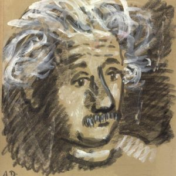

# Tại sao chủ nghĩa xã hội?

!!! note "Albert Einstein (1959), tranh vẽ bằng than chì và màu nước của Alexander Dobkin."

    {align=left}
    Dobkin (1908–1975) là một họa sĩ quan trọng của truyền thống hiện thực Mỹ giữa thế kỷ 20 cùng với các nghệ sĩ cánh tả khác như Jack Levine, Robert Gwathmey, Philip Evergood, Raphael và Moses Soyer. Là sinh viên và cộng tác viên của nhà vẽ tranh tường người Mexico Jose Clemente Orozco, tác phẩm của anh nằm trong bộ sưu tập vĩnh viễn của Viện Nghệ thuật Butler, Bảo tàng Nghệ thuật Hiện đại, Bảo tàng Brooklyn, Bảo tàng Nghệ thuật Mỹ Whitney, Bảo tàng Nghệ thuật Philadelphia, Thư viện của Quốc hội, và Viện Smithsonian. (Chú thích được viết bởi John J. Simon, “Albert Einstein, Cấp tiến: Một Hồ sơ Chính trị”, Tạp chí Hàng tháng tập 57, số 1 [2005].)

Có nên bày tỏ quan điểm về chủ đề xã hội chủ nghĩa đối với một người không phải là chuyên gia về các vấn đề kinh tế và xã hội không? Tôi tin rằng [chúng ta cần làm thế] vì một số lý do.

Trước tiên chúng ta hãy xem xét câu hỏi từ quan điểm của kiến thức khoa học. Có vẻ như không có sự khác biệt cơ bản về phương pháp luận giữa **thiên văn học** (*astronomy*) và **kinh tế học** (*economics*): các nhà khoa học trong cả hai lĩnh vực đều cố gắng khám phá các quy luật có khả năng giải thích được một nhóm các hiện tượng xảy ra trong lĩnh vực đó để làm các mối liên hệ giữa các hiện tượng này trở nên dễ hiểu nhất có thể. Nhưng trên thực tế, sự khác biệt phương pháp tồn tại. Việc phát hiện ra các quy luật chung trong lĩnh vực kinh tế học trở nên khó khăn do các hiện tượng kinh tế quan sát được thường bị ảnh hưởng bởi nhiều yếu tố rất khó đánh giá riêng rẽ. Ngoài ra, kinh nghiệm được tích lũy kể từ khi bắt đầu cái gọi là thời kỳ văn minh của lịch sử loài người&mdash;như chúng ta đã biết&mdash;phần lớn bị ảnh hưởng và hạn chế bởi những nguyên nhân không hoàn toàn có bản chất kinh tế. Ví dụ, hầu hết các quốc gia lớn trong lịch sử đều tồn tại được nhờ việc đi thôn tính. Các dân tộc đi chinh phục tự coi mình, về mặt pháp lý và kinh tế, là giai cấp có đặc quyền trên đất nước bị xâm chiếm. Họ giành độc quyền sở hữu đất đai cho mình và bổ nhiệm chức tư tế trong hàng ngũ của họ. Các linh mục, vốn kiểm soát giáo dục, đã biến sự phân chia giai cấp của xã hội thành một thể chế lâu dài và tạo ra một hệ thống các giá trị mà theo đó mọi người, phần lớn do vô thức, được hướng dẫn trong hành vi xã hội của họ.

Nhưng có thể nói, truyền thống lịch sử là của ngày hôm qua; chúng ta chưa thực sự vượt qua được cái mà Thorstein Veblen gọi là **“giai đoạn cướp bóc”** (*predatory phase*) của quá trình phát triển loài người. Các sự kiện kinh tế có thể quan sát được thuộc về giai đoạn đó và ngay cả những quy luật mà chúng ta có thể rút ra từ chúng cũng không thể áp dụng cho các giai đoạn khác. Vì mục đích thực sự của chủ nghĩa xã hội chính xác là vượt qua và vượt lên trên giai đoạn phát triển con người mang tính cướp bóc, nên khoa học kinh tế trong tình trạng hiện tại của nó có thể cung cấp rất ít tri thức cho xã hội xã hội chủ nghĩa trong tương lai.

Thứ hai, **chủ nghĩa xã hội** (*socialism*) hướng tới mục đích đạo đức-xã hội. Tuy nhiên, khoa học không thể tạo ra các mục đích và càng không thể thấm nhuần chúng vào con người; khoa học nhiều nhất chỉ có thể cung cấp phương tiện để đạt được những mục đích nhất định. Nhưng bản thân các mục đích được hình thành bởi những cá nhân có lý tưởng đạo đức cao cả và&mdash;nếu những mục đích này không chết yểu, mà trở quan trọng và mạnh mẽ&mdash;được chấp nhận và thực hiện bởi nhiều người, những người mà trong đó một nửa là vô thức, quyết định sự tiến hóa chậm chạp của xã hội.

Vì những lý do này, chúng ta nên cảnh giác để không đánh giá quá cao khoa học và các phương pháp khoa học khi nó liên quan đến các vấn đề của con người; và chúng ta không nên cho rằng các chuyên gia là những người duy nhất có quyền phát biểu về những vấn đề ảnh hưởng đến tổ chức của xã hội.

Từ lâu đã có vô số tiếng nói khẳng định rằng xã hội loài người đang trải qua một cuộc khủng hoảng, rằng sự ổn định của nó đã bị phá vỡ nghiêm trọng. Đặc trưng của một tình huống như vậy là khi các cá nhân cảm thấy thờ ơ hoặc thậm chí thù địch với nhóm, dù nhỏ hay lớn, mà họ là một phần trong đó. Để minh họa quan điểm của mình, tôi xin ghi lại đây một kinh nghiệm cá nhân. Gần đây tôi đã thảo luận với một người đàn ông thông minh và có thiện chí về mối đe dọa của một cuộc chiến tranh khác, theo quan điểm của tôi sẽ gây nguy hiểm nghiêm trọng cho sự tồn tại của nhân loại, và tôi nhận xét rằng chỉ có một tổ chức siêu quốc gia mới có thể bảo vệ khỏi mối nguy đó. Sau đó, vị khách của tôi, rất bình tĩnh và lạnh lùng, nói với tôi: “Tại sao ông lại phản đối sâu sắc sự biến mất của loài người như vậy?”

Tôi chắc chắn rằng chỉ một thế kỷ trước, không ai có thể đưa ra một tuyên bố nhẹ nhàng như vậy. Đó là lời tuyên bố của một người đã cố gắng vô ích để đạt được trạng thái cân bằng trong chính mình và ít nhiều đã mất hy vọng thành công. Đó là biểu hiện của sự cô đơn và cô lập đau đớn mà rất nhiều người đang phải chịu đựng trong những ngày này. Nguyên nhân của nó là gì? Có cách nào thoát ra không?

Thật dễ dàng để đặt ra những câu hỏi như vậy, nhưng rất khó để trả lời chúng với bất kỳ mức độ đảm bảo nào. Tuy nhiên, tôi phải cố gắng hết sức có thể, mặc dù tôi rất ý thức được thực tế là những cảm xúc và nỗ lực của chúng ta thường mâu thuẫn và mơ hồ và chúng không thể diễn đạt bằng những công thức đơn giản và dễ dàng.

Con người vừa là một sinh vật đơn độc vừa là một sinh vật xã hội. Là một sinh vật đơn độc, anh ta cố gắng bảo vệ sự tồn tại của chính mình và của những người gần gũi nhất với anh ta, để thỏa mãn những ham muốn cá nhân và phát triển những khả năng bẩm sinh của mình. Là một sinh vật xã hội, anh ta tìm cách giành được sự công nhận và tình cảm của đồng loại, chia sẻ niềm vui của họ, an ủi họ trong nỗi buồn và cải thiện điều kiện sống của họ. Chỉ có sự tồn tại của những phấn đấu khác nhau thường mâu thuẫn nhau này mới giải thích được nhân cách đặc biệt của một người, và sự kết hợp cụ thể của chúng quyết định mức độ mà một cá nhân có thể đạt được trạng thái cân bằng bên trong và có thể đóng góp cho sự thịnh vượng của xã hội. Về cơ bản, sức mạnh tương đối của hai động lực này là cố định do kế thừa. Nhưng nhân cách cuối cùng xuất hiện phần lớn được hình thành bởi môi trường mà một người tình cờ tìm thấy chính mình trong quá trình phát triển, bởi cấu trúc của xã hội mà anh ta lớn lên, bởi truyền thống của xã hội đó và bởi sự đánh giá của nó đối với các loại hành vi cụ thể. Khái niệm trừu tượng **“xã hội”** (*society*) có nghĩa đối với cá nhân con người là tổng thể các mối quan hệ trực tiếp và gián tiếp của anh ta với những người đương thời và với tất cả những người thuộc các thế hệ trước. Cá nhân có khả năng tự suy nghĩ, cảm nhận, phấn đấu và làm việc; nhưng anh ta phụ thuộc quá nhiều vào xã hội&mdash;trong sự tồn tại về thể chất, trí tuệ và cảm xúc của mình&mdash;đến nỗi không thể nghĩ về anh ta, hoặc hiểu anh ta, bên ngoài khuôn khổ của xã hội. Chính “xã hội” cung cấp cho con người thức ăn, quần áo, nhà ở, công cụ lao động, ngôn ngữ, các hình thức tư duy và hầu hết nội dung của tư duy; cuộc sống của con người ấy được tạo nên nhờ lao động và thành tựu của hàng triệu người trong quá khứ và hiện tại, những người đều ẩn mình sau danh từ nhỏ bé **“xã hội”**.

Do đó, rõ ràng là sự phụ thuộc của cá nhân vào xã hội là một thực tế tự nhiên không thể xóa bỏ được&mdash;giống như trường hợp của loài kiến và loài ong. Tuy nhiên, trong khi toàn bộ quá trình sống của kiến và ong được cố định đến từng chi tiết nhỏ nhất bởi bản năng cứng nhắc, di truyền, thì mô hình xã hội và mối quan hệ qua lại của con người lại rất hay thay đổi và dễ bị thay đổi. Trí nhớ, khả năng tạo ra những kết hợp mới, năng khiếu giao tiếp bằng miệng đã tạo ra những sự phát triển khả thi giữa con người mà không bị chi phối bởi nhu cầu sinh học. Những phát triển như vậy thể hiện trong các truyền thống, thể chế và tổ chức; trong văn học; trong các thành tựu khoa học và kỹ thuật; trong các tác phẩm nghệ thuật. Điều này giải thích tại sao, theo một nghĩa nào đó, con người có thể ảnh hưởng đến cuộc sống của mình thông qua hành vi của chính mình, và rằng trong quá trình này, suy nghĩ và mong muốn có ý thức có thể đóng một vai trò.

Con người khi sinh ra đã có được, thông qua di truyền, một tổng thể sinh học mà chúng ta phải coi là cố định và không thể thay đổi, bao gồm cả những thôi thúc tự nhiên vốn là đặc trưng của loài người. Ngoài ra, trong suốt cuộc đời của mình, anh ta tiếp thu một cấu trúc văn hóa được tiếp nhận từ xã hội thông qua giao tiếp và thông qua nhiều loại ảnh hưởng khác. Chính cấu trúc văn hóa này, cùng với thời gian, có thể thay đổi và quyết định phần lớn mối quan hệ giữa cá nhân và xã hội. Nhân chủng học hiện đại đã dạy chúng ta, thông qua nghiên cứu so sánh về cái gọi là các nền văn hóa nguyên thủy, rằng hành vi xã hội của con người có thể khác nhau rất nhiều, tùy thuộc vào các mô hình văn hóa phổ biến và các loại hình tổ chức chiếm ưu thế trong xã hội. Chính vì điều này mà những ai đang cố gắng cải thiện số phận của con người có thể đặt hy vọng: con người không đáng bị lên án, do cấu tạo sinh học của mình, khi tiêu diệt lẫn nhau hay phó mặc cho một số phận nghiệt ngã, tự chuốc họa vào thân.

Nếu chúng ta tự hỏi mình nên thay đổi cấu trúc xã hội và thái độ văn hóa của con người như thế nào để làm cho cuộc sống của con người trở nên thỏa mãn nhất có thể, thì chúng ta nên liên tục ý thức được thực tế rằng có những điều kiện nhất định mà chúng ta không thể sửa đổi. Như đã đề cập trước đó, bản chất sinh học của con người, đối với tất cả các mục đích thực tế, không thể thay đổi. Hơn nữa, sự phát triển về công nghệ và nhân khẩu học trong vài thế kỷ qua đã tạo ra những điều kiện tồn tại lâu dài. Ở những quần thể định cư tương đối đông đúc với những hàng hóa không thể thiếu cho sự tồn tại liên tục của con người, sự phân công lao động tối đa và một bộ máy sản xuất tập trung cao độ là hoàn toàn cần thiết. Thời gian&mdash;mà khi nhìn lại, có vẻ rất bình dị&mdash;đã qua đi vĩnh viễn khi các cá nhân hoặc các nhóm tương đối nhỏ có thể hoàn toàn tự cung tự cấp. Sẽ hơi cường điệu khi nói rằng nhân loại thậm chí còn tạo thành một **cộng đồng hành tinh** (*planetary community*) về sản xuất và tiêu dùng.

Giờ đây đã đến thời điểm tôi có thể chỉ ra một cách ngắn gọn những gì đối với tôi cấu thành bản chất của cuộc khủng hoảng của thời đại chúng ta. Nó liên quan đến mối quan hệ của cá nhân với xã hội. Cá nhân đã trở nên ý thức hơn bao giờ hết về sự phụ thuộc của mình vào xã hội. Nhưng anh ta không trải nghiệm sự phụ thuộc này như một tài sản tích cực, như một mối ràng buộc hữu cơ, như một lực lượng bảo vệ, mà đúng hơn là một mối đe dọa đối với các quyền tự nhiên của anh ta, hoặc thậm chí đối với sự tồn tại kinh tế của anh ta. Hơn nữa, vị trí của anh ta trong xã hội được định nghĩa bằng các động cơ ích kỉ ta liên tục được nhấn mạnh, trong khi các động lực xã hội của anh ta, vốn yếu hơn về bản chất, ngày càng suy giảm. Tất cả mọi người, bất kể vị trí của họ trong xã hội, đang phải chịu đựng quá trình suy thoái này. Họ vô tình là tù nhân của sự ích kỷ của chính mình, họ cảm thấy không an toàn, cô đơn và bị tước đoạt quyền hưởng thụ cuộc sống một cách ngây thơ, đơn giản và không phức tạp. Con người có thể tìm thấy ý nghĩa của cuộc sống, dù ngắn ngủi và nhiều nguy hiểm như nó vốn có, chỉ bằng cách cống hiến hết mình cho xã hội.

Theo tôi, tình trạng vô chính phủ về kinh tế của xã hội tư bản như nó tồn tại ngày nay, là nguồn gốc thực sự của cái ác. Trước mắt chúng ta là một cộng đồng lớn các nhà sản xuất mà các thành viên trong đó không ngừng cố gắng tước đoạt thành quả lao động tập thể của nhau&mdash;không phải bằng vũ lực mà nói chung là tuân thủ trung thực các quy tắc được thiết lập hợp pháp. Về mặt này, điều quan trọng là phải nhận ra rằng tư liệu sản xuất&mdash;nghĩa là toàn bộ năng lực sản xuất cần thiết để sản xuất hàng tiêu dùng cũng như tư liệu sản xuất bổ sung&mdash;có thể trở thành phần lớn là tài sản riêng của cá nhân một cách hợp pháp.

Để đơn giản hơn, trong cuộc thảo luận sau đây, tôi sẽ gọi **“công nhân”** (*worker*) là tất cả những người không chia sẻ quyền sở hữu tư liệu sản xuất&mdash;mặc dù điều này không hoàn toàn tương ứng với cách sử dụng thuật ngữ này một cách thông thường. Chủ sở hữu tư liệu sản xuất có thể mua sức lao động của công nhân. Bằng cách sử dụng tư liệu sản xuất, người công nhân sản xuất ra những hàng hóa mới trở thành tài sản của nhà tư bản. Điểm cốt yếu của quá trình này là mối quan hệ giữa những gì người công nhân sản xuất ra và những gì anh ta được trả, cả hai đều được đo bằng giá trị thực. Trong chừng mực hợp đồng lao động là **“tự do”** (*free*), những gì người công nhân nhận được không được quyết định bởi giá trị thực của hàng hóa mà anh ta sản xuất ra, mà bởi những nhu cầu tối thiểu của anh ta và bởi những đòi hỏi của nhà tư bản đối với sức lao động trong mối quan hệ với số lượng công nhân cạnh tranh để có được việc làm. Điều quan trọng là phải hiểu rằng ngay cả trên lý thuyết, tiền lương của công nhân không được xác định bởi giá trị sản phẩm của anh ta.

Tư bản tư nhân có xu hướng tập trung vào tay một số ít, một phần do cạnh tranh giữa các nhà tư bản, và một phần do sự phát triển công nghệ và phân công lao động ngày càng tăng khuyến khích hình thành các đơn vị sản xuất lớn hơn bằng chi phí của các đơn vị sản xuất nhỏ hơn. Kết quả của những sự phát triển này là một đầu sỏ tư bản tư nhân mà sức mạnh to lớn của nó không thể bị kiểm soát một cách hiệu quả ngay cả bởi một xã hội chính trị được tổ chức dân chủ. Điều này đúng vì các thành viên của các cơ quan lập pháp được lựa chọn bởi các đảng chính trị, phần lớn được tài trợ hoặc chịu ảnh hưởng bởi các nhà tư bản tư nhân, những người, vì tất cả các mục đích thực tế, đã tách lĩnh vực bầu cử ra khỏi các cơ quan lập pháp. Hậu quả là những người đại diện của nhân dân thực chất không bảo vệ được đầy đủ quyền lợi của những bộ phận người dân yếu thế. Hơn nữa, trong điều kiện hiện có, các nhà tư bản tư nhân một cách tất yếu sẽ kiểm soát trực tiếp hoặc gián tiếp các nguồn phát thông tin chính thống (báo chí, đài phát thanh, giáo dục). Do đó, việc cá nhân công dân đi đến kết luận khách quan và sử dụng thông minh các quyền chính trị của mình là cực kỳ khó khăn, và thực sự trong hầu hết các trường hợp là không thể.

Do đó, tình trạng phổ biến trong nền kinh tế dựa trên sở hữu tư nhân về vốn được đặc trưng bởi hai nguyên tắc chính: thứ nhất, tư liệu sản xuất (vốn) thuộc sở hữu tư nhân và chủ sở hữu định đoạt chúng khi họ thấy phù hợp; thứ hai, hợp đồng lao động là tự do. Tất nhiên, không có cái gọi là xã hội tư bản thuần túy theo nghĩa này. Đặc biệt, cần lưu ý rằng công nhân, thông qua các cuộc đấu tranh chính trị lâu dài và gay gắt, đã thành công trong việc đảm bảo một hình thức **“hợp đồng lao động tự do”** (*free labor contract*) được cải thiện phần nào cho một số loại công nhân. Nhưng xét về tổng thể, nền kinh tế ngày nay không khác nhiều so với **chủ nghĩa tư bản “thuần túy”** (*pure capitalism*).

Sản xuất được thực hiện vì lợi nhuận, không phải để sử dụng. Không có quy định rằng tất cả những người có khả năng và sẵn sàng làm việc sẽ luôn có khả năng tìm được việc làm; một “đội quân thất nghiệp” hầu như luôn tồn tại. Người công nhân luôn lo sợ bị mất việc làm. Vì những người lao động thất nghiệp và được trả lương thấp không mang lại một thị trường có lợi nhuận, nên việc sản xuất hàng hóa tiêu dùng bị hạn chế và hậu quả là những khó khăn lớn [cho cuộc sống của họ]. Tiến bộ công nghệ thường dẫn đến tình trạng thất nghiệp nhiều hơn thay vì giảm bớt gánh nặng việc làm cho tất cả mọi người. Động cơ lợi nhuận cùng với sự cạnh tranh giữa các nhà tư bản là nguyên nhân dẫn đến sự mất ổn định trong tích luỹ và sử dụng tư bản dẫn đến tình trạng suy thoái ngày càng trầm trọng. Cạnh tranh không giới hạn dẫn đến sự lãng phí rất lớn lao động và dẫn đến sự tê liệt ý thức xã hội của các cá nhân mà tôi đã đề cập ở trên.

**Tôi coi việc làm tê liệt các cá nhân này là tội ác tồi tệ nhất của chủ nghĩa tư bản**. Toàn bộ hệ thống giáo dục của chúng ta phải gánh chịu tệ nạn này. Thái độ cạnh tranh thái quá đã khắc sâu vào người sinh viên, người được đào tạo để tôn thờ thành công đạt được như một sự chuẩn bị cho sự nghiệp tương lai của mình.

Tôi tin rằng chỉ có một cách để loại bỏ những tệ nạn nghiêm trọng này, đó là thông qua việc thiết lập một nền kinh tế xã hội chủ nghĩa, kèm theo một hệ thống giáo dục hướng tới các mục tiêu xã hội. Trong một nền kinh tế như vậy, tư liệu sản xuất thuộc sở hữu của chính xã hội và được sử dụng một cách có kế hoạch. Một nền kinh tế kế hoạch, điều chỉnh sản xuất theo nhu cầu của cộng đồng, sẽ phân phối công việc phải làm cho tất cả những người có khả năng làm việc và sẽ đảm bảo sinh kế cho mọi đàn ông, phụ nữ và trẻ em. Việc giáo dục cá nhân, ngoài việc phát huy khả năng bẩm sinh của chính mình, sẽ cố gắng phát triển ở anh ta ý thức trách nhiệm đối với đồng loại thay cho sự tôn vinh quyền lực và thành công trong xã hội hiện tại của chúng ta.

Tuy nhiên, cần nhớ rằng nền kinh tế kế hoạch hóa chưa phải là chủ nghĩa xã hội. Một nền kinh tế kế hoạch như vậy có thể đi kèm với sự nô dịch hoàn toàn của cá nhân. Thành tựu của chủ nghĩa xã hội đòi hỏi phải giải quyết một số vấn đề chính trị-xã hội cực kỳ khó khăn: làm thế nào có thể, xét đến sự tập trung sâu rộng của quyền lực chính trị và kinh tế, để ngăn chặn bộ máy quan liêu trở nên toàn năng và áp đảo? Làm thế nào để các quyền của cá nhân có thể được bảo vệ và nhờ đó mà một đối trọng dân chủ đối với quyền lực của bộ máy quan liêu được đảm bảo?

Sự rõ ràng về các mục tiêu và vấn đề của chủ nghĩa xã hội có ý nghĩa quan trọng nhất trong thời đại quá độ của chúng ta. Vì, trong hoàn cảnh hiện tại, việc thảo luận tự do và không bị cản trở về những vấn đề này đã bị cấm đoán mạnh mẽ, tôi coi nền tảng của tạp chí này là một dịch vụ công cộng quan trọng.

**Tác giả: Albert Einstein**, nhà vật lý nổi tiếng thế giới. Bài viết này ban đầu được xuất bản trong số đầu tiên của Tạp chí hàng tháng (**Monthly Review**) (tháng 5 năm 1949). Sau đó nó được xuất bản vào tháng 5 năm 1998 để kỷ niệm 50 năm ra số đầu tiên.

[Why Socialism?](https://monthlyreview.org/2009/05/01/why-socialism/)