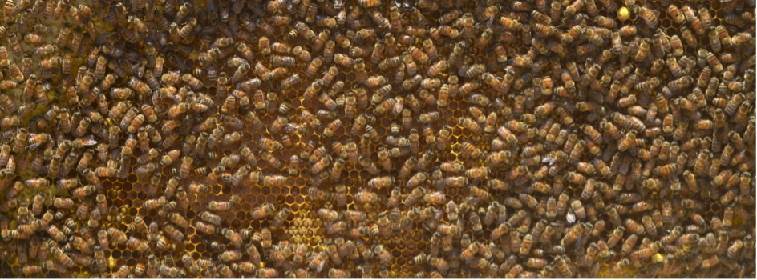

# Chương 3: Dân số

!!! quote ""

    Đàn ong. Nguồn ảnh: Tom Murphy

Hầu hết những mối quan tâm trong đời sống của con người đều có liên quan đến câu chuyện dân số (*population*). Thảo luận về sự tăng trưởng không ngừng ở **Chương 1** được tính toán dựa trên tốc độ tăng trưởng năng lượng trong quá khứ, mà trong đó sự gia tăng dân số và sử dụng tài nguyên trên đầu người đóng góp một phần. Tuy nhiên, việc dân số tăng không ngừng, như đã trình bày trong viễn cảnh ở **Chương 1**, là không thực tế. Vì thế, những “dự báo” trong **Chương 1** trở nên không còn đúng nữa và việc “tăng trưởng mãi mãi sẽ bị chặn lại”.

Chúng ta hãy cùng nhìn vào thực tế với một viễn cảnh khả dĩ hơn. Sử dụng năng lượng trên đầu người của Hoa Kì gấp khoảng *năm lần* so với mức trung bình của thế giới. Nếu dân số toàn cầu tăng gấp đôi, và mức tiêu thụ năng lượng của mỗi công dân trên trái đất tiệm cận với mức tiêu thụ của Người Mĩ[^1], thì qui mô năng lượng toàn cầu sẽ gấp $10$ lần chỉ trong $100$ năm ở mức tăng trưởng hàng năm khoảng $2{,}3\%$. Theo đó, qui mô này đặt ra một thá»i hạn mà ở đó việc tăng trưởng liên tục sẽ kết thúc—trên thực tế sớm hơn so với những dự báo ở **Chương 1**.

[^1]:

    ...sao cho mức tăng năng lượng sử dụng trung bình trên đầu người tăng gấp năm lần so với hiện tại.

Trong bối cảnh tăng trưởng năng lượng và tài nguyên, chương này sẽ tập trung vào mức tăng đáng báo động của dân số. **Hình** $\textbf{3.1}$ cho thấy mức cầu năng lượng tăng nhanh hơn so với dân số như thế nào, khi đặt trong cùng một biểu đồ bắt đầu từ thế kỉ $19$. Từ năm $1900$ đến $1950$, tiêu thụ năng lượng trên đầu người chỉ tăng khiêm tốn, nhưng sau năm $1950$ nó đã tăng ở mức chóng mặt. Theo đó, hiện nay thế giới đang có tương đương $25$ tỉ người tiêu thụ ở mức năng lượng của thế kỉ $19$.

> **Hình** $\textbf{3.1}$ *Dân số (màu đỏ) và cầu năng lượng (màu xanh) trong cùng một đồ thị, cho thấy cầu năng lượng (công suất tiêu thụ) tăng như thế nào so với dân số, dẫn đến sự gia tăng tiêu thụ năng lượng trên đầu người. Thang đo của mỗi đường được tỉ suất sao cho trùng với nhau vào đầu thế kỉ $19$*

Vì dân số đóng vai trò quan trọng trong những dự báo, chúng ta cần phải hiểu rõ quá trình phát triển của nó trong lịch sử. Từ đó, ta có thể rút ra nhiều kì vọng về viễn cảnh tương lai và thảo luận về sự “chuyển dịch cơ cấu dân số” với những hệ quả của nó.

## 1. Lịch sử phát triển

**Hình** $\textbf{3.2}$ biểu diễn lịch sử của dân số toàn cầu trong $12.000$ năm. Để ý rằng trong phần lớn lịch sử, mức độ tăng hầu như không đáng kể. Việc lo lắng vá» sự gia tăng mạnh mẽ của dân số trong thá»i gian gần đây là điá»u tự nhiên, vì đây là một sự khác thường của thá»i đại chúng ta đang sống. Có phải biểu đồ chỉ là một hàm số mũ không? Những hàm số mÅ©—dù có hình dạng thế nào—cũng cho thấy một mức độ gia tăng đáng báo động bắt đầu từ một thá»i điểm nào đó, mà đôi khi được gá»i là đồ thị có hình dạng “gậy khúc côn cầu†(đầu gậy dẹt và trở nên cong vút vào phần đuôi). Để có cái nhìn cận cảnh hơn, chúng ta vẽ đồ thị dân số theo thang logarit ở trục tung (**Hình** $\textbf{3.3}$). GiỠđây chúng ta có thể nhìn nhận được cả quá trình phát triển dân số chỉ thông qua hàm số mũ với những tỉ suất tăng trưởng không đổi.

> **Hình** $\textbf{3.2}$ *Ước tính dân số toàn cầu theo lịch sử con người hiện đại, theo thang tuyến tính; trong khi* **Hình** $\textbf{3.1}$ *biểu diễn giai đoạn lịch sử cận đại.*

> **Hình** $\textbf{3.3}$ *Ước tính dân số toàn cầu theo lịch sử con người hiện đại, theo thang logarit.*

Thật ngạc nhiên, ngay cả với thang đo logarit, đồ thì cũng có hình dạng “gậy khúc côn cầu”. Làm sao mà như thế được? Đây chắc không phải là một tin tốt. Nhìn kĩ hơn, chúng ta có thể chia lịch sử thành hai giai đoạn, mỗi giai đoạn tương ứng với một mức tăng trưởng số mũ riêng (các đường thẳng trong hình). Giai đoạn đầu có tỉ suất tăng trưởng khiêm tốn ở mức $0{,}044\%$. Theo “qui luật $70$”, **thời gian nhân đôi** tương ứng là $1.600$ năm. Trong thời đại gần đây, mức tăng là $1\%$ với thời gian nhân đôi là $70$ năm. Thực vậy, chúng ta có thể công nhận rằng những thế kỉ gần đây là một sự bất thường so với $10.000$ đầu tiên trong hình vẽ. Nếu ch``úng ta kéo dài mức tăng tưởng $0{,}044\%$ và $1\%$, hai đường này sẽ gặp nhau xung quanh năm 1700, thời điểm xảy ra giai đoạn chuyển giao.

Sự gia tăng nhanh chóng này cần được quan sát kĩ càng hơn nữa. **Hình** $\textbf{3.4}$ biểu diễn khoảng $1000$ năm trở lại đây, phân ra các thời kì phát triển với tỉ suất ngày càng năng. Thời gian nhân đôi tương ứng với bốn tỉ suất được trình bày trong **Bảng** $\textbf{3.1}$.

> **Hình** $\textbf{3.4}$ *Ước tính dân số toàn cầu trong những thế kỉ gần đây. Trên thang logarit, những đường thẳng theo hệ số góc—hay độ dốc—cũng biểu diễn một đường hàm số mũ. Theo đó, bốn phần của hàm số mũ ứng với tỉ suất tăng trưởng tăng dần.*

|    Năm    | % Tăng trưởng | Thời gian nhân đôi |
|:---------:|:-------------:|:------------------:|
| 1000-1700 |     0,12%     |       600 năm      |
| 1700-1870 |     0,41%     |       170 năm      |
| 1870-1950 |     0,82%     |       85 năm       |
| 1950-2020 |      1,7%     |       40 năm       |

> **Bảng** $\textbf{3.1}$ *Thời gian nhân đôi trên **Hình** $\textbf{3.4}$*

Có thể diễn giải lịch sử dân số như sau. Đầu tiên không có nhiều sự thay đổi từ “thời kì Đen tối (*Dark Ages*)”. Thời Phục Hưng (*The Renaissance*) (khoảng năm $1700$) bắt đầu với tư duy khoa học từ đó chúng ta có thể điều trị nhiều bệnh tật, giúp cho dân số tăng tưởng nhanh. Từ giữa thế kỉ $19$ (khoảng năm $1870$),  bùng nổ việc sử dụng nhiên liệu hóa thạch đã cho phép công nghiệp hóa diễn ra trên qui mô lớn, cùng với những nông nghiệp cơ giới hóa. Thực phẩm nuôi sống nhiều người hơn và bệnh tật được đẩy lùi. Từ giữ thế kỉ $20$ (khoảng năm $1950$), **Cách mạng Xanh** (*Green Revolution*) khơi mào việc sử dụng phân bón hóa học (chiết suất từ nhiên liệu hóa thạch) và cơ giới hóa nông nghiệp trên qui mô lớn, biến việc sản xuất lương thực trở thành một ngành công nghiệp. Cùng với sự thay đổi về chất lượng và sự sẵn có của thực phẩm giá rẻ và sự tiến bộ về kiểm soát bệnh tật đã giúp dân số tăng lên không ngừng. 

[^2]: 
    
    ...ngoại từ nạn đói và bệnh dịch xảy ra vào thế kỉ $14$

Trong những năm gần đây, tỉ suất này đã giảm dần từ mức $1{,}7\%$ trong giai đoạn cuối trong **Hình** $\textbf{3.4}$ xuống mức $1{,}1\%$. Nếu làm tròn xuống $1\%$ một năm, tỉ suất này sẽ làm tăng dân số từ $7$ tỉ người lên $8$ tỉ người trong ít hơn 14 năm. Công thức toán tương tự như trong **Chương 1**, được biểu diễn lại thành,

$$
P = P_{0}e^{ln(1+p)(t-t_{0})}, \tag{3.1}\label{3.1}
$$

với $P_{0}$ là dân số ở thời điểm $t_{0}$, và $P$ là dân số ở thời điểm $t$ nếu tỉ suất tăng trưởng không đổi ở mức $p$. Chuyển vế và lấy logarit hai vế[^3], ta có:

[^3]:

    ...logarit của hàm mũ cơ số $e$ triệt tiêu lẫn nhau

$$
t - t_{0} = \frac{ln(\frac{P}{P_{0}})}{ln(1+p)} \tag{3.2}\label{3.2}
$$

!!! info "Ví dụ $\textbf{3.1}$"

    Chúng ta có thể sử dụng **Phương trình** $\textbf{3.1}$ để xác định dân số vào năm 2100 nếu tiếp tục với tỉ suất $1\%$ một năm, bắt đầu với $7$ tỉ người vào năm 2100. Nếu đặt $P_{0} = 7$ (tỉ người), $t_{0} = 2010$, $p = 0{,}01$, thì dân số năm $2100$ sẽ là $P = 7e^{ln 1.01\dot{90}} = 17$ (tỉ người).

    **Phương trình** $\textbf{3.2}$ được dùng để kết luận rằng để tăng từ $7$ lên $8$ tỉ người cần ít hơn $14$ năm với tỉ suất $1\%$ một năm. Tính toán như thế này: $ln(8/7) / ln 1{,}01 = 13{,}4$. Lưu ý rằng chúng ta không cần phải thêm hàng tỉ ở tử số và mẫu số vì chúng triệt tiêu lẫn nhau.

|  Năm | Dân số | Số năm | Tốc độ | Nhân đôi |
|:----:|:------:|:------:|:------:|:--------:|
| 1984 |  1 tỷ  |    —   |  0,4%  |    170   |
| 1927 |  2 tỷ  |   123  |  0,8%  |    85    |
| 1960 |  3 tỷ  |   33   |  1,9%  |    37    |
| 1974 |  4 tỷ  |   14   |  1,9%  |    37    |
| 1987 |  5 tỷ  |   13   |  1,8%  |    39    |
| 1999 |  6 tỷ  |   12   |  1,2%  |    54    |
| 2011 |  7 tỷ  |   12   |  1,2%  |    59    |
| 2023 |  8 tỷ  |   12   |  1,1%  |    66    |

> **Bảng** $\textbf{3.2}$: *Các cột mốc dân số: thời điểm dân số thế giới tăng thêm một tỷ người. Thời gian tăng thêm 1 tỷ người (cột Số năm) và thời gian nhân đôi được biểu diễn theo năm. Vào khoảng năm $1965$, tốc độ tăng trưởng lên đến gần $2\%$, với thời gian nhân đôi $35$ năm.*

> **Hình** $\textbf{3.5}$: *Đồ thị mô phỏng **Bảng** $\textbf{3.2}$, biểu diễn khoảng thời gian dân số tăng thêm $1$ tỷ người.*  

**Bảng** $\textbf{3.2}$ và **Hình** $\textbf{3.5}$ trình khoảng thời gian để dân số tăng thêm một tỷ người, dự báo cho đến 8 tỷ người (ở thời điểm viết cuốn sách vào năm $2020$). Đạt được mức một tỉ người đầu mất hàng chục ngàn năm, và mỗi lần thêm một tỉ người lại cần ít thời gian hơn. Tỉ suất tăng trưởng dân số cao nhất vào năm $1960$ ở mức $2\%$ và gấp đôi sau mỗi 35 năm. Tỉ suất tăng trưởng hiện tại ở mức trung bình, nhưng ngay cả mức tăng $1\%$ cũng có thể thêm hàng tỉ người chỉ trong $13$ năm. Cuốn sách nổi tiếng của Paul Erlich với tên gọi ***Quả bom dân số*** (*Population Bomb*), xuất bản lần đầu vào năm *1968*, đã báo động mức tăng trưởng dân số ở mức $2\%$ và giả định sẽ tăng lên từ thời điểm đó. Cho dù mức độ gia tăng hiện nay khoảng $1\%$, chúng ta cũng không khỏi lo ngại. Phần tiếp theo sẽ trình bày những cơ chế tự nhiên để ngăn cản sự tăng trưởng. 

## 2. Mô hìnhh Logistic

Nếu không có những tác động của con người, quần thể của một loài động vật nào đó có thể dao động (*oscillation*) trong một khoảng thời gian nào đó (theo năm) và trải qua những thay đổi trong dài hạn (hàng thế kỉ hay lâu hơn). Nói chung, tự nhiên sẽ tìm ra một điểm cân bằng nào đó. Dân số quá động (*overpopulation*) chỉ là vấn đề ngắn hạn, bởi sự thiếu hụt dần của nguồn thức ăn, số lượng loài thiên địch gia tăng hay trong một số trường hợp, bệnh dịch, sẽ cân bằng quần thể trở lại [^4]. Ngược lại, một quần thể nhỏ có thể dễ dàng mở rộng dựa vào nguồn thức ăn dồi dào hơn, và các loài thiên địch dựa vào quân thể này cũng chưa đủ nhiều vì thiếu con mồi.

[^4]:

    Để so sánh, đại dịch SARS-CoV2 năm 2020 gần như không ảnh hưởng nhiều đến mức gia tăng dân số toàn cầu. Khi dân số tăng $80$ triệu người một năm, ngay cả một căn bệnh giết chết hàng triệu người cũng chẳng đáng kể đối với xu hướng chung.

Chúng ta vừa mô tả một dạng **phản hồi ngược** (*negative feedback*): tác động có tính hiệu chỉnh để đưa hệ thống về lại trạng thái cân bằng.

!!! note "Định nghĩa $\textbf{3.1}$: Phản hồi ngược"

    Đơn giản là sự sửa chữa và hiệu chỉnh được áp dụng vào hướng ngược lại với quĩ đạo chuyển động từ trước. Nếu một con lắc vận động sang phải, một lực phản hồi sẽ kéo nó sang trái, trong khi nếu nó đi sang trái quá nhiều sẽ dẫn đến lực đẩy sang phải. Một sự dao động của lò xo gắn với vật nặng cho thấy cùng một tính chất, cũng như tất cả các hệ hiện tượng cân bằng khác.

!!! info ""

    Từ **phản hồi ngược** làm chúng ta có cảm giác về một điều gì đó không đáng có, nhưng trên thực tế, **phản hồi xuôi** mới dẫn đến những hệ quả nghiêm trọng. Thí nghiệm về vi khuẩn ở **Chương 1** chính là một ví dụ về **phản hồi xuôi**: nhiều vi khuẩn hơn càng làm tăng tốc độ tăng trưởng. Hàm số mũ là một dấu hiệu của **phản hồi xuôi**, trong khi đó trạng thái cân bằng (*equilibrium*) báo hiệu **phản hồi ngược**.

Chúng ta có thể tạo ra một mô hình đơn giản để mô tả sự tiến triển của dân số trong một môi trường có **phản hồi ngược**. Khi một quần thể còn nhỏ và nguồn tài nguyên dồi dào, tỉ suất sinh tỉ suất với quần thế đó.

!!! info "Ví dụ $\textbf{3.1}$"

    Nếu một khu rừng có $100$ con nai đang tuổi sinh nở, hay $50$ cặp nai, chúng ta có thể ước tính $50$ nai con một năm (giả định rằng mỗi nai mẹ sinh ra một nai con trong một năm). Nếu khu rừng có 200 con nai, số lượng nai con có thể là 200 con. Tỉ suất sinh đơn giản *tỉ suất thuận* với quân thể có khả năng sinh nở [^5].

[^5]:

    ...chưa có phản hồi hiệu chỉnh

Nếu **Ví dụ** $\textbf{3.1}$ chỉ dừng lại ở đó, chúng ta sẽ có tăng trưởng liên tục theo hàm số mũ: càng nhiều nai con có nghĩa là quần thể càng lớn, và cuối cùng khi đạt đến độ tuổi sinh nở lại sản sinh ra nhiều nai con hơn[^6]. Nhưng khi quần thể gia tăng, phản hồi ngược bắt đầu có tác dụng. Chúng ta kí hiệu quần thể là $P$, tỉ suất thay đổi là $\dot{P}$[^7]. Chúng ta có thể nói tỉ suất tăng trưởng ($\dot{P}$), là:

$$
\dot{P} = rP \tag{3.3}\label{3.3}
$$

với r là tỉ suất sinh tương ứng với dân số (ví dụ, bằng $0.04$ nếu $4\%$ dân số sẽ sinh con trong một năm)[^8]. Phương trình này lắp lại một ý tưởng đơn giản: tỉ suất tăng trưởng của dân số phụ thuộc và tương ứng với dân số *hiện tại*. Nghiệm của *phương trình vi phân* này là một hàm số mũ:

$$
    P = P_{0}e^{r(t-t_{0})}, \tag{3.4}\label{3.4}
$$

hay là một sự lặp lại của **Phương trình** $\textbf{3.1}$, với $r$ tương đương $ln(1+p)$

[^6]:

    Ở đây chúng ta đang mô tả hiện tượng trái với phản hồi ngược, đó là phản hồi xuôi(*positive feedback*)&mdash;hay phản hồi có tính khuếch đại&mdash;đã nhiều lại càng nhiều thêm.

[^7]:

    $\dot{P}$ là đạo hàm theo thời gian (kí hiệu bằng dấu chấm trên đầu $P$), định nghĩa bởi $\dot{P} = dP / dt$. Nếu Đại số làm bạn khó hiểu thì đừng lo, những điều chúng ta đã mô tả vẫn hoàn toàn có thể hiểu được.

[^8]:

    Theo tỉ suất tăng trưởng chúng ta đã sử dụng, $p$, như trong **Phương trình** $\textbf{3.1}$, $r = ln(1+p)$. Nên ví dụ, nếu tăng trưởng ở mức $2\%$, $p=0{,}02$ và $r$ bằng $0{,}02$ ($r ≈ p$ với giá trị $p$ rất nhỏ).

!!! info "Ví dụ $\textbf{3.2}$"

    Đặt song song ví dụ về dân số nai ở **Ví dụ** $\textbf{3.1}$. Nếu đặt $r = 0{,}5$, và quần thể thỏ là $P=100$ hươu trưởng thành (một nửa là hươu cái). Ở **phương trình** $\textbf{3.2}$ cho rằng $\dot{P}$, có nghĩa là dân số sẽ tăng khoảng 50 đơn vị [^9].

[^9]:

    “Đơn vị” ở đây là nai con. 

Cho rằng một khu rừng có thể nuôi sống một số lượng hươu nhất định, kí hiệu là $Q$, ở trạng thái cân bằng (*steady state*), trong khi dân số hiện tại kí hiệu là $P$. Hiệu số, $Q - P$ là “chỗ trống” ở đó dân số vẫn có thể tiếp tục tăng trưởng được dựa trên số lượng tài nguyên còn lại. Một khi $P = Q$, không còn tài nguyên nào còn sót lại cho quần thể để tăng trưởng.

!!! note "Định nghĩa $\textbf{3.2}$"

    Thuật ngữ “ngưỡng chịu đựng” (*carrying capacity*) thường dùng để mô tả $Q$: quân thể được nuôi sống bởi môi trường xung quanh. Nếu ngưỡng chịu đựng ($Q$) của dân số loài người trên trái đất không phải là một con số cứng nhắc, nó là một hàm số của cách sống và phụ thuộc vào tài nguyên.

$Q - P$ lượng hóa cơ chế hạn chế tăng trưởng bằng cách đặt ra những “phần còn lại”. Một cách để kết hợp tính chất này vào phương trình tăng trưởng được viết như sau:

$$
\dot{P} = \frac{Q - P}{Q}rP \tag{3.5}\label{3.5}
$$

Chúng ta nhân tốc độ ban đầu $rP$ với một hệ số sao cho tốc độ tăng trưởng có thể thay đổi từ $r → r(Q-P)/Q$. Khi $P$ tương đối nhỏ so với $Q$, tốc độ thực sự (*effective rate*) gần bằng với tốc độ ban đầu $r$. Nhưng tốc độ tăng trưởng thực sự sẽ tiệm cận với $0$ khi $P$ tiến gần đến $Q$. Nói cách khác, tăng trưởng sẽ giảm dần và tiến tới $0$ khi quần thể đạt đến điểm bão hoà khi $P → Q$ (xem **Hình** $\textbf{3.6}$).

> **Hình** $\textbf{3.6}$ Tốc độ tăng trưởng trong mô hình logistic giảm khi dân số tăng, bắt đầu với $r$ khi $P=0$ và đạt tới $0$ khi $P -> Q$ (xem **Phương trình** $\textbf{3.5}$).

Nghiệm của phương trình vi phân (cách giải nằm ngoài phạm vi của cuốn sách) được gọi là **đường logistic**, biểu diễn ở **Hình** $\textbf{3.7}$ và có dạng:

$$
P(t) = \frac{Q}{1 + e^{-r(t-t_{0})}} \tag{3.6}\label{3.6}
$$

Ở phần đầu của hàm này trong **Hình** $\textbf{3.7}$, với giá trị âm[^10] $t-t_{0}$, cấp số nhân vẫn rất nhỏ. Ở $t = t_{0}$ (tại điểm uốn&mdash;*điểm uốn*), dân số bằng $Q/2$. Khi thời gian diễn tiến đến vùng giá trị dương ($t-t_{0}>0$), $P$ tiến gần hơn đến $Q$. Lúc này, các cơ chế phản hồi ngược (các giới hạn về tài nguyên/lương thực sẵn có, hay thiên địch và dịch bệnh) trở nên nghiêm trọng hơn và ngăn chặn đà tăng trưởng cho đến khi nó dừng hẳn, thời điểm $P = Q$.

[^10]:

    Tham số $t_{0}$ là thời điểm khi đường logistic bị phân đôi. Thời gian trước điểm này có giá trị âm ($t-t_{0}$).

> **Hình** $\textbf{3.7}$: đường dân số logistic (màu lam), đôi khi được gọi là đường S (*S-curve*), theo công thức trong **Phương trình** $\textbf{3.6}$, trong trường hợp này được vẽ với $r=0{,}5$ để phù hợp với ví dụ trên. Đường màu đỏ là hàm số mũ ở đố không có phản hồi ngược.
 

!!! info "Ví dụ $\textbf{3.3}$"

    Tiếp tục với ví dụ về nai ở trên. Cho rằng khu rừng có thể nuôi sống được đến $840$ cá thể trưởng thành[^11], và giữ $r=0.5$ là tốc độ tăng trưởng không bị kiềm chế. Sử dụng các con số này, **Phương trình** $\textbf{3.6}$ cho kết quả $100$ cá thể ở thời điểm $t = t_{0}-4$ năm (là trạng thái ban đầu trong **Ví dụ** $\textbf{3.1}$). Một năm sau, ở $t = t_{0}-3$, **Phương trình** $\textbf{3.6}$ cho kết quả $153$&mdash;rất gần với việc thêm 50 cá thể nữa. Nhưng nay ở thời điểm bốn năm sau ($t=t_{0}$), chúng ta có $420$ cá thể thay vì $739$ khi tăng trưởng hàm số mũ không bị chặn lại như ở **Ví dụ** $\textbf{3.2}$[^12].

[^11]:
    
    giá trị này được chọn để phù hợp với con số chúng ta đã dùng ở các ví dụ trước.

[^12]:

    Không phải ngẫu nhiên mà $P = Q/2$ ở điểm giữa, khi $t = t_{0}$

Đường logistic là một *viễn cảnh lí tưởng*. Quân thể sẽ đạt đến mức dân số cao nhất với sự chuyển dịch yên ả như đồ thị **Hình** $\textbf{3.7}$. Chúng ta có thể hình dung và hi vọng rằng dân số loài người cũng đi theo quá trình tương tự. Có lẽ chúng ta đang ở giai đoạn tuyến tính&mdash;việc thêm một tỉ người mỗi $12$ năm trở nên thường xuyên&mdash;là dấu hiệu cho thấy con người đang ở điểm uốn, và sẽ bắt đầu tiến dần đến giai đoạn ổn định ở cuối đồ thị. Nếu như vậy, căn cứ vào đồ thị đường logistic, từ phần tuyến tính chúng ta còn một nửa thời gian nữa để đi đến điểm cuối với mức dân số ổn định.

!!! info ""

    Ba kì 12 năm liên tiếp xuất hiện trong **Bảng** $\textbf{3.2}$. Nếu điểm giữa chính là điểm chính giữa trong giai đoạn tuyến tính của hàm logistic&mdash;điều đó gợi ý rằng dân số của con người có thể đạt mức $14$ tỉ người.

### Sự quá tải (*Overshoot*)

Chúng ta còn thiếu một mảnh ghép quan trọng trong phương trình: độ trễ của các phản hồi. Công thức về hàm logistic giả định rằng các **phản hồi ngược**[^13] diễn ra ngay lập tức để xác định tốc độ tăng dân số.

[^13]:

    ...dựa trên tài nguyên còn lại, $Q - P$, tại thời điểm đó trong **Phương trình** $\textbf{3.5}$

Trên thực tế, các quyết định của con người đối với việc sinh đẻ dựa trên điều kiện hiện tại về lương thực, cơ hội, sự ổn định đời sống, v.v. Nhưng con người sống trên nhiều thập kỉ, do đó không ảnh hưởng nhiều đến hệ sinh thái cho đến nhiều năm sau khi sinh, từ đó làm chậm lại các phản hồi. Đường logistic và hàm số trên không tính đến độ trễ này.

!!! note "Định nghĩa $\textbf{3.3}$"

    **Sự quá tải** là hệ quả chung [^14] của việc **phản hồi xuôi** bị làm chậm lại. Vì **phản hồi xuôi** có tác dụng “hiệu chỉnh”, hay cân bằng lại (dân số), độ trễ này cho phép hệ sinh thái có thể “vượt qua” sự kiểm soát, làm vượt quá trạng thái cân bằng mục tiêu.

[^14]:

    “Hệ quả chung” bao gồm các hệ quả đặc trưng của hoàn cảnh, không phụ thuộc vào những chi tiết cụ thể.

Đây là một khái niệm khá dễ hiểu. Đường logistic ở **Hình** $\textbf{3.7}$ ban đầu tăng nhanh, trước khi chậm dần và giảm tốc cho đến khi đạt được mức cân bằng mục tiêu. Theo một ví dụ[^15], điều đó giống như một chiếc xe bắt đầu tăng tốc từ trạng thái nghỉ trước khi nhấn phanh để giảm tốc từ từ để dừng lại trước khi đâm vào một bức tường gạch. Người lái xe này đã thể hiện một **phản hồi ngược**: nhìn thấy/cảm nhận về khoảng cách với tường mà lái xe chậm dần. Xe càng gần tường, người lái càng chậm cho đến khi chạm vào tường một cách nhẹ nhàng. Bây giờ, chúng ta hãy tưởng tượng việc trì hoãn phản hồi bằng các bịt mắt người lái xe và đưa ra hướng dẫn thông qua giọng nói về khoảng cách đối với tường&mdash;vì thế việc ấn vào phanh xe sẽ phụ thuộc vào một quá trình chậm hơn thay vì trực tiếp nhìn vào tường. Rõ ràng, người lái này sẽ đâm vào tường nếu phản hồi bị chậm trễ, trừ khi giảm mạnh tốc độ của toàn bộ quá trình. Tương tự, nếu các hệ quả của phản hồi ngược&mdash;báo hiệu rằng chúng ta cần phải giảm tốc độ gia tăng dân số&mdash;chỉ đến sau hàng thập kỉ sinh sản của con người, chúng ta sẽ chứng kiến sự vượt quá các giới hạn “tự nhiên”, Q&mdash;một trạng thái được gọi là **sự quá tải**.

[^15]:
    Meadows và cộng sự (1972), sách *Giới hạn tăng trưởng: Báo cáo từ dự án Vận mệnh Con người của Câu lạc bộ Rome*.

!!! info "Ví dụ $\textbf{3.4}$"

    Chúng ta chưa liệt kê những cơ chế của **phản hồi ngược** đối với quần thể nai trong **Ví dụ** $\textbf{3.3}$  để duy trì quần thể ở mức $Q$. Để minh hoạ việc **phản hồi ngược** làm chậm **sự quá tải**, chúng ta có thể xem các loài thiên địch như một ví dụ. Để tính toán cụ thể, cho rằng ở trạng thái cân bằng với mỗi $50$ cá thể nai có một cá thể sư tử núi. Ban đầu, quân thể $100$ con nai tương ứng với hai con thú săn mồi. Khi quần thể nai đạt ngưỡng $Q = 840$, chúng ta có khoảng $17$ sư tử. Nhưng cần có thời gian để quần thể săn mồi thích nghi với số lượng con môi gia tăng, có lẽ tính bằng năm để sản sinh ra số lượng cá thể săn mồi tương ứng. Thiếu đi số lượng sư tử này trong một thời gian đồng nghĩa với việc quần thể nai sẽ đạt ngưỡng $840$ cho đến khi quần thể sư tử tăng tương ứng để đạt ngưỡng cân bằng. Trên thực tế, các loài thú săn mồi thường nhiều hơn so với quần thể của chúng ở mức cân bằng trong trò chơi đuổi bắt (về số lượng giữa loài săn mồi và con mồi) dẫn tới sự dao động như ở **Hình** $\textbf{3.8}$

Chúng ta có thể khám phá điều gì xảy ra với đường logistic nếu **phản hồi ngược** bị trễ lại ở các mức độ khác nhau. **Hình** $\textbf{3.8}$ đưa ra vài ví dụ về **sự quá tải** khi độ trễ tăng. Để tránh **sự quá tải**, độ trễ ($𝜏$) cần phải nhỏ hơn thời gian cần thiết để thiết lập quân bình: $1/r$, với $r$ trong **Phương trình** $\textbf{3.5}$ và $\textbf{3.6}$. Trong ví dụ về nai chúng ta lấy $r=0.5$, bất kì độ trễ nào lớn hơn khoảng $2$ năm sẽ dẫn đến **sự quá tải**. Với tốc độ tăng trưởng vừa phải (của dân số loài người), độ trễ tương ứng vào cỡ thập kỉ (xem **Hộp** $\textbf{3.1}$).

> **Hình** $\textbf{3.8}$: Phản hồi bị trì hoãn thường mang tới **sự quá tải** và dao động, được biểu diễn với các giá trị trễ ($𝜏$) khác nhau. Đường màu đen ($\tau=0$) là đường logistic không bị trễ. Khi độ trễ tăng dần, mức độ nghiêm trọng của **sự quá tải** gia tăng. Độ trễ được tăng thêm mỗi $0{,}5$ lần khoảng thời gian đặc trưng $1/r$ (sử dụng $r=0{,}5$ ở đây để phù hợp với ví dụ trước, sao cho độ trễ $\tau = 1{,}5/r$ bằng $3$ lần đơn vị trên đồ thị). Khoảng thời gian trễ cũng được tính bằng độ dài đơn vị trên đồ thị.

Các đường trong đồ thị **Hình** $\textbf{3.8}$ hội tụ xung quanh một giá trị của trạng thái cân bằng, $100\%$[^16], nhưng dân số con người được xác định bởi nhiều điều kiện phức tạp không được đưa vào trong mô hình toán học[^17]. Các hiện tượng chung của **sự quá tải** khi **phản hồi ngược** bị trì hoàn thường diễn ra tương tự như một đặc tính, ngay cả khi sự dao động và hội tụ về giá trị của **ngưỡng chịu đựng** $Q$ chưa dự đoáng được hết các viễn cảnh dân số tương lai của con người.

[^16]:

    ...có nghĩa là dân số $P$ đã chạm ngưỡng $Q$

[^17]:

    Ví dụ, **sự quá tải** và sụp đổ nhanh chóng có thể gây ra những hậu quả khôn lường phá huỷ những cơ sở hạ tầng nông nghiệp vốn dựa trên nền tảng của nhiên liệu hoá thạch sao cho $Q$ bị điều chỉnh lại với một giá trị nhỏ hơn.

> **Hình** $\textbf{3.9}$: Dân số (các điểm màu xanh) và một đường logistic (màu đỏ) minh hoạ cho đồ thị đi qua các điểm dữ liệu dân số từ năm $1950$ trở lại đây. Hàm logistic này có $Q ≈ 12$ (tỷ người), $r=0{,}028$, và điểm giữa vào năm $1997$. Dữ liệu thực có một thời điểm dân số tăng đột biến vào năm $1950$ (Cách mạng Xanh?) làm cho việc xác định một hàm logistic đi qua tất cả các điểm dữ liệu trở nên khó khăn hơn. Điều này xảy ra khi dữ kiện thực tế có sự thay đổi lớn bất ngờ (về năng lượng và công nghệ trong trường hợp này).

!!! info "Hộp $\textbf{3.1}$: Dân số con người sẽ bị quá tải?"

    Dân số con người sẽ quá tải chăng? Giá trị $r$ của dân số là bao nhiêu? Thường thường chúng ta sẽ chọn giá trị $r = 0{,}01$ tương ứng với $1\%$ tăng trưởng. Điều này có nghĩa rằng bất cứ sự trì hoãn nào ngắn hơn $100$ năm sẽ không gây ra **sự quá tải**, vốn là một sự đảm bảo tương đối cho tương lai. Nhưng nếu dân số đi theo đường logistic hơn là hàm số mũ, với sự chi phối của lượng tài nguyên hiện có, dẫn dắt sự tăng trưởng dân số vào giai đoạn tuyến tính đến điểm giữa của đồ thị, chỉ còn một nửa đường nữa đến **ngưỡng chịu đựng**. Theo đường phù hợp trong **Hình** $\textbf{3.9}$, $r=0{,}028$, tương ứng với khoảng $36$ năm ($1/r$) trước khi **sự quá tải** diễn ra. Thời gian trễ này đáng để suy xét khi nó sẽ diễn ra chỉ trong một đời người hay vài thế hệ và những thay đổi xã hội, với viễn cảnh quá tải đang ở trước mắt.

    
### Dự đoán theo đường Logistic

Như đã lưu ý ở **Hình** $\textbf{3.9}$, dân số con người *không* diễn tiến theo đường logistic. Vì nếu như thế, ở giai đoạn đầu, dân số sẽ tăng trưởng với mức $2{,}8\%$ một năm tương ứng với đường phù hợp logistic đi qua tất cả các điểm trên đồ thị như trong thời gian gần đây (đường màu đỏ trùng với các điểm màu lam). Nhưng mức tăng thực tế trong quá khứ nhỏ hơn $2{,}8\%$ nhiều. Công nghệ và nhiên liệu hóa thạch đã thúc đẩy quá trình tăng dân số vượt xa so với mức điển hình trước năm $1950$. Điểm mấu chốt khi dẫn chứng đến các mô hình toán học: mặc dục chúng ta không nên hiểu và áp dụng y nguyên vì hệ thống thực tế rất phức tạp, các mô hình này rất có ích trong việc hình thành tư duy và chỉ ra những kết quả mang tính phù hợp cao trong nhiều trường hợp. Hiện tại đã đủ để chúng ta đưa ra một số kết luận:
1. Các hàm số mũ sẽ đưa đến sự tăng trưởng vĩnh viễn không ngừng (trên thưc tế là không tưởng);
2. Các đường logistic đưa chúng ta đến gần hơn với thực tế bằng cách đặt ra giới hạn cho tăng trưởng ở một mức cân bằng nào đó;
3. Các yếu tố khác như độ trễ có thể trì hoãn việc diễn tiến của một đường logitic, dẫn đến **sự quá tải**
4. Nhiều yếu tố khác (tiến bộ về công nghệ y học, chiến tranh, nạn đói, và biến đổi khí hậu) góp phần làm cho các dự đoán tốt lên hoặc xấu đi so với các tính toán đơn giản.

## 3. Chuyển dịch dân số

Có lẽ không có gì ngạc nhiên khi tốc độ tăng trưởng dân số của một quốc gia tương quan với sự thịnh vượng của nó, như xem trong **Hình** $\textbf{3.10}$. Có một cách để giảm tăng trưởng dân số: các quốc gia nghèo chuyển dịch dần sang phía bên phải của đường đồ thị, trở nên giàu có hơn và chuyển đổi các giá trị và áp lực xã hội tương ứng để giảm thiểu tăng dân số thuần.  

Dân số tăng lên khi tỉ suất sinh cao hơn tỉ suất tử vong.

!!! note "Định nghĩa $\textbf{3.3}$: Tăng dân số thuần"

    **Tỉ suất sinh**, với đơn vị là số người sinh trên $1.000$ người một năm, trừ đi **tỉ suất tử vong** (với đơn vị số cái chết trên $1.000$ người một năm)[^18].

[^18]:

    Chưa tính đến số người nhập cư, vốn chỉ là việc chuyển dịch cơ cấu dân số giữa các quốc gia.

> **Hình** $\textbf{3.10}$: Tỉ suất tăng dân số thuần, đơn vị %, là một hàm của GDP trên đầu người. Có một xu hướng rõ ràng cho thấy các quốc gia giàu hơn thường có tỉ suất tăng dân số thuần thấp hơn. Một giải pháp cùng thắng (win-win) có thể bằng sự dịch chuyển sang phía bên phải của biểu đồ, các quốc gia vừa giàu có hơn vừa có dân số ổn định hơn! Mỗi chấm tương ứng với một quốc gia, và kích thước của chấm được vẽ tỉ suất với dân số quốc gia đó.

!!! info "Ví dụ 3.3" 

    Hoa Kì có tỉ suất sinh khoảng $12$ người trên $1.000$ người một năm, và tỉ suất tử khoảng $8{,}1$ người trên $1000$ người một năm. Tỉ suất tăng thuần do đó gần $+4$ người trên $1.000$ người một năm, hay mức gia tăng $0{,}4\%$ một năm[^19].

Niger có tỉ suất sinh $46$ trên $1.000$ và tỉ suất tử $11$, dẫn đến tỉ suất tăng thuần là $35$, hay $3{,}5%$

[^19]: 
    
    $4$ trên $1.000$ hay $0{,}4$ trên $100$, hay nói cách khác là $0{,}4\%$

Khi điều kiện thay đổi, tỉ suất sinh và tỉ suất tử vọng không nhất thiết phải thay đổi cùng nhau. Các người phát triển thường có tỉ suất sinh thấp *và* tỉ suất tử thấp, đưa đến một tỉ suất tăng thuần thấp. Các quốc gia đang phát triển thường có tỉ suất tử cao và tỉ suất sinh còn cao hơn, nên tỉ suất tăng thuần thường lớn. **Hình** $\textbf{3.11}$ biểu diễn cả tỉ suất sinh và tỉ suất tử vong ở các quốc gia trên thế giới. Ở một vài nước (phần lớn ở châu Âu), tỉ suất tăng thuần còn ở dưới mức thay thế (tỉ suất sinh bằng tỉ suất tử vong), báo hiệu sự suy giảm dân số[^20].

[^20]: 

    Lưu ý rằng sự nhập cư không được tính đến: chỉ có tỉ suất sinh và tỉ suất tử trong một quốc gia.

Chiều hướng chung cho rằng các quốc gia phát triển đã “làm được” việc kiểm soát dân số và sự gia tăng dân số chủ yếu dẫn dắt bởi các nước nghèo. Một giải pháp hấp dẫn đối với nhiều người[^21] là đưa các nước đang phát triển tiệm cận với những tiêu chuẩn của nước phát triển để họ cũng có thể kiểm soát dân số với mức gia tăng thâp. Sự tiến triển từ một nước nghèo với dân số tăng nhanh sang một người giàu với dân số tăng chậm (hay không tăng) được gọi là **sự chuyển dịch dân số** (*demographic transition*).

[^21]:

    ...nhưng mang tính “giảng đạo” đối với những người khác

!!! note "Định nghĩa $\textbf{3.3}$: Chuyển dịch dân số"

    Là một quá trình ở đó những nước nghèo với tỉ suất sinh và tỉ suất tử vong cao áp dụng các công nghệ, giáo dục và mức sống cao hơn sẽ dẫn đến tỉ suất tử vong và tỉ suất sinh giảm, giống như ở các nước giàu.

Để thực hiện được mục tiêu này, tỉ suất tử vong được giảm bớt bằng cách mang thuốc và y học hiện đại đến với người dân, cũng để ứng phó với tỉ suất tử vong cao ở trẻ sơ sinh, sao cho tỉ suất sinh giảm vì số trẻ cần sinh ra ít hơn do khả năng sống sót cao hơn. Điều quan trọng hơn là  giáo dục&mdash;đặc biệt với phụ nữ trong một xã hội có khả năng tìm kiếm việc làm cao và được khích lệ để có tiếng nói hơn trong việc sinh sản (ví dụ nhiều quyền hơn trong một mối quan hệ hay việc sử dụng các biện pháp phòng tránh thai). Tất cả những việc này đòi hỏi thời gian và đầu tư tài chính tương đối lớn[^22]. Thêm vào đó, nền kinh tế nói chung sẽ hỗ trợ được một lực lượng lao động lớn hơn và được đào tạo tốt hơn. **Sự chuyển dịch dân số** được hình dung như một cuộc đại tu, biến một quốc gia thành một nước “phát triển”[^23].

[^22]:

    Bệnh viện và trường học tốt hơn không phải là miễn phí.

[^23]:

    Người ta dựa trên nhiều cơ sở có thể nghi vấn rằng liệu đây có phải là một mục tiêu “đúng đắn”.

**Hình** $\textbf{3.11}$ gọi ý về phương thức điều này có thể diễn ra. Các quốc gia phân bố trên đồ thị theo một một hình cung, một phần lớn được giới hạn trong khoảng $5-10$ người tử vong trên $1.000$ người một năm và tỉ suất tử ít hơn $20$ trên $1.000$ người một năm. Một phần khác bao gồm các nước (phần lớn ở Châu Phi) có tỉ suất sinh hơn $20$ trên $1.000$ người một năm, nhưng tỉ suất tử vong cũng cao hơn. Theo phương thức đã mô tả ở trên, một quốc gia có xuất phát điểm gần với Lesotho, với tỉ suất tử vong và tỉ suất sinh khác cao, sẽ dịch chuyển dần đến Nigeria với tỉ suất tử vong thất hơn (với tỉ suất sinh tăng trong ngắn hạn). Sau đó, nước này sẽ có cả tỉ suất sinh và tử vong giảm dần khi tiến tới Pakistan, Ấn Độ, và Hoa Kì, và cuối cùng là các nước ở Châu Âu. **Hình** $\textbf{3.12}$ minh hoạ quá trình dịch chuyển này. 

> **Hình** $\textbf{3.12}$: Giản đồ mô tả **Sự chuyển dịch dân số** có thể diễn ra trong **Hình** $\textbf{3.11}$. Tại điểm **A** và **D**, tỉ suất sinh và tỉ suất tử bằng nhau, nên tỉ suất tăng trưởng thuần bằng không. Thường thường, tỉ suất tử sẽ giảm khi tỉ suất sinh tăng (điểm **B**), và cuối dùng tỉ suất tử sẽ chạm đáy khi tỉ suất sinh bắt đầu giảm (điểm **C**).

**Sự chuyển dịch dân số** rất phổ biến và được ủng hộ mạnh mẽ trong giới học giả phương Tây, thường với quan điểm tiến trình này diễn ra chưa đủ nhanh. Thật vậy, các hệ quả về nhân đạo thường là tích cực và đáng kể: ít người hơn sống trong cảnh đói nghèo; phụ nữ được trao quyền; giáo dục nâng cao; nhiều việc làm hơn; và sự chịu đựng trong xã hội cũng lớn hơn. Thâm chí người ta có thể lên án những ai không hi vọng những điều tốt đẹp kể trên đến với tất cả mọi người trên Trái Đất.

Tuy nhiên, chúng ta cần phải hiểu rõ những hệ quả. Không phải điều gì chúng ta *muốn* cũng phù hợp với thế giới tự nhiên. Chúng ta có đủ tài nguyên để thực hiện mục tiêu này không? Nếu chúng ta thất bại trong việc **chuyển dịch dân số** toàn cầu, phải chăng chúng ta đã vô tình gây ra sự đau khổ nhiều hơn cho nhân loại bằng cách gia tăng dân số trên Trái Đất vượt quá mức chịu đựng của tự nhiên? Những hành động với ý định tốt đẹp hoàn toàn có khả năng đem đến những kết quả thảm khốc; vậy ít nhất hãy cùng tìm hiểu điều gì cái giá phải trả. Chúng ta có thể lên án những ai phản đối **sự chuyển dịch dân số**, nhưng thiếu sự cân nhắc về những hậu quả không lường cũng đáng bị lên án tương tự.

### Suy ngẫm về địa lí

> **Hình** $\textbf{3.13}$: Tỉ suất tăng dân số thuần ở các nước: tỉ suất sinh trừ tỉ suất tử vọng trên $1.000$ người một năm. Tỉ suất tăng thuần cao nhất (màu đậm nhất) diễn ra ở Niger, vùng sa mạc Sahara ở Châu Phi.

**Hình** $\textbf{3.13}$ biểu diễn tỉ suất tăng dân số thuần (tỉ suất sinh trừ tỉ suất tử vong) trên bản đồ thế giới. Châu Phi nổi bật lên như một châu lục có tỉ suất tăng dân số thuần cao nhất, trở thành tiêu điểm của những bàn luận về dân số.  

Nhưng hãy cùng xem xét lại mức tăng dân số ở các quốc gia khác nhau. Theo **Hình** $\textbf{3.13}$, thật quá dễ để nhìn vào mức tăng dân số thuần của Niger&mdash;cao hơn mức của Hoa Kì khoảng $10$ lần (Xem ví dụ **Ví dụ** $\textbf{3.3}$)&mdash;và kết luận rằng những quốc gia giống như Niger đem lại nhiều rủi ro hơn cho hành tinh này thông qua việc tăng dân số. Tuy nhiên, quan điểm của chúng ta sẽ thay đổi khi nhìn vào mức tăng dân số tuyệt đối. Ai quan tâm đến một quốc với mức tăng $10\%$ một năm nếu dân số của họ chỉ có $73$ người[^24]?

[^24]:

    Nhưng hãy kiểm tra lại sau $100$ năm!

**Hình** $\textbf{3.14}$ nhân tỉ suất gia tăng dân số thuần với dân số của mỗi nước để biểu diễn **số người thêm thuần** (*net new people*) của mỗi quốc gia; **Bảng** $\textbf{3.3}$ liệt kê top $10$ nước. Châu Phi không còn là vùng đáng lo nhất nếu nhìn theo khía cạnh này[^25]. Ấn độ hiện là quốc gia sản sinh dân số nhiều nhất, thêm vào mỗi năm $18$ triệu người. Tiếp theo đó là Trung Quốc ở vị trí thứ hai. Hoa Kì đóng góp thêm *1{,}6* triệu người mỗi năm, chỉ nằm ngoài top $10$ một chút. Điều này cho thấy tầm quan trọng bối cảnh trong việc phân tích dữ liệu dựa trên bối cảnh. 

[^25]:

    Mặc dù lục địa này mỗi năm đóng góp $35\%$ dân số mới thêm vào mỗi năm.

**Hình** $\textbf{3.14}$ Mức tăng dân số tuyệt đối theo nước: có bao nhiêu triệu người được thêm hàng năm (tỉ suất sinh từ tỉ suất tử vong nhân toàn bộ dân số nước đó)

| Quốc gia    | Dân số(triệu người) |  Tỉ suất sinh(%) | Tỉ suất tử vong(%) | Thêm mỗi năm(triệu người) |
|:-----------:|:--------------------:|:-----------:|:-------------:|:----------------------:|
| Ấn Độ       |         1.336        |     20,0    |      7,1      |          17,7          |
| Trung Quốc  |         1.434        |     12,1    |      7,1      |           7,2          |
| Nigeria     |          201         |     38,0    |      15,3     |           4,6          |
| Pakistan    |          216         |     24,9    |      7,3      |           3,8          |
| Indonesia   |          271         |     17,6    |      6,3      |           3,1          |
| Ethiopia    |          112         |     36,1    |      10,6     |           2,8          |
| Bangladesh  |          163         |     20,2    |      5,6      |           2,3          |
| Philippines |          108         |     24,2    |      5,0      |           2,1          |
| Egypt       |          100         |     26,8    |      6,1      |           2,1          |
| Congo       |          87          |     36,9    |      15,8     |           1,8          |
| Thế giới    |         7,711        |     19,1    |      8,1      |           86           |

> **Bảng** $\textbf{3.3}$ Top $10$ quốc gia đóng góp vào gia tăng dân số toàn cầu hàng năm theo con số tuyệt đối. Tỉ suất sinh và tỉ suất tử được trình bày với đơn vị số người trên $1.000$ người một năm. $10$ quốc gia này đóng góp tổng cộng 55% dân số tăng toàn cầu.

Ở một khía cạnh khác, sản lượng tiêu thụ năng lượng trên đầu người Hoa Kì gấp $200$ lần so với ở Niger[^26] và dân số của Hoa Kì cũng lớn hơn so với Niger, điều này dẫn đến những **tác động tài nguyên** (*resource impact*) từ việc sinh sản ở Hoa Kì lớn gấp $400$ lần so với ở Niger[^27]. Tính trên đầu người, một công dân Hoa Kì sẽ tiêu thụ trong tương lai lượng tài nguyên lớn gấp $28$ lần so với một công dân Niger khi dân số được thêm vào mỗi nước hằng năm[^28]. Trên một trái đất hữu hạn, lí do chính chúng ta *quan tâm* đến sự tăng trưởng dân số là vì nó có liên hệ với tài nguyên hữu hạn. Vì thế, nhìn từ quan điểm của tài nguyên, vấn đề không chỉ tập trung ở các quốc gia đang phát triển. **Bảng** $\textbf{3.4}$ cho thấy các quốc gia ở top $10$ tăng cầu năng lượng (một chỉ báo của cầu tài nguyên nói chung) nhanh như thế nào chỉ thông qua sự tăng trưởng dân số. **Hình** $\textbf{3.5}$ trình bày lại dưới dạng hình vẽ. $1$ Gigawatt (GW) tương đương với một nhà máy điện hạt nhân qui hay một nhà máy nhiệt than qui mô lớn. Theo đó, Trung Quốc, Hoa Kì và Ấn độ mỗi nước tăng thêm nguồn cung năng lượng mỗi năm tương đương với $10-20$ nhà máy như thế chỉ để thỏa mãn cầu năng lượng của sự gia tăng dân số[^29].

[^26]:

    Một người Mĩ trung bình tiêu thụ $10.000\,W$ so với $50\,W$ của Niger.

[^27]:

    Nói cách khác, với mỗi kilogram than đá, thép hay vật chất khác được tiêu thụ khi một người Niger sinh ra, ở Mĩ một người tương tự sẽ cần gấp $400$ lần để thoả mãn sự gia tăng dân số.

[^28]:

    $28$ nhỏ hơn $400$ bằng tỉ số giữa dân số hai nước.

[^29]:

    Đó là còn chưa kể đến sự gia tăng mức sống

| Quốc gia 	| Dân số (triệu người) 	| Mức tăng hàng năm(%) 	| Tiêu thụ năng lượng trên đầu người(W) 	| Sản lượng thêm hàng năm(GW) 	| Sản lượng thêm trên đầu người(W) 	|
|---	|:---:	|:---:	|:---:	|:---:	|:---:	|
| Trung Quốc 	| 1.434 	| 7,2 	| 2.800 	| 20,2 	| 14 	|
| Hoa Kì 	| 329 	| 1,6 	| 10.000 	| 15,6 	| 48 	|
| Ấn Độ 	| 1.366 	| 17,7 	| 600 	| 10,5 	| 8 	|
| Arập Xê-út 	| 34 	| 0,54 	| 10.100 	| 5,5 	| 160 	|
| Iran 	| 83 	| 1,0 	| 4.300 	| 4,3 	| 52 	|
| Mexico 	| 128 	| 1,7 	| 2.000 	| 3,3 	| 26 	|
| Indonesia 	| 271 	| 3,1 	| 900 	| 2,8 	| 10 	|
| Brazil 	| 211 	| 1,3 	| 2.000 	| 2,7 	| 13 	|
| Ai Cập 	| 100 	| 2,1 	| 1.200 	| 2,5 	| 25 	|
| Thổ Nhĩ Kỳ 	| 83 	| 0,85 	| 2.100 	| 1,8 	| 21 	|
| Thế giới 	| 7,711 	| 86 	| 2.300 	| 143 	| 18,4 	|

> **Bảng** $\textbf{3.4}$: Top $10$ quốc gia tăng trưởng cầu năng lượng. Công suất hay sản lượng đơn vị là *Watt*; $10^9$ là $1$ GW. Sản lượng gia tăng hàng năm là con số gia tăng tuyệt đối để đáp ứng cầu năng lượng nhằm thoả mãn sự *gia tăng dân số*, cũng là một đại diện cho việc gia tăng cầu tài nguyên nói chung. Cột cuối cùng cho biết mức độ đóng góp mỗi cá nhân vào sự tiêu thụ tài nguyên, ở đây tính theo sản lượng năng lượng. Ba nước đóng góp lớn nhất vào cầu năng lượng chỉ thông qua sự tăng dân số (Trung Quốc, Hoa Kì, và Ấn Độ) chiếm tổng cộng khoảng một phần ba sản lượng tăng thêm toàn cầu.

> **Hình** $\textbf{3.15}$: Thuyết mình bằng hình vẽ **Bảng** $\textbf{3.4}$. Các chấm tròn, với kích thước tỉ suất với qui mô dân, cho thấy sự gia tăng hàng năm và cầu năng lượng gia tăng tương ứng. Màu sắc trên hình thể hiện cầu năng lượng gia tăng do dân số tăng được tính toán trên đầu người trong một năm. Những trường hợp giảm cầu năng lượng bao gồm Nga, Nhật Bản, Đức và Ukraine.

Cột cuối cùng trong **Bảng** $\textbf{3.4}$ là “cái giá” của cầu năng lượng theo đầu người. Ví dụ, một người Mĩ cần thêm $50$ W mỗi năm khi chỉ tính đến sự gia tăng dân số[^30]. Theo đó, cột này cho biết “đóng góp cá nhân” của mỗi công dân vào cầu năng lượng toàn cầu thông qua việc tăng dân số thuần. Quốc gia nào có số này cao cần phải nghiêm túc xem xét tình hình của chính nước mình, hơn là đổ trách nhiệm cho nước khác.  

[^30]:

    Để so sánh, mỗi công dân Niger chỉ thêm $1{,}7$ W vào cầu năng lượng hàng năm thông qua tăng trưởng dân số.

Trước khi khép lại phần này, hãy cùng nhau quan sát ở qui mô lục địa thay vì từng quốc gia. **Bảng** $\textbf{3.5}$ mang tông tin tương tự như **Bảng** $\textbf{3.4}$ với số liệu được gộp vào theo châu lục. Từ bảng này, chúng ta thấy cầu năng lượng ở Châu Á tương xứng với qui mô dân số vốn đã rất lớn của mình; Bắc Mĩ tạo ra nhiều sức ép với cầu năng lượng hơn mặc dù với dân số nhỏ hơn nhiều; Phi châu có mức tăng trưởng dân số rất cao, nhưng chỉ đóng góp khoảng $10\%$ mức tiêu thụ tài nguyên hiện giờ. Cuối cùng, châu Âu với $10\%$ dân số thế giới không tăng thêm tài nquyên sử dụng thông qua tăng trưởng dân số, được xem như một mục tiêu của **sự chuyển dịch dân số**[^31].

[^31]:

    Lưu ý rằng các quốc gia châu Âu đang lo lắng về sự suy giảm dân số trong một thế giới tăng trưởng và cạnh tranh.

| Châu lục | Dân số(%) | Tăng trưởng hàng năm(%) | Sản lượng đầu người(W) | Sản lượng thêm hàng năm(%) | Sản lượng thêm đầu người(W) |
|:---:|:---:|:---:|:---:|:---:|:---:|
| Châu Á | 59,7 | 55,1 | 1.800 | 60,5 | 18,9 |
| Bắc Mĩ | 7,6 | 5,5 | 7.100 | 23,0 | 56,1 |
| Châu Phi | 16,9 | 34,7 | 500 | 9,9 | 10,8 |
| Nam Mĩ | 5,5 | 4,4 | 2.000 | 5,4 | 18,1 |
| Đại Dương | 0,5 | 0,5 | 5.400 | 1,5 | 49,5 |
| Châu Âu | 9,7 | -0,1 | 4.900 | -0,3 | -0,6 |
| Thế giới | 7.711 | 86 | 2.300 | 143 GW | 18,4 |

> **Bảng** $\textbf{3.5}$: Sức ép dân số từ các vùng của thế giới, sắp xếp theo cầu năng lượng thêm vào. Một số cột có đơn vị là phần trăm của của tổng năng lượng. Hàng cuối cùng có đơn vị là triệu người và tổng sản lượng GW.

### Cái giá của Sự chuyển dịch dân số

Một điểm cần lưu ý cuối cùng trong quá trình **chuyển dịch dân số** thể hiện trong **Hình** $\textbf{3.12}$: tỉ suất tử vong giảm trước trong khi tỉ suất sinh vẫn giữ ở mức cao&mdash;hay thậm chí gia tăng&mdash;trước khi đi xuống. Một ví dụ được trình bày trong **Hình** $\textbf{3.16}$: ban đầu, tăng trưởng ở mức cao ($r_1$), và đi ngang (mức dân số ổn định); sau đó tỉ suất tử vong chuyển dịch sang một mức thấp hơn ($r_2$) qua thời gian $T$; rồi tỉ suất sinh bắt đầu giảm sau một thời gian $𝜏$ trước khi tiệm cận tỉ suất tử và ổn định dân số một lần nữa. Vùng diện tích màu vàng giữa các đường thể hiện nơi tỉ suất sinh lớn hơn tỉ suất tử vọng, dẫn đến tăng dân số thuần (dân số tăng đột biến)

> **Hình** $\textbf{3.16}$: Giản đồ minh họa sự **chuyển dịch dân số** theo thời gian

!!! info ""

    Lưu ý rằng trong **Hình** $\textbf{3.16}$, diện tích giữa hai đường tỉ suất sinh và tử chỉ phụ thuộc vào hiệu số hai tỉ suất (hay chiều cao) và độ trễ, $𝜏$. Thời gian cần thiết để hoàn tất qua trình chuyển dịch, $T$, không liên quan, vì diện tích hình thang chỉ phụ thuộc vào đáy ($𝜏$) nhân chiều cao. Vì thế, sự bùng nổ dân số liên quan đến **sự chuyển dịch dân số** thường nhạy cảm với sự khác biệt giữa hai tỉ suất sinh và tử , và độ trễ cho đến đến khi tỉ suất tử bắt đầu giảm.

Mức độ tăng trưởng khi dân số tăng đột biến tỉ suất với hàm số mũ của diện tích giữa các đường. Diện tích hình thang này được tính bằng cách nhân đáy ($𝜏$) với chiều cao (hiệu số giữa tỉ suất sinh và tử), dẫn đến sự gia tăng dân số tương đương $e^{(r_1-r_2)𝜏}$, trong đó $r_1$ là tỉ suất tăng (hay giảm) dân số ban đầu và $r_2$ là tỉ suất cuối cùng. Biểu đồ mô tả hiện tượng này có thể có rất nhiều dạng khác nhau, nhưng điều đáng lưu ý là độ trễ trong việc giảm tỉ suất sinh sẽ gây ra tình trạng tăng dân số đột biến và mức độ tăng này tăng lên khi diện tích giữa các đường tăng lên.

!!! info "Ví dụ $\textbf{3.3}$"

    Nếu bắt đầu với tỉ suất sinh/tỉ suất tử vong ở mứ $25$ trên $1000$ người một năm ($r_1 = 0{,}025$), và kết thúc ở mức $8$ trên $1000$ người một năm ($r_2 = 0{,}008$; con số này tương đối hợp lí theo **Hình** $\textbf{3.11}$), và có độ trễ $𝜏 = 50$ năm để tỉ suất sinh bắt đầu giảm, chúng ta có dân số tăng với hệ số
    
    $$
    e^{(r_1-r_2)𝜏} = e^{(0{,}025-0{,}008)·50} = e^{0{,}85} = 2{,}34
    $$

    Điều này có nghĩa rằng dân số tăng hơn gấp đôi, hay $134\%$

Tóm lại, một cuộc **chuyển dịch dân số** sẽ làm gia tăng gánh nặng dân số lên nhiều lần. Cùng lúc đó, mức dân số mới sẽ tiêu thụ tài nguyên với tốc độ nhanh hơn&mdash;một sản phẩm tự nhiên của xã hội tiến bộ với điều kiện chăm sóc sức khoẻ y tế, giáo dục và các cơ hội việc làm tốt hơn. Các hoạt động vận chuyển, sản xuất và tiêu dùng sẽ tăng mạnh. Hệ quả của việc này thật không may: nó kết hợp những tác động của dân số lớn hơn với tiêu thụ tài nguyên trên đầu người cao hơn. Kết quả, nhưng ảnh hưởng của việc sử dụng tài nguyên trên trái đất tăng vọt.

Câu hỏi thích đáng cần đặt ra: liệu Trái đất có chuẩn bị để đối phó với sự gia tăng đáng kể của việc sử dụng tài nguyên? Ý tưởng vốn hấp dẫn cho rằng tất cả các quốc gia trên Trái đất có thể thực hiện cuộc **chuyển dịch dân số** và tiếp cận mức sống của nước giàu không có nghĩa *tự nhiên có khả năng để đáp ứng nhu cầu đó*. Sử dụng năng lượng trên đầu người của Hoa Kì gấp gần $5$ lần so với mức trung bình của thế giới. Mang lại mức sống tương tự cho $7$ tỉ người đòi hỏi gấp $5$ lần mức tiêu thụ nhiên liệu hiện tại. **Sự chuyển dịch dân số** nếu hoàn tất có thể sẽ nhân đôi dân số thế giới hiện tại và sự gia tăng tiêu thụ năng lượng có thể gấp $10$ lần. Đường gạch màu lam trong **Hình** $\textbf{3.17}$ trông thật phi lý khi diến tiến năng lượng tiêu thụ&mdash;vốn đã rất lớn từ trước đến giờ&mdash;lên một mức độ chưa từng có. Khi chúng ta còn đang nỗ lực đáp ứng cầu năng lượng hiện tại, một viễn cảnh về “điều không tưởng” như thế sẽ khó thành hiện thực.

> **Hình** $\textbf{3.17}$: Thay đổi cầu năng lượng cần thiết (đường chấm lam) nếu sự gia tăng dân số toàn cầu (được dự báo như đường chấm đỏ) và mức tiêu thụ năng lượng trên đầu ngường tiệm cận với tiêu chuẩn của Hoa Kì trong hiện tại vào năm $2100$ (gấp hơn năm lần). Dân số và năng lượng trong lịch sử được minh hoạ bởi các đường liền. Sự diễn tiến của các đường này thực đáng kinh ngạc.

Năng lượng trong bối cảnh này là thước đo cho tài nguyên vật chất khác. Hãy hình dung những thách thức mang tính toàn cầu chúng ta phải đối mặt hiện nay: nạn phá rừng, sự sụp đổ của ngành đánh bắt thuỷ hải sản, nước ngọt khan hiếm, đất đai cằn cỗi, ô nhiễm, biến đổi khí hậu, các loài động thực vật bị tuyệt chủng, v.v. Điều gì khiến chúng ta nghĩ rằng mình có thể tồn tại được qua **sự chuyển dịch dân số** vốn dẫn đến tốc độ tiêu thụ tài nguyên nhiều hơn hiện tại rất nhiều lần? Chẳng phải chúng ta có thể cũng đã tiến đến điểm giới hạn rồi sao?

Nếu tự nhiên không có phép con người hiện thực hoá một giấc mơ nào đó, việc theo đuổi nó liệu có phải là hành động có trách nhiệm và có đạo đức? Câu hỏi này trở nên đặc biệt thiết yếu nếu như mỗi hành động *theo đuổi* giấc mơ này gia tăng sức ép vào hệ thống và *làm cho nguy cơ sụp đổ ngày càng tăng*. Sự khổ đau có thể tăng lên tột cùng nếu dân số ngày càng tiệm cận mức sụp đổ. Theo đó, chúng ta đang khéo léo nhồi nhét nhiều người nhất có thể vào sân vận động để chứng kiến một sự kiện kinh hoàng: sự sụp đổ của chính sân vận động đó&mdash;điều chỉ xảy ra khi chúng ta chen chúc trong đó. Bạn có thấy điều này mỉa mai không?

Xu thế hiện thực hoá của cuộc **chuyển dịch dân số** rất mạnh mẽ, vì nhưng lí do chúng ta đã thảo luận ở trên (nâng cao chất lượng cuộc sống, cơ hội giáo dục, lòng khoan dung, phẩm giá và sự hài lòng). Thách thức ảo tưởng này thực vô cùng nan giải, vì sự nhận thức về sự giới hạn của tài nguyên hiện không phổ biến. Đó có thể là một ví dụ về khuynh hướng ngoại suy tự nhiên của con người: chúng ta đã chứng kiến những lợi ích của việc **chuyển dịch dân dân số** ở nhiều quốc gia trong thế kỉ vừa qua, và hi vọng rằng xu thế này sẽ tiếp diễn cho đến khi tất cả các quốc gia hoàn thành cuộc chuyển đổi này. Nhưng cần nhớ rằng những thành công trong quá khứ được thực hiện trong giai đoạn tài nguyên toàn cầu không phải là giới hạn lớn trong việc tiếp cận và sử dụng. Nếu điều kiện ngoại cảnh thay đổi, và chúng ta đã khai thác “cả” quả đất, những ví dụ trong quá khứ sẽ chẳng giúp ích gì nhiều.

## 4. Những khía cạnh nhạy cảm

### Thảo luận về dân số thường biến thành vấn đề cá nhân

Một số quyết định của chúng ta có ảnh hưởng đến thế giới vật lí thường mang tính cá nhân và rất khó để nhận diện và đối mặt. Không ai muốn bị người khác lên lớp về việc mình nên ăn gì, cần tắm thường xuyên như thế nào, hay cần giữ nhiệt độ phòng bao nhiêu. Một chủ đề khó khăn nhất để bàn luận đó là sinh sản, đặc biệt là việc thảo luận với ai đã có con. Ngay cả khi không cố ý, quá dễ để ai đó xem việc thảo luận là sự tấn công cá nhân về những lựa chọn của riêng họ. Chúng ta không nói đến các lựa chọn như chọn màu sắc của tất. Trẻ em được cha mẹ vô cùng yêu quí, nên sự bóng gió về việc có con là xấu hay mang nhiều tính huỷ hoại nhanh chóng trở thành việc tấn công các “quí tử” của họ&mdash;xuất phát từ việc họ đã *ích kỉ* lựa chọn việc có con (xem **Hộp** $\textbf{3.2}$). Sự phân định khi thảo luận có thể còn gặp nhiều bế tắc hơn khi ai đó có càng nhiều con. Một cặp vợ chồng có hai con có thể có niềm an ủi trong suy nghĩ rằng họ đang thực hiện “mức sinh thay thế” (khoảng $2{,}1$ con bình quân cho một người phụ nữ).

!!! info ""

    Sinh hai con không phải là “mức sinh thay thế” chính xác, vì cha mẹ và con cái còn đang sống trên Hành tinh, khiến dân số gấp đôi trong ngắn hạn. Nhưng ít ra việc sinh hai con phù hợp với trạng thái cân bằng của dân số. 

Để lảng tránh vấn đề, người ta tập trung sự chú ý vào tỉ suất sinh cao ở các quốc gia khác, vì thế trách nhiệm thuộc về bên ngoài. Như đã chỉ ra ở trên, nếu việc tạo sức ép lên hành tinh&mdash;cũng như việc sống tôn trọng những giới hạn của tự nhiên&mdash;là điều khiến chúng ta quan tâm, các nước kém phát triển không thể so với các nước giàu về mức độ khai thác và sử dụng tài nguyên toàn cầu. Vì thế, việc đổ lỗi mặc dù có thể làm khuây khoả đôi chút, và cũng là một xu hướng tự nhiên, nó không cho ta thấy được toàn cảnh của vấn đề.

Điểm mấu chốt: chúng ta cần nhận thức được bản chất nhạy cảm của chủ đề này khi đối thoại với người khác. Làm cho ai đó cảm thấy tồi tệ với lựa chọn của mình&mdash;dù không cố ý&mdash;trong *một số rất ít các trường hợp* có thể khiến người đó trân trọng và nâng cao nhận thức. Nhưng trong phần lớn các tình huống, điều này *rất dễ* cô lập người đó khỏi các quan điểm rất giá trị về những thách thức mà chúng ta đang phải đối mặt.

!!! info "Hộp $\textbf{3.2}$"

    Có rất nhiều cha mẹ đã hi sinh lớn để nuôi dạy trẻ&mdash;về mặt tài chính, tình cảm, và đầu tư thời gian. Do đó, thật dễ hiểu khi những cố gắng và cam kết không biết mệt mỏi đó được cho sự vị tha: họ đã hi sinh thời gian, sự thoải mái và tự do của bản thân trong quá trình này. Do đó, có thể hiểu được rằng họ có thể coi những người không có con là ích kỷ: ngược lại với vị tha.. Nhưng điều này cần phải được đính chính lại. Tại sao, họ lại quyết định có con và góp phần gây sức ép lên hành tinh này? Đó là lựa chọn (dù vô tình) đã đặt họ vào vai trò làm cha mẹ, và cả hành tinh&mdash;không chỉ đối với loài người&mdash; phải trả giá cho quyết định này, khiến hành động này trở nên một chút vị kỉ[^32]. Tóm lại, gần như tất cả các quyết định chúng ta đưa ra đều có thể được xem là vị kỉ, vì ít nhất chúng chứa đựng những lợi ích của bản thân. Vì vậy, thật là vô nghĩa nếu xem quyết định sinh con hay không là vị kỉ nhiều hay ít. Nhưng hãy cân nhắc điều này: nếu phần còn lại của Trái đất&mdash;tất cả động thực vật sống trên hành tinh này&mdash;có tiếng nói, bạn có nghĩ rằng chúng sẽ tán thành cho việc thêm một người nữa trên trái đất này không? Con người có *khả năng*, để ít nhất suy ngẫm về bức tranh toàn cảnh hơn là lợi ích cá nhân, để đại diện cho tất cả các loài không có quyền hay tiếng nói trong một hệ thống lấy con người làm trung tâm (*human-centric*) của chúng ta. 

[^32]:

    Lí do để sinh con rất nhiều: tiếp nối nguồn gien sinh học; truyền thống hay danh dự gia đình; nhu cầu nguồn lực lao động; sự chăm sóc đỡ đần lúc về già; tình thân và tình yêu (những dự định áp đặt vào một đứa trẻ còn chưa sinh ra). Lưu ý rằng việc nhận con nuôi cũng có thể thoả mãn rất nhiều mục đích sinh con ở trên mà không làm tăng thêm dân số.

### Chính sách dân số

Các chính phủ và tổ chức khác có thể thể làm gì để quản lí dân số? Một lần nữa, đây là lĩnh vực khá nhạy cảm, nơi có thể bùng lên sự va chạm giữa quan điểm cá nhân, tôn giáo và chính trị. Trung Quốc đã thực thi chính sách một con từ năm $1979$ cho đến tận năm $2015$ (một số ngoại lệ được chấp thuận tuỳ thuộc vào địa phương và giới tính). 

!!! info ""
    
    Hệ quả của các ngoại lệ này: trong giai đoạn kiểm soát dân số, một nửa số cha mẹ ở Trung Quốc có thể có đứa con thứ hai.

Dân số Trung Quốc chưa bao giờ ngừng tăng trong toàn bộ giai đoạn đó, vì trẻ em được sinh ra trong giai đoạn trước với tỉ suất sinh cao trưởng thành và bắt đầu sinh con của mình&mdash;ngay cả khi bị giới hạn về số lượng trẻ con sinh ra. Đồ thì dân số của Trung Quốc không được kì vọng sẽ đi ngang cho đến tận những năm $2030-2040$[^33]. Các chính sách sử dụng **cách tiếp cận từ trên xuống** (*top-down*) chỉ có thể được thực thi ở những chính thể toàn trị mạnh, và có thể được xem là sự xâm phạm nghiêm trọng quyền tự do cá nhân ở nhiều quốc gia. Các hệ thống tôn giáo dựa trên niềm tin cũng có thể chống lại những nỗ lực ngăn chặn đà tăng của dân số. Thêm vào đó, những nước có dân số giảm đang gặp bất lợi trong cạnh tranh ở các thị trường toàn cầu, thường dẫn đến việc ban hành các chính sách khuyến khích sinh sản.

[^33]:

    Đây là một trường hợp khác của việc trì hoãn **phản hồi ngược** dẫn đến tình trạng quá tải.

Một ví dụ ấn tượng về sự thành công trong việc kiểm soát dân số ở mức bền vững đến từ một quốc đảo ở Nam Thái Bình Dương, Tikopia[^34]. Duy trì dân số ổn định trong một vài ngàn năm ở quốc đảo nhỏ bé này đòi hỏi không chỉ việc thực hiện các phương pháp trông trọt tương đồng nhất với các giống cây tự nhiên bản địa, mà còn bao gồm các biện pháp hạn chế dân số hà khắc. Tù trưởng của xã hội quân bình này thường thực thi chế độ không tăng trưởng dân số, cũng như ngăn chặn việc đánh bắt cá quá mức. Những giới hạn nghiêm ngặt này được đặt lên qui mô gia đình, và những điều **kiêng kị về văn hoá** (*cultural taboos*) giữ cho dân số quốc đảo này xung quanh mức $1.200$[^35]. Phương thức kiểm soát dân số bao gồm: hạn chế việc thụ tinh, phá thai, giết trẻ sơ sinh, tự tử, hay “tự tử gián tiếp”, bằng cách khởi hành những chuyến đi nguy hiểm trên biển vốn không có khả năng sống sót trở về. Bằng cách này, sự khắc nghiệt của tự nhiên được thay thế bằng sự khắc nghiệt của những tập tục xã hội có thể xem như quá sức tưởng tượng đối với chúng ta. Khi những nhà truyền giáo Cơ Đốc cải đạo được những cư dân ở đây vào thế kỉ hai mươi, những tập tục phá thai, giết trẻ con và tự tử bị xóa bỏ và dân số nơi đây bắt đầu tăng, dẫn đến nạn đói và khiến dân số dư thừa phải dời khỏi đảo.

Chung cuộc, sự lựa chọn các nhân là điều quan trọng, nếu chúng ta muốn kiểm soát vận mệnh của dân số. Hoặc là các điều kiện sẽ trở nên quá không chắc chắn để biện hộ cho việc sinh con, hoặc là chúng ta sẽ cần chấp thuận các giá trị ở đó những nhu cầu ngắn hạn của cá nhân và con người cần được đặt trong bối cảnh lớn hơn của hệ sinh thái và hạnh phúc dài lâu của con người.

[^34]:

    Xem Diamond ($2005$), cuốn sách *Sự sụp đổ: Các xã hội lựa chọn thất bại hay thành công*

[^35]:

    Qui mô một nhóm $1.200$ người đủ nhỏ để ngăn chặn các hành vi thiếu trách nhiệm ẩn dấu dưới hình thức nặc danh (*anonymity*).

## 5. Kết luận: Mọi thứ phụ thuộc vào chúng ta

Chúng ta sẽ chẳng ngồi đây mà bàn luận về sự giới hạn của hành tinh hay giới hạn của tăng trước hay biến đổi khí hậu nếu chỉ có một triệu con người sống trên trái đất, ngay cả với mức sống của người Mĩ. Chúng ta sẽ chẳng cảm nhận sự giới hạn của tài nguyên tự nhiên hay hệ sinh thái. Ngược lại, không khó để hình dung rằng $100$ tỉ người trên trái đất sẽ đặt một giới hạn *khắc nghiệt* lên khả năng hệ sinh thái để nuôi sống chúng ta&mdash;đặc biệt là nếu mọi người đều cố gắng sống như người Mĩ&mdash;đến mức điều này trở nên bất khả thi. Nếu chúng ta cần phải lựa chọn một một thông số duy nhất để làm giảm những thách thức toàn cầu, có lẽ rất khó để tìm ra một thông số nào hơn là dân số.

!!! info ""

    Một phản ứng tức thời phổ biến đối với tuyên bố rằng dân số ít hơn sẽ tốt hơn là yêu cầu câu trả lời chính xác cho việc chúng ta đề xuất loại bỏ ai. Lý tưởng nhất là chúng ta có thể thảo luận về một chủ đề quan trọng như dân số mà không cần viện đến những cáo buộc ủng hộ tội ác diệt chủng. Tất nhiên chúng ta cần chăm sóc những người đang còn sống và giải quyết vấn đề thông qua các lựa chọn sinh sản trong tương lai.

Có lẽ chúng ta chẳng cần phải hành động. **Phản hồi ngược** *sẽ* có hiệu lực mạnh mẽ một khi chúng ta đi quá xa&mdash;hoặc là dân số tiệm cận dần đến mức cân bằng hoặc là tạo ra sự quá tải và viễn cảnh sụp đổ về sau. Tạo hóa *sẽ* điều tiết dân số loài người bằng cách này hay cách khác. Chỉ có điều đó không phải là cách thức mà chúng ta muốn, trong khi chúng ta có cơ hội để làm tốt hơn thông qua nhận thức và lựa chọn.

Rất ít học giả tỏ ra không quan ngại về sức ép dân số. Nhưng vấn đề này thường trở nên giai góc do liên quan đến lựa chọn cá nhân hay một sự miễn cưỡng chính đáng, để làm sao không “lên lớp” các quốc gia đang phát triển phải dừng tăng dân số trước khi có cơ hội trải qua quá trình **chuyển dịch dân số** một cách tự nhiên. Tư duy thông thường cho rằng việc tuân theo **chuyển dịch dân số** là giải pháp tốt nhất cho vấn đề dân số. Câu hỏi mà quá ít người đặt ra là liệu hành tinh này có chịu đựng được quá trình này cho tất cả mọi người hay không, căn cứ vào việc bùng nổ dân số và cầu tài nguyên. Nếu không, việc theo đuổi quá trình **chuyển dịch dân số** có thể sẽ gây ra nhiều thiệt hại và đau khổ hơn so với những gì sẽ xảy ra do sự gia tăng dân số cạnh tranh các nguồn tài nguyên đang cạn kiệt.

 
**Tác giả: T.W. Murphy, Jr. ©2022**;  [Creative Commons Attibution-NonCommercial 4.0 International License](https://creativecommons.org/licenses/by-nc/4.0/); Tải miễn phí tại: [https://escholarship.org/uc/energy_ambitions](https://escholarship.org/uc/energy_ambitions).

**Dịch giả: Team Sống bền vững**