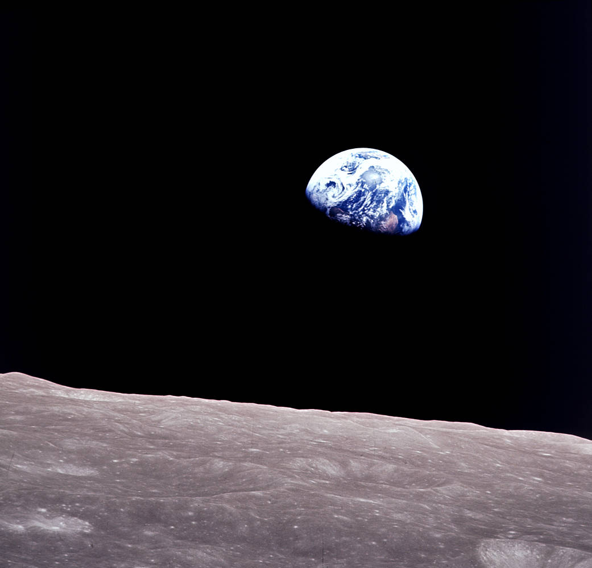
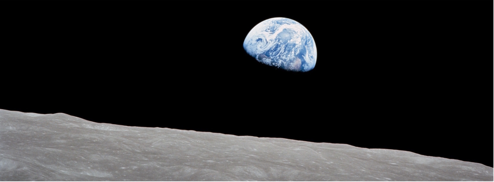
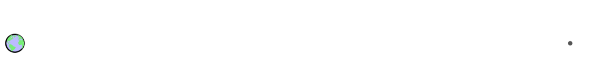
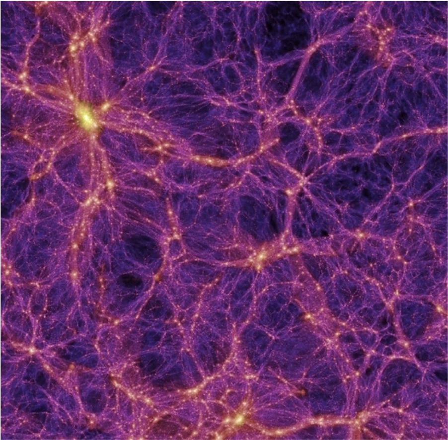

# Chương 4: Khám phá và chinh phục không gian vũ trụ

<!--  -->

!!! quote ""

    Được chụp trên tàu Apollo 8 bởi Bill Anders, bức ảnh mang tính biểu tượng này cho thấy Trái đất nhìn ra từ bên ngoài bề mặt Mặt trăng khi tàu vũ trụ có phi hành đoàn đầu tiên đi vòng quanh Mặt trăng, với các phi hành gia Anders, Frank Borman và Jim Lovell trên tàu. Ảnh cung cấp bởi NASA.

Cuốn sách giáo khoa này đánh giá những thách thức và hạn chế đặt ra cho chúng ta khi sống trên một hành tinh hữu hạn với nguồn tài nguyên hữu hạn. Nếu nuôi dưỡng những kỳ vọng rằng chúng ta sẽ bước vào cuộc sống ngoài không gian như một cách để giảm thiểu những thách thức trên trái đất, thì chúng ta sẽ khó phản ứng một cách nghiêm túc hơn với thông tin về nơi mọi thứ đang diễn ra trên Trái đất.

Chương này được đặt ở giữa sách nhằm “khép lại mọi lối thoát” (hay khép lại những viễn cảnh mà chúng ta có thể nghĩ đến tương lai con người sống trong không gian) để nội dung trong phần còn lại của cuốn sách có thể trở nên phù hợp hơn và đáng để bạn đầu tư thời gian tìm hiểu. Một số phần trong chương này đưa ra nhiều góc nhìn của tác giả hơn là những nội dung thường thấy trong sách giáo khoa. Một số người có thể không đồng tình với trường hợp được đưa ra, nhưng họ cần phải chứng minh được quan điểm của mình trong bối cảnh lối sống con người hiện đại đang vượt xa khả năng đáp ứng hiện tại trái đất[^1].

[^1]:

    Trích lời Carl Sagan, những tuyên bố hùng hồn biệt cần có bằng chứng hùng hồn.

## 1. Qui mô không gian

Trong vòng hai tiếng đồng hồ, chúng ta có thể ngồi xem một bộ phim và “tham gia” vào chuyến du hành giữa các vì sao mà không thấy mệt mỏi. Hãy cùng nhau bước ra khỏi ngành công nghiệp giải trí (viễn tưởng) và chấp nhận quy mô vật lý của thực tế môi trường không gian.

!!! quote ""

    Quy ước là **Trái đất** (*Earth*) viết hoa khi nó được sử dụng làm tên riêng và viết thường trái đất khi nó là một vật thể. Quy tắc tương tự áp dụng cho **Mặt trăng** (*Moon*) và **Mặt trời** (*Sun*).

Việc mô tả một mô hình có quy mô tương tự như hệ mặt trời, thiên hà và vũ trụ&mdash;như chúng ta sẽ làm trong giây lát&mdash;là một bài tập khó khăn, vì để đạt đến quy mô vật lý mà chúng ta có trực giác vững vàng (quãng đường lái xe trong một ngày?) thì chúng ta cần thu nhỏ qui mô lại như những đốm li ti (khó có thể nhìn thấy) tượng trưng cho những vật thể quen thuộc như trái đất. Vào thời điểm chúng ta biến Trái đất thành kích thước của một thứ mà chúng ta có thể cầm và chiêm ngưỡng, quy mô đã trở nên quá lớn để có thể dễ dàng hiểu được. **Hình 4.1** và **Hình 4.2** cho thấy đồ họa có tỷ lệ chính xác khó hình dung như thế nào khi biểu diễn trên một trang sách.

> **Hình 4.1:** *Trái đất và Mặt trăng (ngoài cùng bên phải) theo tỷ lệ. Ở quy mô này, mặt trời sẽ lớn hơn trang giấy và cách xa khoảng 400 trang. Hỏa tinh sẽ cách đó 160 đến 1.100 trang. Kể từ năm 1972, con người đã không đi ra ngoài đường viền đen của trái đất trong hình này (600 km).*

> **Hình 4.2:** *Hình vẽ chứng minh cho quan điểm: trang sách không có lợi cho việc vẽ đồ họa theo tỷ lệ chính xác của các vật thể trong không gian, vào thời điểm khoảng cách Trái đất-Mặt trời kéo dài trên trang, Trái đất (ở ngoài cùng bên phải) quá nhỏ để có thể nhìn thấy được trên bản in, nhỏ hơn 1% đường kính của mặt trời màu cam ở ngoài cùng bên trái.Khoảng cách Trái đất-Mặt trăng bằng chiều rộng của trục mũi tên đen bên trái hướng về Trái đất. Con người **chưa bao giờ** di chuyển xa hơn chiều rộng của trục mũi tên từ Trái đất và thậm chí chưa đi được 0,2% khoảng cách đó trong khoảng 50 năm! Tính trung bình, Hỏa tinh ở xa Trái đất hơn so với khoảng cách từ Trái đất đến mặt trời.*

Trước hết, chúng ta hãy trình bày một số tỷ lệ cơ bản có thể giúp xây dựng các mô hình phù hợp ở bất kỳ quy mô nào chúng ta chọn.

!!! note "**Định nghĩa 4.1:** Các mô hình về quy mô của vũ trụ có thể được xây dựng dựa trên các mối quan hệ gần đúng này, cũng xuất hiện trong **Bảng 4.1** và **Bảng 4.2**:"

    1. Đường kính của mặt trăng bằng 1/4 đường kính Trái đất và nằm cách Trái đất khoảng cách trung bình bằng 30 lần đường kính trái đất (hay 60 lần bán kính Trái đất) (xem **Hình 4.1**).

    2. Đường kính của mặt trời gấp khoảng 100 lần đường kính Trái đất và cách Trái đất xa hơn 400 lần so với khoảng cách từ mặt trăng đến Trái đất (xem **Hình 4.2**).
    
    3. Đường kính của **Hỏa tinh** (*Mars*) bằng khoảng một nửa Trái đất và khoảng cách đến Trái đất dao động từ 0,4 đến 2,7 lần khoảng cách Trái đất-Mặt trời.
    
    4. Đường kính của **Mộc tinh** (*Jupiter*) lớn hơn Trái đất khoảng 10 lần và nhỏ hơn Mặt trời khoảng 10 lần; nó cách xa mặt trời gấp khoảng 5 lần so với khoảng cách Trái đất-Mặt trời.
    
    5. **Hải Vương tinh** (*Neptune*) quay quanh mặt trời xa hơn khoảng cách Trái đất-Mặt trời 30 lần.

    6. Đám mây Oort[^2] của các **sao chổi** (*comet*) có khoảng cách đến mặt trời gấp khoảng 2.000 đến 100.000 lần khoảng cách Trái đất-Mặt trời.
    
    7.	Ngôi sao[^3] gần nhất cách chúng ta 4,2 năm ánh sáng, so với 500 giây ánh sáng từ Trái đất đến mặt trời&mdash;tương đương tỷ lệ 270.000.
    
    8.	Trung tâm **Dải Ngân hà** (Thiên hà Milky Way) cách chúng ta khoảng 25.000 năm ánh sáng[^4] và đĩa Ngân Hà có đường kính gấp bốn lần khoảng cách đó.
    
    9.	Thiên hà lớn tiếp theo[^5] cách chúng ta 2,5 triệu năm ánh sáng, tương đương khoảng 25 lần đường kính Dải Ngân.

    10.	Rìa của vũ trụ có thể quan sát được[^6] cách chúng ta 13,8 tỷ năm ánh sáng, hay gấp khoảng 6.000 lần khoảng cách tới thiên hà Andromeda.

[^2]:

    Đám mây Oort đánh dấu ảnh hưởng bên ngoài của lực hấp dẫn mặt trời.

[^3]:

    ...Proxima Centauri

[^4]:

    Nó gấp 6.000 lần khoảng cách đến ngôi sao gần nhất. Năm ánh sáng là khoảng cách ánh sáng di chuyển được trong một năm.

[^5]:
    
    ...thiên hà Andromeda

[^6]:

    bị giới hạn bởi thời gian di chuyển của ánh sáng kể từ Vụ nổ lớn (13,8 tỷ năm trước) và được gọi là chân trời vũ trụ của chúng ta. Xem **Phần D.1** để biết thêm.

Chúng ta sẽ xây dựng một mô hình bằng cách sử dụng các liên hệ tỷ lệ trong **Định nghĩa 4.1**, bắt đầu từ qui mô dễ hình dung.

|          Các bước         |  Số nhân  |
|:-------------------------:|:---------:|
| Đường kính Trái đất       | (bắt đầu) |
| Khoảng cách đến Mặt trăng |    30x    |
| Khoảng cách đến Mặt trời  |    400x   |
| Đến Hải Vương tinh        |    30x    |
| Đến ngôi sao gần nhất     |   9.000x  |
| Đến trung tâm Ngân Hà     |   6.000x  |
| Đến Thiên hà Andromeda    |    100x   |
| Đến rìa vũ trụ khả kiến   |   6.000x  |

> **Bảng 4.1:** *Khoảng cách theo qui mô. Khoảng cách trong mỗi dòng được tính bằng cách lấy số nhân của dòng đó nhân với toàn bộ số nhân ở các dòng trước*

| Vật thể | Kí hiệu | Bán kính | Khoảng cách (AU) | Khoảng cách tính bằng cách khác |
|:---:|:---:|:---:|:---:|:---:|
| Trái đất | ⴲ | $𝑅_{⊕}≈6.400km$ | &mdash; |  |
| Mặt trăng | ☾ | $\frac{1}{4}R_{⊕}$ | $\frac{1}{400}$ | $60𝑅_{⊕}≈240R_{☾}$ |
| Mặt trời | ☉ | $100R_{⊕}$ | $1$ | $240R_{☉︎}$ |
| Hoả tinh | ♂ | $\frac{1}{2}R_{⊕}$ | $0,4-2,7$ |  |
| Mộc tinh | ♃ |  $10𝑅_{⊕}≈\frac{1}{10}R_{☉︎}$ | $4-6$ |  |
| Thổ tinh | ♆ | $4𝑅_{⊕}$ | ${∼}30$ |  |
| Proxima Centauri | &mdash; |  $0,15𝑅_{☉︎}$ | $270.000$ | $4{,}2$ năm ánh sáng |

> **Bảng 4.2:** *Ký hiệu, kích thước tương đối và khoảng cách trong hệ mặt trời và tới điểm gần nhất ngôi sao. AU (Astronomical Unit) là một đơn vị thiên văn, hay khoảng cách trung bình giữa Trái Đất và Mặt Trời vào khoảng 150 triệu km. Thực tế do khoảng cách từ mặt trời và mặt trăng đến trái đất đều gấp 240 lần bán kính của mình giải thích vì sao chúng có kích thước tương tự trên bầu trời, dẫn đến hiện tượng nhật thực, nguyệt thực (toàn phần).*

Chúng ta sẽ làm cho Trái đất có kích thước bằng một hạt cát (đường kính khoảng 1 mm). Mặt trăng là một hạt nhỏ hơn (hạt bụi?) và đường quỹ đạo của nó sẽ dài bằng khoảng cách giữa hai mắt của bạn. Trên thang đo này, mặt trời có đường kính 100 mm (quả bưởi) và cách xa khoảng 12 mét (40 feet). Hỏa tinh có thể ở cách xa từ 4,5 mét (15 feet) đến 30 mét (100 feet). Hãy ngẫm nghĩ một chút rằng con người chưa bao giờ đi xa Trái đất hơn mặt trăng, tương đương với 3 cm (chỉ hơn một inch) trong thang đo này[^7]. Hỏa tinh còn cách xa hơn rất nhiều. Hải Vương tinh cách xa khoảng 4/10 km (ở quy mô này), và ngôi sao tiếp theo cách đó hơn 3.000 km (khoảng từ San Diego đến Atlanta). Vậy là chúng ta đã phá vỡ được cách tính toán trực quan dễ dàng của mình mà thậm chí còn chưa vượt qua được ngôi sao đầu tiên. Hơn nữa, mô hình này đã bắt đầu với trái đất như một hạt cát nhỏ. Chúng ta mới chỉ du hành cách xa Trái đất hai ngón tay ở quy mô này[^8], và đến với ngôi sao tiếp theo giống như đang thực hiện một chuyến hành trình xuyên đất nước (Hoa Kì). Để cụ thể hơn, hãy so sánh phải mất bao lâu để đi bộ một quãng đường rộng bằng hai ngón tay (3 cm) đến cần bao nhiêu thời gian để đi bộ xuyên nước Mỹ Kỳ. Việc đầu tiên chính là kì tích du hành đến mặt trăng vốn cực kì khó khăn; việc thứ hai có lẽ là không thể.

[^7]:

    Ở đây, hãy hình dung một hạt cát đang ở ngay trên sống mũi của bạn tượng trưng cho trái đất và một hạt bụi phía trước

[^8]:

    Lần cuối cùng chúng ta đi xa thế này là vào năm 1972.

!!! note "**Hộp 4.1:** Khi nào chúng ta sẽ đến đó?"
 
    Phải mất 12 năm để tàu **Du hành 2** (*Voyager 2*) đến được Hải Vương tinh, nơi chúng ta vẫn coi là “sân nhà của mình”. Tàu vũ trụ duy nhất cho đến nay di chuyển đủ nhanh để rời khỏi Trái đất và hệ mặt trời là hai tàu **Du hành** (*Voyager*), hai tàu Tiên phong (*Pioneers*), và tàu thăm dò **Những chân Trời Mới** (*New Horizons*)[^9]. Xa nhất và nhanh nhất là tàu **Du hành 1** (*Voyager 1*), đạt đến khoảng cách gấp 150 khoảng cách Trái đất-Mặt trời sau 43 năm. Ngôi sao gần nhất cách chúng ta khoảng hơn 2.000 lần. Với tốc độ hiện tại là 17 km/s, nó đi được quãng đường bằng với khoảng cách tới ngôi sao gần nhất[^10] sau 75.000 năm nữa.

    Tàu vũ trụ nhanh nhất được ghi nhận là Parker Solar Probe, đã đạt tới tốc độ khủng khiếp 68,6 km/s, nhưng cũng bởi vì nó đi đi xung quanh và gần vào (rơi vào) mặt trời. Vì nó ở quá gần mặt trời, ngay cả tốc độ này cũng không đủ để cho phép nó thoát khỏi lực hấp dẫn của mặt trời và thoát ra, như năm tàu vũ trụ đã làm ở trên. Ngay cả khi tàu **Du hành 1** với vận tốc còn lại sau khi thoát khỏi hệ mặt trời khoảng 70 km/s[^11], vẫn phải mất 20.000 năm đi hết khoảng cách tới ngôi sao gần nhất. Lưu ý rằng tuổi thọ con người thường ngắn hơn khoảng 200 lần.

    Chế tạo tàu vũ trụ chở người có tốc độ cao là điều *vô cùng* khó khăn, hơn rất nhiều so với việc tăng tốc những tàu thăm dò nhỏ bé hơn, nên những thách thức rất đa dạng và cực kì lớn. Để tham khảo, **các sứ mệnh của Apollo** (*Apollo missions*) tới Mặt trăng, vốn ở gần, mang theo gần 3.000 tấn nhiên liệu [^12], gấp khoảng 80.000 lần dung tích bình xăng của một chiếc ô tô thông thường. Một ô tô trung bình cần 2.000 năm mới tiêu tốn hết lượng nhiên liệu như vậy. Bạn có nghĩ rằng các phi hành gia tranh đã cãi nhau về việc ai sẽ trả tiền xăng không?

!!! success ""

    Công bằng mà nói, đòi hỏi về nhiên liệu không đơn giản là tăng theo khoảng cách du hành trong không gian, không giống như việc di chuyển bằng ô tô. Tuy nhiên, chỉ cần rời khỏi Trái đất cũng cần một lượng nhiên liệu khổng lồ.

[^9]:

    Danh sách các vật thể nhân tạo đã rời khỏi Hệ Mặt trời. [Wikipedia](https://en.wikipedia.org/wiki/List_of_artificial_objects_leaving_the_Solar_System)

[^10]:

    Tuy nhiên, quĩ đạo của nó không đi theo hướng ngôi sao gần nhất.

[^11]:

    Vận tốc nó chỉ còn là 17 km/s.

[^12]:

    Tàu Saturn V (2020)

Hãy giãn quy mô một chút, mặt trời lúc này có kích cỡ như một hạt đậu gà (*chickpea*) (đậu garbanzo). Trái đất bây giờ có đường kính bằng một sợi tóc người (rất dễ đánh rơi), và khoảng cách Trái đất-Mặt trời là 1 mét. Mặt trăng đã trở nên không thấy được nữa và cách trái đất khoảng một đốm tàn nhang. Ngôi sao tiếp theo hiện giờ ở cách xa 300 km (khoảng 3 giờ lái xe vận tốc ở đường cao tốc), lúc này trung tâm Dải Ngân Hà cách đó 1,5 triệu km. Ôi chao. Con số này lớn hơn bốn lần khoảng cách Trái đất-Mặt trăng trên *thực tế*. Chúng ta đã phá vỡ quy mô trong mô hình của mình một lần nữa mà thậm chí chưa vượt ra ngoài Dải Ngân Hà.

Thế nên chúng ta thiết kế lại và biến mặt trời thành một hạt cát. Bây giờ trái đất cách đó 10 cm Và ngôi sao gần nhất cách đó 30 km[^13]. Hãy nghĩ về không gian theo cách này: các sao trong thiên hà giống như những hạt cát ở cách nhau hàng chục km. Ở quy mô này, các hệ mặt trời có kích thước bằng một phòng ngủ, bao gồm một hạt cát phát sáng rực rõ ở giữa và một vài hạt bụi (các hành tinh) rải rác khắp phòng[^14]. Không gian thậm chí còn trống rỗng hơn trong những vùng rộng lớn giữa các ngôi sao. Qui mô của Dải Ngân Hà trên thang đo này vẫn lớn hơn nhiều so với Trái đất thực tế, có đường kính tương đương kích thước của quỹ đạo mặt trăng quanh Trái đất.

[^13]:

    ...tương đương một ngày dài đi bộ

[^14]:

    Ngay cả một hệ mặt trời, một loại ốc đảo địa phương trong thiên hà, hầu hết đều bao phủ bởi không gian trống rỗng.

!!! note "**Hộp 1.2:** Các thang đo vũ trụ"

    Không cần thiết phải bàn xa hơn về không gian rộng lớn, nhưng đã đi xa đến mức này một số bạn có thể quan tâm đến việc hoàn thành hành trình tưởng tượng của chúng ta.

    Hệ mặt trời có kích thước lớn đến mức không thể tin nổi, chưa kể đến việc bản thân kích thước đó chưa là gì so với khoảng cách giữa các vì sao, vốn rất nhỏ bé so với quy mô của thiên hà, làm sao chúng ta có thể hình dung được những quy mô lớn nhất trong vũ trụ? Hãy bắt đầu bằng cách làm cho các thiên hà thu nhỏ đến mức có thể quan sát được. Nếu các thiên hà giống như những đồng xu (Chẳng hạn như một đồng 10 xu Hoà Kì có đường kính xấp xỉ 1 cm), thì khoảng cách giữa chúng thường ước lượng theo mét. Rìa của vũ trụ có thể quan sát được hay khả kiến (xem **Phần D.1**) sẽ chỉ cách đó 1,5 km. Sau cùng, bức tranh đã dễ hình dung hơn nhiều: những đồng xu như những thiên hà cách nhau một khoảng như chiều dài cánh tay và trải rộng trên một khu vực giống như trung tâm của một thị trấn có quy mô vừa phải. Chúng ta thậm chí có thể hình dung được sự sắp xếp dạng bọt, và liên kết của các thiên hà này, chứa những khoảng trống có kích thước bằng một ngôi nhà (5–50 m) không chứa đồng xu (thiên hà) nào. Xem **Hình 1.3** để có giải thích trực quan hơn.

    Nhưng việc thâm nhập vào bản chất từng thiên hà (đồng xu, trong thang đo của ví dụ trước) là cực kỳ khó khăn: chúng hầu hết là không gian trống rỗng và đến khi chúng ta thu nhỏ thiên hà xuống một thang đo có thể hình dung được (chẳng hạn như 10 km, để chúng ta có qui mô của một thành phố), các ngôi sao riêng lẻ sẽ cách nhau vài phần mười mét và chỉ có đường kính khoảng 50 nguyên tử (khoảng 10 nanomet). Tế bào và vi khuẩn lớn hơn thế này khoảng 100–1.000 lần. Vì vậy, gần như không thể hình dung được quy mô của thiên hà đồng thời đánh giá đúng kích thước thước của các ngôi sao và khoảng không gian trống rỗng nằm giữa chúng.

> **Hình 1.3:** *Các thiên hà thực sự được phân bố theo kiểu giống như bọt xốp xếp dọc theo các cạnh của các bong bóng rộng lớn (khoảng trống; xuất hiện dưới dạng các vùng tối trong ảnh). Cấu trúc này hình thành như một hệ quả tự nhiên của hấp dẫn khi các thiên hà kéo gần vào lẫn nhau vvà hợp nhất thành các nhóm, để lại sự rất nhiều khoảng trống ở giữa. Đồ họa này cho thấy các cạnh bong bóng và các sợi nối nơi các thiên hà tập hợp lại. Các thiên hà lớn hơn tương ứng với những chấm sáng theo góc nhìn này&mdash;gần giống như các thành phố dọc theo mạng lưới 3 chiều xuyên qua khoảng trống rộng lớn. Ảnh từ [**Mô phỏng Thiên niên kỷ**](https://wwwmpa.mpa-garching.mpg.de/galform/virgo/millennium/) (Millennium Simulation).*

Với không gian rộng lớn thế này, thật thiếu thận trọng khi coi du hành Vũ trụ như một “giải pháp” cho hàng loạt các thách thức hiện tại của chúng ta trên Trái đất&mdash;những thách thức diễn ra trong khoảng thời gian ngắn hơn nhiều với Với thời gian cần thiết để tập trung vào bất kỳ sự hiện diện có ý nghĩa nào trong không gian. Hơn nữa, du hành vũ trụ rất tốn kém về mặt năng lượng Và kinh tế (xem **Bảng 4.3**). Khi chúng ta đang cạnh tranh để giành lấy những nguồn tài nguyên hữu hạn chỉ xuất hiện một lần trong đời và sẽ cạn kiệt vào cuối thế kỷ này, du hành Vũ trụ sẽ khó có được sự ưu tiên, ngoại trừ trong sự tiêu khiển thoát li trái đất[^15].

[^15]:
 
    ...đó là điều tuyệt vời miễn là nó không bóp méo nhận thức của chúng ta về thực tại một cách nguy hiểm.

| Nỗ lực | Chi phí |
|:---:|:---:|
| Chương trình Apollo | $288 Tỷ |
| Phóng Tàu con thoi | $450 Triệu |
| Một chỗ đến ISS | $90 Triệu |
| Sứ mệnh đưa người lên Hoả tinh | $500 Tỷ |

> **Bảng 4.3**: Chi phí ước tính/xấp xỉ, đã điều chỉnh theo lạm phát (đơn vị Đô la Mĩ)

## 2. Câu chuyện sai lầm

Con người không ngại tự chúc mừng mình vì những thành tựu đạt được. Vâng, chúng ta đã làm được những điều khá đáng chú ý. Một cảm xúc hấp dẫn và phổ biến đã kể câu chuyện của nhân loại theo thuật ngữ tiến hoá: cá bò ra khỏi đại dương, chim bay lên không trung và con người đang thực hiện bước đi hợp lý tiếp theo vào không gian&mdash;tiếp tục di sản thoát khỏi sự trói buộc của nước, đất và cuối cùng là Trái đất. Đó là một câu chuyện hấp dẫn và chúng ta thực sự đã học được cách thoát khỏi lực hấp dẫn của Trái đất và đặt chân lên một thiên thể khác.

Nhưng chúng ta đừng quá tự phụ. Chỉ vì chúng ta có thể chỉ ra một vài thành tựu điển hình không có nghĩa là những ví dụ đó dụ báo hiệu một trạng thái bình thường mới. Một người có thể leo lên đỉnh Everest, nhưng việc đó khó có thể trở thành một hoạt động bình thường. Chúng ta có thể chế tạo một chiếc máy bay siêu âm chở khách cho chuyến bay xuyên Đại Tây Dương, nhưng điều đó không có nghĩa là nó sẽ khả thi để duy trì[^16]. Người ta có thể tạo ra sân chơi nhiều chướng ngại vật cho sóc và các video lan truyền trên mạng, nhưng màn trình diễn gây cười này không báo hiệu một “bình thường mới” trong việc thiết kế sân sau nhà. Chúng ta cần tách biệt **khả năng** khỏi **thực tế**. Khi đó, cuộc đổ bộ lên mặt trăng có thể được coi là một màn trình diễn&mdash;một sự thể hiện năng lực&mdash;hơn là một con đường dẫn đến tương lai của chúng ta. Chúng ta đã gặp những lập luận tương tự trong phần [Kinh tế](https://songbenvung.net/energy/human-ambition/2-econ/) liên quan đến việc tách rời (hay tăng trưởng GDP không phụ thuộc vào việc phát thải nhiều hơn): chỉ vì nó có thể xảy ra trong một số lĩnh vực nhất định của nền kinh tế không có nghĩa là toàn bộ nền kinh tế có thể tách rời và “bất chấp lực hấp dẫn”.

[^16]:

    ...hay tồn tại đến ngày nay (xem câu chuyện về máy bay Concorde, **Hộp 2.2**, [Kinh tế](https://songbenvung.net/energy/human-ambition/2-econ/))
 
Lập luận hấp dẫn về tiến hoá đã bỏ sót hai khía cạnh quan trọng của thực tế. Khi cá bò ra khỏi biển, chúng thoát khỏi sự săn mồi (với tư cách là động vật đầu tiên trên cạn) và tìm thấy nguồn thức ăn mới mà không cần cạnh tranh. Đó là tình huống đôi bên cùng có lợi (*win-win*): ít nguy hiểm hơn, nhiều dinh dưỡng hơn[^17]. Tương tự như Vậy, khi chim biết bay (hoặc chúng ta có thể thảo luận về côn trùng), đó là một câu chuyện tương tự: trốn tránh những kẻ săn mồi trên mặt đất không thể bay, và tiếp cận với một thực đơn thực phẩm hoàn toàn mới&mdash;một tình huống win-win nữa.

[^17]:

    Sự tiến hoá hoạt động dựa trên việc khai thác những lợi thế, thiên về những loài chiến thắng và loại bỏ những tình huống “thua cuộc” do cạnh tranh.

Việc du hành vào không gian có thể dễ dàng bị coi là tình huống đôi bên cùng có hại (*lose-lose*). Đó là một môi trường cực kỳ khắc nghiệt, không có sự bảo vệ hay nơi trú ẩn an toàn[^18] và không có gì để ăn[^19]. Hãy nghĩ về điều này: bạn sẽ đi đâu để có thực phẩm bây giờ trong hệ mặt trời của chúng ta, ở bên ngoài Trái đất? Và hệ mặt trời là một ốc đảo tuyệt vời so với khoảng trông vô cùng lớn giữa các vì sao. Hai yếu tố thúc đẩy quá trình tiến hoá trên đất liền và trên không sẽ không hoạt động để “tiến hoá” chúng ta vào trong không gian. Đó là một viễn cảnh khó khăn hơn rất nhiều. Đúng là có thể trồng lương thực trên tàu vũ trụ hay trong môi trường điều áp, nhưng khi đó chúng ta không tuân theo qui trình tiến hoá hài hước về việc tự nhiên bắt gặp được một tình huống tốt hơn trước (hay không còn win-win nữa).

[^18]:

    Trái đất chính là nơi chú ẩn an toàn.

[^19]:

    Điều thú vị là chưa từng có chiếc bánh mì kẹp phô mai nào đã được nhét vào một con tàu vũ trụ.

!!! quote ""

    Một “chiến thắng” mà một số người tưởng tượng từ không gian là khả năng tiếp cận nguyên liệu. Tuy nhiên,Trái đất đã được dự trữ đầy đủ các nguyên tố từ trong bảng tuần hoàn hoá học, và tính kinh tế của việc khai thác tài nguyên từ không gian trong nhiều trường hợp cực kì không khả quan.

!!! note "**Hộp 1.3:** Thành tựu trong không gian"

    Trước khi chuyển sự chú ý sang những gì chúng ta chưa làm được trong không gian, các bạn có thể đánh giá cao bản tóm tắt những tiến bộ cho đến nay. Danh sách này không hề đầy đủ mà nhằm mục đích giải quyết những quan niệm sai lầm phổ biến.
 
    - 1957: Sputnik (Liên Xô) là Vệ tinh đầu tiên bay quanh Trái đất.
    - 1959: Luna 3 (Liên Xô; không người lái) bay ngang qua mặt trăng.
    - 1961: Yuri Gagarin (Liên Xô), người đầu tiên bay vào vũ trụ, quay quanh Trái đất một lần.
    - 1965: Alexei Leonov (Liên Xô) thực hiện chuyến “đi bộ ngoài không gian” đầu tiên.
    - 1965: Mariner 4 (Mỹ; không người lái) tới Hỏa tinh.
    - 1968: Apollo 8 (Mỹ) lần đầu tiên đưa con người lên quỹ đạo mặt trăng.
    - 1969: Apollo 11 (Mỹ) đưa con người đầu tiên lên bề mặt mặt trăng.
    - Hãy tạm dừng ở đây để hình dung tất cả những sự kiện này đã diễn ra nhanh như thế nào. Thật dễ hiểu vì sao người ta lại cho rằng Hỏa tinh sẽ bị chinh phục trong vòng 50 năm nữa. Những câu chuyện hấp dẫn khó có thể dừng lại, ngay cả khi chúng sai.
    - 1972: Apollo 17 (Mỹ) là Sứ mệnh cuối cùng của con người lên mặt trăng; chỉ có 12 người đã bước đi trên một thiên thể khác trong hệ mặt trời, lần cuối cùng là cách đây khoảng 50 năm.
    - 1973-nay: tính đến thời điểm viết bài này (2020), con người chưa mạo hiểm đi xa hơn khoảng 600 km tính từ bề mặt Trái đất (được gọi là quỹ đạo Trái đất tầm thấp (*Low Earth Orbit*), hay LEO; xem **Hình 4.4**) kể từ khi kết thúc các sứ mệnh Apollo.
    - 1981–2011: Hoa Kỳ vận hành tàu con thoi, dự kiến sẽ thực hiện hoạt động du hành vũ trụ thường xuyên. Sau 135 lần phóng (hai lần kết thúc trong thảm họa), tàu con thoi bị cho nghỉ hưu, khiến Hoa Kì không còn khả năng phóng tàu không gian có người nữa.
    - 1998–nay: **Trạm Vũ trụ quốc tế** (*International Space Station*) (ISS) cung cấp một nền tảng thử nghiệm và duy trì sự hiện diện con người trong không gian. Nó chỉ cách bề mặt Trái đất 400 km (khoảng cách tương đương lái xe trong 4 giờ), và&mdash;mặc dù có cái tên gây hiểu lầm&mdash;nó không được sử dụng làm điểm trung chuyển cho tàu du hành vũ trụ. **Nó chính là điểm đến.**

> **Hình 4.4:** *Dải màu hồng cho biết khoảng cách con người đã đi xa nhất khỏi bề mặt của trái đất trong 50 năm qua. **Kính Viễn Vọng Không gian Hubble** (Hubble Space Telescope) (HST) có quĩ đạo ở phần rìa ngoài của dài này ở độ cao 600 km và **Trạm vũ trụ quốc tế** ở giữa ở độ cao 400 km. Ngoài đường màu đen mỏng bao quanh địa cầu, bầu khí quyển của Trái đất quá mong manh để hỗ trợ sự sống.*

## 3. Hàng loạt các khó khăn trở ngại

Nếu không nản lòng trước sự trống rỗng vô cùng lớn, điều kiện khắc nghiệt hay thiếu nguồn nhân lực hỗ trợ trong không gian, thì có thể là do bạn tin tưởng vào sự sáng tạo của con người có thể vượt qua những thách thức này. Và điều này đúng ở một mức độ nào đó. Chúng ta đã bước đi trên một thiên thể khác trong hệ mặt trời[^20]. Chúng ta đã có những con người dành khoảng một năm trên quỹ đạo trái đất. Đây có thể là những bước đi đầu tiên hướng tới tương lai du hành không gian hay chỉ là những kỳ công hiếm hoi mà chúng ta có thể đạt được với nỗ lực/chi phí phi thường. Làm thế nào chúng ta nói lên được sự khác biệt?

[^20]: 
    Chuyến hạ cánh cuối cùng xuống mặt trăng của tàu Apollo là vào năm 1972.

!!! note "**Hộp 4.4:** So sánh với du lịch bụi"

    Cách mà hầu hết mọi người trải nghiệm khi đi du lịch bụi cũng tương tự như cách chúng ta khám phá không gian: mang trên lưng tất cả đồ ăn, quần áo, lều trại và các thiết bị tiện ích cần thiết trong một khoảng thời gian hữu hạn của chuyến đi. Chỉ có không khí và nước được lấy trong tự nhiên. Để du hành Vũ trụ, ngay cả không khí và nước cũng phải được tiếp tế từ Trái đất. Vì thế, du hành vũ trụ giống như một hình thức du lịch bụi được tôn vinh và cực kỳ tốn kém&mdash;mặc dù mang lại những khung cảnh ngoạn mục!

Một cách để thăm dò xem đây là một màn trình diễn hay chính là con đường của tương lai là bằng cách liệt kê các khả năng mà chúng ta chưa chứng minh rằng sẽ thực hiện được đối với cuộc sống trong không gian, bao gồm:
 
1. Trồng cây lương thực để ăn; 
2. Sống sót trong thời gian dài bên ngoài từ trường bảo vệ của Trái đất khỏi các tia vũ trụ[^21];
3. Tạo ra hoặc thu thập nhiên liệu đẩy để thoát khỏi bề mặt Trái đất;
4. Sức khỏe trong dài hạn của cơ và xương trong một trong thời gian hơn một năm ở môi trường trọng lực thấp;
5. Khai thác tài nguyên Vật liệu xây dựng tại chỗ; 
6. Duy trì bền vững hệ sinh thái khép kín; 
7. Bất cứ điều gì gần với việc biến đổi hành tinh&mdash;biến cải một hành tinh từ chỗ cực kì khắc nghiệt và không thích hợp cho sự sống thành nơi có thể ở được lâu dài (*terraform*).

[^21]: 
    Trạm vũ trụ quốc tế ISS vẫn nằm trong phạm vi bảo vệ của Trái đất.
 
Sẽ dễ tin hơn vào khả năng chinh phục không gian nếu trước hết chúng ta được thấy những ví dụ về sự chinh phục dưới đáy đại dương[^22]. Một môi trường như thế mang rất nhiều thách thức tương tự: môi trường bản địa không thể thở được; chênh lệch áp suất lớn; một môi trương kín có thể tự duy trì. Nhưng nơi này có một số lợi thế lớn so với không gian ở chỗ, thức ăn luôn có sẵn ngay bên ngoài môi trường này; sự an toàn/không khí chỉ cách đó một quãng ngắn (tính bằng mét); có thể dễ dàng tiếp cận (bơi/lặn với với việc phóng tên lửa); và nó có tất cả các nguồn lực trên Trái đất để tạo điều kiện thuận lợi cho việc xây dựng/vận hành (Ví dụ: Trung tâm mua sắm Home Depot cách đó không xa).

[^22]:

    Thậm chí chỉ cách bề mặt đại dương 10 mét!
 
!!! success ""

    Đây không phải sự ủng hộ cho ý tưởng sinh sống dưới đáy đại dương là tốt đẹp; ví dụ này chỉ được sử dụng để minh họa rằng việc cư trú trong không gian thậm chí còn là một ý tưởng ít thực tế hơn rất nhiều.
 
Xây dựng một môi trường Sống dưới đáy đại dương sẽ dễ dàng hơn rất nhiều so với việc cố gắng thực hiện điều đó trong không gian. Tất nhiên, việc xây dựng môi trường thậm chí còn dễ dàng hơn trên đất liền. Nhưng chúng ta vẫn chưa xây dựng và vận hành thành công một hệ sinh thái khép kín trên đất liền! Một số nỗ lực như dự án [**“Sinh quyển 2”**](https://en.wikipedia.org/wiki/) (*Biosphere 2*) để tạo ra môi trường nhân tạo khép kín trong đó con người sống được lâu dài đều đã thất bại. Nếu việc thành công trên bề mặt trái đất không phải là điều dễ dàng thì liệu chúng ta có thể mơ tưởng đến việc đạt được nó ngay trong chốn không gian xa xôi đầy thù địch, nơi thiếu khả năng tiếp cận dễ dàng với các nguồn tài nguyên được sản xuất và chế tạo?

Về ý tưởng biến đổi hành tinh (sao cho bầu khí quyển của nó giống với bầu khí quyển của Trái đất (về thành phần hoá học, nhiệt độ, áp suất) và có thể hỗ trợ sự sống của con người) (*terraform*), hãy xem xét từ khía cạnh sau đây. Hiện nay Trái đất đang gặp phải vấn đề dư thừa CO~2~ do đốt cháy nhiên liệu hoá thạch. Vấn đề đã làm xáo trộn hệ thống kinh tế Và chính trị, đến mức không chỉ chúng ta dường như bất lực trong việc quay trở lại mức CO~2~ thời tiền công nghiệp, mà ngay cả việc ngăn chặn mức tăng phát thải hàng năm dường như cũng nằm ngoài khả năng của chúng ta. Mức CO~2~ thời tiền công nghiệp đo được là 280 phần triệu (ppm) trong khí quyển, đây là mức dhúng ta sẽ coi là bình thường. Nồng độ ngày nay đã vượt quá 410 ppm, do đó mức thay đổi chỉ hơn 130 ppm một chút, hay 0,013% bầu khí quyển của chúng ta[^23]. Trong khi đó, bầu khí quyển của Hỏa tinh có đến 95% là CO~2~. Vì vậy, chúng ta có thể nói rằng Trái đất có vấn đề với hàng trăm ppm, nhưng Hỏa tinh về cơ bản có vấn đề với hàng triệu ppm. Trên Trái đất, chúng ta hoàn toàn lúng túng với nồng độ hàng trăm ppm của CO~2~ trong khi được tiếp cận với tất cả các tài nguyên sẵn có trên hành tinh. Hãy nhìn vào tất cả những cơ sở hạ tầng sẵn có trên thế giới phát triển ngày nay, trong khi chúng ta vẫn chưa thể đảo ngược thậm chí ngăn chặn sự gia tăng của CO~2~. Làm sao chúng ta có thể coi việc biến đổi bầu khí quyển của  Hỏa tinh thành một nơi có thể ở được là điều thực tế, trong khi Hỏa tinh không có cơ sở hạ tầng để hỗ trợ cho công việc đó? Chúng ta phải cẩn thận khi tuyên bố về những điều là *không thể thực hiện được*, nhưng chúng ta có thể có lý khi gán cho chúng cái mác *phi thực tế* một cách thái quá, đến mức trở thành điều gây xao lãng khi bàn luận. **Hình 1.5** minh họa thêm khoảng cách lớn giữa những điều kiện có thể chấp nhận được Và bầu khí quyển thực tế ở các hành tinh trong hệ mặt trời.

[^23]:

    Trong khi mức tăng từ 280 lên 410 là **khoảng** 50%, là một phần trong bầu khí quyển Trái đất, sự thay đổi khoảng 130 ppm là tương đương với 130 chia cho 1.000.000 (theo định nghĩa của ppm), hay 0,013%.

 
> **Hình 4.5:** *Khí quyển các hành tinh trong hệ mặt trời, biểu thị nhiệt độ trung bình (độ C) Và áp suất (khí quyển) (tính bằng atm). Phạm vi nhiệt độ và áp suất “dễ chịu” ở Trái đất được biểu thị dưới dạng **hình chữ nhật màu xanh lam**, từ 10°C đến 40°C và 0,2 atm (khi bầu khí quyển chứa 100% Oxy) cho đến 10 atm. Các hành tinh khác không chỉ nằm ngoài phạm vi dễ chịu của chúng ta mà còn có thành phần khí độc hại và thiếu Oxy trong bầu khí quyển. Hãy nhớ rằng sự thay đổi dù chỉ một vài độ C&mdash;như biến đổi khí hậu&mdash;cũng là một Vấn đề lớn. Ngay cả Đỉnh Everest, nơi con người có thể tồn tại chỉ trong vài giờ với lượng Oxy bổ sung, về cơ bản là hiếu khách hơn Hỏa tinh.*

Chúng ta cũng nên nhớ lại bài học ở phần [Tăng trưởng](1-growth.md) về cái gọi là tăng trưởng theo cấp số nhân và việc bổ sung thêm một môi trường sống nữa về cơ bản không ảnh hưởng gì đến hệ quả cuối cùng, ngoài việc trì hoãn thêm một thời gian nhân đôi ngắn ngủi. Do đó, ngay cả khi chúng ta lầm lẫn khi đánh giá thấp việc biến đổi hành tinh khác trong hệ mặt trời, thì ai quan tâm chứ? Chúng ta vẫn không tránh khỏi thách thức chính mà nhân loại phải đối mặt khi tăng trưởng gặp phải những giới hạn trong một thế giới hữu hạn (hay thậm chí là một hệ mặt trời hữu hạn, nếu chúng ta nói đến mức đó).

## 4. Vai trò thám hiểm

Thật dễ hiểu tại sao mọi người có thể bám vào ý tưởng rằng chúng ta có thể sẽ tận dụng việc khám phá không gian để chinh phục và biến nó thành thuộc địa. Giống như những nhà thám hiểm đầu tiên trên hành tinh này đã mở ra những con đường đường xâm chiếm “thế giới mới”; sự tương đồng trong việc khám phá những thế giới mới (theo nghĩa đen) như các hành tinh cũng là điều hiển nhiên[^24]. Thêm vào đó, chúng ta bị quyến rũ bởi sự mới lạ đầy thách thức của việc chiếm đóng không gian&mdash;được thực chứng bởi một ngành giải trí sôi động (như điện ảnh) dành riêng cho những câu chuyện kể về cuộc sống trong không gian. Nhưng không phải mọi sự thám hiểm đều dẫn đến phá đều dẫn đến việc cư ngụ lâu dài và phim giải trí không phải là sự thật.

[^24]: 

    "Khám phá" ra châu Mỹ là một bước nhảy vọt lớn qua một vùng đại dương với cách hệ sinh thái sống có diện tích gấp đôi châu Âu. Khám phá Hỏa tinh đòi hỏi một bước nhảy khổng lồ xuyên qua không gian khắc nghiệt không hỗ trợ sự sống có khoảng cách gấp 5.000 lần đường kính Trái đất.
 
Con người đã khám phá (một phần nhỏ) đại dương sâu thẳm, leo lên những đỉnh núi cao nhất không người ở trên Trái đất, cũng như đến thăm mỏm băng khắc nghiệt ở Bắc Cực. Trong những trường hợp như này, chúng ta không hề có ý định thiết lập nơi cư trú thường xuyên tại đây. Đó là những nơi kiểm tra sự dẻo dai của con người và cũng để khám phá môi trường mới. Chúng ta không coi những cuộc thám hiểm này là sai lầm chỉ vì chúng không mở đường cho việc định cư lâu dài. Đúng hơn, chúng ta nói về những chuyến du ngoạn một cách trìu mến như những chiếc lông vũ trên chiếc mũ tập thể của chúng ta: những chiến công khiến con người tự hào với tư cách một giống loài. Không gian có thể được nhìn nhận theo cách tương tự: đó là mức độ cao cấp nhất về mặt thử thách và sự kinh ngạc, phản ánh rất tích cực đối với trí tò mò, động lực, sự khéo léo và tinh thần đồng đội của chúng ta. Chúng ta cũng nhận được lợi ích[^25] từ tiến bộ công nghệ được thúc đẩy bởi nỗ lực khám phá và nâng cao hiểu biết khoa học của chúng ta về tự nhiên.

[^25]: ...một trong số đó là niềm trân quý sâu sắc hơn đối đối Trái đất vô giá.
 
Vì vậy, ngay cả khi không gian không đáp ứng được ảo tưởng về việc bành trướng của con người ra khắp vũ trụ, thì với bản chất nội tại của con người, ít nhất chúng ta muốn khám phá nó. Chúng ta nên xếp việc thám hiểm không gian vào đồng hạng mục với việc chinh phục đỉnh Everest thay vì đánh giá nó như việc người Châu Âu tình cờ khám phá ra Tây Ấn (một bên là nơi không sống được, một bên hoàn toàn có thể). Chúng ta đừng phạm sai lầm khi áp dụng và định hướng những câu chuyện sai lầm về không gian.
 
Nhiều điều tích cực có thể được nói về việc khám phá không gian và hy vọng rằng chúng ta sẽ không dừng lại việc tiếp tục khám phá môi trường bên ngoài vũ trụ. Tuy nhiên, hy vọng rằng việc khám phá như vậy là một con đường dẫn đến sự chinh phục và thôn tính không gian của con người có lẽ là sai lầm và gần như chắc chắn phản tác dụng ở thời điểm hiện tại, do thời gian còn lại rất ngắn trước khi sự bành trướng của con người vượt quá các giới hạn của Trái đất.

Nếu chúng ta có đủ thời gian cần thiết để nhìn thấy một con đường hướng tới thôn tính không gian một cách thiết thực thì cũng tốt. Nhưng với nhưng thách thức và chi phí cực kì cao&mdash;cả về mặt năng lượng và kinh tế, và đối với việc thám hiểm chỉ chiếm một phần rất nhỏ trong xã hội loài người&mdash;có vẻ khôn ngoan hơn rất nhiều nếu trước hết chúng ta biết quan tâm đến mối quan hệ của mình với Trái đất, sau đó mới nghĩa đến việc thôn tính không gian vào thời điểm thích hợp, nếu điều này có ý nghĩa thực sự. Nếu không, chúng ta không chỉ đang lãng phí những nguồn tài nguyên quý giá một cách thiếu khôn ngoan mà (thậm chí còn tệ hơn) tư duy của chúng ta bị hư hại bởi những giấc mơ viển vông, làm giảm tầm quan trọng của việc đối mặt với thử thách thực sự ngay tại đây. Chúng ta cần phải tỉnh táo trước thực tế hiện nay. 

!!! note "Có lẽ nhóm nhạc 21 Phi Công (twenty øne piløts) đã nói về điều đó hay nhất trong bài hát Stressed Out:"

    Chúng ta từng giả vờ, hay đặt cho nhau những cái tên khác. 
    Chúng ta sẽ chế tạo một con tàu tên lửa và sau đó sẽ bay đi thật xa
    Chúng ta từng mơ về không gian vũ trụ nhưng giờ nó đang cười vào mặt và nói với chúng ta rằng, “Dậy đi, bạn cần phải đi kiếm tiền." Vâng, là thế đó.
 
!!! note ""

    Bất chấp giọng điệu bi quan của chương này, bản thân tác giả vẫn bị không gian quyến rũ và đã dành cả đời cho nó: Chiến tranh giữa các vì sao (*Star Wars*) thưở nhỏ và Du hành giữa các vì sao (*Star Trek*) đặc biệt có ảnh hưởng đến tác giả. Bộ phim The Right Stuff (về huấn luyện du hành không gian) vẫn được tác giả yêu thích. Ông (tác giả) đã nhìn tới rìa Vũ trụ&mdash;đầu tiên là qua kính viễn vọng 10 inch (25,4 cm) mà ông chế tạo ở trường trung học, và sau đó sử dụng những kính thiên văn lớn nhất thế giới. Ông đã làm việc trong một thí nghiệm Tàu con thoi, đã gặp gỡ các phi hành gia, biết Sally Ride (nữ du hành gia nổi tiếng người Hoa Kì) và đã dành phần lớn sự nghiệp của mình để xây dựng và vận hành một hệ thống laser phản xạ và phát hiện các photon riêng lẻ thoát ra khỏi các gương phản xạ được các phi hành gia Apollo đặt trên bề mặt mặt trăng (đây là một bài kiểm tra bản chất căn bản của hấp dẫn), việc này đã trực tiếp truyền cảm hứng cho một phần sê-ri phim Lý thuyết Vụ nổ lớn (*Big Bang Theory*) thông qua tương tác cá nhân với những người viết kịch bản. Đây có một tình yêu sâu sắc dành cho không gian không? Đúng. Tác giả sẽ tình nguyện đi lên mặt trăng hay Hỏa tinh chứ? Vâng. Thế tác giả có tin rằng không gian vũ trụ sẽ nắm giữ chìa khoá của tương lai của nhân loại không? Không.

Việc thôn tính không gian có thể được coi như một ảo tưởng vào lúc này. Sẽ tốt hơn nếu chúng ta biết thức dậy và đối mặt với những thử thách thực sự bây giờ. Theo một nghĩa nào đó, có lẽ cách duy nhất để đạt được ước mơ di cư vào không gian&mdash;nếu điều đó có nằm trong kế hoạch&mdash;là trước tiên hãy vờ rằng điều này là không thể và chuyển sự chú ý sang các vấn đề cấp bách trên Trái đất. Nếu không, chúng ta có nguy cơ thất bại ở cả hai mặt trận.

!!! note "Hộp 4.5: Hỏi đáp về tình hình thám hiểm"
    
    Sau khi đọc bản thảo đầu tiên của chương này, bạn đọc còn có một số câu hỏi. Dưới đây là một vài câu trong số đó, cùng với phản hồi của tác giả.

    1. Bao lâu nữa chúng ta mới có thể sống trên các hành tinh khác?
    
    Có lẽ không bao giờ[^26]. Những khoảng cách diệu vợi [giữa các hành tinh] có nghĩa là hệ mặt trời của chúng ta thực sự là lựa chọn duy nhất. Trong hệ mặt trời, Hỏa tinh là hành tinh hiếu khách nhất&mdash;đồng nghĩa với việc chúng ta có thể sống sót được hai phút mà không cần nguồn hỗ trợ sự sống nào. Theo đó, việc sống ở Nam Cực và đáy đại dương còn thực tế hơn gấp hàng triệu lần; vậy mà chúng ta cũng không thấy có khu định cư lâu dài nào ở đó[^27].

    2. Xin cho biết tình trạng hiện tại của việc tìm kiếm các hành tinh khác để định cư.

    Chúng ta hiểu khó rõ về hệ mặt trời. Không có ngôi nhà thứ hai nào nổi bật cả. Chúng ta đã phát hiện bằng chứng cho thấy hàng nghìn hành tinh quay quanh các ngôi sao[^28], nhưng chưa có máy móc đủ độ nhạy để phát hiện sự hiện diện của các loại đá giống ở trên trái đất xung quanh hầu hết các ngôi Sao. Có thể hình dung rằng chúng ta sẽ xác định được các chất tương tự như trên Trái đất trong những thập kỷ tới, nhưng chúng sẽ mang lại ý nghĩa mới cho các tư như “cực kì” [viển vông] và “không thể tiếp cận được”.

    3. Chẳng phải chúng ta đã được hưởng lợi từ việc khám phá không gian trong các sản phẩm công nghệ phụ, như tai nghe không dây và chân tay giả sao?

    Không còn nghi ngờ gì nữa! Lợi ích [thu được từ việc khám phá vũ trụ] là rất nhiều và tôi sẽ không bao giờ coi những nỗ lực thám hiểm không gian từ trước đến giờ là lãng phí. Chỉ là những gì chúng ta đã làm cho đến nay trong không gian không có nghĩa là việc thôn tính nó là một bước đi rõ ràng hay thiết thực tiếp theo. Trên thực tế, bức ảnh mang tính biểu tượng chụp từ Sứ mệnh Apollo 8 (ở đầu chương này) đã thu hút cả thế giới và khiến chúng ta quý giá hơn lớp vỏ sự sống mong manh trên Trái đất. Vì vậy, có lẽ lợi ích lớn nhất của việc thám hiểm không gian là sự trân quý sâu sắc và sự gắn bó Với Trái đất!

[^26]: 

    Đúng vậy, không bao giờ là một khoảng thời gian dài. Quan điểm cho rằng chúng ta có thể không bao giờ thôn tính được không gian vũ trụ có vẻ phi lý đối với bạn đọc bây giờ. Hãy xem lại ở phần cuối sách. Khả năng rất lớn là chúng ta sẽ có câu trả lời nhàm chán, vật lộn để vị trí của chúng ta đang có trong tự nhiên.

[^27]: 
    
    Các trạm nghiên cứu có nhân viên không giống như nơi định cư của con người, trong trường hợp ở Nam Cực.

[^28]: 

    IPAC/NASA (2020), [Các hành tinh ngoại lai](https://exoplanetarchive.ipac.caltech.edu/) của NASA

## 5. Kết luận

Tác giả thậm chí có thể đi xa hơn bằng cách coi nhưng nỗ lực tập trung vào việc thôn tính không gian trong khi con người đang phải đối mặt với những thách thức cấp bách hơn là việc làm vô trách nhiệm và đáng hổ thẹn. Chuyển hướng sự chú ý [của công chúng] vào những nỗ lực có lẽ là vô ích[^29] có thể dẫn đến sự đau khổ toàn diện, khi mà nó không chỉ phân bổ sai nguồn lức mà còn có thể ru mọi người trong cảm giác rằng không gian vũ trụ có thể là lối thoát khả thi. Chúng ta đừng để bị phân tâm!
 
Việc chúng ta không có thỏa thuận chung toàn cầu nào về các ưu tiên hay vai trò của không gian trong tương lai nhân loại chỉ làm nổi bật một thực tế rằng con người đang không hành động theo một kế hoạch tổng thể[^30] đã được tính toán kỹ lưỡng. Chúng ta chỉ đơn giản là đang “chắp cánh cho những ước mơ” và có khả năng lãng phí nỗ lực của mình vào những tham vọng bế tắc. Chỉ vì một số người hào hứng với tương lai trong không gian vũ trụ không có nghĩa là tương lai đó có thể hay sẽ xảy ra.

Đúng là chúng ta không thể biết chắc tương lai sẽ ra sao, nhưng có lẽ đó càng là lý do để chúng ta biết hành động an toàn và không dại dột theo đuổi một ảo tưởng đầy rủi ro[^31]. Từ thời điểm này trở đi, cuốn sách sẽ tập trung vào các vấn đề rõ ràng thiết thực hơn liên quan đến cuộc sống và sự thành công trên Hành tinh Trái đất.

!!! note "**Hộp 4.6:** Khảo sát nói gì?"

    Sẽ rất thú vị nếu thực hiện một cuộc khảo sát để tìm hiểu xem có bao nhiêu người nghĩ rằng dân số sống ngoài Trái đất sẽ gia tăng đáng kể sau 500 năm nữa. Theo cảm nhận của tác giả thì đa Số người Mỹ tin rằng điều này có thể xảy ra. Tuy nhiên, nếu tương lai như thế không xảy ra&mdash;vì vô vàn những lí do thực tế, bao gồm cả khả năng con người sẽ nản chí và không còn đủ khả năng để theo đuổi những chuyến bay vào vũ trụ&mdash;thì chúng ta sẽ rơi vào tình huống mà hầu hết mọi người phán đoán sai về một tương lai tưởng tượng. Đó sẽ là một tình huống đáng chú ý có thể xảy ra&mdash;mặc dù tình huống này hoàn toàn không đáng ngạc nhiên.

[^29]:

    ...ít nhất trong thời gian cấp bách sắp tới

[^30]: 
    
    Triển vọng về một kế hoạch tổng thế được thảo luận trong  được thảo luận ở **Kế hoạch tổng thể**.

[^31]:

    Dù bi cám dỗ bởi lời đề nghị qua e-mail từ vị hoàng tử người Nigeria bị phế truất để giúp chuyển hàng triệu đô la của anh ta vào một tài khOản an toàn, chúng ta vẫn tỉnh táo để không bị mắc lừa. Lời hứa về sự sang có thể khiến kẻ cả tin bị huỷ hoại. 
 

**Tác giả: T.W. Murphy, Jr. ©2022**;  [Creative Commons Attibution-NonCommercial 4.0 International License](https://creativecommons.org/licenses/by-nc/4.0/); Tải miễn phí tại: [https://escholarship.org/uc/energy_ambitions](https://escholarship.org/uc/energy_ambitions).

**Dịch giả: Team Sống bền vững**

