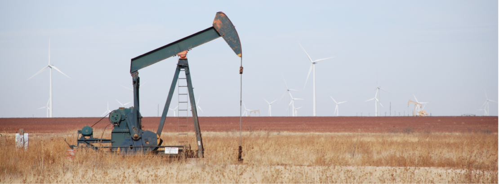
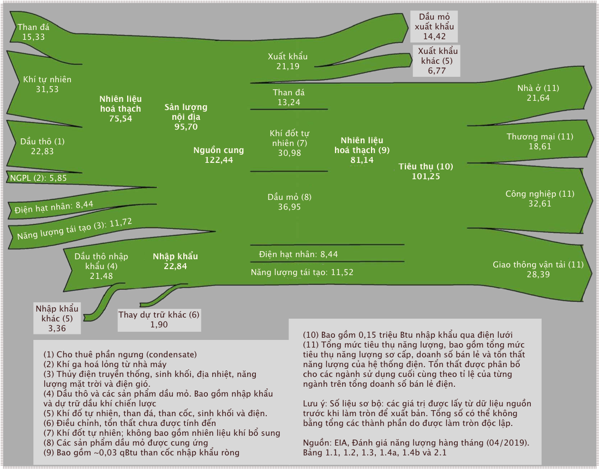

# Chương 7: Bối cảnh năng lượng (*Energy Landscape*)

!!! quote ""

    Một giếng bơm dầu nhìn cận cảnh, với nền là những tua-bin gió. Ảnh chụp bởi Tom Murphy.

Bây giờ chúng ta đã nắm được các đơn vị năng lượng và quá trình nhiệt thông thường, chúng ta có thể xem xét nhiều nguồn dữ liệu năng lượng khác nhau và khai thác thêm thông tin, giúp cho việc so sánh chéo được thuận lợi. Trong chương này, chúng ta sẽ tìm hiểu ý nghĩa của các phân tích dữ liệu và có được góc nhìn về vai trò các nguồn năng lượng khác nhau trong quá khứ và hiện tại ở cấp độ quốc gia và toàn cầu.

Hầu hết thông tin trong chương này đến từ Đánh giá năng lượng hàng năm của [Cơ quan Thông tin Năng lượng Hoa Kỳ (EIA)](https://www.eia.gov/totalenergy/data/annual/index.php), và từ việc tổng hợp dữ liệu toàn cầu của Vaclav Smil và đánh giá [Thống kê Năng lượng Thế giới](https://ourworldindata.org/energy) của British Petroleum (BP). Các nguồn trích dẫn đầu tiên thường là về năng lượng sử dụng ở Hoa Kì trong khi các nguồn tiếp theo là những con số toàn cầu.

## 1. Đánh giá năng lượng hàng năm ở Mĩ

Cho đến năm 2011, Đánh giá năng lượng hàng năm (AER) đã được biên soạn cho Hoa Kỳ dưới dạng báo cáo thường niên. Kể từ đó, một giao diện web cung cấp quyền truy cập vào nhiều báo cáo tương tự nhưng không nằm trong một tài liệu duy nhất. Có một khối lượng đồ sộ thông tin chi tiết có sẵn trong các ấn phẩm của AER. Nhưng chúng ta sẽ chỉ điểm qua sơ lược trong cuốn sách này để nhìn nhận một cách bao quát. Các chương sau đôi khi sẽ dựa vào thông tin có chiều sâu để cập nhật về việc sử dụng thủy điện, năng lượng mặt trời, điện gió, v.v. theo từng tiểu bang. Nhưng hiện tại, chúng ta chủ yếu tập trung vào Phần 1 của Đánh giá năng lượng hàng năm (AER), có tiêu đề Tổng quan về năng lượng.

### Dòng chảy năng lượng (*Energy Flow*)

Phần 1.0 của báo cáo AER là một hình vẽ thể hiện cái nhìn toàn cảnh các dòng năng lượng vào và ra khỏi Hoa Kỳ. **Hình 7.1** là phiên bản của báo cáo năm 2018.

> **Hình 7.1**: Phân bổ dòng chảy năng lượng ở Hoa Kì năm 2018, được trình bày trong AER. Thật không may, đơn vị là triệu triệu Btu (qBtu). Nguồn: EIA Hoa Kỳ.

Nhiên liệu đầu vào đến từ bên trái. Chi tiêu hoặc xuất khẩu ở bên phải. Cách biểu diễn này đảm bảo rằng tất cả đầu vào phải khớp với tất cả đầu ra[^1]. Chúng ta có cái nhìn toàn cảnh về những nguồn năng lượng nào chiếm chủ đạo với với những nguồn nhỏ hơn.

[^1]:

    Sao cho không có một nguồn năng lượng lớn nào được dự trữ hay lấy ra khỏi nguồn năng lượng dự trữ.

Để hiểu rõ hơn, hãy bắt đầu ở phần giữa. Ở bên trái chính giữa, chúng ta thấy tổng nguồn cung là 122,44 qBtu. Trong số này, chúng ta tiêu thụ 101,25 qBtu (bên phải từ chính giữa biểu đồ) và xuất khẩu 21,19 qBtu còn lại. Bây giờ chúng ta tập trung vào cột ở chính giữa để có cái nhìn trực quan nhanh chóng về phần trăm phân chia các nguồn năng lượng[^2]. Ở đây, 13% là than đá, 31% là khí đốt tự nhiên, 36,5% là dầu mỏ (dầu), 8% là năng lượng hạt nhân và 11,5% là năng lượng tái tạo[^3].

[^2]:

    Một cách ngẫu nhiên, tổng tiêu thụ năng lượng đạt gần mức 100 qBtu, vì thế mỗi nguồn năng lượng tính theo qBtu cũng gần bằng tỉ lệ phần trăm của chúng.

[^3]:

    Hãy nghĩ đến 3 dạng của nhiên liệu hoá thạch: rắn (than đá), lỏng (dầu mỏ) và khí (khí đốt tự nhiên, không giống như khí hoá lỏng, một sản phẩm của dầu mỏ).

Phía bên phải hình vẽ biểu diễn các lĩnh vực tiêu thụ năng lượng, cho thấy sự phân bổ gần như bằng nhau giữa khu dân cư (nhà ở), thương mại (doanh nghiệp), công nghiệp (sản xuất) và giao thông vận tải (cả cá nhân và thương mại/vận chuyển). Trong đồ họa này, chúng ta hoàn toàn không biết mỗi nguồn năng lượng đóng góp bao nhiêu vào mỗi lĩnh vực[^4] nhưng điều đó sẽ được trình bày trong phần tiếp theo.

Cuối cùng, phía bên trái biểu thị các yếu tố đầu vào, được nhóm thành nguồn cung cấp nhiên liệu hóa thạch trong nước ở trên cùng (ngoài lãnh thổ của Hoà Kì), năng lượng hạt nhân và năng lượng tái tạo ở giữa và nhập khẩu ở dưới cùng. Từ đó, chúng ta có thể rằng rằng, nước Mĩ xuất khẩu một ít than[^5], rằng gần như toàn bộ khí đốt tự nhiên và 100% năng lượng hạt nhân của nước này được sử dụng trong nước, và 62% dầu mỏ của đến từ sản xuất dầu thô trong nước.

[^4]:

    Ví dụ, chúng ta không thể biết bao nhiêu than đá đã được sử dụng trong ngành công nghiệp

[^5]:

    Ví dụ, nguồn cung 15,33 qBtu được khai thác lớn hơn 13,24 qBtu mà người Mĩ tiêu thụ

Những hiểu biết sâu sắc khác cũng có thể suy ra từ hình vẽ. Bạn đọc đừng ngại thực hiện tính toán thêm để khám ra nhiều điều mới.

!!! note "Hộp 7.1: 100 quads? Thì sao nào?"

    Để đánh giá được hết quy mô năng lượng, 100 qBtu trong một năm đối với Hoa Kỳ là khoảng 10^20^ J một năm. Một năm dài 3,156 × 10^7^ giây[^6], có nghĩa ngân sách năng lượng Hoa Kì chỉ hơn 3 TW (3 × 10ˆ12^ W) một chút. Phân phối cho hơn 300 triệu người, mức đóng góp trung bình của mỗi người là khoảng 10.000 W[^7]. Mức này rất cao. Như chúng ta đã thấy trong [Phần 5, Chương 5](5-energy-unit.md#5-calo-kcal), trao đổi chất của con người là khoảng 100 W. Vì vậy, người Mỹ sở hữu khoảng 100 lần năng lượng so với quá trình trao đổi chất của mỗi người. Tình trạng này được so sánh với việc mỗi người có 100 **người hầu năng lượng** (*energy servants*, hay *enegy slaves*)! Không có gì ngạc nhiên khi người Mĩ sống vương giả hơn cả hoàng gia thời xa xưa. Mặc dù Hoa Kỳ sử dụng khoảng 4,5 lần bình quân năng lượng đầu người trên toàn cầu (khoảng 20% năng lượng thế giới với 5% dân số[^8]), trung bình mỗi công dân trên Trái đất vẫn sẵn có hơn 20 người hầu năng lượng, hầu như hoàn toàn nhờ vào nhiên liệu hoá thạch. Chúng đã thay đổi hoàn toàn bộ mặt thế giới con người.

[^6]:

    Bằng thủ thuật toán học khác, có gần $\pi × 10^7$ giây trong một năm

[^7]:

    Điều này được thể hiện trong [Bảng 3.4, Chương 3](3-population.md#suy-ngam-ve-ia-li) và trong [Hộp 5.4, Chương 5](5-energy-unit#6-on-vi-nhiet-luong-anh-btu)

[^8]:

    Mức tiêu thụ năng lượng của người Mĩ cao hơn rất nhiêu so với mức trung bình của thế giới vì chủ nghĩa tiêu dùng, chế độ ăn, tiêu chuẩn cuộc sống, nhà cá nhân và giao thông vận tải.

### Nguồn năng lượng và các ngành

**Hình 7.2** cung cấp thông tin chi tiết hơn về cách năng lượng được sử dụng từ nguồn nào và phân bổ ra sao vào các ngành kinh tế[^9]. Nói cách khác, trong số 101,25 qBtu được tiêu thụ năm 2018, chúng ta còn biết được trong đó bao nhiêu năng lượng đến từ nguồn nào và mỗi nguồn sẽ được ngành nào tiêu thụ cuối cùng. Ví dụ, chúng ta biết rằng 91% than đá và 100% năng lượng hạt nhân được dùng vào phát điện, và 92% giao thông vận tải dựa vào dầu mỏ.

> **Hình 7.2:** Theo dõi các nguồn năng lượng và mục đích sử dụng cuối cùng ở Hoa Kỳ năm 2018, từ Phần 2 của báo cáo AER. Các số nhỏ bên cạnh các khối biểu thị tỷ lệ phần trăm. Các số không phải là tỷ lệ phần trăm có đơn vị là qBtu (quads). Nguồn: EIA Hoa Kỳ.

[^9]:

    Lưu ý rằng con số về nguồn năng lượng và ngành sử dụng khớp với **Hình 7.1**, với phép tính làm tròn.

Hãy chú ý khối màu đen và xám ở giữa phía dưới, tượng trưng ngành điện. Người Mĩ đã lấy điện từ tất cả các nguồn bên trái và tiêu thụ trong tất cả các ngành. Ngoài ra, trong số 38,3 qBtu được sử dụng để sản xuất điện, chỉ có 13,0 qBtu (34%) được sử dụng dưới dạng điện năng, do tổn nhất nhiệt động học đã đề cập trong [Chương 6](6-thermal.md)

Về nguyên tắc, người ta có thể đặt tỷ lệ phần trăm nơi các mũi tên vào và ra khỏi ngành sản xuất điện, nhưng chúng ta cũng có đủ số lượng để tính toán điều này, như **Ví dụ 7.1.1** bên dưới cho thấy. Nếu không có những con số này, câu chuyện sẽ có chút sai lệch. Ví dụ, chỉ có 17% khí tự nhiên được sử dụng *trực tiếp* cho nhà ở, nhưng một số khí tự nhiên cũng tạo ra điện, và sau đó cũng sẽ dẫn đến các khu dân cư. Do đó, không rõ ngay bao nhiêu phần trăm năng lượng dân cư tiêu thụ đến từ khí đốt tự nhiên, nhưng nó cao hơn mức 43% được chỉ ra trong hình.

Một đồ họa tương tự kết hợp một số yếu tố của cả **Hình 7.1** và **Hình 7.2** được cung cấp bởi [Phòng thí nghiệm Quốc gia Lawrence Livermore](https://flowcharts.llnl.gov/)[^10].

[^10]:

    Xem phiên bản động qua các năm [ở đây](https://us-sankey.rcc.uchicago.edu/)

!!! example "Ví dụ 7.1.1" 

    Chúng ta hãy xem xét các con số trong **Hình 7.2** để làm sáng tỏ có bao nhiêu phần trăm năng lượng dân cư tiêu thụ có nguồn gốc từ khí đốt tự nhiên. Kỹ thuật tương tự có thể được áp dụng để tính toán sự phân bổ nguồn năng lượng nguồn tới một ngành nào đó, bằng cách kết hợp sự đóng góp của điện năng.

    Chúng ta bắt đầu một cách đơn giản bằng cách lưu ý rằng 43% của 11,9 qBtu năng lượng dân dụng đến trực tiếp từ khí đốt tự nhiên. Vậy nó đó là 5,1 qBtu[^11].

    Hiện tại, 35% khí đốt tự nhiên được dùng để sản xuất điện, mà chúng ta có thể tính ra là 10,9 qBtu[^12].

    Vì vậy, trong tổng năng lượng 38,3 qBtu đi vào ngành sản xuất điện, 10,9 qBtu (28%) là từ khí đốt tự nhiên[^13].

    Giả sử hiệu suất sản xuất điện là 34%[^14], áp dụng cho tất cả các nguồn để sản xuất điện (tương đối gần với thực tế), chúng ta có thể nói rằng 28% lượng điện năng được sản xuất từ khí tự nhiên: 28% của 13,0 qBtu (điện sản xuất ra) là 3,7 qBtu.

    Nhưng không phải tất cả năng lượng điện này đều dùng cho dân cư. Nhà ở nhận được 42% trong số 11,9 qBtu từ điện, hay 5,0 qBtu. Chúng ta có thể giả định rằng 28% trong số 5 qBtu điện đi vào dân cư có nguồn gốc từ khí đốt tự nhiên, như đã cho thấy ở trên. Vậy đó là 1,4 qBtu điện có nguồn gốc từ khí tự nhiên được dùng cho khu vực dân cư, hay nhà ở.

    Chúng ta có thể thêm 1,4 qBtu điện có nguồn gốc từ khí đốt này vào 5,2 qBtu[^15] của khí đốt trực tiếp dùng cho nhà ở để biết rằng 6,6 qBtu dùng cho dân cư có nguồn gốc từ khí đốt tự  nhiên—trực tiếp hoặc qua điện năng. So với tổng 11,9 qBtu dành cho nhà ở, khí đốt tự nhiên đóng góp 55% năng lượng sử dụng trong nhà ở chứ không chỉ 43% như đã liệt kê. 

[^11]:

    Để kiểm tra lại, chúng ta lưu ý rằng ở đầu mũi tên xanh dương có 17% của 31,0 qBtu, hay 5,3 qBtu rời khỏi nguồn khí tự nhiên đến trực tiếp các hộ gia đình: gần bằng 5,1 qBtu mà chúng ta suy ra ở đây (thực ra hai con số là bằng nhau, bỏ qua lỗi làm tròn).

[^12]:

    35% của 31,0 qBtu

[^13]:

    Sẽ tốt hơn biết mấy nếu mũi tên xanh dương từ khí tự nhiên đến ngành điện được in thêm số 28(%) ở phía cuối.

[^14]:

    13,0 qBtu điện năng được sản xuất từ 38,3 qBtu năng lượng đầu vào

[^15]:

    ...tính trung bình từ hai con số ở trên, 5,1 qBtu và 5,3 qBtu.

!!! quote "Bảng 7.1"

    Mức tiêu thụ năng lượng của Hoa Kỳ năm 2018 tính theo nhiệt lượng tương đương qBtu. Nhắc bạn: 1 Btu ≈ 0,293 Wh, nên 1 qBtu hay 1 quad ≈ 293 TWh.

| **Nguồn**     | **qBtu** |
|:-------------:|:--------:|
| Dầu mỏ        | 36,88    |
| Khí tự nhiên  | 31,09    |
| Than đá       | 13,25    |
| Hạt nhân      | 8,44     |
| Sinh khối     | 4,98     |
| Thủy điện     | 2,77     |
| Điện gió      | 2,48     |
| Điện mặt trời | 0,92     |
| Địa nhiệt     | 0,21     |
| **Tổng cộng**    | **101,0**    |

### Chi tiết phân bổ năng lượng

Đi sâu hơn một chút vào báo cáo AER, phần này cung cấp thông tin chi tiết hơn về mức tiêu thụ, tách riêng các nguồn năng lượng trong danh mục “năng lượng tái tạo”, như trong **Bảng 7.1** và **Hình 7.3**.

Tóm lại, 80% năng lượng của Hoa Kỳ năm 2018 đến từ nhiên liệu hóa thạch. Ít hơn 2,5% đến từ điện gió và dưới 1% có nguồn gốc từ năng lượng mặt trời, 16% còn lại chủ yếu ở dạng năng lượng hạt nhân, sinh khối và thủy điện. 

Hầu hết các nguồn năng lượng tái tạo là từ sinh khối&mdash;giống như củi đốt. Tình hình trên thế giới cũng khá tương đồng, ở chỗ năng lượng hoá thạch chiếm khoảng 80%. Đây vẫn là nguồn năng lượng chính của nền văn minh. **Bảng 7.2** chia nhỏ các nguồn điện riêng biệt.

>**Hình 7.3**: Các nguồn năng lượng sử dụng ở Hoa Kì năm 2018 (**Hình 7.6** cho thấy sự phân bổ trên toàn cầu).

!!! note "Hộpe 7.2: Nhiệt năng tương đương""

    Lưu ý rằng Cơ quan thông tin năng lượng Hoa Kì EIA&mdash;và trong **Bảng 7.1**&mdash;thường áp dụng hệ số chuyển đổi ra nhiệt năng để tiện so sánh nguồn năng lượng này với nguồn năng lượng khác một cách có ý nghĩa. Năng lượng từ nhiên liệu hóa thạch được đặc trưng bởi hàm lượng nhiệt của nó, điều này có ý nghĩa khi chúng được đốt cháy để lấy năng lượng nhiệt. Thông thường&mdash;nhưng không lúc nào cũng vậy&mdash;nhiệt năng được chuyển thành điện năng lượng điện. Trong khi đó, một số nguồn như năng lượng mặt trời, thủy điện, gió, hạt nhân và địa nhiệt hầu như chỉ được sử dụng để sản xuất điện và dễ dàng đo lường bởi *sản lượng điện*, không phải bằng nhiệt năng đầu vào (vốn vô nghĩa đối với điện mặt trời, điện gió và thuỷ điện).

    Nhân sản lượng điện với khoảng hệ số 3 chúng ta sẽ có **nhiệt năng tương đương** (*thermal equivalent*)[^16]. Cách hiểu: cần bao nhiêu nhiên liệu hoá thạch (nhiệt năng) để đạt được kết quả tương tự? Do đó, khi **Bảng 7.1** nói rằng sự đóng góp của điện mặt trời là 0,92 qBtu, tương đương khoảng 1% so với tổng năng lượng, năng lượng điện mặt trời *thực tế* nhỏ hơn 1/3 so với con số này. Qui tất cả năng lượng ra qBtu cho phép chúng ta có thể so sánh các nguồn năng lượng khác nhau, như nhiên liệu hoá thạch và điện mặt trời. Báo cáo về sản lượng điện cùng với nhiệt năng đầu vào sẽ làm cho các nguồn năng lượng tái tạo có đóng góp trông có vẻ nhỏ hơn thực tế, so với nhiên liệu hoá thạch.

[^16]:

    Hệ số trên thực tế chỉ là nghịch đảo của hiệu suất chuyển đổi (34%) điện được thảo luận ở trên, dẫn đến kết quả 1/0,34. Hiệu suất chuyển đổi được EIA áp dụng đã tăng dần theo thời gian và được theo dõi trong Phụ lục A6 của báo cáo AER&mdash;hiện ở mức 37,5%, dẫn đến hệ số chuyển đổi là 2,67.

| **Vùng ↓**   | **Than đá** | **Khí đốt** | **Dầu mỏ** | **Hạt nhân** | **Thủy điện** | **Điện gió** | **Mặt trời** | **Sinh khối** | **Địa nhiệt** |
|:------------:|:-----------:|:-----------:|:----------:|:------------:|:-------------:|:------------:|:---------------:|:-------------:|:-------------:|
| **Hoa Kì**   | 27,3        | 34,9        | 0,6        | 19,2         | 7,0           | 6,5          | 2,3             | 1,5           | 0,4           |
| **Thế giới** | 38,0        | 23,0        | 2,9        | 10,1         | 16,2          | 4,8          | 2,1             | 2,4           | 0.5           |

>**Bảng 7.2:** Phần trăm điện được sản xuất từ các nguồn khác nhau ở Hoa Kì và trên thế giới năm 2018. **Sinh khối** (*biomass*) bao gồm củi đốt và chất thải. Dữ liệu từ **Bảng 7.2a** của báo cáo  [AER](https://www.eia.gov/totalenergy/data/annual/index.php) và [IEA](https://www.iea.org/reports/electricity-information-overview)

>**Hình 7.4:** Lịch sử tiêu thụ năng lượng sơ cấp gần đây ở Hoa Kỳ. Ba loại nhiên liệu hóa thạch và hạt nhân được trình bày riêng biệt, và tất cả nguồn năng lượng tái tạo được nhóm lại với nhau. Lưu ý rằng ở phần cuối của ô, tiêu thụ than đã đã giảm đến mức gần bằng với tiêu các nguồn nhiên liệu tái tạo. Hình thứ hai hiển thị phần trăm của tổng năng lượng. Hầu hết các đồ thị đều khá bằng phẳng, mặc dù trong những năm gần đây câu chuyện chính vẫn việc khí đốt thay thế than đá.

### Xu hướng năng lượng

Chúng ta cần xem xét các xu hướng để hiểu tình trạng hiện tại, cũng như những gì đã xảy ra trong nhiều thập kỷ qua và những xu hướng khả thi trong tương lai gần. Phần 1.3 của báo cáo AER bao gồm dữ liệu từ những năm 1950 ở các hạng mục trong **Bảng 7.1**.

**Hình 7.4** cho thấy xu hướng sử dụng nhiên liệu hóa thạch trong 70 năm qua, với sự gia tăng chậm chạp của các nguồn phi hóa thạch chiếm ưu thế. Gần đây, trên thế giới đã rộ lên tin tức các nguồn nhiên liệu tái tạo[^17] trên thực tế đã vượt qua than đá trong việc cung cấp năng lượng cho Hoa Kì. Thật vậy, về cơ bản các đồ thì của hai đường này đã gặp nhau ở phía bên tay phải của hình vẽ; và xu hướng gợi ý rằng điều này sẽ còn tiếp tục, tỉ lệ sử dụng than đá sẽ dần ít hơn nhiên liệu tái tạo ở Hoa Kì.  Tuy nhiên, lưu ý rằng kết quả này phần lớn là do khí tự nhiên đang thay thế than tại các nhà máy nhiệt điện. Sự gia tăng mạnh mẽ của khí đốt tự nhiên gần như phản ánh sự sụt giảm của than đá trong khi sự gia tăng nguồn tài nguyên tái tạo lại khiêm tốn hơn. Vì vậy, đây thực sự là câu chuyện trao đổi khí đốt lấy than hơn là năng lượng tái tạo thay thế than. **Hình 7.4** cũng cho thấy tỉ lệ phần trăm mỗi nguồn năng lượng so với tổng năng lượng. Trong một vài thập kỷ (1980–2010), than và khí đốt về cơ bản gắn liền với nhau, trong khi tiêu thụ dầu gần như gấp đôi hai loại này. Gần đây,
khí đốt đang tiến gần đến dầu trong khi tiêu thụ than giảm mạnh.

[^17]:

    "Nhiên liệu tái tạo" sẽ được định nghĩa đầy đủ trong **Chương 10**

> **Hình 7.5:** Lịch sử tiêu thụ năng lượng phi hóa thạch gần đây ở Hoa Kỳ: Hạt nhân, thủy điện và sinh khối chiếm ưu thế, trong khi điện gió và điện mặt trời đang tăng mạnh. Dấu hoa thị biểu thị nhiệt năng tương đương, như được mô tả trong **Hộp 7.2**. Dữ liệu tương tự được vẽ ở bên phải dưới dạng phần trăm của tổng năng lượng. Bên cạnh sự gia tăng nhanh chóng của năng lượng hạt nhân trong những năm ở giữa hình vẽ, sự gia nhập gần đây của gió và mặt trời (dù chỉ chiếm một vài phần trăm) là những phát triển thú vị nhất.

Mức tiêu thụ phi hóa thạch trong **Hình 7.5** làm rõ sự phân chia đường cong “năng lượng tái tạo” trong **Hình 7.4**, cùng với điện hạt nhân. Từ đó, chúng ta thấy rằng năng lượng hạt nhân thống trị  năng lượng phi hóa thạch, tăng nhanh từ năm 1970 đến năm 2000 và giữ ổn định kể từ đó. Thủy điện khá ổn định trong 50 năm qua khi các nguồn khác vượt qua và hạ thấp thứ hạng của nó. Sự gia tăng nhiên liệu sinh học vào khoảng năm 1980 dường như chủ yếu là do việc đốt gỗ tăng lên, trong khi sự gia tăng tiếp theo (2000–2010) là do nhiên liệu sinh học&mdash;chủ yếu là xăng ethanol. Điện gió đang đạt mức đóng góp 3% vào tổng ngân sách tiêu dùng ~100 qBtu của Hoa Kì, tăng khoảng 0,2% mỗi năm. Điện mặt trời cũng đang trên đà phát triển, đạt mức 1% gần đây và tăng chậm hơn điện gió. Địa nhiệt đang và sẽ tiếp tục đóng góp rất ít trong sản lượng năng lượng chung.

## 2. Năng lượng toàn cầu

Không có gì ngạc nhiên khi câu chuyện toàn cầu không khác biệt nhiều so với tình hình ở Hoa Kì, như **Hình 7.6** và **Hình 7.7** cho thấy. Nhiên liệu hóa thạch vẫn chiếm ưu thế, đứng đầu là dầu mỏ. Sử dụng than đá chiếm ưu thế so với khí đốt tự nhiên trên toàn thế giới, không giống như ở Hoa Kỳ. Ngoài ra, trong khi năng lượng hạt nhân gần tương đương năng lượng tái tạo ở Hoa Kì, điều này không đúng trên toàn cầu, lí do sẽ được giải thích ngắn gọn bên dưới. Lưu ý rằng các đánh giá khác nhau về năng lượng toàn cầu có thể đưa ra tỷ lệ phần trăm đóng góp khác nhau tùy thuộc vào việc có sử dụng nhiệt lượng tương đương hay không (xem **Hộp 7.2**).

>**Hình 7.6**: Các nguồn năng lượng sử dụng trên toàn thế giới (**Hình 7.3** cho thấy sự phân bổ năng lượng ở Hoa Kì).

> **Hình 7.7:** Lịch sử tiêu thụ năng lượng sơ cấp trên thế giới gần đây. Ba loại nhiên liệu hóa thạch và hạt nhân được trình bày riêng biệt, trong khi các nguồn tái tạo được nhóm lại với nhau. Biểu đồ bên phải hiển thị dữ liệu tương tự dưới dạng phần trăm của tổng năng lượng.

Đối với những đóng góp của nguồn nhiên liệu phi hóa thạch, **Hình 7.8** cho thấy sự phát triển của những thập kỷ gần đây. Ở đây, chúng ta thấy rằng phần lớn lý do khiến năng lượng tái tạo vượt năng lượng hạt nhân trên toàn cầu là do sinh khối. Điều này nghĩa là vì các quốc gia có mức sống thấp hơn
thường hay đốt củi và ít có khả năng phát triển điện hạt nhân.

> **Hình 7.8:** Lịch sử tiêu thụ năng lượng phi hóa thạch toàn cầu gần đây. Dấu hoa thị biểu thị nhiệt lượng tương đương, như được mô tả trong **Hộp 7.2**. Biểu đồ bên phải hiển thị các nguồn năng lượng dưới dạng phần trăm của tổng năng lượng. Sinh khối chiếm 1/4 năng lượng toàn cầu vào năm 1950.

!!! note "Hộp 7.3: TWh và qBtu"

    Bạn có thể nhận thấy rằng ngay khi chúng ta không dùng dữ liệu của AER để biểu thị năng lượng bằng qBtu, đơn vị trên đồ thị (**Hình 7.7**) đã thay đổi thành terawatt-giờ (TWh). Nó có nghĩa như sau: tera là 10^12^, vậy đây là 10^12^ watt-giờ (Wh). Chúng ta sử dụng kWh thường xuyên hơn Wh, vậy TWh tương đương với giga-kWh hoặc GkWh (bạn có thể chuyển đổi đơn vị thế này không?) Một kWh là 3,6 × 10^6^ J, vậy 1 TWh là 3,6 × 10^15^ J. Trong khi đó, 1 qBtu là 1,055 × 10^18^ J, tạo điều kiện thuận lợi cho việc chuyển đổi. Các số liệu về công suất năng lượng toàn cầu cũng đặt qBtu ở bên phải để dễ so sánh giữa các đồ thị.

    Nguồn số liệu cho phần này[^18] kết hợp sản lượng nhiệt năng và điện năng, do đó các đồ thị đã nhân một số mục (dấu hoa thị trong chú thích từng biểu đồ) với 3,06 vì các lý do được mô tả trong **Hộp 7.2**.

[^18]:

    Smil (2017), Chuyển tiếp năng lượng: Quan điểm toàn cầu và quốc gia (*Energy Transitions: Global and National Perspectives*)

### Tỷ trọng năng lượng Hoa Kì so với toàn cầu

Phần tổng quan cuối cùng giúp định hình một số cuộc thảo luận trong cuốn sách này xem xét tỷ lệ tiêu thụ các nguồn năng lượng khác nhau của Hoa Kỳ so với tổng lượng tiêu thụ toàn cầu. Sự diễn tiến của đường đồ thị quan sát được ở phía bên trái của **Hình 7.9** cho thấy một cái nhìn sâu sắc quan trọng về địa chính trị. Năm 1950, Mỹ sử dụng tới 84% lượng khí đốt tự nhiên và 72% dầu mỏ trên toàn cầu. Với chỉ 6% dân số thế giới vào thời điểm đó, người Mỹ đã sử dụng hơn 10 lần lượng dầu mỏ và khí đốt trung bình toàn cầu và nhiều hơn đáng kể so với phần còn lại của thế giới cộng lại. Vì năng lượng tiêu thụ hàng năm là định nghĩa của quyền lực, nên chúng ta có thể hiểu Hoa Kỳ đã trở thành một siêu cường theo đúng nghĩa đen như thế nào. Nhại theo thông điệp tranh cử của Bill Clinton: “Đồ ngốc, tài nguyên đó”[^19].

[^19]:

    Câu gốc: "Đồ ngốc, nền kinh tế đó" (*It's the economy, stupid*)

!!! success ""

    Đây có thể là một yếu tố khiến người ta hoài niệm về những gì mà một số người Mỹ coi là “những ngày vinh quang” của những năm 1950. Trong phạm vi tiêu thụ năng lượng của Hoa Kỳ có thể đóng một vai trò nào đó trên toàn cầu, mong muốn quay trở lại thời kỳ những năm 1950 khó trở thành hiện thực.

> **Hình 7.9:** Hình bên trái kết hợp **Hình 7.4** và **Hình 7.7** để biểu thị tỷ lệ tài nguyên năng lượng được Mỹ tiêu thụ theo thời gian. Bức tranh tổng thể cho thấy một thế giới đang bắt kịp một quốc gia đã sớm đi đầu. Mỹ là một “siêu cường” theo đúng nghĩa đen vào giữa thế kỷ XX. Đường nét đứt ở phía dưới biểu thị tỷ lệ dân số Hoa Kỳ trên thế giới. Điều đó có nghĩa rằng việc sử dụng năng lượng trên đường này cho thấy tỷ trọng lớn hơn mức trung bình của thế giới, mà điều này đúng với tất cả các nguồn năng lượng ở Hoa Kì. Biểu đồ bên phải kết hợp **Hình 7.5** và **Hình 7.8** để biểu thị tỷ lệ tài nguyên năng lượng tái tạo và năng lượng hạt nhân được Hoa Kỳ tiêu thụ theo thời gian. Năng lượng mặt trời và điện gió là đặc trưng của một quốc gia nổi tiếng với sự đổi mới: chúng xuất hiện đầu tiên ở Hoa Kì.

Đường màu xanh đậm hơn ở phần bên trái của **Hình 7.9** biểu thị tất cả các nguồn năng lượng kết hợp lại. Vào những năm 1950, người Mỹ sử dụng 1/3 tổng năng lượng toàn cầu, tương ứng với gần 8[^20] lần năng lượng trung bình của mỗi người không phải là người Mỹ. Ngày nay, tỷ lệ này gần hơn với 4 lần.

[^20]:

    Theo tính toán: 35% năng lượng sử dụng trên 6% dân số ở Hoà Kì so với 65% năng lượng sử dụng trên 94% dân số: (35/6)/(65/94) ≈ 8,4.

Phía bên phải của **Hình 7.9** cũng thể hiện tương tự tỷ trọng năng lượng tái tạo của Hoa Kỳ. Nguồn tài nguyên có xu hướng tăng duy nhất là sinh khối, do yêu cầu sử dụng ethanol[^21]. Nhưng nó chỉ đóng vai trò thứ yếu trong tổng sản lượng chung. Năng lượng mặt trời và điện gió rất thú vị, ở chỗ Hoa Kỳ ban đầu nắm giữ thị phần lớn trên toàn cầu với tư cách là nước tiên phong về công nghệ này trước khi phần còn lại của thế giới tham gia.

[^21]:

    Thông tin thêm về năng lượng sinh học trong **Chường 14**

## 3. Kết luận

Mục đích của chương này gồm hai phần: thứ nhất là giới thiệu cho bạn đọc những nguồn thông tin đáng tin cậy về sản xuất năng lượng quốc gia ở Hoa Kì và toàn cầu; thứ hai là truyền đạt bối cảnh sử dụng năng lượng. Những gì hiện ra là bức tranh về một thế giới vẫn nằm trong sự kiểm soát của nhiên liệu hóa thạch với mức sử dụng hàng năm tiếp tục tăng. Điện gió và điện mặt trời đang dần có thị phần nhưng cho đến nay chỉ ở mức vài phần trăm. Hoa Kỳ đã đóng một vai trò to lớn trong việc tiêu thụ năng lượng toàn cầu so với dân số của nước này, đặc biệt là vào giữa thế kỷ 20.

    
    
    

