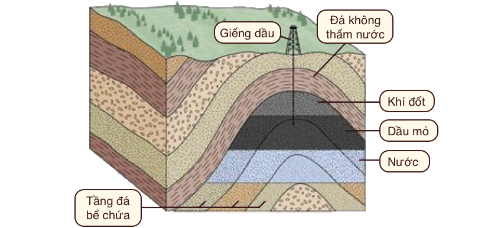

# Chương 8: Nhiên liệu hoá thạch (*fossil fuel*) (Phần I)

!!! quote ""

    Các đường ống dẫn dầu và khí đốt trên vùng lãnh nguyên Alaska tại Vịnh Prudhoe. Một giàn khoan mờ dần trong sương phía xa ở giữa bức ảnh. Hãy lưu ý ảo ảnh quang học làm cho đường viền dưới cùng của ảnh trông như bị cong! Nguồn ảnh: Tom Murphy.

Bây giờ chúng ta đã sẵn sàng đi sâu vào nội dung cốt lõi của cuốn sách: đánh giá nhu cầu và triển vọng năng lượng toàn cầu. Trong phần lớn lịch sử loài người, chúng ta lấy năng lượng từ sức mạnh cơ bắp của con người (có được nhờ việc tiêu hoá thực phẩm) và sức động vật, củi đốt cộng thêm việc khai thác dòng chảy nước và gió (tất cả đều bắt nguồn từ năng lượng mặt trời). Sau đó, điều đáng chú ý nhất đã xảy ra: việc phát hiện và sử dụng rộng rãi nhiên liệu hóa thạch. Nguồn năng lượng dồi dào do nhiên liệu hóa thạch cung cấp đã làm thay đổi sâu sắc tình trạng của con người, đến mức nhiều sản phẩm trong thế giới hiện đại trông giống như phép thuật đối với những người sống cách đây 200 hoặc thậm chí 100 năm.

Nhiên liệu hóa thạch vẫn hoàn toàn chi phối việc sử dụng năng lượng của con người. Mọi quốc gia đều phụ thuộc vào một lượng nhiên liệu hóa thạch nhất định, đặc biệt là cho ngành giao thông vận tải. Mặc dù nhiên liệu hóa thạch không thể là tương lai&mdash;do sự cạn kiệt tài nguyên hữu hạn này và những lo ngại về biến đổi khí hậu&mdash;điều quan trọng là chúng ta phải xem xét lại những trụ cột này của cuộc sống hiện đại, đánh giá điều gì khiến chúng vừa tuyệt vời vừa khủng khiếp, cũng như những gì chúng ta có thể mong đợi trong tương lai. Việc đối mặt với thực tế khắc nghiệt và chưa được đánh giá đúng mức về nhiên liệu hóa thạch sẽ gia tăng ham muốn của chúng ta trong việc tìm hiểu thêm về những gì có thể xảy ra sau này, như sẽ đề cập ở các chương tiếp theo.

## 1. Hình vẽ quan trọng nhất mọi thời đại

Cho đến giờ, chúng ta đã đạt được một số góc nhìn toàn cảnh về nỗ lực của con người. Đầu tiên, chúng ta minh họa sự vô lý của việc tăng trưởng liên tục cả về mặt vật chất và kinh tế, kết luận rằng tăng trưởng phải được giới hạn trong một giai đoạn tạm thời và về mặt vật lí không thể tiếp tục mãi mãi. Tiếp theo, chúng ta đã xem xét thực tế dân số để hiểu câu chuyện đó có thể tiến triển ra sao. Sau đó, chúng ta nhìn vào quy mô của vũ trụ, để xem Trái đất nhỏ bé như thế nào trong khoảng không bao la và khám phá những khó khăn cực độ của quá trình thuộc địa hóa hành tinh khác&mdash;mà đặt trọng tâm vào việc quản lý những thách thức của chúng ta ngay trên Trái đất.

Để xác định tầm quan trọng của nhiên liệu hóa thạch đã và đang chi phối cuộc sống con người, chúng ta đã một lần nữa cần nhìn bao quát để quan sát đồ thị sử dụng năng lượng trước khi đi vào chi tiết về nhiên liệu hóa thạch. Đồ thị này có khả năng điều chỉnh lại quan điểm cá nhân về tương lai của con người.

Kết quả đạt được sẽ có tác động lớn hơn nếu bạn là người tham gia tích cực vào việc tạo ra tương lai đó. Vì vậy, hãy lấy một ít giấy, mặt sau của một phong bì hoặc một thứ gì đó. Vẽ một đường ngang làm trục thời gian. Đánh dấu cạnh trái là –10.000 năm (quá khứ), cạnh phải là +10.000 năm (tương lai). Ở giữa là 0 (thời điểm hiện tại, xem ví dụ bên dưới). Trục tung thể hiện sản lượng năng lượng toàn cầu, trên thang tuyến tính. Trong phần lớn thời gian đầu, đường năng lượng (màu đỏ) này quá nhỏ để có thể quan sát được. Chỉ khoảng 200 năm trước đường này mới được nhìn thấy rõ. Vì vậy, trong 98% chặng đường đầu tiên từ năm -10.000 đến năm 0 (hiện tại), hãy vẽ một đường ôm sát trục thời gian. Trong 200 năm qua, việc sử dụng năng lượng đã tăng theo cấp số nhân[^1]. Do đó, hãy vẽ một đường cong liền mạch nối tiếp đường trước đó với một đoạn dốc, sử dụng phần lớn hoặc toàn bộ không gian thẳng đứng có sẵn.

!!! example "Hình vẽ minh họa việc sử dụng nhiên liệu hoá thạch"

    
    

Đồ thị chúng ta thấy giống như đầu của “gậy khúc côn cầu”, một đường cong cổ điển áp dụng cho nhiều thuộc tính vật lý của thế giới chúng ta (tăng trưởng theo cấp số nhân): dân số, nồng độ khí carbonic, nhiệt độ và&mdash;trong trường hợp này&mdash;việc sử dụng năng lượng. Trong phần lớn nửa bên trái của đồ thị, năng lượng chúng ta sử dụng đến từ củi và cơ bắp (bao gồm cả sức lao động của động vật và con người). Nhưng sự gia tăng mang tính biến đổi đột ngột này thực sự là câu chuyện về nhiên liệu hóa thạch. Thậm chí ngày nay, khi bổ sung thêm năng lượng thủy điện, hạt nhân, năng lượng mặt trời, gió, địa nhiệt và thủy triều vào hỗn hợp, nhiên liệu hóa thạch vẫn chiếm hơn 80% tổng năng lượng tiêu thụ[^2].

[^1]:

    một đường bằng phẳng bỗng chốc cong vút lên khỏi bề mặt theo một quỹ đạo gần như thẳng đứng trong gian đoạn gần đây.

[^2]:

    Điều này thậm chí còn tệ hơn những gì bạn tưởng, vì 10% khác vẫn ở dạng sinh khối, phần lớn là củi và công nghệ cũ, chỉ còn lại 10% ở dạng hiện đại hơn như thủy điện, điện hạt nhân, điện mặt trời, điện gió, địa nhiệt và thủy triều.

Từ đây, chúng ta hãy tiếp tục đồ thị trong bối cảnh có nhiên liệu hóa thạch. Là một nguồn tài nguyên hữu hạn, nói chung chúng ta biết đường cong đồ thị (tiêu thụ năng lượng từ tài nguyên này) sẽ *phải* trông như thế nào. Nó phải tiến dần xuống mức 0 trong tương lai (khi đã khai thác gần hết), cũng như nó đã từng bắt đầu ở mức 0 trong quá khứ (khi bắt đầu khai thác). Người ta có thể tranh luận về thời gian chính xác đạt khi việc sử dụng nhiên liệu hóa thạch đạt tới đỉnh điểm, nhưng vì nhiều lý do khác nhau, chúng ta có lý khi cho rằng nó có thể xảy ra trong thế kỷ này. Tùy theo quan điểm cá nhân, đường năng lượng có thể được đi lên một chút trước khi rẽ xuống, nhưng chắc không đi lên quá cao. Thế kỷ này chỉ bằng trong 1% giai đoạn từ 0 đến +10.000 năm, vì vậy đừng để đỉnh tiêu thụ năng lượng đi quá xa khỏi chính giữa hình vẽ. Một khi đã đi xuống, đồ thị này trông đối xứng một cách hợp lí, trở về 0 trong thời gian ngắn và giữ nguyên tại đó.

Không phụ thuộc vào sự lựa chọn của từng cá nhân, nhìn chung chúng ta sẽ vẽ ra một hình tương tự (như **Hình 8.1**): việc sử dụng năng lượng với phần lớn là nhiên liệu hóa thạch chỉ vụt lên trong một khoảng thời gian rất ngắn trong lịch sử. Chúng ta đang sống trong một thời kỳ bất thường nhất của nhân loại[^3]. Do sự tiêu thụ năng lượng tăng lên chóng mặt đã kéo dài qua nhiều thế hệ nên điều đó dường như hoàn toàn bình thường đối với hầu hết mọi người, đến mức đây là thực tế duy nhất mà chúng ta hay bất kỳ người nào khác biết. Thiếu một cái nhìn toàn diện, một đứa trẻ sẽ coi hoàn cảnh sống của mình là bình thường, bất kể nghèo khó hay đặc quyền đến đâu: đó là thế giới duy nhất chúng từng biết hoặc nhìn thấy. Tương tự như vậy, chúng ta chấp nhận và xác định thế giới hiện tại của mình là bình thường&mdash;ngay cả khi quan điểm lịch sử rốt cuộc coi một hoặc hai thế kỷ vừa qua là khoảng thời gian cực kỳ khác thường trong trải nghiệm của con người&mdash;giống như một buổi trình diễn pháo hoa chóng vánh.

[^3]:

    Các nhà khoa học xã hội được đào tạo để không gắn mác thời đại của họ là bất thường, vì lối suy nghĩ như vậy có thể phản ánh một thành kiến cẩu thả mà tất cả mọi người trong suốt lịch sử có thể bị cám dỗ và chấp nhận nó. Tuy nhiên, chúng ta cũng không nên tuyên bố rằng những thời kỳ bất thường như thế không bao giờ có thể xảy ra. Bất kỳ đánh giá định lượng nào về quy mô con người hiện tại và tác động đến tài nguyên trên hành tinh đều cho rằng chúng ta có lý khi cho phép có ngoại lệ khi nói về thời đại hiện tại.

> **Hình 8.1:** Năng lượng qua các thời đại, dưới dạng nhiên liệu hóa thạch. Cho đến nay, nhiên liệu hóa thạch chiếm phần lớn câu chuyện về năng lượng của con người. Chúng ta biết rằng nó sẽ phải như thế nào trong dài hạn. Câu hỏi lớn là nửa sau của lịch sử loài người sẽ như thế nào sau khi nhiên liệu hóa thạch cạn kiệt hoặc bị bỏ mặc. Ngôi sao màu vàng là sự phỏng đoán về vị trí hiện tại của chúng ta, dựa trên bằng chứng được đề cập ở phần sau của chương cho thấy rằng tài nguyên đã cạn kiệt gần một nửa.

**Hình 8.1** sẽ kích thích một loạt câu hỏi. Chúng ta đang ở đâu trên đường cong? Đỉnh điểm là khi nào? Giai đoạn suy thoái được đánh dấu bằng sự khan hiếm năng lượng ngày càng leo thang hay sự ra đời của một tương lai năng lượng tái tạo? Liệu tương lai xa có giống quá khứ (sử dụng cơ bắp và củi đốt) hơn hiện tại? Liệu câu chuyện này có thay đổi cách chúng ta giải thích thế giới và kế hoạch của chúng ta cho tương lai không? Kết luận công bằng duy nhất là chúng ta thực sự không biết tương lai sẽ diễn ra như thế nào[^4]. Chúng ta có thể đặt tên cho phần phía bên trái hình vẽ là giai đoạn “củi và cơ bắp”, và phần tăng vọt là nhiên liệu hóa thạch, nhưng phần bên phải thích hợp nhất phải là một dấu hỏi khổng lồ.

[^4]:

    Tuy nhiên, chúng ta có thể loại trừ một số điều, chẳng hạn như sự tăng trưởng không ngừng và nhiên liệu hóa thạch có thể tồn tại thêm nhiều thế kỷ nữa.

Ý tưởng về **Hình 8.1** không phải là nguyên gốc của cuốn sách này mà đã được miêu tả dưới nhiều hình thức khác nhau trong khoảng nửa thế kỷ qua[^5]. Khi bất cứ ai đưa ra tuyên bố về những gì họ nghĩ sẽ xảy ra vào cuối thế kỷ 21, hãy nghĩ về câu chuyện này. Rất nhiều giả định của chúng ta đều dựa trên quá khứ gần đây vốn rất bất thường. Tất cả dự đoán về tương lai có thể đều không chính xác. Theo một nghĩa nào đó, những người chỉ ra một cách đúng đắn rằng chúng ta không thể mong đợi mình đủ thông minh để thấy trước tương lai đã đúng&mdash;nhưng có lẽ theo một cách đối xứng không chủ ý [với quá khứ]. Tương lai có thể còn ảm đạm hơn chiều so với những giấc mơ hiện tại của chúng ta. Đó cũng sẽ là một điều ngạc nhiên đối với nhiều người. Chúng ta cần tiếp cận tương lai với sự khiêm tốn và gạt bỏ những quan niệm định sẵn về hướng đi của mọi thứ để chúng ta có thể đưa ra những lựa chọn ngay bây giờ nhằm giúp xác định điều gì sẽ xảy ra tiếp theo. Coi đó là điều hiển nhiên là một bước đi mạo hiểm[^5]. Chỉ bằng cách thừa nhận khả năng dẫn đến một kết quả tai hại, con người mới có thể thực hiện các bước để giảm thiểu khả năng đó. Bỏ qua khả năng này là hành động nguy hiểm nhất mà chúng ta có thể làm. 

[^5]:

    Hubbert (1962), “Tài nguyên năng lượng: báo cáo gửi Uỷ ban về thiên nhiên của Học viện Khoa học Quốc gia; Hội đồng nghiên cứu quốc gia”

[^6]:

    Theo nghĩa này, việc chấp nhận rủi ro một cách nghiêm túc phù hợp với định nghĩa của từ “bảo thủ” (*conservative*), ngay cả khi những đảng phái chính trị hiện tại bị gán mác sai.

!!! note "Hộp 8.1: Năng lượng tái tạo có cứu được chúng ta không"

    Chỉ vì năng lượng từ nhiên liệu hóa thạch phải quay trở lại mức tiền công nghiệp trong **Hình 8.1** không có nghĩa là xã hội loài người phải quay trở lại mức năng lượng tiền công nghiệp. Rốt cuộc, ba thành phần năng lượng mặt trời, gió, hạt nhân, thủy điện hiện đã có sẵn cho chúng ta. Tuy nhiên, chúng ta sẽ phải chật vật để đạt được mức năng lượng tiêu thụ ngày nay chỉ dựa trên những nguồn tài nguyên này. Đáng lo ngại hơn là quan điểm cho rằng chúng ta không thể duy trì các phương pháp tiếp cận công nghệ cao trong một thế giới không có nhiên liệu hóa thạch. Chưa có ai chứng minh việc này sẽ được thực hiện như thế nào.Ngoài ra, sự gián đoạn do mất đi một nguồn tài nguyên quan trọng như vậy mà không có sự chuẩn bị kỹ càng đầy đủ có thể làm tổn hại đến nguồn lực chung của con người. Câu trả lời ngắn gọn cho câu hỏi trên: đơn giản là chúng ta không biết. Dấu hỏi trong **Hình 8.1** là phát biểu công bằng nhất mà chúng ta có thể đưa ra.

Lưu ý rằng **Hình 8.1** không nhằm mục đích dự đoán một con đường cụ thể nào trong tương lai. Nhưng nó có thể dùng để đối trọng với sự lạc quan phổ biến về một tương lai tuyệt vời công nghệ cao bằng cách cung cấp một bài kiểm tra sự tỉnh táo để chúng ta có thể thừa nhận rằng mình ta thực sự không biết điều gì sẽ xảy ra. Làm sao có thể sai khi nói rằng chúng ta không biết tương lai sẽ ra sao? Tuy nhiên, đi kèm với sự không chắc chắn này là một tia hy vọng: nếu tương lai quá bất định và không có kế hoạch, thì có lẽ chúng ta có khả năng viết ra kịch bản và đặt mình vào một hướng đi khả thi và dễ chịu hơn. Nếu chọn cách này, điều quan trọng nhất là chúng ta không được phép bỏ qua những hạn chế do tự nhiên áp đặt trên suốt hành trình này.

## 2. Than đá, dầu mỏ & khí đốt

Nhiên liệu hóa thạch được tìm thấy ở ba dạng chính: **than đá** (*coal*), **dầu (dầu mỏ)** (*petrolium*) và **khí đốt tự nhiên** (*natural gas*)[^7]. Chúng thực chất là một dạng năng lượng mặt trời cổ xưa mà thực vật từng thu giữ và lưu trữ dưới dạng năng lượng hóa học để cất trữ dưới lòng đất trong nhiều triệu năm[^8]. Việc sử dụng nhiên liệu hóa thạch ở mức độ thấp và lẻ tẻ đã có từ hàng thiên niên kỷ trước, nhưng việc sử dụng hiện đại đã bắt đầu một cách nghiêm túc vào thế kỷ 18 với than đá ở Anh. **Hình 8.2** cho thấy rõ rằng việc sử dụng than chưa thực sự thu được lợi ích cho đến giữa thế kỷ 19, khi quá trình công nghiệp hóa bắt đầu. Người ta có thể nghi ngờ rằng phần lớn sự gia tăng sử dụng nhiên liệu hóa thạch chỉ đơn giản là sự phản ánh sự gia tăng dân số, nhưng
điều này hóa ra lại sai. Phía bên phải của **Hình 8.2** chia lượng sử dụng nhiên liệu hóa thạch theo dân số toàn cầu để cho thấy rằng mức sử dụng năng lượng bình quân đầu người cũng tăng mạnh trong khoảng thời gian này, do đó hiện tượng hàm mũ ở phần bên trái là sự kết hợp của việc gia tăng dân số và mức sử dụng năng lượng nhiều hơn trên đầu người. Ngày nay, tốc độ sử dụng năng lượng nhiên liệu hóa thạch trung bình toàn cầu là hơn 2.000 W trên đầu người một chút[^9]. Từ **Hình 8.2**, chúng ta có thể nói rằng than đá thực sự phát triển mạnh mẽ bắt đầu từ khoảng năm 1850, khai thác dầu mỏ bắt đầu leo thang vào khoảng năm 1915, và với khí tự nhiên là vào khoảng năm 1970. 

[^7]:

    Hãy nghĩ đến ba dạng nhiên liệu hoá thạch: dạng rắn (than đá), lỏng (dầu mỏ) và khí (khí tự nhiên)

[^8]:

    Theo nghĩa này thì từ “hoá thạch” rất thích hợp: tàn tích cổ xưa của sự sống bị chôn vùi dưới lòng đất.

[^9]:

    15 TW nhiên liệu hóa thạch được sử dụng chia cho gần 8 tỷ người là khoảng 2.000 W mỗi người.

[^10]:

    Tất cả các nguồn này lần đầu tiên được sử dụng sớm hơn nhiều, nhưng ở mức độ không đáng kể. Khí tự nhiên bắt đầu được khai thác vào khoảng năm 1920, nhưng việc sử dụng nhiều hơn bắt đầu 50 năm sau đó sau khi cơ sở hạ tầng đường ống được hoàn thiện.

>**Hình 8.2**: Lịch sử sử dụng nhiên liệu hoá thạch trên toàn thế giới, có thể được xem là dạng phóng to của đỉnh năng lượng trong **Hình 8.1**. Ba loại được xếp chồng lên nhau, do đó khí tự nhiên có đóng góp nhỏ nhất chứ không phải là lớn nhất. Hình bên trái là tỉ lệ sử dụng thô được biểu thị bằng Terawatt, trong khi hình bên phải là thước đo bình quân đầu người cho thấy rằng sự gia tăng của hình bên trái không chỉ là do sự gia tăng dân số.

### Than đá

Than đá&mdash;trông giống như đá đen&mdash;là tàn dư của vật chất thực vật được lắng đọng, biến thành than bùn và được nung nóng/nén bằng cách chôn lấp để tạo thành chất chủ yếu là các-bon có thể đốt cháy bằng ôxy để tạo ra nhiệt. Nhiệt có thể được sử dụng để tạo ra hơi nước, sau đó có thể cung cấp năng lượng cho máy móc hoặc tua-bin để sản xuất điện[^11]. Hoặc nhiệt có thể được sử dụng trực tiếp để xử lý vật liệu, như tạo ra thép nóng chảy trong lò cao.

[^11]:

    ...được đề cập trong **Chương 6**

Than đá đã mở ra cánh cửa cho cuộc **Cách mạng Công nghiệp** (*Industrial Revolution*)[^12] vào cuối thế kỷ 18, cho phép vận tải (tàu hỏa), sản xuất cơ giới hóa, xử lí vật liệu trên qui mô lớn và các ứng dụng sưởi ấm. Có thể hơi vòng quanh, nhưng động động cơ hơi nước đầu tiên được sử dụng để bơm nước ra khỏi mỏ than và tăng tốc quá trình khai thác... than. Sự kiện thực tế này càng nhấn mạnh rằng ngay từ buổi đầu, Cách mạng Công nghiệp đã chú trọng vào [khai thác] các nguồn nhiên liệu hoá thạch vốn khơi mào công cuộc này.

Ngày nay ở Mỹ, than chiếm 13% tổng năng lượng tiêu thụ&mdash;giảm đáng kể so với 23% năm 2000. Đối với thế giới nói chung, than vẫn chiếm 25% tiêu thụ năng lượng sơ cấp[^16]. Phần lớn than đá (91%) ở Hoa Kì dùng để sản xuất điện, phần còn lại cung cấp nhiên liệu cho ngành công nghiệp, các quá trình vốn đòi hỏi nhiều nhiệt năng. Chất lượng của than rất khác nhau. **Bảng 8.1** trình bày đặc tính của bốn loại than chính. Antraxit (than gầy) (*anthracite*) là vua than, nhưng phần lớn đã bị tiêu thụ tại thời điểm này. Các loại than (*coal grades*) có hàm lượng năng lượng thấp hơn chứa nhiều vật liệu không cháy[^17] như SiO~2~, Al~2~O~3~, Fe~2~O~3~ và nước.

[^12]:

    ...lịch sử có thể đổi tên thành Cuộc cách mạng Nhiên liệu hoá thạch

[^13]:

    Thiết kế động cơ hơi nước đầu tiên được sử dụng rộng rãi được ghi nhận cho James Watt; chúng ta cũng sử dụng tên ông đặt cho đơn vị **Công suất** (W).

[^14]:

    [Hình 7.4, Chương 7](7-landscape.md#xu-huong-nang-luong)

[^15]:

    Như đã thảo luận ở **Chương 7**, suy giảm sử dụng than đá ở Hoa Kì phần lớn là do sự phụ thuộc vào khí đốt tự nhiên để sản xuất điện.

[^16]:

    [Hình 7.7, Chương 7](7-landscape.md#2-nang-luong-toan-cau)

[^17]:

    ...đôi khi được gọi là "tro" hay chất dễ bay hơi không ổn định

| **Hạng**  | **Hàm lượng Các-bon (%)** | **Mật độ năng lượng (kcal/g)** |
|:---------:|:-------------------------:|:------------------------------:|
| Antraxit  | 86-97                     | 6-8                            |
| Bitum     | 45-86                     | 5,5-8                          |
| Bitum phụ | 35-45                     | 4,5-6,5                        |
| Than non  | 25-35                     | 2,5-5        

>**Bảng 8.1**: Bốn loại hạng than, sắp xếp theo thứ tự **mật độ năng lượng** (*energy density*) và **hàm lượng các-bon** (*carbon content*) giảm dần. Than antraxit phần lớn đã cạn kiệt và rất hiếm thấy ngày nay. Nguồn: [1](https://en.wikipedia.org/wiki/Energy_density), [2](https://www.eia.gov/energyexplained/coal/).

### Dầu mỏ

Dầu mỏ&mdash;cũng gọi là **dầu** (*oil*)&mdash;có mặt khắp nơi trong thế giới của chúng ta như là nguồn cung cấp **xăng** (*gasoline*), dầu diesel, **dầu hỏa** (*kerosene*), **dầu bôi trơn** (*lubricating oils*), **nhựa đường** (*tar/asphalt*), và thậm chí hầu hết sản phẩm **nhựa** (*plastics*). Hầu như tất cả[^18] các phương tiện giao thông: máy bay, tàu hỏa, ô tô và tàu biển đều chạy bằng năng lượng từ dầu mỏ.

[^18]:

    ...ngay cả ô tô điện cũng có thể phụ thuộc vào nhiên liệu hoá thạch, vì >60% điện năng ở Hoa Kì được tạo ra từ nhiên liệu hoá thạch. Ở Việt Nam, hơn [50% điện năng tạo ra từ nhiên liệu hoá thạch](http://www.gizenergy.org.vn/vn/knowledge-resources/power-sector-vietnam).

Dầu mỏ lần đầu tiên bước vào bối cảnh hiện đại khoảng năm 1850, và giếng khoan dầu đầu tiên[^19] diễn ra năm 1858 ở Pennsylvania. Ban đầu, dầu được dùng cho đèn dầu hỏa[^20]. Động cơ đốt trong thương mại đầu tiên được chế tạo vào năm 1859, có hình dáng hiện đại vào năm 1876 qua tay của Nikolaus Otto[^21]. Chiếc ô tô đầu tiên được sản xuất sử dung động cơ đốt trong chạy bằng xăng được phát triển bởi Karl Benz vào năm 1885 và Model T của Henry Ford bắt đầu được sản xuất hàng loạt vào năm 1913. Trong những năm đó, thật ngạc nhiên là ô tô điện lại phổ biến hơn, nhưng đã nhanh chóng nhường chỗ cho xe chạy xăng[^22] do chúng có phạm vi hoạt động vượt trội, thời gian tiếp nhiên liệu nhanh hơn và chi phí cạnh tranh.

[^19]:

    ...sử dụng động cơ hơi nước chạy bằng than đá

[^20]:

    ...một sự giải thoát khỏi tình trạng đắt đỏ và suy giảm nguồn dầu cá voi

[^21]:

    Vậy tại sao không gọi ô tô là *Otto-mobile*, thay vì *automobile* trong tiếng Anh.

[^22]:

    Nói rõ hơn, xăng (*gasoline*) là chất lỏng có nguồn gốc từ dầu mỏ. Khí tự nhiên ở dạng khí, không trực tiếp liên quan đến xăng

Ngày nay, dầu mỏ cung cấp 37% năng lượng tiêu thụ ở Mỹ[^23]. 70% xăng dầu được sử dụng cho giao thông vận tải (92% năng lượng giao thông được sử dụng dưới dạng dầu mỏ), trong khi 24% khác dành cho các qui trình công nghiệp[^24]. Trên toàn cầu, việc sử dụng xăng dầu chiếm tỉ trọng nhỏ hơn một chút so với ở Hoa Kì, ở mức 31% tổng năng lượng tiêu thụ[^25].

[^23]:

    Xem [Hình 7.3, Chương 7](7-landscape.md#chi-tiết-phân-bổ-năng-lượng)

[^24]:

    Xem [Hình 7.2, Chương 7](7-landscape.md#nguon-nang-luong-va-cac-nganh)

[^25]:

    Xem [Hình 7.4, Chương 7](7-landscape.md#chi-tiet-phan-bo-nang-luong) và [Hình 7.7, Chương 7](7-landscape.md#2-nang-luong-toan-cau)

Dầu mỏ khai thác từ lòng đất thường được gọi là dầu thô, và bao gồm chủ yếu là các chuỗi hydrocarbon có độ dài khác nhau. Các phân tử nhẹ hơn (chuỗi ngắn hơn)&mdash; được xác định bằng độ octan (**Hình 8.3**)&mdash;rất thích hợp làm xăng, trong khi các phân tử nặng hơn (dài hơn) được tìm thấy trong nhựa đường, chất bôi trơn, hay được sử dụng làm “nguyên liệu hoá dầu” cho sản xuất nhựa. Quá trình lọc tách các thành phần theo độ dài phân tử, sản xuất ra xăng, dầu hoả, dầu diesel, dầu sưởi, chất bôi trơn, nhựa đường, v.v. 92% dầu thô được dùng để sản xuất năng lượng (đốt cháy) dưới các dạng các nhau, trong khi 8% được sử dụng để tạo ra các sản phẩm hoá dầu, như mô tả trong **Hình 8.4**.

>**Hình 8.3**: Octan (C~8~H~18~, chứa 8 nguyên tử các-bon và 18 nguyên tử hydro) là một trong các chuỗi hydrocacbon dài hay ngắn hơn được tìm thấy trong dầu mỏ, hay thường là trong xăng. Những chuỗi dài hơn với cùng kiểu cấu trúc lặp lại được tìm thấy trong các chất bôi trơn, nhựa đường và làm nguyên liệu sản xuất nhựa.

>**Hình 8.4**: Tỉ lệ các chất được sử dụng trong [một thùng dầu mỏ](https://energyeducation.ca/encyclopedia/In_a_barrel_of_oil). Tất cả trừ nhựa đường, nguyên liệu hóa dầu, chất bôi trơn và [các chất] “khác” đều bị đốt để tạo ra năng lượng, chiếm 92% nhiên liệu dùng để đốt. Các khí được trưng cất gồm có mê-tan, ê-tan, propan và butan ở dạng khí, trong khi phần chất lỏng nhẹ hơn bao gồm chủ yếu là propan và butan ở dạng lòng. Than cốc (*coke*), một sản phẩm lọc dầu, không phải tên một thứ đồ uống.

Dầu mỏ được đo bằng **thùng dầu** (*barrel*) (kí hiệu *bbl*), tương đương với 159 L (159 lít hay 42 gallon). Mỗi thùng dầu thô chứa khoảng 6,1 GJ năng lượng (1.700 kWh; 5,8 MBtu). Để tham khảo, thế giới đang tiêu thụ khoảng 30 tỷ thùng mỗi năm (riêng Hoa Kì khoảng 7 tỷ thùng mỗi năm, hay 20 triệu thùng mỗi ngày). Không một quốc gia nào sản xuất dầu với tốc độ lớn hơn khoảng 12 triệu thùng mỗi ngày[^26].

[^26]:

    Hệ quả là hiện tại Hoà kì không đủ nguồn cung dầu nếu chỉ lấy từ sản xuất nội địa.

Để đưa ra một số góc nhìn về mức độ đặc biệt/hiếm của dầu, cơ hội tìm thấy dầu bằng cách khoan một điểm ngẫu nhiên trên trái đất là khoảng 0,01%[^27] Điều này là do phải đáp ứng nhiều điều kiện địa chất để tạo ra dầu:

[^27]:

    ...dựa trên tính toán sơ bộ của tổng tài nguyên và giả sử độ dày trầm tích điển hình là 10 mét.

1. Chất hữu cơ phải được lắng đọng trong môi trường nghèo ôxy để ức chế quá trình phân hủy, giống như tàn tích động vật, thực vật chết lắng xuống biển nông và phẳng lặng. 

2. Chất này phải được chôn và trải qua thời gian dưới lớp đá sâu ít nhất 2 km để “bẻ khóa” các phân tử hữu cơ lớn thành kích thước phù hợp, chẳng hạn như octan (**Hình 8.3**); 

3. Chất này không được đi xuống dưới độ sâu khoảng 4 km của đá, nếu không áp suất sẽ “làm nứt quá mức” các phân tử để tạo thành khí tự nhiên (vẫn có ích nếu bị mắc kẹt hay giữ lại dưới lòng đất);

4. Cấu trúc đá giữ[^28] không thấm nước phải nằm trên lớp đá xốp và thấm nước (**Hình 8.5**) giữ dầu ở áp suất cao để giữ cho dầu không bị thoát ra ngoài[^29].

>**Hình 8.5**: Dầu và khí nằm trong đá xốp, dưới lớp đá giữ (*caprock*) không thấm nước. Từ U. Calgary. Nguồn: [Caprock](https://energyeducation.ca/encyclopedia/Cap_rock).

[^28]:

    ...*caprock* là một đặc điểm địa chất của đá không thấm nước có thể giữ dầu, khí đốt hoặc hơi nước bên dưới nó.

[^29]:

    Việc mất đi dù chỉ một giọt mỗi giây cũng sẽ làm thất thoát tới 20 triệu thùng trong một triệu năm, một con số rất ngắn so với các thang thời gian địa chất này.

Các mỏ dầu rất hiếm và có xu hướng tập trung ở một số khu vực nhất định trên thế giới, nơi đáy biển cổ xưa thường nông và hoạt động địa chất đã cô lập vật chất hữu cơ và biến đổi nó một cách thích hợp. Quá trình này mất hàng triệu năm để hoàn thành và chúng ta đang làm cạn kiệt nguồn tài nguyên này nhanh hơn khoảng 100.000 lần so với tốc độ được bổ sung thay thế[^30].

[^30]:

    Một cách đơn giản để thấy điều này làphải mất hàng chục triệu năm để tạo ra nguồn tài nguyên mà chúng ta đang tiêu thụ trong vài thế kỷ: tỷ lệ ít nhất là 100.000 (xem **Hộp 10.2**). Điều này giống như sạc điện thoại trong 3 giờ và sau đó xả pin trong 0,1 giây! Viva Las Vegas! Bắn pháo hoa! [ám chỉ sự sôi động và ăn chơi chóng vánh ở thành phố cờ bạc nổi tiêngs Las Vegas, Hoa Kì]

Nhiều giếng dầu ban đầu là “máy phun nước”&mdash;dưới áp suất đủ để đẩy lên bề mặt mà không cần nỗ lực nhiều. Việc khai thác hiện đại không được may mắn như vậy vì dầu dễ khai thác đã bị cạn kiệt. Sự kết hợp của các kỹ thuật được sử dụng để đẩy hoặc kéo dầu ra khỏi đá xốp, bao gồm máy bơm, bơm nước dưới áp suất cao, uốn cong đường khoan để di chuyển theo chiều ngang xuyên qua lớp trầm tích hoặc làm nứt (*fracturing*)[^31] thông qua việc bơm chất lỏng có áp suất cao qua đá ngầm. Cần phải có nhiều nỗ lực hơn để hút dầu ra khỏi lòng đất từ nay về sau.
    
[^31]: 
    ...thông thường được gọi là *fracking* 

### Khí tự nhiên

Khí tự nhiên quen thuộc với nhiều người như một nguồn nhiệt trong nhà (bếp lò, nước nóng, lò nung), nhưng cũng là nguồn đóng góp chính cho sản xuất điện và các quy trình công nghiệp (thường dùng để cung cấp nhiệt trực tiếp trong lò nung/lò nướng). Nó cũng được sử dụng rộng rãi trong sản xuất phân bón thông qua quy trình Haber[^32].

[^32]:

    Quy trình Haber, cũng được gọi là Haber-Bosch, sử dụng hydro rẻ tiền, giàu năng lượng trong mê-tan (CH4) để sản xuất amoniac (NH3), thành phần chính trong phân bón giàu đạm nitơ.

Khí tự nhiên chủ yếu là mê-tan (CH4). Quá trình hình thành của nó tương tự như quá trình hình thành dầu, nhưng ở sâu hơn dưới lòng đất, nơi có áp suất cao hơn và có chuỗi hydrocarbon dài hơn bị phân hủy thành từng phân tử mê-tan. Chúng ta thường thấy khí tự nhiên bị mắc kẹt trong các bể chứa dưới lòng đất trong các mỏ dầu (**Hình 8.5**). Vì vậy hoạt động khoan dầu khí thường cũng tạo ra sản lượng khí tự nhiên[^33]. Bản thân khí này có xu hướng di chuyển tự do và thoát ra khỏi giếng đã khoan dầu, vì nó chịu được áp lực lớn và không nhớt như dầu. Việc sử dụng khí tự nhiên cho mục đích thương mại đầu tiên bắt đầu từ giếng dầu ở New York vào năm 1821, dẫn đến việc phân phối đường ống dẫn khí giúp chiếu sáng đường phố ở Philadelphia vào năm 1836. Do mật độ năng lượng thấp[^34] hơn so với than đá và dầu, việc khai thác, lưu trữ và vận chuyển khí trở nên không thực tế, thường phải nhờ đến các hệ thống đường ống dẫn dầu để vận chuyển. Thiếu cơ sở hạ tầng đường ống đã trì hoãn việc sử dụng rộng rãi khí đốt tự nhiên cho đến khoảng năm 1970. Cũng có thể hoá lỏng khí tự nhiên (gọi là **khí đốt hoá lỏng**, *liquified natural gas*, hay LNG) bằng cách làm lạnh đến -160°C rồi bảo quản/vận chuyển trong ống đông lạnh.

[^33]:

    Trừ khi có đường ống dẫn khí ở vị trí địa điểm khoan, thể tích khí đốt tự nhiên quá lớn để có thể được tích trữ, vì vậy nên thường được đốt hay để lãng phí ở đầu giếng khoan.

[^34]:

    ...vì nó ở dạng khí

Khí đốt tự nhiên chiếm 31% mức tiêu thụ năng lượng ở Mỹ và 22% trên toàn cầu[^35]. Do nhu cầu về hạ tầng đường ống để cung cấp khí đốt cho người tiêu dùng, các vùng sâu vùng xa thường không thể tiếp nhận được lợi ích của tài nguyên này. Việc sử dụng khí đốt tự nhiên ở Mỹ đa dạng hơn than đá và dầu mỏ: 35% dành cho sản xuất điện, 34% cho mục đích công nghiệp và 29% cho dân dụng và thương mại sưởi ấm[^36].

[^35]:

    Xem [Hình 7.4, Chương 7](7-landscape.md#chi-tiet-phan-bo-nang-luong) và [Hình 7.7, Chương 7](7-landscape.md#2-nang-luong-toan-cau)

[^36]:

    Xem [Hình 7.2, Chương 7](7-landscape.md#nguon-nang-luong-va-cac-nganh)

## 3. Năng lượng hoá học

Năng lượng hoá học được giải phóng dưới dạng nhiệt khi vật liệu dễ chay bốc cháy khi có mặt của ôxy. 

<!-- **Phần B.3** trong **Phụ lục B** sẽ cung cấp thêm thông tin về năng lượng hoá học. -->

Tất cả các nhiên liệu hóa thạch đều hoạt động theo cùng một cách về mặt hóa học. Ba phản ứng đốt cháy chính của than đá, mê-tan và octan[^37] như sau:

[^37]:

    Xăng&mdash;sản phẩm chính được chiết xuất từ dầu mỏ&mdash;là sự pha trộn của các chuỗi hydrocacbon có kích thước trung bình, và chúng ta sử dụng octan như một ví dụ điển hình về dầu mỏ.

$$
    \textrm{Than đá:}\, C + O_{2} → CO_{2} + 32,8\, kJ/g
$$

$$    
    \textrm{Khí đốt:}\, CH_{4} + 2O_{2} → CO_{2} + 2H_{2}O + 55,6\,kJ/g \tag{8.1}\label{8.1} 
$$

$$
    \textrm{Dầu mỏ:}\, C_{8}H_{18} + \frac{25}{2}O_{2} + 9H_{2}O + 48,0\,kJ/g
$$

Lượng năng lượng trên đại diện cho tổng năng lượng có sẵn trong mỗi gram nhiêu liệu đầu vào[^38]. **Bảng 8.2** cung cấp một số thuộc tính chính của phản ứng đốt cháy nhiên liệu hoá thạch. **Mật độ năng lượng** (*energy density*), đơn vị là kJ trên gram hay kcal/g, là thước đo quan trọng cơ bản về hiệu năng của nhiên liệu. Bằng đơn vị kcal/g, chúng ta có thể so sánh thông qua các loại nhãn thực phẩm ở Hoa Kì, như **chất béo** (*fat*) khoảng 9 kcal/g, trong khi **tinh bột** (*carbonhydrate*) bằng với **đạm** (*protein*) ở mức 4 kcal/g.

| **Nhiên liệu**   | **Đại diện** | **Khối lượng phân tử** | **kJ/mol** | **kJ/g** | **kcal/g** |
|:----------------:|:------------:|:----------------------:|:----------:|:--------:|:----------:|
| **Than đá**      | C            | 12                     | 393,5      | 32,8     | 7,8        |
| **Khí tự nhiên** | CH~4~        | 16                     | 890,3      | 55,6     | 13,3       |
| **Dầu mỏ**       | C~8~H~18~    | 114                    | 5.471      | 48,0     | 11,5       |

>**Bảng 8.2** Các đặc tính khi đốt cháy của nhiên liệu hoá thạch

Lưu ý rằng nhiên liệu hoá thạch có hiệu năng gần như chất béo (khoảng 10 kcal/g), nhiều hơn tinh bột (ở 4 kcal/g)[^39].

[^38]:

    ...không tính ôxy; chỉ là nhiên liệu gốc các-bon

[^39]: 

    Cách đơn giản nhất để hiểu điều này là do tinh bột (hay đường, chẳng hạn như glucose $C_{6}H_{12}O_{6}$) đã có ôxy trong các phân tử, và theo một cách nào đó đã phản ứng cháy một nửa với ôxy để sinh nhiệt năng chứ không hoàn toàn không có ôxy trong phân tử như chất béo.

!!! note "Hộp 8.2: Mật độ năng lượng cực đại"

    Để có một góc nhìn khách quan về mật độ năng lượng này và cho thấy nhiên liệu hóa thạch hoạt động đáng kinh ngạc như thế nào, hãy xem xét chất nổ TNT[^40] có mật độ năng lượng chỉ là 1,0 kcal/g. Nhưng so sánh với TNT có vẻ không công bằng, vì chất nổ này cần có ôxy đi kèm[^41]. Khí hydro có mật độ năng lượng lớn nhất về mặt hoá học, ở mức 34 kcal/g, bởi hydro là một nguyên tử khá nhẹ[^42]. Nếu phải mang theo ôxy bên mình, như tên lửa chẳng hạn, mật độ năng lượng của nguồn nhiên liệu hydro cộng với ôxy sẽ chỉ còn 3,8 kcal/g. Nhiên liệu tên lửa và chất nổ nói chung, thường ở trong khoảng vài kcal/g vì lí do này. Ngoài hydro, có rất ít hợp chất có mật độ năng lượng lớn hơn mê-tan. Vì thế, nói chung là 15 kcal/g đã ở mức cao nhất về mật độ năng lượng trên thang đo hoá học. 

[^40]:

    ...$C_{6}H_{2}(NO_{2})_{3}CH_{3}$

[^41]:

    Một vụ nổ quá nhanh&mdash;và mãnh liệt&mdash;để lấy khí ôxy ở không khí xung quanh.

[^42]:

    Nhưng hydro rất cồng kềnh và dễ cháy nên rất nguy hiểm khi tích trữ ở dạng khí (bạn hãy Google từ khoá Hindenburg), vì thế đừng quá vui mừng. 

**Tác giả: T.W. Murphy, Jr. ©2022**;  [Creative Commons Attibution-NonCommercial 4.0 International License](https://creativecommons.org/licenses/by-nc/4.0/); Tải miễn phí tại: [https://escholarship.org/uc/energy_ambitions](https://escholarship.org/uc/energy_ambitions).

**Dịch giả: Team Sống bền vững**

