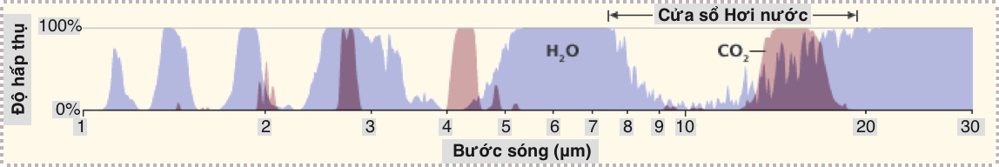
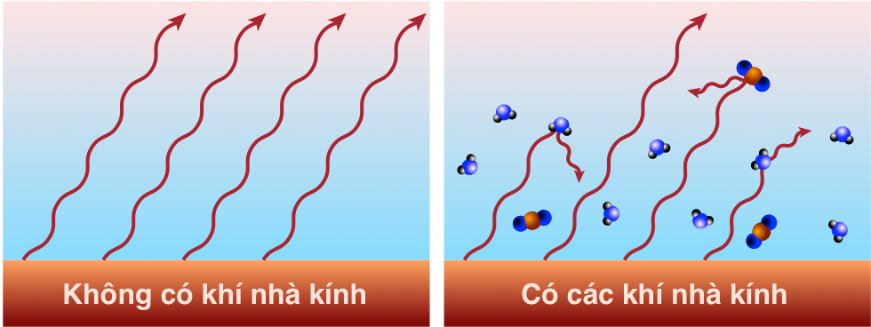

# Chương 9: Biến đổi khí hậu (Phần I)

!!! quote ""

    Những chú voi đang làm hết sức mình. Ảnh chụp bởi C. O’Connell & T. Rodwell.

**Biến đổi khí hậu** (*Climate change*) đứng đầu trong số các vấn đề quy mô toàn cầu do sự thèm khát năng lượng của con người&mdash;gây ra bởi sự tích tụ các khí nhà kính, đặc biệt là khí cácbonic (CO~2~) trong bầu khí quyển thông qua việc đốt cháy nhiên liệu hoá thạch. Chương này nhằm mục đích cung cấp một giải thích rõ ràng trên cơ sở khoa học của biến đổi khí hậu, giúp loại bỏ dần những bất định tạo ra bởi **những chiến dịch đưa thông tin sai lệch** (*disinformation campagnes*) (cho dù chúng đã có những thành công đáng báo động). Mặc dù khó có thể dự đoán chi tiết hệ thống khí hậu sẽ phản ứng như thế nào, những hiểu biết vật lí [về biến đổi khí hậu] là không thể bác bỏ được. Chúng ta sẽ thấy sự gia tăng khí CO~2~ không còn là điều bí ẩn mà chủ yếu là do đốt cháy nhiên liệu hoá thạch. Chúng ta cũng sẽ khám phá các kịch bản và liên hệ giữa gia tăng nồng độ CO~2~ trong khí quyển và hệ quả về nhiệt độ.

## 1. Nguồn CO~2~

Các tác động của biến đổi khí hậu đang diễn ra ngày nay chủ yếu là do sự gia tăng nồng độ khí CO~2~ trong khí quyển do đốt cháy nhiên liệu hoá thạch.

Hoá học đã chỉ ra rõ ràng ([Phương trình 8.1](8-fossil-I.md#3-nang-luong-hoa-hoc)): năng lượng được giải phóng khi nhiên liệu hóa thạch được đốt cháy bằng O~2~ (khí ôxy) để thu được CO~2~ (khí cácbonic) và H~2~O (hơi nước). **Bảng 9.1** mở rộng các đặc tính của nhiên liệu hoá thạch khi đốt cháy được trình bày trong **Chương 8**, bổ sung thêm các thuộc tính của CO~2~.

| **Nhiên liệu** | **Đại diện** | **Khối lượng phân tử** | **kJ/mol** | **kJ/g** | **kcal/g** | **CO~2~ g/g** | **CO~2~ g/MJ** |
|:--------------:|:------------:|:----------------------:|:----------:|:--------:|:----------:|:-------------:|:--------------:|
| **Than đá**    | C            | 12                     | 393,5      | 32,8     | 7,8        | 3,67          | 112            |
| **Khí đốt**    | CH~4~        | 16                     | 890,3      | 55,6     | 13,3       | 2,75          | 49             |
| **Dầu mỏ**     | C~8~H~18~    | 114                    | 5.471      | 48,0     | 11,5       | 3,09          | 64             |

>**Bảng 9.1**: Đặc tính khi đốt cháy của nhiên liệu hoá thạch, bao gồm phát thải CO~2~ trên mỗi gram đầu vào và trên mỗi MJ năng lượng đầu ra.

Điều đáng quan tâm nhất trong **Bảng 9.1** của chương này là hai cột cuối cùng:

1.  **Tỷ lệ khối lượng** (*mass ratio*): có bao nhiêu gram CO2 được tạo ra trên mỗi gram[^1] nhiên liệu đầu vào

2. **Cường độ các-bon** (*carbon intensity*): có bao nhiêu gram CO~2~ được phát thải trên mỗi đơn vị năng lượng đầu ra.

[^1]:

    ...hay bất cứ thước đo khối lượng/cân nặng nào bạn muốn

Trong khi tất cả các dạng nhiên liệu trên đều tạo ra tỷ lệ khối lượng xấp xỉ 3 đơn vị CO~2~ cho mỗi đơn vị nhiên liệu hóa thạch, mật độ năng lượng thấp hơn của than cùng với tỷ lệ khối lượng[^2] cao hơn một chút so với khí tự nhiên làm cho nó có cường độ các-bon cao hơn gấp đôi so với khí tự nhiên.

[^2]:

    Than khi đốt cháy tạo ra nhiều CO~2~ hơn trên mỗi gram nhiên liệu vì trong các nhiên liệu hóa thạch khác còn chứa hydro, giúp bổ sung năng lượng cháy và còn không tạo ra CO~2~.

!!! example "Ví dụ 9.1.1: Mỗi bình xăng đầy trong ô tô thường tương ứng với phát thải bao nhiêu CO~2~"

    Một bình xăng thông thường có thể chứa khoảng 50 lít (L) xăng (13 gallon). Mật độ xăng là 0,75 kg/L nên một thùng xăng có khối lượng xăng khoảng 38 kg. Áp dụng tỷ lệ hệ số đơn giản và thuận tiện của khối lượng CO2 trên khối lượng nhiên liệu đầu vào là 3, chúng ta thấy rằng một bình xăng sẽ tạo ra khoảng 110 kg CO2&mdash;một lượng không hề nhỏ!

### Đo đạc CO~2~

Bắt đầu từ năm 1958, Dave Keeling thuộc Viện Hải dương học Scripps bắt đầu ghi lại nồng độ CO~2~ trong khí quyển từ đỉnh Mauna Loa ở giữa Thái Bình Dương[^3]. Ngoài việc quan sát thấy sự biến đổi hàng năm do chu kỳ quang hợp theo mùa[^4], ông bắt đầu nhận thấy nồng độ này tăng lên đều đặn qua từng năm. Các phép đo vẫn tiếp tục cho đến nay, được gọi là **“Đường Keeling”** (*Keeling Curve*), được minh họa trong **Hình 9.1**.

[^3]:

    ...nằm xa ảnh hưởng của những lục địa

[^4]:

    Thực vật hấp thụ và thải ra CO~2~ theo mùa khi lá phát triển rồi tàn lụi.

>**Hình 9.1**: Các kết quả đo nồng độ CO~2~ từ Mauna Loa (Hawaii) trong 60 năm qua là đường màu xanh lam (trục bên trái), cho thấy xu hướng đi lên không ngừng và ngày càng tăng tốc, hiện nay ở mức [khoảng 2,6 ppm~v~ mỗi năm](https://www.esrl.noaa.gov/gmd/ccgg/trends/data.html). Những biến đổi theo mùa do quá trình quang hợp được quan sát dọc theo đồ thị xu hướng này. **Mức độ tiền công nghiệp** (*Pre-industrial levels*) là khoảng 280 ppm~v~, do đó chúng ta đã thêm vào khoảng 130 **phần triệu** (*part per million*, **ppm**, hay 0,0001%). Các chấm đỏ (trên thang đo trục phải) hiển thị các bản ghi nhiệt độ trung bình toàn cầu [trong cùng thời kỳ](https://climate.nasa.gov/vital-signs/global-temperature/). Cho đến nay, nhiệt độ trung bình toàn cầu đã tăng khoảng 1°C. Lưu ý rằng **Nghị định thư Kyoto** (*Kyoto Protocol*) năm 1997 và **Thỏa thuận chung Paris** (*Paris Agreement*) năm 2015 (**Hộp 4, Chương 19**) không làm thay đổi đáng kể xu hướng tăng phát thải khí CO~2~.

Khi các phép đo bắt đầu được thực hiện, bầu khí quyển có ít hơn 320 **phần triệu thể tích** (*part per million by volume*, **ppm~v~**) hay < 0,032%. Đến nay, chúng ta đã vượt quá [424 ppm~v~](https://www.co2levels.org/) (Cập nhật tháng 30/03/2024).

Các phép đo bọt khí bị mắc kẹt trong dải băng Greenland cách đây khoảng 100.000 năm và dải băng ở Nam Cực cách đây 800.000 năm cho thấy nồng độ CO~2~ đã dao động trong khoảng 180–280 ppm~v~, đạt đến mức cao hơn trong khoảng thời gian ấm hơn giữa các **kỷ băng hà** (*ice ages*) (**thời kỳ gian băng** (*interglacial periods*)). Trong ít nhất một nghìn năm trước Thời đại Nhiên liệu Hóa thạch, nồng độ CO2 đã giữ ổn định ở mức khoảng 280 ppm~v~.

### Phát thải CO~2~

>**Hình 9.2**: Lịch sử khai thác nhiên liệu hóa thạch trên toàn thế giới, được vẽ lại từ [Hình 8.2](8-fossil-I.md#2-than-a-dau-mo-khi-ot). Bên trái là tỷ lệ sử dụng thô được biểu thị bằng terawatt, trong khi bên phải là số liệu bình quân đầu người. Ba loại được xếp chồng lên nhau, do đó khí tự nhiên có đóng góp nhỏ nhất chứ không phải là lớn nhất. Ví dụ: ở cạnh phải của hình bên trái, công suất than đi từ 0 đến 5 TW, dầu từ 5 đến 11 (nên có 6 TW từ dầu) và khí đốt từ 11 đến 15, biểu diễn 4 TW từ khí đốt. Hình bên trái cho thấy rõ rằng việc sử dụng nhiên liệu hóa thạch vẫn đang tăng lên đáng kể và do đó lượng khí thải CO~2~ cũng tăng theo.

Chúng ta đã thấy trong [Hình 8.2](8-fossil-I.md#2-than-a-dau-mo-khi-ot)&mdash;được lặp lại ở **Hình 9.2**&mdash;lịch sử sử dụng nhiên liệu hóa thạch trên thế giới của than, dầu và khí tự nhiên. Trong khi đó, **Bảng 9.1** cho biết mỗi loại nhiên liệu thải ra nhiêu CO~2~ trên mỗi kg hoặc mỗi Joule sử dụng. Hai phần này có thể được kết hợp để ước tính lượng phát thải CO~2~ trên toàn cầu mỗi năm, và để theo dõi tổng lượng khí thải CO~2~ theo thời gian. **Bảng 9.2** và **Hộp 9.1** giải thích cách chuyển từ số liệu công suất năng lượng nhiên liệu hóa thạch (TW) trong **Hình 9.2** sang đơn vị nồng độ CO2 trong khí quyển.

!!! note "Hộp 9.1: Tính nồng độ CO~2~ từ TW"

    Chúng ta sẽ sử dụng dầu làm ví dụ. Trong **Hình 9.2**, chúng ta có thể thu được khoảng 6 TW từ dầu (5 TW từ than đá, 4 TW từ khí đốt tự nhiên). Nhân với 10^12^ sẽ tính ra đơn vị Watts (J/s) và nhân với 3,156 × 10^7^ giây mỗi năm sẽ cho ra năng lượng toàn cầu hàng năm từ dầu tính bằng Joules: 1,9 × 10^20^ J/năm. **Bảng 9.1** cho biết dầu chứa khoảng 11,5 kcal/g nên số gram dầu sử dụng trong mỗi sản phẩm có thể được xác định trước tiên bằng cách chuyển đơn vị J thành kcal (chia cho 4.184), thu được 4,5 × 10^16^ kcal/năm, và do đó là 3,9 × 10^15^ gram/năm cho dầu mỏ, hay 3,9 × 10^12^ gram/năm[^5]. **Bảng 9.1** cho thấy mỗi cân dầu đốt cháy tạo ra 3,09 kg CO~2~, tương đương với 1,2 × 10^13^ kg/năm CO~2~ từ dầu mỏ. Chúng ta cũng nhận được câu trả lời tương tự khi sử dụng 64 g/MJ từ **Bảng 9.1** và 1,9 × 10^14^ MJ/năm từ tính toán ở trên. Phần còn lại của tính toán, chuyển đổi sang đơn vị phần triệu, được chi tiết trong phần cuối **Bảng 9.2**.

[^5]:

    Ở mức 120 kg mỗi thùng, tương ứng với dự kiến 30 tỷ thùng mỗi năm. Một cách kiểm tra xem chúng ta có đi đúng hướng không.

| **Phép tính**           | **Kết quả (đơn vị)** | **Than đá**             | **Dầu mỏ** | **Khí đốt** |
|:-----------------------:|:--------------------:|:-----------------------:|:----------:|:-----------:|
| Số ban đầu              | TW                   |                         |            |             |
| × 10^12^ W/TW           | W (J/s)              |                         |            |             |
| × 3,16 × 10^7^ giây/năm | J/năm                |                         |            |             |
| ÷ 4.184 J/kcal          | kcal/năm             |                         |            |             |
| ÷ x kcal/g              | FF g/năm             | x = 6,5                 | x = 1,5   | x = 13,3    |
| ÷ 1.000 g/kg            | FF kg/năm            |                         |            |             |
| × y CO~2~ kg/kg         | CO~2~ kg/năm         | y = 3,67                 | y =  3,09  | y = 2,75    |
| ÷ 5 × 10^18^ kg         | CO~2~ /năm           |                         |            |             |
| × 10^6^                 | CO~2~ ppm~m~/năm     |                         |            |             |
| ÷ 4.184                 | CO~2~ ppm~v~/năm     | Tổng phát thải          |            |             |
| ÷ 4.184                 | CO~2~ ppm~v~/năm     | Còn lại trong khí quyển |            |             |

>**Bảng 9.2**: Quy trình chuyển đổi từng bước từ TW sáng ppm~v~ của CO~2~. **FF** (*fossil fuel*) có nghĩa là nhiên liệu hoá thạch, có thể là than, dầu hay khí đốt&mdash;mỗi loại được tính riêng bằng cách sử dung các giá trị khác nhau được cung cấp ở bên phải của bảng.

Khối lượng của khí quyển vào khoảng 5 × 10^18^ kg, thu được bằng cách nhân 10.000 kg không khí[^6] trên mỗi mét vuông diện tích $4πR_{⊕}^2$ bề mặt trái đất. Chia 1,2 × 10^13^ kg[^7] phát thải khí CO~2~ bởi dầu mỏ cho khối lượng của khí quyển ra kết quả 2,4 × 10^-6^, hay 2,4 phần triệu (ppm)[^8]. Chúng ta đã gần xong rồi. Định lượng vừa tính được là phần triệu theo khối lượng (ppm~m~), không phải là phần triệu theo thể tích (ppm~v~). Vì không khí[^9] có khối lượng trung bình 29 g/mol, trong khí CO~2~ là 44 g/mol, khối lượng CO~2~ cao hơn thể tích chiếm chỗ trong không khí của nó theo hệ số 44/29, hay 1,52. Vì thế chúng ta chia 2,4 ppm~m~ cho 1,52 ra kết quả 1,6 ppm~v~. Điều chỉnh cuối cùng: chỉ một nửa khí CO~2~ được giữ lại trong khí quyển, vì thế ngày nay, chúng ta đang thêm vào 0,8 ppm~v~ vào khí quyển mỗi năm với việc đốt cháy dầu mỏ. ***Bạn có thể xác thực con số này trong đồ thị bên trái của*** **Hình 9.3** ***cho dầu mỏ không?*** 

[^6]:

    Đây là một kết quả gần đúng với giá trị thực tế, thu được bằng cách chi áp suất khí quyển tiêu chuẩn cho 101.325 Pa (Pascal, đơn vị áp suất) cho $g ≈ 9,8\, m/s^2$.

[^7]:

    ...kết của của **Hộp 9.1**

[^8]:

    Chỉ cần nhân với 1 triệu, hay 10^6^ để có đơn vị phần triệu, ppm.

[^9]:

    Không khí chứa khoảng 75% N~2~ với khối lượng 28 g/mol cộng với 25% O~2~ với khối lượng 32 g/mol.

**Hình 9.3** cho thấy kết quả tính toán này là hàm của thời gian xét về tốc độ hàng năm và lượng phát thải tích luỹ. Chúng ta thấy rằng mặc dù dầu mỏ và than đá cung cấp năng lượng hàng năm như nhau trên toàn cầu, do cường độ các-bon của than cao hơn nhiều nên lượng phát thải CO~2~ đã chiếm ưu thế[^10] so với tất cả các nguồn năng lượng khác. Trên thực tế, than đá **luôn** là nguồn phát thải CO~2~ trội hơn, theo quan sát đồ thị bên trái với đường màu đen trong **Hình 9.3**, luôn cao hơn so với hai nguồn phát thải CO~2~ khác. Nhìn chung, ước tính này gợi ý mức tăng CO~2~ hàng năm là 2,6 ppm~v~, với than đóng góp  hơn một nửa trong số đó (1,4 ppm~v~).

>**Hình 9.3**: Ước tính lượng CO2 đóng góp từ tiêu thụ nhiên liệu hóa thạch đã biết dựa trên hóa học và giả định rằng một nửa lượng CO2 còn ở lại trong khí quyển, trong khi phần còn lại được đại dương và đất liền hấp thụ. Đường cong màu đỏ sử dụng điểm bắt đầu là 285 ppm~v~ với 49% lượng khí thải CO2 ở lại trong khí quyển. Đơn vị là phần triệu theo thể tích (ppm~v~). Đồ thị bên trái hiển thị lượng bổ sung hàng năm, thêm vào 2,6 ppm~v~ mỗi năm, thể hiện độ dốc trong **Hình 9.1**. Đồ thị bên phải là lượng phát thải tích lũy cho đến nay theo hàm số của thời gian&mdash;về cơ bản là tổng cộng tất cả lượng phát thải hàng năm từ đồ thị bên trái. Những đường đồ thị này không được xếp chồng lên nhau như trong **Hình 9.2**, do đó mỗi đường có thể được đọc trực tiếp từ trục tung. Lưu ý rằng dầu và khí đốt vẫn đang tăng lên ở đồ thị bên trái: chúng ta thải ra nhiều CO~2~ hơn qua từng năm.

Tổng cộng những đóng góp ngày càng tăng theo thời gian, phương pháp ước tính này gợi ý rằng chũng ta đã tăng phát thải khí CO~2~ trong khí quyển lên 123 ppm~v~[^11], và 75 ppm~v~trong số này (61%) là do than đá (đồ thì bên phải **Hình 9.3**).

[^10]:

    Tại sao chúng ta tiếp tục sử dụng than nếu đó là nguồn nhiên liệu ô nhiễm nhất? Bởi vì cơ sở hạ tầng thay thế rất tốn kếm và việc khai thác nhiên liệu hoá thạch không hoạt động giống như một tài khoản ngân hàng cho phép rút tiền với tỉ lệ tuỳ ý. Chúng ta không thể đột nhiên chuyển sang loại hình nhiên liệu khác để thoả mãn nhu cầu tiêu thụ, ngay cả khi mọi người đều muốn như vậy&mdash;mặc dù trong thực tế không phải ai cũng muốn thế.

[^11]:

    ...rất gần với ~130 ppm~v~ mà chúng ta quan sát được.

Cộng cả ba đường phát thải từ đồ thị bên phải của **Hình 9.3** và biểu diễn lên trên **Đường Keeling**[^12] chúng ta thấy kết quả thật đáng kinh ngạc, với hai đường đồ thị chồng lên nhau&mdash;như minh họa trong **Hình 9.4**.

[^12]:

    ...các phép đo CO~2~ thực tế

>**Hình 9.4**: Phát thải CO~2~ (màu đỏ )của nhiên liệu hóa thạch ngoài so với đo lường nồng độ CO~2~ trên thực tế (màu xanh). Đường màu đỏ sử dụng điểm bắt đầu là 285 ppm~v~ với 49% lượng khí thải CO~2~ còn lại trong khí quyển. Sự trùng khớp này rất chính xác và đáng thuyết phục.

Đồ thị được tính toán từ việc sử dụng nhiên liệu hóa thạch chồng lên Đường Keeling chính xác đến mức nguồn gốc của lượng CO2 dư thừa trong bầu khí quyển của gần như không còn gì bí ẩn nữa. Hoá học và lịch sử tiêu thụ nhiên liệu hóa thạch không có gì phải bàn cãi. “Điều khó hiểu” duy nhất ở đây là phần CO~2~ thải ra từ quá trình đốt cháy nhiên liệu hóa thạch vẫn còn lại trong khí quyển so với phần được hấp thụ bởi đại dương và các **“bể chứa”** [các-bon] (*carbon sink*) khác. Theo thực nghiệm, khoảng một nửa lượng CO~2~ tồn tại trong khí quyển, trong khi nửa còn lại được hấp thụ bởi đại dương[^13] và trong những thực vật bị chôn vùi dưới lòng đất. Nếu không biết về cơ chế hấp thụ của đại dương và đất liền, chúng ta đã cho rằng nồng độ CO~2~ trong khí quyển do nhiên liệu hóa thạch gây ra cao gấp hai lần (xem **Hộp 9.2**).

[^13]:

    ...gây axít hoá đại dương

!!! note "Hộp 9.2: Nếu chúng ta bỏ qua đại dương"

    Hãy suy ngẫm về phản ứng của chúng ta nếu nồng độ CO~2~ không được điều chỉnh do bị hấp thụ bởi đại dương và đất liền: có lẽ chúng ta đã kết luận rằng mình *chẳng có vấn đề gì* với việc gia tăng nồng độ CO~2~ trong khí quyển khi đốt nhiên liệu hoá thạch, và có khi còn tự hỏi tại sao chúng ta không quan sát được nồng độ tăng *nhanh hơn*. Nói cách khác, giải thích nguyên nhân của sự dư thừa CO~2~ đã không còn là bí ẩn nữa. Nếu nồng độ CO~2~ trong khí quyển tăng *không* do tác nhân con người[^14], chúng ta sẽ có một bí ẩn *thực sự*: vậy toàn bộ khí thải CO~2~ từ việc đốt nhiên liệu hoá thạch đã đi đâu?

[^14]:

    ...qua việc đốt cháy nhiên liệu hoá thạch 

### Những quốc gia chịu trách nhiệm chính

Biến đổi khí hậu là một hiện tượng toàn cầu. Ngay cả khi tất cả khí thải đến từ một quốc gia hay khu vực, sự lưu thông khí quyển sẽ lan truyền trên phạm vi toàn cầu&mdash;mặc dù chậm hơn ở khu vực xích đạo. Do đó, đây là một vấn đề toàn cầu. Dù thế nào đi nữa, thật thú vị khi nhìn vào những quốc gia phát thải chính.

>**Hình 9.5**: Đóng góp của các quốc gia về phát thải CO~2~ cho đến nay, được nhóm theo lục địa. Các nước phát thải chính được gọi tên, trong khi các nước còn lại ở mỗi châu lục được nhóm lại thành các “nhóm còn lại”. Nguồn: [Our world in data](https://ourworldindata.org/contributed-most-global-co2).

**Hình 9.5** chỉ ra rằng Hoa Kì là quốc gia lớn nhất chịu trách nhiệm về lượng phát thải khí CO~2~ tích luỹ: gần gấp đôi so với quốc gia đứng thứ hai, Trung quốc (Số liệu năm 2019). Ngày nay, Trung quốc là nước phát thải lớn nhất, với mức 9,4 tỷ tấn CO~2~/năm, trong khi Hoa Kì ở vị trí thứ hai với 5,15 tỷ tấn CO~2~/năm. **Bảng 9.3** liệt kế 6 nước phát thải hàng đầu trong thời gian gần đây, chịu trách nhiệm cho khoảng 60% trong số 34 tỷ tấn CO~2~ phát thải hàng năm[^15].

[^15]:

    Rapier (2019), Top 10 các quốc gia phát thải khí CO~2~.

| **Quốc gia** | **Tỉ tấn/năm** | **Đóng góp (%)** |
|:------------:|:--------------:|:----------------:|
| Trung Quốc   | 9,43           | 27,8             |
| Hoa Kì       | 5,15           | 15,2             |
| Ấn Độ        | 2,48           | 7,3              |
| Nga          | 1,55           | 4,6              |
| Nhật Bản     | 1,15           | 3,4              |
| Đức          | 0,73           | 2,1              |
| **Top 6**        | **20,49**          | **60,4**             |
| **Thế giới**     | **34**             | **100**              |

>**Bảng 9.3**: Các quốc gia phát thải CO~2~ hàng đầu, năm 2018. Gt có nghĩa là gigatons, hay tỷ tấn, tương đương 10^12^ kg, vì 1 tấn bằng 1.000 kg.

## 2. Cơ chế làm nóng

Sự hiện diện của lượng CO~2~ dư thừa trong bầu khí quyển không còn nghi ngờ gì nữa là do đốt cháy nhiên liệu hóa thạch. Nhưng điều này làm thay đổi khí hậu của chúng ta như thế nào? Làm sao một thành phần nhỏ của khí quyển (hiện nay nồng độ CO~2~ chỉ chiếm 0,04%) lại có thể gây ra nhiều rắc rối như vậy? Câu trả lời nằm trong **bức xạ hồng ngoại** (*infrared radiation*)[^16]. Hãy nhớ lại từ [Phần 3, Chương 1](1-growth.md#3-he-qua-theo-nhiet-ong-hoc-thermodynamic-consequences) rằng đây cơ chế năng lượng rời khỏi trái đất, với công suất tuân theo **định luật Stefan-Boltzmann** $P = A_{s}\sigma{T^4}$, trong đó, $A_{s}$ là diện tích bề mặt trái đất, **hằng số Stefan-Boltzmann**[^17], $\sigma = 5{,}67\times10^{-8}$ $W/m_2/K^4$, và $T$ là nhiệt độ của bề mặt bức xạ, đơn vị Kelvin ($K$).

[^16]:

    Pierrehumbert (2011), “Bức xạ hồng ngoại và nhiệt độ hành tinh”.

[^17]:

    ...dễ nhớ hơn với chuỗi 5-6-7-8

>**Hình 9.6**: Trái đất hứng ánh sáng qua bề mặt chắn sáng (đường tròn có diện tích $πR^2$), trong khi bức xạ ánh ra bên ngoài không gian từ mọi phía (diện tích bề mặt Trái đất lớn gấp 4 lần diện tích hứng sáng, hay $4πR^2$).

Mặt trời toả năng lượng *bên trên* bầu khí quyển trái đất với cường độ[^18] là 1.360 W/m^2^. Khoảng 30% năng lượng này sáng này&mdash;chính xác hơn là 29,3%&mdash;được phản xạ lại ngay lập tức bởi mây, tuyết và một phần ít hơn bởi bởi nước và địa hinh. 70,7% năng lượng chiếu xuống mặt đất trên diện bề mặt hứng sáng $A_{s} = πR_\oplus^2$ (**Hình 9.6**). Nhưng tổng diện tích bề mặt của trái đất&mdash;lớn gấp bốn lần diện tích hứng sáng này&mdash;đều góp phần tạo ra bức xạ hồng ngoại vào không gian. Trong sự cân bằng hoàn hảo[^19] năng lượng hấp thụ bởi trái đất bằng với bức xạ từ trái đất ra ngoài không gian:

[^18]:

    Đây được gọi là Hằng số mặt trời (*Solar constant*), đo được 1.360 W/m^2^, là luồng công suất ánh sáng mặt trời chiếu lên *bên trên* bầu khí quyển trái đất. Về mặt kĩ thuật, thực chất đây không phải là một hằng số, những rất ổn định.

[^19]:

    Sự mất cân bằng có nghĩa năng lượng đang tích tụ hay đang bị mất đi, dẫn đến ấm lên hay lạnh đi. Ngay cả trong điều kiện hiện tại, sự cân bằng năng lượng hữu ích ở mức 1 W/m^2^.

$$
    0,707 \times 1.360 W/m^2 \times π{R_\oplus^2} = P_{out} = 4π{R_\oplus^2}\sigma(T^4) \tag{9.1}\label{9.1}
$$

Triệt tiêu hai vế phương trình trên cho $π{R_\oplus^2}$, chúng ta có kết quả như sau:

$$
T^4 = \frac{0{,}707 \times 1.360 W/m^2}{4\sigma} \tag{9.2}\label{9.2}
$$

Giải ra ta được $T ≈ 255 K$, hay -18°C, khoảng (0°F). Nhiệt độ này lạnh hơn 33°C so với 288 K (15°C; 59°F) mà chúng ta đo được từ nhiệt độ trung bình Trái đất. Sự khác biệt 33°C này[^20] là do các **khí nhà kính** (*greenhouse gas*)&mdash;chủ yếu là hơi nước H~2~O&mdash;làm ảnh hưởng đến cân bằng nhiệt bằng cách ngăn phần bức xạ thoát ra khỏi ngoài không gian.

[^20]:

    Cuộc sống trên Trái đất đã thích nghi vào dựa vào hiệu ứng khí nhà kính (tạo ra độ chênh 33°C). Thay đổi *một cách đột ngột* sẽ tạo ra nhiều vấn đề. 

Chúng ta hiểu cơ chế này một cách hoàn hảo. Ở nhiệt độ 288 K, phát xạ bề mặt đạt mức cực đại ở bước sóng khoảng 10 μm (10^-6^ mét)[^21]. Khí quyển không trong suốt (*transparent*) ở mọi bước sóng; các đặc điểm hấp thụ bức xạ khác nhau của nó được mô tả trong **Hình 9.7**. Đường đồ thị màu xanh lam ở phía trên bên phải trong hình này là quang phổ của bức xạ hồng ngoại.

[^21]:

    Chúng ta sẽ tìm hiểu vì sao trong **Phần 2, Chương 13**

>**Hình 9.7**: [Phổ hấp thụ/truyền qua khí quyển](https://commons.wikimedia.org/w/index.php?curid=2623190). Hình trên cùng biểu diễn đầu vào năng lượng mặt trời có màu đỏ và đầu ra bức xạ **hồng ngoại** (*infrared*) (bức xạ nhiệt) có màu xanh lam trên dải bước sóng tính bằng micromét trên thang lôgarít. Các đường cong biểu diễn quang phổ Planck của **vật đen** (*black body*) theo lý thuyết ở nhiệt độ bề mặt mặt trời (hơn 5000 K) và bề mặt trái đất đất (khoảng 200-300 K). Từ đó, đường cong màu đỏ thể hiện sự phân bố năng lượng mặt trời đến phía **bên trên bầu khí quyển** (*top of atmosphere*, TOA) của Trái đất, trong khi các vùng màu đỏ bên dưới đường cong này là năng lượng xuống được đến mặt đất. Đường cong màu xanh lam (ở giữa bộ ba đường cong phía bên trái) biểu thị bức xạ từ mặt đất, nhưng chỉ một phần nhỏ (vùng chứa màu xanh lam) truyền trực tiếp qua khí quyển [ra ngoài không gian]&mdash;phần còn lại được hấp thụ bởi khí nhà kính. Hình phía dưới liệt kê chi tiết dải ánh sáng bị hấp thụ hoặc tán xạ. Các vùng màu xám biểu thị sự hấp thụ và tán xạ, do đó các phần màu trắng xen kẽ có thể được coi là nơi bức xạ được truyền ra ngoài không gian [mà không bị hấp thụ]&mdash;thường được gọi là “cửa sổ” (*window*). Những tác nhân chính (khí nhà kính) được chia thành các hình nhỏ hơn bên dưới hình tổng phần trăm hấp thụ. Lưu ý rằng ozone ngăn chặn **tia cực tím** (*ultraviolet*, **UV**) và tán xạ Rayleigh là nguyên nhân khiến bầu trời có màu xanh lam&mdash;bằng cách tán xạ ánh sáng xanh từ mặt trời một cách hiệu quả (màu xanh lam nằm ở phía bên trái, trong khi màu đỏ nằm ở phía bên phải, của dải ánh sách “nhìn thấy”&mdash;kí hiệu bằng chữ «**Thấy**» trong hình). Nguồn: Robert Rohde.

Trong số các khí nhà kính góp phần hấp thụ ánh sáng mặt trời minh họa trong **Hình 9.7**, hơi nước là tác nhân chiếm ưu thế, tiếp theo là CO~2~. Lưu ý rằng vùng màu xanh lam trong hình[^22] được phản ảnh bằng vùng màu trắng đồ thị tổng hấp thụ năng lượng theo phần trăm ở ngay bên dưới[^23]; và hơi nước chiếm phần chủ yếu trong việc hấp thụ năng lượng. Nhưng phía bên phải&mdash;có bước sóng dài hơn&mdash;của dải hấp thụ hơi nước có phần bị trùng với dải hấp thụ của CO~2~, có thể quan sát rõ hơn trong **Hình 9.8**. Chính dải CO~2~ này đã làm cho cạnh bên phải của vùng màu xanh[^24] có dạng đi xuống thẳng đứng như quan sát thấy trong **Hình 9.7**. Khi nồng độ CO~2~ trong bầu khí quyển gia tăng, dải hấp thụ của CO~2~ rộng ra, khiến cho ít  bức xạ thoát ra bên ngoài hơn (cắt vào phía bên phải của vùng màu xanh lam). 

> **Hình 9.8**: Một góc nhìn khác về quang phổ hấp thụ của hơi nước và CO~2~, biểu diễn rõ hợn sự đan xen của các dải quang phổ . Nguồn: [Robert Rohde (NASA)](https://earthobservatory.nasa.gov/features/EnergyBalance/page7.php)[^25].

[^22]:

    ...bức xạ trực tiếp thoát ra ngoài không gian

[^23]:

    Vì thế vùng màu trắng trong hình này thể hiện “cửa sổ” mở.

[^24]:

    ...bức xạ đã thoát ra ngoài không gian

[^25]:

    Tất cả các loại khí trong khí quyển đều có một kiểu hấp thụ năng lượng độc đáo: chúng hấp thụ một số bước sóng năng lượng nhưng trong suốt đối với những bước sóng khác. Kiểu hấp thụ của hơi nước (các vùng màu lam) và CO~2~ dioxide (màu  màu đỏ) trùng nhau ở một số bước sóng. CO~2~ không phải là một loại khí nhà kính mạnh như hơi nước, nhưng nó hấp thụ năng lượng ở các bước sóng (12-15 μm) mà hơi nước không làm được, đóng một phần “cửa sổ” mà qua đó bức xạ nhiệt tỏa từ bề mặt trái đất thường thoát ra ngoài không gian.

Nếu một phần bức xạ hồng ngoại không thoát ra ngoài không gian mà bị khí quyển hấp thụ thì hành tinh sẽ không giảm nhiệt một cách hiệu quả, cộng thêm một phần bù vào **Phương trình** $\eqref{9.2}$&mdash;trong trường hợp Trái Đất là 33°C. Điều này giống như trái đất đang khoác một tấm chăn làm tăng nhiệt độ lên 33°C. **Hình 9.9** minh họa cơ chế này. Hơi nước tạo ra 20°C trong số 33°C nhiệt độ tăng thêm, và CO~2~ tạo ra thêm 8°C, còn lại 5°C do tầng ô-zôn, mê-tan và các chất khác (**Bảng 9.4**). Bất ngờ thay, khí mê-tan (CH~4~) là khí nhà kính mạnh hơn khoảng [80 lần](https://www.factcheck.org/2018/09/how-potent-is-methane/) so với CO~2~ (nếu tính cùng khối lượng và qua thời gian 20 năm), nhưng ở nồng độ trong khí quyển thấp hơn nhiều so với CO2 và cũng tồn tại trong khí quyển ngắn hơn trước khi bị phá hủy về mặt hóa học[^26]. Chúng ta tập trung vào CO2 vì đây là thứ mà hoạt động của con người đang thay đổi nhanh chóng do đốt nhiên liệu hóa thạch. **Diện tiếp xúc khí quyển-đại dương** (*ocean-air interface*) dương rộng lớn cho thấy chúng ta không thể kiểm soát được nồng độ hơi nước. Hơi nước chỉ đơn giản thích nghi với nhiệt độ do thực tế là không khí ấm hơn giữ nhiều hơi ẩm hơn&mdash;trở thành một tác nhân phản hồi quan trọng. Hơi nước không phải là tài xế (yếu tố dẫn dắt quyết định) của nóng lên toàn cầu, mà là một hành khách nặng kí.

[^26]:

    Phát thải khí mê-tan trở nên quan trọng do rò rỉ từ các địa giếng khoản dầu và tan băng vĩnh cửu.

| **Phân tử**       | $\bf{\Delta{T}}$ **(°C)** |
|:-----------------:|:------------------:|
| H~2~O             | 20                 |
| CO~2~             | 8,6                |
| O~3~ (ôzôn)       | 2,6                |
| CH~4~ (mê-tan)    | 1,5                |
| N~2~O (nitơ ôxit) | 0,5                |
| Tổng cộng         | 33                 |

>**Bảng 9.4**: Đóng góp của các loại khí nhà kính vào sự gia tăng nhiệt độ ($\Delta{T}$)

>**Hình 9.9**: Khi không có khí nhà kính, bức xạ hồng ngoại không gặp khó khăn gì khi thoát ra ngoài vũ trụ (trái). Khi có khí nhà kính (phải), phần lớn bức xạ hồng ngoại được các phân tử khí nhà kính hấp thụ. Những phân tử này sau đó sẽ giải phóng năng lượng đã hấp thụ dưới dạng bức xạ hồng ngoại mới, nhưng theo hướng ngẫu nhiên, để một phần năng lượng được đưa trở lại mặt đất, do đó giữ cho bề mặt ấm hơn so với khi không có khí nhà kính.

Nói một cách ngây thơ, việc tăng từ nồng độ CO~2~ trong khí quyển từ 280 ppm~v~ lên 420 ppm~v~ (tăng theo hệ số 1,5), có thể được cho là sẽ biến hiệu ứng nhà kính 8,6°C từ CO2 thành 12,9°C (ở hệ số tăng 1,5 lần) với mức nóng lên do con người gây ra là 4,3°C[^27]. Nhưng đặc tính hấp thụ của CO2 ở ~15 μm bị bão hòa, do đó khi nồng độ CO~2~ tăng lên vào, dải hấp thụ của nó sẽ trở nên rộng hơn, nhưng theo hàm logarit chứ không phải tuyến tính theo nồng độ CO~2~. Các nhà khoa học về khí hậu thường biểu thị tác động của các ảnh hưởng khác nhau dưới dạng **bức xạ cưỡng bức** (*radiative forcing*, **RF**), được đo bằng đơn vị W/m^2^.

!!! abstract "Định nghĩa 9.2.1"

    **Bức xạ cưỡng bức** được dùng để mô tả cường độ trên diện tích (tính bằng W/m^2^) của năng lượng mặt trời được hấp thụ và của bức xạ hồng ngoại vào không gian. Mỗi ảnh hưởng hoặc thành phần khác nhau đóng góp bức xạ cưỡng bức riêng của chúng. Ở trạng thái cân bằng, tồn tại một sự cân bằng sao cho bức xạ cưỡng bức ròng[^28] bằng không.

[^27]:

    Đây không phải nguyên lí hoạt động trong thực tế

[^28]:

    ...tổng cộng tất cả bức xạ cưỡng bức dương và âm

Bức xạ cưỡng bức trung bình tính bằng phương trình

$$
    RF_{☉} = 1.360\, W/m^2 × 0,707/4 ≈ 240\, W/m^2 \tag{9.3}\label{9.3}
$$

khá giống với **Phương trình** $\eqref{9.2}$&mdash;chia cho 4 đã được giải thích ở phần trước. Nếu không thêm khí nhà kính từ thời tiền công nghiệp vào, chúng ta sẽ có nhiệt độ[^29]:

$$
    T = (\frac{RF_{☉}}{σ})^{0,25} + 33 \tag{9.4}\label{9.4}
$$

[^29]:

    ...thêm vào 33°C so với nhiệt độ cơ sở nếu không có hiệu ứng nhà kính 

giải ra được 288 K, hay 15°C. Nếu chúng ta thêm (hay bớt) bức xạ cưỡng bức từ nguồn khác, tử số của **Phương trình** $\eqref{9.2}$ sẽ thêm (hay bớt) tương ứng. Thêm khí CO~2~ vào mức trước thời kì công nghiệp (CO~2*~; 280 ppm~v~) sẽ cho ra bức xạ cưỡng bức:

$$
    RF_{CO_{2}} =5,35\ln\frac{CO_{2}}{CO_{2*}} \, W/m^2 \tag{9.5}\label{9.5}
$$

trong đó hàm **ln()** là logarit tự nhiên (cơ số $e$)[^30]. Ở mức ~420 ppm~v~ hiện tại của chúng ta, tỉ số giữa CO~2~ hiện thời trên CO~2*~ thời kì tiền công nghiệp là 1,5 và $RF_{CO_{2}} ≈ 2,2\,W/m^2$, do đó nhiệt độ mới (đã thêm bức xạ cưỡng bức mới và **Phương trình** $\eqref{9.4}$) là:

[^30]:

    ...để biểu diễn đầy đủ theo hàm số mũ độ rộng của dải hấp thụ ánh sách của CO~2~ ở bước sóng 15 μm trong **Hình 9.7**.

$$
    T = (\frac{RF_{☉} + RF_{CO_{2}}}{σ})^{0,25} + 33 ≈ 288,6\,K \tag{9.6}\label{9.6}
$$

tức là lớn hơn khoảng 0,6°C ($≈288.6 K - 288 K$) so với trước khi tăng nồng độ CO~2~ trong khí quyển từ thời tiền công nghiệp. Chúng ta có thể biểu thị điều này như một **độ nhạy** (*sensitivity*): chênh lệch nhiệt độ $\Delta{T}$ là bao nhiêu tương ứng với mức mất cân bằng bức xạ cưỡng bức? Trong trường hợp này, 0,6°C từ mức tăng 2,2 W/m^2^ là 0,27°C mỗi W/m^2^ ($≈0,6/2,2$). Nhưng khi đưa vào các cơ chế phản hồi đã biết&mdash;hầu hết là **phản hồi xuôi** (*positive feedback*)&mdash;độ nhạy nhiệt độ trở thành 0,8°C cho mỗi đơn vị W/m2 bức xạ cưỡng bức thêm vào: đây được gọi là **thông số độ nhạy khí hậu** (*climate sensitivity parameter*)[^31].

[^31]:

    [Đọc thêm](http://www.realclimate.org/index.php/archives/2007/08/the-co2-problem-in-6-easy-steps/) để hiểu tóm tắt nội dung.

!!! abstract "Định nghĩa 9.2.2" 

    **Thông số độ nhạy khí hậu** liên hệ mức độ nóng lên dự kiến với một lượng cưỡng bức bức xạ nhất định. Sự hiểu biết hiện tại đặt giá trị này ở mức 0,8°C trên W/m2 của lực bức xạ

Do đó, 2,2 W/m^2^ bức xạ cưỡng bức bổ sung (do nhiên liệu hoá thạch) sẽ làm nhiệt độ tăng[^32] 1,7°C (**Hình 9.10**), gấp khoảng 3 lần so với các tính toán không có phản hồi.

[^32]:

    Chỉ cần nhân 2,2 W/m^2 với 0,8°C mỗi W/m^2.

>**Hình 9.10**: Khi nồng độ CO2 tăng, bức xạ cưỡng bức (trục trái) gia tăng, làm tăng nhiệt độ (trục phải). Hiện tại chúng ta đang ở mức nồng độ CO~2~ khí quyển 420 ppm~v~, tương ứng với cường độ bức xạ là 2,2 W/m2 và mức tăng nhiệt độ tối đa là 1,7C (ngôi sao đỏ). Hiện tại, nhiệt độ đã tăng hơn 1,2°C (chấm tròn đỏ), nhưng sẽ đạt đến trạng thái cân bằng mới khi đại dương ấm lên và băng tan. 

!!! example "Ví dụ 9.2.1" 

    Nếu chúng ta tăng gấp đôi nồng độ CO~2~ so với thời kỳ tiền công nghiệp thì nhiệt độ sẽ tăng lên bao nhiêu?

    Nồng độ CO~2~ thời kì tiền công nghiệp là 280 ppm~v~, do đó, tăng gấp đôi lượng CO~2~ sẽ tăng thêm 280 ppm~v~ lên tổng cộng 560 ppm~v~. Bức xạ cưỡng bức khi đó tính theo **Phương trình** $\eqref{9.5}$ là 5,35 × ln(2) ≈ 3,7 W/m^2^. Nhân con số này với **độ nhạy khí hậu** ở mức 0,8°C/W/m^2^ sẽ ra nhiệt độ tăng lên khoảng 3,0°C (tương đương 0,27 x 3,7 ≈ 1°C nếu không tính đến các phản hồi).

Những **phản hồi xuôi** (hay phản hồi tích cực, *positive feedback*&mdash;phản hồi cùng chiều hướng của tác động) rất quan trọng và bao gồm các yếu tố như:

1. Một hành tinh ấm hơn có nghĩa là ít băng hơn (sông băng, chỏm Bắc Cực), dẫn đến it ánh sáng mặt trời được phản chiếu hơn, làm tăng hệ số hấp thụ 0,707 trong **Phương trình** $\eqref{9.3}$ để tăng cường bức xạ cưỡng bức.

2. Không khí ấm hơn có thể chứa nhiều hơn hơi nước&mdash;một khí nhà kính chủ chốt, từ đó làm tăng mức đóng góp khí vào việc gia tăng nhiệt độ lên mức 33°C.

3. Môi trường ấm hơn dẫn đến lượng CO~2~ phát thải nhiều hơn do mất thêm do rừng khô hạn, sa mạc hóa, quá trình phân hủy thực vật và than bùn tăng nhanh. 

Một vài cơ chế **phản hồi ngược** (*negative feedback*)[^33] cũng tồn tại, nhưng không sánh được với phản hồi xuôi.

[^33]:

    Cho đến nay, cơ chế phản hồi ngược quan trọng nhất là bức xạ hồng ngoại từ trái đất ra ngoài không gian, tăng mạnh khi nhiệt độ tăng (theo $T^4$), do đó cản trở sự tăng nhiệt độ do có tác dụng làm hạ nhiệt.

Mức tăng nhiệt độ toàn cầu so với thời kì tiền công nghiệp giờ đã vào khoảng [1,24°C năm 2022](https://berkeleyearth.org/global-temperature-report-for-2022/), ngay cả khi chúng ta không bao giờ bổ sung thêm một phân tử CO~2~ nào nữa vào khí quyển thì nhiệt độ vẫn sẽ tiếp tục tăng khi đại dương[^34] dần bắt kịp trạng thái cân bằng mới. Chúng ta kỳ vọng nhiệt độ sẽ ổn định ở mức nhiệt độ cao hơn 1,7°C đối với lượng CO~2~ dư thừa cho đến nay, theo những tính toán ở trên. Như vậy việc gia tăng nhiệt độ đã hoàn thành được khoảng 73% quãng đường. Tất nhiên, sẽ có thêm nhiều phát thải CO~2~ phát thải hơn, do đó mức tăng nhiệt độ cuối cùng chắc chắn sẽ còn cao hơn.

[^34]:

    ...có khối lượng nhiệt rất lơn, hay **nhiệt dung riêng** rất cao.

 
**Tác giả: T.W. Murphy, Jr. ©2022**;  [Creative Commons Attibution-NonCommercial 4.0 International License](https://creativecommons.org/licenses/by-nc/4.0/); Tải miễn phí tại: [https://escholarship.org/uc/energy_ambitions](https://escholarship.org/uc/energy_ambitions).

**Dịch giả: Team Sống bền vững**