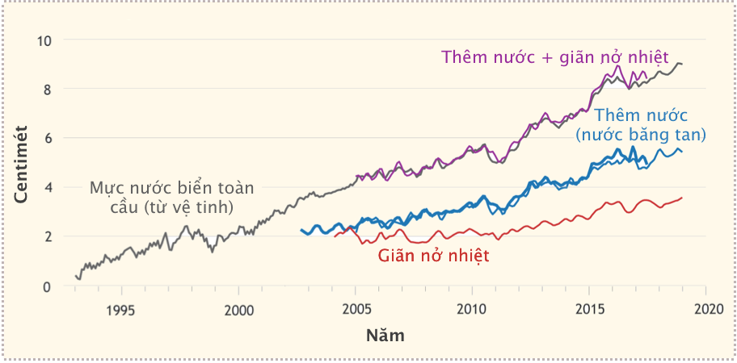
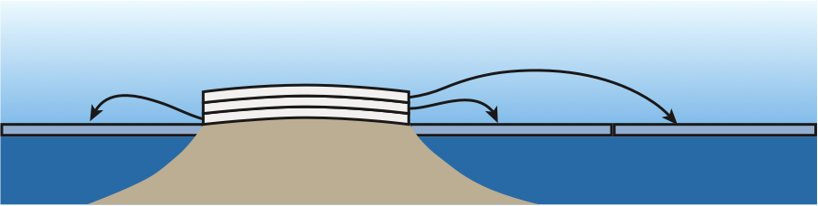

# Chương 9: Biến đổi khí hậu (Phần II)

## 3. Quỹ đạo phát thải

Bắt đầu từ dữ liệu được sử dụng trong [Hình 9.3](9-climate-I.md#phat-thai-co2), bây giờ chúng ta thử hình dung vài ví dụ để hiểu xem tương lai có thể ra sao khi tổng phát thải CO~2~ tăng tương ứng với nhiệt độ ($\Delta{T}$) tăng vào năm 2100 trong kịch bản giả định khác nhau[^32].

[^32]:

    Không có kịch bản nào chúng ta tạo ra ở đây chính xác theo thực tế nhưng chúng giúp thiết lập ranh giới của các hệ quả có thể xảy ra. Các mô hình toán học không cần phải nắm bắt được tất cả các sắc thái vẫn là những hướng dẫn hữu ích để hiểu được toàn cảnh.

Trước hết, hãy hình dung rằng chúng ta đột nhiên chấm dứt sự gia tăng sử dụng nhiên liệu hóa thạch [^33] và duy trì mức độ đang sử dụng hiện tại từ giờ đến năm 2100. **Hình 9.11** cho thấy điều gì sẽ xảy ra. Tổng lượng CO~2~ bổ sung tăng lên gấp 2,75 lần mức dư thừa hiện tại, lên tới 339 ppm~v~ so với mức tiền công nghiệp. **Bức xạ cưỡng bức** (*radiative forcing*) tương ứng sẽ là 4,25 W/m^2^ và dẫn đến nhiệt độ tăng 3,4°C. **Bảng 9.5** tóm tắt kịch bản này và ba kịch bản tiếp theo.

[^33]:

    ...được thể hiện trong đồ thị bên trái **Hình 9.3**

>**Hình 9.11**: CO~2~ tăng nếu cố định mức độ sử dụng nhiên liệu hoá thạch hiện tại cho phần còn lại của thế kỉ, tuân theo các qui ước trong [Hình 9.3](9-climate-I.md#phat-thai-co2). Chúng ta vẫn sẽ thêm vào nồng độ CO~2~ mỗi năm 2,6 ppm~v~ kể từ bây giờ cho đến hết năm 2100, tương đương với mức tăng tổng cộng 339 ppm~v~[^34], hay khoảng 2,75 lần mức dư thừa hiện tại. Nhiệt độ theo đó sẽ tăng thêm 3,4°C (hãy kiểm tra lại với [Ví dụ 9.2.1](9-climate-I.md#2-co-che-lam-nong)). Với kịch bản này và các kịch bản khác, đồ thị sẽ chỉ biểu diễn một nửa lượng CO~2~ còn lại trong khí quyển&mdash;không bị hấp thụ bởi các nguồn khác.

[^34]:

    ...cho ra kết quả 620 ppm~v~; tăng thêm 339 ppm~v~ so với thời kì tiền công nghiệp 280 ppm~v~

| **Kịch bản**        | **&Delta;CO~2~ (ppm~v~)** | **So với hiện tại** | **CO~2~ (ppm~v~)** | $\bf{RF_{CO_{2}}}$ **(W/m^2^)** | **&Delta;T (°C)** |
|:-------------------:|:-------------------------:|:-------------------:|:------------------:|:-------------------------:|:--------------------:|
| **FF không tăng**   | 339                       | 2,75 ×              | 620                | 4,25                      | 3,4                  |
| **Không than **     | 268                       | 2,18 ×              | 548                | 3,6                       | 2,9                  |
| **Bằng 0 năm 2100** | 235                       | 1,91 ×              | 515                | 3,3                       | 2,6                  |
| **Bằng 0 năm 2050** | 169                       | 1,37 ×              | 450                | 2,5                       | 2,0                  |

>**Bảng 9.5**: Tóm tắt các kịch bản. **FF** (*Fossil Fuels*): các loại nhiên liệu hoá thạch

Chúng ta đang chứng kiến những vấn đề nghiêm trọng đang diễn ra ngay thời điểm hiện tại, ở mức tăng nhiệt độ khoảng hơn 1,2°C. Vì vậy kịch bản tăng nhiệt độ 3,4°C là không hề mong muốn (ở mức thảm hoạ)[^35]. Hãy suy nghẫm một chút về việc con người dừng tăng mức phát thải hàng năm một cách đột ngột. Thực tế cho thấy tốc độ phát thải CO~2~ thường tăng từ năm này qua năm khác: chúng ta còn chưa biết đỉnh điểm ở đâu!

[^35]:

    Mặt khác, chúng ta có thể không khai thác đủ nhiên liệu hóa thạch để đốt cháy để hiện thực hóa kịch bản này. Vì thế, đây có thể xem như đường giới hạn cận trên của việc đốt cháy nhiên liệu hóa thạch.

Kịch bản thức hai tập trung vào việc loại bỏ than đá, vì đây là nhiên liệu có cường độ phát thải CO~2~ nhiều nhất[^36], như **Hình 9.3** đã chỉ ra. Nếu khí tự nhiên&mdash;nhiên liệu hoá thạch có cường độ các-bon thấp&mdash;có thể thay thế tất cả các ứng dụng của than thì sao? Điều này trên thực tế đang diễn ra&mdash;một cách từ từ&mdash;trong lĩnh vực sản xuất điện. Không biết bao nhiêu người đã tham gia cổ vũ cho quá trình chuyển dịch năng lượng như thế xảy ra theo cách nhanh chóng nhất có thể. Kịch bản giả tưởng này cho phép chúng ta thực hiện việc thay thế than hoàn toàn *ngay lập tức* (một viễn cảnh không thực tế); qua đó giúp sâu thêm những giới hạn về mặt lợi ích thu được khi chuyển dịch năng lượng. **Hình 9.12** cho thấy những điều có thể xảy ra khi thực hiện việc này. Tốc độ phát thải CO~2~ ngay lập tức giảm xuống còn 1,8 ppm~v~/năm[^37]. Lợi ích thu được có vẻ đáng kể, nhưng khi kéo dài tình trạng phát thải cho đến năm 2100&mdash;tiếp tục đáp ứng nhu cầu nhiên liệu hoá thạch ngày nay&mdash;tổng phát thải sẽ lên tới 268 ppm~v~ so với thời kì tiền công nghiệp. Tác động này hơn gấp đôi mức 123 ppm~v~ (năm 2017) chúng ta *đã* phát thải thêm so với thời kì tiền công nghiệp, và sẽ gia tăng nồng độ CO~2~ trong khí quyển lên gấp đôi, dễn đến bức xạ cưỡng bức 3,6 W/m^2^ và $\Delta{T} ≈ 2,9°C$ (được tóm tắt trong **Bảng 9.5**). Vì vậy, dù việc chấm dứt sử dụng than có mang lại lợi ích như thế nào thì bất kỳ quỹ đạo nào liên quan đến việc thúc đẩy việc sử dụng nhiên liệu hóa thạch của chúng ta ở mức độ ngày nay&mdash;thậm chí thay thế dạng tốt nhất bằng dạng tồi tệ nhất&mdash;đều không có vẻ hứa hẹn.

>**Hình 9.12**: Nồng độ CO~2~ tăng nếu thay thế than đá (có cường độ CO~2~ tệ nhất) với khí đốt tự nhiên (có cường độ CO~2~ tốt nhất) và giữ nguyên như vậy đến cuối thế kỉ này. Mức phát thải hàng năm giảm từ 2,6 ppm~v~/năm xuống còn 1,8 ppm~v~/năm do sự thay thế này, và tổng lượng tích luỹ sẽ bằng 268 ppm~v~ ở cuối thế kỉ (gấp 2,2 lần mức tích luỹ cho đến thời điểm hiện tại). Nhiệt độ theo đó sẽ tăng 2,9°C.

[^36]:

    ...dựa trên mật độ năng lượng thấp hơn của nó (5-8 kcal/g so với 13 kcal/g đối với khí tự nhiên) và tỷ lệ khối lượng CO~2~ trên nhiên liệu cao hơn (3,67 so với 2,75 đối với khí tự nhiên).

[^37]:

    Tỷ lệ này sẽ bằng khoảng 70% tỷ lệ hiện tại là 2,6 ppm~v~ mỗi năm.

Do đó, giảm thiểu việc sử dụng nhiên liệu hóa thạch là rất quan trọng để chúng ta cai nghiện thành công sự phụ thuộc vào nguồn nhiên liệu này. Quá trình chuyển đổi có thể nhanh hoặc chậm. Một phiên bản chậm hơn có thể nhắm đến mục tiêu năm 2100 để chấm dứt hoàn toàn việc sử dụng nhiên liệu hóa thạch. **Hình 9.13** cho thấy điều này sẽ diễn ra một cách lý tưởng như thế nào. Lưu ý rằng các đường cong đồ thị gần như đối xứng, trong đó độ dốc đi xuống không khác biệt nhiều so với độ dốc đi lên. Hãy dừng lại để suy ngẫm về sự gia tăng nhanh chóng và đáng kinh ngạc của nhiên liệu hóa thạch. Độ dốc đi lên cũng như đi xuống thể hiện sự thay đổi với tốc độ đáng khủng khiếp&mdash;điều này sẽ gây ra những đổ vỡ [xã hội] nghiêm trọng ngay cả trong trường hợp tốt nhất. Không có những chất thay thế thích hợp, đây sẽ là một hành trình vô cùng gian nan, nhưng đây là con đường chúng ta có thể buộc phải đi bằng bất cứ cách nào[^38]. Trong mọi trường hợp, lượng CO~2~ phát thải bổ sung cuối cùng sẽ đạt mức 235 ppm~v~&mdash;gần gấp đôi lượng chúng ta đã phát thải và làm tăng gần gấp đôi nồng độ CO~2~ trong bầu khí quyển so với thời kì tiền công nghiệp. Bức xạ cưỡng bức trong trường hợp này sẽ là 3,3 W/m^2^ và mức tăng nhiệt độ $\Delta{T} ≈ 2,6°C$.

>**Hình 9.13**: Nồng độ CO~2~ tăng nếu ngay lập tức loại bỏ dần việc sử dụng nhiên liệu hoá thạch với mức giảm đầy tham vọng tiến tới phát thải bằng không năm 2100. CO~2~ tích luỹ sẽ chạm mức 235 ppm~v~, gần cao gấp đôi so với mức hiện tại (1,9 lần). Nhiệt độ theo đó tăng lên 2,6°C.

[^38]:

    ...được dẫn dắt bởi các chính sách, thị trường hay gần như chắc chắn&mdash;bởi các giới hạn về tài nguyên.

>**Hình 9.14**: Nồng độ CO~2~ tăng nếu chúng ta thực hiện kế hoạch vô cùng tham vọng: lập tức loại bỏ dần việc sử dụng nhiên liệu hoá thạch bằng cách giảm dần về không từ nay đến năm 2050. CO~2~ tích luỹ sẽ chạm mức 169 ppm~v~, hơn 37% so với mức hiện tại. Nhiệt độ theo đó tăng lên 2°C.

Việc giảm sử dụng nhiên liệu hóa thạch thậm chí còn nhanh hơn, giảm dần về 0 vào năm 2050, được biểu diễn trong **Hình 9.14**. Độ dốc đi xuống đáng báo động và khó tưởng tượng điều này sẽ xảy ra trên thực tế trừ khi có những khủng hoảng lớn[^39] buộc chúng ta phải làm như vậy. Trong mọi trường hợp, nếu chúng ta đạt được kỳ tích như vậy, tổng lượng phát thải CO~2~ đóng góp vào bầu khí quyển sẽ tăng 169 ppm~v~, nhiều hơn 37% so với mức chúng ta đã phát thải cho đến nay. Việc bổ sung thêm ~40% phát thải nữa có vẻ là mức tốt nhất mà chúng ta có thể hy vọng, nhưng có khả năng đi kèm với những gian khổ cùng cực trong việc thích ứng. Cường độ bức xạ cho kịch bản này là 2,5 W/m^2^, tương ứng với mức tăng $\Delta{T} ≈ 2°C$ (Bạn đọc hay thử tính lại từ [Ví dụ 9.2.1](9-climate-I.md#2-co-che-lam-nong) xem!)

[^39]:

    ...chiến tranh tài nguyên, những ảnh hưởng nghiêm trọng của biến đổi khí hậu

## 4. Hệ quả của biến đổi khí hậu

Việc tăng nhiệt độ trên hành tinh sẽ gây ra vô vàn tác động khó có thể để liệt kê hết ở đây (Tham khảo thêm về [Khủng hoảng sinh thái](../../ecology/bio-crisis.md)). Rõ ràng, khí hậu bị ảnh hưởng&mdash;về tần suất và cường độ bão, lượng mưa, lượng tuyết rơi và nguồn cung cấp nước, thời lượng mùa trong năm và khả năng thích ứng của các loài thực vật và động vật với những thay đổi. Thang thời gian mà chúng ta đang thay đổi khí hậu nhanh hơn nhiều so với tốc độ tiến hóa bình thường, ngoại trừ đời sống vi sinh vật và có thể cả côn trùng, những loài có chu kỳ thế hệ ngắn hơn cho phép phản ứng năng động hơn. Con người là một loài đến muộn trong một chuỗi tiến hóa lâu dài, đã đặt nền móng để hỗ trợ sự sống trong các mối liên kết phức tạp theo những cách mà chúng ta còn chưa hiểu đầy đủ. Biến đổi khí hậu gây rối loạn hệ thống theo cách ngăn chặn dự đoán chính xác về hậu quả lâu dài của việc loài này hay loài khác biến mất khỏi mạng lưới sự sống. Hậu quả của biến đổi khí hậu được trình bày chi tiết ở nhiều nguồn khác không khó tìm. Thay vì cố gắng bổ sung vào nhận thức chung, phần này&mdash;theo tinh thần của cuốn sách&mdash;nhằm mục đích cung cấp cho bạn đọc một số công cụ[^40] để có thể hiểu một cách định lượng thế giới vật chất phản ứng như thế nào với những thay đổi cường độ bức xạ. Cụ thể, chúng ta tập trung vào quá trình làm nóng[^41] hành tinh và mực nước biển dâng.

[^40]:

    ...và liên kết đến những nội dung trước

[^41]:

    ...để thay đổi không khí, hãy thử thay cụm từ “biến đổi khí hậu” bằng “làm nóng”.

### Làm nóng

Hãy nhớ lại rằng cường độ bức xạ 2,2 W/m^2^ phát sinh từ việc tăng 50% nồng độ CO~2~ so với với thời tiền kì công nghiệp[^42] dự kiến sẽ dẫn đến sự nóng lên sau này là 1,7°C. Nhưng các phép đo cho đến nay chỉ cho thấy nhiệt độ tăng lên hơn 1,2°C. Có phải chúng ta đã sai? 

[^42]:

    ...từ 280 ppm~v~ đến 420 ppm~v~

Như chúng ta đã thấy trong [Phần 6, Chương 6](6-thermal/#2-nhiet-dung) về nhiệt dung, cần có năng lượng để thay đổi nhiệt độ của một vật nào đó. Khi *tốc độ* năng lượng đầu vào[^43] bị hạn chế, cần có thời gian để tăng nhiệt độ[^44].

[^43]:

    ...mà chúng ta biết là công suất năng lượng

[^44]:

    Ví dụ, một cái bánh kẹp (burrito) trong lò vi sóng không nóng lên ngay tức thì.

Trái đất nhìn chung đang ở **trạng thái cân bằng nhiệt động học** (*thermodynamic equilibrium*). Mặt trời truyền năng lượng lên Trái đất với cường độ 240 W/m^2^, khi tính trung bình trên bề mặt ([Phương trình 9.3](9-climate-I.md#2-co-che-lam-nong)). Trước sự gia tăng nồng độ CO~2~ như ở mức hiện tại, chúng ta không có thêm bức xạ cưỡng bức từ CO~2~ và có nhiệt độ bề mặt trái đất trung bình bằng 288 K (15°C), như trong [Phương trình 9.4](9-climate-I.md#2-co-che-lam-nong). Vì trái đất ở trạng thái cân bằng nhiệt động học nên chúng ta biết rằng bức xạ hồng ngoại từ trái đất cũng phải có tổng cộng 240 W/m^2^ để cân đối với bức xạ thu nhận từ mặt trời.

>**Hình 9.15**: Bốn bước minh họa (một cách đơn giản hóa) quá trình Trái đất thích ứng với sự gia tăng **khí nhà kính** (*Green House Gas*, **GHG**). Bắt đầu từ bên trái trong mỗi hình vẽ, với đầu vào cường độ năng lượng mặt trời được giữ không đổi ở mức 240 W/m^2^. Hầu hết bức xạ rời khỏi mặt đất&mdash;về mặt định lượng được tính bằng σT^4^&mdash;được hấp thụ bởi các khí nhà kính (một phần hấp thụ được biểu thị trong “đám mây” GHG), phần còn lại thoát ra ngoài không gian. Một nửa năng lượng hấp thụ được bức xạ lên trên (thoát ra ngoài) và một nửa đi xuống dưới. Mũi tên nét đứt ở bên phải là bức xạ thực thoát ra. Các số nguyên tính bằng W/m^2^ và độ rộng mũi tên được vẽ theo tỷ lệ tương ứng. Nhiệt độ mặt đất được biểu diễn ở phía dưới cùng.

**Hình 9.15** tóm tắt câu chuyện[^45]. ***Ô đầu tiên*** cho thấy điều kiện cân bằng thời kì tiền công nghiệp, trong đó 77% bức xạ hồng ngoại từ mặt đất bị các khí nhà kính chặn lại, trong khi 23% (90 W/m^2^) thoát ra ngoài. 77% bức xạ hồng ngoại được hấp thụ (330 W/m^2^) được tái bức xạ đều cả phía trên lẫn dưới (khoảng 150 W/m^2^ mỗi chiều). Bức xạ ra ngoài khớp với đầu vào từ 240 W/m^2^ từ mặt trời[^46], tạo ra điều kiện cân bằng.

[^45]:

    Lưu ý rằng trong mỗi bảng, việc cộng hai mũi tên trên cùng hoặc trừ đi hai mũi tên ở dưới cùng đều cho cùng một số— khớp với mũi tên nét đứt ở bên phải.

[^46]:

    Trên thực tế, sự hấp thụ năng lượng mặt trời cũng có thể thay đổi khi độ phản xạ bề mặt thay đổi&mdash;như khi băng ở Bắc Cực tan chảy và để lộ ra vùng nước tối thẫm màu.

Giả sử nồng độ CO^2^ lên 420 ppm~v~ đột ngột tăng ngay lập tức[^47], chúng ta sẽ đến ***ô thứ hai*** của **Hình 9.15**. Mặt đất chưa có thời gian để thay đổi nhiệt độ, nhưng lượng khí nhà kính bổ sung sẽ hấp thụ nhiều bức xạ phát ra hơn (78%). Bây giờ các con số không cân bằng. Chỉ có 238 W/m^2^ bức xạ ra ngoài, để lại lưu thông năng lượng ròng +2 W/m^2^ xuống mặt đất. Đây là cái mà chúng ta vẫn gọi là **bức xạ cưỡng bức**.

Sau một thời gian (***ô thứ ba***; đại diện cho tình trạng hiện tại của chúng ta), năng lượng đầu vào bổ sung bắt đầu làm nóng môi trường trái đất lên 289 K (16°C)[^48] làm tăng bức xạ rời khỏi mặt đất theo định luật bức xạ σT^4^. Đồng thời, nhiệt độ cao hơn tạo ra một số hiệu ứng ***phản hồi xuôi*** (*positive feedback*), đưa thêm GHG vào khí quyển[^49] và tăng tỷ lệ hấp thụ. Trong khi đó, sự mất cân bằng đã giảm xuống còn 1 W/m^2^ khi hệ thống hướng tới trạng thái cân bằng mới.

[^47]:

    Tất nhiên điều này cần thời gian, đây chỉ là một giả định

[^48]:

    ...là kết quả của việc không còn ở trong tình trạng cân bằng nhiệt độ nữa

[^49]:

    Ví dụ, H~2~O, CH~4~

Sau cùng, trạng thái cân bằng được thiết lập lại ở ***ô cuối*** trong **Hình 9.15**, tại đó năng lượng thoát ra và năng lượng đầu vào lại bằng nhau ở mức 240 W/m^2^. Các cơ chế phản hồi về cơ bản đã nhân lên gấp ba sự thay đổi về khả năng hấp thụ GHG: ban đầu tăng 1% cuối cùng thành 3%. Nếu không có hiệu ứng này, hệ thống sẽ cân bằng ở 288,6 K (15,6°C)[^50]. Lúc này, 393 W/m^2^ sẽ rời khỏi mặt đất và 153 W/m^2^ được bức xạ lại từ khí quyển.

[^50]: 

    ...giống như trong [Phương trình 9.6](9-climate-I.md#2-co-che-lam-nong)

### Làm nóng vỏ Trái đất

Bây giờ chúng ta hãy tìm hiểu thêm một chút về quá trình làm nóng không khí, nước, đất và băng trên Trái đất khi năng lượng bức xạ ra không khớp với năng lượng đầu vào[^51]. Chúng ta biết từ [Phần 2](9-climate-I.md#2-co-che-lam-nong): cần có năng lượng để thay đổi nhiệt độ của một vật nào đó. Ví dụ, cần 4.184 J để tăng nhiệt độ của một kilogram (hay một lít) nước lên 1°C, khoảng 1.000 J đối với nhiều chất khác như không khí và đá. Có một vấn đề liên quan mà chưa được đề cập ở đây: cần một lượng năng lượng đáng kể để làm tan băng.

[^51]:

    ...hai ô giữa trong **Hình 9.15**

!!! abstract "Định nghĩa 9.4.1" 

    Nhiệt dung riêng của nước đá là 334 J/gram, nghĩa là nhiệt độ mỗi gram nước đá tăng từ ngay dưới điểm đóng băng đến ngay trên mức đóng băng[^52] cần một lượng nhiệt đầu vào là 334 J.

Đặt vào trong bối cảnh, lượng tương đương 334 J đó sẽ làm nóng một gram nước lỏng lên 80°C, trong khi đó bị tiêu hao trong quá trình chuyển pha (từ đóng băng sang lỏng) mà thực tế không làm thay đổi nhiệt độ chút nào[^53].

[^52]:

    ...ví dụ, từ -0,001°C đến +0,001°C

[^53]:

    Đây là lý do vì sao băng trong một cốc nước không tan chảy đột ngột&mdash;nước vẫn được giữ bên trong ở nhiệt độ 0°C khi băng tan dần, bị giới hạn bởi tốc độ truyền nhiệt.

Sử dụng các đặc tính của các thành phần khác nhau trong **Bảng 9.6**, chúng ta có thể xây dựng **Bảng 9.7** để mô tả lượng năng lượng cần thiết để “nạp” vào các thành phần khác nhau trên trái đất đến nhiệt độ khác nhau[^54]. Lưu ý rằng đại dương cần lượng nhiệt năng gấp 1.000 so với bầu khí quyển để nóng lên một mức tương tự.

[^54]:

    Có hai mục còn trống trong bảng, vì sẽ không có nhiều ý nghĩa khi nói về việc làm nóng chỉ một lớp khí quyển hoặc làm nóng “toàn bộ” mặt đất.

| **Thành phần** | **Diện tích (10^12^ m^2^)** | **Thể tích (10^15^ m^3^)** | **Khối lượng (10^18^ kg)** | **Mật độ (kg/m^3^)** | **Nhiệt dung (J/kg)** |
|:--------------:|:---------------------------:|:--------------------------:|:--------------------------:|:--------------------:|:---------------------:|
| **Khí quyển**  | 510                         | 4.000                      | 5,3                        | 1,3                  | 1.000/°C              |
| **Đất/đá**     | 150                         | &mdash;                    | &mdash;                    | 2.000                | 1.000/°C              |
| **Đại dương**  | 360                         | 1.400                      | 1.400                      | 1.000                | 4.184/°C              |
| **Băng**       | 16                          | 29                         | 2,6                        | 917                  | 334.000               |

>**Bảng 9.6**: Tính chất các thành phần có khối lượng trên bề mặt Trái đất. Khoảng 90% khối lượng băng nằm ở dải băng Nam Cực, 10% ở dải băng Greenland và chưa đến một nửa phần trăm ở các sông băng. Nguồn [1](https://www.usgs.gov/special-topic/water-science-school/science/how-much-water-there-earth?), [2](http://www.antarcticglaciers.org/glaciers-and-climate/estimating-glacier-contribution-to-sea-level-rise/).

| **Thành phần** | **Nhiệt trên mét** **(10^21^ J/m)** | **Tổng nhiệt (10^24^ J)** |
|:--------------:|:-------------------------------:|:------------------------------:|
| **Khí hậu**    | &mdash;                         | 0,0053/°C                      |
| **Đất/đá**     | 0,3/°C                          | &mdash;                        |
| **Đại dương**  | 1,5/°C                          | 4,59/°C                        |
| **Băng**       | 4,9                             | 8,8                            |

>**Bảng 9.7**: Nhu cầu năng lượng để làm nóng (“nhiệt tích”) các thành phần của Trái đất, lấy từ **Bảng 9.6**. Việc đầu tư năng lượng cho ba hợp phần đầu tiên phụ thuộc vào sự thay đổi nhiệt độ mong muốn, trong khi làm tan băng không phụ thuộc vào sự thay đổi nhiệt độ.

!!! example "Ví dụ 9.4.1" 

    Chúng ta sẽ lấy đại dương làm ví dụ về cách diễn giải và sử dụng **Bảng 9.7**. Hai con số cho chúng ta biết cần những gì để làm nóng đại dương trên một mét độ sâu và làm nóng toàn bộ thể tích này.

    Nếu chúng ta hỏi cần bao nhiêu năng lượng để tăng nhiệt độ của 10 m đại dương trên cùng lên 2,5°C, chúng ta nhân 1,5 × 10^21^ J/m/°C với 10 m và 2,5°C để có 3,75 × 10^22^ J. Làm nóng toàn bộ thể tích này của biển thêm 0,5°C sẽ cần 5,9 × 10^24^ J/°C nhân với 0,5°C ra được 3 × 10^24^ J năng lượng.

    Tương tự&mdash;nhưng không dùng yếu tố tăng nhiệt độ nào ở đây&mdash;sẽ cần ~ 49 × 10^21^ J để làm tan 10 m băng trên trái đất, và cần 8,8 × 10^24^ J để làm tan tất cả băng.

Với thông tin trên, giờ đây chúng ta có thể ước lượng được phải mất bao nhiêu lâu để thay đổi nhiệt độ trên qui mô hành tinh khi sự mất cân bằng nhiệt động học diễn ra do bức xạ cưỡng bức. Ví dụ, nếu sự mất căng bằng[^55] là 1 W/m^2^ thì trái đất nhận được thêm 5,1 × 10^14^ J mỗi giây, hay 1,6 × 10^22^ J một năm[^56]. Chúng ta có thể so sánh năng lượng dư thừa hàng năm với số liệu trong **Bảng 9.7** để hiểu sâu sắc về cách các thành phần trái đất sẽ nóng lên hay tan chảy mỗi năm với mỗi 1 W/m^2^ bức xạ cưỡng bức.

[^55]:

    ...gần tương đương với mức mất cân bằng năng lượng hiện nay, ô thứ 3 trong **Hình 9.15**

[^56]:

    1 W/m^2^ nhân với 5,1 × 10^14^ m^2^ diện tích bề mặt trái đất, và 3,16 × 10^7^ giây (một năm)

!!! example "Ví dụ 9.4.2" 

    Nếu có thể chuyển *toàn bộ* dư thừa năng lượng 1,6 × 10^22^ J từ 1 W/m^2^ mất cân bằng năng lượng vào chỉ một thành phần của Trái đất[^57], thử hỏi khi thêm 1°C sẽ làm nóng/làm tan thành phần này đến độ sâu bao nhiêu?

    

    <table class="md-custom__table">
    <thead>
    <tr class="md-custom__tr">
    <th class="md-custom__th"><strong>Thành phần</strong></th>
    <th class="md-custom__th"><strong>Tính toán</strong></th>
    <th class="md-custom__th"><strong>Độ sâu (m)</strong></th>
    </tr>
    </thead>
    <tbody>
    <tr class="odd">
    <td class="md-custom__td"><strong>Đất liền</strong></td>
    <!-- <td class="md-custom__td">1,6 × 1022  J/(0,3 ×
    1021 J/m/°C·1°C)</td> -->
    <td class="md-custom__td">$1{,}6 × 10^{22}\,J/(0{,}3 × 10^{21}\,J/m/°C·1°C)$</td>
    <td class="md-custom__td">$54$</td>
    </tr>
    <tr class="even">
    <td class="md-custom__td"><strong>Đại dương</strong></td>
    <!-- <td class="md-custom__td">1,6 × 1022  J/(1,5 ×
    1021 J/m/°C·1°C)</td> -->
    <td class="md-custom__td">$1{,}6 × 10^{22}\,J/(1{,}5 × 10^{21}\,J/m/°C·1°C)$</td>
    <td class="md-custom__td">$11$</td>
    </tr>
    <tr class="odd">
    <td class="md-custom__td"><strong>Băng</strong></td>
    <!-- <td class="md-custom__td">1,6 × 1022  J/(4,9 ×
    1021 J/m)</td> -->
    <td class="md-custom__td">$1{,}6 × 10^{22}\,J/(4{,}9 × 10^{21}\,J/m)$</td>
    <td class="md-custom__td">$3{,}3$</td>
    </tr>
    </tbody>
    </table>
    

    Từ đây, chúng ta thấy rằng đất dễ bị làm nóng hơn và băng chống chịu tốt hơn&mdash;chỉ tan 3 m mỗi năm nếu tất cả nhiệt dư thừa đều dồn vào việc làm tan băng 

[^57]:

    Lưu ý: đây không phải là cách hệ thống trái đất vận hành
    
Tương tự như vậy, chúng ta có thể khám phá xem sẽ mất bao lâu để tăng nhiệt độ của các thành phần trái đất&mdash;hoặc làm tan chảy toàn bộ băng&mdash;do sự mất cân bằng về nhiệt độ.

!!! success ""

    Nếu sự mất cân bằng bức xạ cưỡng bức lớn lớn hay nhỏ hơn 1 W/m^2^, hiệu ứng sẽ tăng lên hay giảm đi tương ứng. Theo đó, giả sử nhiệt độ tăng lên hơn 1°C thì độ sâu bị đốt nóng sẽ lớn hơn tương ứng. 

!!! example "Ví dụ 9.4.3""

    Nếu chúng ta có thể dùng thặng dư năng lượng hàng năm  1,6 × 10^22^ J từ mỗi 1 W/m^2^ mất cân bằng nhiệt độ vào việc làm nóng chỉ một thành phần[^58], thử hỏi nhiệt độ mỗi thành phần sẽ tăng bao nhiêu mỗi năm, hay băng sẽ tan trong bao nhiêu lâu?

    

    <table class="md-custom__table">
    <thead>
    <tr class="md-custom__tr">
    <th class="md-custom__th"><strong>Thành phần</strong></th>
    <th class="md-custom__th"><strong>Tính toán</strong></th>
    <th class="md-custom__th"><strong>&Delta;T (°C)</strong></th>
    <th class="md-custom__th"><strong>Số năm → 1°C</strong></th>
    </tr>
    </thead>
    <tbody>
    <tr class="odd">
    <td class="md-custom__td"><strong>Khí hậu</strong></td>
    <!-- <td class="md-custom__td">1,6 × 1022  J/(5,3 × 1021 J/°C)</td> -->
    <td class="md-custom__td">$1{,}6 × 10^{22}\,J/(5{,}3 × 10^{21}\,J/°C)$</td>
    <td class="md-custom__td">$3{,}0$</td>
    <td class="md-custom__td">$0{,}33$</td>
    </tr>
    <tr class="even">
    <td class="md-custom__td"><strong>Đại dương</strong></td>
    <!-- <td class="md-custom__td">1,6 × 1022 J/(5,9 × 1024 J/°C)</td> -->
    <td class="md-custom__td">$1{,}6 × 10^{22}\,J/(5{,}9 × 10^{24}\,J/°C)$</td>
    <td class="md-custom__td">$0{,}0027$</td>
    <td class="md-custom__td">$367$</td>
    </tr>
    <tr class="odd">
    <td class="md-custom__td"><strong>Băng</strong></td>
    <!-- <td class="md-custom__td">1,6 × 1022  J/(8,8 × 1024 J)</td> -->
    <td class="md-custom__td">$1{,}6 × 10^{22}\,J/(8{,}8 × 10^{24}\,J)$</td>
    <td class="md-custom__td">$0,185%$</td>
    <td class="md-custom__td">$545$ năm để tan</td>
    </tr>
    </tbody>
    </table>
    

    Khí quyển rất lạ: chỉ cần rất ít nhiệt năng để thay đổi nhiệt độ. Trong khi đó, đại dương lại rất khó thay đổi nhiệt độ. Với băng, chúng ta quan sát thấy một phần nhỏ mất đi mỗi năm thay vì nhiệt độ tăng.

[^58]:

    Lưu ý: đây không phải là cách hệ thống trái đất vận hành

Điều chúng ta thấy được từ các ví dụ trên: đại dương và băng là “phanh” nhiệt rất hiệu quả khi trái đất nóng lên nhanh. Ngay cả khi băng có nhiệt dung riêng rất lớn tính trên kilogram[^59], khối lượng tổng cộng của nó lại nhỏ hơn của đại dương rất nhiều&mdash;hai đặc điểm này cân bằng nhau. Trên thực tế, chúng ta có thể mong đợi rằng những dòng lưu chuyển trong đại dương tập trung nhiệt ở những tầng trên cùng [của đại dương] thay vì phân bổ nhiệt đều khắp các tầng sâu. Vì thế, nhiệt độ các tầng trên cùng của đại dương&mdash;điều khiển nhiệt độ không khí&mdash;có thể tăng thêm 1°C rất lâu trước khi 367 năm trôi qua (**Ví dụ 9.4.3**). Thực vậy, chúng ta đã quan sát thấy việc nóng lên ở qui mô này trong ít hơn một thế kỉ.

[^59]:

    ...334 kJ so với ~4 kJ để làm nóng nước thêm 1°C

!!! success ""

    Lưu ý: đừng coi những phần như thế này như thể sách giáo khoa “dạy” cho bạn điều gì đó. Sẽ hiệu quả hơn nhiều nếu đi theo logic, lập luận và tự coi mình là người tham gia tích cực vào vào câu chuyện. Nếu không, trời ơi sao mà chán thế! Giá trị của việc này ở chỗ dùng công cụ để hiểu rõ bản chất của quá trình vật lí.

Bỏ qua các giả thiết ở trên, đây là cách các hệ thống trái thực sự vận hành: khi nhiệt dư thừa 1,6 × 10^22^ J hàng năm gắn với bức xạ cưỡng bức 1 W/m^2^ sẽ phân bổ ra các thành phần khác nhau của trái đất cùng một lúc. Nếu băng chỉ hấp thụ 3% nhiệt lượng này&mdash;tương ứng với diện tích của mình&mdash;chỉ có 5 × 10^20^ J nhiệt lượng đi vào băng mỗi năm. Chia cho 4,9 × 10^21^ J/m (từ **Bảng 9.7**), chúng ta có thể kì vọng 0,1 m băng tan mỗi năm. Vì đại dương có diện tích lớn gấp 25 lần diện tích băng[^60], mực nước biển dâng do băng tan đóng góp vào phân phối trên toàn bộ mặt biển sẽ ít hơn 25 lần so với chiều cao băng mất đi, hay khoảng 4 mm/năm[^61].

[^60]:

    Băng bao phủ 3% địa cầu, trong khi đại dương bao phủ 71%.

[^61]:

    Điều này không xa so với thực tế, như sẽ trình bày trong phần **Nước biển dâng** phía dưới.

Trong khi đó, sự tiếp xúc thường xuyên giữa không khí và nước, giữa không khí và đất liền, giữ mọi thứ liên kết với nhau theo cách không một thành phần nào có thể nóng lên một mình. Trong trường hợp này, đại dương&mdash;với khối lượng có khả năng giữ nhiệt khổng lồ và diện tiếp xúc với không khí rộng lớn (qua mặt biển)&mdash;đang là yếu tố hãm lại sự gia tăng nhanh chóng của nhiệt độ. Nếu chúng ta chỉ giới việc làm nóng đại dương trong 300 m[^62] nước độ sâu, nhiệt dư thừa 1,6 × 10^21^ J mỗi năm dẫn đến nhiệt độ tăng hàng năm khoảng 0,035°C&mdash;khoảng 30 năm để tăng lên 1°C (ở mức 1 W/m^2^ mất cân bằng năng lượng).

[^62]:

    Đại dương là nguồn trữ nhiệt chủ yếu đến mức tốc độ tăng nhiệt độ phụ thuộc rất nhiều vào độ hòa trộn với nhau và ở độ sâu bao nhiêu.

Mặc dù phần này có vẻ dài và phức tạp, thậm chí gây nhàm chán, nó giúp chúng ta bằng cách:

1. cho thấy sự thay đổi trong tỷ lệ hấp thụ khí nhà kính dẫn đến sự mất cân bằng bức xạ cưỡng bức như thế nào; 

2. chỉ ra sự mất cân bằng bức xạ làm thay đổi nhiệt độ bề mặt như thế nào cho đến khi trái đất thiết lập lại trạng thái cân bằng (cân bằng) mới ở nhiệt độ cao hơn, bao gồm cả hiệu ứng phản hồi;

3. đánh giá nhu cầu năng lượng để làm nóng khối lượng vật chất có liên quan và làm tan băng thông
qua vật lý đơn giản; 

4. cho thấy hai khối nhiệt quan trọng nhất trên hành tinh là đại dương (thứ nhất) và các tảng băng (thứ hai); 

5. thiết lập các khoảng thời gian gần đúng mà chúng ta có thể mong đợi nhiệt độ sẽ tăng lên và tại sao đại dương nói riêng lại quan trọng trong việc làm chậm lại những hệ quả.

Thêm một cái nhìn sâu sắc nữa: ngay cả khi chúng ta ngừng phát thải CO~2~ ngày hôm nay, nhiệt độ Trái đất sẽ tiếp tục tăng khi các đại dương dần dần thích ứng với thực tế bức xạ mới do nồng độ 420 ppm~v~ CO~2~ trong khí quyển áp đặt.

### Nước biển dâng

Phần trước đề cập đến năng lượng của các tảng băng tan. Kết quả là nước tan chảy vào đại dương[^63] và góp phần làm mực nước biển dâng cao. Ngoài băng tan, mực nước biển còn tăng do sự giãn nở nhiệt của nước khi nước nóng lên. **Hình 9.16** cho thấy lịch sử gần đây.

[^63]:

    Băng trôi trên đại dương đã làm mất nước nên băng tan không ảnh hướng đến mực nước biển dâng.

>**Hình 9.16**: Đo đạc mực nước biển bằng vệ tinh từ năm 1993 cho thấy mực nước biển dâng 3,6 mm mỗi năm. Băng tan là nguyên nhân lớn nhất, mặc dù sự giãn nở nhiệt cũng đóng một vai trò nào đó. Nguồn: NOAA.

Băng tan góp phần làm tăng khoảng 2,4 mm/năm, trong khi **giãn nở nhiệt** (*thermal expansion*) chiếm khoảng 1,2 mm/năm với tổng tốc độ là [3,6 mm/năm]((https://www.climate.gov/news-features/understanding-climate/climate-change-global-sea-level)). Năm 1880, mực nước biển đã dâng khoảng 230 mm. Với tốc độ *hiện tại*, chúng ta kỳ vọng vào năm 2100 mực nước biển sẽ dâng lên thêm, dẫn đến tổng cộng 0,5 m nước biển dâng.

Nhưng tốc độ hiện tại có thể không phải là thước đo đúng đắn, vì nhiệt độ không khí ấm lên dẫn đến tốc độ băng tan nhanh hơn. Phản hồi xuôi cũng đẩy nhanh tốc độ tan băng. Ví dụ, những vùng băng đã tan thành nước trên mặt biển có màu sẫm hơn băng, làm tăng tốc độ hấp thụ năng lượng mặt trời.

Chúng ta có thể tìm hiểu nhanh chóng mực nước biển dâng có thể xảy ra, dựa trên thực tế là phần lớn băng “vĩnh cửu” trên hành tinh hiện ở Nam Cực và Greenland. Hai tảng băng này lần lượt chiếm 2,7% và 0,3% diện tích bề mặt toàn cầu. Từ đó, có thể dễ dàng ước tính mực nước biển dâng, vì đại dương
(chiếm 71% diện tích toàn cầu) có diện tích lớn gấp 26 lần dải băng Nam Cực và lớn hơn 210 lần băng Greenland. Điều này có nghĩa là cần có 26 mét băng tan chảy từ Nam Cực[^64] để nâng mực nước biển lên 1 mét và cần băng ở Greenland tan 210 mét để làm điều tương tự[^65]. Xem **Hình 9.17** để hiểu về logic ở đây.

[^64]:

    ...nếu phân phối đều lên lục địa

[^65]:

    Theo tinh thần tạo ra những ước tính gần đúng, chúng ta sẽ bỏ qua 10% khác biệt giữa mật độ nước và băng và giả sử rằng 1 mét khối băng sẽ chiếm chỗ 1 mét khối nước

>**Hình 9.17**: Nếu diện tích biển lớn gấp $x$ lần diện tích bao phủ bởi đảo băng, mực nước biển sẽ dâng $1/x$ nhân với độ dày của băng nếu tất cả băng đều tan. Biểu đồ này cho thấy cách để tư duy về vấn đề này. Với $x = 3$: chúng ta có thể chia độ dày của băng thành 3 phần và phân phối thể tích này lên trên mặt nước. Trong trường hợp này, băng với độ dày 30 m nếu tan hết sẽ làm nước biển dâng 10 m.

Bây giờ nếu chúng ta biết độ dày trung bình của mỗi tảng băng, chúng ta có thể tính được mực nước biển sẽ dâng lên bao nhiêu nếu toàn bộ băng tan chảy. Dải băng Greenland được ước tính có thể tích 2,85 triệu km khối, có độ sâu trung bình là 1,7 km[^66]. Độ sâu này bằng 8 lần mức 210 m ở trên, vì vậy chúng ta có thể kì vọng mực nước biển dâng khoảng 8 m nếu toàn bộ băng ở Greenland tan chảy. Đối với Nam Cực, 26,5 triệu km khối tương ứng với độ dày băng trung bình là 1,9 km, gấp khoảng 70 lần so với 26 m ở trên, vì thế chúng ta dự đoán mực nước biển sẽ dâng lên khoảng 70 mét trong trường hợp cực đoan: Nam Cực tan băng hoàn toàn.

[^66]:

    Chia thể tích cho diện tích

!!! note "Hộp 9.3: Ước tính chặt chẽ hơn..."

    Tương đối dễ dàng tìm thấy các tài liệu tham khảo ước tính khả năng mực nước biển dâng cao do băng tan hoàn toàn ở Greenland và Nam Cực. [Một ước tính](http://www.antarcticglaciers.org/glaciers-and-climate/estimating-glacier-contribution-to-sea-level-rise/) cho biết 7,4 m nước biển dâng nếu băng tan hết ở Greenland, 58 m nếu Nam Cực không còn băng và 0,3 m từ các sông băng tan chảy.

    Vậy tại sao chúng ta lại thực hiện quá trình ước tính ở trên? Mục đích là để loại bỏ các bí ẩn[^67]. Một khi chúng ta đã ước tính được độ sâu và tỷ lệ diện tích bề mặt, chúng ta có thể tự mình ước tính được mực nước biển dâng.

[^67]:

    Một mục tiêu của cuốn sách này là giúp bạn đọc có thể kiểm tra một cách độc lập bên cạnh nhiều nguồn thông tin xác thực khác&mdash;như 2 + 2 = 4 có thể tự mình kiểm chứng mà không phải là vấn đề niềm tin.

Các thành phố ven biển hiện nay đang phải vật lộn để đối phó với mực nước biển dâng 0,25 m. Con số này có vẻ không nhiều và vào những ngày bình thường không gây ra vấn đề gì. Nhưng áp suất thấp liên quan đến bão dẫn đến mực nước dâng cao cục bộ[^68], theo đó một cơn bão cộng với triều cường và sóng lớn thêm vào gia tăng biến đổi khí hậu sẽ phá hủy các công trình kiến trúc của con người mà lẽ ra đã có thể không bị tổn hại. Ngay cả khi phát thải CO~2~ chấm dứt ngay hôm nay, hiện tượng nóng lên đã xảy ra sẽ tiếp tục làm tan băng. Nhiệt độ cũng sẽ tiếp tục tăng khi bức xạ cưỡng bước do lượng CO~2~ hiện có tiếp tục làm nóng đại dương sao cho tiến dần đến trạng thái cân bằng nhiệt động học (hay năng lượng)&mdash;một quá trình diễn ra hết sức chậm chạp. Vì vậy, nước biển dâng có thể trở thành món quà tự nhiên tiếp tục ban tặng trong nhiều thế kỷ nữa.

[^68]:

    Nơi có áp suất cao sẽ đẩy nước vào những khu vực có áp suất thấp.

Mực nước biển trong quá khứ xa xôi&mdash;hàng chục triệu năm trước&mdash;đã từng cao tới 200 m so với hiện tại. 20.000 năm trước, trong thời kỳ băng hà cuối cùng, mực nước biển [thấp hơn](https://doi.org/10.1073/pnas.1411762111) so với ngày nay 120 m. Trái đất không còn xa lạ với những biến động lớn của mực nước biển. Trái lại, nhiều thành phố ven biển không giải quyết được ngay cả mực nước biển dâng 1 mét được dự đoán vào năm 2100 trong một số mô hình khí hậu.

## 5. Chúng ta có thể làm được gì?

Cho đến nay, chúng ta chỉ đang mô tả hiện tượng biến đổi khí hậu là một hậu quả rõ ràng của thói quen sử dụng nhiên liệu hóa thạch, nhưng chưa đề cập đến những gì mình có thể làm để chống lại nó. Trong phần này, tác giả sẽ không cố gắng che giấu quan điểm cá nhân của mình về vấn đề này và sẽ tóm lược ngắn gọn ở đây.

Đầu tiên, những ý tưởng **công nghệ khí hậu** (*geo-engineering*, các phương pháp thay đổi địa chất hay kết cấu bầu khí quyển để giải quyết vấn đề nóng lên toàn cầu) có vẻ ngạo mạn và giống như đang giải quyết vấn đề lao xuống vực bằng cách đào hố đủ nhanh trước khi rơi xuống. Mấu chốt của vấn đề: chúng ta tự thuyết phục bản thân rằng mình có thể khôn ngoan hơn thiên nhiên[^69]. Điều này giống như việc chúng ta sẽ không đến gặp bác sĩ, người đã cố gắng điều trị bệnh cho chúng ta và thay vào đó, áp dụng những biện pháp hời hợt để điều trị tình trạng của mình mà không giải quyết dứt điểm được những nguyên nhân gây bệnh cơ bản.

[^69]:

    Xem **Phần D.6** trong **Phụ lục D** để tiếp tục thảo luận về điều này

Trong trường hợp này, nguyên nhân cơ bản rất đơn giản: tham vọng của con người không được kiểm soát[^70]. Sự kết hợp của nhiên liệu hóa thạch, động lực tăng trưởng không ngừng, sự tàn phá rừng và môi trường sống[^71], áp lực dân số và cách tiếp cận công nghiệp đối với nông nghiệp đều đóng một vai trò nào đó. Đây là lý do tại sao cuộc chiến này vô cùng cam go: chính chúng ta đang chiến đấu chống lại bản thân. Điều này xảy ra ở tất cả các lĩnh vực. Chúng ta là kẻ thù của chính mình. Làm thế nào để chúng ta chiến đấu với chính bản thân? Để làm được điều đó đòi hỏi sự trung thực và thậm chí sự tự nguyện mang tính tập thể, sẵn sàng hy sinh bản thân và ưu tiên sức khỏe của hành tinh hơn những lợi ích ngắn hạn thiển cận hẹp hòi của con người. Điều gì quan trọng hơn: các cá nhân cố gắng thực hiện tất cả ước mơ của họ ngay bây giờ hay một nền văn minh được tồn tại lâu dài? Liệu chúng ta có sẵn sàng từ bỏ những ham muốn của bản thân để hàng tỷ con người trong tương lai mà chúng ta sẽ chưa bao giờ gặp và vô số loài khác trên hành tinh cũng có thể tận hưởng cuộc sống? Chúng ta chưa bao giờ phải đưa ra một lựa chọn khó khăn như vậy trên toàn cầu, vì vậy thật khó để nói liệu loài người (*homo sapiens*) có thể thực hiện được hay không.

[^70]:

    Cuối cùng thiên nhiên sẽ “chiếu tướng” (hay kiểm soát) chúng ta

[^71]:

    ...loại bỏ các **bể chứa các-bon** (*các-bon sink*) và làm yếu đi khả năng thích nghi của tự nhiên

Các chương cuối cùng trong cuốn sách này, bắt đầu từ **Chương 18**, đề cập đến các yếu tố liên quan đến con người góp phần tạo ra vấn đề hay triển vọng của chúng ta; kết thúc ở **Chương 20** thảo luận về các **chiến lược giảm thiểu tác động** (*mitigation strategy*) ở cấp độ cá nhân. Nó không áp dụng các kỹ thuật khí hậu, mà nhấn mạnh việc **thích ứng hành vi** (*behavioral adaptation*) dẫn đến giảm thiểu tác động [của biến đổi khí hậu nói riêng và nâng cao sức khoẻ hành tinh nói chung] rất lơn nếu được áp dụng rộng rãi.

## 6. Kết luận: Biến đổi khí hậu vô cùng nghiêm trọng

Mặc dù chúng ta có thể dễ dàng chứng minh rằng lượng CO~2~ đo được do việc đốt cháy nhiên liệu hóa thạch với cơ sở vật lý đơn giản chi phối cân bằng nhiệt độ khi có khí nhà kính, điều đáng kinh ngạc là chúng ta không hoàn toàn chấp nhận thực tế này. Nhưng có lẽ điều đó không đáng ngạc nhiên. Biến đổi khí hậu hiện này là một sự đối đầu rõ ràng với một số hệ tư tưởng kinh tế và chính trị con người mong muốn để thị trường định hướng con đường phát triển của mình mà không gây ra hậu quả gì. Nhưng phủ nhận và khăng khăng rằng chúng ta vẫn tuân theo cách mọi thứ đã diễn ra trong quá khứ không phải là phương pháp thông minh nhất. Biến đổi khí hậu là một dấu hiệu rõ ràng cho thấy chúng ta không thể làm bất cứ điều gì sao cho mình kiếm được nhiều tiền nhất. Các lựa chọn thay thế cho nhiên liệu hóa thạch đắt tiền và kém thuận tiện hơn. Biến đổi khí hậu có hại cho hoạt động kinh doanh và cũng đe dọa chủ nghĩa tư bản bằng cách áp đặt các giới hạn đối với tham vọng của chúng ta. Không có gì ngạc nhiên khi Hoa Kỳ nằm trong số những quốc gia có khả năng nhất để chống lại thực tế biến đổi khí hậu. Vì đây là quốc gia tư bản đáng tự hào nhất, với nhu cầu năng lượng tiêu thụ bình quân đầu người khổng lồ và đóng góp nhiều nhất vào lượng khí thải CO~2~ toàn cầu trong suốt lịch sử ([Hình 9.5](9-climate-I.md#nhung-quoc-gia-chiu-trach-nhiem-chinh)).

Dù biến đổi khí hậu có thực tế đến đâu, vẫn chưa rõ liệu nó có phải là **mối đe dọa đối với sự hiện hữa của nền văn minh** (*existential threat*) hay không[^72]. Mặc dù việc thích ứng có thể vô cùng tốn kém[^73], những thay đổi diễn ra dần dần theo khung thời gian khiến con người có thể vẫn giải quyết được vấn đề&mdash;&mdash;mặc dù rõ ràng là không êm thấm. 

Tuy nhiên, sự gián đoạn của tài nguyên[^74] có thể khiến thị trường rơi tự do và kích thích các hành động quân sự toàn cầu tàn khốc hơn nhiều trong khoảng thời gian ngắn hơn. Chúng ta đang trong một cuộc chạy đua để xem hậu quả nào gây ra vấn đề lớn nhất trong thời gian sớm nhất. Nếu may mắn, lựa chọn thứ ba sẽ xuất hiện để cứu cánh khỏi những khó khăn như thế. Nhưng hãy nhớ rằng xã hội loài người là một cấu trúc **phi tuyến tính** (*non-linear*) cao, có thể bị đổ vỡ một cách không thể nhận ra ở quy mô nhanh hơn nhiều so với trường hợp diễn biến [thường chậm hơn] của đổi khí hậu do vật lý chi phối.

[^72]:

    Nó mang tính huỷ diệt toàn cầu, hay chỉ mang lại rất nhiều đau khổ? [Người dịch: với nhiệt độ gia tăng đột biến vào mùa hè năm 2023, các thảm hoạ cháy rừng, hạn hán và lũ lụt xảy ra trên mọi lục địa, sự suy giảm hệ sinh thái trên cạn và biển cùng với băng tan vượt xa ước tính, v.v. báo hiệu rằng sự huỷ diệt là điều hoàn toàn khả thi].

[^73]:

    ...từ bỏ một số khu vực ven biển, di cư khỏi vùng khí hậu không thể tồn tại được, giảm dân số để đối phó sự suy giảm tài nguyên nông nghiệp, thích ứng với các hệ sinh thái mới có được do tước đoạt từ một số loài khác.

[^74]:

    ...như năng lượng, nước, thực phẩm và các chất khai khoáng

 
**Tác giả: T.W. Murphy, Jr. ©2022**;  [Creative Commons Attibution-NonCommercial 4.0 International License](https://creativecommons.org/licenses/by-nc/4.0/); Tải miễn phí tại: [https://escholarship.org/uc/energy_ambitions](https://escholarship.org/uc/energy_ambitions).

**Dịch giả: Team Sống bền vững**