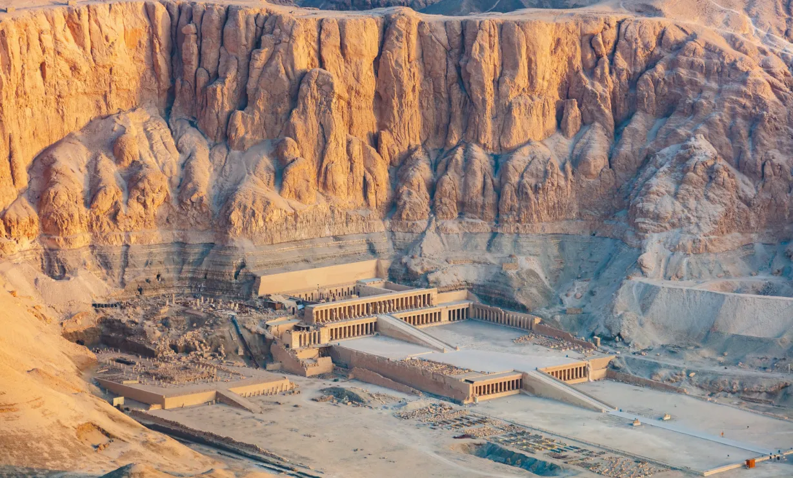

# Điều kiện của nền văn minh
***Định nghĩa—Điều kiện địa chất—Địa lý—Kinh tế—Chủng tộc—Tâm lý—Nguyên nhân sự suy tàn của các nền văn minh***

> <i>**Đền thờ Deir el-Bahri** nhìn từ trên cao, với cấu trúc của còn lại của Mentuhotep phía trước bên trái của Đền thờ Hatshepsut. Ảnh: Diego Delso, delso.photo, CC-BY-SA via Wikicommons </i>   

**Văn Minh** (*civilization*) là trật tự xã hội thúc đẩy sáng tạo văn hóa. Nó được cấu thành bởi bốn yếu tố: **sự cung cấp kinh tế** (*economic provision*), **tổ chức chính trị** (*political organization*), **truyền thống đạo đức** (*moral traditions*), và **sự theo đuổi tri thức và nghệ thuật** (*the persuit of knowledge and the arts*). Nó bắt đầu nơi hỗn loạn và bất an kết thúc. Bởi khi nỗi sợ hãi được chế ngự, sự tò mò và tính xây dựng được tự do, và con người vượt qua được thôi thúc tự nhiên mà hướng tới sự hiểu biết và tô điểm cuộc sống. 

Một số yếu tố có vai trò quyết định có thể khuyến khích hay cản trở nền văn minh. Thứ nhất, điều kiện địa chất. Nền văn minh là khoảng thời gian giữa các kỷ băng hà: bất cứ lúc nào sông băng cũng có thể dâng lên, phủ băng và đá lên các công trình của con người, và thu hẹp sự sống xuống một phần nhỏ của trái đất. Hay sự quái ác của động đất, mà ta chỉ có thể xây dựng thành phố khi không có nó, có thể nhún vai và tiêu diệt ta một cách thờ ơ.

Thứ hai, điều kiện địa lý. Nhiệt độ nóng của vùng nhiệt đới với vô số ký sinh trùng lúc nhúc là kẻ thù của nền văn minh; sự vật vờ và bệnh tật, sự trưởng thành và suy tàn sớm, việc tập trung năng lượng vào những thứ thiết yếu cho cuộc sống tạo nên nền văn minh, và nó được tiêu thụ trong cơn đói và sinh sản; chẳng còn lại gì cho trò chơi của nghệ thuật và trí tuệ. Mưa là cần thiết; vì nước là phương tiện của sự sống, thậm chí còn quan trọng hơn cả ánh sáng mặt trời; sự đỏng đảnh khó hiểu của các yếu tố này có thể khiến các vùng từng thịnh vượng với các đế chế và nền công nghiệp, như Nineveh hay Babylon, bị khô hạn, hoặc có thể giúp các thành phố vốn nằm ngoài tuyến giao thông và liên lạc chính có sức mạnh và sự giàu có nhanh chóng, như Vương quốc Anh hay Puget Sound. Nếu đất đai màu mỡ với thực phẩm hay khoáng chất, nếu sông ngòi tạo ra con đường trao đổi dễ dàng, nếu bờ biển có nhiều bến cảng tự nhiên cho một đội tàu thương mại, nếu trên hết, một quốc gia nằm trên con đường chính của thương mại thế giới, như Athens hay Carthage, Florence hay Venice—khi đó địa lý, mặc dù không bao giờ có thể sinh ra nền văn mình, lại mỉm cười với nó và nuôi dưỡng nó.

Điều kiện kinh tế quan trọng hơn. Một dân tộc có thể sở hữu các thể chế có trật tự, một quy tắc đạo đức cao cả, và thậm chí là năng khiếu về các dạng thức thứ yếu của nghệ thuật, giống như người Anh-điêng bản địa châu Mĩ; nhưng nếu họ vẫn ở giai đoạn săn bắn, nếu họ phụ thuộc vào sự may rủi bấp bênh của cuộc săn đuổi để tồn tại, họ sẽ không bao giờ hoàn toàn chuyển từ chế độ man rợ sang nền văn minh. Một giống dân du mục, giống như người Bedouin ở Ả Rập, có thể cực kỳ thông minh và khỏe mạnh, họ có thể thể hiện những phẩm chất cao quý như lòng dũng cảm, sự hào phóng và cao thượng; nhưng nếu không có điều kiện tiên quyết đơn giản đó của nền văn hóa&mdash;sự liên tục của thức ăn— thì trí thông minh của họ sẽ bị phung phí vào những hiểm nguy của cuộc săn và các mánh khóe buôn bán, và sẽ chẳng còn gì cho những sợi dây buộc và đồ trang trí, sự sùng bái và tiện nghi, nghệ thuật và sự thoải mái, của nền văn minh. Hình thức văn hóa đầu tiên là nông nghiệp. Khi con người định cư để cày ruộng và tích trữ lương thực cho tương lai bất định, thì họ mới tìm thấy thời gian và lý do để trở nên văn minh. Trong vòng an ninh nhỏ bé đó&mdash;nguồn cung cấp nước và thực phẩm đáng tin cậy&mdash;anh ta xây dựng những túp lều, đền thờ và trường học của mình; anh ta phát minh ra các công cụ sản xuất, và thuần hóa chó, lừa, lợn, cuối cùng là chính mình. Anh ta học cách làm việc đều đặn và có trật tự, duy trì cuộc sống lâu dài hơn và truyền lại di sản tinh thần và đạo đức của giống nòi mình một cách hoàn thiện hơn trước.

Văn hóa ám chỉ nông nghiệp, nhưng văn minh ám chỉ thành phố. Một mặt, văn minh là thói quen lịch sự; và lịch sự là sự tinh tế mà những người dân thị trấn, những người tạo ra từ này, nghĩ rằng chỉ có thể có ở các civitas hay thành phố[^1]... Vì trong thành phố, người ta tập hợp lại, dù đúng hay sai, của cải và trí tuệ được tạo ra ở nông thôn; trong thành phố, phát minh và công nghiệp nhân lên sự thoải mái, xa xỉ và giải trí; trong thành phố, các thương nhân gặp gỡ, buôn bán hàng hóa và ý tưởng; trong sự giao thoa giữa các tâm trí trên các ngả đường thương mại, trí thông minh được mài giũa và kích thích thành sức mạnh sáng tạo.

[^1]:

    Từ *civilis* (tiếng Latin *civilis*-*penaining* có nghĩa là *civis* , công dân) tương đối mới. Mặc dù Boswell đề xuất Johnson từ chối thừa nhận nó trong Từ điển của ông vào năm 1771.. ông thích sử dụng từ *civility*!

Ở thành phố, một số người tách khỏi việc sản xuất ra những thứ vật chất, và sản sinh ra khoa học, triết học, văn học và nghệ thuật. Nền văn minh bắt đầu từ túp lều của người nông dân, nhưng nó chỉ nở rộ ở các thị trấn.

Không có điều kiện chủng tộc nào đối với nền văn minh. Nó có thể xuất hiện ở bất kỳ lục địa nào và với bất cứ màu da nào: ở Bắc Kinh hay Delhi, ở Memphis hay Babylon, ở Ravenna hay London, ở Peru hay Yucatan. Không phải chủng tộc vĩ đại nào tạo nên nền văn minh, chính nền văn minh vĩ đại tạo nên con người; hoàn cảnh địa lý và kinh tế tạo nên văn hóa, và văn hóa tạo nên kiểu người. Người Anh không tạo nên nền văn minh Anh, mà chính nền văn minh đó tạo ra anh ta; nếu anh ta mang nền văn minh đó theo mình đến bất cứ nơi nào anh ta đến, và ăn mặc chỉnh tề để ăn tối ở Timbuktu, thì không phải là anh ta đang tạo ra nền văn minh của mình ở đó một lần nữa, mà là anh ta thừa nhận ngay cả ở đó quyền làm chủ của nền văn minh ấy đối với tâm hồn anh ta. Với những điều kiện vật chất như nhau, và một chủng tộc khác sẽ tạo ra những kết quả như nhau; Nhật Bản tái hiện vào thế kỷ 20 như lịch sử của nước Anh vào thế kỷ 19. Nền văn minh chỉ liên quan đến chủng tộc theo nghĩa nó thường diễn ra sau quá trình kết hôn chậm rãi giữa các chủng tộc khác nhau và quá trình đồng hóa dần dần của họ thành một dân tộc tương đối đồng nhất[^2]. Những điều kiện vật lý và sinh học này chỉ là đòi hỏi tiên quyết cho nền văn minh; chúng không cấu thành hay tạo ra nó. Các yếu tố tâm lý tinh tế phải tham gia vào quá trình này. Phải có trật tự chính trị, ngay cả khi nó gần với sự hỗn loạn như ở Florence hay Rome thời Phục hưng; nhìn chung, con người phải cảm thấy rằng họ không phải lúc nào cũng cần tìm đến cái chết hay thuế má. Cần phải có một số sự thống nhất về ngôn ngữ để làm phương tiện trao đổi tinh thần. Thông qua nhà thờ, gia đình, trường học hay bất kỳ nơi nào khác, phải có một quy tắc đạo đức thống nhất&mdash;một số quy tắc của trò đời được công nhận ngay cả bởi những người vi phạm chúng&mdash;và đưa ra để hướng dẫn một số trật tự và luật lệ, một số định hướng và kích thích. Có lẽ cũng cần phải có một số sự thống nhất của niềm tin cơ bản, một số đức tin, siêu nhiên hoặc không tưởng, nâng đạo đức từ toan tính lên tận tụy, và mang lại sự cao quý và ý nghĩa cho đời sống mặc cho sự ngắn ngủi của sinh mạng. Và cuối cùng cần phải có giáo dục&mdash;thông qua một số kỹ thuật, dù thô sơ, để truyền bá văn hóa. Cho dù thông qua bắt chước, khai tâm hay hướng dẫn, dù thông qua cha hay mẹ, giáo viên hay linh mục, hiểu biết và di sản của bộ tộc&mdash;ngôn ngữ và kiến thức, đạo đức và cách cư xử, công nghệ và nghệ thuật&mdash;phải được truyền lại cho thế hệ trẻ, như là chính công cụ mà qua đó họ biến cải từ động vật thành người. Sự biến mất của những điều kiện này&mdash;đôi khi thậm chí chỉ một trong số chúng&mdash;có thể phá hủy một nền văn minh. Một thảm họa địa chất hoặc một sự thay đổi khí hậu hoàn toàn; một dịch bệnh không kiểm soát được như nó đã xóa sổ một nửa dân số của Đế chế La Mã dưới thời Antonines, hay Cái chết đen (Black Death) đã giúp chấm dứt Thời đại phong kiến; sự cạn kiệt của đất đai, hay sự tàn phá nông nghiệp thông qua việc khai thác vùng nông thôn của thành thị, dẫn đến sự phụ thuộc bấp bênh vào nguồn cung cấp thực phẩm từ bên ngoài; sự cạn kiệt tài nguyên thiên nhiên, hoặc nhiên liệu hay nguyên liệu thô; sự thay đổi trong các tuyến đường thương mại, khiến một quốc gia không còn nằm trong tuyến đường chính của thương mại thế giới; sự suy thoái về tinh thần hay đạo đức do những căng thẳng, kích thích và tiếp xúc trong cuộc sống đô thị, do sự phá vỡ các nguồn kỷ luật xã hội truyền thống và việc không có khả năng thay thế chúng; sự suy yếu của dòng dõi do đời sống tình dục hỗn loạn, hoặc do triết lý khoái lạc, bi quan hay ẩn dật; sự suy tàn của giới lãnh đạo do việc thiếu hụt những người có năng lực và quy mô tương đối nhỏ của các gia đình có khả năng để lại di sản văn hóa giống nòi một cách trọn vẹn nhất; sự tập trung của cải một cách bệnh hoạn, dẫn đến chiến tranh giai cấp, các cuộc cách mạng phá hoại và sự kiệt quệ về tài chính: đây là một số cách có thể dẫn đến cái chết của một nền văn minh. Vì nền văn minh không phải là thứ bẩm sinh hay bất diệt; nó phải được tiếp thu lại bởi mỗi thế hệ, và bất kỳ sự gián đoạn nghiêm trọng nào trong việc hỗ trợ hay truyền tải đều có thể khiến nó kết thúc. Con người chỉ khác loài vật ở giáo dục, có thể định nghĩa là kỹ thuật truyền bá nền văn minh.

Nền văn minh là những thế hệ của tâm hồn chủng tộc. Khi sự nuôi dạy trong gia đình, rồi viết lách, gắn kết các thế hệ lại với nhau, truyền lại kiến thức của người sắp chết cho thế hệ trẻ, thì in ấn, thương mại và hàng ngàn cách giao tiếp có thể gắn kết các nền văn minh lại với nhau, và bảo tồn cho các nền văn hóa tương lai tất cả những gì có giá trị đối với họ. Chúng ta, trước khi chết, hãy gom góp di sản của mình lại và trao tặng cho con cháu ta.

[^2]:

    Dòng máu, trái ngược với chủng tộc , có thể ảnh hưởng đến một nền văn minh theo nghĩa một quốc gia có thể bị chậm phát triển hoặc tiến bộ do sinh ra những dòng giống tệ hơn hoặc tốt hơn về mặt sinh học (không phải về mặt chủng tộc) trong số những người dân.

**Tác giả: Will Durant**, một nhà sử học, triết gia Hoa Kì, được biết đến rộng rãi bởi tác phẩm gồm 11 cuốn, Câu chuyện của nền văn minh (*The Story of Civilization*).  Ông đấu tranh cho việc trả lương công bằng, quyền bầu cử của phụ nữ và các điều kiện làm việc tốt hơn cho người lao động Mỹ (theo [Wiki](https://vi.wikipedia.org/wiki/Will_Durant)). Ông đã tìm cách thống nhất và nhân bản hóa khối lượng kiến ​​thức lịch sử đồ sộ, vốn đã trở nên đồ sộ và bị phân mảnh thành các chuyên ngành bí truyền, và làm cho nó trở nên sống động để ứng dụng vào thời đại ngày nay. Nhờ thành công của mình, ông và vợ đã cùng được trao Giải thưởng Pulitzer cho tác phẩm phi hư cấu năm 1968 và Huân chương Tự do của Tổng thống năm 1977 (theo [Will Durant Foundation](https://www.will-durant.com))

Trích dịch [Câu chuyện của nền văn minh](https://archive.org/details/TheStoryOfCivilizationcomplete/Durant_Will_-_The_story_of_civilization_1/), Quyển 1: **Di sản phương Đông của chúng ta**, Phần mở đầu: **Sự thành lập nền văn minh**