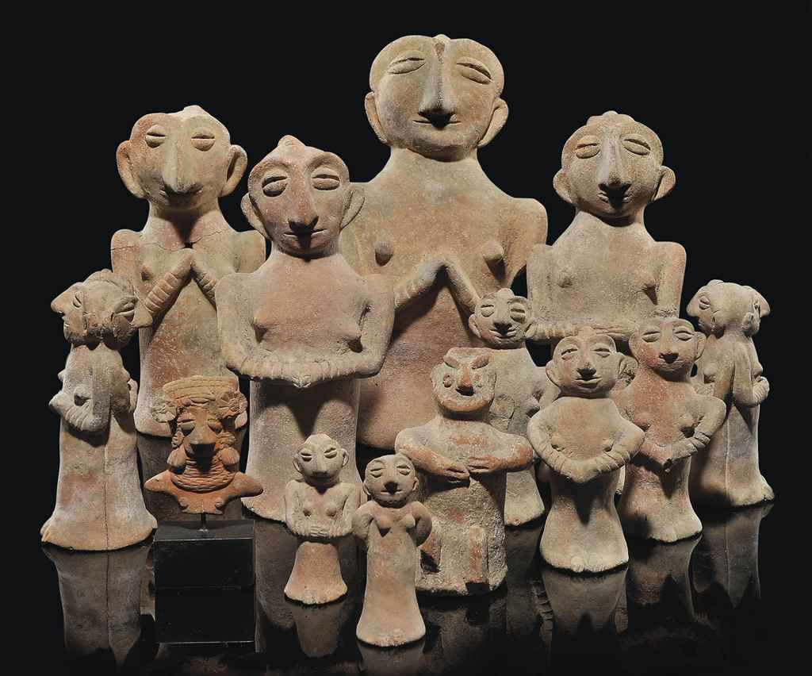

# Các yếu tố đạo đức của nền văn minh

> <i>Một nhóm các tượng đất nung ở Thung lũng Indus, Harappa, phía Bắc Pakistan, 3000 năm TCN</i>

Do không có xã hội nào có thể tồn tại nếu không có trật tự, và không thể có trật tự nếu không có quy định, chúng ta có thể coi đây là một quy luật của lịch sử, rằng sức mạnh của phong tục thay đổi theo tỉ lệ nghịch với sự đa dạng của luật lệ, giống như sức mạnh của bản năng thay đổi theo tỉ lệ nghịc với với sự đa dạng của suy nghĩ. Một số quy tắc là cần thiết cho trò đời; chúng có thể khác nhau đối với các nhóm khác nhau, nhưng trong nội bộ nhóm, về cơ bản chúng phải giống nhau. Những quy tắc này có thể là các quy ước, phong tục, đạo đức hoặc luật lệ. **Các quy ước** (*conventions*) là các hình thức ứng xử được một dân tộc cho là có lợi ích thiết thực; các **phong tục** (*customs*) là các quy ước được các thế hệ kế tiếp chấp nhận, sau quá trình chọn lọc tự nhiên thông qua thử nghiệm và sai sót và loại bỏ; **đạo đức** (*moral*) là những phong tục mà nhóm coi là quan trọng đối với phúc lợi và sự phát triển của mình. Trong các xã hội nguyên thủy, nơi không có luật thành văn, những phong tục hoặc đạo đức quan trọng này điều chỉnh mọi lĩnh vực tồn tại của con người và mang lại sự ổn định và liên tục cho trật tự xã hội . Thông qua phép thuật chậm rãi của thời gian, những phong tục như vậy, thông qua sự lặp lại lâu dài, trở thành một 'bản chất thứ hai trong cá nhân; nếu anh ta vi phạm chúng, anh ta cảm thấy một nỗi sợ hãi, khó chịu hoặc xấu hổ nhất định; đây là nguồn gốc của lương tâm, hay ý thức đạo đức, mà Darwin đã chọn là sự phân biệt ấn tượng nhất giữa động vật và con người: Trong sự phát triển cao hơn của nó, lương tâm là ý thức xã hội - cảm giác của cá nhân rằng anh ta thuộc về một nhóm, và nợ nó một số biện pháp trung thành và cân nhắc. Đạo đức là sự hợp tác của một phần với toàn thể, và của mỗi nhóm với một tổng thể lớn hơn. Tất nhiên, nền văn minh sẽ không thể tồn tại nếu không có nó.

## I. Hôn nhân
         
***Ý nghĩa của hôn nhân—Nguồn gốc sinh học của nó—Chủ nghĩa cộng sản tình dục—Hôn nhân thử nghiệm—Hôn nhân tập thể—Hôn nhân cá nhân—Đa thê—Giá trị ưu sinh của nó—Hôn nhân ngoại tộc—Hôn nhân theo chế độ phục vụ—Hôn nhân thông qua bắt giữ—Hôn nhân thông qua mua bán—Tình yêu nguyên thủy—Chức năng kinh tế của hôn nhân***

Nhiệm vụ đầu tiên của những phong tục tạo nên quy tắc đạo đức của một nhóm là điều chỉnh các mối quan hệ giữa các giới tính, vì đây là nguồn gốc lâu đời của bất hòa, bạo lực và sự thoái hóa giống nòi có thể diễn ra. Hình thức cơ bản của việc chỉnh đốn quan hệ tình dục là hôn nhân, có thể được định nghĩa là sự kết hợp của những người bạn đời để chăm sóc con cái. Đây là một thiết chế đầy dao động và biến đổi, đã trải qua hầu hết mọi hình thức và thử nghiệm có thể hình dung được trong quá trình lịch sử của nó, từ việc chăm sóc con cái nguyên thủy mà không có sự chung tay của bạn đời đến việc kết đôi với những người bạn đời trong thời hiện đại mà không chăm sóc của con cái.
Các loài động vật tổ tiên của chúng ta đã phát minh ra nó. Một số loài chim dường như sống như những người bạn tình sinh sản trong chế độ một vợ một chồng không bao giờ ly hôn. Trong số các loài khỉ đột và đười ươi, mối quan hệ giữa cha mẹ tiếp tục cho đến cuối mùa sinh sản và có nhiều đặc điểm của con người. Bất kỳ hành vi nào giống như buông thả của con cái đều bị con đực trừng phạt nghiêm khắc . De Crespigny cho biết, đười ươi ở Borneo “sống theo gia đình: con đực, con cái và một con non”; và Tiến sĩ Savage báo cáo về loài khỉ đột rằng “không có gì lạ khi thấy ‘những con già’ ngồi dưới gốc cây tự thưởng cho mình bằng trái cây và cuộc trò chuyện thân mật, trong khi con cái của chúng nhảy nhót xung quanh và đu từ cành này sang cành khác trong niềm vui náo nhiệt”. Hôn nhân còn lâu đời hơn cả loài người.

Rất hiếm xã hội không có hôn nhân, nhưng người nghiên cứu kỹ lưỡng có thể tìm thấy đủ những xã hội như thế để thiết lập một bước chuyển đáng kể từ sự bừa bãi của các loài động vật có vú cấp thấp cho đến hôn nhân của những người nguyên thủy. Ở Futuna và Hawaii, phần lớn người dân không kết hôn; người Lubus giao phối tự do và không phân biệt, và không có khái niệm về hôn nhân; một số bộ lạc ở Borneo sống trong sự giao phối không hôn nhân, tự do hơn cả loài chim; và trong số một số dân tộc ở nước Nga nguyên thủy , “đàn ông sử dụng phụ nữ mà không phân biệt, vì vậy không có người phụ nữ nào có một chồng trên danh nghĩa.” Người lùn châu Phi được mô tả là không có chế độ hôn nhân nào, mà tuân theo “bản năng động vật hoàn toàn không bị kiềm chế”. Việc “quốc hữu hóa phụ nữ” nguyên thủy này, tương ứng với chủ nghĩa cộng sản nguyên thủy về đất đai và thực phẩm, đã qua đi ở giai đoạn quá sớm đến nỗi hầu như không còn dấu vết nào của nó. Tuy nhiên, một số ký ức về nó vẫn còn tồn tại dưới nhiều hình thức khác nhau: trong cảm nhận của nhiều dân tộc sống trong tự nhiên rằng chế độ một vợ một chồng—mà họ định nghĩa là phụ nữ bị độc quyền bởi một người đàn ông—là không tự nhiên và vô đạo đức; trong các lễ hội định kỳ về sự phóng túng (vẫn còn tồn tại yếu ớt trong ngày Mardi Gras của chúng ta), khi những hạn chế về tình dục tạm thời bị bãi bỏ; trong đòi hỏi một người phụ nữ nên hiến thân—như tại Đền Mylitta ở Babylon—cho bất kỳ người đàn ông nào cầu hôn cô ấy, trước khi cô ấy được phép kết hôn; trong phong tục cho mượn vợ,  một điều thiết yếu trong nhiều quy tắc hiếu khách nguyên thủy; và trong jus primce noctis, hay quyền đêm đầu tiên, theo đó, ở châu Âu thời đầu phong kiến, lãnh chúa của trang viên, có lẽ đại diện cho các quyền cổ xưa của bộ lạc, thỉnh thoảng phá trinh cô dâu trước khi chú rể được phép hoàn tất đêm tân hôn.

Nhiều cuộc hôn nhân thử nghiệm dần dần thay thế cho những mối quan hệ không phân biệt. Trong số những người Orang Sakai ở Malacca, một cô gái ở với mỗi người đàn ông trong bộ tộc một thời gian, chuyển từ người này sang người khác cho đến khi cô ấy đi hết một vòng; sau đó cô ấy bắt đầu lại. Trong số những người Yakuts ở Siberia, người Botocudos ở Nam Phi, các giai cấp thấp hơn của Tây Tạng và nhiều dân tộc khác, hôn nhân mang tính thử nghiệm khá nhiều và có thể chấm dứt theo ý muốn của một trong hai bên, không cần đưa ra lý do hay đòi hỏi nào. Trong số những người thổ dân Nam Phi (Bushmen), “bất kỳ sự bất đồng nào cũng đủ để chấm dứt một cuộc hôn nhân và cả hai có thể ngay lập tức tìm thấy những mối quan hệ mới”. Trong số những người Damaras, theo Sir Francis Galton, “người phối ngẫu được thay đổi gần như hàng tuần và tôi hiếm khi biết được nếu tôi không hỏi xem ai là chồng tạm thời của mỗi người phụ nữ tại bất kỳ thời điểm cụ thể nào”. Trong số những người Baila, “phụ nữ được trao đổi từ người đàn ông này sang người đàn ông khác và tự nguyện rời bỏ một người chồng này để đến với người chồng khác. Những cô gái trẻ mới chỉ ngoài tuổi thiếu niên thường có bốn hoặc năm người chồng, tất cả đều vẫn còn sống.” Từ gốc để chỉ hôn nhân, ở Hawaii, có nghĩa là thử. Trong số những người Tahiti, một thế kỷ trước, các cuộc hôn nhân là tự do và có thể giải thể tùy ý, miễn là không có con; nếu một đứa trẻ ra đời, cha mẹ có thể phá bỏ nó mà không bị xã hội chỉ trích, hoặc cặp đôi có thể nuôi dạy đứa trẻ và bước vào một mối quan hệ lâu dài hơn; người đàn ông đã cam kết hỗ trợ người phụ nữ để đổi lấy gánh nặng thực hiện chăm sóc con mà cô ấy hiện đang đảm nhận.

Marco Polo viết về một bộ tộc Trung Á sinh sống ở Peyn (nay là Keriya) vào thế kỷ thứ mười ba: “Nếu một người đàn ông đã kết hôn phải đi xa nhà trong hai mươi ngày, nếu muốn , vợ anh ta có quyền lấy một người chồng khác; và những người đàn ông, theo nguyên tắc tương tự, có thể kết hôn ở bất cứ nơi nào họ cư trú.” Những cải tiến mới nhất trong hôn nhân và nền đạo đức [mà chúng ta thấy ngày nay] [thực chất] đã quá cũ kỹ .

Letourneau nói về hôn nhân rằng “mọi thử nghiệm có thể có tương thích với thời gian tồn tại của xã hội hoang dã hay mọi rợ đã được thử nghiệm, hoặc vẫn đang được thực hiện, giữa nhiều chủng tộc khác nhau , mà không hề nghĩ đến những ý tưởng đạo đức thường thịnh hành ở châu Âu.” Ngoài các thử nghiệm về tính dài lâu, còn có các thử nghiệm về mối quan hệ. Trong một số trường hợp, chúng ta thấy “hôn nhân theo nhóm”, theo đó một số người đàn ông thuộc một nhóm kết hôn tập thể với một số người phụ nữ thuộc một nhóm khác. Ví dụ , ở Tây Tạng, theo phong tục , một nhóm anh em trai sẽ kết hôn với một nhóm chị em gái, và hai nhóm thực hành chế độ tình dục cộng sản giữa họ, mỗi người đàn ông chung sống với mỗi người phụ nữ.” Caesar đã mô tả một phong tục tương tự ở Anh thời cổ xưa. Những tàn tích của nó xuất hiện trong “levirate”, một phong tục tồn tại trong những người Do Thái đầu tiên và các dân tộc cổ đại khác, theo đó một người đàn ông có nghĩa vụ phải kết hôn với góa phụ của anh trai mình ; đây là quy tắc khiến Onan (con trai thứ hai của Judah) rất khó chịu.

Điều gì đã khiến đàn ông thay thế của xã hội nguyên thủy gần như hỗn tạp bằng hôn nhân cá nhân? Vì trong phần lớn các dân tộc sống trong tự nhiên có rất ít sự hạn chế đối với quan hệ trước hôn nhân, rõ ràng là ham muốn thể xác không dẫn đến chế độ hôn nhân. Đối với hôn nhân, với những hạn chế và sự kích thích về mặt tâm lý, không thể cạnh tranh với chủ nghĩa cộng sản tình dục như một phương thức thỏa mãn khuynh hướng tình dục của đàn ông. Ngay từ đầu, chế độ hôn nhân này cũng không thể cung cấp bất kỳ phương thức nuôi dạy con cái nào tốt hơn rõ rệt so với việc nuôi dạy chúng bởi người mẹ, gia đình và gia tộc người ấy. Một số động cơ kinh tế mạnh mẽ hẳn đã ủng hộ sự tiến hóa của hôn nhân. Rất có thể (một lần nữa chúng ta phải tự nhắc mình rằng thực sự chúng ta biết rất ít về nguồn gốc của chúng) những động cơ này có liên quan đến sự gia tăng của chế độ sở hữu.

Hôn nhân cá thể xuất phát từ mong muốn của người đàn ông muốn có nô lệ giá rẻ và tránh việc truyền lại tài sản cho con cái của người đàn ông khác. Đa phối, hay việc một người kết hôn với nhiều người bạn đời, xuất hiện đây đó dưới hình thức đa phu—việc một người phụ nữ kết hôn với nhiều người đàn ông—như trong bộ tộc Todas và một số bộ tộc ở Tây Tạng; “tục lệ này vẫn có thể được tìm thấy ở những nơi mà số lượng nam giới nhiều hơn đáng kể so với nữ giới.” Nhưng tục lệ này sớm trở thành nạn nhân của những người đàn ông thích chinh phục, và đối với chúng ta, chế độ đa phối thường hầu như được gọi là chế độ đa thê—một người đàn ông sở hữu nhiều vợ. Các nhà thần học thời Trung cổ nghĩ rằng Mohammed đã phát minh ra chế độ đa thê, nhưng nó đã có trước Hồi giáo nhiều năm, là chế độ hôn nhân thịnh hành ở thế giới nguyên thủy.” Nhiều nguyên nhân đã kết hợp lại làm cho nó trở nên phổ biến. Trong xã hội ban đầu, vì săn bắn và chiến tranh, cuộc sống của nam giới trở nên bạo lực và nguy hiểm hơn, và tỷ lệ tử vong của nam giới cao hơn so với phụ nữ. Sự dư thừa phụ nữ sau đó thúc đẩy một lựa chọn giữa chế độ đa thê và việc sống độc thân không con của một số ít phụ nữ; nhưng sự độc thân như vậy là không thể chấp nhận được đối với những người cần tỷ lệ sinh cao để bù đắp cho tỷ lệ tử vong cao, và vì thế người ta khinh thường những người không có bạn đời và không con. Một lần nữa, đàn ông thích sự đa dạng; như người da đen ở Angola đã nói, họ “không thể luôn ăn cùng một món ăn.” Ngoài ra, đàn ông thích sự trẻ trung ở bạn đời của họ, và phụ nữ già đi nhanh chóng trong các cộng đồng nguyên thủy. Bản thân phụ nữ thường ủng hộ chế độ đa thê; nó cho phép họ nuôi con lâu hơn, và do đó giảm tần suất làm mẹ mà không ảnh hưởng đến khuynh hướng tình dục và thích nhiều con của nam giới. Đôi khi, người vợ đầu tiên, với gánh nặng công việc, giúp chồng kiếm thêm một người vợ nữa, để gánh nặng của bà có thể được san sẻ, và việc có thêm những đứa con nữa có thể nâng cao sức sản xuất và sự giàu có của gia đình. Con cái là tài sản kinh tế, và đàn ông đầu tư vào vợ để có con cái từ họ như lãi suất. Trong chế độ gia trưởng, vợ và con cái thực chất là nô lệ của người đàn ông; một người đàn ông càng có nhiều vợ, anh ta càng giàu. Người đàn ông nghèo thực hành chế độ một vợ một chồng, nhưng anh ta coi đó là một tình trạng đáng xấu hổ, từ đó một ngày nào đó anh ta sẽ vươn lên vị trí được kính trọng của một người đàn ông đa thê.

Không còn nghi ngờ gì nữa, chế độ đa thê đã thích nghi tốt với nhu cầu hôn nhân của một xã hội nguyên thủy mà phụ nữ đông hơn đàn ông. Nó có giá trị ưu sinh cao hơn chế độ một vợ một chồng hiện đại; vì trong khi ở xã hội hiện đại, những người đàn ông có năng lực nhất và thận trọng nhất kết hôn muộn nhất và có ít con nhất, thì theo chế độ đa thê, những người đàn ông có năng lực nhất, có lẽ, đã tìm được những người bạn đời tốt nhất và có nhiều con nhất. Do đó, chế độ đa thê đã tồn tại trong hầu hết các dân tộc sống trong tự nhiên, thậm chí trong phần lớn văn minh nhân loại; chỉ đến thời đại của chúng ta , nó mới bắt đầu chết ở phương Đông. Tuy nhiên, một số điều kiện đã ngăn cản nó. Những nguy hiểm và bạo lực thuyên giảm, vốn là hệ quả của cuộc sống nông nghiệp ổn định, đã đưa các giới tính tiến tới sự bình đẳng về số lượng; và trong những hoàn cảnh này, chế độ đa thê công khai, ngay cả trong các xã hội nguyên thủy, đã trở thành đặc quyền của thiểu số thịnh vượng. Phần lớn dân chúng thực hành chế độ một vợ một chồng kiềm chế việc ngoại tình, trong khi một thiểu số khác, những người độc thân một cách tự nguyện hay hối tiếc, cân bằng với chế độ đa thê của người giàu. Sự ghen tuông ở nam giới và tính chiếm hữu ở nữ giới đã xâm nhập vào tình hình này một cách hiệu quả hơn khi các giới tính xấp xỉ nhau về mợi số lượng; do ở nơi mà những người mạnh mẽ không thể có nhiều vợ ngoại trừ việc chiếm đoạt một người đang hay có thể là vợ của người khác, và trong một số trường hợp qua việc xúc phạm vợ của chính họ, chế độ đa thê trở nên khó khăn, vấn đề mà chỉ những người thông minh nhất mới có thể giải quyết được. Khi tài sản được tích lũy, và đàn ông không muốn phân chia nó thành những di chúc nhỏ, thì việc phân chia vợ thành “vợ chính” và thê thiếp được mong mỏi, sao cho chỉ những đứa con của người vợ trước mới được chia tài sản; đây vẫn là tình trạng hôn nhân ở Châu Á cho đến thế hệ của chúng ta. Dần dần, người vợ chính trở thành người vợ duy nhất, các thê thiếp trở thành những người phụ nữ được giữ bí mật và tách biệt, hoặc họ biến mất; và khi Cơ đốc giáo xuất hiện, chế độ một vợ một chồng ở Châu Âu đã thay thế chế độ đa thê như một hình thức phối hợp tình dục hợp pháp và công khai. Nhưng chế độ một vợ một chồng, giống như chữ viết và nhà nước, là nhân tạo và thuộc về lịch sử, không phải nguồn gốc của nền văn minh.

Trong bất kể hình thức phối ngẫu nào, hôn nhân là bắt buộc đối với hầu hết các dân tộc nguyên thủy. Người đàn ông chưa kết hôn không có địa vị trong cộng đồng, hoặc chỉ được coi là một nửa của một người đàn ông. Hôn nhân ngoại huyết cũng là bắt buộc: nghĩa là một người đàn ông được mong đợi sẽ tìm được vợ mình từ một gia tộc khác ngoài gia tộc của mình. Cho dù phong tục này phát sinh vì tâm trí nguyên thủy nghi ngờ những tác động xấu của việc kết hôn cận huyết, hay vì những cuộc hôn nhân giữa các nhóm như vậy đã tạo ra hoặc củng cố các liên minh chính trị hữu ích, thúc đẩy tổ chức xã hội và giảm nguy cơ chiến tranh, hay vì việc bắt vợ từ một bộ tộc khác đã trở thành dấu hiệu thời thượng của sự trưởng thành của nam giới, hay vì sự quen thuộc gây ra sự khinh thường và khoảng cách đem lại sự thích thú cho quan điểm này—chúng ta không biết chính xác câu trả lời.

Trong mọi trường hợp, hạn chế [trong việc kết hôn] này gần như phổ biến trong xã hội sơ khai; và mặc dù nó đã bị các Pharaoh, Ptolemy và người Inca vi phạm thành công—tất cả đều ủng hộ hôn nhân giữa anh chị em ruột—nhưng nó vẫn tồn tại trong luật La Mã và luật hiện đại và định hình hành vi của chúng ta một cách chủ ý hay vô thức cho đến ngày nay.

Người đàn ông đã̉ bảo vệ vợ mình từ một bộ tộc khác như thế nào? Khi chế độ mẫu hệ hiện diện mạnh mẽ, anh ta thường được yêu cầu đến sống với gia tộc của cô gái mà anh ta theo đuổi. Khi chế độ gia trưởng phát triển, người cầu hôn sau một thời gian phục vụ cho cha được phép đưa cô dâu trở về gia tộc của mình; vì vậy, Jacob đã phục vụ Laban để lấy Leah và Rachel (trong Sáng thế kí). Đôi khi người cầu hôn rút ngắn vấn đề bằng vũ lực rõ ràng, thằng thừng. Đó là một lợi thế cũng như một sự khác biệt khi đánh cắp một người vợ; cô không chỉ là một nô lệ giá rẻ, mà còn có thể sinh ra những nô lệ mới và những đứa trẻ này sẽ trói buộc cô vào chế độ nô lệ. Những cuộc hôn nhân bằng cách bắt cóc như vậy, mặc dù không phải là quy luật, đã xảy ra rải rác trong thế giới nguyên thủy. Trong số những người da đỏ Bắc Mỹ, phụ nữ được gộp trong chiến lợi phẩm của chiến tranh, và điều này xảy ra thường xuyên đến nỗi ở một số bộ lạc, những người chồng và vợ nói với nhau những ngôn ngữ không thể hiểu được. Người Xlavơ ở Nga và ở Serbia đã thực hành hôn nhân theo kiểu bắt cóc cho đến tận thế kỷ trước.1 Dấu tích của nó vẫn còn lại trong phong tục mô phỏng cảnh chú rể bắt cô dâu trong một số nghi lễ cưới. Nhìn chung , đó là khía cạnh hợp lý của cuộc chiến tranh liên miên giữa các bộ lạc, và là điểm khởi đầu hợp lý cho cuộc chiến tranh dài lâu giữa các giới tính mà sự đình chiến chỉ là những dạ khúc và giấc ngủ say.

Khi của cải tăng lên, việc tặng cho người cha một món quà lớn—hoặc một khoản tiền—để cưới con gái của ông trở nên tiện lợi hơn, thay vì phục vụ cho cô trong một ngoại tộc, hay mạo hiểm với bạo lực và thù hận có thể phát sinh từ cuộc hôn nhân thông qua bắt cóc. Do đó, hôn nhân thông qua mua bán và sự sắp xếp của cha mẹ là quy tắc trong các xã hội sơ khai. Các hình thức chuyển tiếp xuất hiện; người Melanesia đôi khi bắt cóc vợ của họ, nhưng hợp pháp hóa hành vi trộm cắp bằng cách thanh toán sau đó cho gia đình cô. Trong một số người bản địa ở New Guinea, người đàn ông đã bắt cóc người con gái, và rôì khi anh và cô ta đang trốn, đã nhờ bạn bè của mình mặc cả với cha cô về giá mua. Việc phẫn nộ về mặt đạo đức trong những vấn đề này có thể được xoa dịu dễ dàng về mặt tài chính đã được làm điều sáng tỏ. Một người mẹ Maori, than khóc lớn tiếng, cay đắng nguyền rủa chàng trai đã bỏ trốn cùng con gái mình, cho đến khi được anh ta tặng một chiếc chăn. “Đó là tất cả những gì tôi muốn”, bà nói; “Tôi chỉ muốn có một cái chăn, và do đó đã tạo ra tiếng động này.” Thường thì giá cô dâu cao hơn một cái chăn: trong số những người Hottentot, giá của cô dâu là một con bò đực hoặc một con bò cái; trong số những người Croo, giá của cô dâu là ba con bò cái và một con cừu; trong số những người Kafir, giá của cô dâu là sáu đến ba mươi con gia súc, tùy thuộc vào thứ hạng của gia đình cô gái; và trong số những người Togo, giá của cô dâu là mười sáu đô la tiền mặt và sáu đô la hàng hóa.

Hôn nhân thông qua mua bán phổ biến khắp châu Phi, và vẫn là một chế độ bình thường ở Trung Quốc và Nhật Bản; nó phát triển mạnh ở Ấn Độ cổ đại và Judea, và ở Trung Mỹ và Peru thời tiền Columbus ; các trường hợp như vậy vẫn xảy ra ở châu Âu ngày nay. Đó là sự phát triển tự nhiên của các chế độ gia trưởng; người cha sở hữu con gái và có thể tống cô đi đâu tùy ý trong phạm vi rộng lớn. Người da đỏ Orinoco đã diễn đạt vấn đề này bằng cách nói rằng người cầu hôn phải trả tiền cho người cha để nuôi dưỡng cô gái để anh ta sử dụng. Đôi khi cô gái được giới thiệu với những người cầu hôn tiềm năng trong một buổi trình diễn cô dâu; vì vậy trong số những người Somali, cô dâu được phủ đầy trang sức, được dắt đi trên lưng ngựa hay đi bộ, trọng một không khí sực nức mùi hương để kích thích những kẻ theo đuổi trả giá hào phóng. Không có ghi chép nào về việc phụ nữ phản đối hôn nhân thông qua mua bán; ngược lại, họ lấy làm tự hào về số tiền trả cho họ,  và khinh bỉ phụ nữ nào đi kết hôn mà chẳng đưa ra giá; họ tin rằng một cuộc “ghép đôi”, người đàn ông hung hăng lợi lộc quá nhiều mà họ chẳng phải trả gì. Ngược lại, đã thành thông lệ, người cha chấp nhận khoản tiền của chú rể bằng việc trao lại một món quà, theo thời gian thường có giá trị nhỉnh hơn nhiều khoản hỏi cưới vợ.  Những người cha giàu có, vì lo nghĩ làm sao trau chuốt đường đi cho những người con gái, dần dà gia tăng giá trị quà tặng cho đến khi tập tục của hồi môn được thiết lập; và việc mua rể bởi người cha đã thay thế, hay đồng hành với, việc mua vợ của những người cầu hôn.  

Trong tất cả các hình thức và thể loại hôn nhân, gần như không có dấu vết của tình yêu lãng mãn. Chúng tôi tìm thấy một vài trường hợp về hôn nhân dựa trên tình yêu giữa những người Papuans ở New Guinea; trong các dân tộc nguyên thuỷ, chũng tôi bắt gặp những thí dụ về tình yêu (theo nghĩa dâng hiến cho nhau hơn là nhu cầu cần nhau), nhưng thường thường, những quyến luyến này chẳng liên quan gì với hôn nhân. Ngày ấy, người ta lấy nhau vì cần lao động giá rẻ, [bảo tồn] dòng dõi sinh lợi, và các bữa ăn thường xuyên. “Ở Yariba,” Lander nói, “hôn nhân được tôn vinh bởi những người thổ dân là hình thức vô cùng vô tư; một người đàn ông xem việc lấy vợ chẳng khác nào cắt  một bắp ngô—cảm giác yêu mến chẳng phải vấn đề cần bận tâm.” Vì những quan hệ trước hôn nhân đã thừa thãi trong xã hội nguyên thuỷ, sự đam mê không bị sự từ chối ngăn chặn và hiếm khi ảnh hưởng đến việc chọn vợ. Với lí do tương tự—không có sự chậm trễ giữa việc khát khao và hưởng thụ—chẳng ai dành thời gian cho những nội tưởng  trầm ngâm tuyệt vọng, và vì thế chẳng có việc lí tưởng hoá—sự đam mê thường là nguồn gốc cho tình yêu lãng mạn thời tuổi trẻ. Thứ tình yêu ấy được dành cho các nền văn minh phát triển, nơi đạo đức đã nâng cao các giới hạn dành cho sự khao khát, và việc tăng trưởng tải sản đã cho phép một số đàn ông có đủ điều kiện và một vài phụ nữ có thể chu cấp cho sự lãng mạn xa xỉ và thanh nhã; những người nguyên thuỷ quá nghèo để lãng mạn. Người ta hiếm khi tìm thấy thơ tình trong các bài hát của họ. Khi những người truyền giáo dịch kinh Thánh sang ngôn ngữ của người Algonquins, nọ khám phá ra không có từ địa phương tương đương với từ “tình yêu”. Nhưng người Hottentots được mô tả là “lạnh nhạt và thờ ơ với nhau” trong hôn nhân. Trên Bờ biển Vàng “chẳng thấy xuất bất cứ cảm xúc nào thể hiện giữa chồng và vợ”; và điều tương tự xảy ra ở nguyên thuỷ châu Úc. “Tôi đã hỏi Baba,” Caillié nói về người da đen Senegal, “tại sao anh không dành một lúc nào đó vui đùa với những người vợ của mình. Anh ta trả lời, nếu anh làm vậy thì chẳng thể quan lí nổi họ.” Thổ dân châu Úc, khi được hỏi tại sao anh muốn kết hôn, trả lời thẳng thắn rằng anh muốn lấy vợ để bảo đảm lương thực, nước và củi cho anh, để mang vác những vật tuỳ thân của anh trên đường đi. Nụ hôn, được xem là không thể thiếu ở Hoa Kì, là điều khá kì lạ đối với các dân tộc nguyên thuỷ,  hay chỉ nhận được sự khinh rẻ.

Nói chung, người “man rợ” thản nhiên với tình dục, gần như chẳng có nỗi lo âu siêu hình học hay thần học nào hơn so với các loài động vật; người ta không đăm chiêu về nó, hay chẳng điên tiết với nó; người ta đối xử với nó như với vấn đề thức ăn. Người ta không giả bộ có những động cơ về lí tưởng. Hôn nhân chưa bao giờ là lời thề nguyền với họ, và hiếm khi là một sự vụ có nhiều nghi thức lãng phí;  nó rành giọt là một trao đổi thương mại. Người ta chẳng cảm thấy hổ thẹn hay lệ thuộc vào những suy tính cảm xúc và thực tiễn khi chọn bạn đời; anh ta thà xấu hổ với điều ngược lại, và đòi hỏi chúng ta—nếu người ta cũng không khiêm nhường như chúng ta—phải giải thích về phong tục gắn bó một người đàn ông và một người phụ nữ với nhau gần như cả đời vì khao khát tình dục đã xích họ lại trong một giây phút sét đánh. Người đàn ông nguyên thuỷ xem hôn nhân không phải là giấy phép tình dục mà là một sự hợp tác kinh tế. Anh ta đòi hỏi người phụ nữ—và người phụ nữ cũng đòi hỏi ở chính mình—không cần quá đẹp và thanh lịch (dù anh đánh giá cao những phẩm chất này ở cô) nhưng quan trọng là chăm chỉ và có năng lực; cô ấy cần là một tài sản kinh tế hơn là một thiệt hại hoàn toàn; nếu không thì người “man rợ” cũng đã chẳng bao giờ nghĩ đến hôn nhân. Hôn nhân là một quan hệ đối tác có lợi, không phải một sự truỵ lạc cá nhân; đó là cách một người đàn ông và một người đàn bà làm việc chung tỏ ra có lợi hơn là làm việc một mình. Bất cứ khi nào, trong lịch sử của nền văn minh, người phụ nữ ngừng trở thành một tài sản kinh tế trong hôn nhân, hôn nhân đã trở nên suy tàn; và có lúc, nên văn mình cũng suy tàn theo nó.

## II. Đạo đức tình dục

***Quan hệ trước hôn nhân—Mại dâm—Sự trong trắng—Trinh tiết[*](https://chastity.com/qa/is-chastity-the-same-thing-as-virginity/https://chastity.com/qa/is-chastity-the-same-thing-as-virginity/)—Tiêu chuẩn kép—Khiêm tốn—Tính tương đối của đạo đức—Vai trò sinh học của sự khiêm tốn—Ngoại tình—Ly hôn—Phá thai—Giết trẻ sơ sinh—Tuổi thơ—Cá nhân***

Nhiệm vụ lớn nhất của đạo đức luôn là điều chỉnh tình dục; vì bản năng sinh sản tạo ra các vấn đề không chỉ trong hôn nhân, mà còn trước và sau hôn nhân, và đe dọa làm xáo trộn trật tự xã hội bất cứ lúc nào với sự dai dẳng, cường độ, sự khinh thường luật pháp và sự đồi trụy của nó. Vấn đề đầu tiên liên quan đến quan hệ trước hôn nhân—chúng sẽ bị hạn chế hay được tự do? Ngay cả giữa các loài động vật, tình dục cũng không hoàn toàn không bị kiềm chế; sự từ chối con đực bởi con cái, ngoại trừ trong thời kỳ động dục, hạn chế vai trò tình dục ở một mức độ khiêm tốn hơn nhiều trong thế giới động vật so với vai trò của nó trong loài người phóng đãng. Như Beaumarchais đã nói, con người khác với động vật ở chỗ ăn mà không đói, uống mà không khát và làm tình vào mọi mùa. Trong số những người nguyên thủy, chúng ta tìm thấy một vài hạn chế tương tự hay tương phản từ động vật, nơi điều cấm kỵ được đặt ra trong quan hệ với một người phụ nữ suốt thời kỳ kinh nguyệt của cô ta. Trừ ngoại lệ chung này, quan hệ tình dục trước hôn nhân phần lớn được tự do trong các xã hội giản đơn nhất. Trong số những người da đỏ Bắc Mỹ, những người đàn ông và phụ nữ trẻ tuổi giao phối tự do; và những mối quan hệ này không bị coi là trở ngại đối với hôn nhân. Trong số những người Papual ở New Guinea, đời sống tình dục bắt đầu từ độ tuổi rất sớm, và quan hệ tình dục bừa bãi trước hôn nhân là qui luật. Tự do quan hệ trước hôn nhân tương tự đã diễn ra trong số những người Soyots ở Siberia, người Igorots ở Philippines, người bản địa ở Thượng Miến Điện, người Kafir và Bushmen ở Châu Phi, các bộ lạc ở Niger và Uganda, ở New Georgia, Quần đảo Murray, Quần đảo Andaman, Tahiti, Polynesia , Assam, v.v.

Trong những điều kiện như vậy, chúng ta không thể mong đợi tìm thấy mại dâm trong xã hội nguyên thủy. “Nghề [được xem là] lâu đời nhất” tương đối non trẻ; nó chỉ phát sinh cùng với nền văn minh, với sự xuất hiện của tài sản và sự biến mất của tự do quan hệ trước hôn nhân. Ở đâu đó, chúng ta thấy các cô gái bán mình trong một thời gian để kiếm của hồi môn, hoặc để chu cấp quĩ cho các ngôi đền; nhưng điều này chỉ xảy ra khi quy tắc đạo đức địa phương chấp thuận nó như một sự hy sinh ngoan đạo để giúp đỡ cha mẹ nghèo khó hay các thần linh đói khát.

Sự trong trắng là sự phát triển tương ứng muộn màng. Điều khiến các trinh nữ nguyên thuỷ sợ hãi không phải là mất đi sự trinh tiết, mà là điều tiếng về việc vô sinh; mang thai trước hôn nhân thường hỗ trợ hơn là cản trở việc tìm kiếm một người chồng, vì nó giải quyết mọi nghi ngờ về việc vô sinh, và hứa hẹn những đứa con có ích. Các bộ lạc giản dị hơn, trước sự ra đời quyền tài sản, dường như đã coi thường trinh tiết, tỏ ra không mấy được ưa chuộng. Chú rể người Kamchadal (ở Nga) nào phát hiện ra cô dâu của mình còn trinh tiết rất tức giận và “đã lăng mạ mẹ cô vì cách nuôi dạy con gái cẩu thả của bà”. Ở nhiều nơi, trinh tiết được coi là rào cản đối với hôn nhân, vì nó đặt lên vai người chồng nhiệm vụ khó chịu là vi phạm điều cấm kỵ cấm anh ta làm đổ máu của bất kỳ thành viên nào trong bộ tộc của mình . Đôi khi các cô gái tự hiến thân cho một người lạ để phá vỡ điều cấm kỵ này đối với cuộc hôn nhân của họ. Ở Tây Tạng, các bà mẹ lo lắng tìm kiếm những người đàn ông sẽ phá trinh con gái mình; ở Malabar, chính các cô gái đã cầu xin sự giúp đỡ của những người qua đường vì mục đích tương tự, “vì trong khi còn là trinh nữ họ không thể tìm được chồng.” Ở một số bộ lạc, cô dâu buộc phải hiến thân cho khách dự tiệc cưới trước khi đến với chồng; ở những bộ lạc khác, chú rể thuê một người đàn ông để phá bỏ sự trinh trắng của cô dâu; trong một số bộ lạc ở Philippines, một viên chức đặc biệt được bổ nhiệm, với mức lương cao, để thực hiện chức năng này cho những người chồng tương lai.”

Điều gì đã thay đổi sự trinh tiết từ một lỗi lầm thành một đức hạnh, và biến nó thành một yếu tố trong các quy tắc đạo đức của tất cả các nền văn minh cao hơn? Không nghi ngờ gì nữa, đó là thể chế về tài sản. Sự trong trắng trước hôn nhân xuất hiện như một phát triển, đối với những người con gái, của cảm giác sở hữu mà người đàn ông gia trưởng dành cho vợ mình. Giá trị của trinh tiết tăng lên—trong hôn nhân thông qua mua bán—khi cô dâu trong trắng được định giá cao hơn người chị yếu đuối của mình; cô dâu còn trinh đã hứa hẹn, bằng quá khứ của mình, về lòng chung thủy trong hôn nhân mà giờ đây dường như rất quý giá đối với những người đàn ông đang lo lắng rằng họ sẽ để lại tài sản của mình cho những đứa con [sinh ra] trong lén lút.

Đàn ông không bao giờ nghĩ đến việc áp dụng những hạn chế tương tự cho chính mình; không có xã hội nào trong lịch sử từng nhấn mạnh đến sự trong trắng trước hôn nhân của nam giới; không ngôn ngữ nào từng có từ nào dành cho một người đàn ông còn trinh. Hào quang trinh tiết chỉ dành riêng cho con gái và gây áp lực lên họ theo hàng ngàn cách. Người Tuareg trừng phạt sự bất tuân lễ giáo của con gái hay em gái bằng cái chết; người da đen ở Nubia, Abyssinia, Somaliland, v.v., thực hành với con gái của họ nghệ thuật tàn ác là cắt âm vật—tức là gắn một chiếc nhẫn hoặc ổ khóa vào bộ phận sinh dục để ngăn chặn giao hợp; ở Miến Điện và Xiêm, một tập tục tương tự vẫn tồn tại cho đến ngày nay. Các hình thức biệt giam đã xuất hiện để ngăn không cho các cô gái cung cấp hoặc tiếp nhận sự cám dỗ. Ở New Britain, những bậc cha mẹ giàu có hơn đã giam giữ con gái của họ, trong năm năm nguy hiểm , trong những túp lều được canh gác bởi những bà già đức hạnh; các cô gái không bao giờ được phép ra ngoài và chỉ có người thân của họ mới có thể nhìn thấy họ. Một số bộ lạc ở Borneo giam giữ những cô gái chưa lập gia đình của họ trong phòng giam biệt lập. Những phong tục nguyên thủy này chỉ cách việc che mặt (purdah) của người Hồi giáo và người Hindu một bước, và một lần nữa cho thấy “nền văn minh” chạm gần “sự man rợ” như thế nào.

Sự khiêm tốn đi kèm với sự trinh nguyên và chế độ gia trưởng. Có nhiều bộ lạc cho đến ngày nay vẫn không thấy xấu hổ khi phơi bày cơ thể; thực ra, một số người xấu hổ khi mặc quần áo. Toàn bộ Châu Phi cười phá lên khi Livingstone (nhà truyền giáo Cơ Đốc) cầu xin những người da đen chủ nhà mặc quần áo trước khi vợ ông đến. Nữ hoàng Balonda hoàn toàn khỏa thân khi bà tiếp đón Livingstone. “Một số ít bộ lạc thực hành quan hệ tình dục công khai, mà không hề nghĩ đến sự xấu hổ”. Ban đầu, khiêm tốn là cảm giác phụ nữ cảm thấy khi cô đang trong thời kỳ kinh nguyệt của mình. Khi kết hôn thông qua mua bán hình thành, và con gái còn trinh mang lại lợi ích cho cha cô, sự tách biệt và sự ép buộc phải giữ trinh tiết tạo ra ở cô gái cảm giác có nghĩa vụ phải giữ trinh tiết. Một lần nữa, khiêm tốn là cảm giác của người vợ, khi kết hôn theo kiểu mua bán, cảm thấy có nghĩa vụ tài chính với chồng mình là phải kiềm chế những mối quan hệ tình dục bên ngoài không mang lại cho anh ta bất kỳ lợi ích nào. Trang phục xuất hiện tại thời điểm này, nếu động cơ trang điểm và bảo vệ chưa tạo ra nó; ở nhiều bộ lạc, phụ nữ chỉ mặc quần áo sau khi kết hôn, như một dấu hiệu cho thấy họ được chồng sở hữu độc quyền, và như một biện pháp ngăn chặn sự hào hoa. Người nguyên thủy không đồng ý với tác giả tiểu thuyết Penguin Isle cho rằng quần áo khuyến khích sự dâm ô. Tuy nhiên, sự trong trắng không nhất thiết liên quan đến quần áo; một số du khách thông báo rằng đạo đức ở Châu Phi tỉ lệ nghịch với số lượng trang phục. Những gì khiến người ta hổ rõ ràng hoàn toàn phụ thuộc vào điều cấm kỵ và phong tục địa phương trong đoàn thể của mình. Cho đến gần đây, một phụ nữ Trung Quốc xấu hổ khi để lộ bàn chân, một phụ nữ Ả Rập xấu hổ khi để lộ khuôn mặt, một phụ nữ Tuareg xấu hổ khi để lộ miệng; nhưng phụ nữ Ai Cập cổ đại, ở Ấn Độ thế kỷ XIX và ở Bali thế kỷ XX (trước khi khách du lịch thèm khát đến) không bao giờ nghĩ đến việc xấu hổ khi để lộ ngực.

Chúng ta không được kết luận rằng đạo đức là vô giá trị vì chúng khác nhau tùy theo thời gian và địa điểm, và rằng sẽ khôn ngoan hơn nếu thể hiện kiến thức lịch sử của chúng ta bằng cách loại bỏ ngay lập tức các phong tục đạo đức của nền văn hoá nơi ta đến. Một chút nhân chủng học là một điều nguy hiểm. Về cơ bản, đúng là như Anatole France đã nói một cách mỉa mai rằng “đạo đức là tổng hợp những định kiến của một cộng đồng”; và như Anacharsis đã nói với người Hy Lạp, nếu một người tập hợp tất cả các phong tục được một số đoàn thể nào đó coi là thiêng liêng, rồi sau đó xóa bỏ tất cả các phong tục được một số đoàn thể khác nào đó coi là vô đạo đức, thì sẽ chẳng còn lại gì cả. Nhưng điều này không chứng minh được sự vô giá trị của đạo đức; nó chỉ cho thấy trật tự xã hội đã được duy trì theo những cách khác nhau như thế nào. Trật tự xã hội vẫn cần thiết; trò chơi vẫn phải có luật lệ để chơi; con người phải biết mong đợi gì ở nhau trong những hoàn cảnh bình thường của cuộc sống. Do đó, sự nhất trí mà các thành viên trong một xã hội thực hành quy tắc đạo đức của mình cũng quan trọng như nội dung của quy tắc đó. Việc chúng ta can đảm chối từ các phong tục và đạo đức của bộ tộc mình, khi chúng ta mới khám phá ra tính tương đối của chúng, cho thấy sự non nớt của tâm trí chúng ta; sống thêm một thập kỷ nữa và chúng ta mới bắt đầu hiểu rằng có thể có nhiều trí tuệ hơn trong quy tắc đạo đức của đoàn thể—kinh nghiệm được hình thành qua nhiều thế hệ trong chủng tộc—hơn là có thể được giải thích trong một khoá học ở trường đại học. Sớm hay muộn thì sự nhận thức bối rối cũng đến, rằng ngay cả những gì chúng ta không thể hiểu cũng có thể là sự thật. Các thể chế, quy ước, phong tục và luật lệ tạo nên cấu trúc phức tạp của một xã hội là công trình của hàng trăm thế kỷ và hàng tỷ khối óc; và một khối óc không thể mong đợi hiểu được chúng trong một đời người, càng không thể trong hai mươi năm. Chúng ta có lý khi kết luận rằng đạo đức là tương đối và không thể thiếu.

Vì những phong tục cũ và cơ bản đại diện cho sự chọn lọc tự nhiên của các cách thức vận hành đoàn thể sau nhiều thế kỷ thử nghiệm và sai làm, chúng ta cần mong đợi tìm thấy một số tiện ích xã hội hay giá trị sống còn trong sự trinh tiết và sự khiêm tốn—bất chấp tính tương đối về mặt lịch sử của chúng, mối liên hệ của chúng với hôn nhân qua mua bán và sự đóng góp của chúng vào chứng loạn thần kinh. Sự khiêm tốn là một sự rút lui chiến lược cho phép cô gái—khi cô ấy có bất kỳ sự lựa chọn nào—lựa chọn bạn đời của mình một cách thận trọng hơn, hoặc buộc anh ta phải thể hiện những phẩm chất tốt hơn trước khi giành được cô ấy; và chính những trở ngại mà nó gây ra đối với ham muốn đã tạo ra những tình cảm lãng mạn làm tăng giá trị của cô ấy trong mắt anh ấy. Việc thấm nhuần tính trong trắng đã phá hủy sự tự nhiên và dễ dàng của đời sống tình dục nguyên thủy; nhưng, bằng cách ngăn cản sự phát triển tình dục sớm và việc làm mẹ sớm, nó đã thu hẹp khoảng cách—có xu hướng mở rộng một cách đột ngột khi nền văn minh phát triển—giữa sự trưởng thành về kinh tế và tình dục. Có lẽ theo cách này, nó đã giúp cho các cá nhân về thể chất và tinh thần, kéo dài tuổi vị thành niên và quá trình đào tạo, và do đó nâng cao trình độ của chủng tộc.

Khi chế độ sở hữu phát triển, ngoại tình chuyển từ tội nhẹ thành tội chết. Một nửa số người nguyên thủy mà chúng ta biết không coi trọng điều đó. Sự gia tăng của cải không chỉ dẫn đến việc đòi hỏi người phụ nữ phải hoàn toàn chung thủy mà còn tạo ra ở người đàn ông thái độ tôn sùng phụ nữ; ngay cả khi anh ta cho khách mượn cô ấy thì cũng là vì cô ấy thuộc về anh ta về cả thể xác và tâm hồn. Suttee là sự hoàn thiện của quan niệm này; người phụ nữ phải xuống mồ với chủ nhân cùng với những đồ đạc khác của anh ta . Dưới chế độ gia trưởng, ngoại tình được xếp vào loại trộm cắp; nói cách khác , đó là hành vi xâm phạm quyền sở hữu. Hình phạt cho hành vi này thay đổi tùy theo mức độ nghiêm trọng, từ sự thờ ơ của các bộ lạc giản dị đến việc mổ bụng những người phụ nữ ngoại tình của một số người da đỏ California. Sau nhiều thế kỷ bị trừng phạt, đức tính mới về lòng chung thủy của người vợ đã được thiết lập vững chắc và đã tạo ra một lương tâm thích hợp trong trái tim người phụ nữ. Nhiều bộ lạc người da đỏ đã làm những kẻ chinh phục của họ ngạc nhiên trước đức hạnh khó không thể bị xâm phạm của những người vợ của họ; và một số du khách nam đã hy vọng rằng phụ nữ châu Âu và châu Mỹ một ngày nào đó có thể chung thủy trong hôn nhân như những người vợ của người Zulu và người Papua.

Đôi với người Papua việc này dễ dàng hơn vì với họ, cũng như hầu hết những dân tộc nguyên thủy khác, có rất ít trở ngại đối với việc đàn ông ly hôn phụ nữ. Các cuộc hôn nhân hiếm khi kéo dài hơn vài năm đối với những người da đỏ Mỹ. Schoolcraft nói rằng “Một tỷ lệ lớn những người đàn ông trung niên và già cả đã có nhiều vợ khác nhau, và con cái của họ, rải rác khắp đất nước, không được họ biết đến”. Họ “cười nhạo người châu Âu vì chỉ có một vợ, cho đến suốt đời; họ cho rằng Đại Linh (Great Spirit, hay Good Spirit) đã tạo ra họ để họ hạnh phúc, và không tiếp tục ở bên nhau trừ khi tính khí và tính cách của họ hòa hợp”. Người Cherokee thay đổi vợ ba hoặc bốn lần một năm; người Samoa bảo thủ giữ họ tới ba năm. Với sự ra đời của một cuộc sống nông nghiệp ổn định, các cuộc hôn nhân trở nên lâu dài hơn. Theo chế độ gia trưởng, người đàn ông thấy rằng việc ly hôn vợ là không kinh tế, vì điều này trên thực tế co nghĩa là mất đi một nô lệ có khả năng sinh lợi. Khi gia đình trở thành đơn vị sản xuất của xã hội, cùng nhau cày cấy đất đai, gia đình nói chung được thịnh vượng theo quy mô và sự gắn kết của nó; người ta thấy rằng sự kết hợp của những người bạn đời nên tiếp tục cho đến khi đứa con cuối cùng được nuôi dạy. Vào thời điểm đó, không còn năng lượng nào cho một mối tình lãng mạn mới, và cuộc sống của cha mẹ đã được tôi luyện thành một thông qua công việc và thử thách chung. Chỉ khi chuyển sang công nghiệp đô thị, và sự thu hẹp quy mô và tầm quan trọng về kinh tế của gia đình, thì tình trạng ly hôn mới trở nên phổ biến trở lại.

Nhìn chung, trong suốt chiều dài lịch sử, đàn ông muốn có nhiều con, và từ đó gọi việc làm mẹ là điều thiêng liêng; trong khi phụ nữ, những người hiểu biết hơn về sinh sản, đã âm thầm nổi loạn chống lại sự ràng buộc nặng nề này, và đã sử dụng vô số phương tiện khác nhau để giảm gánh nặng của việc làm mẹ. Đàn ông nguyên thủy thường không quan tâm đến việc hạn chế dân số; trong điều kiện bình thường, trẻ em thường có lợi, và đàn ông chỉ hối tiếc rằng không phải tất cả chúng đều là con trai. Chính phụ nữ đã phát minh ra phá thai, giết trẻ sơ sinh và ngừa thai—vì ngay cả biện pháp cuối cùng này cũng chỉ xuất hiện rải rác ở những người nguyên thủy. Thật đáng kinh ngạc khi thấy động cơ của người phụ nữ “man rợ” và người phụ nữ “văn minh” trong việc ngăn ngừa sinh nở giống nhau đến thế nào: để thoát khỏi gánh nặng nuôi con, để giữ gìn vóc dáng trẻ trung, để tránh sự ô nhục của việc làm mẹ ngoài giá thú, để tránh tử vong, v.v. Biện pháp đơn giản nhất để giảm khả năng sinh sản là việc người phụ nữ từ chối đàn ông trong thời gian cho con bú vốn có thể kéo dài trong nhiều năm. Đôi khi, như với người da đỏ Cheyenne, phụ nữ phát triển phong tục từ chối sinh đứa con thứ hai cho đến khi đứa con đầu được mười tuổi. Ở New Britain, phụ nữ không có con cho đến hai hoặc bốn năm sau khi kết hôn.

[Dân số] người Guaycurus ở Brazil liên tục giảm sút vì phụ nữ không sinh con cho đến tuổi ba mươi. Với người Papua, phá thai là chuyện thường xuyên; “trẻ con là gánh nặng”, những người phụ nữ nói; “chúng tôi mệt mỏi vì chúng; chúng tôi  bơ phờ”. Một số bộ tộc Maori sử dụng thảo dược hoặc gây ra sự sai lệch nhân tạo của tử cung, để ngăn ngừa thụ thai.
Khi phá thai không thành công, tục giết trẻ sơ sinh vẫn còn. Hầu hết những dân tộc sống trong tự nhiên đều cho phép giết trẻ sơ sinh nếu trẻ bị dị dạng, hoặc bị bệnh, hoặc là con hoang, hoặc nếu mẹ của trẻ đã chết khi sinh ra trẻ. Như thể bất kỳ lý do nào cũng tốt trong nhiệm vụ hạn chế dân số theo các phương tiện sinh kế có sẵn , nhiều bộ lạc đã giết trẻ sơ sinh mà họ cho là sinh ra trong hoàn cảnh không may mắn: vì vậy, người bản địa Bondei đã siết cổ tất cả trẻ em chào đời bằng đầu trước; người Kamchadal đã giết những đứa trẻ sinh ra trong thời tiết giông bão; các bộ lạc Madagascar đã phơi bày, dìm chết hoặc chôn sống những đứa trẻ ra mắt vào tháng 3 hoặc tháng 4, hoặc vào thứ tư hoặc thứ sáu, hoặc vào tuần cuối cùng của tháng. Nếu một người phụ nữ sinh đôi, ở một số bộ lạc, điều đó được coi là bằng chứng ngoại tình, vì không người đàn ông nào có thể là cha của hai đứa trẻ cùng một lúc; và do đó, một hoặc cả hai đứa trẻ đều phải chịu cái chết. Tục giết trẻ sơ sinh đặc biệt phổ biến ở những người du mục, những người coi trẻ em là vấn đề trong những cuộc hành trình dài của họ. Bộ tộc Bangerang của Victoria đã giết một nửa số trẻ em mới sinh của họ; người Lenguas ở Chaco Paraguay chỉ cho phép mỗi gia đình có một đứa trẻ trong mỗi bảy năm được sống sót; người Abipones đã đạt được kinh tế dân số của Pháp bằng cách nuôi một bé trai và một bé gái trong mỗi hộ gia đình, giết chết những đứa con khác ngay khi chúng xuất hiện. Khi tình trạng đói kém tồn tại hoặc đang đe dọa, hầu hết các bộ tộc đều bóp cổ trẻ sơ sinh và một số bộ tộc còn ăn thịt chúng. Thông thường, bé gái là đối tượng bị giết trẻ sơ sinh nhiều nhất; đôi khi, cô bé bị tra tấn đến chết bằng cách khiến linh hồn xuất hiện, trong kiếp sau, dưới hình dạng một bé trai. Giết trẻ sơ sinh được thực hiện mà không biết tàn nhẫn và không hối hận; vì trong những khoảnh khắc đầu tiên sau khi sinh, rõ ràng, người mẹ không cảm thấy tình yêu bản năng nào dành cho đứa trẻ.

Một khi đứa trẻ được phép sống vài ngày, nó đã an toàn trước việc giết trẻ sơ sinh; tình yêu của cha mẹ sớm được khơi dậy bởi sự đơn giản bất lực của nó, và trong hầu hết các trường hợp, nó được đối xử trìu mến hơn bới cha mẹ nguyên thủy so với đứa trẻ điển hình của các chủng tộc cao cấp hơn. Vì thiếu sữa hay thức ăn mềm, người mẹ đã cho đứa trẻ bú từ hai đến bốn tuổi, đôi khi là mười hai tuổi; một lữ khách mô tả một cậu bé đã học cách hút thuốc trước khi cai sữa; và thường thì một đứa trẻ chạy quanh với những đứa trẻ khác sẽ tạm dừng trò chơi, hay công việc của mình để đến và được bú mẹ. Người mẹ da đen đi làm cõng đứa con trên lưng, và đôi khi cho con bú bằng cách vắt ngực qua vai. Kỷ luật nguyên thủy là dễ dãi nhưng không gây hại; ngay từ khi còn nhỏ , đứa trẻ đã phải tự mình đối mặt với hậu quả của sự ngu ngốc, sự hỗn láo hoặc tính hiếu chiến của mình; và việc học tập diễn ra nhanh chóng. Tình yêu thương của con cái cũng như tình yêu thương của cha mẹ đã phát triển cao trong xã hội tự nhiên.

Nguy hiểm và bệnh tật thường xuyên xảy ra trong thời thơ ấu nguyên thủy, và tỷ lệ tử vong cao. Tuổi trẻ ngắn ngủi, vì ngay từ khi còn nhỏ, trách nhiệm hôn nhân và hôn nhân đã bắt đầu, và chẳng mấy chốc, cá nhân đã bị lạc vào những nhiệm vụ nặng nề là bổ sung và bảo vệ đoàn thể. Phụ nữ bận rộn chăm sóc trẻ em, đàn ông bận rộn chu cấp cho chúng. Khi đứa con út được nuôi dưỡng, cha mẹ đã kiệt sức; không còn nhiều không gian cho cuộc sống cá nhân vào cuối đời cũng như lúc đầu. Chủ nghĩa cá nhân, giống như tự do, là một thứ xa xỉ của nền văn minh. Chỉ đến khi lịch sử bắt đầu, một số lượng đủ lớn đàn ông và phụ nữ mới được giải thoát khỏi gánh nặng của nạn đói, sinh sản và chiến tranh để tạo ra những giá trị vô hình của giải trí, văn hóa và nghệ thuật.

**Tác giả: Will Durant**, một nhà sử học, triết gia Hoa Kì, được biết đến rộng rãi bởi tác phẩm gồm 11 cuốn, [Câu chuyện của nền văn minh](https://archive.org/details/TheStoryOfCivilizationcomplete/Durant_Will_-_The_story_of_civilization_1/) (*The Story of Civilization*).  Ông đấu tranh cho việc trả lương công bằng, quyền bầu cử của phụ nữ và các điều kiện làm việc tốt hơn cho người lao động Mỹ (theo [Wiki](https://vi.wikipedia.org/wiki/Will_Durant)). Ông đã tìm cách thống nhất và nhân bản hóa khối lượng kiến ​​thức lịch sử đồ sộ, vốn đã trở nên đồ sộ và bị phân mảnh thành các chuyên ngành bí truyền, và làm cho nó trở nên sống động để ứng dụng vào thời đại ngày nay. Nhờ thành công của mình, ông và vợ đã cùng được trao Giải thưởng Pulitzer cho tác phẩm phi hư cấu năm 1968 và Huân chương Tự do của Tổng thống năm 1977 (theo [Will Durant Foundation](https://www.will-durant.com))

Trích dịch [Câu chuyện của nền văn minh](https://archive.org/details/TheStoryOfCivilizationcomplete/Durant_Will_-_The_story_of_civilization_1/), Quyển 1: **Di sản phương Đông của chúng ta**, Phần mở đầu: **Sự thành lập nền văn minh**