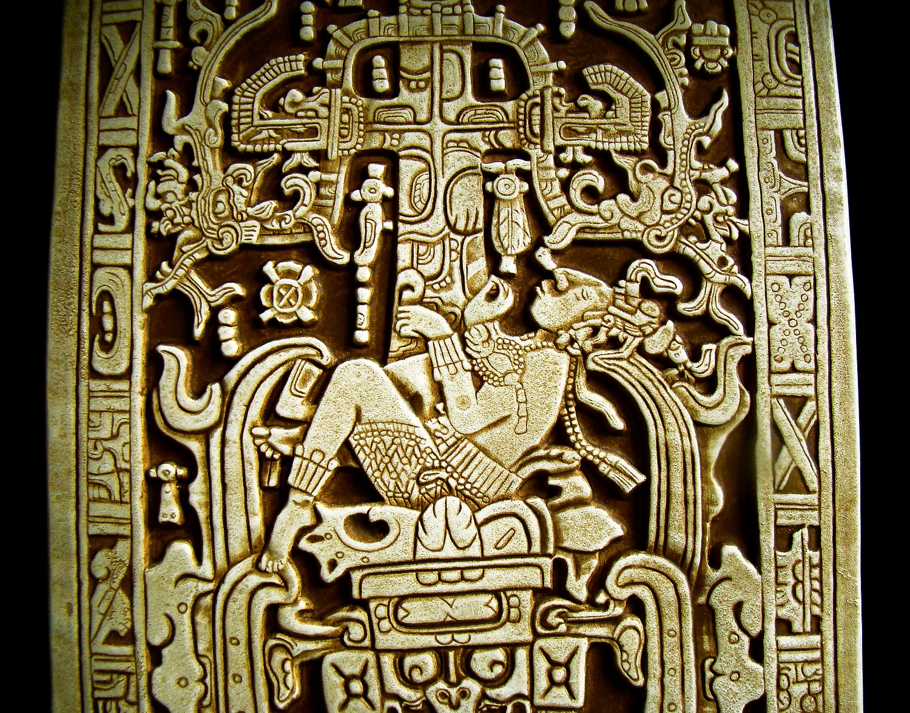

# Các yếu tố đạo đức của nền văn minh (tiếp theo)

> <i>Một bản sao nắp quan tài của người trị vì Maya của Palenque, Vua Pakal Vĩ đại, còn được biết tới như K'inich Janaab' Pacal (23, tháng 3 năm 603 CE – 31, tháng 3 năm 683 CE). Trong cảnh này, vị vua đang rơi xuống những cái miệng kinh hoàng của thế giới bên kia của người Maya, Xibalba. @Copyright Marcellina Rodriguez. </i>

## III. Đạo đức xã hội

***Bản chất của đức hạnh và tệ nạn—Lòng tham—Sự gian dối—Bạo lực—Giết người—Tự tử—Tập thể hóa cá nhân—Lòng vị tha—Lòng hiếu khách—Phong thái—Giới hạn đạo đức của bộ lạc—Đạo đức nguyên thủy so với đạo đức hiện đại—Tôn giáo và đạo đức***

Một phần chức năng của cha mẹ là truyền đạt quy tắc đạo đức. Do trẻ em mang tính động vật nhiều hơn tính người, ngày qua ngày, chúng phải tiếp nhận di sản đạo đức và tinh thần của giống nòi. Về mặt sinh học, trẻ em không được chuẩn bị tốt cho nền văn minh, vì bản năng của trẻ chỉ đáp ứng những tình huống cơ bản và truyền thống, và bao gồm những kích động phù hợp với rừng rậm hơn là với thị trấn. Mọi thói hư tật xấu từng là một đức tính, cần thiết trong cuộc đấu tranh sinh tồn; nó chỉ trở thành thói hư tật xấu khi nó tồn tại qua những điều kiện khiến nó trở nên không thể thiếu; do đó, thói hư tật xấu không phải mang hình thức các hành vi tiên tiến, mà thường là sự quay trở lại với những cách thức cổ xưa và đã bị thay thế. Một mục đích của quy tắc đạo đức là điều chỉnh những kích động không đổi hay thay đổi chậm chạp của bản chất con người theo những nhu cầu và hoàn cảnh thay đổi của đời sống xã hội.

Lòng tham, tính hám lợi, sự gian dối, sự tàn ác và bạo lực đã từng hữu ích cho nhiều thế hệ động vật và con người đến nỗi không phải tất cả luật lệ, giáo dục, đạo đức và tôn giáo của ta có thể hoàn toàn dập tắt chúng; một số trong số chúng thậm chí cho đến này chắc chắn vẫn có giá trị tồn tại nhất định. Con vật ăn ngấu nghiến vì không biết khi nào nó có thể tìm thấy thức ăn; sự không chắc chắn này là nguồn gốc của lòng tham. Người Yakuts đã từng ăn 18 cân thịt trong một ngày; và những câu chuyện tương tự ít hùng tráng hơn đã được kể về người Eskimo và người bản địa Úc. An ninh kinh tế là thành tựu quá mới mẻ của nền văn minh để có thể loại bỏ lòng tham tự nhiên này. Lòng tham vô độ vẫn xuất hiện nơi người đàn ông hay phụ nữ hiện đại thường cáu kỉnh tích trữ vàng hay các hàng hóa khác, có thể đổi thành thức ăn trong trường hợp khẩn cấp. Tham uống không phổ biến bằng tham ăn, vì hầu hết các tập hợp con người đều tập trung xung quanh một số nguồn cung cấp nước. Tuy nhiên, việc uống chất gây say gần như phổ biến; không phải vì con người tham lam mà vì lạnh và muốn được sưởi ấm, hay không vui và muốn quên đi—hoặc đơn giản là vì nước mà họ có không phù hợp để uống.

Sự gian dối không cổ xưa như lòng tham, vì cơn đói lâu đời hơn tài sản. Những “kẻ man rợ” giản dị nhất có vẻ là những kẻ trung thực nhất: “Lời nói của họ thì thiêng liêng”, Kolben nói về người Hottentot; họ “không biết gì về sự tham nhũng và nghệ thuật xảo trá của châu Âu”. Khi truyền thông quốc tế được cải thiện, sự trung thực ngây thơ này biến mất; châu Âu đã dạy nghệ thuật lịch thiệp cho người Hottentot. Nhìn chung, sự không trung thực trỗi dậy cùng với nền văn minh; qua nền văn minh, quan ngại về ngoại giao lớn hơn, có nhiều thứ có thể bị đánh cắp hơn và giáo dục làm cho con người trở nên thông minh hơn. Khi tài sản phát triển nơi những người nguyên thủy, nói dối và trộm cắp sẽ theo sau.

Tội ác bằng bạo lực đã có từ lâu đời như lòng tham; cuộc đấu tranh giành thức ăn, đất đai và bạn đời đã nuôi dưỡng trái đất bằng máu trong mọi thế hệ, và đã tạo ra một bối cảnh đen tối cho ánh sáng chập chờn của nền văn minh. Người nguyên thủy tàn ác vì họ phải như vậy; cuộc sống đã dạy họ rằng họ phải luôn sẵn sàng tấn công, và một trái tim thích hợp để “giết người hoang dã”. Trang đen tối nhất trong nhân chủng học là câu chuyện về sự tra tấn nguyên thủy, và niềm vui mà nhiều người đàn ông và phụ nữ nguyên thủy dường như đã có khi gây ra nỗi đau: “Phần lớn sự tàn ác này gắn liền với chiến tranh; trong bộ lạc, cách cư xử ít hung tợn hơn, và những người nguyên thủy đối xử với nhau—và thậm chí với cả nô lệ của họ—bằng lòng tốt khá văn minh. Nhưng vì đàn ông phải giết người một cách hăng say trong chiến tranh, họ đã học cách giết người ngay cả trong thời bình; đối với nhiều người có tâm trí nguyên thủy, không có cuộc tranh luận nào được giải quyết cho đến khi một trong những người tranh chấp chết. Trong nhiều bộ lạc, việc giết người, ngay cả giết một thành viên khác của cùng một bộ lạc, gây ra ít nỗi kinh hoàng hơn nhiều so với những gì nó đã gây ra cho ta. Người Fuegians trừng phạt một kẻ giết người chỉ bằng cách lưu đày hắn cho đến khi đồng bào quên tội ác của hắn. Người Kafir coi một kẻ giết người là ô uế, và yêu cầu hắn phải bôi than lên mặt; nhưng sau một thời gian, nếu hắn tự rửa mình, súc miệng và nhuộm mình bằng màu nâu, hắn lại được tiếp nhận vào xã hội. Những người man rợ ở Futuna, giống như ta, coi một kẻ giết người là anh hùng. Ở nhiều bộ lạc, không người phụ nữ nào muốn kết hôn với một người đàn ông chưa từng giết ai, dù là trong cuộc chiến công bằng hay gian lận; do đó mới có tục săn đầu người, vẫn tồn tại ở Philippines đến ngày nay. Người Dyak mang về nhiều đầu nhất từ một cuộc săn người như vậy có quyền lựa chọn tất cả các cô gái trong làng của mình; những người này háo hức muốn được anh ta ưu ái, cảm thấy rằng thông qua anh ta, họ có thể trở thành mẹ của những người đàn ông dũng cảm và mạnh mẽ.[^1]

[^1]:

    Đây là một nửa chủ đề trong vở kịch của Synge, “Kẻ ăn chơi của Thế giới Phương Tây”

Nơi thức ăn đắt đỏ thì mạng sống rẻ mạt. Con trai người Eskimo phải giết cha mẹ khi họ đã quá già yếu và vô dụng; không giết cha mẹ trong những trường hợp như vậy sẽ bị coi là vi phạm bổn phận làm con. Ngay cả mạng sống của chính anh ta cũng có vẻ rẻ mạt đối với con người nguyên thủy, vì anh ta tự sát với sự sẵn sàng chỉ có người Nhật mới sánh kịp. Nếu một người bị xúc phạm tự tử hoặc tự cắt xẻo mình, kẻ phạm tội phải bắt chước anh ta hoặc trở thành kẻ bị ruồng bỏ; việc mổ bụng (hara-kiri) [thực ra] đã có từ lâu. Bất kỳ lý do nào cũng có thể dùng để tự tử: một số phụ nữ da đỏ ở Bắc Mỹ đã tự tử vì chồng đã cho rằng mình có đặc quyền la mắng họ; và một thanh niên đảo Trobriand đã tự tử vì vợ đã hút hết thuốc lá của anh ta.

Biến lòng tham thành tiết kiệm, bạo lực thành tranh luận, giết người thành kiện tụng và tự tử thành triết học là một phần nhiệm vụ của nền văn minh. Đó là một bước tiến lớn khi kẻ mạnh đồng ý “ăn thịt kẻ yếu theo đúng trình tự pháp luật”. Không xã hội nào có thể tồn tại nếu nó cho phép các thành viên của mình cư xử với nhau theo cùng một cách mà nó khuyến khích họ cư xử như một nhóm đối với các nhóm khác; hợp tác nội bộ là qui luật đầu tiên của sự cạnh tranh với bên ngoài. Cuộc đấu tranh sinh tồn không kết thúc bằng sự giúp đỡ lẫn nhau, nó được kết hợp hoặc chuyển giao cho nhóm. Trong cùng một điều kiện, khả năng cạnh tranh với các nhóm đối thủ sẽ tương xứng với khả năng của các thành viên và gia đình cá nhân kết hợp với nhau. Do đó, mỗi xã hội đều thấm nhuần một quy tắc đạo đức và xây dựng trong trái tim của mỗi cá nhân, như những đồng minh và phụ tá bí mật của mình, những khuynh hướng xã hội làm giảm thiểu chiến tranh sống còn; nó khuyến khích—bằng cách gọi chúng là đức tính—những phẩm chất hoặc thói quen ở cá nhân mang lại lợi ích cho nhóm và ngăn chặn những phẩm chất trái ngược bằng cách gọi chúng là tệ nạn. Theo cách này, một cá thể được xã hội hóa ở một mức độ nào đó, và động vật này trở thành một công dân. 

Việc tạo ra những tình cảm xã hội trong tâm hồn của “người man rợ” khó hơn nhiều so với việc nuôi dưỡng chúng trong trái tim của con người hiện đại. Cuộc đấu tranh giành sự sống khuyến khích chủ nghĩa cộng đồng, nhưng cuộc đấu tranh giành tài sản lại làm tăng cường chủ nghĩa cá nhân. Có lẽ người nguyên thủy sẵn sàng hợp tác với đồng loại hơn người đương thời; sự đoàn kết xã hội đến với anh ta dễ dàng hơn vì anh ta có nhiều mối nguy hiểm và sở thích chung với nhóm của mình hơn, và ít tài sản hơn để tách biệt anh ta khỏi những người còn lại. Người đàn ông tự nhiên hung dữ và tham lam; nhưng anh ta cũng tử tế và hào phóng, sẵn sàng chia sẻ ngay cả với người lạ và tặng quà cho khách của mình. Mọi học sinh đều biết rằng lòng hiếu khách nguyên thủy, ở nhiều bộ lạc, đã đi đến mức tặng cho du khách vợ hay con gái của chủ nhà. Từ chối lời đề nghị như vậy là một hành vi phạm thượng nghiêm trọng, không chỉ đối với chủ nhà mà còn đối với người phụ nữ; đây là một trong những mối nguy hiểm mà các nhà truyền giáo phải đối mặt. Thường thì cách đối xử với khách sau này được xác định bằng cách anh ta đã tự giải thoát mình khỏi những trách nhiệm này. Người đàn ông chưa văn minh dường như cảm thấy ghen tuông về quyền sở hữu, nhưng không phải là ghen tuông về tình dục; anh ta không bận tâm khi vợ mình “quen” đàn ông khác trước khi kết hôn với anh ta, hoặc giờ đây ngủ với khách của anh ta; nhưng với tư cách là chủ sở hữu của cô ấy, chứ không phải là người tình, anh ta sẽ vô cùng tức giận khi thấy cô ấy chung sống với một người đàn ông khác mà không có sự đồng ý của anh ta. Một số người chồng châu Phi cho người lạ mượn vợ để lấy tiền.

Các quy tắc lịch sự ở hầu hết các dân tộc chất phác cũng phức tạp như ở các quốc gia tiên tiến. Mỗi nhóm đều có cách chào hỏi và tạm biệt trang trọng. Hai cá nhân, khi gặp nhau, cọ mũi, hoặc ngửi nhau, hoặc cắn nhẹ nhau; như ta đã thấy, họ không bao giờ hôn nhau. Một số bộ lạc thô lỗ lịch sự hơn mức bình quân hiện đại; những kẻ săn đầu người Dyak, như ta được kể, nhẹ nhàng và ôn hòa trong cuộc sống gia đình của họ, và người da đỏ ở Trung Mỹ coi việc nói to và hành vi thô lỗ của người da trắng là dấu hiệu của nền giáo dục kém và nền văn hóa nguyên thủy.

Hầu như tất cả các nhóm đều đồng ý coi các nhóm khác là thấp kém hơn mình . Người Mỹ bản địa coi mình là dân tộc được chọn, được Đại Linh (Great Spirit) tạo ra như một tấm gương nâng cao tinh thần cho nhân loại. Một bộ tộc người da đỏ tự gọi mình là “Những con người duy nhất”; một bộ tộc khác tự gọi mình là “Những con người của những con người”; người Carib nói rằng, “Chỉ có ta là con người.” Người Eskimo tin rằng người châu Âu đã đến Greenland để học cách cư xử và đức hạnh. Do đó, người nguyên thủy hiếm khi nghĩ đến việc mở rộng những hạn chế về mặt đạo đức mà họ thừa nhận khi đối xử với các bộ tộc khác; họ thẳng thắn cho rằng chức năng của đạo đức là mang lại sức mạnh và sự gắn kết cho nhóm của mình trước các nhóm khác. Các điều răn và điều cấm chỉ áp dụng cho những người trong bộ tộc của mình; với những người khác, ngoại trừ khi họ là khách của mình, anh ta có thể thoải mái làm gì anh ta dám.

Sự tiến bộ về mặt đạo đức trong lịch sử không nằm ở việc cải thiện các quy tắc đạo đức mà nằm ở việc mở rộng phạm vi áp dụng các quy tắc đó. Đạo đức của con người hiện đại không chắc chắn vượt trội hơn đạo đức của con người nguyên thủy, mặc dù hai nhóm quy tắc có thể khác nhau đáng kể về nội dung, thực hành và tuyên bố; nhưng đạo đức hiện đại, lúc bình thường, được mở rộng—mặc dù với cường độ giảm dần—cho nhiều người hơn trước[^2]. Khi các bộ lạc được tập hợp thành những đơn vị lớn hơn được gọi là nhà nước, đạo đức đã tràn ra khỏi ranh giới bộ lạc của nó; và khi sự giao tiếp—hay một mối nguy hiểm chung—thống nhất và đồng hóa các quốc gia, đạo đức đã thấm qua các biên giới, và một số người bắt đầu áp dụng các điều răn của họ cho tất cả người châu Âu, cho tất cả người da trắng, cuối cùng là cho tất cả mọi người. Có lẽ luôn có những người theo chủ nghĩa duy tâm muốn yêu tất cả mọi người như những người hàng xóm của họ, và có lẽ trong mỗi thế hệ, chúng là những tiếng nói vô ích kêu gào trong hoang vu của chủ nghĩa dân tộc và chiến tranh. Nhưng có lẽ số lượng—thậm chí là số lượng tương đối—những người như vậy đã tăng lên. Không có đạo đức trong ngoại giao, và chính trị không có trái tim (*la politique n'a pas d'entraillese*); nhưng có đạo đức trong thương mại quốc tế, chỉ vì thương mại như vậy không thể tiếp tục nếu không có một mức độ kiềm chế, quy định và tin cậy nào đó. Thương mại bắt đầu bằng nạn cướp biển; nó lên đến đỉnh điểm trong đạo đức.

[^2]:

    Tuy nhiên, phạm vi áp dụng của quy tắc đạo đức đã thu hẹp kể từ Thời Trung Cổ, là kết quả của sự trỗi dậy của chủ nghĩa dân tộc.

Rất ít xã hội bằng lòng đặt các quy tắc đạo đức của mình trên một cơ sở lý trí thẳng thắn như tiện ích kinh tế và chính trị. Vì cá nhân không được thiên nhiên ban tặng bất kỳ khuynh hướng nào để phục tùng lợi ích cá nhân của mình theo lợi ích của nhóm, hoặc tuân theo các quy định khó chịu mà không có phương tiện thực thi hữu hình nào. Để tạo ra, ví dụ như một người canh gác vô hình, để củng cố các động lực xã hội chống lại chủ nghĩa cá nhân bằng những hy vọng và nỗi sợ hãi mạnh mẽ, các xã hội đã không phát minh ra mà sử dụng tôn giáo. Nhà địa lý học cổ đại Strabo đã bày tỏ quan điểm tiên tiến nhất về chủ đề này cách đây một nghìn chín trăm năm:

!!! quote ""

    Vì khi đối phó với một đám phụ nữ, ít nhất là, hoặc với bất kỳ đám đông cẩu thả nào, một triết gia không thể tác động đến họ bằng lý lẽ hay khuyên họ [cần] tôn kính, ngoan đạo và có đức tin; không, vẫn cần phải có nỗi sợ tôn giáo, và điều này không thể được khơi dậy nếu không có những huyền thoại và những kỳ công. Lưỡi tầm sét (*thunderbolt*), khiên (*aegis*), đinh ba (*trident*), đuốc (*torches*), rắn (*snake*), cây quyền trượng *thyrsus—cánh* tay của các vị thần—là những huyền thoại [Hy Lạp], và toàn bộ thần học cổ đại cũng vậy. Nhưng người sáng lập ra các quốc gia đã chấp thuận những điều này như những con ngoáo ộp để dọa những bọ óc chất phác. Giờ đây vì đó là bản chất của thần thoại, và vì nó đã có vị trí trong kế hoạch xã hội và dân sự của cuộc sống cũng như trong lịch sử của các sự kiện thực tế, người xưa bám vào hệ thống giáo dục của họ dành cho trẻ em và áp dụng nó cho đến tuổi trưởng thành; và thông qua thơ ca, họ tin rằng họ có thể thi hành kỷ luật thỏa đáng trong mọi giai đoạn của cuộc sống. Nhưng hiện giờ, sau một thời gian dài, việc viết lịch sử và triết học hiện đại đã được đặt lên hàng đầu. Tuy nhiên, triết học chỉ dành cho số ít người, trong khi thơ ca có ích hơn đối với đại đa số quần chúng.

Sau đó, đạo đức sớm được phú thêm các lệnh trừng phạt tôn giáo, bởi sự bí ẩn và siêu  nhiên mang lại một sức nặng không bao giờ có thể gắn vào sự vật được biết đến theo kinh nghiệm và được hiểu về mặt di truyền; con người dễ bị trí tưởng tượng chi phối hơn là khoa học. Nhưng liệu tiện ích đạo đức này có phải là nguồn gốc hay xuất xứ của tôn giáo không?

## IV. Tôn giáo

***Những người theo thuyết vô thần nguyên thuỷ*** 

Nếu ta định nghĩa tôn giáo là sự tôn thờ các thế lực siêu nhiên, thì ngay từ đầu ta phải nhận thấy rằng một số dân tộc dường như không có tôn giáo nào cả. Một số bộ lạc người Pygmy ở Châu Phi không có nghi lễ hay giáo phái nào đáng chú ý; họ không có vật tổ, vật thờ cúng và thần thánh; họ chôn cất người chết mà không có nghi lễ và dường như không còn quan tâm đến người đã khuất; họ thiếu thậm chí cả những điều mê tín, nếu ta có thể tin họ, ở một mặt khác là những người du hành đáng kinh ngạc. Những người lùn của Cameroon chỉ công nhận các vị thần độc ác và không làm gì để xoa dịu họ cả, với lý do rằng việc cố gắng cũng vô ích. Những người Veddahs ở Ceylon không đi xa hơn việc thừa nhận khả năng tồn tại của các vị thần và những linh hồn vô đạo đức; nhưng họ không cầu nguyện hay cúng tế. Khi được hỏi về Chúa , họ trả lời, cũng bối rối như triết gia gần đây nhất: “Ngài có ở trên một tảng đá không? Trên một ngọn đồi kiến trắng? Trên một cái cây? Tôi chưa bao giờ nhìn thấy một vị thần!”. Người da đỏ Bắc Mĩ đã quan niệm về một vị thần, nhưng không tôn thờ ngài; giống như Epicurus, họ nghĩ rằng ngài quá thờ ơ để quan tâm đến công việc của họ. Một người da đỏ Abipone đã cự tuyệt một nhà nghiên cứu siêu hình theo cách khá giống người theo Khổng giáo: “Ông bà và ông cố của chúng tôi thường chỉ chiêm nghiệm về trái đất, chỉ quan tâm xem liệu đồng bằng có cung cấp cỏ và nước cho những con ngựa của mình hay không. Họ chẳng bao giờ băn khoăn về chuyện gì diễn ra trên thiên đường và ai là người sáng thế và cai quản các vì sao.” Người Eskimo, khi được hỏi về thiên đường và trái đất, luôn luôn đáp lại: “Chúng tôi không biết.” Một người Zulu được hỏi: “Khi anh nhìn mặt trời mọc và lặn, những cái cây lớn lên, anh có biết ai đã tạo nên hay cai quản chúng không?” Anh ta trả lời một cách đơn giản: “Không, chúng tôi thấy chúng, nhưng không thể giải thích chúng đến như thế nào; chúng tôi cho rằng chúng tự mình đến.”

Những trường hợp này là ngoại lệ, và niềm tin cổ xưa vào sự phổ quát của tôn giáo thực chất là chính xác. Đối với nhà triết gia, đây là một trong những sự thật lịch sử và tâm lí nổi bật; ông ta không thoả mãn về tri thức rằng tất cả các tôn giáo đều bao gồm những điều vớ vẩn, mà thích thú về các vấn đề cổ xưa và sự dai dẳng của niềm tin. Điều gì là nguồn gốc của sự mộ đạo bền vững nơi loài người?

### 1. Các nguồn gốc của Tôn giáo

***Nỗi sợ hãi—Kỳ quan—Các giấc mơ—Linh hồn—Thuyết vật linh***

Nỗi sợ hãi, như Lucretius đã nói, là mẹ của các vị thần. Nỗi sợ hãi, trên hết là về cái chết. Cuộc sống nguyên thuỷ đã bị quấy rỗi bởi hàng ngàn hiểm nguy, và hiếm khi kết thúc bằng sự suy tàn tự nhiên; rất sớm trước khi tuổi già kịp đến, bạo lực hay một vài căn bệnh lạ đã tước đoạt phần lớn mạng sống con người. Vì thế, từ sớm con người đã không tin rằng cái chết luôn tự nhiên; anh ta xem nó là cách hoạt động của các thế lực siêu nhiên. Trong thần thoại của những người bản địa New Britain, cái chết đã đến với con người do lỗi của các vị thần. Vị thần tốt bụng Kambinana đã nói với người em ngốc ngếch Korvouva của mình, “Hãy xuống với con người và bảo họ lột da mình; từ đó họ sẽ tránh khỏi cái chết. Nhưng hãy nói với loài rắn rằng chúng phải chết.” Korvouva đã lẫn lộn các lời phán truyền, trao bí quyết bất tử cho loài rắn và sự diệt vong cho loài người. Nhiều bộ lạc cho rằng cái chết là sự co rút của da, và con người chỉ có thể bất tử nếu người ta rụng lông.

Nỗi sợ chết, sự kinh ngạc trước nguyên nhân của những sự kiện ngẫu nhiên hay điều khó hiểu xảy ra, hi vọng về sự trợ giúp của thần thánh và lòng biết ơn vận may, đã phối hợp để tạo nên niềm tin tôn giáo. Kì quan và bí ẩn gắn bó đặc biệt với tình dục và những giấc mơ, và sự chi phối của những đoàn thể thần thánh lên trái đất và con người. Người nguyên thuỷ lấy làm lạ trước những bóng ma mà họ thấy trong cơn ngủ, và bị hành hạ bởi sự kinh hoàng mà họ chứng kiến trong giấc mơ, những hình dáng đã chết mà họ biết. Họ chôn vùi người đã khuất trong đất để ngăn chặn người ta trở lại; họ chôn thức ăn và tài sản với thi hài để nó không quay lại nguyền rủa họ; đôi khi họ để lại cho người chết ngôi nhà mà người ấy đã đến, trong khi họ chuyển đến một mái trú ẩn khác; ở một số nơi, người ta mang thi thể ra khỏi ngôi nhà không qua cửa mà qua lỗ trên tường, và mang nó đi nhanh qua chỗ ở ba lần, để linh hồn có thể quên lối vào và không bao giờ ảm ảnh ngôi nhà.

Những kinh nghiệm này đã thuyết phục người sơ khai rằng mọi vật sống đều có một linh hồn, một cuộc đời bí mật, bên trong nó—có thể tách rời khỏi thân thể khi bệnh tật, khi ngủ hay khi chết. “Đừng để ai đánh thức một người dậy một cách đột ngột”, một trong những Áo Nghĩa Thư (*Upanishads*) của Ấn Độ cổ xưa đã viết, “vì đó là một việc khó chữa lành nếu linh hồn không tìm được đường trở về với người đó.” Không chỉ con người mà tất cả mọi thứ đều có linh hồn; thế giới bên ngoài không phải là vô tri vô giác hay bất hoạt, nó sống động một cách mãnh liệt; nếu không phải như vậy, triết học nguyên thủy nghĩ rằng, tự nhiên sẽ tràn ngập những hiện tượng không thể giải thích được, như chuyển động của mặt trời, tia sét chết người, hay tiếng thì thầm của cây cối. Cách tiếp cận nhân cách hoá trong việc hình dung các đối tượng và sự kiện đã xuất hiện trước cách tiếp cận phi nhân cách hoá hay trừu tượng; tôn giáo xuất hiện trước triết học. Thuyết vật linh (*animism*) như vậy là thi ca của tôn giáo, và là tôn giáo của thi ca. Chúng ta có thể thấy nó cấp độ thấp nhất trong ánh mắt đầy kinh ngạc của một con chó khi nó nhìn tờ giấy bị gió thổi bay trước mặt, và có lẽ tin rằng một linh hồn đang di chuyển tờ giấy từ bên trong; và ta cũng tìm thấy cảm giác tương tự ở cấp độ cao nhất trong ngôn ngữ của nhà thơ. Đối với tâm trí nguyên thủy—và đối với các thi sĩ ở mọi thời đại—núi non, sông ngòi, đá, cây cối, sao trời, mặt trời, mặt trăng và bầu trời đều là những thứ linh thiêng mang tính bí tích, bởi vì chúng là những dấu hiệu hữu hình bên ngoài của những linh hồn vô hình bên trong. Đối với người Hy Lạp cổ đại, bầu trời là thần Ouranos, mặt trăng là Selene, trái đất là Gaia, biển cả là Poseidon, và khắp nơi trong rừng là thần Pan. Đối với người Đức cổ đại, khu rừng nguyên sinh được cho là có các vị thần, yêu tinh, quỷ lùn, người khổng lồ, người lùn và tiên nữ; những sinh vật rừng rậm này vẫn tồn tại trong âm nhạc của Wagner và các vở kịch thơ của Ibsen. Những người nông dân chất phác hơn ở Ireland vẫn tin vào tiên nữ, và không nhà thơ hay nhà viết kịch nào có thể thuộc về phong trào phục hưng văn học Ireland trừ khi họ sử dụng chúng. Trong thuyết vật linh có này sự khôn ngoan cũng như cái đẹp; việc coi mọi thứ như có sự sống là điều tốt và có tác dụng nuôi dưỡng. Đối với tinh thần nhạy cảm,  những nhà văn nhạy cảm nhất trong thời đại hiện nay nói rằng, 

!!! quote ""
    
    Tự nhiên bắt đầu hiện ra như một tập hợp rộng lớn của các thực thể sống riêng biệt, một số hữu hình, một số vô hình, nhưng tất cả đều sở hữu tinh thần, tất cả đều sở hữu vật chất, và tất cả đều hòa trộn tinh thần và vật chất lại với nhau trong sự bí ẩn căn bản của tồn tại... Thế giới đầy rẫy các vị thần! Từ mọi hành tinh và từ mọi hòn đá, một sự hiện diện được lan toả khiến ta bối rối với cảm giác về sự vô biên của những quyền năng giống như thần linh, mạnh mẽ và yếu ớt, lớn lao và nhỏ bé, di chuyển giữa trời và đất với những mục đích bí ẩn của chúng.

### 2. Các Đối Tượng của Tôn Giáo  

***Mặt trời—Các vì sao—Trái đất—Giới tính—Động vật—Tô-tem giáo—Sự chuyển tiếp sang các vị thần nhân hình—Thờ cúng ma quỷ—Thờ cúng tổ tiên***

Vì mọi thứ đều có linh hồn, hoặc chứa đựng các vị thần ẩn giấu, nên các đối tượng thờ cúng tôn giáo là vô số. Chúng được chia thành sáu loại: thiên thể, mặt đất, giới tính, động vật, con người và thần thánh. Tất nhiên, ta sẽ không bao giờ biết được đối tượng nào trong vũ trụ của ta được thờ cúng đầu tiên. Một trong những đối tượng đầu tiên có lẽ là mặt trăng. Cũng như truyền thuyết dân gian của ta nói về “người đàn ông trên mặt trăng,” truyền thuyết nguyên thủy cũng hình dung mặt trăng như một người đàn ông táo bạo, người khiến phụ nữ có kinh nguyệt bằng cách quyến rũ họ. Ông là một vị thần yêu thích của phụ nữ, những người thờ cúng ông như vị thần bảo hộ của họ. Tinh cầu nhạt nhòa này cũng là thước đo thời gian; người ta tin rằng nó kiểm soát thời tiết, tạo ra cả mưa và tuyết; thậm chí những con ếch cũng cầu nguyện nó để xin mưa. 

Chúng ta không biết khi nào mặt trời thay thế mặt trăng trở thành chúa tể bầu trời trong tôn giáo nguyên thủy. Có lẽ là khi nông nghiệp thay thế săn bắn, và sự di chuyển của mặt trời quyết định các mùa gieo trồng và thu hoạch, cũng như sức nóng của nó được công nhận là nguyên nhân chính cho sự màu mỡ của đất đai. Khi đó, trái đất trở thành một nữ thần được thụ tinh bởi những tia nắng nóng, và con người thờ phụng mặt trời như cha đẻ của vạn vật. Từ khởi đầu đơn giản này, việc thờ cúng mặt trời đã truyền xuống các tín ngưỡng ngoại giáo cổ đại, và nhiều vị thần sau này chỉ là hiện thân của mặt trời. Anaxagoras đã bị trục xuất bởi những người Hy Lạp uyên bác vì dám đưa ra giả thuyết rằng mặt trời không phải là một vị thần, mà chỉ là một quả cầu lửa, có kích thước khoảng bằng bán đảo Peloponnese. Thời Trung Cổ vẫn giữ lại dấu vết của việc thờ cúng mặt trời trong hào quang được vẽ xung quanh đầu các vị thánh, và ngày nay, Thiên hoàng Nhật Bản vẫn được phần lớn người dân của mình coi là hiện thân của thần mặt trời. Hầu như không có mê tín cổ nào mà ngày nay không được tìm thấy đang phát triển ở đâu đó. Văn minh là sự lao động và xa xỉ bấp bênh của một thiểu số; đại đa số nhân loại hầu như không thay đổi từ thiên niên kỷ này sang thiên niên kỷ khác.

Giống như mặt trời và mặt trăng, mỗi ngôi sao đều chứa đựng hay chính là một vị thần, và di chuyển theo mệnh lệnh của linh hồn cư ngụ bên trong. Theo Cơ đốc giáo, những linh hồn này trở thành các thiên thần hướng dẫn, có thể gọi là “hoa tiêu các vì sao”; và Kepler cũng không đủ khoa học để không tin vào chúng. Bầu trời chính nó là một vị thần vĩ đại, được tôn thờ một cách sùng kính như người ban tặng và người gìn giữ mưa. Đối với nhiều dân tộc nguyên thủy, từ ngữ chỉ thần linh có nghĩa là bầu trời; trong số những người Lubari và Dinka, nó có nghĩa là mưa. Ở Mông Cổ, vị thần tối cao là Tengri—bầu trời; ở Trung Quốc là Thiên—bầu trời; ở Ấn Độ Vệ Đà là Dyaus pitar—“cha trời”; ở Hy Lạp là Zeus—bầu trời, “người điều khiển mây”; ở Ba Tư là Ahura—“bầu trời trong xanh”; và ngay cả đối với ta ngày nay, người ta vẫn cầu xin “Thiên đường” bảo vệ họ. Điểm trung tâm trong hầu hết các thần thoại nguyên thủy là sự kết hợp màu mỡ giữa đất và trời.  

Bởi vì đất cũng là một vị thần, và mọi khía cạnh chính của nó đều được cai quản bởi một vị thần nào đó. Cây cối có linh hồn giống như con người, và việc chặt phá chúng là hành động giết người trắng trợn; người da đỏ Bắc Mỹ đôi khi cho rằng việc họ thất bại và suy tàn là do người da trắng đã đốn hạ những cái cây mà linh hồn của chúng đã bảo vệ Người Da đỏ. Ở quần đảo Molucca, những cây đang nở hoa được coi như đang mang thai; không được phép gây ồn ào, đốt lửa, hay gây bất kỳ sự xáo trộn nào khác làm ảnh hưởng đến sự yên bình của chúng; nếu không, giống như một người phụ nữ bị hoảng sợ, chúng có thể rụng trái non trước thời hạn. Ở Amboyna, không được phép tạo ra tiếng ồn lớn gần lúa đang trổ bông để cho nó không bị thui chột thành rơm. Người Gaul cổ đại tôn thờ những cây trong các khu rừng linh thiêng; và các tu sĩ Druid ở Anh tôn kính cây tầm gửi trên cây sồi như một biểu tượng linh thiêng, một nghi thức thú vị vẫn còn tồn tại đến ngày nay. Sự tôn kính cây cối, suối nước, sông ngòi và núi non là tôn giáo lâu đời nhất có thể tìm được nguồn gốc ở châu Á. Nhiều ngọn núi là những nơi linh thiêng, nơi trú ngụ của các vị thần sấm sét. Động đất là sự nhún vai của các vị thần bị làm phiền hoặc nổi giận: người Fiji cho rằng những chấn động như vậy là do thần đất trở mình trong giấc ngủ; và người Samoa, khi đất rung chuyển, họ cắn xuống đất và cầu nguyện thần Mafuie dừng lại, kẻo ngài làm rung chuyển cả hành tinh thành từng mảnh. Hầu như khắp nơi, đất đai là Mẹ vĩ đại; ngôn ngữ của ta, thường là kết tinh của những niềm tin nguyên thủy hay vô thức, cho đến nay vẫn gợi lên mối liên hệ giữa vật chất (<i>**mater**ia</i>) và mẹ (***mater***). Ishtar và Cybele, Demeter và Ceres, Aphrodite và Venus và Freya—đây là những hình thức tương đối muộn của các nữ thần đất cổ xưa, mà sự màu mỡ của họ tạo nên sự phì nhiêu của đồng ruộng; sự ra đời và hôn nhân, cái chết và sự phục sinh đầy hân hoan của họ được coi là biểu tượng hay nguyên nhân của sự nảy mầm, sự suy tàn, và sự đổi mới xuân thì của tất cả thảm thực vật. Những vị thần này tiết lộ qua giới tính của họ mối liên hệ nguyên thủy giữa nông nghiệp và phụ nữ. Khi nông nghiệp trở thành phương thức sinh sống chủ đạo của con người, các nữ thần thảo mộc đã có quyền thống trị tối cao. Hầu hết các vị thần thời kỳ đầu đều thuộc giới tính dịu dàng hơn; họ đã bị thay thế bởi các nam thần, có lẽ như một phản ánh trên thiên đình một chiến thắng của gia đình gia trưởng phụ quyền.  

Cũng như tâm trí nguyên thủy đầy chất thơ nhìn thấy một sự linh thiêng bí ẩn trong sự phát triển của một cái cây, nó cũng nhìn thấy một thế lực siêu nhiên trong việc thụ thai hay sinh ra của một đứa trẻ. Người “nguyên thủy” không biết gì về trứng hay tinh trùng; họ chỉ nhìn thấy các cấu trúc bên ngoài liên quan và thần thánh hóa chúng; chúng cũng có linh hồn trong đó và phải được tôn thờ, vì chẳng phải những sức mạnh sáng tạo bí ẩn này là điều kỳ diệu nhất sao? Ở chúng, thậm chí còn hơn cả trong đất đai, điều kỳ diệu của sự sinh sôi và phát triển xuất hiện; do đó, chúng phải là hiện thân trực tiếp nhất của quyền năng thần thánh. Hầu hết các dân tộc cổ đại đều thờ phụng tình dục dưới một hình thức và nghi lễ nào đó, và không phải những người thấp kém mà chính những người cao quý nhất đã thể hiện sự thờ phụng của họ một cách trọn vẹn nhất; ta sẽ tìm thấy sự thờ phụng như vậy ở Ai Cập và Ấn Độ, Babylon và Assyria, Hy Lạp và La Mã. Đặc tính và chức năng tình dục của các vị thần nguyên thủy được coi trọng, không phải vì bất kỳ sự tục tĩu nào trong tâm trí, mà vì niềm đam mê sinh sôi nảy nở ở phụ nữ và trong đất đai. Một số loài động vật, như bò đực và rắn, được tôn thờ vì dường như sở hữu hoặc tượng trưng cho quyền năng thần thánh của sự sinh sản. Con rắn trong câu chuyện Vườn Địa Đàng chắc chắn là một biểu tượng dương vật, đại diện cho tình dục như nguồn gốc của cái ác, gợi ý sự thức tỉnh tình dục như khởi đầu của nhận thức về thiện và ác, và có lẽ ám chỉ mối liên hệ cách ngôn giữa sự ngây thơ tinh thần và hạnh phúc....  

Hầu như không có loài động vật nào trong tự nhiên, từ bọ hung Ai Cập đến voi Ấn Độ, mà không được tôn thờ như một vị thần ở đâu đó. Người da đỏ Ojibwa đã đặt tên **vật tổ** (*totem*) cho loài vật linh thiêng đặc biệt của họ, cho bộ tộc thờ phụng nó, và cho bất kỳ thành viên nào của bộ tộc; và từ ngữ rối rắm này đã lọt vào nhân chủng học như ***tín ngưỡng totem*** (*totemism*), ám chỉ một cách mơ hồ bất kỳ sự thờ phụng nào đối với một đối tượng cụ thể—thường là một loài động vật hay thực vật—như là thứ linh thiêng đặc biệt đối với một nhóm. Các biến thể của tín ngưỡng totem đã được tìm thấy rải rác ở những khu vực dường như không liên quan đến nhau trên Trái đất, từ các bộ tộc da đỏ Bắc Mỹ đến những người bản địa châu Phi, người Dravidian ở Ấn Độ, và các bộ lạc ở Úc. Vật tổ là một đối tượng tôn giáo giúp thống nhất bộ lạc, nơi các thành viên nghĩ rằng họ được bao bọc bởi nó hay sinh ra từ đó; người Iroquois, theo cung cách chấp nhập một nửa thuyết tiến hoá của Darwin, tin rằng họ được sinh ra từ sự giao phối nguyên thủy giữa phụ nữ và gấu, sói và hươu. Vật tổ—như một vật hay như một biểu tượng—đã trở thành một dấu hiệu hữu ích của mối quan hệ và đặc trưng cho các dân tộc nguyên thuỷ, và trong quá trình thế tục hoá đã biến thành vật biểu trưng hay linh vật, giống như sư tử hay đại bàng của các quốc gia, như hươu Bắc Mỹ hay nai sừng tấm ở các hội kín, và những động vật ngu ngốc này được sử dụng để tượng trưng cho khả năng di động vụng về và tính ương bướng ngỗ ngược của các đảng phái chính trị. Bồ cầu, cá và cừu, trong chủ nghĩa tượng trưng thời kì đầu của Công giáo, là dấu tích của sự sùng bái vật tổ; ngay cả loài lợn tầm thường cũng đã từng là vật tổ của người tiền sử Do Thái. Trong hầu hết các trường hợp, vật tổ động vật là kiêng kị—bị cấm không được phép chạm vào; trong những trường hợp nhất định người ta có thể ăn nó, nhưng chỉ khi coi đó là một hành động mang tính tôn giáo, tương đương với nghi lễ ăn thần linh[^3]. Người Gallas của Abyssina trong một nghi thức trang nghiêm đã ăn cá mà họ thờ phụng, và nói: “Chúng tôi cảm thấy linh hôn di chuyển trong mình khi chúng tôi ăn.” Những người truyền giáo tốt bụng khi giảng sách Phúc Âm cho người Gallas đã vô cùng kinh ngạc khi thấy ở những con người chất phác này một nghi lễ quá lạ thường tương tự như nghi thức chính của Thánh lễ.

[^3]:

    Freud, với trí tưởng tượng đặc trưng, tin rằng vật tổ là một biểu tượng được chuyển hóa của người cha, được tôn kính và căm ghét vì quyền năng tối thượng của mình, và bị những đứa con nổi loạn giết chết và ăn thịt. Durkheim cho rằng vật tổ là biểu tượng của thị tộc, được cá nhân tôn kính và căm ghét (do đó được xem là “thiêng liêng” và “ô uế”) vì quyền năng tối thượng và sự độc tài phiền phức của nó; và rằng thái độ tôn giáo ban đầu là cảm xúc của cá nhân đối với nhóm độc tài.

Có lẽ nỗi sợ hãi là nguồn gốc của tín ngưỡng totem, giống như rất nhiều sự sùng bái khác. Con người cầu khẩn động vật vì động vật hùng mạnh, và cần được làm khuây. Khi săn bắn san phẳng các cánh rừng của các loài thú lớn, và tạo tiền đề cho một đời sống nông nghiệp tương đối an ổn, sự thờ phụng động vật suy tàn, dù nó chưa bào giờ biến mất hoàn toàn; và sự tàn bạo của những vị thần mang hình dạng con người đầu tiên có lẽ đã kế tục các vị thần động vật mà họ thay thế. Sự chuyển dịch này là rõ ràng trong các câu chuyện về sự biến hình, hay thay đổi hình dạng—được tìm thấy trong thơ ca ở tất cả các ngôn ngữ—, và cho biết các vị thần như đã từng là hay đã trở thành động vật như thế nào. Sau này, những đặc tính động vật vẫn bám chặt lấy chúng một cách dai dẳng, giống như mùi vị của sức mạnh bền bỉ có thể trung thành đi theo một Casanova nông thôn nào đó; ngay cả trong tâm trí phức tạp của Homer, *Athena glaucopis* có đôi mắt của một con cú, và Hera boopis có đôi mắt của một con bò. Các vị thần hoặc yêu tinh Ai Cập và Babylon mang khuôn mặt của con người và thân thể của một con thú cũng tiết lộ sự chuyển đổi tương tự và thừa nhận cùng một điều—rằng nhiều vị thần của con người từng là những vị thần động vật.  

Tuy nhiên, hầu hết các vị thần của con người dường như ban đầu chỉ là những người chết được lý tưởng hóa. Sự xuất hiện của người chết trong giấc mơ đã đủ để thiết lập việc thờ cúng người chết, vì sự thờ cúng, nếu không phải là con đẻ, thì ít nhất cũng là anh em của nỗi sợ hãi. Những người đã có quyền lực khi còn sống, và do đó đã được kính sợ, đặc biệt có khả năng được thờ cúng sau khi họ qua đời. Ở một số dân tộc nguyên thủy, từ để chỉ “thần” thực sự có nghĩa là “một người đã chết”; ngay cả ngày nay, từ “spirit” trong tiếng Anh và “Geist” trong tiếng Đức đều có nghĩa là cả “ma” và “linh hồn”. Người Hy Lạp cầu khấn người chết của họ giống như cách các tín đồ Cơ đốc sau này cầu khấn các vị thánh. Niềm tin vào sự tiếp tục tồn tại của người chết—được hình thành trước hết trong giấc mơ—mạnh mẽ đến mức người nguyên thủy đôi khi gửi thông điệp đến họ một cách rất cụ thể; trong một bộ tộc, tù trưởng để chuyển một lá thư như vậy đã đọc nó cho một nô lệ nghe, sau đó chặt đầu người này để thực hiện việc chuyển phát đặc biệt; nếu tù trưởng quên điều gì, ông ta sẽ gửi thêm một nô lệ bị chặt đầu như một phần tái bút.  

Dần dần, việc thờ cúng ma quỷ trở thành thờ cúng tổ tiên. Tất cả người chết đều được sợ hãi và phải được xoa dịu, kẻo họ nguyền rủa và gieo rắc tai họa lên cuộc sống của người sống. Tục thờ cúng tổ tiên này rất phù hợp để thúc đẩy quyền lực xã hội và tính liên tục, bảo thủ và trật tự, đến mức nó nhanh chóng lan rộng khắp mọi nơi trên trái đất. Nó phát triển mạnh ở Ai Cập, Hy Lạp và La Mã, và vẫn tồn tại mạnh mẽ ở Trung Quốc và Nhật Bản ngày nay; nhiều dân tộc thờ cúng tổ tiên nhưng không thờ cúng thần linh[^4]. Tục lệ này giữ cho gia đình gắn kết mạnh mẽ bất chấp sự thù địch giữa các thế hệ kế tiếp nhau, và cung cấp một cấu trúc vô hình cho nhiều xã hội sơ khai. Và cũng như sự ép buộc phát triển thành lương tâm, nỗi sợ hãi dần chuyển hóa thành tình yêu; nghi lễ thờ cúng tổ tiên, có lẽ được tạo ra bởi nỗi sợ hãi, sau này khơi dậy cảm giác kính sợ, và cuối cùng phát triển thành lòng thành kính và sự tận tụy. Xu hướng của các vị thần là bắt đầu [xuất hiện] như những yêu tinh và cuối cùng trở thành những người cha đầy yêu thương; thần tượng dần trở thành lý tưởng khi sự an toàn, hòa bình và ý thức đạo đức ngày càng tăng của những người thờ cúng làm dịu đi và biến đổi hình ảnh của những vị thần từng hung dữ của họ. Sự tiến bộ chậm rãi của nền văn minh được phản ánh qua sự thân thiện chậm chạp của các vị thần.  

[^4]:

    Dấu vết của tục thờ cúng tổ tiên vẫn có thể được tìm thấy trong việc chăm sóc và viếng thăm mộ phần, cũng như các lễ cầu siêu và cầu nguyện cho người đã khuất của chính ta.

Ý tưởng về một vị thần mang hình dáng con người là một bước tiến muộn trong quá trình phát triển dài; nó dần được phân biệt, qua nhiều giai đoạn, từ khái niệm về một đại dương hoặc vô số linh hồn và ma quỷ bao quanh và cư ngụ trong mọi thứ.  

Từ nỗi sợ hãi và viêc thờ cúng những linh hồn mơ hồ và vô hình, con người dường như đã chuyển sang tôn thờ các thế lực thiên thể, thực vật và tình dục, sau đó là sự tôn kính động vật, và cuối cùng là thờ cúng tổ tiên. Khái niệm về Thần như một Người Cha có lẽ bắt nguồn từ tục thờ cúng tổ tiên; ban đầu, nó có nghĩa rằng con người được sinh ra về mặt thể xác bởi các vị thần. Trong thần học nguyên thủy, không có sự phân biệt rõ ràng hoặc chung chung giữa thần và người; chẳng hạn, đối với người Hy Lạp cổ đại, thần thánh của họ là tổ tiên, và tổ tiên của họ là thần thánh. Một bước phát triển tiếp theo xảy ra khi, từ sự hỗn độn của các tổ tiên, một số người đàn ông và phụ nữ đặc biệt nổi bật được chọn ra để được phong thần rõ ràng hơn; do đó, những vị vua vĩ đại trở thành thần thánh, đôi khi ngay cả khi họ còn sống. Nhưng với sự phát triển này, ta đã bước vào các nền văn minh lịch sử.  

### 3. Các Phương Pháp của Tôn Giáo  

***Ma thuật—Nghi thức cho cây cối—Lễ hội phóng túng—Huyền thoại về sự hồi sinh của thần—Ma thuật và khoa học—Các thầy tư tế.***

Sau khi hình dung ra một thế giới linh hồn mà bản chất và ý định của chúng không thể hiểu được, con người nguyên thủy tìm cách làm lành với chúng và tranh thủ sự giúp đỡ của chúng. Do đó, bên cạnh ***thuyết vật linh*** (*animism*), vốn là bản chất của tôn giáo nguyên thủy, ***phép thuật*** (*magic*) đã được thêm vào, trở thành linh hồn của nghi lễ nguyên thủy. Người Polynesia nhận thức về một đại dương sức mạnh ma thuật, mà họ gọi là mana; họ tin rằng pháp sư chỉ đơn giản là khai thác nguồn cung cấp vô tận này của năng lực kỳ diệu. Các phương pháp mà linh hồn, và sau này là các vị thần, được thần phục để phục vụ mục đích của con người chủ yếu là ***“phép đồng cảm”*** (*sympathetic magic*)—một hành động mong muốn được gợi ý cho các vị thần thông qua việc thực hiện một phần hoặc bắt chước hành động đó bởi con người. Để làm mưa rơi, một số pháp sư nguyên thủy đổ nước xuống đất, tốt nhất là từ trên cây. Người Kaffirs, khi bị đe dọa bởi hạn hán, đã yêu cầu một nhà truyền giáo đi vào cánh đồng với một chiếc ô được mở ra. Ở Sumatra, một người phụ nữ hiếm muộn làm một hình nộm trẻ con và đặt nó trên đùi mình, hy vọng sẽ mang thai. Ở quần đảo Babar, người phụ nữ muốn có con tạo ra một con búp bê bằng bông đỏ, giả vờ cho nó bú và lặp lại một câu thần chú; sau đó, cô thông báo khắp làng rằng mình đã có thai, và bạn bè đến chúc mừng; chỉ có một thực tế cứng đầu mới có thể từ chối bắt chước trí tưởng tượng này. Trong số người Dyak ở Borneo, pháp sư, để giảm bớt cơn đau của một phụ nữ sắp sinh, sẽ tự mình thực hiện các động tác sinh nở, như một gợi ý ma thuật để thai nhi chào đời; đôi khi pháp sư lăn một hòn đá từ từ xuống bụng và thả nó xuống đất, hy vọng đứa trẻ ngược ngạo sẽ bắt chước. Ở thời Trung Cổ, một lời nguyền được đặt lên kẻ thù bằng cách cắm kim vào một hình nộm sáp của họ. Người da đỏ Peru đốt hình nộm của người khác và gọi đó là “đốt linh hồn”. Ngay cả đám đông hiện đại cũng không vượt qua được ma thuật nguyên thủy như vậy.

Những phương pháp gợi ý bằng ví dụ này được đặc biệt áp dụng để làm màu mỡ cho đất đai. Các thầy thuốc Zulu chiên bộ phận sinh dục của một người đàn ông đã chết trong trạng thái tràn đầy sinh lực, nghiền hỗn hợp thành bột và rắc lên các cánh đồng. Một số dân tộc chọn một Vua và Hoàng hậu tháng Năm, hoặc một cặp cô dâu chú rể vào lễ Hạ trần (*Whitsun*), và tổ chức đám cưới công khai khiến đất đai để ý và đơm hoa kết trái. Ở một số địa phương, nghi lễ bao gồm việc hoàn thành hôn lễ một cách công khai, để Thiên nhiên, dù có thể chỉ là một cục đất vô tri, cũng không có lý do gì để hiểu sai nhiệm vụ của mình. Ở Java, nông dân và vợ của họ, để đảm bảo sự màu mỡ của ruộng lúa, đã giao phối ngay giữa cánh đồng. Người nguyên thủy không hiểu sự phát triển của đất đai theo khía cạnh đạm tố (ni-tơ); họ nghĩ đến nó—dường như không biết về giới tính ở thực vật—theo cách tương tự như cách họ giải thích khả năng sinh sản của phụ nữ; ngay cả các thuật ngữ của ta cũng gợi nhớ niềm tin đầy chất thơ của họ.

Các lễ hội phóng túng, thường diễn ra vào mùa gieo hạt, một phần đóng vai trò như một sự tạm ngừng các chuẩn mực đạo đức (gợi nhớ sự tự do tương đối trong quan hệ tình dục thời kỳ đầu), một phần như một cách để làm cho vợ của những người đàn ông hiếm muộn có thai, và một phần như một nghi thức gợi ý cho đất đai vào mùa xuân từ bỏ sự dè dặt mùa đông, chấp nhận hạt giống được gieo xuống, và chuẩn bị sinh ra một mùa màng bội thu. Những lễ hội như vậy xuất hiện ở rất nhiều dân tộc thiên nhiên, đặc biệt là người Cameroon ở Congo, người Kaffir, người Hottentot và người Bantu. Mục sư H. Rowley nói về người Bantu:

!!! quote "" 
    
    “Lễ hội thu hoạch của họ có tính chất gần giống với các lễ hội của Bacchus... Không thể chứng kiến mà không cảm thấy xấu hổ... Không chỉ những người mới tham gia được phép, mà thậm chí trong hầu hết các trường hợp, bị bắt buộc phải thực hiện quan hệ tình dục tự do, mà bất kỳ khách tham dự nào cũng được khuyến khích tham gia vào sự phóng túng. Mại dâm được tự do thực hiện, và ngoại tình không bị coi là tội lỗi nghiêm trọng trong bối cảnh này. Không người đàn ông nào tham dự lễ hội được phép quan hệ với vợ mình.”

Các lễ hội tương tự xuất hiện trong nền văn mình lịch sử: các lễ hội *Bacchuc* của Hy Lạp, *Saturnalia* ở Rome, lễ hội hoá trang *Fête des Fous* thời Trung cổ ở Pháp, ngày *May Day* ở Anh, và ngày hội *Carnival* hay *Mardi Gras* trong các phong tục hiện đại.

Ở một số nơi, như người Pawnee và người da đỏ Guayaquil, các nghi thức cho cây cối mang một hình thức kém hấp dẫn hơn. Một người—hay sau này và trong những ngày ôn hoà hơn, một con vật—được hiến tế cho đất đai vào mùa gieo hạt, để đất có thể được làm màu mỡ bằng máu của họ. Khi mùa thu hoạch đến, nó được hiểu là sự phục sinh của người đã chết; nạn nhân được tôn vinh như một vị thần trước và sau khi chết; và từ nguồn gốc này, huyền thoại gần như phổ biến về một vị thần chết vì dân của mình rồi trở lại cuộc sống một cách đầy vinh quang, đã xuất hiện dưới hàng ngàn hình thức. Thơ ca đã thêu dệt ma thuật và biến nó thành thần học. Những huyền thoại mặt trời hòa quyện hài hòa với các nghi thức cho cây cối, và truyền thuyết về một vị thần đang chết và tái sinh không chỉ áp dụng cho cái chết vào mùa đông và sự hồi sinh vào mùa xuân của đất đai, mà còn cho các điểm phân thu và xuân, cũng như sự suy tàn và tăng trưởng của một ngày. Vì đêm đến chỉ là một phần của vở kịch bi thảm này; hàng ngày, thần mặt trời được sinh ra và chết đi; mỗi hoàng hôn là một lần đóng đinh trên thập giá, và mỗi bình minh là một phục sinh.

Hiến tế con người, mà ở đây ta chỉ thấy một trong nhiều biến thể, dường như đã được tôn vinh vào một thời điểm nào đó bởi hầu hết mọi dân tộc. Trên đảo Carolina ở Vịnh Mexico, một bức tượng lớn, rỗng và bằng kim loại lớn của một vị thần Mexico cổ đã được tìm thấy, bên trong vẫn còn xác người, có vẻ như bị thiêu chết để làm lễ vật dâng lên thần. Ai cũng biết đến Moloch, vị thần được người Phoenicia, người Carthage, và đôi khi các dân tộc Semite khác, hiến tế con người cho. Trong thời đại của ta, tập tục này đã được thực hiện ở Rhodesia. Có lẽ nó gắn liền với tục ăn thịt người; con người nghĩ rằng các vị thần có sở thích giống như họ. Vì niềm tin tôn giáo thay đổi chậm hơn các tín điều khác, và nghi lễ thay đổi chậm hơn niềm tin, tục thần thánh ăn thịt người này vẫn tồn tại sau khi tục ăn thịt người của con người biến mất. Tuy nhiên, dần dần, đạo đức phát triển đã thay đổi cả các nghi lễ tôn giáo; các vị thần bắt chước sự hiền lành ngày càng tăng của những người thờ phụng họ, và chấp nhận việc nhận thịt động vật thay vì thịt người; một con hươu thay thế cho Iphigenia, và một con cừu thay thế cho con trai của Abraham. Theo thời gian, các vị thần thậm chí không nhận được cả động vật; các thầy tư tế thích đồ ăn ngon, tự ăn hết các phần ăn được của con vật hiến tế, và chỉ dâng lên bàn thờ nội tạng và xương.

Từ thời xa xưa, con người tin rằng họ có được sức mạnh của bất kỳ sinh vật nào mà họ tiêu thụ, và điều này dẫn họ đến ý tưởng ăn thịt thần. Trong nhiều trường hợp, họ ăn thịt và uống máu của vị thần hình nhân mà họ đã thần thánh hóa và vỗ béo để hiến tế. Khi nguồn cung cấp thực phẩm trở nên ổn định hơn, họ trở nên nhân đạo hơn, thay thế nạn nhân bằng hình tượng, và hài lòng với việc ăn những hình tượng này. Ở Mexico cổ đại, một hình tượng thần được làm từ ngũ cốc, hạt giống và rau củ, nhào nặn với máu của những cậu bé được hiến tế, và sau đó được tiêu thụ như một nghi lễ tôn giáo của việc ăn thịt thần. Những nghi lễ tương tự đã được tìm thấy ở nhiều bộ lạc nguyên thủy. Thông thường, người tham gia phải nhịn ăn trước khi ăn hình tượng thiêng liêng; và thầy tư tế biến hình tượng thành thần bằng sức mạnh của các công thức ma thuật.  

Ma thuật bắt đầu từ mê tín và kết thúc trong khoa học. Một mớ hỗn độn những niềm tin kỳ lạ xuất phát từ thuyết vật linh, dẫn đến nhiều công thức và nghi lễ kỳ quặc. Người Kukis khích lệ bản thân trong chiến tranh bằng ý nghĩ rằng tất cả kẻ thù họ giết sẽ phục vụ họ như nô lệ ở kiếp sau. Mặt khác, một người Bantu, sau khi giết kẻ thù, cạo đầu và bôi phân dê lên người để ngăn linh hồn của người chết quay lại quấy rầy anh ta. Hầu hết các dân tộc nguyên thủy đều tin vào hiệu quả của lời nguyền và sự hủy diệt của “con mắt quỷ”. Người bản địa Australia chắc chắn rằng lời nguyền của một pháp sư quyền năng có thể giết chết kẻ thù từ cách xa hàng trăm dặm. Niềm tin vào phù thủy bắt đầu từ rất sớm trong lịch sử loài người và chưa bao giờ biến mất hoàn toàn. ***Tục thờ vật tổ*** (*fetishism*)[^5]—sự tôn thờ các vật thể hoặc tượng thần như có sức mạnh ma thuật—còn cổ xưa và khó bị tiêu diệt hơn nữa. Vì nhiều bùa hộ mệnh chỉ có sức mạnh đặc biệt, một số dân tộc mang theo rất nhiều loại bùa khác nhau để chuẩn bị cho mọi tình huống. Các thánh tích là một ví dụ muộn hơn và hiện đại của vật tổ mang sức mạnh ma thuật; một nửa dân số châu Âu đeo một số vật trang sức hoặc bùa hộ mệnh để được bảo vệ hoặc hỗ trợ siêu nhiên.  

[^5]:

    Từ tiếng Bồ Đào Nha *feitico*, có nghĩa là được chế tác hoặc nhân tạo.

Ở mỗi bước đi, lịch sử văn minh dạy ta rằng cấu trúc văn minh chỉ là một lớp mỏng manh và nông cạn, và nó đang đứng trên đỉnh của một ngọn núi lửa chưa bao giờ tắt của sự nghèo đói, áp bức, mê tín và ngu dốt. Hiện đại chỉ là một chiếc mũ được đặt lên thời Trung Cổ, vốn luôn tồn tại.

Nhà triết học chấp nhận một cách nhẹ nhàng nhu cầu an ủi và xoa dịu từ đấng siêu nhiên của con người, đồng thời tự an ủi bản thân bằng cách nhận định rằng cũng như thuyết vật linh sinh ra thi ca, thì ma thuật sinh ra kịch nghệ và khoa học. Frazer đã chỉ ra, với sự phóng đại vốn có của một nhà cách tân lỗi lạc, rằng những thành tựu rực rỡ của khoa học bắt nguồn từ những điều phi lý của ma thuật. Bởi ma thuật thường thất bại, nên việc phát hiện ra các quy luật tự nhiên để giúp các thế lực siêu nhiên tạo ra sự kiện mong muốn trở thành lợi thế cho pháp sư. Dần dần, phương thức tự nhiên chiếm ưu thế, dù để giữ vị thế trong mắt mọi người, pháp sư cố che giấu những phương thức này và gán công lao cho ma thuật siêu nhiên—giống như cách ngày nay nhiều người vẫn cho rằng những phương pháp chữa lành tự nhiên là nhờ các toa thuốc hay viên thuốc thần kỳ. Theo cách này, ma thuật đã sinh ra người thầy thuốc, nhà hóa học, nhà luyện kim và nhà thiên văn học.

Tuy nhiên, một cách trực tiếp hơn, ma thuật đã tạo ra các thầy tư tế. Dần dần, khi các nghi lễ tôn giáo trở nên phong phú và phức tạp hơn, chúng vượt quá kiến thức và khả năng của người bình thường, và tạo ra một tầng lớp đặc biệt dành phần lớn thời gian cho các chức năng và nghi lễ tôn giáo. Thầy tư tế với tư cách là pháp sư có thể tiếp cận ý chí của các linh hồn hoặc thần linh thông qua trạng thái xuất thần, cảm hứng hoặc lời cầu nguyện bí truyền, và có thể thay đổi ý chí đó vì mục đích của con người. Vì kiến thức và kỹ năng như vậy được coi là quý giá nhất đối với người nguyên thủy, và các thế lực siêu nhiên được cho là ảnh hưởng đến số phận con người ở mọi bước ngoặt, quyền lực của giới tăng lữ trở nên lớn ngang bằng với quyền lực của nhà nước; và từ các xã hội cổ đại đến thời hiện đại, thầy tư tế đã cạnh tranh và luân phiên với chiến binh trong việc thống trị và kỷ luật con người. Hãy lấy Ai Cập, Judea và châu Âu thời trung cổ làm ví dụ.

Thầy tư tế không tạo ra tôn giáo, họ chỉ sử dụng nó, giống như một chính trị gia sử dụng các xung động và phong tục của nhân loại; tôn giáo không xuất phát từ sự phát minh hay mánh khóe của giới tăng lữ, mà từ sự tò mò dai dẳng, nỗi sợ hãi, sự bất an, hy vọng và nỗi cô đơn của con người. Thầy tư tế đã gây hại bằng cách dung túng mê tín và độc quyền một số hình thức kiến thức; nhưng họ cũng hạn chế và thường xuyên ngăn chặn mê tín, họ cung cấp cho người dân những kiến thức cơ bản về giáo dục, họ đóng vai trò là nơi lưu giữ và phương tiện truyền tải di sản văn hóa ngày càng phát triển của chủng tộc, họ an ủi những người yếu thế trước sự bóc lột không thể tránh khỏi của kẻ mạnh, và họ trở thành người đại diện thông qua đó tôn giáo nuôi dưỡng nghệ thuật và chống đỡ cấu trúc đạo đức mong manh của con người bằng sự trợ giúp siêu nhiên. Nếu họ không tồn tại, người dân cũng sẽ sáng tạo ra họ.

### 4. Chức năng Đạo đức của Tôn giáo  

***Tôn giáo và chính phủ—Cấm kỵ—Cấm kỵ về tình dục—Sự chậm trễ của tôn giáo—Thế tục hóa***

Tôn giáo hỗ trợ đạo đức chủ yếu thông qua hai phương tiện: thần thoại và cấm kỵ. Thần thoại tạo ra tín điều siêu nhiên, qua đó các hình phạt hay phần thưởng thiêng liêng có thể được áp dụng cho các hành vi được xã hội (hay giới tăng lữ) mong muốn; hy vọng về thiên đường và nỗi sợ hãi địa ngục truyền cảm hứng cho cá nhân chấp nhận những hạn chế mà chủ nhân và nhóm của họ đặt ra. Con người vốn không tự nhiên tuân phục, hiền lành hay tao nhã; và bên cạnh việc sự ép buộc cổ xưa cuối cùng tạo ra lương tâm, không gì thúc đẩy những đức tính không tự nhiên này một cách âm thầm và liên tục như nỗi sợ hãi các vị thần. Các thể chế như tài sản và hôn nhân phần nào dựa trên các quy chuẩn tôn giáo, và có xu hướng mất đi sức mạnh trong những thời đại vô tín ngưỡng. Ngay cả chính phủ, một cơ chế xã hội không cần thiết hay tự nhiên nhất, cũng thường đòi hỏi sự hỗ trợ của lòng mộ đạo và thầy tư tế, như những kẻ dị giáo thông minh như Napoleon và Mussolini đã sớm nhận ra; và do đó, “xu hướng thần quyền là điều không thể tránh khỏi trong mọi hiến pháp.” Quyền lực của tù trưởng nguyên thủy được tăng cường nhờ ma thuật và phép phù thuỷ; và ngay cả chính phủ của ta (Hoa Kì) cũng có được một phần sự thiêng liêng từ việc hàng năm công nhận Chúa của những người hành hương.  

Người Polynesia đã đưa ra từ ***cấm kỵ*** (*tabu*) để chỉ những điều cấm được tôn giáo chấp nhận. Trong các xã hội nguyên thủy phát triển hơn, những *tabu* này thay thế cho những gì sau này trở thành luật pháp trong nền văn minh. Hình thức của chúng thường là tiêu cực: một số hành vi và vật thể được tuyên bố là “thiêng liêng” hay “ô uế”; và hai từ này thực chất mang một cảnh báo: không được vi phạm. Ví dụ, [Hòm Bia Giao Ước](https://vi.wikipedia.org/wiki/Hòm_Bia_Giao_Ước) là *tabu*, và Uzzah được cho là đã bị đánh chết vì chạm vào nó để cứu nó khỏi rơi xuống. Diodorus muốn ta tin rằng người Ai Cập cổ đại đã ăn thịt lẫn nhau trong nạn đói, thay vì vi phạm *tabu* cấm ăn thịt vật tổ của bộ tộc. Trong hầu hết các xã hội nguyên thủy, vô số thứ bị coi là *tabu*; một số từ và tên không bao giờ được phát âm, và một số ngày và mùa được coi là *tabu* theo nghĩa công việc bị cấm thực hiện vào những thời điểm đó. Tất cả kiến thức, và một số sự thiếu hiểu biết của người nguyên thủy về thực phẩm, được thể hiện qua các *tabu* trong ăn uống; và vệ sinh được giáo dục thông qua tôn giáo hơn là khoa học hay y học thế tục.  

Đối tượng yêu thích của *tabu* nguyên thủy là phụ nữ. Hàng ngàn mê tín khiến phụ nữ, thỉnh thoảng, trở nên nguy hiểm, không thể bị chạm vào, và “ô uế.” Những người tạo ra các huyền thoại trên thế giới là những người chồng không thành công, vì họ đồng ý rằng phụ nữ là nguồn gốc của mọi tội lỗi; quan điểm này không chỉ thiêng liêng trong truyền thống Do Thái và Cơ đốc, mà còn trong hàng trăm thần thoại ngoại giáo. *Tabu* nghiêm ngặt nhất của người nguyên thủy được đặt lên người phụ nữ đang hành kinh; bất kỳ người đàn ông hoặc vật nào chạm vào cô ấy trong thời điểm đó sẽ mất đi sức mạnh hay năng lực. Người Macusi ở British Guiana cấm phụ nữ tắm trong kỳ kinh nguyệt để tránh đầu độc nguồn nước; và họ cấm họ vào rừng trong những dịp này, để tránh bị các con rắn [họ làm cho] mê đắm cắn. Ngay cả việc sinh con cũng bị coi là ô uế, và sau đó, người mẹ phải thanh tẩy bản thân bằng các nghi lễ tôn giáo gian khổ. Quan hệ tình dục, ở hầu hết các dân tộc nguyên thủy, bị cấm kỵ không chỉ trong thời kỳ kinh nguyệt mà cả khi người phụ nữ mang thai hoặc cho con bú. Có lẽ những điều cấm này được phụ nữ tự đặt ra, dựa trên lý trí và để bảo vệ cũng như thuận tiện cho chính họ; nhưng nguồn gốc dễ dàng bị lãng quên, và chẳng mấy chốc phụ nữ thấy mình “không trong sạch” và “ô uế.” Cuối cùng, họ chấp nhận quan điểm của đàn ông, cảm thấy xấu hổ trong kỳ kinh nguyệt, thậm chí cả khi mang thai. Từ những tabu này, một phần nguồn gốc của sự khiêm cung, cảm giác tội lỗi, quan điểm coi tình dục là ô uế, chủ nghĩa khổ hạnh, độc thân của giáo sĩ, và sự phụ thuộc của phụ nữ đã xuất hiện.  

Tôn giáo không phải là nền tảng của đạo đức, mà là một công cụ hỗ trợ chúng; có thể tưởng tượng rằng đạo đức có thể tồn tại mà không có tôn giáo, và không hiếm khi chúng tiến bộ bất chấp sự thờ ơ hoặc chống đối cứng rắn của tôn giáo. Trong các xã hội sơ khai nhất, và một số xã hội sau này, đạo đức đôi khi xuất hiện hoàn toàn độc lập với tôn giáo; tôn giáo khi đó không quan tâm đến đạo đức hành vi mà tập trung vào ma thuật, nghi lễ và hiến tế, và người tốt được định nghĩa thông qua việc thực hiện các nghi lễ một cách chu đáo và tài trợ một cách trung thành. Thông thường, tôn giáo không chấp nhận bất kỳ điều tốt đẹp tuyệt đối nào (vì không có điều gì như vậy), mà là những chuẩn mực hành vi đã được thiết lập bởi sức mạnh của hoàn cảnh kinh tế và xã hội; giống như luật pháp, tôn giáo nhìn vào quá khứ để đưa ra phán quyết, và thường bị bỏ lại phía sau khi điều kiện thay đổi và đạo đức biến đổi theo. Cho nên người Hy Lạp học cách ghê tởm loạn luân trong khi thần thoại của họ vẫn tôn vinh các vị thần loạn luân; người Cơ đốc thực hành chế độ một vợ một chồng trong khi Kinh Thánh của họ hợp pháp hóa chế độ đa thê; chế độ nô lệ bị bãi bỏ trong khi các mục sư  thánh hóa nó bằng thẩm quyền Kinh Thánh không thể chối cãi; và trong thời đại của ta, Giáo hội chiến đấu anh dũng cho một bộ quy tắc đạo đức mà Cách mạng Công nghiệp rõ ràng đã kết án. Cuối cùng, các lực lượng trần thế chiếm ưu thế; đạo đức dần dần điều chỉnh theo sáng kiến kinh tế và tôn giáo miễn cưỡng điều chỉnh theo sự thay đổi đạo đức[^6]. Chức năng đạo đức của tôn giáo là bảo tồn các giá trị đã được thiết lập hơn là tạo ra những giá trị mới.  

[^6]:

    So sánh với sự tác động đương đại của kiểm soát sinh sản bởi chủ nghĩa công nghiệp đô thị, và sự chấp nhận dần dần của Giáo hội đối với sự kiểm soát đó.

Do đó, có một sự căng thẳng nhất định giữa tôn giáo và xã hội đánh dấu các giai đoạn cao hơn của mọi nền văn minh. Tôn giáo bắt đầu bằng việc cung cấp sự trợ giúp ma thuật cho những con người bị quấy rối và hoang mang; nó đạt đến đỉnh cao khi mang lại cho một dân tộc sự thống nhất về đạo đức và niềm tin, điều dường như rất thuận lợi cho tài chính trị và nghệ thuật; và nó kết thúc bằng việc chiến đấu một cách tuyệt vọng cho những nguyên nhân đã lỗi thời của quá khứ. Bởi khi tri thức phát triển hay thay đổi liên tục, nó va chạm với thần thoại và thần học, những thứ thay đổi với tốc độ chậm chạp như địa chất. Sự kiểm soát của giới tăng lữ đối với nghệ thuật và văn chương sau đó bị cảm nhận như một gông cùm khó chịu hay một rào cản đáng ghét, và lịch sử trí tuệ mang đặc tính của một “cuộc xung đột giữa khoa học và tôn giáo.” Các thể chế vốn ban đầu nằm trong tay giới tăng lữ, như luật pháp và hình phạt, giáo dục và đạo đức, hôn nhân và ly hôn, có xu hướng thoát khỏi sự kiểm soát của giáo hội và trở thành thế tục, thậm chí có thể là ngoại đạo. Các tầng lớp trí thức từ bỏ thần học cổ xưa và—sau một số do dự—cả quy tắc đạo đức gắn liền với nó; văn học và triết học trở nên chống lại giới tăng lữ. Phong trào giải phóng vươn lên thành sự sùng bái lý trí một cách nhiệt thành, và rơi vào sự vỡ mộng gây tê liệt với mọi giáo điều và ý tưởng. Hành vi, bị tước đi sự hỗ trợ của tôn giáo, suy thoái thành sự hỗn loạn của chủ nghĩa khoái lạc; và bản thân cuộc sống, bị tước đi niềm tin an ủi, trở thành gánh nặng cho cả sự nghèo khó được thấy rõ lẫn sự giàu sang mỏi mệt. Cuối cùng, một xã hội và tôn giáo của nó có xu hướng sụp đổ cùng nhau, như thể xác và linh hồn, trong một cái chết hài hòa. Trong khi đó, giữa những người bị áp bức, một thần thoại khác xuất hiện, mang lại hình thức mới cho hy vọng của con người, sự can đảm mới cho nỗ lực của con người, và sau nhiều thế kỷ hỗn loạn, xây dựng một nền văn minh khác.  

**Tác giả: Will Durant**, một nhà sử học, triết gia Hoa Kì, được biết đến rộng rãi bởi tác phẩm gồm 11 cuốn, [Câu chuyện của nền văn minh](https://archive.org/details/TheStoryOfCivilizationcomplete/Durant_Will_-_The_story_of_civilization_1/) (*The Story of Civilization*).  Ông đấu tranh cho việc trả lương công bằng, quyền bầu cử của phụ nữ và các điều kiện làm việc tốt hơn cho người lao động Mỹ (theo [Wiki](https://vi.wikipedia.org/wiki/Will_Durant)). Ông đã tìm cách thống nhất và nhân bản hóa khối lượng kiến ​​thức lịch sử đồ sộ, vốn đã trở nên đồ sộ và bị phân mảnh thành các chuyên ngành bí truyền, và làm cho nó trở nên sống động để ứng dụng vào thời đại ngày nay. Nhờ thành công của mình, ông và vợ đã cùng được trao Giải thưởng Pulitzer cho tác phẩm phi hư cấu năm 1968 và Huân chương Tự do của Tổng thống năm 1977 (theo [Will Durant Foundation](https://www.will-durant.com))

Trích dịch [Câu chuyện của nền văn minh](https://archive.org/details/TheStoryOfCivilizationcomplete/Durant_Will_-_The_story_of_civilization_1/), Quyển 1: **Di sản phương Đông của chúng ta**, Phần mở đầu: **Sự thành lập nền văn minh**
