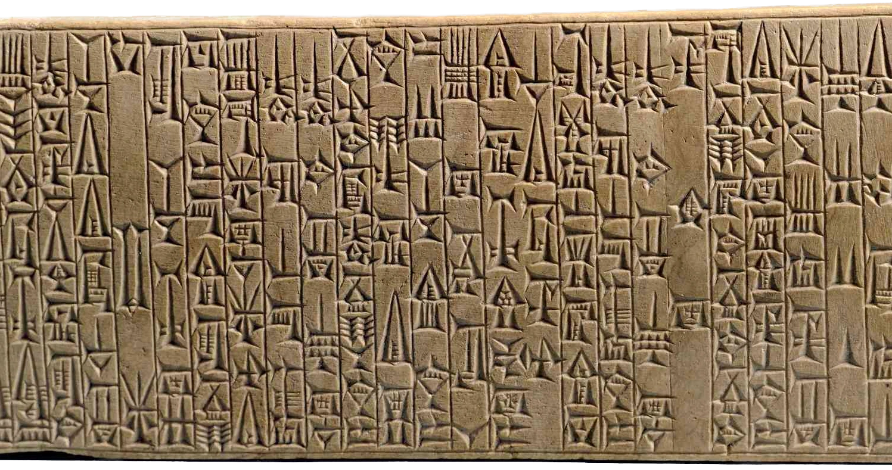

# Các yếu tố chính trị của nền văn minh

> <i>Phiến đá khắc **Bộ luật Hammurabi** ở Babylon. Nguồn: DEA / G. DAGLI ORTI / Getty Images</i>

## I. Nguồn gốc chính phủ

***Bản năng phi xã hội—Chủ nghĩa vô chính phủ nguyên thủy—Gia tộc và bộ lạc—Vua—Chiến tranh***

Con người không phải là một sinh vật quan tâm đến chính trị một cách tự nguyện. Con người liên kết với những người đồng loại của mình do thói quen, sự bắt chước và sự ép buộc của hoàn cảnh nhiều hơn là do ham muốn; sự ưa thích của người ấy với xã hội không nhiều bằng nỗi sợ sự cô đơn. Người ta kết giao với những người khác vì sự cô lập gây nguy hiểm cho người ta, và vì có nhiều việc có thể được làm tốt hơn cùng với nhau hơn là một thân một mình; trong thâm tâm người ta là một cá nhân đơn độc, anh hùng chống lại thế giới. Nếu con người điển hình này có thể sống theo cách của mình thì có lẽ sẽ không bao giờ có bất kỳ nhà nước nào. Ngay cả hôm nay, người ấy vẫn phẫn nộ về điều đó, mà xếp cái chết vào cùng một loại với thuế và khao khát một chính phủ ít có khả năng cai trị nhất. Nếu người ta đòi hỏi nhiều đạo luật thật ra chỉ vì tin chắc người hàng xóm của mình cần chúng; trong thâm tâm, người ấy là một người theo chủ nghĩa vô chính phủ không có triết lý, và cho rằng luật pháp áp dụng cho chính mình là thừa thãi.

Những xã hội đơn giản nhất hầu như không có chính phủ. Những thợ săn nguyên thủy có xu hướng chấp nhận luật lệ chỉ khi họ tham gia vào nhóm đi săn và chuẩn bị hành động. Người Bushmen thường sống thành những gia đình đơn độc; người Pygmy ở Châu Phi và những người bản địa đơn giản nhất của Úc chỉ tạm thời tham gia vào tổ chức chính trị, sau đó tản ra thành các nhóm gia đình; người Tasmania không có tù trưởng, không có luật lệ, không có chính quyền thường trực; người Veddah ở Ceylon hình thành các nhóm nhỏ theo mối quan hệ gia đình, nhưng không có chính quyền; người Kuhu ở Sumatra “sống mà không có đàn ông nắm quyền”, mỗi gia đình tự quản; người Fuegians hiếm khi có hơn mười hai người cùng nhau; người Tungus ít khi kết hợp thành nhóm khoảng mười lều ; “bầy đàn” người Úc hiếm khi có hơn sáu mươi người. Trong những trường hợp như vậy , sự liên hiệp và hợp tác là vì mục đích đặc biệt, như săn bắn; chúng không vươn tới bất kỳ trật tự chính trị lâu dài nào. Hình thức sớm nhất của tổ chức xã hội liên tục là gia tộc—một nhóm các gia đình có quan hệ họ hàng cùng sinh sống trên một vùng đất chung, có cùng vật tổ (*totemt*), và được cai trị bởi cùng một phong tục hoặc luật lệ. Khi một nhóm các thị tộc được thống nhất bởi cùng một thủ lĩnh, bộ lạc được thành lập và trở thành bước thứ hai trên con đường tiến tới nhà nước. Nhưng đây là một bước phát triển chậm chạp; nhiều nhóm không có thủ lĩnh nào cả, và nhiều nhóm khác dường như chỉ chấp nhận có trong thời chiến. Thay vì dân chủ như một chiếc lông vũ héo úa trên chiếc mũ của thời đại ta, [mô hình] nhà nước chỉ xuất hiện cùng lắm trong một số nhóm nguyên thủy, nơi mà chính quyền tồn tại chỉ là sự cai trị của những người đứng đầu gia tộc, và không có thẩm quyền độc đoán nào được cho phép. Người da đỏ Iroquois và Delaware không công nhận bất kỳ luật lệ hay hạn chế nào ngoài trật tự tự nhiên của gia đình và thị tộc; các thủ lĩnh của họ có quyền lực khiêm tốn, có thể bị các bô lão của bộ tộc chấm dứt bất cứ lúc nào. Người da đỏ Omaha bị tri phối bởi Hội đồng Bảy người, những người này đã suy tính cẩn trọng cho đến khi họ đi đến một thỏa thuận nhất trí; cùng với đó là Liên minh Iroquois nổi tiếng, trong đó nhiều bộ tộc đã ràng buộc mình—và tôn trọng lời cam kết của họ—vào việc gìn giữ hòa bình, và người ta không thấy cách biệt lớn nào giữa những “người man rợ” này và các quốc gia hiện đại gắn bó với nhau để duy trì hòa bình trong [Hội Quốc Liên](https://vi.wikipedia.org/wiki/H%E1%BB%99i_Qu%E1%BB%91c_Li%C3%AAn).

Chiến tranh tạo nên tù trưởng, vua và nhà nước, cũng như chính những điều này tạo nên chiến tranh. Ở Samoa, tù trưởng có quyền lực trong chiến tranh, nhưng vào những thời điểm khác, không ai chú ý nhiều đến ông ta. Người Dyaks không có chính quyền nào khác ngoài chính quyền của mỗi gia đình do người đứng đầu lãnh đạo; trong trường hợp xung đột, họ chọn chiến binh dũng cảm nhất của mình để lãnh đạo họ và tuân lệnh nghiêm ngặt; nhưng khi xung đột kết thúc, thực tế họ để ông ta đi làm công việc của chính mình. Trong khoảng thời gian hòa bình, các giáo sĩ hoặc pháp sư đứng đầu là những người có thẩmquyền và ảnh hưởng nhất; và khi cuối cùng một chế độ quân chủ lâu dài phát triển như một chế độ chính quyền thông thường trong phần lớn các bộ lạc, nó kết hợp và bắt nguồn từ các chức vụ của chiến binh, cha xứ và giáo sĩ. Các xã hội được cai trị bởi hai thế lực: trong hòa bình bằng lời nói, trong khủng hoảng bằng kiếm; vũ lực chỉ được sử dụng khi giáo điều không thành công. Luật pháp và huyền thoại đã song hành cùng nhau trong suốt nhiều thế kỷ, hợp tác hoặc thay phiên nhau trong việc quản lý nhân loại; cho đến tận ngày nay, không một quốc gia nào dám tách rời chúng, và có lẽ ngày mai chúng sẽ lại thống nhất.

Chiến tranh dẫn đến nhà nước như thế nào? Không phải là con người có khuynh hướng tự nhiên muốn chiến tranh. Một số dân tộc thấp kém khá hòa bình; và người Eskimo không thể hiểu tại sao người châu Âu cùng đức tin hòa bình lại săn bắt nhau như hải cẩu và cướp đất của nhau. “Tốt biết bao”—họ đã nhấn mạnh rằng đất của họ “bị bao phủ bởi băng và tuyết! Thật tốt biết bao nếu trong đá của người có vàng và bạc, thứ mà những người theo đạo Thiên chúa rất thèm muốn, nhưng nó lại được bao phủ bởi nhiều tuyết đến nỗi họ không thể với tới được! Sự cằn cỗi của người khiến chúng tôi hạnh phúc, và cứu chúng tôi khỏi sự quấy nhiễu.” Tuy nhiên, cuộc sống nguyên thủy đã nhuốm đỏ màu chiến tranh theo từng chu kì. Những người thợ săn chiến đấu vì những vùng đất săn bắn  vẫn sẵn có nhiều con mồi, những người chăn gia súc chiến đấu vì những đồng cỏ mới cho đàn gia súc của họ, những người cày ruộng chiến đấu vì đất màu nguyên sơ; tất cả bọn họ, đôi khi, chiến đấu để trả thù cho một vụ giết người, hoặc để tôi luyện và rèn luyện tuổi trẻ của họ, hoặc để phá vỡ sự đơn điệu của cuộc sống, hoặc để cướp bóc và hãm hiếp đơn thuần; rất hiếm khi vì tôn giáo. Có những thể chế và phong tục để hạn chế việc giết chóc, giống như giữa ta ngày nay—những giờ, ngày, tuần hoặc tháng nhất định mà không một man rợ nào được giết; một số hoạt động là bất khả xâm phạm, một số con đường là trung lập, một số thị trường và trại tị nạn được dành riêng cho hòa bình; và Liên minh Iroquois đã duy trì “Hòa bình vĩ đại” trong ba trăm năm. Nhưng phần lớn chiến tranh là công cụ ưa thích của sự chọn lọc tự nhiên giữa các quốc gia và nhóm nguyên thủy.

Kết quả của nó là vô tận. Nó hoạt động như một kẻ tiêu diệt tàn nhẫn những người yếu đuối, nâng cao trình độ của chủng tộc về lòng dũng cảm, bạo lực, sự tàn ác, trí thông minh và kỹ năng. Nó kích thích sự sáng tạo, tạo ra vũ khí trở thành công cụ hữu ích và nghệ thuật chiến tranh trở thành nghệ thuật hòa bình. (Có bao nhiêu tuyến đường sắt ngày nay bắt đầu bằng chiến lược [quân sự] và kết thúc bằng thương mại!) Trên hết, chiến tranh đã giải thể chủ nghĩa cộng sản và chủ nghĩa vô chính phủ nguyên thủy, đưa ra tổ chức và kỷ luật, và dẫn đến chế độ nô lệ của tù nhân, sự phục tùng của các giai cấp và sự phát triển của chính phủ. Tài sản là mẹ, chiến tranh là cha của nhà nước.

## II. Nhà nước

***Với tư cách là tổ chức của các lực lượng—Cộng đồng làng xã—Các trợ lý tâm lý của nhà nước***

“Một bầy thú săn mồi tóc vàng,” Nietzsche nói , “một chủng tộc của những kẻ chinh phục và làm chủ, với tất cả tổ chức hiếu chiến và tất cả sức mạnh tổ chức của mình, tấn công bằng những móng vuốt khủng khiếp vào một dân số, về số lượng có thể vượt trội hơn rất nhiều, nhưng vẫn vô định hình,… đó là nguồn gốc của nhà nước.” “Nhà nước khác với tổ chức bộ lạc," Lester Ward nói, “bắt đầu bằng cuộc chinh phục của một chủng tộc này bởi một chủng tộc khác.” “Ở khắp nơi,” Oppenheimer nói, “ta thấy một số bộ lạc hiếu chiến phá vỡ ranh giới của một số người ít hiếu chiến hơn, định cư như giới quý tộc và thành lập nhà nước của mình.” “Bạo lực,” Ratzenhofer nói , “là tác nhân tạo ra nhà nước.” Nhà nước, theo Gumplowicz, là kết quả của cuộc chinh phục, việc thiết lập những kẻ chiến thắng  như một đẳng cấp thống trị trên đầu những kẻ bị đánh bại. “Nhà nước,” Sumner nói, “là sản phẩm của vũ lực, và tồn tại bằng vũ lực.”
Sự chinh phục hung bạo này thường là do một bộ lạc những người thợ săn và chăn gia súc thực hiện với một nhóm nông dân định cư. Vì nông nghiệp dạy cho con người những cách thức hòa bình, làm họ quen với thói quen tầm thường và làm họ kiệt sức với công việc lao động dài ngày; những người như vậy tích lũy của cải, nhưng họ quên mất nghệ thuật và cảm tính về chiến tranh. Người thợ săn và người chăn gia súc, quen với nguy hiểm và có kỹ năng giết chóc, coi chiến tranh chỉ là một hình thức săn bắn khác , và không nguy hiểm hơn; khi rừng không còn cung cấp cho họ nhiều thú săn, hoặc đàn gia súc giảm dần qua đồng cỏ thưa thớt, họ nhìn vào những cánh đồng chín muồi của ngôi làng với sự ghen tị, họ dễ dàng bịa ra một số lý do hợp lý để tấn công, họ xâm lược, chinh phục, nô dịch và cai trị...1

Nhà nước là một sự phát triển muộn, và hầu như không xuất hiện trước thời kỳ lịch sử được viết ra. Vì nó giả định một sự thay đổi trong chính nguyên tắc của tổ chức xã hội —từ quan hệ họ hàng sang quan hệ thống trị; và trong các xã hội nguyên thủy, quan hệ đầu tiên thường phổ biến. Sự thống trị thành công nhất khi nó gắn kết các nhóm tự nhiên khác nhau thành một sự thống nhất có lợi về trật tự và thương mại. Ngay cả sự chinh phục như vậy cũng hiếm khi kéo dài trừ khi sự tiến bộ của phát minh đã củng cố sức mạnh của kẻ mạnh bằng cách đưa vào tay họ các công cụ và vũ khí mới để đàn áp nổi loạn. Trong cuộc chinh phục lâu dài, nguồn gốc sự thống trị có xu hướng bị che giấu và gần như vô thức; người Pháp nổi loạn năm 1789 hầu như không nhận ra, cho đến khi Camille Desmoulins nhắc nhở họ, rằng chế độ quý tộc đã cai trị họ trong một nghìn năm đã đến từ Đức và đã khuất phục họ bằng vũ lực. Thời gian làm cho mọi thứ trở nên thánh thiện; ngay cả vụ trộm cắp trắng trợn nhất, trong tay những đứa cháu của kẻ cướp, cũng trở thành tài sản thiêng liêng và bất khả xâm phạm. Mọi quốc gia đều bắt đầu bằng sự ép buộc; nhưng thói quen tuân thủ trở thành nội dung của lương tâm, và chẳng mấy chốc, mọi công dân đều rung động vì lòng trung thành với lá cờ.

Người dân đã đúng; vì bất kể nhà nước bắt đầu như thế nào, nó cũng sớm trở thành một trụ cột không thể thiếu để sắp xếp trật tự. Khi thương mại thống nhất các gia tộc và bộ lạc, các mối quan hệ nảy sinh không phụ thuộc vào quan hệ họ hàng mà phụ thuộc vào sự tiếp giáp, và do đó đòi hỏi một nguyên tắc điều chỉnh nhân tạo. Cộng đồng làng có thể là một ví dụ: nó thay thế bộ tộc và gia tộc như là phương thức tổ chức địa phương, và đạt được một chính quyền đơn giản, gần như dân chủ của những khu vực nhỏ thông qua một nhóm các trưởng gia đình; nhưng chính sự tồn tại và số lượng của những cộng đồng như vậy đã tạo ra nhu cầu về một lực lượng bên ngoài có thể điều chỉnh các mối quan hệ giữa chúng và đan xen chúng vào một mạng lưới kinh tế lớn hơn. Nhà nước, mặc dù là một con quỷ dữ ngay từ ban đầu, đã đáp ứng nhu cầu này; nó không chỉ trở thành một lực lượng có tổ chức, mà còn là một công cụ để điều chỉnh lợi ích của hàng ngàn nhóm xung đột tạo nên một xã hội phức tạp. Nó lan rộng các xúc tu của quyền lực và luật pháp của mình trên những khu vực ngày càng rộng hơn, và mặc dù nó khiến chiến tranh bên ngoài trở nên tàn khốc hơn trước, nó vẫn mở rộng và duy trì hòa bình nội bộ; nhà nước có thể được định nghĩa là hòa bình nội bộ cho chiến tranh bên ngoài. Con người đã quyết định nộp thuế hơn là chiến đấu với nhau, rằng cống nạp cho một tên cướp vĩ đại hơn là hối lộ tất cả bọn chúng. Có thể đánh giá một chế độ liên triều có ý nghĩa như thế nào đối với một xã hội quen với chính quyền thông qua hành vi của người Baganda (vương quốc Buganda, nay là Uganda), những người mà khi nhà vua băng hà, mọi người đều phải tự trang bị vũ khí; vì những kẻ vô luật pháp đã chạy loạn, giết chóc và cướp bóc ở khắp mọi nơi. “Nếu không có chế độ độc tài”, như Spencer đã nói, “sự tiến hóa của xã hội không thể bắt đầu.”

Một quốc gia chỉ dựa vào vũ lực sẽ sớm sụp đổ, vì mặc dù con người vốn cả tin nhưng cũng cố chấp, và quyền lực, giống như thuế, thành công nhất khi nó vô hình và gián tiếp. Do đó , để duy trì chính mình, nhà nước đã sử dụng và rèn giũa nhiều công cụ giáo điều—gia đình, nhà thờ, trường học—để xây dựng trong tâm hồn công dân thói quen trung thành và tự hào yêu nước. Việc này còn hơn cả một ngàn cảnh sát và nó chuẩn bị cho tâm trí công chúng về sự gắn kết ngoan ngoãn vốn không thể thiếu trong chiến tranh. Trên hết, nhóm thiểu số cầm quyền ngày càng tìm cách biến quyền thống trị bằng vũ lực của mình thành một hệ thống luật pháp, trong khi củng cố quyền thống trị đó, sẽ mang lại sự an ninh và trật tự đáng hoan nghênh cho người dân, và sẽ công nhận các quyền của “thần dân”2 đủ để giành được sự chấp nhận của họ đối với luật pháp và sự tuân thủ của họ đối với Nhà nước.

## III. Luật Pháp

***Tình trạng vô trật tự—Luật và phong tục—Sự báo thù—Tiền phạt—Tòa án—Sự thử thách—Cuộc đấu tay đôi—Sự trừng phạt—Tự do nguyên thủy***

Luật đi kèm với tài sản, hôn nhân và chính phủ; những xã hội thấp kém nhất vẫn có thể tồn tại mà không cần luật. “Tôi đã sống với những cộng đồng man rợ ở Nam Mỹ và ở phương Đông”, Alfred Russel Wallace nói, “những người không có luật pháp hay tòa án nào ngoài ý kiến của công chúng trong làng được bày tỏ một cách tự do. Mỗi người đều tôn trọng nghiêm ngặt quyền của đồng loại, và bất kỳ sự vi phạm nào đối với các quyền đó hiếm khi hoặc không bao giờ xảy ra. Trong một cộng đồng như vậy, tất cả đều gần như bình đẳng.” Herman Melville cũng viết tương tự về những người dân đảo Marquesas: “Trong suốt thời gian tôi sống giữa những người Typees, không ai từng bị đưa ra xét xử vì bất kỳ hành vi bạo lực nào đối với công chúng. Mọi thứ diễn ra trong thung lũng với sự hòa hợp và êm ả chưa từng có—mà tôi sẽ mạo muội khẳng định—như trong những hiệp hội được chọn lọc, tinh tế và ngoan đạo nhất của những người phàm trần trong thế giới Cơ đốc giáo.” Chính phủ cũ của những người Nga đã thành lập tòa án luật pháp ở quần đảo Aleutian, nhưng trong năm mươi năm, những tòa án đó không có việc để làm. “Tội phạm và hành vi phạm tội”, Brinton báo cáo, “rất hiếm khi xảy ra trong hệ thống xã hội của người Iroquois đến nỗi họ khó có thể nói rằng họ có bộ luật hình sự.” Đó là những điều kiện lý tưởng—có lẽ là lý tưởng hóa—mà những **người theo chủ nghĩa vô chính phủ** (*anarchist*) luôn mong muốn quay trở lại.

Những mô tả này cần có một số bổ sung nhất định. Các xã hội tự nhiên được cho là tương đối không có luật pháp trước hết vì chúng được cai trị bởi các phong tục cứng nhắc và bất khả xâm phạm như bất kỳ luật nào; và thứ hai vì các tội ác bạo lực, lúc đầu, được coi là vấn đề riêng tư và được dành cho sự trả thù cá nhân đẫm máu.
Bên dưới mọi hiện tượng của xã hội là vùng đất vững chắc (*terra firma*) vĩ đại của phong tục, nền tảng của các phương thức suy nghĩ và hành động đã được thời gian tôn vinh, cung cấp cho xã hội một số thước đo về sự ổn định và trật tự thông qua mọi sự vắng mặt, thay đổi và gián đoạn của luật pháp. Phong tục mang lại sự ổn định cho nhóm giống như di truyền và bản năng mang lại cho loài, và thói quen cho cá nhân. Đó là thói quen giúp con người tỉnh táo; vì nếu không có nếp sống mà suy nghĩ và hành động có thể dịch chuyển một cách dễ dàng một cách vô thức, thì tâm trí sẽ luôn do dự và sẽ sớm tìm nơi ẩn náu trong sự điên rồ. Một quy luật của sự tiết kiệm (*law of economy*) hoạt động trong bản năng và thói quen, trong phong tục và quy ước: phương thức phản ứng thuận tiện nhất đối với các kích thích lặp đi lặp lại hoặc các tình huống truyền thống là phản ứng tự động. Tư duy và đổi mới là sự xáo trộn của tính đều đặn, và chỉ được dung thứ khi cần những thích nghi không thể thiếu, hay triển vọng có được vàng.
Khi tôn giáo thêm vào nền tảng tự nhiên của phong tục này một sự trừng phạt siêu nhiên, và cách thức của tổ tiên cũng là ý muốn của các vị thần, thì phong tục trở nên mạnh hơn luật, và làm giảm đáng kể quyền tự do nguyên thủy. Vi phạm luật là giành được sự ngưỡng mộ của một nửa dân chúng, những người thầm ghen tị với bất kỳ ai có thể đánh bại kẻ thù cổ xưa này; vi phạm phong tục là gây ra sự thù địch gần như phổ quát. Vì phong tục xuất phát từ dân chúng, trong khi luật pháp được áp đặt lên họ từ trên cao; luật pháp thường là một sắc lệnh của chủ nhân, nhưng phong tục là sự lựa chọn tự nhiên của những phương thức hành động được cho là thuận tiện nhất trong kinh nghiệm của nhóm.

Luật pháp thay thế một phần phong tục khi nhà nước thay thế trật tự tự nhiên của gia đình, gia tộc, bộ lạc và cộng đồng làng xã; luật pháp thay thế phong tục một cách đầy đủ hơn khi chữ viết xuất hiện, và luật pháp chuyển từ một bộ luật được lưu giữ trong ký ức của những người lớn tuổi và các linh mục thành một hệ thống luật pháp được tuyên bố trong các bảng chữ viết. Nhưng sự thay thế không bao giờ hoàn tất; trong việc xác định và phán đoán hành vi của con người, phong tục vẫn là sức mạnh đằng sau luật pháp, quyền lực đằng sau ngai vàng, là “quan tòa cuối cùng của cuộc sống con người.”

Giai đoạn đầu tiên trong quá trình tiến hóa của luật pháp là trả thù cá nhân. “Sự trả thù là của tôi”, cá nhân nguyên thủy nói; “Tôi sẽ trả thù”. Trong số các bộ lạc người da đỏ ở Hạ California, mỗi người đàn ông đều là cảnh sát của chính mình và thực thi công lý dưới hình thức trả thù mà anh ta đủ mạnh để thực hiện. Vì vậy, trong nhiều xã hội ban đầu, việc A bị B giết dẫn đến việc B bị con trai hoặc bạn của A là C giết , C bị con trai hoặc bạn của B là D giết , và cứ như vậy cho đến hết bảng chữ cái; ta có thể tìm thấy ví dụ trong những gia đình thuần chủng nhất của Mỹ ngày nay. Nguyên tắc trả thù này vẫn tồn tại trong suốt lịch sử luật pháp: nó xuất hiện trong Lex Talionis[^1]—hay Luật Trả thù—được thể hiện trong Luật La-mã; nó đóng một vai trò lớn trong Bộ luật Hammurabi và trong những đồi hỏi của “Mosaic” về việc “mắt đền mắt, răng đền răng”; và nó ẩn sau hầu hết các hình phạt pháp lý ngay cả trong thời đại của ta.

[^1]:

    Một cụm từ dường như được Cicero phát minh ra.

Bước thứ hai hướng tới luật pháp và văn minh trong việc xử lý tội phạm là thay thế sự trả thù bằng [đền bù] thiệt hại. Rất thường xuyên, người đứng đầu, để duy trì sự hòa hợp nội bộ, sử dụng quyền lực hoặc ảnh hưởng của mình để khiến gia đình muốn trả thù bằng lòng với vàng hay hàng hóa thay vì máu. Chẳng bao lâu sau, một biểu thuế thường xuyên đã xuất hiện, xác định số tiền phải trả cho một con mắt, một cái răng, một cánh tay hoặc một mạng sống; Hammurabi đã ban hành luật lệ rộng rãi theo những điều khoản như vậy. Người Abyssinia rất tỉ mỉ trong vấn đề này đến nỗi khi một cậu bé rơi từ trên cây xuống người bạn của mình và giết chết cậu ta, các thẩm phán đã quyết định rằng người mẹ đau khổ nên gửi một người con trai khác của mình lên cây để rơi vào cổ thủ phạm. Hình phạt được áp dụng trong các trường hợp có thể thay đổi tùy theo giới tính, độ tuổi và cấp bậc của kẻ phạm tội và người bị hại; ví dụ, đối với người Fiji, trộm cắp vặt của một người đàn ông bình thường bị coi là tội ác tày đình hơn là việc giết người của một tù trưởng. Trong suốt lịch sử luật pháp, mức độ nghiêm trọng của tội ác được giảm nhẹ bởi tầm ảnh hưởng của người phạm tội[^2]. Vì những khoản tiền phạt hoặc tiền bồi thường này—được yêu cầu phải trả để ngăn chặn sự trả thù—đòi hỏi phải có một số phán quyết về tội phạm và thiệt hại, nên bước thứ ba hướng tới luật pháp đã được thực hiện bằng cách thành lập tòa án. Tù trưởng hoặc các bô lão hoặc các linh mục ngồi phán quyết để giải quyết xung đột của người dân. Những tòa án như vậy không phải lúc nào cũng là nơi xét xử; thường thì chúng là các hội đồng hòa giải tự nguyện, nơi sắp xếp một số giải quyết thân thiện cho việc tranh chấp[^3]. Trong nhiều thế kỷ và giữa nhiều dân tộc, việc dùng đến tòa án vẫn là tùy chọn; và khi bên bị xúc phạm không hài lòng với phán quyết được đưa ra, họ vẫn có thể tự do tìm cách trả thù cá nhân. Trong nhiều trường hợp, tranh chấp được giải quyết bằng một cuộc thi công khai giữa các bên, có nhiều mức độ đẫm máu từ một trận đấu quyền anh vô hại—như giữa những người Eskimo thông thái—đến một cuộc đấu tay đôi đến chết. Thường thì tâm trí nguyên thủy lại dùng đến sự thử thách không phải do thuyết thời trung cổ cho rằng một vị thần sẽ tiết lộ thủ phạm mà là vì hy vọng rằng qua thử thách, dù bất công đến đâu, sẽ chấm dứt một mối thù có thể kéo dài trong bộ tộc qua nhiều thế hệ. Đôi khi, người buộc tội và bị cáo được yêu cầu chọn giữa hai bát thức ăn mà một bát được tẩm độc; bên sai có thể bị đầu độc (thường không phải là không thể cứu vãn), nhưng sau đó tranh chấp đã kết thúc, vì cả hai bên thường tin vào sự công bằng của thử thách. Trong một số bộ lạc, theo phong tục, một người bản xứ thừa nhận tội lỗi của mình sẽ giơ chân ra và cho phép bên bị thương đâm vào chân bằng một ngọn giáo. Hoặc bị cáo đã chấp nhận cho những người buộc tội mình ném giáo vào người; nếu tất cả họ đều không ném trúng, anh ta được tuyên bố vô tội; nếu anh ta bị trúng, thậm chí chỉ một phát, anh ta bị kết tội, và vụ việc đã khép lại. Từ những hình thức ban đầu như vậy, thử thách vẫn tồn tại qua bộ luật của Moses và Hammurabi và kéo dài đến tận thời Trung cổ; cuộc đấu tay đôi, vốn là một hình thức thử thách, và các nhà sử học cho là đã chết, đang được hồi sinh trong thời đại của ta. Ở một số khía cạnh, khoảng cách giữa con người nguyên thủy và hiện đại thật ngắn và hạn chế; lịch sử của nền văn minh cũng ngắn ngủi như vậy.

[^2]:

    Có lẽ nên đưa ra một ngoại lệ trong trường hợp của những người Bà-la-môn, những người theo Bộ luật Manu (VIII, 336-8), được yêu cầu phải chịu hình phạt nặng hơn cho cùng một tội ác so với những người thuộc đẳng cấp thấp hơn; nhưng quy định này đã được tôn trọng trong trường hợp vi phạm.

[^3]:

    Một số thành phố hiện đại nhất của ta đang cố gắng khôi phục lại thể chế tiết kiệm thời gian cổ xưa này.

Tiến bộ thứ tư trong sự phát triển của luật pháp là sự thừa nhận, của thủ lĩnh hoặc của nhà nước, về nghĩa vụ ngăn ngừa và trừng phạt những hành vi sai trái. Đây chỉ là một bước chuyển từ việc giải quyết và trừng phạt các hành vi phạm tội đến việc đưa ra một số nỗ lực để ngăn chặn chúng. Vì vậy, thủ lĩnh không chỉ trở thành một thẩm phán mà còn là một nhà lập pháp; và đối với hội đồng chung của “luật chung” bắt nguồn từ các phong tục của nhóm, một hội đồng “luật tích cực” đã được thêm vào, bắt nguồn từ các sắc lệnh của chính phủ; trong trường hợp này, luật pháp phát triển, trong trường hợp kia, chúng được truyền lại. Trong cả hai trường hợp, luật pháp đều mang theo dấu ấn của tổ tiên họ và nồng nặc sự báo thù mà họ đã cố gắng thay thế. Hình phạt thô sơ rất tàn ác, do xã hội nguyên thủy cảm thấy bất an; khi tổ chức xã hội trở nên ổn định hơn, hình phạt sẽ bớt nghiêm khắc hơn.

Nhìn chung, cá nhân có ít “quyền” hơn trong xã hội tự nhiên so với dưới nền văn minh. Ở mọi nơi, con người sinh ra đều bị xiềng xích: xiềng xích của di truyền, của môi trường, của phong tục và của luật pháp. Những chuyển động nguyên thủy của cá nhân luôn nằm trong một mạng lưới các quy định vô cùng nghiêm ngặt và chi tiết; một ngàn điều cấm kỵ hạn chế hành động của anh ta , một ngàn nỗi kinh hoàng hạn chế ý chí của anh ta. Người bản địa New Zealand dường như không có luật pháp, nhưng trên thực tế, phong tục cứng nhắc đã chi phối mọi khía cạnh trong cuộc sống của họ. Những quy ước bất biến và không thể nghi ngờ đã quyết định việc ngồi và đứng, việc đứng và đi, việc ăn, uống và ngủ của người bản địa Bengal. Cá nhân hầu như không được công nhận là một thực thể riêng biệt trong xã hội tự nhiên; những gì tồn tại là gia đình và gia tộc, bộ lạc và cộng đồng làng xóm; chính những điều này sở hữu đất đai và thực thi quyền lực. Chỉ khi có sự xuất hiện của tài sản tư nhân, thứ mang lại cho anh ta thẩm quyền kinh tế, và của nhà nước, thứ mang lại cho anh ta địa vị pháp lý và các quyền được xác định, thì cá nhân mới bắt đầu nổi bật như một thực thể riêng biệt. Quyền không đến với ta từ thiên nhiên, thứ không biết đến quyền nào ngoài sự khéo léo và sức mạnh; chúng là những đặc quyền được cộng đồng đảm bảo cho các cá nhân vì nó có lợi cho lợi ích chung. Quyền tự do là một sự xa xỉ của an ninh; cá nhân tự do là sản phẩm và là dấu hiệu của nền văn minh.

## IV. Gia đình

***Chức năng của nó trong nền văn minh—Bộ tộc so với gia đình—Quá trình phát triển sự chăm sóc của cha mẹ—Vai trò tầm thường của người cha—Sự phân chia giới tính—Quyền của người mẹ—Địa vị của phụ nữ—Nghề của phụ nữ ấy—Thành tựu kinh tế của phụ nữ—Chế độ gia trưởng—Sự khuất phục của phụ nữ***

Do nhu cầu cơ bản của con người là để thoả mãn cái đói và tình yêu, vì vậy các chức năng cơ bản của tổ chức xã hội là chu cấp kinh tế và duy trì nòi giống; sự ra đời của những đứa trẻ cũng thiết yếu như dòng cung ứng liên tục của thực phẩm. Trong những định chế xã hội luôn tìm kiếm phúc lợi vật chất và trật tự chính trị, xã hội luôn bổ sung các thể chế để duy trì nòi giống. Cho đến khi nhà nước—hướng tới bình minh của các nền văn minh lịch sử—trở thành nguồn gốc trung tâm và lâu dài của trật tự xã hội, các bộ tộc đảm nhiệm nhiệm vụ tinh tế là điều chỉnh các mối quan hệ giữa các giới tính và giữa các thế hệ; và thậm chí sau khi nhà nước được thành lập, chính quyền thiết yếu của nhân loại này vẫn nằm trong gốc rễ sâu xa nhất của tất cả các thể chế lịch sử: gia đình.

Rất khó có khả năng những con người đầu tiên sống trong những gia đình biệt lập, ngay cả trong giai đoạn săn bắn; do sự yếu kém nơi các cơ quan sinh lí con người dùng để tự vệ vốn sẽ khiến những gia đình như vậy trở thành con mồi cho các loài thú dữ. Thông thường, trong tự nhiên, những sinh vật không được trang bị tốt để tự vệ sẽ sống theo bầy đàn và tìm ra phương thức tồn tại bằng các hành động đoàn kết trong một thế giới đầy rẫy răng nanh, móng vuốt và lớp da không thể xuyên thủng. Có lẽ con người cũng vậy; họ tự cứu mình bằng sự đoàn kết trong bầy đi săn và bộ lạc. Khi quan hệ kinh tế và sự thống trị về chính trị là nguyên tắc của tổ chức xã hội thay thế cho quan hệ họ hàng, bộ tộc mất đi vị thế là cấu trúc hỗ trợ của xã hội; ở dưới cùng, gia đình chiếm chỗ của bộ tộc, ở trên cùng, nhà nước thay thế bộ tộc. Chính phủ tiếp quản vấn đề duy trì trật tự, trong khi gia đình đảm nhận nhiệm vụ tổ chức lại công nghiệp và duy trì nòi giống.

Không có sự chăm sóc cho con cái trong số các loài động vật bậc thấp; do đó trứng được đẻ ra với số lượng lớn, và một số sống sót và phát triển trong khi phần lớn bị ăn hay bị huỷ hoại. Hầu hết các loài cá đẻ một triệu trứng mỗi năm; một số loài cá thể hiện sự quan tâm khiêm tốn đối với con cái của chúng và thấy rằng nửa trăm trứng mỗi năm là đủ cho mục đích của chúng. Các loài chim chăm sóc con non của chúng tốt hơn và ấp từ năm đến mười hai trứng mỗi năm; động vật có vú—mà tên của nó ám chỉ sự chăm sóc của cha mẹ—làm chủ trái đất với trung bình ba con non trên một con cái mỗi năm. Trong toàn bộ thế giới động vật, khả năng sinh sản và bị tiêu diệt giảm khi sự chăm sóc của cha mẹ tăng lên; trong toàn bộ thế giới loài người, tỷ lệ sinh và tỷ lệ tử vong giảm cùng nhau khi nền văn minh phát triển. Sự chăm sóc gia đình tốt hơn có thể giúp kéo dài tuổi vị thành niên, trong đó những đứa trẻ được đào tạo và phát triển đầy đủ hơn trước khi chúng được sử dụng các nguồn lực của riêng mình; và tỷ lệ sinh thấp hơn giải phóng năng lực của con người cho các hoạt động khác ngoài sinh sản.
Vì mẹ là người thực hiện hầu hết các chức năng của cha mẹ, nên lúc đầu (theo như ta có thể hiểu thấu đáo trong lịch sử) gia đình được tổ chức dựa trên giả định rằng vị trí của người đàn ông trong gia đình là phụ và hời hợt, trong khi vai trò của người phụ nữ là cơ bản và tối cao. Trong một số bộ lạc vẫn còn tồn tại, và có lẽ trong các nhóm người đầu tiên, vai trò sinh lý của nam giới trong sinh sản dường như đã hoàn toàn không được chú ý như ở động vật, những loài động dục, giao phối và sinh sản trong sự hân hoan vô thức về nguyên nhân và hệ quả. Người dân đảo Trobriand cho rằng việc mang thai không phải do bất kỳ hoạt động giao phối nào của hai giới, mà là do một baloma, hay ma, xâm nhập vào người phụ nữ. Thông thường, ma sẽ xâm nhập khi người phụ nữ đang tắm; “một con cá đã cắn tôi”, cô gái kể lại. “Khi,” Malinowski nói, “tôi hỏi ai là cha của đứa con ngoài giá thú, chỉ có một câu trả lời rằng không có cha, vì cô gái chưa kết hôn. Vậy thì, nếu tôi hỏi, một cách khá đơn giản, ai là cha về mặt sinh lý, thì không ai hiểu câu hỏi nghĩa là gì… Câu trả lời sẽ là: “Một baloma đã cho cô ấy đứa trẻ này.” Những người dân đảo này có một niềm tin kỳ lạ rằng baloma sẽ dễ dàng xâm nhập vào một cô gái đã buông thả quan hệ với đàn ông; tuy nhiên, khi lựa chọn biện pháp phòng ngừa mang thai, các cô gái thích tránh tắm khi thủy triều lên hơn là từ bỏ quan hệ với đàn ông. “Đó là một câu chuyện thú vị, tỏ ra khá thuận tiện khi nhắc đến sau hậu quả đáng xấu hổ của [mối quan hệ] hào phóng; điều này sẽ còn thú vị hơn nữa nếu nó được bịa ra cho cả các nhà nhân chủng học và các ông chồng.
Ở Melanesia, giao hợp được coi là nguyên nhân gây ra thai nghén, nhưng những cô gái chưa chồng khăng khăng đổ lỗi cho một số thứ trong chế độ ăn uống của họ. “Ngay cả khi đã hiểu được chức năng của nam giới, các mối quan hệ tình dục vẫn rất bất thường đến mức không bao giờ dễ dàng xác định được cha đẻ của đứa trẻ. Do đó, người mẹ khá nguyên thủy hiếm khi bận tâm đến việc tìm hiểu về cha đẻ của đứa con; nó thuộc về cô, và cô không thuộc về một người chồng mà thuộc về cha cô—hay anh em trai của cô—và bộ tộc; cô ở lại với những người này, và họ là những người họ hàng nam giới duy nhất mà con cô ấy biết. Mối quan hệ tình cảm giữa anh trai và chị gái thường bền chặt hơn giữa chồng và vợ. Trong nhiều trường hợp, người chồng vẫn ở trong gia đình và bộ tộc của mẹ mình, và chỉ coi vợ mình là một vị khách bí mật. Ngay cả trong nền văn minh cổ đại, người anh trai cũng được yêu quý hơn người chồng: chính anh trai cô ấy, chứ không phải chồng cô ấy, là người mà vợ của Intaphernes đã cứu khỏi cơn thịnh nộ của Darius; chính vì anh trai cô ấy, chứ không phải vì chồng cô ấy, mà Antigone đã hy sinh bản thân mình. Quan niệm cho rằng vợ của một người đàn ông là người gần gũi nhất trên thế giới với anh ta là một quan niệm tương đối hiện đại và chỉ giới hạn ở một bộ phận tương đối nhỏ của loài người.

Mối quan hệ giữa cha và con trong xã hội nguyên thủy rất mong manh đến nỗi ở rất nhiều bộ lạc, người khác giới sống cách biệt nhau. Ở Úc và New Guinea thuộc Anh, ở Mrica và Micronesia, ở Assam và Miến Điện, ở giữa những người Aleut, Eskimo và Samoyed, và ở đây đó trên khắp trái đất, vẫn có thể tìm thấy những bộ lạc không có cuộc sống gia đình rõ ràng; đàn ông sống tách biệt với phụ nữ và chỉ thỉnh thoảng đến thăm họ; ngay cả các bữa ăn cũng được dùng riêng. Ở miền bắc Papua, người ta không coi việc một người đàn ông xã giao với một người phụ nữ là đúng mực, ngay cả khi cô là mẹ của những đứa con của anh ta. Ở Tahiti, “cuộc sống gia đình hoàn toàn không được biết đến.” Từ sự phân biệt giới tính này những hội kín—thường là của nam giới—xuất hiện ở khắp mọi nơi trong các chủng tộc nguyên thủy và thường đóng vai trò là nơi ẩn náu để tránh xa phụ nữ. Chúng giống với các hội kín hiện đại của ta ở một điểm khác—việc tổ chức theo thứ bậc.

Hình thức gia đình đơn giản nhất, theo đó, là khi người phụ nữ và con cái của bà, sống với mẹ hoặc anh trai của bà trong gia tộc; việc sắp xếp như vậy là kết quả tự nhiên phát triển từ mô hình gia đình của động vật đến người mẹ và đàn con của bà, và cũng do sự thiếu hiểu biết về mặt sinh học của con người nguyên thủy. Một hình thức ban đầu thay thế, “hôn nhân theo chế độ mẫu hệ”: người chồng rời khỏi bộ tộc của mình và đến sống với bộ tộc và gia đình của vợ mình, lao động cho bà ấy hay cùng bà phục vụ cha mẹ bà. Trong những trường hợp như vậy, Dấu vết của xuất thân được tìm thấy qua dòng dõi người phụ nữ, và thừa kế được truyền từ đời mẹ; đôi khi thậm chí vương quyền được truyền từ phụ nữ thay vì từ đàn ông. “Quyền của người mẹ” không phải là “chế độ mẫu hệ”—nó không ngụ ý sự cai trị của phụ nữ đối với đàn ông. Ngay cả khi tài sản được trao truyền từ người phụ nữ, bà cũng có ít quyền lực đối với nó; bà được sử dụng như một phương tiện để lần theo các mối quan hệ—trong sự lỏng lẻo hay tự do nguyên thủy—mà nếu không thì sẽ rất mơ hồ. Đúng là trong bất kỳ hệ thống xã hội nào, người phụ nữ cũng có một số quyền hạn nhất định, bắt nguồn tự nhiên từ vai trò quan trọng của bà trong gia đình, từ chức năng của bà trong việc phân phối thực phẩm, từ nhu cầu của người đàn ông đối với bà, và quyền từ chối anh ta của bà. Đôi khi đúng là có những người phụ nữ cai trị trong một số bộ lạc Nam Phi; rằng ở Quần đảo Pelew , tù trưởng không làm việc gì hệ trọng nếu không có lời khuyên của một hội đồng gồm những phụ nữ lớn tuổi; rằng trong số những người Iroquois, những người phụ nữ da đỏ có quyền bình đẳng với nam giới, được phát biểu và bỏ phiếu trong hội đồng bộ lạc; và rằng trong số những người da đỏ Seneca, phụ nữ nắm giữ quyền lực rất lớn, thậm chí cả trong việc lựa chọn tù trưởng. Nhưng đây là những trường hợp hiếm hoi và ngoại lệ. Nhìn chung, phụ nữ trong các xã hội ban sơ thường chịu khuất phục, gần như một chế độ nô lệ. Việc phải trải qua thời kinh nguyệt định kì, việc xa lạ với vũ khí, việc giành phần lớn năng lượng sinh học trong việc mang thai, chăm sóc và nuôi dạy trẻ em, đã làm người phụ nữ bất lợi trong cuộc chiến giới tính, và khiến phụ nữ phải chấp nhận một địa vị phụ thuộc trong tất cả các xã hội ngoại trừ những xã hội thấp kém nhất và cao cấp nhất. Vị thế của phụ nữ cũng không nhất thiết được nâng cao cùng với sự phát triển của nền văn minh; vị trí ấy được sắp đặt thấp hơn trong những người Pericles ở Hy Lạp so với người da đỏ Bắc Mỹ; nó sẽ tăng lên và giảm xuống cùng với tầm quan trọng chiến lược của người phụ nữ hơn là cùng với văn hóa và đạo đức của con người.
Trong giai đoạn săn bắt, phụ nữ đã làm hầu hết mọi việc ngoại trừ việc sắn bắt trong thực tế. Để đổi lại việc phơi bày con người mình trước những khó khăn và rủi ro của cuộc săn đuổi, người đàn ông đã nghỉ ngơi hoàn toàn trong phần lớn thời gian của năm. Người phụ nữ sinh nhiều con, nuôi dạy chúng, sửa chữa lều hay nhà cửa, kiếm thức ăn trong rừng và đồng ruộng, nấu ăn, dọn dẹp, may quần áo và giày dép. Bởi vì đàn ông, khi bộ lạc di chuyển, phải sẵn sàng bất cứ lúc nào để chống trả cuộc tấn công, họ không mang theo gì ngoài vũ khí; phụ nữ mang tất cả những thứ còn lại. Thổ dân nữ được sử dụng làm như người hầu và như gia súc chuyên chở; nếu họ tỏ ra quá yếu để theo kịp cuộc hành trình, họ sẽ bị bỏ rơi. Khi người bản địa ở Hạ lưu sông Murray (đông nam Úc) nhìn thấy những con bò thồ hàng, họ nghĩ rằng đó là vợ của người da trắng. Sự khác biệt về sức mạnh giúp phân biệt giới tính như hiện nay hầu như không tồn tại vào thời đó, và sự khác biệt lúc bấy giờ là do môi trường hơn là bẩm sinh: phụ nữ, ngoài những vấn đề về mặt sinh học (như kinh nguyệt), gần như ngang bằng với đàn ông về vóc dáng, sức bền, sự tháo vát và lòng dũng cảm; họ vẫn chưa phải là một vật trang trí, một món đồ đẹp hay một món đồ chơi tình dục; họ là một loài động vật khỏe mạnh, có thể làm việc nặng nhọc trong nhiều giờ và nếu cần thiết, có thể chiến đấu đến chết vì con cái hay gia tộc của mình. “Phụ nữ”, một tù trưởng của Chippewas nói, “được sinh ra để làm việc. Một người họ có thể hoặc có thể mang vác được nhiều như hai người đàn ông. Họ cũng dựng lều cho chúng tôi, may quần áo cho chúng tôi , vá chúng và giữ ấm cho chúng tôi vào ban đêm. Chúng tôi hoàn toàn không thể đi xa mà không có họ. Họ làm mọi thứ và không tốn kém; vì họ phải nấu ăn liên tục, họ có thể thỏa mãn trong những lúc khó khăn bằng cách liếm ngón tay của mình.”

Hầu hết các tiến bộ kinh tế, trong xã hội ban sơ, được thực hiện bởi phụ nữ chứ không phải đàn ông. Trong nhiều thế kỷ, trong khi đàn ông bám vào cách săn bắn và chăn thả gia súc cổ xưa của mình, thì đàn bà đã phát triển nông nghiệp gần lều trại, và những nghệ thuật bận rộn của gia đình mà sau này sẽ trở thành những ngành công nghiệp quan trọng nhất. Từ “cây có lông”, như cách người Hy Lạp gọi cây bông, người phụ nữ nguyên thủy đã cuộn sợi và làm vải bông. Rõ ràng họ là người đã phát triển nghề may, nghề dệt, nghề đan lát, nghề gốm, làm mộc và xây dựng; và trong nhiều trường hợp, chính họ là người thực hiện việc buôn bán thô sơ. Chính họ là người phát triển mái ấm, từ từ đưa đàn ông vào danh sách các loài động vật thuần hóa của mình và huấn luyện họ những tính cách và tiện nghi xã hội vốn là nền tảng tâm lý và chất kết dính của nền văn minh.

Nhưng khi nông nghiệp trở nên phức tạp hơn và mang lại nhiều lợi ích hơn, thì phái mạnh ngày càng nắm giữ nhiều phần hơn vào tay mình. Sự phát triển của chăn nuôi gia súc đã mang lại cho người đàn ông một nguồn của cải, sự ổn định và quyền lực mới; ngay cả nông nghiệp, vốn có vẻ rất tầm thường đối với đấng Nimrod hùng mạnh thời cổ đại, cuối cùng cũng được những người đàn ông sống nay đây mai đó, và quyền lãnh đạo kinh tế mà việc cày cấy từng được trao cho phụ nữ trong một thời gian đã bị đàn ông giành mất. Việc ứng dụng vào nông nghiệp bằng sức lực của những loài động vật mà phụ nữ là người đầu tiên thuần hóa đã dẫn đến việc đàn ông thay thế họ kiểm soát các cánh đồng. Việc phát triển từ cuốc lỗ đến cày cấy đòi hỏi sức mạnh thể chất và cho phép đàn ông khẳng định quyền tối cao của mình. Sự gia tăng của tài sản có thể thừa kế nơi đàn gia súc và trong các sản phẩm của đất đã dẫn đến sự phục tùng về mặt tình dục của phụ nữ, vì giờ đây đàn ông đòi hỏi ở phụ nữ sự chung thủy mà anh ta nghĩ sẽ cho phép anh ta truyền lại những tích lũy của mình cho những đứa con mà có lẽ là của chính anh ta. Dần dần, người đàn ông đã đạt được điều mình muốn: quyền làm cha được công nhận, và tài sản bắt đầu được thừa kế qua người đàn ông; quyền của người mẹ nhường chỗ cho quyền của người cha; và gia đình phụ hệ, với người đàn ông lớn tuổi nhất đứng đầu, trở thành đơn vị kinh tế, pháp lý, chính trị và đạo đức của xã hội. Các vị thần, vốn chủ yếu là phụ nữ, đã biến thành những tộc trưởng râu ria vĩ đại, với những hậu cung mà những người đàn ông đầy tham vọng mơ ước trong sự cô độc của họ. Sự chuyển tiếp đến chế độ gia đình phụ hệ do nam trị là tai hại cho địa vị của người phụ nữ. Trong cách phương diện quan trọng, phụ nữ và con cái trở thành tài sản đầu tiên của cha hoặc anh cả, sau đó là của chồng. Phụ nữ được mua bằng hôn nhân giống hệt như cách người ta mua một nô lệ ngoài chợ. Bà được thừa kế như một tài sản khi chồng bà qua đời; và ở một số nơi (New Guinea, New Hebrides, Quần đảo Solomon, Fiji, Ấn Độ, v.v.), bà bị siết cổ và chôn cùng với người chồng đã chết của mình, hoặc được cho là sẽ tự tử, để chăm sóc ông ta ở thế giới bên kia. Người cha bây giờ có quyền đối xử, cho, bán hoặc cho mượn vợ và con gái của mình tùy ý, chỉ chịu sự lên án xã hội của những người cha khác thực hiện cùng các quyền đó. Trong khi người đàn ông giữ đặc quyền mở rộng ân huệ tình dục của mình ra ngoài phạm vi gia đình, người phụ nữ—dưới các định chế gia trưởng—đã thề sẽ hoàn toàn trinh bạch trước khi kết hôn, và hoàn toàn chung thủy sau khi kết hôn. Tiêu chuẩn kép đã ra đời.

Sự khuất phục chung của phụ nữ vốn tồn tại trong giai đoạn săn bắn, và đã tồn tại, ở dạng suy yếu, trong suốt thời kỳ của chế độ mẫu quyền, giờ đây trở nên rõ rệt và tàn nhẫn hơn trước. Ở nước Nga cổ đại, khi con gái kết hôn, người cha đánh nhẹ con gái bằng roi, rồi đưa roi cho chú rể, như một dấu hiệu cho thấy đòn roi của cô ấy giờ sẽ đến từ một bàn tay trẻ hóa. Ngay cả người Mỹ bản địa, những người mà chế độ mẫu quyền tồn tại dường như vô hạn cũng đối xử khắc nghiệt với phụ nữ của họ, giao phó cho họ mọi công việc nặng nhọc, và thường gọi họ là chó. Ở khắp mọi nơi, cuộc sống của một người phụ nữ bị coi là rẻ mạt hơn so với một người đàn ông; không có sự vui mừng nào đánh dấu sự ra đời nào khi các bé gái được sinh ra, như đối với một đứa con trai. Các bà mẹ đôi khi giết chết những đứa con gái của mình cứu chúng khỏi khổ đau. Ở Fiji, người vợ có thể bị bán tùy thích, với giá thông thường là một khẩu súng hỏa mai. Trong một số bộ lạc, đàn ông và vợ không ngủ chung, vì hơi thở của người phụ nữ có thể làm suy yếu người đàn ông; ở Fiji, người đàn ông không được phép ngủ thường xuyên ở nhà; ở New Caledonia, vợ ngủ trong một cái lán, trong khi đàn ông ngủ trong nhà. Ở Fiji, chó được phép đi vào một số ngôi đền, nhưng phụ nữ bị cấm tham gia tất cả các buổi lễ tôn giáo; sự loại trừ phụ nữ như vậy vẫn tồn tại trong đạo Hồi cho đến ngày nay. Người phụ nữ chắc chắn luôn thích thú với khả năng làm chủ của lời nói dài dòng; đàn ông có thể bị cự tuyệt, bị la mắng, thỉnh thoảng bị đánh đập. Nhưng xét cho cùng, đàn ông là chúa tể, đàn bà là đầy tớ. Người Kaffir mua những người vợ như mua như nô lệ, tương tự một hình thức bảo hiểm thu nhập trọn đời; khi có đủ số vợ, ông có thể nghỉ ngơi trong suốt quãng đời còn lại; họ sẽ làm mọi việc cho ông. Một số bộ lạc của Ấn Độ cổ đại coi phụ nữ trong gia đình là một phần của tài sản thừa kế, cùng với các loài vật nuôi; và điều răn cuối cùng của Moses cũng không phân biệt rõ ràng về vấn đề này. Trên khắp châu Phi, phụ nữ da đen hầu như không khác gì nô lệ, ngoại trừ việc họ được kỳ vọng sẽ cung cấp sự thỏa mãn về mặt tình dục cũng như kinh tế . Hôn nhân bắt đầu như một hình thức của luật sở hữu, như một phần của chế độ nô lệ.

**Tác giả: Will Durant**, một nhà sử học, triết gia Hoa Kì, được biết đến rộng rãi bởi tác phẩm gồm 11 cuốn, [Câu chuyện của nền văn minh](https://archive.org/details/TheStoryOfCivilizationcomplete/Durant_Will_-_The_story_of_civilization_1/) (*The Story of Civilization*).  Ông đấu tranh cho việc trả lương công bằng, quyền bầu cử của phụ nữ và các điều kiện làm việc tốt hơn cho người lao động Mỹ (theo [Wiki](https://vi.wikipedia.org/wiki/Will_Durant)). Ông đã tìm cách thống nhất và nhân bản hóa khối lượng kiến ​​thức lịch sử đồ sộ, vốn đã trở nên đồ sộ và bị phân mảnh thành các chuyên ngành bí truyền, và làm cho nó trở nên sống động để ứng dụng vào thời đại ngày nay. Nhờ thành công của mình, ông và vợ đã cùng được trao Giải thưởng Pulitzer cho tác phẩm phi hư cấu năm 1968 và Huân chương Tự do của Tổng thống năm 1977 (theo [Will Durant Foundation](https://www.will-durant.com))

**Sự thành lập nền văn minh**, Quyển 1: **Di sản phương Đông của chúng ta**, [Câu chuyện của nền văn minh](https://archive.org/details/TheStoryOfCivilizationcomplete/Durant_Will_-_The_story_of_civilization_1/)