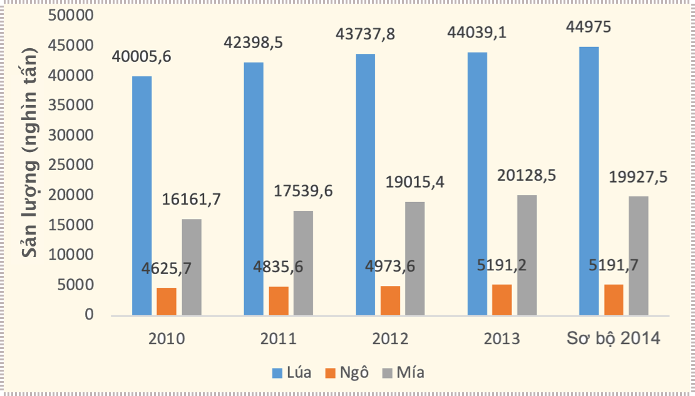
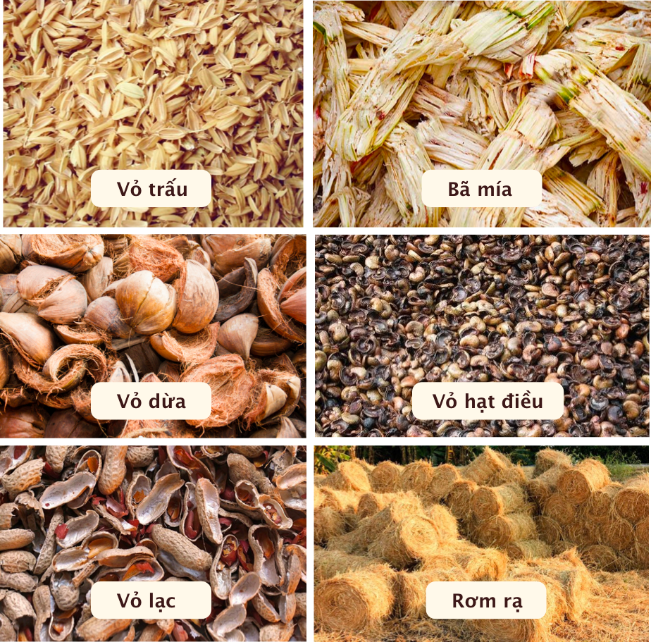
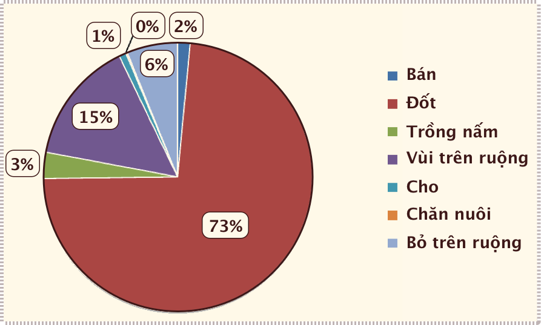
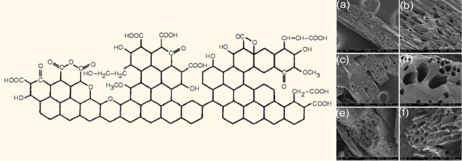
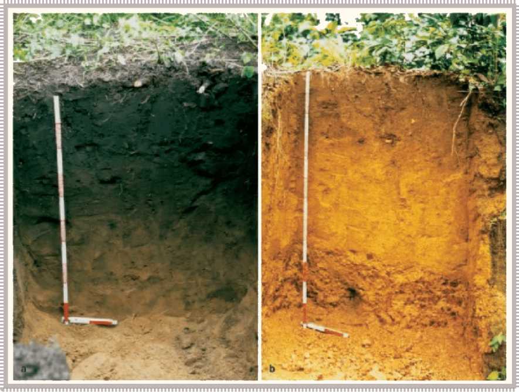
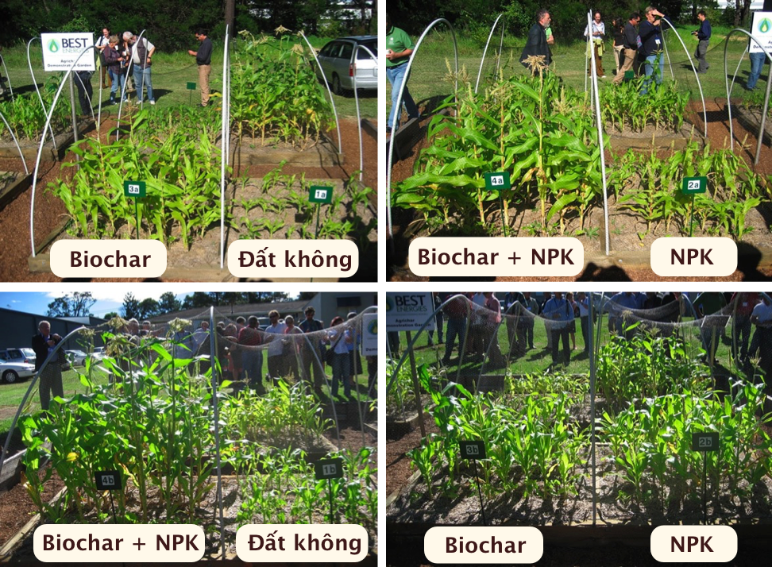

# Tiềm năng Than sinh học

Đất đai canh tác đang ngày một xấu đi và bị thu hẹp lại trong khi dân số trên thế giới ngày một gia tăng, vì vậy nhu cầu cải tạo đất vừa cấp bách vừa đòi hỏi phải đạt đến độ bền vững. Đất có khả năng lưu giữ các-bon thông qua thực vật sử dụng khí CO~2~ để quang hợp và do đó ảnh hưởng tới nồng độ CO~2~ trong khí quyển. **Than sinh học** (*biochar*) có thể được sử dụng để làm tăng khả năng cô lập các-bon của đất và đồng thời cải thiện “sức khỏe” đất. 

Khoảng 25% diện tích đất trên toàn cầu bị suy thoái bởi các hoạt động của con người. Than sinh học được làm từ dư lượng thực vật, phế phẩm sản xuất gỗ, giấy, phân gia cầm,... có thể giúp nông nghiệp phát triển bền vững hơn và biến các cánh đồng nơi “thu giữ” CO~2~. Thêm vào đó, biochar thu hút các vi sinh vật, giúp cây trồng hấp thu các chất dinh dưỡng trong đất, cho phép đất giữ nước nhiều hơn. 

## Thực trạng Việt Nam

Việt Nam có truyền thống làm nông nghiệp từ hàng ngàn năm nay, với hai vùng đồng bằng phì nhiêu là đồng bằng sông Hồng và đồng bằng sông Cửu Long, khí hậu nhiệt đới gió mùa phù hợp cho cây nông nghiệp phát triển quanh năm, đa dạng loại giống cây trồng; cùng với lực lượng lao động dồi dào nhiều kinh nghiệm đã đưa Việt Nam trở thành một nước lợi thế với nền nông nghiệp phát triển, là chỗ dựa vững chắc cho nền kinh tế đất nước cũng như cũng như đảm bảo an ninh lương thực. Sản lượng nông sản Việt Nam liên tục tăng qua các năm thể hiện qua biểu đồ sản lượng của 3 loại cây trồng: lúa, ngô, mía trong giai đoạn từ năm 2010-2014 (**Hình 1**). Cũng theo theo thống kê của Bộ Nông nghiệp và phát triển nông thôn sản lượng nông sản năm 2015, trên cả nước: sản lượng lúa ước tính đạt 45,22 triệu tấn, ngô đạt 5281 triệu tấn, sắn đạt 10,67 triệu tấn, rau các loại đạt 15,7 triệu tấn, đậu các loại đạt 169,6 nghìn tấn. 

> **Hình 1:** ***Sản lượng một số loại cây trồng năm 2010-2014.***

Trong quá trình sản xuất nông nghiệp hay chế biến nông sản, bên cạnh những sản phẩm chính sẽ phát sinh những phế phụ phẩm khác khiến cho nền nông nghiệp đã và đang phải đối mặt với việc xử lý phế thải trồng trọt, đặc biệt khi mùa thu hoạch đến. Khi trồng lúa ngoài hạt lúa thu hoạch được ta còn có rơm, rạ; khi xay xát thóc ngoài gạo ta còn có tấm,cám, trấu; khi thu hoạch ngoài hạt ngô ta còn có bẹ ngô, áo ngô, lõi ngô... Trong chăn nuôi gia súc, ngoài sản phẩm chính là thịt, trứng hay sữa ta còn có phân... Các phế thải nông nghiệp phát sinh từ hoạt động trồng trọt rất đa dạng như: rơm, rạ, vỏ trấu, vỏ cà phê, lõi ngô, xơ dừa, dây khoai, thân cây đậu...(**Hình 2**).

> **Hình 2:** ***Phế phụ phẩm nông nghiệp***

Khối lượng phế phụ phẩm này rất lớn tuỳ thuộc vào loại cây trồng, hình thức canh tác, mục đích sử dụng. Riêng đối với các cây trồng thuộc nhóm ngũ cốc như lúa, ngô, khoai...phế phụ phẩm thải ra rất lớn. Những phế phụ phẩm này thực sự là nguồn tài nguyên khổng lồ ước tính trên 100 triệu tấn/năm và ngày càng tăng cùng với sự gia tăng diện tích và năng suất cây trồng; giàu tiềm năng nhất là trấu, lá và bã mía, cây rừng tự nhiên (**Bảng 1**).

Các loại phế phụ phẩm này được sử dụng cho nhiều mục đích khác nhau đồng thời giúp tạo thêm thu nhập cho người dân, tuy vậy nếu không có những hình thức tận thu phế phụ phẩm phù hợp có thể gây ảnh hưởng xấu đến chất lượng môi trường.

|             **Loại phế phụ phẩm**        | **Số lượng (triệu tấn/năm)** |
|:----------------------------------------:|:------------------------:|
|                Trấu và rơm               |           40,80          |
|               Lá và bã mía               |           15,6           |
|             Cây rừng tự nhiên            |           14,07          |
|              Thân và lõi ngô             |           9,20           |
|              Cây rừng trông              |           9,07           |
|               Cây rừng thưa              |           7,79           |
|         Nguồn thải từ ngành giấy         |           5,58           |
|        Cây vùng đồi trống đồi trọc       |           2,47           |
|          Cây công nghiệp lâu năm         |           2,00           |
|                 Vỏ cà phê                |           1,17           |
|                  Mùn cưa                 |           1,12           |
|         Nguồn thải từ gỗ xây dựng        |           0,80           |
|                Cây ăn trái               |           0,41           |
| Các nguồn thải khác (dừa, đậu, khoai mì) |           6,37           |

> **Bảng 1:** ***Tiềm năng phế phụ phẩm ở Việt Nam[^1]***

[^1]:

    Nguyễn Đặng Anh Thi, Bio-Energy in Vietnam, 2014

Trong đó, phế phụ phẩm trấu tập trung chủ yếu tại Đồng bằng Sông Cửu Long, Đồng bằng Bắc Bộ và Duyên hải Nam Trung Bộ. Phế phụ phẩm mùn cưa tập trung nhiều ở miền Trung, Tây Nguyên, Tây Bắc. Vỏ cà phê có nhiều ở các tỉnh Tây Nguyên...Hầu hết các phế phụ phẩm nông nghiệp này có hàm lượng chất xơ rất cao ví dụ như rơm chứa 34% chất xơ, lá mía chiếm 43%...nên [động vật] rất khó tiêu hoá. Mặt khác một số loại phế phụ phẩm lại khó chế biến và dự trữ khi thu hoạch đồng loạt như cây lạc, dây lang, ngọn lá sắn, lá mía...Đó cũng là lí do khiến cho người nông dân chỉ sử dụng một phần các loại phế phụ phẩm này ở dạng tươi làm thức ăn cho gia súc.

Bên cạnh nguồn phế phụ phẩm rất đa dạng, các nghiên cứu nhận định các thành phần hydrate các-bon chính có trong các phế phụ phẩm nông nghiệp đều là xenlulozo, hemixenlulozo, và lignin chiếm 90% về khối lượng (**Bảng 2**). Thành phần nguyên tố hóa học trong phế phụ phẩm nông nghiệp cho thấy chủ yếu là các nguyên tố Các-bon, Hydro, Ôxi, Nittơ, Phốt-pho, Silic... Đặc biệt Silic là nguyên tố không chỉ chiếm tỷ lệ lớn trong thành phần tươi mà còn chiếm tỷ lệ lớn trong thành phần tro của các phế phụ phẩm, (**Bảng 3**). Đó là các nguyên tố vi lượng cần thiết cho đất và cây trồng, nếu không có các phương thức sử dụng phế phụ phẩm phù hợp và tận thu đối đa nguồn tài nguyên này sẽ gây thất thoát một lượng lớn các nguyên tố đa lượng: O, Si, Al, Fe, Ca, K, P, N, C, H.

|  **Thành phần** | **Xenlulozơ (%)** | **Hemizxenlulozơ** |  **Lignin**  |
|:-----------:|:-------------:|:--------------:|:---------:|
| Vỏ trấu[^2] |     25-35     |      18-21     |   26-31   |
|  Lá tre[^3] |     45-50     |      20-25     |   20-30   |
|  Rơm rạ[^4] |      39,2     |      23,5      |    36,1   |
| Mùn cưa[^5] |      45,1     |      28,1      |    24,1   |
|  Lá mía[^6] |     35-45     |    26,3-35,8   | 11,4-25,2 |
|  Lá ngô[^7] |      61,2     |      19,3      |    6,9    |
| Lõi ngô[^8] |      41,5     |       13       |    35,2   |

> **Bảng 2:** ***Thành phần các hợp chất hữu cơ của 7 loại vật liệu***

[^2]:

    Haiqing Yang and Kuichuan Sheng (2007)

[^3]:

    Dr J N Shah,Dr S R Shah and Sweety Agrawal (2012)

[^4]:

    T.S. El-TayebI; A.A. AbdelhafezI; S.H. AliII; E.M. Ramadan (2015)

[^5]:

    T.S. El-TayebI; A.A. AbdelhafezI; S.H. AliII; E.M. Ramadan (2015)

[^6]:

    Wiley, Society of Chemical Industry (2015)

[^7]:

    Braz. J. Microbiol (2012)

[^8]:

    Kiran R. Garadimani , G. U. Raju , K. G. Kodancha (2015)

|**Loại tro**|**% tan trong nước**|**% tan trong HCl**|**SiO~2~**|**Al~2~O~3~**|**Fe~2~O~3~**|**P~2~O~5~**|**K~2~O**|**CaO**|
|:------------:|:----------------:|:---------------:|:------:|:---------:|:---------:|:--------:|:-----:|:----:|
|      Cói     |       37,0       |       57,0      |  43,0  |    1,34   |    1,49   |    3,3   |  22,2 |  6,4 |
|   Rạ chiêm   |        3,2       |       13,1      |  86,7  |    2,04   |    3,19   |    0,9   |  2,0  |  2,6 |
|    Cây sậy   |        9,5       |       26,9      |  73,1  |    1,08   |    2,79   |    3,3   |  5,4  |  5,1 |
|   Thân ngô   |       13,7       |       36,2      |  63,8  |     0     |    2,09   |    9,5   |  8,3  |  5,2 |
|    Rạ mùa    |        6,8       |       18,2      |  81,8  |     0     |    3,29   |    1,2   |  1,4  |  3,8 |
|    Lá mía    |        8,1       |       19,3      |  80,7  |     0     |    1,49   |    2,3   |  5,0  |  5,5 |
|    Rạ nếp    |        5,9       |       11,0      |  89,0  |    0,3    |    1,29   |    0,6   |  3,5  |  1,7 |
|    Tàu dừa   |       35,0       |       76,2      |  23,8  |     0     |    1,49   |    6,4   |  21,0 | 11,2 |
|    Dâu tằm   |       20,4       |       70,1      |  29,9  |    0,4    |    1,59   |    8,8   |  12,2 | 25,1 |
|    Bã mía    |       16,5       |       39,1      |  60,9  |    0,2    |    1,29   |    8,4   |  9,9  |  3,8 |
|    Mạt cưa   |        6,4       |       54,6      |  45,4  |    2,2    |    3,69   |    2,0   |  3,8  | 20,6 |
|  Lá phi lao  |        0,8       |       41,5      |  58,5  |    4,3    |    3,09   |    1,0   |  0,5  | 17,5 |
|  Cây sú vẹt  |       17,0       |       56,1      |  43,9  |    3,6    |    1,19   |    1,6   |  10,2 | 12,2 |
| Cây trinh nữ |       25,2       |       70,8      |  29,2  |    0,6    |    2,19   |    5,8   |  15,7 | 16,6 |
|   Cây vừng   |       35,7       |       93,0      |   7,0  |     0     |    1,19   |    7,9   |  21,4 | 24,4 |
|    Cây đay   |       51,9       |       89,2      |  10,8  |     0     |    0,5    |    4,8   |  31,2 | 18,2 |
|     Trấu     |        4,2       |       4,6       |  95,4  |     0     |    2,39   |  0,40,6  |  2,5  |  0,8 |
|     Trấp     |        0,8       |       9,0       |  91,0  |    5,8    |    1,09   |    0,4   |  0,5  |  0,5 |
|    Cây sắn   |       32,1       |       98,4      |   5,2  |     0     |    1,49   |   16,4   |  20,3 | 23,2 |
|   Cây bông   |                  |                 |        |           |           |          |       |      |

> **Bảng 3:** ***Thành phần hoá học một số phế phụ phẩm nông nghiệp (tính theo %)***[^9]

[^9]:

    Bùi Huy Hiền (2013)

### Thực trạng sử dụng phế phụ phẩm nông nghiệp ở Việt Nam

Như thực trạng phát sinh phế phụ phẩm nông nghiệp đã nêu trên, nguồn phế phụ phẩm nước ta tương đối dồi dào, tuy nhiên các giải pháp đã và đang được áp dụng trong tận thu phế phụ phẩm nông nghiệp chưa tương xứng với lượng phát sinh hiện nay. Trước đây, khi chưa cơ giới hóa trong nông nghiệp, các phế phẩm nông nghiệp như rơm, rạ, bẹ ngô... được tái sử dụng. Bẹ ngô được sử dụng làm chất đốt trong gia đình. Rơm và rạ vừa được sử dụng làm chất đốt, vừa được dùng làm thức ăn trong chăn nuôi đồng thời cũng được dùng làm nguyên liệu ủ phân hữu cơ... Người nông dân có thể tận dụng nguồn phế phẩm nông nghiệp vào nhiều mục đích khác nhau.Ngày nay, đời sống được nâng cao, nhu cầu ngày một tăng, áp lực dân số gây nên áp lực an ninh lương thực trên toàn cầu, các sản phẩm cung cấp cho nông nghiệp ngày càng nhiều, nông nghiệp được cơ giới hóa, được chú trọng nhưng nó để lại không ít hệ quả ảnh hưởng tới môi trường đời sống con người. Con người không còn chú trọng đến việc tái sử dụng những phế phẩm nông nghiệp, vì thế những phế phẩm nông nghiệp này thường bị bỏ lại ngay tại đồng ruộng sau khi thu hoạch, thậm chí bị đốt ngay tại ruộng gây hậu quả nghiêm trọng tới môi trường đất, môi trường khí và ảnh hưởng các vấn đề nhân sinh xã hội khác. Do được cơ giới hóa, người dân dùng máy gặt, gặt lúa ngay trên đồng ruộng, sau đó chỉ việc mang lúa về. Phế phẩm từ lúa như rơm và rạ, người dân bỏ lại, thời gian sau sẽ đốt bỏ. Nhiều khi, người nông dân còn đốt rơm rạ cùng một lúc, **hiện tượng khói lan tỏa khắp nơi vừa ảnh hưởng tới môi trường, vừa ảnh hưởng tới sức khỏe con người và thậm chí gây mất an toàn giao thông**. Vấn đề đặt ra hiện nay làm thế nào giải quyết triệt để việc tái sử dụng phế phẩm nông nghiệp tạo sinh kế cho người nông dân đồng thời hạn chế mức độ ảnh hưởng tới môi trường.

Theo kết quả khảo sát của Trịnh Sĩ Nam về các hình thức sử dụng phế phụ phẩm nông nghiệp ở Đồng bằng sông Hồng năm 2012, (**Hình 3**) cho thấy có **6 biện pháp xử lý phế phụ phẩm** được người dân lựa chọn là: đốt trên đồng, vùi trong đất, làm giá thể trồng nấm, bán, chăn nuôi và cho người khác. Trong đó, tỷ lệ các hộ xử lý phế phụ phẩm sau thu hoạch bằng biện pháp đốt là 73,14%; vùi là 16,28%; làm giá thể trồng nấm là 3,46%; bán là 1,64%; chăn nuôi là 0,19% và cho người khác là 0,95%. Điều này cho thấy đốt phế phụ phẩm vẫn là biện pháp xử lý phổ biến nhất của nông hộ hiện nay, các hình thức sử dụng khác thì ít được phổ biến hơn.

Tuy nhiên khuynh hướng sử dụng phế phụ phẩm trên đồng ruộng cũng có sự thay đổi ở các vụ trong năm phụ thuộc rất nhiều vào số vụ canh tác nông phẩm trong năm, yếu tố thời tiết cũng như điều kiện canh tác của từng nông hộ. Thường người dân đốt rơm ở vụ có có thời tiết thuận lợi, trời thường nắng nóng nên tỷ lệ phế phụ phẩm cháy khi đốt cao hơn và thời gian cháy cũng nhanh hơn. Với vụ thời tiết không được thuận lợi có mưa nhiều tỷ lệ các hộ đốt rơm giảm, các hộ nông dân thường đốt phế phụ phẩm khi trời nắng và cày vùi phế phụ phẩm khi trời mưa. Theo tập quán canh tác, người dân đốt phế phụ phẩm để vệ sinh đồng ruộng chuẩn bị sản xuất vụ tiếp theo, đồng thời lượng tro sau khi đốt được làm phân để bón cho ruộng.

> **Hình 3:** ***Các hình thức sử dụng phế phụ phẩm phổ biến ở Đồng bằng sông Hồng năm 2012***

Biện pháp phổ biến nhất hiện nay là **đốt**, cụ thể phế phụ phẩm sau khi thu hoạch được để lại trên đồng ruộng cho khô, sau đó người dân thu thành đống và đốt. Đây là cách xử lý nhanh nhất, đơn giản, giảm giá thành, không tốn nhiều công sức, đồng thời tiêu hủy mầm bệnh, không phải tuân theo quy định nghiệm ngặt trong hoạt động vận hành. Nhưng nó cũng có nhược điểm làm **mất chất dinh dưỡng đất, gây ô nhiễm môi trường không khí nghiêm trọng, mất các-bon, gây hiệu ứng nhà kính, gây ảnh hưởng đến sức khỏe con người, gây ra các bệnh về đường hô hấp và gây hiện tượng khói mù cản trở tầm nhìn của người điều khiển phương tiện giao thông.**

**Vùi trực tiếp vào đất trên đồng ruộng** cũng là giải pháp truyền thống được người nông dân áp dụng. Sau khi thu hoạch nông sản, phế phụ phẩm được để lại ngay trên đồng ruộng. Khi người dân cày sẽ úp phế phụ phẩm xuống dưới. Nhờ các hoạt động của vi sinh vật, phế phụ phẩm sẽ được phân hủy để thành các chất hữu cơ dễ sử dụng cho cây trồng trong vụ trồng kế tiếp. Ưu điểm của hình thức này là giúp **tuần hoàn vòng vật chất, cải thiện các đặc tính hóa, sinh học cho đất, nâng cao độ phì của đất và duy trì khả năng sản xuất của đất đồng thời diệt trừ một số mầm sâu bênh hại**. Tuy nhiên, việc vùi phế phụ phẩm vào đất ướt sẽ gây ra tình trạng cố định đạm tạm thời và làm **tăng lượng khí metan phóng thích trong đất, gây ra tình trạng tích lũy các khí nhà kính, tốn công lao động và cần máy móc thích hợp cho làm đất và nó có thể gây ra một số mầm bệnh cho cây trồng**.

**Làm thức ăn cho gia súc, đun nấu**: phế phụ phẩm sau thu hoạch được tận dụng để làm thức ăn cho gia súc (nhóm động vật nhai lại) như trâu, bò và làm nguyên liệu đun nấu. Cách này đem lại **hiệu quả kinh tế, tiết kiệm được tiền cho việc mua thức ăn cho gia súc, thu mua những nhiên liệu khác để đun nấu và hạn chế ô nhiễm môi trường** do phế phụ phẩm không để ngoài đồng. Nhưng hạn chế là **không khép kín vòng tuần hoàn vật chất, chất dinh dưỡng bị cây trồng lấy đi** nhưng chưa có biện pháp thích hợp để bù trả lại và tốn công lao động cho việc thu gom.

Ngày nay, bên cạnh các biện pháp truyền thống trên, người nông dân còn sử dụng phế phụ phẩm làm **giá thể trồng nấm**. Rơm rạ được thu gom và làm chín nhằm phân hủy một số độc tố trong rơm rạ do khi canh tác ta sử dụng một số nông dược. Sau đó ép lại thành bánh rồi nuôi nấm trên những bánh rơm đó. Giải pháp này giúp **nâng cao hiệu quả kinh tế cho người dân, giảm tỉ lệ đói nghèo, cải thiện môi trường nông thôn** do tận dụng nguồn phế phụ phẩm nông nghiệp, tăng vẻ đẹp mỹ quan đồng thời **tạo công ăn việc làm cho người dân**. Tuy nhiên cách này **lấy mất hàm lượng chất dinh dưỡng của đất, phá vỡ vòng tuần hoàn vật chất trong đất**, để áp dụng được cách này người dân **cần đầu tư kinh phí để mua thiết bị, tạo cơ sở nuôi trồng nấm**.

Ngoài làm giá thể trồng nấm, người nông dân hiện nay cũng áp dụng giải pháp **ủ phế phụ phẩm làm phân hữu cơ**. Biện pháp này sử dụng phế phẩm đồng ruộng kết hợp với phân gia súc, gia cầm trộn cùng với chế phẩm vi sinh, và đảm bảo độ ẩm thích hợp cho vi sinh vật hoạt động phân hủy thành phân hữu cơ để bón cho cây trồng. Cách này đem lại lợi ích là **tiêu diệt được mầm bệnh, làm sạch đồng ruộng hạn chế ô nhiễm môi trường, trả lại một phần chất dinh dưỡng cho đất, đồng thời đem lại hiệu quả kinh tế nhờ tiết kiệm được tiền mua phân bón hóa học** (**Bảng 4**). Tuy nhiên, giải pháp này **cần thời gian ủ và tốn công lao động**.

| **Loại cây** | **Lượng phế thải trên đồng ruộng (tấn/ha)** | **Lượng phân hữu cơ được tạo ra (tấn/ha)** | **Số lượng lao động tham gia vào quá trình xử lí phế phụ phẩm (người/ha)** |
|:----------------:|:---------------------------------------:|:--------------------------------------:|:----------------------------------------------------------------------:|
|        Lúa       |                   16,5                  |                   6,6                  |                                   50                                   |
|        Ngô       |                   16,7                  |                   8,4                  |                                   50                                   |
| Lạc và đậu tương |                   8,0                   |                   2,8                  |                                   26                                   |
|       Hành       |                   15,4                  |                   8,5                  |                                    3                                   |
|        Tỏi       |                   22,7                  |                   7,9                  |                                   45                                   |

> **Bảng 4:** ***Hiệu quả xã hội của việc tái chế phế phụ phẩm nông nghiệp làm phân hữu cơ***

Ngày nay, khi khoa học công nghệ ngày càng phát triển, bên cạnh các hình thức sử dụng truyền thống của người dân, cũng đã có một số nghiên cứu mới theo hướng tận thu phế phụ phẩm nông nghiệp, điển hình là các biện pháp sản xuất năng lượng. Sinh khối có thể sản xuất ra nhiều loại năng lượng khác nhau như nhiệt, điện, xăng dầu vận tải.

**Sản xuất dầu sinh học**: nhiều nước đã chế tạo nhiên liệu sinh học từ sản phẩm nông nghiệp như từ ngô (Mỹ), từ mía đường (Brazil), củ cải đường (các nước châu Âu)...để thay thế cho nguyên liệu hoá thạch. Theo nghiên cứu của PGiáo sư.TS Đặng Tuyết Phương, Viện Hoá học Việt Nam, đốt 1 tấn rơm rạ có thể tạo ra khoảng 250kg nhiên liệu lỏng thô để sản xuất dầu sinh học thay vì chỉ thu được một lượng tro không đáng kể để bón ruộng đồng thời gây ô nhiễm môi trường. Theo kết quả nghiên cứu của các nhà khoa học thuộc Viện Dầu khí Việt Nam và Đại học Bách khoa Thành phố Hồ Chí Minh, khảo sát quá trình nhiệt phân nhanh rơm rạ ở điều kiện nhiệt độ phản ứng 500°C, lưu lượng khí 6 lít/phút và kích thước nguyên liệu rơm rạ dưới 2mm, hiệu suất bio oil cao nhất là 52,76%/kl (kilô lít). So với tiêu chuẩn chất lượng nhiên liệu sinh học lỏng nhiệt phân loại G dùng cho lò đốt công nghiệp tại Mỹ ban hành năm 2012, dầu sinh học đi từ rơm rạ theo phương pháp nhiệt phân nhanh này đáp ứng tiêu chuẩn. Với hiệu suất thu hồi lỏng dầu sinh học, nguồn nguyên liệu rơm rạ từ sản xuất nông nghiệp của Việt Nam có thể sản xuất được hàng chục triệu tấn bio oil/năm phục vụ làm nhiên liệu thay thế cũng như có thể **nâng cấp để sản xuất xăng, dầu diezel trong tương lai gần**.

**Sản xuất điện**: Mỹ là nước sản xuất điện **sinh khối** (*biomass*) lớn nhất thế giới, với hơn 350 nhà máy điện sinh học, sản xuất trên 7.500 MW điện mỗi năm. Những nhà máy này sử dụng chất thải từ nhà máy giấy, nhà máy cưa, sản phẩm phụ nông nghiệp, cành lá từ các vườn cây ăn quả... Năng lượng biomass chiếm 4% tổng năng lượng được tiêu thụ ở Mỹ và 45% năng lượng tái sinh.Ở Nhật Bản, chính phủ đã ban hành Chiến lược năng lượng sinh khối từ năm 2003 và hiện nay đang tích cực thực hiện Dự án phát triển các đô thị sinh khối (biomass town). Đến đầu năm 2011, Nhật Bản đã có 286 thị trấn sinh khối trải dài khắp đất nước.Trong khi nguồn năng lượng hóa thạch ngày càng cạn kiệt, nhu cầu sử dụng điện ngày càng cao thì giải pháp sử dụng nguồn điện sinh khối để thay thế mang ý nghĩa to lớn trên các khía cạnh kinh tế, xã hội và môi trường. Hơn nữa, Việt Nam lại có tiềm năng to lớn để phát triển điện sinh khối cả trong hiện tại và tương lai. Hiện nay, nước ta đã có các nhà máy điện sinh khối được triển khai và đi vào hoạt động tại một số tỉnh như Thanh Hoá, Phú Thọ...Tuy nhiên, phát triển điện sinh khối ở Việt Nam còn nhiều khiêm tốn.

Nhìn chung các phương pháp xử lý đối với phế thải nông nghiệp hiện nay đều mang tính truyền thống, diễn ra phổ biến ở các làng quê Việt Nam và đang gây ra những mối lo ngại về môi trường. Việc xử lý phế phụ phẩm bằng cách đốt ngoài trời, ngay trên đồng ruộng có thể gây nên vấn đề ô nhiễm không khí, ảnh hưởng đến sức khỏe người dân. Mặt khác, nhiều công trình nghiên cứu và kinh nghiệm thực tiễn cho thấy nếu không xử lý hết các phế thải nông nghiệp trên cánh đồng và để sót lại trên đất với lượng lớn có khả năng làm giảm sản lượng cây trồng, tăng các bệnh ở lá và suy thoái độ màu mỡ của đất. Chính vì vậy mà các công nghệ xử lý và tận dụng một cách kinh tế nguồn sản phẩm phụ nông nghiệp này cần được nghiên cứu và phát triển.

## Than sinh học và các ứng dụng của than sinh học trên thế giới và Việt Nam

### Than sinh học là gì?

Than sinh học (*biochar*) là sản phẩm tạo bởi sự nhiệt phân của nguyên liệu sinh học trong điệu kiện yếm khí hoặc hoàn toàn không có ôxy. Theo tổ chức IBI (International Biochar Initiative) thì than sinh học là một chất rắn thu được từ quá trình các-bon hóa sinh khối. Thông thường quá trình nhiệt phân sinh khối cho ra 20% biochar, 20% khí tổng hợp dùng làm nhiên liệu, và 60% dầu sinh học thay thế dầu mỏ trong sản xuất các vật dụng như đồ nhựa. Nhưng khi cần khối lượng lớn để cải tạo đất, người ta thay đổi cách đốt chậm hơn để có tỷ lệ biochar lên trên 50%. Điều khác biệt giữa biochar với than củi là mục đích sử dụng chính của nó. Biochar được sản xuất như một chất phụ gia cho đất, chủ yếu để cải thiện lưu giữ chất dinh dưỡng và lưu trữ các-bon. Biochar là chất ổn định vững chắc và giàu các-bon, do đó có thể được sử dụng để khóa các-bon trong đất. Sự quan tâm về biochar ngày càng tăng vì những lo ngại về biến đổi khí hậu gây ra bởi lượng khí thải các-bon đi-ô-xít (CO~2~) và các khí nhà kính khác (GHG). Mặc dù lịch sử của biochar đã kéo dài hàng ngàn năm song khoa học vẫn chưa hiểu thấu đáo về biochar.

Sản xuất biochar là một phương pháp để cố định các-bon theo chu trình tuần hoàn vật chất các-bon trong khí quyển (Warnock, 2007) và là một giải pháp để giảm thiểu tác động toàn cầu của nông nghiệp (và trong việc giảm ảnh hưởng từ tất cả các chất thải nông nghiệp). Từ biochar có thể cô lập các-bon trong đất cho hàng trăm đến hàng ngàn năm, và nó đã nhận được sự quan tâm đáng kể như một công cụ tiềm năng để làm chậm sự nóng lên toàn cầu. Sự phân hủy tự nhiên và đốt cháy của sinh khối và các vấn đề nông nghiệp đóng góp một lượng lớn khí CO~2~ thải vào khí quyển. Biochar có thể lưu trữ các-bon trong lòng đất, có khả năng làm giảm đáng kể lượng khí nhà kính trong khí quyển, đồng thời sự hiện diện của nó trong lòng đất có thể cải thiện chất lượng nước, tăng độ phì đất, nâng cao năng suất nông nghiệp.

Các yếu tố chính quyết định đến đặc tính của than sinh học là: thành phần vật liệu ban đầu; các yếu tố ảnh hưởng đến quá trình nhiệt phân (nhiệt độ, khí, chất xúc tác). Tiềm năng khai thác phế phụ phẩm nông nghiệp ở nước ta là rất lớn và chất lượng của một số loại biochar được sản xuất từ các nguồn phế phụ phẩm khác nhau như: trấu, rơm,lõi ngô, vỏ dừa,...cho hiệu suất thu hồi phế phụ phẩm và chất lượng khác nhau giữa các phương pháp đốt. Chính sự khác nhau về các yếu tố này đã ảnh hưởng đến tính chất và thành phần của than sinh học sau tạo thành.

### Tính chất vật lý

Than sinh học bao gồm 4 phần chính: các-bon bền, các-bon không bền, các thành phần bay hơi khác, phần tro khoáng và độ ẩm.

Thành phần trong than sinh học rất khác nhau phụ thuộc vào nguồn gốc sinh khối, các điều kiện nhiệt phân, nhiệt độ nhiệt phân, tốc độ lên nhiệt, áp suất, các điều kiện trước và sau xử lý. Tính chất vật lý của than sinh học phụ thuộc chủ yếu vào vật liệu ban đầu và các điều kiện nhiệt phân (Downie và nnk, 2009). Trong quá trình nhiệt phân, ở các nhiệt độ thấp xenlulozơ và hemi-xenlulozơ bị mất ở dạng chất hữu cơ bay hơi dẫn tới sự suy giảm về khối lượng. Chất khoáng và bộ khung các-bon vẫn giữ được hình dạng cấu trúc của vật liệu ban đầu. Cấu trúc phân tử của than có trạng thái xốp và có diện tích bề mặt lớn. Các lỗ rỗng đường kính rất nhỏ (50 nm) được hình thành trong quá trình nhiệt phân tạo nên các hệ thống mao quản. Chính hệ thống các lỗ rỗng trong than góp phần quan trọng cho sự thông khí, hoạt động của vùng rễ và cấu trúc của đất. Chính vì vậy bổ sung than vào đất làm thay đổi tính chất vật lý tự nhiên của đất, làm tăng tổng diện tích bề mặt riêng, cải thiện cấu trúc và sự thoáng khí của đất (Kolb, 2007).

***Cấu trúc xốp của bề mặt than sinh học:*** Than sinh học với sự sắp xếp ngẫu nhiên của các vi tinh thể và với liên kết ngang bền giữa chúng, làm cho than sinh học có một cấu trúc lỗ xốp khá phát triển. Chúng có tỷ trọng tương đối thấp (nhỏ hơn 2g/cm^3^) và mức độ graphit hóa thấp. Cấu trúc bề mặt này được tạo ra trong quá trình than hóa và phát triển hơn trong quá trình hoạt hóa, khi làm sạch nhựa đường và các chất chứa các-bon khác trong khoảng trống giữa các tinh thể. Quá trình hoạt hóa làm tăng thể tích và làm rộng đường kính lỗ. Cấu trúc lỗ và sự phân bố cấu trúc lỗ của chúng được quyết định chủ yếu từ bản chất nguyên liệu ban đầu và phương pháp than hóa. Sự hoạt hóa cũng loại bỏ các-bon không phải trong cấu trúc, làm lộ ra các tinh thể dưới sự hoạt động của các tác nhân hoạt hóa và cho phép phát triển cấu trúc vi lỗ xốp.

Trong pha sau cùng của phản ứng, sự mở rộng của các lỗ tồn tại và sự tạo thành các lỗ lớn bằng sự đốt cháy các vách ngăn giữa các lỗ cạnh nhau được diễn ra. Điều này làm cho các lỗ trống có chức năng vận chuyển và các lỗ lớn tăng lên, dẫn đến làm giảm thể tích vi lỗ. Theo Dubinin và Zaveria, than sinh học lỗ nhỏ được tạo ra khi **mức độ đốt cháy** (*burn-off*) nhỏ hợn 50% và than sinh học lỗ lớn khi mức độ đốt cháy là lớn hơn 75%. Khi mức độ đốt cháy trong khoảng 50- 75% sản phẩm có hỗn hợp cấu trúc lỗ xốp chứa tất cả các loại lỗ.

Nói chung than sinh học có bề mặt riêng phát triển và thường được đặc trưng bằng cấu trúc nhiều đường mao dẫn phân tán, tạo nên từ các lỗ với kích thướcvà hình dạng khác nhau. Người ta khó có thể đưa ra thông tin chính xác về hình dạng của lỗ xốp. Có vài phương pháp được sử dụng để xác định hình dạng của lỗ, các phương pháp này đã xác định than thường có dạng mao dẫn mở cả hai đầu hoặc có một đầu kín, thông thường có dạng rãnh, dạng chữ V và nhiều dạng khác.

Than sinh học có lỗ xốp từ 1nm đến vài nghìn nanomet. Dubinin đề xuất một cách phân loại lỗ xốp đã được Liên minh Quốc tế về Hóa học và Hóa học ứng dụng IUPAC chấp nhận. Sự phân loại này dựa trên chiều rộng của chúng, thể hiện khoảng cách giữa các thành của một lỗ xốp hình rãnh hoặc bán kính của lỗ dạng ống. Các lỗ được chia thành 3 nhóm, lỗ nhỏ, lỗ trung và lỗ lớn.

- **Lỗ nhỏ** (*Micropores*) có kích thước cỡ phân tử, bán kính hiệu dụng nhỏ hơn 2nm. Sự hấp phụ trong các lỗ này xảy ra theo cơ chế lấp đầy thể tích lỗ, và không xảy ra sự ngưng tụ mao quản. Năng lượng hấp phụ trong các lỗ này lớn hơn rất nhiều so với lỗ trung hay bề mặt không xốp vì sự nhân đôi của lực hấp phụ từ các vách đối diện nhau của vi lỗ. Nói chung chúng có thể tích lỗ từ 0,15 đến 0,7 cm^3^/g. Diện tích bề mặt riêng của lỗ nhỏ chiếm 95% tổng diện tích bề mặt của than sinh học.

- **Lỗ trung** (*Mesopore*) hay còn gọi là lỗ vận chuyển có bán kính hiệu dụng từ 2 đến 50 nm, thể tích của chúng thường từ 0,1 đến 0,2 cm^3^/g. Diện tích bề mặt của lỗ này chiếm không quá 5% tổng diện tích bề mặt của than. Tuy nhiên, bằng phương pháp đặc biệt người ta có thể tạo ra than sinh học có lỗ trung lớn hơn, thể tích của lỗ trung đạt được từ 0,2 đến 0,65 cm^3^/g và diện tích bề mặt của chúng đạt 200 m^2^/g. Các lỗ này đặc trưng bằng sự ngưng tụ mao quản của chất hấp phụ với sự tạo thành mặt khum của chất lỏng bị hấp phụ.

- **Lỗ lớn** (*Macropore*) không có nhiều ý nghĩa trong quá trình hấp phụ của than sinh học bởi vì chúng có diện tích bề mặt rất nhỏ và không vượt quá 0,5 m^2^/g. Chúng có bán kính hiệu dụng lớn hơn 50 nm và thường trong khoảng 500-2000 nm với thể tích lỗ từ 0,2– 0,4 cm^3^/g. Chúng hoạt động như một kênh cho chất bị hấp phụ vào trong lỗ nhỏ và lỗ trung. Các lỗ lớn không được lấp đầy bằng sự ngưng tụ mao quản.

***Nhóm Cacbon-ôxy trên bề mặt than sinh học:*** Nhóm các-bon-ôxy bề mặt là những nhóm quan trọng nhất ảnh hưởng đến đặc trừng bề mặt như tính ưa nước, độ phân cực, tính axít, và đặc điểm hóa lý như khả năng xúc tác, dẫn điện và khả năng phản ứng của các vật liệu này. Thực tế, ôxy đã kết hợp thường được biết là yếu tố làm cho than trở nên hữu ích và hiệu quả trong một số lĩnh vực ứng dụng nhất định. Ví dụ, ôxy có tác động quan trọng đến khả năng hấp phụ nước và các khí và hơi có cực khác, ảnh hưởng đến sự hấp phụ chất điện phân, lên than sử dụng làm chất lọc trong cao su và nhựa, lên độ nhớt của graphit cũng như lên tính chất của nó khi là một thành phần trong phản ứng hạt nhân. Trong trường hợp của sợi các-bon, nhóm bề mặt quyết định khả năng bám dính của nó vào chất nền là nhựa và sau đó là đặc điểm vật liệu composite. Theo Kipling, các nguyên tử ôxy và hydro là những thành phần cần thiết của than hoạt tính với đặc điểm hấp phụ tốt, và bề mặt của vật liệu này được nghiên cứu như một bề mặt hydrocác-bon biến đổi ở một số tính chất bằng nguyên tử ôxy.

Than sinh học có nhiều xu hướng mở rộng lớp ôxy đã được hấp thụ hóa học này và nhiều các phản ứng của chúng xảy ra do xu hướng này. Ví dụ, than sinh học có thể phân hủy các khí ôxy hóa như ozôn và ôxitt của nitơ. Chúng cũng phân hủy dung dich muối bạc halogen, sắt(III) clorua, KMnO4, amonipersunfat, axit nitric... Trong mỗi trường hợp, có sự hấp phụ hóa học ôxy và sự tạo thành hợp chất các-bon–ôxy bề mặt. Than sinh học cũng có thể được ôxy hóa bằng nhiệt trong không khí, CO~2~ hoặc ôxy. Bản chất và lượng nhóm ôxy-các-bon bề mặt tạo thành từ các sự ôxy hóa khác nhau phụ thuộc vào bản chất bề mặt than và cách tạo ra nó, diện tích bề mặt của nó, bản chất chất ôxy hóa và nhiệt độ quá trình.

Phản ứng của than sinh học với ôxit ở nhiệt độ dưới 400°C chủ yếu tạo ra sự hấp phụ hóa học ôxy và sự tạo thành hợp chất các-bon-ôxy bề mặt, khi ở nhiệt độ trên 400°C, sự phân hủy hợp chất bề mặt và khí hóa các-bon là các phản ứng trội hơn hẳn.

- C + O~2~ → C(O) (<400°C) Sự tạo thành hợp chất bề mặt
- C + O~2~ → CO + CO~2~ (>400°C) Sự khí hóa
- C(O) → CO + CO~2~ (>400°C) Sự phân hủy hợp chất bề mặt

Trong trường hợp sự ôxy hóa xảy ra trong dung dịch, phản ứng chính là sự tạo thành hợp chất bề mặt, mặc dù một vài quá trình khí hóa cũng có thể xảy ra phụ thuộc độ mạnh của chất ôxy hóa và sự khắc nghiệt của điều kiện thí nghiệm. Sự tạo thành hợp chất các-bon-ôxy bề mặt sử dụng than khác nhau. Than sinh học và muội than sử dụng nhiều cách ôxy hóa trong pha khí và pha lỏng đã được nghiên cứu nhiều hơn.

Đối những than có đặc trưng axit-bazơ, nhiều nhà khoa học đã bỏ công sức nghiên cứu để góp phần tìm hiểu nguyên nhân và cơ chế than có bản chất axít hay bazơ. Một vài thuyết, ví dụ thuyết điện hóa học của Burstein và Frumkin, thuyết ôxit của Shilov và trường của ông, thuyết pyron của Voll và Boehm đã được đưa ra để giải thích cho đặc trưng axít-bazơ của than. Các thuyết này và các nghiên cứu liên quan đã được xem xét lại một cách kỹ lưỡng và được xem xét trong một vài bài báo tổng kết. Bây giờ người ta đã chấp nhận rằng đặc trưng axít-bazơ của than là kết quả của quá trình ôxi hóa bề mặt, phụ thuộc vào cách tạo thành và nhiệt độ của quá trình ôxit hóa.

Dạng nhóm các-bon-ôxy bề mặt (axít, bazơ, trung hòa) đã được xác định, các nhóm axit bề mặt là rất đặc trưng và được tạo thành khi than được xử lý với ôxy ở nhiệt độ trên 400°C hoặc bằng phản ứng với dung dịch ôxy hóa ở nhiệt độ phòng. Các nhóm chức này ít bền nhiệt và phân hủy khi xử lý nhiệt trong chân không hoặc trong môi trường khí trơ ở nhiệt độ từ 350°C đến 750°C và giải phóng CO~2~. Các nhóm chức axit bề mặt này làm cho bề mặt than ưa nước và phân cực, các nhóm này là cabôxylic, lacton, phenol.

Các hợp chất bề mặt bị phân hủy thành CO~2~ khi xử lý nhiệt. Các nhóm trung hòa trên bề mặt bền hơn so với các nhóm axit và bắt đầu phân hủy trong khoảng nhiệt độ 500-600°C và bị loại bỏ hoàn toàn ở 950°C. Một dạng của bề mặt than sinh học đã được ôxy hóa được công bố bởi Tarkovskya ở **Hình 4** dưới đây.

> **Hình 4:** ***Mạng lưới tinh thể bề mặt than sinh học (trái), [biochar phóng to](https://www.researchgate.net/figure/SEM-images-of-biochars-a-biochar-700-at-500of-magnification-b-biochar-700-at-2-KX-of_fig2_359378803) (trái)***

Nhiều nỗ lực của nhiều nhà nghiên cứu để xác định và định lượng các nhóm ôxit- các-bon bề mặt sử dụng các phương pháp vật lý, hóa học và hóa lý để giải hấp lớp ôxitt, trung hòa với kiềm, chuẩn độ điện thế, phương pháp phổ như phổ IR, X-ray. Các nghiên cứu này đã chỉ ra sự tồn tại của vài nhóm chức, quan trọng hơn cả là các nhóm carbôxyl, lacton, phenol, quinin và hydroquinon. Tuy nhiên, các phương pháp này không đưa ra các kết quả có thể so sánh với nhau và nhiều khi không giải thích được toàn bộ lượng ôxit đã kết hợp.

**Tính chất hoá học:** Trong than sinh học có sự kết hợp chặt chẽ giữa các nguyên tố như: H, N, O, P, S trong các vòng thơm và chính điều này đã gây nên ái lực điện tử của than, ảnh hưởng đến **khả năng trao đổi cation** (*CEC*). Điện tích bề mặt của than quyết định bản chất của sự tương tác giữa than sinh học với các hạt đất, chất hữu cơ hòa tan, khí, vi sinh vật và nước trong đất. Theo thời gian, than sinh học trở lên mất dần hoạt tính do các lỗ rỗng của nó bị bít kín và do đó khả năng hấp phụ của nó sẽ giảm. Các lỗ rỗng bên trong trở nên không tiếp cận được dẫn tới giảm diện tích bề mặt (Warnock và nnk, 2007). Sự tái tạo lại hoạt tính là điều có thể khi vi khuẩn, nấm và giun tròn định cư trong các lỗ rỗng đó của than sinh học.

**Tính chất sinh học:** Không giống các loại chất hữu cơ khác được bổ sung vào đất, than sinh học làm thay đổi môi trường vật lý và hóa học của đất, ảnh hưởng tới các tính chất cũng như sự tồn tại, phát triển của sinh vật đất. Sự tương tác giữa các thành phần này góp phần quyết định đến toàn bộ năng suất và chức năng của hệ sinh thái, ví dụ như năng suất và sự phát triển của cây trồng.

**Hàm lượng dinh dưỡng:** Than sinh học mang giá trị dinh dưỡng khi được bổ sung vào đất. Mặc dù than sinh học thường không có hàm lượng Nitơ dễ tiêu cao, nhưng giá trị dinh dưỡng gián tiếp có được là do khả năng giữ lại các chất dinh dưỡng trong đất và hạn chế sự rửa trôi, dẫn đến tăng sự hút thu dinh dưỡng của cây trồng và năng suất vụ mùa cao hơn (Chan và Xu, 2009).

### Ứng dụng than sinh học 

Than sinh học là một trong những sản phẩm được đánh giá có tính ứng dụng cao trong đời sống và thân thiện môi trường. Than sinh học còn được gọi là phân bón thế hệ mới, cải thiện độ phì nhiêu của đất, tăng khả năng giữ nước và các chất dinh dưỡng, bảo vệ các loại vi khuẩn sống trong đất, chống lại các tác động xấu của thời tiết, xói mòn đất, làm tăng sản lượng cây trồng và giải quyết được nguồn phế phụ phẩm trong nông nghiệp. Than sinh học không chỉ cải tạo đất mà còn được dùng như một loại chất đốt thay cho than đá, dầu mỏ đang có nguy cơ cạn kiệt. Than sinh học làm vật liệu xử lý nước ô nhiễm, nước nhiễm kim loại nặng.

Vào năm 1545, trong khu rừng rậm vùng Amazon, các nhà thám hiểm Tây Ban Nha lần đầu tiên thấy các khu vườn tươi tốt, ở đó đất sâu giàu màu đen, không giống như những nơi mà họ từng thấy trước đây. Theo những kết quả nghiên cứu sau này, các nhà khoa học đã phát hiện ra được cách mà những người cổ đại đã tạo ra “đất đen” (*terra petra*) dồi dào dinh dưỡng. Từ 2.500 năm trước, người cổ đại đã biết dùng than đốt trong điều kiện hiếm khí ôxy để làm tăng độ phì nhiêu của đất, ảnh hưởng tốt đến sự sinh trưởng, phát triển của cây trồng. Theo Giáo sư Solomon, Dawit, Johannes Lehmann và cộng sự[^10]: đất đen của nông dân địa phương ở lưu vực Amazon của Brazil là loại được tạo ra bởi con người từ năm 450 BC (trước công nguyên) và 950 AD (sau công nguyên) ở độ sâu đến 2m, hiện người dân ở đây đã và đang tìm kiếm để khai thác “mỏ vàng đen” này sử dụng và để bán làm phân hữu cơ có giá trị.

[^10]:

    trong Molecular signature and sources of biochemical recalcitrance of organic các-bone in Amazonian Dark Earths, (2007)

> **Hình 5:** ***Đất đen (trái), so với đất bình thường (phải)***

Brazil là nước thuận lợi trong việc sản xuất than sinh học bởi hàng năm họ thu hoạch khoảng 460 Mt (triệu tấn) mía, như vậy có khoảng 100 Mt dư lượng có thể dùng cho mục đích tạo than sinh học. Tại Indonesia, một trong những nước sản xuất nhiều dầu cọ ở châu Á, trong cây cọ dầu sẽ cho 10% dầu, còn 90% sinh khối (cây, lá, quả, vỏ quả, xơ, buồng hoa, buồng quả...) đều là nguyên liệu để sản xuất than sinh học, biết được lợi ích từ than sinh học ở nước này đã có công ty sản xuất ở quy mô công nghiệp với công suất tới 200 tấn biocác-bon/ngày.

Trên thực tế, lợi ích của việc bón Biochar đã được quan trắc, kiểm nghiệm nhiều nơi ở Úc, Philippines, Congo... và nhiều nước đã có chế độ khuyến khích hay thưởng cho các nông hộ sử dụng loại than này. Theo Giáo sư Lehmann đã trình bày ở Hội hóa học Mỹ rằng sử dụng than sinh học cộng với phân hóa học đã làm tăng trưởng lúa mỳ mùa đông và rau quả lên 25-50% so với bón một mình phân hóa học, TS N.Sai Bhaskar Reddy (2008) nghiên cứu ở đậu tương cũng nhận xét rằng có thêm than sinh học vào đất nền, tỷ lệ nảy mầm cao, hệ rễ phát triển mạnh, quang hợp tăng, hoạt động của vi khuẩn cộng sinh cố định nitơ mạnh mẽ hơn so với đối chứng (trên đất nền).

Tại Mĩ đã có nghiên cứu của Elmer, Wade, Jason C. White, và Joseph J. Pignatello, Đại học tổng hợp Connecticut (2009) khi cho thêm than sinh học vào đất sẽ có được giá trị sinh học đặc biệt quan trọng bởi nó sẽ hấp thụ các chất ô nhiễm như kim loại, đặc biệt là kim loại nặng và thuốc trừ sâu ngấm vào đất nên không gây ô nhiễm các nguồn cung cấp thực phẩm. Than sinh học có thể được thiết kế để phù hợp với tính chất riêng biệt của đất. Cho thêm than sinh học ở mức 10% đất và giảm được tới 80% mức độ gây ô nhiễm thuốc trừ sâu độc hại như chlordane, DDX trong các cây trồng.

Tại Nhật Bản, Than sinh học được cấy thêm vi sinh vật để xử lý chất thải nhà vệ sinh, bảo vệ môi trường. Sử dụng than sinh học làm nguyên liệu sản xuất xi măng cũng là hướng đang được nhắm tới. Than sinh học góp phần giảm hiệu ứng nhà kính, theo dự báo của IBI, sử dụng biochar có thể giúp hấp thụ 2,2 tỷ tấn các-bon/năm vào năm 2050.

Ở Việt Nam, thử nghiệm sử dụng biochar để trồng lúa ở Thái Nguyên, với NPK + 2,5 tấn biochar cho năng suất lúa chỉ đứng sau phân bón hoá học NPK + 10 tấn compost (*phân ủ các loại phân động vật, rau củ, chất hữu cơ*) (**Bảng 5**); trong khi trồng rau với NPK + compost cho năng suất cao nhất, nhưng nếu bón thêm biochar, năng suất lại giảm (**Bảng 6**). Với biochar từ trấu, trồng đậu phộng ở Ninh Thuận bón đồng thời NPK + phân xanh + biochar cho năng suất cao nhất (**Bảng 7**). Để sử dụng biochar đạt hiệu quả, cần có những nghiên cứu áp dụng cụ thể cho từng loại biochar theo từng vùng đất và loại cây trồng.

<table style="width:100%;">
<colgroup>
<col style="width: 30%" />
<col style="width: 15%" />
<col style="width: 15%" />
<col style="width: 15%" />
<col style="width: 15%" />
</colgroup>
<thead>
<tr class="header">
<th style="text-align: center;"></th>
<th colspan="2" style="text-align: center;"><strong>Ở Thái
Nguyên</strong></th>
<th colspan="2" style="text-align: center;"><strong>Ở Thanh Hoá</strong></th>
</tr>
<tr class="odd">
<th style="text-align: center;"></th>
<th style="text-align: center;"><strong>(1)</strong></th>
<th style="text-align: center;"><strong>(2)</strong></th>
<th style="text-align: center;"><strong>(3)</strong></th>
<th style="text-align: center;"><strong>(4)</strong></th>
</tr>
</thead>
<tbody>
<tr class="odd">
<td style="text-align: center;">NPK</td>
<td style="text-align: center;"> 5,54</td>
<td style="text-align: center;"> 100</td>
<td style="text-align: center;">5,73</td>
<td style="text-align: center;">  100</td>
</tr>
<tr class="even">
<td style="text-align: center;">NPK + 0,5 tấn than sinh học</td>
<td style="text-align: center;"> 5,94</td>
<td style="text-align: center;">107,1</td>
<td style="text-align: center;">6,06</td>
<td style="text-align: center;">105,9</td>
</tr>
<tr class="odd">
<td style="text-align: center;">NPK + 2,5 tấn than sinh học</td>
<td style="text-align: center;"> 5,94</td>
<td style="text-align: center;">107,1</td>
<td style="text-align: center;">6,06</td>
<td style="text-align: center;">105,9</td>
</tr>
<tr class="even">
<td style="text-align: center;">NPK + 10 tấn compost</td>
<td style="text-align: center;"> 5,94</td>
<td style="text-align: center;">107,1</td>
<td style="text-align: center;">6,06</td>
<td style="text-align: center;">105,9</td>
</tr>
</tbody>
</table>

> **Bảng 5:** ***Ảnh hưởng của than sinh học lên sản lượng lúa ở Việt Nam.*** 
> Chú thích: **(1) (3)** Năng suất trung bình (tấn/ha) | **(2) (4)** So sánh năng suất khi chỉ bón NPK (%)

<table style="width:100%;">
<colgroup>
<col style="width: 80%" />
<col style="width: 5%" />
<col style="width: 5%" />
<col style="width: 5%" />
<col style="width: 5%" />
</colgroup>
<thead>
<tr class="header">
<th style="text-align: center;"></th>
<th colspan="2" style="text-align: center;"><strong>Ở Thái Nguyên (rau
mồng tơi)</strong></th>
<th colspan="2" style="text-align: center;"><strong>Ở Thanh Hoá (rau
muống)</strong></th>
</tr>
<tr class="odd">
<th style="text-align: center;"></th>
<th style="text-align: center;"> (1)</th>
<th style="text-align: center;">  (2)</th>
<th style="text-align: center;"> (3)</th>
<th style="text-align: center;">  (4)</th>
</tr>
</thead>
<tbody>
<tr class="odd">
<td style="text-align: center;">Thực tế của nông dân</td>
<td style="text-align: center;">14,33</td>
<td style="text-align: center;"> 100</td>
<td style="text-align: center;">16,83</td>
<td style="text-align: center;">  100</td>
</tr>
<tr class="even">
<td style="text-align: center;">Compost không than sinh học + NPK</td>
<td style="text-align: center;">17,67</td>
<td style="text-align: center;">123,3</td>
<td style="text-align: center;">22,43</td>
<td style="text-align: center;">133,3</td>
</tr>
<tr class="odd">
<td style="text-align: center;">Compost với 5% than sinh học + NPK</td>
<td style="text-align: center;">17,50</td>
<td style="text-align: center;">122,1</td>
<td style="text-align: center;">22,80</td>
<td style="text-align: center;">135,5</td>
</tr>
<tr class="even">
<td style="text-align: center;">Compost với 25% than sinh học +
NPK</td>
<td style="text-align: center;">15,00</td>
<td style="text-align: center;">104,7</td>
<td style="text-align: center;">17,88</td>
<td style="text-align: center;">106,2</td>
</tr>
</tbody>
</table>

> **Bảng 6:** ***Ảnh hưởng than sinh học lên sản lượng rau của Việt Nam.***
> Chú thích: **(1) (3)** Năng suất trung bình (tấn/ha) | **(2) (4)** So sánh năng suất khi chỉ bón NPK (%)

|     **Công thức thí nghiệm**    | **Sản lượng (tấn/ha)** |
|:-------------------------------:|:------------------:|
|          Không bón phân         |        1,08        |
|          Than sinh học          |        1,59        |
|               NPK               |        1,61        |
|       Than sinh học + NPK       |        2,05        |
|            Phân xanh            |        1,48        |
|    Than sinh học + Phân xanh    |        1,73        |
|         Phân xanh + NPK         |        1,77        |
| Than sinh học + Phân xanh + NPK |        2,29        |

> **Bảng 7:** ***Ảnh hưởng của than sinh học lên sản lượng của đậu phộng ở Ninh Thuận***

Một nghiên của tổ chức biochar quốc tế tại Terigal, Australia từ ngày 29/2/2007 khi nghiên cứu ảnh hưởng của biochar đến năng suất cây trồng trong các loại đất khác nhau. Các lô thử nghiệm tiến hành trong 10 tuần ở các loại đất khác nhau, cụ thể:

- Đất không (Lô 1)
- Đất + NPK (Lô 2)
- Đất + Biochar (Lô 3)
- Đất + NPK + Biochar (Lô 4)

Tỷ lệ ứng dụng biochar vào hai lô 3 và 4 là 50 tấn/ha.

> **Hình 6:** ***Thử nghiệm so sánh đất không / đất chỉ có NPK / đất chỉ có biochar / đất có cả biochar và NPK***

Qua các thử nghiệm trên ta có thể dễ dàng nhận biết sự khác biệt giữa việc sử dụng biochar so với việc không sử dụng chúng.

