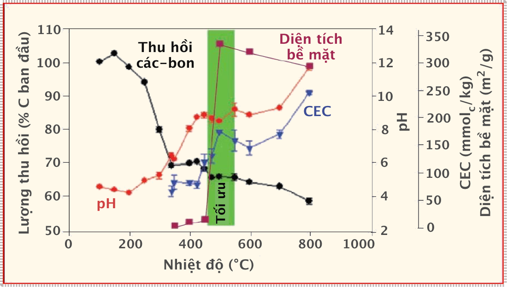
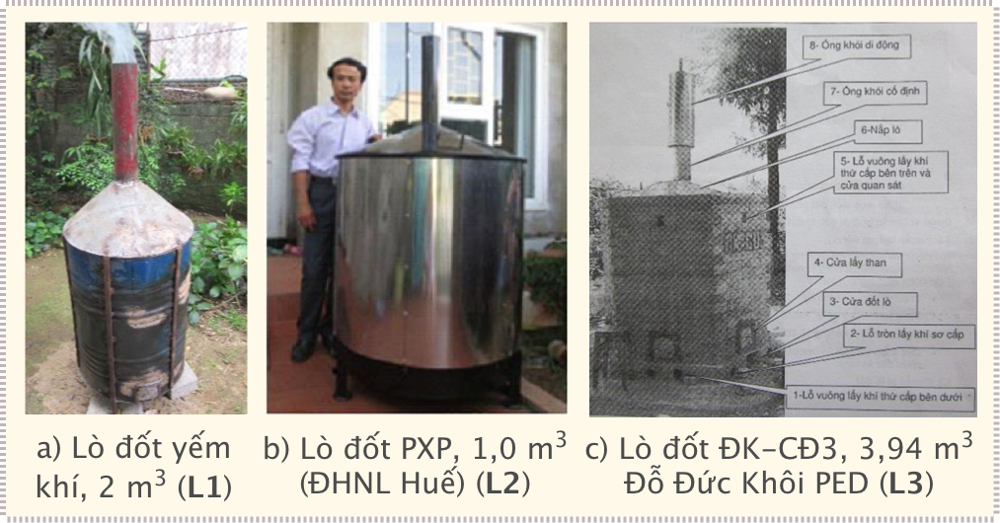
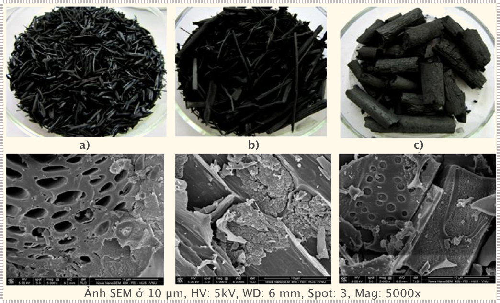
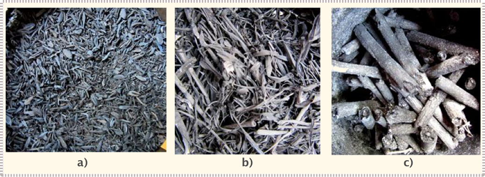
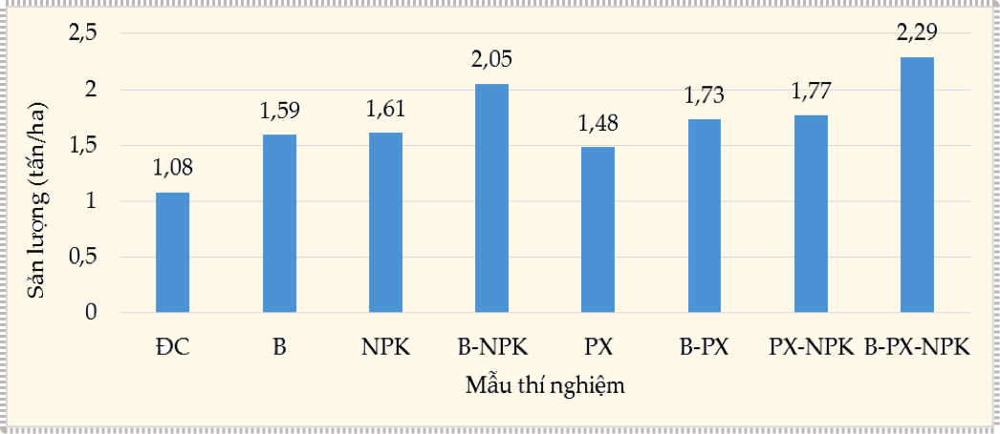

# Đánh giá các thiết bị sản xuất Than sinh học 

## Hiện trạng sản xuất than sinh học

Theo Lehmann và Joseph, than sinh học (biochar) là vật rắn giàu carbon (C) thu được từ việc nhiệt phân hóa sinh khối hay các chất hữu cơ trong môi trường yếm khí hạn chế oxy. Biochar có thể được sử dụng cho các ứng dụng như một tác nhân để cải tạo đất (tăng cường hàm lượng carbon, lưu giữ lâu dài trong đất, cải thiện tính chất vật lí của đất như tăng khả năng giữ nước và tạo độ thông thoáng, giữ dinh dưỡng trong đất), có khả năng làm tăng hệ vi sinh vật hữu ích trong đất, hiệu quả sử dụng tài nguyên được cải thiện, khắc phục và/ hoặc bảo vệ, hạn chế ô nhiễm môi trường, đặc biệt đây là một kênh giúp giảm thiểu khí nhà kính

Ở nước ta, hiện có khoảng 9 triệu hộ gia đình sống ở nông thôn đang sử dụng **năng lượng sinh khối (NLSK)** cho đun nấu hàng ngày. Hộ gia đình sử dụng củi chiếm 74 % và 65 % hộ gia đình ở nông thôn đồng bằng sử dụng rơm rạ, thân cây các loại và các hộ miền núi chỉ sử dụng thân, lõi ngô để đun nấu. Với tính toán của Viện Năng lượng Việt Nam, lượng chất thải nông nghiệp ở Việt Nam rất đa dạng (như rơm rạ, vỏ trấu, lõi ngô, vỏ dừa, vỏ cà phê, phế thải gỗ...), thải ra môi trường hoặc đốt ngoài đồng ruộng hàng năm rất lớn. Đây là một trong những nguồn NLSK tiềm năng để phục vụ cho nhu cầu đun nấu và sản xuất biochar. Năm 2013, tổng nguồn sinh khối vào khoảng 118,21 triệu tấn/năm; bao gồm khoảng 32,8 triệu tấn rơm rạ; 8 triệu tấn trấu; 15,6 triệu tấn bã mía; 1,2 triệu tấn vỏ cà phê; 9,2 triệu tấn lõi ngô; 8,1 triệu tấn các loại phụ phẩm nông nghiệp khác và phế thải từ gỗ khoảng 43,3 triệu tấn. Do đó, việc nghiên cứu thiết kế/ chế tạo/cải tiến một số loại bếp và lò đốt biochar không chỉ được thực hiện ở nhiều nước trên thế giới như Mỹ, Ấn Độ, Thái Lan, Phillipin, Trung Quốc... mà còn triển khai ở Việt Nam. Một số tỉnh thành trong nước có các kiểu bếp đun cải tiến và lò đốt than khác nhau về chất liệu, nhưng vẫn với nguyên tắc đốt yếm khí để hạn chế khói và tiết kiệm nhiên liệu như Thái Nguyên, Thái Bình, Bắc Giang, Hải Dương, Hưng Yên, Nam Định, Hà Nội, Thừa Thiên Huế, Đà Nẵng, Hồ Chí Minh...

Thừa Thiên Huế cũng có một số đề tài, dự án, nghiên cứu, sản xuất biochar và đánh giá lợi ích của việc ứng dụng biochar vào cải tạo đất. Từ năm 2008 đến 2013, Vườn quốc gia Bạch Mã đã triển khai “Dự án Than Bạch Mã” và có hơn 140 hộ dân ở huyện Phú Lộc và Nam Đông tham gia. Dự án đã chuyển giao kỹ thuật xây dựng mô hình trồng trọt, chăn nuôi áp dụng than, cách tạo than củi và than trấu, bên cạnh đó còn sản xuất cây trồng theo hướng hữu cơ, không dùng thuốc hóa học. Dự án này đã góp phần cải thiện thu nhập cho người dân sống ở vùng đệm và qua đó nâng cao ý thức bảo tồn thiên nhiên ở vùng lõi Vườn quốc gia Bạch Mã. Dự án “Giảm thiểu tổn thất sau thu hoặc và chế biến lúa gạo” do Viện lúa quốc tế (IRRI) chủ trì từ năm 2009 đến năm 2013, trong đó có hợp phần chế tạo lò đốt biochar của nhóm tác giả Phạm Xuân Phương, Đại học Nông lâm Huế cũng cho kết quả tốt. Thiết bị có khả năng tạo biochar từ vỏ trấu, rơm rạ, củi vụn, mùn cưa... nhanh chóng, tiết kiệm thời gian, công sức, ít tạo khói và khí thải; cho hiệu suất thu hồi biochar cao từ 85% đến 99%. Đề tài hợp tác nghiên cứu về biochar giữa Viện Tài nguyên và Môi trường - Đại học Huế và Đại học Okayama, Nhật Bản từ 2012 đến 2013 cũng cho kết quả khả quan. Trần Thị Tú và cộng sự cũng đã chỉ ra lợi ích của việc sử dụng biochar đến việc tăng cường hấp thu phân bón trên vật liệu, hạn chế rửa trôi chất dinh dưỡng và giữ độ ẩm đất. Tuy nhiên, việc nghiên cứu đánh giá và so sánh hiệu quả của các loài bếp đun và lò đốt tạo biochar vẫn chưa được triển khai và phân tích đầy đủ. Do đó, nghiên cứu này tiến hành tìm hiểu, tổng hợp, đánh giá hiệu quả tạo biochar của một số loại bếp cải tiến và lò đốt, có khả năng tiết kiệm năng lượng điện và nhiên liệu đã và đang áp dụng ở một số vùng nông thôn Việt Nam.

## Ứng dụng thực tiễn sản xuất biochar

### Quá trình nhiệt phân

Các phương pháp chính hiện nay để khai thác nguồn nhiên liệu sinh khối từ phụ phẩm nông nghiệp bao gồm: 

- (1) Đốt cháy trực tiếp; 
- (2) Nhiệt phân&mdash;Khí hóa; 
- (3) Chuyển hóa sinh học sang dạng khí sinh học giàu metan; 
- (4) Chuyển đổi sinh hóa để sản xuất các loại nhiên liệu lỏng như etanol/metanol. 

Như vậy, việc sản xuất biochar được thực hiện theo phương pháp (2) để nhiệt phân chậm và khí hóa vật liệu cháy thông qua quá trình chuyển đổi vật lý sang một dạng nhiên liệu thứ cấp cho quá trình cháy. Nguyên liệu dùng để đun là phụ phẩm nông nghiệp (vỏ trấu, rơm rạ, vỏ lạc, vỏ cà phê...).

<table style="width:100%;">
<colgroup>
<col style="width: 14%" />
<col style="width: 14%" />
<col style="width: 15%" />
<col style="width: 12%" />
<col style="width: 13%" />
<col style="width: 11%" />
<col style="width: 10%" />
</colgroup>
<thead>
<tr class="header">
<th rowspan="2" style="text-align: center;"><strong>Quá
trình</strong></th>
<th rowspan="2" style="text-align: center;"><strong>Nhiệt độ</strong>
(°C)</th>
<th rowspan="2" style="text-align: center;"><strong>Thời gian</strong>
giữ hơi nóng</th>
<th rowspan="2" style="text-align: center;"><strong>Áp
suất</strong></th>
<th colspan="4" style="text-align: center;"><strong>Sản phẩm (%)</strong></th>
</tr>
<tr class="odd">
<th style="text-align: center;">Chất lỏng (Dầu sinh học)</th>
<th style="text-align: center;">Chất rắng (Biochar)</th>
<th style="text-align: center;">Khí (Khí tổng hợp)</th>
</tr>
</thead>
<tbody>
<tr class="odd">
<td style="text-align: center;">Các-bon hoá thuỷ nhiệt</td>
<td style="text-align: center;">180-250</td>
<td style="text-align: center;">1-12 giờ</td>
<td style="text-align: center;">Có</td>
<td style="text-align: center;">5-20</td>
<td style="text-align: center;">50-80</td>
<td style="text-align: center;">2-5</td>
</tr>
<tr class="even">
<td style="text-align: center;">Nhiệt phân cực nhanh</td>
<td style="text-align: center;">350-650</td>
<td style="text-align: center;">5-30 phút</td>
<td style="text-align: center;">1-3 MPa</td>
<td style="text-align: center;">8</td>
<td style="text-align: center;">40</td>
<td style="text-align: center;">52</td>
</tr>
<tr class="odd">
<td style="text-align: center;">Nhiệt phân nhanh</td>
<td style="text-align: center;">400-550</td>
<td style="text-align: center;">1 giây</td>
<td style="text-align: center;">Không</td>
<td style="text-align: center;">75</td>
<td style="text-align: center;">12</td>
<td style="text-align: center;">13</td>
</tr>
<tr class="even">
<td style="text-align: center;">Nhiệt phân chậm</td>
<td style="text-align: center;">300-600</td>
<td style="text-align: center;">5-30 phút hoặc 1 ngày</td>
<td style="text-align: center;">Không</td>
<td style="text-align: center;">30</td>
<td style="text-align: center;">30</td>
<td style="text-align: center;">40</td>
</tr>
<tr class="odd">
<td style="text-align: center;">Khí hoá</td>
<td style="text-align: center;">350-650</td>
<td style="text-align: center;">5-30 phút</td>
<td style="text-align: center;">1-3 MPa</td>
<td style="text-align: center;"> 5</td>
<td style="text-align: center;">10</td>
<td style="text-align: center;">85</td>
</tr>
</tbody>
</table>

> **Bảng 1**: ***Tỷ lệ khối lượng nguyên liệu ban đầu với sản phẩm tạo ra từ các quá trình nhiệt phân***

Nguyên tắc chính của nhiệt phân là đốt nguyên liệu trong điều kiện yếm khí; khi đó không khí, H~2~O, carbon, tro than, sẽ phản ứng hóa học và sinh ra khí gas dễ cháy (CO, H~2~, CH~4~). Quá trình đốt có kiểm soát lượng khí thổi vào lò bằng quạt gió. Chất lượng và sản lượng biochar phụ thuộc rất lớn vào các quá trình nhiệt phân khác nhau. Hiện tại, biochar được nhiệt phân theo 5 kiểu khác nhau: carbon hóa thủy nhiệt, nhiệt phân cực nhanh, nhiệt phân nhanh, nhiệt phân chậm và khí hóa. Carbon hóa thủy nhiệt và nhiệt phân cực nhanh và chậm tạo ra nhiều biochar (**Bảng 1**). Biochar sản xuất ở nhiệt độ thấp (<400°C) có diện tích bề mặt riêng nhỏ hơn 10 m^2^/g; nhiệt độ từ 430°C đến 470°C có diện tích bề mặt riêng >300 m^2^/g. Nhiệt độ càng cao, biochar tạo ra có thành phần carbon càng thấp, độ pH càng tăng và khả năng trao đổi cation (CEC&mdash;Cation Exchange Capacity) cũng tăng (**Hình 1**). Như vậy, mục đích tạo ra nhiều biochar chất lượng tốt và có khả năng hấp phụ chất dinh dưỡng, giữ độ ẩm thì nhiệt độ nhiệt phân từ 350°C đến 600°C là tối ưu.

> **Hình 1**: ***Đặc điểm biochar, CEC, độ pH và diện tích bề mặt thay đổi theo nhiệt độ***

### CEC và độ pH

Khả năng trao đổi cation (CEC) của đất được hiểu nôm na là khả năng đất “giữ” chất dinh dưỡng bên mình như các cation, anion và thậm chí cả những phân tử hữu cơ và các vật chất lơ lửng khác, nó là khả năng hấp thụ và “ngăn chặn” sự thẩm thấu vào nước ngầm và nước mặt của  những chất đó. Đó là tại các địa điểm tích điện trên bề mặt của biochar (và đất sét và các chất hữu cơ), nơi các cation có liên kết tĩnh điện và trao đổi. CEC của biochar liên quan tới nhiệt độ của quá trình nhiệt phân và hình thức nhiệt phân. Như đã nói phần trên CEC của biochar tăng tỉ lệ thuận với nhiệt độ nung, tăng nhiệt độ nhiệt phân từ 380-800°C thì CEC tăng trong khoảng 80-250 (mmol~c~/kg), nhiệt độ tối thích tổng hòa cho các thông số khác là khoảng 500°C ở nhiệt độ này CEC của biochar khoảng 170-180 (mmol~c~/kg), đó là một giá trị CEC rất cao. Khi bổ sung biochar vào đất, với CEC cao biochar sẽ làm tăng tương đối giá trị CEC của đất lên và qua đó cải thiện khả năng duy trì và bảo vệ lượng cation, tránh việc chúng đị rửa trôi đặc biệt là các cation kim loại kiềm và kiềm thổ, v.v.

Anion bị hập phụ rất kém của đất trung tính hoặc đất có pH kiềm, đó là một trong những lý do tại sao canh tác nông nghiệp chúng ta lại phải thường xuyên bón phân bổ sung các chất dinh dưỡng đặc biệt là dưới dạng anion (HPO~4~^2&ndash;^,H~2~PO~4~^&ndash;^, NO~3~ , SO~4~^2&ndash;^...). Chúng rất dễ bị rửa trôi vào môi trường nước ngầm hoặc nước mặt gây hiện tượng phú dưỡng. Cheng và cộng sự (2007) đã tìm thấy bằng chứng về khả năng trao đổi anion của biochar (ở pH=3,5) tại đất canh tác có tuổi canh tác cao (trên 70 năm) nơi mà khả năng này giảm xuống rất thấp (có khu vực đã không còn khả năng hấp phụ trao đổi anion). Tuy nhiên cơ chế của quá trình này ra sao thì vẫn chưa có câu trả lời thỏa đáng. Một giả thiết là lượng phytolit (Si vô định hình&mdash;tiền vật liệu điều chế zeonit)  được làm giàu trong quá trình nhiệt phân tạo biochar đã hấp phụ các anion, điều này đã được nhiều nhà khoa học trên thế giời tìm hiểu, và đã chứng minh được khả năng hấp phụ chất hữu cơ của phytonit với các ion âm trong đó có các ion hữa cơ như humic, oxalat,… mặc dù bản than phytonit mang điện âm.

Giá trị pH của biochar thường ổn định trong khoảng pH trung tính và hơi kiềm nên rất tốt khi sử dụng để đưa vào đất chua. Một thử nghiệm đã được tiến hành trên đất trung bình, có pH=5,3; sau khi bổ sung thêm biochar thì giá trị pH của đất được tăng lên tới pH=6,3. Một thực nghiệm khác, biochar sản xuất từ phân gia cầm khi bổ sung vào đât chua nhẹ có pH=4,8, sau một thời gian cải tạo pH đã tăng lên 6,8. Các nhà khoa học cũng đồng ý rằng thay vì bón vôi để cải tạo độ chua ta nên sử dụng biochar vì những lợi ích bền vững của nó, mặt khác chi phí để chi cho sử dụng biochar là thấp hơn so với chi phí khi sử dụng vôi điều này rất có lợi về kinh tế cho các hộ gia đình.

### Các kiểu bếp cải tiến và lò đốt sản xuất biochar

Biochar được tạo ra từ nhiều kiểu lò khác nhau. Một số mẫu lò đốt tạo biochar từ đơn giản, xây bằng đất, gạch đến phức tạp, đòi hỏi phải đầu tư về máy móc thiết bị. Vì thế, những nước đang phát triển cũng có thể tự sản xuất biochar. Lò đốt biochar khảo sát làm bằng sắt, thép, inox (**L1**, **L2**) hoặc gạch và inox (**L3**) (**Hình 2**). Tuy nhiên, việc sản xuất biochar sẽ thuận lợi, hiệu quả và đỡ tốn công sức hơn nếu được đầu tư đồng bộ và tự động hóa. NLSK từ phụ phẩm nông nghiệp như trấu, rơm rạ đã được sử dụng rất phổ biến ở các vùng nông thôn của nước ta, hầu hết dùng làm chất đốt trong đun nấu và sinh hoạt hàng ngày. Tuy nhiên, các lò đốt, bếp truyền thống (bếp kiềng, bếp đất nung miệng loe,...) thường có hiệu suất thấp (H = 8% đến 15%), tiêu tốn nhiều nhiên liệu và tạo nhiều khói bụi do một lượng lớn nhiệt của quá trình cháy bị tổn thất và phân tán ra môi trường.

> **Hình 2**: ***Lò đốt biochar***

Một số mô hình lò đốt yếm khí được nghiên cứu thành công tại Viện Môi trường Nông nghiệp (Viện Khoa học Nông nghiệp Việt Nam) đã sản xuất thành công biochar từ dăm gỗ, mùn cưa, rơm, rạ, trấu, bã mía, ngô, cà phê. Phạm Xuân Phương và cộng sự (Đại học Nông Lâm, Đại học Huế) đã nghiên cứu, thiết kế và chế tạo thành công lò đốt biochar (lò **L2**) có công suất từ 50 kg/mẻ đến 300 kg/mẻ. Đỗ Đức Khôi (Trung tâm Dân số, Môi trường và Phát triển (PED), Hà Nội) chế tạo, lắp đặt thử nghiệm lò đốt ĐK-TR1 và ĐK-CĐ3 (lò **L3**) cũng tạo ra biochar với chất lượng tốt. Các lò đốt nhiệt phân ở Việt Nam chủ yếu làm việc theo nguyên tắc đốt yếm khí trực tiếp, tự ngún có hỗ trợ của quạt gió cung cấp một lượng không khí vừa đủ. Năng lượng cung cấp là mồi lửa ban đầu và dùng quạt cấp khí (**Hình 3**). Bên cạnh đó, các loại bếp được cải tiến nhiều lần ở nhiều nơi trên thế giới cũng như ở Việt Nam. Đỗ Đức Khôi đã chế tạo ra nhiều loại bếp cải tiến ĐK. Trong đó, bếp ĐK-T5 (lò **B7**) và lò đốt có cấu tạo như lò **L1** làm việc theo nguyên tắc đốt yếm khí trực tiếp, được sử dụng trong nghiên cứu của Mai Thị Lan Anh (Đại học Khoa học Thái Nguyên), tạo ra biochar từ rơm rạ, củi, lõi ngô, trấu dùng làm phân bón. Hợp tác xã Công nghiệp&mdash;Dịch vụ Hưng Thịnh, phường Nông Tiến (Tuyên Quang) chuyên sản xuất và đưa ra thị trường biochar từ mùn cưa. Đề tài “Nghiên cứu sản xuất than sinh học từ lục bình phục vụ sản xuất nông nghiệp” đang được Trung tâm Nghiên cứu Đất Phân bón và Môi trường phía Nam, Tp. Hồ Chí Minh triển khai... Tuy nhiên, những thiết kế và chế tạo này chưa được ứng dụng rộng rãi mà chỉ là những nghiên cứu nhỏ và được hỗ trợ giá từ các dự án nghiên cứu thí điểm ở một số địa phương; quy mô sản xuất thiết bị còn nhỏ lẻ và chưa có điều kiện để mở rộng thị trường tiêu thụ ra nhiều tỉnh khác.

> **Hình 3**: ***Các kiểu bếp đun cải tiến ở Việt Nam và trên thế giới***

Bên cạnh mục đích tạo biochar, bếp đun bằng phụ phẩm nông nghiệp được sử dụng để phục vụ đun nấu và tiết kiệm chi phí nhiên liệu. Sau khi điều tra về kích thước của bếp/lò, chúng ta có thể tham khảo thêm kết quả tính toán một số thông số của các kiểu lò đốt và bếp đun cải tiến[^1].

[^1]:

    [Khảo sát, đánh giá và lựa chọn một số thiết bị sản xuất than sinh học (biochar) cho vùng nông thôn Việt Nam](https://www.researchgate.net/publication/315683588_Khao_sat_danh_gia_va_lua_chon_mot_so_thiet_bi_san_xuat_than_sinh_hoc_biochar_cho_vung_nong_thon_Viet_Nam_Examination_evaluation_and_selection_of_furnaces_producing_biochar_for_the_rural_regions_of_Vie)

> **Hình 4**: ***Ảnh SEM của mẫu biochar từ vỏ trấu (a), rơm rạ (b) và gỗ củi (c) dùng lò đốt L1***

Mỗi lò đều có ưu điểm tạo ra biochar có chất lượng than tốt, đen bóng, nguyên cấu trúc vật liệu ban đầu. Ảnh chụp SEM của than thu được từ lò **L1** cho thấy cấu trúc bề mặt vật liệu xốp, với nhiều lỗ rỗng (vỏ trấu), dạng ống rỗng (rơm rạ) và dạng lỗ&mdash;ống rỗng (gỗ củi) với kích thước lỗ <10 μm (**Hình 4**). Tuy nhiên, tùy thuộc vào chi phí đầu tư ban đầu và tiêu hao nhiên liệu mà tổng chi phí theo ngày của mỗi lò khác nhau. Hiệu suất của từng loại lò biến động từ 45% đến 85%, sản lượng biochar tạo ra từ 9,9 kg/mẻ đến 115 kg/mẻ.

> **Hình 5**: ***Mẫu biochar từ vỏ trấu (a), rơm rạ (b) và gỗ củi (c) dùng bếp trấu rút lòng-gián đoạn (B2)***

Các loại bếp cải tiến đều có khả năng giảm chi phí tiêu thụ nhiên liệu và điện so với bếp gas và vẫn đảm bảo cho việc đun nấu. Tuy nhiên, loại bếp tạo ra biochar thì chỉ có bếp B2, B3, B7, B8 và B9, cho chất lượng than từ khá tốt đến trung bình (**Hình 5**).

Tùy theo điều kiện nguồn vốn, quy mô sản xuất và công suất mà lựa chọn loại lò đốt cho phù hợp với điều kiện ở vùng nông thôn. Lò bằng sắt, inox (**L1** và **L2**) thì cơ động, dễ dàng di chuyển. Lò gạch và inox (**L3**) thường được bố trí ở vị trí thuận lợi, gần với đồng ruộng và cần có mái che khi mưa. Các loại bếp cải tiến sử dụng nguồn phụ phẩm nông nghiệp được dùng để thay thế cho bếp truyền thống với giá cả và chi phí đầu tư có thể chấp nhận được và rẻ hơn so với dùng bếp gas; đồng thời chúng chỉ thuận lợi ở vùng nông thôn có sẵn nguồn phụ phẩm nông nghiệp. Loại bếp có khả năng tạo nhiều biochar là bếp khí hóa TLUD 250 (**B9**), bếp trấu liên hoàn Phillipin (**B3**) và bếp trấu rút lòng-gián đoạn (**B2**).

## Đánh giá tác động

### Về mặt xã hội

- Bếp đun cải tiến giảm khói bụi, hạn chế ô nhiễm không khí trong nhà bếp, giảm các bệnh về mắt và đường hô hấp. Thời gian dành cho nấu ăn rút ngắn từ 30% đến 50% nên người nội trợ (đa phần là phụ nữ) có thêm thời gian cho việc chăm sóc gia đình, tham gia công tác xã hội, học tập nâng cao kiến thức.

> **Hình 7**: ***Ảnh hưởng của biochar đến sản lượng lạc ở Ninh Thuận. Trong đó, Biochar (B) từ các lò đốt trấu là 12 tấn/ha; phân bón NPK lần lượt là 30, 26, 75 kg/ha; phân xanh (PX) là 5 tấn/ha. Nhóm Đối chứng (ĐC) không bón phân.***

- Biochar tạo ra từ lò đốt có hiệu quả tại đồng ruộng, vì không cần phải gánh rơm rạ về nhà; mà để lại ruộng nhằm tạo lượng biochar bón cho đồng ruộng. Biochar góp phần làm tăng năng suất cây trồng (**Hình 7**), cải thiện chất lượng đất (giữ độ ẩm, dinh dưỡng trên biochar).

### Về mặt môi trường

- Bếp đun cải tiến rất phù hợp với quy mô hộ gia đình ở các vùng nông thôn Việt Nam. Bếp cải tiến không tạo khói hoặc lò đốt tạo ít khói; đặc biệt là giảm thiểu đáng kể phát thải khí CO độc hại ra môi trường, góp phần phát triển kinh tế xanh thích ứng với biến đổi khí hậu. Nồng độ khí CO thải ra thấp hơn 2 lần so với tiêu chuẩn cho phép như bếp ĐK-T5... Bếp cải tiến được áp dụng ở vùng miền núi thì sẽ hạn chế việc chặt phá rừng làm củi đốt.

- Bếp cải tiến là loại bếp đun vận hành đơn giản, cách nhiệt tốt, an toàn, không có nguy cơ cháy nổ do rò rỉ gas như bếp gas thông thường do nó không có lượng gas dự trữ liên tục. Lò đốt hạn chế khói bụi trong quá trình đốt, cũng như không phá hủy kết cấu đất như cách đốt rơm rạ ngoài đồng ruộng như hiện nay.

### Về mặt kinh tế

- **Tiết kiệm**: Bếp cải tiến tiết kiệm từ 30% đến 60% nhiênliệu, 20% đến 50% thời gian đun nấu so với bếp truyền thống. Lò đốt tạo biochar cung cấp thêm nguồn phân bón cho đất từ phụ phẩm nông nghiệp.

- **Tiện lợi**: bếp và lò đốt có nhiệt cao, dễ châm, dễ vận hành; sạch sẽ, gọn gàng, thuận tiện đun nấu ở mọi nơi; có thể điều chỉnh ngọn lửa qua tốc độ gió của quạt.

- **Giá thành**: Tuỳ theo vốn đầu tư ban đầu, nhu cầu và quy mô sử dụng, các hộ gia đình có thể chọn lựa kiểu bếp cải tiến cho thích hợp và hiện có ở địa phương mình. Các loại bếp đun cải tiến vẫn rẻ hơn so với bếp gas thông thường cả về giá thành bếp và nhiên liệu. Đặc biệt, mô hình bếp đun này rất phù hợp cho quy mô hộ gia đình ở các vùng nông thôn của nước ta; người dân sẽ tận dụng được nguồn phế phẩm nông nghiệp tại chỗ. Vì thế, chúng ta cần khuyến khích người dân, trang trại... ở nông thôn sử dụng bếp cải tiến và lò đốt tạo biochar. Các nhà máy, xưởng cơ khí cần được khuyến khích và hỗ trợ vốn để sản xuất bếp và lò đốt, kết hợp với nhà máy xay xát tổ chức phân phối để tạo ra sản phẩm có giá trị gia tăng. Các sản phẩm lò đốt biochar này có thể được cải tiến để ứng dụng tận thu nguồn nhiệt do đốt biochar vào quá trình sao chè, sấy khô nông sản... như loại bếp cải tiến sao chè (ĐK-C1 và ĐK-XC2) đã giúp nông dân tiết kiệm từ 2 triệu đồng chất đốt/lò/năm đến 3 triệu đồng chất đốt/lò/năm.

- **Khó khăn**: Không phù hợp với vùng không có trấu hay phụ phẩm nông nghiệp; nếu dùng ở thành phố thì phải có doanh nghiệp cung cấp trấu. So với bếp gas, việc nạp trấu và xả tro là khá bất tiện. Tuy nhiên, bếp trấu liên hoàn (B3), bếp khí hóa TLUD 250 (B9) hoặc bếp rút lòng-gián đoạn (B2) sẽ giải quyết được vấn đề này. Hầu hết các bếp cải tiến cần có quạt gió để hoạt động (B2, B3, B4, B5, B6 và B9), do đó khó khăn cho vùng không có điện. Trong khi đó, loại bếp B7, B8 lại phù hợp với vùng không có điện.

## Tài liệu tham khảo

[Nghiên cứu & các thiết bị biochar](https://drive.google.com/drive/folders/1A0a9cx9PNQOeZYer0AhF7kCW_Cdx_itI?usp=share_link)

