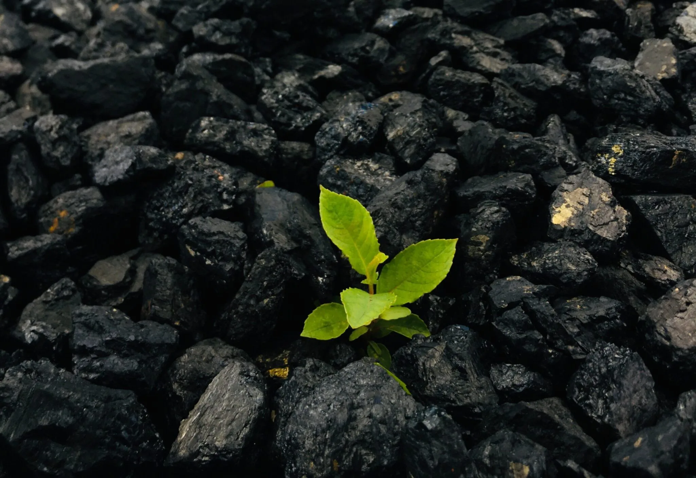
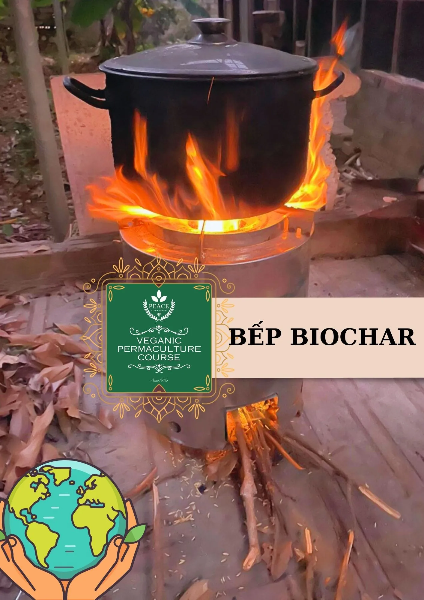
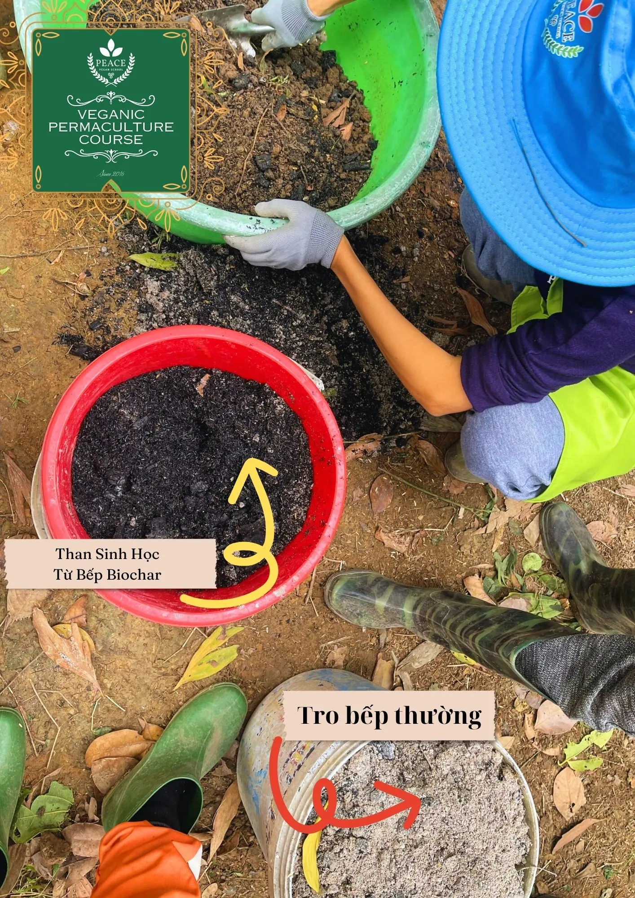

# Bếp tạo than sinh học DK-T5

## Lời dẫn

Các hoạt động nông nghiệp&mdash;góp phần tạo ra 14% phát thải khí nhà kính&mdash;chịu ảnh hưởng nhiều nhất từ ​​biến đổi khí hậu. Có rất nhiều yếu tố ảnh hưởng đến phát thải khí nhà kính từ hoạt động nông nghiệp như sử dụng phân bón hóa học với tỉ lệ phân bón vô cơ cao để nâng cao năng suất cây trồng, sử dụng nước tưới quá mức, v.v. Đốt phụ phế phẩm nông nghiệp cũng là một phần của vấn đề. Phế phẩm nông nghiệp, chẳng hạn như rơm rạ và thân cây ngô, thường bị đốt hoặc để lại trên đồng để phân hủy nhanh chóng. Các hoạt động này sẽ tăng lên trong tương lai khi việc nấu ăn đã sử dụng các thiết bị nấu bếp hiện đại (như bếp gas, bếp từ) thay thế các bếp lò truyền thống (sử dụng phế phụ phẩm nông nghiệp). Trong khi phế phụ phẩm nông nghiệp bị đốt để làm sạch ruộng, đất hữu cơ chứa carbon đang cạn kiệt do hậu quả của thâm canh nông nghiệp, sa mạc hóa và xói mòn đất. Hiện tại, gần một nửa diện tích đất nông nghiệp của Việt Nam được coi là ‘đất cằn cỗi’ (9,3 triệu ha trên 21 triệu ha), có mức năng suất cực kỳ thấp (Thế giới Ngân hàng, 2004).

Than sinh học được sản xuất bằng cách nhiệt phân dư lượng sinh khối chứa một tỷ lệ đáng kể nguyên liệu carbon và rất khó phân hủy sinh học (Knoblauch và cộng sự, 2011). Than sinh học là một lựa chọn khả thi cho giảm phát thải khí nhà kính, tăng cường độ phì của đất và tiết kiệm chi phí phân bón vì nó có khả năng làm giảm rửa trôi chất dinh dưỡng (Lehmann và cộng sự, 2006). Than sinh học nổi tiếng về tiềm năng giảm thiểu khí nhà kính đồng thời tăng năng suất cây trồng (Zhang et cộng sự, 2010). Sản xuất và ứng dụng than sinh học do đó có nguồn gốc từ phế phụ phẩm nông nghiệp là một giải pháp thay thế đầy hứa hẹn cho việc quản lý chất hữu cơ trong các hệ thống canh tác, có thể kết hợp tích cực tác động lâu dài đến chất lượng đất và giảm GHG bằng quá trình cô lập cacbon trong đất.

Tuy nhiên, việc sử dụng than sinh học để cải tạo đất còn hạn chế ở Việt Nam. Lý do cho điều này có thể bao gồm: (1) than có thể có giá trị hơn cho các mục đích khác như nấu ăn và sưởi ấm trong mùa đông; (2) sản xuất than sinh học đòi hỏi thiết bị đặc biệt và đôi khi là các biện pháp kiểm soát phức tạp, có thể tốn nhiều thời gian và công sức; (3) nông dân không nhận ra tác dụng của than sinh học trong việc tăng năng suất cây trồng vì tác động này có thể mất một thời gian mới thấy rõ ở một số loại đất; và (4) quốc gia này không có chiến lược dài hạn để cải thiện điều kiện đất đai nhằm quản lý đất đai bền vững.

## Bếp ĐK-T5

Bếp tạo than sinh học DK-T5 thích hợp sử dụng để đốt trấu, mùn cưa, vỏ lạc, lõi ngô, dăm gỗ và sự kết hợp của các loại nhiên liệu này. Nhiệt độ đốt tối đa có thể lên đến 950°C, tạo năng lượng 8.700KJ/m^3^. Nguyên liệu đầu vào tối đa là 3kg (ví dụ: 1kg trấu ở thành bên trong và 2kg củi ở lõi), với thời gian đốt từ 25-30 phút/kg. Hiệu suất chuyển hoá nhiên liệu/than sinh học từ 16-20%. Khả năng giảm thải các khí độc như CO từ 35-49% và các khí gây ô nhiễm khác từ 43-46%[^1].

[^1]: 

    [Sử dụng hiệu quả phế phụ phẩm nông nghiệp](https://journal.vaas.vn/sites/default/files/tapchi/2021-07/tc%20so17-2018.pdf)

Đây là một trong các loại bếp khí hoá duy nhất trên thị trường hiện nay tạo ra than sinh học (biochar) mà không dùng điện, phù hợp với các nông trại vừa và nhỏ định hướng thân thiện môi trường. Chất lượng thành phẩm than sinh học thường có màu đen nhánh, có hình dạng tuỳ theo nguyên liệu đầu. Than sinh học có thể dùng lọc nước uống (dùng tre tạo than cho hiệu quả tốt), lọc nước trong đất, khử độc trong nước, khử phèn, sử dụng trồng cây, cải tạo đất, khử độc trong đất, tăng dinh dưỡng cho cây, làm nơi trú ẩn cho hệ sinh vật trong đất do không gây xót như tro xám bình thường; có thể giúp thanh lọc khí trong nhà, sử dụng như chất tẩy rửa, ứng dụng làm xà phòng, kem đánh răng than hoạt tính, v.v.

## Hướng dẫn sử dụng

- **Đun nấu bằng phế phụ phẩm nông nghiệp:**

    1. Mở nắp kê nồi
    2. Che bìa lỗ tròn bên trong (để khi đổ trấu, mùn cưa, v.v. không bị lọt vào giữa)
    3. Đổ đây trấu, mùn cưa, v.v. vào ngăn xung quanh cho ngập đến đến miệng bìa
    4. Bỏ tấm bìa che lỗ tròn và cho củi mồi vào giữa và khe củi bên dưới ở thành lò.
    5. Đóng nắp kê nồi
    6. Nhóm bếp
    7. Điều chỉnh lửa bằng cách tiếp củi thêm/rút củi từ khe củi bên thành lò.

    ***Lưu ý:*** Giai đoạn bắt đầu nhóm bếp sẽ có khói như nhóm bếp lò bình thường vì quá trình đốt khí hoá chưa diễn ra. 

- **Tạo than sinh học:** đốt lò trong khoảng từ 40 phút đến 1 giờ tuỳ theo lửa to nhỏ. Sau khi đổ than hết ra khỏi lò (dùng tay nắm dọc thân bếp rồi nghiêng úp bếp), lấy nước dập ngay để than không cháy tiếp thành tro. Gom than và để ráo nước.

- **Sử dụng làm đất trồng:** trộn với đất trồng theo tỉ lệ 1/10 cho đến 1/5 tuỳ theo chất đất.
