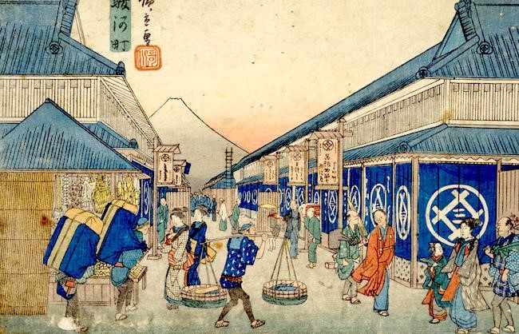
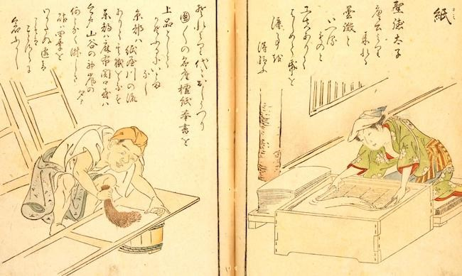
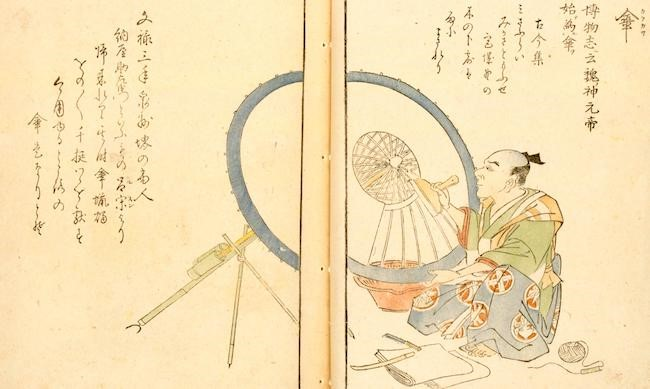

# Xã hội bền vững của Nhật Bản thời kỳ Edo (1603-1867)

!!! quote "" 

    ***Hiroshige: (Địa điểm nổi tiếng ở đông đô) Thị trấn Suruga [minh họa]: Album Hiroshige (Thư viện Quốc hội)***

Trong lịch sử Nhật Bản, khoảng thời gian 265 năm từ năm 1603 (khi Tokugawa Ieyasu trở thành tướng quân hay “shogun” vĩ đại của Mạc phủ Tokugawa) đến năm 1867 (khi Tokugawa Yoshinobu chính thức trao lại quyền lực chính trị cho hoàng đế) được gọi là Thời kỳ Edo. Edo là tên cũ của Tokyo ngày nay. Thời kỳ này đặt tên như vậy vì chính phủ phong kiến vào thời điểm đó đặt trụ sở ở Edo, thay vì ở Kyoto như trước đây.

Trong hầu hết thời kỳ Edo, Nhật Bản đóng cửa với thế giới, không chịu sự xâm lược từ bên ngoài và hầu như không có giao lưu với các nước khác. Đây phần lớn là thời kỳ hòa bình, hầu như không có chiến tranh trong nước và đánh dấu một giai đoạn phát triển vượt bậc về kinh tế và văn hóa của Nhật Bản.

Cuộc điều tra dân số quốc gia đầu tiên, được tiến hành vào khoảng năm 1720, cho thấy dân số xấp xỉ 30 triệu người, tương đối ổn định trong suốt hai thế kỷ rưỡi của Thời kỳ Edo.

Dân số Edo, vào thời điểm đó là thành phố lớn nhất thế giới, ước tính khoảng 1 triệu đến 1,25 triệu người. Để so sánh, London có khoảng 860.000 người (vào năm 1801) và Paris khoảng 670.000 người (vào năm 1802).

Ngày nay, Nhật Bản phụ thuộc vào nhập khẩu từ các nước khác để cung cấp 78% năng lượng, 60% lương thực (tính theo lượng calo) và 82% lượng tiêu thụ gỗ. Nhưng trong khoảng 250 năm thời Edo, Nhật Bản đã tự chủ được mọi nguồn tài nguyên, vì không thể nhập khẩu gì từ nước ngoài do chính sách cô lập quốc gia.

Nhật Bản chỉ có trữ lượng nhỏ nhiên liệu hóa thạch như dầu mỏ. Theo ghi chép, than được sử dụng để làm muối vào cuối thời Edo, nhưng lượng than tiêu thụ không đáng kể. Nhìn vào giai đoạn này dưới góc độ ngày nay, đó là một thời kỳ thú vị đối với một bộ phận nhân loại, là thời kỳ hòa bình và văn hóa hưng thịnh.

Trong những năm gần đây, ngày càng nhiều người Nhật bắt đầu nhận ra rằng trong thời kỳ Edo, đất nước của họ đã có được những gì mà ngày nay chúng ta công nhận là một xã hội bền vững. Dân số ổn định và xã hội không phụ thuộc vào vật chất đầu vào từ bên ngoài. Nhiều người hiện đang cố gắng tìm hiểu thêm về hệ thống xã hội thời đó và áp dụng “sự khôn ngoan của thời kỳ Edo” vào xã hội và cuộc sống đương đại.

Tiểu thuyết gia Eisuke Ishikawa là một trong những nhà nghiên cứu hàng đầu của Nhật Bản về thời kỳ Edo. Tham khảo cuốn sách “Thời kỳ Edo có một xã hội tái chế” (“O-edo Recycle jijo”: xuất bản năm 1994, Công ty xuất bản Kodansha), giờ đây chúng tôi xin giới thiệu một số yếu tố đã tạo nên xã hội bền vững này trong suốt 250 năm. Bản tin JFS hàng tháng, có số này tập trung vào các hoạt động tái sử dụng và tái chế của Thời kỳ Edo. Tháng tới chúng ta sẽ tập trung vào hệ thống năng lượng, cho thấy vào thời điểm đó Nhật Bản là một quốc gia hoạt động dựa vào thực vật.

Nhật Bản hiện đang thúc đẩy nỗ lực tái chế các sản phẩm và vật liệu hết hạn sử dụng. Động lực chính cho mục tiêu này ngày nay là giảm gánh nặng cho các bãi chôn lấp và ngăn chặn điôxin cũng như các phát thải hóa chất độc hại khác từ lò đốt rác. Nhưng người dân ở Edo Nhật Bản tái chế hàng hóa và vật liệu vì một lý do khác: ngay từ đầu họ có rất ít hàng hóa và vật liệu.

Kết quả là, mọi thứ đều được coi là tài nguyên có giá trị, bao gồm cả những vật liệu vốn được xem là gây phiền toái, chẳng hạn như tro. Bởi vì hàng hóa mới toanh đắt tiền và những mặt hàng mới sản xuất hầu như không thể mua được đối với người dân bình thường, hầu hết hàng hóa “hết hạn” không bị loại bỏ như rác thải mà được tái sử dụng và tái chế.

Nhiều thương nhân và thợ thủ công chuyên ngành cũng tham gia vào việc tái sử dụng và tái chế (mặc dù không có từ nào để nói về tái chế vì "tái chế" chỉ là một phần bình thường của cuộc sống). Dưới đây chúng tôi giới thiệu một số người tái chế chuyên dụng của thời Edo.

- **Thợ hàn nồi** (*tinker*) (sửa chữa các sản phẩm kim loại): Những người thợ đã sửa chữa những chiếc chảo, ấm và nồi cũ, thậm chí cả những thứ vô dụng do bị thủng đáy. Họ có những kỹ thuật đặc biệt để sử dụng ống thổi để tăng nhiệt độ của đám cháy than và sửa chữa các lỗ bằng cách sử dụng các miếng kim loại khác hoặc bằng cách hàn.

- **Thợ sửa chữa gốm sứ** (*ceramics repairer*): Những người thợ thủ công chuyên nghiệp này đã dán những mảnh gốm vỡ bằng tinh bột chiết xuất từ ​​gạo nếp và đun nóng để đông tụ.

- **Thợ sửa chữa vòng đai** (*truss hoop repairer*): Cho đến 40 đến 50 năm trước, người ta thường sử dụng bồn và thùng gỗ để đựng chất lỏng. Những chiếc bồn và thùng gỗ được làm bằng những thanh gỗ buộc chặt bằng vòng tre. Khi những chiếc vòng đã cũ, bị gãy hoặc cong vênh, những người thợ thủ công sẽ cố định các bồn và thùng bằng dây buộc tre mới.

Có nhiều thợ thủ công chuyên môn khác có thể sửa chữa các đồ vật bị hỏng, bao gồm đèn lồng giấy và ổ khóa, bổ sung các miếng mực màu đỏ son, tân trang giày dép, cối xay và gương bằng gỗ cũ của Nhật Bản, v.v. Họ ủng hộ một xã hội không có gì bị vứt đi mà mọi thứ đều được sửa chữa cẩn thận và sử dụng cho đến khi thực sự không thể sử dụng được nữa.

Ngoài các chuyên gia sửa chữa, còn có những công nhân chuyên môn khác thu gom và mua bán các vật liệu hết hạn sử dụng.

- **Người mua giấy cũ** (*used-paper buyers*): Những người này mua sách cũ của các chủ cửa hàng, phân loại và bán cho các nhà sản xuất giấy. Vào thời đó, giấy Nhật Bản (washi) được làm từ sợi dài trên 10 mm, và các nhà sản xuất giấy chuyên dụng đã mua và trộn nhiều loại giấy đã qua sử dụng để tạo ra nhiều loại giấy tái chế, từ khăn giấy phòng tắm đến giấy in.

- **Người thu gom giấy đã qua sử dụng** (*used-paper collectors*): Một số nhà sưu tập cũng chuyên về giấy cũ nhưng không có đủ tài chính để mua. Thay vào đó, họ nhặt và thu gom giấy rác bằng cách đi dạo quanh thị trấn và bán cho các kho giấy cũ để kiếm thu nhập bằng tiền mặt hàng ngày.

!!! quote "" 

    ***Hình ảnh cho thấy cách giấy được tạo ra như thế nào.***

- **Đại lý quần áo cũ** (*used-clothes dealers*): Cho đến cuối thời Edo, quần áo quý giá và đắt đỏ hơn ngày nay vì tất cả quần áo thời đó đều được dệt bằng tay. Người ta nói rằng có khoảng 4.000 người buôn bán quần áo cũ ở thành phố Edo.

- **Người mua khung ô đã qua sử dụng** (*used-umbrella rib buyers*): Ô dù ở thời Edo được làm bằng khung tre có dán giấy bên trên. Người mua khung ô đã qua sử dụng thu mua những chiếc ô cũ rồi bán cho các kho chuyên dụng. Tại các nhà kho, công nhân loại bỏ giấy dầu ở khung, sửa chữa cấu trúc khung và sau đó các công nhân khác được thuê dán giấy dầu mới lên khung để làm ô mới. Nhân đây, giấy thấm dầu từ những chiếc ô đã qua sử dụng đã được loại bỏ và bán làm vật liệu đóng gói.

!!! quote "" 

    ***Ô dù thời kỳ này chủ yếu được làm bằng tre và giấy. Trong thời kỳ Edo hòa bình, Samurai hay các chiến binh không có nhiều cơ hội phục vụ nên một số người trong số họ kiếm tiền bằng nghề sửa ô.***

- **Người mua thùng đã qua sử dụng** (*used-barrel buyers*): Khi thùng rỗng, các thương lái chuyên doanh mua, thu gom và bán chúng cho các kho chuyên dụng. Nhật Bản ngày nay có hệ thống thu gom tư nhân đối với chai bia và rượu sake (rượu gạo Nhật Bản), tỷ lệ thu gom/tái chế rất cao. Một số người buôn bán chai lọ đã qua sử dụng ngày nay là hậu duệ của những người đã tiến hành hoạt động kinh doanh này vào thời Edo.

- **Người thu gom đi rao** (*singing collectors*): Một số người buôn bán đi dạo quanh thị trấn, rao lên “Hãy trao đổi, hãy trao đổi” và tặng đồ chơi nhỏ và kẹo cho trẻ em để đổi lấy những chiếc đinh cũ và những mảnh kim loại khác mà trẻ em tìm thấy khi chơi.

Đây là một số trong nhiều người chuyên thu gom và tái chế của Thời kỳ Edo, những người đã giúp xã hội có thể sử dụng tất cả hàng hóa và vật liệu của mình trong thời gian dài và giảm sự cần thiết của việc sử dụng vật liệu mới.

Để kết luận, đây là một vài ví dụ đặc biệt hơn về những người tái chế thời Edo.

- **Người mua sáp nến** (*andle wax buyers*): Nến sáp là một mặt hàng quý giá. Những người mua chuyên dụng đã thu thập những giọt nhỏ giọt từ những ngọn nến đang cháy.

- **Người mua tro** (*ash buyers*): Tro là sản phẩm phụ tự nhiên của quá trình đốt củi. Trong thời kỳ Edo, người mua thu thập tro và bán cho nông dân làm phân bón. Những ngôi nhà bình thường có hộp đựng tro, nhà tắm công cộng và các cửa hàng lớn hơn có một "túp lều tro" để chứa cho đến khi người mua ghé qua.

Giáo sư Takeo Koizumi, thuộc Đại học Nông nghiệp Tokyo, đã viết trong cuốn **“Lịch sử văn hóa của tro”** (*“Hai no Bunashi”*) rằng mặc dù các nền văn hóa khác trên thế giới cũng sử dụng tro, nhưng theo nghiên cứu của ông cho thấy, Nhật Bản là quốc gia duy nhất nơi những người buôn tro mua tro từ thành phố để sử dụng cho các ngành khác trong xã hội.

- **Người xử lí chất thải của con người** (*human waste dipper*): Cho đến khoảng năm 1955, chất thải của con người (đất đêm, *night soil*) là nguồn phân bón quan trọng nhất cho nông dân Nhật Bản. Ở nhiều nơi ở châu Âu, trước khi xây dựng đường thoát nước, chất thải của con người chỉ đơn giản được ném từ cửa sổ xuống đường bên dưới, và bệnh dịch xảy ra liên tục do điều kiện vệ sinh kém. Ngược lại, ở Nhật Bản chất thải của con người được coi là nguồn tài nguyên quý giá vào thời đó.

Nông dân thường xuyên đến thăm những ngôi nhà mà họ có cam kết và trả tiền hoặc tặng rau mà họ đã trồng để đổi lấy đất đêm được sử dụng làm phân bón. Khi các kênh phân phối được thiết lập nhiều hơn, các nhà kho và nhà bán lẻ đất đêm chuyên dụng đã xuất hiện.

Những chủ nhà có nhiều người thuê đã kiếm được nhiều tiền từ đất đêm được sản xuất trên cơ sở của họ. Thậm chí còn có những câu chuyện xích mích giữa chủ nhà và người thuê về quyền sở hữu đất đêm. Một số nông dân rất quan tâm đến nguồn phân bón của họ. Ví dụ, một số khu vực nhất định được coi là nguồn đất đêm rất được săn đón để phát triển các nhãn hiệu trà Nhật Bản độc quyền.

Bạn có thể ngạc nhiên khi biết rằng ngay cả đất đêm cũng được tái chế vào thời Edo. Nó có thể được gọi là “sự tái chế cuối cùng”, và nhà hóa học người Đức Justus von Liebig, thường được coi là cha đẻ của hóa học nông nghiệp hiện đại, đã ca ngợi việc sử dụng đất đêm làm phân bón, nói rằng đó là một hoạt động nông nghiệp không có đối thủ về khả năng giữ đất trồng trọt màu mỡ mãi mãi và tăng năng suất tương ứng với sự gia tăng dân số. Và có ghi chép rằng người phương Tây đầu tiên nhìn thấy thị trấn Edo đã bị sốc, [vì họ] chưa bao giờ thấy một thành phố sạch như vậy.

Vào thời đó, những người sản xuất cây trồng nông nghiệp sử dụng phân bón, và những người sản xuất phân bón chính là những người tiêu dùng đã tiêu thụ những loại cây trồng đó. Trong thời hiện đại, mối liên hệ giữa người tiêu dùng và nhà sản xuất đã bị phá vỡ, nhưng trong thời kỳ Edo, việc “tái chế cuối cùng” này có thể thực hiện được nhờ mối quan hệ phụ thuộc lẫn nhau giữa người tiêu dùng và nhà sản xuất.

Vào thời Edo, việc tái sử dụng hàng hóa là một thông lệ. Có rất nhiều trường học trong đền dành cho con em thường dân vào thời Edo. Sách giáo khoa tại các trường này thuộc sở hữu của nhà trường chứ không phải của người sử dụng. Theo ghi chép, một cuốn sách giáo khoa số học đã được sử dụng trong 109 năm.

Tuy nhiên, như người ta có thể tưởng tượng, các hệ thống tái sử dụng và tái chế rộng rãi như vậy được áp dụng trong xã hội sẽ hạn chế lợi nhuận của các nhà sản xuất giấy, công ty in ấn, nhà xuất bản và người vận chuyển. Trong nền kinh tế ngày nay, nếu mọi người không liên tục mua hàng hóa mới thì nền kinh tế sẽ suy thoái.

Ngược lại, theo danh sách lương của thợ mộc được chính quyền phong kiến Edo thuê, phải mất 200 năm tiền lương mới tăng gấp đôi, hàm ý tốc độ tăng trưởng kinh tế thời đó khoảng 0,3%. Theo thước đo kinh tế ngày nay, nền kinh tế thời Edo không tăng trưởng nhiều. Nhưng do đó chúng ta có thể kết luận rằng các hệ thống của Thời kỳ Edo, với việc tái sử dụng và tái chế nhiều lần, đã kém hơn các hệ thống kinh tế và xã hội hiện đại của chúng ta không?

Nhật Bản trong thời kỳ Edo có thể được coi là một hình mẫu về một xã hội bền vững. Cơ sở của nền kinh tế bền vững và sự phát triển văn hóa không phải là sản xuất hàng loạt và tiêu dùng hàng loạt để thuận tiện, như chúng ta thấy trong xã hội hiện đại, mà là tận dụng tối đa các nguồn lực hạn chế.

Chắc chắn rằng ngày nay có nhiều thứ đã thay đổi, nhưng có lẽ có một số gợi ý cho một tương lai bền vững nếu chúng ta nhìn lại quá khứ.

**Nguồn: Bản tin JFS số 7 (tháng 3 năm 2003)**

[Japan's sustainable society in the Edo period (1603-1867)](https://www.japanfs.org/sp/en/news/archives/news_id027757.html) 
[Sustainable Lifestyles in Edo and Japanese History](https://www.japanlivingguide.com/living-in-japan/culture/sustainable-edo/)

