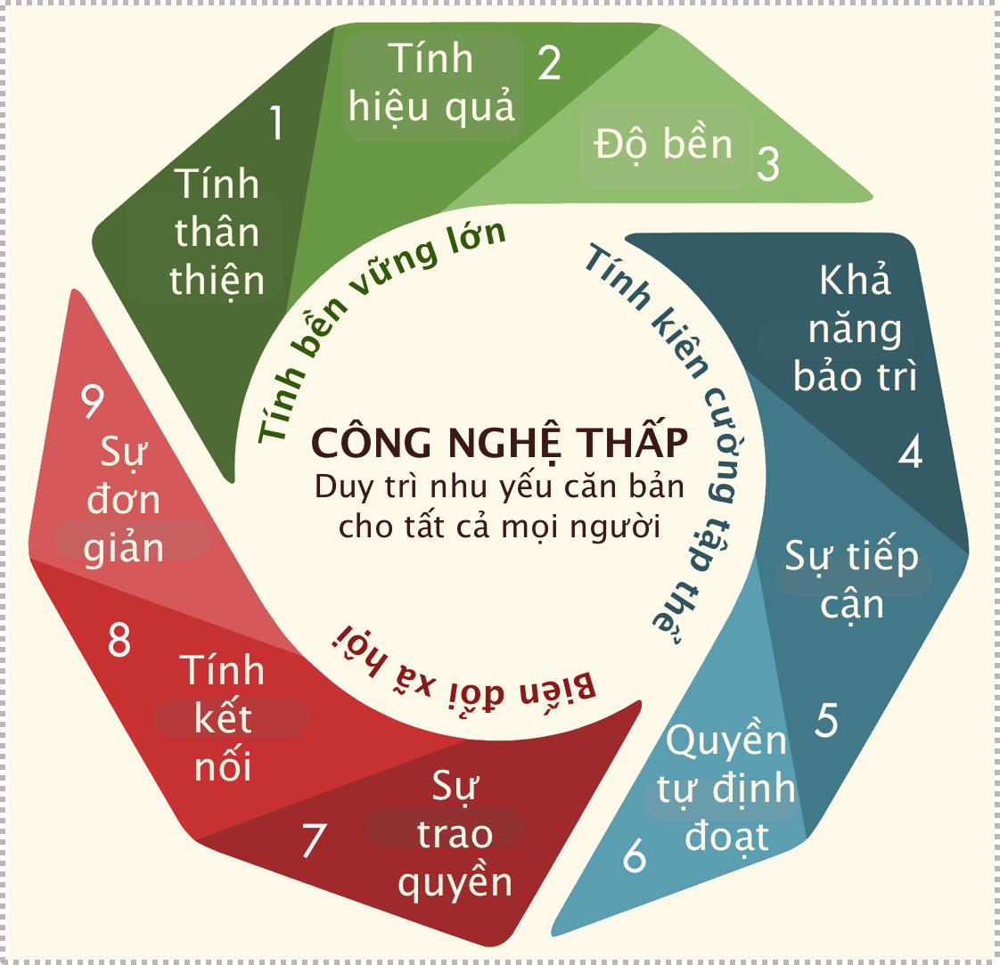

# Công nghệ thấp: Vì sao lối sống bền vững không nhất thiết phải phụ thuộc vào các giải pháp công nghệ cao

Có một quan điểm phổ biến cho rằng con đường dẫn đến lối sống bền vững nằm ở các giải pháp công nghệ cao. Bằng cách cải tiến các phương tiện đồ dùng hàng ngày như ô tô chạy xăng thành chạy điện, lắp đặt hệ thống thông minh để giám sát và giảm thiểu mức sử dụng năng lượng, dường như chúng ta vẫn có thể tận hưởng những tiện nghi mà chúng ta đã quen thuộc trong khi vẫn đóng góp vào phương thức phát triển hiện tại—được gọi là “tăng trưởng xanh”.

Nhưng những rủi ro của phương thức này ngày càng trở nên rõ ràng hơn. Nhiều công nghệ hiện đại sử dụng các vật liệu như đồng, cô-ban, lithium và các nguyên tố đất hiếm. Những kim loại này có trong các thiết bị như điện thoại di động, tivi và động cơ. Nguồn cung cấp của chúng không chỉ hữu hạn mà còn đòi hỏi một lượng lớn năng lượng để khai thác và xử lý—tạo ra lượng khí thải nhà kính đáng kể.

Thêm vào đó, nhiều đồ dùng trang thiết bị trong số này vốn rất khó tái chế, do để làm ra chúng, người ta phải tạo ra các hỗn hợp vật liệu phức tạp, thường với số lượng rất nhỏ. Việc thu thập và phân loại chúng để tái chế rất tốn kém.

Cùng với các vấn đề khác, những hạn chế này đã khiến một số người đặt câu hỏi về định hướng công nghệ cao mà xã hội chúng ta đang theo đuổi—và ngày càng bày tỏ mối quan tâm đến các giải pháp **công nghệ thấp** (*low-tech*). Những giải pháp này ưu tiên sự đơn giản và độ bền, việc sản xuất tại địa phương cũng như sử dụng các kỹ thuật truyền thống hay cổ xưa.

Hơn nữa, các giải pháp công nghệ thấp thường tập trung vào tính **thân thiện** (*conviviality*). Nó bao gồm việc khuyến khích các kết nối xã hội, chẳng hạn như thông qua âm nhạc hoặc khiêu vũ chung, thay vì thúc đẩy **chủ nghĩa siêu cá nhân** (*hyper-individualism*) được khuyến khích bởi các thiết bị kỹ thuật số ngốn tài nguyên.

“Công nghệ thấp” không có nghĩa là quay trở lại lối sống thời trung cổ. Nhưng nó đòi hỏi sự sáng suốt hơn trong việc lựa chọn công nghệ—và xem xét những nhược điểm của chúng.

## Khởi nguyên của công nghệ thấp

Các nhà phê bình đã tuyên bố những nhược điểm của việc sử dụng công nghệ quá mức trong nhiều thế kỷ, từ những người Luddites[^1] thế kỷ 19 đến các nhà văn thế kỷ 20 như Jacques Ellul và Lewis Mumford. Nhưng chính cuộc khủng hoảng năng lượng ở phương Tây vào những năm 1970 mới thực sự phổ biến ý tưởng này.

[^1]:

    Vào ngày 9 tháng 10 năm 1779, một nhóm công nhân dệt may người Anh ở Manchester đã nổi dậy phản đối việc sử dụng máy móc vì đe dọa đến việc làm mà họ rất lành nghề…

!!! quote ""

    “Một người đi xe đạp chở hàng trên đường thành phố”. Công nghệ thấp nhấn mạnh đến tính hiệu quả và sự đơn giản. Ảnh:  CityHarvestNY/Wikimedia

Cuốn sách **“Nhỏ thì đẹp”** (*Small is Beautiful*) của nhà kinh tế học người Anh E.F. Schumacher xuất bản năm 1973 đã đưa ra lời phê bình mạnh mẽ về công nghệ hiện đại khiến cho cạn kiệt các nguồn tài nguyên như nhiên liệu hóa thạch. Thay vào đó, Schumacher ủng hộ sự đơn giản: các công nghệ hiệu quả, giá cả phải chăng tại địa phương (mà ông gọi là công nghệ “trung gian” (*intermediate*)), như các thiết bị thủy điện nhỏ được cộng đồng nông thôn sử dụng.

Lời kêu gọi của Schumacher đã được đáp lại bởi một phong trào đang hình thành và phát được gọi là “công nghệ thấp”. **Tạp chí Công nghệ thấp** (*Low-Tech Magazine*) được xuất bản trực tuyến kể từ năm 2007 của tác giả người Bỉ Kris de Dekker đã mô tả và phân loại chi tiết các giải pháp công nghệ thấp, chẳng hạn như cối xay gió sử dụng ma sát để sưởi ấm các tòa nhà. Đặc biệt, tạp chí khám phá những công nghệ lỗi thời vẫn có thể đóng góp cho một xã hội bền vững: như những **bức tường trái cây** (*fruit walls*) được sử dụng vào những năm 1600 để tạo ra vùng vi khí hậu ấm áp tại địa phương để trồng trái cây Địa Trung Hải.

Ở Mỹ, cuốn sách Lo-TEK của kiến trúc sư và học giả Julia Watson (trong đó TEK là viết tắt của **Kiến thức sinh thái truyền thống** (*Traditional Ecological Knowledge*)) khám phá các công nghệ truyền thống từ việc sử dụng lau sậy làm vật liệu xây dựng cho đến việc tạo hình vùng đất ngập nước để xử lý nước thải.

Và ở Pháp, việc nhận thức được sự kiệt quệ tài nguyên gây ra bởi công nghệ của kỹ sư Philippe Bihouix đã đưa cuốn sách **“Kỉ nguyên Công nghệ thấp”** (*Age of Low Tech*) của ông đoạt giải thưởng. Được xuất bản lần đầu tiên vào năm 2014, nó mô tả cuộc sống trong một thế giới công nghệ thấp sẽ như thế nào, bao gồm cả việc cắt giảm triệt để mức tiêu thụ.

!!! quote ""

    Các nguyên tắc của công nghệ thấp bao gồm **sự hiệu quả** (*efficiency*), **độ bền** (*durability*) và **khả năng tiếp cận** (*accessibility*). Arthur Keller và Emilien Bournigal/Wikimedia

!!! quote "Tiêu chí cho bất kì phương thức tiếp cận đổi mới nào đối với Công nghệ thấp"
    
    ***TÍNH BỀN VỮNG LỚN***

    **1. Sự tỉnh táo**: Tái tập trung vào những điều cần thiết và hướng tới sự tối ưu về công nghệ: cường độ công nghệ thấp nhất và đơn giản nhất đảm bảo đáp ứng nhu cầu [con người] với mức độ tin cậy cao

    **2. Tính hiệu quả**: Giảm thiểu việc tiêu thụ năng lượng và tài nguyên, từ việc khai thác nguyên liệu thông qua sản xuất, phân phối ngắn hạn, trung hạn, dài hạn và sử dụng đến hết vòng đời

    ***KHẢ NĂNG PHỤC HỒI TẬP THỂ***

    **3. Độ bền**: Trình bày kỹ thuật tối đa, chức năng, sinh thái là tốt, như khả năng tồn tại của con người trong

    **4. Khả năng bảo trì**: Có thể được người dùng tự bảo trì và sửa chữa trong khả năng có thể bằng cách sử dụng các bộ phận và vật liệu tiêu chuẩn

    **5. Khả năng tiếp cận**: Cung cấp sự dễ dàng sử dụng tối đa

    **6. Tự chủ hóa**: Được tạo ra từ các tài nguyên được khai thác và biến đổi cục bộ nhất có thể

    ***CHUYỂN ĐỔI XÃ HỘI*** 

    **7. Trao quyền**: Tạo điều kiện cho việc chiếm đoạt với số lượng lớn nhất, trao quyền lực cho người dân và cộng đồng

    **8. Sự kết nối**: Thúc đẩy việc chia sẻ kiến thức và bí quyết, hợp tác, đoàn kết, gắn kết xã hội và mối liên kết giữa các cộng đồng

    **9 Đơn giản hóa**: Giải mã xã hội ở cấp độ kinh tế xã hội và tổ chức dựa trên sự phản ánh về nhu cầu và tình trạng dễ bị tổn thương

Bihouix trình bày bảy “điều răn” của phong trào công nghệ thấp. Một số trong số đó bao gồm nhu yếu cân bằng hiệu suất công nghệ với tác động môi trường của nó, thận trọng với tự động hóa (đặc biệt khi việc làm được thay thế bằng việc tăng cường sử dụng năng lượng) và giảm đòi hỏi của chúng ta lên với thiên nhiên.

Nhưng nguyên tắc đầu tiên của công nghệ thấp là nhấn mạnh đến sự **tỉnh táo** (*sobriety*): tránh tiêu thụ quá mức hay tiêu thụ một cách phù phiếm, hài lòng với những mẫu mã kém bắt mắt hơn với hiệu suất thấp hơn. 

!!! quote "Như Bihouix viết:"

    Việc giảm tiêu thụ có thể giúp chúng ta nhanh chóng khám phá lại nhiều niềm vui đơn giản, thi vị, mang tính triết học của một thế giới tự nhiên được hồi sinh... trong khi việc giảm căng thẳng và giảm thời gian làm việc sẽ giúp phát triển nhiều hoạt động văn hóa hoặc giải trí như biểu diễn, sân khấu, âm nhạc, làm vườn hoặc yoga.

## Các giải pháp cổ xưa

Điều quan trọng là chúng ta có thể áp dụng các nguyên tắc công nghệ thấp vào cuộc sống hàng ngày ngay lúc này. Ví dụ, chúng ta có thể dễ dàng giảm nhu cầu năng lượng từ việc sưởi ấm bằng cách sử dụng quần áo và chăn ấm. Thực phẩm, nếu được đóng gói, có thể được mua và bảo quản trong bao bì có thể tái sử dụng hay tái chế như thủy tinh.

Thiết kế kiến trúc mang lại nhiều cơ hội cho các phương pháp tiếp cận công nghệ thấp, đặc biệt nếu chúng ta học hỏi từ lịch sử. Sử dụng **tháp đón gió** (*windcatcher*) cổ xưa được thiết kế cho phép không khí mát bên ngoài lưu thông qua các phòng giúp các tòa nhà được làm mát bằng cách sử dụng ít năng lượng hơn so với điều hòa nhiệt độ.

!!! quote ""

    Tháp đón gió ở Yazd, Iran, làm mát các tòa nhà bằng gió. Ảnh: Ms96/Wikimedia

Thiết kế và sản xuất hướng tới tính bền vững nhấn mạnh đến việc giảm chất thải, thường thông qua việc tránh trộn lẫn và làm ô nhiễm các nguyên vật liệu. Các vật liệu đơn giản như thép các-bon thuần, được nối bằng ốc vít có thể tháo rời, dễ tái chế và sửa chữa ở địa phương. Xe buýt, xe lửa và máy móc nông nghiệp sử dụng các loại thép này chẳng hạn, có thể được tân trang hoặc tái chế dễ dàng hơn gấp nhiều so với những chiếc ô tô hiện đại chứa đầy vi mạch điện tử và được sản xuất từ ​​các hợp kim phức tạp.

Ở một số nơi, các nguyên tắc công nghệ thấp đã ảnh hưởng đến thiết kế đô thị và chính sách công nghiệp. Các ví dụ bao gồm các **“thành phố 15 phút”** (*15-minute cities*), nơi cư dân có thể dễ dàng tiếp cận [trong vòng 15 phút] các cửa hàng và tiện ích khác, sử dụng xe đạp thồ hàng thay vì ô tô hoặc xe tải để giao hàng và khuyến khích [phổ biến] các sản phẩm có thể sửa chữa được thông qua luật về quyền được sửa chữa ở Châu Âu và Hoa Kỳ.

Trong khi đó, ở Nhật Bản, mối quan tâm ngày càng tăng đối với hoạt động tái sử dụng và tái chế từ thời Edo. Từ năm 1603 đến năm 1867, đất nước này thực sự đóng cửa với thế giới bên ngoài, khả năng tiếp cận nguyên liệu thô rất hạn chế. Do đó, việc tái sử dụng và sửa chữa—ngay cả những thứ như đồ gốm vỡ hoặc đồ dùng bị thủng mà ngày nay chúng ta coi là rác thải—đã trở thành một lối sống. Những người thợ chuyên nghiệp sẽ sửa chữa hoặc tái chế mọi thứ từ đèn lồng giấy, sách cho đến giày, chảo, ô và nến.

Bằng cách làm theo những ví dụ như thế này, chúng ta có thể biến những lựa chọn công nghệ sáng suốt trở thành một phần trọng tâm trong quá trình tìm kiếm những lối sống bền vững.

**Tác giả: Jo Adetunji**. Biên tập viên, báo The Conversation UK.

[Low-technology: why sustainability doesn’t have to depend on high-tech solutions](https://theconversation.com/low-technology-why-sustainability-doesnt-have-to-depend-on-high-tech-solutions-176611)

