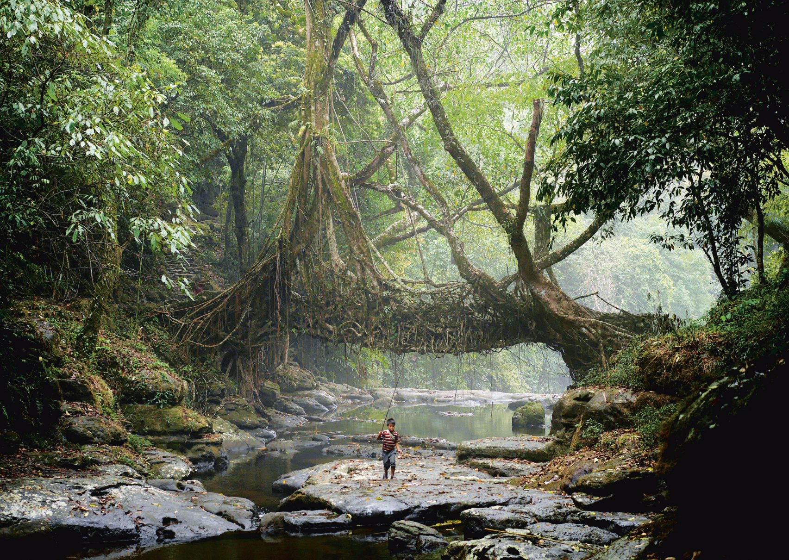
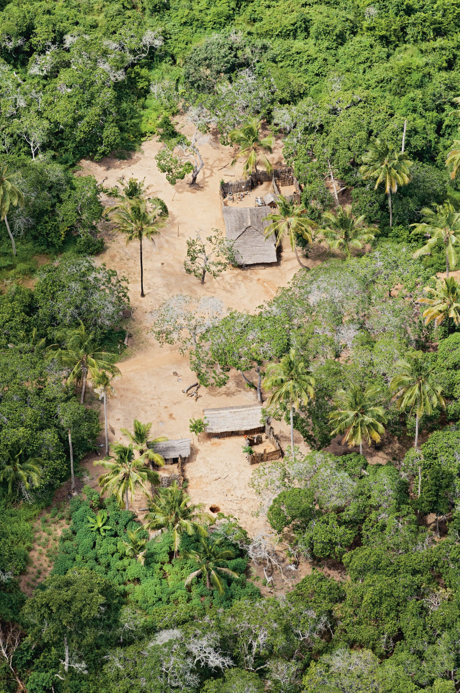
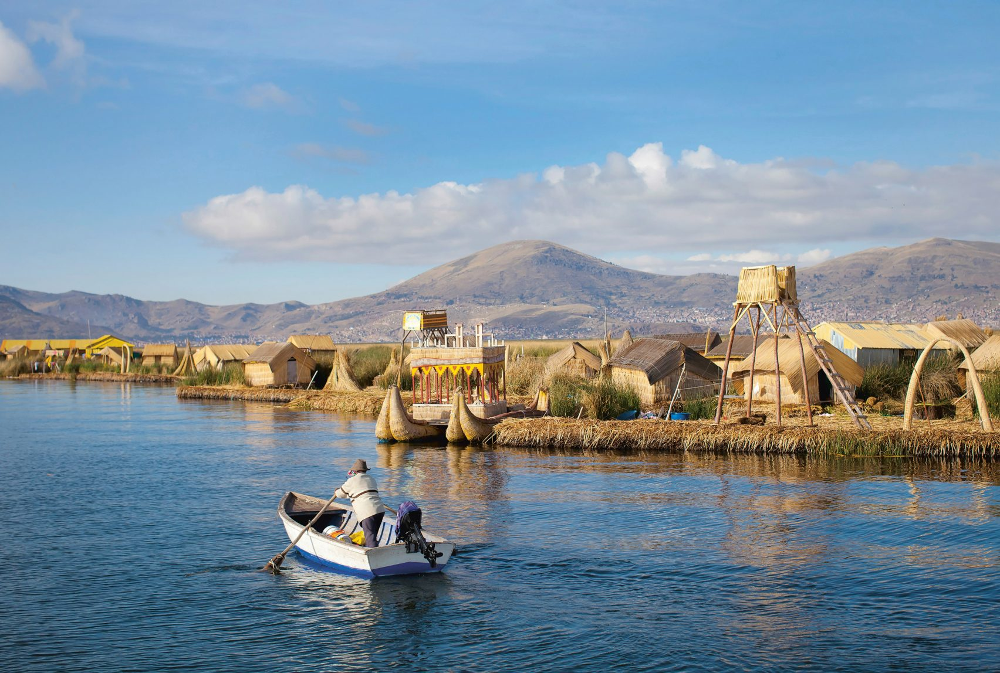
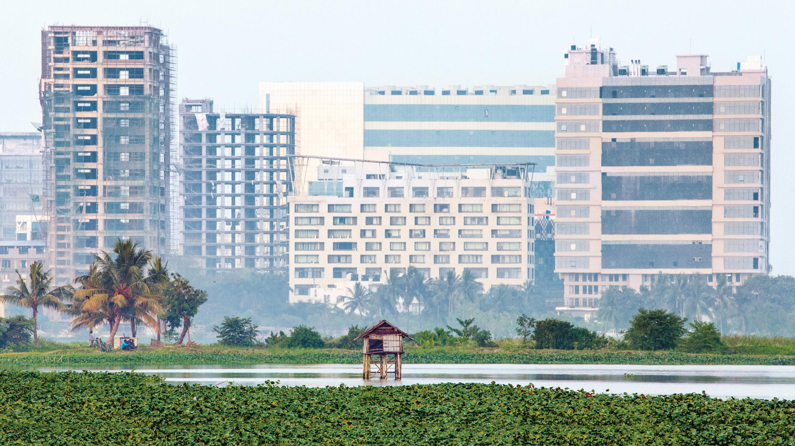

# Thiết kế LO–TEK của Chủ nghĩa bản địa cấp tiến

!!! quote "" 

    ***Cầu “thực vật” Jingkieng Dieng Jri và lối đi [của nhiều lớp rễ cây] được “trồng” bởi bộ tộc Khasi ở Ấn Độ.***

Năm 1964, kiến trúc sư, kỹ sư và nhà phê bình Bernard Rudofsky đã tổ chức triển lãm “Kiến trúc không có kiến trúc sư” của Bảo tàng Nghệ thuật Hiện đại (MoMA) nhằm phá vỡ quy luật độc quyền và phân biệt đối xử về lịch sử kiến trúc vốn thay đổi quá chậm. Cuộc triển lãm tìm hiểu về “kiến trúc không nguồn gốc”, mà “ao ước có một nhãn hiệu chung”, Rudofsky gọi là “bản địa, ẩn danh, tự phát, bản địa, nông thôn”.

Julia Watson tiếp tục cuộc thảo luận đó trong cuốn sách mới của mình **Thiết kế LO–TEK của Chủ nghĩa bản địa cấp tiến** (*Lo–TEK: Design by Radical Indigenism*) và giới thiệu một thuật ngữ mới: Lo–TEK&mdash;sự kết hợp giữa “lo-tech” (công nghệ thuật) và TEK, viết tắt của **Kiến thức sinh thái truyền thống**&mdash;định nghĩa lại sự đổi mới và công nghệ bản địa là mô hình cộng sinh giữa con người và thiên nhiên&mdash;những điều chúng ta thực sự cần để đối mặt với cuộc khủng hoảng biến đổi khí hậu. **Chủ nghĩa bản địa cấp tiến** (*radical indigenism*) ủng hộ việc đổi mới các hệ thống tri thức để bao gồm các **triết lý bản địa** (*indigenious philosophies*) và tạo ra các **diễn ngôn mới** (*new discourses*). Thiết kế kết hợp chủ nghĩa bản địa cấp tiến tạo ra cơ sở hạ tầng bền vững và thích ứng với khí hậu.

Lo–TEK liệt kê các công nghệ bản địa trên toàn cầu, khẳng định rằng việc nhân rộng và kết hợp chúng với các công nghệ thông thường có thể cung cấp vốn từ vựng mới về những đổi mới bền vững trong môi trường xây dựng. Watson, một kiến trúc sư, nhà hoạt động, học giả sinh ra ở Úc và New York, đồng thời là người sáng lập cả Julia Watson và A Future Studio, đã nghiên cứu và viết Lo–TEK trong hơn sáu năm. Khám phá 18 quốc gia, cô đã chỉ ra lợi thế vốn có của thiết kế Lo–TEK: nó “vừa là phản ứng hàng ngày cho sự sống còn của con người, vừa là phản ứng phi thường trước các hiện tượng môi trường cực đoan, chẳng hạn như nạn đói, lũ lụt, sương giá, hạn hán và bệnh tật”.

Các công nghệ mà cô trình bày bao gồm nhiều hệ sinh thái và mục đích: **lọc nước** (*purify water*), **trồng lương thực** (*grow food*), **duy trì đa dạng sinh học** (*maintain biodiversity*), **thu nước mưa và nước ngầm** (*collect rain and groundwater*), đồng thời tạo khả năng **cư trú cho các vùng thủy sinh và vùng khô cằn** (*habitation of aquatic and arid locales*), cùng nhiều công nghệ khác.

**Ruộng bậc thang vùng Palayan** của người Ifugao ở Philippines đồng thời tưới tiêu, lọc nước và hỗ trợ canh tác lúa dựa vào cộng đồng. **Người Maasai ở Kenya và Tanzania** xây dựng các bãi trồng cây keo boma (có trại rào kín) để thúc đẩy việc trồng rừng trên sa mạc và diễn thế sinh thái ở những vùng đất đang vật lộn với tình trạng sa mạc hóa.

Thực hành nông nghiệp bền vững giúp tăng năng suất và bảo tồn đa dạng sinh học. Ở Mexico, **hệ thống nương rẫy của người Maya** canh tác theo chu kỳ bao gồm việc đốt, che phủ và bỏ hoang để khuyến khích **diễn thế rừng** (*forest succession*), **độ phì nhiêu của đất** (*soil fertility*) và **các vườn đa canh** (*polyculture gardens*). Ở Tanzania, **vườn rừng ihamba của người Chagga** hỗ trợ hơn 500 loài bằng cách trồng xen cây với nông nghiệp.

!!! quote ""

    ***Ở Tanzania, người Chagga quản lý vườn rừng kihamba. / Julia Watson, Taschen***

Người Ma’dan ở Iraq và người Uros ở Peru cho thấy cách sống chung với nước bằng cách sử dụng **cơ sở hạ tầng nổi và có khả năng phân hủy sinh học** (*buoyant, biodegradable infrastructure*). Tất cả những đổi mới đều có tính chất địa phương, giá cả phải chăng và được thực hiện bằng tay. Chúng cho phép duy trì cả con người và tài nguyên chứ không phải việc khai thác chúng. Họ dựa vào các cộng đồng bản địa còn sót lại trên vùng đất của tổ tiên họ&mdash;không giống như nhiều nỗ lực bảo tồn khác. Và “như Le Corbusier thường nói, kiến thức này không chỉ là nguyên thủy mà rất cần thiết và được tất cả chúng ta biết đến,” Watson viết.

!!! quote ""

    ***Trên hồ Titicaca của Peru, người Uros xây đảo từ lau sậy totora / Julia Watson, Taschen***

Các nhà thiết kế đang tìm kiếm các công cụ và mô hình mới để chống lại các mối đe dọa ngày càng tăng do biến đổi khí hậu gây ra sẽ thấy cuốn sách này là một tuyển tập dễ tiếp cận về những đổi mới cảnh quan bền vững. Được cấu trúc theo hệ sinh thái, cuốn sách phân loại các công nghệ theo vùng: núi, rừng, sa mạc hoặc vùng đất ngập nước.

Mỗi sự đổi mới nhận được một mô tả chi tiết về công dụng và vai trò không thể thiếu của nó trong nền văn hóa đã tạo ra nó. Đôi khi các cuộc phỏng vấn đi sâu hơn vào thiết kế và văn hóa của nó, chẳng hạn như cái nhìn sâu sắc của Jassim Al-Asadi về các nền văn minh nổi ở vùng đất ngập nước ở Iraq. Sơ đồ vẽ chia nhỏ từng đổi mới. Người ta có thể tưởng tượng một công ty thiết kế thờ ơ lựa chọn một số yếu tố nhất định—có thể là hệ thống xử lý nước thải bheri được người dân Bengal ở Kolkata sử dụng, hoặc địa hình vi mô cắt và lấp đầy waru waru của người Inca ở Peru—trong phạm vi không cấp tiến. thiết kế.

!!! quote ""
 
    ***Mỗi ngày, hệ thống nuôi trồng thủy sản bằng nước thải bheri của Kolkata lọc một nửa lượng nước thải của thành phố. / Julia Watson, Taschen***

Điều khó hợp tác hơn là bản chất tâm linh của những công nghệ bản địa này và nền văn hóa mà chúng xuất hiện. Một thế giới quan bao gồm tôn giáo, đạo đức và hệ thống tín ngưỡng vốn có trong việc quản lý hệ sinh thái của họ.

Ở Bali, người Subak, những người duy trì các ruộng bậc thang subak có năng suất và đa dạng sinh học cao, thực hành các nghi lễ đền nước dựa trên niềm tin rằng nữ thần Dewi Danu cung cấp nước tưới tiêu cho họ. J. Stephen Lansing, giám đốc Viện phức hợp tại Đại học Công nghệ Nanyang ở Singapore, lưu ý rằng những cách hiểu như vậy không được gọi là “ý tưởng ‘ma thuật’”. Chúng rất quan trọng đối với hoạt động của những cảnh quan này; các ngôi đền là địa điểm của hệ thống phân phối nước hợp tác. Mặc dù bản thân các công nghệ đều mang tính đổi mới nhưng những người chăm sóc chúng cuối cùng vẫn đảm bảo hiệu suất của chúng thông qua hệ thống niềm tin của họ. Lansing viết: “sự kết hợp của những ý tưởng này với khả năng quản lý của mạng lưới đền thờ cung cấp những công cụ mạnh mẽ cho cộng đồng nhằm áp đặt một trật tự tưởng tượng lên thế giới”.

Một phần chính là sự thiếu vắng tinh thần mà Watson yêu cầu độc giả đặt câu hỏi. Để ủng hộ các công nghệ bản địa, cô mời độc giả phê bình huyền thoại về công nghệ đã thống trị thế giới kể từ thời Khai sáng.

Việc tuân theo huyền thoại này—bản thân nó là sự phát triển tự nhiên của chủ nghĩa nhân văn, chủ nghĩa thực dân và phân biệt chủng tộc—đã thúc đẩy việc khai thác tài nguyên và loại bỏ các hệ thống tự nhiên. Đặt câu hỏi về nó có nghĩa là thẩm vấn quyền bá chủ, tính đồng nhất và sự khôn ngoan của người dân bản địa. Xét cho cùng, trong nhiều nền văn hóa bản địa, “tâm linh trong cảnh quan liên quan trực tiếp đến tính bền vững và quản lý tài nguyên”. Watson gợi ý nên nắm lấy một huyền thoại công nghệ mới và khác biệt, một huyền thoại kết hợp chủ nghĩa nhân văn với chủ nghĩa bản địa cấp tiến.

Ủng hộ rằng các thực hành sắc thái có nguồn gốc sâu xa trong các nền văn hóa bản địa có thể được tách ra khỏi bối cảnh của chúng và bị trùng lặp, lai ghép hoặc điều chỉnh tạo ra một hành động cân bằng khó khăn. Bản thân Watson lưu ý rằng văn hóa đại chúng trong kỷ nguyên thân thiện với môi trường hiện nay của chúng ta khuyến khích các phiên bản tẩy rửa xanh dựa trên sự hiểu biết khoa học và tinh thần hợp nhất về môi trường.

Thật nguy hiểm khi vượt qua ranh giới để lãng mạn hóa các nền văn hóa bản địa, như đã không xảy ra trong hàng trăm năm qua. Ví dụ, trong bối cảnh Hoa Kỳ, những hoán vị của thần thoại công nghệ được cụ thể hóa thành số phận hiển nhiên và sự hư cấu về không gian trống rỗng. W. J. T. Mitchell viết: “Giống như chủ nghĩa đế quốc, cảnh quan là một đối tượng hoài cổ trong thời kỳ hậu thuộc địa và hậu hiện đại, phản ánh thời kỳ mà các nền văn hóa đô thị có thể tưởng tượng số phận của mình trong một ‘triển vọng’ không giới hạn về sự chiếm đoạt và chinh phục vô tận.”

Watson, từ thời kỳ hậu thuộc địa của chúng ta, tán thành nỗi hoài niệm này bằng cách khẳng định các kỹ thuật bản địa là thành phần của huyền thoại. Nhưng đồng thời gọi công nghệ là huyền thoại, cô ấy đề xuất lật đổ nó bằng một thần thoại đồng tiến hóa kết hợp cả hai. Cô ấy kiểm tra huyền thoại với huyền thoại.

Mối nguy hiểm trong đề xuất của Watson là khi xây dựng huyền thoại mới này, những đổi mới bản địa và những người đứng sau chúng sẽ bị đồng hóa và chiếm đoạt bởi các lực lượng đồng nhất của công nghệ. Xuyên suốt Lo–TEK, Watson lặp lại rằng các công nghệ bản địa cung cấp “manh mối”, “cảm hứng” và “mô hình” cho môi trường được xây dựng trong tương lai của các hệ thống mềm cộng tác với thiên nhiên, nhưng cô không nói rõ chính xác cách thức. Cô viết: “Chúng không phải là những chỉ dẫn, nhưng giống như một chiếc la bàn, chúng cung cấp một định hướng hơn là một bản đồ cho tương lai”.

Tuy nhiên, người ta vẫn có thể khao khát những thông tin cụ thể hơn từ Watson, người chắc chắn có một số ý tưởng từ nghiên cứu thực địa kỹ lưỡng của mình. Nếu Lo–TEK cung cấp một danh mục kịp thời, quá hạn và tôn trọng các công nghệ bản địa có thể mang lại trí tuệ, tiếng nói khác và tính không đồng nhất cho mô hình không bền vững hiện tại của chúng ta, thì nỗ lực tiếp theo nằm ở việc xác định cách nhận ra và duy trì những tính không đồng nhất đó.
