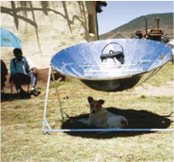
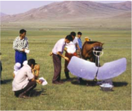
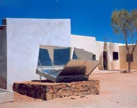
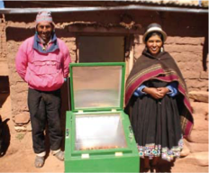
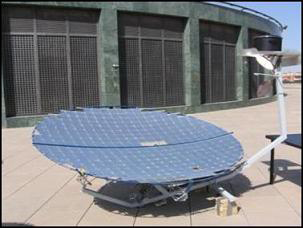
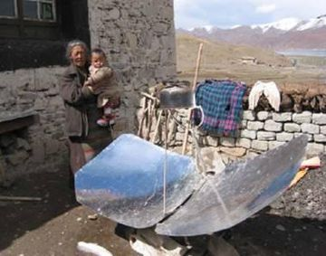
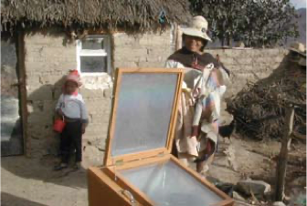
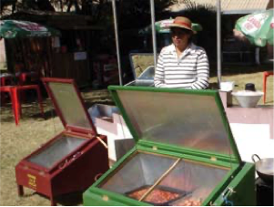

# Bếp mặt trời (Phần I)

## Tiềm năng và khó khăn 

Năng lượng là chìa khóa cho tương lai. Không có năng lượng, khó có thể hình dung rằng sự phát triển kinh tế và xã hội sẽ diễn ra như thế nào, và năng lượng là điều kiện tiên quyết thiết yếu nếu muốn thành công trong cuộc chiến chống đói nghèo. Những tiến bộ về chất lượng cuộc sống, mà người dân sống ở các quốc gia phát triển đã trải qua kể từ khi bắt đầu công nghiệp hóa nói riêng, đi kèm với sự gia tăng mạnh mẽ trong tiêu thụ năng lượng. Do đó, không còn nghi ngờ gì nữa, đặc biệt là ở các nước đang phát triển, ngày càng có nhiều người cần tiếp cận năng lượng lâu dài và đáng tin cậy. Tuy nhiên, sự tăng trưởng này không được gây bất lợi cho khí hậu, mà như chúng ta đang trải qua hiện đang trải qua sự thay đổi. Bên cạnh việc tiếp tục khai thác các dạng năng lượng tái tạo, thì việc sử dụng năng lượng hiệu quả hơn cũng rất cần thiết.

Trên khắp thế giới, khoảng hai tỷ người đang phải vật lộn để tìm đủ củi đốt, thứ chủ yếu mà họ cần để nấu ăn và sưởi ấm. Vấn đề càng trở nên trầm trọng hơn bởi thực tế: ở nhiều nước đang phát triển, việc nấu ăn theo truyền thống thường được thực hiện bằng việc đun nấu bằng nồi kê trên ba viên đá với ngọn lửa ở giữa. Tuy nhiên, những phương pháp này chỉ có thể sử dụng khoảng 10 đến 15% năng lượng được tạo ra. Thu thập củi thường là trách nhiệm của phụ nữ và trẻ em, những người thường dành vài giờ mỗi ngày cho công việc này, và phải xử lý những khối lượng tới 45 kg. Nếu đun nấu trong nhà, khói, bồ hóng thường xuyên gây ra các bệnh về đường hô hấp.
Ô nhiễm không khí trong nhà do nhiên liệu nấu ăn không sạch&mdash;như gỗ, than,
và chất thải nông nghiệp&mdash;ước tính gây ra 3,2 triệu ca tử vong sớm mỗi năm. Phụ nữ và trẻ em chiếm phần lớn trong số này vì ở nhiều quốc gia, họ là những người ở nhà chuẩn bị bữa ăn. Đốt nhiên liệu không sạch cũng gây ra nạn phá rừng và góp phần tạo ra khí thải carbon. Trong hầu hết các trường hợp, hoàn cảnh kinh tế không cho phép người dân ở đây sử dụng các nguồn năng lượng khác như khí đốt hoặc điện. Nói chung, chính những bộ phận dân cư nghèo hơn mới là những người chịu ảnh hưởng nặng nề nhất từ tình trạng thiếu gỗ.

**Bếp năng lượng mặt trời** (*Solar Cooker*) đã nhiều lần được coi là một giải pháp cho vấn đề củi đốt. Có một thực tế là hầu hết tất cả các nước đang phát triển đều nằm tương đối gần đường xích đạo, do đó nhận được mức độ bức xạ mặt trời cao hầu như quanh năm. Chỉ có mùa mưa mới hạn chế việc sử dụng bếp năng lượng mặt trời. **“Nấu ăn với mặt trời”** còn cho phép sử dụng nguồn năng lượng miễn phí, vô tận một cách hiệu quả, giảm bớt gánh nặng cho người phụ nữ, giảm tác hại đến sức khỏe do nấu nướng. Hơn nữa, cây ít bị chặt hơn, do đó ngăn chặn nạn phá rừng và tiến trình sa mạc hóa, đồng thời chống lại sự nóng lên toàn cầu. Đây là những lập luận của những người ủng hộ việc sử dụng phương pháp này. Tuy nhiên, phải nói rằng nhiều thập kỷ nỗ lực đã không giúp bếp năng lượng mặt trời đạt được bước đột phá. Cho đến nay, chỉ trên các cao nguyên không có cây cối của Tây Tạng, bếp năng lượng mặt trời mới thực sự được sử dụng; khoảng một nửa triệu bếp năng lượng mặt trời trên thế giới được sử dụng ở Trung Quốc. Kinh nghiệm thu thập được cho đến nay từ các nước đang phát triển đã chỉ ra:

- Bếp năng lượng mặt trời chỉ có thể được sử dụng thường xuyên ở những nơi hầu như không có nhiên liệu thay thế&mdash;ở Tây Tạng và trên cao nguyên Altiplano ở Nam Mỹ&mdash;và ở những nơi chúng được xem là phù hợp với các phương pháp nấu ăn truyền thống.

- Những loại bếp năng lượng mặt trời tinh vi và tiết kiệm năng lượng, đặc biệt là bếp kiểu chảo parabol, tỏ ra quá đắt đỏ, hơn nữa cho đến nay vẫn chưa thể thành lập cơ sở sản xuất độc lập tại địa phương ở Châu Phi vì trong hầu hết các trường hợp, các bộ phận quan trọng vẫn phải nhập khẩu từ Đức. Các loại bếp hộp đơn giản, rẻ tiền nhưng kém hiệu quả thường không có khả năng cạnh tranh với các loại bếp truyền thống.

- Việc phổ biến thương mại bếp năng lượng mặt trời ở Ấn Độ và Nam Phi đã không thành công. Các thử nghiệm ở Châu Phi trong đó bếp được bán thông qua hệ thống cho vay cũng không mấy thành công.

- Hầu như tất cả các cách tiếp cận thương mại không còn nhằm vào người nghèo hoặc khu vực nông thôn mà nhắm vào tầng lớp trung lưu vốn có số lượng nhỏ hơn nhiều ở các thị trấn và thành phố. Mặc dù những người này có đủ khả năng mua bếp năng lượng mặt trời, nhưng họ không phải phụ thuộc vào chúng và do đó thường chỉ thỉnh thoảng sử dụng chúng.

- Một giải pháp thay thế khả dĩ cho bếp năng lượng mặt trời là một thế hệ bếp cải tiến mới được thiết kế theo nguyên lý của **Bếp tên lửa** (*Rocket Stove*, bếp đun củi/than). Những bếp như vậy có buồng đốt hình chữ L, cách nhiệt, trong đó củi cháy ở nhiệt độ cao, tạo ra rất ít khói. Giống như bếp năng lượng mặt trời, chúng đạt được hiệu suất tiết kiệm gỗ khoảng 60% đến 80%. Chi phí của một chiếc bếp như vậy chỉ bằng một phần nhỏ so với giá của một bếp năng lượng mặt trời hình parabol và mọi người hầu như không phải thay đổi thói quen nấu nướng của mình. Những chiếc bếp này được sử dụng rộng rãi ở các vùng nông thôn của Malawi và Uganda, ví dụ, trong số các gia đình có thu nhập thấp. Các dự án tiếp theo nhằm giới thiệu và phổ biến công nghệ này hiện đang đang được tiến hành ở Mỹ Latinh và ở miền nam và miền đông châu Phi, và đang được chuẩn bị cho miền tây châu Phi.

## Các loại Bếp Mặt trời

!!! note "Bếp hình parabol (*Parabolic Cooker*)"

    {align=right}
    Bếp hình parabol tập trung bức xạ mặt trời trực tiếp vào nồi. Với công suất tối đa lên tới 1200 W, mạnh hơn đáng kể so với **Bếp hộp năng lượng mặt trời** (*Solar Box Cooker*) và đạt nhiệt độ lên tới 250°C. Nhưng bên cạnh đó, bếp parabol khó chế tạo hơn và ngay cả khi được sản xuất trong nước cũng thường phải nhập khẩu một số bộ phận. Điều này làm cho giá của chúng đắt hơn đáng kể so với bếp hộp. Chúng cũng phải được điều chỉnh để theo dõi vị trí của mặt trời khoảng 25 đến 30 phút một lần và chúng nhạy cảm hơn nhiều với gió. Điều này khiến việc sử dụng hàng ngày trở nên khó khăn hơn. Một hạn chế nữa phát sinh từ việc người sử dụng các loại bếp này dễ bị lóa mắt do ánh nắng mặt trời phản chiếu trong đĩa parabol. Trên hầu hết các kiểu bếp parabol cũng có nguy cơ gương phản xạ bị bẩn khi thức ăn sôi. Nếu gương phản xạ bị móp hoặc trầy xước trong quá trình vệ sinh, hiệu quả của bếp sẽ giảm đi đáng kể. 

!!! note "Bếp cánh bướm (*Butterfly Cooker*)"

    {align=right}
    Một thiết kế khác tương tự như bếp parabol là bếp cánh bướm hay Papillon, phổ biến ở Tây Tạng và Tây Phi. So với bếp parabol, loại bếp này có ưu điểm là người nấu có thể cầm nồi tốt hơn, nguy cơ chói mắt thấp hơn và mặt phản xạ không bị bẩn nếu thức ăn sôi trào. Bếp Papillon, được phát triển ở Burkina Faso, có thể được gấp lại và cất giữ trong nhà, giúp giảm nguy cơ bị trộm cắp. Ở Tây Tạng, cánh phản xạ của bếp cánh bướm được làm bằng gang hoặc xi măng, giúp giảm chi phí đáng kể.

!!! note "Bếp Schwarzer"

    {align=right}
    Một loại bếp năng lượng mặt trời khác là bếp thu nhiệt tấm phẳng, đặc biệt là bếp Schwarzer, được đặt tên theo nhà phát triển của nó. Điều này phù hợp để sử dụng bởi các tổ chức và hộ gia đình cá nhân. Thiết kế này sử dụng bề mặt thu nhiệt để làm nóng dung môi, ví dụ như hơi nước, để truyền nhiệt đến nơi cần thiết để nấu ăn. Những bếp này có thể được mở rộng theo yêu cầu, cho phép đầu ra của chúng phù hợp với nhu cầu của các tổ chức. Tuy khả năng vận chuyển bị hạn chế, chúng có ưu điểm là không cần điều chỉnh để theo dõi mặt trời. Vì điểm nấu tách biệt với bộ thu nhiệt nên cũng có thể nấu trong bóng râm hoặc trong nhà. Việc bao gồm một bộ lưu trữ nhiệt cũng cho phép sử dụng những bếp như vậy sau khi mặt trời lặn. Cho đến nay, khoảng 250 đến 300 bếp Schwarzer đã được chế tạo ở Ấn Độ và Châu Phi, thường là bởi các doanh nghiệp.

!!! note "Bếp hộp (*Solar Box Cooker*)" 

    {align=right}
    Trong bếp hộp năng lượng mặt trời (hoặc lò năng lượng mặt trời), nồi được đặt bên trong một hộp kín, bên trong hộp được làm nóng bằng bức xạ mặt trời. Bếp hộp được xây dựng đơn giản, thường sử dụng vật liệu sẵn có tại địa phương. Điều này làm cho việc sản xuất chúng dễ dàng hơn ở các nước đang phát triển và giảm chi phí mua sắm. Bếp hình hộp không cần phải căn chỉnh lại vị trí của mặt trời thường xuyên như bếp hình parabol, khiến chúng dễ sử dụng hơn trong cuộc sống hàng ngày. Mặc dù bếp hộp không đạt được các giá trị hiệu suất cao nhất của bếp parabol, nhưng chúng có khả năng bù đắp tốt hơn cho sự dao động của bức xạ mặt trời. Bếp hộp đạt được nhiệt độ tối đa khoảng 180°C.

!!! note "Bếp Scheffler"

    {align=right}
    Cũng như các bếp năng lượng mặt trời được mô tả ở trên, chủ yếu dành cho các gia đình và người buôn bán nhỏ. Một mô hình phức tạp hơn về mặt kỹ thuật cũng đã được phát triển để phục vụ quy mô lớn, phù hợp để chuẩn bị cho hàng chục nghìn bữa ăn. Trong bếp Scheffler (được đặt tên theo nhà phát triển của nó), năng lượng mặt trời được cung cấp từ các tấm phản xạ hoặc bộ thu thông qua một hệ thống ống dẫn hơi nước nóng đến bếp, thường được đặt trong một tòa nhà riêng biệt. Một thiết bị điện cho phép các gương phản xạ tự động theo dõi hướng đi của mặt trời; điều chỉnh lại thủ công chỉ được yêu cầu vài ngày một lần. Cho đến nay, hàng trăm chiếc bếp như vậy đã được chế tạo, chủ yếu ở Ấn Độ. Chúng rất mạnh mẽ và cũng có thể được trang bị một bộ lưu trữ nhiệt cho phép nấu ăn tiếp tục đến tối và thậm chí cả đêm. Bếp năng lượng mặt trời lớn nhất thế giới là bếp Scheffler với 106 gương phản xạ hình parabol, cung cấp năng lượng cho nhà bếp của căng tin ở Tirupati, Ấn Độ. Hạn chế của những bếp này là chi phí ban đầu cao. Chẳng hạn, khi một tiệm bánh năng lượng mặt trời lớn ở Burkina Faso được trang bị 16 gương phản xạ Scheffler, chi phí lên tới khoảng 50.000 EUR. Ngoài ra, cần phải bổ sung thêm một lượng không gian đáng kể mà các hệ thống này yêu cầu, đặc biệt là khi nhà bếp cũng thường phải được xây dựng. Do đó, bếp Scheffler không phù hợp cho các hộ gia đình riêng lẻ.

!!! abstract "Tiết kiệm năng lượng"

    Các phép đo mức tiêu thụ nhiên liệu tại một trại tị nạn ở Namibia cho thấy tiết kiệm được khoảng 40 % khi bếp mặt trời được sử dụng một cách tối ưu. Tuy nhiên, thông thường, bếp năng lượng mặt trời trong các hộ gia đình chỉ có thể được sử dụng tối ưu trong khoảng 8 đến 9 tháng trong năm. Cũng như mùa mưa, cũng có những thời kỳ gió mạnh, và ở vùng Sahel có vấn đề đặc biệt là bão bụi do gió sa mạc Sahara gây ra, cản trở việc sử dụng bếp hoặc khiến chúng hoàn toàn không thể vận hành được. Do đó, tính trong cả năm, số tiền tiết kiệm được vào khoảng 30 đến 40%.

## “Bếp cánh bướm” trên nóc nhà thế giới&mdash;ở Tây Tạng, nấu ăn bằng năng lượng mặt trời là một thực tế của cuộc sống

!!! quote ""
    
    **Nhiều bếp năng lượng mặt trời sẽ được tìm thấy ở Trung Quốc hơn bất kỳ quốc gia nào khác trên thế giới. Hơn 600.000 bếp đang được sử dụng&mdash;chủ yếu ở các vùng nông thôn&mdash;và mỗi bếp tiết kiệm khoảng 600 đến 1000kg củi mỗi năm. Bếp năng lượng mặt trời đóng một vai trò đặc biệt quan trọng trong việc tiết kiệm năng lượng ở Khu tự trị Tây Tạng.**

Nằm ở độ cao trung bình 4500 mét so với mực nước biển, đây là khu vực cao nguyên lớn nhất trên trái đất. Do hiệu ứng bóng mưa của dãy núi Himalaya, khí hậu thường khô hạn với nhiệt độ dao động lớn trong năm. Các thảo nguyên không có cây của vùng cao nguyên thường hợp nhất thành sa mạc, trong khi các vùng thấp hơn của các rặng núi bao quanh có nhiều cây cối. Ở những khu vực này, ban đầu gỗ là một trong những nguồn năng lượng quan trọng nhất; nhưng nó ngày càng bị thay thế bởi bụi cây, rễ cây và phân. Trong khi ở các thị trấn và thành phố, than được sử dụng chủ yếu để nấu ăn và sưởi ấm, thì ở vùng cao, phân luôn là chất đốt phổ biến nhất. Mặc dù dân số ở vùng cao Tây Tạng thưa thớt, điều này vẫn có tác động bất lợi đến độ phì nhiêu của đất. Phần lớn người dân là dân du mục hoặc bán du mục, sinh kế của họ là chăn nuôi gia súc.

Bức xạ mặt trời trên cao nguyên Tây Tạng là rất cao so với toàn cầu, đạt mức tối đa trong những thời điểm lạnh hơn trong năm do bầu không khí trong lành. Do đó, các điều kiện để sử dụng bếp năng lượng mặt trời ở Tây Tạng rất tuyệt vời, nhất là vì bếp có thể được sử dụng trong chín hoặc mười tháng trong năm. Những ứng dụng của bởi bếp năng lượng mặt trời phù hợp với thói quen nấu ăn của người dân Tây Tạng, vì nước nóng đều cần thiết cho mỗi bữa ăn. Đối với bữa sáng, món cháo lúa mạch, nước được đun sôi vào ngày hôm trước trên bếp năng lượng mặt trời và giữ nóng trong bình thủy nhiệt. Trong ngày, nước được đun sôi trên bếp năng lượng mặt trời từ 10 đến 15 lần để pha trà, và nước đun nóng bằng năng lượng mặt trời từ bình giữ nhiệt được sử dụng lại cho món súp buổi tối. Điều này có nghĩa là bếp năng lượng mặt trời có thể cung cấp hầu như tất cả năng lượng cần thiết để nấu ăn.

Việc phổ biến bếp năng lượng mặt trời ở Trung Quốc đã bắt đầu khoảng 25 năm trước. Ngày nay có khoảng 70.000 bếp năng lượng mặt trời đang được sử dụng ở Tây Tạng, hầu hết là bếp kiểu cánh bướm. Về căn bản, có hai mô hình khác nhau được xây dựng:

- Nồi có vỏ bằng gang, tương đối đắt mà chỉ những gia đình khá giả mới có thể mua được. Hơn nữa, lá kim loại phản chiếu được sử dụng để lót vỏ phải được thay thế hai đến ba năm một lần;

- Một mô hình chi phí thấp hơn trong đó tấm phản xạ được làm bằng bê tông lót bằng những tấm gương nhỏ dán trên bề mặt. Từng chiếc gương có thể được thay thế nếu bị hư hỏng. Sản xuất được thực hiện cả trên quy mô công nghiệp và trong các xưởng gia đình hoặc thợ thủ công. Ban đầu được trợ cấp, bếp được bán với giá từ 15 đến 45 Euros. Tuy nhiên, trong thời gian đó, trợ cấp chỉ giới hạn ở các gia đình có thu nhập thấp. Các bếp hiện nay cũng được sản xuất tại một nhà máy địa phương.

{align=right}
Bếp năng lượng mặt trời rất phổ biến ở Tây Tạng, không chỉ ở các thị trấn và thành phố mà còn ở các vùng nông thôn. Lý do rất đơn giản: phân tiết kiệm được vì không dùng để nấu ăn có thể được dùng để sưởi ấm hoặc làm phân bón, hoặc có thể bán. Do đó trong trường hợp này, việc sử dụng bếp năng lượng mặt trời cũng tạo ra thu nhập. Tuy nhiên, trái ngược với Ấn Độ, chỉ có bếp gia đình mới được phổ biến ở Tây Tạng; bếp quy mô lớn cho các tổ chức không được phổ biến ở đây.

Trong thời gian gần đây, công nghệ bếp mặt trời Trung Quốc đã được xuất khẩu sang Afghanistan, nơi có những vấn đề tương tự về việc kiếm đủ củi đốt. Là một phần của dự án do Bộ Hợp tác và Phát triển Kinh tế Liên bang Đức (BMZ) hỗ trợ, 50 gia đình ở vùng nông thôn đã nhận được bếp kiểu cánh bướm để dùng thử. Sau một vài tuần, kinh nghiệm thu được với bếp đã được ghi lại và các gia đình có thể chọn mua hay trả lại bếp. Thử nghiệm cho thấy: phụ nữ, đặc biệt từ các gia đình kém sung túc hơn, có nhiều khả năng sẵn sàng chuyển sang dùng bếp năng lượng mặt trời. Ngoài ra, một giảng viên người Trung Quốc đã dạy các doanh nhân quy mô nhỏ cách xây dựng mô hình bếp bằng vỏ bê tông; các doanh nhân đã giữ lại chiếc bếp mà họ đã chế tạo trong suốt khóa học để làm nguyên mẫu cho quá trình sản xuất tiếp theo. Do dự án đang trong giai đoạn khởi động và chưa có năng lực sản xuất quy mô lớn nên cho đến nay mới chỉ thực hiện thực nghiệm nấu ăn đơn lẻ. Tuy nhiên, đã có những dấu hiệu mạnh mẽ về nhu cầu. Ví dụ, Cục Năng lượng Tái tạo thuộc Bộ Năng lượng và Nước, nơi đặt trụ sở của dự án, nhận được khoảng 10 đến 15 yêu cầu mua hàng mỗi ngày, hoàn toàn dựa trên truyền miệng. Có hai nhà sản xuất cũng sẽ bắt đầu sản xuất bếp sau khi hoàn thành khóa đào tạo.

## Bếp năng lượng mặt trời trên Cao nguyên Altiplano Nam Mỹ&mdash;một khởi đầu đầy hứa hẹn

!!! quote ""

    Altiplano là một cao nguyên ở độ cao khoảng 3700m ở vùng Andes của Argentina, Bolivia và Peru. Khí hậu của nó rất khô, chỉ cho phép sự phát triển của thảm thực vật thưa thớt. Cơ sở cho sinh kế của dân tộc này Ấn Độ chủ yếu được cung cấp bởi chăn nuôi (lạc đà không bướu và cừu) và trồng trọt (khoai tây Andean, ngô, đậu, đậu Hà Lan, cà rốt và các loại rau khác).

Ở Argentina Altiplano là một trong những khu vực nghèo nhất trong cả nước. Nhiên liệu duy nhất có sẵn để nấu ăn và sưởi ấm là gỗ từ cây quenua và bụi cây tola, và vì thảm thực vật thưa thớt nên tình trạng thiếu nhiên liệu ở khắp mọi nơi.

{align=right}
Tuy nhiên, nhu cầu về nhiên liệu rất lớn: ví dụ, trẻ em của người dân địa phương thường được dạy về điều này trong các trường nội trú; có ít nhất một trường như thế trong mỗi cộng đồng. Nhà bếp tại các trường học và trường mẫu giáo này cần trung bình khoảng 88 tấn bụi cây tola mỗi năm để nấu ăn, tương đương với thu hoạch diện tích một hecta. Ngoài ra, còn phải kể đến việc tiêu thụ khoảng 9 tấn gỗ quenua, tương đương là chặt hạ 88 cây&mdash;vốn là một loài quý hiếm. Ở một số nơi, việc khai thác quá mức tài nguyên gỗ đã dẫn đến xói mòn đất nghiêm trọng. Ngoài ra, trong những năm 1990, khu vực thuộc Argentina bị ảnh hưởng bởi hạn hán kéo dài vài năm, khiến tình hình càng trầm trọng hơn.

Cư dân của Altiplano cũng phải chịu cảnh thiếu gỗ: mỗi ngày, đàn ông, phụ nữ và trẻ em dành hai đến ba giờ để thu thập và vận chuyển củi, thường mang những khối lượng lên đến 30kg trong vài km. Chuyển sang sử dụng nhiên liệu gas hoặc dầu sẽ khó khăn, vì cả hai sẽ phải được vận chuyển trên quãng đường dài 200 km, khiến giá cả tăng lên.

{align=right}
Tuy nhiên, các điều kiện tự nhiên và khí hậu là gần như lý tưởng để khai thác năng lượng mặt trời. Hầu hết khắp mọi nơi trên Altiplano, mức độ bức xạ mặt trời đều rất cao. Giống như Tây Tạng, khu vực này là một trong những nơi hàng đầu trên trái đất để thu nhận bức xạ. Hơn nữa, điều tra sơ bộ cũng trong chỉ ra rằng các điều kiện văn hóa xã hội cũng rất thuận lợi cho việc sử dụng bếp năng lượng mặt trời vì chúng có thể được sử dụng dễ dàng để chế biến tất cả các món ăn thường dùng trong khu vực.

Trong khuôn khổ một dự án do BMZ hỗ trợ điều tra việc sử dụng năng lượng mặt trời, các bếp năng lượng mặt trời chung đã được thiết lập tại các trường học và nhà trẻ với sự hợp tác của một tổ chức phi chính phủ và một hợp tác xã địa phương, bắt đầu từ năm 1998. Các bếp được sử dụng thuộc loại **bếp Scheffler**. Công việc điều chỉnh và bảo trì được đảm nhận bởi những người dân làng được đào tạo đặc biệt. Hiệu suất của gương phản xạ đủ để vận hành bếp điện với công suất tối đa 3 kW, cho phép sử dụng một nồi lớn hoặc hai nồi nhỏ hơn với tổng dung tích lên tới 80 lít. Những thiết bị này đủ để chuẩn bị bữa trưa&mdash;thường là món hầm và súp&mdash;cho 30 đến 40 người. Bếp cũng tích hợp một bộ lưu trữ nhiệt, có thể tiếp tục sử dụng trong một thời gian ngắn sau khi mặt trời lặn. Các nhà bếp cũng được trang bị **bếp parabol** nhỏ hơn với công suất 700 W, đun sôi khoảng 10 lít nước trong vòng 90 đến 120 phút.

Các loại **bếp hộp** và **bếp parabol** sản xuất trong nước cũng được cung cấp cho các gia đình. Mặc dù **bếp parabol** mạnh hơn, nhưng **bếp hộp** tỏ ra dễ vận hành hơn và ít bị ảnh hưởng bởi gió mạnh thường gặp trên cao nguyên Altiplano. Ngoài các tấm phản xạ và các bộ phận thuộc thiết bị theo dõi ánh sáng chạy bằng điện, tất cả các bếp có thể được sản xuất tại địa phương bởi một hợp tác xã sau khi hoàn thành khóa đào tạo liên quan.

Thử nghiệm thực tế bếp năng lượng mặt trời đã cho kết quả ấn tượng. Ví dụ, các trường học cần ít hơn khoảng 30% củi đốt, và đối với năm gia đình, khoản tiết kiệm từ việc sử dụng **bếp hộp** lên tới gần 40%. Việc sử dụng kết hợp **bếp parabol** và **bếp hộp** tỏ ra đặc biệt hiệu quả. Trong những trường hợp như vậy, **bếp parabol** được sử dụng để hâm nóng hoặc đun sôi nhanh thức ăn, sau đó thức ăn được đặt vào nồi hộp để tiếp tục nấu. Một số gia đình tiết kiệm được gần 90 % củi đốt bằng phương pháp này.

Chưa có cuộc điều tra chi tiết nào được tiến hành, nhưng mức độ chấp nhận bếp năng lượng mặt trời của người dân có vẻ cao. Ví dụ, mặc dù dự kiến ban đầu chỉ trang bị bếp quy mô lớn cho hai trường học, tuy nhiên sau khi những thứ này được đưa vào sử dụng, nhiều trường khác đã bày tỏ sự quan tâm và cho đến nay đã có thêm hai trường được trang bị bếp mặt trời. Bếp cho gia đình cũng rất được ưa chuộng. Một dấu hiệu cho thấy nhu cầu lớn là vào tháng 7 năm 2004, người dùng tư nhân đã mua 70 bếp, với giá gần bằng hai tháng thu nhập mặc dù được sản xuất tại địa phương bởi một hợp tác xã. Những chiếc bếp mặt trừoi lâu nhất hiện đã hoạt động được sáu năm và không xảy ra vấn đề gì khi vận hành. Những dự án phổ biến bếp mặt trời đang tiếp tục được được lên kế hoạch.

Vào cuối năm 2004, bếp năng lượng mặt trời đã trải qua thêm một đợt bùng nổ ngoài dự kiến. Khủng hoảng kinh tế khiến giá gas tăng mạnh. Vì người dân địa phương không còn muốn quay lại đốt những bụi tola ngày càng thưa thớt, nên bếp parabol tự cho mình là một lựa chọn thay thế và doanh số bán hàng tại hợp tác xã đã tăng từ 20 lên 30 bếp mỗi năm lên 30 bếp mỗi tháng.

Điều kiện sống trên Altiplano của Bolivian cũng khó khăn như ở phần đất Argentina. Tuy nhiên, trong trường hợp này, gần 40% dân số của đất nước sống ở đây và phần lớn trong số họ sống dưới mức nghèo khổ. Gỗ và khí đốt là những nguồn năng lượng chính để sử dụng trong gia đình. Việc giới thiệu bếp năng lượng mặt trời ở đây bắt đầu vào năm 2000, dưới sự lãnh đạo của tổ chức phi chính phủ Pháp, Bolivia Inti. Hầu hết loại bếp phổ biến ở đây là **bếp hộp**, có thể được sản xuất tại địa phương với chi phí thấp. Các bếp đã được giới thiệu tại các cuộc trình diễn nấu ăn công cộng, sau đó các thợ thủ công quan tâm đã được đào tạo cách để sản xuất chúng. Thành công của dự án được thể hiện qua một cuộc đánh giá được thực hiện vào năm 2005, đánh giá trên tổng cộng 170 gia đình sử dụng/không sử dụng bếp năng lượng mặt trời. Hơn 90% số gia đình vẫn sử dụng bếp từ 3 đến 5 năm và trong mùa khô, gần 2/3 số gia đình sử dụng bếp ít nhất một lần trong ngày. Điều này chỉ ra rằng nấu ăn bằng năng lượng mặt trời đã trở thành một phần trong cuộc sống hàng ngày của họ. Vì các gia đình phải mua nhiên liệu, nên có thể chứng minh lợi ích tiền tệ trực tiếp của việc nấu ăn bằng năng lượng mặt trời. Ví dụ, sử dụng bếp năng lượng mặt trời đã tiết kiệm được từ 35% đến 40% chi phí đốt củi hoặc gas của các gia đình, tùy thuộc vào thời điểm trong năm. Một liện hệ trực tiếp đã được thiết lập giữa việc sử dụng bếp năng lượng mặt trời và tiết kiệm tiền; nói cách khác, gia đình nào nấu ăn bằng năng lượng mặt trời càng nhiều thì họ càng tiết kiệm được nhiều tiền. Trong khi đó, dự án đang được hỗ trợ bởi tổ chức NGO CEDESOL của Bolivia. Tổ chức này đã áp dụng cách tiếp cận tích hợp cung cấp bếp năng lượng mặt trời cùng với bếp tiết kiệm năng lượng cho các hộ gia đình và các tổ chức. Báo cáo nói rằng khoảng 3000 bếp đã được phổ biến cho đến nay.

Kể từ tháng 10 năm 2005, cách tiếp cận này đã nhận được sự hỗ trợ bổ sung thông qua chương trình PROAGRO, được hỗ trợ bởi BMZ và Tổng cục Hợp tác Quốc tế của Chính phủ Hà Lan (DGIS). Chương trình cung cấp hỗ trợ dưới hình thức trợ cấp cho các nhà sản xuất trong hai năm đầu sản xuất bếp cải tiến và bếp năng lượng mặt trời. CEDESOL cũng đã ký hợp đồng, cho phép dự án sử dụng nhiều năm kinh nghiệm của mình. Ngay trong năm đầu tiên, hơn 300 gia đình đã được trang bị bếp cải tiến và/hoặc bếp năng lượng mặt trời. Có tổng cộng hơn 5000 gia đình mục tiêu được nhắm đến khi kết thúc giai đoạn dự án đầu tiên.

Nói chung, các dự án nhằm phổ biến bếp năng lượng mặt trời cho đến nay đã được thực hiện ở một số quốc gia Nam Mỹ. Tuy nhiên, bất chấp những khởi đầu đầy hứa hẹn, trên toàn bộ lục địa dường như chỉ có một vài nghìn bếp được phổ biến cho đến nay. Liệu bếp năng lượng mặt trời có trở nên quan trọng đối với việc cung cấp năng lượng trên Altiplano như ở Tây Tạng hay không vẫn còn phải kiểm nghiệm trong tương lai.

