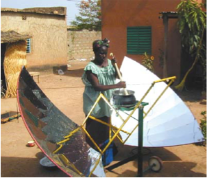
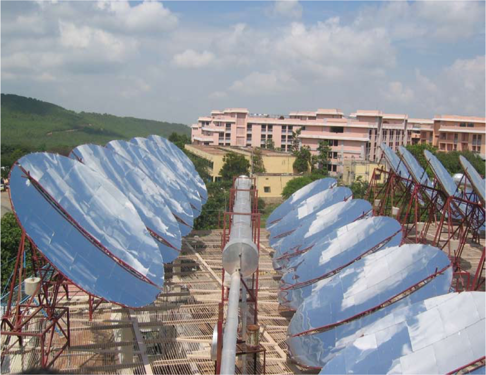

# Bếp mặt trời (Phần II)

## Bất chấp hệ thống cho vay & tình trạng thiếu gỗ cho đến nay, bếp năng lượng mặt trời vẫn chưa được sử dụng ở Burkina Faso

!!! quote ""

    **Burkina Faso là một trong những quốc gia thuộc Sahel (vùng hoang mạc thảo nguyên ở Tây Phi)Trái ngược với Nam Phi hay Ấn Độ, Burkina Faso không có tài nguyên thiên nhiên như trữ lượng than hoặc khí đốt để tạo ra năng lượng. Đặc biệt, phía bắc của đất nước này có thảm thực vật thưa thớt. Tuy nhiên, dân cư ở đây hầu như chỉ dựa vào củi để cung cấp năng lượng; chỉ 3% hộ gia đình có thể sử dụng paraffin (dầu hỏa) hoặc gas. Không chỉ vậy, với thu nhập bình quân đầu người hiện có chưa đến 1 đô la Mỹ mỗi ngày, đây là một trong những quốc gia nghèo nhất trên lục địa châu Phi. Trong khi ở các vùng nông thôn, nơi có đến 80% dân số sinh sống, củi dùng trong gia đình được thu gom thủ công, người dân thành thị phải mua củi với chi phí rất cao. Tuy nhiên, năng lượng mặt trời rất dồi dào ở Burkina Faso. Mặt trời chiếu sáng từ 250 đến 300 ngày trong năm và mức độ bức xạ mặt trời rất cao hầu như không dao động trong suốt cả năm. Tuy nhiên, cần phải nói rằng gió sa mạc, harmattan, thổi vài tháng mỗi năm; ngay cả trong thời tiết nắng nóng, điều này ảnh hưởng nghiêm trọng đến việc sử dụng bếp năng lượng mặt trời vì bụi và cát.**

Nỗ lực phổ biến bếp năng lượng mặt trời ở Burkina Faso bắt đầu từ những năm 1990. Các tổ chức phụ nữ địa phương thường có vai trò quan trọng ở đây. Trong mười năm qua, Tổ chức phi chính phủ (NGO) APEES đã phổ biến khoảng 500 bếp năng lượng mặt trời và máy sấy năng lượng mặt trời, với sự hỗ trợ của tổ chức phi chính phủ Đức-Burkinabè “Năng lượng mặt trời cho Tây Phi” (SEWA). Tổ chức này đã làm việc chặt chẽ với các thợ thủ công địa phương.

{align=right}
Bắt đầu từ năm 1997, **bếp hộp** năng lượng mặt trời thuộc loại **CooKit** đã được phổ biến ở các vùng nông thôn với sự hỗ trợ của một tổ chức phi chính phủ Hà Lan, KoZon. Những chiếc bếp đơn giản và rẻ tiền này do một công ty địa phương sản xuất và được bán với giá tương đương 2,5 đô la Mỹ. Giá này được KoZon trợ giá. Mặc dù CooKit có thể quá nhỏ đối với một đại gia đình ở Burkina Faso và chỉ tạo ra ít điện năng, nhưng chiếc bếp này được cho là đã bán rất chạy, với 300 bếp được bán ra cho năm 2003. Hơn nữa, sự chấp nhận dường như vượt ra ngoài nhóm mục tiêu thông thường là phụ nữ. KoZon báo cáo rằng thanh niên cũng đang sử dụng bếp ở mức độ ngày càng tăng khi họ sống xa gia đình. Tuy nhiên, một cuộc khảo sát cho thấy rằng hơn một nửa số gia đình sử dụng bếp của họ ít hơn ba ngày một tuần. Hơn nữa, trong cuộc điều tra thực địa kéo dài sáu ngày, không có gia đình nào mà nhóm tiếp cận được quan sát thấy đang nấu ăn bằng CooKit. Tổ chức phi chính phủ ACCEDES được cho là đã phổ biến khoảng 25 đến 50 bếp năng lượng mặt trời ở thành phố Bobo Dioulassa mỗi năm, mặc dù không có thông tin gì về chiến lược phổ biến hoặc loại bếp liên quan.

SEWA bán **bếp Papillon** (trong số những loại khác) thông qua hệ thống cho vay, đã được sử dụng thành công từ năm 1999. Các khoản trả góp được liên kết với chi phí củi và bếp được cho là sẽ được trả hết trong vòng 18 đến 21 tháng. Trong năm 2002 và 2003, khoảng 300 bếp năng lượng mặt trời được cho là đã được bán. Tại thành phố Gaoua, tổ chức phi chính phủ Burkinabe APFG đã phân phát 70 bếp nấu ăn Papillon với sự hỗ trợ của SEWA. Kinh phí xây dựng những công trình này do Bộ Hợp tác và Phát triển Kinh tế Liên bang Đức (BMZ) cung cấp, cho dù APFG rõ ràng có vấn đề lớn trong việc thu các khoản trả góp hàng tháng khoảng 7,50 Euro đến 15,00 Euro.

Tổ chức phi chính phủ EG-Solar của Đức cũng báo cáo về một **hệ thống cho thuê hoặc cho vay** thành công. Số lượng bếp bán ra được cho là dưới 100 bếp. Trong trường hợp này, các gia đình phải trả phí thuê bếp là 0,23 Euro, chỉ vào những ngày có nắng&mdash;khi họ đang thực sự tiết kiệm củi. Khoản phí này được ấn định thấp hơn chi phí củi, vào khoảng 0,3 Euro mỗi ngày.
Nhìn chung, các hệ thống cho vay được mô tả ở đây chỉ có thể được áp dụng cho tầng lớp trung lưu thành thị. Mục tiêu về lâu dài là sử dụng bếp năng lượng mặt trời như một biện pháp ngăn chặn sự hủy hoại môi trường, vì đơn giản là chúng quá đắt để sử dụng như một công cụ xóa đói giảm nghèo. Tuy nhiên, trái ngược với hầu hết các quốc gia ở Châu Phi, Burkina Faso có thể thành lập một số cơ sở sản xuất bếp năng lượng mặt trời  với sự hỗ trợ của các tổ chức phi chính phủ quốc tế. Một doanh nghiệp gia đình có tên là ISOMET ở thủ đô Ouagadougou, sản xuất và bán ra khoảng 50 bếp mỗi năm, mặc dù công ty tập trung nhiều hơn vào các công nghệ sử dụng sinh khối. Khoảng 200 đến 300 **bếp Papillon** mỗi năm được xưởng ACOMES sản xuất và bán ra thị trường. Một số trong số này đã được chuyển giao cho NGO SEWA.

Ở Burkina Faso cũng có một số ví dụ về bếp năng lượng mặt trời được sử dụng trong lĩnh vực thương mại. Một trong những trường hợp như vậy là một tiệm bánh mì lớn ở ngoại ô Ougadougou được trang bị 16 gương phản xạ Scheffler (chi phí chuyển đổi: 50.000 Euro) với sự hỗ trợ của Viện năng lượng mặt trời Jülich theo sáng kiến của tổ chức phi chính phủ “Chrétiens pour le Sahel” của Luxembourg. Các gương phản xạ có tổng diện tích bề mặt là 80m^2^ và đốt nóng một lò đá, trong đó có một lớp sỏi để lưu trữ nhiệt. Điều này cho phép việc nướng bánh được tiến hành vào sáng sớm hôm sau, khi nhiệt độ vẫn còn khoảng 250 °C. Tiệm bánh có công suất khoảng 1500 ổ bánh mỗi ngày và hệ thống này được cho là tiết kiệm khoảng 300 lít dầu diesel mỗi tháng. Vì hệ thống chỉ mới được đưa vào sử dụng vào cuối năm 2003 nên chưa có báo cáo nào về trải nghiệm thực tế. Tuy nhiên, nhiều vụ trộm vật liệu phản xạ xảy ra đã khiến việc xây dựng trở nên khó khăn hơn.

Trong khuôn khổ dự án thí điểm do SEWA hỗ trợ, bếp năng lượng mặt trời cũng được sử dụng trong sản xuất bơ karite, một nguyên liệu thô cho ngành công nghiệp mỹ phẩm trong số các mục đích sử dụng khác. Bơ được chiết xuất từ hạt karite bằng cách đun nóng chúng. Ưu điểm của việc sử dụng bếp năng lượng mặt trời là các loại hạt được làm nóng từ từ và nhẹ nhàng, giúp bơ karite thu được theo cách này có chất lượng được cải thiện đáng kể. Cho đến nay điều này chỉ được thực hiện bởi một gia đình.

Hai bếp parabol đã được sử dụng trong một nhà hàng ở thành phố Gaoua. Công nghệ này đã khơi dậy sự quan tâm nồng nhiệt của khách hàng và làm dấy lên hy vọng rằng bếp năng lượng mặt trời sẽ trở nên phổ biến thông qua con đường này. Tuy nhiên, theo thời gian, người ta cần sử dụng những chiếc nồi lớn hơn, những chiếc **bếp parabol** đơn giản không còn phù hợp nữa. Việc mua một chiếc bếp Scheffler sẽ giải quyết được vấn đề, nhưng điều này vượt quá khả năng tài chính của nhà hàng.

Nói chung, mặc dù có nhiều nỗ lực để thúc đẩy sự phổ biến, nhưng bếp năng lượng mặt trời chỉ đóng một vai trò nhỏ ở Burkina Faso, có thể là do truyền thống nấu ăn hay rào cản tâm lý của người dân nông thôn, những người coi việc nấu ăn bằng năng lượng mặt trời là khó có thể thực hiện được. Rõ ràng là đối với tất cả các mẫu bếp mặt trời, hiệu năng và sự tiên tiến về mặt kỹ thuật không phải là vấn đề mà chủ yếu là do giá thành cao đối với đại đa số dân chúng. Cho đến nay, ngay cả một hệ thống cho vay vốn nhắm vào tầng lớp trung lưu có thu nhập ổn định cũng không thể thay đổi được tình trạng này.

## Bếp năng lượng mặt trời ở Ấn Độ&mdash;thành công chỉ giới hạn trong nhà bếp các tu viện?

!!! quote ""

    **Ở Ấn Độ, 58% dân số sử dụng sinh khối làm nguồn năng lượng, chiếm gần một nửa (41%) tổng nguồn cung cấp năng lượng trong nước. Dân số nông thôn đặc biệt phụ thuộc nhiều vào sinh khối. Ở các vùng nông thôn, sinh khối đáp ứng tới 97% nhu cầu năng lượng và chỉ 3% hộ gia đình sử dụng dầu hỏa hoặc khí đốt. Ở một số tỉnh, phân và phụ phẩm cây trồng thường được sử dụng làm chất đốt. Ở các vùng khác, gỗ là nguồn năng lượng chính với 80% được tiêu thụ bởi các hộ gia đình. Thực tế là ở một số bang chặt cây là một hành vi phạm tội có thể bị trừng phạt càng làm trầm trọng thêm tình hình. Thiếu năng lượng được coi là một trong những nguyên nhân chính gây ra điều kiện sống khó khăn ở các vùng nông thôn. Tuy nhiên, điều kiện khai thác năng lượng mặt trời ở Ấn Độ rất tuyệt vời. Nước này năm trên lục địa kéo dài từ vĩ độ khoảng 10° Bắc đến 30° Bắc, do đó có mức độ bức xạ mặt trời cao với gần 300 ngày nắng mỗi năm.**

Công nghệ nấu ăn bằng năng lượng mặt trời tương đối phát triển ở Ấn Độ. Bếp năng lượng mặt trời lớn nhất (vào thời điểm đó) trên thế giới được xây dựng trong một tu viện giống như đạo tràng ở Taleti, bang Rajasthan vào năm 1999. 84 gương phản xạ parabol có đường kính khoảng 4 mét và tổng diện tích bề mặt là 190 m^2^ nước nóng, tạo ra công suất 250kW. Hơi nước có thể được sử dụng để chuẩn bị **36.000 bữa ăn nóng mỗi ngày**, cũng như **khử trùng 10.000 lít nước uống**. Một bộ lưu trữ hơi nước cũng cho phép sử dụng năng lượng mặt trời vào ban đêm hoặc khi trời nhiều mây. Chỉ khi mặt trời không chiếu sáng trong vài ngày liên tiếp, bếp lò thông thường mới phải được sử dụng. Bếp năng lượng mặt trời **thay thế việc đốt cháy 350 lít dầu diesel mỗi ngày**. Hệ thống ở Taleti đã trở thành hình mẫu cho nhiều bếp quy mô lớn khác do một công ty Ấn Độ chế tạo; trong số này, bếp ở Tirupati thậm chí còn lớn hơn bếp ở Taleti, với 106 tấm phản xạ.

Tuy nhiên, các hệ thống này đã không chứng minh được tính đột phá đối trong lĩnh vực sử dụng với năng lượng mặt trời, dựa trên kinh nghiệm thực tế sử dụng của các hộ gia đình. Kể từ những năm 1960, chính phủ đã đưa ra các chương trình nhằm phổ biến **bếp parabol**, **bếp hộp** và **bếp lò năng lượng mặt trời** được trợ cấp. Thông qua các chương trình này, những chiếc bếp có chi phí sản xuất từ 60 đến 70 Đô la Mỹ đã được bán với giá khoảng 30 đến 35 Đô la Mỹ, và ở các vùng nông thôn thậm chí chỉ với giá 15 đô la Mỹ. Nhiều công ty cũng hỗ trợ nhân viên của họ mua một chiếc bếp bằng cách cung cấp một khoản trợ cấp 10 đô la Mỹ. Đồng thời, một chiến dịch quảng cáo rầm rộ đã được thực hiện trên các phương tiện truyền thông và các cuộc trình diễn nấu ăn đã được tổ chức tại các làng. Nhóm mục tiêu là các gia đình trung lưu có thu nhập thường xuyên lên đến khoảng 200 đô la Mỹ mỗi tháng.

Cho đến năm 2003, tổng cộng khoảng 530.000 bếp đã được bán, phần lớn trong số này ở các thị trấn và thành phố. Tuy nhiên, các cuộc điều tra cho thấy rằng sau một thời gian, một số gia đình chỉ sử dụng bếp một cách rời rạc và khoảng 30% không sử dụng chúng nữa. Đôi khi, tủ nấu hộp cũng được sử dụng cho các mục đích khác, chẳng hạn như để bảo quản tài liệu an toàn chống côn trùng hoặc làm hộp giữ ấm thức ăn.
Rõ ràng là các chương trình hầu như không có bất kỳ tác động nào ở các vùng nông thôn, mặc dù chính ở đây, người dân phải chịu cảnh thiếu năng lượng. Ví dụ, một nghiên cứu năm 1996 về tiêu thụ năng lượng ở nông thôn tại 6 bang cho thấy, bất chấp tất cả các chiến dịch quảng cáo và trợ cấp, trong số 51.000 hộ gia đình được khảo sát, chỉ có 70 hộ sở hữu bếp năng lượng mặt trời. Bằng chứng cho thấy người dân ở những vùng nông thôn này chắc chắn cởi mở với công nghệ mới được thể hiện qua việc có tới 6.200 gia đình sở hữu nồi áp suất tiết kiệm năng lượng (hay nói cách khác là gần gấp trăm lần so với những gia đình sở hữu nồi năng lượng mặt trời). Bên cạnh đó, vào năm 2000, con số 487.000 bếp năng lượng mặt trời đã được phổ biến có thể trái ngược với ba triệu công trình khí sinh học và khoảng 29 triệu bếp cải tiến giúp tiết kiệm khoảng 40 % củi hoặc than nếu không được sử dụng.

## Bếp năng lượng mặt trời ở Nam Phi&mdash;sản phẩm không có thị trường?

!!! quote ""

    Ở nhiều khía cạnh, Nam Phi sở hữu các điều kiện tốt cho việc sử dụng bếp năng lượng mặt trời. Ví dụ, nhờ vào vị trí khoảng 30° phía nam đường xích đạo, bức xạ mặt trời ở đây gần như tương đương với ở Tây Tạng hoặc trên cao nguyên Altiplano. Hơn nữa, đất nước này chỉ có nguồn tài nguyên gỗ vốn khan hiếm để sử dụng và ít hơn 10% diện tích đất ở đây là rừng. Kể từ khi chế độ phân biệt chủng tộc kết thúc, tình hình kinh tế đã tốt hơn so với hầu hết các quốc gia khác trên lục địa. Thu nhập bình quân đầu người hàng năm vào khoảng 2.600 USD, mặc dù có sự khác biệt lớn về thu nhập giữa các thành phần dân số. Cơ sở hạ tầng phát triển tốt tạo điều kiện thuận lợi cho việc sản xuất bếp năng lượng mặt trời tại địa phương. Ngoài gỗ, khí đốt và parafin (dầu hỏa) chủ yếu được sử dụng làm nguồn năng lượng chính để nấu ăn, cũng như điện ở các khu vực thành thị.

Một số nỗ lực đã được thực hiện để phổ biến bếp năng lượng mặt trời trên cơ sở thương mại ở Nam Phi. Vào cuối những năm 1990, một doanh nghiệp tầm trung của Đức đã giới thiệu ra thị trường một loại **bếp hộp** được phát triển đặc biệt cho Nam Phi. Về mặt kỹ thuật, chiếc bếp này hoạt động tốt, nhưng nó đã thất bại do đối tác Nam Phi thiếu quan tâm và bản thân họ thiếu nguồn lực. Ngược lại, trong nhiều năm nay, tổ chức phi lợi nhuận quốc tế **Sunstove** đã quảng bá một loại bếp năng lượng mặt trời rẻ tiền, hiệu năng có thể nhỏ hơn **Sunstove**, trong đó hơn 10.000 chiếc đã được bán cho đến nay. Thật không may, không có nghiên cứu có hệ thống về mức độ sử dụng bếp của **Sunstove**.

Để có được câu trả lời cuối cùng cho câu hỏi đằng sau **các yếu tố quyết định sự thành công của việc phổ biến thương mại**, một thử nghiệm thực địa toàn diện nhất (tại thời điểm đó) đối với bếp năng lượng mặt trời đã được triển khai vào năm 1996 bởi một đại diện của BMZ. Các khu vực thử nghiệm tiềm năng đã được điều tra trước và 200 hộ gia đình đã được hỏi về thói quen nấu nướng của họ. Việc chọn lựa các các loại bếp năng lượng mặt trời được tiến hành song song. Tổng cộng có bảy mẫu khác nhau đã được sử dụng trong thử nghiệm, bao gồm tất cả các loại bếp, ngoại trừ bếp Scheffler không phù hợp để sử dụng trong các hộ gia đình bình thường. Tất cả các bữa ăn trong các khu vực thử nghiệm có thể được chuẩn bị với các mô hình đã chọn. Chi tiêu hàng tháng cho nhiên liệu dao động trong khoảng từ 4,5 EUR đến 10,00 EUR, tùy thuộc vào địa phương. Trên cơ sở kết quả, dự án đã chọn 66 gia đình ở ba cộng đồng, những người này đã dùng thử các mẫu bếp khác nhau trong một năm. Chi tiết chính xác về hành vi nấu ăn và chi tiêu nhiên liệu đã được ghi lại.

Để tìm ra mẫu nào phù hợp nhất để đưa ra thị trường, cứ hai tháng các gia đình lại chuyển sang một loại bếp năng lượng mặt trời khác. 30 gia đình không có bếp năng lượng mặt trời được coi là nhóm đối chứng.

Sau một năm, kết quả thử nghiệm thực địa rất đáng khích lệ. Bếp sử dụng năng lượng mặt trời cùng với bếp đốt củi là những loại bếp được sử dụng thường xuyên nhất, tiếp theo là bếp gas, bếp parafin và điện. Sử dụng bếp năng lượng mặt trời cho phép các hộ gia đình giảm chi phí năng lượng trung bình gần 40%. Mức độ chấp nhận bếp năng lượng mặt trời cao cũng được thể hiện rõ ở thực tế là vào cuối cuộc thử nghiệm thực địa, tất cả các gia đình tham gia đã mua bếp của họ và một danh sách chờ phải được lập cho các gia đình quan tâm khác. Nói một cách tuyệt đối, trong thời gian thử nghiệm kéo dài một năm, tất cả các gia đình đã cùng nhau tiết kiệm được tổng cộng 60 tấn gỗ, 2 tấn gas và hơn 2.000 lít parafin. Một cuộc khảo sát khác đối với các gia đình được thực hiện vào năm 2000 cho thấy hầu hết bếp nấu vẫn được sử dụng, và thực tế là nhiều nhất ở một ngôi làng nơi trước đây củi là nhiên liệu chính được sử dụng để nấu nướng.
Do đó, nền tảng đã sẵn sàng cho giai đoạn tiếp theo của việc phổ biến thương mại bếp năng lượng mặt trời ở Johannesburg và tỉnh Gauteng, được thực hiện với sự hợp tác của một doanh nghiệp chính phủ, Tập đoàn Phát triển Năng lượng. Dấu hiệu thành công là số liệu bán hàng, được cho là sẽ tăng gấp đôi sau mỗi sáu tháng, bắt đầu với 1.000 bếp. Điều đó có nghĩa là sau hai năm, khoảng 16.000 chiếc bếp đã được bán. Con số này đạt được bằng cách hỗ trợ các công ty tư nhân hoạt động dọc theo chuỗi cung ứng. Tuy nhiên, trong quá trình thực hiện dự án, sự hỗ trợ tập trung vào các nhà cung cấp của các nhà bán buôn nhằm ngăn chặn các công ty trở nên phụ thuộc vào dự án. Các biện pháp can thiệp của dự án được tập trung chặt chẽ theo các nguyên tắc thị trường tự do, chẳng hạn như loại trừ bất kỳ khoản trợ cấp nào đối với bếp nấu ăn.

Nhóm mục tiêu của dự án bao gồm các gia đình ở Johannesburg và Gauteng với thu nhập hàng tháng từ 150 đến 340 Euro. Nhóm này chiếm 40% dân số. Một nhóm mục tiêu khác là các gia đình có thu nhập trên 1.900 Euro, chiếm chưa đến 5% dân số. Việc bán những chiếc bếp tương đối đắt tiền cho những gia đình có thu nhập cao hơn nhằm tạo ra một hình ảnh tích cực về bếp năng lượng mặt trời trong mắt công chúng. Ngược lại, điều này nhằm mục đích khuyến khích việc bán bếp rẻ hơn cho các gia đình nghèo hơn.

Các mẫu bếp được cung cấp đa dạng từ **bếp hộp** đơn giản, rẻ tiền đến **bếp Papillon** (bếp cánh bướm) tiên tiến hơn. Công suất của bếp dao động từ 200 W trong trường hợp **Suncatcher** đến 1.200 W đối với **Papillon**. Thông thường, **bếp parabol** mạnh hơn **bếp hộp**. Giá bắt đầu ở mức khoảng 10 Euro cho bếp **Sunstove**, tăng lên khoảng 170 Euro cho Papillon.

Trên thực tế, dự án đã có thể tăng số lượng nhà cung cấp thương mại bếp năng lượng mặt trời lên hơn 20. Tuy nhiên, nhiều công ty đã ngừng hoạt động sau khi dự án cắt giảm hỗ trợ. Đặc biệt, trong giai đoạn đầu cũng có những bước thụt lùi do việc hợp tác với các đối tác tỏ ra không phù hợp. Ví dụ: một số cá nhân có quá ít nguồn lực để tiếp thị bếp năng lượng mặt trời một cách độc lập.

Trong quá trình lập kế hoạch dự án, sự thận trọng của khu vực tư nhân trong việc tiếp thị bếp năng lượng mặt trời được coi là vấn đề cốt lõi. Mặc dù quảng cáo trên các phương tiện truyền thông in ấn, trên đài phát thanh và truyền hình nhưng vẫn không thể vượt qua được rào cản này.
Một ví dụ là chuỗi cửa hàng thức ăn nhanh Nam Phi đã nhận được hỗ trợ tài chính để sử dụng bếp năng lượng mặt trời tại các chi nhánh của mình. Tuy nhiên, sự hợp tác đã chấm dứt khi dự án bị giảm bớt trợ câp. Một thỏa thuận hợp tác khác với một công ty khai thác mỏ được cho là sẽ giúp phổ biến bếp năng lượng mặt trời cho tầng lớp dân cư nghèo hơn. Công ty đã mua hàng trăm chiếc bếp và phân phát chúng cho công nhân hoặc tặng chúng cho các trường học nhằm mục đích trình diễn. Song song với việc đó, nhân viên cũng được đào tạo và phát triển mô hình tài chính đi kèm. Tuy nhiên, biện pháp này cũng tỏ ra không thành công về lâu dài.

Bất chấp mọi nỗ lực, trong suốt hai năm, tổng cộng khoảng 1.300 chiếc bếp có thể được bán ra. Con số này chưa bằng 1/10 so với mục tiêu khoảng 16.000 bếp mà dự án đã đặt ra. Hơn nữa, một số bếp năng lượng mặt trời đã được một công ty tư nhân mua vì mục đích từ thiện. Do doanh nghiệp đối tác Nam Phi cũng nhận thấy không có cách nào khả thi để tiếp tục các hoạt động dưới sự kiểm soát trực tiếp của mình trước những trở ngại mà doanh nghiệp gặp phải nên dự án đã bị chấm dứt vào năm 2006.

## Bếp năng lượng mặt trời trong trại tị nạn&mdash;cho đến nay vẫn chưa phải là một câu chuyện thành công

Theo UNHCR, năm 2004 có hơn ba triệu người tị nạn ở Châu Phi. Họ thường xuyên phải sống tạm bợ hay thậm chí trong thời gian dài trong các trại, hầu hết ở những vùng dân cư thưa thớt, nhạy cảm về mặt sinh thái. Các trại thường chỉ có cơ sở hạ tầng cơ bản: mặc dù người tị nạn được cung cấp chỗ ở và thực phẩm nhưng họ không có nhiên liệu cần thiết để nấu thức ăn hoặc giữ ấm. Họ tìm kiếm củi cần thiết ở khu vực lân cận các trại tị nạn, điều này thường dẫn đến xung đột với người dân địa phương và gây ra thiệt hại nghiêm trọng về môi trường. Trong nhiều trường hợp, vấn đề không chỉ giới hạn ở giai đoạn chuyển tiếp ngắn ngủi trong trại: hàng chục ngàn người tị nạn thường phải chờ nhiều năm trước khi họ có thể trở về nhà. Vì điều kiện khí hậu nhìn chung cũng thuận lợi nên việc sử dụng bếp năng lượng mặt trời dường như là một lựa chọn hợp lý.

Những nỗ lực đầu tiên nhằm phổ biến bếp năng lượng mặt trời cho người tị nạn ở Châu Phi bắt đầu từ những năm 1990, khi nhiều tổ chức phi chính phủ phân phát hơn 2.300 bếp tại trại tị nạn Daadab và khu vực xung quanh Kakuma ở miền bắc Kenya (gần biên giới với Sudan). Trước đó, gỗ và than là nhiên liệu chính. Mô hình **bếp hộp** năng lượng mặt trời được sử dụng trong kế hoạch này là **CooKit** rất rẻ với hiệu suất thấp. Mặc dù được các gia đình đón nhận nồng nhiệt, chiếc bếp này có thể không linh hoạt và vì thế tạo ra những căng thẳng và khó khăn trong việc sử dụng nó hàng ngày. Do đó, vào cuối những năm 1990, **bếp parabol** đã được giới thiệu. Các thợ thủ công được đào tạo đã lắp ráp tổng cộng 1.050 bếp năng lượng mặt trời tại các trại tị nạn Kakuma và Daadab. Loại bếp này có tên là **Ilanga**, tương ứng với **bếp parabol** **SK10** và **SK14**. Chúng được phân phát cho các gia đình tị nạn. Các tổ chức như trường học, nhà thờ và bệnh viện cũng được trao hơn 70 bếp nấu ăn. So với **CooKit**, những chiếc bếp này đạt nhiệt độ cao hơn đáng kể và cũng có thể được sử dụng để chiên rán.

Một dự án thí điểm khác đã được triển khai vào năm 2003 tại một trại tị nạn ở Osire, Namibia. Trại này nhỏ hơn nhiều so với trại ở Kakuma, với khoảng 12.500 người tị nạn, hầu hết đến từ Angola. Gỗ là nguồn năng lượng chính, và phần lớn được lấy từ vùng lân cận của trại. Ngoài ra, những người tị nạn còn nhận được parafin miễn phí, không chỉ để thắp sáng mà còn cho mục đích nấu nướng, điều này tỏ ra cực kỳ phản tác dụng đối với việc sử dụng bếp năng lượng mặt trời.
Tất cả trong tất cả 111 **bếp parabol**, loại **SK9**, **SK10** và **SK14** đã được lắp đặt bởi những người tị nạn đã qua đào tạo. Sự quan tâm đến công nghệ mới rất lớn: chỉ sau ba buổi trình diễn nấu ăn, hơn 460 gia đình đã ghi tên mình vào danh sách chờ. Để không làm tăng kỳ vọng quá cao và do số lượng bếp năng lượng mặt trời có sẵn hạn chế, các cuộc trình diễn sau đó đã bị dừng lại và bếp được trao cho các gia đình được chọn; đổi lại họ làm việc trong vườn cộng đồng hay các cơ sở chung khác.

Tình hình khác biệt ở các trại tị nạn khiến cho việc kiểm tra việc sử dụng bếp năng lượng mặt trời trở nên dễ dàng. Điều này cho thấy rằng tất cả các bữa ăn điển hình trước đây được nấu bằng củi cũng có thể được chuẩn bị trên thiết bị mới. Mặc dù vậy, bếp truyền thống vẫn tiếp tục được sử dụng, trong khi bếp năng lượng mặt trời là một lựa chọn bổ sung. Tuy nhiên, các ước tính ở Kakuma chỉ ra rằng có thể tiết kiệm được khoảng 35% năng lượng tiêu thụ nếu bếp được sử dụng càng nhiều càng tốt.

Kết quả đánh giá toàn diện ở Osire ban đầu rất đáng khích lệ: các gia đình cho biết họ sử dụng bếp vào năm hoặc sáu ngày nắng mỗi tuần. Họ nói rằng họ thích hương vị của thức ăn được chế biến trên bếp năng lượng mặt trời, không có “hương vị” của khói parafin; thịt được nấu bởi năng lượng mặt trời thậm chí còn được coi là một món ngon của những người tị nạn. Người dùng cũng ca ngợi thực tế là chúng hoạt động mà không tạo ra khói. Hơn nữa, một số gia đình đã chứng tỏ có tính sáng tạo cao. Họ sử dụng bếp năng lượng mặt trời để làm xà phòng và từ đó tạo ra thu nhập cho chính họ; những người khác không chỉ sử dụng chúng để nấu ăn mà còn để sưởi ấm bàn ủi quần áo nhằm tiết kiệm than. Tuy nhiên, những người khác đã sử dụng **bếp parabol** làm gương phản chiếu để thắp sáng vào buổi tối, bằng cách đặt một ngọn nến ở nơi nồi thường đặt. Một số gia đình nghèo hơn đã bán khẩu phần paraffin mà họ nhận được từ UNHCR để nấu ăn cho các gia đình giàu có hơn, trong khi bản thân họ sử dụng bếp năng lượng mặt trời của mình. Và không kém phần quan trọng, công việc lắp ráp bếp của những người tị nạn được đào tạo là một hoạt động mà họ đánh giá cao như một sự thay đổi có ý nghĩa so với cuộc sống bình thường hàng ngày trong trại tị nạn.

Tuy nhiên, một cuộc điều tra kỹ hơn về các tác động đối với mức tiêu thụ nhiên liệu cho thấy chỉ có dưới 10 trong số 111 gia đình được khảo sát sử dụng bếp năng lượng mặt trời thường xuyên, do đó đạt được mức tiết kiệm 40%. Đại đa số chỉ thỉnh thoảng nấu ăn bằng năng lượng mặt trời, và một số gia đình đã từ bỏ việc sử dụng bếp trong quá trình nghiên cứu hoặc thậm chí ngay từ đầu, điều này trở nên dễ dàng hơn nhờ việc cung cấp parafin miễn phí. Điều này đặc biệt áp dụng cho các mẫu bếp nhỏ hơn, trong khi **SK14** mạnh hơn lại hoạt động tốt hơn. Kinh nghiệm tương tự ở Kenya, nơi chỉ có khoảng 10% gia đình sử dụng bếp năng lượng mặt trời thường xuyên. Khi một tổ chức viện trợ của Mỹ quyên góp vài triệu đô la để mua củi tại trại ở Daadab, điều này đã khiến các hoạt động nấu ăn bằng năng lượng mặt trời đột ngột kết thúc. 

Ở Namibia cũng vậy, **sự chấp nhận của người dùng** là vấn đề cốt yếu mang tính quyết định. Bếp năng lượng mặt trời đã không thể tự đứng vững trước sự cạnh tranh từ các loại nhiên liệu khác. Xét về mức độ phổ biến của nhiên liệu, bếp năng lượng mặt trời chiếm vị trí cuối cùng sau gỗ và than củi; chỉ có parafin được sử dụng ít hơn. Một trong những lý do chính khiến năng lượng mặt trời hoạt động kém là do nó **phụ thuộc vào thời tiết**, mà các gia đình cho là vấn đề cốt yếu. Tuy nhiên, thời gian nấu lâu hơn trên các bếp năng lượng mặt trời kích thước nhỏ hơn cũng được nhiều người coi là một bất lợi, cũng như **nguy cơ gây hại do chói mắt**. Tuy nhiên, nếu xử lý bếp đúng cách thì có thể tránh được việc chói mắt mà không gặp khó khăn gì, và kỹ thuật này cũng đã được phổ biến cho các gia đình. Gió trong vùng đôi khi rất mạnh, thường xuyên thổi đổ, làm hỏng bếp. Hơn nữa, ở Daadab và Kakuma, cát và bụi là một vấn đề. Hệ quả là các bếp bẩn bị mất hơn 1/4 công suất. Làm sạch các gương phản xạ parabol dễ bị hỏng là một nỗ lực tốn nhiều công sức, đòi hỏi một lượng nước tương đối lớn, vốn bị thiếu hụt trong các trại tị nạn.

Thực tế nấu ăn bằng năng lượng mặt trời không được coi là một lựa chọn “khẩn cấp” cũng đã được chỉ ra khi tranh chấp với người dân địa phương ở Osire leo thang và nổ súng vào những người tị nạn đang thu thập củi. Điều này đã không dẫn đến việc sử dụng bếp năng lượng mặt trời nhiều hơn; thay vào đó, việc nấu ăn ít được thực hiện bằng gỗ và nhiều hơn bằng parafin.

Những kinh nghiệm ở các trại tị nạn chứng minh rằng bếp năng lượng mặt trời chắc chắn có thể góp phần cung cấp năng lượng. Tuy nhiên, vấn đề trọng tâm cho đến nay vẫn là sự chấp nhận của người dùng đối với công nghệ này.

## Các chiến lược phổ biến bếp năng lượng mặt trời thu được ít thành công&mdash;sự chấp nhận của người dùng vẫn là vấn đề

!!! quote ""

    **Theo kinh nghiệm thu được ở các khu vực và dự án khác nhau, có thể xác định bốn chiến lược phổ biến, thường được sử dụng kết hợp như sau:**
    - **Các chương trình phổ biến do nhà nước kiểm soát** với mức giá đôi khi được bao cấp hoặc miễn phí (Trung Quốc)
    - **Phổ biến thương mại các mô hình được trợ cấp** (Trung Quốc, Ấn Độ)
    - **Ra mắt thị trường chỉ với trợ cấp gián tiếp cho bếp** (Nam Phi) và các đề nghị cho vay kèm theo cho người mua (Burkina Faso)
    - **Cho thuê và bán theo giá thị trường thông thường**, được hỗ trợ bởi các hoạt động của dự án liên quan đến quảng cáo và nâng cao nhận thức (Burkina Faso).

Tại thời điểm viết bài, không có chiến lược nào trong số này đạt được thành công toàn diện. Tuy nhiên, điều này ít liên quan đến cách tiếp cận hay cách phổ biến đã chọn; thay vào đó, bên cạnh các vấn đề kỹ thuật của một số loại bếp, việc miễn cưỡng áp dụng công nghệ này trước hết được cho là do thiếu sự chấp nhận của xã hội. Trong nhiều trường hợp, bếp năng lượng mặt trời không thể được tích hợp vào cuộc sống gia đình và công việc hàng ngày của các gia đình mà không gây thêm rắc rối nào. Hơn nữa, sử dụng bếp năng lượng mặt trời hỏi thay đổi hành vi, điều này rất khó thuyết phục mọi người chấp nhận, trong khi có những lựa chọn thay thế thuận tiện hơn hoặc gần gũi hơn với truyền thống của người dùng. Ví dụ ở Ấn Độ cho thấy nấu ăn được coi là một hoạt động riêng tư không thể thực hiện ngoài trời. Ví dụ, các món ăn truyền thống yêu cầu chiên ngập dầu và chiên cạn không thể chế biến bằng **bếp hộp**, hoặc ít nhất là không thể sử dụng chỉ **bếp hộp**. Tại sao, mọi người nên thực hiện chuyển đổi? Thói quen nấu ăn là một phần rất quan trọng trong lĩnh vực riêng tư của nhà bếp và thường không dễ thay đổi. Điều này cũng áp dụng cho việc sử dụng bếp nấu ăn mà mọi người không muốn thay đổi mà không tốn thêm công sức ngay cả khi ‘cái mới’ hoạt động nhanh hơn và tốn ít chi phí vận hành hơn (ví dụ: các gia đình trong thử nghiệm ở Nam Phi). Không chỉ vậy: khi sử dụng bếp năng lượng mặt trời, các yếu tố bên ngoài như thời tiết, thời gian trong ngày cũng phải được tính đến. Tuy nhiên, nếu&mdash;chẳng hạn như trường hợp ở các thị trấn ở Nam Phi&mdash;việc nấu ăn thường được thực hiện theo truyền thống vào buổi chiều muộn hoặc buổi tối, thì bếp năng lượng mặt trời không phải là một lựa chọn thực sự. Phải thừa nhận rằng đã có những cách tiếp cận riêng biệt nhằm giải quyết những khó khăn này và việc cung cấp bếp năng lượng mặt trời cần kết hợp với các công nghệ khác, chẳng hạn như **Bếp tên lửa** (*Rocket Stove*, bếp đun sử dụng củi/than). Trong những trường hợp như vậy, tiềm năng tiết kiệm từ **bếp củi/than cải tiến** và **bếp năng lượng mặt trời** có thể bổ sung cho nhau. Liệu cách tiếp cận tích hợp này có khả thi hay không vẫn cần thời gian trả lời.

Phải nói thêm một thực tế là một số chiến lược phổ biến cản trở tính bền vững vì chính cách tiếp cận của chúng: nguồn trợ cấp cao ban đầu khơi dậy những kỳ vọng sai lầm của người tiêu dùng. Một khi trợ cấp không còn, sự quan tâm đến công nghệ cũng tiêu tan. Hơn nữa, trợ cấp cho bếp năng lượng mặt trời không giải quyết triệt để vấn đề thiếu sự chấp nhận của người dùng. Thay vào đó, điều quan trọng là phải phát triển các mô hình tài trợ khuyến khích sử dụng công nghệ hơn là mua lại nó&mdash;nói cách khác khuyến khích nấu ăn bằng năng lượng mặt trời hơn là mua bếp. Thật không may, mặc dù các mô hình như vậy đã được xem xét, nhưng vẫn chưa có mô hình nào được thử nghiệm trong thực tế.

Cách tiếp cận của Nam Phi nhằm giải quyết vấn đề trợ cấp: các cơ chế thị trường được cho là sẽ được sử dụng để phổ biến bếp năng lượng mặt trời ngay từ đầu. Người ta hy vọng sẽ đạt được mục tiêu giới thiệu ra thị trường bằng cách thúc đẩy các công ty hoạt động dọc theo chuỗi cung ứng bếp năng lượng mặt trời để tránh trợ cấp trực tiếp. Mặc dù vậy, dự án đã không thể đạt được thành công; một trong những lý do quan trọng nhất là xu hướng giá của nguồn năng lượng cạnh tranh, điện. Do Nam Phi có công suất sản xuất điện dư thừa đáng kể nên mức tăng giá điện trong toàn bộ quá trình thực hiện dự án nằm ở mức thấp hơn tỷ lệ lạm phát. Ví dụ, ở các thị trấn và thành phố lớn hơn, ngay cả đối với các hộ gia đình nghèo hơn, động lực chuyển sang nấu ăn bằng năng lượng mặt trời rõ ràng là không đủ lớn, đặc biệt khi giá mua một bếp năng lượng mặt trời tương đương gấp vài lần mức lương hàng tháng. Những nỗ lực của dự án để giới thiệu một hệ thống cho vay cho bếp năng lượng mặt trời đã thất bại vì **thiếu sự quan tâm từ phía các ngân hàng**. Mặt khác, một quỹ tín dụng được tài trợ bởi dự án này không phù hợp với khái niệm tiếp thị. Một vấn đề khác rõ ràng là ngay từ cái nhìn đầu tiên, mọi người cũng rất thích bếp năng lượng mặt trời. Tại các cuộc triển lãm và hội chợ thương mại, dự án thường gây được sự quan tâm sôi nổi và nhiều khách tham quan đã tự nhiên bày tỏ mong muốn mua một chiếc bếp. Tuy nhiên, tính thân thiện với người dùng của bếp, những thay đổi hành vi cần thiết để sử dụng chúng một cách tốt nhất, và những lợi ích thực tế của bếp năng lượng mặt trời trong cuộc sống hàng ngày thường bị đánh giá sai. “Quảng cáo truyền miệng”, một yếu tố quan trọng trong việc phổ biến rộng rãi, kém hiệu quả hơn mong đợi. Mặt khác, những khách hàng không hài lòng có thể nhanh chóng hủy hoại hình ảnh của sản phẩm.

Nói chung, vẫn còn thiếu **đào tạo có hệ thống cho người dùng** về cách sử dụng bếp năng lượng mặt trời hàng ngày cũng như cách chăm sóc và bảo trì chúng. Thêm nữa, không có sự đào tạo hay tiếp cận với một dịch vụ bảo trì chuyên nghiệp nào. Từ ví dụ của Trung Quốc, có thể thấy rằng chất lượng của bếp bị ảnh hưởng chủ yếu do **thiếu sự đảm bảo của nhà sản xuất**. Tuy nhiên, ngoài các chương trình do chính phủ tài trợ, cũng có một số lượng lớn mà hầu hết là các tổ chức phi chính phủ được nước ngoài thúc đẩy hỗ trợ sản xuất và phổ biến bếp năng lượng mặt trời tại địa phương trong các doanh nghiệp thủ công nhỏ hoặc doanh nghiệp gia đình. Hỗ trợ hậu mãi và đào tạo người dùng thường được tổ chức tốt hơn theo các phương pháp này.

Ở Ấn Độ, người ta chú trọng hơn đến việc phổ biến thương mại các bếp nấu được trợ giá. Ở đây cũng có những phàn nàn về việc thiếu hỗ trợ hậu mãi cho khách hàng, mặc dù sáu trung tâm khu vực về bếp năng lượng mặt trời đã được thành lập, ngoài việc thử nghiệm bếp còn cung cấp hỗ trợ về các vấn đề kỹ thuật và tiến hành đào tạo.

Dịch vụ chăm sóc khách hàng toàn diện là điều cần thiết với bếp năng lượng mặt trời. Đặc biệt là lúc đầu mọi người thường vận hành chúng không chính xác, nhưng điều này thường ảnh hưởng đến chất lượng của thiết bị và nhanh chóng dẫn đến việc công nghệ bị từ chối. Để giải quyết vấn đề này, điều quan trọng là phải có người liên lạc tại hiện trường.

Một cách trùng hợp, vấn đề chung của tất cả các chiến lược được mô tả ở đây, ngoại trừ cách tiếp cận ở Tây Tạng, là chúng **không còn nhắm vào các bộ phận dân cư nghèo mà nhắm vào tầng lớp trung lưu**. Điều này xảy ra do giá mua bếp năng lượng mặt trời tương đối cao, loại trừ  phần lớn việc phổ biến thương mại các mô hình bếp phức tạp hơn giữa các thành viên nghèo hơn trong xã hội. Một vấn đề nan giải cơ bản trở nên rõ ràng ở đây: các nghiên cứu đã chỉ ra rằng chính những gia đình nghèo hơn mới sử dụng nhiều hơn bếp năng lượng mặt trời, vì họ ít có khả năng chuyển sang các nguồn năng lượng khác hơn so với tầng lớp trung lưu. Do đó, những nỗ lực đang được thực hiện để sử dụng quỹ biến đổi khí hậu cho bếp năng lượng mặt trời, thông qua Cơ chế Phát triển Sạch (CDM) được phát triển trong khuôn khổ Nghị định thư Kyoto, và qua đó làm giảm giá bán. Ví dụ, các tính toán về lượng CO~2~ tiết kiệm được do bếp năng lượng mặt trời cho thấy giá bán của **bếp Papilon** có thể giảm đáng kể. Việc nấu ăn bằng năng lượng mặt trời được thực hiện tại các đạo tràng ở Ấn Độ để bù đắp lượng khí thải CO~2~ mà những người tham gia Hội nghị Năng lượng tái tạo ở Bonn năm 2004 gây ra bởi các chuyến bay của họ. Tuy nhiên, xúc tiến thông qua CDM đòi hỏi một quy trình giám sát phức tạp và phát sinh chi phí chuyển nhượng cao trong CDM, điều này cho đến nay vẫn cản trở bất kỳ hoạt động xúc tiến quy mô nào đối với các dự án bếp năng lượng mặt trời. Đó là lý do tại sao những nỗ lực hiện đang được thực hiện để đơn giản hóa quá trình này.

Trong khi đó, một dự án thí điểm hiện đang được chuẩn bị ở vùng Banda Aceh của Indonesia nhằm phổ biến 1.000 **bếp parabol** trên cơ sở CDM. Vẫn còn phải xem liệu có thể đạt được yêu cầu sử dụng nhiều bếp trong 1.500 giờ mỗi năm, con số cần thiết để đáp ứng các tiêu chí CDM, hay không. Sau cùng, vẫn còn những lo ngại rằng việc áp dụng bền vững bếp năng lượng mặt trời dường như không tương thích với các khoản trợ cấp dài hạn, ngay cả khi chúng dựa trên Nghị định thư Kyoto.

## Mười quy tắc cơ bản hứa hẹn việc phổ biến và sử dụng bếp năng lượng mặt trời sẽ thành công

**1. Nguồn sinh khối có sẵn làm nhiên liệu rất thưa thớt và khó khai thác; những người sử dụng tiềm năng đôi khi gặp khó khăn trong việc lấy nhiên liệu trong một số thời gian nhất định.**

**2. Nhóm mục tiêu không dễ dàng tiếp cận các nguồn năng lượng giá rẻ khác.**

**3. Bếp không bao giờ nên được cung cấp như một giải pháp duy nhất mà tốt nhất là với một gói các công nghệ gia dụng tiết kiệm năng lượng khác.**

**4. Trong khu vực sinh hoạt phải có nơi thuận lợi để đón ánh sáng mặt trời, tạo điều kiện thuận lợi cho việc nấu nướng bằng năng lượng mặt trời.**

**5. Phải có khả năng chuẩn bị các món ăn quan trọng nhất của địa phương trên bếp và việc nấu ăn bằng năng lượng mặt trời không được cản trở truyền thống nấu ăn của địa phương.**

**6. Bếp có tỷ lệ giữa giá cả và hiệu suất tốt phải có sẵn tại địa phương và phải đảm bảo dịch vụ sau bán hàng và bảo trì.**

**7. Phải đảm bảo hỗ trợ theo dõi kỹ lưỡng cho người dùng và phải xây dựng các cách thức để thực hiện điều này.**

**8. Ở một số khu vực, bếp phải được bảo vệ chống trộm và do đó phải dễ dàng di chuyển đến nơi an toàn.**

**9. Việc xử lý (đặc biệt là theo dõi ánh nắng mặt trời) phải dễ dàng và bếp phải ổn định.**

**10. Khi nói đến việc phổ biến bếp năng lượng mặt trời, cần lưu ý rằng chúng cũng có thể thực hiện các chức năng bổ sung quan trọng, tùy thuộc vào tình huống – ví dụ như khử trùng nước uống, bảo quản mứt hoặc trái cây, làm nóng bàn là quần áo.**

**Nguồn dẫn: Các lựa chọn sử dụng bếp năng lượng mặt trời ở các nước đang phát triển**

- [Cooking with the Sun](https://energypedia.info/wiki/Cooking_with_the_Sun#cite_note-GTZ_HERA_.282007.29:_Here_Comes_the_Sun._Options_for_Using_Solar_Cookers_in_Developing_Countries._https:.2F.2Fenergypedia.info.2Fwiki.2FFile:Using_Solar_Cookers_in_Developing_Countries.pdf-1)

- [Solar Cooker Wiki](http://solarcooking.wikia.com/wiki/Solar_Cookers_International_Network_(Home))

