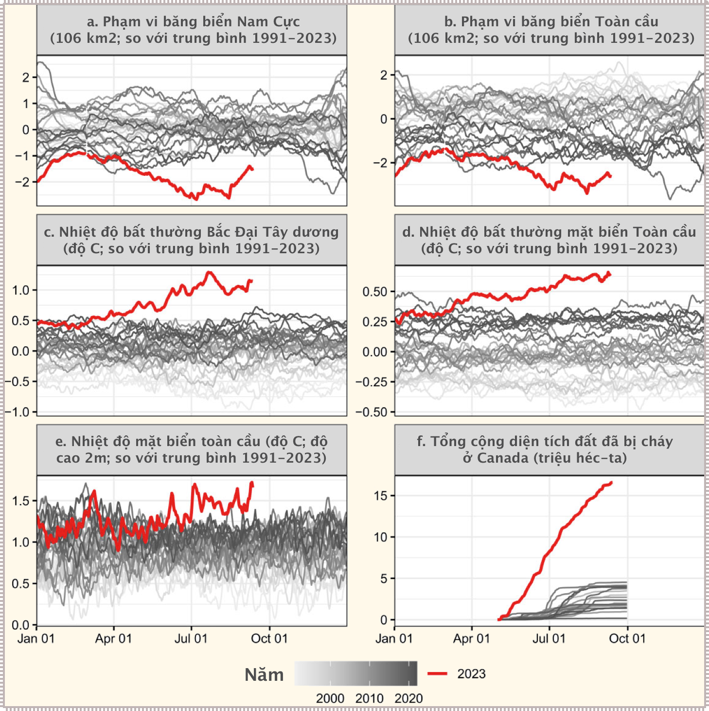
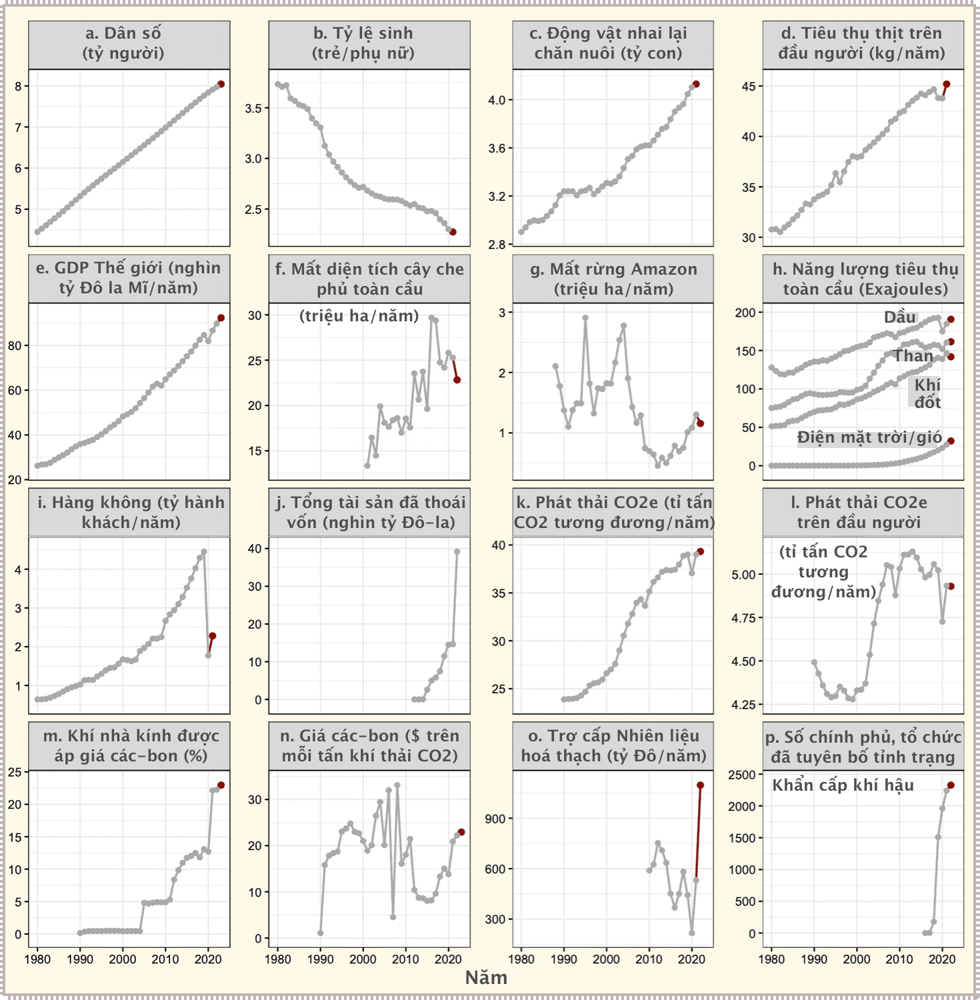
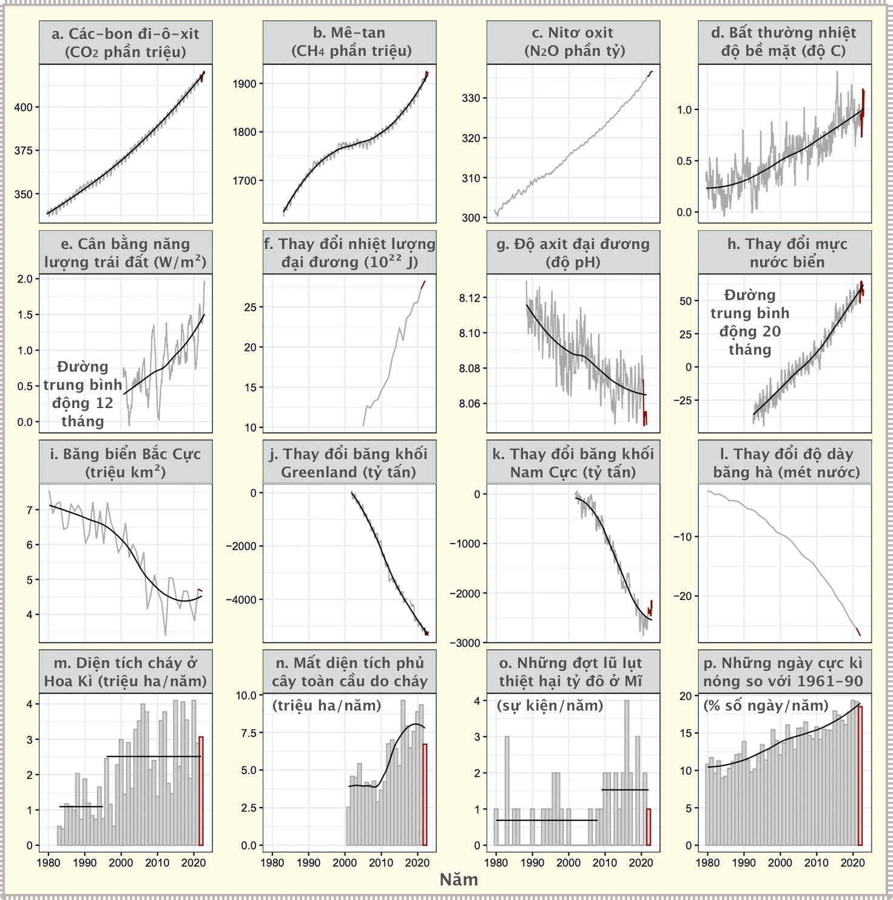
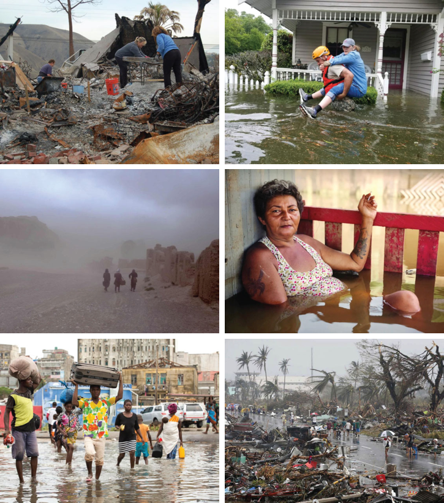
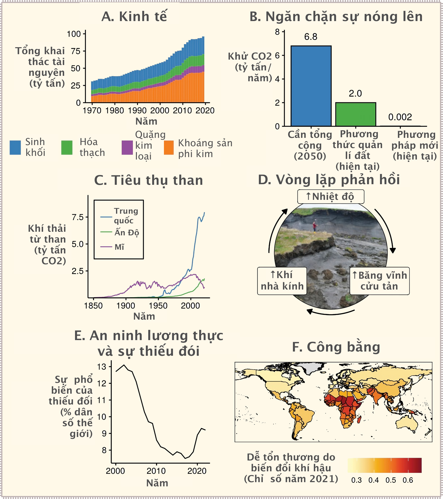

# Báo cáo hiện trạng khí hậu năm 2023: Bước vào thời kì chưa từng thấy

Sự sống trên hành tinh Trái đất hiện đang rất ngặt nghèo. Giờ đây chúng ta đang bước vào một thời kì chưa từng thấy trước đó. Trong nhiều thập kỷ, các nhà khoa học đã liên tục cảnh báo về một tương lai được đánh dấu bởi các điều kiện khí hậu khắc nghiệt do nhiệt độ toàn cầu leo thang do các hoạt động đang diễn ra của con người thải ra khí nhà kính có hại vào khí quyển. **Thật không may, thời gian đã hết**. Chúng ta đang thấy biểu hiện của những dự đoán qua các kỉ lục khí hậu bị phá vỡ đáng báo động và chưa từng có, gây ra những thảm cảnh đau khổ dần hiện ra trước mắt. Chúng ta đang bước vào một thời kì chưa từng thấy trong cuộc khủng hoảng khí hậu, một hiện trạng chưa ai từng chứng kiến tận mắt trong lịch sử nhân loại.

Trong báo cáo này, chúng tôi trình bày một loạt các dấu hiệu quan trọng của hành tinh cũng như các nguyên nhân tiềm ẩn gây ra biến đổi khí hậu và các phản ứng liên quan đến khí hậu được trình bày lần đầu bởi Ripple và Wolf cùng các đồng nghiệp (2020), những người đã tuyên bố **tình trạng khẩn cấp về khí hậu**, hiện có hơn **15.000 nhà khoa học ký tên**. Các xu hướng này cho biết những dữ kiện kỉ lục mới kể từ khi các số liệu khí hậu được đo đạc và các thảm họa liên quan chặt chẽ đến biến đổi khí hậu. Đồng thời, chúng tôi báo cáo những tiến bộ không đáng kể của nhân loại trong việc chống lại biến đổi khí hậu. Với những diễn biến đáng lo ngại này, mục tiêu của chúng tôi là truyền đạt thông tin thực tế về khí hậu và khuyến nghị chính sách tới các nhà khoa học, nhà hoạch định chính sách và công chúng. Nhiệm vụ đạo đức của các nhà khoa học và tổ chức của chúng tôi là cảnh báo rõ ràng cho nhân loại về bất kỳ mối đe dọa hiện hữu tiềm ẩn nào và thể hiện vai trò tiên phong [của các nhà khoa học] trong hành động. Báo cáo này là một phần trong chuỗi cập nhật hàng năm ngắn gọn và dễ tiếp cận về tình trạng khủng hoảng khí hậu.

## Kỷ lục mọi thời đại về khí hậu

Vào năm 2023, chúng ta đã chứng kiến một loạt kỷ lục phi thường liên quan đến khí hậu bị phá vỡ trên khắp thế giới. Tốc độ thay đổi nhanh chóng đã khiến các nhà khoa học ngạc nhiên và gây lo ngại về sự nguy hiểm của **thời tiết khắc nghiệt** (*extreme weather*), các **vòng phản hồi khí hậu** (*climate feedback loop*) rủi ro và sự tiến gần đến các **điểm tới hạn** (*tipping points*) mang tính huỷ hoại sớm hơn dự kiến (Armstrong McKay và cộng sự 2022, Ripple và cộng sự 2023). Năm nay, những đợt nắng nóng khác thường đã quét qua thế giới, dẫn đến **nhiệt độ cao kỷ lục**. Các đại dương đã từng nóng lên trong lịch sử, với nhiệt độ bề mặt nước biển toàn cầu và Bắc Đại Tây Dương đều phá kỷ lục và mức băng biển thấp chưa từng có xung quanh Nam Cực (**Hình 1a-1d**). Ngoài ra, từ tháng 6 đến tháng 8 năm nay là khoảng thời gian nóng nhất từng được ghi nhận và vào đầu tháng 7, chúng ta đã chứng kiến nhiệt độ trung bình hàng ngày bề mặt toàn cầu cao nhất từng đo được, có thể là nhiệt độ nóng nhất trên Trái đất trong 100.000 năm qua (**Hình 1e**) . Đó là dấu hiệu cho thấy chúng ta đang đẩy **hệ thống hành tinh** (*planetary systems*) vào tình trạng mất ổn định nguy hiểm.

> **Hình 1** Những hiện tượng bất thường về khí hậu vào năm 2023 (đường màu đỏ, được in đậm). Phạm vi băng biển (a, b), nhiệt độ (c–e) và diện tích bị đốt cháy ở Canada (f) hiện nằm ngoài phạm vi lịch sử của chúng. Những bất thường này có thể là do cả biến đổi khí hậu và các yếu tố khác. Mỗi đường trong đồ thị tương ứng với một năm khác nhau, với màu xám càng đậm tượng trưng cho những năm càng gần đây.

Chúng ta đang mạo hiểm bước vào thời kì chưa từng có của thay đổi khí hậu. Nhiệt độ trung bình hàng ngày trên toàn cầu chưa bao giờ vượt quá 1,5°C so với mức nhiệt thời kì tiền công nghiệp cho đến trước năm 2000 và chỉ thỉnh thoảng vượt quá con số đó kể từ năm này. Tuy nhiên, tính đến ngày 12 tháng 9, năm 2023 đã có 38 ngày có nhiệt độ trung bình toàn cầu trên 1,5°C&mdash;nhiều hơn bất kỳ năm nào khác&mdash;và tổng mức tăng nhiệt độ có thể tiếp tục tăng. Điều đáng chú ý hơn nữa là biên độ tăng rất lớn của năm 2023 đang vượt quá các mức cực đoan trong quá khứ (**Hình 1**). Tương tự, vào ngày 7 tháng 7 năm 2023, **phạm vi băng biển** (*sea ice relative extent*) hàng ngày ở Nam Cực đã đạt mức thấp nhất kể từ khi có dữ liệu vệ tinh, thấp hơn 2,67 triệu km^2^ mức trung bình giai đoạn 1991–2023 (**Hình 1a**). Các biến số khác đã vượt ra ngoài phạm vi lịch sử của chúng bao gồm khu vực bị cháy rừng ở Canada (**Hình 1f**), điều này rất có thể là điểm tới hạn của mức độ cháy rừng mới.

Sự nóng lên toàn cầu do con người gây ra là nguyên nhân chính gây ra nhiều hiện tượng cực đoan gần đây. Tuy nhiên, các quá trình dẫn dắt cụ thể có liên quan có thể khá phức tạp. Ví dụ, nhiệt độ Đại Tây Dương tăng có thể liên quan đến lượng mưa Sahel và cát bụi châu Phi (Wang và cộng sự 2012). Một tác nhân tiềm ẩn khác là **hơi nước** (*water vapor*) (một loại khí nhà kính) được bơm vào **tầng bình lưu** (*stratosphere*) do một vụ phun trào núi lửa dưới nước (Jenkins và cộng sự 2023). Sự gia tăng [nhiệt độ] gần đây cũng có thể liên quan đến sự thay đổi quy định bắt buộc sử dụng nhiên liệu có hàm lượng lưu huỳnh thấp trong vận tải biển, bởi vì các sol khí sunfat trong khí quyển trực tiếp phân tán ánh sáng mặt trời và khiến các đám mây phản chiếu hình thành [làm cho nhiệt độ giảm]. [Do đó khi các qui định vận tải đường biển có hiệu lực, hiệu ứng phản xạ này cũng giảm, khiến cho nhiệt độ tăng lên]. Nhiệt độ tăng đột ngột cũng có thể là do sự khởi đầu của hiện tượng El Niño&mdash;một phần tự nhiên của hệ thống khí hậu và bản thân nó có thể bị ảnh hưởng bởi biến đổi khí hậu (Cai và cộng sự 2021). Trong mọi trường hợp, khi hệ thống khí hậu Trái đất dịch chuyển ra khỏi các điều kiện liên quan đến sự phát triển của con người, những bất thường như vậy có thể trở nên thường xuyên hơn và có thể gây ra những tác động thảm khốc ngày càng lớn hơn (Xu và cộng sự 2020, Lenton và cộng sự 2023).

## Xu hướng gần đây về các dấu hiệu quan trọng của hành tinh

Trên cơ sở dữ liệu chuỗi thời gian, 20 trong số 35 dấu hiệu sinh tồn [của hành tinh] hiện đang ở mức cực đoan kỷ lục (**Hình 2** và **Hình 3**). Như chúng tôi mô tả bên dưới, những dữ liệu này cho thấy việc tiếp tục theo đuổi **hoạt động kinh doanh như thường lệ** (*business as usual*) trớ trêu thay lại dẫn đến áp lực chưa từng có lên hệ thống Trái đất, dẫn đến nhiều biến số liên quan đến khí hậu cao chưa từng có (**Hình 1** và **Hình 3**).

### Năng lượng

Có vẻ như sự phục hồi xanh sau COVID-19 mà nhiều người mong đợi phần lớn đã không thành hiện thực (Zhang và cộng sự 2023). Thay vào đó, lượng khí thải các-bon tiếp tục tăng cao và nhiên liệu hóa thạch vẫn chiếm ưu thế, với mức tiêu thụ than hàng năm gần như đạt mức cao nhất mọi thời đại là 161,5 Exajoule vào năm 2022 (**Hình 2h**). Mặc dù mức tiêu thụ năng lượng tái tạo (mặt trời và gió) đã tăng mạnh, 17% trong khoảng thời gian từ năm 2021 đến năm 2022, nhưng vẫn thấp hơn khoảng 15 lần so với mức tiêu thụ năng lượng từ nhiên liệu hóa thạch (**Hình 2h**). Động lực chính thúc đẩy các xu hướng kinh tế và năng lượng là cuộc xâm lược Ukraine đang diễn ra của Nga, điều này đã đẩy nhanh quá trình chuyển đổi sang năng lượng tái tạo ở châu Âu nhưng cũng có thể khiến một số quốc gia chuyển từ khí đốt do Nga cung cấp sang than đá (Tollefson 2022). Hiện tại, cuộc xung đột này đã góp phần làm tăng 107% **trợ cấp nhiên liệu hóa thạch** (*fossil fuel subsidies*) từ 531 tỷ USD vào năm 2021 lên 1.097 tỷ USD vào năm 2022 do giá năng lượng tăng cao (**Hình 2o**). Mặc dù những khoản trợ cấp này có thể bảo vệ phần nào người tiêu dùng khỏi việc tăng giá, nhưng chúng thường không nhắm đúng mục tiêu và giúp thúc đẩy việc sử dụng năng lượng liên quan đến nhiên liệu hóa thạch và lợi nhuận hơn là sử dụng các giải pháp thay thế các-bon thấp khác (Muta và Erdogan 2023).

> **Hình 2** Đồ thị chuỗi thời gian của các hoạt động của con người liên quan đến khí hậu. Dữ liệu thu được kể từ khi Ripple và đồng nghiệp xuất bản (2021) được hiển thị bằng màu đỏ (bản in màu xám đậm). Trong phần (f), mất độ che phủ của cây  bao gồm mất độ che phủ do bất kỳ nguyên nhân nào và không tính đến việc tăng thêm rừng.

### Rừng

Từ năm 2021 đến năm 2022, tỷ lệ mất độ che phủ cây toàn cầu giảm 9,7% xuống còn 22,8 triệu héc-ta (ha) mỗi năm (**Hình 2f**). Tương tự, tỷ lệ mất rừng Amazon của Brazil đã giảm 11,3% xuống còn 1,16 triệu ha mỗi năm (**Hình 2g**), và mức giảm tiếp theo có thể sẽ xảy ra do cuộc bầu cử tổng thống mới của Brazil và một số nghị định pháp lý gần đây (Vilani và cộng sự 2023). Tuy nhiên, nhân loại vẫn chưa đi đúng hướng để chấm dứt và đẩy lùi nạn phá rừng vào năm 2030, bất chấp cam kết của hơn 100 nhà lãnh đạo thế giới vào năm 2021 tại COP26 (UNEP 2022a). Hơn nữa, các khu rừng ngày càng bị đe dọa bởi các vòng phản hồi khí hậu mạnh mẽ liên quan đến các quá trình như **thiệt hại do côn trùng** (*insect damage*), **cây chết hàng loạt** (*dieback*) và **cháy rừng** (*wildfire*) (Flores và Staal 2022, Ripple và cộng sự 2023). Ví dụ, vụ cháy rừng lập kỷ lục lịch sử ở Canada, đã thiêu rụi 16,6 triệu ha (tương đương gần một nửa diện tích Việt Nam) trong năm nay tính đến ngày 13 tháng 9
(**Hình 1f**), một phần liên quan đến biến đổi khí hậu. Điều này dẫn đến lượng phát thải hơn một tỷ tấn CO~2~ (Copernicus 2023), một con số đáng kể, so với 0,67 tỷ tấn CO~2~&mdash;tổng lượng phát thải khí nhà kính của Canada vào năm 2021  (Môi trường và Biến đổi khí hậu Canada 2023). Hiện chưa rõ lượng khí thải như vậy có thể được tái hấp thu nhanh như thế nào sau khi phục hồi sau cháy rừng; kèm theo đó là nguy cơ thực sự với mức độ nghiêm trọng của đám cháy ngày càng tăng sẽ gây ra tổn thất các-bon không thể phục hồi trong một tương lai nóng lên (Bowman và cộng sự 2021).

### Trung bình toàn cầu nồng độ khí nhà kính và nhiệt độ

Trên cơ sở số liệu thống kê từ đầu năm đến năm 2023, ba loại khí nhà kính quan trọng là CO~2~ (các-bon đi-ô-xit), CH~4~ (khí mê-tan) và N~2~O (khí ôxit-nitơ) đều ở mức kỷ lục (**Hình 3a–3c**). Nồng độ các-bon trung bình toàn cầu nay ở mức xấp xỉ 420 phần triệu (*ppm*), vượt xa **giới hạn hành tinh** (*planetary boundary*) được đề xuất là 350 phần triệu (Rockström và cộng sự 2009). Ngoài ra, năm 2023 có xu hướng trở thành một trong những năm nóng kỷ lục (**Hình 1e** và **Hình 3d**). Mặc dù phát thải khí nhà kính liên quan đến nhiên liệu hóa thạch là nguyên nhân chính làm tăng nhiệt độ, nhưng sự sụt giảm phát thải SO~2~ (lưu huỳnh đi-ô-xít) trên toàn cầu có thể là một yếu tố góp phần. SO~2~ tạo thành sunfat trong khí quyển, là tác nhân làm giảm nhiệt mạnh nhất do con người tạo ra, che giấu một phần nguyên nhân làm khí nhà kính nóng lên (xem phần trên với ví dụ về qui định vận tải biển).

> **Hình 3** Đồ thị chuỗi thời gian của các phản hồi liên quan đến khí hậu. Dữ liệu thu được trước và sau khi Ripple và đồng nghiệp xuất bản (2021) lần lượt được hiển thị bằng màu xám và đỏ (bản in màu xám đậm). Đối với diện tích bị cháy (m) và tần số lũ lụt thiệt hại hàng tỷ đô la (o) ở Hoa Kỳ, các đường đồ thị nằm ngang màu đen hiển thị ước tính mô hình điểm thay đổi, cho phép thay đổi đột ngột. Đối với các biến khác có độ biến thiên tương đối cao, đường xu hướng hồi quy cục bộ được hiển thị bằng màu đen. Các biến được đo ở các tần số khác nhau (ví dụ: hàng năm, hàng tháng, hàng tuần). Các nhãn trên trục nằm ngang tương ứng với thời điểm giữa năm. Tần số lũ lụt thiệt hại hàng tỷ đô la (o) có thể bị ảnh hưởng bởi tác nhân khác và tính dễ bị tổn thương bên cạnh biến đổi khí hậu.

### Đại dương và băng

**Độ axit của đại dương** (*ocean acidity*), **độ dày băng hà** (*glacier thickness*) và **khối băng ở Greenland** (*Greenland ice mass*) đều giảm xuống mức thấp kỷ lục (**Hình 3g, 3j và 3l**), trong khi mực nước biển dâng và hàm lượng nhiệt đại dương tăng lên mức cao kỷ lục (**Hình 3f, 3h**). Sự gia tăng nhanh chóng hàm lượng nhiệt và nhiệt độ bề mặt nước biển (**Hình 1c, 1d**) đặc biệt đáng lo ngại vì chúng có thể gây ra nhiều tác động nghiêm trọng, bao gồm **tổn hại các vật biển** (*loss of sea life*), các rạn san hô chết vì **tẩy trắng** (*bleaching*) và sự gia tăng cường độ của các cơn bão nhiệt đới lớn (Reid et al. 2009). Cũng có những lo ngại ngày càng tăng rằng **Hệ thống hải lưu tuần hoàn của Đại Tây Dương** (*AMOC*) có thể vượt qua điểm tới hạn và bắt đầu sụp đổ trong thế kỷ này, có thể diễn ra trong khoảng từ năm 2025 đến năm 2095 (Ditlevsen và Ditlevsen 2023). Điều này sẽ làm thay đổi đáng kể các mô hình nhiệt độ và lượng mưa toàn cầu với những hậu quả có hại lớn tiềm tàng đối với các hệ sinh thái và xã hội, bao gồm giảm lượng **bể chứa các-bon** (*các-bon sinks*) tự nhiên (Armstrong McKay và cộng sự 2022).

> **Hình 4** Chuỗi ảnh mô tả tác động của các thảm họa liên quan đến khí hậu. Hàng đầu tiên (từ trái sang phải): Chủ nhà phân loại các mảnh vụn sau khi trận cháy rừng phá hủy nhà của họ ở bang California (Hoa Kỳ, 2008; FEMA/Michael Mancino), “người bảo vệ [Quốc gia] cõng một phụ nữ trong nước lũ ngập đến thắt lưng” (Hoa Kỳ , 2017; Zachary West/Vệ binh Quốc gia; CC BY 2.0). Hàng thứ hai: “các cô gái trẻ bị bão cát trên đường đến trường” (Afghanistan, 2019, Solmaz Daryani/Climate Visuals Countdown; Creative Commons), “người phụ nữ trưởng thành ngồi trong nhà, ngập trong nước sâu, hút thuốc” (Brazil, 2015; Fabrice Fabola, CC BY-SA 2.0). Hàng thứ ba: hậu quả của Bão Idai (Mozambique, 2019; Denis Onyodi: IFRC/DRK/Climate Centre, CC BY-NC 2.0), “người dân đi bộ trên con đường rải đầy mảnh vụn sau khi Siêu bão Haiyan tàn phá thành phố Tacloban” (Philippines, 2013; Erik de Castro/Reuters; CC BY 2.0). Tất cả các trích dẫn đều lấy từ dự án [Climate Visuals](https://climatevisuals.org).

### Tác động của khí hậu và thời tiết khắc nghiệt

Biến đổi khí hậu đang góp phần đáng kể vào sự đau khổ của con người (**Hình 4**). Các tác động liên quan đến khí hậu vào năm 2022 bao gồm một trận lũ lụt làm mất hàng tỷ đô la ở Hoa Kỳ, xảy ra ở Kentucky và Missouri trong khoảng thời gian từ 26 đến 28 tháng 7 với tần suất những ngày cực nóng cao xếp thứ ba trong lịch sử (**Hình 3o, 3p**). Từ năm 2021 đến 2022, diện tích bị cháy rừng toàn cầu giảm 28% (từ 9,34 triệu ha lên 6,72 triệu ha), nhưng hoạt động cháy rừng ở Hoa Kỳ lại tăng 6,3% (từ 2,88 triệu ha lên 3,07 triệu ha) trong cùng thời kỳ (**Hình 3m, 3n**). Nhiều tác động về khí hậu dự kiến sẽ còn nghiêm trọng hơn nữa trong những năm tới và chúng ta có thể đã phải trải qua sự gia tăng đột ngột của một số kiểu thời tiết khắc nghiệt nhất định, có thể vượt qua tốc độ tăng nhiệt độ (hình 3m, 3o, S3, S4; Calvin 2020).

!!! quote "**Bảng 1**: Những thảm họa gần đây liên quan đến khí hậu kể từ tháng 11 năm 2022"

    - 11–12/2022: Những đợt nắng nóng kỷ lục ở Argentina và Paraguay đã góp phần gây ra tình trạng mất điện, cháy rừng và mất mùa. Nhiệt độ cực cao này được ước tính có khả năng xảy ra tăng gấp 60 lần do biến đổi khí hậu.
    - 12/2022–03/2023: Lượng mưa lớn do các dòng khí quyển gây ra đã dẫn đến nhiều trận lũ lụt ở miền Tây Hoa Kỳ. Có ít nhất 22 người thiệt mạng và thiệt hại về tài sản ước tính lên tới 3,5 tỷ USD. Biến đổi khí hậu có thể làm tăng khả năng xảy ra những trận lũ lụt thảm khốc như vậy, mặc dù ảnh hưởng của nó đối với những cơn bão cụ thể này chưa rõ ràng.
    - 02/2023: Bão Gabrielle đã gây ra lượng mưa cực lớn ở Te Ika-a-Maui (Đảo Bắc) của Aotearoa New Zealand, có khả năng gây thiệt hại hàng tỷ đô la và 225.000 ngôi nhà bị mất điện. Lượng mưa dữ dội này có thể một phần là do khí hậu ấm lên.
    - 03-05/2023: Nhiệt độ phá kỷ lục được ghi nhận ở nhiều nơi ở Đông Nam Á, Trung Quốc và Nam Á. Nắng nóng gay gắt đã gây ra nhiều ca tử vong và trường học ở Ấn Độ phải đóng cửa, đồng thời khiến hơn 100 học sinh phải điều trị vì mất nước ở Philippines. Có lẽ ít nhất một phần là do biến đổi khí hậu. Ví dụ, biến đổi khí hậu đã làm tăng khả năng một sự kiện như vậy xảy ra ở Bangladesh và Ấn Độ lên ít nhất là 30 lần.
    - 01-07/2023: Các vụ cháy rừng dữ dội ở Canada đã thiêu rụi khoảng 10 triệu ha, khiến 30.000 người phải di dời vào thời điểm cao điểm và khiến chất lượng không khí ngày càng tồi tệ trên khắp phần lớn Canada và Hoa Kỳ. Những vụ cháy kinh hoàng này có thể một phần là do biến đổi khí hậu, mặc dù có thể có nhiều yếu tố khác có liên quan.
    - 05-06/2023: Bão nhiệt đới Mocha được cho là đã giết chết ít nhất 145 người ở Myanmar và ảnh hưởng đến khoảng 800.000 người trong khu vực. Biến đổi khí hậu có thể đã khiến những cơn bão như vậy trở nên dữ dội hơn.
    - 06-07/2023: Bão nhiệt đới Mawar gây lũ lụt và mất điện ở nhiều nơi ở Guam. Mawar là cơn bão mạnh nhất từng được ghi nhận ở Bắc bán cầu vào tháng 5. Biến đổi khí hậu có thể làm tăng cường độ của bão nhiệt đới (Wu và cộng sự 2022).
    - 06/2023: Nắng nóng chết người khiến hơn chục người thiệt mạng ở miền Nam và Trung Tây nước Mỹ. Biến đổi khí hậu đang dẫn đến sự gia tăng tần suất và thời gian của những đợt nắng nóng như vậy.
    - 07/2023: Có tới 6 người thiệt mạng ở Tây Nam Nhật Bản vì mưa cực lớn gây lũ lụt và lở đất. Biến đổi khí hậu có thể làm cho những đợt mưa lớn như vậy trở nên nghiêm trọng hơn. Vài ngày sau, lũ lụt và lở đất, có thể một phần liên quan đến biến đổi khí hậu, đã giết chết hơn 26 người và khiến hàng nghìn người phải sơ tán ở Hàn Quốc.
    - 07/2023: Mưa gió mùa lớn gây ra lũ quét và lở đất ở miền bắc Ấn Độ khiến hơn 100 người thiệt mạng. Biến đổi khí hậu có thể khiến gió mùa ở khu vực này biến đổi mạnh hơn, gây ra lở đất và lũ lụt thường xuyên. Mưa gió mùa lớn cũng gây thiệt hại cho cây lúa ở Ấn Độ, làm dấy lên lo ngại về giá lương thực toàn cầu và an ninh lương thực, đồng thời dẫn đến lệnh cấm xuất khẩu các giống lúa nonbasmati.
    - 06–08/2023: Nắng nóng cực độ ở Mỹ khiến ít nhất 147 người thiệt mạng. Trong trường hợp không có biến đổi khí hậu, đợt nắng nóng cực độ vào tháng 7 năm 2023 ở Hoa Kỳ sẽ rất khó xảy ra.
    - 07-08/2023: Bắc Kinh, Trung Quốc vừa trải qua trận mưa lớn nhất trong ít nhất 140 năm, dẫn đến lũ lụt lớn ảnh hưởng đến gần 1,29 triệu người, làm hư hại 147.000 ngôi nhà và khiến ít nhất 33 người thiệt mạng. Lũ lụt dữ dội có thể trở nên phổ biến hơn do biến đổi khí hậu.
    - 08/2023: Tại Hawaii, Hoa Kỳ, các vụ cháy rừng thảm khốc trên đảo Maui đã giết chết ít nhất 111 người và hơn 1.000 người có thể mất tích tính đến ngày 18 tháng 8 năm 2023. Biến đổi khí hậu có thể làm giảm lượng mưa và tăng nhiệt độ ở khu vực này, có khả năng góp phần vào những đám cháy này.
    - 09/2023: Bão Daniel đã gây ra lũ lụt nghiêm trọng ở Libya và một số khu vực ở Đông Nam châu Âu, khiến hàng nghìn người thiệt mạng và thiệt hại hơn 2 tỷ USD. Biến đổi khí hậu có thể làm tăng cường độ của những cơn bão như vậy.

    Lưu ý: Chúng tôi liệt kê nhiều thảm họa gần đây có thể ít nhất một phần liên quan đến biến đổi khí hậu. Danh sách này không nhằm mục đích thống kê đầy đủ. Do tính chất gần đây của những sự kiện này nên nguồn của chúng tôi thường bao gồm các bài báo trên phương tiện truyền thông. Đối với mỗi sự kiện, chúng tôi thường cung cấp các tài liệu tham khảo chỉ ra rằng khả năng hoặc cường độ của sự kiện đó có thể tăng lên do biến đổi khí hậu do con người gây ra. Tài liệu tham khảo đến các bài báo khoa học được đưa ra trực tiếp trong bảng. Một số thảm họa này ít nhất một phần có thể là do những thay đổi liên quan đến khí hậu trong dòng tia (*jet stream*) (Stendel và cộng sự 2021, Rousi và cộng sự 2022).

Vào năm 2023, biến đổi khí hậu có thể góp phần gây ra một số hiện tượng thời tiết cực đoan và thảm họa. Một số sự kiện này cho thấy các hiện tượng khí hậu cực đoan đang đe dọa những khu vực rộng lớn hơn vốn thường không xảy ra hiện tượng cực đoan như thế nào; ví dụ, lũ lụt nghiêm trọng ở miền bắc Trung Quốc, xung quanh Bắc Kinh, đã giết chết ít nhất 33 người. Những thảm họa khác gần đây bao gồm lũ quét và lở đất chết người ở miền bắc Ấn Độ, đợt nắng nóng kỷ lục ở Hoa Kỳ và cơn bão Địa Trung Hải cực kỳ dữ dội đã giết chết hàng nghìn người, chủ yếu ở Libya (**Bảng 1**). Khi những tác động này tiếp tục gia tăng, cần có thêm kinh phí để bù đắp cho những mất mát và thiệt hại liên quan đến khí hậu ở các nước đang phát triển. **Quỹ toàn cầu về tổn thất và thiệt hại** (*loss and damage global fund*) mới của Liên hợp quốc được thành lập tại COP27 là một bước phát triển đầy hứa hẹn, nhưng thành công của quỹ này sẽ cần có sự hỗ trợ mạnh mẽ từ các nước giàu có.

## Khuyến nghị từ cảnh báo của các nhà khoa học

Được thúc đẩy bởi các sự kiện và xu hướng gần đây, chúng tôi tiếp tục đưa ra các cảnh báo và khuyến nghị cụ thể liên quan đến các chủ đề từ **an ninh lương thực** (*food security*) đến **công lý khí hậu** (*climate justice*). Những nỗ lực phối hợp trong từng lĩnh vực này có thể giúp hỗ trợ một chương trình nghị sự rộng lớn hơn, tập trung vào chính sách khí hậu toàn diện và công bằng. 

> **Hình 5** Các chủ đề đặc biệt về hành động vì khí hậu. Nhiều mô hình giả định rằng tăng trưởng GDP hầu như có thể được tách rời khỏi khí thải và các tác động môi trường liên quan đến tiêu dùng khác (a) và các phương pháp thu hồi carbon có thể được mở rộng nhanh chóng (b). Nếu những giả định này không thực tế và việc sử dụng than đá cũng như các nhiên liệu hóa thạch khác không được cắt giảm ngay lập tức (c), thì các vòng phản hồi của hệ thống Trái đất (d) có thể dẫn đến các tác động khí hậu tăng tốc nhanh chóng, bao gồm suy dinh dưỡng (e) và thảm họa khí hậu, sẽ đặc biệt nghiêm trọng ở các quốc gia kém thịnh vượng hơn vốn có lượng phát thải thấp trong lịch sử (f). Ảnh: Boris Radosavljevic (CC BY 2.0)

### Kinh tế

Tăng trưởng kinh tế, như thường được theo đuổi, khó có thể cho phép chúng ta đạt được các mục tiêu xã hội, khí hậu và đa dạng sinh học. Thách thức cơ bản nằm ở khó khăn trong việc tách tăng trưởng kinh tế khỏi các tác động có hại đến môi trường (**Hình 5a**). Mặc dù tiến bộ công nghệ và cải tiến hiệu quả có thể góp phần **tách rời** (*decoupling*) ở một mức độ nào đó, nhưng chúng thường không thể giảm thiểu **dấu chân sinh thái** (*ecological footprint*) tổng thể của các hoạt động kinh tế (Hickel và cộng sự 2021). Các tác động rất khác nhau tùy theo mức độ giàu có; vào năm 2019, 10% dân số phát thải hàng đầu chịu trách nhiệm cho 48% lượng khí thải toàn cầu, trong khi 50% dân số toàn cầu phát thải ít nhất chỉ chịu trách nhiệm về 12% (Chancel 2022). Do đó, chúng ta cần thay đổi nền kinh tế của mình thành một hệ thống hỗ trợ đáp ứng các nhu cầu cơ bản cho tất cả mọi người thay vì tiêu dùng quá mức của người giàu (O'Neill et al. 2018).

### Ngăn chặn sự nóng lên

Tỉ lệ gia tăng các thảm họa khí hậu và các tác động khác mà chúng ta đang chứng kiến phần lớn là hậu quả của việc phát thải khí nhà kính trong lịch sử và vấn đang tiếp diễn. Để giảm thiểu lượng khí thải trong quá khứ và ngăn chặn hiện tượng nóng lên toàn cầu, các nỗ lực phải hướng tới việc loại bỏ khí thải từ nhiên liệu hóa thạch và thay đổi cách sử dụng đất cũng như tăng cường **cô lập các-bon** (*các-bon sequestration*) bằng các **giải pháp khí hậu dựa vào thiên nhiên** (*natural-based climate solution*). Tuy nhiên, điều quan trọng là phải khám phá các chiến lược khả thi khác để loại bỏ hiệu quả lượng CO~2~ phát thải thêm, vốn có thể góp phần giảm nhiệt độ hành tinh trong dài hạn. Các **công nghệ phát thải âm** (*negative emission technologies*) đang ở giai đoạn phát triển ban đầu, bao gồm những bất định về khả năng mở rộng cũng như các tác động đến môi trường và xã hội của chúng (hình 5b; Anderson và Peters 2016). Vì vậy, chúng ta không nên dựa vào các kỹ thuật loại bỏ các-bon chưa được chứng minh. Mặc dù nỗ lực nghiên cứu cần được đẩy nhanh, phụ thuộc nặng nề vào các chiến lược loại bỏ các-bon quy mô lớn trong tương lai tại thời điểm này có thể tạo ra nhận thức giả dối về sự an toàn ninh và trì hoãn **các hành động giảm thiểu tác động** (*mitigation actions*) cấp thiết để giải quyết vấn đề biến đổi khí hậu hiện nay.

### Ngừng tiêu thụ than

Ngoài tác động hủy diệt đối với hệ sinh thái và sức khỏe toàn cầu, than đá còn thải ra hơn 80% lượng khí CO~2~ được bổ sung vào khí quyển kể từ năm 1870 và khoảng 40% lượng khí thải CO~2~ hiện nay (Burke và Fishel 2020). Tính đến năm 2022, mức tiêu thụ than toàn cầu đạt gần mức kỷ lục (**Hình 2h**). Năm 2021, lượng khí thải CO~2~ liên quan đến than đá lớn nhất ở Trung Quốc (53,1%), tiếp theo là Ấn Độ (12,0%) và Hoa Kỳ (6,7%; **Hình 5c**). Việc sử dụng than ở Trung Quốc đã tăng nhanh trong những thập kỷ qua và quốc gia này hiện vẫn phát thải gần 1/3 tổng lượng khí thải CO~2~ và mê-tan từ nhiên liệu hóa thạch (Normile 2020). Để ứng phó với tình trạng này, chúng tôi ủng hộ **Liên minh thay thế Than** (*Powering Past Coal Alliance*) và khuyến nghị thông qua **Hiệp ước loại bỏ than quốc tế** (*Coal Elimination Treaty*) để loại bỏ dần than và rộng hơn là [Hiệp ước không phổ biến Nhiên liệu hoá thạch](../earth/fossil-treaty.md) (*Fossil Fuel Non-Proliferation Treaty*) (van Asselt và Newell 2022). Các hiệp ước này có thể hỗ trợ các nước kém phát triển hơn trong việc chuyển đổi năng lượng, không dùng than đá và các nhiên liệu hóa thạch khác, bao gồm tài trợ để xây dựng năng lực năng lượng tái tạo cũng như đào tạo lại và chuyển đổi công nhân khỏi ngành nhiên liệu hóa thạch.

### Các vòng phản hồi

Các **vòng phản hồi khí hậu** (*climate feedback loops*) ảnh hưởng trực tiếp đến mối quan hệ giữa khí thải và sự nóng lên. Ví dụ, sự nóng lên làm cho **lớp băng vĩnh cửu** (*permafrost*) tan, thải ra khí mêtan và CO~2~ dẫn đến sự nóng lên hơn nữa (**Hình 5d**). Như vậy, việc tăng cường các vòng phản hồi sẽ khuếch đại tác động của phát thải khí nhà kính, dẫn đến sự nóng lên thêm. Do đó, việc hiểu các vòng phản hồi và sự tương tác của chúng có thể cung cấp các chiến lược **thích ứng** (*adaptation*) và **giảm thiểu tác động** (*mitigation*) khí hậu. Bất chấp tầm quan trọng của chúng, sự kết hợp của nhiều vòng phản hồi khuếch đại vẫn chưa được hiểu rõ và sức mạnh tiềm tàng của một số vòng phản hồi nguy hiểm vẫn rất không chắc chắn (Ripple và cộng sự 2023). Vì sự không chắc chắn này, chúng tôi kêu gọi một báo cáo đặc biệt của **Uỷ ban liên chính phủ về biến đổi khí hậu (IPCC)** tập trung vào các vòng phản hồi khí hậu nguy hiểm, các điểm tới hạn, và&mdash;chỉ như một biện pháp phòng ngừa&mdash;các kịch bản có khả năng xảy ra thấp hơn những dẫn đến hậu quả khôn lường về biến đổi khí hậu.

## An ninh lương thực và suy dinh dưỡng

Sau nhiều năm giảm, tỷ lệ suy dinh dưỡng hiện nay đang gia tăng (**Hình 5e**). Vào năm 2022, ước tính có khoảng 735 triệu người phải đối mặt với nạn đói kinh niên&mdash;tăng khoảng 122 triệu người kể từ năm 2019 (FAO và cộng sự 2023). Sự gia tăng này đã đẩy nhân loại đi quá xa mục tiêu không còn nạn đói vào năm 2030, do nhiều yếu tố, bao gồm các hiện tượng khí hậu cực đoan, suy thoái kinh tế và xung đột vũ trang (FAO và cộng sự 2023). Biến đổi khí hậu đã làm giảm mức tăng năng suất nông nghiệp toàn cầu (Ortiz-Bobea và cộng sự 2021), do đó xuất hiện nguy cơ nạn đói sẽ gia tăng nếu không có hành động ứng phó ngay lập tức với khí hậu. Đặc biệt, có thể có những rủi ro nghiêm trọng và bị đánh giá thấp trong tương lai về việc thất bại trong thu hoạch [nông sản] trên diện rộng sự bất ổn ngày càng tăng của [dòng tia](https://vi.wikipedia.org/wiki/Dòng_tia) (*jet stream*) (Kornhuber et al. 2023). Do nguy cơ mất mùa lớn đồng loạt ngày càng tăng ở nhiều khu vực trên thế giới, nên cần có những nỗ lực tập trung vào thích ứng để cải thiện khả năng phục hồi của cây trồng và khả năng chống chịu nắng nóng, hạn hán và các tác nhân gây áp lực khí hậu khác (Raza et al. 2019). Việc **chuyển sang chế độ ăn dựa trên thực vật**, đặc biệt là ở các nước giàu có, có thể cải thiện an ninh lương thực toàn cầu và giúp giảm thiểu biến đổi khí hậu (Hình 2d; Cassidy et al. 2013).

## Công bằng

Tác động của biến đổi khí hậu vốn đã là thảm họa đối với nhiều người. Tuy nhiên, những tác động này không diễn ra đồng đều trên toàn cầu. Thay vào đó, chúng ảnh hưởng một cách không tương xứng đến những người nghèo nhất trên thế giới&mdash;những người, trớ trêu thay, lại đóng góp ít nhất vào việc gây ra vấn đề này (**Hình 5f**; Harlan và cộng sự 2015). Để đạt được công bằng kinh tế xã hội và hạnh phúc toàn cầu của con người, điều quan trọng là phải phấn đấu đạt được sự hội tụ trong mức tiêu thụ năng lượng và tài nguyên bình quân đầu người trên toàn thế giới (nghĩa là người giàu tiêu thụ giảm dần trong khi những người nghèo nhất có thể cải thiện đời sống). Điều này đòi hỏi phải nỗ lực hướng tới mức tiêu thụ năng lượng và tài nguyên cân bằng và công bằng cho cả **nước giàu và nước nghèo** (*global north and south*) (Hickel et al. 2021).

## Kết luận

Tác động của sự nóng lên toàn cầu ngày càng nghiêm trọng hơn và những khả năng như sự đổ vỡ xã hội trên toàn thế giới là khả thi và chưa được đánh giá đầy đủ (một điều nguy hiểm!) (Kemp et al. 2022). Vào cuối thế kỷ này, ước tính có khoảng 3 đến 6 tỷ người&mdash;khoảng một phần ba đến một nửa dân số toàn cầu&mdash;có thể sống trong những khu vực không thích hợp với sự sống, phải đối mặt với nắng nóng gay gắt, nguồn thức ăn hạn chế và tỷ lệ tử vong tăng cao do ảnh hưởng của biến đổi khí hậu (Lenton và cộng sự 2023). Vấn đề lớn cần giải pháp lớn. Do đó, chúng ta phải thay đổi quan điểm của mình về tình trạng khẩn cấp về khí hậu từ việc chỉ là một vấn đề môi trường biệt lập sang một mối đe dọa mang tính hệ thống, hiện hữu. Mặc dù tình trạng nóng lên toàn cầu có sức tàn phá khủng khiếp nhưng nó chỉ thể hiện một khía cạnh của cuộc khủng hoảng môi trường ngày càng leo thang và có mối liên hệ chặt chẽ mà chúng ta đang phải đối mặt (ví dụ: **mất đa dạng sinh học** (*biodiversity loss*), **khan hiếm nước ngọt** (*fresh water scarcity*), **đại dịch** (*pandemics*)). Chúng ta cần các chính sách nhắm vào các vấn đề cơ bản của tình trạng **vượt quá mức sinh thái** (*ecological overshoot*) trong đó nhu cầu của con người đối với tài nguyên trên Trái đất dẫn đến việc khai thác quá mức hành tinh của chúng ta và suy giảm đa dạng sinh học (**Hình 5a** ; McBain và cộng sự 2017). Chừng nào nhân loại còn tiếp tục gây áp lực cực lớn lên Trái đất, thì bất kỳ giải pháp nào chỉ nhằm vào khí hậu được cố gắng thực hiện sẽ chỉ phân phối lại áp lực này.

Để giải quyết tình trạng khai thác quá mức trên hành tinh của chúng ta, chúng tôi thách thức quan niệm phổ biến về **sự tăng trưởng vô tận** (*endless growth*) và **tiêu thụ quá mức** (*overconsumption*) của các nước và cá nhân giàu có, mà cho rằng điều này là không bền vững và bất công (Rockström et al. 2023). Thay vào đó, chúng tôi ủng hộ việc **giảm tiêu thụ tài nguyên quá mức**; giảm thiểu, tái sử dụng và tái chế chất thải trong **nền kinh tế tuần hoàn** (*circular economy*) hơn; và **ưu tiên sự thịnh vượng và bền vững của con người**. Chúng tôi nhấn mạnh công lý khí hậu và phân bổ công bằng chi phí và lợi ích của hành động vì khí hậu, đặc biệt đối với các cộng đồng dễ bị tổn thương (Gupta và cộng sự 2023). Chúng tôi kêu gọi **chuyển đổi nền kinh tế toàn cầu để ưu tiên phúc lợi của con người và cung cấp sự phân bổ nguồn lực công bằng hơn** (Hickel et al. 2021). Chúng tôi cũng kêu gọi **ổn định và giảm dần dân số nhân loại** bằng **công bằng giới** (*gender justice*) thông qua **kế hoạch hóa gia đình tự nguyện** (*voluntary family planning*) và bằng cách hỗ trợ **giáo dục và quyền của phụ nữ và trẻ em gái** (*women's and girl's education and rights*), giúp **giảm tỷ lệ sinh và nâng cao mức sống** (Bongaarts và O'Neill 2018). Những chiến lược có ý thức về môi trường và công bằng về mặt xã hội này đòi hỏi những chuyển đổi sâu rộng và toàn diện về lâu dài mà có thể đạt được thông qua các các quá bước dần dần nhưng có ý nghĩa trong ngắn hạn (tức là chủ nghĩa tiệm tiến cấp tiến (*radical incrementalism*); Halpern và Mason 2015).

Với tư cách là các nhà khoa học, chúng tôi ngày càng được yêu cầu nói cho công chúng biết sự thật về những cuộc khủng hoảng mà chúng ta phải đối mặt bằng những thuật ngữ đơn giản và trực tiếp. Sự thật là chúng tôi bị sốc trước mức độ khốc liệt của các hiện tượng thời tiết cực đoan vào năm 2023. Chúng tôi lo sợ giai đoạn khí hậu chư từng có mà chúng ta hiện đã bước vào. Các điều kiện sẽ trở nên rất khó khăn và có khả năng không thể quản lý được đối với các khu vực rộng lớn trên thế giới, với sự nóng lên 2,6°C dự kiến đến cuối thế kỷ này, ngay cả khi **các cam kết giảm phát thải quốc gia tự đề xuất (NDC)** của **Thỏa thuận chung Paris** được đáp ứng (UNEP 2022b). Chúng tôi cảnh báo về sự sụp đổ tiềm tàng của các hệ thống tự nhiên và kinh tế xã hội trong một thế giới nơi chúng ta sẽ phải đối mặt với sức nóng không thể chịu nổi, các hiện tượng thời tiết cực đoan thường xuyên, tình trạng thiếu lương thực và nước ngọt, nước biển dâng, nhiều bệnh tật mới nổi và tình trạng bất ổn xã hội và xung đột địa chính trị gia tăng. Sự thống khổ do biến đổi khí hậu đã hiện diện ở đây và hiện chúng ta đã vượt quá nhiều ranh giới an toàn và công bằng của hệ thống Trái đất, gây nguy hiểm cho sự ổn định và các hệ thống hỗ trợ sự sống (Rockström et al. 2023). Vì chúng ta sẽ sớm chứng kiến việc không đáp ứng được mục tiêu 1,5°C đầy tham vọng của Thỏa thuận chung Paris, nên không thể nhấn mạnh hết tầm quan trọng của việc hạn chế ngay lập tức việc sử dụng nhiên liệu hóa thạch và sự cấp bách của việc ngăn chặn mức tăng thêm mỗi 0,1°C nhiệt độ toàn cầu trong tương lai. Thay vì chỉ tập trung vào việc giảm lượng khí thải các-bon và biến đổi khí hậu, việc giải quyết vấn đề cốt lõi của tình trạng vượt quá mức sinh thái sẽ mang lại cho chúng ta cơ hội tốt nhất để vượt qua những thách thức này về lâu dài. Đây là thời điểm chúng ta tạo ra sự khác biệt sâu sắc cho toàn bộ sự sống trên Trái đất và chúng ta phải đón nhận nó với lòng dũng cảm và quyết tâm không ngừng nghỉ để tạo ra một di sản về sự thay đổi có thể đứng vững trước thử thách của thời gian.

**Nguồn: Nhóm tác giả Ripple và cộng sự (2023)**

[The 2023 state of the climate report: Entering uncharted territory](https://academic.oup.com/bioscience/advance-article/doi/10.1093/biosci/biad080/7319571?login=false)

