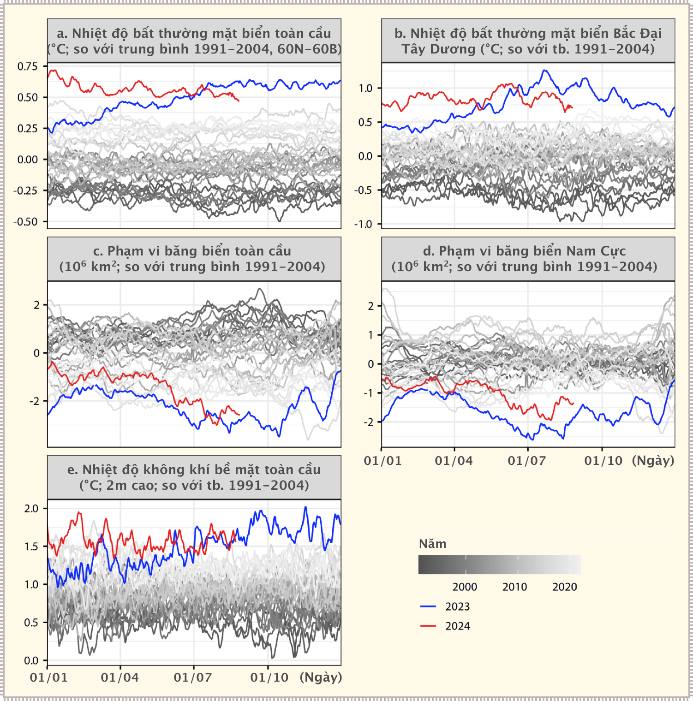
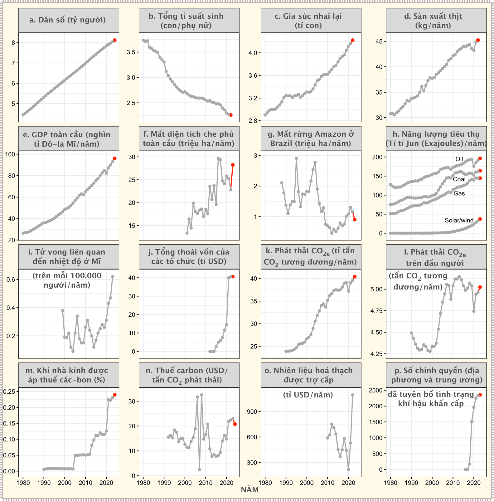
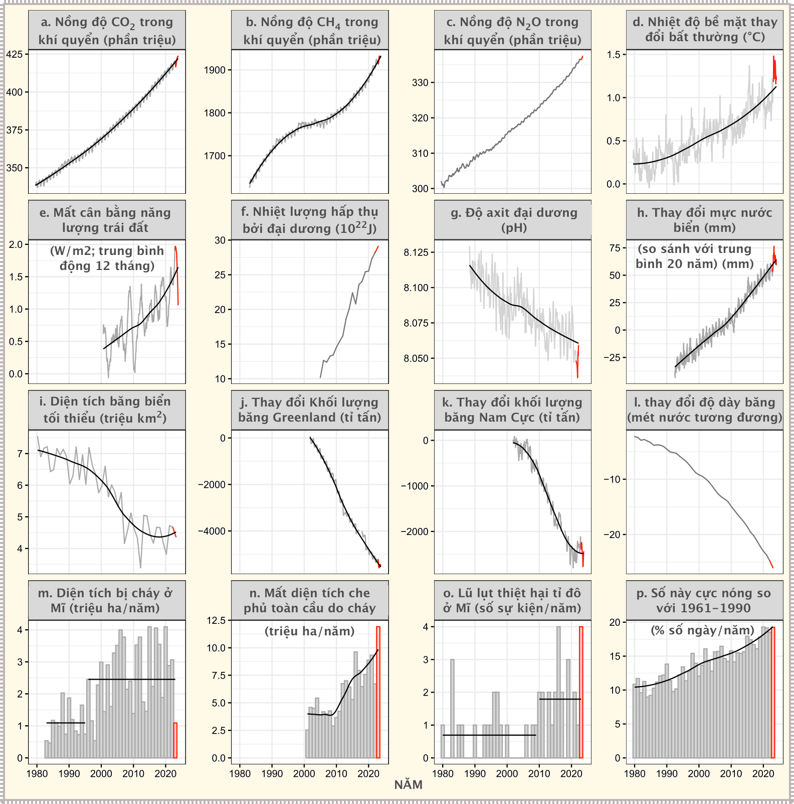
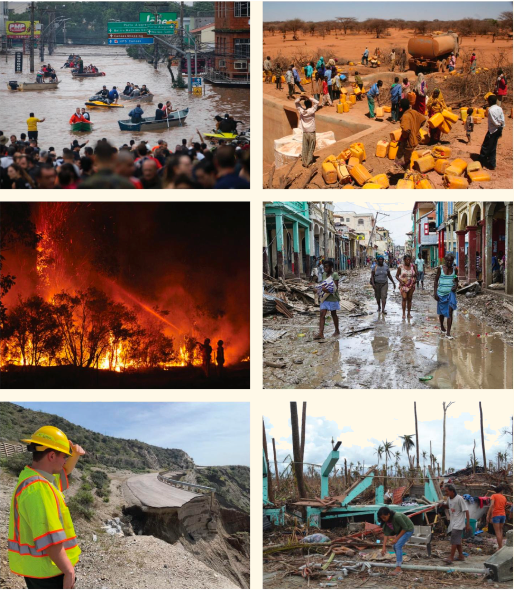
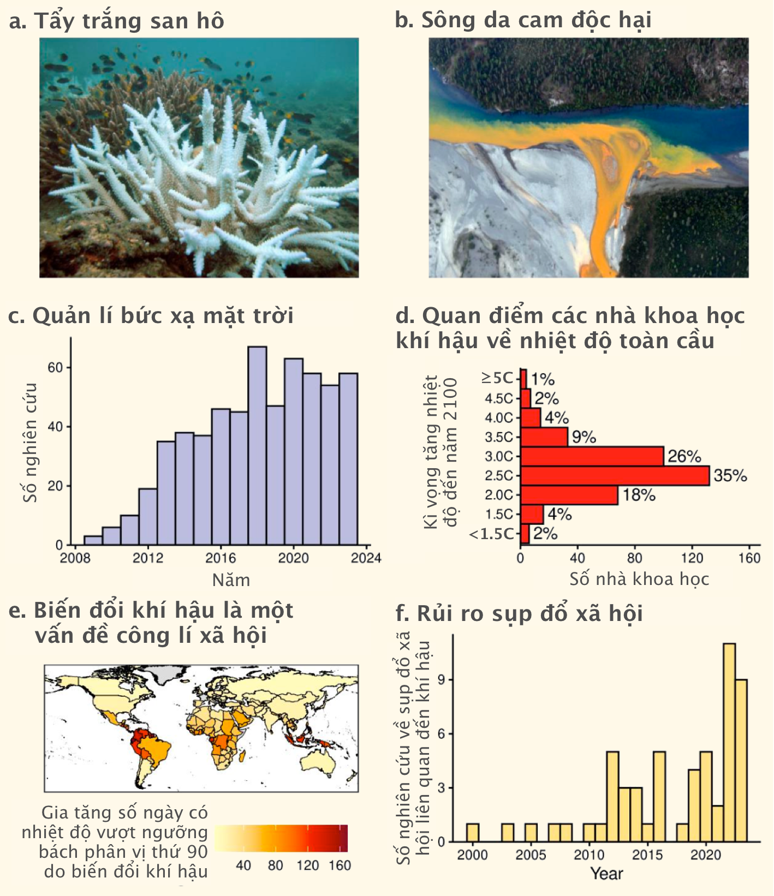

# Báo cáo hiện trạng khí hậu năm 2024: Thời điểm nguy hiểm trên Trái đất

Chúng ta đang đứng trước bờ vực của một thảm họa khí hậu không thể đảo ngược. Không nghi ngờ gì nữa, đây là một tình trạng khẩn cấp toàn cầu. Phần lớn kết cấu sự sống trên Trái đất đang gặp nguy hiểm. Con người đang bước vào một giai đoạn mới mang tính then chốt và khó lường của cuộc khủng hoảng khí hậu. Trong nhiều năm, các nhà khoa học, bao gồm một nhóm hơn 15.000 người, đã gióng lên hồi chuông cảnh báo về mối nguy hiểm sắp xảy ra do biến đổi khí hậu qua việc tăng phát thải khí nhà kính và thay đổi hệ sinh thái. Trong nửa thế kỷ, hiện tượng nóng lên toàn cầu đã được dự đoán chính xác ngay cả trước khi nó được quan sát&mdash;không chỉ bởi các nhà khoa học hàn lâm độc lập mà còn bởi các công ty khai thác nhiên liệu hóa thạch. Bất chấp những cảnh báo này, chúng ta vẫn đang đi sai hướng; lượng phát thải nhiên liệu hóa thạch đã tăng lên mức cao nhất mọi thời đại, 3 ngày nóng nhất từng được ghi nhận xảy ra vào tháng 7 năm 2024 và với các chính sách hiện tại, chúng ta đang đi theo quỹ đạo tăng nhiệt độ lên tối đa xấp xỉ 2,7°C vào năm 2100. Đáng buồn thay, con người không thể tránh được những tác động nghiêm trọng và giờ đây chỉ có thể hy vọng có thể hạn chế mức độ thiệt hại. Chúng ta đang chứng kiến thực tế nghiệt ngã của những dự báo khi tác động của khí hậu ngày càng leo thang, gây ra những cảnh tượng thiên tai chưa từng có trên khắp thế giới và những đau khổ của con người và muôn loài. Chúng ta đang sống giữa biến động khí hậu đột ngột, một tình huống thảm khốc chưa từng gặp phải trong lịch sử tồn tại của loài người. Giờ đây chúng ta đã đẩy hành tinh này tới những điều kiện khí hậu chưa từng được con người hay họ hàng thời tiền sử chứng kiến trong chi Homo[^1] của mình.

[^1]:

    Homo: chi, Homo Sapien: loài người

Năm ngoái, chúng ta đã chứng kiến nhiệt độ bề mặt nước biển phá kỷ lục, mùa hè cận nhiệt đới nóng nhất Bắc bán cầu trong 2000 năm và việc phá vỡ nhiều kỷ lục khí hậu khác. Hơn nữa, chúng ta sẽ chứng kiến thời tiết khắc nghiệt hơn nhiều trong những năm tới. Lượng khí thải các-bon đi-ô-xít do con người tạo ra và các loại khí nhà kính khác là nguyên nhân chính gây ra biến đổi khí hậu. Tính đến năm 2022, quá trình đốt cháy nhiên liệu hóa thạch và công nghiệp toàn cầu sẽ chiếm khoảng 90% tổng **phát thải** (*emission*), trong khi đó, **thay đổi phương thức sử dụng đất** (*land-use change*), chủ yếu thông qua nạn **phá rừng** (*deforestation*), chiếm khoảng 10% Mục đích của chúng tôi trong bài viết này là truyền đạt trực tiếp tới các nhà nghiên cứu, nhà hoạch định chính sách và công chúng. Với tư cách là các nhà khoa học và học giả, chúng tôi cảm thấy nghĩa vụ đạo đức của mình và của các tổ chức của chúng tôi là cảnh báo nhân loại về những mối đe dọa ngày càng tăng mà chúng ta phải đối mặt một cách rõ ràng nhất có thể và thể hiện khả năng lãnh đạo trong việc giải quyết chúng. Trong báo cáo này, chúng tôi phân tích các xu hướng mới nhất trong một loạt các chỉ báo quan trọng của hành tinh. Chúng tôi cũng đánh giá các thảm họa đáng chú ý gần đây liên quan đến khí hậu, nêu bật các chủ đề quan trọng về khí hậu và thảo luận các biện pháp can thiệp chính sách cần thiết. Báo cáo này là một phần trong chuỗi cập nhật ngắn gọn hàng năm của chúng tôi về hiện trạng khí hậu.

!!! tip "Các điểm tới hạn của biến đổi khi hậu và hiện trạng"

    

    <iframe style="display: block; margin: auto;" width="560" height="315" src="https://www.youtube.com/embed/Vl6VhCAeEfQ?hl=vi&cc_lang_pref=vi&cc_load_policy=1" title="YouTube video player" frameborder="0" allow="accelerometer; autoplay; clipboard-write; encrypted-media; gyroscope; picture-in-picture; web-share" allowfullscreen></iframe>
    

    Lưu ý: Để xem phụ đề tiếng Việt, vào :material-cog: **Cài đặt** > **Phụ đề** > **Dịch tự động** > **Tiếng Việt**

## Các xu hướng gần đây về các chỉ báo hiệu quan trọng của hành tinh 

Vào năm 2023, nhiều kỷ lục lịch sử về nhiệt độ và phạm vi băng đã bị phá vỡ với khoảng chênh lệch rất lớn. Cả nhiệt độ bề mặt biển trên toàn cầu và ở Bắc Đại Tây Dương đều cao hơn nhiều so với mức trung bình giai đoạn 1991–2024 trong phần lớn thời gian trong năm&mdash;xu hướng này vẫn tiếp tục diễn ra cho đến năm 2024 (**Hình 1a, 1b**). Mặc dù **phạm vi băng biển** (*sea ice extent*) ở Nam Cực và trên toàn cầu hiện đã đạt mức tương đương với những năm trước nhưng chúng vẫn thấp hơn nhiều so với mức trung bình giai đoạn 1993–2024 (**Hình 1c, 1d**). Nhiệt độ trung bình hàng ngày trên toàn cầu ở mức kỷ lục trong gần nửa năm 2023 và trong phần lớn năm 2024 (**Hình 1e**). Với quỹ đạo phát thải hiện tại, chúng ta có thể thường xuyên vượt qua các kỷ lục về nhiệt độ hiện tại trong những năm tới.

Trong số 35 chỉ báo quan trọng của hành tinh mà chúng tôi theo dõi hàng năm (**Hình 2** và **Hình 3**), 25 chỉ báo ở mức kỷ lục (**Bảng bổ sung S1**). Sự thất bại toàn cầu trong việc ủng hộ giảm nhiên liệu hóa thạch một cách nhanh chóng và công bằng về mặt xã hội đã dẫn đến các tác động liên quan đến khí hậu leo thang nhanh chóng (**Bảng 1**). Dưới đây, chúng tôi tập trung vào các biến số đã thay đổi đáng kể hoặc đang ở mức cực đoan kỷ lục.

> **Hình 1** *Những hiện tượng bất thường về khí hậu vào năm 2023 và 2024. Nhiệt độ đại dương (a, b) hiện đang vượt xa phạm vi lịch sử của chúng. Những dị thường này phản ánh tác động tổng hợp của biến đổi khí hậu dài hạn và biến đổi ngắn hạn. (Nguồn và chi tiết bổ sung về từng biến được cung cấp trong tập tin bổ sung S1). Mỗi dòng tương ứng với một năm khác nhau, với màu xám đậm hơn tượng trưng cho những năm sau đó. Tất cả các biến được hiển thị là ước tính hàng ngày.*

## Tập đoàn con người (*Human enterprises*)

Những minh họa của chúng tôi cho thấy quy mô chung của nhân loại và mô hình tiêu thụ tiếp tục tăng tốc trên nhiều lĩnh vực. Mặc dù tỷ lệ sinh đã giảm nhẹ xuống mức thấp kỷ lục vào năm 2023, các biến số khác lập mức cao kỷ lục mọi thời đại, bao gồm dân số, số lượng gia súc nhai lại, sản lượng thịt bình quân đầu người và tổng sản phẩm quốc nội (GDP) (**Hình 2a–2e**). Dân số và đàn gia súc nhai lại tăng lần lượt khoảng 200.000 và 170.000 cá thể mỗi ngày. Việc **tách rời** (*decoupling*) **tăng trưởng** (*growth*) trong tất cả các biến số này ra khỏi việc phát thải khí nhà kính có lẽ rất khó khăn.

## Năng lượng

Tiêu thụ nhiên liệu hóa thạch đã tăng 1,5% vào năm 2023 so với năm 2022 (**Hình 2h**), chủ yếu là do mức tiêu thụ than (1,6%) và dầu tăng đáng kể (2,5%) (**Hình 2h**). Việc sử dụng năng lượng tái tạo cũng đã tăng vào năm 2023, với mức tiêu thụ năng lượng mặt trời và gió cùng tăng 15% so với năm 2022 (**Hình 2h**). Phần lớn sự tăng trưởng này có thể là do trên thực tế năng lượng tái tạo thường rẻ hơn so với các nguồn năng lượng thay thế nhiên liệu hóa thạch mới tương đương. Tuy nhiên, mức tiêu thụ nhiên liệu hóa thạch vẫn gấp khoảng 14 lần mức tiêu thụ năng lượng mặt trời và năng lượng gió (**Hình 2h**) và sự tăng trưởng gần đây về tỷ lệ năng lượng tái tạo trong sản xuất điện chủ yếu đáp ứng nhu cầu ngày càng tăng, thay vì thay thế nhiên liệu hóa thạch.

## Rừng

**Mất độ che phủ rừng** (*tree cover loss*) toàn cầu đã tăng từ 22,8 triệu héc-ta (Mha) mỗi năm vào năm 2022 lên 28,3 Mha mỗi năm vào năm 2023, đạt mức cao thứ ba trong lịch sử (**Hình 2f**); nguyên nhân một phần là do cháy rừng khiến diện tích rừng bị mất đi đạt mức cao kỷ lục 11,9 Mha (**Hình 3n**). Tỷ lệ mất độ che phủ rừng cao có thể dẫn đến một loạt các **vòng phản hồi** (*feedback loops*) liên quan, trong đó có việc mất khả năng **cô lập carbon** (*carbon sequestration*) của rừng dẫn đến hiện tượng nóng gia tăng, có thể gây ra tổn thất thêm về khả năng cô lập carbon, v.v. Loại quy trình phản hồi carbon khí hậu này có thể hạn chế sự thành công của một số giải pháp tự nhiên chống biến khí hậu. Vào năm 2023, lượng carbon trong đất cũng giảm đáng kể. Ở một khía cạnh tích cực hơn, tỷ lệ phá rừng ở Amazon Brazil tiếp tục giảm, từ 1,16 Mha năm 2022 xuống 0,90 Mha năm 2023 (**Hình 2g**). Sự sụt giảm này có thể một phần là do thay đổi chính sách của chính phủ Brazil ban hành vào thời điểm quyết định khi rừng Amazon có thể sắp đạt đến **điểm tới hạn** (*tipping point*) lúc nó mất đi khả năng phục hồi và các **vòng phản hồi xuôi** (*positive feedback loops*) góp phần gây ra tình trạng chết rừng trên diện rộng.

> **Hình 2** *Đồ thị theo thời gian các hoạt động của con người liên quan đến khí hậu. Dữ liệu thu được kể từ khi Ripple và đồng nghiệp đưa ra trong [báo cáo năm 2023](climate-2023.md) được hiển thị bằng màu đỏ (xám đậm ở màu đen và trắng). Trong phần (f), mất độ che phủ rừng không tính đến việc tăng thêm rừng và bao gồm mất rừng do bất kỳ nguyên nhân nào. Đối với phần (h), thủy điện và năng lượng hạt nhân được thể hiện trong ***Hình S3*** bổ sung. Nguồn và chi tiết về từng biến số được cung cấp trong tệp bổ sung S1.*

> **Hình 3**. *Đồ thị theo thời gian của các phản hồi liên quan đến khí hậu. Dữ liệu thu được trước và sau khi Ripple và đồng nghiệp đưa ra trong [báo cáo năm 2023](climate-2023.md) lần lượt được hiển thị bằng màu xám và đỏ. Đối với diện tích bị cháy (m) và tần suất lũ lụt thiệt hại hàng tỷ USD (o) ở Hoa Kỳ, các đường ngang màu đen biểu thị ước tính ***mô hình điểm thay đổi*** (*changepoint model*), cho phép ước tính thay đổi đột ngột (xem phần bổ sung). Đối với các biến số khác có độ biến thiên tương đối cao, đường xu hướng ***hồi quy cục bộ*** (*local regression*) được hiển thị bằng màu đen. Các biến được đo ở các tần suất khác nhau (ví dụ: hàng năm, hàng tháng, hàng tuần). Các nhãn trên trục x tương ứng với thời điểm giữa năm. Tần suất lũ lụt thiệt hại hàng tỷ USD (o) bị tác động bởi mức tàn phá và tính dễ bị tổn thương bên cạnh biến đổi khí hậu. Nguồn và chi tiết bổ sung về từng biến được cung cấp trong tệp bổ sung S1.*

## Khí nhà kính và nhiệt độ toàn cầu 

Lượng phát thải hàng năm liên quan đến năng lượng tăng 2,1% vào năm 2023 và lần đầu tiên hiện ở trên mức trên 40 tỷ tấn CO~2~ tương đương (**Hình 2k**). Ba quốc gia phát thải nhiều nhất là Trung Quốc, Hoa Kỳ và Ấn Độ, cùng nhau chiếm hơn một nửa lượng phát thải toàn cầu (bảng bổ sung S2). Lượng khí thải gây ô nhiễm do **sol khí** (*aerosol*) do con người gây ra đang giảm dần; vì những sol khí này có tác dụng làm giảm nhiệt độ trên qui mô toàn cầu, nên hiện tượng này có thể khiến tốc độ nóng lên toàn cầu tăng nhanh. Tính theo cơ sở mức trung bình toàn cầu từ đầu năm đến nay, nồng độ khí CO~2~ và CH~4~ (mê-tan) đang ở mức cao kỷ lục (**Hình 3a, 3b**). Gần đây, người ta quan sát thấy mức độ khí CO~2~ đang tăng cao. Thêm vào đó, tốc độ phát thải khí mê-tan ngày càng tăng nhanh, điều này rất đáng lo ngại. N~2~O cũng đang ở mức cao kỷ lục (**Hình 3c**); lượng phát thải hàng năm loại khí gây hiệu ứng nhà kính mạnh này&mdash;có thể tồn tại lâu trong khí quyển&mdash;do các hoạt động của con người đã tăng khoảng 40% từ năm 1980 đến năm 2020.

**Nhiệt độ bề mặt** (*surface temperature*) đang ở mức cao kỷ lục và năm 2024 được dự đoán sẽ là một trong những năm nóng nhất từng được ghi nhận (**Hình 3d**). Mỗi 0,1°C nóng lên toàn cầu sẽ đẩy thêm 100 triệu người (hoặc hơn) vào tình trạng khí hậu có nhiệt độ trung bình nóng chưa từng thấy. Với quỹ đạo phát thải hiện này, những năm tới gần như chắc chắn sẽ còn nóng hơn, bởi nền khí hậu của chúng ta tiếp tục dịch chuyển ra khỏi điều kiện tự nhiên đã gắn liền với sự phát triển của con người với phần lớn dân số trên Trái đất. Ngay cả trong những kịch bản lạc quan nhất, sẽ cần có những nỗ lực thích ứng với khí hậu trên quy mô lớn, đặc biệt đối với những nhóm dân cư dễ bị tổn thương nhất.

## Đại dương và băng

**Độ axit đại dương** (*ocean acidity*) và **nhiệt lượng đại dương** (*ocean heat content*) đều ở mức cực đoan kỷ lục (**Hình 3f, 3g**), dẫn đến nhiều tác động khác nhau về khí hậu liên quan đến đại dương. Ví dụ, các đợt nắng nóng vào năm 2021 và 2023 đã gây ra hiện tượng động vật biển chết hàng loạt. Ngoài ra, mực nước biển trung bình toàn cầu hiện nay đang ở mức cao kỷ lục, chủ yếu là do sự nóng lên chung và El Niño mạnh vào năm 2023 và một phần của năm 2024 (**Hình 3h**).

Mực nước biển tiếp tục dâng cao có khả năng khiến hàng trăm triệu người phải di dời trong suốt thế kỷ. Băng lục địa tan chảy đóng góp khoảng một nửa vào mực nước biển dâng, và dữ liệu mới nhất chỉ ra rằng khối băng ở Greenland, khối băng ở Nam Cực và độ dày trung bình của sông băng đều ở mức thấp kỷ lục (**Hình 3j, 3l**).

## Tác động của khí hậu và thời tiết cực đoan 

Thời tiết cực đoan và thiên tai liên quan đến khí hậu đang góp phần đáng kể gây ra đau khổ cho con người (**Hình 4**). Nhiệt độ ngày càng tăng và lượng mưa cực đoan hiện vượt xa mức khí hậu lịch sử. Sự gia tăng nhanh chóng về nhiệt độ trung bình toàn cầu (**Hình 1e**) đã dẫn đến sự gia tăng lớn về tỷ lệ các đợt nắng nóng cực đoan (**Hình 3p**). Điều này có liên quan đến nhiều hệ quả bất lợi cho con người, bao gồm những ca tử vong liên quan trực tiếp, chi phí chăm sóc sức khỏe tăng cao, các vấn đề về sức khỏe tâm thần và tử vong do bệnh tim mạch. Tỷ lệ tử vong liên quan đến nền nhiệt đang tăng nhanh ở Hoa Kỳ (**Hình 2i**); số ca tử vong liên quan đến nắng nóng tăng 117% từ năm 1999 đến năm 2023. Năm ngoái, đã xảy ra bốn trận lũ lụt thiệt hại hàng tỷ đô la ở Hoa Kỳ (**Hình 3o** và S4). Kể từ khi công bố báo cáo gần đây nhất của chúng tôi (năm 2023), nhiều thảm họa lớn khác liên quan đến khí hậu đã xảy ra, bao gồm hàng loạt đợt nắng nóng khắp châu Á khiến hơn một nghìn người thiệt mạng và nhiệt độ tăng lên tới 50°C ở một số vùng của Ấn Độ (**Bảng 1**). Do hệ thống Trái đất có tính **phi tuyến tính** (*nonlinear*) mạnh, nên số lượng thời tiết cực đoan và thảm họa có thể tăng lên đáng kể để  với hiện tượng nóng lên toàn cầu, bao gồm các tác động đến đời sống thực vật và động vật (**Hình 3m, 3o** và các hình bổ sung S4 và S5)

> **Hình 4**. *Chuỗi hình ảnh mô tả tác động của các thảm họa liên quan đến khí hậu. Hàng đầu tiên (từ trái sang phải): Cứu hộ người dân mắc kẹt do lũ lụt ở thành phố Canoas, Rio Grande do Sul (Brazil, 2024; Duda Fortes, Cơ quan RBS Đông Phi; Hàng thứ hai: Lính cứu hỏa ngăn chặn đám cháy rừng xung quanh thị trấn Aberdare (Úc, 2013; Quarrie Photography, Jeff Walsh, Cass Hodge; CC BY-NC-ND 2.0), Hậu quả của cơn bão Matthew (Haiti, 2016; Ảnh LHQ/Logan) Abassi; CC BY-NC-ND 2.0). Hàng thứ ba: Kiểm tra đường bị hư hại do bão ở California (Hoa Kỳ, 2023; Andrew Avitt/USDA Forest Service), Tàn tích của một ngôi nhà bị phá hủy bởi cơn bão Haiyan (Philippines, 2013; Trocaire/Wikimedia; CC). Tất cả các trích dẫn đều lấy từ dự án Climate Visuals (https://climatevisuals.org). Xem Tệp bổ sung S1 để biết chi tiết và thêm hình ảnh.*

## Các tiêu điểm về khí hậu

Trong phần này, chúng tôi nêu bật những diễn tiến gần đây trong các khía cạnh vực khác nhau liên quan đến khí hậu: **tẩy trắng san hô** (*coral bleaching*), **sông màu cam độc hại** (*toxic orange rivers*), nghiên cứu **biến đổi bức xạ mặt trời** (*SRM*), ý kiến của các nhà khoa học khí hậu về nhiệt độ toàn cầu, biến đổi khí hậu như một tác nhân gây ra biến đổi khí hậu vấn đề công bằng xã hội, các vòng phản hồi khí hậu và các điểm bùng phát, và nguy cơ sụp đổ xã hội.

### Tẩy trắng san hô 

Rạn san hô mang lại lợi ích cho hàng triệu người bằng cách cung cấp nhiều loại dịch vụ hệ sinh thái, bao gồm việc bảo vệ bờ biển, cải thiện chất lượng nước, thủy sản và cơ hội du lịch; chúng cũng cung cấp môi trường sống cho nhiều loài. Biến đổi khí hậu là mối đe dọa đặc biệt nghiêm trọng đối với các rạn san hô. San hô bị chết trong nước ấm đôi khi do tẩy trắng gây ra&mdash;kết quả của việc mất đi mối quan hệ cộng sinh với vi tảo (**Hình 5a**). Khi nhiệt độ nước biển tăng đột biến vượt quá mức tối đa trung bình trong dài hạn của mùa hè, nhiều rặng san hô nhanh chóng chết đi trong vòng một hoặc hai tuần mà chưa có thời gian để tẩy trắng diễn ra. Những rặng san hô khác bị tẩy trắng và chết chậm hơn trong khoảng thời gian vài tháng hoặc lấy lại màu sắc và sống sót. Tính đến năm 2024, nhiệt độ đại dương ấm bất thường (**Hình 1a**) đang gây ra sự kiện tẩy trắng san hô quy mô toàn cầu lần thứ tư từng được ghi nhận (các sự kiện trước đó xảy ra vào năm 1998, 2010, 2014&ndash;2017).

### Những dòng sông màu cam độc hại

Biến đổi khí hậu đang làm thay đổi chế độ thủy văn lưu vực và sinh địa hóa nước. Gần đây, các nhà nghiên cứu đã quan sát thấy một mối đe dọa mới nổi ở các dòng hải lưu ở Bắc Cực chuyển sang màu cam do lượng sắt và kim loại độc hại tăng lên (**Hình 5b**). Sự đổi màu này bắt đầu từ thập kỷ trước, trùng hợp với hiện tượng nóng lên toàn cầu nhanh chóng và tan băng vĩnh cửu. So với dòng hải lưu trong, dòng màu cam có tính axit cao hơn, độ đục cao hơn và có nhiều sunfat, sắt và kim loại vi lượng. Sự đổi màu này tương quan với sự suy giảm tính đa dạng của động vật cỡ lớn có xương sống và sự phong phú các loài cá, ảnh hưởng đến nguồn nước uống và nghề cá tự cung tự cấp ở vùng nông thôn Alaska.

### Nghiên cứu biến đổi bức xạ mặt trời

Nghiên cứu SRM, còn được gọi là **nghiên cứu địa kỹ thuật mặt trời** (*solar geoengineering research*), đã tăng lên đáng kể trong những năm gần đây (**Hình 5c**). Nó liên quan đến các kỹ thuật tiềm ẩn rủi ro dùng để phản chiếu ánh sáng mặt trời ra khỏi Trái đất nhằm giảm thiểu tác động của biến đổi khí hậu. Các danh mục chung của SRM bao gồm các ứng dụng trong khí quyển, trên mặt đất và trên không gian. Ví dụ, các phương pháp cụ thể bao gồm **bơm sol khí** (*injecting aerosols*) vào tầng bình lưu hoặc **làm sáng các đám mây biển** (*brightening marine clouds*). Hội đồng liên chính phủ về biến đổi khí hậu (IPCC) đã kết luận rằng phun khí dung (hay sol khí) vào tầng bình lưu là phương pháp SRM được nghiên cứu nhiều nhất, nhưng cũng có một số lo ngại về môi trường. SRM cũng gây tranh cãi vì những hậu quả tiềm ẩn ngoài ý muốn và những lo ngại về đạo đức. Các nhà phê bình cho rằng nó là hướng đi sai lầm và có thể phá vỡ các mô hình thời tiết cũng như cản trở các nỗ lực giảm phát thải. Tuy nhiên, nghiên cứu vẫn tiếp tục khám phá tính khả thi và rủi ro của nó. SRM thường được coi là một giải pháp tạm thời, có tiềm năng quan trọng để vừa giảm sự nóng lên vừa giảm những thiệt hại tương ứng, bao gồm cả các vùng cận cực rất quan trong đang nóng lên nhanh. Nghiên cứu về địa kỹ thuật năng lượng mặt trời cần tập trung vào việc tìm hiểu các tác động tiềm ẩn về môi trường, xã hội và địa chính trị, cũng như đánh giá tính hiệu quả và an toàn trên cả quy mô khu vực và toàn cầu. Ngoài ra, nghiên cứu liên ngành là cần thiết để khám phá các khuôn khổ đạo đức, pháp lý và quản trị, cùng với nhận thức và sự chấp nhận của công chúng, đồng thời nhấn mạnh tầm quan trọng đặc biệt của việc giảm mạnh phát thải khí nhà kính. Đã có sẵn một nghiên cứu đồng thuận có thể được sử dụng như một lộ trình cho việc quản lý nghiên cứu và nghiên cứu địa kỹ thuật mặt trời.

### Ý kiến của các nhà khoa học khí hậu về nhiệt độ toàn cầu

Một cuộc thăm dò ý kiến năm 2024 đã tiết lộ dự đoán của hàng trăm nhà khoa học khí hậu nổi tiếng của IPCC, các tác giả cấp cao và người bình duyệt nghiên cứu khoa học (380 người trả lời). Từ góc độ cá nhân, gần 80% các nhà khoa học này dự đoán nhiệt độ toàn cầu sẽ tăng ít nhất 2,5°C so với mức tiền công nghiệp vào cuối thế kỷ này. Gần một nửa trong số họ dự đoán nhiệt độ sẽ tăng ít nhất 3°C. Chỉ 6% tin rằng thỏa thuận quốc tế là 1,5°C sẽ được thực thi (**Hình 5d**). Nhận định tương tự được đưa ra trong một cuộc khảo sát trước đó của các nhà khoa học IPCC, cho thấy khoảng 60% dự đoán nhiệt độ sẽ tăng lên ít nhất 3°C. Những dự báo này vẽ ra một bức tranh ảm đạm về tương lai, ở đó nhiều nhà khoa học  hình dung ra nạn đói lan rộng, xung đột, di cư hàng loạt và thời tiết khắc nghiệt ngày càng gia tăng sẽ vượt qua mọi điều đã chứng kiến cho đến nay, gây ra những hậu quả thảm khốc cho cả nhân loại và sinh quyển. Tuy nhiên, điều quan trọng cần ghi nhớ là những diễn biến như vậy có thể chịu ảnh hưởng dung hòa giữa các vấn đề khoa học (mức tăng nhiệt độ nhất định tương ứng với một lộ trình phát thải nhất định) và các vấn đề về chính sách (những lộ trình/giải pháp nào vẫn có thể thực hiện được và những trở ngại là gì).

> **Hình 5**. *Các chủ đề nổi bật về biến đổi khí hậu. Đã có nhiều tác động nghiêm trọng về khí hậu đang xảy ra, bao gồm tẩy trắng san hô (a) và tan băng vĩnh cửu góp phần khiến các dòng sông màu cam bị giảm lượng cá và chất lượng nước uống (b). Những năm gần đây đã chứng kiến sự gia tăng đáng kể số lượng ấn phẩm khoa học liên quan đến việc biến đổi bức xạ mặt trời (c). Một cuộc khảo sát với hàng trăm tác giả cấp cao của IPCC và các nhà bình duyệt nghiên cứu khoa học chỉ ra rằng phần lớn dự đoán sự nóng lên thảm khốc ít nhất là 2,5 độ C trong thế kỷ này (d). Nhiệt độ cực cao dự kiến sẽ ảnh hưởng không tương xứng đến người dân ở các quốc gia kém giàu có hơn với lượng khí thải thấp hơn (e). Biến đổi khí hậu cuối cùng có thể góp phần gây ra sự sụp đổ xã hội&mdash;một khả năng ngày càng được các nhà nghiên cứu xem xét (f). Xem Tệp bổ sung S1 để biết nguồn dữ liệu và chi tiết. Ảnh: (a) Acropora/Wikimedia Commons, (b) Ken Hill/ National Park Service.*

Không có cách nào để biết liệu các nhà khoa học vật lý của IPCC được thăm dò đưa ra đánh giá của họ dựa trên khoa học hay chỉ đơn giản là dựa trên quan điểm của họ về triển vọng hành động chính trị.

Một trong vô số thách thức đối với các nhà khoa học là làm thế nào để truyền thông về biến đổi khí hậu. Một số người lập luận rằng thái độ bi quan và cam chịu có thể là trở ngại cho hành động vì khí hậu. Hơn nữa, một số người cho rằng những người phản đối hành động đã sử dụng các chiến lược thay thế, bao gồm cả việc tuyên truyền chủ nghĩa bi quan, vì ôm ấp cảm giác bất lực này có thể làm suy yếu động lực hành động. Ngược lại, người ta cũng cho rằng sự lạc quan sẽ không dẫn đến hành động nếu mọi người nghĩ rằng mọi thứ đều ổn và do đó không cần phải hành động. Trong mọi trường hợp, tầm quan trọng của giọng điệu có thể bị cường điệu hóa trong bối cảnh này và cần có nhiều nghiên cứu hơn để xác định rõ hơn các yếu tố thúc đẩy hành động vì khí hậu.

Với những tác động ngày càng không thể phủ nhận của biến đổi khí hậu, đánh giá mang tính nghiêm trọng là một cái nhìn trung thực. Việc phủ nhận mối đe dọa hiện hữu do biến đổi khí hậu gây ra ngày càng ít có khả năng xảy ra. Thực tế là việc ngăn chặn mỗi 0,1°C nhiệt độ tăng là cực kỳ quan trọng. Thay vì trình bày tiên lượng biến đổi khí hậu theo hướng bi quan hay lạc quan, chúng ta chỉ muốn hành động một cách trung thực và nói đúng theo sự thật đang diễn ra. Chúng ta phải nhấn mạnh cả tính cấp bách và tính chủ động khi mô tả hành động cần thiết về biến đổi khí hậu.

## Biến đổi khí hậu là một vấn đề công bằng xã hội

Biến đổi khí hậu là vấn đề về **tính đa dạng, công bằng và hòa hợp** (*diversity, Equity & Inclusion &mdash;DEI*), nguyên nhân là do những người giàu thải ra nhiều khí nhà kính nhất nhìn chung ít bị tổn thương hơn trước tác động của khí hậu (**Hình 5e**). Mặc dù sự hậu quả của việc phát thải mang tính toàn cầu nhưng chúng đặc biệt nghiêm trọng ở
**các nước phía Nam** (*Global South*). Tính dễ bị tổn thương trước biến đổi khí hậu được hình thành do sự tương tác phức tạp giữa các yếu tố xã hội, kinh tế và chính trị, đặc biệt ảnh hưởng đến các cộng đồng có lịch sử đa dạng, bị đối xử bất công và bị gạt ra ngoài lề xã hội. Nguyên tắc DEI nhấn mạnh tính cấp bách phải giải quyết những khác biệt này. Đưa biến đổi khí hậu vào trong khuôn khổ các hoạt động DEI có tổ chức có thể giúp thúc đẩy tiến bộ toàn diện và có ý nghĩa hướng tới công bằng và bền vững. Bằng cách nhận ra những tác động không cân xứng của biến đổi khí hậu đối với các cộng đồng bị thiệt thòi, các tổ chức có thể nỗ lực khắc phục những bất công trong lịch sử bằng cách tài trợ cho các nước gia phía Nam để duy trì quá trình khử cacbon trong khi giải quyết các mối lo ngại cấp bách về biến đổi khí hậu. Ngoài ra, những quan tâm về DEI còn liên quan đến chính sách khí hậu quốc tế; ví dụ, chúng có thể giúp hướng dẫn các nỗ lực loại bỏ việc khai thác nhiên liệu hóa thạch một cách nhanh chóng và công bằng.

Các khía cạnh đạo đức của biến đổi khí hậu đã khiến nhiều người lãnh đạo tôn giáo lên tiếng về vấn đề này (ví dụ: Thích Nhất Hạnh năm 2015, Giáo hoàng Francis năm 2023). Điều này thể hiện cơ hội cho các cộng đồng đa dạng để xây dựng các liên minh xung quanh vấn đề này.

## Vòng phản hồi khí hậu và điểm tới hạn

Cần tăng cường nhận thức và nghiên cứu về các vòng lặp phản hồi khí hậu. Vòng phản hồi là các quá trình có thể khuếch đại hoặc giảm thiểu tác
động của phát thải khí nhà kính. Nhiều vòng phản hồi quan trọng làm gia tăng mức độ nóng lên. Ít nhất 28 vòng phản hồi khuếch đại đã được xác định (**Bảng 2a, 2b**). Một vòng phản hồi đặc biệt đáng lo ngại là vòng phản hồi băng vĩnh cửu, liên quan đến việc nhiệt độ tăng lên gây ra hiện tượng tan băng vĩnh cửu. Quá trình này thải ra nhiều khí CO~2~ và mê-tan hơn, dẫn đến nóng lên. Các lĩnh vực nghiên cứu vòng phản hồi khí hậu tích cực bao gồm sự tương tác giữa băng vĩnh cửu và mây, tan băng hà và đa dạng sinh học. Do các vòng phản hồi chưa được tích hợp hoàn toàn vào các mô hình khí hậu, các kế hoạch giảm phát thải hiện tại có thể không đủ khả năng hạn chế sự nóng lên trong tương lai.

> **Bảng** $\textbf{2a}$: *Tổng kết các vòng phản hồi vật lí học có tác dụng khuếch đại*

| **Phản hồi** | **Ảnh hưởng của biến đối khí hậu** | **Ảnh hưởng đến biến đổi khí hậu** |
|---|---|---|
| Hơi nước^†^ | Lượng hơi nước | ↑Hiệu ứng nhà kính |
| Suất phản chiếu băng biển^*†^ | ↑Băng biển tan và không được tạo thành  | ↓Suất phản chiếu |
| Dải băng^*†‡^ | ↑Băng hà và dải băng tan/mất ổn định | ↓Suất phản chiếu |
| Mực nước biển dâng^‡^ | ↑Mực nước biển | ↓Suất phản chiếu (ngập nước ven biển) |
| Tuyết bao phủ | ↓Độ bao phủ | ↓Suất phản chiếu |
| Mây^‡^ | ΔPhân bố mây và các đặc tính quang học | ΔSuất phản chiếu mây và hiệu ứng nhà kính |
| Phân tầng đại dương | ↑Phân tầng đại dương | ↓Hấp thụ các-bon bởi đại dương |
| Độ hoà tan^†^  | ↑Nồng độ CO~2~ khí quyển | ↓CO~2~ hấp thụ bởi đại dương |
| CH~4~ thuỷ hợp^*‡^ | ↑Tỉ lệ CH~4~ thuỷ hợp phân tách | ↑Phát thải CH~4~ vào khí quyển |
| Độ cao băng^‡^ | ↓Dải băng và độ cao băng  | ↑Tan dải băng và băng tảng, suất phản chiếu |
| Lượng mưa ở Nam Cực^‡^ | ↓Phạm vi dải băng, lượng mưa | ↓Suất phản chiếu, nóng tâng sâu đại dương |

*Lưu ý: Các vòng phản hồi có thể liên quan đến nhân tố tới hạn được đánh dấu hoa thị (&#42;). Là những chỉ báo về các vòng phản hồi có nhiều khả năng được bao gồm trong các mô hình khí hậu nhất định, các vòng phản hồi được tham chiếu trong Hình TS.17 (tổng quan về các vòng phản hồi) hoặc **Hình 5.29** (các vòng phản hồi sinh địa hóa) của IPCC (2021) được đánh dấu chữ thập (†). Nhiều vòng phản hồi trong số này có thể sẽ có tác động lớn đến khí hậu Trái đất, nhưng các vòng phản hồi khác có thể mang tính suy đoán nhiều hơn. Tác động phản hồi thường diễn ra theo quy mô thời gian; các vòng phản hồi được cho là đặc biệt chậm được đánh dấu bằng hình chữ thập hai gạch ngang (‡). Các ký hiệu biểu thị giảm (↓), tăng (↑) và thay đổi (Δ).*

Một số vòng phản hồi khí hậu được liên kết với các điểm tới hạn, có khả năng gây ra những thay đổi lớn và không thể đảo ngược trong hệ thống Trái đất mà không bị thúc đẩy thêm bởi các hoạt động của con người. Các **nhân tố tới hạn** (*tipping elements*) là các **hệ thống lý-sinh** (*biophysical systems*) trên Trái đất do sự hoạt động của các điểm tới hạn có tác động điều hòa hệ thống khí hậu. Gần đây người ta đã đánh gia chúng thông qua **độ nhạy tới hạn** (*tippping sensitivity*). Năm trong số 16 nhân tố sẽ vượt ngưỡng tới hạn ở mức 1,5°C tăng: dải băng Greenland, dải băng Tây Nam Cực, băng vĩnh cửu phương bắc, các rạn san hô ở các vĩ độ thấp, băng biển Barents. Có nhiều nhân số tới hạn khí hậu được kết nối với nhau và nếu một phần tử đi qua giới hạn thì các phần tử khác có thể như vậy, kích hoạt sự chuyển dịch liên hoàn. Nhìn chung, điều này chỉ ra một tình huống phức tạp trong đó việc kiểm soát các vòng phản hồi khí hệ và hệ thống điểm tới hạn được kết nối chặt chẽ với nhau theo cách có thể kích hoạt các quá trình tự duy trì nhằm khuếch đại sự nóng lên ngoài tầm kiểm soát của con người. Vì vậy, chúng tôi khuyến nghị IPCC xuất bản một báo cáo đặc biệt về các vòng phản hồi và các điểm tới hạn.

> **Bảng** $\textbf{2b}$: *Tổng kết các vòng phản hồi sinh học có tác dụng khuếch đại*

| Phản hồi | Ảnh hưởng của biến đổi khí hậu | Ảnh hưởng đến biến đổi khí hậu |
|---|---|---|
| Đất than bùn (*Peatlands*)^†^ | ↑Khô cháy ↓Các-bon trong đất  | ↑Phát thải khí CO~2~ vào khí quyển |
| Vùng đất ngập nước (*Wetlands*)^†^ | ↑Diện tích đất ngập nước (↑lượng mưa) | ↑Thu giữ CO~2~ ↑Phát thải CH~4~  |
| Nước ngọt | ↑Tốc độ tăng trưởng thực vật thuỷ sinh | ↑Phát thải CH~4~ |
| Rừng chết (*Forest dieback*)^*^ | ↑Amazon và rừng khác chết dần | ↓Thu giữ CO~2~, Δsuất phản chiếu |
| Phủ xanh miền Bắc (*Northern greening*) | ↑Diện tích rừng phương Bắc, thảm thực vật Bắc Cực | ↑Thu giữ CO~2~, ↓suất phản chiếu |
| Côn trùng | ΔPhạm vi và sự phong phú của côn trùng | ↓Thu giữ CO~2~, Δsuất phản chiếu |
| Cháy rừng^†^ | ↑Hoả hoạn ở một số vùng | ↑Phát thải CO~2~, Δsuất phản chiếu |
| Các-bon trong đất (*Soil carbon*) | ↑Mất các-bon trong đất | ↑Phát thải CO~2~ |
| N~2~0 trong đất^†^ | ΔHoạt động vi khuẩn trong đất | ↑Phát thải N~2~O |
| Phát thải từ băng vĩnh cửu^*†^ | ↑Tan băng vĩnh cửu | ↑Phát thải CO~2~ và CH~4~ |
| Tương tác băng vĩnh cửu—mây | ↑Tan băng vĩnh cửu, cảnh quan khô héo | ↓Mây mùa hè, ↓suất phản chiếu  |
| Thoát hơi nước từ đất và thực vật | ↑Thoát hơi nước từ đất và thực vật | ↑Lưu lượng ẩn nhiệt |
| Vi khuẩn (*Microbes*) | ↑Tốc độ hô hấp của vi khuẩn | ↑Tỉ lệ thực vật chết, ↓Thu giữ CO~2~ |
| Các yếu tố gây căng thẳng | ↑Căng thẳng nhiệt, ↑hạn hán | ↓Thu giữ CO~2~, Δsuất phản chiếu |
| Sa mạc hóa  | ↑Diện tích sa mạc |  |
| Năng suất ven biển | ↑Suy thoái hệ sinh thái ven biển | ↓Thu giữ các-bon của hệ sinh thái ven biển |
| Tỉ lệ trao đổi chất | ↑Tốc độ hô hấp thực vật phù du | ↑CO~2~ thải vào khí quyển |

## Nguy cơ sụp đổ xã hội

Tình trạng khẩn cấp về khí hậu không phải là một vấn đề riêng lẻ. Sự nóng lên toàn cầu, dù thảm khốc, chỉ là một khía cạnh của một cuộc khủng hoảng sâu sắc bao gồm **suy thoái môi trường** (*environmental degradation*), tăng **bất bình đăng đẳng kinh tế** (*economic inequality*) và **mất đa dạng sinh học** (*biodiversity loss*).Biến đổi khí hậu là một triệu chứng rõ ràng của một vấn đề mang tính hệ thống sâu sắc hơn: **vượt ngưỡng sinh thái** (*ecologial overshoot*), trạng thái mà mức tiêu thụ của con người vượt quá khả năng cung ứng có thể phục hồi của Trái đất. Vượt ngưỡng là một trạng thái vốn không ổn định và không thể tồn tại vô thời hạn. Khi áp lực tăng lên và nguy cơ hệ thống khí hậu Trái đất chuyển sang trạng thái tình trạng thảm khốc tăng lên, ngày càng có nhiều nhà khoa học bắt đầu nghiên cứu khả năng sụp đổ xã hội. Ngay cả khi không có sự sụp đổ toàn cầu, khí hậu sự thay đổi có thể gây ra thêm hàng triệu cái chết từ nay đến năm 2050.

Cùng với mối nguy hiểm của vượt ngưỡng sinh thái, biến đổi khí hậu có thể góp phần vào sự sụp đổ bằng cách tăng khả năng xảy ra những rủi ro thảm khốc như xung đột quốc tế hoặc do gây ra sự căng thẳng phức tạp, dẫn đến lỗi đồng bộ trên toàn hệ thống. Số lượng bài báo được xuất bản sử dụng cụm từ “biến đổi khí hậu” và “sụp đổ xã hội” gia tăng nhanh chóng (**Hình 5f**). Biến đổi khí hậu đã khiến hàng triệu người phải di dời và có khả năng buộc hàng trăm triệu hay thậm chí hàng tỷ người nữa phải rời bỏ nhà cửa, dẫn đến bất ổn địa chính trị lớn hơn (**Bảng S3**). Vào cuối thế kỷ này, khoảng một phần ba số người trên toàn thế giới có thể sống trong nên khí hậu không thích hợp cón người, đối mặt với nguy cơ bệnh tật gia tăng và tử vong sớm, nạn đói và hàng loạt hệ quả bất lợi khác.

## Kết luận

Bất chấp sáu báo cáo của IPCC, 28 cuộc họp COP, hàng trăm báo cáo khác và hàng chục nghìn bài báo khoa học, thế giới vẫn chỉ đạt được những tiến bộ rất nhỏ trong vấn đề biến đổi khí hậu, một phần là do sự phản kháng gay gắt từ những người được hưởng lợi về mặt tài chính từ hệ thống sử dụng nhiên liệu hóa thạch hiện nay. Chúng ta hiện đi theo hướng sai lầm, và mức tiêu thụ nhiên liệu hóa thạch và lượng phát thải khí nhà kính ngày càng tăng đang  dẫn con người tới một môi trường khí hậu thảm họa. Chúng tôi lo sợ nguy cơ suy thoái khí hậu. Những bằng chứng mà chúng tôi quan sát được vừa đáng báo động vừa không thể phủ nhận, nhưng chính điều rất sốc này khiến chúng tôi phải hành động. Chúng tôi thừa nhận tính chất vô cùng cấp bách trong việc giải quyết thách thức toàn cầu này, đặc biệt là đối với những viễn cảnh khủng khiếp đối với người nghèo trên thế giới. Chúng tôi cảm thấy can đảm và quyết tâm để tìm kiếm các giải pháp thay đổi sâu rộng dựa trên khoa học ở tất cả các lĩnh vực trong xã hội (**Bảng S4**). Mục tiêu của chúng tôi là cung cấp những hiểu biết rõ ràng, dựa trên bằng chứng nhằm truyền cảm hứng cho những hưởng ứng sáng suốt và táo bạo từ người dân đến các nhà nghiên cứu và các nhà lãnh đạo thế giới.

Việc nhanh chóng giảm dần việc sử dụng nhiên liệu hóa thạch phải là ưu tiên hàng đầu. Điều này có thể được thực hiện một phần thông qua một mức thuế các-bon đủ cao để có thể hạn chế lượng khí thải của người giàu đồng thời có khả năng cung cấp kinh phí cho các chương trình **giảm thiểu tác động** (*mitigation*) và **thích ứng** (*adaption*) rất cần thiết với biến đổi khí hậu. Ngoài ra, việc định giá và giảm lượng khí thải mê-tan là rất quan
trọng để giảm thiểu biến đổi khí hậu một cách hiệu quả. Mêtan là một loại khí nhà kính mạnh, và không giống CO~2~ tồn tại trong khí quyển hàng thế kỷ, khí mê-tan có thời gian tồn tại tương đối ngắn trong khí quyển, khiến việc giảm phát thải có tác động hiệu quả trong thời gian ngắn. Cắt giảm mạnh mẽ
lượng khí thải mêtan có thể làm chậm tốc độ nóng lên toàn cầu trong thời gian ngắn, giúp tránh các điểm tới hạn và các tác động khắc nghiệt của khí hậu.

Trong một thế giới với nguồn tài nguyên hữu hạn, tăng trưởng không giới hạn là một ảo tưởng nguy hiểm. Chúng ta cần sự thay đổi táo bạo và mang tính đột phá: giảm mạnh lượng tiêu thụ quá mức và lãng phí, đặc biệt là với tâng lớp giàu có, ổn định và giảm dần dân số thông qua việc nâng cao giáo dục và trao quyền cho trẻ em gái và phụ nữ, cải cách hệ thống sản xuất thực phẩm để hỗ trợ việc tiêu thụ thực phẩm có **nguồn gốc thực vật** (*plant-based*) nhiều hơn, và áp dụng khuôn khổ **kinh tế học sinh thái** (*ecological economics*) và kinh tế **hậu tăng trưởng** (*post-growh) để đảm bảo công bằng xã hội (**Bảng S4**). Việc giảng dạy về biến đổi khí hậu cần được lồng ghép vào chương trình cốt lõi của giáo dục trung học và đại học trên toàn thế giới để nâng cao nhận thức, cải thiện hiểu biết về khí hậu và trao quyền cho người học hành động. Chúng ta cũng cần những nỗ lực ngay lập tức hơn để bảo vệ, khôi phục và xây dựng lại hệ sinh thái.

Sự gia tăng các thảm họa khí hậu hàng năm cho thấy chúng ta đang ở trong tình trạng nguy cấp; cuộc khủng hoảng sẽ còn tồi tệ hơn nếu chúng ta tiếp tục **phát triển như bình thường** (*business as usual*). Ngày nay, hơn bao giờ hết, hành động của chúng ta có ý nghĩa quan trọng đối với hệ thống khí hậu ổn định đã đảm bảo sự sống loài người trong hàng ngàn năm. Tương lai của nhân loại phụ thuộc vào sự sáng tạo, phẩm chất đạo đức và sự kiên trì của chúng ta. Chúng ta phải khẩn trương cắt giảm tình trạng vượt quá mức sinh thái và theo đuổi các biện pháp giảm thiểu tác động và thích ứng với biến đổi khí hậu trên quy mô lớn ngay lập tức để hạn chế thiệt hại ngắn hạn. Chỉ bằng hành động quyết liệt chúng ta mới có thể bảo vệ thế giới tự nhiên, ngăn chặn sự đau khổ sâu sắc của con người, và đảm bảo rằng các thế hệ tương lai được sống trong thế giới họ đáng được thừa hưởng. Tương lai của nhân loại đang nằm trên thế thăng bằng mong manh.

**Nguồn: Nhóm tác giả Ripple và cộng sự (2024)**

[The 2024 state of the climate report: Perilous times on planet Earth](https://academic.oup.com/bioscience/advance-article/doi/10.1093/biosci/biae087/7808595)
