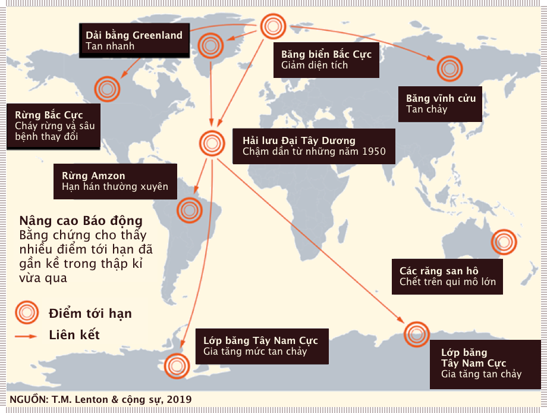
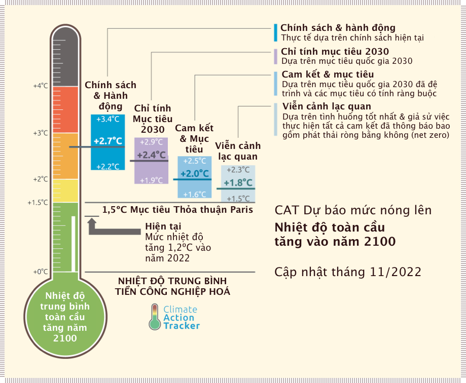

# Tác động và hệ quả 

!!! quote "Giáo sư David King&mdash;Cựu Trưởng cố vấn khoa học của chính phủ Anh"

    Chúng ta cần phải hành động nhanh, những gì chúng ta làm trong vòng ba đến bốn năm tới, tôi tin rằng sẽ quyết định tương lai của con người.

## #1 :traffic_light: › Nóng lên toàn cầu hiện ở mức 1,2°C và tiếp tục tăng nhanh hơn

Tốc độ tăng của nhiệt độ toàn cầu có thể tăng nhanh trong vòng 20-30 năm sắp tới

- Nhiệt độ toàn cầu năm 2020 ấm hơn 1,3°C so với cuối thế kỉ 19.
- Nhiệt độ trung bình toàn cầu trong 5 năm 2016-2020 tăng 1,2°C, theo **NASA**[^1] và **Copernicus**[^2].
- Sự nóng lên toàn cầu gia tăng ở mức ~0,25ºC trong thập kỉ gần nhấp 2011-2020, so với mức gia tăng trung trình 0,18ºC trong vòng 50 năm vừa qua.
- Những mô hình khí hậu hiện tại (**CMIP6**) dự đoán mức tăng trung bình là 0,3ºC trong thập kỉ tới năm 2030 (theo các kịch bản [SSP2-4.5, SSP3-7.0 và SSP5-8.5](https://ourworldindata.org/explorers/ipcc-scenarios?facet=none&country=SSP1+-+Baseline~SSP2+-+Baseline~SSP3+-+Baseline~SSP4+-+Baseline~SSP5+-+Baseline&Metric=Temperature+increase&Rate=Per+capita&Region=Global))[^3].
- Trong 25 năm tới dự kiến nhiệt độ toàn cầu sẽ tăng thêm 0,25-0,35º mỗi thập kỉ[^4]; và đã có những cảnh báo về mức tăng toàn cầu trong vòng 25 năm tới sẽ [nhanh gấp đôi](http://www.columbia.edu/~mhs119/Temperature/Emails/July2021.pdf) so với những gì đã diễn ra trong 50 năm trước đây[^5].

[^1]:

    [Dữ liệu GISS](https://data.giss.nasa.gov/gistemp/tabledata_v4/GLB.Ts+dSST.txt)

[^2]:

    [Nhiệt độ](https://climate.copernicus.eu/climate-indicators/temperature)

[^3]:

    [Báo cáo IPCC lần thứ 6](https://hipcc.ch/report/sixth-assessment-report-working-group-i/) 

[^4]:

    [Nhanh hơn dự đoán](https://nature.com/articles/d41586-018-07586-5)

[^5]:

    [Thoả thuận với quỷ](http://www.columbia.edu/~mhs119/Temperature/Emails/July2021.pdf) (*Faustian Bargain*): Đây là từ chỉ thỏa thuận của Faust, một nhân vật trong truyền thuyết của Đức, người đã đổi linh hồn của mình cho quỷ ('bán linh hồn cho quỷ') để lấy những lợi ích vật chất. Theo đó, *Faustian bargain* cũng chỉ những thỏa thuận đánh đổi các lợi ích cốt lõi dài hạn (thường với đối thủ) để lấy những lợi ích ngắn hạn trước mắt.

## #2 :traffic_light: › IPCC và mô hình khí hậu không lường hết được mọi rủi ro

Hiện đang có một sự đánh giá thấp nghiêm trọng về các tác động của khí hậu tương lai

- Bởi các hạn chế của mô hình, chúng ta [không biết chính xác](https://theconversation.com/we-climate-scientists-wont-know-exactly-how-the-crisis-will-unfold-until-its-too-late-133400) cuộc khủng hoảng khí hậu sẽ diễn ra như thế nào cho đến khi đã quá muộn[^6]. Một ví dụ là việc [không dự báo được](https://www.bbc.com/news/science-environment-57863205) cường độ các hiện tượng lũ lụt và nắng nóng cực độ ở Châu Âu và Bắc Mĩ năm 2021[^7].

- Các mô hình khí hậu hiện tại [không nắm bắt được hết tất cả rủi ro](https://www.theage.com.au/environment/climate-change/how-lucky-do-you-feel-the-awful-risks-buried-in-the-ipcc-report-20210811-p58hut.html)[^8], bao gồm sự [đình trệ của dòng hải lưu Gulf Stream](https://www.nature.com/articles/s41558-021-01097-4.)[^9], [tan băng ở hai cực](https://www.washingtonpost.com/climate-environment/2021/01/25/ice-melt-quickens-greenland-glaciers)[^10] và sự gia tăng các hiện tượng thời tiết cực đoan. Khí carbonic và mê-tan giải phóng từ những lớp băng vĩnh cửu nằm sâu dưới lòng đất [thường không được đưa vào](https://www.cambridge.org/core/journals/global-sustainability/article/ten-new-insights-in-climate-science-2020-a-horizon-scan/02F477AAABBD220523748C654EBD6F15) các mô hình biến đổi khí hậu. [^11]

- Các mô hình khí hậu không tính đến gia tăng nhiệt độ do sự tan băng trên biển Bắc Cực: “Mất khả năng phản xạ của băng biển Bắc Cực sẽ làm [thời gian](https://scripps.ucsd.edu/news/research-highlight-loss-arctics-reflective-sea-ice-will-advance-global-warming-25-years) tiệm cận ngưỡng 2ºC giảm 25 năm”[^12].

- Báo cáo [IPCC](https://vi.wikipedia.org/wiki/%E1%BB%A6y_ban_Li%C3%AAn_ch%C3%ADnh_ph%E1%BB%A7_v%E1%BB%81_Bi%E1%BA%BFn_%C4%91%E1%BB%95i_Kh%C3%AD_h%E1%BA%ADu) (Uỷ ban liên chính phủ về biến đổi khí hậu) năm 2021 đưa ra “ước tính tốt nhất về độ nhạy khi hậu ở mức 3ºC”, nhưng khi bao gồm các yếu tố như [“phản hồi chậm”](https://arxiv.org/abs/0804.1126) (*slow feedback*) (gồm các nguồn hiện đang tích trữ khí carbonic) và sự thay đổi suất phản chiếu (*albedo*) (độ phản xạ&mdash;*reflectivity*), nhiệt độ gia tăng có thể lên mức 5-6ºC khi lượng lượng khí carbonic trong khí quyển tăng gấp đôi so với thời kì tiền công nghiệp. Các trạng thái này tương ứng với dải khí hậu từ băng hà cho đến không có băng ở Nam Cực[^13].

[^6]:

    [Khủng hoảng khí hậu diễn ra thế nào](theconversation.com/we-climate-scientists-wont-know-exactly- how-the-crisis-will-unfold-until-its-too-late-133400)

[^7]:

    [Không dự báo được](https://www.bbc.com/news/science-environment-57863205)

[^8]:

    [Rủi ro trong báo cáo IPCC](https://theage.com.au/environment/climate-change/how-lucky-do-you- feel-the-awful-risks-buried-in-the-ipcc-report-20210811-p58hut.html)

[^9]:

    [Đình trệ dòng hải lưu Gulf Stream](https://www.nature.com/articles/s41558-021-01097-4.)

[^10]:

    [Tan băng ở hai cực](https://www.washingtonpost.com/climate-environment/2021/01/25/ice-melt-quickens-greenland-glaciers)

[^11]:

    [Mô hình biến đổi khí hậu chưa đầy đủ](https://www.cambridge.org/core/journals/global-sustainability/article/ten-new-insights-in-climate-science-2020-a-horizon-scan/02F477AAABBD220523748C654EBD6F15)

[^12]:

    [Thời gian đến ngưỡng 2ºC](https://scripps.ucsd.edu/news/research-highlight-loss-arctics-reflective-sea-ice-will-advance-global-warming-25-years) nhanh hơn với băng tan biển Bắc cực.

[^13]:

    [Phản hồi chậm](https://arxiv.org/abs/0804.1126)

## #3 :traffic_light: › Mức tăng 1,5ºC không phải là mục tiêu an toàn

Các hệ sinh thái thiết yếu bao gồm Rặng san hô lớn (*Great Barrier Reef*) hiện đang phải đối mặt với sự tàn phá khốc liệt khi nhiệt độ nóng lên chưa đến 1,5ºC

- Rặng san hô lớn nằm trong một vòng xoáy tử thần: ở mức độ nóng lên toàn cầu hiện nay, mức độ [tẩy trắng san hô](https://vi.wikipedia.org/wiki/Tẩy_trắng_san_hô) (*coral bleaching*) sẽ diễn ra [mỗi ba đến bốn năm](https://www.nature.com/articles/nclimate3296)[^14], trong khi quá trình phục hồi phải mất hàng thập kỉ hoặc hơn.

- Dải băng Tây Nam Cực (WAIS) đã vượt qua [điểm tới hạn](https://www.theguardian.com/commentisfree/2014/may/17/climate-change-antarctica-glaciers-melting-global-warming-nasa) (*tipping point*)[^15], và Greenland có thể đã [chạm điểm tới hạn](https://phys.org/news/2020-09-greenland-ice-sheet-years.html) 20 năm trước[^16]. Mục tiêu nhiệt độ (1,5ºC) của Thoả thuận Paris (*Paris Agreement*) là đủ[để thúc đẩy sự tan chảy](https://www.sciencedirect.com/science/article/abs/pii/S0277379119306122) của WAIS[^17].

- Nhiều phần của Đông Năm cực cũng có thể [thiếu ổn định](https://www.nature.com/articles/d41586-019-03595-0) tương tực như ở phần phía tây[^18].

- Ba phần tư thể tích băng biển Nam Cực mùa hè đã [bị mất](https://www.nature.com/articles/s41558-020-0860-7)[^19], và cứ [tiếp diễn như vậy](https://www.scientistswarning.org/2021/06/15/arctic-death-spiral/)[^20].

- Một phần tư dải băng tuyết của dãy [Himalaya](https://www.scientistswarning.org/2021/06/15/arctic-death-spiral/) và [Thiên Sơn](https://www.wsj.com/articles/central-asia-mountain-range-has-lost-a-quarter-of-ice-mass-in-50-years-study-says-1439823730) (*Tien Shan*)[^22] đã bị mất.

- Các hệ sinh thái dừng đang dịch chuyển sang [hệ sinh thái không rừng](https://advances.sciencemag.org/content/4/2/eaat2340) ở phái đông, nam, và giữa vùng Amazon[^23].

[^14]: 
    [Tẩy trắng san hô](https://www.nature.com/articles/nclimate3296)

[^15]:
    [Băng Tây Nam Cực (WAIS)](https://www.theguardian.com/commentisfree/2014/may/17/climate-change-antarctica-glaciers-melting-global-warming-nasa)

[^16]:
    [Greenland vượt điểm tới hạn](https://phys.org/news/2020-09-greenland-ice-sheet-years.html)

[^17]:
    [Nhiệt độ đủ để tan WAIS](https://www.sciencedirect.com/science/article/abs/pii/S0277379119306122)

[^17]:
    [Nhiệt độ đủ để tan WAIS](https://www.sciencedirect.com/science/article/abs/pii/S0277379119306122)

[^18]:

    [Băng ở Đông Nam cực](https://www.nature.com/articles/d41586-019-03595-0)

[^19]:

    [Băng biển Nam Cực mùa hè bị mất](https://www.nature.com/articles/s41558-020-0860-7)

[^20]:

    [Tiếp tục tan băng](https://www.scientistswarning.org/2021/06/15/arctic-death-spiral/)

[^21]:

    [Himalaya](https://www.scientistswarning.org/2021/06/15/arctic-death-spiral/)

[^22]:

    [Thiên Sơn](https://www.wsj.com/articles/central-asia-mountain-range-has-lost-a-quarter-of-ice-mass-in-50-years-study-says-1439823730)

[^23]:

    [Hệ sinh thái rừng dịch chuyển](https://advances.sciencemag.org/content/4/2/eaat2340)

## #4 :traffic_light: › Nhiệt độ có thể tăng lên 1,5ºC vào những năm 2030

Không còn ngân sách carbon (*carbon budget*) nào dành cho mục tiêu Paris

- Lượng khí thải tăng, bụi mịn (*aerosols*) (từ ô nhiễm không khí) giảm dần và chu kì khí hậu tự nhiên sẽ [đóng phần làm nóng lên nhanh hơn](https://www.nature.com/articles/d41586-018-07586-5) bầu khí quyển[^24], và [phân tầng đại dương](https://insideclimatenews.org/news/28092020/ocean-stratification-climate-change) (*ocean stratification*) diễn ra mạnh mẽ hơn với tầng nước nóng phía trên[^25].

- Có sự nhất trí cao trong các mô phỏng mô hình hiện tại (CMIP6) rằng [nhiệt độ sẽ tăng quá 1,5ºC](https://www.ipcc.ch/report/sixth-assessment-report-working-group-i/) trong tất cả các kịch bản khả dĩ “trung bình vào khoảng năm 2030”[^26].

- Dự báo này sớm hơn 10 năm so với dự báo của IPCC năm 2018

- Có nhiều khả năng ngân sách carbon cho mục tiêu Paris [đã không còn](https://52a87f3e-7945-4bb1-abbf-9aa66cd4e93e.filesusr.com/ugd/148cb0_999447b69dde477a83b500dde076fbc6.pdf). Nếu các phản hồi của chu trình carbon được tính đến (*carbon-cycle feedback*), “chẳng hạn như các điểm tới hạn trong hệ sinh thái rừng & sự tan biến đột ngột của lớp băng vĩnh cữu, thì [ngân sách ước tính còn lại](https://www.pnas.org/content/118/38/e2115218118) có thể biến mất hoàn toàn”[^28].

- Vào khoảng năm 2030, với nhiệt độ tăng thêm 1,5ºC, với sự nóng lên ở Bắc Cực được khuếch đại gấp 3 lần so với trung bình toàn cầu (4 lần trong [một nghiên cứu gần đây](https://www.scientificamerican.com/article/the-arctic-is-warming-four-times-faster-than-the-rest-of-the-planet/)), rủi ro sẽ tăng lên đáng kể khi các nguồn dự trữ khí carbonic bao gồm [lớp băng vĩnh cửu](https://www.washingtonpost.com/climate-environment/rapid-arctic-meltdown-in-siberia-alarms-scientists/2020/07/03/4c1bd6a6-bbaa-11ea-bdaf-a129f921026f_story.html) (*permafrost*)[^29] và [rừng phương bắc](https://www.nature.com/articles/s41558-021-01027-4)(*boreal forests*)[^30] sẽ bị tổn thất nặng nề, đẩy nhanh [khả năng mất carbon](*carbon loss*) mà [không thể ngăn cản](https://www.nature.com/articles/d41586-019-01313-4)[^31].

[^24]:

    [Ô nhiễm không khí](https://www.nature.com/articles/d41586-018-07586-5)

[^25]:

    [Phân tầng đại dương](https://insideclimatenews.org/news/28092020/ocean-stratification-climate-change)

[^26]:

    [Nhiệt độ tăng quá 1,5ºC](https://www.ipcc.ch/report/sixth-assessment-report-working-group-i/)

[^27]:

    [Ngân sách mục tiêu Paris](https://52a87f3e-7945-4bb1-abbf-9aa66cd4e93e.filesusr.com/ugd/148cb0_999447b69dde477a83b500dde076fbc6.pdf)   

[^28]:
    
    [Ngân sách còn lại](https://www.pnas.org/content/118/38/e2115218118)

[^29]:

    [Lớp băng vĩnh cửu](https://www.washingtonpost.com/climate-environment/rapid-arctic-meltdown-in-siberia-alarms-scientists/2020/07/03/4c1bd6a6-bbaa-11ea-bdaf-a129f921026f_story.html)

[^30]:

    [Rừng phương bắc](https://www.nature.com/articles/s41558-021-01027-4)

[^31]:
    
    [Mất khả năng dự trữ carbon](https://www.nature.com/articles/d41586-019-01313-4)

## #5 :traffic_light: › 2ºC là một cột mốc nguy hiểm, và với lộ trình phát thải hiện tại, có thể xảy ra trước năm 2050 

Với các điểm tới hạn (*tipping points*) đang cận kề, 2ºC là mức tăng dẫn đến thảm hoạ

- Trên lộ trình phát thải cao (**SSP3-7.0** hay **SSP5-8.5**), nhiệt độ sẽ tăng [chạm ngưỡng 2ºC trước năm 2050](https://www.ipcc.ch/report/sixth-assessment-report-working-group-i/), và trung bình là vào năm 2043[^32].

- Các điểm tới hạn tiếp theo có thể được kích hoạt ở mức tăng nhiệt độ còn thấp hơn: một loạt [các thay đổi đột ngột](https://www.nature.com/articles/d41586-019-03595-0) có thể diễn ra trong khoảng nhiệt độ tăng từ 1,5ºC đến 2ºC[^33].

- Chúng bao gồm [Dải băng (*Ice Sheet*) Greenland](https://www.nature.com/articles/d41586-019-03595-0), vốn đã gần với điểm tới hạn[^34], với [ước tính trước đây](https://www.nature.com/articles/nclimate1449) ở mức 1,6ºC nhiệt độ tăng; và [rừng nhiệt đới Amazon](https://www.theguardian.com/environment/2020/oct/05/amazon-near-tipping-point-of-switching-from-rainforest-to-savannah-study)[^36].

- Sẽ là mà sai lầm nếu nghĩ rằng chúng ta có thể [“đỗ” Hệ thống Trái đất](https://www.theguardian.com/environment/planet-oz/2018/oct/06/earths-climate-monsters-could-be-unleashed-as-temperatures-rise) ở bất kì mức nhiệt độ tăng nào&mdash;ví dụ 2ºC&mdash;và kì vọng rằng nhiệt độ sẽ dừng tại đó[^37]. 2ºC có thể không phải là điểm cân bằng của hệ thống.

- Cựu giám đốc khí hậu của **NASA** Giáo sư James Hansen đã nói: “cộng đồng khoa học hiểu rõ” rằng mục tiêu giới hạn sự nóng lên toàn cầu do con người gây ra ở mức [2ºC là “liều thuốc cho thảm hoạ”](https://www.theguardian.com/environment/planet-oz/2018/oct/06/earths-climate-monsters-could-be-unleashed-as-temperatures-rise)[^38].  

[^32]:

    [Chạm ngưỡng 2ºC](https://www.ipcc.ch/report/sixth-assessment-report-working-group-i/)

[^33]:

    [Thay đổi đột ngột](https://www.nature.com/articles/d41586-019-03595-0)

[^34]:

    [Điểm tới hạn Greenland](https://www.nature.com/articles/d41586-019-03595-0)

[^35]:

    [Mức nhiệt độ tới hạn](https://www.nature.com/articles/nclimate1449)

[^36]:

    [Điểm tới hạn rừng Amazon](https://www.theguardian.com/environment/2020/oct/05/amazon-near-tipping-point-of-switching-from-rainforest-to-savannah-study)

[^37]:

    [Dừng ở mức nhiệt độ nào](https://www.theguardian.com/environment/planet-oz/2018/oct/06/earths-climate-monsters-could-be-unleashed-as-temperatures-rise)

[^38]:

    [Liều thuốc cho thảm họa ở mức tăng 2ºC](https://www.theguardian.com/environment/planet-oz/2018/oct/06/earths-climate-monsters-could-be-unleashed-as-temperatures-rise)

!!! quote "Vanessa Nakate&mdash;Nhà hoạt động biến đổi khí hậu người Uganda"

    Có một điều mà tôi hầu như không bao giờ nghe các nhà lãnh đạo nhắc tới, đó là **mất mát và thiệt hại** (*loss and damage*) (đối với các nước nghèo&mdash;những nước gánh chịu thiệt hại nặng nề nhất do biến đổi khí hậu gây ra&mdash;Người dịch). Đối với nhiều người trong chúng tôi, các biện pháp giảm thiểu và phòng tránh là không đủ... Người ta không thể thích nghi với sự tuyệt chủng.

## #6 :traffic_light: › Không còn ngân sách carbon cho mức tăng 2ºC với rủi ro vượt ngưỡng này thấp.

Nhiệt độ tăng cao do khí nhà kính đã sẵn có trong bầu khí quyển

- **Mất cân bằng năng lượng Trái đất** (EEI) là sự mất cân bằng bức xạ ở phần trên khí quyển (lớp giữa sự vào ra của bức xạ), làm nóng lên toàn cầu. Trái đất đang giữ lại [nhiều nhiệt lượng gấp đôi](https://www.nasa.gov/feature/langley/joint-nasa-noaa-study-finds-earths-energy-imbalance-has-doubled) so với năm 2025[^39].

- Năm 2018 EEI vào cỡ 0,6-0,75ºC[^40]. Thêm vào mức hiện tại 1,2ºC, nhiệt độ sẽ tăng đến 1,8-1,95ºC với nồng độ khí nhà kính như ở mức hiện tại.

- Nhưng khí thải sẽ không giảm xuống không trong nay mai, và 0,3ºC được kì vọng sẽ thêm vào trong thập kỉ tiếp theo, bất kể mức độ phát thải đến năm 2030 như thế nào.

- Nếu sử dụng một cách tiếp cận quản lí rủi ro thận trọng&mdash;chú trọng vào thiệt hại lớn nhất dù khả năng xảy ra nhỏ thay vì các khả năng xảy ra ở mức trung bình&mdash;thì sẽ không có ngân sách carbon cho mục tiêu 2ºC[^41].

[^39]:

    [Mât cân bằng năng lượng](https://www.nasa.gov/feature/langley/joint-nasa-noaa-study-finds-earths-energy-imbalance-has-doubled)

[^40]:

    [EEI](https://www.nasa.gov/feature/langley/joint-nasa-noaa-study-finds-earths-energy-imbalance-has-doubled)

[^41]:

    [Ngân sách carbon](https://52a87f3e-7945-4bb1-abbf-9aa66cd4e93e.filesusr.com/ugd/148cb0_999447b69dde477a83b500dde076fbc6.pdf)

## #7 :traffic_light: › Hàng loạt các điểm tới hạn đang gần kề

Một vài điểm tới hạn (*tipping points*) đã bị vượt qua, trong khi một số khác đang rất gần

- Điểm tới hạn là một ngưỡng mà khi vượt qua, những thay đổi lớn bất thường sẽ xảy ra; phản hồi xuôi (*positive feedback*) là vòng lặp tự gia tăng (*self-reinforce*) làm cho sự thay đổi diễn ra nhanh hơn nữa.

- Các điểm tới hạn lớn được tương hỗ với nhau (*interrelated*) và có thể sẽ [diễn ra hàng loạt](https://e360.yale.edu/features/as-climate-changes-worsens-a-cascade-of-tipping-points-looms) (*cascade*)[^42] như được minh hoạ trong hình dưới đây.

Sự tương tác giữa các hệ thống khí hậu này có thể làm giảm ngưỡng nhiệt độ tới hạn (*critical temperature threshold*) mà ở đó các điểm tới hạn có thể bị vượt qua[^43].

Nhiệt độ nước đại dương có thể làm [giảm độ sáng](https://phys.org/news/2021-09-earth-dimming-due-climate.html) (*brightness*) của Trái đất trong vòng hai thập kỉ vừa qua; từ đó, ít nhiệt hơn được phản xạ và hấp thụ. Hiệu ứng này tương đương với mức nhiệt độ tăng thêm 0,3ºC[^44].

Trái đất đang tiệm cận với khoảng nhiệt độ vượt quá ngưỡng mà ở đó tốc độ quang hợp (*photosynthesis*) sẽ bị giảm và khả năng dự trữ carbon của sinh quyển trên mặt đất (*terrestial bioshpere*) (hay “dự trữ trên đất” (*land sink*)) suy giảm. Điểm tới hạn sẽ được vượt qua [trong vòng 20-30 năm tới](https://advances.sciencemag.org/content/7/3/eaay1052.full) và, nằm trên quỹ đạo của dự kiến của mức phát thải cao (*high emission trajectory*), giảm gần một nửa khả năng dự trữ trên đất sẽ đạt tới sớm năm 2040[^45]. 

[^42]:

    [Diễn ra hàng loạt điểm tới hạn](https://e360.yale.edu/features/as-climate-changes-worsens-a-cascade-of-tipping-points-looms)

[^43]:

    [Ngưỡng nhiệt độ tới hạn](https://www.nature.com/articles/s41893-019-0454-4)

[^44]:

    [Giảm độ sáng Trái đất](https://phys.org/news/2021-09-earth-dimming-due-climate.html)

[^45]:

    [Điểm tới hạn đến sớm](https://advances.sciencemag.org/content/7/3/eaay1052.full)

## #8 :traffic_light: › 2ºC có thể kích hoạt kịch bản “Nhà kính Trái đất”

Chúng ta đang rất gần với sự thay đổi khí hậu nghiêm trọng có thể vượt ra khỏi tầm kiểm soát

- Kịch bản [“Nhà kính Trái đất”](https://www.pnas.org/content/115/33/8252) (*Hothouse Earth*) mà ở đó các phản hồi hệ thống trái đất và sự tương tác tương hỗ đã đẩy Hệ thống trái đất đến điểm không thể quay trở lại (*point of no return*), theo đó sự ấm lên trở thành một quá trình tự duy trì (*self-sustaining*) (nghĩa là không cần con người can thiệp thêm nữa)[^46].

- Các ngưỡng tới hạn của hành tinh (*planetary threshold*) có thể tồn tại ở mức nhiệt độ tăng chỉ 2ºC, hay [thậm chí có thể trong phạm vi 1,5ºC-2ºC](https://www.pnas.org/content/115/33/8252)[^47]. 

- Trong sự tương tác vật lí giữa Greenland và tảng băng Tây Nam Cực, sự lưu thông Đại Tây Dương (*Atlantic Meridional Overtuning Circulation*) và rừng nhiệt đới Amazon, lớp phủ băng ở cực thường là [các tác nhân](https://esd.copernicus.org/articles/12/601/2021/) gây ra hiện tượng sụp đổ hàng loạt (*cascade events*)[^48], với Greenland và Tây Nam Cực chịu rủi ro vượt quá điểm tới hạn chỉ trong khoảng tăng 1,5ºC-2ºC (và có những bằng chứng là điểu này đã xảy ra).

- Tương tự, Giáo sự James Hansen đã cảnh báo năm 2017 răng: “Khí thải nhà kính trong thời gian gần đây đã đặt Trái đất và bối cảnh [rất gần với thay đổi khí hậu nghiệm trọng](https://royalsocietypublishing.org/doi/abs/10.1098/rsta.2007.2052), có thể ngoài tầm kiểm soát chúng ta”.

[^46]:
    [Nhà kính Trái Đất](https://www.pnas.org/content/115/33/8252)

[^47]:

    [Ngưỡng tới hạn](https://www.pnas.org/content/115/33/8252)

[^48]:

    [Các hiện tượng sụp đổ](https://esd.copernicus.org/articles/12/601/2021/)

[^49]:

    [Thay đổi nghiêm trọng](https://royalsocietypublishing.org/doi/abs/10.1098/rsta.2007.2052)

## #9 :traffic_light: › Nhiệt độ tăng 3ºC sẽ là thảm hoạ

Sinh kế của một tỉ người có thể bị phá hủy và ảnh hưởng nghiêm trọng.

- Trừ phi phát thải khí nhà kích được giảm đáng kể trong thập kỉ này, sản lượng lương thực có thể giảm 30% vào năm 2050, trong khi nhu cầu thực phẩm sẽ cao hơn 50%. Tỉ lệ trung bình của đất trồng trọt toàn cầu sẽ bị ảnh hưởng bởi hạn hán nghiêm trọng (*giảm hơn 50% năng suất*) sẽ tăng lên 32%.

- Ở mức tăng nhiệt độ 3ºC, sản xuất thực phẩm sẽ khôhng đủ để nuôi sống dân số do năng suất trung bình cây trồng giảm 20%, hàm lượng dinh dưỡng trong lương thực giảm, quần thể côn trùng sụp giảm nghiêm trọng, sa mạc hoá, mất mùa và sự thiếu nước thường xuyên.

- 3ºC sẽ là [thảnm hoạ cho sinh kế của thế giới](https://www.pnas.org/content/114/39/10315) đối với 3 tỉ người nghèo nhất, bao gồm hầu hết người nông dân, mà sinh kế sẽ bị ảnh hưởng nặng nề, nếu không muốn nói là bị huỷ hoại, với siêu hạn hán (*megadrought*), sóng nhiệt(*heat waves*) và lũ lụt lớn (*heavy floods*) mỗi một đến năm năm.

[^52]:

    [Thảm hoạ ở 3ºC](https://www.pnas.org/content/114/39/10315)

## #10 :traffic_light: › Thế giới đang trên quĩ đạo nóng lên từ 2 đến 3,6ºC vào năm 2100

Chúng ta đang tiến dần tới mức nhiệt độ không tương thích với sự tổ chức cộng đồng toàn cầu của con người 

- Nhiệt độ toàn cầu đang trên đà tiến tới mức tăng nhiệt độ 2-3,6ºC vào năm 2100 với các chính sách cam kết hiện tại của chính phủ ([xem hình dưới](https://climateactiontracker.org/global/cat-thermometer/))

- Giáo sự Kevin Anderson nói rằng “Một tương lai 4ºC không tương thích với một cộng đồng toàn cầu có tổ chức tính của con người, có thể sẽ vượt quá khả năng [“thích nghi”](https://grist.org/climate-change/2011-12-05-the-brutal-logic-of-climate-change/) (*adaptation*), sẽ tàn phá phần lớn hệ sinh thái và có nhiều khả năng sẽ không ổn định (*stable*)”[^53].

- Giáo sự Johan Rockström nói rằng ở 4ºC: “Thật khó để hình dung chúng ta sẽ thích nghi cho 8 tỉ người, thậm chí [chỉ một nửa trong số đó](https://www.theguardian.com/environment/2019/may/18/climate-crisis-heat-is-on-global-heating-four-degrees-2100-change-way-we-live)”[^54].

- Nhiệt độ tăng vẫn đi theo quĩ đạo RCP8.5, và quĩ đạo này là [đường phù hợp nhất](https://www.pnas.org/content/117/33/19656) cho đến giữa thế kỉ này theo chính sách hiện tại cũng như đã cam kết[^55].

[^53]:

    [Thích nghi trong tương lai](https://grist.org/climate-change/2011-12-05-the-brutal-logic-of-climate-change/)

[^54]:
    [Thích nghi cho dân số](https://www.theguardian.com/environment/2019/may/18/climate-crisis-heat-is-on-global-heating-four-degrees-2100-change-way-we-live)

## #11 :traffic_light: › Mực nước biển có thể dâng cao hàng chục mét

Mức khí nhà kính hiện tại có thể làm mực nước biển dâng lên 25 mét.

- Mực nước biển sẽ tiếp tục dâng lên trong nhiều thế kỉ tới, ngay cả khi con người ngừng phát thải khí nhà kính, do giai đoạn băng tan kéo dài lâu, do quán tính nhiệt (*thermal inertia*).

- Các cơ quan Chính phủ Hoa Kì đã lên [kịch bản nước biển dâng “cao”](https://pubs.giss.nasa.gov/abs/sw01000b.html) vào năm 2100[^56].

- Mực nước biển rốt cuộc sẽ dâng hàng chục mét: “Ngay cả khi chúng ta dừng phát thải khí CO_2 ngay hôm nay, và ổn định mức độ phát thải, thì mực nước biển cuối cùng cũng [dâng lên 25 mét](https://www.sciencedaily.com/releases/2009/06/090622103833.htm)”[^57].

- Trong kỉ Pliocene (thời kỳ cuối của kỷ thứ ba trong lịch sử trái đất (khi nhiều động vật có vú hiện đại xuất hiện) 3-5 triệu năm trước, khi mức độ CO_2 tương tự như hôm nay, nhiệt độ lúc đó cao hơn mức tiền công nghiệp 2-4ºC và [mực nước biển cao hơn 20-25 mét](https://www.pnas.org/content/115/52/13288)[^58].

- “Vào thời điểm đó, [chỉ báo](https://www.theguardian.com/science/2019/apr/03/south-pole-tree-fossils-indicate-impact-of-climate-change) cho biết “Greenland không còn lớp phủ băng, không có băng ở Tây Nam Cực và một phần lớn Đông Nam Cực đã cũng không còn”[^59].

[^56]:

    [Kịch bản nước biển dâng cao](https://pubs.giss.nasa.gov/abs/sw01000b.html)
[^57]:

    [Quán tính nhiệt](https://www.sciencedaily.com/releases/2009/06/090622103833.htm))

[^58]:

    [Mực nước biển dâng](https://www.pnas.org/content/115/52/13288)

[^59]:

    [Greenland không có băng](https://www.theguardian.com/science/2019/apr/03/south-pole-tree-fossils-indicate-impact-of-climate-change)

## #12 :traffic_light: › Chỉ riêng việc giảm khí thải sẽ không có tác động đáng kể đến xu hướng nhiệt độ trong vòng hai thập kỉ tới 

Khi việc sử dụng nhiên liệu hoá thạch giảm, lượng bụi min (*aerosol*) cũng giảm theo, bù trừ cho sự nóng lên.

- Sản phẩm phụ của quá trình đốt nhiên liệu hoá thạch là bụi sulfate, vốn có [hiệu ứng làm giảm nhiệt mạnh](https://agupubs.onlinelibrary.wiley.com/doi/full/10.1002/2017GL076079) khoảng 0,5-1ºC, nhưng tồn tại thời gian ngắn trong khí quyển. Cho đến nay, bụi mịn này đã “che giấu”(*masking*) một phần của sự ấm lên toàn cầu[^60].

- Giảm sử dụng than và các chính sách làm sạch không khí đã làm giảm hiệu ứng của bụi min. Đó là [“Thoả thuận với quỷ”](https://www.researchgate.net/publication/258310238_Climate_forcing_growth_rates_Doubling_down_on_our_Faustian_bargain) khi việc sử dụng nhiên liệu hoá thạch giảm, kéo theo đó hiệu ứng giảm nhiệt của bụi mịn. Do đó, trong hai thập kỉ tiếp theo, việc giảm phát thải khí nhà kính sẽ ít có ảnh hưởng đến xu hướng nóng lên. 

- Mức giảm phát thải 5% của một loại khí nhà kính, từ năm 2020 và dựa trên dự báo mức phát thải trung bình, [không có ảnh hưởng đáng kể nào](http://www.nature.com/articles/s41467-020-17001-1) vào xu hướng nóng lên trong vòng hai thập kỉ tới, nếu so sánh với việc không giảm phát thải (xem bảng dưới)[^62].

| Khí nhà kính  |  Năm |
|:-------------:|:----:|
| Carbon dioxit | 2044 |
|     Mê-tan    | 2055 |
|  Nitơ đioxit  | 2079 |
|   Carbon đen  | 2048 |
| Carbon hữu cơ | 2064 |

- Tuy nhiên, việc cắt giảm mạnh nhanh chóng khí thải nhà kính là thiết yếu để tốc độ tăng nhiệt giảm dần.

[^60]:

    [Hiệu ứng làm lạnh](https://agupubs.onlinelibrary.wiley.com/doi/full/10.1002/2017GL076079)

[^61]:

    [Thoả thuận với quỷ](https://www.researchgate.net/publication/258310238_Climate_forcing_growth_rates_Doubling_down_on_our_Faustian_bargain), xem thêm chú thích 5

[^62]:

    [Không ảnh hưởng xu hướng nhiệt độ](http://www.nature.com/articles/s41467-020-17001-1)

