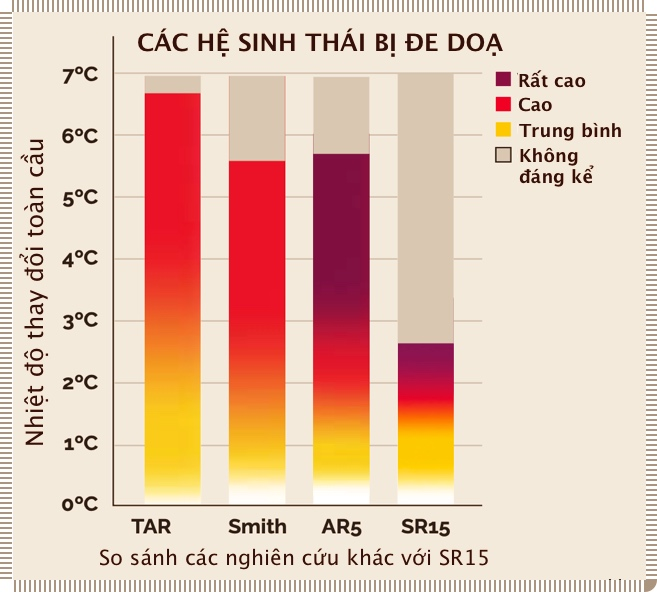

# Các rủi ro lớn&mdash;Hiểu rõ tính cấp bách 

!!! quote "Giáo sư Johan Rockström&mdash;Giám đốc Viện nghiên cứu tác động khí hậu Potsdam"

    Nếu để nhiệt độ tăng quá 2ºC, rất có thể chúng ta đã gây ra quá nhiều **điểm tới hạn** (*tipping points*) đến mức một độ nữa có thể tăng thêm chỉ thông qua các **thay đổi tự củng cố** (*self-reinforcing changes*)...Vào thời điểm mà hệ thống Trái đất chuyển từ việc **tự làm mát** (self-cooling)&mdash;vốn vẫn đang diễn ra&mdash;sang **tự làm nóng** (self-warming), đó là lúc chúng ta mất kiểm soát. 

## #13 :traffic_light: › Các rủi ro mang tính quyết định đến sự sinh tồn 

!!! quote ""

    **Chúng ta đang trong tình trạng khẩn toàn cầu: hiểu được rủi ro và tính cấp bách là rất hệ trọng**

- Vào năm 2019, các nhà khoa học đã đưa ra một [công thức về sự khẩn cấp của khí hậu](https://www.nature.com/articles/d41586-019-03595-0)[^63]. Nói chung, rủi ro được coi là thiệt hại tiềm ẩn nhân với xác suất, nhưng trong công thức này, một yếu tố khác được thêm vào, được gọi là tính cấp bách (*urgency*). Đây là mối quan hệ giữa 
    - Thời gian phản ứng (𝜏) (thời gian cần để giải quyết một vấn đề); và
    - Thời gian can thiệp (T) (thời gian thực tế chúng ta có trước khi “quá muộn”).

    
    

    - Hãy nghĩ đến ví dụ con tàu Titanic:“Nếu thời gian phản ứng dài hơn thời gian can thiệp” (𝜏/T > 1), [chúng ta sẽ mất kiểm soát](https://www.nature.com/articles/d41586-019-03595-0)[^64]”.
    - “Bằng chứng về các điểm tới hạn gợi ý rằng [chúng ta đang ở trong tình trạng khẩn toàn cầu](https://www.nature.com/articles/d41586-019-03595-0): cả rủi ro và tính cấp bách đều rất hệ trọng... Nếu các điểm tới hạn xảy ra liên hoàn và bản thân các điểm tới hạn này là không thể tránh khỏi, thì đó là một mối đe doạ mang tính sinh tồn đối với nền văn minh con người”[^65].

[^63]:

    [Công thức khẩn cấp](https://www.nature.com/articles/d41586-019-03595-0)

[^64]:

    [Mất kiểm soát](https://www.nature.com/articles/d41586-019-03595-0)

[^65]:

    [Điểm bùng phát](https://www.nature.com/articles/d41586-019-03595-0)

## #14 :traffic_light: › Những rủi ro cũng mang tính sống còn với thiên nhiên

!!! quote ""

    **Chúng ta hiện đang bước vào cuộc đại tuyệt chủng lần thứ sáu trong lịch sử Trái đất**

- Tốc độ của sự thay đổi là rất quan trọng. Nhiều hệ sinh thái (Bắc cực, san hô hay cận nhiệt đới khô) đã không thích ứng được với nền nhiệt tăng 1ºC trong một thế kỉ (0,1ºC/thập kỉ).
- Nóng lên toàn cầu trong thập kỉ 2010-2019 là 0,25ºC, được dự bán sẽ tăng nhanh hơn trong 2-3 thập kỉ tới (**#1**)
- Chúng ta đang bước vào [cuộc đại tuyệt chủng lần thức 6](https://advances.sciencemag.org/content/1/5/e1400253)[^66].
- Với nhiệt độ tăng ở mức 3,5ºC vào năm 2100 (tốc độ tăng 0,3ºC/thập kỉ), [chỉ có 30% tất cả các hệ sinh thái bị ảnh hưởng có thể thích nghi được và chỉ 17% rừng bị ảnh hưởng có thể thích ứng](https://www.sciencedirect.com/science/article/abs/pii/S0959378004000391)[^67]. Các loài cây phổ biến không thể thích nghi một cách tự nhiên bằng cách dịch chuyển lên vùng cực khi nhiệt độ tăng >2ºC/thế kỉ.
- Vùng màu đỏ sậm trong hình phía dưới (Báo cáo đặc biệt SR15 năm 2018 của IPCC) cho thấy mức “rủi ro rất cao” với khả năng thích nghi rất giới hạn của hệ sinh thái ở ngưỡng nhiệt độ tăng 2ºC.
    

    
    <!--  -->
    

[^66]:
     
    [Đại tuyệt chủng](https://advances.sciencemag.org/content/1/5/e1400253)

[^67]:

    [Thích nghi](https://www.sciencedirect.com/science/article/abs/pii/S0959378004000391)

## #15 :traffic_light: › Quản lí rủi ro hợp lí đòi hỏi phải đặc biệt chú ý đến các khả năng gây hậu quả nghiêm trọng

!!! quote ""

    **Hành động mang tính phòng ngừa là thiết yếu để ngăn chăn các hệ quả trầm trọng nhất.**

- Tình huống khẩn cấp sẽ diễn ra nếu thế giới [tiến gần hơn đến việc xảy ra liên hoàn các điểm bùng phát (*tipping points*)](https://www.nature.com/articles/d41586-019-03595-0) trên qui mô toàn cầu dẫn tới trạng thái khí hậu “nhà kính”: “Các hiệu ứng liên hoàn sẽ trở nên thường xuyên... chúng ta có thể quan sát được nhiều ví dụ”[^68]. 
- Biến đổi khí hậu là [rủi ro mang tính sống còn](https://www.breakthroughonline.org.au/whatliesbeneath) đối với văn minh loài người (xã hội đương thời)[^69].
- Điều này đòi hỏi sự phòng ngừa đặc biệt vượt xa những phương pháp quản lí rủi ro thông thường nếu muốn đối phó với các sự kiện ít khả năng xảy ra nhưng hậu quả lại khôn lường (*“fat tail” high end risk*).
- Việc tính toán các xác suất không có ý nghĩa gì trong những trường hợp sống còn (văn minh loài người sụp đổ). Thay vào đó, chúng ta nên xác định và tập trung vào các tác động khí hậu nghiêm trọng nhất dù nguy cơ xảy ra thấp.[^70].
- Và sau đó thực hiện những hành động phòng ngừa để ngăn chặn chúng xảy ra.

[^68]:

    [Điểm bùng phát diễn ra liên hoàn](https://www.nature.com/articles/d41586-019-03595-0)

[^69]:

    [Rủi ro mang tính sống còn](https://www.breakthroughonline.org.au/whatliesbeneath)

[^70]:

    [Tập trung vào tác động lớn nhất](https://www.breakthroughonline.org.au/whatliesbeneath)