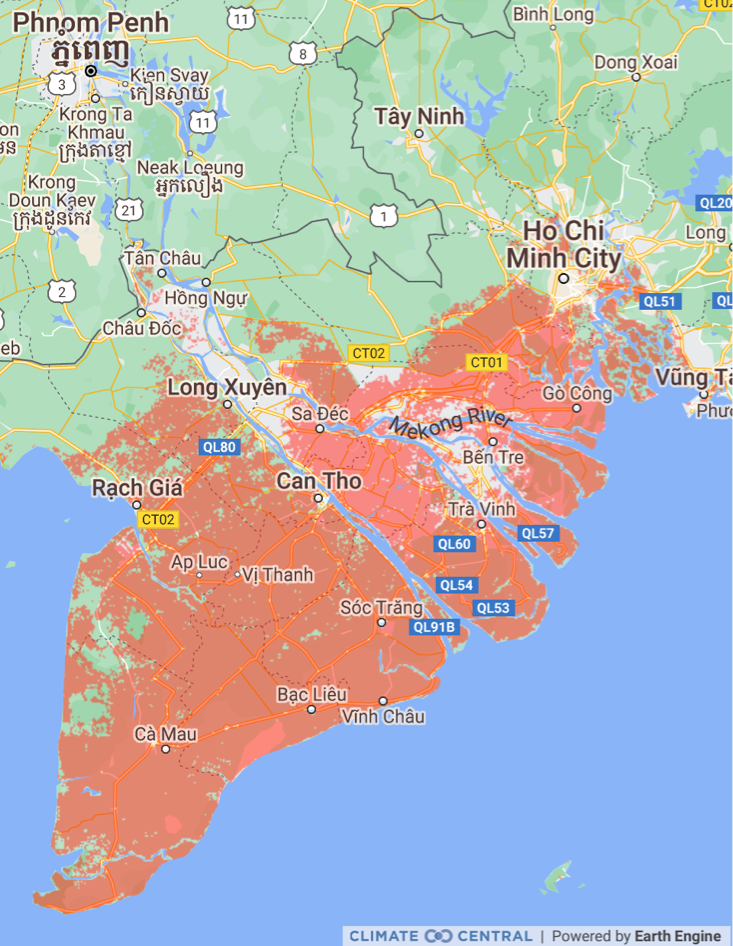

# Báo cáo Quốc gia về Khí hậu và Phát triển

 

 
 

## Dung hòa phát triển kinh tế với rủi ro khí hậu

!!! quote ""

    **Từ vị thế là một trong những quốc gia nghèo nhất thế giới vươn lên thành một thị trường mới nổi năng động, Việt Nam phải đối mặt với những rủi ro ngày một nghiêm trọng từ biến đổi khí hậu, đe dọa mục tiêu trở thành nền kinh tế có thu nhập cao vào năm 2045.**

100 triệu người dân Việt Nam nằm trong nhóm đối tượng dễ bị tổn thương nhất trên thế giới trước sự tàn phá của biến đổi khí hậu, đối mặt với những hiểm họa đặc biệt là dọc theo các vùng trũng ven biển và đồng bằng ven sông rộng lớn của đất nước do mực nước biển dâng cao, bão và lũ lụt.

Biến đổi khí hậu không chỉ đặt ra thách thức ngày càng nghiêm trọng đối với ngành nông, lâm, ngư nghiệp của Việt Nam mà còn làm giảm khả năng cạnh tranh xuất khẩu của quốc gia trên trường quốc tế trong cả công nghiệp chế biến, chế tạo và nông nghiệp.

Tốc độ tăng trưởng kinh tế, đô thị hóa và công nghiệp hóa nhanh của đất nước đã dựa vào năng lượng sản xuất từ than đá, một nguồn năng lượng ra lượng phát thải khí nhà kính (KNK) đáng kể. Tuy không đóng góp nhiều vào khí nhà kính (KNK) toàn cầu với tỷ trọng chỉ 0,8% lượng phát thải của thế giới nhưng chỉ trong hai thập kỷ qua Việt Nam đã nổi lên là một trong những quốc gia có lượng phát thải KNK bình quân đầu người tăng nhanh nhất trên thế giới. Trong giai đoạn 2000 - 2015, khi tổng sản phẩm quốc nội (GDP) bình quân đầu người tăng từ 390 USD lên 2.000 USD thì lượng khí thải carbon dioxide (CO~2~) cũng tăng gần gấp bốn lần. Hơn nữa, phát thải KNK của Việt Nam gắn liền với tình trạng ô nhiễm không khí có hại cho sức khỏe con người và năng suất lao động đang hoành hành tại nhiều thành phố, đặc biệt là Hà Nội.

Để đối phó với những xu hướng này, Việt Nam cần áp dụng mô hình phát triển mới dựa trên hai lộ trình&mdash;thích ứng với biến đổi khí hậu và xây dựng khả năng chống chịu, và giảm thiểu biến đổi khí hậu bằng cách khử carbon trong quá trình tăng trưởng bằng cách cắt giảm lượng phát thải và hướng nền kinh tế theo hướng giảm dần các nguồn năng lượng thâm dụng carbon. Nếu được thiết kế hiệu quả thì hai lộ trình này không chỉ giúp đất nước đạt được các mục tiêu về khí hậu mà còn thúc đẩy GDP bình quân đầu người tăng hơn 5% một năm&mdash;tỷ lệ trung bình cần thiết để trở thành quốc gia có thu nhập cao vào năm 2045.

Tuy nhiên thành quả tích cực như vậy không phải dễ dàng đạt được ngay. Dự kiến cần đầu tư khoảng 368 tỷ USD (tính theo giá trị hiện tại ròng) trong giai đoạn 2022-2040 vào cơ sở hạ tầng, công nghệ mới và các chương trình xã hội để đảm bảo “chuyển dịch công bằng” hướng tới nền kinh tế phát thải ròng bằng “0” và có khả năng chống chịu với khí hậu. Ước tính này tính theo giá trị hiện tại bằng cách sử dụng tỷ lệ chiết khấu là 6% theo hướng dẫn của Ngân hàng Thế giới về phân tích kinh tế. Tỷ lệ chiết khấu xã hội thường được sử dụng để xác định giá trị hiện tại cho chi phí và lợi ích sẽ xảy ra sau này. Trong bối cảnh hoạch định chính sách về biến đổi khí hậu, chúng được coi là rất quan trọng để tính toán xem xã hội ngày nay cần đầu tư bao nhiêu để hạn chế tác động của biến đổi khí hậu trong tương lai. Đi kèm các khoản đầu tư còn cần xây dựng kế hoạch cải cách cơ cấu và chính sách, bao gồm các công cụ định giá carbon và các phương án cải cách thể chế khác để khuyến khích thay đổi hành vi trong khu vực nhà nước và khu vực tư nhân.

## Trả giá đắt nếu hành động quá ít quá muộn

Nếu không thích ứng nhanh chóng và đưa ra biện pháp giảm thiểu rủi ro thiên tai thì nền kinh tế Việt Nam cũng như các nhóm dân cư dễ bị tổn thương nhất sẽ phải hứng chịu thiệt hại nặng nề. Tính dễ bị tổn thương của các cộng động nghèo với biến đổi khí hậu có thể đẩy tới một triệu người vào cảnh nghèo cùng cực vào năm 2030.

Hai mô hình dự báo chỉ ra tổng thiệt hại kinh tế liên quan đến biến đổi khí hậu có thể chiếm 12–14,5% GDP mỗi năm vào năm 2050, đặt gánh nặng lớn lên cả tài chính công và tư (**Hình 1**).

Thiệt hại sẽ khác nhau giữa các vùng:

- Ở miền Bắc, nhiệt độ tăng cao có thể làm giảm năng suất do căng thẳng nhiệt và giảm tuổi thọ sinh trưởng của cây trồng, với tình trạng thiếu nước nghiêm trọng làm giảm sản lượng hàng năm.
- Ở miền Trung, các khu vực và thành phố ven biển sẽ phải hứng chịu ngày càng nhiều lũ lụt do bão nhiệt đới.
- Ở miền Nam, khu vực Đồng bằng sông Cửu Long rộng lớn - vựa lúa, trái cây và cá của cả nước - sẽ phải chịu nhiều rủi ro do mực nước biển dâng cao. Gần một nửa vùng đồng bằng sẽ bị ngập nếu mực nước biển dâng cao 75-100 cm trên mức trung bình trong giai đoạn 1980–1999, đe dọa thiệt hại kinh tế do độ mặn gia tăng và không thể sản xuất một số loại cây trồng (**Hộp 1** và **Hình 2**).

!!! quote ""

    **Hình 1**: Nếu không hành động, thiệt hại kinh tế do biến đổi khí hậu có thể lên đến 14,5% GDP vào năm 2050

!!! note "Hộp 1: Tầm quan trọng của Đồng bằng Sông Cửu Long"

    Đồng bằng sông Cửu Long đóng góp về kinh tế:

    - **1/3** GDP nông nghiệp Việt Nam
    - **50%** hoạt động sản xuất lúa gạo 
    - **90%** sản lượng gạo xuất khẩu   
    - **65%** hoạt động nuôi trồng thủy sản 
    - **60%** sản lượng cá xuất khẩu 
    - **70%** sản lượng trái cây xuất khẩu

!!! quote ""

    **Hình 2**: Ngập nước. Dự đoán đất ngập nước lúc thủy triều lên ở vùng Đồng bằng Sông Cửu Long năm 2050. Theo ước tính của [Climate Central](https://coastal.climatecentral.org/map/8/106.5786/10.2772/?theme=sea_level_rise&map_type=year&basemap=roadmap&contiguous=true&elevation_model=best_available&forecast_year=2050&pathway=ssp3rcp70&percentile=p50&return_level=return_level_1&rl_model=gtsr&slr_model=ipcc_2021_med)

Đồng thời, phát thải khí nhà kính tăng cao sẽ làm **tăng ô nhiễm không khí**, ảnh hưởng tiêu cực đến sức khỏe người dân và năng suất lao động.

**Lượng phát thải gia tăng sẽ ảnh hưởng đến hai nguồn lực chính thúc đẩy tăng trưởng kinh tế Việt Nam là sản xuất gạo và xuất khẩu các mặt hàng chế biến, chế tạo**. Lượng phát thải carbon cao từ hai lĩnh vực này sẽ làm giảm năng lực cạnh tranh trên thị trường quốc tế (**Hình 3**). Các thị trường nhập khẩu chính như Liên minh châu Âu đang cân nhắc đánh thuế carbon tại biên giới của họ. Đầu tư trực tiếp nước ngoài cũng có thể bị ảnh hưởng. Nhiều công ty đa quốc gia, bao gồm một số công ty hoạt động tại Việt Nam, đã cam kết khử carbon trong những năm tới và đó là dấu hiệu của xu hướng trong tương lai.

!!! quote ""

    **Hình 3**: Cường độ carbon[^1] của sản xuất xuất khẩu tại Việt Nam nhiều hơn gấp hai lần của Trung Quốc

[^1]:

    Cường độ phát thải (cũng là cường độ carbon hoặc C.I.) là tốc độ phát thải của một chất gây ô nhiễm nhất định so với cường độ của một hoạt động cụ thể hoặc một quy trình sản xuất công nghiệp; ví dụ như gam carbon dioxide được giải phóng trên mỗi megajoule năng lượng được sản xuất hoặc tỷ lệ phát thải khí nhà kính được tạo ra trên tổng sản phẩm quốc nội (GDP).

## Phát triển nền kinh tế carbon thấp, có khả năng chống chịu với khí hậu

**Sau hơn hai thập kỷ tăng trưởng ổn định, Việt Nam đặt ra mục tiêu đầy tham vọng là trở thành quốc gia thu nhập cao vào năm 2045**. Để đạt được mục tiêu này, Việt Nam nhận thức được yêu cầu phải chuyển đổi mô hình kinh tế và đã khởi xướng các hành động nhằm ngăn chặn gia tăng phát thải và đối phó tốt hơn với biến đổi khí hậu và ngăn chặn gia tăng phát thải khí nhà kính.

**Tại COP26 ở Glasgow vào tháng 11 năm 2021, Thủ tướng Chính phủ Việt Nam đã đưa ra một loạt cam kết, trong đó có mục tiêu đạt mức phát thải khí nhà kính ròng bằng “0” vào năm 2050**. Chính phủ đã bắt đầu sửa đổi quy hoạch và khung pháp lý với một kế hoạch hành động cho chiến lược tăng trưởng xanh. Khu vực tư nhân cũng đang bắt tay vào quá trình chuyển dịch năng lượng, với các khoản đầu tư kỷ lục về năng lượng mặt trời trong hai năm qua.

**Trong khi trọng tâm chủ yếu đặt vào giảm thiểu và tìm ra phương pháp đạt được mục tiêu phát thải ròng bằng “0” vào năm 2050, mối đe dọa thực sự đối với sự phát triển bền vững của Việt Nam là đầu tư quá ít cho thích ứng với biến đổi khí hậu.**

**Việt Nam là một trong những quốc gia rất dễ bị tổn thương trên thế giới với xếp hạng 127 trên 182 theo Sáng kiến Thích ứng Toàn cầu Notre Dame (ND-GAIN) và đứng thứ 13 trong số 180 quốc gia theo Chỉ số Rủi ro Khí hậu Toàn cầu của Germanwatch trong giai đoạn 2000-2019.** Việt Nam cũng chưa sẵn sàng để đối phó với các hiện tượng khí hậu cực đoan, nhiệt độ tăng và mực nước biển dâng cao (xếp hạng 91 trên 192 theo Chỉ số Sẵn sàng của ND-GAIN).

**Với tính dễ bị tổn thương cao với biến đổi khí hậu, khó có thể phóng đại yêu cầu phải thích ứng**. Trên thực tế, mối đe dọa của việc đầu tư không đủ cho biện pháp thích ứng là mối quan ngại lớn hơn so với biện pháp giảm thiểu khí hậu ở Việt Nam. Đất nước cần nhanh chóng xây dựng khả năng chống chịu của các tài sản tự nhiên, cơ sở hạ tầng và con người.

**Nhìn chung, Việt Nam cần cân bằng tốt hơn giữa các mục tiêu phát triển với rủi ro khí hậu đang gia tăng bằng cách theo đuổi hai lộ trình có sự liên kết với nhau là tăng cường khả năng chống chịu và khử carbon.**

- Thích ứng với biến đổi khí hậu&mdash;Lộ trình xây dựng khả năng chống chịu: Tính dễ bị tổn thương cao đối với rủi ro khí hậu của cơ sở hạ tầng, năng suất và vốn xã hội của Việt Nam sẽ hạn chế khả năng thực hiện các mục tiêu phát triển dài hạn của đất nước, và vì vậy, sẽ đòi hỏi phải có biện pháp thích ứng. Các **hiện tượng thời tiết cực đoan như bão và lũ lụt**, cộng với **sự suy thoái của các dịch vụ hệ sinh thái do mất rừng ngập mặn hoặc đất ngập nước**, đã khiến tài sản trị giá nhiều tỷ USD của đất nước bị ảnh hưởng. Các vị trí chiến lược như Đồng bằng sông Cửu Long và Thành phố Hồ Chí Minh, các hoạt động kinh tế như trồng lúa và các khu công nghiệp đang chịu ảnh hưởng của nhiệt độ tăng, thay đổi lượng mưa và xâm nhập mặn. Do đó, tăng cường khả năng chống chịu với khí hậu là mục tiêu vô cùng quan trọng đối với sự phát triển trong tương lai. Lộ trình xây dựng khả năng chống chịu hàm ý không chỉ việc thích ứng với các rủi ro khí hậu mà còn khả năng có được những năng lực mới và có thể trỗi dậy mạnh hơn sau những cú sốc khí hậu.

- Giảm thiểu biến đổi khí hậu&mdash;Lộ trình khử carbon: Mặc dù lượng phát thải KNK ở Việt Nam chỉ chiếm khoảng 0,8% tổng phát thải toàn cầu nhưng vẫn cần xây dựng các biện pháp giảm thiểu vì chính lợi ích của quốc gia. Các biện pháp giảm phát thải KNK cũng sẽ giảm thiểu tình trạng ô nhiễm không khí nghiêm trọng ở các trung tâm đô thị chính, mà Tổ chức Y tế Thế giới (WHO) ước tính gây ra khoảng 60.000 ca tử vong mỗi năm, gây ra chi phí kinh tế lớn do suy giảm sức khỏe và năng suất lao động. Các công ty đa quốc gia và người tiêu dùng tại những thị trường xuất khẩu chính của Việt Nam đang chuyển hướng sang nền kinh tế carbon thấp. Để duy trì khả năng cạnh tranh, Việt Nam cần khử carbon trong lĩnh vực năng lượng và thực hiện các hành động trong lĩnh vực nông nghiệp, giao thông và công nghiệp chế biến, chế tạo. Khử carbon ở đây đề cập đến các chính sách đang được thực hiện để giảm thiểu biến đổi khí hậu như được chỉ rõ trong Thỏa thuận Paris.

## Thích ứng và xây dựng khả năng chống chịu với biến đổi khí hậu

**Một nền kinh tế có khả năng chống chịu tốt hơn sẽ bảo vệ được tài sản tư nhân, cơ sở hạ tầng công cộng và con người của đất nước đó.**

**Các biện pháp thích ứng cần tập trung vào các lĩnh vực và địa điểm dễ bị tổn thương nhất của đất nước, đặc biệt là nông nghiệp, giao thông, thương mại/công nghiệp, các vùng ven biển và vùng Đồng bằng sông Cửu Long.** Cần đầu tư đáng kể để nâng cấp và trang bị thêm cho các tài sản và cơ sở hạ tầng công cộng. Các khoản đầu tư bảo vệ nhằm quản lý mực nước biển dâng cũng sẽ cần đến nguồn tài chính đáng kể. Và để có thể ứng phó với các hiện tượng khí hậu cực đoan thì buộc phải nâng cấp hệ thống cảnh báo sớm và mở rộng chương trình hỗ trợ hậu thiên tai.

**Các cải cách chính sách bổ sung trong lĩnh vực tài khóa và tài chính có thể kích thích đầu tư từ cả khu vực công và khu vực tư nhân.** Những cải cách này sẽ cải thiện công tác quản lý đầu tư công và tăng cường hành động phối hợp giữa các tỉnh để đạt được kinh tế theo quy mô trong hoạt động thiết kế, triển khai thực hiện và cung cấp nguồn lực cho các dự án cơ sở hạ tầng. Sự phối hợp theo chiều ngang ở cả cấp trung ương và địa phương có thể điều chỉnh kế hoạch ngân sách hàng năm phù hợp với kế hoạch đầu tư trung hạn - và chi thường xuyên (cho vận hành và bảo trì) với chi đầu tư và phát triển. Và các dòng tài chính đáng tin cậy có thể hỗ trợ khu vực tư nhân thích ứng với biến đổi khí hậu. Cải cách doanh nghiệp nhà nước và tạo môi trường cạnh tranh công bằng sẽ đóng vai trò quan trọng trong việc khuyến khích khu vực tư nhân đầu tư nhiều hơn vào các công nghệ và phương thức kinh doanh xanh.

**Xây dựng khả năng chống chịu sẽ không hề rẻ.** Tổng nhu cầu tài chính ước tính khoảng 254 tỷ USD từ năm 2022 đến năm 2040 (hay khoảng 4,7% GDP mỗi năm), bao gồm khoảng 219 tỷ USD để nâng cấp tài sản tư nhân và cơ sở hạ tầng công cộng, cộng với 35 tỷ USD cho các chương trình xã hội.

## Giảm thiểu và hướng tới phát thải ròng bằng “0”

**Hành trình khử carbon sẽ đưa Việt Nam tiến tới mục tiêu phát thải khí nhà kính ròng bằng “0” vào năm 2050.**

**Để đạt được phát thải ròng bằng “0”, Việt Nam sẽ phải đầu tư đáng kể vào các lĩnh vực đang là nguồn phát thải chính gồm năng lượng, giao thông, nông nghiệp và công nghiệp.** Sẽ phải có các chiến lược năng động để hạn chế phát thải, đặc biệt là trong lĩnh vực năng lượng, nơi năng lượng tái tạo cần được thúc đẩy.

**Các khoản đầu tư ngành sẽ cần được hỗ trợ bởi định giá carbon, dưới dạng một sắc thuế hoặc hệ thống mua bán phát thải, để khuyến khích các doanh nghiệp và hộ gia đình chuyển đổi hành vi sang các hoạt động phát thải thấp.** Cũng cần các công cụ định giá để hỗ trợ tài chính cho quá trình chuyển dịch công nghệ. Ví dụ, việc tăng thuế carbon lên 29 USD trên mỗi tấn carbon dioxide tương đương (tCO~2~e) vào năm 2030 và 90 Đô la Mĩ trên mỗi tCO~2~e vào năm 2040, sẽ tạo ra doanh thu bổ sung 80 tỷ Đô la Mĩ.

Mặc dù các chính sách như vậy sẽ giúp Việt Nam giảm phát thải KNK, nhưng cũng có thể ảnh hưởng đến quỹ đạo tăng trưởng của đất nước và tạo ra những thay đổi trong cơ cấu GDP, và tạo ra kẻ thắng-người thua. Trong quá trình chuyển dịch, cần đặc biệt chú trọng đến việc giảm thiểu tác động của tăng giá điện đối với các hộ gia đình dễ bị tổn thương. Trong khi lộ trình phát thải carbon ròng bằng “0” (NZP) được kỳ vọng sẽ tạo ra nhiều việc làm hơn thì một số nhóm người lao động sẽ cần di chuyển trong cùng ngành (từ năng lượng than đá sang năng lượng tái tạo) hoặc giữa các ngành (từ nông nghiệp sang dịch vụ), đòi hỏi có hỗ trợ việc làm và đào tạo lại, bổ túc kỹ năng (**Hình 4**).

!!! note "" 

    **Hình 4:** Thay đổi cơ cấu thị trường lao động vào năm 2040 nhờ phát thải ròng bằng “0”

Tuy nhiên, lợi ích kinh tế có thể lớn hơn chi phí nếu áp dụng các biện pháp giảm thiểu ô nhiễm không khí cục bộ, cải thiện mức độ di chuyển lao động và tăng cường khả năng cạnh tranh của Việt Nam trong một thế giới khử carbon. Sự cải thiện hiệu quả và hỗ trợ nước ngoài có thể giúp đảm bảo rằng các khoản đầu tư lớn hướng đến khử carbon không làm giảm các khoản đầu tư sản xuất quan trọng không kém khác.

Với sự kết hợp phù hợp các chính sách và chiến lược, Việt Nam có thể tận dụng các nỗ lực khử carbon để thúc đẩy các mục tiêu phát triển để đạt được mục tiêu phát thải carbon ròng bằng “0” mà không làm giảm tốc độ tăng trưởng GDP (hình 5). Các biện pháp chủ động sẽ bao gồm:

- Nâng cao hiệu suất sử dụng năng lượng.
- Giảm ô nhiễm không khí và tối đa hóa lợi ích cho sức khỏe.
- Cải thiện mức độ di chuyển lao động trong nước để tạo điều kiện thuận lợi cho người lao động di chuyển trong cùng ngành và giữa các ngành.
- Nâng cao năng lực cạnh tranh quốc tế thông qua quan hệ đối tác với các công ty xuất khẩu để giảm lượng phải thải carbon trong chuỗi giá trị.
- Giảm tác động đến các khoản đầu tư khác bằng cách nâng cao hiệu quả chi tiêu công.

Trong lộ trình khử carbon, tổng nhu cầu vốn cho giai đoạn 2022 – 2040 lên tới 114 tỷ USD (hay 2,1% GDP/năm), chủ yếu để hỗ trợ quá trình chuyển dịch năng lượng (khoảng 64 tỷ USD đầu tư mới vào năng lượng tái tạo và để bù đắp cho các tài sản bị mắc kẹt), một phần cho công nghiệp, giao thông và nông nghiệp (17 tỷ USD) và các chương trình hỗ trợ xã hội (33 tỷ USD).

!!! note ""

    **Hình 5:** Lộ trình net-zero (NZP), có và không có các biện pháp hỗ trợ, sẽ ảnh hưởng đến lộ trình tăng trưởng của Việt Nam

## Con đường phía trước&mdash;Những ưu tiên hàng đầu

Báo cáo Quốc gia về Khí hậu và Phát triển (CCDR) này trình bày một bộ năm gói chính sách ưu tiên, cần sự chú trọng ngay từ phía Chính phủ, cũng như cần có đầu tư công và đầu tư tư nhân khẩn trương và kịp thời để hoàn thành mục tiêu thích ứng và giảm thiểu của Việt Nam.

- **Gói ưu tiên số 1:** Một chương trình cấp vùng có điều phối cho khu vực Đồng bằng sông Cửu Long[^2]. Chương trình này cần tập trung ngăn chặn sụt lún và xâm nhập mặn thêm bằng cách hạn chế khai thác cát và nước ngầm, thay đổi phương thức canh tác để thích ứng, tăng dòng chảy và bổ cấp tầng chứa nước ngọt, và phục hồi rừng ngập mặn. Tài sản vật chất hiện có cần được trang bị thêm để trở nên ít tổn thương hơn khi xảy xa ngập lụt, trong khi Luật đất đai, bao gồm cả quy định quy hoạch sử dụng đất, cần được sửa đổi để ngăn chặn tình trạng xâm lấn thêm các thảm thực vật tự nhiên. Hơn nữa, các dự án xây dựng mới cần tính đến rủi ro khí hậu thông qua các đánh giá môi trường có hệ thống. Tất cả các biện pháp này đòi hỏi phải củng cố Hội đồng Điều phối vùng, khắc phục tình trạng thiếu hụt đầu tư công trong thời gian gần đây. Các biện pháp này cũng sẽ liên quan đến việc sửa đổi cơ chế, nguyên tắc hỗ trợ từ ngân sách trung ương cho ngân sách địa phương, đồng thời khuyến khích sử dụng các công cụ cụ thể như trái phiếu xanh để huy động vốn cho các dự án mới.

[^2]:
    
    CCDR tập trung vào các hoạt động can thiệp thuộc trách nhiệm của Việt Nam. Tuy nhiên, cũng cần có sự phối hợp chặt chẽ với các quốc gia ven sông khác thuộc lưu vực sông Mekong để đảm bảo không làm thay đổi dòng chảy của con sông và giảm lượng trầm tích lắng đọng do các đập trên sông.

- **Gói ưu tiên số 2:** Một chương trình đầu tư khả năng chống chịu ven biển tích hợp cho các trung tâm đô thị chính và cơ sở hạ tầng kết nối. Các khu vực ven biển miền Trung thường xuyên xảy ra các hiện tượng thời tiết cực đoan, cho thấy rõ nhu cầu nâng cấp đường sá và cơ sở vật chất ngành điện theo tiêu chuẩn thiết kế chống chịu với khí hậu. Việc xây dựng khả năng chống chịu tại các vùng ven biển cũng sẽ phụ thuộc vào khả năng quy hoạch sử dụng đất hiệu quả và **đầu tư vào trồng rừng**. Cần đặc biệt chú trọng tăng cường và thực thi các chính sách, quy định hướng đến khả năng chống chịu của ngành công nghiệp, bao gồm cả các khu công nghiệp, đồng thời có kế hoạch di dời khi cần thiết. Các thành phố nên đầu tư vào công nghệ thông tin và kỹ thuật số để cải thiện công tác quản trị rủi ro thời tiết và cảnh báo sớm. Ngoài ra, vì không thể loại bỏ hoàn toàn rủi ro nên việc tăng cường sử dụng các **công cụ bảo hiểm và phòng ngừa rủi ro cũng cần được ưu tiên.**

- **Gói ưu tiên số 3:** Một chương trình giảm thiểu ô nhiễm không khí có mục tiêu ở Hà Nội nhằm đạt được mục tiêu giữa kỳ của WHO vào năm 2030 và nâng cao năng suất lao động. Dữ liệu từ Báo cáo chất lượng không khí thế giới cho biết ô nhiễm không khí ở thủ đô đã vượt ít nhất 5 lần giới hạn theo hướng dẫn của WHO trong hơn một nửa thời gian từ 2018 đến 2021[^3]. Nồng độ PM2.5 được dự báo sẽ còn tăng lên trong bối cảnh chưa có quy định đầy đủ về ô nhiễm không khí, và vẫn có kế hoạch mở rộng công suất điện than. Theo kế hoạch của Chính phủ, 10 nhà máy nhiệt điện than mới tại khu vực phía Bắc sẽ đi vào hoạt động vào năm 2030. Ô nhiễm nông nghiệp dự báo cũng sẽ gia tăng do không có các chính sách hướng đến tình trạng đốt phụ phẩm nông nghiệp và sử dụng phân bón. Việc cải thiện chất lượng không khí của Hà Nội một cách hiệu quả đòi hỏi phải có những hành động khẩn cấp, phối hợp chặt chẽ với các tỉnh lân cận. Các ưu tiên nên bao gồm giảm sự phụ thuộc vào than, chẳng hạn như chuyển đổi mục đích sử dụng nhà máy 100 MW ở Ninh Bình. Các biện pháp khác sẽ phải được thực hiện để khuyến khích nông dân sử dụng ít nguyên liệu đầu vào gây ô nhiễm hơn và đốt ít chất thải hơn, cải thiện hệ thống giao thông công cộng và áp dụng các tiêu chuẩn khí thải xe cơ giới khắt khe hơn.

[^3]:
 
    IQAir, năm 2021: Báo cáo chất lượng không khí thế giới.

- **Gói ưu tiên số 4:** Tăng tốc quá trình chuyển dịch năng lượng sạch. Ngành năng lượng chiếm khoảng 60% lượng phát thải KNK của đất nước, và Chính phủ hiện đang nỗ lực điều chỉnh các khoản đầu tư vào ngành điện để phù hợp với việc thực hiện cam kết phát thải ròng bằng “0” tại COP26. Đây là nhiệm vụ phải thực hiện ngay, do từ khi bắt đầu triển khai thực hiện đến khi hoàn thành các dự án đầu tư vào ngành năng lượng cần một khoảng thời gian nhất định. Có thể đẩy nhanh tiến độ triển khai năng lượng tái tạo (đặc biệt là điện gió ngoài khơi) bằng cách cải thiện khung pháp lý, bao gồm các thủ tục mua sắm minh bạch và cạnh tranh (đấu giá), để khuyến khích sự tham gia của khu vực tư nhân. Các hợp đồng mua bán điện có khả năng huy động vốn phù hợp với tiêu chuẩn quốc tế có thể huy động đầu tư tư nhân vốn rất cần thiết vào lĩnh vực này. Đảm bảo đầu tư vào công suất của lưới điện giúp tăng cường tính linh hoạt để hấp thụ sản lượng tăng thêm từ năng lượng tái tạo cũng sẽ đóng vai trò rất quan trọng. Một ưu tiên khác là đẩy nhanh thực hiện các kế hoạch tiết kiệm năng lượng, bao gồm thông qua các chính sách định giá hiệu quả như một sắc thuế carbon hoặc hệ thống mua bán phát thải. Ngoài ra, việc khuyến khích các nguồn năng lượng carbon thấp thông qua giám sát lượng phát thải carbon của các công ty tư nhân lớn, bao gồm giám sát toàn bộ chuỗi giá trị của các công ty này, sẽ đóng vai trò vô cùng quan trọng. Nhiều công ty đã cam kết thực hiện các mục tiêu phát thải ròng bằng “0” của riêng họ. Chính phủ có thể gắn những hỗ trợ cho doanh nghiệp nhà nước với các các hành động thúc đẩy tiêu thụ năng lượng carbon thấp.

- **Gói ưu tiên số 5:** Một khế ước xã hội mới để bảo vệ những đối tượng dễ bị tổn thương nhất. Biến đổi khí hậu có xu hướng ảnh hưởng nhiều hơn đến các hộ gia đình nghèo hơn ở các khu vực dễ bị tổn thương, hoặc những hộ gia đình chưa được chuẩn bị để ứng phó với hậu quả của biến đổi khí hậu. Một số hành động giảm thiểu được đề xuất ở trên cũng có thể có tác động lũy thoái, chẳng hạn như thông qua việc mở rộng thuế carbon, hoặc lao động phổ thông càng khó có khả năng tìm kiếm được một công việc mới hơn trong quá trình chuyển đổi sang công nghệ sạch hơn. Nằm trong khuôn khổ chương trình của Chính phủ, việc triển khai mạng lưới an sinh xã hội thích ứng, hiện đại, quy mô lớn có thể nâng cao hiệu quả hỗ trợ hậu thiên tai. Phải ưu tiên bảo vệ nhóm dân cư dễ bị tổn thương nhất trước sự gia tăng chi phí giao thông và năng lượng bắt nguồn từ quá trình chuyển dịch năng lượng và áp dụng các công cụ định giá carbon. Điều này có thể được thực hiện bằng cách cung cấp một phần doanh thu từ thuế carbon cho các chương trình xã hội. Bên cạnh đó, cũng cần phải đầu tư vào các chương trình phát triển kỹ năng để hỗ trợ những người lao động bị buộc phải rời khỏi thị trường lao động. Ngoài ra, cần phát triển một chương trình kỹ năng quốc gia toàn diện để khắc phục tình trạng mất cân bằng cung cầu kỳ năng trong các ngành công nghiệp xanh bằng cách đổi mới chương trình giáo dục. Công tác bảo vệ các đối tượng dễ bị tổn thương nhất phải dựa trên nền tảng thông tin thu thập từ trước và sự tham gia của người dân trong các cuộc thảo luận công khai về các biện pháp thích ứng và giảm thiểu dự kiến ở cấp quốc gia và địa phương.

**Để thực hiện hiệu quả, đòi hỏi phải cải cách thể chế để giải quyết các rủi ro kinh tế chính trị và sự rời rạc trong quá trình ra quyết định, những vấn đề có thể làm chậm tiến độ thực hiện hai lộ trình đã nêu.**

**Các ưu tiên thể chế hàng đầu bao gồm:**

**1. Tăng cường sự lãnh đạo của Thủ tướng Chính phủ đối với Ủy ban Quốc gia về Biến đổi Khí hậu để giúp điều phối các hoạt động bên trong Chính phủ, bao gồm bằng cách hài hòa các chiến lược khí hậu hiện có và phân công trách nhiệm rõ ràng hơn.**

**2. Thiết lập các khung thể chế mới nhằm giải quyết các thách thức khí hậu liên tỉnh, như tình trạng dễ bị tổn thương bởi thiên tai tại Đồng bằng sông Cửu Long và ô nhiễm không khí tại thủ đô Hà Nội và khu vực lân cận.**

## Ai sẽ chi trả?

**Kế hoạch đầy tham vọng này sẽ được chi trả như thế nào? Có thể huy động tài chính trong nước nhưng cũng cần sự hỗ trợ từ bên ngoài.**

**Nhìn chung, tổng nhu cầu tài chính tăng thêm của Việt Nam để xây dựng khả năng chống chịu và khử carbon có thể lên tới 368 tỷ USD trong giai đoạn 2022–2040, hay xấp xỉ 6,8% GDP mỗi năm (Hình 6).** Riêng lộ trình xây dựng khả năng chống chịu sẽ chiếm khoảng 2/3 số tiền này vì cần huy động lượng vốn đáng kể để bảo vệ tài sản và cơ sở hạ tầng cũng như những người dân dễ bị tổn thương. Chi phí của lộ trình khử carbon sẽ chủ yếu phát sinh từ ngành năng lượng - chi phí đầu tư vào năng lượng tái tạo và quản lý quá trình chuyển dịch ra khỏi năng lượng than có thể tiêu tốn khoảng 64 tỷ USD từ năm 2022 đến năm 2040. Tất cả các số liệu đều được tính theo giá trị hiện tại ròng với tỷ lệ chiết khấu là 6%.

**Việc bù đắp thiếu hụt kinh phí liên quan đến thực hiện lộ trình xây dựng khả năng chống chịu và khử carbon sẽ đòi hỏi có sự phân bổ lại tiết kiệm từ khu vực tư nhân trong nước sang các dự án liên quan đến khí hậu, tăng tiết kiệm từ khu vực công và huy động hỗ trợ tài chính từ bên ngoài.**

**Nỗ lực mạnh mẽ có thể giúp huy động nguồn vốn tư nhân tương đương khoảng 3,4% GDP mỗi năm.** Điều này có thể đạt được bằng cách huy động tín dụng xanh từ các ngân hàng, phát triển công cụ dựa trên thị trường như cổ phiếu xanh và trái phiếu xanh, cũng như áp dụng các công cụ giảm thiểu rủi ro. Tài chính xanh ở Việt nam đang trong giai đoạn sơ khai, và chính sách công có thể đóng vai trò quan trọng trong việc giúp các ngân hàng vượt qua những nút thắt bên trong và bên ngoài thông qua các cải cách quy định và ưu đãi cho cả bên cung cấp tín dụng và bên đi vay.

**Báo cáo CCDR này chỉ ra rằng khoảng 2,4% GDP mỗi năm có thể được tài trợ bởi doanh thu tăng thêm từ thuế carbon (1,4–1,5% GDP mỗi năm) và đi vay trên thị trường trong nước.** Duy trì nợ công trong giới hạn để tránh áp lực nợ trong tương lai cho Chính phủ cũng đóng vai trò quan trọng. Nguồn vốn nước ngoài có thể đến từ các nhà đầu tư tổ chức hoặc các nhà tài trợ đa phương và song phương, bên cạnh việc khai thác đầu tư trực tiếp nước ngoài và nguồn kiều hối. Việc thiết lập một quỹ khí hậu nhằm huy động các nhà tài trợ công và tư quốc tế tiềm năng để hỗ trợ Việt Nam thực hiện các cam kết COP26 có thể tạo điều kiện thuận lợi cho việc quản lý đầu tư.

!!! note ""

    **Hình 6:** Cần có hỗ trợ từ bên ngoài để đáp ứng nhu cầu tài chính của Việt Nam

**Tác giả: World Bank**, Ngân hàng Tái thiết và Phát triển Quốc tế / Ngân hàng Thế giới

[Báo cáo Quốc gia về Khí hậu và Phát triển](https://www.worldbank.org/vi/country/vietnam/brief/key-highlights-country-climate-and-development-report-for-vietnam)

