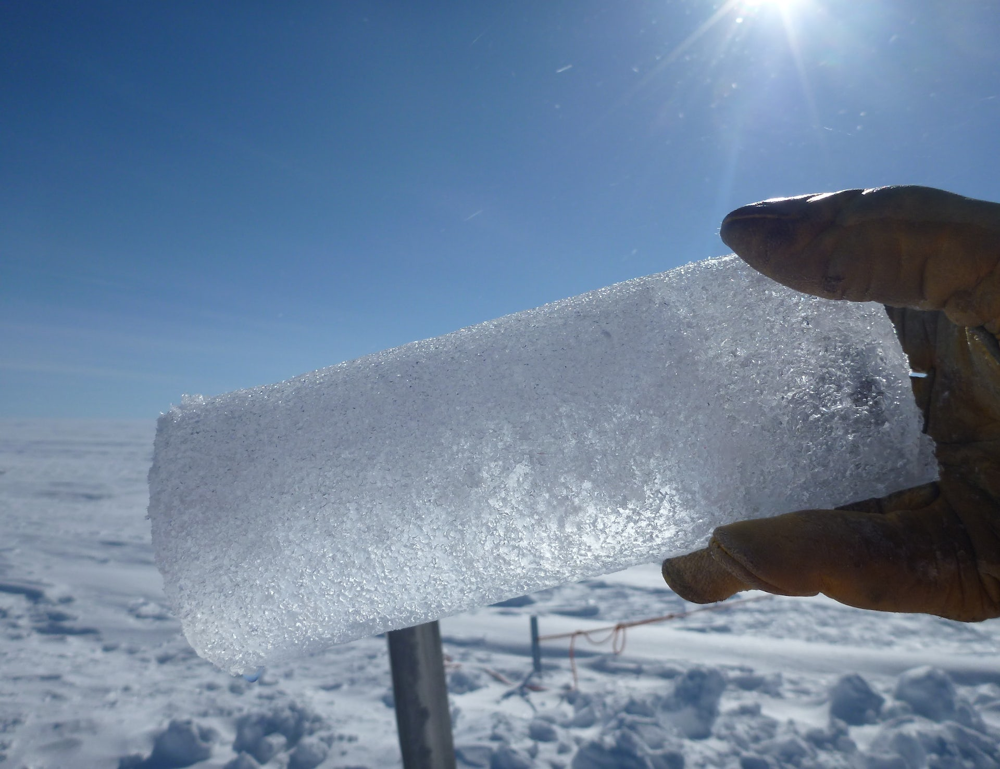
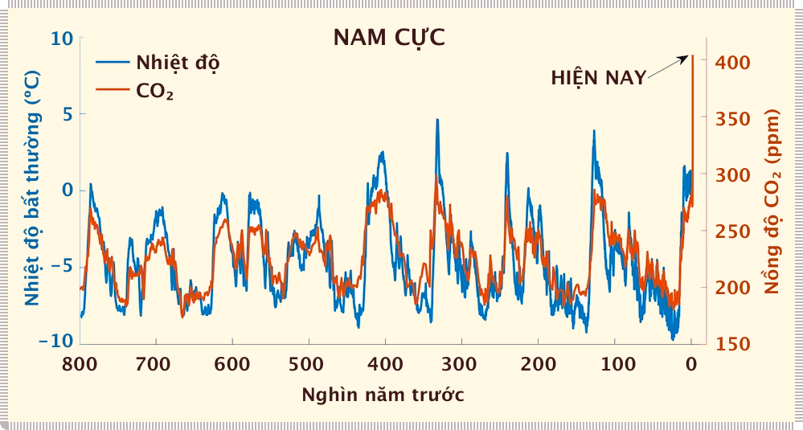
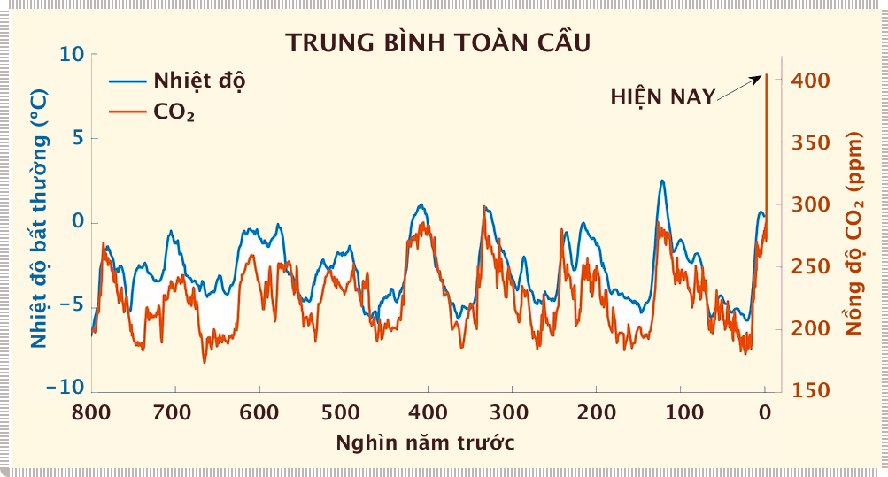
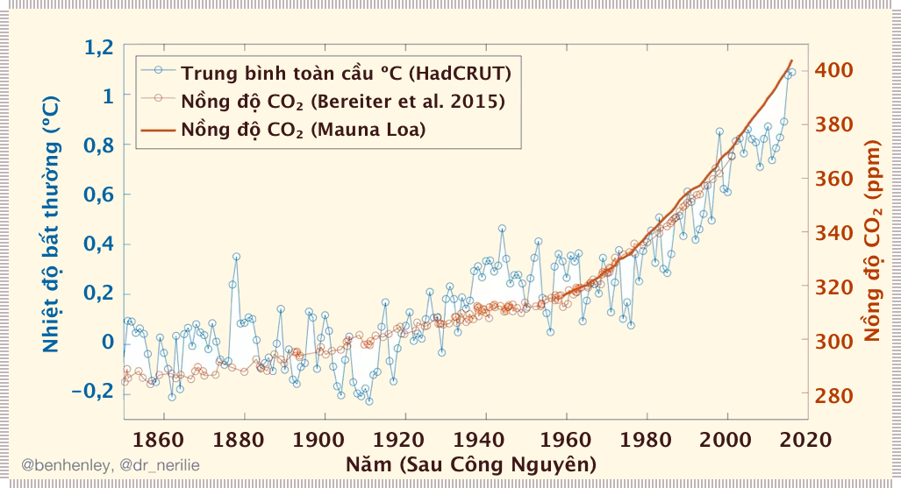
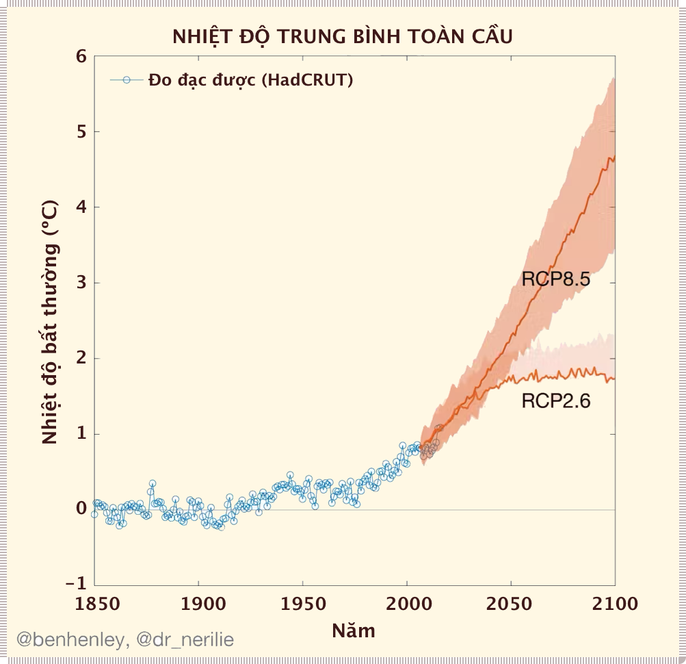

# Câu chuyện dài ba phút về 800.000 năm biến đổi khí hậu

Có những người nói rằng khí hậu luôn thay đổi và nồng độ khí cacbonic luôn dao động. Đúng vậy. Nhưng cũng đúng là kể từ cuộc cách mạng công nghiệp, nồng độ CO~2~ trong khí quyển đã tăng lên mức chưa từng có trong hàng trăm thiên niên kỷ.

<!-- Vì vậy, đây là một đoạn video ngắn mà chúng tôi đã thực hiện để đưa biến đổi khí hậu và lượng khí thải carbon dioxide gần đây vào bối cảnh của 800.000 năm qua. -->

???+ note "Lõi băng" 

    ...là cửa sổ nhìn vào quá khứ hàng trăm nghìn năm. Nguồn: Trung tâm bay không gian Goddard của NASA/Ludovic Brucker

## Mỗi liên hệ giữa nhiệt độ và khí CO~2~

Trái đất có **hiệu ứng nhà kính** (*greenhouse effect*) một cách tự nhiên và điều này thực sự rất quan trọng. Nếu không có nó, nhiệt độ trung bình trên bề mặt hành tinh sẽ vào khoảng -18ºC và sự sống của con người sẽ không tồn tại. Khí cacbonic (CO~2~) là một trong những loại khí trong bầu khí quyển của chúng ta có tác dụng giữ nhiệt và làm cho sự sống trên hành tinh [như chúng ta biết ngày nay] trở nên có thể.

Chúng ta đã biết về hiệu ứng nhà kính trong hơn một thế kỷ. Khoảng 150 năm trước, một nhà vật lý tên là John Tyndall đã sử dụng các thí nghiệm trong phòng thí nghiệm để chứng minh các đặc tính gây hiệu ứng nhà kính của khí CO~2~. Sau đó, vào cuối những năm 1800, nhà hóa học người Thụy Điển Svante Arrhenius lần đầu tiên tính toán hiệu ứng nhà kính của CO~2~ trong bầu khí quyển của chúng ta và liên kết nó với các kỷ băng hà trong quá khứ trên hành tinh của chúng ta.

Các nhà khoa học và kỹ sư hiện đại đã khám phá các liên hệ này một cách rất chi tiết trong những thập kỷ gần đây, bằng cách khoan vào các tảng băng bao phủ Nam Cực và Greenland. Hàng nghìn năm băng tuyết đã nén lại thành những tảng băng dày. Các lõi băng thu được có thể dài hơn 3km và lưu trữ thông tin tới 800.000 năm [về trước].

Các nhà khoa học sử dụng tính chất hóa học của các phân tử nước trong các lớp băng để xem nhiệt độ đã thay đổi như thế nào qua hàng thiên niên kỷ. Những lớp băng này cũng giữ các bong bóng nhỏ từ bầu khí quyển cổ đại, cho phép chúng ta đo trực tiếp mức CO~2~ thời tiền sử.

???+ note "Nhiệt độ & CO~2~"

    Sự thay đổi nhiệt độ ở Nam Cực qua các kỷ băng hà rất giống với nhiệt độ trung bình toàn cầu, ngoại trừ nhiệt độ ở kỷ băng hà dao động ở Nam Cực gần gấp đôi so với nhiệt độ trung bình toàn cầu. Các nhà khoa học gọi đây là **khuếch đại cực** (*polar amplification*) (dữ liệu từ Parrenin và cộng sự 2013; Snyder và cộng sự 2016; Bereiter và cộng sự 2015). Nguồn: Ben Henley và Nerilie Abram.

## Nhiệt độ và khí CO₂

Các lõi băng tiết lộ mối liên hệ cực kỳ chặt chẽ giữa nhiệt độ và nồng độ khí nhà kính qua các chu kỳ kỷ băng hà, do đó chứng minh các khái niệm do Arrhenius đưa ra hơn một thế kỷ trước.

Trong các thời kỳ ấm áp trước đây, không phải lượng khí CO~2~ tăng đột biến gây ra hiện tượng nóng lên mà là những dao động nhỏ và có thể đoán trước được trong chuyển động quay của Trái đất và quỹ đạo quanh Mặt trời. Khí CO~2~ đóng một vai trò quan trọng như một bộ khuếch đại tự nhiên của những thay đổi khí hậu nhỏ do những dao động này gây ra. Khi hành tinh bắt đầu nguội đi, nhiều khí CO~2~ được hòa tan vào các đại dương, làm giảm hiệu ứng nhà kính và làm mát nhiều hơn. Tương tự như vậy, khí CO~2~ được giải phóng từ các đại dương vào khí quyển khi hành tinh nóng lên, thúc đẩy sự nóng lên hơn nữa.

Nhưng mọi thứ rất khác trong khoảng thời gian gần đây. Con người chịu trách nhiệm cho phần lớn lượng khí CO~2~ bổ sung vào bầu khí quyển&mdash;với tốc độ rất nhanh.

Không có gì trong quá khứ đã từng được ghi lại có thể so sánh với tốc độ tăng CO~2~ gần đây. **Sự dịch chuyển tự nhiên** (*natural shift*) nhanh nhất ra khỏi thời kỳ băng hà đã chứng kiến mức CO~2~ tăng khoảng **35 phần triệu (ppm) trong 1.000 năm**. Có thể khó tin, **nhưng con người đã thải ra một lượng tương đương chỉ trong 17 năm qua**.

Trước cuộc cách mạng công nghiệp, mức độ tự nhiên của CO~2~ trong khí quyển trong giai đoạn ấm **giữa các thời băng hà** (*interglacial*) là khoảng 280 ppm. Kỷ băng hà lạnh giá khiến các tảng băng dày hàng km hình thành trên phần lớn Bắc Mỹ và Âu Á, có mức CO~2~ vào khoảng 180 ppm.

Việc đốt nhiên liệu hóa thạch, chẳng hạn như than đá, dầu và khí đốt, khai thác lượng carbon cổ xưa đã bị giữ trong lòng đất và đưa nó vào bầu khí quyển dưới dạng CO~2~. Kể từ cuộc **cách mạng công nghiệp** (*industrial revolution*), con người đã đốt cháy một lượng lớn nhiên liệu hóa thạch, khiến CO~2~ trong khí quyển và các loại khí nhà kính khác tăng vọt.

Vào giữa năm 2017, CO~2~ trong khí quyển hiện ở mức 409 ppm. Điều này hoàn toàn chưa từng có trong 800.000 năm qua.

???+ note "Nhiệt độ & CO~2~"

    ...từ năm 1850. Nguồn: Ben Henley and Nerilie Abram

[Bùng nổ phát thải khí CO~2~](https://gml.noaa.gov/ccgg/trends/) đang khiến khí hậu ấm lên nhanh chóng. Báo cáo gần đây nhất của IPCC đã kết luận rằng vào cuối thế kỷ này, chúng ta sẽ tăng hơn 4ºC so với mức thời kỳ tiền công nghiệp (1850-1899) nếu chúng ta tiếp tục xu hướng phát thải cao.

Nếu chúng ta hướng tới các mục tiêu của Thỏa thuận Paris, bằng cách nhanh chóng hạn chế lượng khí thải CO~2~ và phát triển các công nghệ mới để loại bỏ lượng CO~2~ dư thừa ra khỏi bầu khí quyển, thì chúng ta sẽ có cơ hội hạn chế sự nóng lên ở mức khoảng 2ºC.

???+ note "Kịch bản phát thải theo IPCC"

    Nhiệt độ toàn cầu được quan sát và dự báo trong kịch bản phát thải CO₂ cao (RCP8.5) và thấp (RCP2.6). Nguồn: Ben Henley và Nerilie Abram

Khoa học cơ bản [đằng sau sự nóng lên toàn cầu] được hiểu rất rõ. Có nhiều bằng chứng rõ ràng và phong phú cho thấy biến đổi khí hậu đang diễn ra. Điều khó khăn là: chúng ta sẽ làm gì tiếp theo? Hơn bao giờ hết, chúng ta cần sự lãnh đạo mạnh mẽ, hợp tác và có trách nhiệm từ các chính trị gia của tất cả các quốc gia. Chỉ khi đó, chúng ta mới tránh được điều tồi tệ nhất của biến đổi khí hậu và thích nghi với những tác động mà chúng ta không thể ngăn chặn.

**Tác giả: Jo Adetunji**, Biên tập viên, The Conversation UK

Tác giả ghi nhận sự đóng góp của **Wes Mountain** (đa phương tiện), **Alicia Egan** (chỉnh sửa) và **Andrew King** (dữ liệu cho mô hình dự báo).

[The three-minute story of 800,000 years of climate change with a sting in the tail](https://theconversation.com/the-three-minute-story-of-800-000-years-of-climate-change-with-a-sting-in-the-tail-73368)

