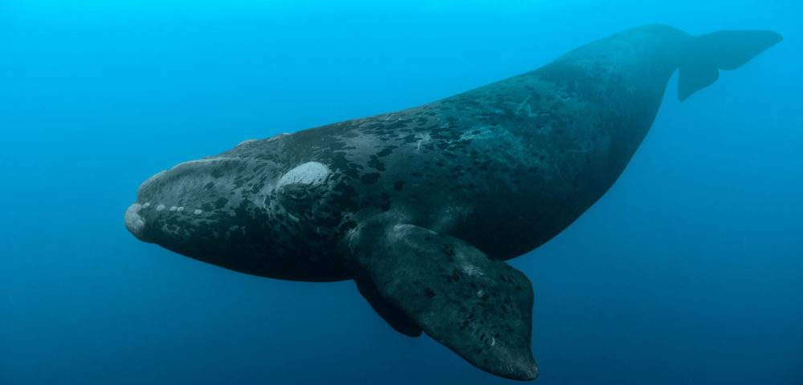
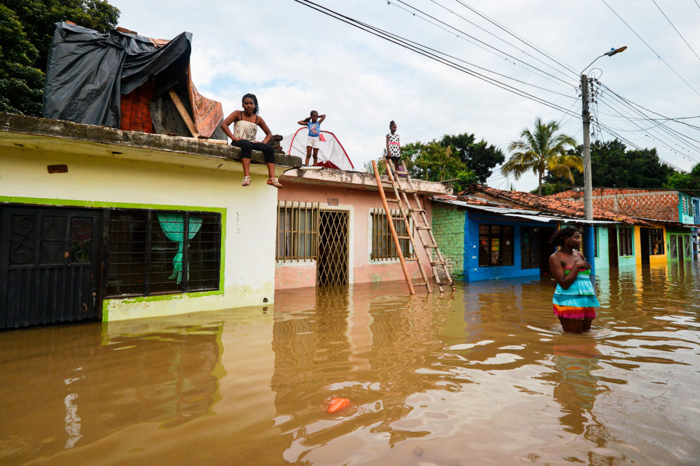
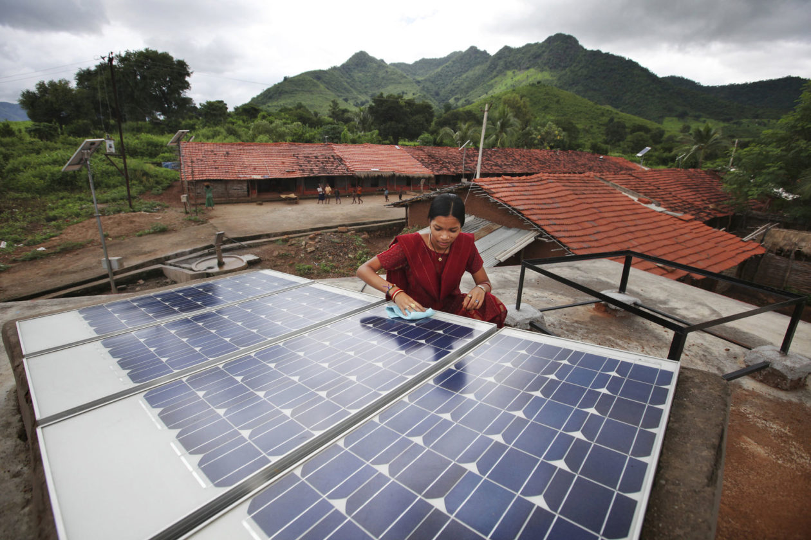

# Để tránh một “Tương lai kinh hoàng”: Những sự thật gay go về tình trạng của hành tinh

!!! quote "Lời dẫn"

    Một nhóm các nhà sinh thái học hàng đầu thế giới đã đưa ra một cảnh báo thẳng thắn về cuộc khủng hoảng liên hoàn gây ra do **biến đổi khí hậu** (*climate change*), **gia tăng dân số** (*population growth*) và **sự phát triển thiếu kiểm soát** (*unchecked development*). Đánh giá của họ là nghiệt ngã, nhưng những thay đổi xã hội toàn diện trên quy mô toàn cầu vẫn có thể ngăn chặn một tương lai thảm khốc.

Trong cuộc đời của bất kỳ ai được sinh ra từ thời điểm bắt đầu của **cuộc bùng nổ dân số** (*Baby Boom*)[^1], dân số loài người đã tăng gấp ba lần. Điều này có nghĩa rằng các nỗ lực của con người đã khá hơn gấp ba lần&mdash;hay khả năng sinh tồn chỉ còn một phần ba? Vào những năm 1960, con người đã tiêu thụ 3/4 những gì hành tinh này có thể tái tạo hàng năm. Đến năm 2016, con số này đã tăng lên 170%, nghĩa là Trái đất không thể theo kịp nhu cầu của con người và chúng ta đang khiến thế giới suy sụp.

[^1]:

    Thời kỳ bùng nổ dân số là thời kỳ được đánh dấu bằng sự gia tăng đáng kể số ca sinh. Hiện tượng nhân khẩu học này thường được mô tả trong các giới hạn địa lý nhất định của các quần thể văn hóa và quốc gia nhất định. Những người sinh ra trong thời kỳ này thường được gọi là những người thuộc thế hệ bùng nổ dân số. Nguyên nhân của sự bùng nổ dân số liên quan đến các yếu tố sinh sản khác nhau. Sự bùng nổ dân số nổi tiếng nhất xảy ra vào giữa thế kỷ 20, được xem là bắt đầu sau khi Chiến tranh thế giới thứ hai kết thúc, từ cuối những năm 1930 và kết thúc vào những năm 1960.

“Nói cách khác, nhân loại đang thực hiện một **kế hoạch Ponzi[^2] sinh thái**, trong đó xã hội tước đoạt của tự nhiên và các thế hệ tương lai để trả tiền cho việc tăng thu nhập trong thời gian ngắn”, 17 nhà sinh thái học hàng đầu thế giới đã chia sẻ một quan điểm hoàn toàn mới về vị trí của con người trong thời đại và cuộc sống. Bài báo có tiêu đề rõ ràng: “Việc đánh giá thấp những thách thức phải đối mặt khi ngăn ngừa một tương lai kinh hoàng,” ít được xem như một luận điểm, mà như một cơn mưa thiên thạch bay theo một quỹ đạo mù quáng chết người (ám chỉ xu hướng vận động của con người trên trái đất). Mục tiêu đã nêu của các tác giả là không làm độc giả nản lòng. Họ viết: “Chúng tôi không kêu gọi đầu hàng, chúng tôi mong muốn cung cấp cho các nhà lãnh đạo một “gáo nước lạnh” về tình trạng thực tế của hành tinh, và điều cần thiết của việc lập kế hoạch để tránh một tương lai kinh hoàng”.

[^2]:

    Mô hình Ponzi (hay trò chơi Ponzi) là một hình thức lừa đảo thu hút các nhà đầu tư và trả lợi nhuận cho các nhà đầu tư trước đó bằng tiền từ các nhà đầu tư mới gia nhập.

Đi vào tìm hiểu sâu hơn về tình trạng hiện tại, con người đã thay đổi khoảng 70% diện tích **đất liền** (*land*) và **đại dương** (*ocean*) trên trái đất. Các **vùng đất ngập nước** (*wetlands*) đã mất 85% diện tích tự nhiên; **rừng tảo bẹ** (*kelp forests*) đã mất 40 phần trăm diện tích; **đồng cỏ biển** (*seagrass meadows*) đang biến mất với tốc độ 1% mỗi năm; hai phần ba các loài cá săn mồi lớn của đại dương đã biến mất; các rạn san hô đã mất đi một nửa khối lượng sống của chúng. Nông nghiệp đã làm giảm một nửa khối lượng của thảm thực vật sống trên đất liền, làm mất đi 20% tính đa dạng; 40% thực vật còn tồn tại hiện đang bị đe dọa. Vật nuôi và con người hiện chiếm 96% tổng số động vật có xương sống trên cạn (về mặt khối lượng) trong khi chỉ có khoảng 5% là động vật hoang dã, sống tự do. Các quần thể chim, động vật có vú, cá, bò sát và lưỡng cư hoang dã trên thế giới đã giảm trung bình gần 70% chỉ trong 50 năm qua, một sự sụt giảm ngoạn mục. Hơn 700 loài động vật có xương sống đã tuyệt chủng trong 500 năm qua, tỷ lệ tuyệt chủng cao gấp 15 lần tỷ lệ tự nhiên. Khoảng một triệu loài hiện đang bị đe dọa tuyệt chủng hoàn toàn. Những sự gián đoạn và suy giảm này đã gây ra sự suy thoái về chất lượng **đất** (*soil*), **không khí** (*air*) và **nước** (*water*); **sự thụ phấn** (*pollination*); **khả năng thu giữ carbon** (*carbon sequestration*)[^3]; và **sức khỏe con người** (*human health*). Bên cạnh đó, **lũ lụt** (*flood*), **hỏa hoạn** (*fires*), số người **suy dinh dưỡng** (*malnourished*), **ô nhiễm nhựa** (*plastic pollution*), các **chất độc nói chung** (*general toxification*) và **dịch bệnh truyền nhiễm** (*infectious epidemics*) đang gia tăng.

[^3]:

    Cô lập carbon, hay còn gọi là thu giữ carbon là quá trình liên quan tới việc cố định carbon và tích trữ lâu dài khí cacbonic trong khí quyển. Cô lập carbon bao gồm quá trình tích trữ lâu dài khí cacbonic hoặc các dạng khác của carbon để giảm thiểu hoặc làm chậm lại biến đổi khí hậu. Nó đã được đề xuất như là một cách để làm chậm sự tích lũy khí nhà kính&mdash;được thải ra trong quá trình đốt cháy nhiên liệu hóa thạch&mdash;trong khí quyển và trong nước. Theo [Wikipedia](https://vi.wikipedia.org/wiki/C%C3%B4_l%E1%BA%ADp_carbon)

!!! quote "Trích dẫn"

    Mục đích của việc nhìn thấy các mối đe dọa hiện hữu không phải là để đối mặt với một tương lai ngày tận thế mà là để ngăn chặn nó.

Đề cập đến việc mất đi sự đa dạng và phong phú của sinh vật sống, các tác giả lưu ý: “Các phương tiện truyền thông chính thống đang gặp khó khăn trong việc nắm bắt tầm quan trọng của sự mất mát này, bất chấp sự xói mòn đều đặn của nền văn minh nhân loại”. Nhưng tôi nghĩ vấn đề ở đây kết cấu của nền văn minh nhân loại đã được xây dựng và cung cấp năng lượng chính bằng cách gây ra sự xói mòn của thế giới sống. Nỗi đau của những sinh vật sống khác hiếm khi được con người cảm nhận, lợi ích của chúng hiếm khi được xem xét, giá trị nội tại của chúng bị hạ thấp. (Tôi vẫn được hỏi “tại sao chúng ta nên quan tâm” về việc liệu ngay cả những sinh vật mang tính biểu tượng như **cá voi đầu bò** (*right whales*) chẳng hạn, có biến mất vĩnh viễn).

??? note "Cá voi đầu bò" 
    
    Hay cá voi “thích hợp”, tên của nó chỉ ra lý do tại sao loài này hiện là loài cá voi có nguy cơ tuyệt chủng cao nhất ở vùng biển Bắc Đại Tây Dương, từng là loài cá voi “thích hợp” đối với những người săn cá voi trong quá khứ. Những con cá voi lớn, bơi chậm này thường được tìm thấy trên bề mặt, vì vậy chúng được những người săn cá voi coi là “thích hợp” để săn bắt. Miệng mang lại nguồn cung cấp tấm sừng hàm (xương cá voi) và mỡ tạo ra một lượng lớn dầu. Cuộc săn lùng loài cá này không ngừng nghỉ đến nỗi chỉ còn lại vài trăm con ở bán cầu bắc.

Điều đáng chú ý: tác giả chủ yếu là các nhà sinh thái học, cũng như tôi vậy. Điều này có thể giải thích cho việc họ nhận thức được một tương lai nghiệt ngã hơn so với tương lai tươi sáng do những người lạc quan về công nghệ đưa ra. Các nhà sinh thái học hiểu thế giới là **mối quan hệ phụ thuộc lẫn nhau** (*interdependent relationship*) giữa các hệ thống **sống** (*living*) và **không sống** (*non-living*) đa dạng. Các nhà sinh thái học xem xét các **phản hồi** (*feedbacks*) bắt nguồn và tạo khả năng cho sự sinh sôi nảy nở liên tục kỳ diệu của sự sống. **Những người lạc quan** (*optimists*) có xu hướng chỉ ra các xu hướng xã hội chính của con người như tỷ lệ đói nghèo. (Số người suy dinh dưỡng đã giảm từ 1 tỷ người vào năm 1990 xuống còn 800 triệu người vào năm 2017, một tỷ lệ khiến một số người lạc quan&mdash;và thường có cuộc sống sung túc&mdash;cảm thấy hài lòng. Và mặc dù **tỷ lệ nghèo** cũng giảm, dân số tăng dẫn đến có nhiều người cực nghèo hơn).

Theo quan điểm của tôi và quan điểm của những người khác mà chúng ta có thể gọi là **những người hoài nghi về công nghệ** (*techno-skeptics*), một mình công nghệ sẽ không giải quyết được sự xung đột đang gia tăng. Bất kỳ hệ thống xã hội nào, bất kỳ công nghệ nào, đều có tác dụng của nó. Công nghệ mới thường đem lại những tác dụng mà chính chúng đã gây ra hàng loạt vấn đề hiện tại sẽ có khả năng thúc đẩy nhanh hơn các vấn đề đó. (Robot khiến mọi người mất việc làm chẳng hạn). Về cốt lõi, những người lạc quan và các nhà sinh thái học không có tiếng nói chung. Những người lạc quan tỏ ra phấn khởi về mọi hoạt động đã và đang diễn ra của con người. Các nhà sinh thái học nhìn thấy các mối đe dọa hiện hữu trong **sự quá tải** (*overshoot*) vượt quá **dấu chân sinh thái** (*ecological footprint*) của con người, hệ thống xã hội ngày càng căng thẳng, **các phản hồi khí hậu** (*climate feedbacks*) và **cuộc khủng hoảng tuyệt chủng** (*extinction crisis*). Các nhà sinh thái học hiểu rằng việc xây dựng một **tập đoàn con người** (*human enterprise*) lớn hơn bao giờ hết là kết quả của việc nghiền nát thế giới với cái giá là phần còn lại của sự sống trên Trái đất và các thế hệ chưa sinh. Trên một hành tinh hữu hạn, một tập đoàn như vậy phải đối mặt với những giới hạn không thể tránh khỏi. Chúng ta đang đi trật khỏi đường ray.

??? note "Đường phố ngập lũ"
    
    Ở Cali, Colombia vào năm 2017, sau những trận mưa dữ dội gây ra bởi sự sông Cauca River tràn bờ. LUIS ROBAYO/AFP VIA GETTY IMAGES

Mục đích của việc nhìn thấy các mối đe dọa hiện hữu không phải là để đối mặt với một tương lai ngày tận thế mà là ngăn chặn nó. Khi đèn báo dầu bật sáng hay chuông cảnh báo kêu liên tục vì bạn đã ngủ gật trên tay lái, cách an toàn nhất là tấp vào con đường mà bạn đang băng qua và đánh giá tình hình.

Các tác giả của bài viết “Để tránh một tương lai kinh hoàng” nêu bật những tác động chính vốn là hệ quả của cách thức con người đã sống trong nhiều năm. Thứ nhất, các xu hướng hiện tại khiến tương lai đi theo hướng tồi tệ hơn nhiều so với đánh giá thường thấy. Quy mô của các mối đe dọa hiện hữu đối với nhân loại và các sinh vật sống khác lớn đến mức gần như không thể hiểu hết được. Thứ hai, các chính phủ và nhà lãnh đạo hiện thời của nhân loại không đáp ứng được những đòi hỏi cần thiết. Và những căng thẳng gia tăng chẳng hạn như quản lý người tị nạn khí hậu sẽ khiến các nền chính trị **giảm dần** khả năng nhận biết và giải quyết các vấn đề&mdash;điều đã trở nên rõ ràng một cách đáng kinh ngạc. Những người tị nạn chạy trốn khỏi nạn đói liên quan đến khí hậu hay mực nước biển dâng&mdash;ví dụ ở những nơi như Afghanistan, Samoa, Philippines và Bờ biển vùng Vịnh của Hoa Kỳ&mdash;gây căng thẳng cho chính trị và các hệ thống ứng phó, tạo ra các cuộc khủng hoảng làm mất khả năng giải quyết các nguyên nhân tiềm ẩn gây ra khủng hoảng.

Động lực cơ bản nhất của việc đưa thêm nhiều hơn nguyên vật liệu vào tập đoàn con người, sự gia tăng dân số loài người, đang trên đà tiếp tục ít nhất là trong thế kỷ này. Nhưng sự gia tăng dân số và những tác động của nó không đồng đều trên toàn cầu. Một số quốc gia ổn định hoặc thậm chí giảm nhẹ về mức dân số; một số tiêu thụ ít hơn rất nhiều trên bình quân đầu người. Nhưng ngay cả những người nghèo nhất, có mức tiêu thụ tối giản nhất cũng cần đất đai, thức ăn và nước uống. Và kết quả là rõ ràng đối với bất kỳ ai đã hiểu và yêu một nơi chốn nào đó trong nhiều thập kỷ.

Giống như sự gia tăng dân số và mức tiêu thụ không đồng nhất, **sự khốn cùng** (*misery*) cũng như vậy. Ước tính có khoảng 3/4 tỷ người đang dần chết đói và 1 đến 2 tỷ người không có đủ thức ăn để sinh hoạt như một người bình thường. Gia tăng dân số gây ra tình trạng **đông đúc** (*crowding*), **thất nghiệp** (*joblessness*), **xích mích** (*friction*) và **xung đột** (*conflict*). Quản lý sức nóng của xung đột khi dân số tăng lên và nền kinh tế chịu áp lực phải theo kịp khiến việc hạ nhiệt trở nên khó khăn hơn. Ít có khả năng các nhà lãnh đạo sẽ nhận ra nhu cầu cấp thiết hơn là làm dịu mát tình hình thay vì đổ thêm dầu vào lửa. Điều này là hiển nhiên khi hầu hết chính sách phổ biến đều tập trung vào việc kiếm được “nhiều hơn”&mdash;chẳng hạn như nhiều lương thực hơn cho nhiều người, hơn là dịu bớt các cuộc khủng hoảng bằng các chính sách khuyến khích **kiểm soát dân số** (*flattening*) và **phản tăng trưởng** (*de-growth*).

!!! quote "Trích dẫn"

    Hầu hết các nhà kinh tế và chính trị gia đều nhầm lẫn một cách chết người rằng tăng trưởng và sự tiến bộ là đồng nghĩa với nhau.

Sự khác biệt cơ bản nằm ở chỗ tăng trưởng có nghĩa là trở nên lớn hơn bằng cách dốc nhiều nguyên liệu hơn vào hệ thống [kinh tế]. Tiến bộ có nghĩa là những thành quả với hiệu năng cao hơn. Tất cả chúng ta đều trải qua một thời kỳ khi bộ máy cơ thể chúng ta đòi hỏi phát triển. Khi tăng trưởng kết thúc, cơ thể chú trọng vào việc nâng cao sức khoẻ. Cải thiện **chăm sóc sức khỏe** (*health care*), **giáo dục** (*giáo dục*) và **tình thương** (*compassion*) không đòi hỏi sự tăng trưởng như một điều kiện cần thiết. Ngược lại, có vẻ như việc tập trung vào tăng trưởng thường cản trở sự tiến bộ.

Trong khi đó, tăng trưởng kinh tế toàn cầu sẽ tiếp tục trong thế kỷ này, nghĩa là tổng mức tiêu thụ sẽ tăng trong những thập kỷ tới. Nhiên liệu hóa thạch hiện thúc đẩy tiêu thụ nhiều nhất; chúng là nguồn cung cấp 85% năng lượng thương mại, 65% sợi và hầu hết các loại nhựa. Nông nghiệp cũng phụ thuộc vào năng lượng hóa thạch. Hậu quả của việc đốt cháy này là sự nóng lên của khí hậu, phù hợp hay vượt quá các dự đoán khoa học trước đó; và các mô hình gần đây nhất dự đoán sự nóng lên nhiều hơn so với các mô hình trước đó.

Việc mất đi thế giới sinh vật sống có thể không có ý nghĩa gì đối với hầu hết mọi người, nhưng biến đổi khí hậu tỏ ra rõ ràng hơn và gây tổn hại trực tiếp hơn đến cuộc sống con người và các khoản đầu tư. Éo le thay, sự nóng lên của khí quyển có nguy cơ làm giảm năng suất nông nghiệp trong khu vực, tăng tỷ lệ tử vong và bệnh tật, thậm chí ảnh hưởng đến chức năng nhận thức của con người. Những cơn bão mạnh lên, sóng tràn bờ biển và những đám cháy gần đây có thể khiến chúng ta tạm dừng để suy nghĩ hợp lý hơn. Những mối đe dọa hiện hữu như vậy dường như có khả năng trở thành tâm điểm chú ý của các chính phủ.

??? note "Báo Amur"

    Một trong những loài mèo lớn có nguy cơ tuyệt chủng cao nhất thế giới, tại một vườn thú ở Lyon, Pháp. Tính đến năm 2019, chỉ còn 90 con báo hoa mai này trong tự nhiên. JEFF PACHOUD/AFP QUA HÌNH ẢNH GETTY

Nhưng các phản ứng quốc gia và quốc tế hoàn toàn không thỏa đáng. Các quốc gia không đạt được các mục tiêu đặt ra theo hiệp định khí hậu Paris, Công ước về Đa dạng Sinh học và Chương trình Phát triển Bền vững của Liên Hợp Quốc, chủ yếu là do sự thiếu cam kết của các chính phủ. Các tác giả nói rằng nếu không thực hiện các cam kết hiện có&mdash;chưa kể đến các biện pháp bổ sung cần thiết&mdash;“Nhiệt độ Trái đất [tăng lên] sẽ là thảm họa đối với đa dạng sinh học và nhân loại”.

Xu hướng xấu đi đáng nhẽ thúc đẩy các phản ứng tích cực từ một sinh vật sống có lý trí. Điều ngược lại đang xảy ra với loài người. Xu hướng xấu đi làm trầm trọng thêm các bệnh lý xã hội. Chính trị chú trọng các hoạt động ngắn hạn; những thay đổi cần thiết cho một tương lai đáng sống lại là rủi ro chính trị. Trong khi đó, các chính trị gia hiếm khi bị đổ lỗi, phải gánh chịu những rủi ro thực sự và chi phí gia tăng đằng sau lũ lụt và hỏa hoạn thảm khốc. Xung đột, người tị nạn và chiến tranh hiếm khi được hiểu là một phần (hay đôi khi hoàn toàn) là do những thay đổi về môi trường. Những vấn đề đó làm gia tăng sự bất hòa. Các cuộc khủng hoảng thúc đẩy sự trỗi dậy của các hệ tư tưởng cực đoan, chủ nghĩa khủng bố và các nguyên thủ quốc gia chuyên quyền (Mỹ, Brazil và Nga là một trong những ví dụ). Tất cả những điều này làm giảm khả năng hợp tác cần thiết để xoa dịu các nguyên nhân gốc rễ, tạo ra một chu kỳ suy thoái sinh thái, rủi ro gia tăng, mức độ thiệt hại thảm khốc, bất bình đẳng xã hội và các phản ứng rối loạn [trong xã hội].

**Chủ nghĩa môi trường** (*environmentalism*), thay vì được coi là một nỗ lực phi đảng phái nhằm gắn kết nhân loại lại với nhau trong nỗ lực tự bảo tồn và ổn định hành tinh&mdash;như đã diễn ra trong những năm 1970&mdash;giờ đây thường được coi là một hệ tư tưởng chính trị. Như các tác giả bài viết “Để tránh một tương lai kinh hoàng” đã chỉ ra, **Thỏa thuận Mới Xanh** (*Green New Deal*) ở Hoa Kỳ đã trở thành điểm nóng cho sự phân cực chính trị. Thật vậy, các nhóm bảo vệ môi trường thường bị dán nhãn là “những kẻ khủng bố”. Để hiểu nhanh về mức độ nguy hiểm của việc bảo vệ đất đai, động vật hoang dã và những nơi hoang dã, hãy tìm kiếm trên web từ khoá: các nhà bảo vệ môi trường bị sát hại (có hơn 200 vụ giết người vào năm 2019).

Các giải pháp toàn diện tồn tại, bao gồm hiệu chỉnh một cách căn bản chủ nghĩa tư bản toàn cầu bằng cách đưa chi phí ô nhiễm vào việc sản xuất gây khí thải carbon và hóa chất chẳng hạn; giảm nhanh việc sử dụng nhiên liệu hóa thạch; và từ bỏ hệ tư tưởng ảo tưởng về sự tăng trưởng vĩnh viễn. Ngay cả vấn đề cơ bản nhất&mdash;dân số&mdash;phần lớn cũng có thể tự giải quyết khi tiến bộ xã hội tiếp tục làm giảm bớt sự bất bình đẳng dường như phổ biến nhất trên thế giới&mdash;sự đàn áp phụ nữ.

!!! quote "Trích dẫn"

    Nếu có một viên đạn bạc (giải pháp cho mọi vấn đề), viên đạn đó là **quyền công dân đầy đủ** (*full citizenship*) và việc **trao quyền cho phụ nữ** (*empowerment of women*).

Tuy nhiên, điều mà các định chế được sinh ra để giải quyết vấn đề còn thiếu: đó là những con người có khả năng nhìn xa trông rộng, có khả năng hợp tác và lòng trắc ẩn để tránh làm chìm con tàu hành tinh này. Liệu con người có khả năng đó hay không vẫn còn phải xem. Chúng ta rõ ràng có khả năng tạo ra các vấn đề rất lớn ở qui mô hành tinh. Nhưng chúng ta chưa chứng minh được khả năng đưa ra giải pháp cho những vấn đề đó.

“Ngày phán xét” đang đến gần. Các tác giả cảnh báo rằng sự lựa chọn duy nhất để thoát khỏi **tình trạng quá tải** (*overshoot*) phụ thuộc vào cách con người lên kế hoạch cho điều đó hay bằng các thảm họa tự nhiên. Nếu chúng ta giải quyết được vấn đề, vấn đề sẽ giải quyết chúng ta. Không có con đường thứ ba nào thoát khỏi sự thu nhỏ qui mô không thể tránh khỏi của tăng trưởng kinh tế và sự bành trướng của con người.

Ở mặt tích cực, có nhiều ví dụ về các biện pháp can thiệp thành công trên quy mô nhỏ hơn, chẳng hạn như bầu trời và nước sạch hơn nhờ luật pháp và chính sách ở Hoa Kỳ hay các nơi khác và sự thành công của Đạo luật về các loài có nguy cơ tuyệt chủng ở Hoa Kỳ. Nhưng các tác giả cho rằng trên toàn cầu, chỉ những cách tiếp cận quốc tế tầm vĩ mô đối với những vấn đề khổng lồ này mới có thể cho phép các quốc gia vạch ra “một tương lai ít bị tàn phá hơn”.

Mục đích của bài viết “Để tránh một tương lai Kinh hoàng” là tất cả chúng ta phải nhận ra tầm quan trọng của những vấn đề này. Nhưng các tác giả tin rằng có thể đối mặt với thực tế mà không cần gieo rắc nỗi sợ hãi và tuyệt vọng “không tương xứng”. Họ nói rằng những lựa chọn cần thiết sẽ kéo theo “những cuộc đối thoại khó khăn về sự gia tăng dân số” và “sự cần thiết của việc giảm **mức sống** (*standards of living*) về một ngưỡng công bằng hơn”.

??? note "Meenakshi Dewan"

    Một kỹ sư năng lượng mặt trời, kiểm tra các tấm pin mặt trời ở cộng đồng nông thôn Tinginaput, Ấn Độ. ABBIE TRAYLER-SMITH / HÌNH ẢNH PANOS / BỘ PHÁT TRIỂN QUỐC TẾ

Về kết luận cuối cùng này, tôi không hoàn toàn đồng ý rằng nó phải như vậy. Tôi hy vọng thành kiến lạc quan mà họ cảnh báo sẽ không là trở ngại. Mức sống công bằng hơn không có nghĩa là làm giảm tiêu chuẩn sống của tất cả mọi người, mà ngược lại, đối với nhiều người, đó là cuộc sống tốt hơn so với sự bất bình đẳng hiện tại buộc hàng tỷ người phải chịu đựng. Những phụ nữ được trao quyền có xu hướng tìm kiếm những gia đình nhỏ hơn, chỉ đơn giản là vấn đề lựa chọn cá nhân. Vì vậy, những gì là khó khăn đối với số người sẽ có sức hấp dẫn lớn đối với nhiều người hiện đang bị tước đoạt nhân phẩm, giáo dục và sự bình đẳng.

Theo quan điểm của tôi, nếu có một viên đạn bạc (giải pháp cho tất cả mọi vấn đề) có thể đối phó được với nhiều tai ương trong tương lai đang lờ mờ của chúng ta, thì viên đạn đó chính là quyền công dân đầy đủ cho phụ nữ&mdash;về mặt pháp lý, tài chính và văn hóa. Khi phụ nữ có thể học cao hơn, đảm bảo các khoản vay ngân hàng, thừa kế tài sản, sở hữu doanh nghiệp và lên các vị trí cao trong doanh nghiệp và chính phủ, thì tốc độ tăng dân số phần lớn có xu hướng chậm lại khi cuộc sống trở nên công bằng hơn. Phụ nữ kiểm soát được nhiều hơn các quyết định và cuộc sống của họ có thể chọn khoảng cách sinh và quy mô gia đình nhỏ hơn. Không cần thảo luận về tính toán qui mô dân số toàn cầu; quyết định cá nhân là đủ. Bí mật của những người đạt được nhiều quyền kiểm soát hơn đối với cuộc sống của chính họ là gia đình nhỏ hơn mang lại cho mọi người cuộc sống tốt đẹp hơn. Những miếng bánh lớn nhất được cắt ở những bàn ít người nhất.

Gáo nước lạnh được phác thảo trong bài “Để tránh một tương lai kinh hoàng” sẽ thúc đẩy các nhà khoa học lên tiếng mạnh mẽ và sẽ thúc đẩy các nhà đầu tư và các nhà hoạch định chính sách hình dung và thực hiện nhiều giải pháp toàn diện đã được vạch ra. Vấn đề thực sự không phải là để “tránh” một tương lai kinh hoàng; đó là vấn đề liệu chúng ta có quyết định tạo ra một tương lai như thế hay không. Nếu chúng ta quyết định không làm như vậy, chúng ta sẽ cần nỗ lực rất lớn để ngẫm nghĩ về mặt đạo đức và luân lí, và để hành động.

**Tác giả: Carl Safina** là một nhà sinh thái học và là thành viên của MacArthur. Ông giữ chức Chủ tịch về Thiên nhiên và Nhân loại tại Đại học Stony Brook và là người sáng lập Trung tâm phi lợi nhuận Safina. Ông là tác giả của nhiều cuốn sách về mối quan hệ của con người với phần còn lại của thế giới sống. Cuốn sách gần đây nhất của Carl là **Trở nên hoang dã: Cách nền văn hóa động vật nuôi dưỡng gia đình, tạo ra vẻ đẹp và đạt được hòa bình**. Xem thêm tại [CarlSafina.org](https://CarlSafina.org) và [SafinaCenter.org](https://SafinaCenter.org)

[Avoiding a ‘Ghastly Future’: Hard Truths on the State of the Planet](https://e360.yale.edu/features/avoiding-a-ghastly-future-hard-truths-on-the-state-of-the-planet)

