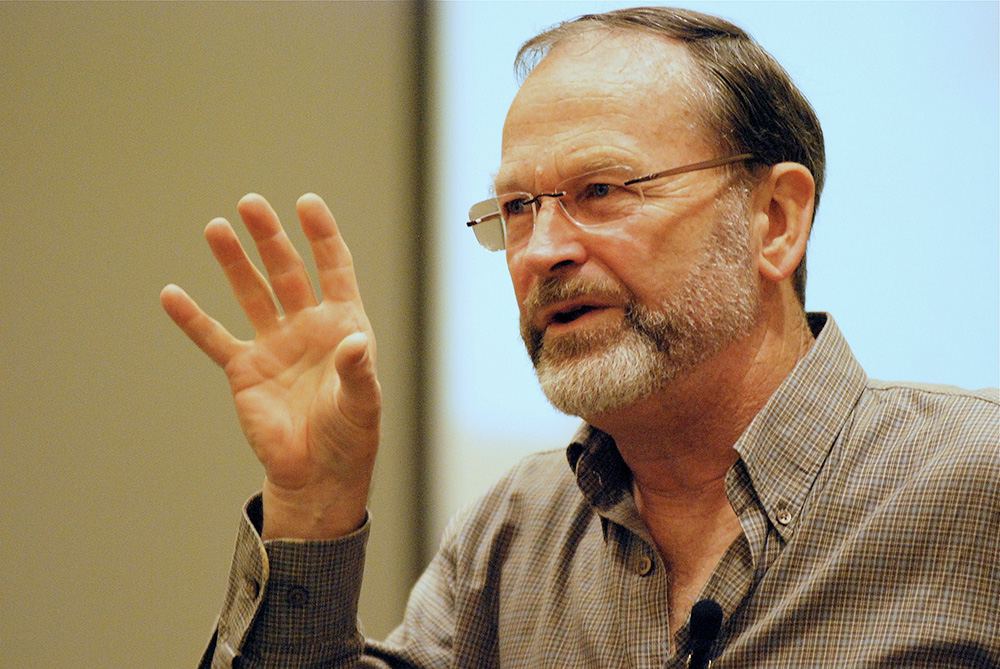
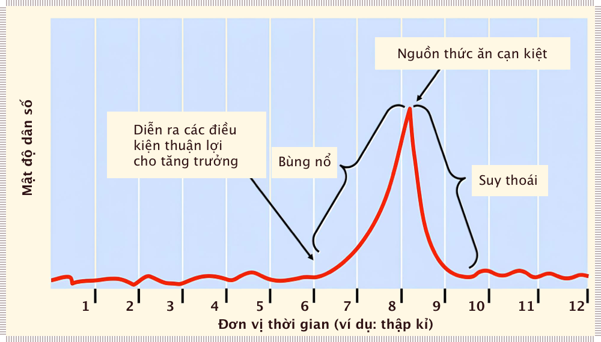

# Khủng hoảng khí hậu có thể quét sạch sáu tỷ người

Tác giả của khái niệm “dấu chân sinh thái” (*ecological footprint*)[^1] nói về sự sống và cái chết trong một thế giới có nhiệt độ gia tăng hơn 4ºC (so với thời kì tiền công nghiệp).

[^1]:

    **Dấu chân sinh thái** là một thuật ngữ mới được sử dụng vào những năm 1990 bởi các nhà khoa học thuộc trường Đại học British Columbia là William E.Rees và Mathis Wackernagel. Theo đó, dấu chân sinh thái là một thước đo nhu cầu về các diện tích đất, nước có khả năng cho năng suất sinh học cần thiết để cung cấp thực phẩm, gỗ cho con người, bề mặt xây dựng cơ sở hạ tầng, diện tích hấp thụ cacbon dioxide, khả năng chứa đựng và đồng hóa chất thải. 
    
    Loài người đang khai thác tài nguyên thiên nhiên vốn có để phục vụ cho lợi ích của mình. Theo các nhà khoa học, Trái Đất có khả năng tái tạo lại những gì con người đã khai thác.[cần dẫn nguồn] Điều này là hoàn toàn đúng đắn vì những gì con người đang khai thác cũng là những gì Trái Đất đã tạo ra. Tuy nhiên, khả năng tái tạo của Trái Đất là có hạn, nếu con người khai thác tài nguyên vượt quá khả năng tái tạo của Trái Đất thì Trái Đất sẽ rơi vào trình trạng quá tải, nghĩa là không thể tái tạo đủ những gì con người khai thác.

    Người ta đưa ra đơn vị Gha (Gigahecta hay tỉ hec-ta) tương ứng với một Ha đất tiêu chuẩn. Theo đó thì một Gha hay một Ha đất tiêu chuẩn này sẽ có khả năng cung ứng một lượng vật chất tự nhiên cho con người. Nếu con người càng khai thác quá đà thì lượng Gha sẽ càng giảm. Hầu như các nước đều sử dụng quá dấu chân sinh thái của đất nước mình. Nguồn: [Wikipedia](https://vi.wikipedia.org/wiki/D%E1%BA%A5u_ch%C3%A2n_sinh_th%C3%A1i)

??? note "Giáo sư danh dự William Rees"

    Giáo sư của Đại học Bristich Colombia đưa ra những tính toán nghiệt ngã cho nhân loại nếu biến đổi khí hậu và tăng trưởng dân số cũng như mức tiêu thụ do năng lượng rẻ thúc đẩy không được kiểm soát. Ảnh của Nick Wiebe, Wikimedia.

!!! quote "Chris Hedge"

    “Lượng khí thải carbon có thể tiếp tục tăng, các tảng băng ở hai cực có thể tiếp tục tan chảy, năng suất cây trồng có thể tiếp tục giảm, các khu rừng trên thế giới có thể tiếp tục bị đốt cháy, các thành phố ven biển có thể tiếp tục lún sâu hơn khi nước biển dâng và hạn hán có thể tiếp tục quét sạch các vùng đất canh tác màu mỡ, nhưng đấng cứu thế của niềm hy vọng (*messiahs of hope*) đảm bảo với chúng ta rằng cuối cùng tất cả sẽ ổn. Chỉ có điều, sẽ không có gì ổn cả”.

Cuộc khủng hoảng khí hậu thường nhấn mạnh rằng: loài người Homo sapiens về cơ bản không phải là một loài có lý trí. Khi buộc phải đưa ra những quyết định quan trọng, đặc biệt là những quyết định ảnh hưởng đến an ninh kinh tế hoặc tình trạng chính trị xã hội của, bản năng nguyên thủy và cảm xúc thô sơ có xu hướng chiếm thế thượng phong.

Đây không phải là một điều tốt nếu số phận của xã hội đang bị đe dọa. Lấy “hy vọng” làm ví dụ. Vì những lý do tiến hóa tốt, con người tự nhiên có xu hướng hy vọng trong thời điểm **căng thẳng** (*stress*). Từ này mang ý nghĩa an ủi nhẹ nhàng đến nỗi một số người thậm chí còn đặt cho con gái họ cái tên này. Nhưng hy vọng có thể làm suy yếu, suy nhược hoàn toàn, khi nó kết hợp với suy nghĩ mơ tưởng đơn thuần&mdash;chẳng hạn như khi chúng ta hy vọng rằng chỉ riêng công nghệ có thể cứu chúng ta khỏi biến đổi khí hậu.

Như tiểu thuyết gia Jonathan Franzen đặt câu hỏi: “Nếu hy vọng của bạn về tương lai phụ thuộc vào một kịch bản cực kỳ lạc quan, thì bạn sẽ làm gì trong 10 năm tới, khi kịch bản đó trở nên không khả thi ngay cả trên lý thuyết?”

Chúng ta không cần làm phiền Roger Hallam với câu hỏi này. Ông ấy khó có thể được coi là một **“đấng cứu thế của hy vọng”** (*messiah of hope*). Hoàn toàn ngược lại. Hallam, người đồng sáng lập phong trào Extinction Rebellion, đã cảnh báo một cách tuyệt vọng về sự sụp đổ của xã hội trong nhiều năm.

Nhưng vào ngày 15 tháng 8, trong một buổi phát sóng đáng nhớ chương trình HardTalk của BBC, Hallam đã kích động nhiều dây thần kinh văn hóa khi tuyên bố, trên cơ sở **“hoàn toàn khoa học”** (*hard science*), rằng sáu tỷ người sẽ chết do hậu quả của biến đổi khí hậu trong những thập kỷ tới.

Cụ thể hơn, **sự thụ động** (*inaction*) và **dối trá** (*lies*) của giới cầm quyền đối với biến đổi khí hậu sẽ dẫn đến **tình trạng hỗn loạn khí hậu** (*climate turmoil*), **nạn đói hàng loạt** (*mass starvation*) và **sự sụp đổ xã hội** (*societal collapse*) nói chung trong thế kỷ này. Stephen Sackur, người dẫn chương trình HardTalk bình thường vốn điềm tĩnh, không thể hiểu được những lời khẳng định kiên quyết của Hallam.

Sackur không phải là người hoài nghi duy nhất. Nhà khoa học nghiên cứu của UC Davis, Amber Kerr bác bỏ Hallam hoàn toàn. Ý kiến cho rằng sáu tỷ người sẽ chết vào năm 2100 “đơn giản là không đúng. Không có dự đoán **chính thống** (*mainstream*) nào cho rằng mức dự đoán tử vong của con người do biến đổi khí hậu gây ra sẽ gần với con số này, vì bất kỳ lý do gì.”

Tương tự như vậy, Ken Caldeira, nhà khoa học cấp cao của Viện Carnegie, chỉ ra rằng: “Không có phân tích nào về thiệt hại khí hậu có thể xảy ra đã được công bố trong các **nghiên cứu được bình duyệt chất lượng cao** (*quality peer-reviewd literature*) cho thấy có bất kỳ khả năng đáng kể nào mà ở đó biến đổi khí hậu có thể gây ra nạn đói của sáu tỷ người vào cuối thế kỷ này”.

Một chìa khóa để hiểu sự bác bỏ của các nhà khoa học này là ngôn ngữ của họ. Họ khẳng định rằng “không có dự đoán *chính thống* nào” cũng như phân tích trong “các nghiên cứu được bình duyệt” rằng biến đổi khí hậu sẽ gây ra cái chết thảm khốc cho con người như vậy.

Nhưng hãy nhớ rằng các nhà khoa học thường miễn cưỡng, vì lý do nghề nghiệp, (khi đưa ra đánh giá) đi xa hơn dữ liệu hiện có được công bố chính thức. Hơn nữa, các tổ chức như Liên hợp quốc, bao gồm cả Hội đồng liên chính phủ về biến đổi khí hậu (IPCC), bị chi phối bởi mối quan tâm của các nhà kinh tế và bị bẻ cong bởi những cân nhắc chính trị đến mức những tiếng ồn ào thảo luận của họ bên ngoài che lấp các kết quả khoa học.

Nhà khoa học khí hậu nổi tiếng Hans Joachim Schellnhuber, giám đốc danh dự của Viện Nghiên cứu Tác động Khí hậu Potsdam của Đức, lập luận rằng, trong những trường hợp này, “xu hướng **‘đưa ra kết luận dựa trên tình trạng ít kịch tính nhất’** (*erring on the side of least drama*) đã xuất hiện” và **“khi sự tồn tại của nền văn minh”** (*survival of civilization*) đang bị đe dọa, các phương pháp phân tích thông thường có thể trở nên vô dụng”.

Khám phá lập luận này, các nhà phân tích chính sách David Spratt và Ian Dunlop kết luận: “Việc hoạch định chính sách khí hậu trong nhiều năm đã mâu thuẫn về mặt nhận thức, ‘một sự vi phạm trắng trợn thực tế’. Vì vậy, không có gì ngạc nhiên khi có sự thiếu hiểu biết trong công chúng và giới tinh hoa về toàn bộ tác động của thách thức khí hậu.”

Có vẻ như trong các ấn phẩm khoa học chính thống và các báo cáo chính thức, sự thật về biến đổi khí hậu và số phận của nền văn minh có thể bị chôn vùi sâu trong những trang giấy.

May mắn thay, có những bối cảnh khác trong đó các chuyên gia không quá ngại ngần mà nói ra nhận định giống với Roger Hallam. Cách đây một thập kỷ, một hội nghị chuyên đề về khí hậu được tổ chức để thảo luận về tác động của việc thế giới nóng lên 4ºC đã kết luận: “Sẽ có ít hơn một tỷ người sống sót”. Schellnhuber được trích dẫn ở đây khi nói: “Ở nhiệt độ 4ºC... **ngưỡng chịu đựng** (*carrying capacity*) của Trái đất là dưới 1 tỷ người”. Lời của ông được giáo sư Kevin Anderson của Trung tâm Thay đổi Khí hậu Tyndall của Vương quốc Anh lặp lại: “Chỉ khoảng 10% dân số hành tinh có thể sống sót ở nhiệt độ 4ºC.”

Tương tự như vậy, vào tháng 5 năm nay, Johan Rockström, giám đốc đương nhiệm của Viện Potsdam đã phát biểu rằng trong một thế giới nóng hơn 4ºC: “Thật khó để hình dung cách chúng ta có thể đáp ứng nhu cầu của một tỷ người hoặc thậm chí một nửa số đó... Chắc chắn sẽ có một thiểu số người giàu sống sót với lối sống hiện đại, nhưng đó sẽ là một thế giới hỗn loạn, đầy xung đột”. Trong khi đó, nồng độ khí nhà kính vẫn đang gia tăng.

Hãy nhớ rằng nhiệt độ toàn cầu tăng trung bình 4ºC có nghĩa là nhiệt độ trên đất liền sẽ nóng hơn từ 5,5 đến 6ºC so với vùng duyên hải. Phần lớn các vùng nhiệt đới sẽ trở nên quá nóng đối với con người và nhiều vùng đông dân cư ở ôn đới sẽ bị sa mạc hóa. Bản đồ thế giới nóng hơn 4ºC cho thấy gần một nửa hành tinh sẽ không thích hợp để sinh sống. (Một “thế giới 4ºC” giả định bối cảnh **hoạt động kinh doanh như bình thường** (*business-as-usual*)[^2] hoặc không có chính sách khí hậu mới trong những thập kỷ tới. Tuy nhiên, xin lưu ý rằng các cơ chế **“phản hồi”** (*feedback*) đã biết và chưa biết có thể khiến 4ºC trở nên khả thi, ngay cả khi có các chính sách mới được chấp nhận về mặt chính trị).

[^2]:

    Hoạt động kinh doanh như bình thường (BAU): việc thực hiện bình thường các hoạt động chức năng tiêu chuẩn trong một tổ chức, có thể tương phản với các dự án hoặc chương trình dẫn đến thay đổi (như thay đổi mục tiêu tăng trưởng, những chuyển biến căn bản trong xã hội khử carbon đòi hỏi các chính sách quyết liệt về môi sinh, v.v.)

Trong một bài đánh giá gần đây về cuộc tranh luận này và bằng chứng liên quan, David Spratt hỏi (và trả lời): “Vậy Roger Hallam có ‘đi quá xa’ không? Hoàn toàn không, có nghiên cứu nghiêm túc và những tiếng nói từ những nhà nghiên cứu hàng đầu ủng hộ các tuyên bố của ông. Vấn đề lớn nhất là việc người ta không thể ủng hộ đối thoại này”.

## Thực hiện các tính toán bị cấm (*forbidden calculations*)

Điều này đặt ra câu hỏi liệu “tất cả những người này” có ủng hộ bất kỳ **thảo luận không thoải mái** (*uncomfortable conversation*) nào khác hay không. Dân số từ lâu đã là một chủ đề bị cấm mặc dù là gốc rễ của cuộc khủng hoảng sinh thái. Thảo luận về sinh thái dân số có thể dẫn đến đâu và liệu kết luận của nó có thể chấp nhận nhiều hơn được về mặt chính trị không?

1. **Chúng ta có thể bắt đầu bằng cách hiểu rõ hơn về những tác động đáng kinh ngạc của sự tăng trưởng theo cấp số nhân**. Khi một cái gì đó đang phát triển theo cấp số nhân, **thời gian nhân đôi** (*doubling time*) của nó là một hằng số. Ví dụ, dân số tăng 2% một năm sẽ tăng gấp đôi sau mỗi 35 năm. Thật thú vị, mức tăng xảy ra trong bất kỳ giai đoạn nhân đôi nào sẽ lớn hơn tổng mức tăng trong tất cả các lần nhân đôi trước đó.

Như hình bên dưới cho thấy, phải mất 200.000 năm dân số loài người mới đạt được một tỷ người đầu tiên vào đầu những năm 1800. Nói cách khác, sự gia tăng dân số về cơ bản là không đáng kể trong 99,95% lịch sử loài người. Nhưng khi tốc độ tăng trưởng liên tục theo cấp số nhân bắt đầu, chỉ mất 200 năm&mdash;khoảng thời gian bằng 1/1000 lịch sử đó&mdash;để dân số đạt mốc 7,5 tỷ người vào đầu thế kỷ này!

## Dân số

Ước tính dân số từ 10.000 năm Trước công nguyên (TCN) cho đến thời gian gần đây.

??? note "**Hình 1**: Hai thế kỷ tăng trưởng dân số""

    ... gần đây đã tạo ra đường cong giống gậy khúc côn cầu (*hockey stick curve*) kinh điển này. Cùng lắm là chỉ 10 trong số 10.000 thế hệ người hiện đại đã trải qua sự bùng nổ nhân loại chưa từng có này.

2. **Sự bùng nổ dân số này không thể xảy ra nếu không có nguồn năng lượng dồi dào giá rẻ, đặc biệt là nhiên liệu hóa thạch**. Rõ ràng là các yếu tố khác có liên quan, nhưng năng lượng là điều cần thiết để con người sản xuất lương thực và khai được được tất cả các nguồn lực khác cần thiết để phát triển cả dân số và nền kinh tế. Trong khi dân số tăng lên gấp 7 lần, mức tiêu thụ năng lượng tăng lên gấp 25 lần và **tổng sản phẩm thế giới thực** (*real Gross World Product*, hay tổng GDP toàn thế giới) tăng gấp 100 lần.

3. **Do sự tăng trưởng cấp số nhân, một nửa năng lượng hóa thạch và nhiều tài nguyên thiết yếu khác từng được khai thác đã được tiêu thụ chỉ trong 30-35 năm qua.** Không cần tìm đâu xa để giải thích tại sao biến đổi khí hậu do con người gây ra đột nhiên trở nên cấp bách như vậy.

4. **Tốc độ thay đổi là chưa từng có**&mdash;sự bùng nổ gần đây về tăng trưởng dân số, kinh tế và tiêu dùng mà ngày nay mọi người coi là **chuẩn mực thông thường** (*norm*) thực sự đại diện cho một thời kỳ dị thường nhất trong lịch sử loài người.

5. **Trong khi đó, Trái đất hoàn toàn không phát triển thêm&mdash;ngược lại, nguồn hỗ trợ sự sống tự nhiên được cho là đã bị thu hẹp lại.** Suy thoái sinh thái toàn cầu cho thấy **tập đoàn con người** (*human enterprise*) đã **‘quá tải’** (*overshoot*) **ngưỡng chịu đựng** (*carrying capacity*) (của hành tinh) trong dài hạn. Chúng ta hiện đang tăng dân số và nền kinh tế của con người bằng cách khai thác lượng dự trữ dồi dào một thời của cái gọi là **‘vốn tự nhiên’** (*natural capital*) và bằng cách lấp đầy các **bể chứa chất thải tự nhiên** (*natural waste sinks*).

Nhân loại đang biến đổi sinh quyển theo đúng nghĩa đen thành nhiều cơ thể con người hơn, thành số lượng lớn các **hiện vật văn hóa** (*cultural artifact*) và khối lượng khổng lồ các chất thải. (Đó là nguyên nhân của nạn phá rừng nhiệt đới, **sụp đổ của nghề cá** (*fisheries collapses*), **đa dạng sinh học giảm mạnh** (*plummeting biodiversity*), **ô nhiễm đại dương** (*ocean pollution*), **biến đổi khí hậu** (*climate change*), v.v.).

Hệ quả: Chúng ta sẽ không thể duy trì ngay cả *dân số hiện tại* ở mức tiêu thụ vật chất trung bình hiện nay. Và, sự gia tăng dân số lên tới 10 tỷ người sẽ đẩy nhanh quá trình cạn kiệt các nguồn tài nguyên sinh học thiết yếu và phá hủy các **chức năng hỗ trợ sự sống** (*life-support*) mà nền văn minh phụ thuộc vào.

6. **Lịch sử gần đây về biến động dân số con người giống với chu kỳ ‘bùng nổ’ của bất kỳ loài nào khác** khi được đưa vào môi trường sống mới với nguồn tài nguyên phong phú và không có thiên địch, do đó ít **phản hồi tiêu cực** (*negative feedback*) hơn.

Dân số tăng nhanh chóng (theo cấp số nhân), cho đến khi cạn kiệt các nguồn tài nguyên thiết yếu và gây ô nhiễm môi trường sống của mình. Phản hồi tiêu cực (quá tải dân số, bệnh tật, đói kém, khan hiếm tài nguyên/cạnh tranh/xung đột) từ đó lặp lại và dân số giảm xuống mức bằng hoặc thấp hơn ngưỡng chịu đựng lý thuyết của môi trường (hay dân số cũng có thể bị tuyệt chủng cục bộ).

??? note "**Hình 2**: Chu kì “bùng nổ-suy thoái” của dân số"

    Chú ý sự tương đồng của đường tăng trưởng dân số con người trong **Hình 1** cho đến giai đoạn “bùng nổ” theo cấp số nhân. Cộng đồng thế giới vẫn có thể chọn lựa các biện pháp để tác động đến tốc độ và sự trầm trọng của giai đoạn “suy thoái”. Nguồn: Biology: Life on Earth, 8th ed., Hình. 26-3.

7. **Một số quần thể loài, trong môi trường sống đơn giản, các chu kì bùng nổ và suy thoái lặp đi lặp lại.** Đỉnh cao của sự bùng nổ được gọi là **“giai đoạn bùng phát”** (*plague phase*) của những chu kỳ như vậy.

8. **Giả thuyết: Loài người Homo sapiens hiện đang tiến gần đến đỉnh điểm của giai đoạn bùng phát trong chu kỳ dân số toàn cầu và sẽ sụp đổ** do cạn kiệt tài nguyên, suy thoái môi trường sống và chịu các phản hồi tâm lý-xã hội, bao gồm cả khả năng xảy ra chiến tranh giành “tài sản” còn lại, một thời điểm nào đó trong thế kỷ này. (Nhưng tiếng nói những người phản đối vang lên: “Con người không giống bất kỳ loài nào khác. Chúng ta thông minh hơn; chúng ta có thể lên kế hoạch trước; chúng ta đơn giản là sẽ không để điều này xảy ra!” Có thể là như vậy, nhưng bằng chứng nào cho thấy các nhà lãnh đạo của chúng ta đã thực sự nhận ra vấn đề?)

9. **Sự sụp đổ có thể bị kích hoạt hoặc làm trầm trọng hơn bởi sự cạn kiệt hay bởi sự từ bỏ các kho dự trữ kinh tế (*economic stocks*) của nhiên liệu hóa thạch.** Như đã lưu ý ở trên, nền văn minh hiện đại là sản phẩm và phụ thuộc vào nguồn năng lượng dồi dào có thể tiếp cận được. (Hiện tại không có giải pháp thay thế khả thi nào cho nhiên liệu hóa thạch. Ngay cả khi chúng ta phát triển các sản phẩm thay thế tương đương cho nhiên liệu hóa thạch, trong trường hợp tốt nhất thì chúng cũng chỉ làm trì hoãn sụp đổ).

10. **Ngưỡng chịu đựng của Trái đất đối với dân số con người trong dài hạn&mdash;khi các hệ sinh thái đã phục hồi sau thời kì gia tăng bùng phát&mdash;có lẽ là từ một đến ba tỷ người**, tùy thuộc vào công nghệ và mức sống vật chất. (Các ước tính khác nhau từ ít hơn một tỷ đến con số lố bịch một nghìn tỷ người).

11. **Đến thời điểm đó, sẽ có ít hơn năm đến chín tỷ người trên hành tinh.** Đây là tương lai của chúng trong quá trình khôi phục những gì còn lại sau giai đoạn dân số hoặc **giảm dần có kiểm soát** (*controlled descent*) hoặc **sụp đổ** (*chaotic crash*).

## Biến thảm họa trong tương lai trở thành vấn đề tranh cử

Điều đầu tiên rút ra từ phân tích trên: một lần nữa chúng ta được quay lại với những ước tính của Roger Hallam. Nhưng có một điểm quan trọng hơn: biến đổi khí hậu không phải là mối đe dọa hiện hữu duy nhất mà xã hội hiện đại phải đối mặt. Thật vậy, chúng ta có thể bắt đầu bất kỳ cuộc trò chuyện nào rồi kết thúc bằng sự sụp đổ tự gây ra của nền văn minh với sự mất mất 50% hay thậm chí 90% dân số nhân loại.

Và điều đó đặt cộng đồng toàn cầu vào một **định mệnh cực kì trớ trêu** (*embarassing predicament*). Homo sapiens, tự xưng là loài thông minh nhất, đang phải đối mặt với một cuộc khủng hoảng sinh thái thực sự, chưa từng có, một cuộc khủng hoảng sinh thoái trên nhiều phương diện. Nhưng các nhà lãnh đạo chính trị, giới tinh hoa kinh tế và những đấng cứu thế khác của chúng ta sẽ không tán thành một cuộc trò chuyện *nghiêm túc* về bất cứ phương diện nào của cuộc khủng hoảng này.

Biến đổi khí hậu có lẽ là vấn đề dễ thấy nhất, nhưng bất chấp hàng thập kỷ đàm phán ở những cấp cao nhất&mdash;33 năm&mdash;và một số thỏa thuận quốc tế nhằm xoay chuyển tình thế, nồng độ CO~2~ trong khí quyển và các khí nhà kính khác đã tăng hơn gấp đôi lên hơn 37 tỷ tấn, và vẫn đang tăng với tốc độ kỷ lục.

Trong tình hình này, có thể khẳng định rằng chúng ta càng phủ nhận thực tế và trì hoãn phối hợp hành động càng lâu thì sự sụp đổ càng có khả năng xảy ra sâu sắc và toàn diện hơn.

Vậy thảo luận về tất cả những điều trên dẫn chúng ta đến đâu? Jonathan Franzen có một gợi ý: “Bạn có thể tiếp tục hy vọng rằng thảm họa có thể ngăn chặn được... Hay bạn có thể chấp nhận rằng thảm họa sắp đến và bắt đầu suy nghĩ lại về ý nghĩa của việc có hy vọng”.

Chắc chắn hy vọng là vô ích nếu không đi kèm với hành động mạnh mẽ phản ánh thực tế đang hiển hiện trước mắt.

Năm nay (2019) là năm bầu cử ở Canada. Hãy hỏi các ứng viên của bạn&mdash;cụ thể là các nghị sĩ còn đương chức trong quốc hội&mdash;xem họ đã dành bao nhiêu thời gian để suy ngẫm về những vấn đề này hay tranh luận về chúng trong những cuộc họp kín.

Kế hoạch của đảng họ đối với sự sụp đổ vĩ đại sắp diễn ra là gì?

**Tác giả: William E. Rees**, là giáo sư danh dự về **sinh thái con người** (*human ecology*) và **kinh tế học sinh thái** (*ecological economics*) tại Đại học British Columbia.

[Yes, the Climate Crisis May Wipe out Six Billion People](https://thetyee.ca/Analysis/2019/09/18/Climate-Crisis-Wipe-Out/)

