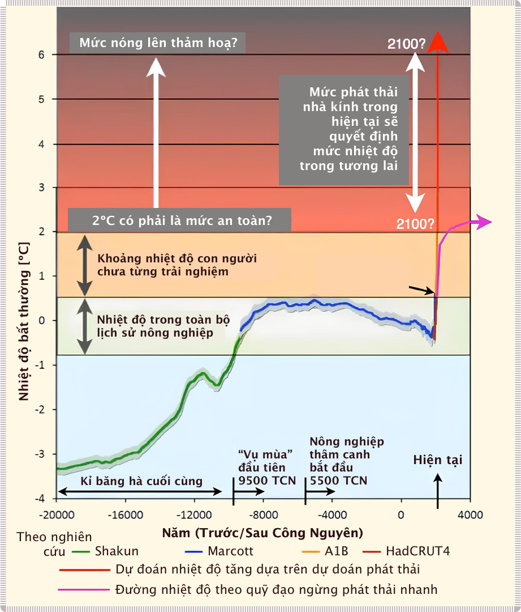

# Nền kinh tế cho tương lai

Môi trường và nền kinh tế của chúng ta đang ở ngã ba đường. Bài viết này cố gắng tường thuật một cách mạch lạc về cách con người tiến hóa trong hành vi, tiền bạc, năng lượng, kinh tế và môi trường dung hoà với nhau. Con người cố gắng đạt được trạng thái cảm xúc (*emotional state*) giống như tổ tiên đã thành công của chúng ta. Trong một môi trường giàu tài nguyên, chúng ta phối hợp theo nhóm, tập đoàn và quốc gia, để tối đa hóa thặng dư tài chính, gắn liền với năng lượng và với carbon. Ở quy mô toàn cầu, kết quả nổi bật của sự kết hợp này là một xã hội hữu cơ (*superorganism*) tiêu thụ năng lượng vô độ và phát thải khí CO2 thiếu kiểm soát. Theo đà này, chúng ta hiện đang bị ‘hạn chế phát triển’ (*growth constrained*) về hành vi và sẽ sử dụng mọi biện pháp có thể để tránh phải đối mặt với thực tế. Chúng ta  càng phát triển thì khoảng cách giữa thực tế tài chính (*financial reality*) và thực tế vật chất (*physical reality*) của chúng ta càng lớn. Thời điểm hiệu chỉnh hay tái cân bằng diễn ra sẽ 
là một bước ngoặt (*watershed time*) cho nền văn hóa của chúng ta, nhưng cũng có thể là sự ra đời của một ‘nền kinh tế mang tính hệ thống’ (*systems economics*) mới, từ đó phát triển là những cách sống. 30 năm tới là thời gian để áp dụng
tất cả những gì chúng ta đã học được trong suốt 30 năm qua. Chúng ta tiến tới việc thảo luận trên qui mô sự tồn vong của một giống loài (*species level conversation*).

!!! quote "Robert Costanza"

    “Kinh tế học sinh thái giải quyết các mối quan hệ giữa hệ sinh thái và hệ thống kinh tế theo nghĩa rộng nhất”&mdash;câu đầu tiên trong bài báo đầu tiên trong số đầu tiên của Kinh tế học sinh thái (*ecological economics*).

!!! quote "E.O. Wilson"

    “Vấn đề thực sự của nhân loại như sau: chúng ta có những cảm xúc cổ xưa, những thể chế thời trung cổ và công nghệ thần thánh.”
    
!!! quote "Jean Baudrillard"

    “Chúng ta sống trong một thế giới ngày càng có nhiều thông tin và ngày càng ít ý nghĩa hơn.”

!!! quote "James Baldwin"

    “Không phải mọi thứ phải đối mặt đều có thể thay đổi, nhưng không có gì có thể thay đổi cho đến khi nó được đối mặt”.

## Tổng quan

Bất chấp hàng thập kỷ cảnh báo, thỏa thuận, và hoạt động phòng trào (*activism*) tích cực, mức tiêu thụ năng lượng của con người, lượng khí thải và nồng độ CO~2~ trong khí quyển đều đạt kỷ lục mới vào năm 2018. Nếu nền kinh tế toàn cầu tiếp tục tăng trưởng ở mức khoảng 3,0% mỗi năm, chúng ta sẽ tiêu thụ nhiều năng lượng và vật liệu trong khoảng 30 năm tới tương đương những gì chúng ta đã tích lũy trong 10.000 năm qua. Một kịch bản như vậy có thể tránh khỏi hay không? Liệu một kịch bản như vậy có khả thi hay không?

Cùng lúc, chúng ta nhận được những lời nhắc nhở hàng ngày rằng nền kinh tế toàn cầu không còn hoạt động như trước đây, chẳng hạn như sự giàu có và bất bình đẳng thu nhập gia tăng, sự phụ thuộc lớn vào nợ và bảo lãnh của chính phủ, các phong trào chính trị dân túy, sự lãnh cảm (*apathy*), căng thẳng (*tension*) và bạo lực (*violence*) gia tăng, và suy thoái sinh thái (*ecology decay*). Để tránh phải đối mặt với những hậu quả của thực tế sinh-lý học (*biophysical reality*) của thế giới, chúng ta hiện đang tăng trưởng theo cách ngày càng không bền vững. Thế giới phát triển đang sử dụng tài chính cho phép khai thác và sản xuất những thứ mà chúng ta vốn không đủ khả năng chi trả để khai thác và tiêu thụ.

Với bối cảnh này, loại hệ thống kinh tế tương lai nào hiện sẽ khả thi? Kế hoạch nào sẽ cho phép chúng xuất hiện? Trong toàn bộ thế Nhân loại (*Anthropocene*&mdash;giai đoạn gần đây nhất trong lịch sử Trái Đất), một cái nhìn sâu sắc về mối quan hệ giữa các hệ sinh thái và hệ thống kinh tế theo nghĩa rộng nhất gợi ý điều gì về tương lai của cộng đồng con người? Kinh tế học sinh thái (*Ecological economics*) đã đi trước thời đại trong việc nhận ra tầm quan trọng căn bản của các dịch vụ do tự nhiên cung cấp (*nature’s service*) và nền tảng sinh-lý học của nền kinh tế con người. Liệu giờ đây nó có thể thu thập một kế hoạch chi tiết cho một cuộc ‘tái thiết’ để dẫn đường cho con người không?

Trước khi kê đơn, trước tiên chúng ta cần chẩn đoán toàn diện về bệnh nhân. Vào năm 2019 (khi nghiên cứu này được viết), chúng ta cần đi xa hơn việc liệt kê từng mắt xích có vấn đề. Một mô tả mạch lạc về nền kinh tế toàn cầu đòi hỏi một cái nhìn hệ thống: mô tả các bộ phận, quy trình, cách các bộ phận và quy trình tương tác với nhau và những tương tác này ngụ ý gì về các khả năng trong tương lai. Bài viết này cung cấp một cái nhìn tổng quan ngắn gọn về mối quan hệ giữa hành vi của con người, nền kinh tế và môi trường Trái đất. Nó chỉ rõ cách xã hội tự tổ chức của một loài xung quanh thặng dư đã biến đổi cách nó vận hành thành một “xã hội hữu cơ” duy nhất, vô tri và đói năng lượng. Cuối cùng, nó đưa ra đánh giá về những hạn chế và cơ hội của chúng ta, đồng thời gợi ý cách thức phát triển một hệ thống kinh tế thông minh hơn.

## Giới thiệu

Phần lớn thời gian trong 300.000 năm qua, con người sống trong các nhóm di cư bền vững, bình đẳng, nơi mà khí hậu bất ổn và mức CO2 thấp khiến cho sự thành công trong nông nghiệp là điều khó xảy ra. Khoảng 11.000 năm trước, khí hậu bắt đầu ấm lên, cuối cùng ổn định ở mức ấm hơn so với 100.000 năm về trước (**Hình 1**). Sự ổn định này cho phép nông nghiệp phát triển ở ít nhất bảy địa điểm riêng biệt trên khắp thế giới. Lần đầu tiên, các nhóm người bắt đầu tổ chức xung quanh thặng dư vật chất&mdash;sản xuất vượt quá nhu cầu calo trước mắt của nhóm. Vì một số thành viên không còn phải dành thời gian cho việc săn bắn và hái lượm, nên thặng dư này cho phép phát triển các công việc mới, thêm hệ thống phân cấp và sự phức tạp. Động lực mới lạ này đã dẫn đến nông nghiệp lan rộng và các xã hội nhà nước quy mô lớn trong vài nghìn năm tiếp theo.

> **Hình 1**: Nhiệt độ trái đất trong 20.000 năm.
Hình ảnh: [Jos Hagelaars/Max Edkins/World Bank](https://qz.com/154196/the-only-way-to-stop-climate-change-now-may-be-revolution)

Vào thế kỷ 19, quá trình này đã được đẩy nhanh nhờ việc phát hiện ra carbon hóa thạch trên quy mô lớn và việc phát minh ra các công nghệ sử dụng nó làm nhiên liệu. Carbon hóa thạch đã cung cấp cho con người một nguồn năng lượng cực kỳ hiệu quả (nhưng hữu hạn) có thể khai thác theo tốc độ chúng ta muốn, không giống như nguồn ánh sáng mặt trời cố định và có độ khuếch tán lớn của các thời đại trước.

Nguồn năng lượng dồi dào này đã giúp thế kỷ 20 trở thành một thời kỳ độc nhất vô nhị trong lịch sử loài người: **1)** nhiều tài nguyên hơn (và rẻ hơn) dẫn đến năng suất tăng mạnh và tăng trưởng kinh tế chưa từng có, **2)** hệ thống tài chính dựa trên nợ không còn phụ thuộc vào vật chất cho phép mở rộng tín dụng và tăng tốc tiêu dùng liên quan, **3)** tất cả những điều này thúc đẩy thặng dư tài nguyên cho phép các xã hội đa dạng và phong phú hơn.

Thế kỷ 21 đang chuyển hướng khỏi quỹ đạo đó: **1)** năng lượng và tài nguyên một lần nữa trở thành yếu tố cản trở sự phát triển kinh tế và xã hội, **2)** mở rộng vật chất dựa trên tín dụng đang trở nên rủi ro hơn và cuối cùng sẽ đạt đến giới hạn, **3)** xã hội đang trở nên phân cực và mất niềm tin vào chính phủ, phương tiện truyền thông và khoa học, và **4)** các hệ sinh thái đang bị suy thoái khi chúng hấp thụ một lượng lớn năng lượng và chất thải vật chất từ các hệ thống của con người.

Từ đây chúng ta sẽ đi đến đâu?

