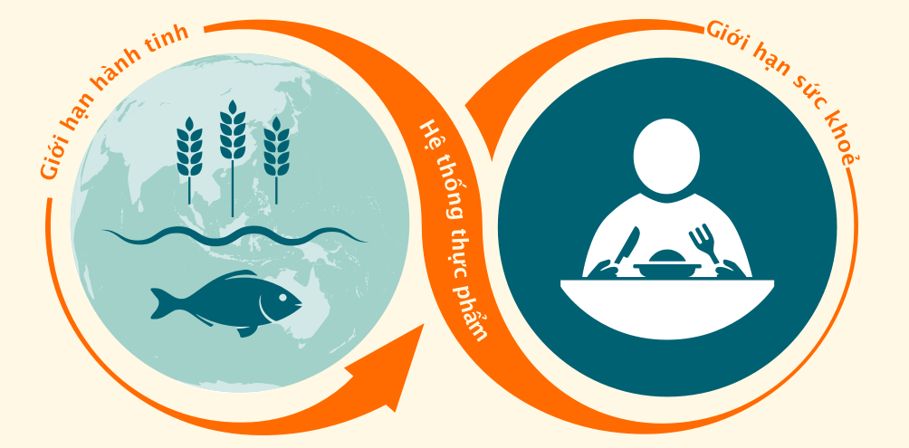
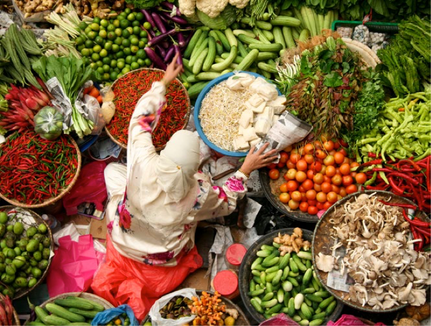
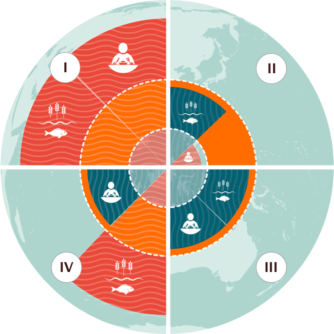
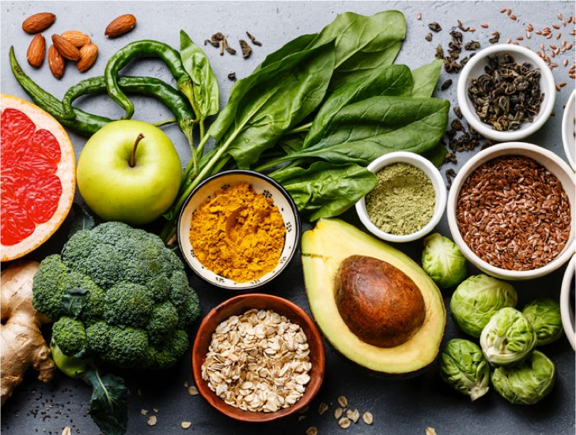

# Chúng ta có thể cung cấp cho dân số tương lai 10 tỷ người một chế độ ăn uống lành mạnh trong giới hạn hành tinh hay không?

Ủy ban EAT-Lancet về Thực phẩm, Hành tinh, Sức khỏe đã tập hợp 37 nhà khoa học hàng đầu thế giới từ khắp nơi trên thế giới để trả lời câu hỏi trên. Câu trả lời là có, nhưng điều này sẽ không thể thực hiện được nếu không thay đổi thói quen ăn uống, cải thiện sản xuất lương thực và giảm lãng phí thực phẩm.

Báo cáo EAT-Lancet là đánh giá khoa học đầy đủ đầu tiên về những gì cấu thành một chế độ ăn uống lành mạnh từ một hệ thống thực phẩm bền vững và những hành động nào có thể hỗ trợ và tăng tốc độ chuyển đổi hệ thống thực phẩm.

!!! quote "Giáo sư Walter Willet, Trường Sức khoẻ cộng đồng T.H Chan, Đại học Harvard:"

    Chuyển đổi sang chế độ ăn uống lành mạnh từ nay đến năm 2050 sẽ yêu cầu thay đổi đáng kể chế độ ăn. Tiêu thụ trái cây, rau, quả hạch và các loại đậu trên toàn cầu sẽ phải tăng gấp đôi, và việc tiêu thụ các loại thực phẩm như thịt đỏ và đường sẽ phải giảm hơn 50%. Một chế độ ăn giàu **thực phẩm có nguồn gốc thực vật** (*plant-based foods*) và ít thực phẩm có nguồn gốc động vật mang lại cả lợi ích về sức khỏe và môi trường được cải thiện.

<iframe style="display: block; margin: auto;" width="560" height="315" src="https://www.youtube.com/embed/69vjahecuC8?hl=vi&cc_lang=vi&cc_lang_pref=vi&cc_load_policy=1" title="YouTube video player" frameborder="0" allow="accelerometer; autoplay; clipboard-write; encrypted-media; gyroscope; picture-in-picture; web-share" allowfullscreen></iframe>

## Thực phẩm trong [thế Nhân loại](https://vi.wikipedia.org/wiki/Anthropocene) (*Anthropocene*)[^1]: Chế độ ăn uống lành mạnh từ các hệ thống thực phẩm bền vững

[^1]:

    **Anthropocene**, còn gọi là **thế Nhân tân** hay **thế Nhân loại**, là thuật ngữ được một số nhà khoa học sử dụng để miêu tả giai đoạn gần đây nhất trong lịch sử Trái Đất. Nó không có điểm khởi đầu chính xác, nhưng có thể coi là bắt đầu vào khoảng cuối thế kỷ 18, khi những hoạt động của loài người mới bắt đầu có ảnh hưởng toàn cầu đến khí hậu và hệ sinh thái của Trái Đất.

Thực phẩm là chìa khoá lớn nhất để tối ưu sức khỏe con người và sự bền vững của môi trường trên Trái đất. Tuy nhiên, [vấn đề] thực phẩm hiện đang đe dọa cả con người và hành tinh. Một thách thức to lớn đối với nhân loại là làm sao cung cấp cho dân số thế giới ngày càng tăng **chế độ ăn uống lành mạnh** (*healthy diet*) từ các **hệ thống thực phẩm bền vững** (*sustainable food system*). Mặc dù sản xuất lương thực toàn cầu tính theo calo nói chung đã bắt kịp tốc độ tăng dân số, nhưng hơn 820 triệu người vẫn thiếu lương thực và nhiều người khác tiêu thụ chế độ ăn kém chất lượng hay ăn quá nhiều. Chế độ ăn uống không lành mạnh hiện nay có nguy cơ dẫn đến bệnh tật và tử vong cao hơn cả tình dục không an toàn, sử dụng rượu, ma túy và thuốc lá cộng lại. Sản xuất lương thực toàn cầu đe dọa sự ổn định khí hậu và khả năng phục hồi của hệ sinh thái, đồng thời là nguyên nhân lớn nhất dẫn đến suy thoái môi trường và xâm phạm ranh giới hành tinh. Tổng hợp lại thì kết quả thật thảm khốc. **Một sự chuyển đổi triệt để của hệ thống lương thực toàn cầu là điều rất cần thiết.** 

!!! quote "Lời dẫn"

    Nếu không hành động, thế giới có nguy cơ không đạt được các Mục tiêu Phát triển Bền vững của Liên hợp quốc (SDGs) và Thỏa thuận chung Paris, và trẻ em ngày nay sẽ thừa hưởng một hành tinh đã bị suy thoái nghiêm trọng, nơi mà phần lớn dân số sẽ ngày càng bị suy dinh dưỡng và mắc các bệnh có thể phòng ngừa được.

Có bằng chứng khoa học đáng kể liên kết **chế độ ăn uống với sức khỏe con người và sự bền vững của môi trường**. Tuy nhiên, sự vắng mặt của các mục tiêu khoa học nhất quán trên toàn cầu về chế độ ăn uống lành mạnh và sản xuất lương thực bền vững đã cản trở những nỗ lực phối hợp trên quy mô lớn để chuyển đổi hệ thống lương thực toàn cầu. Để giải quyết nhu cầu cấp thiết này, **Ủy ban EAT-Lancet đã triệu tập 37 nhà khoa học hàng đầu từ 16 quốc gia trong các lĩnh vực khác nhau bao gồm sức khỏe con người, nông nghiệp, khoa học chính trị và bền vững môi trường để phát triển các mục tiêu khoa học toàn cầu cho chế độ ăn uống lành mạnh và sản xuất thực phẩm bền vững.** Đây là nỗ lực đầu tiên nhằm đặt ra các mục tiêu khoa học phổ quát cho hệ thống thực phẩm áp dụng cho tất cả mọi người và hành tinh.

Ủy ban tập trung vào hai “điểm cuối” của hệ thống lương thực toàn cầu: sự tiêu thụ thực phẩm (chế độ ăn uống lành mạnh) và sản xuất (sản xuất lương thực bền vững, xem **Hình 1**). Những yếu tố này ảnh hưởng không cân xứng đến sức khỏe con người và sự bền vững của môi trường. Ủy ban thừa nhận rằng các hệ thống thực phẩm có tác động đến môi trường dọc theo toàn bộ chuỗi cung ứng từ sản xuất đến chế biến và bán lẻ, và hơn thế nữa, vượt ra ngoài sức khỏe con người và môi trường bằng cách ảnh hưởng đến xã hội, văn hóa, kinh tế, sức khỏe và phúc lợi của động vật. Tuy nhiên, với bề rộng và chiều sâu của từng chủ đề này, cần phải đặt nhiều vấn đề quan trọng ngoài phạm vi xem xét của Ủy ban.

???+ note "Hình 1: Sức khoẻ con người và Tính bền vững"

    Một chương trình nghị sự tổng hợp về thực phẩm trong **Thế Nhân loại** thừa nhận rằng thực phẩm tạo ra mối liên kết chặt chẽ giữa sức khỏe con người và tính bền vững của môi trường. Hệ thống lương thực toàn cầu phải hoạt động trong phạm vi sức khỏe con người và sản xuất lương thực để đảm bảo chế độ ăn uống lành mạnh từ hệ thống lương thực bền vững cho gần 10 tỷ người vào năm 2050.

## Để đạt được chế độ ăn uống tốt cho sức khỏe hành tinh cho gần 10 tỷ người vào năm 2050

Đã có nhiều nghiên cứu về tác động môi trường của các chế độ ăn khác nhau, với hầu hết các nghiên cứu kết luận rằng **chế độ ăn giàu thực phẩm có nguồn gốc thực vật và ít thực phẩm có nguồn gốc động vật mang lại cả lợi ích về sức khỏe và môi trường**. Nhìn chung, các tài liệu chỉ ra rằng những chế độ ăn như vậy là **“đôi bên cùng có lợi”** (*win-win*) ở chỗ chúng tốt cho cả con người và hành tinh. Tuy nhiên, vẫn chưa có sự đồng thuận toàn cầu về những yếu tố cấu thành nên chế độ ăn uống lành mạnh và sản xuất thực phẩm bền vững và liệu chế độ ăn uống vì **sức khỏe hành tinh** (*planetary health*)[^2] có thể đạt được cho dân số toàn cầu là 10 tỷ người vào năm 2050 hay không.

[^2]:

    **Sức khỏe hành tinh** đề cập đến “sức khỏe của nền văn minh nhân loại và trạng thái của các hệ thống tự nhiên mà nó phụ thuộc vào”. Khái niệm này được đưa ra vào năm 2015 bởi Ủy ban Lancet của Quỹ Rockefeller về sức khỏe hành tinh để cải cách lĩnh vực y tế công cộng, vốn có truyền thống tập trung vào sức khỏe của người dân mà không xem xét các hệ thống tự nhiên. Ủy ban EAT-Lancet xây dựng dựa trên khái niệm về sức khỏe hành tinh và đưa ra thuật ngữ mới “chế độ ăn uống vì sức khỏe hành tinh” để làm nổi bật vai trò quan trọng của chế độ ăn uống trong việc liên kết sức khỏe con người với sự bền vững của môi trường và nhu cầu tích hợp các chương trình nghị sự thường tách biệt này thành một chương trình nghị sự toàn cầu chung về chuyển đổi hệ thống lương thực để đạt được SDGs và Thỏa thuận Paris.

Bằng cách đánh giá các bằng chứng khoa học hiện có, Ủy ban đã phát triển các mục tiêu khoa học toàn cầu cho chế độ ăn uống lành mạnh và sản xuất thực phẩm bền vững, đồng thời tích hợp các mục tiêu khoa học phổ quát này vào một khuôn khổ chung, **không gian vận hành an toàn cho các hệ thống thực phẩm**, để chế độ ăn uống lành mạnh cho hành tinh (vừa lành mạnh vừa bền vững với môi trường) có thể được xác định. Không gian hoạt động an toàn này được xác định bởi các mục tiêu khoa học cụ thể cho lượng ăn vào của các nhóm thực phẩm cụ thể (ví dụ: 100g đến 300g trái cây/ngày) để tối ưu hóa sức khỏe con người và các mục tiêu khoa học để sản xuất lương thực bền vững nhằm đảm bảo hệ thống Trái đất ổn định (xem **Hình 2**).

Các ranh giới của không gian hoạt động an toàn được đặt ở đầu dưới của phạm vi không chắc chắn khoa học (*scientific uncertainty range*), thiết lập một “không gian an toàn”, mà nếu vi phạm, sẽ đẩy nhân loại vào **vùng không chắc chắn** (*uncertainty zone*) của các rủi ro gia tăng. Hoạt động bên ngoài không gian này cho bất kỳ quy trình nào của hệ thống Trái đất (ví dụ: tỷ lệ mất đa dạng sinh học cao) hoặc nhóm thực phẩm (ví dụ: lượng rau ăn vào không đủ) làm tăng nguy cơ gây hại cho sự ổn định của hệ thống Trái đất và sức khỏe con người. Khi được xem cùng nhau như một chương trình nghị sự về sức khỏe và tính bền vững tích hợp, các mục tiêu khoa học xác định không gian hoạt động an toàn cho các hệ thống thực phẩm cho phép đánh giá chế độ ăn uống và thực hành sản xuất thực phẩm nào cùng nhau sẽ cho phép đạt được SDGs và Thỏa thuận Paris.

???+ note "Hình 2: Thực phẩm và giới hạn bền vững"
    
    Các mục tiêu khoa học xác định không gian hoạt động an toàn cho thực phẩm các hệ thống và được thể hiện ở đây bằng vòng màu cam. Các nêm trong vòng tròn đại diện cho mô hình chế độ ăn uống hoặc sản phẩm thực phẩm&mdash;chúng cùng nhau phản ánh các chế độ ăn khác nhau có thể hoặc không thể đáp ứng các mục tiêu khoa học cho sức khỏe con người và tính bền vững về môi trường, tức là nằm ngoài phạm vi an toàn không gian hoạt động. Những chế độ ăn này có thể **“không lành mạnh và không bền vững” (I)**, **“không lành mạnh và bền vững” (II)**, **“lành mạnh và không bền vững” (IV)**,  và **“lành mạnh và bền vững” (III)**.

## Chế độ ăn lành mạnh

Một chế độ ăn uống lành mạnh nên tối ưu hóa sức khỏe, được định nghĩa rộng rãi là trạng thái hoàn toàn thoải mái về thể chất, tinh thần và xã hội chứ không chỉ đơn thuần là không có bệnh tật. Các mục tiêu khoa học cho chế độ ăn uống lành mạnh dựa trên nhiều tài liệu về thực phẩm, mô hình ăn kiêng và kết quả sức khỏe (xem **Bảng 1**).

Chế độ ăn uống lành mạnh có lượng calo hấp thụ tối ưu và chủ yếu bao gồm nhiều loại thực phẩm có nguồn gốc thực vật, ít thực phẩm có nguồn gốc động vật, chứa chất béo không bão hòa thay vì chất béo bão hòa, và một lượng hạn chế ngũ cốc tinh chế, thực phẩm chế biến cao và đường bổ sung .

???+ note "Bảng 1: Dinh dưỡng trung bình hàng ngày"

    Các mục tiêu khoa học cho chế độ ăn uống vì sức khỏe hành tinh, với các phạm vi có thể, cho lượng tiêu thụ 2500 kcal/ngày.

!!! quote "Ghi chú"

    Việc chuyển đổi sang chế độ ăn uống lành mạnh vào năm 2050 sẽ đòi hỏi những thay đổi đáng kể về chế độ ăn uống.

Điều này bao gồm việc **tăng hơn gấp đôi lượng tiêu thụ các loại thực phẩm tốt cho sức khỏe như trái cây, rau, các loại đậu và hạt, đồng thời giảm hơn 50% lượng tiêu thụ toàn cầu đối với các loại thực phẩm kém lành mạnh như đường bổ sung và thịt đỏ** (tức là chủ yếu bằng cách giảm tiêu thụ quá mức ở các nước giàu hơn). Tuy nhiên, một số quần thể trên toàn thế giới phụ thuộc vào sinh kế nông nghiệp và đạm động vật từ vật nuôi. Ngoài ra, nhiều vùng dân cư tiếp tục phải đối mặt với gánh nặng suy dinh dưỡng đáng kể và việc có đủ lượng vi chất dinh dưỡng chỉ từ thực phẩm có nguồn gốc thực vật có thể khó khăn. Với những cân nhắc này, vai trò của thực phẩm có nguồn gốc động vật trong chế độ ăn của người dân phải được xem xét cẩn thận trong từng bối cảnh và trong thực tế địa phương và khu vực.

Ủy ban đã phân tích các tác động tiềm ẩn của việc thay đổi chế độ ăn uống đối với tỷ lệ tử vong do bệnh liên quan đến chế độ ăn uống bằng cách sử dụng ba phương pháp tiếp cận (xem **Bảng 2**). Cả ba cách tiếp cận đều kết luận rằng những thay đổi về chế độ ăn từ chế độ ăn hiện tại sang chế độ ăn lành mạnh có khả năng mang lại những lợi ích sức khỏe lớn. Điều này bao gồm việc ngăn ngừa khoảng 11 triệu ca tử vong mỗi năm, chiếm từ 19% đến 24% tổng số ca tử vong ở người trưởng thành.

???+ note "Những cái chết ước tính được ngăn chặn" 

    ...ở người trưởng thành bằng cách áp dụng toàn cầu chế độ ăn uống lành mạnh cho hành tinh.

## Sản xuất lương thực bền vững

Các hệ thống và quá trình địa sinh học tương tác trong hệ thống Trái đất, đặc biệt là giữa hệ thống khí hậu và sinh quyển, điều chỉnh trạng thái của hành tinh. Ủy ban tập trung vào sáu trong số này (**Bảng 3**), là những hệ thống và quy trình chính bị ảnh hưởng bởi quá trình sản xuất thực phẩm và nhờ đó mà bằng chứng khoa học cho phép cung cấp các mục tiêu có thể định lượng. Các hệ thống và quy trình này đang ngày càng được công nhận là các thông số cần thiết cho một định nghĩa toàn hệ thống về sản xuất lương thực bền vững. Đối với mỗi yếu tố trong số này, **Ủy ban đề xuất các giới hạn mà sản xuất lương thực toàn cầu nên nằm trong phạm vi đó để giảm nguy cơ không thể đảo ngược và có thể xảy ra những thay đổi thảm khốc trong hệ thống Trái đất.** Các ranh giới hành tinh này đối với sản xuất lương thực về mặt khái niệm xác định giới hạn trên của các tác động môi trường đối với sản xuất lương thực ở quy mô toàn cầu.

Đối với giới hạn biến đổi khí hậu đối với sản xuất lương thực, giả định cơ bản đã được áp dụng là thế giới sẽ tuân theo Thỏa thuận chung Paris (giữ cho sự nóng lên toàn cầu ở mức dưới 2°C, hướng tới 1,5°C) và **khử cacbon** (*decarbonization*) hệ thống năng lượng toàn cầu vào năm 2050. Người ta cũng giả định rằng nông nghiệp thế giới sẽ chuyển đổi sang sản xuất lương thực bền vững, dẫn đến sự chuyển đổi từ việc sử dụng đất là nguồn phát thải carbon ròng sang trở thành nơi hấp thụ carbon ròng. Do đó, các ước tính về giới hạn là đánh giá lượng khí không phải CO2 tối đa (tức là khí mê-tan và oxit nitơ) đã được đánh giá là cần thiết và khó giảm hơn nữa&mdash;ít nhất là trước năm 2050&mdash;để đạt được cả hai chế độ ăn uống lành mạnh cho tất cả mọi người trên hành tinh và các mục tiêu của Thoả thuận chung Paris.

> `*`Phạm vi giới hạn thấp hơn nếu thực hành sản xuất cải tiến và phân phối lại không được áp dụng. 

> `**`Phạm vi giới hạn trên nếu áp dụng các phương pháp sản xuất và phân phối lại cải tiến và 50% lượng phốt-pho đã sử dụng được tái chế.

???+ "Bảng 3: Các mục tiêu khoa học" 

    ...cho sáu quy trình chính của hệ thống Trái đất và các biến số điều khiển được sử dụng để định lượng các giới hạn hành tinh.

    

### Đạt được chế độ ăn uống lành mạnh cho hành tinh.

Đạt được một hệ thống thực phẩm bền vững có thể cung cấp chế độ ăn uống lành mạnh cho dân số ngày càng tăng là những thách thức ghê gớm. Việc tìm kiếm giải pháp cho những thách thức này đòi hỏi sự hiểu biết về tác động môi trường của các hành động khác nhau. Các hành động có thể thực hiện được mà Ủy ban đã điều tra là: 1) Sự thay đổi toàn cầu đối với chế độ ăn uống lành mạnh; 2) thực hành sản xuất thực phẩm được cải thiện; và 3) giảm thất thoát và lãng phí lương thực (xem Liệt kê bên dưới). Mục đích của Ủy ban là xác định một tập hợp các hành động đáp ứng các mục tiêu khoa học về chế độ ăn uống lành mạnh và sản xuất lương thực bền vững, điều này sẽ cho phép chuyển đổi hệ thống lương thực toàn cầu sang không gian vận hành an toàn.

!!! info "Các hành động được cân nhắc để giảm tác động môi trường từ sản xuất lương thực"

    - **Thay đổi chế độ ăn uống** (*Dietary Shift*) (kí hiệu là DS): Chế độ ăn uống lành mạnh cho hành tinh&mdash;như được nêu trong **Bảng 1**.

    - **Giảm một nửa lãng phí thực phẩm** (*Halve waste*): Thất thoát và lãng phí lương thực giảm một nửa, phù hợp với mục tiêu SDG 12.3.

    - **PROD**: Thu hẹp khoảng cách **sản lượng** (*yield*) xuống còn khoảng 75%; cân đối lại lượng bón đạm, lân giữa vùng bón thừa và bón thiếu; cải thiện quản lý nước; và thực hiện các phương án giảm thiểu nông nghiệp mang tính kinh tế với chi phí carbon dự kiến cho xã hội vào năm 2050. Đối với đa dạng sinh học, người ta cho rằng trước tiên đất đai được mở rộng thành môi trường sống thứ cấp hoặc các hệ sinh thái được quản lý khác và sau đó là các khu rừng nguyên sinh.

    - **PROD+**: Thực hành tham vọng ở mức độ cao dựa trên kịch bản PROD, bao gồm thu hẹp khoảng cách sản lượng xuống 90%; tăng 30% hiệu quả sử dụng nitơ và 50% tỷ lệ tái chế phốt- pho; loại bỏ dần nhiên liệu sinh học thế hệ thứ nhất và thực hiện tất cả các giải pháp từ dưới lên hiện có để giảm thiểu phát thải khí nhà kính liên quan đến thực phẩm. Đối với đa dạng sinh học, người ta cho rằng việc sử dụng đất được tối ưu hóa giữa các vùng sao cho giảm thiểu tác động đến đa dạng sinh học.

Áp dụng khuôn khổ này cho các dự đoán về sự phát triển thế giới trong tương lai chỉ ra rằng các hệ thống thực phẩm có thể cung cấp chế độ ăn uống lành mạnh (được định nghĩa ở đây là chế độ ăn uống tham khảo) cho dân số ước tính khoảng 10 tỷ người vào năm 2050 và duy trì trong một không gian hoạt động an toàn. Tuy nhiên, ngay cả sự gia tăng nhỏ trong việc tiêu thụ thịt đỏ hoặc thực phẩm từ sữa cũng sẽ khiến mục tiêu này khó đạt được hoặc không thể đạt được. Phân tích cho thấy rằng việc duy trì không gian hoạt động an toàn cho các hệ thống thực phẩm đòi hỏi **sự kết hợp của những thay đổi đáng kể đối với các chế độ ăn chủ yếu dựa trên thực vật, giảm đáng kể thất thoát và lãng phí thực phẩm cũng như những cải tiến lớn trong thực hành sản xuất thực phẩm**. Mặc dù một số hành động riêng lẻ là đủ để giữ một yếu tố nào đó nằm trong giới hạn hành tinh cụ thể, nhưng không có biện pháp can thiệp đơn lẻ nào là đủ để đồng thời giữ tất cả các chu trình trái đất năm trong giới hạn hành tinh cùng một lúc.

???+ note "Bảng 5: Các kịch bản đến năm 2050"

    Các kịch bản khác nhau thể hiện các tác động môi trường của việc thực hiện hành động được nêu trong **Bảng 4**. Màu sắc minh họa liệu các tác động môi trường có vượt qua ranh giới sản xuất lương thực hay không: xanh lá cây&mdash;dưới giá trị phạm vi thấp hơn; xanh nhạt&mdash;bên dưới hoặc bằng ranh giới nhưng trên giá trị phạm vi thấp hơn; màu vàng&mdash;trên ranh giới nhưng dưới giá trị phạm vi trên; màu đỏ&mdash;trên giá trị phạm vi trên. BAU biểu thị hoạt động kinh doanh như kịch bản thông thường.

!!! quote "Giáo sư Johan Johan Rockström, Viện nghiên cứu tác động khí hậu Potsdam & Trung tâm phục hồi Stockholm"  

    Sản xuất lương thực toàn cầu đe dọa sự ổn định khí hậu và khả năng phục hồi của hệ sinh thái Nó tạo thành động lực lớn nhất duy nhất của suy thoái và vi phạm môi trường của các ranh giới hành tinh. Tổng hợp lại thì kết quả thật thảm khốc. Một sự chuyển đổi triệt để của hệ thống lương thực toàn cầu là rất cần thiết. Nếu không hành động, thế giới có nguy cơ không đạt được các Mục tiêu Phát triển Bền vững của Liên hợp quốc và Thỏa thuận chung Paris.

## Năm chiến lược Chuyển đổi chế độ ăn

Trước đây, nhân loại chưa bao giờ bắt đầu thay đổi hoàn toàn hệ thống lương thực ở quy mô hoặc tốc độ mà Ủy ban dự kiến. Không có giải pháp “viên đạn bạc” nào cho các vấn đề. Chúng ta cần phải làm việc chăm chỉ, có ý chí chính trị và đủ nguồn lực. Những người phản đối sẽ cảnh báo về những hậu quả không lường trước được hay lập luận rằng hành động trong trường hợp này là quá sớm hay nên để mặc cho các động lực hiện có. Ủy ban này không đồng ý. **Những dữ liệu đầy đủ và mạnh mẽ cho thấy hành động cần phải được thực hiện ngay. Trì hoãn hành động sẽ chỉ làm tăng khả năng xảy ra hậu quả nghiêm trọng, thậm chí rất tai hại.** Rõ ràng là một cuộc **Chuyển đổi Lương thực Vĩ đại** sẽ không xảy ra nếu không có hành động đa ngành, đa cấp rộng rãi, phải được hướng dẫn bởi các mục tiêu khoa học.

### Chiến lược 1: Tìm kiếm cam kết quốc tế và quốc gia để chuyển sang chế độ ăn uống lành mạnh

Các mục tiêu khoa học do Ủy ban này đặt ra cung cấp hướng dẫn cho sự thay đổi cần thiết, khuyến nghị **tăng cường tiêu thụ thực phẩm có nguồn gốc thực vật&mdash;bao gồm trái cây, rau, quả hạch, hạt và ngũ cốc nguyên hạt&mdash;trong khi ở nhiều nơi hạn chế đáng kể thực phẩm có nguồn gốc động vật.** Cam kết phối hợp này có thể đạt được bằng cách làm cho thực phẩm lành mạnh trở nên sẵn có hơn, dễ tiếp cận hơn và giá cả phải chăng thay cho những lựa chọn thay thế không lành mạnh hơn, cải thiện thông tin và tiếp thị thực phẩm, đầu tư vào thông tin y tế công cộng và giáo dục bền vững, thực hiện hướng dẫn chế độ ăn uống dựa trên thực phẩm và sử dụng dịch vụ chăm sóc sức khỏe dịch vụ cung cấp lời khuyên và can thiệp về chế độ ăn uống.

???+ note "Bảng 6: Kịch bản sản xuất lương thực đến năm 2050" 

    Dự đoán thay đổi trong sản xuất lương thực từ năm 2010 đến năm 2050 (phần trăm so với kịch bản năm 2010) đối với **kinh doanh như thường lệ** (*Business as usual*) **BAU** với hoàn toàn chất thải, chế độ ăn uống vì sức khỏe hành tinh với hoàn toàn chất thải và chế độ ăn uống vì sức khỏe hành tinh với kịch bản giảm một nửa lãng phí lương thực.

