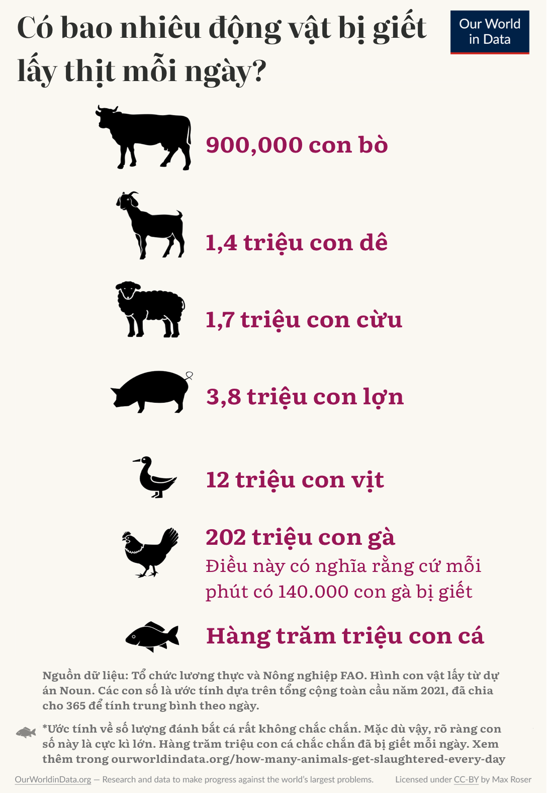

# Có bao nhiêu động vật bị giết thịt mỗi ngày?

## Có hàng trăm triệu động vật bị giết để lấy thịt mỗi ngày. 

!!! quote ""

    Nhân loại tiêu thụ thịt ở quy mô khổng lồ, 360 triệu tấn thịt mỗi năm.

Con số này lớn đến mức tôi thấy không thể hiểu nổi. Để dễ hiểu hơn, tôi chuyển đổi những con số này từ khối lượng thịt tiêu thụ sang số lượng cá thể và từ tổng số hàng năm sang số lượng hàng ngày. Hình dưới đây là kết quả những gì tôi đã làm. Nó cho thấy trung bình có bao nhiêu động vật bị giết thịt trong một ngày.

Khoảng 900.000 con bò bị giết thịt mỗi ngày. Nếu mỗi con bò dài 2 mét và tất cả chúng đều đi theo sau nối đuôi nhau thì hàng bò này sẽ dài 1.800 km[^1]. Đây là số lượng bò bị giết thịt mỗi ngày.

[^1]:

    Chiều dài cơ thể bò 2m là một ước tính vừa phải. Loài Holstein Friesian điển hình có chiều dài cơ thể từ 2,35m đến 2,5m. Khoảng cách giữa Madrid và Amsterdam là khoảng 1800 km. Theo đó nếu tính theo năm, con số này (độ dài hàng bò) gấp hơn 16 lần chu vi Trái đất (40.075 km): 365 ngày × 1.800km / 40.075 km = 16,4 (lần)

Đối với gà, số lượng bị giết thịt hàng ngày cực kỳ lớn&mdash;khoảng 202 triệu con mỗi ngày. Để hiểu rõ hơn được về quy mô, tính trung bình mỗi phút có 140.000 con gà bị giết thịt.

Số lượng cá bị giết mỗi ngày rất không chắc chắn. Tôi sẽ thảo luận chi tiết về vấn đề này ở phần phụ lục cuối bài viết này. Mặc dù khoảng ước tính không chắc chắn lớn, rõ ràng số lượng cá bị giết là rất vô cùng nhiều: chắc chắn có hàng trăm triệu con cá bị giết mỗi ngày.

Nếu bạn tin rằng việc giết hại động vật khiến chúng chịu đau khổ và cho rằng sự đau khổ mang ý nghĩa đạo đức nào đó (dù chỉ chiếm một phần nhỏ), thì quy mô đạo đức của thực tế này cũng vô cùng lớn.

Từ góc độ đau khổ của động vật, con số tuyệt đối mới là điều quan trọng, nhưng nếu bạn muốn khám phá dữ liệu này tính theo quốc gia người, bạn có thể làm như vậy ở dưới đây trong phần **Đồ thị khám phá dữ liệu về phúc lợi động vật** (*Animal Welfare Explorer*) của chúng tôi. (Số lượng động vật trên đất liền bị giết thịt hàng năm, 1961&ndash;2021. Dữ liệu dựa trên sản lượng mỗi quốc gia, không phải mức độ tiêu thụ)[^2].

[^2]:

    Những con số này chỉ đại diện cho số lượng động vật bị giết để lấy thịt. Cho nên điều này có nghĩa những con số này không bao gồm số lượng gà con trống bị giết trong ngành sản xuất trứng (xem [tiêu hủy gà con](https://en.wikipedia.org/wiki/Chick_culling) trên Wikipedia).

    Biểu đồ dựa trên dữ liệu của năm 2021, đây là dữ liệu mới nhất có sẵn tại thời điểm viết bài vào ngày 23 tháng 7.

    Các phép tính cho các số được hiển thị trong biểu đồ như sau:

    - Gia súc: 331.950.000 con bò mỗi năm 
    → 331.950.000/365,25 = 908.830 mỗi ngày
    
    - Dê: 500.870.000/năm
    → 500.870.000/365,25 = 1.371.307 mỗi ngày
    
    - Cừu: 617.260.000 con mỗi năm
    → 617.260.000/365,25 = 1.689.966 mỗi ngày
    
    - Lợn: 1.400.000.000/năm
    → 1.400.000.000/365,25 = 3.832.991 mỗi ngày
    
    - Vịt: 4.310.000.000 mỗi năm
    → 4.310.000.000/365,25=11.800.137 mỗi ngày
    
    - Gà: 73.790.000.000/năm
    → 73.790.000.000/365,25 = 202.026.010 mỗi ngày
    → 202.026.010/(24×60) = 140.296 mỗi phút

    Tất cả dữ liệu ở đây đến từ Tổ chức Lương thực và Nông nghiệp Liên Hợp Quốc (FAO). Mặc dù đây là dữ liệu tốt nhất, toàn diện nhất hiện có nhưng nó vẫn chưa hoàn hảo và có sự không chắc chắn xung quanh các ước tính là tương đối lớn. Bạn có thể tìm thấy cuộc thảo luận (từ năm 2019) về một số vấn đề về số lượng động vật trong dữ liệu của FAO trong bài viết này của Saulius Šimčikas tại [Rethink Priorities: Các vấn đề về độ chính xác về số lượng động vật của FAO](https://rethinkpriorities.org/publications/accuracy-issues-in-fao-animal-numbers).
    

<iframe src="https://ourworldindata.org/explorers/animal-welfare?facet=none&country=OWID_WRL~USA~CHN~IND~BRA~GBR~VNM&Metric=Animals+slaughtered&Animal=All+land+animals+%28total%29&Per+person=false&hideControls=true" loading="lazy" style="width: 100%; height: 600px; border: 0px none;"></iframe>

Vấn đề không chỉ là có bao nhiêu động vật trong trang trại bị giết mà còn là sự đau khổ mà chúng phải chịu đựng khi sinh trưởng. Phần lớn động vật sống trong trang trại trên thế giới được nuôi dưỡng trong điều kiện ngặt nghèo. Lợn bị nhốt trong điều kiện chật chội, căng thẳng, sống một cuộc sống khó chịu và đau khổ kinh niên. Bò có bê con bị bắt đi để sản xuất sữa cho con người, một hành vi mà cả bò mẹ và bê con đều phải chịu đựng. Nhiều động vật bị thiến mà không gây mê. Gà thường bị cắt mỏ để ngăn chúng đánh nhau với những con gà khác vì khó chịu và đau đớn; nhiều con trong số chúng không thể xoay mình [vì sống quá chật chội] trong toàn bộ cuộc đời.

## Những lợi ích của việc giảm tiêu thụ thịt là gì?

Sản xuất thịt có một số tác động tiêu cực lớn đến môi trường, động vật hoang dã và sức khỏe của chúng ta.

Theo đó, điều này có nghĩa là lợi ích của việc giảm tiêu thụ thịt là rất lớn. Một số lợi ích này sẽ là gì?

**Sử dụng ít đất hơn cho nông nghiệp và tăng đa dạng sinh học**: Việc sử dụng đất cho nông nghiệp là nguyên nhân chính gây mất đa dạng sinh học[^3]. Ngày nay, gần một nửa diện tích đất không có băng và sa mạc của thế giới được sử dụng cho nông nghiệp và phần lớn diện tích đất này được sử dụng bằng vật nuôi. Tổng diện tích sử dụng đất toàn cầu để sản xuất thịt và sữa lên tới 37 triệu km2, một diện tích rộng bằng toàn bộ châu Mỹ - từ Alaska ở phía Bắc đến Cape Horn ở phía Nam.

[^3]:

    Chúng tôi đã viết nhiều về vấn đề này trên Thế giới dữ liệu của chúng tôi. Các bài viết thảo luận về bằng chứng và quy mô của vấn đề này bao gồm:

    [Con người đã phá rừng hàng nghìn năm qua&mdash;chúng ta có thể trở thành thế hệ đầu tiên sống trong một thế giới có [diện tích] rừng được mở rộng.](https://ourworldindata.org/global-forest-transition)

    [Chặt phá rừng: nguyên nhân dẫn đến nạn phá rừng là gì?](https://ourworldindata.org/what-are-drivers-deforestation)

    [(Số lượng) động vật có vú hoang dã đã suy giảm 85% kể từ khi con người xuất hiện, nhưng vẫn có một tương lai khả thi để chúng phát triển mạnh mẽ.](https://ourworldindata.org/wild-mammal-decline)
    
    [Thế giới mất 1/3 diện tích rừng nhưng nạn phá rừng có thể chấm dứt](https://ourworldindata.org/world-lost-one-third-forests)
    
    [Một nửa diện tích **đất sinh kế** (*habitable land*) trên thế giới được sử dụng cho nông nghiệp.](https://ourworldindata.org/global-land-for-agriculture)

Như đồng nghiệp của tôi, Hannah Ritchie, đã chỉ ra, **nếu chúng ta không ăn thịt thì có thể giảm diện tích đất nông nghiệp từ 4 tỷ ha xuống còn 1 tỷ ha**. Những thay đổi theo hướng ít tiêu thụ thịt hơn sẽ mang lại lợi ích lớn cho động vật trên khắp thế giới vì các vùng hoang dã có thể tái sinh để cung cấp môi trường sống cho động vật hoang dã[^4].

[^4]:

    Không chỉ động vật trên cạn sẽ được hưởng lợi: Chăn nuôi cũng là một nguồn thải phốt-pho và nitơ đáng kể từ việc sử dụng phân động vật làm phân bón. Dòng chảy giàu dinh dưỡng thải ra ít hơn có nghĩa là sẽ có ít trường hợp tảo nở hoa có hại hơn đối với các vùng nước, từ đó cải thiện chất lượng nước và bảo tồn đa dạng sinh học thủy sinh.

**Lợi ích đối với khí hậu thế giới:** Giảm tiêu thụ thịt toàn cầu cũng sẽ giúp giải quyết vấn đề biến đổi khí hậu: nó sẽ giảm lượng khí thải trực tiếp từ việc ợ hơi của bò và ôxit nitơ từ phân động vật, đồng thời cũng giảm lượng khí thải từ **nạn phá rừng** (*deforestation*) và **thay đổi cách thức sử dụng đất** (*land use change*).

**Ít vi khuẩn kháng kháng sinh hơn:** Giảm tiêu thụ thịt trên thế giới sẽ làm giảm việc sử dụng kháng sinh trong chăn nuôi, một thực tế góp phần làm gia tăng **vi khuẩn kháng kháng sinh** (*antibiotic resistance*). Mức giảm này có thể duy trì hiệu quả của các loại kháng sinh hiện có và sức khỏe của người dân trên toàn thế giới.

**Nguy cơ xảy ra đại dịch thấp hơn:** Nhiều bệnh truyền nhiễm bắt nguồn từ các động vật khác. Điều kiện chăn nuôi mật độ cao ở nhiều cơ sở sản xuất thịt tạo ra môi trường lý tưởng cho sự đột biến và lây lan của mầm bệnh. Giảm tiêu thụ thịt toàn cầu sẽ làm giảm nguy cơ mắc các bệnh lây truyền từ động vật sang người và nguy cơ xảy ra một đại dịch khác.

**Giảm sự đau khổ ở động vật:** Quay trở lại điểm khởi đầu của bài viết ngắn này, việc tiêu thụ ít thịt hơn có nghĩa là động vật sẽ ít đau khổ hơn.

Tôi nghĩ tương lai này là có thể. Tôi có thể tưởng tượng một tương lai mà con cháu chúng ta nhìn lại và khó có thể tin ngày nay chúng ta đang sống trong một thế giới mà mỗi ngày con người giết thịt hàng trăm triệu con cá, 900.000 con bò, 1,4 triệu con dê, 1,7 triệu con cừu, 3,8 triệu con lợn, 11,8 triệu con vịt và hơn 200 triệu con gà.

## Phụ lục: Còn cá thì sao?

Hình vẽ và đồ thị trong bài viết trên đưa ra ước tính về số lượng một số động vật trên cạn bị giết thịt hàng ngày.

Uớc tính về số lượng cá tiêu thụ ít chắc chắn hơn so với các loài động vật khác là vì có rất ít dữ liệu tốt về số lượng cá bị giết mỗi năm. Hầu hết các dữ liệu đề cập đến số lượng động vật thủy sinh bị giết và ước tính số lượng cá bị giết không chắc chắn hơn nhiều so với động vật trên cạn.

**FAO chỉ công bố dữ liệu về tổng thể tính theo tấn, chứ không phải số lượng động vật bị giết.**

Theo Tổ chức Lương thực và Nông nghiệp Liên Hợp Quốc FAO, số tấn (khối lượng) cá sẵn có cho con người tiêu thụ lên tới 157 triệu tấn mỗi năm. Tổng sản lượng (bao gồm các mục đích phi thực phẩm như bột cá và dầu cá) ước tính đạt 177,8 triệu tấn cá.

Những con số này bao gồm động vật đánh bắt tự nhiên và nuôi trồng thủy sản và tham khảo các ước tính cho năm 2020 (bài viết chính ở trên thảo luận về dữ liệu cho năm 2021, nhưng chưa có dữ liệu về sản lượng cá cho năm đó). Con số này bao gồm tất cả các loài động vật sống dưới nước ngoại trừ động vật có vú sống dưới nước, cá sấu châu Phi, cá sấu Mỹ và cá sấu caimans.

Những ước tính này có thể được tìm thấy trong FAO (2022)&mdash;[Hiện trạng Nghề cá và Nuôi trồng Thủy sản Thế giới năm 2022. Hướng tới Chuyển đổi Xanh. Roma, FAO](https://doi.org/10.4060/cc0461en).

**Ước tính sẵn có về số lượng cá bị giết**

Thật không may, FAO chỉ công bố dữ liệu về khối lượng cá chứ không phải số lượng cá thể.

Các tổ chức khác cố gắng ước tính số lượng cá thể, ít nhất là số lượng cá nuôi. Các ước tính được công bố về số lượng cá nuôi có độ không chắc chắn rất lớn nhưng đưa ra một số dấu hiệu về quy mô:

- Đối với cá nuôi năm 2019, Viện Sentience đưa ra [ước tính trung bình](https://www.sentienceinstitute.org/global-animal-farming-estimates) là 77 tỷ con. Phạm vi xung quanh điểm giữa này rất lớn, từ 29 đến 149 tỷ con mỗi năm.

- Nghiên cứu của Mood, Lara, Boyland và Brooke (2023) ước tính tổng số cá có vây nuôi bị giết chết là 124 tỷ con mỗi năm. Xem Mood, A., Lara, E., Boyland, N., & Brooke, P. (2023). [Ước tính số lượng cá nuôi bị giết làm thực phẩm hàng năm trên toàn cầu từ năm 1990 đến năm 2019. Trong Phúc lợi Động vật.](https://doi.org/10.1017/awf.2023.4)

Chỉ xét riêng cá nuôi và dựa vào ước tính trung bình do Viện Sentience công bố, số lượng cá bị giết trung bình mỗi ngày sẽ là 211 triệu con. (77.000.000.000/365 = 210.958.904 triệu) Điều này có nghĩa là số lượng cá nuôi bị giết chết tương đương với số lượng gà bị giết. Tuy nhiên, nếu ước tính của Mood et al. là đúng thì số cá bị giết thị hàng ngày cao gần gấp đôi.

Những ước tính này chỉ đề cập đến số lượng cá nuôi; chúng không bao gồm động vật thủy sản hoang dã bị đánh bắt và giết chết để tiêu thụ cho con người.

Tuy nhiên, chúng ta có thể hiểu được qui mô của tổng số cá bị giết từ dữ liệu sẵn có của FAO về khối lượng cá từ nuôi trồng thủy sản và đánh bắt tự nhiên. Dữ liệu này có sẵn trong biểu đồ của chúng tôi tại đây: [Sản xuất hải sản: đánh bắt cá tự nhiên so với nuôi trồng thủy sản](https://ourworldindata.org/grapher/capture-and-aquaculture-production). Năm 2020, sản lượng cá nuôi trồng là 122,6 triệu tấn, sản lượng cá đánh bắt tự nhiên là 91 triệu tấn.

Nhìn chung, rõ ràng có thể có ít nhất hàng trăm triệu con cá bị giết mỗi ngày, nhưng như đã nhấn mạnh trong suốt bài viết này, sự không chắc chắn là rất lớn. Biết được có bao nhiêu loài động vật bị con người giết chết và thu hẹp những ước tính này trong hiểu biết thống kê của chúng ta về thế giới sẽ là điều rất quan trọng.

**Tác giả:** **Max Roser**, Our World in Data. Tác giả bày tỏ lời cảm ơn đến Hannah Ritchie, Pablo Rosado, Fiona Spooner, Bastian Herre, and Edouard Mathieu về những nhận xét quý báu cho bài viết và phần đồ hoạ.

[How many animals get slaughtered every day?](https://ourworldindata.org/how-many-animals-get-slaughtered-every-day)

