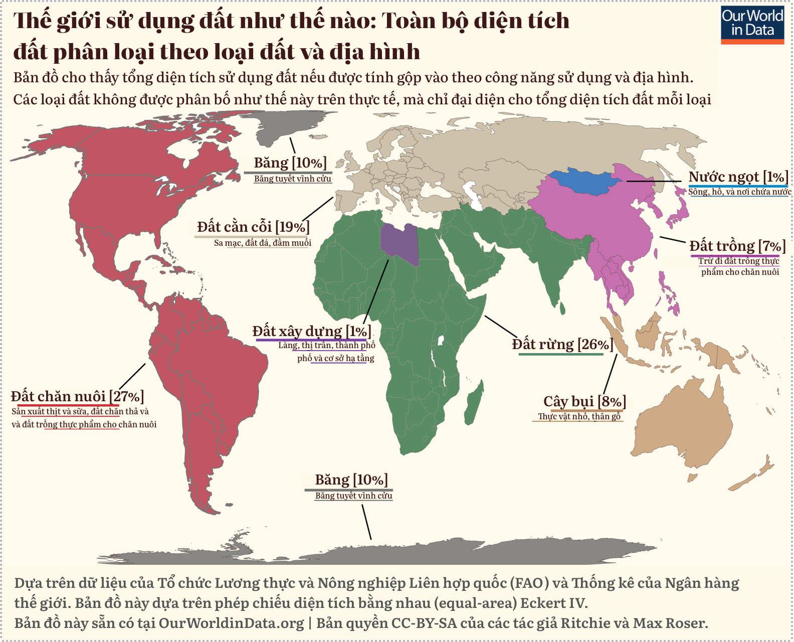

# Tránh ăn thịt và sữa là “cách tốt nhất” để giảm tác động của bạn lên Trái đất

**Phân tích lớn nhất cho đến nay cho thấy dấu chân [sinh thái] khổng lồ của ngành chăn nuôi&mdash;ngành này chỉ cung cấp 18% lượng calo cho con người nhưng sử dụng tới 83% diện tích đất nông nghiệp.**

Theo các nhà khoa học thực hiện phân tích toàn diện nhất cho đến nay về thiệt hại mà ngành nông nghiệp gây ra cho hành tinh, tránh ăn thịt và tiêu thụ các sản phẩm từ sữa là cách tốt nhất để giảm tác động lên trái đất.

Nghiên cứu mới cho thấy **nếu không tiêu thụ thịt và sữa, việc sử dụng đất nông nghiệp toàn cầu có thể giảm hơn 75%&mdash;tương đương với diện tích nước Mỹ, Trung Quốc, Liên minh Châu Âu và Úc cộng lại&mdash;mà vẫn đủ cung cấp lương thực cho thế giới**. Các vùng đất hoang dã bị mất để làm nông nghiệp hiện là nguyên nhân hàng đầu dẫn đến sự tuyệt chủng hàng loạt các loài động vật hoang dã.

??? quote "Diện tích sử dụng đất được tính theo phần trăm đất trên toàn cầu (trong dấu ngoặc vuông)"

    - Đất trồng (màu hồng) là toàn bộ diện tích đất trồng trừ đi diện tích đất thực phẩm để nuôi động vật.
	- Đất chăn nuôi (màu đỏ) bao gồm cả đất chăn thả và đất trồng thực phẩm nuôi động vật.
	- Đất cằn cỗi là đất mà trên đó thực vật chỉ che phủ ít it hơn 1/3 diện tích.

Phân tích mới cho thấy, **mặc dù thịt và sữa chỉ cung cấp 18% lượng calo và 37% đạm [cho con người] nhưng chúng sử dụng phần lớn&mdash;83%&mdash;đất nông nghiệp và tạo ra 60% lượng khí thải nhà kính trong nông nghiệp**. Nghiên cứu khác gần đây cho thấy **86% tổng số động vật có vú trên cạn hiện nay hoặc là động vật nuôi hoặc là con người**. Các nhà khoa học cũng phát hiện ra rằng ngay cả những sản phẩm thịt và sữa có tác động thấp nhất vẫn gây ra nhiều tác hại cho môi trường hơn so với việc trồng rau và ngũ cốc kém bền vững nhất.

<html><head>
<meta http-equiv="content-type" content="text/html; charset=UTF-8">
    <meta charset="utf-8">
    
  </head>
    <body>
<header class="header">
Hơn 80% đất trồng được sử dụng cho chăn nuôi trong khi chỉ sản xuất được 18% lượng calo thực phẩm và 37% đạm cho con người

Đóng góp từ thực phẩm có nguồn gốc động vật

Đóng góp tính theo Phần trăm (%)
</header>
<!-- react-empty: 227 -->

0%

25

50

75

100

Lượng Calo 18%

Đạm 37%

Sử dụng đất 83%

Khí nhà kính 58%

Ô nhiễm nước 57%

Ô nhiễm không khí 56%

Sử dụng nước ngọt 33%

<!-- react-empty: 385 -->
<footer class="">Guardian Graphic | Nguồn: Poore and Nemecek, Science</footer>

    
</body></html>

Nghiên cứu được công bố trên tạp chí Science đã tạo ra một bộ dữ liệu khổng lồ dựa trên gần 40.000 trang trại ở 119 quốc gia và bao gồm 40 sản phẩm thực phẩm chiếm 90% tổng lượng thức ăn được tiêu thụ. Nó đã đánh giá tác động đầy đủ của những loại thực phẩm này, từ trang trại đến bàn ăn, đối với việc sử dụng đất, phát thải gây biến đổi khí hậu, sử dụng nước ngọt và ô nhiễm nước (hiện tượng **phì dưỡng**, *eutrophication*) và **axit hóa** (*acidification*) đất.

Joseph Poore, tại Đại học Oxford, Vương quốc Anh, người đứng đầu nghiên cứu cho biết: “Chế độ ăn thuần thực vật có lẽ là cách tốt nhất để giảm tác động của bạn lên hành tinh Trái đất, [thông qua] không chỉ khí nhà kính mà còn cả [vấn đề] axit hóa toàn cầu, hiện tượng phì dưỡng, việc sử dụng đất và nước”. Ông nói: “Điều này [có tác động] lớn hơn nhiều so với việc cắt giảm các chuyến bay hay mua một chiếc ô tô điện”, vì những việc trên chỉ làm giảm lượng khí thải nhà kính.

“Nông nghiệp là một lĩnh vực có đầy đủ các vấn đề về môi trường”, ông nói. “Thực sự các sản phẩm từ động vật là nguyên nhân gây ra rất nhiều vấn đề trong số này. Tránh tiêu thụ các sản phẩm từ động vật mang lại lợi ích môi trường tốt hơn nhiều so với việc cố gắng mua thịt và sữa [được sản xuất] bền vững”.

Phân tích cũng cho thấy sự khác biệt lớn giữa các cách khác nhau để sản xuất cùng một loại thực phẩm. Ví dụ, bò thịt được nuôi trên đất bị phá rừng thải ra lượng khí nhà kính nhiều hơn 12 lần và sử dụng đất nhiều hơn 50 lần so với chăn thả trên đồng cỏ tự nhiên trù phú. Mặc dù vậy, việc so sánh thịt bò với đạm thực vật như đậu Hà Lan đã chỉ ra rất rõ ràng, ngay cả loại thịt bò có tác động thấp nhất cũng chịu trách nhiệm thải ra lượng khí nhà kính nhiều gấp 6 lần và sử dụng diện tích đất nhiều hơn gấp 36 lần.

<html><head>
<meta http-equiv="content-type" content="text/html; charset=UTF-8">
    <meta charset="utf-8">
    
    </head>
    <body>
<header class="header">
Thịt bò tạo ra 105kg khí nhà kính trong khi đậu phụ sản sinh ít hơn 3,5kg trên mỗi 100g đạm

Phạm vi khí thải nhà kính khi sản xuất 100g (tính theo kg) đạm

10% thấp nhất

90% các trường hợp

</header>
<!-- react-empty: 517 -->

20kg

40kg

60kg

80kg

100kg

Thịt bò

Thịt giáp xác

Thịt Cừu

Bò sữa

Pho-mát

Thịt lợn

Thịt gà

Cá (nuôi)

Trứng

Đậu phụ

Quả hạch

Lạc

Đậu khác

Đậu Hà Lan

<!-- react-empty: 752 -->
<footer class="">Guardian Graphic | Nguồn: Poore and Nemecek, Science</footer>

  
    
</body></html>

Poore cho biết, sự khác biệt lớn về tác động môi trường từ các trang trại khác nhau mang đến cơ hội giảm thiểu tác hại mà không cần dân số toàn cầu chuyển sang ăn thuần thực vật. **Nếu một nửa sản lượng thịt và sữa gây hại nhất được thay thế bằng thực phẩm có nguồn gốc thực vật, thì điều này vẫn mang lại khoảng 2/3 lợi ích của việc loại bỏ hoàn toàn sản xuất thịt và sữa.**

Việc cắt giảm tác động đến môi trường của hoạt động nông nghiệp không phải là điều dễ dàng, Poore cảnh báo: “Có hơn 570 triệu trang trại, tất cả đều cần những cách hơi khác nhau để giảm thiểu tác động. Đó là một thách thức [môi trường] không giống bất kỳ lĩnh vực nào khác của nền kinh tế”. Nhưng ông cho biết, ít nhất 500 tỷ Đô-la Mỹ được chi hàng năm cho **trợ cấp nông nghiệp** (*agricultural subsidies*) và có thể còn nhiều hơn thế: “Có rất nhiều tiền [như thế] để làm được điều gì đó thực sự có ích”.

Nhãn thực phẩm tiết lộ các tác động của sản phẩm sẽ là một khởi đầu tốt, từ đó người tiêu dùng có thể đưa ra những lựa chọn ít gây hại nhất, ông nói. Nhưng trợ cấp cho thực phẩm bền vững và tốt cho sức khỏe cũng như việc đánh thuế đối với thịt và sữa có thể cũng sẽ cần thiết.

Một điều ngạc nhiên từ nghiên cứu này là tác động lớn của việc nuôi cá nước ngọt, nơi cung cấp 2/3 lượng cá ở châu Á và 96% ở châu Âu, được cho là tương đối thân thiện với môi trường. Poore cho biết: “Bạn có tất cả số cá này [thường xuyên] thải phân và thức ăn thừa xuống đáy ao, nơi hầu như không có ôxy, khiến nơi đây trở thành môi trường hoàn hảo để sản sinh khí mê-tan”, một loại khí nhà kính mạnh.

Nghiên cứu cũng cho thấy thịt bò ăn cỏ, được cho là có tác động tương đối thấp, vẫn gây ra tác động cao hơn nhiều so với thực phẩm có nguồn gốc thực vật. “Biến cỏ thành [thịt] cũng giống như biến than thành năng lượng. Nó đi kèm với chi phí phát thải rất lớn”, Poore nói.

Nghiên cứu mới đã nhận được sự khen ngợi mạnh mẽ từ các chuyên gia thực phẩm khác. Giáo sư Gidon Eshel, tại Đại học Bard, Mỹ, cho biết: “Tôi rất kinh ngạc. Nghiên cứu này thực sự quan trọng, có căn cứ, đầy tham vọng, rõ ràng và được thực hiện rất tốt”.

Ông cho biết công việc trước đây về định lượng tác động của nông nghiệp, bao gồm cả của ông, đã áp dụng **cách tiếp cận từ trên xuống** (*top-down approach*) bằng cách sử dụng dữ liệu cấp quốc gia, nhưng nghiên cứu mới sử dụng **cách tiếp cận từ dưới lên** (*bottom-up approach*), với dữ liệu của từng trang trại. “Thật yên tâm khi thấy cả hai cách tiếp cận đều mang lại kết quả cơ bản giống nhau. Nhưng nghiên cứu mới có rất nhiều chi tiết quan trọng được tiết lộ”.

Giáo sư Tim Benton, tại Đại học Leeds, Anh, cho biết: “Đây là một nghiên cứu vô cùng hữu ích. Nó tập hợp một lượng lớn dữ liệu và điều đó làm cho kết luận của nó trở nên chắc chắn hơn nhiều. Cách chúng ta sản xuất, tiêu thụ và lãng phí thực phẩm là không bền vững xét từ góc độ hành tinh. Với cuộc khủng hoảng béo phì toàn cầu, việc thay đổi chế độ ăn uống&mdash;ăn ít sản phẩm chăn nuôi và nhiều rau và trái cây hơn&mdash;có khả năng giúp cả chúng ta và hành tinh khỏe mạnh hơn”.

Tiến sĩ Peter Alexander, tại Đại học Edinburgh, Vương quốc Anh, cũng rất ấn tượng nhưng lưu ý: “Có thể có những lợi ích về môi trường, ví dụ như đối với đa dạng sinh học, từ việc chăn thả được quản lý bền vững và tăng cường tiêu thụ sản phẩm động vật có thể cải thiện dinh dưỡng cho một số người nghèo nhất trên toàn cầu. Ý kiến cá nhân của tôi là chúng ta nên hiểu thích những kết quả này không phải là sự cần thiết phải chuyển sang ăn thuần thực vật chỉ sau một đêm mà là để tiết chế việc tiêu thụ [thịt] của mình”.

Poore nói: “Lý do tôi bắt đầu dự án này là để tìm hiểu xem liệu ngoài kia có những người chăn nuôi động vật bền vững hay không. Nhưng tôi đã ngừng tiêu thụ sản phẩm từ động vật từ bốn năm gần đây trong dự án này. Những tác động [từ việc tiêu thụ sản phẩm động vật] là không cần thiết để duy trì lối sống hiện tại của chúng ta. Câu hỏi đặt ra là chúng ta có thể giảm tiêu thụ đến mức nào và câu trả lời là rất nhiều”.

**Tác giả:** **Damian Carrington**, Biên tập viên mục Môi trường, báo Guardian

[Avoiding meat and dairy is ‘single biggest way’ to reduce your impact on Earth](https://www.theguardian.com/environment/2018/may/31/avoiding-meat-and-dairy-is-single-biggest-way-to-reduce-your-impact-on-earth)

